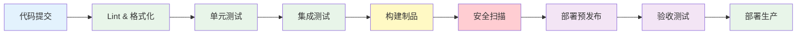

## GitHub Actions实战

GitHub Actions 是 GitHub 原生的 CI/CD 自动化平台，自 2019 年正式发布以来，已经成为全球使用最广泛的持续集成工具之一。据 Octoverse 2023 报告，超过 1 亿个仓库使用了 GitHub Actions，月活跃工作流运行次数超过 280 亿次。它的核心优势在于与 GitHub 生态的深度集成——代码推送、Pull Request、Issue 创建等事件天然就是触发器，无需额外配置 Webhook。

本节将从流水线设计原理出发，逐步覆盖工作流语法核心、缓存优化策略、矩阵构建、Secret 安全管理、常用 Actions 生态，最终给出一套可直接复用的生产级 CI/CD 配置模板。

---

### 1. 流水线设计原理

在动手编写 YAML 之前，需要先理解流水线设计的核心原则。一个设计良好的 CI/CD 流水线不是"把所有步骤串起来"，而是经过精心设计的**分阶段、可并行、可复用**的自动化流程。

#### 1.1 流水线的核心目标

| 目标 | 含义 | 衡量标准 |
|------|------|----------|
| **快速反馈** | 开发者提交代码后尽快知道是否有问题 | 从 push 到首个结果 < 10 分钟 |
| **可靠执行** | 同样的代码、同样的配置，结果必须一致 | 构建"雪花"问题发生率 < 1% |
| **环境一致性** | 开发、测试、预发布、生产环境尽量一致 | 容器化构建 + 不可变制品 |
| **安全可控** | 敏感信息不泄露，权限最小化 | Secrets 零硬编码，权限按需分配 |
| **可维护性** | 流水线本身也是代码，需要版本管理和复用 | 拆分可复用 Workflow、使用 Composite Action |

#### 1.2 阶段划分模型

一条完整的 CI/CD 流水线通常包含以下阶段，每个阶段有不同的关注点和优化策略：



**关键设计原则：快速失败（Fail Fast）**。把执行最快、最可能失败的步骤放在前面。Lint 检查通常在几秒内完成，而完整测试可能需要几分钟。如果 Lint 就失败了，就不需要浪费资源运行测试。实际执行顺序应遵循"快→慢→重"的梯度。

#### 1.3 触发策略设计

触发器决定了"什么时候运行流水线"。GitHub Actions 支持丰富的事件触发：

| 触发事件 | 典型场景 | 推荐用法 |
|----------|----------|----------|
| `push` | 代码推送到特定分支 | 仅对 main/develop 分支触发完整流水线 |
| `pull_request` | PR 创建或更新 | 触发快速检查（Lint + 单元测试），不部署 |
| `workflow_dispatch` | 手动触发 | 用于紧急部署、测试环境重置等运维操作 |
| `schedule` | 定时触发 | 每日安全扫描、依赖更新检查、性能基准测试 |
| `release` | 发布 Release | 自动构建并推送 Docker 镜像、更新变更日志 |

```yaml
# 典型的多事件触发配置
on:
  push:
    branches: [main, develop]
    paths-ignore:
      - '**.md'          # 文档变更不触发 CI
      - 'docs/**'
      - '.gitignore'
  pull_request:
    branches: [main]
  workflow_dispatch:      # 手动触发支持
    inputs:
      environment:
        description: '目标部署环境'
        required: true
        default: 'staging'
        type: choice
        options:
          - staging
          - production
      skip_tests:
        description: '跳过测试（紧急修复）'
        required: false
        default: false
        type: boolean
  schedule:
    - cron: '0 2 * * 1'  # 每周一凌晨2点
```

`paths-ignore` 是一个非常实用的优化：如果你只改了 README.md 或文档目录，不需要触发完整的构建和测试流程，节省 CI 时间和费用。

---

### 2. GitHub Actions 工作流语法精讲

GitHub Actions 使用 YAML 语法定义工作流，文件放在 `.github/workflows/` 目录下。以下是核心语法的深度解析。

#### 2.1 工作流基本结构

```yaml
name: CI Pipeline          # 工作流名称（显示在 Actions 标签页）

on:                        # 触发条件（见上文）
  push:
    branches: [main]

env:                       # 全局环境变量（所有 job 共享）
  GO_VERSION: '1.22'
  REGISTRY: ghcr.io
  IMAGE_NAME: ${{ github.repository }}

jobs:                      # 任务集合（默认并行执行）
  job-id:                  # 任务唯一标识
    name: Human-readable   # 任务显示名称
    runs-on: ubuntu-latest # 运行环境
    timeout-minutes: 30    # 超时保护
    steps:                 # 步骤列表（顺序执行）
      - name: Step name
        uses: action@v1    # 使用预构建 Action
      - name: Shell step
        run: echo "hello"  # 直接执行 Shell 命令
```

#### 2.2 条件表达式（if）

条件表达式是控制步骤是否执行的核心机制，使用 GitHub Expressions 语法：

```yaml
steps:
  # 仅在 main 分支的 push 事件时运行
  - name: Deploy to production
    if: github.ref == 'refs/heads/main' &amp;&amp; github.event_name == 'push'
    run: echo "Deploying..."

  # 仅在 PR 且不是 fork 仓库时运行（避免 Secrets 泄露）
  - name: Run integration tests
    if: github.event_name == 'pull_request' &amp;&amp; github.event.pull_request.head.repo.full_name == github.repository

  # 基于前一步结果条件执行
  - name: Build
    id: build
    run: echo "version=1.0.0" >> $GITHUB_OUTPUT

  - name: Upload artifact
    if: steps.build.outcome == 'success'
    uses: actions/upload-artifact@v4
    with:
      name: build-output
      path: dist/
```

**常见陷阱**：`if` 表达式中的字符串比较用 `==` 而不是 `-eq`；布尔值直接写 `if: steps.build.outcome` 而不是 `if: steps.build.outcome == true`。

#### 2.3 Outputs 与数据传递

Job 之间和 Step 之间的数据传递是流水线编排的关键能力：

```yaml
jobs:
  build:
    runs-on: ubuntu-latest
    outputs:
      version: ${{ steps.version.outputs.tag }}
      image_id: ${{ steps.docker.outputs.image_id }}
    steps:
      - name: Calculate version
        id: version
        run: echo "tag=v$(date +'%Y%m%d')-$(echo $GITHUB_SHA | cut -c1-7)" >> $GITHUB_OUTPUT

      - name: Build Docker image
        id: docker
        run: |
          IMAGE_ID=$(docker build -t myapp:${{ steps.version.outputs.tag }} . --quiet)
          echo "image_id=$IMAGE_ID" >> $GITHUB_OUTPUT

  deploy:
    needs: build
    runs-on: ubuntu-latest
    steps:
      - name: Deploy
        run: echo "Deploying image ${{ needs.build.outputs.image_id }}"
```

**注意**：使用 `>> $GITHUB_OUTPUT` 语法（2022 年后的新语法，旧的 `::set-output` 已弃用且有安全风险）。

#### 2.4 矩阵构建（Matrix Strategy）

矩阵构建让你用一套配置同时测试多个版本、平台或组合，是保证兼容性的利器：

```yaml
jobs:
  test:
    runs-on: ${{ matrix.os }}
    strategy:
      fail-fast: false    # 一个组合失败不取消其他组合
      matrix:
        os: [ubuntu-latest, windows-latest, macos-latest]
        node-version: [18, 20, 22]
        exclude:
          - os: windows-latest
            node-version: 18    # 排除特定组合
        include:
          - os: ubuntu-latest
            node-version: 22
            experimental: true  # 添加额外字段
    steps:
      - uses: actions/checkout@v4
      - name: Use Node.js ${{ matrix.node-version }}
        uses: actions/setup-node@v4
        with:
          node-version: ${{ matrix.node-version }}
          cache: 'npm'
      - run: npm ci
      - run: npm test
```

**矩阵构建的代价意识**：矩阵是笛卡尔积，3 OS × 3 Node = 9 个并行 Job。每个 Job 都需要分配 Runner、安装依赖、运行测试。对于开源项目，GitHub 免费提供 2000 分钟/月的 Linux Runner 时间，Windows ×2、macOS ×10 的计费倍率意味着 macOS 矩阵会快速消耗额度。建议只在 main 分支的 push 或定时构建中使用完整矩阵，PR 只跑核心组合。

#### 2.5 可复用工作流（Reusable Workflows）

当多个项目有相似的 CI/CD 流程时，可以将公共逻辑提取为可复用工作流：

```yaml
# .github/workflows/reusable-ci.yml（定义端）
name: Reusable CI
on:
  workflow_call:
    inputs:
      go-version:
        required: false
        type: string
        default: '1.22'
      run-integration-tests:
        required: false
        type: boolean
        default: false
    secrets:
      codecov-token:
        required: true

jobs:
  build-and-test:
    runs-on: ubuntu-latest
    steps:
      - uses: actions/checkout@v4
      - uses: actions/setup-go@v5
        with:
          go-version: ${{ inputs.go-version }}
      - run: go test -coverprofile=coverage.out ./...
      - uses: codecov/codecov-action@v3
        with:
          token: ${{ secrets.codecov-token }}
```

```yaml
# .github/workflows/ci.yml（消费端）
name: CI
on: [push, pull_request]

jobs:
  ci:
    uses: ./.github/workflows/reusable-ci.yml
    with:
      go-version: '1.22'
      run-integration-tests: true
    secrets:
      codecov-token: ${{ secrets.CODECOV_TOKEN }}
```

这样所有子项目只需引用一个 `uses` 就能获得完整的 CI 能力，修改公共流程时只改一处。

---

### 3. 缓存优化策略

缓存是提升 CI/CD 速度最有效的手段之一。没有缓存时，每次构建都需要从零安装所有依赖，一个中等规模 Node.js 项目的 `npm install` 可能需要 2-5 分钟。合理配置缓存可以将这一步缩短到 10 秒以内。

#### 3.1 依赖缓存

GitHub 官方提供了 `setup-*` 系列 Action 的内置缓存支持：

```yaml
steps:
  # Node.js 依赖缓存（推荐）
  - uses: actions/setup-node@v4
    with:
      node-version: '20'
      cache: 'npm'          # 自动缓存 ~/.npm

  # Go 模块缓存
  - uses: actions/setup-go@v5
    with:
      go-version: '1.22'
      cache: true           # 自动缓存 ~/go/pkg/mod 和 ~/.cache/go-build

  # Python 依赖缓存
  - uses: actions/setup-python@v5
    with:
      python-version: '3.12'
      cache: 'pip'          # 自动缓存 pip 下载缓存
```

对于 `setup-*` 不支持的语言或工具，使用通用缓存 Action：

```yaml
steps:
  - name: Cache Rust dependencies
    uses: actions/cache@v4
    with:
      path: |
        ~/.cargo/registry
        ~/.cargo/git
        target
      key: cargo-${{ runner.os }}-${{ hashFiles('**/Cargo.lock') }}
      restore-keys: |
        cargo-${{ runner.os }}-
```

#### 3.2 缓存键（Cache Key）设计原则

缓存键的设计直接决定缓存命中率和正确性：

| 策略 | 缓存键示例 | 适用场景 | 优缺点 |
|------|-----------|----------|--------|
| 精确匹配 | `deps-${{ hashFiles('**/package-lock.json') }}` | 依赖严格锁定 | 最精确，但 lock 文件小幅变动就失效 |
| 前缀匹配 | `deps-node18-${{ hashFiles('**/package-lock.json') }}` | 多版本并存 | 避免不同 Node 版本缓存交叉 |
| 渐进回退 | `restore-keys: deps-node18-` | 追求速度 | 优先精确命中，否则用上次缓存（可能部分有效） |
| 时间戳 | `deps-${{ github.run_id }}` | 强制刷新 | 几乎不复用，只在调试时使用 |

**黄金规则**：用 `hashFiles()` 对依赖描述文件（lock 文件）取哈希作为缓存键，配合 `restore-keys` 做渐进回退。这样依赖没变时精确命中，依赖变了时也能复用未变更的部分。

#### 3.3 Docker 层缓存

Docker 构建是 CI 中最耗时的环节之一。利用 Docker 层缓存可以将构建时间从 10+ 分钟缩短到 1-2 分钟：

```yaml
steps:
  - name: Build and push Docker image
    uses: docker/build-push-action@v5
    with:
      context: .
      push: true
      tags: myapp:${{ github.sha }}
      cache-from: type=gha         # 从 GitHub Actions 缓存读取
      cache-to: type=gha,mode=max  # 写入缓存（保留所有层）
```

**Dockerfile 最佳实践**（与缓存配合）：把变化频率低的指令放在前面，变化频率高的放在后面。

```dockerfile
# 好的顺序：变化少的在前，变化多的在后
FROM golang:1.22-alpine AS builder

# 第1层：系统依赖（几乎不变）
RUN apk add --no-cache git

# 第2层：Go 模块依赖（仅 go.mod/go.sum 变化时重建）
WORKDIR /app
COPY go.mod go.sum ./
RUN go mod download

# 第3层：源代码（每次提交都变化）
COPY . .
RUN go build -o /app/server .

# 第4层：运行时镜像（极少变化）
FROM alpine:3.19
COPY --from=builder /app/server /server
CMD ["/server"]
```

这样当只修改了业务代码（第3层），前面的系统依赖层和模块依赖层都命中缓存，只有第3-4层需要重新构建。

---

### 4. Secret 安全管理

Secrets 管理是 CI/CD 安全中最容易出问题的环节。硬编码的密钥、不当的日志输出、过大的权限范围都是常见的安全事故来源。

#### 4.1 GitHub Secrets 机制

GitHub 提供三级 Secrets 存储：

| 级别 | 存储位置 | 访问范围 | 适用场景 |
|------|----------|----------|----------|
| **Repository Secrets** | 仓库设置 → Secrets | 当前仓库所有 Workflow | 项目级 API Key、部署凭证 |
| **Environment Secrets** | 环境设置 → Secrets | 关联该环境的 Job | 生产环境数据库密码等高敏感信息 |
| **Organization Secrets** | 组织设置 → Secrets | 指定仓库可读 | 共享的 Codecov Token、Docker Hub 凭证 |

**关键安全特性**：

- Secrets 写入后不可查看，只能更新或删除
- Secrets 不会出现在日志中——GitHub 会自动用 `***` 替换
- Secrets 对 `pull_request` 事件默认不可用（防止 fork 仓库的 PR 泄露）
- Secrets 不能传递给 `workflow_dispatch` 手动触发的输入参数

#### 4.2 常见安全陷阱与防护

**陷阱一：Shell 展开导致泄露**

```yaml
# 危险！如果命令中拼接了 Secret，可能在错误信息中泄露
- run: curl -H "Authorization: Bearer ${{ secrets.MY_TOKEN }}" https://api.example.com

# 安全：通过环境变量传递
- run: curl -H "Authorization: Bearer $API_TOKEN" https://api.example.com
  env:
    API_TOKEN: ${{ secrets.MY_TOKEN }}
```

**陷阱二：第三方 Action 的权限过宽**

```yaml
# 最小权限原则：只授予必要的权限
permissions:
  contents: read        # 只读代码
  packages: write       # 需要推送 Docker 镜像
  pull-requests: write  # 需要在 PR 上留评论
  # 不要使用 permissions: write-all 或去掉此字段
```

**陷阱三：调试输出泄露 Secret**

```yaml
# 危险！调试时不小心打印了环境变量
- run: env | grep TOKEN

# 安全：调试时排除敏感变量
- run: env | grep -v TOKEN | grep -v PASSWORD | grep -v KEY
```

#### 4.3 高级 Secret 管理模式

对于需要动态凭证的场景，使用 OIDC（OpenID Connect）短期令牌代替长期 Secret：

```yaml
# OIDC：GitHub 自动管理的短期凭证，无需存储长期密钥
permissions:
  id-token: write    # 允许获取 OIDC Token
  contents: read

steps:
  - name: Configure AWS credentials
    uses: aws-actions/configure-aws-credentials@v4
    with:
      role-to-assume: arn:aws:iam::123456789012:role/github-actions
      aws-region: ap-southeast-1

  # 此后的 aws 命令自动使用临时凭证，无需 AWS_ACCESS_KEY_ID
  - run: aws s3 sync dist/ s3://my-bucket/
```

OIDC 模式的安全优势：没有长期密钥存储在 GitHub Secrets 中，即使 GitHub 侧泄露，攻击者也只能获得几分钟有效期的临时凭证。

---

### 5. 常用 Actions 生态

GitHub Actions Marketplace 上有超过 20,000 个社区 Action。以下是生产环境中最常用的核心 Actions 和使用建议。

#### 5.1 核心 Actions 清单

| 类别 | Action | 用途 | 版本建议 |
|------|--------|------|----------|
| **代码检出** | `actions/checkout` | 拉取仓库代码 | `@v4` |
| **语言环境** | `actions/setup-node` | Node.js 环境 | `@v4` |
| | `actions/setup-go` | Go 环境 | `@v5` |
| | `actions/setup-python` | Python 环境 | `@v5` |
| | `actions/setup-java` | Java 环境 | `@v4` |
| **缓存** | `actions/cache` | 通用依赖缓存 | `@v4` |
| **制品** | `actions/upload-artifact` | 上传构建产物 | `@v4` |
| | `actions/download-artifact` | 下载构建产物 | `@v4` |
| **Docker** | `docker/build-push-action` | 构建并推送镜像 | `@v5` |
| | `docker/login-action` | 登录容器仓库 | `@v3` |
| | `docker/metadata-action` | 自动生成镜像标签 | `@v5` |
| **安全** | `github/codeql-action` | 代码安全扫描 | `@v3` |
| | `step-security/harden-runner` | Runner 安全加固 | `@v2` |
| **部署** | `peaceiris/actions-gh-pages` | 部署到 GitHub Pages | `@v3` |
| **通知** | `slackapi/slack-github-action` | Slack 通知 | `@v1` |

#### 5.2 选择第三方 Action 的安全清单

在使用 Marketplace 上的第三方 Action 之前，务必检查：

1. **官方/知名组织维护**：优先选择 `actions/*`（GitHub 官方）、`docker/*`、`aws/*` 等官方维护的 Action
2. **锁定版本**：使用完整的 commit SHA 而非 tag（tag 可被覆盖，SHA 不可变）
3. **检查源代码**：至少阅读 `action.yml` 和主要脚本，确认没有可疑的 `post` 步骤或数据外传行为
4. **检查 Fork 状态**：Fork 的 Action 不会继承原仓库的信任链

```yaml
# 推荐：使用 commit SHA 锁定版本
- uses: actions/checkout@b4ffde65f46336ab88eb53be808477a3936bae11  # v4.1.1

# 可接受：使用 major version tag（有官方维护保证）
- uses: actions/checkout@v4

# 不推荐：使用未锁定的 ref（可能被供应链攻击）
- uses: random-user/checkout-action@main
```

---

### 6. 完整生产级模板

以下是一个面向 Go 项目的完整 CI/CD 流水线模板，覆盖了前面讨论的所有最佳实践：矩阵构建、缓存、Secrets 管理、Docker 构建、多环境部署。

```yaml
# .github/workflows/ci.yml — 生产级 CI/CD 流水线模板
name: CI/CD Pipeline

on:
  push:
    branches: [main, develop]
    paths-ignore:
      - '**.md'
      - 'docs/**'
  pull_request:
    branches: [main]
  workflow_dispatch:
    inputs:
      deploy_environment:
        description: '目标部署环境'
        required: true
        default: 'staging'
        type: choice
        options: [staging, production]

# 全局环境变量
env:
  GO_VERSION: '1.22'
  REGISTRY: ghcr.io
  IMAGE_NAME: ${{ github.repository_owner }}/myapp

# 默认权限最小化
permissions:
  contents: read
  packages: write

jobs:
  # ============================================================
  # 阶段 1：代码质量检查（快速反馈，< 1 分钟）
  # ============================================================
  lint:
    name: "Lint &amp; Format"
    runs-on: ubuntu-latest
    steps:
      - uses: actions/checkout@v4

      - uses: actions/setup-go@v5
        with:
          go-version: ${{ env.GO_VERSION }}
          cache: true

      - name: Run golangci-lint
        uses: golangci/golangci-lint-action@v4
        with:
          version: latest
          args: --timeout=5m

      - name: Check go fmt
        run: |
          if [ -n "$(gofmt -l .)" ]; then
            echo "以下文件需要格式化："
            gofmt -l .
            exit 1
          fi

  # ============================================================
  # 阶段 2：单元测试 + 覆盖率
  # ============================================================
  test:
    name: "Test (Go ${{ matrix.go-version }})"
    runs-on: ubuntu-latest
    needs: lint
    strategy:
      fail-fast: true
      matrix:
        go-version: ['1.21', '1.22']
    steps:
      - uses: actions/checkout@v4

      - uses: actions/setup-go@v5
        with:
          go-version: ${{ matrix.go-version }}
          cache: true

      - name: Run unit tests
        run: |
          go test -v -race -coverprofile=coverage.out -covermode=atomic ./...
        env:
          CGO_ENABLED: 1

      - name: Check coverage threshold
        run: |
          COVERAGE=$(go tool cover -func=coverage.out | grep total | awk '{print $3}' | tr -d '%')
          echo "测试覆盖率: ${COVERAGE}%"
          if (( $(echo "$COVERAGE < 70" | bc -l) )); then
            echo "::error::覆盖率 ${COVERAGE}% 低于阈值 70%"
            exit 1
          fi

      - name: Upload coverage to Codecov
        if: matrix.go-version == '1.22'
        uses: codecov/codecov-action@v3
        with:
          token: ${{ secrets.CODECOV_TOKEN }}
          files: coverage.out
          flags: unittests

  # ============================================================
  # 阶段 3：构建镜像（仅 main 分支）
  # ============================================================
  build:
    name: "Build &amp; Push Image"
    runs-on: ubuntu-latest
    needs: test
    if: github.ref == 'refs/heads/main' || github.event_name == 'workflow_dispatch'
    outputs:
      image_tag: ${{ steps.meta.outputs.version }}
      image_digest: ${{ steps.build.outputs.digest }}
    steps:
      - uses: actions/checkout@v4

      - name: Docker meta
        id: meta
        uses: docker/metadata-action@v5
        with:
          images: ${{ env.REGISTRY }}/${{ env.IMAGE_NAME }}
          tags: |
            type=sha,prefix=
            type=raw,value=latest,enable={{is_default_branch}}
            type=semver,pattern={{version}}

      - name: Login to GHCR
        uses: docker/login-action@v3
        with:
          registry: ${{ env.REGISTRY }}
          username: ${{ github.actor }}
          password: ${{ secrets.GITHUB_TOKEN }}

      - name: Build and push
        id: build
        uses: docker/build-push-action@v5
        with:
          context: .
          push: true
          tags: ${{ steps.meta.outputs.tags }}
          labels: ${{ steps.meta.outputs.labels }}
          cache-from: type=gha
          cache-to: type=gha,mode=max

  # ============================================================
  # 阶段 4：部署到 Staging
  # ============================================================
  deploy-staging:
    name: "Deploy to Staging"
    runs-on: ubuntu-latest
    needs: build
    if: github.ref == 'refs/heads/main'
    environment:
      name: staging
      url: https://staging.myapp.com
    steps:
      - name: Deploy to staging
        run: |
          echo "Deploying ${{ needs.build.outputs.image_tag }} to staging..."
          # kubectl set image deployment/myapp myapp=${{ env.REGISTRY }}/${{ env.IMAGE_NAME }}:${{ needs.build.outputs.image_tag }} -n staging
          # kubectl rollout status deployment/myapp -n staging --timeout=300s
        env:
          KUBECONFIG: ${{ secrets.STAGING_KUBECONFIG }}

      - name: Smoke test
        run: |
          sleep 30
          STATUS=$(curl -s -o /dev/null -w "%{http_code}" https://staging.myapp.com/health)
          if [ "$STATUS" != "200" ]; then
            echo "::error::Staging 健康检查失败，HTTP $STATUS"
            exit 1
          fi
          echo "Staging 健康检查通过 ✓"

  # ============================================================
  # 阶段 5：部署到 Production（手动审批）
  # ============================================================
  deploy-production:
    name: "Deploy to Production"
    runs-on: ubuntu-latest
    needs: deploy-staging
    if: >
      (github.ref == 'refs/heads/main' &amp;&amp; github.event_name == 'push') ||
      (github.event_name == 'workflow_dispatch' &amp;&amp; inputs.deploy_environment == 'production')
    environment:
      name: production
      url: https://myapp.com
    steps:
      - name: Deploy to production
        run: |
          echo "Deploying ${{ needs.build.outputs.image_tag }} to production..."
          # kubectl set image deployment/myapp myapp=${{ env.REGISTRY }}/${{ env.IMAGE_NAME }}:${{ needs.build.outputs.image_tag }} -n production
          # kubectl rollout status deployment/myapp -n production --timeout=300s
        env:
          KUBECONFIG: ${{ secrets.PRODUCTION_KUBECONFIG }}

      - name: Production health check
        run: |
          for i in $(seq 1 12); do
            STATUS=$(curl -s -o /dev/null -w "%{http_code}" https://myapp.com/health)
            if [ "$STATUS" = "200" ]; then
              echo "Production 健康检查通过 ✓"
              exit 0
            fi
            echo "等待服务就绪... ($i/12)"
            sleep 10
          done
          echo "::error::Production 健康检查超时"
          exit 1
```

#### 模板设计要点解析

**1. 阶段递进与依赖关系**

lint → test → build → deploy-staging → deploy-production

每个阶段依赖前一阶段的成功，任一阶段失败会阻断后续阶段。`deploy-production` 依赖 `deploy-staging` 的健康检查通过，形成完整的质量门禁链。

**2. Environment 保护规则**

`deploy-production` 配置了 `environment: production`。你可以在 GitHub 仓库设置中为 production 环境配置：
- **Required reviewers**：部署前必须有人审批
- **Wait timer**：部署前等待 N 分钟（给你回滚的窗口）
- **Deployment branches**：限制只有 main 分支才能部署到生产

**3. 健康检查与自动回滚触发**

生产部署后的健康检查是最后的安全网。模板中使用了重试循环（最多 2 分钟），给容器启动和就绪留出时间。如果最终仍然失败，Workflow 会标记为失败，你可以通过 GitHub API 或通知系统触发回滚。

---

### 7. 性能优化与成本控制

#### 7.1 Runner 选择策略

| Runner 类型 | 费用 | 性能 | 适用场景 |
|-------------|------|------|----------|
| `ubuntu-latest` | 免费额度内免费 | 2 核 7GB | 常规构建、测试 |
| `windows-latest` | 免费额度 ×2 | 2 核 7GB | Windows 特定测试 |
| `macos-latest` | 免费额度 ×10 | 3 核 14GB | iOS/macOS 构建 |
| 自托管 Runner | 仅基础设施成本 | 可自定义 | 大规模构建、GPU 任务 |

**成本优化建议**：
- 矩阵构建中，非核心组合（如旧版本兼容性）改为 cron 定时运行而非每次 push
- 大型 monorepo 使用 `paths` 过滤器，只在相关目录变更时触发对应 Job
- 使用 `concurrency` 配置取消旧的 Workflow 运行（避免重复构建）

```yaml
# 同一分支的多次 push 自动取消旧运行
concurrency:
  group: ${{ github.workflow }}-${{ github.ref }}
  cancel-in-progress: true
```

#### 7.2 调试与排错

**本地测试工作流**：使用 [act](https://github.com/nektos/act) 在本地模拟 GitHub Actions 运行：

```bash
# 安装 act
brew install act          # macOS
curl -s https://raw.githubusercontent.com/nektos/act/master/install.sh | sudo bash  # Linux

# 运行默认 push 事件
act

# 运行指定 job
act -j lint

# 运行特定事件
act workflow_dispatch
```

**Workflow 日志调试**：在 Workflow 配置中启用调试日志：

```yaml
# 仓库 Settings → Secrets → Actions → 新建
# 名称: ACTIONS_STEP_DEBUG
# 值: true
```

这会输出每个 Step 的详细环境变量、表达式求值过程和缓存状态，对排查隐蔽问题非常有价值。

---

### 8. 常见误区与最佳实践

| 误区 | 问题 | 最佳实践 |
|------|------|----------|
| 所有步骤写在一个 Job 里 | 无法并行执行，一个步骤失败要全部重跑 | 按职责拆分 Job，用 `needs` 编排依赖 |
| 使用 `@latest` 或 `@main` 标签 | 可能被供应链攻击或意外行为变更 | 锁定到 commit SHA 或明确的 major version |
| 缺少 `timeout-minutes` | 卡死的 Job 无限消耗 Runner 时间 | 所有 Job 都设置超时（建议 15-30 分钟） |
| 不区分 `push` 和 `pull_request` | PR 也能触发部署，fork PR 可能泄露 Secret | PR 只跑测试，push 才触发构建和部署 |
| 忽略 `fail-fast` | 矩阵中一个失败不影响其他，浪费资源 | 开发阶段 `fail-fast: true`；发布矩阵 `fail-fast: false` |
| 硬编码版本号 | Docker 镜像标签重复或版本不一致 | 使用 `github.sha` 或语义化版本自动生成 |
| 不使用 `concurrency` | 同一分支连续 push 产生多个并行 Workflow | 配置 `cancel-in-progress: true` |

---

### 9. 小结

GitHub Actions 是 CI/CD 实践的基础设施级工具。掌握它的关键不只是"能写 YAML"，而是理解背后的设计原则：

1. **快速反馈**：Lint 放最前，测试用矩阵覆盖，缓存减少重复劳动
2. **安全可控**：Secrets 最小权限、OIDC 短期凭证、第三方 Action 锁定 SHA
3. **可维护性**：拆分 Job 职责、使用可复用工作流、模板化公共配置
4. **成本意识**：缓存命中率、矩阵精简、`paths` 过滤、并发取消

下一节我们将深入蓝绿部署的实现细节——当你的 CI 流水线能稳定产出制品后，如何零停机地把新版本安全地交付给用户。
