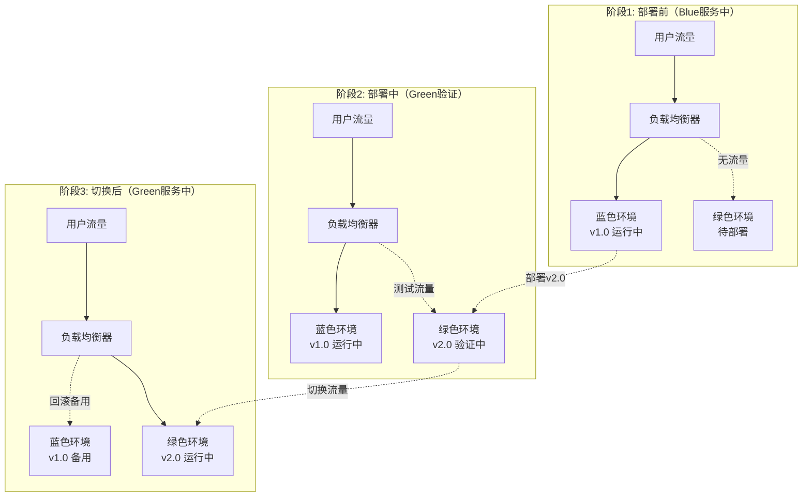
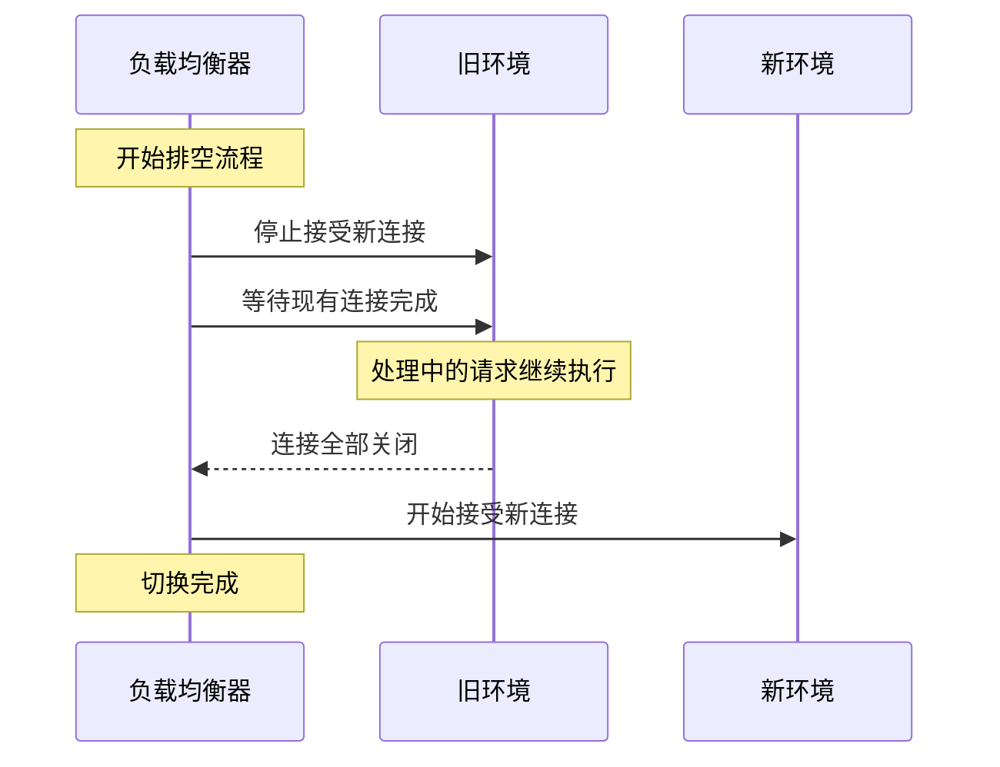
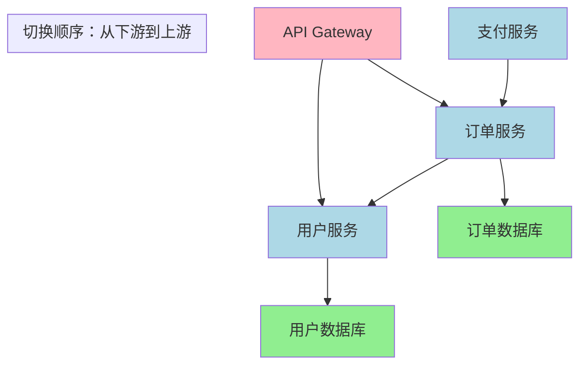
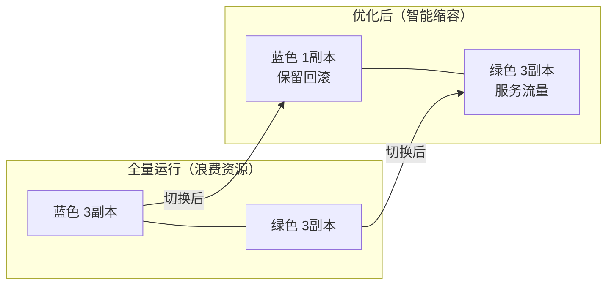
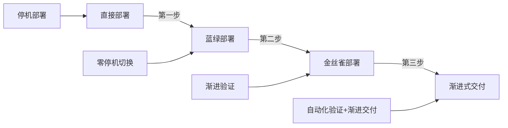

## 蓝绿部署实现

蓝绿部署（Blue-Green Deployment）是一种零停机发布策略，通过维护两套完全相同的生产环境，实现新版本的无缝切换。当新版在"绿色"环境验证通过后，将流量从"蓝色"环境切到"绿色"环境，整个过程对用户完全透明，且能在秒级完成回滚。

这一策略最早由Martin Fowler在2005年提出，其核心理念是**用冗余换安全**——宁愿多花一倍的基础设施成本，也要保证每次发布都可以在秒级回滚到已知的稳定状态。在现代云原生架构中，蓝绿部署已成为核心业务系统的标配发布策略。

---

### 1. 核心概念与原理

#### 1.1 什么是蓝绿部署

蓝绿部署的核心思想是**环境冗余 + 流量切换**。系统同时运行两个完全相同的环境：

- **蓝色环境（Blue）**：当前正在服务生产流量的稳定版本
- **绿色环境（Green）**：部署了新版本代码的预发布环境

两个环境拥有独立的应用实例、数据库连接和网络配置，但共享同一个负载均衡器或入口网关。部署时，先在绿色环境完成部署和验证，然后通过修改路由规则将流量一次性切换到绿色环境。

关键设计原则：

| 原则 | 含义 | 实现方式 |
|------|------|---------|
| **原子切换** | 流量转移是瞬间完成的，不存在中间状态 | 修改负载均衡器路由规则 |
| **环境等价** | 蓝绿两套环境的配置、网络、资源完全一致 | 共享同一套配置模板 |
| **回滚零成本** | 回滚只是把路由切回原来的环境 | 旧环境保持运行状态 |
| **验证先行** | 切换前必须通过健康检查和烟雾测试 | 自动化验证脚本 |

#### 1.2 与其他部署策略的本质区别

| 部署策略 | 核心机制 | 停机时间 | 回滚速度 | 资源开销 | 适用场景 |
|---------|---------|---------|---------|---------|---------|
| **蓝绿部署** | 双环境 + 路由切换 | 零 | 秒级 | 2倍 | 核心业务、版本大更新 |
| **金丝雀部署** | 渐进流量切分 | 零 | 分钟级 | 1.1-1.5倍 | 风险验证、性能灰度 |
| **滚动更新** | 逐实例替换 | 可能有 | 分钟级 | 1倍 | 常规更新、资源受限 |
| **直接部署** | 停机替换 | 有 | 最慢 | 1倍 | 开发环境、低优先级服务 |

蓝绿部署的独特优势在于：**切换是原子操作**。与金丝雀部署的渐进式切换不同，蓝绿部署在切换瞬间完成100%流量转移，不存在"部分新版本、部分旧版本"的混合状态，大幅简化了兼容性处理。

但它也有明确的局限：资源开销翻倍、数据库迁移需要特殊处理、有状态服务切换复杂。理解这些局限是正确使用蓝绿部署的前提。

#### 1.3 为什么选择蓝绿部署

选择蓝绿部署的典型场景：

1. **金融/支付系统**：任何停机都意味着直接经济损失，必须保证零停机
2. **核心API服务**：下游依赖方众多，不能承受接口不可用
3. **大规模用户系统**：百万级DAU，每次发布的风险敞口巨大
4. **合规要求**：某些行业要求发布过程可审计、可回滚

不适合蓝绿部署的场景：

1. **资源严重受限**：无法承担2倍资源开销
2. **数据库强耦合**：应用与特定数据库实例绑定，无法共享
3. **极低风险更新**：配置变更、文案修改等无需双环境

#### 1.4 技术原理图解



完整的蓝绿部署生命周期包含五个阶段：

1. **部署阶段**：将新版本部署到非活跃环境（绿色）
2. **验证阶段**：对绿色环境执行健康检查、烟雾测试、性能基线测试
3. **切换阶段**：修改路由规则，将生产流量导向绿色环境
4. **确认阶段**：监控切换后的关键指标（错误率、延迟、吞吐量）
5. **清理阶段**：确认稳定后，可选择保留旧环境（用于回滚）或缩容

---

### 2. 基础实现方案

#### 2.1 基于Nginx的蓝绿部署

Nginx是最常见的蓝绿部署入口，通过`upstream`和`location`配置实现流量切换。这种方式不依赖任何云厂商或容器编排平台，适合传统的物理机/虚拟机部署场景。

**架构设计：**

```nginx
# /etc/nginx/conf.d/bluegreen.conf

# 蓝色环境 upstream
upstream blue_backend {
    server 10.0.1.10:8080 weight=5;
    server 10.0.1.11:8080 weight=5;
}

# 绿色环境 upstream
upstream green_backend {
    server 10.0.2.10:8080 weight=5;
    server 10.0.2.11:8080 weight=5;
}

# 活跃环境标识文件（由部署脚本管理）
# /etc/nginx/conf.d/active_env.conf 内容示例：
# set $active_backend "blue_backend";

server {
    listen 80;
    server_name example.com;
    location / {
        proxy_pass http://$active_backend;
        proxy_set_header Host $host;
        proxy_set_header X-Real-IP $remote_addr;
        proxy_set_header X-Forwarded-For $proxy_add_x_forwarded_for;
        proxy_set_header X-Forwarded-Proto $scheme;

        # 连接超时与重试
        proxy_connect_timeout 5s;
        proxy_read_timeout 60s;
        proxy_send_timeout 60s;
        proxy_next_upstream error timeout http_502 http_503;
    }
}
```

**Nginx配置中的关键参数说明：**

| 参数 | 推荐值 | 作用 |
|------|--------|------|
| `proxy_connect_timeout` | 5s | 与后端建立连接的超时时间 |
| `proxy_read_timeout` | 60s | 等待后端响应的超时时间 |
| `proxy_next_upstream` | error timeout http_502 http_503 | 遇到哪些错误时自动重试下一个后端 |
| `proxy_next_upstream_tries` | 3 | 最多重试几次 |
| `proxy_connect_timeout` | 不宜过长 | 切换时如果新环境有问题，快速失败比长时间等待更好 |

**切换脚本：**

```bash
#!/bin/bash
# bluegreen-switch.sh - Nginx蓝绿切换脚本

set -euo pipefail

ACTIVE_FILE="/etc/nginx/conf.d/active_env.conf"
LOG_FILE="/var/log/bluegreen/switch-$(date +%Y%m%d_%H%M%S).log"

log() {
    echo "[$(date '+%Y-%m-%d %H:%M:%S')] $1" | tee -a "$LOG_FILE"
}

get_active_env() {
    if grep -q 'blue_backend' "$ACTIVE_FILE"; then
        echo "blue"
    else
        echo "green"
    fi
}

switch_to() {
    local target_env=$1
    local current_env
    current_env=$(get_active_env)

    if [ "$current_env" = "$target_env" ]; then
        log "ERROR: 已经在 $target_env 环境上，无需切换"
        exit 1
    fi

    log "当前环境: $current_env"
    log "目标环境: $target_env"

    # 1. 健康检查
    log "检查 $target_env 环境健康状态..."
    local health_ok=true
    for ip in $(get_backend_ips "$target_env"); do
        if ! curl -sf --max-time 5 "http://$ip:8080/health" > /dev/null; then
            log "WARN: $ip 健康检查失败"
            health_ok=false
        fi
    done

    if [ "$health_ok" = false ]; then
        log "ERROR: 目标环境健康检查未通过，中止切换"
        exit 1
    fi

    # 2. 执行切换
    log "切换流量到 $target_env..."
    echo "set \$active_backend \"${target_env}_backend\";" > "$ACTIVE_FILE"

    # 3. 验证Nginx配置
    if ! nginx -t 2>/dev/null; then
        log "ERROR: Nginx配置验证失败，回滚"
        echo "set \$active_backend \"${current_env}_backend\";" > "$ACTIVE_FILE"
        exit 1
    fi

    # 4. 平滑重载Nginx
    nginx -s reload
    log "Nginx已重载"

    # 5. 切换后验证
    sleep 2
    local final_env
    final_env=$(get_active_env)
    if [ "$final_env" != "$target_env" ]; then
        log "ERROR: 切换未生效，当前仍为 $final_env"
        exit 1
    fi

    log "切换完成！当前活跃环境: $target_env"
    log "旧环境 ($current_env) 保留用于回滚"
}

rollback() {
    local current_env
    current_env=$(get_active_env)

    if [ "$current_env" = "blue" ]; then
        log "ERROR: 蓝色环境是基线，无需回滚"
        exit 1
    fi

    log "回滚到蓝色环境..."
    switch_to "blue"
    log "回滚完成"
}

get_backend_ips() {
    local env=$1
    if [ "$env" = "blue" ]; then
        echo "10.0.1.10 10.0.1.11"
    else
        echo "10.0.2.10 10.0.2.11"
    fi
}

# 主入口
case "${1:-}" in
    switch)
        switch_to "${2:-green}"
        ;;
    rollback)
        rollback
        ;;
    status)
        echo "当前活跃环境: $(get_active_env)"
        ;;
    *)
        echo "用法: $0 {switch [blue|green]|rollback|status}"
        exit 1
        ;;
esac
```

#### 2.2 基于Docker Compose的蓝绿部署

适合单机或小规模部署场景，用Docker Compose管理两套环境。

**目录结构：**

bluegreen/
├── docker-compose.blue.yml
├── docker-compose.green.yml
├── nginx/
│   ├── nginx.conf
│   └── active.conf
├── switch.sh
└── deploy.sh

**蓝色环境配置：**

```yaml
# docker-compose.blue.yml
version: '3.8'

services:
  app-blue:
    image: myapp:1.0.0
    container_name: myapp-blue
    environment:
      - APP_ENV=blue
      - DB_HOST=db-primary
      - REDIS_HOST=redis
    ports:
      - "8081:8080"
    networks:
      - app-network
    healthcheck:
      test: ["CMD", "curl", "-f", "http://localhost:8080/health"]
      interval: 10s
      timeout: 5s
      retries: 3
      start_period: 30s
    deploy:
      resources:
        limits:
          cpus: '2.0'
          memory: 2G
        reservations:
          cpus: '1.0'
          memory: 1G

  app-green:
    image: myapp:2.0.0
    container_name: myapp-green
    environment:
      - APP_ENV=green
      - DB_HOST=db-primary
      - REDIS_HOST=redis
    ports:
      - "8082:8080"
    networks:
      - app-network
    healthcheck:
      test: ["CMD", "curl", "-f", "http://localhost:8080/health"]
      interval: 10s
      timeout: 5s
      retries: 3
      start_period: 30s

networks:
  app-network:
    driver: bridge
```

**切换逻辑脚本：**

```bash
#!/bin/bash
# switch.sh - Docker环境蓝绿切换

set -euo pipefail

BLUE_PORT=8081
GREEN_PORT=8082
NGINX_CONF="/etc/nginx/conf.d/myapp.conf"

get_active_port() {
    grep -oP 'proxy_pass http://127\.0\.0\.1:\K[0-9]+' "$NGINX_CONF" || echo "8081"
}

deploy_new_version() {
    local target_env=$1
    local image=$2

    echo "部署 $image 到 $target_env 环境..."
    if [ "$target_env" = "green" ]; then
        docker-compose -f docker-compose.blue.yml up -d app-green
        # 等待健康检查通过
        wait_healthy "myapp-green" 120
    else
        docker-compose -f docker-compose.blue.yml up -d app-blue
        wait_healthy "myapp-blue" 120
    fi

    echo "$target_env 环境部署完成并通过健康检查"
}

wait_healthy() {
    local container=$1
    local timeout=$2
    local elapsed=0

    echo "等待 $container 变为健康状态..."
    while [ $elapsed -lt $timeout ]; do
        local status
        status=$(docker inspect --format='{{.State.Health.Status}}' "$container" 2>/dev/null || echo "unknown")

        if [ "$status" = "healthy" ]; then
            echo "$container 已健康 (耗时 ${elapsed}s)"
            return 0
        fi

        sleep 5
        elapsed=$((elapsed + 5))
        echo "  等待中... ($elapsed/${timeout}s) 状态: $status"
    done

    echo "ERROR: $container 在 ${timeout}s 内未变为健康状态"
    return 1
}

switch_traffic() {
    local target_port=$1
    local current_port
    current_port=$(get_active_port)

    echo "切换流量: $current_port -> $target_port"
    cat > "$NGINX_CONF" << EOF
upstream myapp_backend {
    server 127.0.0.1:${target_port};
}

server {
    listen 80;
    server_name myapp.example.com;
    location / {
        proxy_pass http://myapp_backend;
        proxy_set_header Host \$host;
        proxy_set_header X-Real-IP \$remote_addr;
    }
}
EOF

    nginx -t &amp;&amp; nginx -s reload
    echo "流量切换完成"
}

case "${1:-}" in
    deploy)
        deploy_new_version "${2:-green}" "${3:-myapp:latest}"
        ;;
    switch)
        target_port=$([ "$2" = "green" ] &amp;&amp; echo $GREEN_PORT || echo $BLUE_PORT)
        switch_traffic "$target_port"
        ;;
    rollback)
        switch_traffic $BLUE_PORT
        ;;
    status)
        echo "活跃端口: $(get_active_port)"
        docker ps --format "table {{.Names}}\t{{.Status}}\t{{.Ports}}" | grep myapp
        ;;
    *)
        echo "用法: $0 {deploy [blue|green] [image]|switch [blue|green]|rollback|status}"
        ;;
esac
```

---

### 3. Kubernetes环境的蓝绿部署

Kubernetes提供了多种原生机制实现蓝绿部署，是生产环境的首选方案。

#### 3.1 基于Service的蓝绿部署

利用Kubernetes Service的标签选择器，通过修改Service的`selector`实现流量切换。

**部署清单：**

```yaml
# blue-deployment.yaml
apiVersion: apps/v1
kind: Deployment
metadata:
  name: myapp-blue
  labels:
    app: myapp
    slot: blue
spec:
  replicas: 3
  selector:
    matchLabels:
      app: myapp
      slot: blue
  template:
    metadata:
      labels:
        app: myapp
        slot: blue
    spec:
      containers:
      - name: myapp
        image: myapp:1.0.0
        ports:
        - containerPort: 8080
        resources:
          requests:
            cpu: 500m
            memory: 512Mi
          limits:
            cpu: 1000m
            memory: 1Gi
        livenessProbe:
          httpGet:
            path: /health
            port: 8080
          initialDelaySeconds: 30
          periodSeconds: 10
        readinessProbe:
          httpGet:
            path: /ready
            port: 8080
          initialDelaySeconds: 5
          periodSeconds: 5
        env:
        - name: APP_VERSION
          value: "1.0.0"
        - name: DB_HOST
          valueFrom:
            secretKeyRef:
              name: app-secrets
              key: db-host

---
# green-deployment.yaml
apiVersion: apps/v1
kind: Deployment
metadata:
  name: myapp-green
  labels:
    app: myapp
    slot: green
spec:
  replicas: 3
  selector:
    matchLabels:
      app: myapp
      slot: green
  template:
    metadata:
      labels:
        app: myapp
        slot: green
    spec:
      containers:
      - name: myapp
        image: myapp:2.0.0
        ports:
        - containerPort: 8080
        resources:
          requests:
            cpu: 500m
            memory: 512Mi
          limits:
            cpu: 1000m
            memory: 1Gi
        livenessProbe:
          httpGet:
            path: /health
            port: 8080
          initialDelaySeconds: 30
          periodSeconds: 10
        readinessProbe:
          httpGet:
            path: /ready
            port: 8080
          initialDelaySeconds: 5
          periodSeconds: 5
        env:
        - name: APP_VERSION
          value: "2.0.0"
        - name: DB_HOST
          valueFrom:
            secretKeyRef:
              name: app-secrets
              key: db-host

---
# service.yaml - 通过修改selector实现切换
apiVersion: v1
kind: Service
metadata:
  name: myapp-service
spec:
  selector:
    app: myapp
    slot: blue    # 切换时改为 green
  ports:
  - port: 80
    targetPort: 8080
  type: ClusterIP
```

**切换脚本：**

```bash
#!/bin/bash
# k8s-bluegreen-switch.sh

set -euo pipefail

NAMESPACE=${NAMESPACE:-production}
SERVICE_NAME="myapp-service"

get_active_slot() {
    kubectl get service "$SERVICE_NAME" -n "$NAMESPACE" \
        -o jsonpath='{.spec.selector.slot}' 2>/dev/null || echo "blue"
}

switch_to() {
    local target=$1
    local current
    current=$(get_active_slot)

    if [ "$current" = "$target" ]; then
        echo "当前已在 $target 槽位，无需切换"
        return 0
    fi

    echo "当前槽位: $current -> 目标槽位: $target"

    # 1. 检查目标Deployment是否就绪
    echo "检查 myapp-$target Deployment..."
    kubectl rollout status deployment/"myapp-$target" -n "$NAMESPACE" --timeout=300s

    # 2. 检查Pod健康状态
    local ready_pods
    ready_pods=$(kubectl get pods -n "$NAMESPACE" \
        -l "app=myapp,slot=$target" \
        --field-selector=status.phase=Running \
        -o name | wc -l)

    echo "目标环境运行中的Pod数: $ready_pods"

    if [ "$ready_pods" -lt 1 ]; then
        echo "ERROR: 目标环境没有健康的Pod，中止切换"
        exit 1
    fi

    # 3. 执行切换
    echo "切换 Service selector..."
    kubectl patch service "$SERVICE_NAME" -n "$NAMESPACE" \
        -p "{\"spec\":{\"selector\":{\"slot\":\"$target\"}}}"

    # 4. 验证切换
    sleep 2
    local new_slot
    new_slot=$(get_active_slot)

    if [ "$new_slot" = "$target" ]; then
        echo "切换成功！当前活跃槽位: $target"
        echo "旧环境 ($current) 保留，可随时回滚"
    else
        echo "ERROR: 切换未生效"
        exit 1
    fi
}

rollback() {
    local current
    current=$(get_active_slot)

    if [ "$current" = "blue" ]; then
        echo "蓝色环境是基线，无需回滚"
        return 0
    fi

    echo "回滚到蓝色环境..."
    switch_to "blue"
}

case "${1:-}" in
    switch)    switch_to "${2:-green}" ;;
    rollback)  rollback ;;
    status)
        echo "活跃槽位: $(get_active_slot)"
        echo ""
        echo "Pod状态:"
        kubectl get pods -n "$NAMESPACE" -l "app=myapp" -o wide
        echo ""
        echo "Service状态:"
        kubectl get service "$SERVICE_NAME" -n "$NAMESPACE" -o wide
        ;;
    *)
        echo "用法: $0 {switch [blue|green]|rollback|status}"
        exit 1
        ;;
esac
```

#### 3.2 基于Ingress的蓝绿部署

对于需要更精细路由控制的场景，可以使用Ingress的注解实现蓝绿切换：

```yaml
# ingress-bluegreen.yaml
apiVersion: networking.k8s.io/v1
kind: Ingress
metadata:
  name: myapp-ingress
  annotations:
    # Nginx Ingress Controller 注解
    nginx.ingress.kubernetes.io/upstream-hash-by: "$request_uri"
    nginx.ingress.kubernetes.io/proxy-connect-timeout: "5"
    nginx.ingress.kubernetes.io/proxy-read-timeout: "60"
spec:
  ingressClassName: nginx
  rules:
  - host: myapp.example.com
    http:
      paths:
      - path: /
        pathType: Prefix
        backend:
          service:
            name: myapp-service  # 指向当前活跃的Service
            port:
              number: 80
---
# 对于Argo Rollouts用户，可以使用更声明式的方式
apiVersion: argoproj.io/v1alpha1
kind: Rollout
metadata:
  name: myapp-rollout
spec:
  replicas: 3
  strategy:
    blueGreen:
      activeService: myapp-active
      previewService: myapp-preview
      autoPromotionEnabled: true
      autoPromotionSeconds: 300
      prePromotionAnalysis:
        templates:
        - templateName: success-rate
        args:
        - name: service-name
          value: myapp-preview
  selector:
    matchLabels:
      app: myapp
  template:
    metadata:
      labels:
        app: myapp
    spec:
      containers:
      - name: myapp
        image: myapp:2.0.0
        ports:
        - containerPort: 8080
```

Argo Rollouts相比手动切换的核心优势在于**自动化分析**：它可以在切换前自动运行Prometheus查询、HTTP请求、自定义脚本等，只有分析通过才自动推进切换，失败则自动回滚。这消除了人工判断的主观性和延迟。

#### 3.3 基于Istio的蓝绿部署

Service Mesh提供了最灵活的流量管理能力：

```yaml
# istio-virtualservice.yaml
apiVersion: networking.istio.io/v1beta1
kind: VirtualService
metadata:
  name: myapp-vs
spec:
  hosts:
  - myapp.example.com
  http:
  - route:
    - destination:
        host: myapp
        subset: blue
      weight: 100
    - destination:
        host: myapp
        subset: green
      weight: 0

---
apiVersion: networking.istio.io/v1beta1
kind: DestinationRule
metadata:
  name: myapp-dr
spec:
  host: myapp
  subsets:
  - name: blue
    labels:
      slot: blue
  - name: green
    labels:
      slot: green
```

**Istio切换脚本：**

```bash
#!/bin/bash
# istio-bluegreen-switch.sh

set -euo pipefail

VIRTUAL_SERVICE="myapp-vs"
NAMESPACE=${NAMESPACE:-production}

switch_to() {
    local target=$1
    local current=$([ "$target" = "blue" ] &amp;&amp; echo "green" || echo "blue")

    echo "Istio流量切换: $current -> $target"

    # 使用istioctl或kubectl patch更新VirtualService
    cat << EOF | kubectl apply -f -
apiVersion: networking.istio.io/v1beta1
kind: VirtualService
metadata:
  name: $VIRTUAL_SERVICE
  namespace: $NAMESPACE
spec:
  hosts:
  - myapp.example.com
  http:
  - route:
    - destination:
        host: myapp
        subset: $target
      weight: 100
EOF

    echo "切换完成，100%流量已导向 $target"
}

case "${1:-}" in
    switch)    switch_to "${2:-green}" ;;
    rollback)  switch_to "blue" ;;
    *)
        echo "用法: $0 {switch [blue|green]|rollback}"
        ;;
esac
```

Istio的独特优势在于支持**渐进式蓝绿切换**：先将10%流量导向绿色环境（实际上是金丝雀模式），观察指标稳定后再切到100%。这比传统蓝绿部署多了一层安全保障。

---

### 4. 连接排空与会话保持

蓝绿部署中最容易被忽视的问题是**切换瞬间的在途连接处理**。如果直接切断流量，正在进行的HTTP请求、WebSocket连接、gRPC流都会被中断。

#### 4.1 连接排空（Connection Draining）原理

连接排空的目标是：在切换流量前，等待所有现有连接自然结束，而不是强制中断。



#### 4.2 Nginx连接排空配置

```nginx
# 连接排空配置
upstream blue_backend {
    server 10.0.1.10:8080;
    server 10.0.1.11:8080;

    # 排空超时：优雅关闭期间等待连接的时间
    keepalive_timeout 30s;
}

server {
    listen 80;

    # 切换时的排空配置
    location / {
        proxy_pass http://$active_backend;
        proxy_next_upstream off;  # 切换期间禁用重试，避免请求漂移到旧环境
    }
}
```

#### 4.3 Kubernetes连接排空

Kubernetes原生支持Pod终止时的连接排空：

```yaml
# 在Deployment中配置优雅终止
spec:
  template:
    spec:
      terminationGracePeriodSeconds: 60  # 给应用60秒处理现有连接
      containers:
      - name: myapp
        lifecycle:
          preStop:
            exec:
              command: ["/bin/sh", "-c", "sleep 5"]  # 等待kube-proxy更新iptables
```

```bash
# K8s切换时先缩容旧环境，触发排空
#!/bin/bash
# drain-old-environment.sh

TARGET_ENV=$1
OLD_ENV=$([ "$TARGET_ENV" = "green" ] &amp;&amp; echo "blue" || echo "green")

# 1. 从Service中移除旧环境（停止新流量）
kubectl patch service myapp-service -p "{\"spec\":{\"selector\":{\"slot\":\"$TARGET_ENV\"}}}"

# 2. 等待旧环境连接排空
echo "等待旧环境连接排空..."
kubectl rollout status deployment/myapp-$OLD_ENV --timeout=60s

# 3. 缩容旧环境到最小副本（保留回滚能力）
kubectl scale deployment myapp-$OLD_ENV --replicas=1 -n production

echo "旧环境已排空并缩容"
```

#### 4.4 会话保持（Sticky Sessions）策略

对于有状态的应用（如购物车、表单向导），蓝绿切换时需要处理会话保持：

| 策略 | 实现方式 | 优点 | 缺点 |
|------|---------|------|------|
| **Session迁移** | 切换时将会话数据同步到新环境 | 无感切换 | 实现复杂，需要共享存储 |
| **Session失效** | 切换后旧Session失效，用户重新登录 | 实现简单 | 用户体验差 |
| **JWT Token** | 使用无状态Token，不依赖服务端Session | 最佳方案 | 需要改造认证系统 |
| **外部Session存储** | Redis/Memcached存储Session | 兼容性好 | 增加外部依赖 |

**推荐方案：JWT Token + Redis缓存**

```python
# 会话管理：切换期间保证Session连续性
import redis
import jwt
from datetime import datetime, timedelta

class SessionManager:
    def __init__(self, redis_client: redis.Redis, secret_key: str):
        self.redis = redis_client
        self.secret_key = secret_key

    def create_token(self, user_id: str, env: str) -> str:
        """创建包含环境标识的JWT Token"""
        payload = {
            "user_id": user_id,
            "env": env,
            "iat": datetime.utcnow(),
            "exp": datetime.utcnow() + timedelta(hours=24)
        }
        token = jwt.encode(payload, self.secret_key, algorithm="HS256")

        # 同时存入Redis，支持主动失效
        self.redis.setex(
            f"session:{user_id}",
            86400,
            token
        )
        return token

    def validate_across_environments(self, token: str) -> bool:
        """跨环境验证Token"""
        try:
            payload = jwt.decode(token, self.secret_key, algorithms=["HS256"])
            # 检查Token是否在Redis中（未被失效）
            stored = self.redis.get(f"session:{payload['user_id']}")
            return stored is not None and stored.decode() == token
        except jwt.ExpiredSignatureError:
            return False
```

---

### 5. SSL/TLS与DNS切换策略

#### 5.1 SSL/TLS证书管理

蓝绿部署中SSL证书的处理有两种策略：

**策略一：共享证书（推荐）**

两个环境使用同一张证书，通过负载均衡器统一管理TLS终止：

用户 --HTTPS--> 负载均衡器(TLS终止) --HTTP--> 蓝色/绿色环境

优点：证书只需管理一份，切换无需处理证书。缺点：负载均衡器成为TLS瓶颈。

**策略二：独立证书**

每个环境有独立的TLS证书，适用于mTLS或端到端加密场景：

```yaml
# K8s中为两个环境配置独立的TLS Secret
# 蓝色环境
apiVersion: v1
kind: Secret
metadata:
  name: myapp-blue-tls
type: kubernetes.io/tls
data:
  tls.crt: <base64-encoded-cert>
  tls.key: <base64-encoded-key>

# 绿色环境
apiVersion: v1
kind: Secret
metadata:
  name: myapp-green-tls
type: kubernetes.io/tls
data:
  tls.crt: <base64-encoded-cert>
  tls.key: <base64-encoded-key>
```

#### 5.2 DNS切换与TTL策略

DNS是另一种实现蓝绿切换的方式，但需要注意TTL（Time To Live）的影响：

```bash
#!/bin/bash
# dns-switch.sh - 基于DNS的蓝绿切换

set -euo pipefail

DOMAIN="api.example.com"
BLUE_IP="10.0.1.100"
GREEN_IP="10.0.2.100"
TTL_LOW=60    # 切换前降低TTL
TTL_HIGH=3600 # 切换后恢复TTL

lower_ttl() {
    echo "降低DNS TTL到 ${TTL_LOW}s..."
    # 以AWS Route53为例
    aws route53 change-resource-record-sets \
        --hosted-zone-id Z1234567890 \
        --change-batch "{
            \"Changes\": [{
                \"Action\": \"UPSERT\",
                \"ResourceRecordSet\": {
                    \"Name\": \"$DOMAIN\",
                    \"Type\": \"A\",
                    \"TTL\": $TTL_LOW,
                    \"ResourceRecords\": [{\"Value\": \"$BLUE_IP\"}]
                }
            }]
        }"

    echo "等待TTL过期（${TTL_LOW}s）..."
    sleep $((TTL_LOW + 10))
}

switch_dns() {
    local target_ip=$1
    echo "切换DNS记录到 $target_ip..."
    aws route53 change-resource-record-sets \
        --hosted-zone-id Z1234567890 \
        --change-batch "{
            \"Changes\": [{
                \"Action\": \"UPSERT\",
                \"ResourceRecordSet\": {
                    \"Name\": \"$DOMAIN\",
                    \"Type\": \"A\",
                    \"TTL\": $TTL_HIGH,
                    \"ResourceRecords\": [{\"Value\": \"$target_ip\"}]
                }
            }]
        }"
}

case "${1:-}" in
    switch-to-green)
        lower_ttl
        switch_dns "$GREEN_IP"
        ;;
    switch-to-blue)
        lower_ttl
        switch_dns "$BLUE_IP"
        ;;
    *)
        echo "用法: $0 {switch-to-green|switch-to-blue}"
        ;;
esac
```

**DNS切换的关键注意事项：**

- **提前降低TTL**：切换前至少提前TTL时长降低DNS缓存时间，否则旧IP会被缓存
- **切换不是即时的**：即使降低了TTL，DNS传播也需要时间（通常几分钟到几十分钟）
- **不适合紧急回滚**：DNS回滚受TTL影响，速度比负载均衡器切换慢得多
- **混合使用**：生产中通常用负载均衡器做主要切换，DNS仅用于跨机房/跨区域场景

---

### 6. 数据库迁移策略

蓝绿部署中最具挑战性的问题是**数据库兼容性**。两个环境共享同一数据库，新版本必须能同时兼容旧版本的数据结构。

#### 6.1 数据库迁移的核心原则

- **禁止破坏性变更**：不能删除列、不能改变列类型
- **分步迁移**：先添加新字段，再迁移数据，最后删除旧字段（跨多个版本完成）
- **向后兼容**：新版本代码必须能读取旧版本数据
- **向前兼容**：旧版本代码必须能处理新版本数据（至少不崩溃）
- **可回滚**：每个迁移脚本都要有对应的回滚脚本

#### 6.2 向前/向后兼容的迁移示例

```sql
-- 场景：将 user 表的 name 字段拆分为 first_name 和 last_name
-- 这需要分3个版本完成，每个版本都保持兼容

-- ===== 版本 1.0：添加新字段 =====
ALTER TABLE user ADD COLUMN first_name VARCHAR(100);
ALTER TABLE user ADD COLUMN last_name VARCHAR(100);

-- 回填数据（异步执行，不阻塞部署）
UPDATE user SET
    first_name = SUBSTRING_INDEX(name, ' ', 1),
    last_name = SUBSTRING_INDEX(name, ' ', -1)
WHERE first_name IS NULL;

-- 版本1.0代码：写入时同时填充name和first_name/last_name
-- INSERT INTO user (name, first_name, last_name) VALUES (?, ?, ?);

-- ===== 版本 2.0：切换读取源 =====
-- 代码逻辑：优先读取 first_name/last_name，降级读取 name
-- COALESCE(first_name, name) as display_name

-- ===== 版本 3.0：清理旧字段 =====
-- 确认所有实例都运行版本2.0+后
ALTER TABLE user DROP COLUMN name;
```

#### 6.3 多版本数据库兼容性矩阵

| 变更类型 | v1.0兼容 | v2.0兼容 | 推荐策略 |
|---------|---------|---------|---------|
| 新增字段（可空） | ✓ | ✓ | 直接执行 |
| 新增字段（非空+默认值） | ✓ | ✓ | 添加默认值后执行 |
| 删除字段 | ✗ | ✓ | 确认v1.0下线后执行 |
| 修改字段类型 | ✗ | ✓ | 分步：先加新列→迁移→改代码→删旧列 |
| 新增索引 | ✓ | ✓ | 直接执行 |
| 新增表 | ✓ | ✓ | 直接执行 |
| 重命名表/字段 | ✗ | ✗ | 创建视图过渡 |
| 修改约束 | ✗ | ✓ | 先放宽约束→切换→收紧 |

#### 6.4 数据库回滚策略

当切换后发现问题需要回滚时，数据库回滚是最棘手的部分。核心原则是**代码回滚必须兼容当前数据库状态**：

```sql
-- 场景：版本2.0修改了数据库，切换后发现bug需要回滚到1.0

-- ===== 回滚前的数据库状态 =====
-- user表有: id, name, first_name, last_name

-- ===== 回滚策略1：仅回滚代码，不动数据库 =====
-- 版本1.0的代码需要能容忍 first_name/last_name 字段存在
-- 所以回滚代码时，1.0代码应该忽略这些字段（这是兼容性设计的要求）

-- ===== 回滚策略2：数据库也需要回滚 =====
-- 如果版本2.0的迁移破坏了兼容性（不应该发生，但现实中会出错）

-- 步骤1：停止写入新环境
-- 步骤2：执行数据恢复
BEGIN TRANSACTION;

-- 恢复name字段的值（如果被清空了）
UPDATE user SET name = CONCAT(first_name, ' ', last_name)
WHERE name IS NULL AND first_name IS NOT NULL;

-- 如果删除了name字段，需要重新添加
-- ALTER TABLE user ADD COLUMN name VARCHAR(200);
-- UPDATE user SET name = CONCAT(first_name, ' ', last_name);

COMMIT;

-- 步骤3：回滚代码到版本1.0
-- 步骤4：验证功能正常
```

---

### 7. 高级实战场景

#### 7.1 有状态服务的蓝绿部署

对于需要持久化状态的服务（如WebSocket连接、本地缓存、定时任务），蓝绿切换需要额外处理：

```python
# 状态迁移策略示例
import redis
import json

class StatefulBlueGreenManager:
    """有状态服务的蓝绿切换管理器"""

    def __init__(self, redis_client: redis.Redis):
        self.redis = redis_client

    def prepare_switch(self, source_env: str, target_env: str):
        """切换前准备：同步状态数据"""
        # 1. 导出当前环境状态
        state_keys = self.redis.keys(f"app:{source_env}:*")
        pipeline = self.redis.pipeline()

        for key in state_keys:
            value = self.redis.get(key)
            target_key = key.replace(f"app:{source_env}:", f"app:{target_env}:")
            pipeline.set(target_key, value)

        pipeline.execute()
        print(f"已同步 {len(state_keys)} 个状态键到 {target_env}")

    def drain_connections(self, env: str, timeout: int = 30):
        """优雅排空连接"""
        import time

        # 通知客户端即将切换
        self.redis.publish(f"app:{env}:switch", json.dumps({
            "action": "prepare_switch",
            "timeout": timeout
        }))

        # 等待连接排空
        start = time.time()
        while time.time() - start < timeout:
            active = self.redis.get(f"app:{env}:active_connections")
            if active and int(active) == 0:
                print("所有连接已排空")
                return True
            time.sleep(1)

        print(f"WARNING: {timeout}s后仍有活跃连接")
        return False

    def verify_switch(self, target_env: str) -> bool:
        """切换后验证"""
        # 检查关键状态是否完整
        checks = [
            ("active_connections", lambda v: int(v) > 0),
            ("last_heartbeat", lambda v: time.time() - float(v) < 10),
            ("version", lambda v: v is not None),
        ]

        for key, validator in checks:
            value = self.redis.get(f"app:{target_env}:{key}")
            if not validator(value):
                print(f"验证失败: {key}={value}")
                return False

        return True
```

#### 7.2 蓝绿部署中的Feature Flag集成

结合Feature Flag可以实现更精细的控制：

```yaml
# feature-flag-config.yaml
apiVersion: v1
kind: ConfigMap
metadata:
  name: feature-flags
data:
  flags.yaml: |
    features:
      new-checkout-flow:
        enabled: false
        rules:
          - slot: green
            percentage: 100
          - slot: blue
            percentage: 0
      dark-mode:
        enabled: true
        rules:
          - slot: "*"
            percentage: 50
      new-payment-api:
        enabled: false
        rules:
          - slot: green
            percentage: 100
            condition: "user.region == 'cn'"
```

Feature Flag与蓝绿部署的配合模式：

| 阶段 | 蓝绿状态 | Feature Flag | 效果 |
|------|---------|-------------|------|
| 开发完成 | 部署到绿色 | 新功能OFF | 绿色环境运行旧逻辑 |
| 内部测试 | 绿色环境 | 新功能ON（内部用户） | 仅内部可见 |
| 灰度验证 | 绿色环境 | 新功能ON（10%用户） | 小范围验证 |
| 全量切换 | 切换到绿色 | 新功能ON（100%） | 全量生效 |
| 回滚 | 切回蓝色 | 新功能ON（无影响） | 蓝色环境无此功能代码 |

#### 7.3 多服务级联蓝绿部署

当多个服务存在依赖关系时，需要按拓扑顺序依次切换：



**切换编排脚本：**

```bash
#!/bin/bash
# cascade-bluegreen.sh - 多服务级联蓝绿切换

set -euo pipefail

# 服务切换顺序（从下游到上游）
SERVICES=(
    "user-db:statefulset"
    "order-db:statefulset"
    "user-service:deployment"
    "order-service:deployment"
    "payment-service:deployment"
    "api-gateway:deployment"
)

NAMESPACE="production"
HEALTH_TIMEOUT=300

deploy_service() {
    local name=$1
    local kind=$2

    echo "========================================="
    echo "部署: $name ($kind)"
    echo "========================================="

    # 获取当前镜像版本
    local current_image
    current_image=$(kubectl get $kind "$name" -n "$NAMESPACE" \
        -o jsonpath='{.spec.template.spec.containers[0].image}')

    # 提取新版本（假设tag从v1升级到v2）
    local new_image
    new_image=$(echo "$current_image" | sed 's/v1/v2/')

    echo "当前镜像: $current_image"
    echo "目标镜像: $new_image"

    # 更新镜像
    kubectl set image $kind/$name "$name=$new_image" -n "$NAMESPACE"

    # 等待滚动更新完成
    kubectl rollout status $kind/$name -n "$NAMESPACE" \
        --timeout="${HEALTH_TIMEOUT}s"

    # 执行健康检查
    if ! health_check "$name"; then
        echo "ERROR: $name 健康检查失败，执行回滚"
        kubectl rollout undo $kind/$name -n "$NAMESPACE"
        return 1
    fi

    echo "$name 部署完成"
    echo ""
}

health_check() {
    local name=$1
    local retries=5
    local interval=10

    for i in $(seq 1 $retries); do
        if kubectl exec -n "$NAMESPACE" deploy/$name -- \
            curl -sf http://localhost:8080/health > /dev/null 2>&amp;1; then
            echo "健康检查通过 (尝试 $i/$retries)"
            return 0
        fi
        echo "健康检查失败，等待 ${interval}s (尝试 $i/$retries)"
        sleep $interval
    done

    return 1
}

# 主流程
echo "开始级联蓝绿切换..."
echo "Namespace: $NAMESPACE"
echo "服务数量: ${#SERVICES[@]}"
echo ""

for service in "${SERVICES[@]}"; do
    IFS=':' read -r name kind <<< "$service"
    deploy_service "$name" "$kind"
done

echo "========================================="
echo "所有服务切换完成！"
echo "========================================="
```

#### 7.4 消息队列与事件驱动系统的蓝绿部署

消息队列（Kafka、RabbitMQ等）的蓝绿部署需要特别注意**消费位点**和**消息兼容性**：

```yaml
# Kafka消费者蓝绿部署策略
# 策略：新版本消费者从旧版本的最后位点继续消费

# 消费者组配置
apiVersion: kafka.strimzi.io/v1beta2
kind: KafkaConsumer
metadata:
  name: myapp-consumer
spec:
  groupId: myapp-group
  # 关键：使用相同的group.id，保证位点连续
  # 切换时新版本自动从旧版本的提交位点继续
  bootstrapServers: kafka:9092
  topics:
  - myapp-events
```

```python
# Kafka消费者蓝绿切换的兼容性设计
from kafka import KafkaConsumer, TopicPartition

class BlueGreenConsumer:
    """支持蓝绿切换的Kafka消费者"""

    def __init__(self, bootstrap_servers: str, group_id: str):
        self.consumer = KafkaConsumer(
            bootstrap_servers=bootstrap_servers,
            group_id=group_id,  # 蓝绿环境使用相同的group_id
            auto_offset_reset='latest',
            enable_auto_commit=False  # 手动提交位点，保证切换时的精确性
        )

    def process_with_compatibility(self, message):
        """消息处理时兼容新旧格式"""
        try:
            # 优先尝试新版格式解析
            return self._parse_v2(message)
        except (KeyError, ValueError):
            # 降级到旧版格式
            return self._parse_v1(message)

    def graceful_switch(self, new_consumer):
        """优雅切换消费者"""
        # 1. 暂停消费
        self.consumer.pause(self.consumer.assignment())

        # 2. 等待当前消息处理完成
        self._wait_for_processing_complete()

        # 3. 提交最终位点
        self.consumer.commit()

        # 4. 新消费者从相同位点开始
        assignment = self.consumer.assignment()
        new_consumer.seek_to_committed()

        # 5. 关闭旧消费者
        self.consumer.close()

        print("消费者切换完成")
```

---

### 8. Serverless环境的蓝绿部署

Serverless平台（AWS Lambda、Google Cloud Functions等）的蓝绿部署与传统方式有所不同，主要通过别名（Alias）和版本（Version）机制实现。

#### 8.1 AWS Lambda蓝绿部署

```yaml
# SAM模板：Lambda蓝绿部署
AWSTemplateFormatVersion: '2010-09-09'
Transform: AWS::Serverless-2016-10-31

Resources:
  # Lambda函数版本管理
  MyFunction:
    Type: AWS::Serverless::Function
    Properties:
      Runtime: python3.12
      Handler: app.handler
      AutoPublishAlias: live  # 自动发布别名
      DeploymentPreference:
        Type: Canary10Percent10Minutes  # 10%流量灰度10分钟
        Alarms:
          - !Ref FunctionErrors
          - !Ref FunctionThrottles
        Hooks:
          PreTraffic: !Ref PreTrafficFunction
          PostTraffic: !Ref PostTrafficFunction

  # 自动回滚告警
  FunctionErrors:
    Type: AWS::CloudWatch::Alarm
    Properties:
      MetricName: Errors
      Namespace: AWS/Lambda
      Statistic: Sum
      Period: 60
      EvaluationPeriods: 2
      Threshold: 5
      ComparisonOperator: GreaterThanThreshold
      Dimensions:
        - Name: FunctionName
          Value: !Ref MyFunction
```

#### 8.2 蓝绿部署成本优化



```bash
#!/bin/bash
# cost-optimize.sh - 蓝绿环境成本优化

set -euo pipefail

NAMESPACE="production"
INACTIVE_REPLICAS=1   # 非活跃环境保留的最小副本数
ACTIVE_REPLICAS=3     # 活跃环境的完整副本数

optimize_after_switch() {
    local active_slot=$1
    local inactive_slot=$([ "$active_slot" = "blue" ] &amp;&amp; echo "green" || echo "blue")

    echo "切换后成本优化..."
    echo "  活跃环境: $active_slot ($ACTIVE_REPLICAS 副本)"
    echo "  非活跃环境: $inactive_slot ($INACTIVE_REPLICAS 副本)"

    # 缩容非活跃环境
    kubectl scale deployment "myapp-$inactive_slot" \
        --replicas=$INACTIVE_REPLICAS -n "$NAMESPACE"

    # 如果使用HPA，暂停非活跃环境的自动扩缩
    kubectl patch hpa "myapp-$inactive_slot" -n "$NAMESPACE" \
        -p '{"spec":{"minReplicas":1,"maxReplicas":1}}'

    # 可选：使用Spot实例运行非活跃环境（节省60-70%成本）
    echo "建议：非活跃环境使用Spot/抢占式实例以节省成本"

    # 计算节省的资源
    local saved_cpu=$(( (ACTIVE_REPLICAS - INACTIVE_REPLICAS) * 500 ))
    local saved_memory=$(( (ACTIVE_REPLICAS - INACTIVE_REPLICAS) * 512 ))
    echo "  预估节省: CPU ${saved_cpu}m, 内存 ${saved_memory}Mi"
}

restore_full_capacity() {
    local target_slot=$1

    echo "恢复 $target_slot 为完整容量..."
    kubectl scale deployment "myapp-$target_slot" \
        --replicas=$ACTIVE_REPLICAS -n "$NAMESPACE"
    kubectl patch hpa "myapp-$target_slot" -n "$NAMESPACE" \
        -p "{\"spec\":{\"minReplicas\":$ACTIVE_REPLICAS,\"maxReplicas\":10}}"
}

case "${1:-}" in
    optimize)  optimize_after_switch "${2:-green}" ;;
    restore)   restore_full_capacity "${2:-green}" ;;
    *)
        echo "用法: $0 {optimize [blue|green]|restore [blue|green]}"
        ;;
esac
```

---

### 9. 常见误区与陷阱

#### 9.1 误区一：忽略数据库兼容性

```bash
# 错误做法：直接在绿色环境执行破坏性迁移
ALTER TABLE user DROP COLUMN name;  # ❌ 蓝色环境还在用这个字段！

# 正确做法：分3个版本完成
# 版本1.0：添加新字段
# 版本2.0：切换代码逻辑
# 版本3.0：确认旧版本下线后删除
```

#### 9.2 误区二：切换后不验证

```bash
# 错误做法：切换完就走人
kubectl patch service myapp -p '{"spec":{"selector":{"slot":"green"}}}'  # ❌ 没验证！

# 正确做法：切换后执行端到端验证
curl -sf https://myapp.example.com/health || {
    echo "切换后健康检查失败，立即回滚"
    kubectl patch service myapp -p '{"spec":{"selector":{"slot":"blue"}}}'
    exit 1
}
```

#### 9.3 误区三：共享资源未隔离

```bash
# 错误做法：蓝绿环境共享临时文件、缓存目录
/tmp/myapp/          # ❌ 两个环境写同一个目录

# 正确做法：使用独立的存储卷
# 蓝色环境：pvc-blue-data
# 绿色环境：pvc-green-data
```

#### 9.4 误区四：忽略环境一致性

| 问题 | 后果 | 解决方案 |
|-----|------|---------|
| 蓝绿环境配置不同 | 切换后行为异常 | 使用同一套配置模板 |
| 蓝绿环境网络策略不同 | 依赖服务连接失败 | 网络策略版本化管理 |
| 蓝绿环境权限不同 | 新版本功能受限 | 统一RBAC策略 |
| 蓝绿环境时区不同 | 定时任务重复/遗漏 | 统一NTP配置 |

#### 9.5 误区五：缺少自动化回滚

```bash
# 错误做法：手动判断是否需要回滚
# （人工判断容易出错，尤其在夜间/节假日）

# 正确做法：设置自动回滚触发条件
cat << 'EOF' > auto-rollback.sh
#!/bin/bash
# 自动回滚脚本 - 切换后监控关键指标

METRICS_WINDOW=300  # 5分钟窗口
ERROR_THRESHOLD=5   # 错误率阈值%
LATENCY_THRESHOLD=2000  # P99延迟阈值(ms)

monitor_and_rollback() {
    local start_time=$(date +%s)

    while true; do
        local now=$(date +%s)
        local elapsed=$((now - start_time))

        if [ $elapsed -gt $METRICS_WINDOW ]; then
            echo "监控窗口结束，指标正常，确认切换成功"
            return 0
        fi

        # 检查错误率
        local error_rate
        error_rate=$(curl -s "http://prometheus:9090/api/v1/query" \
            --data-urlencode 'query=rate(http_requests_total{status=~"5.."}[1m]) / rate(http_requests_total[1m]) * 100' \
            | jq '.data.result[0].value[1]' -r)

        if (( $(echo "$error_rate > $ERROR_THRESHOLD" | bc -l) )); then
            echo "ERROR: 错误率 ${error_rate}% 超过阈值 ${ERROR_THRESHOLD}%"
            echo "执行自动回滚..."
            kubectl patch service myapp-service -n production \
                -p '{"spec":{"selector":{"slot":"blue"}}}'
            echo "已回滚到蓝色环境"
            return 1
        fi

        sleep 30
    done
}
EOF
```

#### 9.6 误区六：DNS切换当作主要手段

```bash
# 错误做法：依赖DNS切换做蓝绿部署
# DNS TTL导致切换延迟不可控，回滚速度慢

# 正确做法：DNS仅用于跨区域/跨机房场景
# 日常蓝绿切换使用负载均衡器/Service/Ingress
```

---

### 10. 监控与可观测性

#### 10.1 蓝绿部署监控指标

```yaml
# prometheus-rules.yaml
apiVersion: monitoring.coreos.com/v1
kind: PrometheusRule
metadata:
  name: bluegreen-deployment-alerts
spec:
  groups:
  - name: bluegreen
    rules:
    # 切换后错误率飙升
    - alert: BlueGreenHighErrorRate
      expr: |
        sum(rate(http_requests_total{status=~"5.."}[5m])) by (slot)
        /
        sum(rate(http_requests_total[5m])) by (slot)
        > 0.05
      for: 2m
      labels:
        severity: critical
      annotations:
        summary: "蓝绿切换后错误率过高"
        description: "环境 {{ $labels.slot }} 错误率 {{ $value | humanizePercentage }}"

    # 切换后延迟增加
    - alert: BlueGreenHighLatency
      expr: |
        histogram_quantile(0.99,
          sum(rate(http_request_duration_seconds_bucket[5m])) by (le, slot)
        ) > 2
      for: 2m
      labels:
        severity: warning
      annotations:
        summary: "蓝绿切换后延迟增加"
        description: "环境 {{ $labels.slot }} P99延迟 {{ $value }}s"

    # 目标环境Pod异常
    - alert: BlueGreenTargetUnhealthy
      expr: |
        kube_deployment_status_replicas_available{deployment=~"myapp-.*"}
        < kube_deployment_spec_replicas{deployment=~"myapp-.*"}
      for: 5m
      labels:
        severity: critical
      annotations:
        summary: "目标环境Pod不健康"
        description: "Deployment {{ $labels.deployment }} 可用副本数不足"
```

#### 10.2 Grafana监控面板

```json
{
  "dashboard": {
    "title": "蓝绿部署监控面板",
    "panels": [
      {
        "title": "各环境请求量",
        "type": "timeseries",
        "targets": [
          {
            "expr": "sum(rate(http_requests_total[5m])) by (slot)",
            "legendFormat": "{{ slot }}"
          }
        ]
      },
      {
        "title": "各环境错误率",
        "type": "timeseries",
        "targets": [
          {
            "expr": "sum(rate(http_requests_total{status=~\"5..\"}[5m])) by (slot) / sum(rate(http_requests_total[5m])) by (slot) * 100",
            "legendFormat": "{{ slot }}-error-rate"
          }
        ]
      },
      {
        "title": "各环境P99延迟",
        "type": "timeseries",
        "targets": [
          {
            "expr": "histogram_quantile(0.99, sum(rate(http_request_duration_seconds_bucket[5m])) by (le, slot))",
            "legendFormat": "{{ slot }}-p99"
          }
        ]
      },
      {
        "title": "切换事件时间线",
        "type": "state-timeline",
        "targets": [
          {
            "expr": "bluegreen_switch_timestamp",
            "legendFormat": "switch to {{ target_slot }}"
          }
        ]
      }
    ]
  }
}
```

#### 10.3 切换前后对比验证

```python
# verification.py - 切换前后指标对比
import time
import requests
from dataclasses import dataclass
from typing import List

@dataclass
class MetricSnapshot:
    timestamp: float
    error_rate: float
    p50_latency: float
    p99_latency: float
    request_rate: float
    active_connections: int

class SwitchVerifier:
    def __init__(self, prometheus_url: str):
        self.prom_url = prometheus_url
        self.snapshots: List[MetricSnapshot] = []

    def take_snapshot(self) -> MetricSnapshot:
        """采集当前指标快照"""
        # 实际实现中会查询Prometheus
        snapshot = MetricSnapshot(
            timestamp=time.time(),
            error_rate=self._query("error_rate"),
            p50_latency=self._query("p50_latency"),
            p99_latency=self._query("p99_latency"),
            request_rate=self._query("request_rate"),
            active_connections=self._query("active_connections"),
        )
        self.snapshots.append(snapshot)
        return snapshot

    def compare(self, before: MetricSnapshot, after: MetricSnapshot) -> dict:
        """对比切换前后的指标"""
        return {
            "error_rate_change": after.error_rate - before.error_rate,
            "p99_latency_change": after.p99_latency - before.p99_latency,
            "request_rate_change": (after.request_rate - before.request_rate) / before.request_rate * 100,
            "verdict": "PASS" if (
                after.error_rate < before.error_rate * 1.1 and
                after.p99_latency < before.p99_latency * 1.2
            ) else "FAIL"
        }

    def auto_rollback_if_needed(self, threshold: float = 1.5) -> bool:
        """如果指标恶化超过阈值，自动回滚"""
        if len(self.snapshots) < 2:
            return False

        before, after = self.snapshots[-2], self.snapshots[-1]
        comparison = self.compare(before, after)

        if comparison["verdict"] == "FAIL":
            print(f"指标恶化: {comparison}")
            print("触发自动回滚...")
            return True

        return False

    def _query(self, metric: str) -> float:
        """查询Prometheus指标（简化版）"""
        # 实际实现会调用Prometheus API
        import random
        return random.uniform(0, 1)
```

---

### 11. 完整的生产级部署流水线

将上述所有组件整合到一个完整的CI/CD流水线中：

```yaml
# .github/workflows/bluegreen-deploy.yml
name: Blue-Green Deployment

on:
  push:
    branches: [main]
  workflow_dispatch:
    inputs:
      environment:
        description: 'Target environment'
        required: true
        default: 'green'
        type: choice
        options:
          - green
          - blue

env:
  REGISTRY: ghcr.io
  IMAGE_NAME: ${{ github.repository }}
  K8S_NAMESPACE: production

jobs:
  build-and-test:
    runs-on: ubuntu-latest
    steps:
      - uses: actions/checkout@v4

      - name: Build and push
        run: |
          docker build -t $REGISTRY/$IMAGE_NAME:${{ github.sha }} .
          docker push $REGISTRY/$IMAGE_NAME:${{ github.sha }}

      - name: Run tests
        run: docker run --rm $REGISTRY/$IMAGE_NAME:${{ github.sha }} npm test

  deploy-to-green:
    needs: build-and-test
    runs-on: ubuntu-latest
    steps:
      - name: Deploy to green environment
        run: |
          kubectl set image deployment/myapp-green \
            myapp=$REGISTRY/$IMAGE_NAME:${{ github.sha }} \
            -n $K8S_NAMESPACE

          kubectl rollout status deployment/myapp-green \
            -n $K8S_NAMESPACE --timeout=300s

      - name: Health check
        run: |
          for i in {1..30}; do
            if curl -sf http://myapp-green.$K8S_NAMESPACE.svc/health; then
              echo "Health check passed"
              exit 0
            fi
            sleep 10
          done
          echo "Health check failed"
          exit 1

  switch-traffic:
    needs: deploy-to-green
    runs-on: ubuntu-latest
    steps:
      - name: Switch traffic to green
        run: |
          kubectl patch service myapp-service -n $K8S_NAMESPACE \
            -p '{"spec":{"selector":{"slot":"green"}}}'

      - name: Post-switch verification
        run: |
          sleep 30
          # 验证关键指标
          ERROR_RATE=$(curl -s "http://prometheus:9090/api/v1/query" \
            --data-urlencode 'query=sum(rate(http_requests_total{status=~"5.."}[1m])) / sum(rate(http_requests_total[1m])) * 100' \
            | jq '.data.result[0].value[1]' -r)

          if (( $(echo "$ERROR_RATE > 5" | bc -l) )); then
            echo "ERROR: Error rate $ERROR_RATE% exceeds threshold"
            echo "Rolling back..."
            kubectl patch service myapp-service -n $K8S_NAMESPACE \
              -p '{"spec":{"selector":{"slot":"blue"}}}'
            exit 1
          fi

          echo "Deployment successful! Error rate: $ERROR_RATE%"

      - name: Notification
        if: always()
        run: |
          curl -X POST "${{ secrets.SLACK_WEBHOOK }}" \
            -H 'Content-Type: application/json' \
            -d "{\"text\": \"Deployment ${{ job.status }}: ${{ github.sha }}\"}"
```

---

### 12. 最佳实践总结

#### 12.1 部署前检查清单

```bash
# pre-deploy-checklist.sh
echo "=== 蓝绿部署前检查 ==="

# 1. 数据库兼容性检查
echo "[1/6] 数据库迁移兼容性..."
if ! check_db_migration_compatibility; then
    echo "FAIL: 数据库迁移不兼容"
    exit 1
fi

# 2. 配置一致性检查
echo "[2/6] 环境配置一致性..."
if ! diff <(kubectl get configmap app-config -n blue -o yaml) \
         <(kubectl get configmap app-config -n green -o yaml); then
    echo "WARN: 配置不一致，请确认是否预期"
fi

# 3. 资源容量检查
echo "[3/6] 资源容量..."
if [ $(kubectl top nodes | awk 'NR>1 &amp;&amp; $3+0 > 80' | wc -l) -gt 0 ]; then
    echo "WARN: 节点CPU使用率过高"
fi

# 4. 备份检查
echo "[4/6] 数据库备份..."
if ! check_latest_backup; then
    echo "WARN: 最近24小时内没有数据库备份"
fi

# 5. 监控告警检查
echo "[5/6] 监控系统状态..."
if ! curl -sf http://prometheus:9090/-/healthy; then
    echo "FAIL: Prometheus不可用，无法监控切换"
    exit 1
fi

# 6. 回滚方案确认
echo "[6/6] 回滚方案..."
echo "  - 回滚命令: kubectl patch service myapp -p '{\"spec\":{\"selector\":{\"slot\":\"blue\"}}}'"
echo "  - 回滚验证: curl -sf http://myapp/health"

echo "=== 检查完成 ==="
```

#### 12.2 部署操作规范

1. **切换窗口**：选择业务低峰期（凌晨2:00-5:00），避开定时任务和批处理
2. **切换前通知**：提前15分钟通知相关人员，确认在线
3. **切换后监控**：切换后持续监控至少30分钟，确认指标稳定
4. **回滚准备**：保留旧环境至少24小时，确保可随时回滚
5. **日志记录**：完整记录切换时间、操作人员、验证结果
6. **变更窗口**：数据库变更与代码变更分离，避免同时进行
7. **灰度策略**：重要变更先在非生产环境完整验证

#### 12.3 从蓝绿到更高级策略的演进路径



蓝绿部署是零停机发布的入门方案，当你需要更细粒度的流量控制时，可以逐步演进到金丝雀部署和渐进式交付。但无论演进到哪个阶段，蓝绿部署的"双环境隔离"思想始终是基础——它保证了你永远有一个可用的回滚目标。

---

### 13. 常见问题与解答

**Q: 蓝绿部署需要多少额外资源？**

A: 理论上需要2倍资源，但实际上可以通过缩容降低开销。蓝色环境在切换后可以缩容到最低副本数（如1-2个Pod），仅保留回滚能力。绿色环境运行生产流量，保持完整副本数。实际额外开销约30-50%。更激进的优化方案包括：非活跃环境使用Spot/抢占式实例（节省60-70%成本），或在Kubernetes中使用VPA动态调整非活跃环境的资源请求。

**Q: 蓝绿部署适合微服务架构吗？**

A: 非常适合，但需要注意服务间的版本兼容性。建议按依赖拓扑从下游到上游依次切换，并为每个服务设置独立的切换窗口。对于大型微服务系统，可以使用Argo Rollouts或Istio来自动化编排多服务的切换顺序。

**Q: 如何处理切换期间的长连接？**

A: 使用连接排空（Connection Draining）机制：切换前先停止接受新连接，等待现有连接处理完毕（设置超时如30秒），然后再执行切换。在Kubernetes中，通过设置`terminationGracePeriodSeconds`和`preStop`钩子来实现。对于WebSocket连接，可以在切换前通过消息通知客户端主动重连。

**Q: 蓝绿部署和金丝雀部署可以结合使用吗？**

A: 可以。先通过蓝绿部署将新版本部署到绿色环境，然后用金丝雀策略逐步将流量从0%切到100%。这提供了更细粒度的控制，但增加了实现复杂度。Istio的VirtualService天然支持这种组合：先部署到绿色Pod，然后通过weight字段渐进式调整流量比例。

**Q: 数据库schema变更时如何保证蓝绿切换安全？**

A: 遵循"Expand and Contract"模式：版本1.0只做加法（添加新字段/表），版本2.0切换读写逻辑，版本3.0在确认旧版本下线后再做减法（删除旧字段）。每个迁移脚本必须有对应的回滚脚本。使用数据库迁移工具（如Flyway、Liquibase）管理版本化迁移。

**Q: 蓝绿部署回滚时，数据库怎么办？**

A: 核心原则是**代码回滚必须兼容当前数据库状态**。这意味着新版本的数据库迁移必须设计为向后兼容——即使回滚代码，旧版本代码也能正常读写新版本的数据库结构。如果数据库迁移破坏了兼容性，需要先恢复数据库（通过备份或回滚脚本），再回滚代码。

**Q: 如何在CI/CD流水线中实现自动回滚？**

A: 在切换后设置一个监控窗口（如5分钟），持续查询Prometheus等监控系统的指标。如果错误率超过阈值（如5%）或延迟异常（如P99>2s），自动执行回滚脚本。关键是要设置合理的阈值和窗口期，避免误判。
