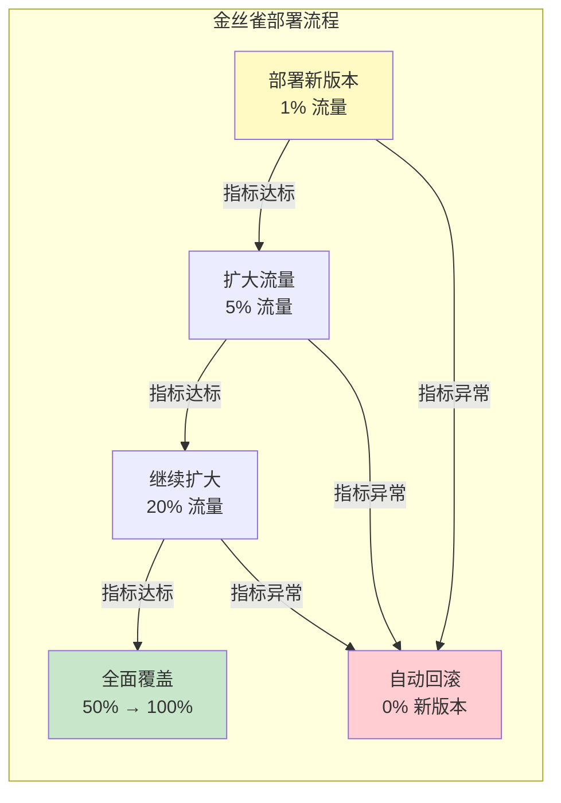
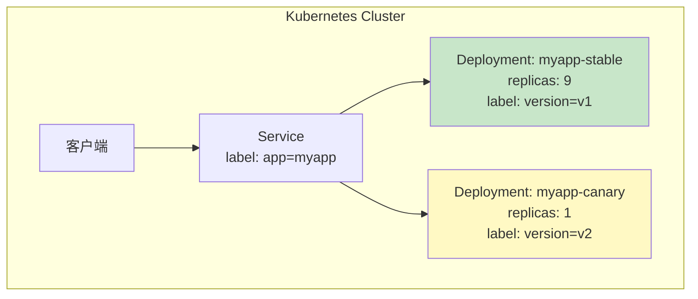

# 三、金丝雀部署

## 1. 核心概念与原理

### 1.1 什么是金丝雀部署

金丝雀部署（Canary Deployment）的名字源自一个古老的矿井安全实践：矿工将金丝雀带入矿井，如果金丝雀因有毒气体而死亡，矿工就知道必须立刻撤离。在软件工程中，金丝雀部署借用了这一隐喻——**将新版本部署到一小部分实例上，用少量真实流量作为"探针"验证新版本的健康状况**，确认安全后再逐步扩大新版本的覆盖范围，直至完全替换旧版本。

与蓝绿部署的"一刀切"切换不同，金丝雀部署是**渐进式的**：新版本先接收 1%~5% 的流量，在观察窗口内对比新旧版本的关键指标（错误率、延迟、吞吐量等），只有指标达标才将流量比例提升到下一个阶梯（如 5% → 20% → 50% → 100%）。任何一个阶段发现问题，都能在秒级回滚到旧版本，将影响范围控制在极小的比例内。



### 1.2 核心优势

**风险最小化**：即使新版本存在严重缺陷，也只影响 1%~5% 的用户，而非全量用户。这将"发布事故"的影响范围从"全站故障"降级为"局部波动"。

**实时可观测**：金丝雀版本与稳定版本在完全相同的生产环境下运行，监控数据反映的是真实用户行为，而非测试环境的模拟数据。这种"在真实战场上用少量部队试错"的方式比任何预发布测试都更有说服力。

**即时回滚**：发现问题时，只需将流量权重调回 100% 到旧版本即可，回滚延迟通常在秒级。相比滚动更新的分钟级回滚，这为业务连续性提供了更强的保障。

**数据驱动决策**：金丝雀发布的每个阶段都有明确的指标对比数据支撑晋级或回滚决策，避免了"拍脑袋"式的发布判断。

### 1.3 适用场景与限制

| 场景 | 是否适合 | 原因 |
|------|---------|------|
| 微服务架构 | 非常适合 | 微服务天然支持流量分割，每个服务独立发布 |
| API 服务 | 非常适合 | 请求级别分割粒度细，指标采集方便 |
| 有状态服务 | 谨慎使用 | 需确保新旧版本的数据模型兼容，避免数据不一致 |
| 数据库 schema 变更 | 不适合 | 数据库迁移需要原子操作，不支持"部分新、部分旧" |
| 客户端应用（移动端） | 不适合 | 客户端版本由用户自行更新，无法服务端控制流量 |
| 低流量服务 | 效果有限 | 样本量不足，统计分析缺乏置信度 |

---

## 2. 流量分割机制

流量分割（Traffic Splitting）是金丝雀部署的基石。没有精确可控的流量分割能力，就无法实现"只让一小部分用户看到新版本"这一核心目标。

### 2.1 流量分割策略对比

| 策略 | 实现方式 | 特点 | 适用场景 |
|------|---------|------|---------|
| **基于权重** | 按百分比分流（如 90:10） | 简单直观，但无法保证同一用户始终看到同一版本 | 无状态 API |
| **基于用户 ID 哈希** | 对用户 ID 取哈希后取模 | 同一用户始终命中同一版本，体验一致 | 需要一致性的 Web 应用 |
| **基于请求头/Cookie** | 通过特定 Header 或 Cookie 路由 | 精确控制哪些用户进入金丝雀 | A/B 测试、内部测试 |
| **基于地域/设备** | 按地理位置或设备类型路由 | 适合区域性发布或设备兼容性验证 | 移动端、多地域部署 |

### 2.2 基于 Nginx 的流量分割

Nginx 是最轻量的流量分割方案，适合没有服务网格的小规模部署。

```nginx
# /etc/nginx/conf.d/canary-routing.conf

# 定义稳定版本 upstream
upstream stable_backend {
    server 10.0.1.10:8080;
    server 10.0.1.11:8080;
    server 10.0.1.12:8080;
}

# 定义金丝雀版本 upstream
upstream canary_backend {
    server 10.0.2.10:8080;
}

# 基于 split_clients 实现权重分流
# $request_id 对应一个 0~999 的值，30/1000 即 3% 流量到金丝雀
split_clients "${request_id}" $canary_pool {
    30%     canary_backend;
    *       stable_backend;
}

server {
    listen 80;
    server_name api.example.com;

    location / {
        proxy_pass http://$canary_pool;

        # 添加标记头，方便日志和监控区分版本
        add_header X-Deployment-Target $canary_pool always;

        proxy_set_header Host $host;
        proxy_set_header X-Real-IP $remote_addr;
        proxy_set_header X-Forwarded-For $proxy_add_x_forwarded_for;
        proxy_set_header X-Forwarded-Proto $scheme;

        # 超时与重试配置
        proxy_connect_timeout 5s;
        proxy_read_timeout 60s;
        proxy_next_upstream error timeout http_502 http_503;
    }
}
```

**基于 Cookie 的定向分流**（让特定用户始终访问金丝雀）：

```nginx
# Cookie-based canary routing
map $cookie_canary $canary_upstream {
    "true"  canary_backend;
    default stable_backend;
}

server {
    listen 80;
    server_name api.example.com;

    location / {
        proxy_pass http://$canary_upstream;

        # 通过设置 cookie 标记金丝雀用户
        # 管理员可以通过 /canary-optin 接口设置此 cookie
        add_header Set-Cookie "canary=true; Path=/; Max-Age=86400"
            always;
    }
}
```

### 2.3 基于 Kubernetes Ingress 的流量分割

在 Kubernetes 环境中，NGINX Ingress Controller 或 Traefik 都支持权重分割：

```yaml
# Nginx Ingress Canary 注解方式
apiVersion: networking.k8s.io/v1
kind: Ingress
metadata:
  name: myapp-stable
  annotations:
    nginx.ingress.kubernetes.io/rewrite-target: /
spec:
  rules:
  - host: myapp.example.com
    http:
      paths:
      - path: /
        pathType: Prefix
        backend:
          service:
            name: myapp-stable
            port:
              number: 8080
---
# 金丝雀 Ingress（通过注解声明为金丝雀）
apiVersion: networking.k8s.io/v1
kind: Ingress
metadata:
  name: myapp-canary
  annotations:
    nginx.ingress.kubernetes.io/canary: "true"
    nginx.ingress.kubernetes.io/canary-weight: "10"   # 10% 流量
spec:
  rules:
  - host: myapp.example.com
    http:
      paths:
      - path: /
        pathType: Prefix
        backend:
          service:
            name: myapp-canary
            port:
              number: 8080
```

基于请求头的定向分流：

```yaml
# 基于 Header 定向（适合内部测试）
annotations:
  nginx.ingress.kubernetes.io/canary: "true"
  nginx.ingress.kubernetes.io/canary-by-header: "X-Canary"
  nginx.ingress.kubernetes.io/canary-by-header-value: "always"

# 基于 Cookie 定向（适合持久性灰度）
annotations:
  nginx.ingress.kubernetes.io/canary: "true"
  nginx.ingress.kubernetes.io/canary-by-cookie: "canary_cookie"
```

---

## 3. Kubernetes 环境的完整实现

Kubernetes 是金丝雀部署的最佳运行环境，它提供了丰富的原生机制和生态工具支持。

### 3.1 基于 Deployment + Service 的手动金丝雀

这是最基础的金丝雀实现方式，不依赖任何额外组件，适合入门学习和小型项目。

**架构原理**：



Service 通过标签选择器同时匹配稳定版本和金丝雀版本的 Pod，由于两者副本数比为 9:1，流量自然按约 90:10 的比例分配。

**稳定版本部署**：

```yaml
# myapp-stable.yaml
apiVersion: apps/v1
kind: Deployment
metadata:
  name: myapp-stable
  labels:
    app: myapp
    track: stable
spec:
  replicas: 9
  selector:
    matchLabels:
      app: myapp
      track: stable
  strategy:
    type: RollingUpdate
    rollingUpdate:
      maxUnavailable: 1
      maxSurge: 2
  template:
    metadata:
      labels:
        app: myapp
        track: stable
        version: v1.0.0
    spec:
      containers:
      - name: myapp
        image: myapp:v1.0.0
        ports:
        - containerPort: 8080
        resources:
          requests:
            cpu: 200m
            memory: 256Mi
          limits:
            cpu: 500m
            memory: 512Mi
        livenessProbe:
          httpGet:
            path: /health
            port: 8080
          initialDelaySeconds: 15
          periodSeconds: 10
        readinessProbe:
          httpGet:
            path: /ready
            port: 8080
          initialDelaySeconds: 5
          periodSeconds: 5
```

**金丝雀版本部署**：

```yaml
# myapp-canary.yaml
apiVersion: apps/v1
kind: Deployment
metadata:
  name: myapp-canary
  labels:
    app: myapp
    track: canary
spec:
  replicas: 1     # 金丝雀副本数，控制流量比例
  selector:
    matchLabels:
      app: myapp
      track: canary
  template:
    metadata:
      labels:
        app: myapp
        track: canary
        version: v2.0.0
    spec:
      containers:
      - name: myapp
        image: myapp:v2.0.0
        ports:
        - containerPort: 8080
        resources:
          requests:
            cpu: 200m
            memory: 256Mi
          limits:
            cpu: 500m
            memory: 512Mi
        livenessProbe:
          httpGet:
            path: /health
            port: 8080
          initialDelaySeconds: 15
          periodSeconds: 10
        readinessProbe:
          httpGet:
            path: /ready
            port: 8080
          initialDelaySeconds: 5
          periodSeconds: 5
```

**统一 Service**：

```yaml
# myapp-service.yaml
apiVersion: v1
kind: Service
metadata:
  name: myapp
  labels:
    app: myapp
spec:
  ports:
  - port: 80
    targetPort: 8080
    name: http
  selector:
    app: myapp    # 同时匹配 stable 和 canary Pod
```

**渐进式扩缩脚本**：

```bash
#!/bin/bash
# canary-promote.sh - 金丝雀渐进式晋级脚本

set -euo pipefail

STABLE_DEPLOY="myapp-stable"
CANARY_DEPLOY="myapp-canary"
CANARY_IMAGE="${1:?用法: $0 <image>}"

# 定义晋级阶梯
STEPS=(1 3 5 9)
STABLE_REPLICAS=9
OBSERVATION_WINDOW=120  # 每阶段观察时间（秒）
MAX_ERROR_RATE=0.05     # 最大允许错误率（5%）
METRICS_URL="http://prometheus:9090"

log() {
    echo "[$(date '+%H:%M:%S')] $1"
}

check_canary_health() {
    # 查询金丝雀版本的错误率
    local error_rate
    error_rate=$(curl -s "${METRICS_URL}/api/v1/query" \
        --data-urlencode "query=
            sum(rate(http_requests_total{track=\"canary\",code=~\"5..\"}[2m]))
            /
            sum(rate(http_requests_total{track=\"canary\"}[2m]))
        " | jq -r '.data.result[0].value[1] // "0"')

    log "金丝雀错误率: ${error_rate}"

    # 比较错误率是否超过阈值
    if (( $(echo "$error_rate > $MAX_ERROR_RATE" | bc -l) )); then
        return 1
    fi
    return 0
}

rollback() {
    log "!!! 触发回滚 - 将金丝雀副本缩到 0"
    kubectl scale deployment "$CANARY_DEPLOY" --replicas=0
    log "回滚完成。当前流量 100% 到稳定版本"
    exit 1
}

# 主流程
log "开始金丝雀晋级流程"

for step in "${STEPS[@]}"; do
    log ">>> 晋级阶段: 金丝雀副本数 -> $step"

    kubectl scale deployment "$CANARY_DEPLOY" --replicas="$step"

    log "等待 ${OBSERVATION_WINDOW}s 观察窗口..."
    sleep "$OBSERVATION_WINDOW"

    if ! check_canary_health; then
        log "!!! 健康检查失败，执行回滚"
        rollback
    fi

    log "--- 阶段 $step 通过 ---"
done

# 所有阶段通过，完成晋级
log "全部阶段通过，开始全量切换"
kubectl scale deployment "$STABLE_DEPLOY" --replicas=0
kubectl set image deployment/"$CANARY_DEPLOY" myapp="$CANARY_IMAGE"
kubectl scale deployment "$CANARY_DEPLOY" --replicas="$STABLE_REPLICAS"

# 重命名 canary -> stable
kubectl patch deployment "$CANARY_DEPLOY" \
    -p '{"metadata":{"labels":{"track":"stable"}}}'
kubectl patch deployment "$STABLE_DEPLOY" \
    -p '{"metadata":{"labels":{"track":"completed"}}}'

log "金丝雀发布完成！新版本已全量上线"
```

### 3.2 使用 Argo Rollouts 实现自动化金丝雀

Argo Rollouts 是 Kubernetes 原生的渐进式发布控制器，它扩展了 Deployment 的能力，内置了金丝雀晋级策略和自动化分析。

**安装**：

```bash
# 安装 Argo Rollouts 控制器
kubectl create namespace argo-rollouts
kubectl apply -n argo-rollouts \
    -f https://github.com/argoproj/argo-rollouts/releases/latest/download/install.yaml

# 安装 Dashboard（可选）
kubectl apply -n argo-rollouts \
    -f https://github.com/argoproj/argo-rollouts/releases/latest/download/dashboard-install.yaml
```

**Rollout 资源定义**：

```yaml
# myapp-rollout.yaml
apiVersion: argoproj.io/v1alpha1
kind: Rollout
metadata:
  name: myapp
spec:
  replicas: 10
  revisionHistoryLimit: 5
  selector:
    matchLabels:
      app: myapp
  template:
    metadata:
      labels:
        app: myapp
    spec:
      containers:
      - name: myapp
        image: myapp:v1.0.0
        ports:
        - containerPort: 8080
        resources:
          requests:
            cpu: 200m
            memory: 256Mi
          limits:
            cpu: 500m
            memory: 512Mi
        readinessProbe:
          httpGet:
            path: /ready
            port: 8080
          initialDelaySeconds: 5
          periodSeconds: 5
  strategy:
    canary:
      # 流量分割步骤
      steps:
      - setWeight: 5           # 第一阶段：5% 流量
      - pause: { duration: 2m } # 观察 2 分钟
      - setWeight: 20          # 第二阶段：20% 流量
      - pause: { duration: 5m } # 观察 5 分钟
      - setWeight: 50          # 第三阶段：50% 流量
      - pause: { duration: 5m } # 观察 5 分钟
      - setWeight: 100         # 最终阶段：100% 流量

      # 自动分析：基于 Prometheus 指标自动决定晋级或回滚
      analysis:
        templates:
        - templateName: canary-success-rate
        startingStep: 1        # 从第一步开始分析
        args:
        - name: service-name
          value: myapp

      # 金丝雀 Service（可选，用于独立暴露金丝雀版本）
      canaryService: myapp-canary
      stableService: myapp-stable

      # 路由流量（需要 Istio 或 Nginx Ingress）
      trafficRouting:
        nginx:
          stableIngress: myapp-ingress
          additionalIngressAnnotations:
            canary-by-header: X-Canary
```

**自动分析模板**：

```yaml
# canary-analysis-template.yaml
apiVersion: argoproj.io/v1alpha1
kind: AnalysisTemplate
metadata:
  name: canary-success-rate
spec:
  args:
  - name: service-name
  metrics:
  # 检查错误率
  - name: error-rate
    interval: 30s
    count: 5            # 采集 5 次，每次间隔 30s
    successCondition: result[0] < 0.05   # 错误率低于 5%
    failureLimit: 3     # 连续 3 次失败则终止
    provider:
      prometheus:
        address: http://prometheus-server:9090
        query: |
          sum(rate(
            http_requests_total{
              service="{{args.service-name}}",
              canary="true",
              code=~"5.."
            }[2m]
          ))
          /
          sum(rate(
            http_requests_total{
              service="{{args.service-name}}",
              canary="true"
            }[2m]
          ))

  # 检查 P99 延迟
  - name: p99-latency
    interval: 30s
    count: 5
    successCondition: result[0] < 500    # P99 延迟低于 500ms
    failureLimit: 3
    provider:
      prometheus:
        address: http://prometheus-server:9090
        query: |
          histogram_quantile(0.99,
            sum(rate(
              http_request_duration_seconds_bucket{
                service="{{args.service-name}}",
                canary="true"
              }[2m]
            )) by (le)
          ) * 1000

  # 检查吞吐量是否骤降
  - name: throughput-ratio
    interval: 30s
    count: 5
    successCondition: result[0] > 0.8    # 金丝雀吞吐不低于稳定的 80%
    failureLimit: 3
    provider:
      prometheus:
        address: http://prometheus-server:9090
        query: |
          sum(rate(http_requests_total{
            service="{{args.service-name}}",canary="true"
          }[2m]))
          /
          sum(rate(http_requests_total{
            service="{{args.service-name}}"
          }[2m]))
```

**发布触发**：

```bash
# 更新镜像触发金丝雀发布
kubectl set image rollout/myapp myapp=myapp:v2.0.0

# 查看发布状态
kubectl argo rollouts get rollout myapp --watch

# 手动晋级（跳过自动分析）
kubectl argo rollouts promote myapp

# 手动回滚
kubectl argo rollouts undo myapp
```

### 3.3 使用 Istio 实现精细化金丝雀

Istio 服务网格提供了最精细的流量管理能力，支持基于权重、Header、Cookie、URI 等多种维度的路由规则。

```yaml
# istio-canary-traffic.yaml

# 定义 VirtualService 流量分割
apiVersion: networking.istio.io/v1beta1
kind: VirtualService
metadata:
  name: myapp
spec:
  hosts:
  - myapp
  http:
  - route:
    - destination:
        host: myapp
        subset: stable
      weight: 90
    - destination:
        host: myapp
        subset: canary
      weight: 10
    # 重试配置
    retries:
      attempts: 3
      perTryTimeout: 2s
      retryOn: 5xx,reset,connect-failure
    timeout: 10s
---
# 定义 DestinationRule 子集
apiVersion: networking.istio.io/v1beta1
kind: DestinationRule
metadata:
  name: myapp
spec:
  host: myapp
  subsets:
  - name: stable
    labels:
      track: stable
  - name: canary
    labels:
      track: canary
  trafficPolicy:
    connectionPool:
      tcp:
        maxConnections: 100
      http:
        http1MaxPendingRequests: 100
        http2MaxRequests: 1000
        maxRequestsPerConnection: 10
    outlierDetection:
      consecutive5xxErrors: 3
      interval: 30s
      baseEjectionTime: 30s
      maxEjectionPercent: 50
```

**自动化晋级脚本（配合 Istio）**：

```bash
#!/bin/bash
# istio-canary-promote.sh - Istio 金丝雀晋级脚本
#
# 用法: ./istio-canary-promote.sh <canary-version>
# 示例: ./istio-canary-promote.sh v2.0.0

set -euo pipefail

CANARY_VERSION="${1:?用法: $0 <version>}"
VIRTUALEXTERNAL="myapp"
PROMETHEUS="http://prometheus-server:9090"
OBSERVATION_SECONDS=120
MAX_ERROR_RATE=0.05
WEIGHT_STEPS=(5 20 50 100)

log() { echo "[$(date '+%H:%M:%S')] $1"; }

query_error_rate() {
    curl -s --fail "${PROMETHEUS}/api/v1/query" \
        --data-urlencode "query=
            sum(rate(http_requests_total{istio_service=\"${VIRTUALEXTERNAL}\",response_code=~\"5..\"}[2m]))
            /
            sum(rate(http_requests_total{istio_service=\"${VIRTUALEXTERNAL}\"}[2m]))
        " 2>/dev/null | jq -r '.data.result[0].value[1] // "0"'
}

set_traffic_weight() {
    local canary_weight=$1
    local stable_weight=$((100 - canary_weight))

    cat <<EOF | kubectl apply -f -
apiVersion: networking.istio.io/v1beta1
kind: VirtualService
metadata:
  name: ${VIRTUALEXTERNAL}
spec:
  hosts:
  - ${VIRTUALEXTERNAL}
  http:
  - route:
    - destination:
        host: ${VIRTUALEXTERNAL}
        subset: stable
      weight: ${stable_weight}
    - destination:
        host: ${VIRTUALEXTERNAL}
        subset: canary
      weight: ${canary_weight}
EOF
    log "流量权重: stable=${stable_weight}% canary=${canary_weight}%"
}

rollback() {
    log "!!! 触发回滚"
    set_traffic_weight 0
    kubectl scale deployment myapp-canary --replicas=0
    log "回滚完成，100% 流量到稳定版本"
    exit 1
}

# 主流程
log "开始金丝雀晋级: 目标版本 $CANARY_VERSION"

for weight in "${WEIGHT_STEPS[@]}"; do
    log ">>> 晋级到 ${weight}%"
    set_traffic_weight "$weight"

    log "观察 ${OBSERVATION_SECONDS}s ..."
    sleep "$OBSERVATION_SECONDS"

    error_rate=$(query_error_rate)
    log "当前错误率: ${error_rate}"

    if (( $(echo "$error_rate > $MAX_ERROR_RATE" | bc -l) )); then
        log "!!! 错误率超标，执行回滚"
        rollback
    fi

    log "--- ${weight}% 阶段通过 ---"
done

log "金丝雀发布完成！全部流量已切换到 $CANARY_VERSION"
```

---

## 4. 金丝雀监控与指标分析

金丝雀部署的核心安全网是**监控分析系统**。没有可靠的监控，金丝雀就是"盲飞"——无法判断新版本是否健康，晋级和回滚决策就失去了依据。

### 4.1 关键监控指标

金丝雀发布需要监控三大类指标，形成完整的"健康画像"：

| 指标类别 | 具体指标 | 计算方式 | 告警阈值参考 |
|---------|---------|---------|-------------|
| **错误率** | HTTP 5xx 错误率 | 5xx 请求数 / 总请求数 | > 1%（绝对值）或 > 1.5x（相对稳定版） |
| **延迟** | P50 / P95 / P99 延迟 | Prometheus histogram_quantile | P99 < 500ms，或不超过稳定版 1.3 倍 |
| **吞吐量** | 每秒请求数（QPS） | rate(http_requests_total[2m]) | 不低于稳定版 80% |
| **资源** | CPU / 内存使用率 | container_cpu_usage_seconds_total | CPU < 80%，内存无持续增长 |
| **业务** | 订单成功率、支付成功率 | 业务埋点数据 | 与稳定版持平或更优 |

### 4.2 Prometheus 告警规则

```yaml
# canary-alerts.yaml
apiVersion: monitoring.coreos.com/v1
kind: PrometheusRule
metadata:
  name: canary-alerts
spec:
  groups:
  - name: canary.rules
    rules:
    # 金丝雀错误率过高
    - alert: CanaryHighErrorRate
      expr: |
        (
          sum(rate(http_requests_total{canary="true",code=~"5.."}[2m]))
          /
          sum(rate(http_requests_total{canary="true"}[2m]))
        ) > 0.05
      for: 1m
      labels:
        severity: critical
      annotations:
        summary: "金丝雀版本错误率过高"
        description: "金丝雀版本5xx错误率达到 {{ $value | humanizePercentage }}，超过 5% 阈值"

    # 金丝雀延迟显著高于稳定版
    - alert: CanaryHighLatency
      expr: |
        (
          histogram_quantile(0.99,
            sum(rate(http_request_duration_seconds_bucket{canary="true"}[2m])) by (le)
          )
          /
          histogram_quantile(0.99,
            sum(rate(http_request_duration_seconds_bucket{canary="false"}[2m])) by (le)
          )
        ) > 1.5
      for: 2m
      labels:
        severity: warning
      annotations:
        summary: "金丝雀版本 P99 延迟偏高"
        description: "金丝雀 P99 延迟是稳定版的 {{ $value }}x"

    # 金丝雀吞吐量骤降
    - alert: CanaryLowThroughput
      expr: |
        (
          sum(rate(http_requests_total{canary="true"}[2m]))
          /
          sum(rate(http_requests_total{canary="true"}[5m]))
        ) < 0.5
      for: 1m
      labels:
        severity: warning
      annotations:
        summary: "金丝雀版本吞吐量骤降"
        description: "金丝雀近2分钟吞吐量降至5分钟均值的 {{ $value | humanizePercentage }}"
```

### 4.3 Grafana 监控面板设计

一个合格的金丝雀监控面板应包含以下可视化区域：

┌───────────────────────────────────────────────────────────┐
│ 金丝雀发布状态面板                                        │
├───────────────────────────────────────────────────────────┤
│ [流量比例图]     │ [错误率对比图]                          │
│  stable: 80%    │  canary: 0.3% vs stable: 0.2%          │
│  canary: 20%    │  ██████████  (历史趋势)                 │
├─────────────────┼─────────────────────────────────────────┤
│ [延迟对比图]     │ [吞吐量对比图]                          │
│  P99: 180ms     │  canary: 1200 QPS                       │
│  P95: 120ms     │  stable: 4800 QPS                       │
│  P50: 45ms      │  (canary/stable = 20% = 目标比例)       │
├─────────────────┴─────────────────────────────────────────┤
│ [晋级时间线]  step1(5%) ──✓── step2(20%) ──观察中── step3 │
└───────────────────────────────────────────────────────────┘

核心 PromQL 查询示例：

```promql
# 金丝雀 vs 稳定版错误率对比
sum(rate(http_requests_total{canary="true",code=~"5.."}[2m]))
/
sum(rate(http_requests_total{canary="true"}[2m]))

# 金丝雀 vs 稳定版 P99 延迟对比
histogram_quantile(0.99,
  sum(rate(http_request_duration_seconds_bucket{canary="true"}[2m])) by (le)
)

# 流量比例验证（金丝雀应与设定权重匹配）
sum(rate(http_requests_total{canary="true"}[1m]))
/
sum(rate(http_requests_total{}[1m]))
```

---

## 5. 高级主题

### 5.1 指标一致性问题

金丝雀部署中最隐蔽的陷阱是**指标对比的公平性**。如果金丝雀版本的流量来源与稳定版存在系统性差异（如金丝雀恰好承接了更多复杂请求），指标对比就会产生误判。

常见偏差来源及应对：

| 偏差类型 | 表现 | 应对策略 |
|---------|------|---------|
| **时间偏差** | 金丝雀在低峰期部署，看起来指标更好 | 使用滑动窗口对齐分析，对比同时段数据 |
| **样本偏差** | 金丝雀流量太少，随机波动大 | 最低观察窗口 ≥ 5 分钟，最少 1000 个请求 |
| **流量偏差** | 权重分流不均匀（如按 IP 段分流导致某些大客户全部进入金丝雀） | 使用一致哈希或随机分流，监控分流均匀度 |
| **冷启动偏差** | 金丝雀刚启动时 JIT 编译、缓存未热，指标暂时偏差 | 启动预热期（warm-up），分析窗口从 Pod Ready 后开始计算 |

### 5.2 数据库兼容性

金丝雀部署要求新旧版本能够**同时访问同一个数据库**，这对数据库 schema 变更提出了严格约束。

**安全的 schema 变更模式**：

阶段一（兼容写入）：新旧代码都能正常读写当前 schema
    ↓ 所有实例升级到新版本
阶段二（扩展 schema）：ALTER TABLE ADD COLUMN（不删除旧列）
    ↓ 新代码使用新列
阶段三（清理旧列）：确认无旧版本流量后，DROP COLUMN

**危险操作清单**：

| 操作 | 风险 | 安全替代 |
|------|------|---------|
| 重命名列 | 旧版本查询会失败 | 先添加新列，迁移数据，再删除旧列 |
| 删除列 | 旧版本查询会失败 | 先停止旧版本读写该列，再删除 |
| 修改列类型 | 旧版本写入格式不兼容 | 新增列 + 双写，迁移完成后切换 |
| 新增 NOT NULL 列（无默认值） | 旧版本插入失败 | 设置 DEFAULT 值或先加可空列 |

### 5.3 金丝雀发布与 Feature Flag 的结合

金丝雀部署和 Feature Flag（功能标志）可以组合使用，提供双重安全保障：

```python
# 金丝雀 + Feature Flag 双重控制
class CanaryFeatureGate:
    def __init__(self, feature_flag_client, is_canary_instance: bool):
        self.flags = feature_flag_client
        self.is_canary = is_canary_instance

    def is_new_feature_enabled(self, feature_key: str, user_id: str) -> bool:
        """
        双重检查：
        1. 实例级别：只有金丝雀实例才可能开启新功能
        2. 用户级别：通过 Feature Flag 控制哪些用户可见
        """
        if not self.is_canary:
            return False
        return self.flags.evaluate(feature_key, {"user_id": user_id})
```

这种方式的好处是：
- **金丝雀控制实例级别的发布**（新版本代码只部署到少量 Pod）
- **Feature Flag 控制功能级别的发布**（即使在金丝雀实例上，新功能也可以按用户群灰度）

### 5.4 多集群金丝雀

在多集群环境中，金丝雀部署可以按集群维度展开：

集群A（生产主力）：100% stable
    ↓ 阶段一
集群A：90% stable + 10% canary    ← 验证集群内指标
    ↓ 阶段二
集群A：100% canary                ← 集群A全量
集群B（备用）：100% stable         ← 集群B尚未变更
    ↓ 阶段三
集群B：90% stable + 10% canary    ← 跨集群验证一致性
    ↓ 阶段四
集群B：100% canary                ← 全部完成

这种"先集中再扩展"的策略将风险控制在最小范围，适合大型互联网公司的多集群架构。

---

## 6. 常见误区与纠正

### 误区一：金丝雀时间窗口太短

**错误做法**：金丝雀发布后只观察 30 秒就开始晋级。

**问题本质**：许多性能问题（如内存泄漏、连接池耗尽、缓存击穿）需要时间积累才能暴露。30 秒的观察窗口可能连一个完整的 GC 周期都没覆盖。

**正确做法**：观察窗口至少覆盖业务的典型流量周期。对于面向消费者的服务，建议第一阶段观察 5~10 分钟；对于内部服务，至少观察 2~3 分钟。窗口内必须积累足够的样本量（> 1000 个请求）才能做出统计显著的判断。

### 误区二：忽略金丝雀与稳定版的环境差异

**错误做法**：金丝雀版本的 Pod 被调度到资源紧张的节点，导致性能指标天然比稳定版差。

**问题本质**：对比分析的前提是"控制变量"。如果金丝雀和稳定版的运行环境不一致（CPU 争抢、内存不足、磁盘 IO 拥塞），指标差异可能来自环境而非代码。

**正确做法**：使用 Kubernetes 的 `affinity` 和 `resource requests` 确保两个版本获得等价的资源保障：

```yaml
# 确保金丝雀 Pod 与稳定版获得同等资源
resources:
  requests:
    cpu: 500m       # 与稳定版相同
    memory: 512Mi
  limits:
    cpu: 1000m
    memory: 1Gi

# 可选：使用 PodAntiAffinity 避免过度集中
affinity:
  podAntiAffinity:
    preferredDuringSchedulingIgnoredDuringExecution:
    - weight: 100
      podAffinityTerm:
        labelSelector:
          matchLabels:
            app: myapp
        topologyKey: kubernetes.io/hostname
```

### 误区三：金丝雀副本数过少导致统计无效

**错误做法**：服务总共有 100 个副本，金丝雀只开 1 个（1% 流量），然后用错误率来判断是否晋级。

**问题本质**：1 个 Pod 的样本量太小，偶尔一次网络抖动就能让错误率飙到 50%，触发误报回滚。统计学要求足够的样本量才能得出可靠的结论。

**正确做法**：金丝雀的最小规模应保证在观察窗口内能积累至少 1000 个请求。对于高流量服务，1%~5% 的流量通常足够；对于低流量服务，可能需要分配更高的比例（如 10%~20%）来确保统计有效性。

### 误区四：金丝雀期间修改代码

**错误做法**：在金丝雀观察过程中，开发者推送了修复 commit，金丝雀 Pod 自动更新到新版本。

**问题本质**：金丝雀的核心价值是"用固定的版本在生产环境中验证"。如果在观察过程中悄悄修改了代码，你验证的就不是同一个版本了，所有指标数据都失去参考价值。

**正确做法**：金丝雀观察期间**冻结代码变更**。如果发现需要修复，先回滚当前金丝雀，修复后重新开始完整的金丝雀流程。每次金丝雀只验证一个确定的版本快照。

---

## 7. 最佳实践总结

### 7.1 金丝雀发布 Checklist

□ 流量分割验证：确认权重分配与预期一致
□ 指标采集就绪：Prometheus 正常采集两个版本的指标
□ 告警规则配置：错误率、延迟、吞吐量的告警阈值已设置
□ 回滚脚本测试：回滚操作已在预发布环境验证
□ 数据库兼容：schema 变更采用向后兼容模式
□ 观察窗口充足：至少 5 分钟 + 1000 个请求
□ 监控面板就绪：Grafana 面板显示金丝雀 vs 稳定版对比
□ 团队通知：发布窗口内相关团队在线可响应

### 7.2 晋级策略选择

| 策略 | 适用场景 | 优点 | 缺点 |
|------|---------|------|------|
| **全自动晋级** | 技术成熟、监控完善的团队 | 发布速度快，人力成本低 | 对监控精度要求极高 |
| **半自动晋级（系统建议 + 人工审批）** | 大多数团队的推荐选择 | 兼顾速度和安全 | 晋级需要人工介入 |
| **纯手动晋级** | 高敏感服务（支付、金融） | 最大控制权 | 发布速度慢 |

### 7.3 推荐的流量晋级阶梯

安全模式（保守）：  1% → 5% → 10% → 25% → 50% → 100%
标准模式（推荐）：  5% → 20% → 50% → 100%
激进模式（快速）：  10% → 50% → 100%

每个阶段之间的观察窗口建议：
- **第一阶段**（最小流量）：5~10 分钟，重点观察错误率和启动异常
- **中间阶段**：3~5 分钟，重点观察延迟和吞吐量趋势
- **最终阶段**（50%→100%）：2~3 分钟，验证全量覆盖后的稳定性

### 7.4 工具选型建议

| 需求场景 | 推荐工具 | 理由 |
|---------|---------|------|
| 小型项目，无服务网格 | Nginx split_clients | 零额外依赖，配置简单 |
| Kubernetes，中等复杂度 | Argo Rollouts | Kubernetes 原生，内置分析框架 |
| 已有 Istio 的微服务架构 | Istio VirtualService | 流量管理能力最强，生态丰富 |
| 需要全托管 SaaS 方案 | Flagger + 云厂商 ALB | 免运维，与云服务深度集成 |
| 非 Kubernetes 环境 | 自研 + Prometheus | 灵活定制，但开发成本高 |

---

## 8. 小结

金丝雀部署通过"小步快跑、随时回滚"的渐进式策略，将发布风险控制在最小范围。掌握金丝雀部署需要理解三个核心能力：**流量分割**（精确控制多少流量到新版本）、**指标分析**（用数据判断新版本是否健康）、**自动化决策**（晋级或回滚的执行机制）。

从手动扩缩副本的入门方案，到 Argo Rollouts / Istio 的企业级方案，金丝雀部署的实现复杂度随业务需求逐步提升。无论选择哪种方案，**监控先行、渐进推进、随时可回滚**是金丝雀部署永远不变的三原则。
