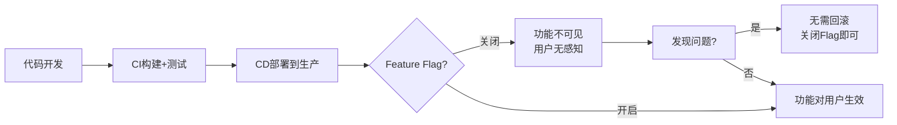
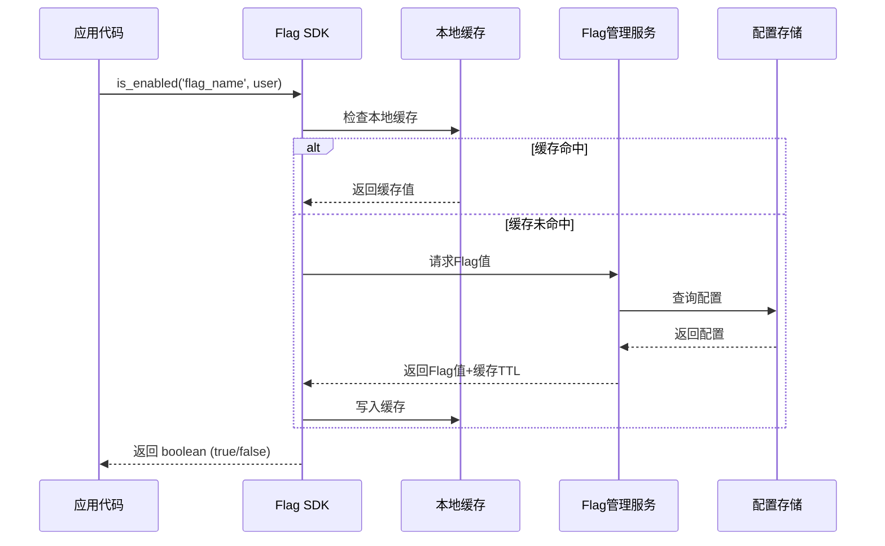
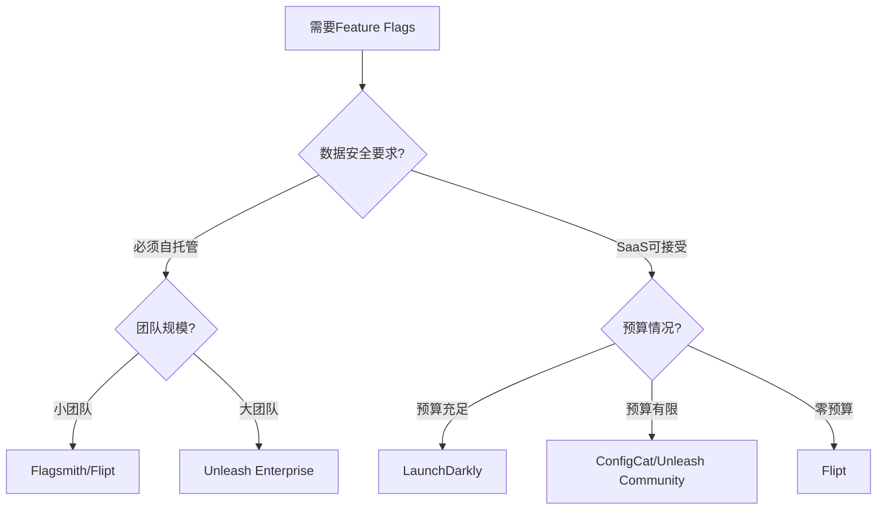
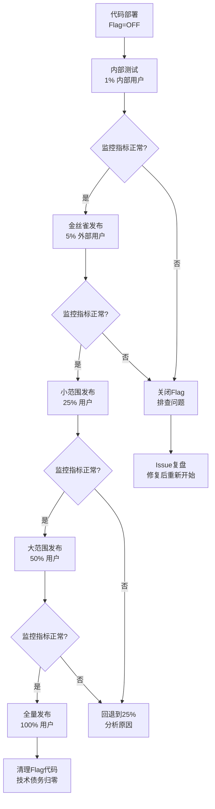
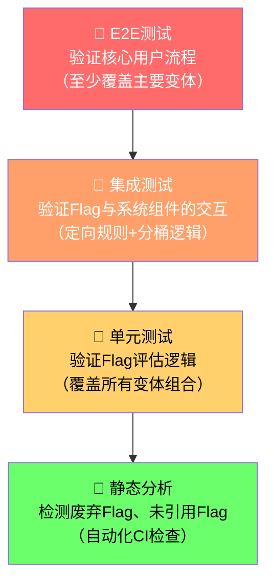

## 四、Feature Flags（功能特性开关）

### 1. 什么是Feature Flags

Feature Flags（功能特性开关），也称为Feature Toggles、Feature Switches或Feature Gates，是一种在运行时动态控制代码路径的软件工程实践。其核心思想极其简单：**用一个变量（通常是布尔值或配置项）来决定某段代码是否生效**，从而将"代码部署"与"功能发布"解耦。

在传统的发布流程中，开发者完成编码后，代码直接部署到生产环境，功能立即对所有用户可见。这意味着一旦出现问题，只能通过回滚来修复。而Feature Flags打破了这种耦合——你可以先部署代码到生产环境（此时功能处于关闭状态），然后在合适的时间点，通过修改配置来逐步开放功能。

**Feature Flags在CI/CD流水线中的战略价值：**



Martin Fowler将Feature Flags列为持续交付的关键模式之一。他认为Feature Flags是实现"持续发布"（Continuous Delivery）最有效的技术手段，因为它允许团队在不承担发布风险的前提下，保持高频的部署节奏。

### 2. Feature Flags的分类体系

不同类型的Feature Flag有不同的生命周期、管理策略和使用场景。理解这个分类体系是正确使用Feature Flags的基础。

| 类型 | 目的 | 典型生命周期 | 变更频率 | 示例 |
|------|------|-------------|---------|------|
| **发布开关（Release Toggles）** | 控制未完成功能的可见性 | 短期（天~周） | 低 | 新UI界面的灰度发布 |
| **实验开关（Experiment Toggles）** | A/B测试，比较不同版本的效果 | 中期（天~月） | 中 | 首页布局方案对比 |
| **运维开关（Ops Toggles）** | 运行时控制系统的非功能性行为 | 长期（月~年） | 低 | 降级开关、熔断阈值 |
| **权限开关（Permission Toggles）** | 控制特定用户或用户组的功能访问权 | 永久 | 高 | 付费功能、内部测试版 |

#### 2.1 发布开关（Release Toggles）

发布开关是最常见的类型，用于将功能的部署与发布分离。典型场景：

- **未完成功能保护**：新功能代码已合并到主分支并部署到生产，但功能尚未就绪，通过Flag保持关闭
- **渐进式发布**：先对内部员工开放，再扩展到1%用户，逐步扩大到100%
- **紧急功能禁用**：新功能上线后发现严重问题，一键关闭

**生命周期管理要点**：发布开关是短期开关，一旦功能完全发布并稳定，**必须及时清理相关代码和配置**。长期保留废弃的Flag会导致代码库膨胀、配置混乱和技术债务累积。

#### 2.2 实验开关（Experiment Toggles）

实验开关用于A/B测试和多变量测试，帮助团队基于数据做决策。与发布开关的关键区别在于：

- 实验开关需要精确的流量分配能力（如50/50、90/10）
- 需要与指标收集系统集成
- 需要统计显著性验证
- 生命周期可能跨越数周甚至数月

```python
# 实验开关示例：两种推荐算法的效果对比
def get_recommendations(user):
    bucket = user_bucket(user.id)  # 基于用户ID哈希的稳定分桶
    
    if is_enabled('exp_recommendation_v2', user):
        # 实验组：新的协同过滤算法
        return collaborative_filter(user)
    else:
        # 对照组：原有基于规则的推荐
        return rule_based_recommendation(user)
```

#### 2.3 运维开关（Ops Toggles）

运维开关用于在运行时调整系统的非功能性行为，是SRE和运维团队的核心工具：

- **降级开关**：关闭非核心功能以保护核心链路
- **流量控制**：限制特定API的请求速率
- **性能保护**：控制并发量、缓存策略等
- **故障注入**：混沌工程中的故障模拟

```python
# 运维开关示例：非核心功能降级
def order_service(request):
    order = process_order(request)
    
    # 核心链路：订单创建（不可关闭）
    save_order(order)
    
    # 非核心功能：通过运维开关控制
    if ops_toggle('send_notification', default=True):
        send_push_notification(order)
    
    if ops_toggle('loyalty_points', default=True):
        calculate_loyalty_points(order)
    
    if ops_toggle('recommendation', default=False):
        generate_recommendations(order)
```

#### 2.4 权限开关（Permission Toggles）

权限开关基于用户属性控制功能访问权限：

- **付费功能**：仅付费用户可使用
- **内部测试**：仅内部员工或Beta测试用户可访问
- **地域限制**：根据用户地理位置开放功能
- **灰度用户**：按用户ID白名单开放

### 3. Feature Flags的架构模式

#### 3.1 Flag评估架构

Feature Flag系统的评估流程涉及多个环节，理解架构有助于设计高可靠方案：



**关键设计决策：**

| 决策点 | 选项A | 选项B | 建议 |
|-------|-------|-------|------|
| 评估位置 | 服务端评估 | 客户端评估 | 高安全性要求选服务端；高性能要求选客户端 |
| 缓存策略 | 轮询更新 | 推送更新 | 轮询实现简单；推送延迟更低 |
| 默认值 | Flag未定义时返回true | Flag未定义时返回false | **始终返回false（保守策略）**，避免Flag丢失导致功能意外暴露 |
| 错误处理 | 降级到默认值 | 抛出异常 | **降级到默认值**，Flag系统故障不应阻塞业务 |

#### 3.2 数据模型设计

一个成熟的Feature Flag系统需要管理以下数据：

```json
{
  "key": "new_checkout_flow",
  "name": "新版结账流程",
  "description": "替换原有结账页面，支持多种支付方式",
  "type": "release",
  "enabled": true,
  "default_variant": false,
  "variants": {
    "control": { "enabled": false },
    "experiment": { "enabled": true }
  },
  "targeting_rules": [
    {
      "conditions": [
        { "attribute": "country", "operator": "in", "values": ["CN", "HK"] },
        { "attribute": "user_id", "operator": "in", "values": ["internal_whitelist"] }
      ],
      "variant": "experiment"
    }
  ],
  "rollout_percentage": 25.0,
  "created_at": "2025-06-01T10:00:00Z",
  "created_by": "zhang.san@example.com",
  "expires_at": "2025-07-01T00:00:00Z",
  "tags": ["checkout", "q3-release"]
}
```

### 4. 实现方案：从零构建Feature Flag系统

#### 4.1 方案一：基于配置文件的简单Flag

适用于小型项目或单体应用，实现零依赖：

```python
import json
import os
import time
from threading import Lock

class FileBasedFeatureFlags:
    """基于配置文件的Feature Flag实现"""
    
    def __init__(self, config_path: str, reload_interval: int = 30):
        self.config_path = config_path
        self.reload_interval = reload_interval
        self.flags = {}
        self.last_modified = 0
        self._lock = Lock()
        self._load_config()
    
    def _load_config(self):
        """加载配置文件"""
        with self._lock:
            if not os.path.exists(self.config_path):
                return
            
            current_mtime = os.path.getmtime(self.config_path)
            if current_mtime <= self.last_modified:
                return  # 文件未更新，跳过
            
            with open(self.config_path, 'r') as f:
                data = json.load(f)
                self.flags = data.get('flags', {})
                self.last_modified = current_mtime
    
    def is_enabled(self, flag_name: str, default: bool = False) -> bool:
        """判断Flag是否开启"""
        self._load_config()  # 支持热更新
        
        flag_config = self.flags.get(flag_name)
        if flag_config is None:
            return default  # Flag不存在时返回默认值
        
        if isinstance(flag_config, bool):
            return flag_config
        
        if isinstance(flag_config, dict):
            return flag_config.get('enabled', default)
        
        return default
    
    def get_variant(self, flag_name: str, user_id: str, default: str = 'control') -> str:
        """获取实验变体（用于A/B测试）"""
        flag_config = self.flags.get(flag_name, {})
        if not flag_config or not flag_config.get('enabled', False):
            return default
        
        # 基于用户ID的确定性分桶
        variants = flag_config.get('variants', {'control': 100})
        bucket = hash(f"{flag_name}:{user_id}") % 100
        
        cumulative = 0
        for variant, percentage in variants.items():
            cumulative += percentage
            if bucket < cumulative:
                return variant
        
        return default


# 使用示例
# config.json 内容：
# {
#   "flags": {
#     "new_checkout_flow": true,
#     "dark_mode": {"enabled": true},
#     "beta_feature": {"enabled": false}
#   }
# }

ff = FileBasedFeatureFlags('/etc/myapp/feature-flags.json')

if ff.is_enabled('new_checkout_flow'):
    render_new_checkout_page()
else:
    render_old_checkout_page()
```

#### 4.2 方案二：基于Redis的分布式Flag

适用于微服务架构，支持高并发和低延迟：

```python
import json
import redis
from functools import lru_cache

class RedisFeatureFlags:
    """基于Redis的分布式Feature Flag"""
    
    KEY_PREFIX = 'feature_flags:'
    
    def __init__(self, redis_client: redis.Redis):
        self.redis = redis_client
    
    def is_enabled(self, flag_name: str, default: bool = False) -> bool:
        key = f"{self.KEY_PREFIX}{flag_name}"
        value = self.redis.get(key)
        
        if value is None:
            return default
        
        try:
            flag_data = json.loads(value)
            if isinstance(flag_data, dict):
                return flag_data.get('enabled', default)
            return bool(flag_data)
        except (json.JSONDecodeError, TypeError):
            return default
    
    def set_flag(self, flag_name: str, enabled: bool, description: str = '') -> None:
        key = f"{self.KEY_PREFIX}{flag_name}"
        data = {
            'enabled': enabled,
            'description': description,
            'updated_at': time.time()
        }
        self.redis.set(key, json.dumps(data))
    
    def get_variant(self, flag_name: str, user_id: str, default: str = 'control') -> str:
        """带流量百分比的实验分桶"""
        key = f"{self.KEY_PREFIX}{flag_name}"
        value = self.redis.get(key)
        
        if value is None:
            return default
        
        flag_data = json.loads(value)
        if not flag_data.get('enabled', False):
            return default
        
        rollout = flag_data.get('rollout', 100)
        # 确定性分桶：相同用户始终进入相同分组
        bucket = hash(f"{flag_name}:{user_id}") % 100
        
        if bucket < rollout:
            return flag_data.get('variant', 'treatment')
        return 'control'


# 中间件集成示例（Flask）
from flask import Flask, g, request

app = Flask(__name__)
redis_client = redis.Redis(host='localhost', port=6379, db=0)
flags = RedisFeatureFlags(redis_client)

@app.before_request
def load_flags_for_request():
    """每个请求初始化Flag上下文"""
    g.flags = flags
    g.user_id = request.headers.get('X-User-Id', 'anonymous')

@app.route('/dashboard')
def dashboard():
    variant = g.flags.get_variant('dashboard_v2', g.user_id)
    if variant == 'treatment':
        return render_new_dashboard()
    return render_old_dashboard()
```

#### 4.3 方案三：自托管Feature Flag平台

当团队规模扩大、Flag数量超过50个时，需要一个完整的管理平台：

```python
# Flag管理平台的核心API设计
from dataclasses import dataclass, field
from datetime import datetime
from enum import Enum
from typing import Optional
import hashlib

class FlagType(Enum):
    RELEASE = 'release'
    EXPERIMENT = 'experiment'
    OPS = 'ops'
    PERMISSION = 'permission'

@dataclass
class TargetingRule:
    """定向规则：基于用户属性决定Flag值"""
    attribute: str      # 用户属性名
    operator: str       # eq/in/not_in/gt/lt/contains
    values: list        # 比较值
    variant: str        # 命中后返回的变体

@dataclass
class FeatureFlag:
    key: str
    name: str
    flag_type: FlagType
    enabled: bool = False
    default_variant: str = 'off'
    targeting_rules: list = field(default_factory=list)
    rollout_percentage: float = 0.0
    created_by: str = ''
    created_at: datetime = field(default_factory=datetime.now)
    expires_at: Optional[datetime] = None
    
    def evaluate(self, user_context: dict) -> str:
        """评估Flag，返回变体名称"""
        if not self.enabled:
            return self.default_variant
        
        # 按优先级匹配定向规则
        for rule in self.targeting_rules:
            if self._match_rule(rule, user_context):
                return rule.variant
        
        # 未匹配任何规则，使用流量百分比
        user_id = user_context.get('user_id', 'default')
        bucket = self._stable_bucket(user_id)
        
        if bucket < self.rollout_percentage:
            return 'treatment'
        return 'control'
    
    def _match_rule(self, rule: TargetingRule, context: dict) -> bool:
        value = context.get(rule.attribute)
        if value is None:
            return False
        
        if rule.operator == 'eq':
            return value == rule.values[0]
        elif rule.operator == 'in':
            return value in rule.values
        elif rule.operator == 'not_in':
            return value not in rule.values
        elif rule.operator == 'gt':
            return float(value) > float(rule.values[0])
        elif rule.operator == 'lt':
            return float(value) < float(rule.values[0])
        return False
    
    @staticmethod
    def _stable_bucket(user_id: str) -> float:
        """基于用户ID的稳定哈希分桶"""
        hash_val = int(hashlib.md5(str(user_id).encode()).hexdigest(), 16)
        return (hash_val % 10000) / 100.0  # 返回 0.00 ~ 99.99
```

### 5. 主流Feature Flag平台对比

选择合适的平台是Feature Flags实践成功的关键因素之一。

| 平台 | 类型 | 核心优势 | 适用场景 | 定价模式 |
|------|------|---------|---------|---------|
| **LaunchDarkly** | SaaS | 企业级功能完善，SDK覆盖20+语言 | 大型企业、复杂实验 | 按_seat_+评估量 |
| **Unleash** | 自托管/SaaS | 开源、可自托管、隐私合规 | 数据敏感场景、中小团队 | 社区版免费/企业版付费 |
| **Flagsmith** | 自托管/SaaS | 开源、API优先、功能简洁 | 中小团队快速上手 | 开源免费/云版付费 |
| **Flipt** | 自托管 | 轻量、无外部依赖、嵌入式 | 微服务架构、CLI工具 | 完全开源免费 |
| **ConfigCat** | SaaS | 价格亲民、功能够用 | 小型团队、预算有限 | 按_旗标数_+评估量 |
| **自建** | 自托管 | 完全可控、深度定制 | 有平台团队的大公司 | 开发成本 |

**选型决策树：**



### 6. 与CI/CD流水线的深度集成

Feature Flags不是孤立的技术，它需要与CI/CD流水线紧密协作才能发挥最大价值。

#### 6.1 在Pipeline中管理Flag生命周期

```yaml
# GitHub Actions：Feature Flag生命周期管理
name: Feature Flag Lifecycle

on:
  push:
    branches: [main]

jobs:
  flag-cleanup:
    runs-on: ubuntu-latest
    steps:
      - name: Check for expired flags
        run: |
          # 扫描代码中的Flag引用
          CURRENT_FLAGS=$(grep -roh "is_enabled('[^']*')" src/ | \
            sed "s/is_enabled('//;s/')//" | sort -u)
          
          # 查询Flag管理平台，检查已过期的Flag
          for flag in $CURRENT_FLAGS; do
            EXPIRED=$(curl -s "${FLAG_API}/flags/${flag}/status" | \
              jq -r '.expired')
            if [ "$EXPIRED" = "true" ]; then
              echo "WARNING: Flag '$flag' is expired and should be removed"
              # 可选：自动创建GitHub Issue
              gh issue create \
                --title "清理过期Feature Flag: ${flag}" \
                --label "tech-debt,feature-flags"
            fi
          done

  progressive-rollout:
    needs: flag-cleanup
    runs-on: ubuntu-latest
    steps:
      - name: Progressive rollout based on error rates
        run: |
          ERROR_RATE=$(curl -s "${METRICS_API}/error_rate?flag=new_feature" | \
            jq -r '.rate')
          
          CURRENT_ROLLOUT=$(curl -s "${FLAG_API}/flags/new_feature" | \
            jq -r '.rollout_percentage')
          
          # 错误率低于阈值，自动扩大流量
          if (( $(echo "$ERROR_RATE < 0.1" | bc -l) )); then
            NEW_ROLLOUT=$(echo "$CURRENT_ROLLOUT + 10" | bc)
            if (( $(echo "$NEW_ROLLOUT > 100" | bc -l) )); then
              NEW_ROLLOUT=100
            fi
            curl -X PATCH "${FLAG_API}/flags/new_feature" \
              -H "Content-Type: application/json" \
              -d "{\"rollout_percentage\": $NEW_ROLLOUT}"
            echo "Rollout increased to ${NEW_ROLLOUT}%"
          else
            echo "Error rate too high (${ERROR_RATE}%), holding rollout"
          fi
```

#### 6.2 Flag感知的测试策略

Feature Flags引入了新的测试维度——需要验证所有Flag变体下的功能正确性：

```python
import pytest

# 参数化测试：覆盖所有Flag变体
@pytest.mark.parametrize("flag_enabled", [True, False])
def test_checkout_flow(flag_enabled, monkeypatch):
    """确保结账流程在Flag开启和关闭时都正常工作"""
    monkeypatch.setattr('features.is_enabled', 
                        lambda name, **kw: flag_enabled if name == 'new_checkout' else False)
    
    result = process_checkout(mock_order)
    assert result.success is True
    
    if flag_enabled:
        assert result.page == 'new_checkout'
    else:
        assert result.page == 'legacy_checkout'

# 交叉测试：多个Flag组合
@pytest.mark.parametrize("flag_a", [True, False])
@pytest.mark.parametrize("flag_b", [True, False])
def test_combined_flags(flag_a, flag_b, monkeypatch):
    """多个Flag同时启用时的交互行为"""
    monkeypatch.setattr('features.is_enabled',
                        lambda name, **kw: {
                            'flag_a': flag_a, 'flag_b': flag_b
                        }.get(name, False))
    
    # 验证没有冲突或未预期的行为组合
    result = execute_workflow()
    assert result.is_valid()
```

### 7. 渐进式发布的实战模式

Feature Flags最强大的能力在于支持渐进式发布（Progressive Delivery），这是蓝绿部署和金丝雀部署的进阶形态。

#### 7.1 渐进式发布流程



#### 7.2 金丝雀 + Flag + 自动回滚的完整示例

```python
import time
import logging
from enum import Enum

class ReleaseStage(Enum):
    INTERNAL = 1      # 内部测试
    CANARY = 5        # 5% 灰度
    EXPANDED = 25     # 25% 扩大
    MAJORITY = 50     # 50% 多数
    FULL = 100        # 100% 全量

class ProgressiveRelease:
    """渐进式发布管理器"""
    
    STAGES = [
        ReleaseStage.INTERNAL,
        ReleaseStage.CANARY,
        ReleaseStage.EXPANDED,
        ReleaseStage.MAJORITY,
        ReleaseStage.FULL,
    ]
    
    HEALTH_THRESHOLDS = {
        'error_rate_max': 0.01,      # 错误率上限 1%
        'latency_p99_max': 500,       # P99延迟上限 500ms
        'cpu_usage_max': 80,          # CPU使用率上限 80%
    }
    
    def __init__(self, flag_key: str, flag_service, metrics_service):
        self.flag_key = flag_key
        self.flags = flag_service
        self.metrics = metrics_service
        self.logger = logging.getLogger('progressive_release')
    
    def current_stage_index(self) -> int:
        current = self.flags.get_rollout_percentage(self.flag_key)
        for i, stage in enumerate(self.STAGES):
            if stage.value == current:
                return i
        return -1
    
    def check_health(self) -> dict:
        """检查当前发布健康度"""
        metrics = self.metrics.get_current(self.flag_key)
        
        health = {
            'healthy': True,
            'error_rate': metrics['error_rate'],
            'latency_p99': metrics['latency_p99'],
            'cpu_usage': metrics['cpu_usage'],
            'issues': []
        }
        
        if metrics['error_rate'] > self.HEALTH_THRESHOLDS['error_rate_max']:
            health['healthy'] = False
            health['issues'].append(f"错误率过高: {metrics['error_rate']:.2%}")
        
        if metrics['latency_p99'] > self.HEALTH_THRESHOLDS['latency_p99_max']:
            health['healthy'] = False
            health['issues'].append(f"P99延迟过高: {metrics['latency_p99']}ms")
        
        return health
    
    def advance(self) -> bool:
        """推进到下一阶段，或回退"""
        health = self.check_health()
        idx = self.current_stage_index()
        
        if not health['healthy']:
            self.logger.warning(f"健康检查未通过: {health['issues']}")
            if idx > 0:
                # 回退到上一阶段
                prev_stage = self.STAGES[idx - 1]
                self.flags.set_rollout(self.flag_key, prev_stage.value)
                self.logger.warning(
                    f"回退到 {prev_stage.name} ({prev_stage.value}%)"
                )
                return False
            else:
                # 第一阶段就不健康，完全关闭
                self.flags.set_enabled(self.flag_key, False)
                self.logger.critical("第一阶段健康检查失败，已关闭Flag")
                return False
        
        # 健康，推进到下一阶段
        if idx < len(self.STAGES) - 1:
            next_stage = self.STAGES[idx + 1]
            self.flags.set_rollout(self.flag_key, next_stage.value)
            self.logger.info(
                f"推进到 {next_stage.name} ({next_stage.value}%)"
            )
            return True
        
        # 已经是全量，清理Flag
        self.logger.info("全量发布完成，建议清理Flag代码")
        return True


# 自动化发布调度（每30分钟检查一次）
release = ProgressiveRelease(
    flag_key='new_checkout_flow',
    flag_service=flag_api_client,
    metrics_service=metrics_client
)

while True:
    release.advance()
    time.sleep(1800)  # 30分钟间隔
```

### 8. Feature Flags的测试策略

#### 8.1 测试金字塔

Feature Flags引入了额外的测试维度：



#### 8.2 Flag感知的测试工具

```python
class FeatureFlagTestHelper:
    """Feature Flag测试辅助工具"""
    
    def __init__(self):
        self.overrides = {}
    
    def override(self, flag_name: str, value: bool):
        """在测试中覆盖Flag值"""
        self.overrides[flag_name] = value
    
    def clear(self):
        self.overrides.clear()
    
    def is_enabled(self, flag_name: str, default: bool = False) -> bool:
        if flag_name in self.overrides:
            return self.overrides[flag_name]
        return default


# 使用示例
def test_feature_with_flag_on():
    """验证Flag开启时的行为"""
    helper = FeatureFlagTestHelper()
    helper.override('new_ui', True)
    
    result = render_page(helper)
    assert result.template == 'new_ui_template'

def test_feature_with_flag_off():
    """验证Flag关闭时的行为"""
    helper = FeatureFlagTestHelper()
    helper.override('new_ui', False)
    
    result = render_page(helper)
    assert result.template == 'legacy_ui_template'
```

### 9. 常见误区与最佳实践

#### 9.1 必须避免的错误

| 误区 | 后果 | 正确做法 |
|------|------|---------|
| Flag只存布尔值 | 无法支持渐进发布、A/B测试 | 设计支持多变体和百分比的数据模型 |
| Flag永不清理 | 代码腐化、配置混乱、技术债务累积 | 设置过期日期，CI自动检测废弃Flag |
| Flag嵌套超过3层 | 逻辑不可控、测试爆炸 | 限制嵌套层级，使用组合Flag替代 |
| 变更Flag不走审批流程 | 意外关闭生产功能 | Flag变更必须走Code Review或审批流 |
| Flag名称随意（如`flag1`、`temp`） | 无法理解Flag用途 | 遵循命名规范：`<type>_<feature>_<variant>` |
| 只有true/false | 无法支持多变体实验 | 至少支持`control`和`treatment`两种变体 |
| Flag配置硬编码在应用内 | 变更需要重新部署 | Flag配置必须与应用代码分离 |

#### 9.2 命名规范

良好的命名是可维护性的基础：

# 推荐的命名结构
<flag_type>_<area>_<feature>

# 发布开关
release_checkout_new_flow
release_payment_wechat_pay

# 实验开关
experiment_homepage_layout_v2
experiment_onboarding_steps_3vs5

# 运维开关
ops_degradation_notification
ops_rate_limit_login

# 权限开关
permission_beta_access
permission_enterprise_sso

#### 9.3 清理策略

Flag清理是被最多团队忽视但影响最大的环节：

```python
# Flag清理检查脚本（集成到CI）
import re
import sys

def scan_flags_in_codebase(src_dir):
    """扫描代码库中所有Flag引用"""
    pattern = re.compile(r"""(?:is_enabled|get_variant|toggle)\s*\(\s*['"]([^'"]+)['"]""")
    found_flags = set()
    
    for root, dirs, files in os.walk(src_dir):
        for f in files:
            if f.endswith(('.py', '.js', '.ts', '.go', '.java')):
                with open(os.path.join(root, f)) as fh:
                    for match in pattern.finditer(fh.read()):
                        found_flags.add(match.group(1))
    
    return found_flags

def check_flag_health(flags_in_code, flag_api):
    """检查Flag健康状态"""
    issues = []
    
    for flag_key in flags_in_code:
        flag_info = flag_api.get_flag(flag_key)
        
        if flag_info is None:
            issues.append(f"[孤儿引用] 代码引用了 {flag_key}，但平台上不存在")
        
        elif flag_info['enabled'] and flag_info['rollout_percentage'] == 100:
            issues.append(f"[待清理] {flag_key} 已全量开启超过7天，建议移除Flag代码")
        
        elif flag_info.get('expires_at') and \
             datetime.fromisoformat(flag_info['expires_at']) < datetime.now():
            issues.append(f"[已过期] {flag_key} 已超过过期时间")
    
    return issues

# CI集成
if __name__ == '__main__':
    flags = scan_flags_in_codebase('./src')
    issues = check_flag_health(flags, flag_api_client)
    
    if issues:
        print("Feature Flag 健康检查发现问题：")
        for issue in issues:
            print(f"  ⚠️  {issue}")
        sys.exit(1)
    else:
        print("✅ Feature Flag 健康检查通过")
```

#### 9.4 安全注意事项

Feature Flags作为控制功能开关的基础设施，必须关注安全：

1. **Flag管理平台的访问控制**：变更生产环境Flag需要多级审批
2. **Flag配置加密存储**：敏感Flag（如权限控制类）需要加密
3. **审计日志**：记录所有Flag变更操作（谁在什么时间做了什么变更）
4. **客户端Flag安全**：客户端可见的Flag不要包含敏感逻辑，因为Flag配置可能被抓包分析
5. **防止Flag被篡改**：客户端SDK不应直接信任服务端未签名的Flag响应

### 10. 生产环境实战案例

#### 案例一：电商平台的"大促降级"

某电商平台在双11期间使用运维开关保护核心交易链路：

降级预案：
├── L1（核心保护）：关闭商品推荐、评论加载、用户等级显示
├── L2（扩展保护）：关闭优惠券推荐、凑单推荐、直播弹幕
└── L3（极端保护）：关闭搜索联想、商品详情页非核心信息、物流实时追踪

执行效果：
- 峰值QPS从 50,000 提升到 180,000
- 核心下单接口P99延迟从 2,300ms 降低到 450ms
- 系统可用性从 99.5% 提升到 99.99%

#### 案例二：SaaS产品的灰度上线

某SaaS产品通过Feature Flags实现了"每周发布"到"随时发布"的转型：

转型前：
- 每月一次大版本发布
- 发布当天全员待命
- 回滚需要2小时
- 用户投诉集中在发布后1周

转型后（Feature Flags + CI/CD）：
- 代码合并后自动部署到生产（功能关闭状态）
- 通过Flag逐步开放给用户
- 关闭Flag只需1秒（无需回滚）
- 用户无感知，无投诉
- 每个功能独立发布，不再有"发布日"

### 11. 进阶：Feature Flags与可观测性

Feature Flags的价值只有与可观测性体系结合才能最大化。每一次Flag变更都应该产生可追踪的信号：

```python
# Flag变更审计与监控
import json
from datetime import datetime

class FlagAuditor:
    """Feature Flag审计器"""
    
    def __init__(self, event_bus, alert_service):
        self.event_bus = event_bus
        self.alert_service = alert_service
    
    def on_flag_change(self, flag_key: str, old_value: dict, new_value: dict, 
                       changed_by: str):
        """Flag变更时触发"""
        event = {
            'type': 'flag_change',
            'flag_key': flag_key,
            'old_value': old_value,
            'new_value': new_value,
            'changed_by': changed_by,
            'timestamp': datetime.now().isoformat()
        }
        
        # 发送审计事件
        self.event_bus.publish('flag.audit', event)
        
        # 生产环境Flag变更触发告警
        if new_value.get('environment') == 'production':
            self.alert_service.send(
                level='info',
                title=f'Feature Flag变更: {flag_key}',
                body=f'{changed_by} 将 {flag_key} 从 {old_value} 变更为 {new_value}'
            )
        
        # 全量关闭生产Flag触发紧急告警
        if (old_value.get('enabled') == True and 
            new_value.get('enabled') == False and
            new_value.get('environment') == 'production'):
            self.alert_service.send(
                level='critical',
                title=f'🚨 生产Feature Flag被关闭: {flag_key}',
                body=f'{changed_by} 在 {event["timestamp"]} 关闭了 {flag_key}'
            )
```

### 12. 本节小结

Feature Flags是现代CI/CD体系中连接"部署"与"发布"的关键桥梁：

- **核心价值**：将代码部署与功能发布解耦，支持高频安全发布
- **四种类型**：发布开关、实验开关、运维开关、权限开关，各有生命周期和管理策略
- **实现层次**：从文件配置→Redis缓存→完整平台，按团队规模递进选择
- **关键实践**：命名规范、渐进发布、自动清理、健康监控、审计日志
- **整合要点**：与CI/CD Pipeline深度集成，Flag变更有审批流、有监控、有回滚机制

Feature Flags不是银弹。它增加了系统的复杂度和运维成本。**只有当你需要频繁发布、灰度发布、A/B测试或运行时降级时**，引入Feature Flags才值得。对于简单的单体应用或发布频率不高的系统，过度使用Feature Flags反而会增加不必要的复杂度。
