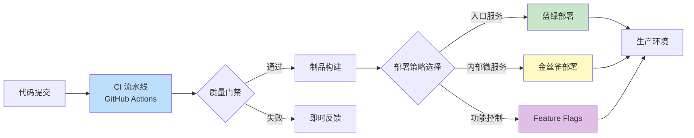
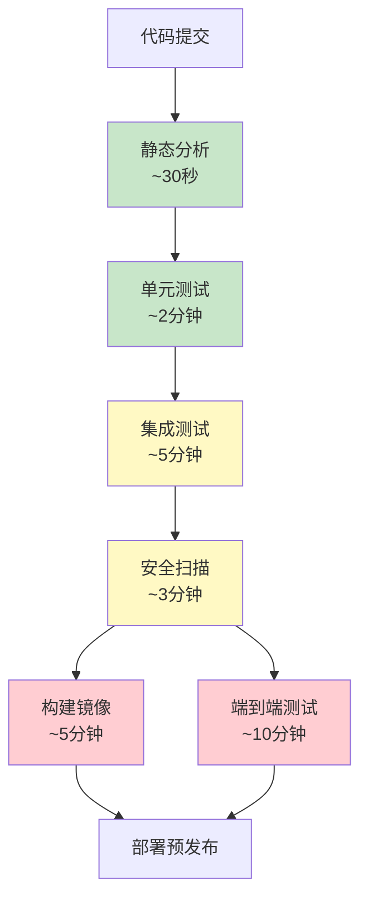
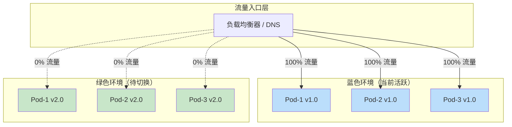
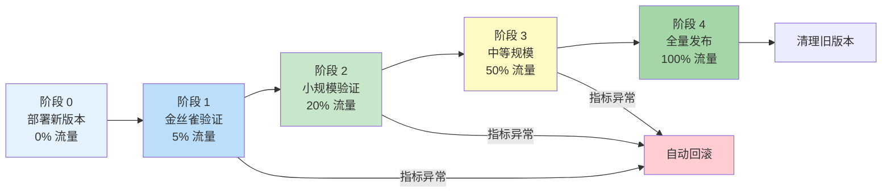
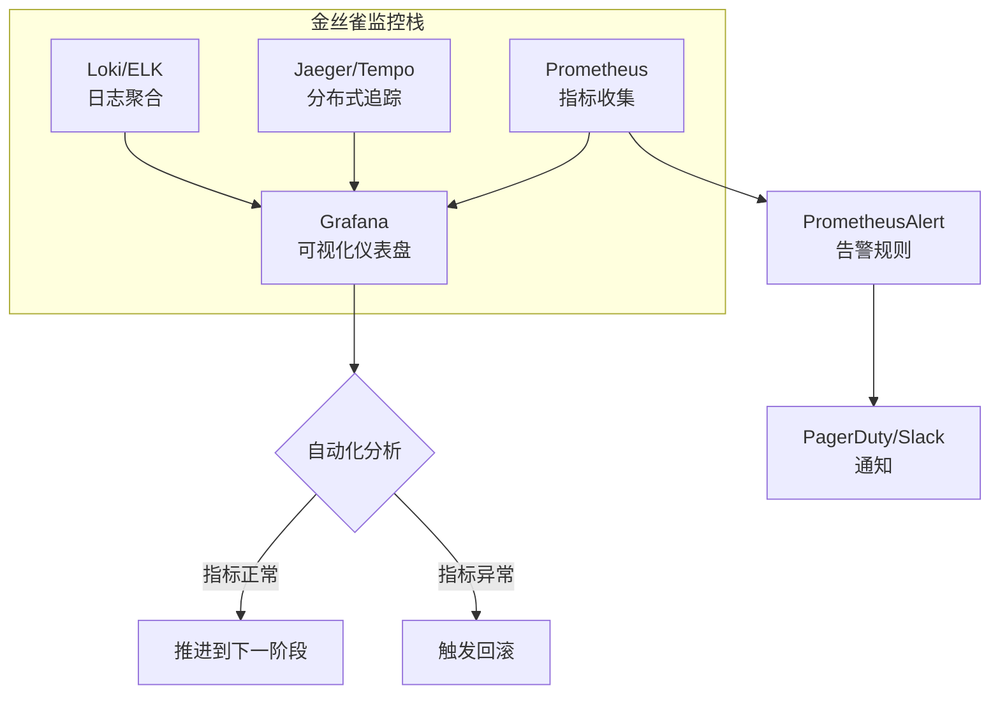
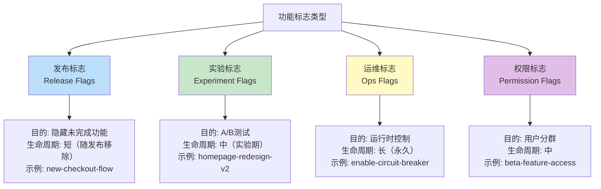
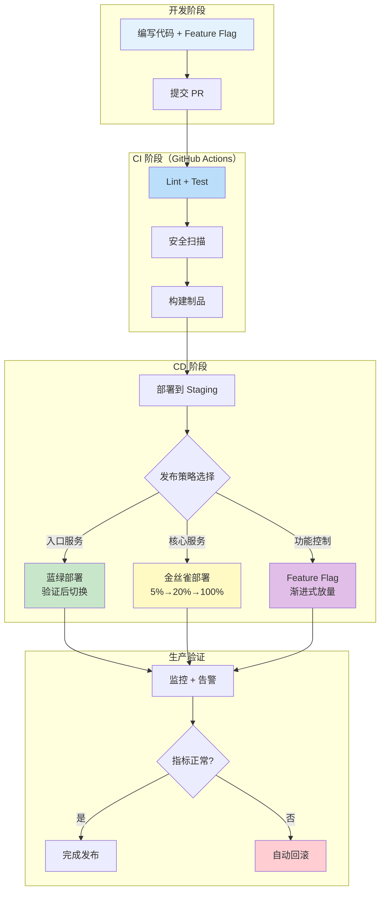
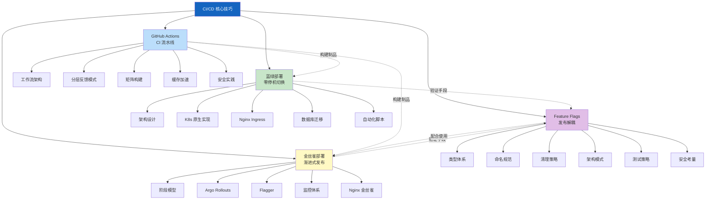

# CI/CD 核心技巧

## 本节定位与学习路径

掌握了理论基础之后，本节进入**实战层面**——将 CI/CD 的理念落地为可运行、可维护、可扩展的工程实践。理论告诉我们"为什么"，核心技巧解决"怎么做"。

本节按照 **法→术→器** 的层次递进组织：

| 层次 | 主题 | 核心问题 |
|------|------|----------|
| **法** | CI 流水线设计 | 如何构建一条高效、可靠的自动化流水线？ |
| **术** | 蓝绿部署实现 | 如何在生产环境中零停机切换版本？ |
| **术** | 金丝雀部署实施 | 如何通过渐进式发布将风险控制到最小？ |
| **器** | Feature Flags 工程 | 如何将代码部署与功能发布彻底解耦？ |



---

## 一、GitHub Actions 实战：构建企业级 CI 流水线

GitHub Actions 是 GitHub 原生的 CI/CD 平台，它以 YAML 声明式配置、庞大的 Marketplace 生态和与 GitHub 仓库的深度集成，成为了开源项目和中小团队的首选 CI 工具。掌握 GitHub Actions 不仅是学会一个工具，更是理解 CI 流水线设计模式的入口。

### 1.1 工作流基础架构

GitHub Actions 的核心概念包括：

| 概念 | 说明 | 类比 |
|------|------|------|
| **Workflow** | 一个自动化流程的定义，存储在 `.github/workflows/` 目录 | 流水线本身 |
| **Job** | 工作流中的一个任务单元，包含多个 Step | 阶段 |
| **Step** | 任务中的单个操作，可以是 Action 或 shell 命令 | 步骤 |
| **Action** | 可复用的操作单元，从 Marketplace 安装 | 工具/插件 |
| **Runner** | 执行 Job 的虚拟机环境 | 执行节点 |
| **Trigger** | 触发工作流执行的事件 | 开关 |

一个典型的 CI 工作流文件结构如下：

```yaml
# .github/workflows/ci.yml
name: CI Pipeline

# 触发条件：精确控制何时运行
on:
  push:
    branches: [main, develop]
  pull_request:
    branches: [main]
  # 定时触发：每天凌晨 2 点运行安全扫描
  schedule:
    - cron: '0 2 * * *'

# 环境变量：所有 Job 共享
env:
  REGISTRY: ghcr.io
  IMAGE_NAME: ${{ github.repository }}

jobs:
  # Job 1: 代码质量检查（快速反馈）
  lint:
    runs-on: ubuntu-latest
    steps:
      - uses: actions/checkout@v4
      - uses: actions/setup-node@v4
        with:
          node-version: '20'
          cache: 'npm'
      - run: npm ci
      - run: npm run lint
      - run: npm run type-check

  # Job 2: 单元测试（并行执行）
  test:
    runs-on: ubuntu-latest
    strategy:
      # 矩阵策略：多版本并行测试
      matrix:
        node-version: [18, 20, 22]
        test-suite: [unit, integration]
    steps:
      - uses: actions/checkout@v4
      - uses: actions/setup-node@v4
        with:
          node-version: ${{ matrix.node-version }}
          cache: 'npm'
      - run: npm ci
      - run: npm run test:${{ matrix.test-suite }}
      # 上传测试报告
      - uses: actions/upload-artifact@v4
        if: always()
        with:
          name: test-report-${{ matrix.node-version }}-${{ matrix.test-suite }}
          path: coverage/

  # Job 3: 安全扫描
  security:
    runs-on: ubuntu-latest
    steps:
      - uses: actions/checkout@v4
      - name: Run Trivy vulnerability scanner
        uses: aquasecurity/trivy-action@master
        with:
          scan-type: 'fs'
          scan-ref: '.'
          severity: 'CRITICAL,HIGH'
          exit-code: '1'  # 发现高危漏洞时失败
      - name: Dependency review
        uses: actions/dependency-review-action@v4
        with:
          fail-on-severity: high

  # Job 4: 构建镜像（依赖前三个 Job）
  build:
    needs: [lint, test, security]
    runs-on: ubuntu-latest
    if: github.event_name != 'pull_request'
    permissions:
      contents: read
      packages: write
    steps:
      - uses: actions/checkout@v4
      - name: Log in to Container Registry
        uses: docker/login-action@v3
        with:
          registry: ${{ env.REGISTRY }}
          username: ${{ github.actor }}
          password: ${{ secrets.GITHUB_TOKEN }}
      - name: Build and push
        uses: docker/build-push-action@v5
        with:
          context: .
          push: true
          tags: |
            ${{ env.REGISTRY }}/${{ env.IMAGE_NAME }}:${{ github.sha }}
            ${{ env.REGISTRY }}/${{ env.IMAGE_NAME }}:latest
          cache-from: type=gha
          cache-to: type=gha,mode=max
```

### 1.2 流水线设计的核心模式

#### 模式一：分层反馈（Fast Feedback Layering）

CI 流水线的核心设计原则是**尽早反馈**。不同类型的检查速度差异很大，应该按照速度从快到慢分层排列：



**为什么分层反馈如此重要？** 假设你的流水线总运行时间 15 分钟：
- 如果把耗时 30 秒的 lint 放在最后，开发者每次提交都要等 14 分半才能发现一个拼写错误
- 如果 lint 放在最前面，90% 的低级错误在 30 秒内就被拦截

实际效果对比：

| 反馈策略 | 平均反馈时间 | 开发者满意度 | 资源消耗 |
|----------|------------|-------------|---------|
| 串行全部执行 | 15 分钟 | 低 | 低 |
| 分层并行执行 | 2-3 分钟（lint 失败时） | 高 | 中 |
| 智能选择性执行 | 1-2 分钟 | 极高 | 最优 |

#### 模式二：矩阵构建（Matrix Strategy）

矩阵构建是 GitHub Actions 的杀手级特性——用一份配置同时测试多个环境组合：

```yaml
strategy:
  fail-fast: false  # 一个组合失败不影响其他组合
  matrix:
    os: [ubuntu-latest, windows-latest, macos-latest]
    node-version: [18, 20, 22]
    exclude:
      # 排除不需要的组合
      - os: windows-latest
        node-version: 18
    include:
      # 额外添加特殊组合
      - os: ubuntu-latest
        node-version: 22
        experimental: true
```

**矩阵策略的注意事项：**
- 矩阵组合数量 = 各维度大小的乘积，4×3 = 12 个 Job，要评估时间成本和 GitHub Actions 的并发限制
- 使用 `exclude` 和 `include` 精细控制组合，避免浪费资源
- 用 `fail-fast: false` 确保所有组合都运行完毕，而不是第一个失败就停止

#### 模式三：缓存加速（Cache Strategy）

构建速度直接影响开发效率。GitHub Actions 提供多层缓存机制：

```yaml
steps:
  - uses: actions/checkout@v4

  # 方式一：官方 setup-* action 内置缓存
  - uses: actions/setup-node@v4
    with:
      node-version: '20'
      cache: 'npm'  # 自动缓存 ~/.npm

  # 方式二：通用缓存
  - uses: actions/cache@v4
    with:
      path: |
        ~/.gradle/caches
        ~/.gradle/wrapper
      key: gradle-${{ runner.os }}-${{ hashFiles('**/*.gradle*') }}
      restore-keys: |
        gradle-${{ runner.os }}-

  # 方式三：Docker 层缓存
  - uses: docker/build-push-action@v5
    with:
      cache-from: type=gha
      cache-to: type=gha,mode=max
```

**缓存命中率优化要点：**
- 缓存 key 必须精确反映输入变化——用 `hashFiles()` 计算依赖文件的哈希
- `restore-keys` 提供模糊匹配，key 失效时回退到最近的缓存
- Docker 构建使用 `mode=max` 缓存所有层，而不只是最终层
- 大缓存（>1GB）反而可能拖慢速度，因为下载时间增加

### 1.3 高级实践：工作流复用与安全

#### 可复用工作流（Reusable Workflows）

当团队有多个仓库需要统一的 CI 标准时，可复用工作流消除了配置复制：

```yaml
# 仓库 A: .github/workflows/reusable-ci.yml（定义可复用工作流）
name: Reusable CI
on:
  workflow_call:
    inputs:
      node-version:
        required: false
        type: string
        default: '20'
    secrets:
      CODECOV_TOKEN:
        required: true

jobs:
  ci:
    runs-on: ubuntu-latest
    steps:
      - uses: actions/checkout@v4
      - uses: actions/setup-node@v4
        with:
          node-version: ${{ inputs.node-version }}
      - run: npm ci &amp;&amp; npm test
      - uses: codecov/codecov-action@v4
        with:
          token: ${{ secrets.CODECOV_TOKEN }}
```

```yaml
# 仓库 B: .github/workflows/ci.yml（调用可复用工作流）
name: CI
on: [push, pull_request]
jobs:
  ci:
    uses: org/shared-workflows/.github/workflows/reusable-ci.yml@main
    with:
      node-version: '22'
    secrets:
      CODECOV_TOKEN: ${{ secrets.CODECOV_TOKEN }}
```

#### Secrets 管理与安全最佳实践

CI/CD 流水线是安全攻击的高价值目标——它拥有部署密钥、API Token、云平台凭证等敏感信息。以下是必须遵守的安全实践：

| 实践 | 说明 | 违反后果 |
|------|------|---------|
| **最小权限原则** | 每个 Job 只授予必要的 `permissions` | 泄露扩大化 |
| **Secret 不打印** | 避免 `echo $SECRET`，GitHub 会自动掩码但不绝对 | 凭证暴露 |
| **环境隔离** | 不同环境（staging/production）使用不同的 Secret | 跨环境污染 |
| **定期轮换** | 使用短生命周期的 Token，如 GitHub App Token | 过期导致流水线故障 |
| **OIDC 无密钥认证** | 使用 OIDC 联合身份代替长期凭证 | 消除密钥泄露风险 |

OIDC 无密钥认证的示例（AWS）：

```yaml
deploy:
  runs-on: ubuntu-latest
  permissions:
    id-token: write   # 允许请求 OIDC Token
    contents: read
  steps:
    - uses: aws-actions/configure-aws-credentials@v4
      with:
        role-to-assume: arn:aws:iam::123456789012:role/github-actions
        aws-region: ap-northeast-1
    # 不需要 AWS_ACCESS_KEY_ID 和 AWS_SECRET_ACCESS_KEY
    - run: aws s3 sync ./dist s3://my-bucket
```

### 1.4 GitHub Actions 与其他 CI 工具对比

| 维度 | GitHub Actions | GitLab CI | Jenkins | CircleCI |
|------|---------------|-----------|---------|----------|
| **托管方式** | SaaS（含自建 Runner） | SaaS / 自建 | 纯自建 | SaaS |
| **配置语言** | YAML | YAML | Groovy (Jenkinsfile) | YAML |
| **生态** | Marketplace 20000+ | 内置 + 模板 | 插件 1800+ | Orb 市场 |
| **免费额度** | 2000 分钟/月 | 400 分钟/月 | 无限（自建） | 6000 分钟/月 |
| **学习曲线** | 低 | 低-中 | 高 | 低 |
| **适合场景** | GitHub 项目、开源 | DevOps 全流程 | 企业级复杂流水线 | 中小团队 SaaS |

**选型建议：**
- 代码托管在 GitHub → GitHub Actions（集成度最高）
- 需要一体化 DevOps 平台 → GitLab CI（代码+CI+CD+安全一体）
- 已有大量 Jenkins 插件投入 → 继续 Jenkins（迁移成本高）
- 追求简单高效的 SaaS 体验 → CircleCI 或 GitHub Actions

---

## 二、蓝绿部署实现：零停机切换的工程实践

蓝绿部署是零停机部署的经典模式。理论基础在第 46.4 节已经阐述，本节聚焦于**如何在实际环境中落地实现**。

### 2.1 蓝绿部署的核心架构



蓝绿切换的本质是**流量切换**——两套环境同时运行，通过改变流量路由来完成版本切换。关键决策点在于：**流量在哪里切换？**

| 切换点 | 实现方式 | 延迟 | 适用场景 |
|--------|---------|------|---------|
| **DNS 层** | 修改 DNS A/CNAME 记录 | 分钟级（受 TTL 影响） | 多区域部署、全局切换 |
| **负载均衡器** | 修改 ALB/NLB 后端目标组 | 秒级 | 云平台应用（AWS ALB、GCP LB） |
| **Service 层** | Kubernetes Service 标签选择器切换 | 秒级 | Kubernetes 原生部署 |
| **Ingress 层** | 修改 Ingress 后端引用 | 秒级 | K8s 集群内部服务 |

### 2.2 Kubernetes 原生蓝绿部署

在 Kubernetes 环境中，蓝绿部署通过 Service 的标签选择器（Label Selector）实现流量切换：

```yaml
# blue-deployment.yaml —— 当前活跃版本 v1.0
apiVersion: apps/v1
kind: Deployment
metadata:
  name: my-app-blue
  labels:
    app: my-app
    slot: blue
    version: v1.0
spec:
  replicas: 3
  selector:
    matchLabels:
      app: my-app
      slot: blue
  template:
    metadata:
      labels:
        app: my-app
        slot: blue
        version: v1.0
    spec:
      containers:
        - name: my-app
          image: myregistry/my-app:v1.0
          ports:
            - containerPort: 8080
---
# green-deployment.yaml —— 新版本 v2.0（无流量）
apiVersion: apps/v1
kind: Deployment
metadata:
  name: my-app-green
  labels:
    app: my-app
    slot: green
    version: v2.0
spec:
  replicas: 3
  selector:
    matchLabels:
      app: my-app
      slot: green
  template:
    metadata:
      labels:
        app: my-app
        slot: green
        version: v2.0
    spec:
      containers:
        - name: my-app
          image: myregistry/my-app:v2.0
          ports:
            - containerPort: 8080
---
# service.yaml —— Service 通过 selector 控制流量指向
apiVersion: v1
kind: Service
metadata:
  name: my-app
spec:
  selector:
    app: my-app
    slot: blue  # ← 修改这里完成蓝绿切换
  ports:
    - port: 80
      targetPort: 8080
  type: ClusterIP
```

**切换操作只需一条命令：**

```bash
# 将流量从蓝色切换到绿色
kubectl patch service my-app -p '{"spec":{"selector":{"slot":"green"}}}'

# 验证切换结果
kubectl get endpoints my-app
# 应显示 green-deployment 的 Pod IP
```

### 2.3 Nginx Ingress 蓝绿部署

使用 Nginx Ingress Controller 的注解实现更精细的蓝绿控制：

```yaml
# ingress-blue.yaml —— 当前版本
apiVersion: networking.k8s.io/v1
kind: Ingress
metadata:
  name: my-app
  annotations:
    nginx.ingress.kubernetes.io/upstream-hash-by: "$remote_addr"
spec:
  ingressClassName: nginx
  rules:
    - host: my-app.example.com
      http:
        paths:
          - path: /
            pathType: Prefix
            backend:
              service:
                name: my-app-blue
                port:
                  number: 80
---
# ingress-green.yaml —— 新版本（切换时替换上面的 backend）
apiVersion: networking.k8s.io/v1
kind: Ingress
metadata:
  name: my-app
spec:
  ingressClassName: nginx
  rules:
    - host: my-app.example.com
      http:
        paths:
          - path: /
            pathType: Prefix
            backend:
              service:
                name: my-app-green
                port:
                  number: 80
```

### 2.4 蓝绿部署的数据库迁移挑战

蓝绿部署最大的工程难题不在应用层，而在**数据层**。两套环境共享同一数据库时，必须确保：

**扩展-收缩（Expand-Contract）模式：**


**具体操作步骤：**

```sql
-- 阶段1: 扩展 —— 新版本需要的新字段
ALTER TABLE orders ADD COLUMN shipping_method VARCHAR(50);
ALTER TABLE orders ADD COLUMN tracking_number VARCHAR(100);

-- 阶段2: 双写 —— 应用代码同时写入新旧字段
-- （应用层修改，确保两个版本都能正常工作）

-- 阶段3: 迁移历史数据
UPDATE orders SET shipping_method = 'standard' WHERE shipping_method IS NULL;

-- 阶段4: 流量切换到新版本

-- 阶段5: 收缩 —— 确认新版本稳定后删除旧字段
-- ALTER TABLE orders DROP COLUMN old_shipping_type;
```

### 2.5 自动化蓝绿部署脚本

将蓝绿切换封装为可重复执行的脚本：

```bash
#!/bin/bash
# blue-green-switch.sh —— Kubernetes 蓝绿切换脚本
set -euo pipefail

SERVICE_NAME="${1:?用法: $0 <service-name>}"
NAMESPACE="${2:-default}"

# 确定当前活跃环境
CURRENT_SLOT=$(kubectl get service "$SERVICE_NAME" \
  -n "$NAMESPACE" \
  -o jsonpath='{.spec.selector.slot}')

# 确定目标环境
if [ "$CURRENT_SLOT" = "blue" ]; then
  TARGET_SLOT="green"
else
  TARGET_SLOT="blue"
fi

echo "当前活跃环境: $CURRENT_SLOT"
echo "目标切换环境: $TARGET_SLOT"

# 步骤 1: 验证目标环境的 Pod 就绪
READY=$(kubectl get deployment "${SERVICE_NAME}-${TARGET_SLOT}" \
  -n "$NAMESPACE" \
  -o jsonpath='{.status.readyReplicas}')
DESIRED=$(kubectl get deployment "${SERVICE_NAME}-${TARGET_SLOT}" \
  -n "$NAMESPACE" \
  -o jsonpath='{.spec.replicas}')

if [ "${READY:-0}" -ne "$DESIRED" ]; then
  echo "错误: 目标环境就绪 Pod ($READY) 不等于期望数量 ($DESIRED)"
  exit 1
fi

# 步骤 2: 执行切换
kubectl patch service "$SERVICE_NAME" \
  -n "$NAMESPACE" \
  -p "{\"spec\":{\"selector\":{\"slot\":\"${TARGET_SLOT}\"}}}"

echo "切换完成: 流量已导向 $TARGET_SLOT"

# 步骤 3: 等待旧环境连接排空
echo "等待 30 秒排空旧连接..."
sleep 30

# 步骤 4: 验证切换结果
NEW_ENDPOINTS=$(kubectl get endpoints "$SERVICE_NAME" \
  -n "$NAMESPACE" \
  -o jsonpath='{.subsets[*].addresses[*].ip}' | tr ' ' '\n' | wc -l)
echo "新环境活跃端点数: $NEW_ENDPOINTS"
echo "蓝绿切换完成 ✓"
```

---

## 三、金丝雀部署实施：渐进式发布的工程落地

金丝雀部署是渐进式发布的典型实现——新版本先接收极小比例的流量，通过监控指标验证稳定性后逐步扩大流量，直到完全替换旧版本。

### 3.1 金丝雀发布阶段模型



每个阶段之间需要设定**质量门禁**——一组自动化的健康检查指标，决定是推进到下一阶段还是回滚：

| 检查维度 | 指标 | 通过阈值 | 失败动作 |
|---------|------|---------|---------|
| **错误率** | HTTP 5xx 比例 | < 1%（高于基线不超过 0.5%） | 立即回滚 |
| **延迟** | P99 响应时间 | < 基线的 120% | 暂停观察 |
| **业务指标** | 转化率/下单率 | 不低于基线的 95% | 人工决策 |
| **资源** | CPU/内存使用率 | 不超过基线的 130% | 暂停观察 |
| **依赖** | 下游服务错误率 | 不高于基线 | 暂停观察 |

### 3.2 使用 Argo Rollouts 实现金丝雀

Argo Rollouts 是 Kubernetes 原生的渐进式交付控制器，它扩展了 Deployment 资源，提供了金丝雀、蓝绿等高级部署策略：

```yaml
# rollouts-canary.yaml
apiVersion: argoproj.io/v1alpha1
kind: Rollout
metadata:
  name: my-app
spec:
  replicas: 6
  revisionHistoryLimit: 5
  selector:
    matchLabels:
      app: my-app
  template:
    metadata:
      labels:
        app: my-app
    spec:
      containers:
        - name: my-app
          image: myregistry/my-app:v2.0
          ports:
            - containerPort: 8080
  strategy:
    canary:
      # 金丝雀发布步骤
      steps:
        # 步骤 1: 部署 1 个金丝雀 Pod，等待 5 分钟
        - setWeight: 5         # 5% 流量
        - pause: { duration: 5m }
        # 步骤 2: 运行自动化分析
        - analysis:
            templates:
              - templateName: canary-analysis
        # 步骤 3: 扩大到 20%
        - setWeight: 20
        - pause: { duration: 10m }
        # 步骤 4: 再次分析
        - analysis:
            templates:
              - templateName: canary-analysis
        # 步骤 5: 扩大到 60%
        - setWeight: 60
        - pause: { duration: 10m }
        # 步骤 6: 全量发布
        - setWeight: 100
      
      # 流量路由（配合 Istio/NGINX）
      trafficRouting:
        istio:
          virtualServices:
            - name: my-app-vsvc
              routes:
                - primary
---
# canary-analysis.yaml —— 自动化分析模板
apiVersion: argoproj.io/v1alpha1
kind: AnalysisTemplate
metadata:
  name: canary-analysis
spec:
  args:
    - name: service-name
    - name: namespace
  metrics:
    - name: error-rate
      interval: 1m
      count: 5
      successCondition: result[0] < 0.01
      failureLimit: 3
      provider:
        prometheus:
          address: http://prometheus.monitoring:9090
          query: |
            sum(rate(http_requests_total{
              service="{{args.service-name}}",
              namespace="{{args.namespace}}",
              code=~"5.."
            }[5m])) /
            sum(rate(http_requests_total{
              service="{{args.service-name}}",
              namespace="{{args.namespace}}"
            }[5m]))
    - name: latency-p99
      interval: 1m
      count: 5
      successCondition: result[0] < 500
      failureLimit: 3
      provider:
        prometheus:
          address: http://prometheus.monitoring:9090
          query: |
            histogram_quantile(0.99,
              sum(rate(http_request_duration_seconds_bucket{
                service="{{args.service-name}}",
                namespace="{{args.namespace}}"
              }[5m])) by (le)
            ) * 1000
```

### 3.3 使用 Flagger 实现金丝雀

Flagger 是另一个成熟的渐进式交付工具，它与 Istio、Linkerd、AWS App Mesh、NGINX Ingress 等流量管理工具集成：

```yaml
# flagger-canary.yaml
apiVersion: flagger.app/v1beta1
kind: Canary
metadata:
  name: my-app
  namespace: production
spec:
  targetRef:
    apiVersion: apps/v1
    kind: Deployment
    name: my-app
  progressDeadlineSeconds: 600
  service:
    port: 80
    targetPort: 8080
  analysis:
    interval: 1m
    threshold: 3        # 连续失败 3 次触发回滚
    maxWeight: 50       # 金丝雀最大流量比例
    stepWeight: 10      # 每次推进的流量比例
    metrics:
      - name: request-success-rate
        thresholdRange:
          min: 99       # 成功率不低于 99%
        interval: 1m
      - name: request-duration
        thresholdRange:
          max: 500      # P99 延迟不超过 500ms
        interval: 1m
    webhooks:           # 自定义验证钩子
      - name: smoke-test
        url: http://flagger-loadtester.test/
        timeout: 15s
        metadata:
          type: bash
          cmd: "curl -s http://my-app-canary.production:80/health"
```

### 3.4 金丝雀部署的监控体系

金丝雀部署的成功与否完全依赖于**可观测性**。没有完善的监控，金丝雀就是在盲人摸象。



**关键监控面板应包含：**

```yaml
# Grafana Dashboard 核心面板列表
panels:
  - title: 金丝雀 vs 稳定版错误率对比
    query: |
      sum(rate(http_requests_total{version="canary",code=~"5.."}[5m]))
      /
      sum(rate(http_requests_total{version="canary"}[5m]))
    vs
      sum(rate(http_requests_total{version="stable",code=~"5.."}[5m]))
      /
      sum(rate(http_requests_total{version="stable"}[5m]))
  
  - title: 金丝雀 vs 稳定版 P99 延迟对比
    query: |
      histogram_quantile(0.99, sum(rate(http_request_duration_seconds_bucket{version="canary"}[5m])) by (le))
    vs
      histogram_quantile(0.99, sum(rate(http_request_duration_seconds_bucket{version="stable"}[5m])) by (le))
  
  - title: 金丝雀流量比例
    query: sum(rate(http_requests_total{version="canary"}[5m])) / sum(rate(http_requests_total[5m]))
  
  - title: 金丝雀部署阶段
    query: argo_rollouts_info{phase="canary"}
```

### 3.5 Nginx 原生金丝雀（无 Service Mesh）

如果你没有 Istio 等服务网格，Nginx Ingress Controller 也支持基于权重的流量分割：

```yaml
apiVersion: networking.k8s.io/v1
kind: Ingress
metadata:
  name: my-app-canary
  annotations:
    # 启用金丝雀模式
    nginx.ingress.kubernetes.io/canary: "true"
    # 基于权重的流量分割（百分比）
    nginx.ingress.kubernetes.io/canary-weight: "10"
spec:
  ingressClassName: nginx
  rules:
    - host: my-app.example.com
      http:
        paths:
          - path: /
            pathType: Prefix
            backend:
              service:
                name: my-app-canary
                port:
                  number: 80
```

Nginx 还支持基于 Header、Cookie 或 Query 参数的金丝雀路由，适合 A/B 测试场景：

```yaml
# 基于 Header 的金丝雀（内部测试用）
annotations:
  nginx.ingress.kubernetes.io/canary: "true"
  nginx.ingress.kubernetes.io/canary-by-header: "X-Canary"
  nginx.ingress.kubernetes.io/canary-by-header-value: "always"
```

---

## 四、Feature Flags：代码部署与功能发布的终极解耦

功能标志（Feature Flags / Feature Toggles）是现代持续部署的关键技术——它将"代码部署到生产环境"和"用户看到新功能"拆分为两个完全独立的操作。Martin Fowler 将其列为持续交付的核心模式之一。

### 4.1 功能标志的类型体系

不同类型的标志服务于不同的目的，生命周期和管理方式也截然不同：



| 类型 | 生命周期 | 变更频率 | 清理策略 | 典型案例 |
|------|---------|---------|---------|---------|
| **发布标志** | 天级 | 低（开→关） | 功能全量发布后立即移除 | `dark-launch-new-api` |
| **实验标志** | 周级 | 中（调比例） | 实验结论后移除 | `pricing-model-v3` |
| **运维标志** | 月/年级 | 高（紧急切换） | 保留，纳入运维手册 | `fallback-to-cache` |
| **权限标志** | 周/月级 | 低 | 功能 GA 后转为权限系统 | `enterprise-only-features` |

### 4.2 功能标志的工程化管理

#### 命名规范

一致的命名规范是功能标志可管理性的基础：

格式: <domain>.<feature>.<type>

示例:
  checkout.new-flow.release          # 发布标志：结账新流程
  search.ai-ranking.experiment       # 实验标志：AI搜索排序
  payment.circuit-breaker.ops        # 运维标志：支付熔断开关
  dashboard.advanced-analytics.permission  # 权限标志：高级分析面板

#### 清理策略

功能标志最大的技术债来源是**不清理**。每个发布标志都应该有明确的清理计划：

```python
# 好的做法：代码中明确标记标志的预期移除时间
class CheckoutService:
    def process(self, order):
        # FLAG: checkout.new-flow.release
        # 预计移除时间: 2026-07-15（全量发布后 2 周）
        # 负责人: @kyle
        if self.flags.is_enabled("checkout.new-flow.release"):
            return self._new_checkout_flow(order)
        return self._legacy_checkout_flow(order)
```

在 CI 流水线中添加标志过期检测：

```yaml
# .github/workflows/flag-hygiene.yml
name: Feature Flag Hygiene
on:
  schedule:
    - cron: '0 9 * * 1'  # 每周一检查
jobs:
  check-expired-flags:
    runs-on: ubuntu-latest
    steps:
      - uses: actions/checkout@v4
      - name: Check for expired flags
        run: |
          # 扫描代码中的标志引用
          FLAGS=$(grep -r "is_enabled\|isEnabled\|get_variant" \
            --include="*.py" --include="*.ts" --include="*.go" \
            -h | grep -oP '"[a-z]+\.[a-z]+\.\w+"' | sort -u)
          
          # 对比标志管理平台中的过期标志
          echo "代码中活跃的标志:"
          echo "$FLAGS"
          
          # 与 LaunchDarkly/Unleash API 对比
          # 如果标志已超过预期生命周期，发送告警
```

### 4.3 功能标志的架构模式

#### 模式一：本地缓存 + 远程更新

功能标志的评估必须极快——它在代码的热路径上执行，任何延迟都会直接影响用户体验。因此，标志的值必须在本地缓存，远程配置中心只负责更新缓存：

```python
import json
import time
import threading
from typing import Dict, Any, Optional

class FeatureFlagClient:
    """功能标志客户端：本地缓存 + 后台轮询"""
    
    def __init__(self, config_url: str, poll_interval: int = 30):
        self.config_url = config_url
        self.poll_interval = poll_interval
        self._flags: Dict[str, Any] = {}
        self._lock = threading.Lock()
        self._start_polling()
    
    def _start_polling(self):
        """后台线程定期拉取最新配置"""
        def poll():
            while True:
                try:
                    response = requests.get(self.config_url, timeout=5)
                    new_flags = response.json()
                    with self._lock:
                        self._flags = new_flags
                except Exception as e:
                    logging.warning(f"标志更新失败，使用缓存: {e}")
                time.sleep(self.poll_interval)
        
        thread = threading.Thread(target=poll, daemon=True)
        thread.start()
    
    def is_enabled(self, flag_key: str, 
                   user_context: Optional[Dict] = None,
                   default: bool = False) -> bool:
        """评估标志是否启用（<1ms，纯本地操作）"""
        with self._lock:
            flag = self._flags.get(flag_key)
            if flag is None:
                return default
            
            # 检查是否为灰度发布标志
            if flag.get("type") == "percentage":
                user_id = (user_context or {}).get("user_id", "")
                # 一致性哈希确保同一用户始终看到相同版本
                hash_val = hash(f"{flag_key}:{user_id}") % 100
                return hash_val < flag.get("percentage", 0)
            
            return flag.get("enabled", default)
    
    def get_variant(self, flag_key: str,
                    user_context: Optional[Dict] = None) -> str:
        """获取多变体标志的变体值"""
        with self._lock:
            flag = self._flags.get(flag_key, {})
            variants = flag.get("variants", {})
            default = flag.get("default_variant", "control")
            
            if not variants:
                return default
            
            user_id = (user_context or {}).get("user_id", "")
            hash_val = hash(f"{flag_key}:{user_id}") % 100
            
            cumulative = 0
            for variant_name, weight in variants.items():
                cumulative += weight
                if hash_val < cumulative:
                    return variant_name
            return default
```

#### 模式二：渐进式发布控制

功能标志最常见的用途是控制功能的渐进式发布。以下是一个典型的发布流程：

```python
class ProgressiveRollout:
    """渐进式发布控制器"""
    
    STAGES = [
        {"name": "内部测试", "percentage": 0, "teams": ["engineering"]},
        {"name": "Alpha", "percentage": 1, "user_filter": "beta_users"},
        {"name": "小规模灰度", "percentage": 5},
        {"name": "中等规模", "percentage": 25},
        {"name": "大规模", "percentage": 50},
        {"name": "全量发布", "percentage": 100},
    ]
    
    def __init__(self, flag_client: FeatureFlagClient):
        self.client = flag_client
    
    def should_show_feature(self, feature_key: str, 
                            user: dict) -> tuple[bool, str]:
        """
        判断用户是否应该看到新功能
        返回: (是否启用, 当前阶段名称)
        """
        flag = self.client._flags.get(feature_key, {})
        stage_index = flag.get("stage", -1)
        
        if stage_index < 0 or stage_index >= len(self.STAGES):
            return False, "未发布"
        
        stage = self.STAGES[stage_index]
        
        # 检查团队限制
        if "teams" in stage:
            user_team = user.get("team", "")
            if user_team not in stage["teams"]:
                return False, stage["name"]
        
        # 检查用户过滤
        if "user_filter" in stage:
            if not self._matches_filter(user, stage["user_filter"]):
                return False, stage["name"]
        
        # 检查百分比
        if stage["percentage"] < 100:
            user_id = user.get("id", "")
            hash_val = hash(f"{feature_key}:{user_id}") % 100
            if hash_val >= stage["percentage"]:
                return False, stage["name"]
        
        return True, stage["name"]
    
    def _matches_filter(self, user: dict, filter_name: str) -> bool:
        """用户过滤条件匹配"""
        filters = {
            "beta_users": lambda u: u.get("is_beta", False),
            "enterprise": lambda u: u.get("plan") == "enterprise",
            "trial_users": lambda u: u.get("is_trial", False),
        }
        return filters.get(filter_name, lambda u: False)(user)
```

### 4.4 主流功能标志平台对比

| 平台 | 开源 | 核心特色 | SDK 语言支持 | 适合规模 |
|------|------|---------|-------------|---------|
| **Unleash** | ✓（OSS） | 自托管友好，规则引擎强大 | 15+ 语言 | 中小→大型 |
| **LaunchDarkly** | ✗（SaaS） | 功能最全，企业级支持 | 25+ 语言 | 中型→大型企业 |
| **Flagsmith** | ✓（OSS） | 自托管 + SaaS 双模式 | 10+ 语言 | 中小型 |
| **Flipt** | ✓（OSS） | 轻量级，嵌入式 | Go/REST | 小型→中型 |
| **ConfigCat** | 部分开源 | 简单易用，混合标志 | 10+ 语言 | 小型→中型 |
| **自建** | - | 完全控制，定制化 | 自定义 | 任何 |

**选型建议：**
- 小团队快速上手 → ConfigCat 或 Flipt
- 中型团队需要规则引擎 → Unleash（开源自托管）
- 大型企业需要合规和审计 → LaunchDarkly
- 对数据安全有严格要求 → Unleash 或 Flagsmith 自托管

### 4.5 功能标志的测试策略

功能标志引入了大量的条件分支，如果测试不充分，就会产生 $2^n$ 种组合（n 为标志数量）。有效的测试策略：

```python
import pytest

class TestFeatureFlags:
    """功能标志测试策略"""
    
    def test_flag_disabled_uses_old_path(self, flag_client):
        """必须测试：标志关闭时走旧路径"""
        flag_client.set("checkout.new-flow.release", enabled=False)
        service = CheckoutService(flag_client)
        result = service.process(Order(items=[Item("book")]))
        assert result.flow == "legacy"
    
    def test_flag_enabled_uses_new_path(self, flag_client):
        """必须测试：标志开启时走新路径"""
        flag_client.set("checkout.new-flow.release", enabled=True)
        service = CheckoutService(flag_client)
        result = service.process(Order(items=[Item("book")]))
        assert result.flow == "new"
    
    def test_percentage_rollout_consistency(self, flag_client):
        """灰度发布：同一用户始终看到相同版本"""
        flag_client.set("search.v2", type="percentage", percentage=50)
        user = {"user_id": "user-123"}
        
        # 多次调用结果一致
        results = [
            feature_flag_client.is_enabled("search.v2", user)
            for _ in range(100)
        ]
        assert all(r == results[0] for r in results)
    
    def test_all_flags_independent(self, flag_client):
        """组合测试：多个标志独立工作"""
        flag_client.set("feature-a", enabled=True)
        flag_client.set("feature-b", enabled=False)
        
        # feature-a 启用，feature-b 禁用，互不影响
        assert service.process({"features": ["a", "b"]}).has_a is True
        assert service.process({"features": ["a", "b"]}).has_b is False
    
    @pytest.mark.parametrize("flag_state", [True, False])
    def test_graceful_fallback(self, flag_client, flag_state):
        """容错测试：标志服务不可用时的降级行为"""
        flag_client.set("checkout.new-flow", enabled=flag_state)
        flag_client.simulate_outage()
        
        # 即使标志服务挂了，业务不能中断
        result = service.process(order)
        assert result.success is True  # 应使用默认值
```

### 4.6 功能标志的安全考量

功能标志虽然方便，但如果管理不当会引入安全风险：

| 风险 | 场景 | 防范措施 |
|------|------|---------|
| **信息泄露** | 客户端标志暴露未发布功能 | 敏感标志仅在服务端使用 |
| **权限绕过** | 用户通过修改标志访问未授权功能 | 服务端二次校验权限 |
| **审计缺失** | 标志变更无记录，出问题无法追溯 | 所有变更通过 API，记录审计日志 |
| **无限膨胀** | 标志数量失控，代码充斥条件分支 | 建立清理流程，设定数量上限 |
| **配置冲突** | 多个标志组合产生意外行为 | 标志依赖关系文档化 |

---

## 五、实战组合：四大技巧的协同运用

在真实的生产系统中，这四种技巧不是孤立使用的，而是**组合运用**形成完整的发布体系：



### 典型发布流程

**场景：电商系统发布新的支付功能**

1. 开发者在代码中添加 Feature Flag: payment.new-gateway
   → 代码部署到生产环境，但功能对用户不可见

2. GitHub Actions 自动构建并部署（蓝绿部署）
   → 新版本部署到绿色环境，流量仍在蓝色环境

3. 运维验证绿色环境健康后，切换流量到绿色环境
   → 现在生产环境运行新代码，但新支付功能仍被 Flag 隐藏

4. 产品团队开启 Feature Flag，设置为内部测试
   → 工程团队验证新支付流程

5. 逐步放量: 1% → 10% → 50% → 100%
   → 每个阶段观察支付成功率、错误率、延迟

6. 全量发布后，清理 Feature Flag 代码
   → 移除条件分支，代码恢复简洁

### 常见误区与纠正

| 误区 | 后果 | 纠正 |
|------|------|------|
| 蓝绿部署 = 万能解药 | 数据库迁移不兼容，切换后数据不一致 | 使用扩展-收缩模式处理数据层变更 |
| 金丝雀只看错误率 | 忽略延迟劣化和业务指标下降 | 建立多维度监控（错误率+延迟+业务指标） |
| Feature Flag 用完不清理 | 代码充满条件分支，维护成本飙升 | CI 流水线检测过期标志，设定强制清理策略 |
| 标志太多不管理 | 组合爆炸，测试覆盖不了 | 建立标志目录，设定数量上限（建议<50个活跃标志） |
| 所有服务同一种部署策略 | 简单服务用蓝绿浪费资源，核心服务用滚动风险高 | 按服务重要性和变更风险选择策略 |

---

## 本节知识架构



掌握这四种核心技巧后，你已经具备了构建完整 CI/CD 体系的关键能力。GitHub Actions 让你实现自动化的代码验证和构建，蓝绿部署和金丝雀部署让你安全地将变更推向生产，Feature Flags 让你拥有对功能发布的精细控制权。在后续的实战案例中，我们将看到这些技巧如何在真实的电商系统、金融平台和 SaaS 产品中协同运作。
