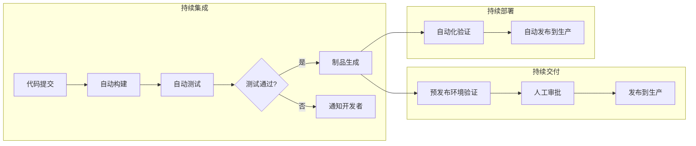
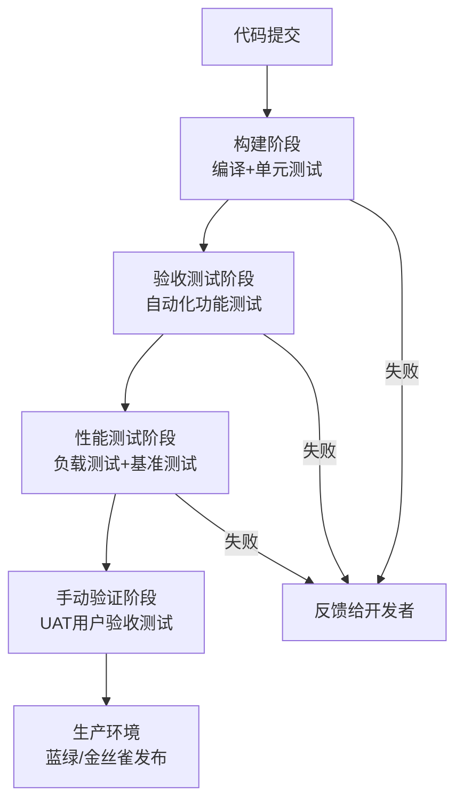
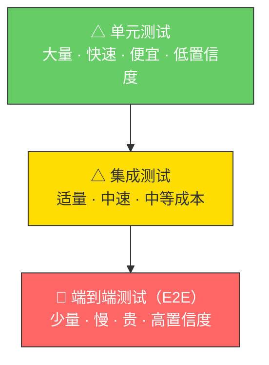

## 1. CICD 概述与背景

### 1.1 什么是 CICD

CICD 是 **Continuous Integration（持续集成）**、**Continuous Delivery（持续交付）** 和 **Continuous Deployment（持续部署）** 三个概念的统称。它是一套软件开发实践方法论，旨在通过自动化手段，将代码从编写到上线的整个流程变得更快、更可靠、更可重复。

用一句话概括：**CICD 让软件团队能够以小批量、高频率的方式，安全地将变更交付给用户。**

### 1.2 为什么需要 CICD

在没有 CICD 的传统开发模式下，软件交付面临一系列痛点：

| 痛点 | 具体表现 | 后果 |
|------|----------|------|
| 部署周期长 | 一个版本需要数周甚至数月才能上线 | 市场响应慢，错过商业窗口 |
| 部署风险高 | 一次性变更数百个文件，人工手动部署 | 上线即故障，回滚困难 |
| 环境不一致 | 开发环境、测试环境、生产环境配置不同 | "在我机器上能跑"成为常态 |
| 反馈延迟 | Bug 在集成阶段才暴露，修复成本成倍增长 | 开发效率低，团队士气差 |
| 知识壁垒 | 部署流程依赖少数"英雄人物" | 人员离职即系统瘫痪 |

CICD 的核心价值在于：**将"偶尔的、高风险的大爆炸式发布"转变为"频繁的、低风险的增量式交付"。**

### 1.3 历史演进

CICD 并非凭空出现，而是软件工程实践数十年演进的结果：


- **1990s — 手动部署时代**：代码通过 FTP 上传到服务器，部署是运维团队的"黑魔法"，没有自动化测试，没有版本控制的严格使用。
- **2000s — 持续集成兴起**：Martin Fowler 在 2006 年发表经典文章《Continuous Integration》，CI 概念正式确立。CruiseControl、Hudson（后改名 Jenkins）等工具涌现。
- **2010s — 持续交付普及**：Jez Humble 和 David Farley 出版《Continuous Delivery》一书，将 CI 扩展为完整的交付流水线。Docker、Kubernetes 等容器技术让环境一致性问题得到根本解决。
- **2020s — GitOps 与平台工程**：ArgoCD、Flux 等 GitOps 工具将 Git 作为部署的唯一事实来源。平台工程（Platform Engineering）兴起，内部开发者平台（IDP）成为企业标配。
- **2025+ — 智能交付**：AI 驱动的代码审查、智能测试生成、预测性部署风险评估等开始进入实际生产。

### 1.4 CICD 三兄弟的区别

很多人将 CI、CD、CD 混为一谈，但它们有明确的边界：

| 概念 | 全称 | 核心动作 | 触发条件 | 目标 |
|------|------|----------|----------|------|
| **CI** | Continuous Integration | 代码合并 + 自动构建 + 自动测试 | 开发者推送代码 | 尽早发现集成问题 |
| **CD** | Continuous Delivery | 在 CI 基础上增加自动发布准备 | CI 通过后自动执行 | 随时可以一键发布 |
| **CD** | Continuous Deployment | 在 Delivery 基础上自动发布到生产 | Delivery 通过后自动执行 | 零人工干预上线 |

关系可以用一句话总结：**CI 是基础，Delivery 是"准备好了但需要按按钮"，Deployment 是"连按钮都不用按"。**



---

## 2. 持续集成（CI）深入解析

### 2.1 持续集成的核心原则

持续集成由 Kent Beck 在极限编程（Extreme Programming）中提出，Martin Fowler 在 2006 年将其系统化。其核心原则包括：

1. **频繁提交**：每个开发者至少每天将代码合并到主干一次，避免长生命周期的分支。
2. **自动化构建**：每次提交都触发一次完整的自动化构建，包括编译、打包、测试。
3. **快速反馈**：构建必须在 10 分钟内完成，超过这个时间反馈价值急剧下降。
4. **修复优先**：构建失败是团队最高优先级事件，任何人看到失败都应立即修复。
5. **保持主干健康**：主干代码始终处于可发布状态。

### 2.2 CI 流水线的典型阶段

一个完整的 CI 流水线通常包含以下阶段：

| 阶段 | 工作内容 | 典型工具 | 耗时参考 |
|------|----------|----------|----------|
| 代码拉取 | 从版本库获取最新代码 | Git, GitHub Actions | 5-30s |
| 依赖安装 | 安装项目依赖包 | npm, pip, Maven | 30s-2min |
| 代码检查 | 静态分析、格式化检查、Lint | ESLint, Pylint, SonarQube | 10s-1min |
| 单元测试 | 运行单元测试用例 | Jest, pytest, JUnit | 1-5min |
| 集成测试 | 组件间交互测试 | TestContainers, Postman | 2-10min |
| 构建打包 | 编译代码、生成可部署制品 | Webpack, Gradle, Docker | 1-5min |
| 安全扫描 | 依赖漏洞扫描、SAST | Snyk, Trivy, OWASP ZAP | 1-5min |

### 2.3 CI 的质量门禁

质量门禁（Quality Gate）是 CI 流水线中的"守门人"，只有满足预设质量标准的代码才能通过。常见的门禁规则：

- **测试覆盖率**：新增代码覆盖率不低于 80%
- **代码重复率**：重复代码占比不超过 3%
- **圈复杂度**：单个方法圈复杂度不超过 10
- **安全漏洞**：高危漏洞数量为 0
- **构建时间**：整个流水线执行时间不超过 15 分钟

---

## 3. 持续交付与持续部署深入解析

### 3.1 持续交付的核心思想

持续交付（Continuous Delivery）的核心思想来自《Continuous Delivery》一书，作者 Jez Humble 提出了三个关键概念：

1. **部署流水线（Deployment Pipeline）**：代码从提交到生产的完整自动化过程，每个阶段都是一个质量门禁。
2. **基础设施即代码（Infrastructure as Code, IaC）**：用代码定义和管理基础设施，确保环境一致性。
3. **版本控制一切（Version Control Everything）**：不仅是代码，配置、数据库 schema、基础设施定义都纳入版本控制。

### 3.2 持续交付流水线的完整阶段



### 3.3 持续部署 vs 持续交付

持续部署（Continuous Deployment）是持续交付的"全自动化"版本。两者的关键区别：

| 维度 | 持续交付 | 持续部署 |
|------|----------|----------|
| 人工干预 | 需要人工点击"发布"按钮 | 完全无需人工干预 |
| 适用场景 | 合规要求高、需要人工审批的业务 | 技术成熟、自动化测试覆盖率高的团队 |
| 发布频率 | 每天到每周 | 每天多次 |
| 回滚机制 | 需要手动触发回滚 | 自动化回滚 + 监控告警 |
| 代表企业 | 金融、医疗行业 | Netflix、Etsy、Shopify |

### 3.4 发布策略

持续部署中常用的发布策略：

- **蓝绿部署（Blue-Green Deployment）**：维护两套完全相同的生产环境，切换流量实现零停机发布。回滚只需切换路由。
- **金丝雀发布（Canary Deployment）**：先将新版本发布给一小部分用户（如 5%），观察无异常后逐步扩大比例。
- **滚动更新（Rolling Update）**：逐个替换旧实例为新实例，Kubernetes 默认采用此策略。
- **功能开关（Feature Flags）**：代码已部署到生产但通过开关控制功能是否对用户可见，实现部署与发布解耦。

---

## 4. CICD 的关键实践与原则

### 4.1 基础设施即代码（IaC）

IaC 是 CICD 的基石之一。它意味着用代码（而非手动操作）来定义和管理基础设施：

```yaml
# Terraform 示例：定义一个 AWS EC2 实例
resource "aws_instance" "web" {
  ami           = "ami-0c55b159cbfafe1f0"
  instance_type = "t3.medium"
  
  tags = {
    Name        = "web-server"
    Environment = "production"
  }
  
  user_data = file("scripts/setup.sh")
}
```

IaC 的核心优势：
- **可重复性**：相同代码生成相同环境，消除"雪花服务器"
- **版本控制**：基础设施变更可追溯、可回滚
- **自文档化**：代码即文档，新人通过代码理解架构
- **协作化**：团队成员可以审查基础设施变更（Pull Request）

### 4.2 测试金字塔

CICD 的质量保障依赖于合理的测试策略。Mike Cohn 提出的测试金字塔是最经典的指导框架：



- **单元测试**（底层，数量最多）：测试单个函数或类的行为，执行速度快（毫秒级），编写成本低。目标覆盖率通常为 70-80%。
- **集成测试**（中层）：测试组件之间的交互，如 API 调用、数据库读写。使用 TestContainers 等工具可以轻松创建隔离的测试环境。
- **端到端测试**（顶层，数量最少）：模拟真实用户操作流程，如登录→浏览→下单→支付。执行速度慢（分钟级），维护成本高，只覆盖核心业务路径。

### 4.3 小批量原则

CICD 强调小批量交付。原因有三：

1. **降低风险**：每次变更量小，出问题时影响范围可控，回滚成本低。
2. **加速反馈**：小变更更容易定位问题根因，代码审查也更高效。
3. **提高吞吐**：小批量意味着更短的等待时间和更快的流转速度。

实践建议：每次提交控制在 200-400 行代码变更以内，一个 Pull Request 不超过 300 行。

### 4.4 幂等性

CICD 中的每一步都应该具有幂等性——即多次执行产生相同结果。这意味着：
- 数据库迁移脚本需要判断是否已执行
- 部署脚本需要处理"目标状态已达到"的情况
- 基础设施配置需要能安全地重复应用

---

## 5. 主流 CICD 工具生态

### 5.1 工具选型对比

| 工具 | 类型 | 优势 | 劣势 | 适用场景 |
|------|------|------|------|----------|
| **GitHub Actions** | SaaS/自托管 | 与 GitHub 深度集成，社区 Action 丰富 | 生态绑定 GitHub | GitHub 项目首选 |
| **GitLab CI/CD** | SaaS/自托管 | 一站式 DevOps 平台，功能全面 | 资源消耗较大 | 企业级私有部署 |
| **Jenkins** | 自托管 | 插件生态极其丰富，高度可定制 | 维护成本高，UI 陈旧 | 遗留系统、特殊需求 |
| **ArgoCD** | 自托管 | GitOps 原生，Kubernetes 最佳实践 | 仅支持 K8s | K8s 环境的 CD |
| **Tekton** | 自托管 | 云原生，Kubernetes 原生流水线 | 学习曲线陡峭 | 云原生平台 |
| **Drone** | SaaS/自托管 | 轻量级，容器原生 | 功能相对简单 | 小型项目 |

### 5.2 GitHub Actions 实战示例

以下是一个完整的 Node.js 项目 CI/CD 配置：

```yaml
# .github/workflows/ci-cd.yml
name: CI/CD Pipeline

on:
  push:
    branches: [main, develop]
  pull_request:
    branches: [main]

jobs:
  # ---- CI 阶段 ----
  test:
    runs-on: ubuntu-latest
    strategy:
      matrix:
        node-version: [18, 20, 22]
    steps:
      - uses: actions/checkout@v4
      - name: Setup Node.js
        uses: actions/setup-node@v4
        with:
          node-version: ${{ matrix.node-version }}
          cache: 'npm'
      - run: npm ci
      - run: npm run lint
      - run: npm test -- --coverage
      - name: Upload Coverage
        uses: codecov/codecov-action@v4
        with:
          token: ${{ secrets.CODECOV_TOKEN }}

  build:
    needs: test
    runs-on: ubuntu-latest
    steps:
      - uses: actions/checkout@v4
      - run: npm ci
      - run: npm run build
      - name: Build Docker Image
        run: |
          docker build -t myapp:${{ github.sha }} .
          docker tag myapp:${{ github.sha }} myapp:latest

  # ---- CD 阶段 ----
  deploy-staging:
    needs: build
    if: github.ref == 'refs/heads/develop'
    runs-on: ubuntu-latest
    environment: staging
    steps:
      - name: Deploy to Staging
        run: |
          echo "Deploying ${{ github.sha }} to staging..."

  deploy-production:
    needs: build
    if: github.ref == 'refs/heads/main'
    runs-on: ubuntu-latest
    environment: production  # 需要人工审批
    steps:
      - name: Deploy to Production
        run: |
          echo "Deploying ${{ github.sha }} to production..."
```

---

## 6. CICD 实际应用场景

### 6.1 场景一：微服务架构的 CICD

在微服务架构中，每个服务都有独立的代码仓库和部署流水线。挑战在于：

- **服务依赖管理**：一个服务的变更可能影响下游服务
- **环境编排**：需要统一管理数十甚至上百个服务的部署
- **版本协调**：服务间的 API 兼容性需要保障

解决方案：
- 使用消费者驱动的契约测试（Consumer-Driven Contract Testing）保证 API 兼容
- 采用 GitOps 模式，通过 ArgoCD 统一管理所有服务的 Kubernetes 部署
- 语义化版本号 + API 版本管理，避免破坏性变更影响下游

### 6.2 场景二：移动端 CICD

移动端 CICD 与 Web 端有显著差异：

| 维度 | Web 端 | 移动端 |
|------|--------|--------|
| 构建环境 | Linux 容器即可 | iOS 需 macOS，Android 需 Android SDK |
| 发布渠道 | 直接部署到服务器 | App Store / Google Play 审核 |
| 回滚速度 | 秒级（切换路由） | 天级（等待审核 + 用户更新） |
| 测试策略 | 自动化为主 | 需要大量真机测试 |
| 热更新 | 支持 | 有限支持（CodePush 等） |

移动端 CICD 工具链：Fastlane（自动化构建发布）、Firebase App Distribution（内测分发）、Bitrise / Codemagic（专用 CI 平台）。

### 6.3 场景三：传统单体应用的 CICD 改造

对于遗留的单体应用，不建议一步到位全面改造，而是采用渐进策略：

1. **第一步：引入版本控制和自动化构建**（如果没有的话）
2. **第二步：添加自动化测试**，从核心业务逻辑开始
3. **第三步：建立基础的 CI 流水线**，每次提交自动构建和测试
4. **第四步：引入自动化部署**，先部署到测试环境
5. **第五步：逐步拆分微服务**，为新功能建立独立的 CICD 流水线

---

## 7. CICD 常见误区与纠正

### 误区一："上了 Jenkins 就是做了 CICD"

**纠正**：工具只是手段，不是目的。真正的 CICD 是一种文化变革——团队需要共同承担责任，快速反馈，持续改进。一个没有自动化测试的 Jenkins 流水线只是"持续构建"，不是持续集成。

### 误区二："自动化测试可以替代人工测试"

**纠正**：自动化测试擅长回归验证和快速反馈，但探索性测试、用户体验测试、边界场景发现仍需要人工参与。自动化测试覆盖的是"已知的已知"，人工测试探索的是"未知的未知"。

### 误区三："部署频率越高越好"

**纠正**：CICD 的目标是"能够"频繁发布，而不是"必须"频繁发布。部署频率应该基于业务需求和团队能力，盲目追求高频可能导致质量下降。关键是建立信心——当你想发布时，随时可以安全地发布。

### 误区四："CICD 只适用于新项目"

**纠正**：遗留系统同样可以从 CICD 中受益。从引入版本控制和自动化构建开始，逐步增加测试覆盖，渐进式地建立 CICD 实践。关键是"持续改进"，而不是"一步到位"。

### 误区五："CICD 完成后就不需要关注了"

**纠正**：CICD 是一个持续演进的过程。随着团队规模扩大、技术栈变化、业务需求增长，流水线需要不断优化。定期审视构建时间、测试覆盖率、部署频率等指标，持续改进。

---

## 8. CICD 的衡量指标

### 8.1 DORA 四大关键指标

Google 的 DevOps 研究与评估团队（DORA）通过多年研究，提出了衡量软件交付效能的四大关键指标：

| 指标 | 含义 | 精英水平 | 良好水平 | 一般水平 |
|------|------|----------|----------|----------|
| **部署频率** | 多久部署一次到生产 | 按需（一天多次） | 每天到每周 | 每月到每季度 |
| **变更前置时间** | 从代码提交到成功上线的时间 | 小于一小时 | 一天到一周 | 一个月到六个月 |
| **变更失败率** | 导致服务降级或需要回滚的变更比例 | 0-15% | 16-30% | 16-30% |
| **服务恢复时间** | 从服务故障到恢复的时间 | 小于一小时 | 小于一天 | 一天到一周 |

### 8.2 辅助指标

除了 DORA 四大指标，还应关注：

- **构建成功率**：健康团队的主干构建成功率应保持在 90% 以上
- **构建时间**：CI 流水线总耗时不超过 15 分钟，超过则需要优化
- **测试通过率**：自动化测试通过率应保持在 95% 以上
- **代码审查时间**：PR 从提交到合并的平均时间不超过 4 小时
- **回滚频率**：每月回滚次数不超过 1-2 次

---

## 9. 本章小结

CICD 不是一个工具，也不是一次性的项目，而是一套持续演进的实践体系。它的本质是：

1. **通过自动化消除手工操作的不确定性和低效率**
2. **通过频繁集成尽早发现和修复问题**
3. **通过标准化流程让软件交付可预测、可重复**
4. **通过快速反馈驱动团队持续改进**

从下一节开始，我们将逐一深入 CICD 的每个环节——从版本控制到自动化构建，从测试策略到部署实践，从监控告警到故障恢复，构建完整的知识体系。
