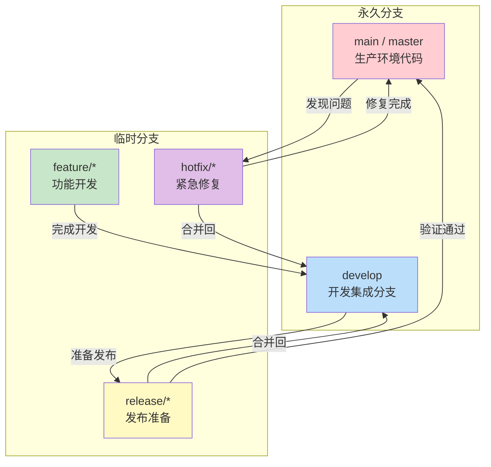
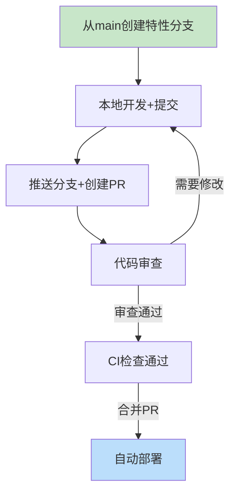
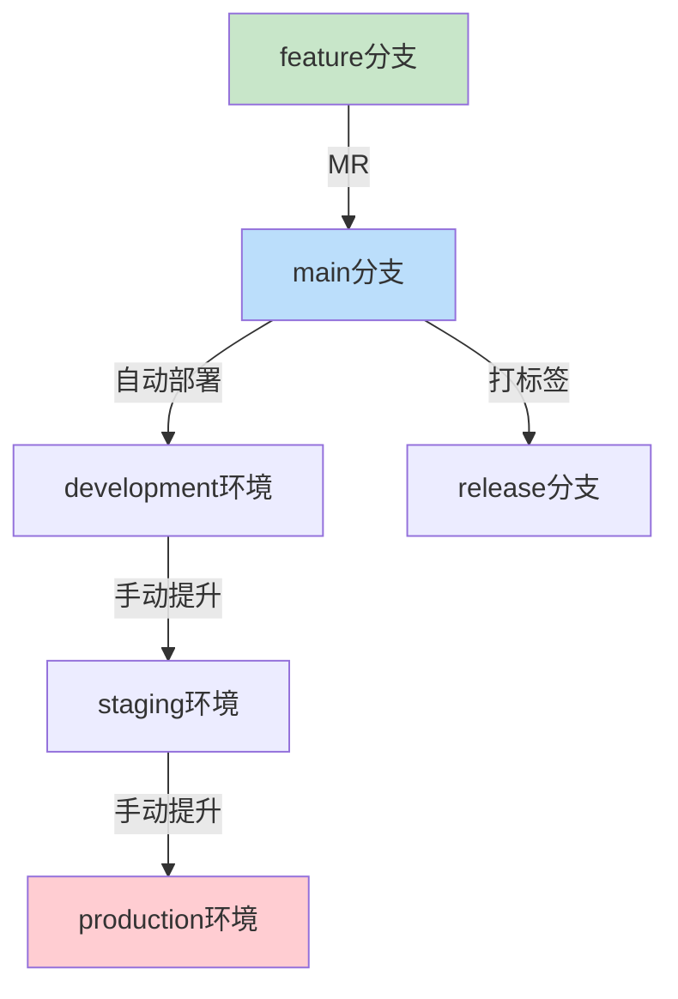
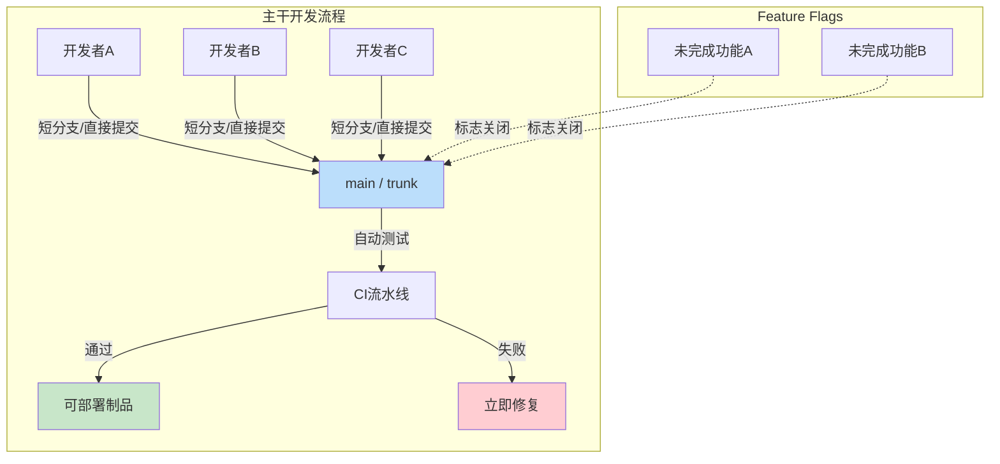
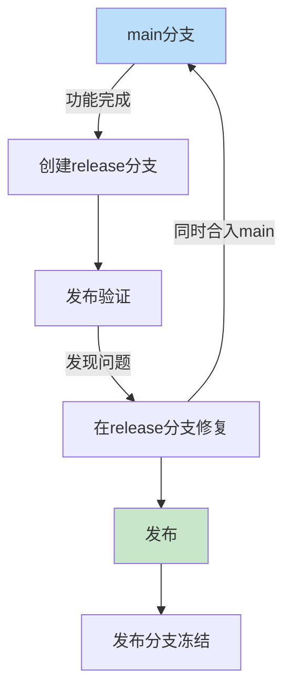
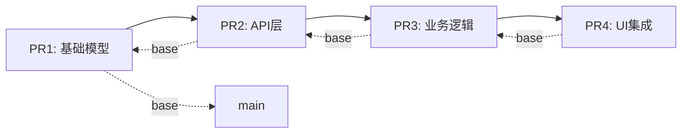
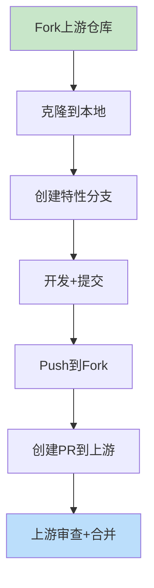
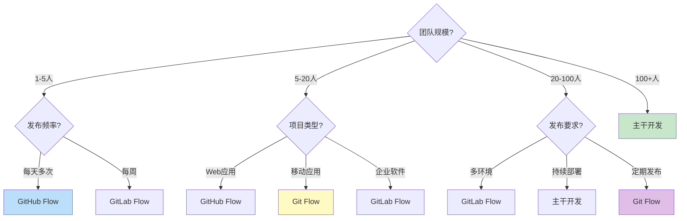

## 二、开发分支策略

### 1. 概述与背景

#### 1.1 为什么需要分支策略

在多人协作的软件开发中，分支管理是影响团队效率和代码质量的关键因素。分支策略（Branching Strategy）定义了团队如何创建、使用、合并和删除代码分支，它直接决定了代码集成的频率、冲突的规模、发布的节奏以及回滚的难度。

没有明确分支策略的团队通常会面临以下问题：

- **分支泛滥**：开发者随意创建分支，缺乏命名规范，导致仓库中堆积大量过期分支
- **集成地狱**：长时间存在的分支在合并时产生大规模冲突，调试和解决冲突耗费数天甚至数周
- **发布不可预测**：无法确定哪些功能已经就绪，哪些还在开发中，发布日期频繁推迟
- **代码质量失控**：缺乏合并前的质量门禁，未经充分测试的代码直接进入主干

一个优秀的分支策略应该解决以下核心问题：

| 核心问题 | 解决目标 | 衡量指标 |
|----------|----------|----------|
| 并行开发隔离 | 多人同时开发互不干扰 | 分支冲突频率 |
| 集成风险控制 | 尽早发现集成问题 | 从提交到集成的平均时间 |
| 发布节奏管理 | 保持主干始终可发布 | 主干绿色率（主干构建通过率） |
| 代码质量保障 | 合并前完成审查和测试 | PR审查覆盖率 |
| 历史可追溯性 | 代码变更可审计、可回滚 | 平均回滚时间（MTTR） |

#### 1.2 分支策略的演进历史

分支策略的发展与版本控制系统的演进密切相关：

**CVS/SVN时代（1986-2005）**：集中式版本控制系统的分支操作成本高昂（需要复制整个目录），因此大多数团队采用单一主线开发，极少创建分支。只有在发布周期较长的项目中才会创建发布分支。

**Git革命（2005-2010）**：Git的轻量级分支彻底改变了开发模式。创建和切换分支的成本接近零，团队开始大量使用分支进行功能开发。Git Flow在2010年被提出，成为当时的主流方案。

**持续集成时代（2010-2015）**：随着CI/CD实践的普及，业界逐渐认识到长期分支带来的集成风险。GitHub Flow和Trunk-Based Development开始流行，强调频繁集成和短生命周期分支。

**云原生时代（2015至今）**：微服务架构和容器化部署使得独立部署成为可能，分支策略进一步简化。Feature Flags的引入使得分支策略从"如何隔离代码"演变为"如何管理发布"。

#### 1.3 信息论视角：分支与不确定性的关系

从信息论的角度理解分支策略会带来更深刻的认识。每一条代码分支都代表着系统状态的一个可能分叉。当多个开发者在各自的分支上独立工作时，分支之间产生的差异可以用**信息熵**来衡量。

设主干状态为 $S_0$，经过时间 $t$ 后，分支 $i$ 的状态为 $S_i(t)$。分支间的差异度量为：

$$D(t) = \sum_{i} H(S_i(t) | S_0)$$

其中 $H(S_i | S_0)$ 是分支状态相对于主干条件熵。随着时间推移，这个熵值单调递增——分支存在的时间越长，各分叉之间的差异越大，集成时的不确定性越高。

这个数学模型解释了为什么：
- **短生命周期分支更安全**：限制 $t$ 的大小，从而限制 $D(t)$
- **频繁集成更有效**：定期将分支状态同步回主干，重置 $D(t)$
- **小团队更适合主干开发**：分支数量 $n$ 越小，总差异度 $\sum D_i(t)$ 越小

### 2. 主流分支策略详解

#### 2.1 Git Flow

Git Flow是Vincent Driessen在2010年提出的分支模型，它定义了五种分支类型及其交互规则：



**五种分支的职责：**

| 分支类型 | 生命周期 | 来源 | 合入目标 | 用途 |
|----------|----------|------|----------|------|
| main | 永久 | — | — | 存储生产环境就绪的代码 |
| develop | 永久 | main | — | 集成所有已完成的功能 |
| feature/* | 临时（天-周） | develop | develop | 开发新功能 |
| release/* | 临时（天） | develop | main + develop | 发布前的准备和修复 |
| hotfix/* | 临时（小时-天） | main | main + develop | 修复生产环境紧急问题 |

**Git Flow的分支操作流程：**

```bash
# 1. 开始新功能开发
git checkout develop
git checkout -b feature/user-authentication

# 2. 开发过程中定期同步主干
git fetch origin
git rebase origin/develop

# 3. 功能开发完成，合入develop
git checkout develop
git merge --no-ff feature/user-authentication
git push origin develop
git branch -d feature/user-authentication

# 4. 准备发布
git checkout -b release/1.2.0 develop
# 在release分支上修复小问题、更新版本号
git commit -m "Bump version to 1.2.0"

# 5. 发布
git checkout main
git merge --no-ff release/1.2.0
git tag -a v1.2.0 -m "Release version 1.2.0"
git push origin main --tags

# 6. 将发布内容合并回develop
git checkout develop
git merge --no-ff release/1.2.0
git push origin develop
git branch -d release/1.2.0

# 7. 紧急修复
git checkout main
git checkout -b hotfix/critical-security-fix
# 修复问题
git commit -m "Fix critical security vulnerability"
git checkout main
git merge --no-ff hotfix/critical-security-fix
git tag -a v1.2.1 -m "Hotfix version 1.2.1"
git push origin main --tags
git checkout develop
git merge --no-ff hotfix/critical-security-fix
git push origin develop
git branch -d hotfix/critical-security-fix
```

**Git Flow的适用场景：**

- 有明确版本发布计划的项目（如桌面软件、移动应用）
- 需要同时维护多个版本的项目（如企业软件的LTS版本）
- 发布周期较长（周-月级别）的项目
- 团队规模中等（10-50人），需要清晰的职责划分

**Git Flow的局限性：**

- 流程复杂，学习成本高，新成员需要较长时间适应
- 分支合并路径多，容易遗漏某些合并（如忘记将hotfix同时合入develop）
- 不适合持续部署的场景——发布流程过重
- develop分支可能长期处于不稳定状态

#### 2.2 GitHub Flow

GitHub Flow是GitHub提出的轻量级分支策略，只有两个核心规则：

1. main分支永远是可部署的
2. 所有变更通过Pull Request合入main



**GitHub Flow的核心原则：**

| 原则 | 含义 | 实施要点 |
|------|------|----------|
| main分支可部署 | 任何时刻main都能安全部署到生产 | 自动化测试+质量门禁 |
| PR驱动合并 | 所有变更必须通过PR审查 | 至少1人批准+CI通过 |
| 短生命周期分支 | 分支存活时间不超过几天 | 限制分支大小和范围 |
| 及时合并 | 审查通过后尽快合并 | 设置SLA（如24小时内审查） |
| 合并后部署 | 合入main即触发部署 | 自动化流水线 |

**GitHub Flow的分支管理实践：**

```bash
# 1. 创建特性分支（从main拉取）
git checkout main
git pull origin main
git checkout -b feature/add-payment-gateway

# 2. 开发并推送
git add .
git commit -m "feat: add Stripe payment integration"
git push origin feature/add-payment-gateway

# 3. 创建PR（通过GitHub CLI）
gh pr create \
  --title "feat: add Stripe payment integration" \
  --body "Add Stripe payment gateway with card and Apple Pay support" \
  --base main \
  --reviewer @team/backend

# 4. 根据审查意见修改
git add .
git commit -m "fix: handle Stripe webhook timeout"
git push origin feature/add-payment-gateway

# 5. 审查通过后合并
gh pr merge --squash --delete-branch
```

**GitHub Flow的适用场景：**

- 持续部署的项目（Web应用、SaaS服务）
- 发布频率高（每天多次部署）的团队
- 团队规模较小（5-20人），沟通成本低
- 功能之间耦合度低，单个功能可以独立发布

#### 2.3 GitLab Flow

GitLab Flow在GitHub Flow的基础上增加了环境分支（Environment Branches）和发布分支（Release Branches），适合需要多环境管理的团队：



**GitLab Flow的两种变体：**

**环境分支模式**（Environment Branches）：

```bash
# main分支合入后自动部署到development
# 确认无误后提升到staging
git checkout staging
git merge main
git push origin staging

# staging验证通过后提升到production
git checkout production
git merge staging
git push origin production
```

**发布分支模式**（Release Branches）：

```bash
# 从main创建发布分支
git checkout -b stable main
git push origin stable

# 后续bug修复同时合入main和stable
git checkout main
git cherry-pick <commit-hash>
git checkout stable
git cherry-pick <commit-hash>
```

**GitLab Flow的适用场景：**

- 需要多环境部署的团队（dev → staging → production）
- 需要同时维护多个发布版本的项目
- 有严格发布流程的组织（需要在staging环境充分验证）
- 中大型团队（20-100人），需要更结构化的分支管理

#### 2.4 Trunk-Based Development（主干开发）

主干开发是最激进也是最高效的分支策略。核心思想是：所有开发者在主干（trunk/main）上工作，使用极短生命周期的分支（通常不超过1-2天）。



**主干开发的工程前提：**

| 前提条件 | 具体要求 | 缺少的后果 |
|----------|----------|------------|
| 自动化测试覆盖 | 单元测试覆盖率>80%，关键路径端到端测试 | 主干频繁被破坏 |
| 快速CI反馈 | 构建+测试<10分钟 | 开发者等待时间过长 |
| Feature Flags | 未完成功能可安全合入主干 | 未完成功能阻塞发布 |
| 小批量提交 | 每次提交改动<400行 | 审查质量下降 |
| 代码审查SLA | 4小时内完成审查 | 分支积压 |
| 集成测试环境 | 合并后自动部署到测试环境 | 集成问题发现延迟 |

**主干开发的分支模式：**

```bash
# 模式1：直接提交（适合极小改动）
git checkout main
# 直接修改文件
git add .
git commit -m "fix: typo in README"
git push origin main

# 模式2：极短生命周期分支（推荐）
git checkout main
git pull origin main
git checkout -b short-lived-feature
# 开发（目标：当天完成）
git add .
git commit -m "feat: add user preference API endpoint"
git push origin short-lived-feature
gh pr create --base main
# 审查通过后立即合并
gh pr merge --squash --delete-branch

# 模式3：结合Feature Flags
git checkout main
git pull origin main
git checkout -b feature/checkout-redesign
# 开发新结账流程，但通过feature flag控制
git commit -m "feat: new checkout flow (behind feature flag)"
git push origin feature/checkout-redesign
gh pr create --base main
# 即使功能未完成也可以安全合并
gh pr merge --squash --delete-branch
```

**主干开发的Feature Flags实践：**

```python
# 功能标志控制未完成功能
class CheckoutService:
    def __init__(self, feature_flags):
        self.flags = feature_flags
    
    def process_checkout(self, order):
        if self.flags.is_enabled("new_checkout_flow", {"user_id": order.user_id}):
            return self._new_checkout(order)
        else:
            return self._legacy_checkout(order)
    
    def _new_checkout(self, order):
        """新结账流程：支持多种支付方式、地址自动填充"""
        # 新功能代码
        pass
    
    def _legacy_checkout(self, order):
        """旧结账流程：保持稳定"""
        # 现有代码
        pass
```

**主干开发的适用场景：**

- 持续部署的SaaS产品（如Google、Facebook、Netflix）
- 大型工程团队（100+开发者），需要最大化的集成效率
- 微服务架构，各服务独立部署
- 对发布速度有极高要求的业务

#### 2.5 Release Flow（发布流）

Release Flow是微软在2018年提出的分支策略，结合了主干开发的高效性和发布的可控性：



```bash
# 1. 从main创建发布分支
git checkout main
git pull origin main
git checkout -b release/2024.01

# 2. 发布分支上只做必要修复
git checkout -b hotfix-in-release/fix-auth-bug
# 修复bug
git commit -m "fix: authentication token refresh"
git push origin hotfix-in-release/fix-auth-bug
gh pr create --base release/2024.01

# 3. 同时将修复合入main
git checkout main
git cherry-pick <commit-hash>
git push origin main

# 4. 发布
git checkout release/2024.01
git tag -a v2024.01.0 -m "Release 2024.01"
git push origin v2024.01.0
```

### 3. 分支命名规范

统一的分支命名规范是分支管理的基础。它使得团队成员能够快速理解每个分支的用途、来源和状态：

| 前缀 | 用途 | 示例 |
|------|------|------|
| feature/ | 新功能开发 | feature/user-authentication |
| bugfix/ | 非紧急bug修复 | bugfix/login-redirect-loop |
| hotfix/ | 生产环境紧急修复 | hotfix/security-vulnerability |
| release/ | 发布准备 | release/1.2.0 |
| refactor/ | 代码重构 | refactor/extract-payment-module |
| docs/ | 文档更新 | docs/api-reference |
| test/ | 测试相关 | test/add-integration-tests |
| chore/ | 构建/工具链变更 | chore/upgrade-node-20 |

**高级命名约定：**

```bash
# 包含Issue编号
feature/JIRA-1234-user-authentication
bugfix/JIRA-5678-fix-login-error

# 包含开发者标识
feature/john/payment-integration
hotfix/jane/critical-db-fix

# 使用日期标注
release/2024-01-15/v1.2.0

# 使用团队标识（多团队协作）
team-alpha/feature/new-dashboard
team-beta/bugfix/performance-issue
```

### 4. 分支保护规则

分支保护规则（Branch Protection Rules）是防止主干被意外破坏的安全网。GitHub、GitLab、Bitbucket等平台都提供了完善的分支保护功能：

**GitHub分支保护配置（通过GitHub CLI）：**

```bash
# 为main分支设置保护规则
gh api repos/{owner}/{repo}/branches/main/protection \
  --method PUT \
  --field required_status_checks='{"strict":true,"contexts":["ci/build","ci/test","ci/security-scan"]}' \
  --field enforce_admins=true \
  --field required_pull_request_reviews='{"required_approving_review_count":2,"dismiss_stale_reviews":true,"require_code_owner_reviews":true}' \
  --field restrictions=null
```

**分支保护的关键配置项：**

| 配置项 | 推荐值 | 说明 |
|--------|--------|------|
| Required reviews | ≥2人批准 | 确保至少2位开发者审查代码 |
| Dismiss stale reviews | 开启 | 代码有新提交后旧的批准自动失效 |
| Require status checks | 开启 | CI必须通过才能合并 |
| Require branches to be up-to-date | 开启 | 合并前必须同步最新代码 |
| Restrict force pushes | 开启 | 禁止对main分支强制推送 |
| Require signed commits | 开启 | 要求提交签名验证（GPG/SSH） |
| Require linear history | 可选 | 禁止merge commit，只允许rebase/squash |

**CODEOWNERS文件：**

```bash
# .github/CODEOWNERS
# 全局审查
* @team/core-maintainers

# API相关代码需要后端团队审查
/src/api/ @team/backend @team/api-reviewers

# 基础设施变更需要DevOps团队审查
/infra/ @team/devops
/k8s/ @team/devops
*.tf @team/devops

# 文档变更只需文档团队审查
/docs/ @team/documentation

# 安全相关代码需要安全团队审查
/src/auth/ @team/security
/src/crypto/ @team/security
```

### 5. 代码合并策略深度对比

代码合并策略（Merge Strategy）决定了分支变更如何整合到目标分支，对代码历史的可读性、可追溯性和团队协作效率有深远影响：

#### 5.1 Merge Commit（合并提交）

```mermaid
gitgraph
    commit id: "A"
    branch feature
    commit id: "B"
    commit id: "C"
    checkout main
    commit id: "D"
    checkout feature
    commit id: "E"
    checkout main
    merge id: "M" with message "Merge branch 'feature'" tag: "merge commit"
```

```bash
# 执行合并提交
git checkout main
git merge --no-ff feature/user-auth
# 或通过GitHub PR合并（默认行为）
```

**优点：**
- 保留完整的分支历史和开发轨迹
- 每次合并都有明确的合并点，便于追溯
- 保留了功能开发的上下文（哪些提交属于同一功能）
- `git bisect`可以沿着合并点快速定位问题

**缺点：**
- 历史图可能变得复杂混乱，尤其是频繁合并时
- 合并提交本身不包含实质内容，增加噪音
- 不适合追求线性历史的团队

#### 5.2 Rebase（变基）

```mermaid
gitgraph
    commit id: "A"
    branch feature
    commit id: "B"
    commit id: "C"
    checkout main
    commit id: "D"
    checkout feature
    rebase
    commit id: "B'" tag: "rebased"
    commit id: "C'" tag: "rebased"
    checkout main
    merge id: "M" with message "Fast-forward" tag: "fast-forward"
```

```bash
# 交互式变基（整理提交历史）
git checkout feature/user-auth
git rebase -i HEAD~3

# Rebase编辑器内容：
# pick abc1234 feat: add user model
# pick def5678 feat: add authentication API
# pick ghi9012 feat: add login endpoint

# 修改为：
# pick abc1234 feat: add user model
# squash def5678 feat: add authentication API  # 合并到上一个提交
# squash ghi9012 feat: add login endpoint       # 合并到上一个提交
```

**优点：**
- 产生线性提交历史，清晰易读
- 每个提交都在最新的主干基础上，避免"幽灵冲突"
- `git bisect`效率最高，历史完全线性

**缺点：**
- 改写了提交哈希值，可能影响其他协作者
- 不保留分支上下文，无法看出哪些提交属于同一功能
- 解决冲突时可能需要多次rebase（每个提交都可能冲突）

#### 5.3 Squash Merge（压缩合并）

```mermaid
gitgraph
    commit id: "A"
    branch feature
    commit id: "B"
    commit id: "C"
    commit id: "D"
    checkout main
    commit id: "E"
    merge id: "S" with message "Squash merge: feat: add user auth" tag: "single commit"
```

```bash
# 通过GitHub PR进行squash merge
gh pr merge --squash

# 或手动操作
git checkout main
git merge --squash feature/user-auth
git commit -m "feat: add user authentication system

- Add User model with profile fields
- Implement JWT-based authentication
- Add login/logout endpoints
- Add password reset flow

Closes #123"
```

**优点：**
- 主干历史极简，每个功能对应一个提交
- 提交信息可以精心组织，包含完整的变更说明
- 丢失的中间提交不会污染主干历史
- 开放源码项目的首选（贡献者历史被压缩为项目历史）

**缺点：**
- 丢失开发过程的细节（中间的修复、调整无法追溯）
- 对于复杂功能，单个提交可能过大，影响`git bisect`效率
- 如果PR被关闭，分支的提交信息丢失

#### 5.4 合并策略选择指南

| 场景 | 推荐策略 | 理由 |
|------|----------|------|
| 开源项目 | Squash Merge | 贡献者历史被压缩为项目历史 |
| 需要完整审计追踪 | Merge Commit | 保留完整的开发轨迹 |
| 小团队+短分支 | Rebase | 线性历史清晰高效 |
| 大型企业项目 | Merge Commit | 可追溯性最重要 |
| 功能分支生命周期>3天 | Merge Commit | 保留分支上下文 |
| 主干开发 | Squash/Rebase | 保持主干历史清洁 |
| 需要`git bisect`定位问题 | Rebase | 线性历史效率最高 |

### 6. 高级分支模式

#### 6.1 Ship/Show/Ask（三选一合并）

这是一种灵活的PR策略，开发者根据变更的性质选择不同的合并方式：

```bash
# Ship：直接合并（小改动、文档、配置）
gh pr merge --squash --delete-branch

# Show：创建PR供审查（新功能、重要变更）
gh pr create --base main --reviewer @team/backend

# Ask：合并前征求意见（有争议的设计决策）
gh pr create --base main --draft --body "## 设计方案
### 方案A：使用Redis缓存
优点：性能好
缺点：需要维护Redis集群

### 方案B：使用本地内存缓存
优点：简单
缺点：无法跨实例共享

请团队讨论后决定。"
```

#### 6.2 堆叠式PR（Stacked PRs）

当一个大型功能需要拆分为多个独立的、顺序依赖的PR时：



```bash
# 创建堆叠式PR
# PR1：基础层
git checkout -b stack/pr1-base-model main
# 开发基础模型
gh pr create --base main --title "stack: PR1 - Base data model"

# PR2：API层（基于PR1）
git checkout -b stack/pr2-api-layer stack/pr1-base-model
# 开发API层
gh pr create --base stack/pr1-base-model --title "stack: PR2 - API layer"

# PR3：业务逻辑（基于PR2）
git checkout -b stack/pr3-business-logic stack/pr2-api-layer
# 开发业务逻辑
gh pr create --base stack/pr2-api-layer --title "stack: PR3 - Business logic"
```

**堆叠式PR的管理工具：**

| 工具 | 功能 | 适用场景 |
|------|------|----------|
| ghstack | 自动管理PR依赖链 | GitHub，Python项目 |
| graphite | 可视化PR栈管理 | 团队协作 |
| gh pr create --draft | 标记为草稿PR | 临时使用 |
| stacked-diff | 基于diff的堆叠管理 | CLI用户 |

#### 6.3 Fork-Based Workflow（Fork工作流）

开源项目和外部贡献者常用的模式：



```bash
# 1. Fork上游仓库（通过GitHub界面或CLI）
gh repo fork kubernetes/kubernetes --clone=true

# 2. 设置upstream远程仓库
git remote add upstream https://github.com/kubernetes/kubernetes.git

# 3. 保持Fork同步
git fetch upstream
git checkout main
git merge upstream/main
git push origin main

# 4. 创建特性分支
git checkout -b feature/add-metrics-collector

# 5. 开发并推送到Fork
git add .
git commit -m "feat: add custom metrics collector"
git push origin feature/add-metrics-collector

# 6. 创建PR到上游
gh pr create --repo kubernetes/kubernetes --base main
```

### 7. 策略选择决策框架

选择合适的分支策略需要综合考虑多个因素：



**综合对比表：**

| 维度 | Git Flow | GitHub Flow | GitLab Flow | Trunk-Based |
|------|----------|-------------|-------------|-------------|
| **复杂度** | 高 | 低 | 中 | 低 |
| **学习成本** | 高 | 低 | 中 | 中（需要Feature Flags） |
| **集成频率** | 低（周-月） | 高（天） | 中（天-周） | 极高（小时-天） |
| **发布频率** | 低 | 高 | 中 | 极高 |
| **团队规模** | 10-50人 | 5-20人 | 20-100人 | 100+人 |
| **项目类型** | 版本化软件 | SaaS/Web | 多环境企业 | 云原生/微服务 |
| **回滚能力** | 中（revert commit） | 中 | 高（环境提升） | 高（Feature Flags） |
| **历史可读性** | 中 | 高 | 高 | 高 |
| **工程要求** | 低 | 中（CI/CD） | 中 | 高（测试+Flags） |

### 8. 常见误区与最佳实践

#### 8.1 误区一：分支越多越安全

**问题**：团队创建大量分支来"保护"主干，认为分支能隔离风险。

**真相**：分支是双刃剑。隔离风险的同时也隔离了集成反馈。长期分支会导致集成成本呈指数增长。

**纠正**：限制分支生命周期。设置自动化提醒——超过3天未合并的分支自动通知负责人。

#### 8.2 误区二：合并前不需要测试

**问题**：依赖CI自动测试，在PR中不做本地验证。

**真相**：CI测试是最后一道防线，不是第一道。开发者应该在推送前至少运行本地测试。

**纠正**：配置Git hooks（pre-commit、pre-push），在本地强制执行基本检查：

```bash
# .husky/pre-commit
#!/bin/sh
npx lint-staged

# .husky/pre-push
#!/bin/sh
npm run test:unit
```

#### 8.3 误区三：所有团队都应该用同一种策略

**问题**：照搬大公司的分支策略到小团队，或反之。

**真相**：分支策略必须适配团队的规模、发布频率、技术成熟度和业务特点。

**纠正**：根据本文第7节的决策框架，结合团队实际情况选择。可以从简单策略开始，随团队成长逐步演进。

#### 8.4 误区四：忽略分支清理

**问题**：分支合并后不删除，导致仓库中积累大量过期分支。

**真相**：过期分支不仅占用存储，更重要的是造成认知负担——新成员不知道哪些分支是活跃的。

**纠正**：

```bash
# 本地清理已合并分支
git branch --merged main | grep -v "main\|develop\|staging\|production" | xargs git branch -d

# 远程清理已合并分支
git fetch --prune origin

# GitHub自动清理（PR合并时删除分支）
gh pr merge --squash --delete-branch
```

#### 8.5 误区五：Feature Flags可以替代分支策略

**问题**：引入Feature Flags后认为不再需要分支管理。

**真相**：Feature Flags是分支策略的补充，不是替代。Feature Flags解决的是"如何管理未完成功能的可见性"，分支策略解决的是"如何隔离并行开发的代码变更"。

**正确做法**：两者结合使用——用短生命周期分支隔离开发，用Feature Flags控制功能发布。

### 9. 工具链支持

#### 9.1 Git Hooks自动化

```bash
#!/bin/bash
# scripts/check-branch-naming.sh
# 检查分支命名是否符合规范

BRANCH_NAME=$(git rev-parse --abbrev-ref HEAD)

# 允许的分支前缀
VALID_PREFIXES=("feature/" "bugfix/" "hotfix/" "release/" "refactor/" "docs/" "test/" "chore/")

if [[ "$BRANCH_NAME" == "main" || "$BRANCH_NAME" == "develop" ]]; then
    exit 0
fi

VALID=false
for prefix in "${VALID_PREFIXES[@]}"; do
    if [[ "$BRANCH_NAME" == "$prefix"* ]]; then
        VALID=true
        break
    fi
done

if [[ "$VALID" == "false" ]]; then
    echo "❌ 分支名 '$BRANCH_NAME' 不符合命名规范"
    echo "允许的前缀: ${VALID_PREFIXES[*]}"
    echo "示例: feature/user-authentication"
    exit 1
fi
```

#### 9.2 分支生命周期管理脚本

```python
#!/usr/bin/env python3
"""分支生命周期管理工具"""

import subprocess
import json
from datetime import datetime, timedelta

def get_branch_info():
    """获取所有远程分支及其最后提交时间"""
    result = subprocess.run(
        ["git", "for-each-ref", "--format=%(refname:short)|%(committerdate:iso)|%(authorname)|%(subject)",
         "refs/remotes/origin/"],
        capture_output=True, text=True
    )
    
    branches = []
    for line in result.stdout.strip().split('\n'):
        if not line:
            continue
        parts = line.split('|', 3)
        if len(parts) >= 3:
            name = parts[0].replace('origin/', '')
            date_str = parts[1]
            author = parts[2]
            
            # 跳过主分支
            if name in ('main', 'master', 'develop', 'staging', 'production'):
                continue
            
            try:
                last_update = datetime.fromisoformat(date_str.strip())
                age_days = (datetime.now() - last_update).days
                branches.append({
                    'name': name,
                    'author': author,
                    'last_update': last_update,
                    'age_days': age_days
                })
            except ValueError:
                pass
    
    return branches

def analyze_stale_branches(branches, threshold_days=7):
    """分析过期分支"""
    stale = [b for b in branches if b['age_days'] > threshold_days]
    stale.sort(key=lambda x: x['age_days'], reverse=True)
    return stale

def generate_report():
    """生成分支健康报告"""
    branches = get_branch_info()
    stale = analyze_stale_branches(branches)
    
    print("=" * 60)
    print("分支健康报告")
    print("=" * 60)
    print(f"\n活跃分支总数: {len(branches)}")
    print(f"过期分支（>7天）: {len(stale)}")
    
    if stale:
        print("\n⚠️  需要关注的分支:")
        print("-" * 60)
        for b in stale:
            print(f"  {b['name']}: {b['age_days']}天未更新 (by {b['author']})")
    
    # 分支年龄分布
    print("\n📊 分支年龄分布:")
    age_groups = {'1-3天': 0, '4-7天': 0, '8-14天': 0, '15-30天': 0, '30+天': 0}
    for b in branches:
        age = b['age_days']
        if age <= 3:
            age_groups['1-3天'] += 1
        elif age <= 7:
            age_groups['4-7天'] += 1
        elif age <= 14:
            age_groups['8-14天'] += 1
        elif age <= 30:
            age_groups['15-30天'] += 1
        else:
            age_groups['30+天'] += 1
    
    for group, count in age_groups.items():
        bar = '█' * count
        print(f"  {group:>10}: {bar} ({count})")

if __name__ == '__main__':
    generate_report()
```

#### 9.3 CI集成：分支策略检查

```yaml
# .github/workflows/branch-strategy-check.yml
name: Branch Strategy Check

on:
  pull_request:
    branches: [main, develop]

jobs:
  validate-branch:
    runs-on: ubuntu-latest
    steps:
      - uses: actions/checkout@v4
      
      - name: Validate branch naming
        run: |
          BRANCH_NAME="${GITHUB_HEAD_REF}"
          echo "Checking branch: $BRANCH_NAME"
          
          if [[ ! "$BRANCH_NAME" =~ ^(feature|bugfix|hotfix|refactor|docs|test|chore)/ ]]; then
            echo "::error::Branch name must start with: feature/, bugfix/, hotfix/, refactor/, docs/, test/, chore/"
            exit 1
          fi
          echo "✅ Branch naming is valid"
      
      - name: Check branch age
        run: |
          BRANCH_NAME="${GITHUB_HEAD_REF}"
          # 获取分支创建时间
          CREATED_AT=$(gh api repos/${{ github.repository }}/commits?sha=${GITHUB_SHA} --jq '.[0].commit.committer.date')
          CREATED=$(date -d "$CREATED_AT" +%s)
          NOW=$(date +%s)
          AGE_HOURS=$(( (NOW - CREATED) / 3600 ))
          
          echo "Branch age: ${AGE_HOURS} hours"
          
          if [ "$AGE_HOURS" -gt 168 ]; then
            echo "::warning::Branch is older than 7 days. Consider splitting into smaller PRs."
          fi
          
          if [ "$AGE_HOURS" -gt 336 ]; then
            echo "::error::Branch is older than 14 days. Please split or close this PR."
            exit 1
          fi
      
      - name: Check PR size
        run: |
          CHANGES=$(gh pr view ${{ github.event.pull_request.number }} --json additions,deletions --jq '.additions + .deletions')
          echo "Total changes: $CHANGES lines"
          
          if [ "$CHANGES" -gt 1000 ]; then
            echo "::warning::PR has $CHANGES lines changed. Consider splitting into smaller PRs."
          fi
          
          if [ "$CHANGES" -gt 3000 ]; then
            echo "::error::PR has $CHANGES lines changed. Please split into smaller PRs."
            exit 1
          fi
```

### 10. 本节小结

开发分支策略不是一成不变的教条，而是需要根据团队实际情况持续演进的实践指南。核心原则可以归纳为：

1. **尽早集成**：缩短分支生命周期，减少集成风险
2. **频繁集成**：提高代码合并频率，加快反馈循环
3. **自动化保障**：通过CI/CD流水线自动执行质量门禁
4. **清晰规范**：建立并执行统一的分支命名和合并规范
5. **持续演进**：根据团队规模和业务需求调整策略

无论选择哪种分支策略，最重要的是团队达成共识并严格执行。一个好的、被团队遵循的"次优"策略，远胜于一个理论上完美但被忽视的"最优"策略。
