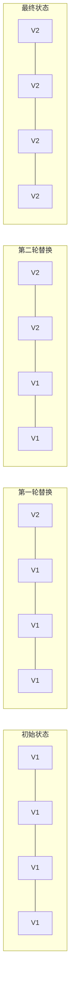
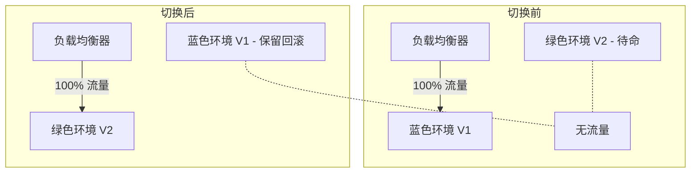
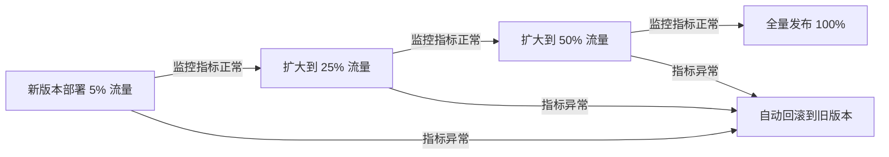
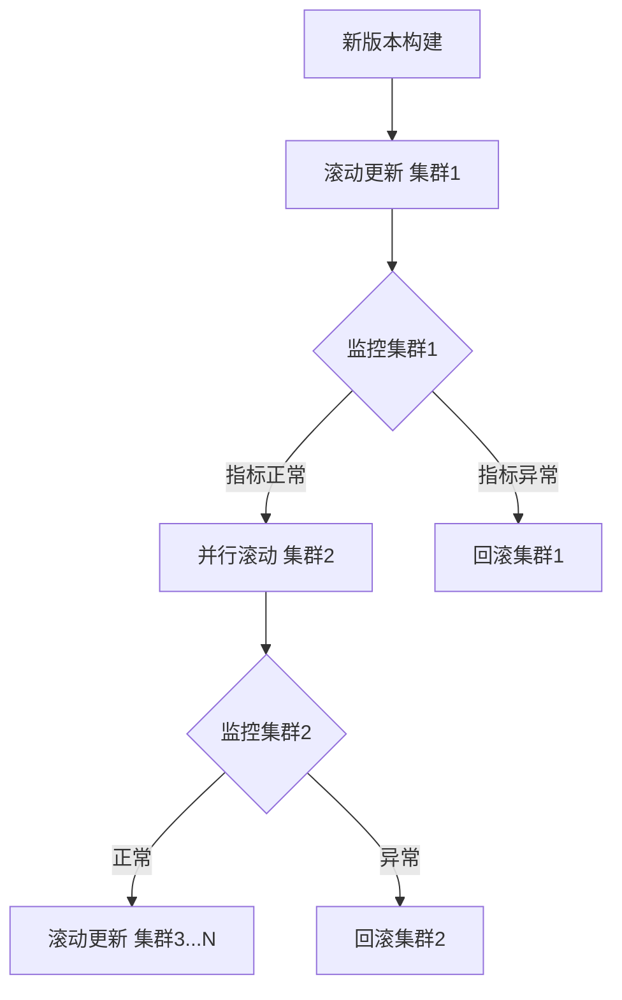
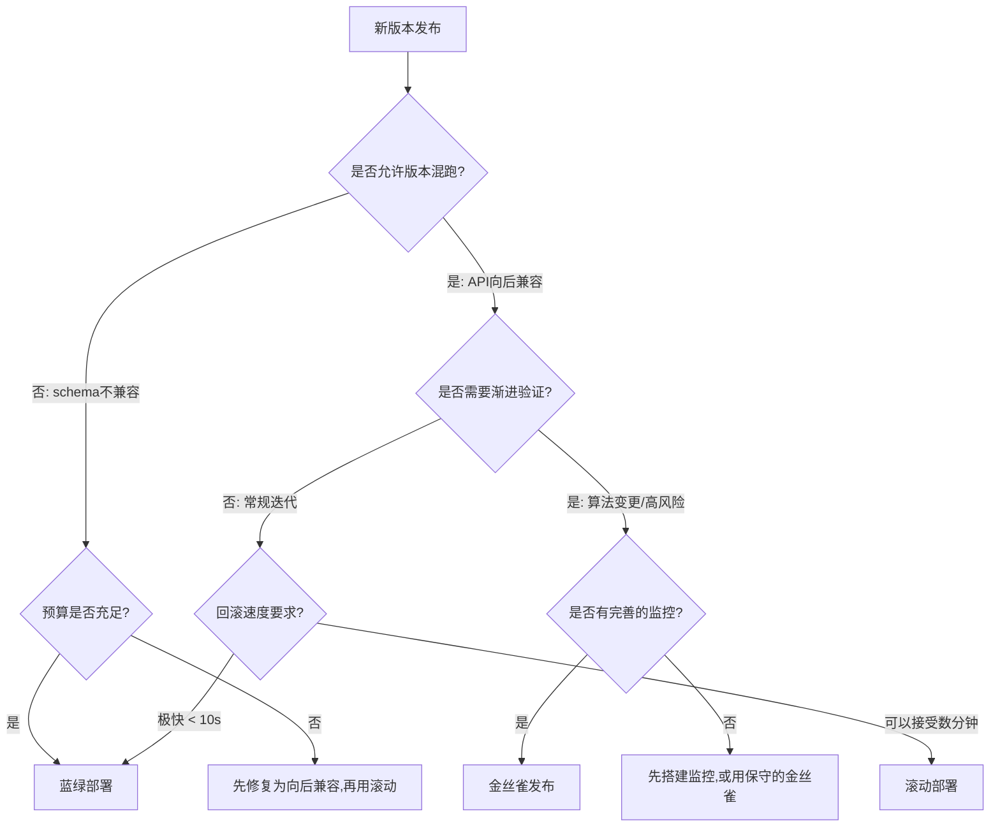

## 三大部署策略深度对比：滚动部署、蓝绿部署与金丝雀发布

### 1. 概述与背景

在 CI/CD 流水线中，代码从构建到上线只是万里长征的第一步——**如何将新版本安全地替换旧版本**才是决定发布成败的关键环节。部署策略（Deployment Strategy）定义了新版本应用如何逐步替代旧版本的规则和节奏，直接影响系统的可用性、回滚速度和用户体验。

三大经典部署策略——**滚动部署（Rolling Deployment）**、**蓝绿部署（Blue-Green Deployment）** 和 **金丝雀发布（Canary Release）**——各有其适用场景和工程权衡。理解它们的原理、差异与适用边界，是每一个 DevOps 工程师和 SRE 的必修课。

| 部署策略 | 核心思想 | 典型代表工具 |
|----------|----------|-------------|
| 滚动部署 | 逐批替换实例，始终保持部分实例可用 | Kubernetes Deployment, ECS |
| 蓝绿部署 | 维护两套完整环境，切换流量实现零停机 | AWS ALB/NLB, Nginx upstream |
| 金丝雀发布 | 小比例引流验证，逐步扩大到全量 | Istio, Argo Rollouts, Flagger |

### 2. 滚动部署（Rolling Deployment）

#### 2.1 工作原理

滚动部署的核心思想是**逐步替换**：将实例分批（batch），先停掉一批旧版本实例，启动对应数量的新版本实例，待新实例健康检查通过后，再处理下一批，直至全部替换完成。



Kubernetes 中的滚动部署由 `Deployment` 资源原生支持，关键参数：

```yaml
apiVersion: apps/v1
kind: Deployment
metadata:
  name: web-app
spec:
  replicas: 10
  strategy:
    type: RollingUpdate
    rollingUpdate:
      maxSurge: 2          # 最多额外创建的Pod数（超出replicas的部分）
      maxUnavailable: 1     # 最多不可用的Pod数（0=零停机）
  template:
    spec:
      containers:
      - name: app
        image: myapp:v2
        readinessProbe:      # 就绪检查——决定Pod是否接入流量
          httpGet:
            path: /healthz
            port: 8080
          initialDelaySeconds: 5
          periodSeconds: 5
```

**`maxSurge` 与 `maxUnavailable` 的交互逻辑：**

| maxSurge | maxUnavailable | 总Pod数(10副本) | 滚动行为 |
|----------|---------------|----------------|----------|
| 2 | 0 | 最多12个 | 零停机：先创建2个新Pod，旧Pod等新Pod就绪后再销毁 |
| 2 | 2 | 最多12个 | 快速替换：同时创建2个新Pod并销毁2个旧Pod |
| 1 | 0 | 最多11个 | 保守零停机：一次只替换1个 |
| 0 | 1 | 最多10个 | 节省资源：先停1个旧的再起1个新的（有短暂不可用） |

#### 2.2 回滚机制

滚动部署的回滚本质上是**反向滚动**——用旧版本镜像再做一次滚动更新：

```bash
# 查看部署历史
kubectl rollout history deployment/web-app

# 回滚到上一版本
kubectl rollout undo deployment/web-app

# 回滚到指定版本
kubectl rollout undo deployment/web-app --to-revision=3

# 监控回滚进度
kubectl rollout status deployment/web-app
```

#### 2.3 优缺点分析

**优势：**
- 无需额外基础设施（不需要第二套环境）
- 资源开销低，滚动期间资源峰值仅为 `maxSurge` 的量
- Kubernetes 原生支持，配置简单

**劣势：**
- 回滚较慢——需要对整个集群再次滚动（大型集群可能需要数分钟）
- 回滚窗口内可能出现**版本混跑**：V1 和 V2 同时对外服务，如果两个版本的 API 不兼容（如数据库 schema 变更），可能引发请求失败
- 不适合对一致性要求极高的场景

#### 2.4 适用场景

- 无状态应用的日常迭代发布
- 应用版本间的 API 兼容（向后兼容的变更）
- 资源有限、不需要高代价隔离环境的团队

### 3. 蓝绿部署（Blue-Green Deployment）

#### 3.1 工作原理

蓝绿部署维护**两套完全相同的生产环境**——蓝色环境（Blue）和绿色环境（Green）。任意时刻只有一套环境对外服务。发布新版本时，将新代码部署到闲置的那套环境，经过验证后，通过负载均衡器或 DNS 切换将流量从旧环境转移到新环境。



#### 3.2 实操配置示例

**Nginx 实现蓝绿切换：**

```nginx
# 蓝色环境在线时的配置
upstream app_pool {
    server 10.0.1.10:8080 weight=10;   # Blue-1
    server 10.0.1.11:8080 weight=10;   # Blue-2
    server 10.0.1.12:8080 weight=10;   # Blue-3
}

# 绿色环境部署完成后，热重载切换
upstream app_pool {
    server 10.0.2.10:8080 weight=10;   # Green-1
    server 10.0.2.11:8080 weight=10;   # Green-2
    server 10.0.2.12:8080 weight=10;   # Green-3
}
```

```bash
# 切换后重载 Nginx（零停机）
nginx -s reload
```

**AWS ALB 实现蓝绿切换（通过 target group 权重）：**

```bash
# 将 100% 流量切到绿色 target group
aws elbv2 modify-listener \
  --listener-arn arn:aws:elasticloadbalancing:region:account:listener/app/alb/xxx \
  --default-actions '[{
    "Type": "forward",
    "ForwardConfig": {
      "TargetGroups": [
        {"TargetGroupArn": "arn:...green-tg", "Weight": 100},
        {"TargetGroupArn": "arn:...blue-tg",  "Weight": 0}
      ]
    }
  }]'
```

#### 3.3 切换窗口的关键细节

蓝绿切换虽然听起来简单，但在实践中有一个**关键风险点**——**有状态连接的处理**：

- **数据库连接**：切换时所有蓝环境的数据库连接需要优雅关闭，否则可能出现脏写
- **WebSocket / 长连接**：用户会话需要迁移或重新建立
- **DNS TTL**：如果通过 DNS 切换，需要提前降低 TTL（建议 ≤ 60s），否则客户端可能缓存旧 IP

**最佳实践：切换前的健康检查清单**

```bash
#!/bin/bash
# green-healthcheck.sh - 切换前验证绿色环境

GREEN_TARGETS=("10.0.2.10:8080" "10.0.2.11:8080" "10.0.2.12:8080")

for target in "${GREEN_TARGETS[@]}"; do
  # 1. HTTP 健康检查
  status=$(curl -s -o /dev/null -w "%{http_code}" "http://${target}/healthz")
  if [ "$status" != "200" ]; then
    echo "FAIL: ${target} returned ${status}"
    exit 1
  fi
  
  # 2. 版本检查（确认新代码已部署）
  version=$(curl -s "http://${target}/version")
  if [ "$version" != "2.0.0" ]; then
    echo "FAIL: ${target} running version ${version}, expected 2.0.0"
    exit 1
  fi
  
  echo "OK: ${target} healthy, version=${version}"
done

echo "All green targets verified. Safe to switch."
```

#### 3.4 优缺点分析

**优势：**
- **瞬时切换**：流量迁移在秒级完成（一次 load balancer 配置变更）
- **瞬时回滚**：回滚只需再次切换，无需重新部署，时间 < 10 秒
- **版本隔离彻底**：两套环境完全独立，不存在版本混跑问题
- **适合数据库 schema 变更**：可以先在绿色环境完成迁移和验证

**劣势：**
- **资源成本翻倍**：需要同时维持两套完整的生产环境
- **状态管理复杂**：有状态服务的蓝绿切换需要额外机制（数据库迁移策略、session 迁移）
- **基础设施复杂度高**：需要负载均衡器支持多 target group 或 DNS 切换能力

#### 3.5 适用场景

- 对回滚速度有极端要求的场景（如金融交易系统）
- 数据库 schema 不兼容变更
- 需要完全消除版本混跑风险的关键业务
- 有充足预算支持双倍基础设施的团队

### 4. 金丝雀发布（Canary Release）

#### 4.1 工作原理

金丝雀发布得名于矿井中用金丝雀检测有毒气体的做法——**先让一小部分用户（"金丝雀"）使用新版本**，通过监控其错误率、延迟、业务指标等，判断新版本是否安全，然后逐步扩大新版本的流量比例，最终达到 100%。



#### 4.2 实操配置示例

**Istio + Argo Rollouts 实现金丝雀发布：**

```yaml
apiVersion: argoproj.io/v1alpha1
kind: Rollout
metadata:
  name: web-app
spec:
  replicas: 20
  strategy:
    canary:
      # 金丝雀流量分配步骤
      steps:
      - setWeight: 5          # 第1步：5% 流量到新版本
      - pause: { duration: 5m } # 暂停5分钟，观察指标
      - setWeight: 25         # 第2步：25% 流量
      - pause: { duration: 10m } # 暂停10分钟，观察
      - setWeight: 50         # 第3步：50% 流量
      - pause: { duration: 10m } # 暂停10分钟
      - setWeight: 100        # 第4步：全量发布
      
      # 自动分析：基于 Prometheus 指标自动判断
      analysis:
        templates:
        - templateName: success-rate
        startingStep: 1
        args:
        - name: service-name
          value: web-app-canary
        
  # 金丝雀版本模板
  canaryMetadata:
    labels:
      version: canary
  selector:
    matchLabels:
      app: web-app
  template:
    spec:
      containers:
      - name: app
        image: myapp:v2
```

**自动分析模板（Prometheus 指标驱动）：**

```yaml
apiVersion: argoproj.io/v1alpha1
kind: AnalysisTemplate
metadata:
  name: success-rate
spec:
  args:
  - name: service-name
  metrics:
  - name: success-rate
    interval: 60s
    successCondition: result[0] >= 0.99    # 成功率 ≥ 99%
    failureLimit: 3                         # 连续3次失败则回滚
    provider:
      prometheus:
        address: http://prometheus.monitoring:9090
        query: |
          sum(rate(http_requests_total{
            service="{{args.service-name}}",
            status=~"2.."
          }[5m])) /
          sum(rate(http_requests_total{
            service="{{args.service-name}}"
          }[5m]))
  - name: latency-p99
    interval: 60s
    successCondition: result[0] <= 500      # P99 延迟 ≤ 500ms
    failureLimit: 3
    provider:
      prometheus:
        address: http://prometheus.monitoring:9090
        query: |
          histogram_quantile(0.99,
            sum(rate(http_request_duration_ms_bucket{
              service="{{args.service-name}}"
            }[5m])) by (le)
          )
  - name: error-rate
    interval: 60s
    successCondition: result[0] <= 0.01     # 错误率 ≤ 1%
    failureLimit: 3
    provider:
      prometheus:
        address: http://prometheus.monitoring:9090
        query: |
          sum(rate(http_requests_total{
            service="{{args.service-name}}",
            status=~"5.."
          }[5m])) /
          sum(rate(http_requests_total{
            service="{{args.service-name}}"
          }[5m]))
```

#### 4.3 流量分配的实现机制

金丝雀发布需要精细的流量分配能力，不同基础设施的实现方式差异很大：

| 基础设施 | 流量分配机制 | 粒度 | 适用场景 |
|----------|-------------|------|----------|
| Kubernetes + Nginx Ingress | canary-weight annotation | 按百分比 | 简单百分比分配 |
| Istio VirtualService | weight 字段 | 按百分比 + header 路由 | 复杂路由规则 |
| AWS ALB | weighted target group | 按百分比 | 云原生部署 |
| Linkerd | TrafficSplit CRD | 按百分比 | 轻量 Service Mesh |
| 自研网关 | 自定义路由逻辑 | 任意维度 | 内部平台 |

**Nginx Ingress 金丝雀配置：**

```yaml
# 主服务（稳定版）
apiVersion: networking.k8s.io/v1
kind: Ingress
metadata:
  name: web-app-stable
  annotations:
    nginx.ingress.kubernetes.io/ssl-redirect: "true"
spec:
  rules:
  - host: app.example.com
    http:
      paths:
      - path: /
        pathType: Prefix
        backend:
          service:
            name: web-app-stable
            port:
              number: 80
---
# 金丝雀服务（新版）
apiVersion: networking.k8s.io/v1
kind: Ingress
metadata:
  name: web-app-canary
  annotations:
    nginx.ingress.kubernetes.io/canary: "true"
    nginx.ingress.kubernetes.io/canary-weight: "10"  # 10% 流量
spec:
  rules:
  - host: app.example.com
    http:
      paths:
      - path: /
        pathType: Prefix
        backend:
          service:
            name: web-app-canary
            port:
              number: 80
```

#### 4.4 优缺点分析

**优势：**
- **风险最小化**：即使新版本有严重 Bug，也只影响一小部分用户
- **数据驱动决策**：基于真实流量的指标数据判断是否继续发布
- **自动回滚**：指标异常时自动回滚，无需人工干预
- **渐进式验证**：在生产环境中逐步验证，比 staging 环境更真实

**劣势：**
- **发布周期长**：全量发布可能需要 30 分钟到数小时（取决于暂停时间）
- **基础设施要求高**：需要 Service Mesh 或智能负载均衡器
- **指标体系要求高**：需要完善的可观测性基础设施（Prometheus + Grafana + 告警）
- **业务逻辑耦合**：部分业务场景不适合"只服务一部分用户"（如社交平台的好友关系）
- **维护两版本成本**：金丝雀期间需要维护两个版本的兼容性

#### 4.5 适用场景

- 高流量、高可用要求的核心业务（搜索引擎、支付系统）
- 算法/模型变更（推荐系统、搜索排序），需要 A/B 测试验证效果
- 具备完善监控体系的成熟团队
- 面向终端用户的产品，需要最小化发布风险

### 5. 三大策略全景对比

| 维度 | 滚动部署 | 蓝绿部署 | 金丝雀发布 |
|------|---------|---------|-----------|
| **资源开销** | 低（仅多 maxSurge 个 Pod） | 高（2倍资源） | 中（多 5-10% 资源） |
| **发布速度** | 中（逐步滚动） | 快（瞬时切换） | 慢（分阶段观察） |
| **回滚速度** | 慢（需再次滚动） | 极快（秒级切换） | 快（流量切回旧版） |
| **版本混跑** | 是（存在过渡期） | 否（完全隔离） | 是（按比例混跑） |
| **基础设施复杂度** | 低 | 中 | 高 |
| **用户影响** | 可能短暂不可用 | 零停机 | 极少用户受影响 |
| **监控要求** | 低 | 中 | 高（需指标驱动） |
| **适用规模** | 中小规模 | 中大规模 | 大规模 |

### 6. 混合策略：工程实践中的组合拳

在实际生产中，这三种策略并非互斥，而是经常**组合使用**：

#### 6.1 金丝雀 + 滚动部署（最常见）

Argo Rollouts 默认在金丝雀阶段内部使用滚动替换。金丝雀先验证新版本的安全性，验证通过后再通过滚动方式全量替换：

```yaml
strategy:
  canary:
    steps:
    - setWeight: 5           # 金丝雀阶段
    - pause: { duration: 5m }
    - setWeight: 100          # 全量阶段：自动用滚动替换
```

#### 6.2 蓝绿 + 金丝雀（高价值业务）

先用蓝绿部署完成环境准备和基础验证，切换时采用金丝雀方式渐进引流：

```bash
# 第一阶段：蓝绿部署到 Green 环境
deploy_to_green()

# 第二阶段：金丝雀引流 5%
set_traffic_weight(green, 5)

# 第三阶段：观察指标，逐步增加权重
# ... 观察 5m -> 25% -> 观察 10m -> 50% -> 观察 10m -> 100%
```

#### 6.3 多集群滚动（大规模场景）

将滚动部署扩展到多集群维度——先滚动更新一个集群（金丝雀集群），验证通过后滚动其他集群：



### 7. 选型决策树

面对实际项目，如何选择合适的部署策略？以下是基于关键因素的决策路径：



### 8. 常见误区与最佳实践

#### 误区一：蓝绿部署就是零停机

**纠正**：蓝绿切换本身是秒级的，但切换**前后**可能存在问题：
- DNS 传播延迟（TTL 未提前降低）
- 长连接客户端未重连
- 数据库连接池中的旧连接未释放
- CDN 缓存的旧版本静态资源

**最佳实践**：切换前执行完整的前置检查脚本（见第 3.3 节），切换后持续监控 10-15 分钟。

#### 误区二：金丝雀发布 = A/B 测试

**纠正**：金丝雀的目的是**安全发布**（验证新版本是否有 Bug），而 A/B 测试的目的是**比较用户体验**（哪个版本转化率更高）。两者在流量分配上有重叠，但目标和指标体系完全不同。

| 维度 | 金丝雀发布 | A/B 测试 |
|------|-----------|---------|
| 目标 | 安全性验证 | 业务效果对比 |
| 核心指标 | 错误率、延迟、可用性 | 转化率、点击率、留存 |
| 回滚触发 | 错误率阈值 | 无自动回滚 |
| 持续时间 | 15分钟 ~ 数小时 | 数天 ~ 数周 |

#### 误区三：滚动部署无法零停机

**纠正**：只要设置 `maxUnavailable: 0` 配合正确的 `readinessProbe`，滚动部署完全可以实现零停机。关键在于：
- 新 Pod 必须通过 readiness probe 才会接入流量
- 旧 Pod 必须在新 Pod 就绪后才被终止（`preStop` hook 留出处理时间）
- 应用本身支持优雅关闭（`SIGTERM` 信号处理）

```yaml
# 完整的零停机滚动部署配置
spec:
  strategy:
    type: RollingUpdate
    rollingUpdate:
      maxSurge: 1
      maxUnavailable: 0
  template:
    spec:
      terminationGracePeriodSeconds: 60
      containers:
      - name: app
        lifecycle:
          preStop:
            exec:
              command: ["/bin/sh", "-c", "sleep 5"]  # 等待负载均衡器摘除
        readinessProbe:
          httpGet:
            path: /ready
            port: 8080
          periodSeconds: 5
          failureThreshold: 3
```

#### 误区四：金丝雀比例固定就好

**纠正**：5% → 100% 的线性增长并不适合所有场景。应该根据业务特征设计非线性的增长曲线：
- **高风险变更**：5% → 10% → 20% → 50% → 100%（每步观察更久）
- **低风险变更**：10% → 50% → 100%（快速推进）
- **数据密集型**：5% → 15% → 30% → 60% → 100%（缓慢验证数据一致性）

### 9. 工具生态全景

| 工具 | 策略支持 | 部署环境 | 开源 | 复杂度 |
|------|---------|---------|------|--------|
| Kubernetes Deployment | 滚动 | K8s | ✓ | 低 |
| Argo Rollouts | 金丝雀/蓝绿 | K8s | ✓ | 中 |
| Flagger | 金丝雀/蓝绿/A-B | K8s + 多平台 | ✓ | 中 |
| Istio | 金丝雀/流量镜像 | K8s (Mesh) | ✓ | 高 |
| Spinnaker | 全部三种 | 多云/多平台 | ✓ | 高 |
| AWS CodeDeploy | 滚动/蓝绿 | AWS ECS/Lambda | ✓(AWS内) | 低 |
| Tekton | 滚动 | K8s | ✓ | 中 |

### 10. 总结

三大部署策略没有绝对的优劣之分，只有**场景适配**的差异：

- **滚动部署**是默认的最优解——简单、资源友好、K8s 原生支持，适合绝大多数无状态应用的日常迭代
- **蓝绿部署**是回滚安全网——当回滚速度是第一优先级，或者版本间存在不兼容变更时，蓝绿是最佳选择
- **金丝雀发布**是风险控制的终极武器——当你拥有完善的监控体系，且变更影响面需要精确控制时，金丝雀是唯一正确的选择

真正的工程智慧不在于选择最复杂的方案，而在于**根据团队能力、基础设施成熟度和业务风险等级，选择恰到好处的策略**，并在必要时灵活组合使用。
