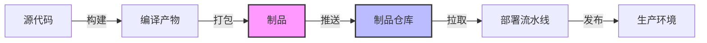
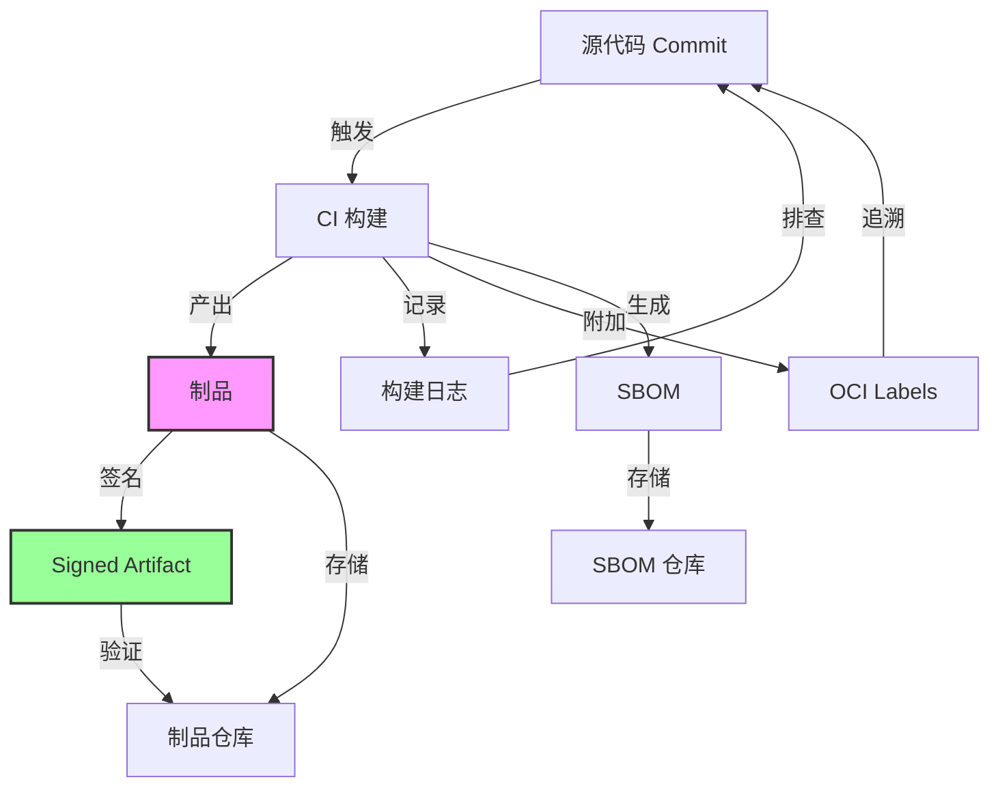
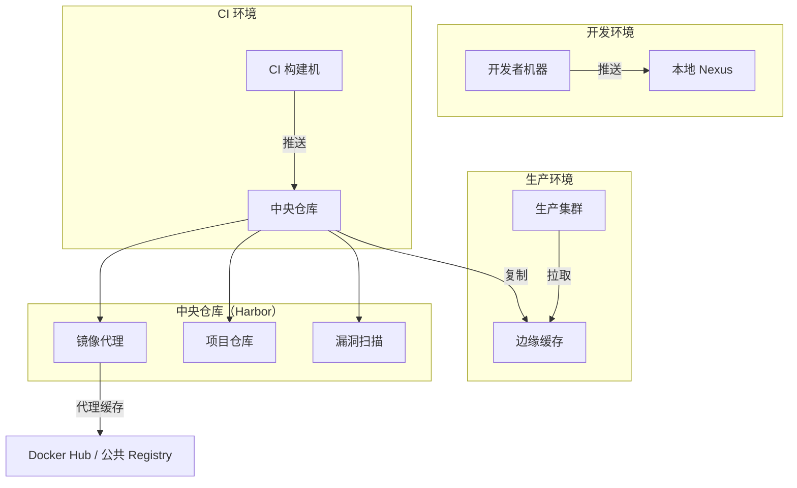
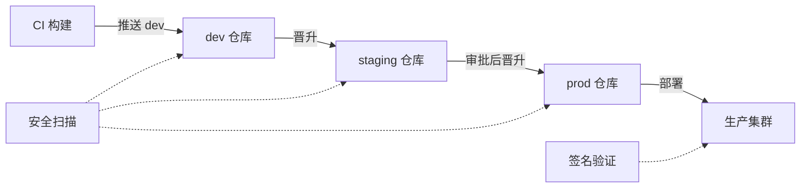
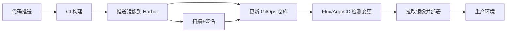

# 制品管理（Artifact Management）

## 1. 什么是制品管理

### 1.1 制品的定义

在 CI/CD 语境下，**制品（Artifact）** 是构建过程产出的、可部署的二进制产物。它不是源代码，而是源代码经过编译、打包、签名后生成的交付物。制品是源代码的"物化形态"——开发者不再传递代码让对方自行构建，而是传递已经验证过的、确定性的产出物。

制品的核心特征：

- **不可变性**：一旦发布，内容不再变化。修改只能通过发布新版本实现
- **自描述性**：附带版本号、来源 commit、构建时间等元数据
- **可分发性**：通过仓库协议（OCI、npm、PyPI 等）在网络间传递
- **可验证性**：通过校验和、签名等方式确认完整性和真实性

常见的制品类型：

| 制品类型 | 示例 | 格式规范 | 典型场景 |
|----------|------|----------|----------|
| 容器镜像 | `registry.example.com/app:v1.2.3` | OCI Image Spec | 微服务部署、云原生应用 |
| Helm Chart | `mychart-0.3.0.tgz` | OCI / Helm Repo | Kubernetes 资源编排 |
| 语言包（Java） | `myapp-2.1.3.jar` / `.war` | Maven Repository | JVM 应用分发 |
| 语言包（JS） | `myapp-2.1.3.tgz` | npm Registry | 前端组件库、CLI 工具 |
| 语言包（Python） | `myapp-2.1.3-py3-none-any.whl` | PyPI | Python 包分发 |
| 语言包（Go） | Go Module zip | Go Module Proxy | Go 库依赖 |
| 二进制文件 | ELF、PE、静态链接库 | 无固定规范 | 嵌入式/系统软件 |
| 文档/站点 | Hugo 构建产物、Swagger JSON | 静态文件 | API 文档发布 |
| 配置包 | Ansible role tarball、Terraform module | 各自规范 | 基础设施配置 |
| SBOM | `sbom.spdx.json` | SPDX / CycloneDX | 合规审计、漏洞追踪 |
| WASM 模块 | `.wasm` 文件 | OCI Artifact | WebAssembly 应用 |

### 1.2 制品管理的核心问题

没有制品管理时，团队面临的典型混乱：

# 场景一：版本混乱
开发者 A："我用的是哪个版本构建的？"
开发者 B："线上跑的是哪个镜像？回滚用哪个？"
运维："昨天部署的那个 JAR 文件在哪？"

# 场景二：安全黑洞
安全团队："生产环境跑的镜像有哪些已知漏洞？"
开发："不知道，我们直接从 Docker Hub pull 的。"
安全团队："谁构建的？用了什么依赖？"
开发："......"

# 场景三：合规审计
审计员："请提供过去 6 个月所有生产部署制品的构建记录。"
运维："我们......没有这个记录。"

制品管理解决的核心问题：

- **可追溯性（Traceability）**：从制品能反查到源代码 commit、构建日志、测试结果、构建者身份，形成完整的证据链
- **可复现性（Reproducibility）**：相同输入 + 相同构建过程 = 相同制品。这是验证和回滚的基础
- **唯一性（Immutability）**：已发布的制品不应被修改，只能新增版本。这保证了"部署时验证的 = 生产运行的"
- **分发控制（Access Control）**：谁可以推送/拉取制品，按项目/环境区分权限，防止未授权访问
- **存储效率（Storage Efficiency）**：通过去重、压缩、生命周期策略控制存储成本
- **漏洞可见性（Vulnerability Visibility）**：知道每个制品中包含哪些依赖、有哪些已知漏洞

### 1.3 制品在 CI/CD 流水线中的位置



制品是 CI（持续集成）的终点，也是 CD（持续部署）的起点。它是连接"构建"与"部署"的桥梁——CI 流水线产出制品并推送到仓库，CD 流水线从仓库拉取制品进行部署。

这个桥梁作用的深层含义：

1. **解耦构建与部署**：构建一次，多次部署。避免"为每个环境重新构建"导致的不确定性
2. **建立信任边界**：通过签名和扫描，制品仓库成为"可信制品"的唯一来源
3. **支持回滚决策**：当生产出现故障时，回滚到具体版本号（而非"上一个版本"）成为精确操作
4. **赋能并行开发**：不同团队可以基于不同版本的制品独立工作，互不干扰

### 1.4 OCI 制品：统一的制品标准

OCI（Open Container Initiative）不仅定义了容器镜像格式，还通过 **OCI Artifacts** 规范扩展为通用的制品存储标准。越来越多的非镜像制品开始存储在 OCI 兼容的仓库中：

| OCI 制品类型 | 工具/规范 | 说明 |
|-------------|-----------|------|
| 容器镜像 | Docker / Buildah / Buildx | 最常见的 OCI 制品 |
| Helm Chart | Helm 3.8+ | `helm push` 直接推送到 OCI 仓库 |
| 签名数据 | Cosign / Notation | 签名、密钥、证书存储为 OCI artifact |
| SBOM | Syft / Grype | 软件物料清单作为 attestation 存储 |
| Wasm 模块 | wasmtime / Spin | WebAssembly 模块的分发格式 |
| 策略签名 | OPA / Kyverno | 策略包可通过 OCI 分发 |

```bash
# Helm Chart 推送到 OCI 仓库（替代传统 Helm Repo）
helm registry login harbor.example.com -u admin -p password
helm chart save ./mychart harbor.example.com/myproject/mychart:0.3.0
helm chart push harbor.example.com/myproject/mychart:0.3.0

# 从 OCI 仓库拉取 Helm Chart
helm pull oci://harbor.example.com/myproject/mychart:0.3.0

# Cosign 签名存储为 OCI artifact（透明日志）
cosign attach signature --signature sig.png harbor.example.com/myapp:2.1.3
```

OCI 统一标准的好处：只需维护一套仓库基础设施，即可存储所有类型的制品，无需为 Docker、Helm、WASM 分别搭建独立仓库。

---

## 2. 制品版本策略

版本号是制品的"身份证"，选择合适的版本策略直接影响团队的协作效率和运维能力。

### 2.1 语义化版本（SemVer）

最常见的版本号规范，格式为 `MAJOR.MINOR.PATCH`（如 `2.1.4`）：

MAJOR - 不兼容的 API 变更（如删除接口、数据库 schema 破坏性变更）
        用户升级需要修改代码适配

MINOR - 向后兼容的功能新增（如新增 API 端点、新增配置项）
        用户升级无需修改代码

PATCH - 向后兼容的缺陷修复（如修复 bug、性能优化）
        用户升级无需修改代码

预发布版本用附加标识表示：`2.1.5-rc.1`、`2.1.5-beta.2`、`2.1.5-alpha.1`

版本优先级（由高到低）：`alpha` < `beta` < `rc` < 正式版

```bash
# SemVer 自动化工具：commitizen + standard-version
# 安装
npm install -g commitizen cz-conventional-changelog

# 提交时交互式选择版本增量
git cz  # 选择 feat→MINOR, fix→PATCH, BREAKING→MAJOR

# 自动生成 CHANGELOG 和版本号
npx standard-version --release-as minor
```

**SemVer 适用场景的边界判断**：

- 对外发布 API/SDK/库 → **必须用 SemVer**，因为下游依赖者需要根据版本号判断升级风险
- 内部微服务 → **不强制**，因为消费者和生产者在同一团队，沟通成本低
- 数据库 migration → 需要额外约定，因为 schema 变更可能打破数据兼容性

### 2.2 基于 Git 提交的版本号

适合高频率发布的场景，常用 `git describe` 生成：

```bash
# 输出格式: v1.2.3-14-g2414721
# 含义: tag v1.2.3 之后的第 14 个 commit, commit hash 为 2414721
git describe --tags --always

# 只取短 hash 作为版本号（简单但不可比较大小）
git rev-parse --short HEAD

# 生成基于 last tag 的版本号（适合自动化流水线）
LATEST_TAG=$(git describe --tags --abbrev=0 2>/dev/null || echo "v0.0.0")
COMMITS_SINCE=$(git rev-list ${LATEST_TAG}..HEAD --count)
SHORT_HASH=$(git rev-parse --short HEAD)
VERSION="${LATEST_TAG}+${COMMITS_SINCE}.${SHORT_HASH}"
echo "版本: $VERSION"
# 输出: v1.2.3+14.a1b2c3d
```

**变体方案**：

```bash
# 方案 A：CalVer（日历版本）+ Git hash
VERSION="$(date +%Y.%m.%d)+$(git rev-parse --short HEAD)"
# 输出: 2026.06.26+a1b2c3d

# 方案 B：构建号 + hash（Jenkins/GitHub Actions 风格）
VERSION="build.${GITHUB_RUN_NUMBER:-$(date +%s)}.$(git rev-parse --short HEAD)"
# 输出: build.142.a1b2c3d

# 方案 C：仅 hash（最简单，适合容器镜像）
VERSION=$(git rev-parse --short HEAD)
# 输出: a1b2c3d
```

### 2.3 时间戳版本

适合开发/测试环境的中间产物：

```bash
# 格式: 20260626.153045.abc1234
VERSION=$(date +%Y%m%d.%H%M%S).$(git rev-parse --short HEAD)

# 带分支名（多分支并行开发时避免冲突）
VERSION=$(date +%Y%m%d.%H%M%S).$(git rev-parse --short HEAD).$(git branch --show-current | tr '/' '-')
```

**注意**：时间戳版本天然可排序，但无法表达语义变更，仅适用于非正式环境。

### 2.4 版本策略选型

| 策略 | 适用场景 | 优点 | 缺点 | 示例 |
|------|----------|------|------|------|
| SemVer | 对外发布的 API/SDK/库 | 语义清晰，依赖管理友好 | 需人工判断版本增量 | `2.1.4` |
| Git hash | 内部微服务、高频迭代 | 自动生成，零决策成本 | 不直观，无法比较大小 | `a1b2c3d` |
| 时间戳 | 开发/测试环境 | 天然排序，无冲突 | 不表达语义 | `20260626.153045` |
| 构建号 | Jenkins/GitLab CI | 与构建系统集成紧密 | 绑定特定 CI 工具 | `#142` |
| 混合策略 | 多数生产项目 | 兼顾语义和自动化 | 规则稍复杂 | `v2.1.3+14.a1b2c3d` |

**实际项目推荐**：大多数团队采用"混合策略"——正式发布用 SemVer tag（`v2.1.3`），日常构建用 Git hash 或构建号。Git tag 触发正式发布流水线，分支推送触发开发版构建。

### 2.5 版本号的自动化生成

在 CI 流水线中自动生成版本号，避免人工出错：

```yaml
# GitHub Actions：自动版本号生成
- name: Generate version
  id: version
  run: |
    # 方案 1：从 git tag 提取
    if [[ "${GITHUB_REF}" == refs/tags/v* ]]; then
      echo "version=${GITHUB_REF_NAME#v}" >> $GITHUB_OUTPUT
      echo "tag_mode=true" >> $GITHUB_OUTPUT
    else
      # 方案 2：auto-git-tags（自动递增 patch 版本）
      VERSION=$(npx auto-git-tags --dry-run 2>/dev/null | grep -oP 'v\K[0-9]+\.[0-9]+\.[0-9]+')
      if [ -z "$VERSION" ]; then
        VERSION="0.0.0-dev.$(git rev-parse --short HEAD)"
      fi
      echo "version=${VERSION}" >> $GITHUB_OUTPUT
      echo "tag_mode=false" >> $GITHUB_OUTPUT
    fi

# 方案 3：Python 的 versioneer（适用于 Python 项目）
# 从 git tag 自动生成 _version.py
```

---

## 3. 主流制品仓库工具

### 3.1 通用型：JFrog Artifactory / Sonatype Nexus

#### JFrog Artifactory

企业级制品管理的标杆产品，支持几乎所有包格式：

```yaml
# Artifactory 推送 Docker 镜像示例
# 1. 在 Artifactory 中创建本地 Docker 仓库
# 2. 配置 Docker 客户端信任 Artifactory TLS
# 3. 打标签并推送
docker tag myapp:latest mycompany-docker.jfrog.io/myproject/myapp:2.1.3
docker push mycompany-docker.jfrog.io/myproject/myapp:2.1.3

# 验证推送结果
curl -u admin:password \
  "https://mycompany-docker.jfrog.io/artifactory/api/docker/myproject/v2/myapp/tags/list"
```

Artifactory 的核心优势：

- **远程仓库代理**：缓存 npm、PyPI、Maven Central 等上游仓库的依赖，加速构建同时避免依赖外部网络
- **丰富的元数据**：每个制品可附加构建信息、VCS 信息、测试报告，形成完整的制品履历
- **多角色支持**：同一实例同时服务 Docker、Maven、npm、PyPI 等，不需要为每种包类型单独部署
- **权限精细控制**：按仓库、路径、用户组设置读写权限，支持匿名访问控制
- **构建集成**：Jenkins/GitHub Actions 插件可以自动收集构建信息并关联到制品

**Artifactory 仓库类型**：

| 类型 | 用途 | 特点 |
|------|------|------|
| Local | 存放团队自己构建的制品 | 可读可写，团队内部产物 |
| Remote | 代理上游公共仓库 | 只读缓存，加速依赖拉取 |
| Virtual | 聚合多个仓库为统一入口 | 简化客户端配置，合并搜索 |

```bash
# Artifactory 查询某个制品的构建信息
curl -u admin:password \
  "https://mycompany.jfrog.io/artifactory/api/build/myapp/42" | jq '.buildInfo | {
    name, number, started,
    modules: [.modules[] | {id, artifacts: [.artifacts[].name]}],
    vcsRevision
  }'
```

#### Sonatype Nexus

开源替代方案，Nexus 3 社区版免费：

```bash
# Docker 部署 Nexus
docker run -d \
  --name nexus \
  -p 8081:8081 \
  -v nexus-data:/nexus-data \
  sonatype/nexus3

# 初始密码
docker exec nexus cat /nexus-data/admin.password

# 配置后推送镜像
# 编辑 /etc/docker/daemon.json:
{
  "insecure-registries": ["nexus.example.com:8083"]
}
```

Nexus 的优势：

- **Maven 生态深度集成**：天然支持 Maven 仓库格式，是 Java 项目的首选开源方案
- **代理缓存**：可代理 Docker Hub、Maven Central、npmjs 等，减少外网依赖
- **角色权限系统**：基于 Realm/Role/Privilege 的细粒度权限控制
- **任务调度**：内置定时任务（清理、重建索引、代理同步等）

**Nexus vs Artifactory 选型建议**：

| 维度 | Nexus | Artifactory |
|------|-------|-------------|
| 许可证 | OSS 免费，Pro 付费 | 社区版免费，Pro 付费 |
| 包格式支持 | Maven/npm/Docker/PyPI/Go | 几乎所有格式（含 Cargo/Conan/Conan） |
| 企业功能 | 仓库复制、LDAP 需 Pro 版 | 基础版即含复制、LDAP、RBAC |
| 社区活跃度 | 中等 | 高（商业公司推动） |
| 适合场景 | Java/Maven 为主、预算有限 | 多语言混合、需要全格式支持 |

### 3.2 容器镜像专用：Harbor

CNCF 毕业项目，专为 Docker/OCI 镜像设计：

```bash
# Harbor 安装（使用官方安装脚本）
wget https://github.com/goharbor/harbor/releases/download/v2.11.0/harbor-offline-installer-v2.11.0.tgz
tar xzf harbor-offline-installer-v2.11.0.tgz
cd harbor

# 编辑 harbor.yml 配置
# hostname: harbor.example.com
# harbor_admin_password: Harbor12345
# database.password: root123

./install.sh --with-trivy  # 带漏洞扫描

# 登录并推送镜像
docker login harbor.example.com
docker tag myapp:latest harbor.example.com/library/myapp:2.1.3
docker push harbor.example.com/library/myapp:2.1.3
```

Harbor 相比 Docker Hub / Nexus 的差异化功能：

- **漏洞扫描**：集成 Trivy，镜像推送后自动扫描 CVE，不安全的镜像可自动阻止拉取
- **签名验证**：Cosign/Notation 镜像签名，部署时验证完整性，防止镜像被篡改
- **镜像复制**：多数据中心间异步复制镜像，支持基于项目、标签的过滤规则
- **RBAC**：基于项目（Project）的权限隔离，LDAP/AD 集成，支持 OIDC 单点登录
- **审计日志**：谁在什么时候推送/拉取了什么镜像，完整记录，满足合规要求
- **垃圾回收**：自动清理无引用的镜像层，释放存储空间
- **Webhook**：镜像推送/删除事件可触发外部通知或自动化流程

**Harbor 项目（Project）设计建议**：

| 项目类型 | 命名规范 | 权限策略 | 举例 |
|----------|----------|----------|------|
| 应用镜像 | `app-{team}-{name}` | 开发读写，运维只读 | `app-frontend-web` |
| 基础镜像 | `base-{os}-{variant}` | 平台团队管理 | `base-ubuntu-noble` |
| 中间件 | `middleware-{type}` | 中间件团队管理 | `middleware-redis` |
| 公共基础 | `library` | 全员只读 | `library/alpine` |

### 3.3 云原生方案对比

| 工具 | 类型 | 特色 | 适用规模 | 许可证 |
|------|------|------|----------|--------|
| Docker Hub | 托管 SaaS | 免费公开仓库，自动构建 | 个人/小团队 | 免费+付费 |
| GitHub Container Registry | 托管 SaaS | 与 GitHub Actions 深度集成 | GitHub 用户 | 按流量计费 |
| JFrog Artifactory | 自建/SaaS | 全格式支持，企业级功能 | 中大型企业 | 商业/社区版 |
| Sonatype Nexus | 自建 | 开源，Maven 生态强 | 中型团队 | 社区版免费 |
| Harbor | 自建 | CNCF 项目，镜像专精 | 中大型团队 | Apache 2.0 |
| GitLab Container Registry | 自建/SaaS | 与 GitLab CI 无缝集成 | GitLab 用户 | 免费+付费 |
| AWS ECR | 托管 | 与 AWS IAM 深度集成 | AWS 用户 | 按存储+流量 |
| 阿里云 ACR | 托管 | 国内加速，与 ACK 集成 | 阿里云用户 | 按量付费 |
| Google Artifact Registry | 托管 | 与 GKE/GCR 集成，支持多格式 | GCP 用户 | 按存储+流量 |

**选型决策树**：

你是云厂商重度用户吗？
├── 是 AWS → ECR
├── 是 GCP → Google Artifact Registry
├── 是阿里云 → ACR
└── 否
    ├── 需要多格式支持（不只是 Docker）？
    │   ├── 是 → Artifactory（商业）或 Nexus（开源）
    │   └── 否（只需要 Docker/OCI）
    │       ├── 需要企业级安全功能？
    │       │   ├── 是 → Harbor
    │       │   └── 否
    │       │       ├── 用 GitHub？→ GHCR
    │       │       ├── 用 GitLab？→ GitLab Registry
    │       │       └── 其他 → Docker Hub

### 3.4 代理仓库配置

在生产环境中，直接访问公共仓库（如 Docker Hub、npmjs）存在网络不稳定和限速问题。通过代理仓库缓存上游制品，可以显著提升构建速度和稳定性：

```bash
# Nginx 配置 Docker Hub 代理（企业内网场景）
# /etc/nginx/conf.d/docker-proxy.conf
upstream docker-hub {
    server registry-1.docker.io:443;
    keepalive 32;
}

server {
    listen 443 ssl;
    server_name docker-proxy.internal;

    location /v2/ {
        proxy_pass https://docker-hub;
        proxy_set_header Host registry-1.docker.io;
        proxy_set_header X-Real-IP $remote_addr;
        proxy_buffering on;
        proxy_buffer_size 128k;
        proxy_buffers 4 256k;
    }
}

# 使用代理
# /etc/docker/daemon.json
{
  "registry-mirrors": ["https://docker-proxy.internal"]
}
```

**Harbor 代理缓存配置**：

```bash
# 通过 Harbor API 创建远程仓库（代理 Docker Hub）
curl -X POST "https://harbor.example.com/api/v2.0/projects/library/remote-repositories" \
  -H "Authorization: Basic $(echo -n admin:Harbor12345 | base64)" \
  -H "Content-Type: application/json" \
  -d '{
    "name": "dockerhub-proxy",
    "type": "docker-hub",
    "url": "https://hub.docker.com",
    "credential": {
      "type": "basic",
      "access_key": "your-dockerhub-username",
      "access_secret": "your-dockerhub-password"
    },
    "insecure": false
  }'

# 使用代理拉取（首次拉取自动缓存，后续直接从 Harbor 读取）
docker pull harbor.example.com/dockerhub-proxy/library/nginx:1.25
```

---

## 4. 制品管理最佳实践

### 4.1 不可变制品（Immutable Artifacts）

**核心原则：已发布的制品永远不能被修改，只能发布新版本。**

```bash
# 错误做法：覆盖已有 tag
docker tag myapp:2.1.3 myapp:latest  # latest 可以覆盖
docker push myapp:latest

# 正确做法：每次构建生成唯一版本号
# GitHub Actions 示例
VERSION="${GITHUB_REF_NAME}-$(date +%Y%m%d)-${GITHUB_RUN_NUMBER}"
docker tag myapp:${GITHUB_SHA::7} registry.example.com/myapp:${VERSION}
docker push registry.example.com/myapp:${VERSION}
```

为什么不可变如此重要？

- **审计合规**：SOC2、HIPAA、等保等合规要求制品可追溯、不可篡改。如果制品可以被覆盖，就无法证明生产环境运行的和测试验证的是同一个东西
- **故障回滚**：确保回滚时使用的就是当初验证过的那个制品。如果制品被修改，回滚可能引入新问题
- **并行部署**：多个环境可以同时运行不同版本，互不干扰。不可变制品是"多版本并存"的前提
- **缓存安全**：CI/CD 缓存的制品如果可能被修改，缓存就不可靠，必须每次都重新拉取

**不可变制品的例外处理**：

```bash
# latest 标签是特殊的——它可以被覆盖，用于指向最新的稳定版本
# 但它只应该由自动化流水线更新，不应由人工操作

# 正确的 latest 使用模式：
# 1. 只有 release tag 推送时才更新 latest
# 2. latest 只指向经过完整验证的版本
# 3. 绝不在生产部署中使用 latest

# GitHub Actions: 仅在 tag 推送时更新 latest
- name: Update latest tag
  if: startsWith(github.ref, 'refs/tags/v')
  run: |
    docker tag $IMAGE:$VERSION $IMAGE:latest
    docker push $IMAGE:latest
```

### 4.2 制品溯源（Provenance Tracking）

建立"制品 → 构建信息 → 源代码"的完整链路：

```json
// Artifactory 构建信息示例
{
  "buildInfo": {
    "name": "myapp",
    "number": "42",
    "started": "2026-06-26T15:30:00.000+08:00",
    "modules": [{
      "id": "com.example:myapp:2.1.3",
      "artifacts": [
        {"type": "docker", "name": "myapp:2.1.3", "sha256": "a1b2c3..."}
      ],
      "dependencies": [...]
    }],
    "vcsRevision": "abc123def456",
    "vcsUrl": "https://github.com/org/myapp",
    "properties": {
      "build.branch": "main",
      "build.committer": "developer@example.com"
    }
  }
}
```

在 CI 流水线中自动附加构建信息：

```yaml
# GitHub Actions 附加元数据
- name: Annotate image
  run: |
    # 使用 buildkit 附加标签
    docker buildx build \
      --label "org.opencontainers.image.source=$(git remote get-url origin)" \
      --label "org.opencontainers.image.revision=$(git rev-parse HEAD)" \
      --label "org.opencontainers.image.created=$(date -u +%Y-%m-%dT%H:%M:%SZ)" \
      --label "org.opencontainers.image.version=${{ github.ref_name }}" \
      --label "org.opencontainers.image.title=${{ github.event.head_commit.message }}" \
      --label "org.opencontainers.image.authors=$(git log --format='%an' -1)" \
      -t registry.example.com/myapp:${{ github.sha }} \
      --push .
```

**溯源的完整证据链**：



### 4.3 生命周期管理（Lifecycle Policy）

制品仓库会无限膨胀，必须设置自动清理策略：

```bash
# Harbor 镜像保留策略（通过 API 设置）
curl -X PUT "https://harbor.example.com/api/v2.0/projects/myproject/policies/retention" \
  -H "Authorization: Basic $(echo -n admin:password | base64)" \
  -H "Content-Type: application/json" \
  -d '{
    "algorithm": "or",
    "rules": [
      {
        "disabled": false,
        "action": "retain",
        "template": "latestPushedK",
        "params": {"latestPushedK": 10},
        "tag_selectors": [{"kind": "doublestar", "pattern": "**"}]
      },
      {
        "disabled": false,
        "action": "retain",
        "template": "always",
        "params": {},
        "tag_selectors": [
          {"kind": "doublestar", "pattern": "v*-rc*"},
          {"kind": "doublestar", "pattern": "v*-beta*"},
          {"kind": "doublestar", "pattern": "v*-alpha*"}
        ]
      }
    ],
    "trigger": {"kind": "Schedule", "cron": "0 0 2 * * *"}
  }'
```

典型的生命周期规则：

| 规则 | 保留策略 | 说明 |
|------|----------|------|
| latest N 版本 | 保留最近 10 个推送版本 | 保留最新可用制品 |
| Release tag | 永久保留 | `v1.x`、`v2.x` 等正式发布版本 |
| RC/Beta tag | 保留 30 天 | 预发布版本定期清理 |
| 无 tag 镜像 | 7 天后删除 | 每次 commit 构建的中间产物 |
| 被依赖制品 | 不自动删除 | Helm Chart 依赖的镜像 |
| 孤儿层 | 垃圾回收清理 | 无引用的镜像层（layer） |

**各工具的清理策略配置**：

```bash
# Docker Hub: 自动删除超过 30 天的未拉取镜像
# 在 Docker Hub 仓库设置中开启 "Automated image cleanup"

# Artifactory: 通过 API 设置清理策略
curl -X PUT "https://artifactory.example.com/artifactory/api/cleanup/myproject" \
  -H "Content-Type: application/json" \
  -d '{
    "cronExp": "0 0 2 * * ?",
    "repos": ["myproject-docker-local"],
    "deleteEmptyDirs": true,
    "disableCleanup": false,
    "excludePatterns": ["**/release/**", "**/stable/**"],
    "properties": {"retain.count": ["10"]},
    "olderThanDays": 30
  }'

# Nexus: 通过 Task 调度清理
# 在 Nexus UI → Tasks → Create Task → "Docker - Delete unused images and layers"
```

**存储成本控制**：

| 存储策略 | 预期节省 | 实施难度 | 说明 |
|----------|----------|----------|------|
| 层级化清理（dev < 30天, prod 永久） | 40-60% | 低 | 按环境设置不同保留期 |
| 镜像压缩（Skopeo copy --compress） | 10-20% | 低 | 传输时压缩，仓库存储时解压 |
| GC 定期执行 | 5-15% | 低 | 清理无引用层，释放碎片空间 |
| 共享基础层 | 30-50% | 中 | 使用同一 base image，利用层共享去重 |
| 跨区域复制时去重 | 20-30% | 中 | 只复制差异层，不重复传输 |

### 4.4 制品签名与安全扫描

#### 镜像签名

```bash
# 使用 Cosign 签名（Sigstore 项目）
# 安装
go install github.com/sigstore/cosign/v2/cmd/cosign@latest

# 生成密钥对
cosign generate-key-pair

# 签名镜像
cosign sign --key cosign.key registry.example.com/myapp:2.1.3

# 验证签名
cosign verify --key cosign.pub registry.example.com/myapp:2.1.3

# Keyless 签名（使用 OIDC 身份，无需管理密钥）
cosign sign registry.example.com/myapp:2.1.3
cosign verify --certificate-identity=developer@example.com \
  --certificate-oidc-issuer=https://accounts.google.com \
  registry.example.com/myapp:2.1.3
```

**Cosign vs Notation 对比**：

| 维度 | Cosign (Sigstore) | Notation (CNCF) |
|------|-------------------|------------------|
| 维护者 | Sigstore/CNCF | CNCF (Notary 项目) |
| 签名存储 | OCI 附注（透明日志） | OCI 附注 |
| 密钥管理 | 本地密钥 / Keyless (OIDC) | 本地密钥 / CA 证书链 |
| 企业支持 | 强（Google/Azure 背书） | 强（Docker/Microsoft 背背书） |
| 适用场景 | 开源项目、云原生 | 企业环境、需要 PKI 集成 |
| 推荐选择 | 新项目首选 | 已有 Notary 基础设施 |

**推荐**：新项目选 Cosign（Keyless 模式零配置），已有企业 PKI 的选 Notation。

#### 漏洞扫描

```bash
# Trivy 扫描镜像
trivy image --severity HIGH,CRITICAL registry.example.com/myapp:2.1.3

# 输出格式化为 CI 可解析
trivy image --format json --output trivy-results.json \
  registry.example.com/myapp:2.1.3

# 在流水线中作为质量门禁
trivy image --exit-code 1 --severity HIGH,CRITICAL \
  registry.example.com/myapp:2.1.3
# exit-code 1 表示发现高危漏洞，流水线失败

# Trivy 扫描文件系统（在构建阶段扫描依赖）
trivy fs --severity HIGH,CRITICAL .

# 扫描 Helm Chart
trivy config --severity HIGH,CRITICAL ./mychart/
```

**漏洞扫描策略设计**：

| 阶段 | 扫描目标 | 阈值 | 动作 |
|------|----------|------|------|
| PR 阶段 | 文件系统依赖 | CRITICAL | 阻止合并 |
| 构建阶段 | 最终镜像 | HIGH + CRITICAL | 阻止推送 |
| 定时扫描 | 仓库中所有镜像 | HIGH + CRITICAL | 通知 + 跟踪 |
| 部署阶段 | 运行中镜像 | CRITICAL | 阻止部署 |

**为什么要在多个阶段都扫描**：因为漏洞数据库持续更新（NVD 每天发布新的 CVE）。构建时扫描发现的漏洞可能还没被发现，需要运行时持续监控。不同阶段的扫描目标不同——构建时扫依赖，运行时扫镜像，生产时扫已部署的服务。

#### 知识产权合规扫描

```bash
# 使用 license-checker 检查依赖许可证
npx license-checker --summary --production

# 使用 FOSSA 进行全面的许可证合规扫描
# （集成到 CI 流水线）
npx fossa analyze

# 输出格式示例：
# MIT: 120 packages
# Apache-2.0: 45 packages
# BSD-3-Clause: 12 packages
# GPL-3.0: 2 packages  ← 需要人工审查
```

### 4.5 制品缓存优化

CI/CD 构建时间是团队效率的关键指标。合理的制品缓存可以将构建时间缩短 50-80%。

```yaml
# GitHub Actions: Docker 构建缓存
- name: Build and push
  uses: docker/build-push-action@v5
  with:
    context: .
    push: true
    tags: myapp:${{ github.sha }}
    cache-from: type=gha           # 从 GitHub Actions 缓存恢复
    cache-to: type=gha,mode=max    # 完整模式缓存所有层

# 多阶段构建的缓存优化
# Dockerfile 示例
FROM node:20-alpine AS deps
WORKDIR /app
COPY package.json package-lock.json ./
RUN npm ci --prefer-offline  # 优先使用本地缓存

FROM deps AS builder
COPY . .
RUN npm run build

FROM node:20-alpine AS runner
COPY --from=builder /app/dist ./dist
COPY --from=deps /app/node_modules ./node_modules
```

**依赖缓存策略**：

| 语言/工具 | 缓存策略 | 缓存位置 | 命中率 |
|-----------|----------|----------|--------|
| npm | `~/.npm` 目录 | GitHub Actions Cache | 90%+ |
| pip | `~/.cache/pip` | GitHub Actions Cache | 85%+ |
| Maven | `~/.m2/repository` | Artifactory 本地缓存 | 95%+ |
| Go | `~/go/pkg/mod` | Go Module Proxy | 90%+ |
| Docker | 层缓存 (BuildKit) | registry 层缓存 / GHA | 80%+ |

---

## 5. 制品仓库架构设计

### 5.1 仓库拓扑



### 5.2 多环境制品流转



关键原则：

- 制品从 dev → staging → prod **晋升（Promote）**，不是重新构建。同一份制品在不同环境中保持一致
- 每次晋升都要触发安全扫描和合规检查
- 生产环境只拉取 prod 仓库中的制品
- 晋升操作应有审批流程（人工或自动策略）

**制品晋升的自动化实现**：

```yaml
# GitHub Actions: 制品晋升流水线
# 从 dev 晋升到 staging（自动触发）
- name: Promote to staging
  if: github.ref == 'refs/heads/main'
  run: |
    # 复制镜像（不重新构建）
    docker pull $REGISTRY/dev/myapp:$VERSION
    docker tag $REGISTRY/dev/myapp:$VERSION $REGISTRY/staging/myapp:$VERSION
    docker push $REGISTRY/staging/myapp:$VERSION
    # 验证哈希一致性
    docker inspect --format='{{index .RepoDigests 0}}' $REGISTRY/staging/myapp:$VERSION

# 从 staging 晋升到 prod（需要审批）
- name: Promote to production
  if: startsWith(github.ref, 'refs/tags/v')
  environment: production  # 需要 Environment 审批
  run: |
    docker pull $REGISTRY/staging/myapp:$VERSION
    docker tag $REGISTRY/staging/myapp:$VERSION $REGISTRY/prod/myapp:$VERSION
    docker push $REGISTRY/prod/myapp:$VERSION
    # 部署
    kubectl set image deployment/myapp myapp=$REGISTRY/prod/myapp:$VERSION -n production
```

### 5.3 高可用部署

```bash
# Harbor 高可用方案
# 1. 数据库: PostgreSQL 主从
# 2. 对象存储: S3 / MinIO 集群
# 3. 缓存: Redis Sentinel
# 4. 负载均衡: Nginx / HAProxy

# harbor.yml 高可用配置
hostname: harbor.example.com
database:
  host: postgres-vip.example.com
  port: 5432
  harbor_db_password: "secure-password"
storage:
  s3:
    regionendpoint: https://s3.example.com
    bucket: harbor-data
    accesskey: ${S3_ACCESS_KEY}
    secretkey: ${S3_SECRET_KEY}
    region: us-east-1
  cache:
    enabled: true
    expire_seconds: 172800
redis:
  host: redis-sentinel.example.com
  port: 6379
  password: "redis-password"
```

**高可用架构组件说明**：

| 组件 | 用途 | 高可用方案 | RPO/RTO |
|------|------|-----------|---------|
| PostgreSQL | 制品元数据 | 主从复制 + 自动故障切换 | 0 / <30s |
| S3/MinIO | 镜像层存储 | 多副本 + 跨区域复制 | 0 / <60s |
| Redis | 会话和缓存 | Redis Sentinel / Cluster | <1s / <10s |
| Nginx/HAProxy | 负载均衡 | 双活 + 健康检查 | 0 / <5s |
| Harbor 应用 | API 服务 | 多副本 + 共享存储 | 0 / <30s |

### 5.4 多数据中心镜像复制

```bash
# Harbor 跨数据中心复制配置
# 目标：DC-A 推送的镜像自动复制到 DC-B

# 1. 在 DC-B 的 Harbor 中创建"目标"（指向 DC-A）
curl -X POST "https://dc-b.harbor.example.com/api/v2.0/registries" \
  -H "Authorization: Basic $(echo -n admin:password | base64)" \
  -H "Content-Type: application/json" \
  -d '{
    "name": "dc-a-harbor",
    "type": "harbor",
    "url": "https://dc-a.harbor.example.com",
    "credential": {
      "type": "basic",
      "access_key": "robot$replication",
      "access_secret": "robot-secret-token"
    }
  }'

# 2. 在 DC-B 创建复制规则
curl -X POST "https://dc-b.harbor.example.com/api/v2.0/replication/policies" \
  -H "Authorization: Basic $(echo -n admin:password | base64)" \
  -H "Content-Type: application/json" \
  -d '{
    "name": "dc-a-sync",
    "src_registry": {"id": 1},
    "trigger": {"type": "event_based"},
    "dest_namespace": "library",
    "filters": [
      {"type": "name", "value": "**"},
      {"type": "tag", "value": "v*,latest"}
    ]
  }'
```

---

## 6. 各语言制品管理工作流

### 6.1 Java/Maven：JAR 与 Docker 的统一管理

```xml
<!-- pom.xml 中配置 Artifactory 作为发布目标 -->
<distributionManagement>
  <repository>
    <id>artifactory</id>
    <name>releases</name>
    <url>https://mycompany.jfrog.io/artifactory/libs-release-local</url>
  </repository>
  <snapshotRepository>
    <id>artifactory</id>
    <name>snapshots</name>
    <url>https://mycompany.jfrog.io/artifactory/libs-snapshot-local</url>
  </snapshotRepository>
</distributionManagement>
```

```bash
# Maven 发布到 Artifactory
mvn clean deploy -Drevision=2.1.3

# 同时构建 Docker 镜像（将 JAR 打入镜像）
mvn spring-boot:build-image \
  -Dspring-boot.build-image.imageName=harbor.example.com/myapp:2.1.3
```

### 6.2 Node.js：npm 包与容器镜像

```bash
# 发布 npm 包到私有 registry
npm config set @mycompany:registry https://mycompany.jfrog.io/artifactory/api/npm/npm-virtual/
npm publish --access restricted

# 安装时从私有 registry 拉取
npm install @mycompany/utils
```

```json
// .npmrc（项目级配置）
@mycompany:registry=https://mycompany.jfrog.io/artifactory/api/npm/npm-virtual/
```

### 6.3 Python：PyPI 与 Docker

```bash
# 构建 wheel 包
python -m build  # 生成 dist/myapp-2.1.3-py3-none-any.whl

# 发布到私有 PyPI（使用 twine）
twine upload --repository-url https://artifactory.example.com/api/pypi/pypi-local \
  dist/myapp-2.1.3-py3-none-any.whl

# 用户安装
pip install --index-url https://artifactory.example.com/api/pypi/pypi-local/simple \
  myapp==2.1.3
```

### 6.4 Go：模块代理

```bash
# 设置私有 Go 模块代理
export GOPROXY=https://goproxy.internal.company.com,direct
export GONOSUMCHECK=*.internal.company.com

# 发布 Go 模块（通过 git tag 触发）
git tag v1.2.3
git push origin v1.2.3

# 消费者拉取
go get github.com/mycompany/mymodule@v1.2.3
```

---

## 7. 完整实战：GitHub Actions + Harbor 制品管理

### 7.1 工作流设计

```yaml
# .github/workflows/build-and-publish.yml
name: Build and Publish

on:
  push:
    branches: [main]
    tags: ['v*']

env:
  REGISTRY: harbor.example.com
  IMAGE_NAME: myproject/myapp

jobs:
  build:
    runs-on: ubuntu-latest
    permissions:
      contents: read
      packages: write

    steps:
      - uses: actions/checkout@v4
        with:
          fetch-depth: 0  # 完整 git 历史（用于 git describe）

      # 步骤 1: 计算版本号
      - name: Determine version
        id: version
        run: |
          if [[ "${GITHUB_REF}" == refs/tags/v* ]]; then
            # tag 推送: 使用 tag 作为版本号
            echo "version=${GITHUB_REF_NAME}" >> $GITHUB_OUTPUT
            echo "is_release=true" >> $GITHUB_OUTPUT
          else
            # 分支推送: 使用 git describe 生成版本号
            VERSION=$(git describe --tags --always --dirty)
            echo "version=dev-${VERSION}" >> $GITHUB_OUTPUT
            echo "is_release=false" >> $GITHUB_OUTPUT
          fi
          echo "commit=$(git rev-parse --short HEAD)" >> $GITHUB_OUTPUT

      # 步骤 2: 构建 Docker 镜像
      - name: Set up Docker Buildx
        uses: docker/setup-buildx-action@v3

      - name: Login to Harbor
        uses: docker/login-action@v3
        with:
          registry: ${{ env.REGISTRY }}
          username: ${{ secrets.HARBOR_USER }}
          password: ${{ secrets.HARBOR_PASSWORD }}

      - name: Build and push
        uses: docker/build-push-action@v5
        with:
          context: .
          push: true
          tags: |
            ${{ env.REGISTRY }}/${{ env.IMAGE_NAME }}:${{ steps.version.outputs.version }}
            ${{ env.REGISTRY }}/${{ env.IMAGE_NAME }}:commit-${{ steps.version.outputs.commit }}
          labels: |
            org.opencontainers.image.version=${{ steps.version.outputs.version }}
            org.opencontainers.image.revision=${{ steps.version.outputs.commit }}
            org.opencontainers.image.created=${{ github.event.head_commit.timestamp }}
          cache-from: type=gha
          cache-to: type=gha,mode=max

      # 步骤 3: 漏洞扫描
      - name: Run Trivy vulnerability scanner
        uses: aquasecurity/trivy-action@master
        with:
          image-ref: ${{ env.REGISTRY }}/${{ env.IMAGE_NAME }}:${{ steps.version.outputs.version }}
          format: 'sarif'
          output: 'trivy-results.sarif'
          severity: 'CRITICAL,HIGH'
          exit-code: '1'  # 发现高危漏洞则失败

      # 步骤 4: 签名镜像
      - name: Install Cosign
        if: steps.version.outputs.is_release == 'true'
        uses: sigstore/cosign-installer@v3

      - name: Sign the container image
        if: steps.version.outputs.is_release == 'true'
        run: cosign sign --yes \
          --key env://COSIGN_KEY \
          ${{ env.REGISTRY }}/${{ env.IMAGE_NAME }}:${{ steps.version.outputs.version }}
        env:
          COSIGN_KEY: ${{ secrets.COSIGN_PRIVATE_KEY }}

      # 步骤 5: 生成 SBOM
      - name: Generate SBOM
        if: steps.version.outputs.is_release == 'true'
        uses: anchore/sbom-action@v0
        with:
          image: ${{ env.REGISTRY }}/${{ env.IMAGE_NAME }}:${{ steps.version.outputs.version }}
          format: spdx-json
          output-file: sbom.spdx.json

      # 步骤 6: 上传构建元数据到 Artifactory
      - name: Publish build info
        if: steps.version.outputs.is_release == 'true'
        run: |
          curl -X POST \
            -u "${{ secrets.ARTIFACTORY_USER }}:${{ secrets.ARTIFACTORY_API_KEY }}" \
            -H "Content-Type: application/json" \
            -d "{
              \"version\": \"${{ steps.version.outputs.version }}\",
              \"commit\": \"${{ steps.version.outputs.commit }}\",
              \"branch\": \"${{ github.ref_name }}\",
              \"timestamp\": \"$(date -u +%Y-%m-%dT%H:%M:%SZ)\"
            }" \
            "https://artifactory.example.com/api/build/myapp/${{ github.run_number }}"
```

### 7.2 部署时验证制品

```yaml
# Kubernetes 部署前验证
# admission-webhook.yaml
apiVersion: admissionregistration.k8s.io/v1
kind: ValidatingWebhookConfiguration
metadata:
  name: image-policy-webhook
webhooks:
  - name: image-checker.example.com
    rules:
      - apiGroups: [""]
        apiVersions: ["v1"]
        operations: ["CREATE", "UPDATE"]
        resources: ["pods"]
    clientConfig:
      service:
        name: image-checker
        namespace: kube-system
```

```bash
# 手动验证镜像签名
# 在部署脚本中加入签名验证
cosign verify \
  --key /etc/cosign/cosign.pub \
  harbor.example.com/myproject/myapp:2.1.3

if [ $? -ne 0 ]; then
  echo "ERROR: Image signature verification failed. Deployment blocked."
  exit 1
fi

# 验证镜像来源（provenance attestation）
cosign verify-attestation \
  --key /etc/cosign/cosign.pub \
  --type slsaprovenance \
  harbor.example.com/myproject/myapp:2.1.3
```

### 7.3 制品查询与问题排查

```bash
# 查看镜像的所有 tag
curl -s -u admin:password \
  "https://harbor.example.com/api/v2.0/projects/myproject/repositories/myapp/artifacts?page=1&amp;page_size=100" | \
  jq '.[].tags[].name'

# 查看镜像的漏洞扫描结果
curl -s -u admin:password \
  "https://harbor.example.com/api/v2.0/projects/myproject/repositories/myapp/artifacts/2.1.3/scan/latest" | \
  jq '.scan_overview'

# 查看镜像的层信息（排查大小问题）
docker inspect harbor.example.com/myproject/myapp:2.1.3 | \
  jq '.[0].RootFS.Layers | length'

# 查看镜像构建历史（排查配置问题）
docker history harbor.example.com/myproject/myapp:2.1.3

# 清理本地无用镜像（释放开发机空间）
docker system df          # 查看占用
docker system prune -a --filter "until=168h"  # 清理 7 天前的
```

---

## 8. 常见误区与纠正

| 误区 | 问题 | 正确做法 |
|------|------|----------|
| 用 `latest` tag 部署生产环境 | 无法确定线上跑的具体版本，回滚无目标 | 生产环境只用精确版本号，如 `v2.1.3` |
| 重新构建而非拉取同一制品 | dev 环境验证通过的制品，prod 构建可能不同 | 构建一次，晋升到各环境（Promote） |
| 制品仓库不做清理 | 仓库磁盘爆满，构建变慢 | 设置生命周期策略，自动清理过期制品 |
| 不扫描制品直接部署 | 已知漏洞镜像进入生产环境 | CI 中集成 Trivy/Snyk，扫描不通过则阻断 |
| 不签名制品 | 镜像可能被篡改或替换 | 使用 Cosign/Notation 签名，部署时验证 |
| 制品与构建信息脱节 | 出了问题无法定位到 commit | 构建时附加 OCI 标签，推送构建信息 |
| 制品仓库不做备份 | 误删或故障导致制品丢失 | 制品仓库数据定期备份到异地 |
| 所有环境用同一个仓库 | dev 的测试镜像可能被误部署到生产 | 分项目/分仓库隔离，prod 仓库只接收晋升制品 |
| 忽略基础镜像管理 | 底层基础镜像存在漏洞，所有下游镜像继承 | 独立管理基础镜像，定期更新并重建下游 |
| 手动管理版本号 | 版本号混乱、冲突、遗漏 | 在 CI 流水线中自动生成和管理 |

---

## 9. 进阶：供应链安全（Supply Chain Security）

现代制品管理已经超越了简单的"存储和分发"，成为软件供应链安全的核心环节。

### 9.1 SLSA 框架

SLSA（Supply-chain Levels for Software Artifacts）是 Google 发起的供应链安全框架，定义了四个安全等级：

| 等级 | 要求 | 说明 | 实现方式 |
|------|------|------|----------|
| SLSA 1 | 构建过程有文档化 | 构建脚本纳入版本控制 | Git 管理构建脚本 |
| SLSA 2 | 使用版本控制的构建服务 | CI/CD 平台自动构建 | GitHub Actions / Jenkins |
| SLSA 3 | 构建平台有访问控制和隔离 | 防止恶意修改构建过程 | 受限的 CI 环境 + 审计日志 |
| SLSA 4 | 双人审核 + 可重现构建 | 最高安全级别 | 分叉构建 + 多人签名 |

```bash
# 使用 SLSA Generator 生成 SLSA 证明
# GitHub Actions 示例
- name: Generate SLSA provenance
  uses: slsa-framework/slsa-github-generator@v1.10.0
  with:
    image: harbor.example.com/myapp
    registry-username: ${{ secrets.HARBOR_USER }}

# 验证 SLSA provenance
slsa-verifier verify-image \
  --source-uri github.com/myorg/myapp \
  --source-tag v1.2.3 \
  harbor.example.com/myapp:v1.2.3
```

### 9.2 SBOM（Software Bill of Materials）

SBOM 是软件的"配料表"——列出制品中包含的所有组件、版本和许可证。它是漏洞追踪、合规审计和供应链安全的基础。

```bash
# 生成 SBOM（使用 Syft）
syft registry.example.com/myapp:2.1.3 -o spdx-json > sbom.json

# 检查 SBOM 中的已知漏洞
grype sbom:sbom.json --fail-on high

# 生成 CycloneDX 格式的 SBOM（OWASP 标准）
syft registry.example.com/myapp:2.1.3 -o cyclonedx-json > sbom-cdx.json

# SBOM 应包含的信息
# - 所有直接依赖及版本
# - 所有间接依赖及版本
# - 依赖的许可证信息
# - 每个依赖的来源仓库
# - 依赖的哈希值（用于完整性验证）
```

**SBOM 工具对比**：

| 工具 | 维护者 | 输出格式 | 特点 |
|------|--------|----------|------|
| Syft | Anchore | SPDX / CycloneDX | 扫描准确，社区活跃 |
| Trivy | Aqua Security | SPDX / CycloneDX | 与漏洞扫描集成，一站式 |
| Docker SBOM | Docker | SPDX | Docker Desktop 内置 |
| OWASP Dependency-Check | OWASP | NVD 格式 | Java 生态首选 |
| cdxgen | OWASP | CycloneDX | 多语言支持，速度快 |

### 9.3 签名与策略执行

```bash
# OPA/Gatekeeper 策略：只允许签名镜像
# constraint-template.yaml
apiVersion: templates.gatekeeper.sh/v1
kind: ConstraintTemplate
metadata:
  name: k8sallowedrepos
spec:
  crd:
    spec:
      names:
        kind: K8sAllowedRepos
      validation:
        openAPIV3Schema:
          type: object
          properties:
            repos:
              type: array
              items:
                type: string
```

**更完整的策略执行链**：

```yaml
# Kyverno 策略：验证镜像签名
apiVersion: kyverno.io/v1
kind: ClusterPolicy
metadata:
  name: verify-image-signature
spec:
  validationFailureAction: Enforce  # 强制执行，不合规则拒绝
  rules:
    - name: check-cosign-signature
      match:
        any:
          - resources:
              kinds: ["Pod"]
      verifyImages:
        - imageReferences:
            - "harbor.example.com/myproject/*"
          attestors:
            - entries:
                - keys:
                    publicKeys: |-
                      -----BEGIN PUBLIC KEY-----
                      ...
                      -----END PUBLIC KEY-----
                  rekor:
                    url: https://rekor.sigstore.dev
```

**供应链安全最佳实践清单**：

1. **构建可重现**：相同源代码 + 相同构建环境 = 相同制品
2. **SBOM 覆盖**：每个制品都生成并存储 SBOM
3. **漏洞扫描**：CI 阶段阻断高危漏洞，运行时持续监控
4. **签名验证**：所有生产制品必须签名，部署时验证
5. **依赖审计**：定期审查第三方依赖的安全状态
6. **访问控制**：最小权限原则，CI token 有明确的 scope
7. **审计日志**：所有构建、推送、部署操作可追溯

### 9.4 GitOps 中的制品管理

在 GitOps 架构中，制品管理与配置管理紧密结合：

```yaml
# ArgoCD Application 指定精确的镜像版本
apiVersion: argoproj.io/v1alpha1
kind: Application
metadata:
  name: myapp
spec:
  source:
    repoURL: https://github.com/myorg/gitops-config
    path: apps/myapp/overlays/production
  syncPolicy:
    automated:
      prune: true
      selfHeal: true
```

```bash
# 自动更新 GitOps 仓库中的镜像版本
# 使用 Flux Image Automation Controller
apiVersion: image.toolkit.fluxcd.io/v1beta2
kind: ImageUpdateAutomation
metadata:
  name: flux-system
spec:
  interval: 1m
  sourceRef:
    kind: GitRepository
    name: flux-system
  git:
    checkout:
      ref:
        branch: main
    commit:
      author: fluxbot
      messageTemplate: "ci: update images"
    push:
      branch: main
  update:
    path: ./apps
    strategy: Setters
```

**GitOps 制品流转**：



---

## 10. 故障排查指南

### 10.1 常见问题与解决方案

| 问题 | 原因 | 解决方案 |
|------|------|----------|
| `docker push` 超时 | 网络不稳定或镜像过大 | 配置代理；使用多阶段构建减小镜像体积 |
| `manifest unknown` | 标签名不存在或已被清理 | 检查 tag 是否正确；查看生命周期策略是否清理了该 tag |
| 仓库磁盘持续增长 | 未配置清理策略 | 设置生命周期策略；执行手动 GC |
| 扫描超时 | 镜像层过多或数据库查询慢 | 更新 Trivy 数据库缓存；分层扫描 |
| Harbor 复制失败 | 网络不通或认证过期 | 检查目标仓库连通性；更新 Robot 账号 token |
| 签名验证失败 | 密钥不匹配或签名过期 | 确认公钥与签名私钥配对；检查密钥轮换策略 |

### 10.2 性能优化

```bash
# 1. 减小镜像体积（多阶段构建）
# 不好的做法：把构建工具打入生产镜像
FROM node:20
WORKDIR /app
COPY . .
RUN npm install &amp;&amp; npm run build
# 结果：镜像包含 node_modules + 源代码 + 构建工具

# 好的做法：多阶段构建
FROM node:20 AS builder
WORKDIR /app
COPY package*.json ./
RUN npm ci
COPY . .
RUN npm run build

FROM node:20-slim AS production
WORKDIR /app
COPY --from=builder /app/dist ./dist
COPY --from=builder /app/node_modules ./node_modules
COPY package*.json ./
# 结果：镜像只包含运行时必需的文件

# 2. 使用 .dockerignore 排除不需要的文件
# .dockerignore
node_modules
.git
*.md
docker-compose*.yml
.github
.env*

# 3. 并行构建多架构镜像
docker buildx build \
  --platform linux/amd64,linux/arm64 \
  -t myapp:2.1.3 \
  --push .
```

---

## 11. 本节小结

制品管理是 CI/CD 体系中常被低估但极其关键的环节：

1. **制品是构建与部署的桥梁**——没有可靠的制品管理，CI/CD 流水线就是空中楼阁。制品承载了"验证通过的代码"到"生产运行的服务"之间的全部信任
2. **不可变性是基石**——永远不修改已发布的制品，这是可追溯和可回滚的前提。任何"覆盖已有版本"的行为都是定时炸弹
3. **版本策略决定协作效率**——选择适合团队的版本号规则，并严格执行。对外发布用 SemVer，内部微服务用 Git hash，开发环境用时间戳
4. **安全左移**——漏洞扫描和签名验证应集成在 CI 阶段，而非部署前临时检查。多个阶段的扫描形成纵深防御
5. **生命周期管理不可忽视**——没有清理策略的制品仓库最终会成为运维负担和成本黑洞
6. **统一标准降低复杂度**——OCI Artifacts 正在统一制品存储标准，减少需要维护的仓库种类
7. **供应链安全是系统工程**——SBOM、签名、策略执行、审计日志形成完整的安全链路

制品管理的终极目标：当你收到一条"线上服务异常"的报警时，能在 30 秒内回答"线上跑的是什么版本、由谁构建、什么时候构建、基于哪个 commit、包含了哪些依赖、有没有已知漏洞"。
