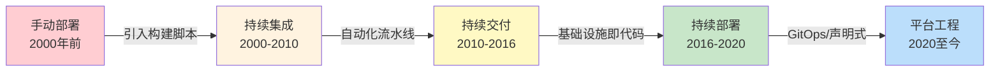
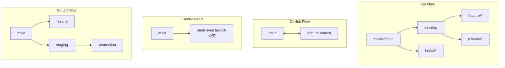
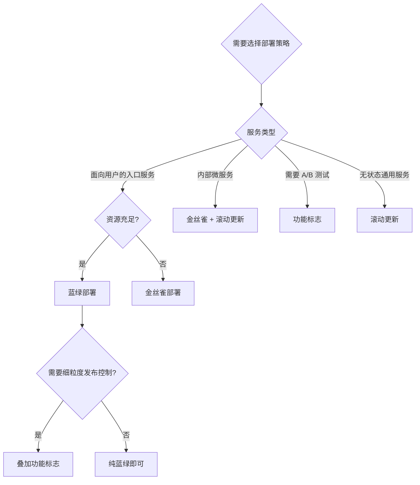
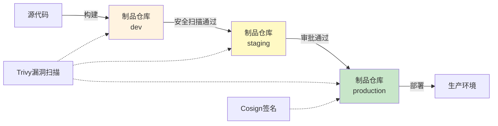
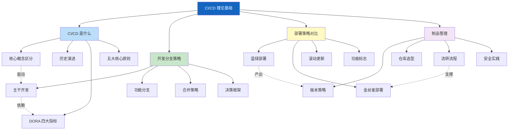

# CI/CD 理论基础

## 本节定位与学习路径

理论基础是整个 CI/CD 章节的根基。在进入实战和进阶技巧之前，你需要先建立一套完整的知识框架——理解 CI/CD 不仅仅是"跑几个自动化脚本"，而是一套从代码提交到生产交付的系统化工程方法论。

本节按照 **道→法→术→器** 的层次递进组织：

| 层次 | 主题 | 核心问题 |
|------|------|----------|
| **道** | CI/CD 是什么 | 为什么要持续集成？解决了什么根本问题？ |
| **法** | 开发分支策略 | 代码在多人协作中如何组织和合并？ |
| **法** | 部署策略对比 | 如何安全地把变更推向生产环境？ |
| **术/器** | 制品管理 | 如何确保构建产物可追溯、可复现、可审计？ |

---

## 一、CI/CD 是什么

持续集成（Continuous Integration）和持续交付/部署（Continuous Delivery/Deployment）是现代软件工程的核心实践。它们的本质是**将手动、低频、高风险的发布过程转变为自动、高频、低风险的交付流水线**。

### 核心概念区分

这三个术语经常被混用，但它们有明确的边界：

| 概念 | 英文 | 核心动作 | 何时停步 |
|------|------|----------|----------|
| **持续集成（CI）** | Continuous Integration | 频繁地将代码变更合并到主干，自动构建+测试 | 构建产物就绪 |
| **持续交付（CD）** | Continuous Delivery | 在 CI 基础上增加自动化的预发布验证和制品打包，但生产部署需人工审批 | 可随时一键发布 |
| **持续部署（CD）** | Continuous Deployment | 在持续交付基础上，通过质量门禁后自动部署到生产 | 全自动，无需人工干预 |

CI 的范围：代码提交 → 构建 → 测试 → 制品打包
持续交付：CI + 预发布验证 + 审批 → 可部署就绪
持续部署：CI + 预发布验证 + 自动质量门禁 → 已上线生产

关键区别在于：**持续交付让你随时可以发布，持续部署让你每次提交都自动发布**。大多数团队从持续集成开始，逐步演进到持续交付，最终根据业务需要决定是否采用持续部署。

### 历史演进

- **手动部署时代**：运维人员通过 SSH 登录服务器，手动拉取代码、编译、重启服务。发布频率低（月级），每次发布都是高风险事件
- **持续集成萌芽**：CI Server（如 CruiseControl、Jenkins）自动监听代码变更，触发构建和测试。Kent Beck 在《极限编程解析》中系统阐述了 CI 的理念
- **持续交付成熟**：Jez Humble 和 David Farley 的《持续交付》（2010）提出了构建流水线、环境管理、自动化验收测试等核心实践
- **持续部署普及**：Docker 容器化和 Kubernetes 编排使得环境一致性问题大幅缓解，持续部署成为可能
- **平台工程时代**：内部开发者平台（IDP）将 CI/CD 工具链封装为自助服务，降低开发者的认知负担

### DORA 四大关键指标

Google DORA（DevOps Research and Assessment）团队通过多年研究，提出了四个衡量软件交付效能的关键指标：

| 指标 | 含义 | 精英水平 | 落后水平 |
|------|------|----------|----------|
| **部署频率** | 多久发布一次 | 按需（每天多次） | 每月不到一次 |
| **变更前置时间** | 从代码提交到上线的时间 | 小于一小时 | 一个月以上 |
| **变更失败率** | 发布导致故障的比例 | 0-15% | 46-60% |
| **恢复时间** | 故障后恢复服务的时间 | 小于一小时 | 一周以上 |

这四个指标不是独立的——它们相互关联。高频部署的团队通常拥有更短的前置时间、更低的失败率和更快的恢复能力。CI/CD 实践直接驱动这些指标的改善。

### CI/CD 的核心原则

**1. 主干永远可发布**

每次代码提交都应该让主干保持在可发布状态。这要求自动化测试套件快速、可靠地验证每次变更。如果主干频繁处于"半成品"状态，说明集成频率不够或测试覆盖不足。

**2. 快速反馈**

从代码提交到获得构建结果，时间越短越好。理想情况下，开发者应该在喝完一杯咖啡之前就知道构建是否通过。这意味着测试要并行化、构建要缓存、反馈要即时推送。

**3. 构建失败是最高优先级**

当 CI 构建失败时，整个团队都应该停下手中的工作优先修复。持续集成的前提是主干始终可用，一个红色的构建意味着所有人的工作都可能受影响。

**4. 自动化一切可自动化的**

手动操作是风险的来源——人会犯错、会遗忘、会偷懒。从构建、测试、安全扫描到部署，每一步都应该尽可能自动化。手动审批是例外而非常态，应该只在高风险节点使用。

**5. 不可变制品**

一旦构建通过，产出的制品（Docker 镜像、JAR 包等）应该被锁定，不再修改。从开发到测试到预发布到生产，同一份制品被逐环境"晋升"，而不是在每个环境重新构建。

---

## 二、开发分支策略

分支策略决定了团队成员如何在代码库上协作。不同的策略在集成风险、发布灵活性和团队协作效率之间做出了不同的权衡。

### 主流分支模型

| 策略 | 分支生命周期 | 集成频率 | 适合场景 | 学习曲线 |
|------|-------------|----------|----------|----------|
| **Git Flow** | release 分支可存在数周 | 低（按版本合并） | 有固定发布周期的产品 | 中 |
| **GitHub Flow** | feature 分支数天 | 中（PR 合并到 main） | SaaS 产品、持续部署 | 低 |
| **Trunk-Based** | 分支 ≤2 天 | 极高（直接提交或短分支） | 大型团队、高频发布 | 高（需要Feature Flags） |
| **GitLab Flow** | 环境分支长期存在 | 中 | 需要多环境管理的团队 | 低 |

### 代码合并策略

合并方式直接影响代码历史的可读性和可追溯性：

| 策略 | 命令 | 历史形态 | 优点 | 缺点 |
|------|------|----------|------|------|
| **Merge Commit** | `git merge --no-ff` | 保留完整分支拓扑 | 完整轨迹，可追溯 | 历史可能混乱 |
| **Rebase** | `git rebase` + `git merge --ff` | 线性提交历史 | 干净，便于 bisect | 改写哈希，需强制推送 |
| **Squash Merge** | `git merge --squash` | 每个 PR 一个提交 | 主干极简 | 丢失开发过程细节 |

**实际建议**：
- 开源项目倾向 Squash Merge——每个 PR 作为独立提交，便于阅读和 revert
- 内部项目倾向 Rebase + Merge——保持线性历史的同时保留 commit 粒度
- 需要完整审计追踪的项目使用 Merge Commit——保留所有分支和合并关系

### 选择分支策略的决策框架

选择哪种分支策略，核心考虑三个因素：

**1. 团队规模**：10人以下团队 GitHub Flow 足够；50人以上建议 Trunk-Based + Feature Flags

**2. 发布频率**：如果需要按天甚至按小时发布，Trunk-Based 是唯一合理选择；如果有固定的版本发布周期，Git Flow 更合适

**3. 工程成熟度**：Trunk-Based 要求完善的自动化测试、快速的 CI 反馈、Feature Flags 机制和代码审查流程。如果这些基础设施不健全，贸然采用主干开发会导致主干频繁被破坏

---

## 三、部署策略对比

部署策略决定了新版本如何从构建产物过渡到接收生产流量。不同的策略在可用性保障、资源开销、回滚速度和实施复杂度之间做出不同权衡。

### 四种核心策略

| 维度 | 蓝绿部署 | 金丝雀部署 | 滚动更新 | 功能标志 |
|------|----------|------------|----------|----------|
| **核心机制** | 维护两套完整环境，切换流量 | 新版本逐步扩大流量比例 | 逐个/逐批替换实例 | 代码中嵌入条件分支 |
| **资源开销** | 2倍基础设施 | 1倍 + 少量额外 | 1倍 | 1倍 |
| **停机时间** | 零 | 零 | 零 | 零 |
| **回滚速度** | 秒级（DNS/负载均衡切换） | 秒级（权重调整） | 分钟级（rollout undo） | 秒级（关闭标志） |
| **风险控制** | 中等（全量切换） | 高（渐进式） | 中等（逐批替换） | 极高（按用户粒度） |
| **实施复杂度** | 中 | 高 | 低 | 中 |
| **数据库兼容** | 需扩展-收缩模式 | 需向后兼容 | 需向后兼容 | 无影响 |

### 蓝绿部署

蓝绿部署是零停机部署的经典方案。它维护两套完全相同的生产环境——蓝色（当前活跃）和绿色（待切换）。新版本部署到非活跃环境，验证通过后通过负载均衡器切换流量。

**优势**：回滚极快——如果新版本有问题，切回旧环境即可；两套环境完全一致，不存在版本兼容性问题。

**劣势**：需要双倍的基础设施资源；数据库等有状态服务的切换比较复杂，通常需要"扩展-收缩"模式（新环境先扩展数据库副本，切换后再收缩旧环境的副本）。

### 金丝雀部署

金丝雀部署是渐进式发布的典范。新版本先接收极少量流量（如 1%），通过监控指标（错误率、延迟、业务指标）验证稳定性后，逐步增加到 5%→20%→50%→100%。

**核心优势**：发布风险被控制在最小范围。即使新版本有严重问题，也只有极少量用户受影响，且可以即时回滚。

**实施要点**：
- 需要流量分割能力（Istio、Nginx、Envoy 等）
- 需要完善的监控体系来判断新版本是否健康
- 需要自动化推进或回滚机制（Argo Rollouts、Flagger）

### 滚动更新

滚动更新是 Kubernetes 的默认部署策略。它通过 `maxSurge`（最大超出副本数）和 `maxUnavailable`（最大不可用副本数）两个参数控制更新节奏。

**优势**：资源效率最高——不需要额外基础设施；Kubernetes 原生支持，配置简单。

**劣势**：部署过程中新旧版本会共存，需要确保两者之间的 API 兼容性；回滚需要重新滚动，速度较慢。

### 功能标志

功能标志（Feature Flags）不是传统的"部署策略"，但它将代码部署与功能发布彻底解耦。代码可以持续部署到生产环境，但功能的可见性通过标志控制。

**关键价值**：
- 代码部署和功能发布成为两个独立的操作
- 支持按用户、按比例、按地域精确控制功能可见性
- 回滚只需要关闭标志，无需重新部署
- 支持 A/B 测试和渐进式发布

### 如何选择

实践中，这些策略常常组合使用：例如，先通过功能标志控制新功能的可见性，再通过金丝雀部署逐步替换旧版本的基础设施。

---

## 四、制品管理

制品（Artifact）是构建过程的输出物——Docker 镜像、JAR 包、NPM 包、Helm Chart 等。制品管理确保每一次构建都是可追溯的、可复现的、不可篡改的。

### 制品管理解决的核心问题

没有制品管理时的典型混乱：
- "线上跑的是哪个版本？"
- "回滚用哪个镜像？"
- "这个 bug 是哪个 commit 引入的？"
- "为什么开发环境能跑，生产环境不行？"

制品管理通过以下机制解决这些问题：

| 机制 | 解决的问题 | 实现方式 |
|------|-----------|----------|
| **不可变性** | "制品被修改了怎么办" | 一旦发布不可修改，变更产生新版本 |
| **可追溯性** | "这个制品来自哪个 commit" | 构建元数据关联 Git commit、测试报告 |
| **可复现性** | "为什么构建结果不同" | 锁定依赖版本、容器化构建环境 |
| **访问控制** | "谁能推送到生产仓库" | 按项目/环境/角色设置权限 |

### 制品版本策略

| 策略 | 格式示例 | 适用场景 | 优点 | 缺点 |
|------|----------|----------|------|------|
| 语义化版本 | `2.1.3` | 对外发布的 API/SDK | 语义清晰 | 需人工判断版本增量 |
| Git 描述 | `v1.2.3-14-g2414721` | 内部微服务 | 自动生成 | 不直观 |
| 时间戳 | `20260626.153045` | 开发/测试环境 | 天然排序 | 无语义信息 |
| 构建号 | `#42` | Jenkins CI 环境 | 与 CI 紧密集成 | 绑定工具 |

### 制品流转流程

关键原则：制品从 dev → staging → production 是**晋升（Promote）**过程，不是重新构建。同一份制品在不同环境间流转，确保了环境间的一致性。

### 主流制品仓库对比

| 工具 | 类型 | 核心特色 | 适用规模 | 许可证 |
|------|------|----------|----------|--------|
| **Docker Hub** | 托管 SaaS | 免费公开仓库，自动构建 | 个人/小团队 | 免费+付费 |
| **GitHub Container Registry** | 托管 SaaS | 与 GitHub Actions 深度集成 | GitHub 用户 | 按流量计费 |
| **JFrog Artifactory** | 自建/SaaS | 全格式支持，企业级功能 | 中大型企业 | 商业/社区版 |
| **Sonatype Nexus** | 自建 | 开源，Maven 生态强 | 中型团队 | 社区版免费 |
| **Harbor** | 自建 | CNCF 毕业项目，镜像专精 | 中大型团队 | Apache 2.0 |
| **阿里云 ACR** | 托管 | 国内加速，与 ACK 集成 | 阿里云用户 | 按量付费 |

### 制品安全实践

制品安全是 DevSecOps 的关键环节，核心实践包括：

- **镜像签名**：使用 Cosign/Notation 对制品签名，部署时验证完整性，防止供应链攻击
- **漏洞扫描**：每次构建后自动扫描 CVE，高危漏洞阻止晋升
- **SBOM 生成**：生成软件物料清单（Software Bill of Materials），记录所有依赖组件及其版本
- **生命周期策略**：自动清理过期制品，保留 Release 版本，清理开发中间产物

---

## 本节知识架构

理论基础的四个主题不是孤立的——它们构成了一个完整的知识网络：CI/CD 的核心原则驱动了分支策略的选择，分支策略决定了集成频率和反馈速度，部署策略的安全性依赖于制品管理的可追溯性，而制品的流转流程又支撑着各种部署策略的实施。

掌握了这些理论基础后，你将具备进入后续实战环节的能力——从搭建第一条 CI/CD 流水线，到实施金丝雀发布，再到构建完整的 DevSecOps 体系。
