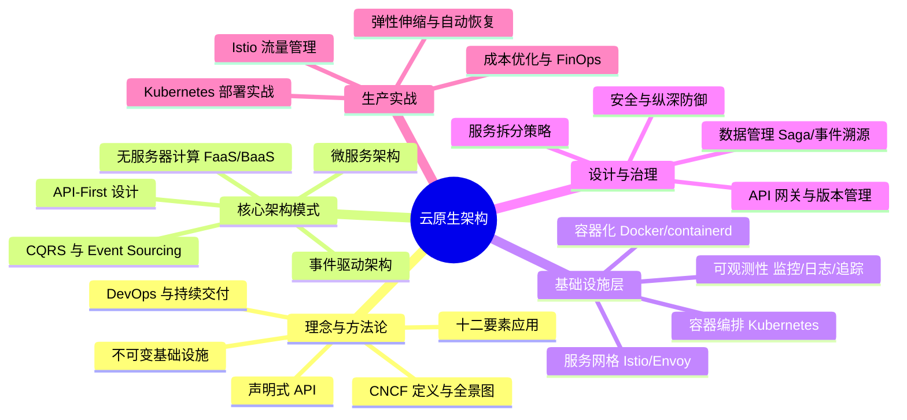
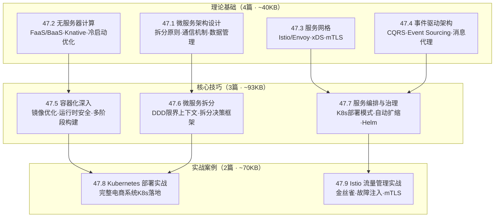
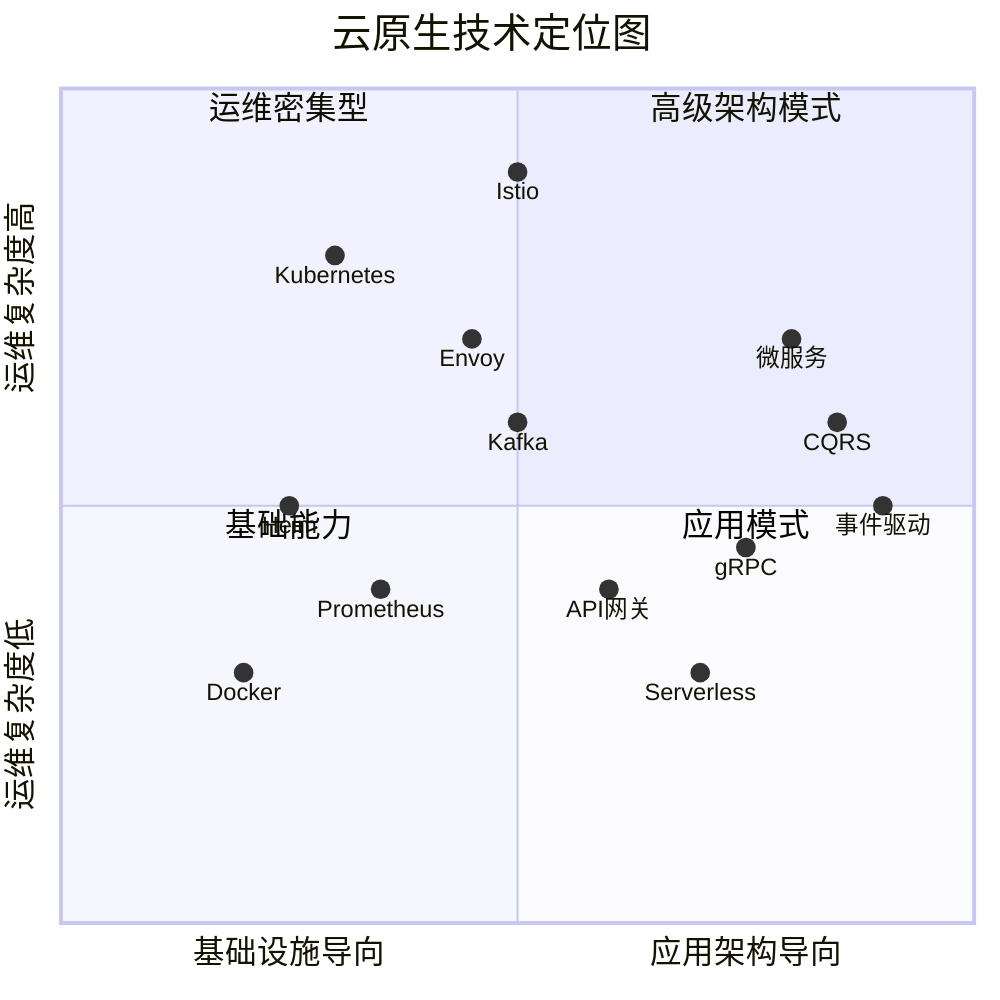

## 第47章 云原生架构

### 一、本章定位与学习目标

云原生架构是过去十年软件工程领域最具变革性的范式转移。它不仅仅是"把应用搬上云"，而是从设计哲学、工程实践到组织文化的一整套系统方法论。从 Netflix 为应对百万级并发而开创的微服务实践，到 CNCF 构建的庞大技术生态，云原生已经从前沿探索走向行业默认选择。

据 CNCF 2024 年度调查，全球超过 96% 的组织正在评估或已经在生产环境中使用云原生技术。Gartner 预测到 2027 年，超过 95% 的新建数字工作负载将部署在云原生平台上。这意味着，不理解云原生架构的工程师，将在职业发展中面临日益严重的竞争力缺口。

本章旨在构建从理念认知到生产实战的完整知识体系，使读者能够：

1. **理解本质**：掌握 CNCF 对云原生的定义，理解容器化、微服务、DevOps 和持续交付四根支柱之间的内在联系，认识十二要素应用方法论对现代应用设计的指导意义
2. **架构设计**：掌握微服务拆分原则（基于 DDD 限界上下文）、API 设计方法（OpenAPI 3.1 + 契约测试）、事件驱动架构模式（CQRS + Event Sourcing），能够设计合理的服务边界和通信机制
3. **无服务器计算**：理解 FaaS/BaaS 的生命周期、冷启动机制及优化策略，能够评估何时采用无服务器架构，并掌握 Knative 在 Kubernetes 上的 Serverless 落地方案
4. **服务网格**：理解服务网格解决的核心问题（横切关注点下沉），掌握 Istio 的控制平面/数据平面架构原理和 Envoy Sidecar 的过滤器链模型、xDS 动态配置发现协议
5. **事件驱动**：掌握 CQRS 和 Event Sourcing 模式的原理与适用边界，能够选择 Kafka/RabbitMQ/Pulsar 等消息代理，设计基于事件的异步通信系统并处理最终一致性
6. **容器编排**：在第40章容器基础之上，聚焦 Kubernetes 在云原生架构中的应用层面——Deployment/StatefulSet 选型、HPA/VPA/Cluster Autoscaler 协同扩缩、Helm Chart 模板化部署
7. **生产实战**：具备将云原生架构落地到真实项目的能力，包括监控可观测性体系（Metrics/Logs/Traces 三支柱）、安全纵深防御（mTLS/NetworkPolicy/镜像扫描）、成本优化与 FinOps

### 二、前置知识与章节衔接

学习本章前，读者应具备以下基础知识：

| 前置知识 | 对应章节 | 与本章的关联 |
|----------|---------|-------------|
| 容器技术基础（Docker）和编排（Kubernetes） | 第40章 容器与编排 | 云原生的基础设施层，本章在其之上构建应用架构。第40章讲"怎么用容器"，本章讲"怎么用容器构建完整架构" |
| 分布式系统基本理论（CAP/BASE） | 第21章 分布式理论 | 理解云原生架构中的权衡决策——微服务的最终一致性、Saga 补偿事务、服务网格的故障隔离都建立在分布式理论之上 |
| RPC 框架与网络通信 | 第43章 RPC框架 | 微服务间通信的技术基础——gRPC 的高性能 RPC 如何在服务网格中被 Envoy 代理和负载均衡 |
| CI/CD 与 DevOps 流程 | 第46章 CICD | 云原生的交付实践基础——Kubernetes 的滚动更新、蓝绿部署如何与 CI/CD 流水线集成 |
| TCP/IP 协议栈 | 第18章 | 理解服务网格中 Envoy 的 L7 代理机制、NetworkPolicy 的网络隔离原理、mTLS 的 TLS 握手过程 |

**本章在整个软件工程知识体系中的位置**：处于**架构应用层**——它以容器化（第40章）为底座，以分布式理论（第21章）为指导，将服务治理（第41章）、监控（第42章）、RPC（第43章）等前序章节的知识整合为一套面向云环境的完整架构方案。本章之后的章节（如安全、性能优化）将进一步深化云原生架构的特定领域。

### 三、章节知识地图

本章按照"理论→方法→实战"三层递进结构组织，覆盖云原生架构的核心领域。全章共 15 个文件，总计约 540KB 内容，预计阅读时间 20-30 小时。

**理论基础**（4篇）：系统讲解微服务、无服务器、服务网格、事件驱动四大架构范式的原理、适用场景和设计权衡。每篇都从"为什么需要"出发，到"核心机制"，再到"适用边界"，确保读者不仅知道怎么做，更知道为什么这么做。

**核心技巧**（3篇）：聚焦可操作的工程实践——容器化最佳实践（镜像构建优化、运行时安全加固）、微服务拆分方法论（基于 DDD 的拆分决策框架）、服务编排与治理（Kubernetes 资源管理、自动扩缩策略组合、Helm Chart 最佳实践）。

**实战案例**（2篇）：以真实电商场景驱动，展示 Kubernetes 部署和 Istio 流量管理的完整落地过程，从架构设计到 YAML 配置到故障排查，提供可直接参考的生产级代码。

### 四、本章文件索引

| 路径 | 主题 | 预计阅读时间 | 核心内容 |
|------|------|:----------:|---------|
| 理论基础/01-一微服务架构设计.md | 微服务架构 | 2-3h | DDD 限界上下文拆分、同步/异步通信选择、Database per Service、Saga/TCC 分布式事务、编排 vs 协同 |
| 理论基础/02-二无服务器计算.md | 无服务器计算 | 2-3h | FaaS 生命周期与冷启动优化、BaaS 能力矩阵、AWS Lambda/GCF/Knative 对比、适用场景与限制 |
| 理论基础/03-三服务网格.md | 服务网格 | 2-3h | Istio 双平面架构、Envoy 过滤器链与 xDS 协议、VirtualService/DestinationRule 配置、mTLS 安全策略 |
| 理论基础/04-四事件驱动架构.md | 事件驱动架构 | 3-4h | CQRS 读写分离、Event Sourcing 事件溯源、Kafka/RabbitMQ/Pulsar 选型对比、最终一致性保障 |
| 核心技巧/01-一容器化.md | 容器化深入 | 2-3h | 多阶段构建优化、distroless 基础镜像、非 root 运行、只读文件系统、安全扫描集成 |
| 核心技巧/02-二微服务拆分.md | 微服务拆分 | 2-3h | 拆分决策框架、粒度判断标准（团队/变更频率/扩展需求）、分布式单体识别与纠正 |
| 核心技巧/03-三服务编排.md | 服务编排与治理 | 2-3h | Deployment/StatefulSet/DaemonSet 选型、HPA/VPA/CA 协同、ConfigMap/Secret 热更新、Helm Chart |
| 实战案例/01-案例一Kubernetes实战.md | K8s 部署实战 | 3-4h | 电商系统完整 K8s 部署：多环境配置、PDB 高可用、灰度发布、HPA 自动扩缩、故障恢复 |
| 实战案例/02-案例二Istio实战.md | Istio 流量管理实战 | 3-4h | Istio 安装配置、金丝雀发布、流量镜像、故障注入测试、mTLS 全链路加密、可观测性仪表板 |
| 04-常见误区.md | 十大常见误区 | 2-3h | 过早微服务化、分布式单体、容器配置缺失、监控盲区、安全裸奔、数据库共享、资源过度配置等 |
| 05-练习方法.md | 学习方法 | 0.5h | 本章学习策略、练习建议、动手实验指导 |
| 06-本章小结.md | 知识体系总结 | 2-3h | 全章结构化回顾、决策对照表、最佳实践清单、成熟度模型、推荐学习资源 |
| _index.md | 章节主页 | 1-2h | 云原生定义演进、十二要素应用详解、核心架构概览 |

### 五、核心主题速览

#### 5.1 微服务架构设计（理论基础 01）

微服务是云原生架构的核心架构模式，但也是最容易被误用的模式。本篇深入讲解：

- **拆分原则**：基于领域驱动设计（DDD）的限界上下文进行服务划分，避免"分布式单体"陷阱。拆分不是一次性动作，而是随业务演进的持续过程
- **通信机制**：同步（REST/gRPC）与异步（消息队列/事件总线）的选择策略——实时查询用 gRPC，事件通知用消息队列，跨服务聚合用事件 + 本地缓存
- **数据管理**：每个微服务拥有独立数据库（Database per Service），跨服务数据查询通过 API 组合层、CQRS 读模型或搜索索引解决
- **分布式事务**：Saga 模式（编排式 + 协同式）、TCC 模式、事件溯源在微服务中的应用——没有银弹，只有适合场景的权衡
- **服务依赖管理**：扇出限制（≤7 个直接下游依赖）、异步优先原则、故障隔离设计

#### 5.2 无服务器计算（理论基础 02）

Serverless 并非"没有服务器"，而是"无需管理服务器"。本篇解析：

- **FaaS 核心概念**：函数即服务的完整生命周期（冷启动→初始化→执行→热启动窗口→回收），冷启动问题的四种优化策略（轻量运行时/Provisioned Concurrency/Lambda Layers/避免初始化重操作）
- **BaaS 能力**：后端即服务提供的托管数据库（DynamoDB/Firebase）、认证（Cognito/Auth0）、存储（S3）等能力矩阵
- **平台对比**：AWS Lambda（最成熟，15 分钟限制）、Google Cloud Functions（与 GCP 深度集成）、Azure Functions（.NET 生态优势）、Knative（Kubernetes 原生，无限制）
- **适用场景**：事件驱动的异步处理、API 后端（突发流量场景）、数据管道、定时任务、Webhook 处理
- **局限性**：长时间运行任务（>15 分钟）、有状态服务、供应商锁定、调试困难、毫秒级延迟需求

#### 5.3 服务网格（理论基础 03）

服务网格（Service Mesh）将服务间通信的复杂性从应用层下沉到基础设施层：

- **核心问题**：服务发现、负载均衡、熔断降级、链路追踪、安全通信——这些横切关注点的统一治理，不再需要在每个服务中集成治理 SDK
- **Istio 架构**：控制平面（Istiod：配置管理 + 证书分发 + 配置验证）+ 数据平面（Envoy Sidecar：每个 Pod 注入代理，拦截所有流量）
- **Envoy 原理**：高性能 L7 代理的过滤器链模型（Listener Filter → Network Filter → HTTP Filter Chain）、动态配置发现（xDS 协议，无需重启即可热更新路由规则）
- **流量管理**：金丝雀发布（按权重分配流量）、流量镜像（复制生产流量到测试版本）、故障注入（模拟延迟和错误）、超时重试
- **安全策略**：mTLS 双向认证（零改造实现服务间加密）、授权策略（基于身份的访问控制）、JWT 验证
- **代价评估**：每请求增加 1-3ms 延迟、每 Pod 多占 50-100MB 内存、运维复杂度提升——是否引入需要基于团队规模和治理需求做出权衡

#### 5.4 事件驱动架构（理论基础 04）

事件驱动架构通过事件的产生、检测、消费和响应来解耦系统组件：

- **CQRS 模式**：命令查询职责分离，将读写模型独立——写模型处理业务操作，读模型构建查询视图，通过事件总线连接
- **Event Sourcing**：以事件序列而非当前状态作为数据源，提供完整的审计追踪和时间旅行能力。写操作是事件追加（append-only），读操作通过回放事件或查询物化视图
- **消息代理对比**：Kafka（高吞吐日志，适合事件溯源和流处理）、RabbitMQ（灵活路由，适合任务队列）、Pulsar（多租户云原生，适合跨地域复制）
- **最终一致性**：如何在事件驱动架构中保证数据的最终一致性——幂等消费者、事件去重、死信队列、事件排序保证

#### 5.5 容器化深入（核心技巧 01）

在第40章的 Docker 基础之上，本篇聚焦生产级容器化的最佳实践：

- **镜像构建优化**：多阶段构建分离编译和运行时，选择 distroless/alpine 最小基础镜像（Java <200MB，Go/Python <50MB），层缓存策略
- **运行时安全加固**：非 root 用户运行、只读文件系统、Linux Capabilities 精细控制、资源 Limits 防止单容器耗尽节点
- **安全扫描集成**：CI/CD 流水线集成 Trivy/Snyk 镜像扫描，Critical 漏洞阻断部署，High 漏洞限期修复

#### 5.6 微服务拆分方法论（核心技巧 02）

微服务拆分是架构设计中最具挑战性的环节。本篇提供可操作的决策框架：

- **拆分决策流程图**：从业务边界识别出发，依次评估数据依赖、变更频率差异、扩展需求独立性，做出合并/拆分决策
- **粒度判断标准**：团队维度（2-8 人/服务，康威定律）、变更频率（总一起变更的功能属于同一服务）、扩展需求（QPS 差异 10 倍以上应独立）、技术异构（不同技术栈天然适合拆分）
- **分布式单体识别**：服务间同步调用链超过 5 个、修改一个功能需要同步修改多个服务、任一服务故障导致整条链路不可用——满足任一条件即为分布式单体

#### 5.7 服务编排与治理（核心技巧 03）

本篇聚焦 Kubernetes 在云原生架构中的应用层面：

- **应用部署模式选型**：Deployment（无状态 Web/API 服务）、StatefulSet（数据库集群/消息队列等有状态应用）、DaemonSet（日志收集/监控 Agent）、Job/CronJob（一次性/定时任务）
- **自动扩缩策略组合**：HPA 调节 Pod 数量 → 节点不够时触发 Cluster Autoscaler 扩容 → VPA 根据历史使用量推荐合理资源配额。三者协同，缺一不可
- **配置管理**：ConfigMap/Secret 的安全使用、热更新机制（不重启 Pod 更新配置）、环境变量注入最佳实践
- **Helm Chart**：模板化部署管理、多环境 Values 文件（dev/staging/prod）、依赖管理和版本回滚

#### 5.8 Kubernetes 部署实战（实战案例 01）

以电商系统为场景，展示从零到生产的完整 K8s 部署过程：

- 多环境配置管理（ConfigMap + Secret + Kustomize/Helm）
- 高可用设计（PodDisruptionBudget、反亲和性、多副本）
- 灰度发布（滚动更新 + 金丝雀分流）
- 自动扩缩（HPA 基于自定义指标 + Cluster Autoscaler）
- 故障恢复（Liveness/Readiness/Startup 三探针 + 自动重启）

#### 5.9 Istio 流量管理实战（实战案例 02）

以微服务电商系统为场景，展示 Istio 的生产级配置：

- Istio 安装与 Sidecar 注入配置
- 金丝雀发布（VirtualService 权重路由）
- 流量镜像（mirrorPercent 将生产流量复制到测试版本）
- 故障注入测试（延迟注入 + 错误注入，验证系统弹性）
- mTLS 全链路加密（PeerAuthentication + AuthorizationPolicy）
- 可观测性仪表板（Kiali 拓扑图 + Grafana 指标 + Jaeger 链路追踪）

### 六、阅读路径建议

根据读者的背景和目标，建议以下阅读路径。每个路径都标注了具体文件，方便直接定位：

| 读者类型 | 推荐路径 | 预计时间 |
|---------|---------|:-------:|
| **架构师/技术负责人** | 全部理论基础（01-04）→ 核心技巧（01-03）→ 常见误区 → 实战案例（01-02）→ 本章小结 | 20-25h |
| **后端开发工程师** | 理论基础（01 微服务 + 04 事件驱动）→ 核心技巧（02 微服务拆分）→ 实战案例（01 K8s）→ 本章小结 | 12-15h |
| **DevOps/SRE 工程师** | 理论基础（03 服务网格）→ 核心技巧（01 容器化 + 03 服务编排）→ 实战案例（01 K8s + 02 Istio）→ 本章小结 | 15-18h |
| **技术管理者** | 章节概览（本文件）→ 常见误区 → 本章小结（成熟度模型部分） | 2-3h |
| **快速入门** | 章节概览 → 理论基础（01 微服务）→ 常见误区 → 本章小结 | 5-7h |

**阅读原则**：

1. **不必线性阅读**：理论基础四篇可以按需选择，不必从头读到尾
2. **先概念后实战**：至少读完对应主题的理论基础，再进入实战案例，否则容易"知其然不知其所以然"
3. **常见误区建议必读**：无论什么角色，"常见误区"篇都能帮助避免 80% 的落地陷阱
4. **本章小结作为复习锚点**：学完每个模块后回顾小结中的决策对照表和最佳实践清单

### 七、云原生技术全景定位

下图展示了本章涉及的核心技术在整个云原生生态中的位置，帮助读者理解各技术的定位差异：

**定位解读**：

- **左下象限（基础能力）**：Docker、Prometheus——运维复杂度低，是所有云原生实践的起点
- **左上象限（运维密集型）**：Kubernetes、Istio——功能强大但运维复杂度高，需要团队有足够的 DevOps/SRE 能力
- **右下象限（应用模式）**：Serverless、API 网关、gRPC——偏应用架构层，运维相对简单，但需要理解其适用边界
- **右上象限（高级架构模式）**：微服务、事件驱动、CQRS——架构复杂度高，适合有经验的团队在业务驱动下引入

### 八、学习成果检验

完成本章学习后，读者应能回答以下问题。每道题都对应本章的具体知识模块，可作为自测和面试准备的参考：

#### 概念层面

1. CNCF 对云原生定义的四根支柱（容器化、微服务、DevOps、持续交付）之间存在怎样的内在依赖关系？去掉其中一根，其他三根会受到什么影响？
2. 十二要素应用中的"配置在环境中存储"和"后端服务当作附加资源"分别解决什么问题？在 Kubernetes 环境中如何落地？

#### 架构设计

3. 如何判断一个系统是否应该从单体拆分为微服务？拆分的粒度如何确定？给出至少 4 个判断维度
4. 何时选择同步通信（gRPC/REST），何时选择异步通信（消息队列/事件）？请结合一致性要求和性能要求分析
5. 分布式单体的典型特征是什么？如何识别并纠正？

#### 技术选型

6. 何时应该采用无服务器架构？何时应该避免？列出至少 3 个适用场景和 3 个不适用场景
7. Kafka、RabbitMQ、Pulsar 三种消息代理各自最适合什么场景？选择的核心依据是什么？
8. 服务网格（Istio）相比直接在应用中集成服务治理库（Spring Cloud）有什么优势和代价？引入决策的关键因素是什么？

#### 生产实践

9. Kubernetes 中如何设计高可用的应用部署？PodDisruptionBudget、反亲和性、多副本策略如何协同工作？
10. HPA、VPA、Cluster Autoscaler 三者如何协同实现自动扩缩？各自的触发条件和调节对象是什么？
11. 云原生安全的纵深防御体系包含哪些层次？每一层的关键措施是什么？

#### 架构演进

12. 一个运行了 5 年的单体应用，日活 50 万，团队 30 人。如何制定从单体到微服务的渐进式迁移计划？第一步应该做什么？
13. 假设当前使用 Spring Cloud 做服务治理，计划引入 Go 语言编写高性能服务。服务治理方案应如何演进？从 Spring Cloud SDK 迁移到 Istio 的关键步骤有哪些？

### 九、常见误区速查

本章的"常见误区"篇（04-常见误区.md）详细展开了十大误区，这里列出核心要点供快速参考：

| 误区 | 核心危害 | 正确做法 |
|------|---------|---------|
| 过早微服务化 | 运维成本飙升，交付速度反而下降 | 单体 → 模块化单体 → 微服务，渐进式迁移 |
| 分布式单体 | 同时继承单体和微服务的缺点 | 扇出限制（≤7）、异步优先、故障隔离 |
| 容器配置缺失 | OOMKilled、僵尸 Pod、容器逃逸 | Resources Limits + 三探针 + 非 root + 只读 FS |
| 监控盲区 | 故障定位从分钟级退化到小时级 | Metrics/Logs/Traces 三支柱 + RED 指标 |
| 安全裸奔 | 容器逃逸→宿主机 root，横向渗透全集群 | 镜像扫描 + mTLS + NetworkPolicy + 零信任 |
| 数据库共享 | Schema 耦合、锁竞争、故障扩散 | Database per Service + API 组合层 |
| 资源过度配置 | 企业平均浪费 28% 云支出 | VPA 推荐 + HPA 自动扩缩 + CA 节点回收 |

### 十、本章核心理念

> **云原生不是目的，而是手段。**

技术选型应服务于业务需求，而非为了"云原生"而云原生。本章始终强调四条核心原则：

**1. 渐进式迁移优于一步到位**

不是所有系统都需要一步到位微服务化。从单体到模块化单体（Modular Monolith），再到微服务，是一条更稳妥的路径。每一次迁移都应该有明确的业务驱动力（独立部署需求、团队扩张、性能瓶颈），而非技术驱动。Shopify 从 Rails 单体迁移到微服务后又回归模块化单体的案例充分说明：可维护、可扩展的架构才是目标，微服务只是实现目标的手段之一。

**2. 务实优先于教条**

Kubernetes 很强大但也很复杂。5 人的团队用 Docker Compose + 简单编排可能比强上 K8s + Istio 更高效。Serverless 很酷但有明确的局限性（冷启动延迟、执行时间上限）。微服务很灵活但引入了分布式系统的全部复杂度。每一种技术都有其适用边界，架构师的核心能力在于识别边界，而非盲目追随趋势。

**3. 可观测性先行**

在引入任何分布式架构之前，先建立完善的监控（Metrics）、日志（Logging）和链路追踪（Tracing）能力。没有可观测性的分布式系统如同在黑暗中驾驶——系统越复杂，排查问题的成本越高。可观测性不是锦上添花，而是分布式系统的生存基础。

**4. 安全内建而非事后补救**

云原生的弹性和自动化不应以牺牲安全为代价。零信任网络（Zero Trust）、服务间 mTLS 加密、镜像安全扫描、运行时安全策略——这些安全措施应该在架构设计阶段就纳入考量，而非等系统上线后才想起来。安全是一个持续过程，不是一个一次性任务。

---

> **导航提示**：本文件是章节概览，帮助你建立全局认知。建议从下方目录中选择适合你角色的阅读路径开始学习。每个子章节都是独立完整的，可以根据需要跳转阅读。
