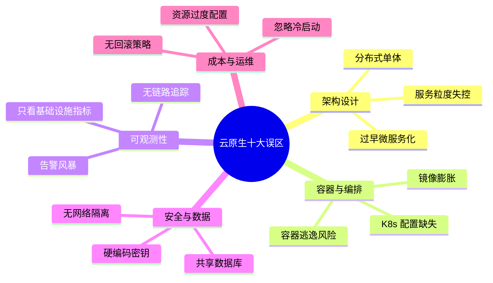
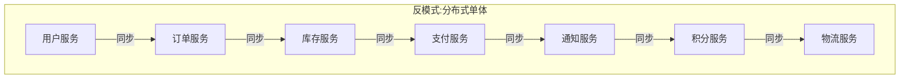
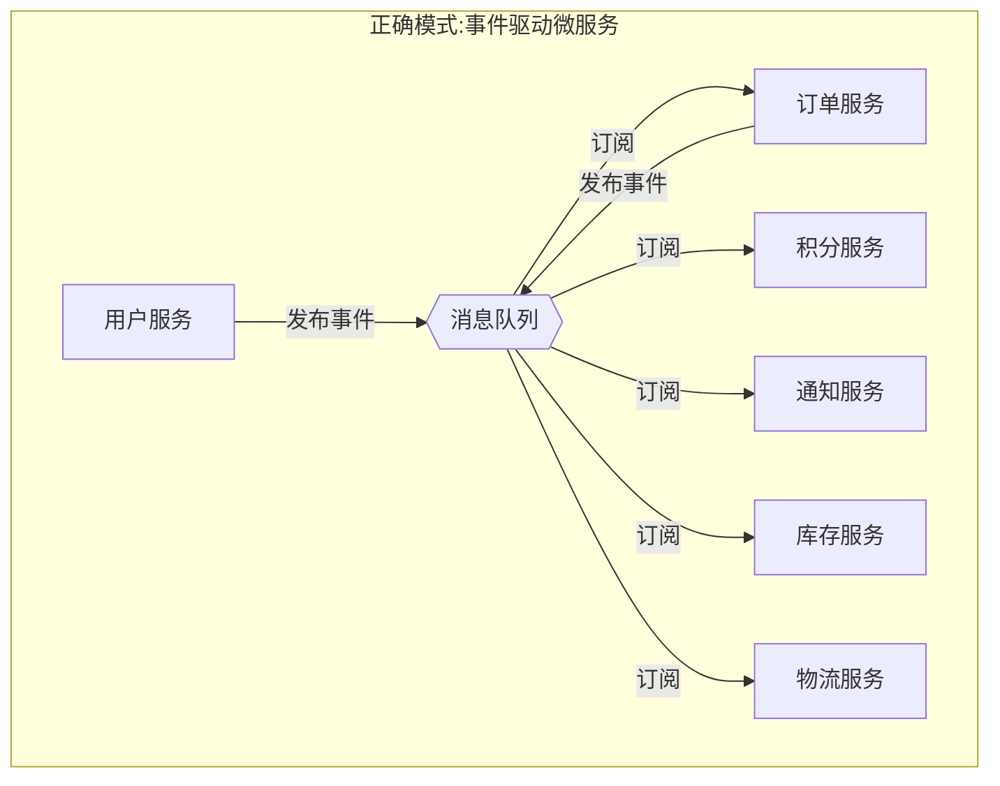
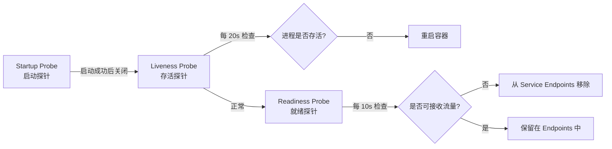
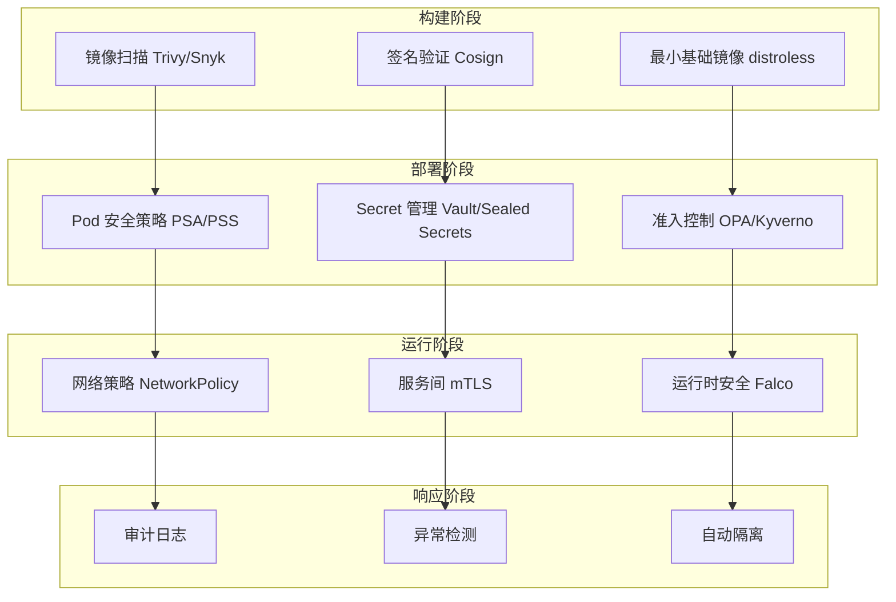
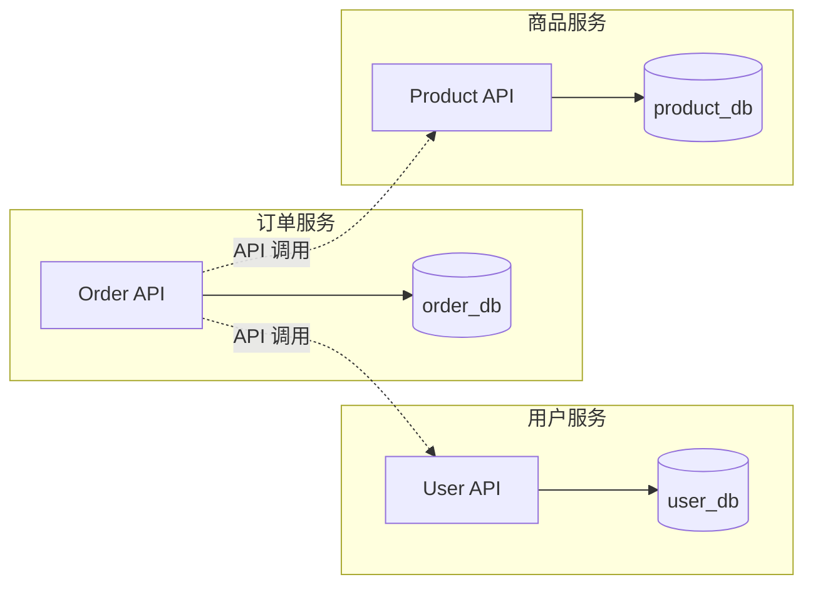
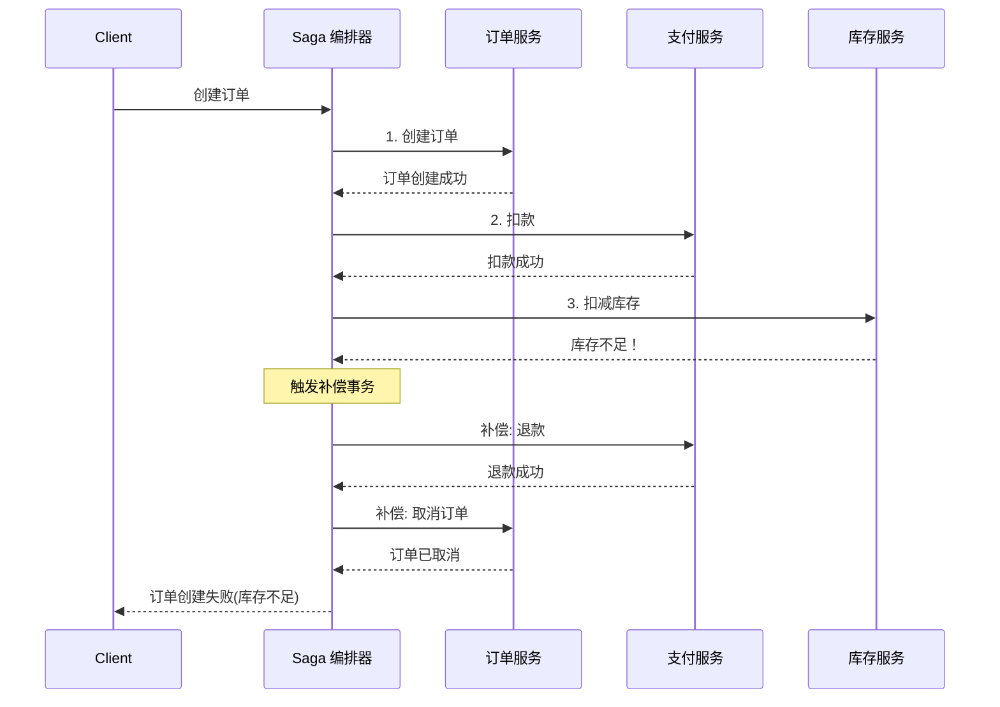
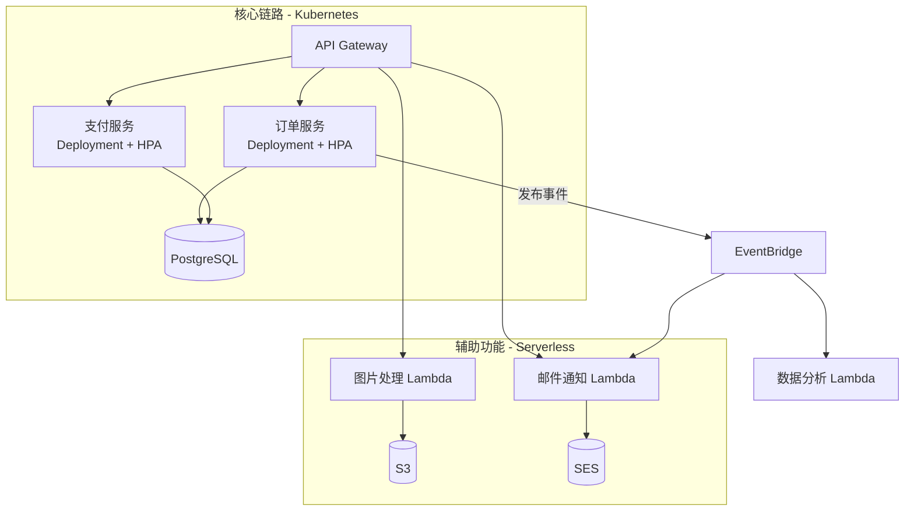
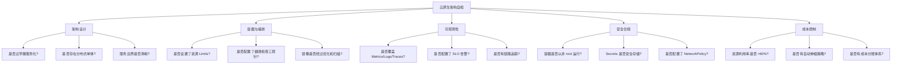

## 常见误区

> **"云原生架构的失败，80% 不是技术选错了，而是认知走偏了。"**

云原生是一套强大的方法论和工具链，但它绝非万能药水。在实际落地过程中，团队反复踩入的陷阱往往不是技术难题本身，而是对云原生理念的误解、对适用边界的模糊、以及对工程纪律的忽视。本节系统梳理云原生架构中最常见的十大误区，每个误区都从"错误认知→危害分析→正确做法→检查清单"四个维度展开，帮助读者在架构决策时避开这些"看起来合理实则致命"的坑位。



---

### 误区一：过早微服务化 — "拆了就是先进"

#### 错误认知

许多团队在业务尚处于早期阶段时就急于将单体应用拆分为微服务，理由通常是"微服务是行业趋势"、"大厂都在用"、"这样更灵活"。这种决策往往不是基于业务复杂度和团队能力的理性判断，而是出于对技术潮流的焦虑。

#### 危害分析

| 危害维度 | 具体表现 |
|----------|---------|
| **运维复杂度飙升** | 每个微服务需要独立的 CI/CD 流水线、日志收集、监控告警、服务发现配置，3 个微服务的运维成本不是单体的 3 倍，而是 5-8 倍 |
| **分布式事务噩梦** | 原本单体中的一个数据库事务，拆分后变成了跨服务的分布式事务，需要引入 Saga、TCC 或事件溯源，系统复杂度成倍增加 |
| **团队能力不足** | 小团队（<8 人）缺乏足够的 DevOps 和分布式系统经验，面对服务间通信、数据一致性、故障隔离等问题时无力应对 |
| **交付速度反而下降** | 本意是提高交付效率，结果团队大量时间花在基础设施搭建、跨服务联调、环境一致性问题上，功能交付周期从周级退化到月级 |

#### 正确做法

**渐进式拆分路径**：单体 → 模块化单体 → 微服务


**拆分决策检查清单**（满足 2 项以上再考虑拆分）：

- 业务领域已出现明确的限界上下文（DDD Bounded Context）
- 不同模块的变更频率差异显著（一个模块每天发版，另一个每月发版）
- 不同模块需要独立的技术栈或伸缩策略
- 团队规模已超过 8 人，需要按服务边界划分自治团队
- 单体应用的部署时间已超过 30 分钟

**模块化单体的最佳实践**：

order-service/
├── src/
│   ├── domain/           # 领域模型（纯业务逻辑）
│   │   ├── order.py
│   │   ├── payment.py
│   │   └── shipping.py
│   ├── application/      # 应用服务（编排领域逻辑）
│   │   ├── create_order.py
│   │   └── cancel_order.py
│   ├── infrastructure/   # 基础设施（数据库、消息队列适配）
│   │   ├── order_repository.py
│   │   └── event_publisher.py
│   └── interfaces/       # 接口层（HTTP/gRPC 入口）
│       └── order_controller.py
├── tests/
└── module.yaml           # 模块声明（定义对外依赖和接口）

模块化单体在代码层面实现模块隔离，共享同一个进程和数据库，但模块间的依赖关系清晰可见。当某个模块确实需要独立伸缩或独立部署时，再将其提取为微服务——此时模块边界就是天然的服务边界。

#### 行业案例

Shopify 在 2019 年启动了从 Ruby on Rails 单体向微服务的迁移，但很快发现维护数千个微服务的基础设施成本远超预期。最终 Shopify 选择了"Modular Monolith"（模块化单体）策略——在 Rails 单体内部建立清晰的模块边界，既保留了单体的运维简单性，又获得了模块化的架构清晰度。这个案例充分说明：微服务不是目标，可维护、可扩展的架构才是目标。

---

### 误区二：分布式单体 — "拆了服务但没拆架构"

#### 错误认知

团队把单体应用拆分成了多个微服务，但服务之间存在大量同步调用链，任何核心业务流程都需要 5 个以上的服务协同完成，一个服务挂掉导致整个链路不可用。表面上是微服务，本质上是分布在多个进程中的单体。

#### 危害分析

分布式单体是微服务架构中最危险的反模式，它同时继承了单体和微服务的缺点，却没有获得任何一方的优点：

- **网络延迟累积**：5 个服务的同步调用链，假设每个调用平均 20ms，仅网络往返就增加 200ms（含序列化/反序列化）
- **故障爆炸半径过大**：链路中任意一个服务故障，整个业务流程中断。单体中一个模块崩溃可能只影响部分功能，分布式单体中一个服务崩溃导致全部功能不可用
- **调试难度倍增**：问题定位需要跨越多个服务的日志和追踪数据，排查时间从分钟级变为小时级

#### 正确做法

**服务依赖治理三原则**：

1. **扇出限制**：单个服务的直接下游依赖不超过 7 个（认知心理学中的 7±2 法则同样适用于架构设计）
2. **异步优先**：非实时性要求的跨服务通信一律使用异步消息（Kafka/RabbitMQ），将强依赖变为弱依赖
3. **故障隔离**：每个服务必须独立可部署、独立可降级





**服务依赖图谱工具**：使用 `kubectl` + Jaeger/Zipkin 自动生成服务调用拓扑图，定期审查是否出现循环依赖或过度扇出。Istio 的 Kiali 仪表板可以直接可视化服务间的实时流量拓扑，红色线条标识高错误率的链路。

---

### 误区三：容器配置缺失 — "能跑就行"

#### 错误认知

开发者将应用打包成 Docker 镜像并成功运行在 Kubernetes 上，就认为容器化已经完成。不设置资源限制、不配置健康检查、以 root 用户运行、镜像体积膨胀到 GB 级别。

#### 危害分析

容器配置缺失的直接后果：

| 缺失配置 | 短期影响 | 长期影响 |
|----------|---------|---------|
| 无资源 Limits | 单个 Pod 可能耗尽节点所有 CPU/内存 | 节点 OOMKilled，引发级联故障 |
| 无 Liveness 探针 | 死锁进程不会被重启 | 节点上堆积僵尸 Pod，资源逐渐耗尽 |
| 无 Readiness 探针 | 未就绪的 Pod 接收流量导致请求失败 | 用户间歇性遭遇 502/504 错误 |
| root 用户运行 | 应用进程拥有容器内最高权限 | 容器逃逸后直接获得宿主机 root 权限 |
| 镜像未优化 | 拉取慢、存储贵 | CI/CD 流水线超时、镜像仓库成本失控 |

#### 正确做法

**标准 Kubernetes Deployment 模板**：

```yaml
apiVersion: apps/v1
kind: Deployment
metadata:
  name: order-service
  labels:
    app: order-service
    version: v2.1.0
spec:
  replicas: 3
  selector:
    matchLabels:
      app: order-service
  template:
    metadata:
      labels:
        app: order-service
        version: v2.1.0
    spec:
      securityContext:
        runAsNonRoot: true
        runAsUser: 1000
        fsGroup: 1000
      containers:
        - name: order-service
          image: registry.example.com/order-service:v2.1.0
          ports:
            - containerPort: 8080
              name: http
          # 资源配置
          resources:
            requests:
              cpu: 250m       # 保证最低 0.25 核
              memory: 256Mi   # 保证最低 256MB
            limits:
              cpu: 1000m      # 最多使用 1 核
              memory: 512Mi   # 最多使用 512MB（超过则 OOMKilled）
          # 健康检查
          readinessProbe:
            httpGet:
              path: /health/ready
              port: 8080
            initialDelaySeconds: 5
            periodSeconds: 10
            failureThreshold: 3
          livenessProbe:
            httpGet:
              path: /health/live
              port: 8080
            initialDelaySeconds: 15
            periodSeconds: 20
            failureThreshold: 3
          startupProbe:
            httpGet:
              path: /health/started
              port: 8080
            failureThreshold: 30
            periodSeconds: 10
          # 安全配置
          securityContext:
            allowPrivilegeEscalation: false
            readOnlyRootFilesystem: true
            capabilities:
              drop: ["ALL"]
          # 环境变量从 ConfigMap/Secret 注入
          envFrom:
            - configMapRef:
                name: order-service-config
            - secretRef:
                name: order-service-secret
```

**健康检查三探针的职责分工**：



- **Startup Probe**：解决慢启动应用（如大型 Java 应用）在 Liveness Probe 判定前就被误杀的问题
- **Liveness Probe**：检测进程是否死锁或僵死，失败则重启容器
- **Readiness Probe**：检测应用是否准备好接收流量，失败则从 Service 的 Endpoints 列表中移除

**镜像优化检查清单**：

- 使用多阶段构建（multi-stage build），构建产物与运行时分离
- 基础镜像选择 `distroless` 或 `alpine`，而非完整 Ubuntu/CentOS
- 合并 RUN 指令减少层数，利用构建缓存
- 最终镜像目标：Java 应用 <200MB，Go/Python 应用 <50MB

---

### 误区四：监控盲区 — "部署了 Prometheus 就等于有监控"

#### 错误认知

团队部署了 Prometheus + Grafana 仪表板，就认为监控体系已经完善。实际上，他们可能只监控了基础设施指标（CPU、内存、磁盘），而忽略了应用层指标、业务指标和分布式追踪。

#### 危害分析

**可观测性三支柱缺一不可**：

| 支柱 | 回答的问题 | 常见遗漏 |
|------|-----------|---------|
| **Metrics（指标）** | 系统现在怎么样？ | 只看 CPU/内存，不看请求延迟 P99、错误率、吞吐量 |
| **Logs（日志）** | 发生了什么？ | 日志未结构化，无法按 trace_id 关联，搜索困难 |
| **Traces（链路追踪）** | 请求经过了哪些环节？ | 完全没有部署，微服务间调用链是黑盒 |

缺少链路追踪意味着：当一个 API 请求在 5 个微服务之间流转并出现延迟时，你无法快速定位是哪个服务拖慢了整个链路。排查方式退化为"逐个服务查日志"，故障恢复时间（MTTR）从分钟级退化到小时级。

#### 正确做法

**可观测性分层监控体系**：

┌─────────────────────────────────────────────────┐
│  第四层：业务指标                                  │
│  订单转化率 | 支付成功率 | 用户活跃度              │
├─────────────────────────────────────────────────┤
│  第三层：分布式追踪                                │
│  Jaeger/Tempo | 请求链路 | 延迟瓶颈分析           │
├─────────────────────────────────────────────────┤
│  第二层：应用指标                                  │
│  RED 指标 (Rate/Error/Duration) | 自定义 Counter  │
├─────────────────────────────────────────────────┤
│  第一层：基础设施指标                              │
│  CPU/Memory/Disk/Network | Pod/Node 健康状态      │
└─────────────────────────────────────────────────┘

**RED 指标体系**（微服务必备）：

- **Rate**：每秒请求数（吞吐量）— `http_requests_total`
- **Errors**：每秒错误请求数（错误率）— `http_requests_total{status=~"5.."}`
- **Duration**：请求延迟分布（P50/P95/P99）— `http_request_duration_seconds`

**告警配置原则**（避免告警风暴）：

- 基于 SLO（Service Level Objective）告警，而非阈值告警
- 错误率 > 1% 持续 5 分钟 → P1 紧急告警
- P99 延迟 > SLA 阈值 持续 10 分钟 → P2 警告告警
- 磁盘使用 > 80% → P3 通知告警
- 每个服务最多 5 条告警规则，超过说明指标定义有问题

---

### 误区五：安全裸奔 — "先上线再补安全"

#### 错误认知

"安全的事情后面再说"、"内网环境不需要考虑安全"、"我们还在开发阶段不用管这些"——这些想法在云原生环境中尤其危险。容器化和微服务架构扩大了攻击面，传统边界防火墙不再适用，零信任模型才是正确方向。

#### 危害分析

云原生环境的安全风险矩阵：

| 攻击向量 | 风险等级 | 可能后果 |
|----------|---------|---------|
| 容器以 root 运行 + 容器逃逸 | 🔴 极高 | 攻击者获得宿主机 root 权限，横向渗透整个集群 |
| 镜像包含已知 CVE 漏洞 | 🔴 极高 | 未修复的 Log4Shell 等漏洞可被远程利用执行任意代码 |
| Secrets 硬编码在代码/镜像中 | 🟠 高 | 密钥泄露后攻击者可访问数据库、第三方服务 |
| 无网络策略（NetworkPolicy） | 🟠 高 | 任意 Pod 可访问任意 Pod，一个服务被攻破则全集群暴露 |
| Service 暴露到公网无认证 | 🟡 中 | 未授权访问内部 API，数据泄露 |

#### 正确做法

**云原生安全纵深防御体系**：



**必须执行的安全基线**：

1. **镜像安全**：CI/CD 流水线集成 Trivy 扫描，Critical 漏洞阻断部署，High 漏洞限期 7 天修复
2. **运行时安全**：所有容器 `readOnlyRootFilesystem: true` + `allowPrivilegeEscalation: false` + `drop: ["ALL"]`
3. **Secret 管理**：禁止在代码、环境变量、ConfigMap 中存储密钥。使用 HashiCorp Vault 或 Kubernetes Sealed Secrets
4. **网络隔离**：每个 Namespace 默认拒绝所有入站流量，按需通过 NetworkPolicy 放行
5. **mTLS**：通过 Istio 或 Linkerd 强制服务间双向 TLS 认证，防止中间人攻击

---

### 误区六：数据库共享 — "一个库方便查询"

#### 错误认知

多个微服务共享同一个数据库实例，甚至直接读写同一张表。理由是"跨服务查询方便"、"避免数据不一致"、"数据库连接池复用"。

#### 危害分析

共享数据库直接破坏了微服务的核心原则——**自治性**：

- **Schema 耦合**：订单服务修改了 orders 表结构，支付服务、库存服务、报表服务全部受影响。修改一个字段需要协调 3-5 个团队同步上线
- **锁竞争**：多个服务对同一张表执行写操作，行锁/表锁竞争导致性能急剧下降
- **伸缩瓶颈**：无法独立伸缩单个服务的数据库，数据库成为整个系统的单点瓶颈
- **故障扩散**：报表服务的慢查询拖垮了数据库连接池，导致订单服务的正常写入也超时

#### 正确做法

**Database per Service 模式**：



**跨服务数据查询的替代方案**：

| 场景 | 推荐方案 | 实现方式 |
|------|---------|---------|
| 需要跨服务联表查询 | API 组合层（API Composition） | BFF 层调用多个服务 API 后聚合 |
| 需要跨服务数据做报表 | CQRS + 读模型 | 事件驱动同步到独立的只读数据库 |
| 需要跨服务事务 | Saga 模式 | 编排式 Saga 或协同式 Saga |
| 需要搜索跨服务数据 | 搜索索引 | 将多服务数据同步到 Elasticsearch |

**Saga 模式执行流程（编排式）**：



---

### 误区七：资源过度配置 — "多给点总没错"

#### 危害分析

这是云环境中成本浪费的头号原因。根据 Flexera 2024 云状态报告，企业平均浪费 28% 的云支出，其中资源过度配置占大头。

**典型浪费场景**：

- 开发环境 Pod 配置 4 核 8GB，实际平均使用 0.3 核 400MB → 浪费率 92%
- 生产环境按峰值配置 20 个 Pod，夜间低谷期仅需 3 个 → 浪费率 85%
- 数据库实例选择 `db.r5.4xlarge`（16 核 128GB），实际活跃连接仅 50 个 → 至少降两级

#### 正确做法

**Kubernetes 资源管理三层策略**：

| 层级 | 策略 | 具体做法 |
|------|------|---------|
| **请求精度** | 精确设置 Requests | 使用 VPA（Vertical Pod Autoscaler）在推荐模式下运行 7 天，获取真实资源使用分布 |
| **限制弹性** | 合理设置 Limits | CPU Limits 可以放宽或移除（配合 Burstable QoS），Memory Limits 保持严格 |
| **自动伸缩** | HPA + VPA + Cluster Autoscaler | HPA 根据 CPU/自定义指标自动调整副本数；Cluster Autoscaler 在节点不足时自动扩容 |

**HPA 配置示例**：

```yaml
apiVersion: autoscaling/v2
kind: HorizontalPodAutoscaler
metadata:
  name: order-service-hpa
spec:
  scaleTargetRef:
    apiVersion: apps/v1
    kind: Deployment
    name: order-service
  minReplicas: 2
  maxReplicas: 20
  metrics:
    - type: Resource
      resource:
        name: cpu
        target:
          type: Utilization
          averageUtilization: 70
    - type: Pods
      pods:
        metric:
          name: http_requests_per_second
        target:
          type: AverageValue
          averageValue: "100"
  behavior:
    scaleUp:
      stabilizationWindowSeconds: 60
      policies:
        - type: Pods
          value: 4
          periodSeconds: 60
    scaleDown:
      stabilizationWindowSeconds: 300
      policies:
        - type: Percent
          value: 10
          periodSeconds: 120
```

**成本优化检查清单**：

- 所有非生产环境配置自动定时开关机（夜间和周末关闭）
- 使用 Spot/Preemptible 实例运行无状态服务（成本降低 60-80%）
- 启用 Cluster Autoscaler，空闲节点自动回收
- 定期运行 `kubectl resource-capacity` 审查集群资源利用率
- 数据库启用自动存储扩容，避免预分配过大空间

---

### 误区八：Serverless 滥用 — "不用管服务器多好"

#### 错误认知

团队听说 Serverless 可以"不用管服务器"，于是将所有工作负载都迁移到 AWS Lambda / Google Cloud Functions，包括长时间运行的任务、有状态服务、高频低延迟的核心 API。

#### 危害分析

Serverless 的局限性往往在业务增长后才暴露：

| 场景 | Serverless 问题 | 影响 |
|------|----------------|------|
| 长时间运行任务（>15 分钟） | Lambda 最大执行时间 15 分钟 | 视频转码、大数据处理等任务无法完成 |
| 高频低延迟 API（<10ms P99） | 冷启动延迟 100-500ms | 核心交易链路无法满足 SLA |
| 有状态服务 | 函数无状态设计 | WebSocket 服务、游戏服务器无法运行 |
| 高并发持续运行 | 按请求计费成本失控 | 日请求量 >1 亿时，Lambda 成本可能高于 ECS/EKS |
| 供应商锁定 | 云厂商私有 API | 迁移到其他云厂商需要重写全部代码 |

#### 正确做法

**Serverless 适用性决策矩阵**：

| 评估维度 | 适合 Serverless | 不适合 Serverless |
|----------|----------------|-------------------|
| 调用频率 | 低频到中频（<100 万次/天） | 高频持续运行 |
| 执行时长 | 短时（<5 分钟） | 长时（>15 分钟） |
| 延迟要求 | 容忍冷启动（>100ms） | 严格低延迟（<10ms） |
| 状态需求 | 无状态 | 有状态 |
| 流量模式 | 突发型、可预测 | 持续平稳 |
| 业务价值 | 辅助功能、胶水逻辑 | 核心交易链路 |

**混合架构示例**：



---

### 误区九：无回滚策略 — "部署就完事了"

#### 错误认知

团队的 CI/CD 流水线可以自动构建和部署，但没有设计回滚机制。发布失败后只能手动登录服务器排查，或者手动修复代码后重新发版。

#### 危害分析

无回滚策略的后果：

- **MTTR（平均恢复时间）飙升**：生产事故时，团队需要花 30 分钟到数小时定位问题、修复代码、重新构建、重新部署。而有回滚策略的团队可以在 1 分钟内恢复
- **发布恐惧症**：因为回滚困难，团队对发布产生恐惧心理，导致发布频率降低、单次发布变更量增大、风险进一步累积——形成恶性循环
- **午夜故障**：无人值守时的发布失败，可能持续数小时无人处理

#### 正确做法

**Kubernetes 原生回滚机制**：

```bash
# 查看部署历史
kubectl rollout history deployment/order-service

# 回滚到上一个版本
kubectl rollout undo deployment/order-service

# 回滚到指定版本
kubectl rollout undo deployment/order-service --to-revision=3

# 查看回滚状态
kubectl rollout status deployment/order-service
```

**金丝雀发布 + 自动回滚策略**：

```yaml
# Argo Rollouts 金丝雀配置
apiVersion: argoproj.io/v1alpha1
kind: Rollout
metadata:
  name: order-service
spec:
  replicas: 10
  strategy:
    canary:
      steps:
        - setWeight: 10          # 第一步：10% 流量到新版本
        - pause: {duration: 5m}  # 等待 5 分钟观察指标
        - analysis:              # 运行自动化分析
            templates:
              - templateName: success-rate
            args:
              - name: service-name
                value: order-service
        - setWeight: 50          # 第二步：50% 流量
        - pause: {duration: 10m}
        - setWeight: 100         # 第三步：全量切换
  # 自动回滚条件
  # success-rate 模板中定义：错误率 > 5% 或 P99 > 500ms 时自动回滚
```

**发布检查清单**：

- 每次部署前确认上一个版本的回滚命令可用
- 数据库 Schema 变更必须向前兼容（不删除字段、不改类型）
- Feature Flag 控制新功能的灰度开启
- 部署后 15 分钟内保持观察，确认核心指标无异常

---

### 误区十：忽视 FinOps — "上了云就不管钱"

#### 危害分析

云原生架构的一个核心优势是弹性伸缩，但如果缺乏成本管控意识，弹性也可能变成"弹性浪费"。AWS、Azure、GCP 的账单在业务增长期会以超出预期的速度膨胀。

**常见成本黑洞**：

- 未清理的 EBS 卷和 Load Balancer（即使没有流量也在计费）
- 数据库预留实例选择错误（包年包月 vs 按量付费的选型不当）
- 跨可用区/跨区域数据传输费用被忽略
- 日志和监控数据无限保留，存储费用指数增长

#### 正确做法

**FinOps 实践框架**：

| 阶段 | 行动 | 工具 |
|------|------|------|
| **可见性** | 建立成本分账体系，每个团队看到自己的云支出 | Kubecost / CloudHealth / AWS Cost Explorer |
| **优化** | 识别并消除浪费（僵尸资源、过度配置、未使用资源） | Spot 实例 + Reserved Instances + Savings Plans |
| **运营** | 将成本指标纳入 CI/CD 流水线，每次部署评估成本变化 | Terraform Cost Estimation / Infracost |

**Kubernetes 成本分配**：

```bash
# 使用 Kubecost 查看每个命名空间的成本
kubectl port-forward -n kubecost svc/kubecost-cost-analyzer 9090:9090

# 按标签统计 Pod 成本
kubectl label namespace order-team team=order
# Kubecost 仪表板中按 team 标签聚合成本
```

---

### 综合检查清单

在云原生架构的每个关键节点，对照以下清单进行自我审查：



**核心理念回顾**：

> **云原生不是银弹，而是一套需要深度理解和谨慎实践的方法论。**

- **渐进式优于激进式**：单体 → 模块化单体 → 微服务，每一步都要验证团队能力是否匹配
- **可观测性先于复杂性**：在引入微服务之前，先建立完善的监控、日志和追踪能力
- **安全内建而非事后补救**：镜像扫描、网络策略、mTLS 从第一天就纳入流水线
- **成本意识贯穿始终**：弹性是手段，成本效率是目的，FinOps 不是财务部门的事而是工程团队的事
- **务实优先于潮流**：不是所有系统都需要 Kubernetes，不是所有功能都需要 Serverless，选择最适合当前业务阶段的方案
