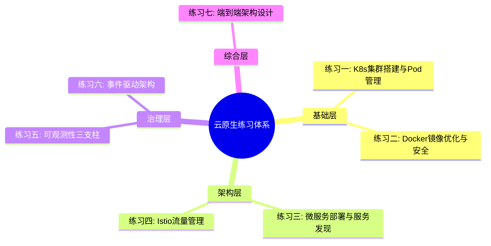
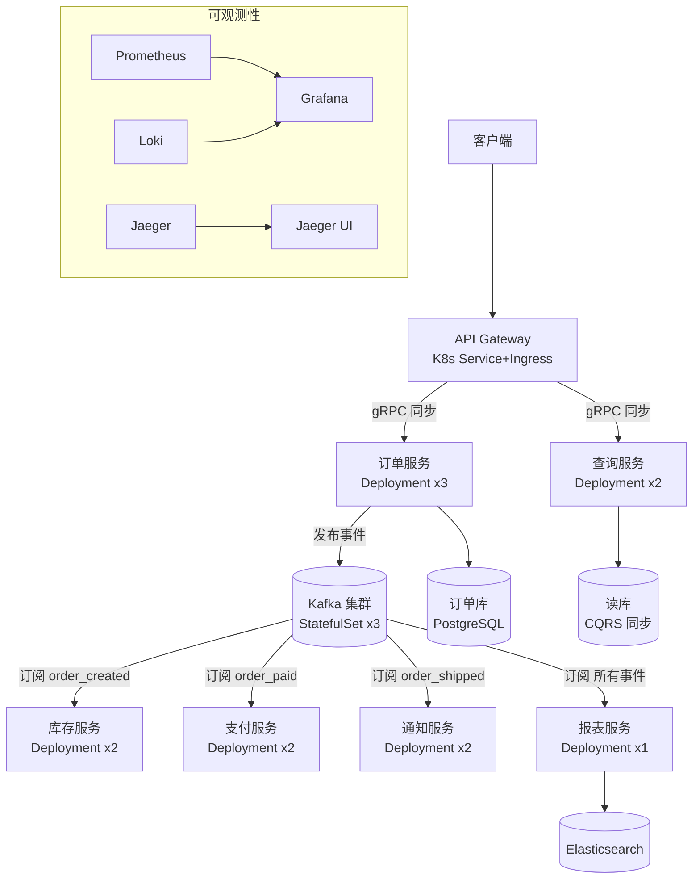

## 练习方法

> **"云原生架构的知识只有在动手实操中才能真正内化。"** 本章提供 7 个递进式练习，从单容器部署到完整微服务架构落地，覆盖 Kubernetes、Istio 服务网格、可观测性、事件驱动等核心领域。每个练习都包含可直接执行的命令、配置文件和验证标准。



**练习环境要求：**
- 操作系统：Linux（Ubuntu 22.04+）或 macOS
- 工具链：Docker 24+、kubectl 1.28+、Helm 3.12+、istioctl 1.20+
- 硬件：最低 8 核 CPU、16GB 内存（运行 K8s + Istio）
- 集群：使用 Minikube（单节点）或 Kind（多节点）搭建本地集群

---

### 练习一：Kubernetes 集群搭建与基础操作（预计 45 分钟）

**目标**：搭建可用的 Kubernetes 集群，掌握 Pod、Service、Deployment 核心资源对象的声明式管理，理解 K8s 的调度和自愈机制。

#### 第一步：搭建本地集群（10 分钟）

```bash
# 方案 A：Minikube（单节点，适合初学者）
minikube start --cpus=4 --memory=8192 --driver=docker --kubernetes-version=v1.28.3

# 方案 B：Kind（多节点集群，更接近生产环境）
cat <<EOF | kind create cluster --config=-
kind: Cluster
apiVersion: kind.x-k8s.io/v1alpha4
nodes:
  - role: control-plane
    extraPortMappings:
      - containerPort: 30080
        hostPort: 30080
        protocol: TCP
  - role: worker
  - role: worker
EOF

# 验证集群状态
kubectl cluster-info
kubectl get nodes -o wide
# 期望输出：3 个节点均 Ready 状态
```

#### 第二步：Pod 生命周期实战（15 分钟）

```bash
# 创建一个 Nginx Pod，体验完整生命周期
kubectl run nginx-demo --image=nginx:1.25-alpine --port=80 --labels=app=demo,tier=frontend

# 观察 Pod 状态变化（从 Pending → ContainerCreating → Running）
kubectl get pods -w

# 查看 Pod 详情，理解调度决策
kubectl describe pod nginx-demo
# 关注 Events 部分：调度器如何选择节点、镜像拉取耗时

# 进入容器内部，体验容器的隔离性
kubectl exec -it nginx-demo -- /bin/sh
# 在容器内执行：ps aux（只有 nginx 进程）、hostname（Pod 名称）、cat /etc/os-release
# 退出容器：exit

# 查看 Pod 日志
kubectl logs nginx-demo
```

**关键理解**：Pod 是 K8s 调度的最小单元，包含一个或多个紧密关联的容器。一个 Pod 内的容器共享网络命名空间（可通过 localhost 通信）和存储卷。

#### 第三步：Deployment 与滚动更新（15 分钟）

```bash
# 创建 Deployment，声明式管理应用副本
cat <<'EOF' | kubectl apply -f -
apiVersion: apps/v1
kind: Deployment
metadata:
  name: web-app
  labels:
    app: web-app
spec:
  replicas: 3
  selector:
    matchLabels:
      app: web-app
  strategy:
    type: RollingUpdate
    rollingUpdate:
      maxSurge: 1        # 滚动更新时最多多出 1 个 Pod
      maxUnavailable: 0   # 更新期间不允许任何 Pod 不可用
  template:
    metadata:
      labels:
        app: web-app
        version: v1
    spec:
      containers:
        - name: nginx
          image: nginx:1.25-alpine
          ports:
            - containerPort: 80
          resources:
            requests:
              cpu: 100m
              memory: 64Mi
            limits:
              cpu: 200m
              memory: 128Mi
          readinessProbe:
            httpGet:
              path: /
              port: 80
            initialDelaySeconds: 3
            periodSeconds: 5
          livenessProbe:
            httpGet:
              path: /
              port: 80
            initialDelaySeconds: 10
            periodSeconds: 10
EOF

# 验证 3 个副本全部 Ready
kubectl get deployment web-app
kubectl get pods -l app=web-app -o wide

# 触发滚动更新：从 nginx:1.25 升级到 nginx:1.26
kubectl set image deployment/web-app nginx=nginx:1.26-alpine

# 实时观察滚动更新过程
kubectl rollout status deployment/web-app
kubectl get pods -l app=web-app -w

# 查看更新历史
kubectl rollout history deployment/web-app

# 回滚到上一个版本（体验云原生的核心优势——快速回滚）
kubectl rollout undo deployment/web-app
kubectl rollout status deployment/web-app
```

#### 第四步：Service 服务发现与暴露（5 分钟）

```bash
# 创建 ClusterIP Service（集群内部访问）
kubectl expose deployment web-app --port=80 --type=ClusterIP --name=web-app-svc

# 验证 Service 是否关联到 3 个 Pod Endpoints
kubectl get svc web-app-svc
kubectl get endpoints web-app-svc

# 创建 NodePort Service（通过节点端口外部访问）
kubectl expose deployment web-app --port=80 --type=NodePort --name=web-app-nodeport

# 获取访问 URL
# Minikube:
minikube service web-app-nodeport --url
# Kind:
echo "http://localhost:30080"
# 其他环境:
kubectl get svc web-app-nodeport -o jsonpath='{.spec.ports[0].nodePort}'
```

**检查标准：**

- [ ] 集群搭建成功，3 个节点均 Ready
- [ ] 能够创建 Pod 并进入容器内部
- [ ] Deployment 的滚动更新和回滚操作正常
- [ ] Service 成功暴露应用，可通过 Service 名称在集群内访问
- [ ] 理解 Pod → Deployment → Service 三者的关系

---

### 练习二：Docker 镜像构建优化与安全加固（预计 40 分钟）

**目标**：掌握多阶段构建、镜像瘦身、安全加固的最佳实践，构建生产级容器镜像。

#### 第一步：编写多阶段构建 Dockerfile（15 分钟）

以一个 Go Web 服务为例，对比优化前后的镜像大小：

```bash
# 创建项目目录
mkdir -p /tmp/cloud-native-lab &amp;&amp; cd /tmp/cloud-native-lab

# 创建 Go Web 服务
cat <<'GOEOF' > main.go
package main

import (
    "fmt"
    "net/http"
    "os"
)

func main() {
    http.HandleFunc("/health", func(w http.ResponseWriter, r *http.Request) {
        w.WriteHeader(http.StatusOK)
        fmt.Fprintf(w, `{"status":"ok","version":"v1"}`)
    })
    http.HandleFunc("/", func(w http.ResponseWriter, r *http.Request) {
        hostname, _ := os.Hostname()
        fmt.Fprintf(w, "Hello from %s\n", hostname)
    })
    fmt.Println("Server starting on :8080")
    http.ListenAndServe(":8080", nil)
}
GOEOF

cat <<'GOEOF' > go.mod
module cloud-native-lab
go 1.21
GOEOF
```

**优化前（反面教材）：使用完整基础镜像**

```dockerfile
# Dockerfile.bad —— 反面教材，体积膨胀
FROM golang:1.21
WORKDIR /app
COPY . .
RUN go build -o server .
EXPOSE 8080
CMD ["./server"]
# 预期镜像大小：~800MB，包含完整 Go 工具链和 Debian 系统
```

**优化后（生产级）：多阶段构建 + distroless**

```dockerfile
# Dockerfile.good —— 生产级镜像
# === 构建阶段 ===
FROM golang:1.21-alpine AS builder
WORKDIR /app
COPY go.mod ./
RUN go mod download
COPY main.go .
RUN CGO_ENABLED=0 GOOS=linux go build -ldflags="-s -w" -o server .

# === 运行阶段 ===
FROM gcr.io/distroless/static-debian12:nonroot
COPY --from=builder /app/server /server
EXPOSE 8080
USER nonroot:nonroot
ENTRYPOINT ["/server"]
# 预期镜像大小：~10MB，无 shell、无包管理器、最小攻击面
```

```bash
# 构建并对比
docker build -t lab:v1 -f Dockerfile.bad .
docker build -t lab:v2 -f Dockerfile.good .
docker images | grep lab
# lab:v1  ~800MB
# lab:v2  ~10MB（体积缩减 98%）
```

#### 第二步：镜像安全扫描（10 分钟）

```bash
# 安装 Trivy 镜像扫描工具
# sudo apt-get install -y trivy  # Debian/Ubuntu
# 或使用 Docker 运行
docker run --rm -v /var/run/docker.sock:/var/run/docker.sock \
  aquasec/trivy:latest image lab:v1

# 扫描生产级镜像（预期：0 High/Critical 漏洞）
docker run --rm -v /var/run/docker.sock:/var/run/docker.sock \
  aquasec/trivy:latest image lab:v2

# 对比关键指标
# lab:v1: 可能有 50+ High/Critical CVE（Debian 系统包）
# lab:v2: 0 漏洞（distroless 无系统包管理器）
```

#### 第三步：Dockerfile 安全检查清单编写（15 分钟）

用 Hadolint 静态分析 Dockerfile 中的反模式：

```bash
# 安装 hadolint
# wget -O /usr/local/bin/hadolint https://github.com/hadolint/hadolint/releases/latest/download/hadolint-Linux-x86_64
# chmod +x /usr/local/bin/hadolint

# 创建包含常见错误的 Dockerfile
cat <<'EOF' > Dockerfile.insecure
FROM ubuntu:22.04
RUN apt-get update &amp;&amp; apt-get install -y python3 python3-pip
COPY . /app
WORKDIR /app
RUN pip3 install -r requirements.txt
ENV API_KEY=sk-1234567890abcdef
EXPOSE 8000
USER root
CMD ["python3", "app.py"]
EOF

# 运行检查
hadolint Dockerfile.insecure
# 期望发现的问题：
# DL3007: 使用 latest 标签（不固定版本）
# DL3013: pip install 未固定版本
# DL3002: 最后用户是 root
# DL3001: 使用了 apt-get（应选择更小的基础镜像）
# SC2086: 环境变量硬编码了密钥
```

**安全加固后的 Dockerfile：**

```dockerfile
FROM python:3.12-slim@sha256:abc123  # 固定版本 + digest
RUN groupadd -r appuser &amp;&amp; useradd -r -g appuser appuser
WORKDIR /app
COPY requirements.txt .
RUN pip install --no-cache-dir -r requirements.txt
COPY --chown=appuser:appuser . .
USER appuser
EXPOSE 8000
HEALTHCHECK --interval=30s --timeout=3s CMD curl -f http://localhost:8000/health || exit 1
CMD ["python3", "app.py"]
```

**检查标准：**

- [ ] 能够编写多阶段构建 Dockerfile，镜像体积缩减 80% 以上
- [ ] 能使用 Trivy 扫描镜像漏洞并理解结果
- [ ] 能使用 Hadolint 检查 Dockerfile 安全合规性
- [ ] 理解 distroless 镜像的价值：无 shell = 攻击者即使突破也无法获得命令行

---

### 练习三：微服务部署与服务间通信（预计 60 分钟）

**目标**：在 Kubernetes 上部署多个微服务，配置服务发现、负载均衡和基本的故障隔离，体验微服务架构的核心挑战。

#### 第一步：部署电商微服务（20 分钟）

```bash
# 创建独立命名空间（模拟生产环境隔离）
kubectl create namespace ecommerce

cat <<'EOF' | kubectl apply -f -
---
# 订单服务 Deployment
apiVersion: apps/v1
kind: Deployment
metadata:
  name: order-service
  namespace: ecommerce
spec:
  replicas: 2
  selector:
    matchLabels:
      app: order-service
  template:
    metadata:
      labels:
        app: order-service
        tier: backend
    spec:
      containers:
        - name: order-service
          image: hashicorp/http-echo
          args: ["-text=Order Service v1", "-listen=:8080"]
          ports:
            - containerPort: 8080
          resources:
            requests:
              cpu: 50m
              memory: 32Mi
            limits:
              cpu: 100m
              memory: 64Mi
          readinessProbe:
            tcpSocket:
              port: 8080
            initialDelaySeconds: 3
            periodSeconds: 5
---
# 订单服务 ClusterIP Service
apiVersion: v1
kind: Service
metadata:
  name: order-service
  namespace: ecommerce
spec:
  selector:
    app: order-service
  ports:
    - port: 80
      targetPort: 8080
  type: ClusterIP
---
# 支付服务 Deployment
apiVersion: apps/v1
kind: Deployment
metadata:
  name: payment-service
  namespace: ecommerce
spec:
  replicas: 2
  selector:
    matchLabels:
      app: payment-service
  template:
    metadata:
      labels:
        app: payment-service
        tier: backend
    spec:
      containers:
        - name: payment-service
          image: hashicorp/http-echo
          args: ["-text=Payment Service v1", "-listen=:8080"]
          ports:
            - containerPort: 8080
          resources:
            requests:
              cpu: 50m
              memory: 32Mi
            limits:
              cpu: 100m
              memory: 64Mi
          readinessProbe:
            tcpSocket:
              port: 8080
            initialDelaySeconds: 3
            periodSeconds: 5
---
# 支付服务 ClusterIP Service
apiVersion: v1
kind: Service
metadata:
  name: payment-service
  namespace: ecommerce
spec:
  selector:
    app: payment-service
  ports:
    - port: 80
      targetPort: 8080
  type: ClusterIP
---
# 网关服务 Deployment（前端入口）
apiVersion: apps/v1
kind: Deployment
metadata:
  name: gateway
  namespace: ecommerce
spec:
  replicas: 1
  selector:
    matchLabels:
      app: gateway
  template:
    metadata:
      labels:
        app: gateway
        tier: frontend
    spec:
      containers:
        - name: gateway
          image: hashicorp/http-echo
          args: ["-text=API Gateway v1", "-listen=:8080"]
          ports:
            - containerPort: 8080
          resources:
            requests:
              cpu: 50m
              memory: 32Mi
            limits:
              cpu: 100m
              memory: 64Mi
---
# 网关 NodePort Service（外部访问入口）
apiVersion: v1
kind: Service
metadata:
  name: gateway
  namespace: ecommerce
spec:
  selector:
    app: gateway
  ports:
    - port: 80
      targetPort: 8080
  type: NodePort
EOF

# 等待所有 Pod 就绪
kubectl wait --for=condition=ready pod -l app -n ecommerce --timeout=120s

# 验证服务发现：在 Pod 内部通过 Service 名称访问
kubectl exec -n ecommerce deploy/gateway -- wget -qO- http://order-service
# 期望输出：Order Service v1
```

#### 第二步：负载均衡验证（10 分钟）

```bash
# 订单服务有 2 个副本，验证 Round-Robin 负载均衡
for i in $(seq 1 10); do
  kubectl exec -n ecommerce deploy/gateway -- wget -qO- http://order-service
done
# 注意观察响应中 Pod 名称是否交替出现
```

#### 第三步：网络策略隔离（15 分钟）

```bash
# 默认情况下，Kubernetes 集群内所有 Pod 可以互相访问——这在生产环境中是安全隐患
# 创建 NetworkPolicy：只允许网关访问后端服务，禁止后端服务之间直接访问

cat <<'EOF' | kubectl apply -f -
apiVersion: networking.k8s.io/v1
kind: NetworkPolicy
metadata:
  name: backend-isolation
  namespace: ecommerce
spec:
  podSelector:
    matchLabels:
      tier: backend
  policyTypes:
    - Ingress
  ingress:
    - from:
        - podSelector:
            matchLabels:
              tier: frontend
      ports:
        - protocol: TCP
          port: 8080
EOF

# 验证策略生效：网关可以访问订单服务（应该成功）
kubectl exec -n ecommerce deploy/gateway -- wget -qO- http://order-service

# 验证策略生效：订单服务不能访问支付服务（应该超时/拒绝）
kubectl exec -n ecommerce deploy/order-service -- wget -qO- --timeout=3 http://payment-service || echo "EXPECTED: Connection timed out"
```

#### 第四步：资源配额与 LimitRange（15 分钟）

```bash
# 为命名空间设置资源配额，防止单个团队耗尽集群资源
cat <<'EOF' | kubectl apply -f -
apiVersion: v1
kind: ResourceQuota
metadata:
  name: ecommerce-quota
  namespace: ecommerce
spec:
  hard:
    requests.cpu: "2"
    requests.memory: 2Gi
    limits.cpu: "4"
    limits.memory: 4Gi
    pods: "20"
    services: "10"
    persistentvolumeclaims: "5"
---
apiVersion: v1
kind: LimitRange
metadata:
  name: ecommerce-limits
  namespace: ecommerce
spec:
  limits:
    - type: Container
      default:
        cpu: 100m
        memory: 64Mi
      defaultRequest:
        cpu: 50m
        memory: 32Mi
      max:
        cpu: "1"
        memory: 512Mi
      min:
        cpu: 10m
        memory: 16Mi
EOF

# 验证配额
kubectl describe resourcequota ecommerce-quota -n ecommerce
# 输出显示当前用量和上限
```

**检查标准：**

- [ ] 成功在独立命名空间部署 3 个微服务
- [ ] 能够通过 Service 名称在集群内进行服务发现
- [ ] 能够验证负载均衡策略
- [ ] NetworkPolicy 能够有效隔离网络流量
- [ ] 理解 ResourceQuota 和 LimitRange 对资源管理的作用

---

### 练习四：Istio 服务网格流量管理（预计 60 分钟）

**目标**：安装并配置 Istio 服务网格，掌握金丝雀发布、故障注入、流量镜像等高级流量管理能力。

#### 第一步：安装 Istio（15 分钟）

```bash
# 下载并安装 istioctl
curl -L https://istio.io/downloadIstio | ISTIO_VERSION=1.20.2 sh -
export PATH=$PWD/istio-1.20.2/bin:$PATH

# 使用 demo 配置文件安装（包含所有功能，适合学习）
istioctl install --set profile=demo -y

# 验证安装状态
istioctl verify-install
# 期望：所有 Istio 组件安装成功

# 为 ecommerce 命名空间启用 Sidecar 自动注入
kubectl label namespace ecommerce istio-injection=enabled

# 重新部署服务（Pod 重启后会自动注入 Envoy Sidecar）
kubectl rollout restart deployment -n ecommerce

# 等待所有 Pod 就绪（现在每个 Pod 有 2 个容器：应用 + Envoy Sidecar）
kubectl get pods -n ecommerce
# 期望：每个 Pod 的 READY 列显示 2/2
```

#### 第二步：配置 VirtualService 实现金丝雀发布（20 分钟）

```bash
# 部署订单服务 v2 版本
cat <<'EOF' | kubectl apply -f -
apiVersion: apps/v1
kind: Deployment
metadata:
  name: order-service-v2
  namespace: ecommerce
spec:
  replicas: 1
  selector:
    matchLabels:
      app: order-service
      version: v2
  template:
    metadata:
      labels:
        app: order-service
        version: v2
    spec:
      containers:
        - name: order-service
          image: hashicorp/http-echo
          args: ["-text=Order Service v2 (Canary)", "-listen=:8080"]
          ports:
            - containerPort: 8080
          resources:
            requests:
              cpu: 50m
              memory: 32Mi
EOF

# 配置 VirtualService：90% 流量到 v1，10% 到 v2（金丝雀发布）
cat <<'EOF' | kubectl apply -f -
apiVersion: networking.istio.io/v1beta1
kind: VirtualService
metadata:
  name: order-service
  namespace: ecommerce
spec:
  hosts:
    - order-service
  http:
    - route:
        - destination:
            host: order-service
            subset: v1
          weight: 90
        - destination:
            host: order-service
            subset: v2
          weight: 10
---
apiVersion: networking.istio.io/v1beta1
kind: DestinationRule
metadata:
  name: order-service
  namespace: ecommerce
spec:
  host: order-service
  subsets:
    - name: v1
      labels:
        version: v1
    - name: v2
      labels:
        version: v2
EOF

# 验证金丝雀发布效果（发送 20 个请求，观察 v1/v2 比例）
for i in $(seq 1 20); do
  kubectl exec -n ecommerce deploy/gateway -c istio-proxy -- \
    curl -s http://order-service -o /dev/null -w "%{http_code}\n" 2>/dev/null || \
  kubectl exec -n ecommerce deploy/gateway -- wget -qO- http://order-service
done
# 期望：约 90% 返回 v1，10% 返回 v2
```

#### 第三步：故障注入测试系统弹性（15 分钟）

```bash
# 向订单服务注入 3 秒延迟，测试下游服务的超时处理能力
cat <<'EOF' | kubectl apply -f -
apiVersion: networking.istio.io/v1beta1
kind: VirtualService
metadata:
  name: order-service
  namespace: ecommerce
spec:
  hosts:
    - order-service
  http:
    - fault:
        delay:
          percentage:
            value: 50
          fixedDelay: 3s
      route:
        - destination:
            host: order-service
            subset: v1
          weight: 90
        - destination:
            host: order-service
            subset: v2
          weight: 10
EOF

# 观察请求延迟变化
time kubectl exec -n ecommerce deploy/gateway -- wget -qO- http://order-service
# 期望：部分请求延迟显著增加（约 3 秒）
```

#### 第四步：流量镜像到测试环境（10 分钟）

```bash
# 将生产流量完整复制到 v2 版本，不影响生产响应
cat <<'EOF' | kubectl apply -f -
apiVersion: networking.istio.io/v1beta1
kind: VirtualService
metadata:
  name: order-service
  namespace: ecommerce
spec:
  hosts:
    - order-service
  http:
    - route:
        - destination:
            host: order-service
            subset: v1
      mirror:
        host: order-service
        subset: v2
      mirrorPercentage:
        value: 100
EOF

# 验证：客户端只收到 v1 的响应，但 v2 同时收到了相同的请求
# 在 v2 的日志中可以看到镜像流量
kubectl logs -n ecommerce -l version=v2 -c order-service --tail=5
```

**检查标准：**

- [ ] Istio 安装成功，Sidecar 自动注入正常
- [ ] 能配置 VirtualService 实现金丝雀发布
- [ ] 能配置故障注入并验证效果
- [ ] 理解流量镜像与灰度发布的区别
- [ ] 理解 Envoy Sidecar 的拦截机制

---

### 练习五：可观测性三支柱 — Metrics / Logs / Traces（预计 45 分钟）

**目标**：搭建完整的可观测性体系，掌握 Prometheus 指标采集、Grafana 可视化、Jaeger 分布式追踪。

#### 第一步：部署 Prometheus + Grafana（15 分钟）

```bash
# 使用 kube-prometheus-stack Helm Chart 一键部署
helm repo add prometheus-community https://prometheus-community.github.io/helm-charts
helm repo update

helm install monitoring prometheus-community/kube-prometheus-stack \
  --namespace monitoring --create-namespace \
  --set grafana.adminPassword=admin123 \
  --set grafana.service.type=NodePort \
  --set grafana.service.nodePort=30081 \
  --set prometheus.service.type=NodePort \
  --set prometheus.service.nodePort=30090

# 等待所有组件就绪
kubectl wait --for=condition=ready pod -l app.kubernetes.io/name=grafana -n monitoring --timeout=120s
kubectl wait --for=condition=ready pod -l app.kubernetes.io/name=prometheus -n monitoring --timeout=120s

# 访问 Grafana：http://localhost:30081（admin/admin123）
# 访问 Prometheus：http://localhost:30090
```

#### 第二步：配置 ServiceMonitor 采集微服务指标（10 分钟）

```bash
# 为 ecommerce 命名空间的微服务创建 ServiceMonitor
cat <<'EOF' | kubectl apply -f -
apiVersion: monitoring.coreos.com/v1
kind: ServiceMonitor
metadata:
  name: ecommerce-services
  namespace: monitoring
  labels:
    release: monitoring
spec:
  namespaceSelector:
    matchNames:
      - ecommerce
  selector:
    matchLabels:
      tier: backend
  endpoints:
    - port: http
      path: /metrics
      interval: 15s
EOF

# 验证 Prometheus 已抓取到目标
# 在 Prometheus UI (http://localhost:30090) → Status → Targets
# 期望看到 order-service 和 payment-service 的 targets 为 UP 状态
```

#### 第三步：部署 Jaeger 分布式追踪（10 分钟）

```bash
# 部署 Jaeger All-in-One（适合学习环境）
kubectl apply -f https://raw.githubusercontent.com/jaegertracing/jaeger-operator/main/deploy/crds/jaegertracing_jaegers_crd.yaml
kubectl apply -f https://raw.githubusercontent.com/jaegertracing/jaeger-operator/main/deploy/service.yaml
kubectl apply -f https://raw.githubusercontent.com/jaegertracing/jaeger-operator/main/deploy/operator.yaml

cat <<'EOF' | kubectl apply -f -
apiVersion: jaegertracing.io/v1
kind: Jaeger
metadata:
  name: jaeger
  namespace: istio-system
spec:
  strategy: allInOne
  allInOne:
    image: jaegertracing/all-in-one:1.52
    options:
      log-level: debug
  collector:
    maxReplicas: 5
  query:
    replicas: 2
  ingress:
    enabled: true
EOF

# 验证 Jaeger 部署
kubectl get pods -n istio-system -l app=jaeger
# 访问 Jaeger UI（通过端口转发）
kubectl port-forward -n istio-system svc/jaeger-query 16686:16686 &amp;
# 访问 http://localhost:16686
```

#### 第四步：RED 指标查询实战（10 分钟）

```bash
# 在 Prometheus UI 中执行以下 PromQL 查询

# 1. Rate（吞吐量）：每秒请求数
# promql: sum(rate(istio_requests_total[5m])) by (destination_service)

# 2. Errors（错误率）：5xx 请求占比
# promql: sum(rate(istio_requests_total{response_code=~"5.."}[5m])) / sum(rate(istio_requests_total[5m])) * 100

# 3. Duration（延迟）：P99 延迟
# promql: histogram_quantile(0.99, sum(rate(istio_request_duration_milliseconds_bucket[5m])) by (le, destination_service))

# 验证：在 Grafana 中查看预置的 Istio Dashboard
# Grafana → Dashboards → 搜索 "Istio" → 选择 "Istio Mesh Dashboard"
# 期望看到实时的请求流量、错误率和延迟分布
```

**检查标准：**

- [ ] Prometheus + Grafana + Jaeger 全部部署成功
- [ ] 能够在 Grafana 中查看微服务的 RED 指标
- [ ] 能够在 Jaeger 中查看分布式调用链
- [ ] 理解 Metrics（全局趋势）、Logs（事件细节）、Traces（请求链路）三者的互补关系

---

### 练习六：事件驱动架构 — Kafka + K8s 实践（预计 50 分钟）

**目标**：在 Kubernetes 上部署 Kafka，实现微服务间的异步事件驱动通信，理解事件驱动架构与同步调用的差异。

#### 第一步：部署 Kafka（15 分钟）

```bash
# 使用 Bitnami Helm Chart 部署 Kafka
helm repo add bitnami https://charts.bitnami.com/bitnami
helm repo update

helm install kafka bitnami/kafka \
  --namespace kafka --create-namespace \
  --set replicaCount=3 \
  --set controller.persistence.size=5Gi \
  --set allowPlaintextListener=yes \
  --set service.type=NodePort \
  --set service.nodePort=30092

# 等待 Kafka 集群就绪
kubectl get pods -n kafka -w
# 期望：3 个 Pod 全部 Running

# 进入 Kafka Pod 创建 Topic
kubectl exec -n kafka kafka-0 -- \
  kafka-topics.sh --bootstrap-server kafka-0.kafka-headless.kafka.svc.cluster.local:9092 \
  --create --topic order-events --partitions 3 --replication-factor 2

# 验证 Topic 创建成功
kubectl exec -n kafka kafka-0 -- \
  kafka-topics.sh --bootstrap-server kafka-0.kafka-headless.kafka.svc.cluster.local:9092 \
  --list
```

#### 第二步：生产者-消费者模式实战（20 分钟）

```bash
# 启动消费者（监听 order-events Topic）
kubectl exec -n kafka kafka-0 -i -- \
  kafka-console-consumer.sh --bootstrap-server kafka-0.kafka-headless.kafka.svc.cluster.local:9092 \
  --topic order-events --from-beginning &amp;
CONSUMER_PID=$!

# 发送测试消息（模拟订单事件）
cat <<'EVENTS' | while read line; do
  kubectl exec -n kafka kafka-0 -i -- \
    kafka-console-producer.sh --bootstrap-server kafka-0.kafka-headless.kafka.svc.cluster.local:9092 \
    --topic order-events <<< "$line"
  sleep 1
done
{"event":"order_created","order_id":"ORD-001","user_id":"U-1001","amount":299.00}
{"event":"order_paid","order_id":"ORD-001","payment_method":"alipay"}
{"event":"order_shipped","order_id":"ORD-001","tracking_no":"SF12345678"}
EVENTS

# 查看消费者接收到的消息
wait $CONSUMER_PID
# 期望：消费者收到 3 条事件，按顺序排列
```

#### 第三步：对比同步调用 vs 事件驱动（15 分钟）

```bash
# 架构对比练习：在白板或笔记中画出两种模式的区别

# 同步模式（之前练习三的方式）：
# 客户端 → 订单服务 → 支付服务 → 库存服务 → 通知服务
# 问题：4 个服务同步调用，任何一个超时或故障都会导致整个链路失败

# 事件驱动模式：
# 客户端 → 订单服务 → Kafka → 支付服务（订阅 order_created）
#                   → Kafka → 库存服务（订阅 order_paid）
#                   → Kafka → 通知服务（订阅 order_shipped）
# 优势：服务间解耦，某个消费者故障不影响其他消费者

# 记录关键差异
cat <<'EOF'
同步调用 vs 事件驱动 对比：
┌─────────────────┬───────────────────┬─────────────────────┐
│ 维度             │ 同步调用 (REST)    │ 事件驱动 (Kafka)     │
├─────────────────┼───────────────────┼─────────────────────┤
│ 耦合度           │ 强耦合（直接依赖）  │ 弱耦合（通过事件）    │
│ 容错性           │ 差（级联故障）      │ 好（故障隔离）        │
│ 延迟            │ 低（实时响应）      │ 高（异步处理）        │
│ 数据一致性       │ 强一致             │ 最终一致             │
│ 吞吐量          │ 受最慢下游限制      │ 可独立扩缩消费者      │
│ 调试难度        │ 低（单一调用链）    │ 高（异步消息追踪）    │
│ 适用场景        │ 实时查询、即时响应   │ 事件通知、数据同步    │
└─────────────────┴───────────────────┴─────────────────────┘
EOF
```

#### 第四步：Kafka 消费者组与分区策略（10 分钟）

```bash
# 启动消费者组（3 个消费者，模拟消费者组负载均衡）
for i in 1 2 3; do
  kubectl exec -n kafka kafka-0 -- \
    kafka-console-consumer.sh --bootstrap-server kafka-0.kafka-headless.kafka.svc.cluster.local:9092 \
    --topic order-events --group order-processors &amp;
done

# 查看消费者组状态
kubectl exec -n kafka kafka-0 -- \
  kafka-consumer-groups.sh --bootstrap-server kafka-0.kafka-headless.kafka.svc.cluster.local:9092 \
  --describe --group order-processors
# 期望：3 个分区分配给 3 个消费者，每个消费者处理 1 个分区
# 关键理解：Kafka 通过分区实现消费者组内的并行处理
# 同一分区内的消息保证顺序，不同分区之间不保证顺序
```

**检查标准：**

- [ ] Kafka 3 节点集群部署成功
- [ ] 能够创建 Topic、生产消息、消费消息
- [ ] 理解消费者组的分区分配策略
- [ ] 能够画出同步调用 vs 事件驱动的架构对比图
- [ ] 理解最终一致性的含义和适用场景

---

### 练习七：端到端架构设计综合练习（预计 90 分钟）

**目标**：综合运用前 6 个练习的知识，设计并实现一个完整的云原生电商订单系统架构。

#### 第一步：需求分析与架构设计（20 分钟）

**业务场景**：设计一个日活 10 万的电商订单系统，支持以下功能：

- 用户下单 → 扣减库存 → 发起支付 → 发送通知
- 订单查询（实时响应）
- 订单数据报表（异步生成）
- 系统需要支持弹性扩缩和故障自愈

**架构设计任务**（在纸上或白板上完成）：

画出架构图，标注以下要素：
1. 服务划分：哪些服务？各自负责什么？
2. 通信方式：哪些用同步 gRPC？哪些用异步 Kafka？
3. 数据归属：每个服务的数据库是什么？
4. 部署拓扑：K8s 资源类型（Deployment/StatefulSet/DaemonSet）
5. 可观测性：Metrics/Logs/Traces 如何收集？
6. 安全策略：mTLS、NetworkPolicy、Secret 管理

**参考架构：**



#### 第二步：实施核心组件（40 分钟）

```bash
# 基于架构设计，选择 2-3 个核心组件进行实际部署

# 1. 部署订单服务（含健康检查、资源限制、安全上下文）
cat <<'EOF' | kubectl apply -f -
apiVersion: apps/v1
kind: Deployment
metadata:
  name: order-service
  namespace: ecommerce
spec:
  replicas: 3
  strategy:
    type: RollingUpdate
    rollingUpdate:
      maxSurge: 1
      maxUnavailable: 0
  selector:
    matchLabels:
      app: order-service
  template:
    metadata:
      labels:
        app: order-service
        version: v1
    spec:
      securityContext:
        runAsNonRoot: true
        runAsUser: 1000
        fsGroup: 1000
      containers:
        - name: order-service
          image: hashicorp/http-echo
          args: ["-text=Order Service", "-listen=:8080"]
          ports:
            - containerPort: 8080
              name: http
          resources:
            requests:
              cpu: 200m
              memory: 256Mi
            limits:
              cpu: 500m
              memory: 512Mi
          readinessProbe:
            httpGet:
              path: /
              port: 8080
            initialDelaySeconds: 5
            periodSeconds: 10
            failureThreshold: 3
          livenessProbe:
            httpGet:
              path: /
              port: 8080
            initialDelaySeconds: 15
            periodSeconds: 20
            failureThreshold: 3
          startupProbe:
            httpGet:
              path: /
              port: 8080
            failureThreshold: 30
            periodSeconds: 5
          securityContext:
            allowPrivilegeEscalation: false
            readOnlyRootFilesystem: true
            capabilities:
              drop: ["ALL"]
---
apiVersion: v1
kind: Service
metadata:
  name: order-service
  namespace: ecommerce
spec:
  selector:
    app: order-service
  ports:
    - port: 80
      targetPort: 8080
      name: http
---
apiVersion: policy/v1
kind: PodDisruptionBudget
metadata:
  name: order-service-pdb
  namespace: ecommerce
spec:
  minAvailable: 2
  selector:
    matchLabels:
      app: order-service
EOF

# 2. 配置 HPA 自动扩缩
cat <<'EOF' | kubectl apply -f -
apiVersion: autoscaling/v2
kind: HorizontalPodAutoscaler
metadata:
  name: order-service-hpa
  namespace: ecommerce
spec:
  scaleTargetRef:
    apiVersion: apps/v1
    kind: Deployment
    name: order-service
  minReplicas: 2
  maxReplicas: 10
  metrics:
    - type: Resource
      resource:
        name: cpu
        target:
          type: Utilization
          averageUtilization: 70
    - type: Resource
      resource:
        name: memory
        target:
          type: Utilization
          averageUtilization: 80
  behavior:
    scaleUp:
      stabilizationWindowSeconds: 60
      policies:
        - type: Pods
          value: 2
          periodSeconds: 60
    scaleDown:
      stabilizationWindowSeconds: 300
      policies:
        - type: Percent
          value: 10
          periodSeconds: 60
EOF

# 验证 HPA 配置
kubectl get hpa -n ecommerce
```

#### 第三步：故障演练验证（20 分钟）

```bash
# 1. 模拟 Pod 故障——删除一个 Pod，观察自动恢复
POD_NAME=$(kubectl get pods -n ecommerce -l app=order-service -o jsonpath='{.items[0].metadata.name}')
echo "删除 Pod: $POD_NAME"
kubectl delete pod -n ecommerce $POD_NAME

# 立即观察 Pod 重建过程
kubectl get pods -n ecommerce -l app=order-service -w
# 期望：30 秒内新的 Pod 被创建并达到 Ready 状态

# 2. 模拟节点不可用——给节点加 cordon 标记（驱逐 Pod）
NODE=$(kubectl get pods -n ecommerce -l app=order-service -o jsonpath='{.items[0].spec.nodeName}')
kubectl cordon $NODE
kubectl get pods -n ecommerce -l app=order-service -o wide
# 观察 Pod 是否被调度到其他节点

# 解除节点标记
kubectl uncordon $NODE

# 3. 模拟资源压力——增大副本数观察扩缩行为
kubectl scale deployment order-service -n ecommerce --replicas=6
kubectl get hpa -n ecommerce -w
# 观察 HPA 是否根据 CPU 使用率自动调整副本数
```

#### 第四步：方案评审与总结（10 分钟）

对照以下清单审查自己的架构设计：

架构设计评审清单：
┌───────────────────────────────────────────────────────────┐
│ 1. 服务边界    是否基于业务领域划分？是否有过度拆分？         │
│ 2. 通信方式    同步/异步选择是否合理？是否有同步调用链过长？   │
│ 3. 数据管理    每个服务是否有独立数据库？跨服务查询方案？      │
│ 4. 容错设计    每个服务间调用是否有超时/重试/熔断/降级？       │
│ 5. 安全策略    mTLS、NetworkPolicy、Secret 管理是否到位？    │
│ 6. 可观测性    Metrics/Logs/Traces 三支柱是否完整？          │
│ 7. 弹性能力    HPA/PDB/健康检查是否配置？                    │
│ 8. 部署策略    滚动更新/蓝绿/金丝雀如何选择？                 │
│ 9. 成本意识    资源 Requests/Limits 是否合理？                │
│ 10. 演进路径   当前方案是否支持渐进式演进？                    │
└───────────────────────────────────────────────────────────┘

**检查标准：**

- [ ] 完成架构设计文档，包含服务划分、通信方式、数据归属
- [ ] 至少部署了 3 个核心组件并验证其功能
- [ ] 配置了 HPA 自动扩缩和 PDB 保护
- [ ] 完成了至少 1 项故障演练并观察到自动恢复
- [ ] 能够清晰说明架构设计中每个决策的原因

---

### 练习进阶：推荐挑战任务

完成以上 7 个基础练习后，以下进阶任务可以帮助你深入理解云原生架构的高级主题：

| 挑战任务 | 难度 | 涉及知识点 | 预计时间 |
|----------|------|-----------|----------|
| 使用 ArgoCD 实现 GitOps 自动部署 | ★★★ | GitOps、声明式部署、版本控制 | 60 分钟 |
| 为 Kafka 消费者实现死信队列（DLQ） | ★★★ | 消息可靠性、错误处理、重试机制 | 45 分钟 |
| 使用 Litmus 执行混沌工程实验 | ★★★★ | 混沌工程、故障注入、韧性验证 | 60 分钟 |
| 实现 CQRS + Event Sourcing 模式 | ★★★★★ | 读写分离、事件溯源、最终一致性 | 120 分钟 |
| 配置 Istio mTLS + 授权策略 | ★★★★ | 零信任安全、服务间认证、RBAC | 45 分钟 |
| 使用 Helm 打包多环境部署 Chart | ★★★ | 模板化部署、Values 管理、版本控制 | 60 分钟 |

**进阶提示：**

- 混沌工程实验必须在非生产环境执行，先验证实验爆炸半径
- Event Sourcing 需要选择合适的事件存储（如 EventStoreDB、Kafka 作为事件日志）
- Helm Chart 打包时注意 secrets 不能硬编码在 values.yaml 中，应使用 Sealed Secrets 或 Vault
- GitOps 部署需要区分 application repo 和 deployment repo，避免循环触发

---

### 练习环境清理

完成所有练习后，执行以下命令清理环境：

```bash
# 删除练习创建的命名空间（会删除该命名空间下的所有资源）
kubectl delete namespace ecommerce
kubectl delete namespace kafka
kubectl delete namespace monitoring

# 卸载 Helm releases
helm uninstall kafka -n kafka 2>/dev/null
helm uninstall monitoring -n monitoring 2>/dev/null

# 卸载 Istio
istioctl uninstall --purge -y
kubectl delete namespace istio-system

# 删除 Kind 集群（如果使用 Kind）
kind delete cluster

# 或删除 Minikube
minikube delete
```
