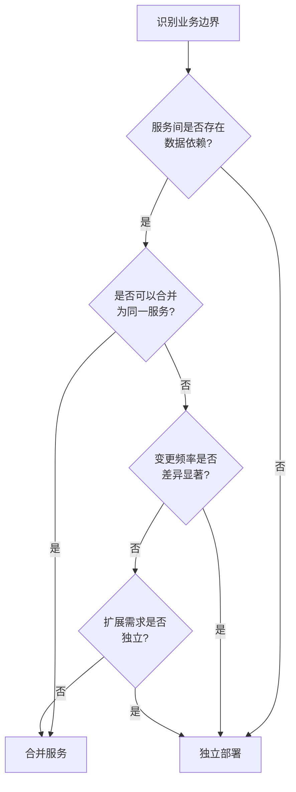
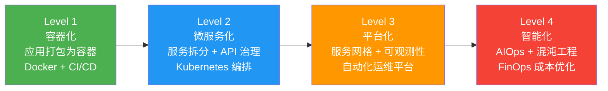

## 本章小结

云原生架构不是一个单一的技术点，而是一套涵盖设计哲学、工程实践与组织文化的完整方法论体系。本章从 CNCF 定义出发，沿着"理论→方法→实战"的递进路径，系统讲解了微服务、无服务器计算、服务网格、事件驱动架构四大范式，深入剖析了容器化最佳实践、微服务拆分方法论、服务编排与治理等核心技巧，并通过 Kubernetes 部署和 Istio 流量管理两个实战案例将理论落地。本小结将对全章知识进行结构化梳理，帮助读者建立完整的心智模型。

---

### 一、核心知识体系回顾

#### 1.1 云原生的本质定义

CNCF（Cloud Native Computing Foundation）对云原生的官方定义是：

> 云原生技术使组织能够在公有云、私有云和混合云等新型动态环境中，构建和运行可弹性扩展的应用。其代表技术包括容器、服务网格、微服务、不可变基础设施和声明式 API。

这四大技术支柱的内在联系可以用一句话概括：**容器化提供运行时隔离，微服务提供架构分解，DevOps 提供交付文化，持续交付提供工程自动化**。它们不是孤立的技术选型，而是相互支撑的体系——没有容器的轻量隔离，微服务的独立部署就无从谈起；没有持续交付的自动化管道，微服务的快速迭代就会沦为运维噩梦。

#### 1.2 十二要素应用

十二要素（The Twelve-Factor App）是 SaaS 应用开发的方法论，为云原生应用的设计提供了具体指导原则：

| 要素 | 核心要求 | 实践要点 |
|------|----------|----------|
| 基准代码 | 一份代码，多份部署 | Git 仓库唯一，通过环境变量区分配置 |
| 依赖 | 显式声明依赖 | 使用 package.json / requirements.txt / go.mod，不依赖系统隐式安装 |
| 配置 | 在环境中存储配置 | 使用 ConfigMap / Secret / 环境变量，禁止硬编码 |
| 后端服务 | 把后端服务当作附加资源 | 数据库、消息队列通过 URL 绑定，可随时替换 |
| 构建/发布/运行 | 严格分离构建和运行 | CI 构建产物不可变，一次构建多环境发布 |
| 进程 | 以一个或多个无状态进程运行应用 | 共享状态存入外部存储（Redis/数据库） |
| 端口绑定 | 通过端口绑定提供服务 | 应用自身监听端口，不依赖外部 Web 服务器 |
| 并发 | 通过进程模型进行扩展 | 水平扩展优先于垂直扩展，进程类型隔离 |
| 易处理 | 快速启动和优雅终止 | 启动时间 < 1 秒，收到 SIGTERM 后完成在途请求 |
| 开发/生产环境一致 | 尽可能保持开发/生产环境一致 | 使用相同容器镜像、相同依赖版本 |
| 日志 | 把日志当作事件流 | 输出到 stdout/stderr，由基础设施聚合分析 |
| 管理进程 | 后台管理任务作为一次性进程运行 | 数据库迁移等脚本在独立进程中执行 |

---

### 二、四大架构范式精要

#### 2.1 微服务架构设计

微服务将单体应用拆分为一组小型、自治的服务，每个服务围绕一个业务能力构建，独立开发、部署和扩展。

**服务拆分的核心原则：**

- **单一职责**：一个服务只负责一个业务领域，如订单服务、支付服务、库存服务
- **限界上下文**：基于 DDD（Domain-Driven Design）的限界上下文划分服务边界，每个服务拥有自己的领域模型
- **数据自治**：每个微服务拥有独立数据库（Database per Service），禁止跨服务直接访问对方数据库
- **接口契约**：通过定义良好的 API（REST/gRPC）通信，服务内部实现对外不可见

**通信机制选择矩阵：**

| 场景 | 同步通信 | 异步通信 |
|------|----------|----------|
| 实时查询（用户详情） | REST/gRPC | — |
| 事件通知（订单创建） | — | 消息队列/事件总线 |
| 跨服务聚合（首页数据） | gRPC 链式调用 | 事件 + 本地缓存 |
| 数据同步（搜索索引） | — | CDC（Change Data Capture） |
| 文件处理（图片裁剪） | — | 任务队列 |

**分布式事务解决方案：**

- **Saga 模式**：将长事务拆分为一系列本地事务，每个本地事务都有对应的补偿操作。失败时按逆序执行补偿。分为编排式（Orchestration）和协同式（Choreography）两种实现
- **TCC 模式**：Try-Confirm-Cancel，预留资源 → 确认提交 → 取消释放，适用于对一致性要求较高的场景
- **事件溯源（Event Sourcing）**：以事件序列作为唯一数据源，任何状态变更都通过追加事件实现，天然支持审计追踪和时间旅行

**常见反模式与纠正：**

| 反模式 | 问题 | 正确做法 |
|--------|------|----------|
| 分布式单体 | 服务间强依赖，修改一个服务需要同步修改多个 | 重新审视服务边界，合并高度耦合的服务 |
| 共享数据库 | 多个服务读写同一张表，数据竞争 | 每个服务独立数据库，通过 API 交换数据 |
| 过度拆分 | 服务数量爆炸，运维成本剧增 | 从粗粒度开始，验证后再拆分 |
| 同步链过长 | 服务 A → B → C → D，任一环节超时导致整条链路失败 | 引入异步消息、本地缓存、熔断降级 |

#### 2.2 无服务器计算（Serverless）

Serverless 并非"没有服务器"，而是"开发者无需管理服务器"。核心包含两个维度：FaaS（函数即服务）和 BaaS（后端即服务）。

**FaaS 的生命周期：**

冷启动请求 → 1. 下载镜像/代码包 → 2. 创建容器实例
→ 3. 初始化运行时 → 4. 执行函数 → 5. 返回结果
→ 6. 保持实例（热启动窗口）→ 7. 超时回收

**冷启动优化策略：**

- 使用轻量级运行时（如 AWS Lambda 使用 Node.js / Python 比 Java 快 3-5 倍）
- 预 Provisioned Concurrency 保持热实例
- 减小部署包体积，使用 Lambda Layers 共享依赖
- 避免在函数初始化阶段执行重操作

**FaaS 适用场景与限制：**

| 维度 | 适用 | 不适用 |
|------|------|--------|
| 执行时长 | < 15 分钟 | 长时间视频转码、批处理 |
| 调用模式 | 突发/不规则流量 | 持续稳定的高 QPS |
| 状态管理 | 无状态事件处理 | 有状态会话、WebSocket |
| 启动频率 | 冷启动延迟可接受 | 毫秒级低延迟要求 |
| 冷启动敏感度 | 异步触发（可容忍秒级延迟） | 实时交互 API |

**主流平台对比：**

| 特性 | AWS Lambda | Google Cloud Functions | Azure Functions | Knative |
|------|------------|----------------------|-----------------|---------|
| 最大执行时间 | 15 分钟 | 9 分钟（2代） | 无限制（消费计划） | 无限制 |
| 冷启动 | ~100-500ms | ~100-300ms | ~200-500ms | 取决于容器 |
| 语言支持 | Node/Python/Java/Go/.NET/Ruby | Node/Python/Go/Java | C#/F#/JS/Python/Java | 任意 |
| 容器镜像 | 支持（2020+） | 不支持 | 不支持 | 原生支持 |
| 本地运行 | SAM CLI | Functions Framework | Core Tools | Knative CLI |
| 生态成熟度 | ★★★★★ | ★★★★ | ★★★★ | ★★★ |

#### 2.3 服务网格（Service Mesh）

服务网格将服务间通信的横切关注点（服务发现、负载均衡、熔断降级、链路追踪、安全通信）从应用代码下沉到基础设施层。

**Istio 架构双平面设计：**

- **控制平面（Istiod）**：负责配置管理和证书分发，包括 Pilot（流量管理）、Citadel（安全）、Galley（配置验证）
- **数据平面（Envoy Sidecar）**：每个 Pod 注入一个 Envoy 代理，拦截所有入站/出站流量，通过 xDS 协议从控制平面动态获取配置

**Envoy 过滤器链模型：**

入站请求 → Listener Filter → Network Filter → HTTP Filter Chain → 上游服务
                                        ↓
                              路由/重试/熔断/鉴权

**流量管理能力：**

| 能力 | 说明 | 配置示例 |
|------|------|----------|
| 金丝雀发布 | 按权重分配流量到不同版本 | `weight: 90` vs `weight: 10` |
| 流量镜像 | 将生产流量复制到测试版本 | `mirrorPercent: 100` |
| 故障注入 | 模拟延迟和错误测试弹性 | `delay: fixedDelay: 5s` |
| 超时重试 | 控制请求超时和自动重试 | `timeout: 3s, retries: 3` |
| 熔断限制 | 限制并发连接和请求数 | `maxConnections: 100` |

**服务网格的代价评估：**

优势：
- 应用代码零侵入，无需集成治理 SDK
- 统一的流量管理策略，无需在每个服务中重复实现
- 自动收集 Metrics、Traces、Access Logs
- mTLS 透明加密，零改造实现服务间安全通信

代价：
- 每个请求多经过一个 Sidecar 代理，延迟增加约 1-3ms
- 资源开销：每个 Pod 多占用约 50-100MB 内存
- 运维复杂度提升：需要维护 Istio 控制平面本身的高可用
- 排查问题更困难：需要理解 Envoy 代理层的行为

#### 2.4 事件驱动架构

事件驱动架构通过事件的产生、检测、消费和响应来解耦系统组件，特别适合异步处理和最终一致性场景。

**CQRS（Command Query Responsibility Segregation）：**

将读写操作分离到不同的模型中：

- **写模型（Command Side）**：处理创建、更新、删除操作，写入事件存储或关系数据库
- **读模型（Query Side）**：从事件或物化视图构建查询模型，优化读取性能
- **事件总线**：连接写模型和读模型，写模型发布事件，读模型消费事件并更新物化视图

**Event Sourcing 与传统 CRUD 对比：**

| 维度 | 传统 CRUD | Event Sourcing |
|------|-----------|----------------|
| 数据存储 | 当前状态快照 | 事件序列 |
| 状态获取 | 直接读取当前行 | 回放事件序列 |
| 审计追踪 | 需要额外审计表 | 天然完整审计链 |
| 时间旅行 | 不支持 | 回放到任意时间点 |
| 性能 | 读写直接操作同一表 | 写追加，读物化视图 |
| 复杂度 | 低 | 高（需要事件版本管理、快照策略） |

**消息代理选型对比：**

| 特性 | Apache Kafka | RabbitMQ | Apache Pulsar |
|------|-------------|----------|---------------|
| 架构模型 | 分布式日志 | 消息队列 | 日志 + 队列混合 |
| 吞吐量 | 极高（百万级/秒） | 中（万级/秒） | 高（百万级/秒） |
| 消息持久化 | 磁盘顺序写 | 内存 + 磁盘 | BookKeeper 持久化 |
| 消费模式 | Pull（消费者主动拉取） | Push（Broker 推送） | Pull + Push |
| 消息顺序 | 分区有序 | 队列有序 | 分区有序 |
| 延迟 | 毫秒级 | 微秒级 | 毫秒级 |
| 适用场景 | 日志收集、流处理、事件溯源 | 任务队列、RPC 异步化 | 多租户、跨地域复制 |

---

### 三、核心技巧提炼

#### 3.1 容器化最佳实践

**镜像构建优化：**

- 使用多阶段构建（Multi-stage Build），编译阶段和运行阶段分离，最终镜像不包含编译工具
- 选择最小基础镜像：`alpine`（~5MB）、`distroless`（~20MB）优于 `ubuntu`（~80MB）
- 合理利用层缓存：将不常变的依赖安装指令放在前面，业务代码变更放在最后
- 使用 `.dockerignore` 排除无关文件（`.git`、`node_modules`、测试文件）

**容器运行时安全：**

- 以非 root 用户运行应用（`USER appuser`）
- 只读文件系统（`readOnlyRootFilesystem: true`）
- 限制 Linux Capabilities（仅保留 `NET_BIND_SERVICE` 等必要权限）
- 设置资源 Limits（CPU / Memory），防止单容器耗尽节点资源

#### 3.2 微服务拆分方法论

**拆分决策框架：**

**拆分粒度的判断标准：**

- 团队维度：一个微服务应由一个 2-8 人的小团队全权负责（康威定律）
- 变更频率：如果两个功能总是一起变更，它们很可能属于同一个服务
- 扩展需求：如果某个功能需要独立扩展（如搜索服务的 QPS 是其他服务的 10 倍），应该独立拆分
- 技术异构：如果不同功能需要不同的技术栈（如 Python ML 模型 vs Go API 服务），天然适合拆分

#### 3.3 服务编排与治理

**Kubernetes 资源管理三板斧：**

| 资源对象 | 用途 | 适用场景 |
|----------|------|----------|
| Deployment | 无状态应用的声明式部署和滚动更新 | Web 服务、API 服务 |
| StatefulSet | 有状态应用的稳定部署和有序扩缩 | 数据库集群、消息队列 |
| DaemonSet | 确保每个节点运行一个 Pod | 日志收集、监控 Agent |
| Job/CronJob | 一次性或定时任务 | 数据迁移、报表生成 |

**自动扩缩策略组合：**

- **HPA（Horizontal Pod Autoscaler）**：基于 CPU / 内存 / 自定义指标自动调整 Pod 副本数
- **VPA（Vertical Pod Autoscaler）**：自动调整 Pod 的 CPU / Memory Requests 和 Limits
- **Cluster Autoscaler**：当节点资源不足时自动扩容节点，节点空闲时自动缩容

三者协同工作：HPA 调节 Pod 数量 → 当节点不够时触发 Cluster Autoscaler 扩容 → VPA 根据历史使用量推荐合理的资源配额。

---

### 四、关键公式与量化模型

掌握以下公式和量化关系，能在架构决策和容量规划中做出更精确的判断：

| 概念 | 公式 | 说明 | 应用场景 |
|------|------|------|----------|
| Little 定律 | L = λ × W | L：平均在途请求数，λ：到达速率，W：平均响应时间 | 评估系统负载和容量上限 |
| 吞吐量 | QPS = 并发数 / 平均延迟 | 基于 Little 定律推导 | 容量规划、性能基准测试 |
| 可用性 | SLA = 正常运行时间 / 总时间 | 99.9% = 8.76h/年，99.99% = 52.6min/年 | 可用性目标设定、SLA 协议 |
| 尾延迟 | P99 = 第 99 百分位请求延迟 | 代表最慢 1% 用户的体验 | 性能监控、用户体验评估 |
| 容量规划 | 总资源 = 峰值 QPS × 单次请求资源 × 安全系数 | 安全系数通常取 1.5-2.0 | 扩容决策、预算编制 |
| 级联放大 | 总延迟 = Σ(每跳延迟) + Σ(每跳重试开销) | 同步调用链的延迟是各环节累加 | 服务拆分后性能评估 |
| 熔断阈值 | 错误率 = 失败请求数 / 总请求数 | 当错误率 > 阈值（如 50%）触发熔断 | 自动降级保护配置 |
| Saga 补偿 | 补偿链深度 = 原子操作数 | Saga 的补偿深度与参与服务数成正比 | 分布式事务复杂度评估 |

---

### 五、最佳实践清单

#### 5.1 设计阶段

- [ ] 通过 DDD 限界上下文识别服务边界，而非按技术层拆分（禁止 Controller Service / DAO Service 这类按层拆分）
- [ ] 为每个服务定义 API 契约（OpenAPI 3.1 / Protobuf），先设计接口再实现功能
- [ ] 选择通信模式：实时查询用同步 gRPC，事件通知用异步消息队列
- [ ] 设计数据归属：每个服务拥有独立数据库，跨服务查询通过 API 或事件同步
- [ ] 规划容错策略：每个服务间调用设置超时（通常 1-3 秒）、重试（指数退避，最多 3 次）、熔断（错误率 > 50% 触发）
- [ ] 评估是否需要引入服务网格，根据团队规模和治理需求做出取舍
- [ ] 制定可观测性策略：Metrics（Prometheus）、Logging（ELK/Loki）、Tracing（Jaeger/Zipkin）

#### 5.2 实现阶段

- [ ] 使用多阶段构建 Docker 镜像，基础镜像选择 `alpine` 或 `distroless`
- [ ] 镜像内以非 root 用户运行，设置只读文件系统和 Linux Capabilities 限制
- [ ] 应用进程接收 SIGTERM 信号后优雅关闭：停止接收新请求 → 处理在途请求 → 释放资源 → 退出
- [ ] 配置管理使用 ConfigMap/Secret，敏感信息不进代码库
- [ ] 实现结构化日志（JSON 格式），包含 request_id、service_name、trace_id 用于链路关联
- [ ] 编写契约测试（Pact）确保 API 兼容性，防止服务间接口不匹配

#### 5.3 部署阶段

- [ ] Kubernetes Deployment 配置 `strategy.type: RollingUpdate`，设置 `maxSurge: 25%` 和 `maxUnavailable: 0`
- [ ] 设置 Pod 资源 Requests 和 Limits，Requests 为实际使用量的 80%，Limits 为 Requests 的 1.5-2 倍
- [ ] 配置 Readiness Probe 和 Liveness Probe，确保流量只路由到健康实例
- [ ] 配置 PodDisruptionBudget（PDB），保证滚动更新和节点维护时最低可用副本数
- [ ] 使用 Helm Chart 管理多环境部署，Values 文件区分 dev/staging/prod 配置
- [ ] 执行压力测试（k6 / Locust）验证目标 QPS 和延迟 SLA

#### 5.4 运维阶段

- [ ] 建立告警规则：错误率 > 1%、P99 延迟 > 500ms、CPU 利用率 > 80%、内存利用率 > 85%
- [ ] 定期审查服务依赖拓扑图，识别循环依赖和单点故障
- [ ] 监控资源成本：Pod 实际 CPU/内存使用量 vs Requests 配置，消除资源浪费
- [ ] 每月执行混沌工程实验（Chaos Monkey / Litmus），验证系统的故障恢复能力
- [ ] 定期更新容器基础镜像和依赖版本，修补安全漏洞
- [ ] 维护 Runbook：每个核心服务都有标准故障排查流程

---

### 六、常见陷阱与纠正方法

| 陷阱 | 根因分析 | 纠正方法 |
|------|----------|----------|
| 微服务变成了"分布式单体" | 服务间强依赖，修改一个服务必须同步修改多个 | 重新评估服务边界，合并高耦合的服务；引入事件驱动解耦 |
| 监控盲区 | 没有在架构设计阶段规划可观测性 | 引入服务网格或 SDK 埋点，统一收集 Metrics、Logs、Traces |
| 过度优化 | 在没有 profiler 定位瓶颈前就开始优化 | 先用 APM 工具（SkyWalking / Datadog）定位热点，再针对性优化 |
| 配置不当 | 缺乏对工作负载特征的理解 | 根据实际负载测试结果调整 Requests/Limits、连接池大小、超时时间 |
| 容错缺失 | 假设下游服务永远可用 | 对每个服务间调用实现超时 + 重试 + 熔断 + 降级四层保护 |
| 安全忽视 | 内网环境默认可信 | 部署服务网格启用 mTLS，实施零信任网络策略（NetworkPolicy） |
| 日志洪水 | 所有日志都输出到同一个级别 | 按环境设置日志级别（dev: DEBUG, prod: INFO），使用采样策略降低 Trace 日志量 |
| 成本失控 | 资源 Requests 设置过高，Pod 长期空闲 | 引入 VPA 推荐合理配额，使用 Cluster Autoscaler 回收空闲节点 |

---

### 七、关键技术决策对照表

在实际项目中，以下决策点出现频率最高，掌握其选型逻辑能显著提升架构设计质量：

| 决策场景 | 选项 A | 选项 B | 选择依据 |
|----------|--------|--------|----------|
| 服务通信 | 同步 gRPC | 异步消息队列 | 实时性要求高→gRPC；解耦和吞吐要求高→消息队列 |
| 架构范式 | 微服务 | 模块化单体 | 团队 > 5 人且需要独立部署→微服务；团队小且业务简单→模块化单体 |
| 部署方式 | Kubernetes | Docker Compose | 需要自动扩缩/滚动更新/多节点→K8s；单机开发测试→Compose |
| 服务治理 | 服务网格 Istio | 应用内 SDK（Spring Cloud） | 多语言/零侵入需求→服务网格；Java 单一技术栈→Spring Cloud |
| 数据一致性 | 强一致（分布式锁） | 最终一致（事件驱动） | 金融交易→强一致；社交动态→最终一致 |
| 消息代理 | Kafka | RabbitMQ | 日志/流处理/事件溯源→Kafka；任务队列/RPC→RabbitMQ |
| 无服务器 | FaaS（Lambda） | 容器（ECS/EKS） | 事件驱动/突发流量→FaaS；持续高负载/有状态→容器 |

---

### 八、云原生架构成熟度模型

根据本章知识体系，可以将组织的云原生实践划分为四个成熟度等级：

| 等级 | 关键能力 | 典型技术栈 | 团队要求 |
|------|----------|------------|----------|
| L1 容器化 | 应用容器化、基础 CI/CD | Docker、GitHub Actions、Helm | DevOps 基础能力 |
| L2 微服务化 | 服务拆分、API 治理、自动部署 | Kubernetes、Istio、API 网关 | 微服务设计经验 |
| L3 平台化 | 统一可观测性、自动化运维、安全治理 | Prometheus+Grafana、ELK、mTLS | SRE + 安全能力 |
| L4 智能化 | AIOps 告警智能分析、混沌工程、FinOps | Litmus、OpenTelemetry、Kubecost | 全栈 + 数据分析能力 |

**关键原则：逐级提升，不可跳跃。** 没有容器化基础就直接上微服务，只会增加运维复杂度而无法获得收益；没有可观测性就引入服务网格，出了问题连定位都困难。

---

### 九、推荐学习资源

#### 9.1 权威书籍

| 书名 | 作者 | 适合阶段 | 核心价值 |
|------|------|----------|----------|
| 《Building Microservices》（第二版） | Sam Newman | 入门→进阶 | 微服务架构设计的圣经级著作 |
| 《Kubernetes in Action》 | Marko Lukša | 入阶→进阶 | K8s 内部原理与实践的权威参考 |
| 《Designing Data-Intensive Applications》 | Martin Kleppmann | 进阶→专家 | 分布式数据系统设计的理论基石 |
| 《Istio in Action》 | Christian Posta | 进阶 | 服务网格深度实践指南 |
| 《Cloud Native Patterns》 | Cornelia Davis | 入门→进阶 | 云原生设计模式的系统性梳理 |
| 《Site Reliability Engineering》 | Google SRE Team | 进阶→专家 | SRE 方法论，云原生运维的思想基础 |

#### 9.2 官方文档与在线资源

- **CNCF 官方网站**（cncf.io）：云原生全景图、项目列表、白皮书
- **Kubernetes 官方文档**（kubernetes.io/docs）：权威 API 参考和教程
- **Istio 官方文档**（istio.io/latest）：服务网格配置手册和最佳实践
- **CNCF Landscape**（landscape.cncf.io）：云原生技术全景交互式地图
- **12-Factor App**（12factor.net）：十二要素应用方法论原文

#### 9.3 开源项目

- **Kubernetes**：容器编排的事实标准，源码是学习分布式系统的优秀教材
- **Envoy**：高性能 L7 代理，理解其过滤器链和 xDS 协议对理解服务网格至关重要
- **Prometheus + Grafana**：云原生监控的事实标准
- **Jaeger / OpenTelemetry**：分布式链路追踪和可观测性框架
- **Litmus Chaos**：云原生混沌工程平台
- **ArgoCD**：GitOps 风格的 Kubernetes 持续部署工具

---

### 十、本章核心理念

> **云原生不是目的，而是手段。**

这一理念贯穿全章。技术选型应始终服务于业务需求，而非为了"云原生"而云原生。回顾全章，有四条核心原则值得反复体会：

**1. 渐进式迁移优于一步到位**

不是所有系统都需要一步到位微服务化。从单体到模块化单体（Modular Monolith），再到微服务，是一条更稳妥的路径。每一次迁移都应该有明确的业务驱动力（独立部署需求、团队扩张、性能瓶颈），而非技术驱动。

**2. 可观测性先行**

在引入任何分布式架构之前，先建立完善的监控（Metrics）、日志（Logging）和链路追踪（Tracing）能力。没有可观测性的分布式系统如同在黑暗中驾驶——系统越复杂，排查问题的成本越高。

**3. 安全内建而非事后补救**

云原生的弹性和自动化不应以牺牲安全为代价。零信任网络（Zero Trust）、服务间 mTLS 加密、镜像安全扫描、运行时安全策略——这些安全措施应该在架构设计阶段就纳入考量，而非等系统上线后才想起来。

**4. 务实优先于教条**

Kubernetes 很强大但也很复杂。5 人的团队用 Docker Compose + 简单编排可能比强上 K8s + Istio 更高效。Serverless 很酷但有明确的局限性。微服务很灵活但引入了分布式系统的全部复杂度。每一种技术都有其适用边界，架构师的核心能力在于识别边界，而非盲目追随趋势。

---

### 十一、思考题

1. **概念层面**：CNCF 对云原生定义的四根支柱（容器化、微服务、DevOps、持续交付）之间存在怎样的内在依赖关系？去掉其中一根，其他三根会受到什么影响？

2. **架构决策**：一个日活 10 万的电商应用，订单服务和库存服务之间是应该用同步 gRPC 调用还是异步消息队列？请结合一致性要求和性能要求分析。

3. **服务网格评估**：你的团队有 20 个微服务，技术栈包含 Java、Python、Go 三种语言。是否应该引入 Istio？请列出引入的收益和代价各至少三点。

4. **事件溯源**：在什么场景下 Event Sourcing 比传统 CRUD 更有优势？引入 Event Sourcing 后，对数据库选型和查询性能有什么影响？

5. **迁移策略**：一个运行了 5 年的单体应用，日活 50 万，团队 30 人。如何制定从单体到微服务的渐进式迁移计划？第一步应该做什么？

6. **成本优化**：你的 Kubernetes 集群有 50 个节点，监控显示平均 CPU 利用率只有 25%，内存利用率 40%。有哪些手段可以优化成本？每种手段的潜在风险是什么？

7. **混沌工程**：如果你负责一个金融服务的云原生架构，如何设计混沌实验来验证系统的故障恢复能力？实验的边界和安全措施是什么？

8. **架构演进**：假设你当前使用 Spring Cloud 做服务治理，团队计划引入 Go 语言编写新的高性能服务。服务治理方案应该如何演进？从 Spring Cloud SDK 迁移到服务网格 Istio 的关键步骤有哪些？
