# 第47章 云原生架构

## 章节定位

云原生架构是现代软件系统设计的核心范式，它从根本上改变了应用程序的构建、部署和运维方式。本章将深入探讨云原生架构的各个核心组件和设计理念，帮助读者理解如何构建真正面向云环境的弹性、可扩展、可观测的分布式系统。

## 学习目标

通过本章的学习，读者将能够：

1. **理解云原生的核心理念**：掌握CNCF对云原生的定义，理解容器化、微服务、DevOps和持续交付之间的关系，认识十二要素应用方法论的实践意义。
2. **掌握微服务架构设计**：深入理解微服务的拆分原则、通信机制、数据管理策略，能够设计合理的服务边界和API接口，处理微服务间的依赖和编排问题。
3. **运用无服务器架构**：理解FaaS和BaaS的概念，掌握AWS Lambda和Knative等无服务器平台的使用场景和限制条件，能够评估何时采用无服务器架构最为合适。
4. **部署服务网格**：理解服务网格解决的核心问题，掌握Istio的架构原理和配置方法，能够使用Envoy Sidecar实现流量管理、安全策略和可观测性。
5. **实践事件驱动架构**：掌握CQRS和Event Sourcing模式，理解事件驱动架构在解耦和扩展性方面的优势，能够设计基于事件的异步通信系统。
6. **设计API优先的系统**：理解API-first设计理念，掌握OpenAPI规范和API网关的使用，能够设计版本化、可演进的API接口。

## 章节结构

本章从云原生的宏观理念出发，逐步深入到各个核心技术组件。首先介绍十二要素应用和CNCF全景图，建立云原生的整体认知框架。然后分别深入探讨微服务架构、无服务器计算、服务网格、事件驱动架构和API优先设计等核心话题。每个主题都包含理论分析、实践案例和常见误区，确保读者不仅理解概念，更能在实际项目中正确应用。

## 前置知识

学习本章前，读者应具备以下基础知识：
- 容器技术基础（Docker）和容器编排（Kubernetes），可参考第40章
- 分布式系统基本理论，可参考第21章
- RPC框架和网络通信基础，可参考第43章和第18章
- 基本的DevOps理念和CI/CD流程，可参考第46章


---

# 云原生架构的理论基础

## 47.1 云原生的定义与演进

云原生（Cloud Native）这个概念最初由Netflix在2010年代初期提出，后经Pivotal和Cloud Native Computing Foundation（CNCF）的推广而成为行业标准术语。CNCF对云原生的官方定义是：云原生技术使组织能够在公有云、私有云和混合云等现代动态环境中构建和运行可扩展的应用程序。云原生的代表技术包括容器、服务网格、微服务、不可变基础设施和声明式API。

云原生并非一种单一的技术，而是一套完整的技术体系和方法论。它涵盖了从应用设计、开发、测试到部署、运维的全生命周期。

### 云原生的四大核心维度

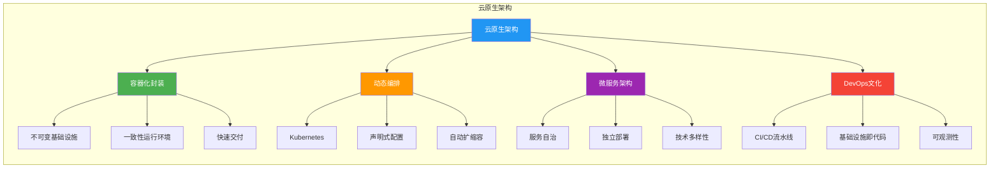

**第一个维度是容器化封装。** 容器技术（以Docker为代表）提供了一种轻量级的虚拟化方案，将应用程序及其所有依赖项打包在一起，确保应用在任何环境中都能以相同的方式运行。容器镜像的不可变性是云原生架构的基石之一，它消除了"在我的机器上可以运行"这类经典问题。与传统虚拟机相比，容器的启动时间从分钟级缩短到秒级，资源占用从GB级降低到MB级，这使得大规模微服务部署变得经济可行。

**第二个维度是动态编排。** Kubernetes作为事实上的容器编排标准，提供了自动化的部署、扩展和管理能力。它通过声明式的配置模型，让运维人员描述期望的系统状态，而非手动执行操作步骤。这种声明式管理极大地降低了大规模分布式系统的运维复杂度。Kubernetes的核心能力包括：自动调度（将容器分配到最优节点）、自愈能力（自动重启失败容器、替换不可用节点）、滚动更新（零停机部署新版本）和服务发现（通过DNS和负载均衡实现服务间通信）。

**第三个维度是微服务架构。** 将单体应用拆分为一组松耦合的服务，每个服务负责一个独立的业务功能。微服务可以独立开发、测试、部署和扩展，使得团队能够快速迭代和持续交付。微服务的核心价值在于组织层面的对齐——康威定律指出，系统设计受限于组织沟通结构，微服务架构天然地映射了团队的业务分工。

**第四个维度是DevOps文化。** 云原生强调开发和运维的深度融合，通过CI/CD流水线、基础设施即代码（IaC）、可观测性等实践，实现软件的快速、可靠交付。DevOps不仅仅是工具链的变革，更是组织文化的转变——它要求打破开发和运维之间的壁垒，建立共享责任和持续改进的工程文化。

### 云原生技术的演进时间线

| 时间 | 里程碑 | 意义 |
|------|--------|------|
| 2008 | Google发布Borg论文 | 容器编排的思想起源 |
| 2013 | Docker发布 | 容器技术标准化，降低了容器使用的门槛 |
| 2014 | Kubernetes开源 | 容器编排领域出现事实标准 |
| 2015 | CNCF成立 | 云原生生态有了统一的治理组织 |
| 2016 | Istio发布 | 服务网格概念落地 |
| 2017 | Knative发布 | Kubernetes原生无服务器平台 |
| 2018 | Envoy毕业为CNCF项目 | 云原生网络代理标准确立 |
| 2019 | eBPF兴起 | 内核级可编程网络能力成熟 |
| 2020 | WASM进入云原生 | 轻量级沙箱运行时补充容器方案 |
| 2022-2024 | AI/ML平台云原生化 | 大模型训练和推理的云原生编排 |

## 47.2 十二要素应用方法论

十二要素应用（Twelve-Factor App）是由Heroku联合创始人Adam Wiggins在2011年提出的一套方法论，用于构建软件即服务（SaaS）应用程序。这十二条原则已经成为云原生应用设计的黄金标准，下面逐一详细分析。

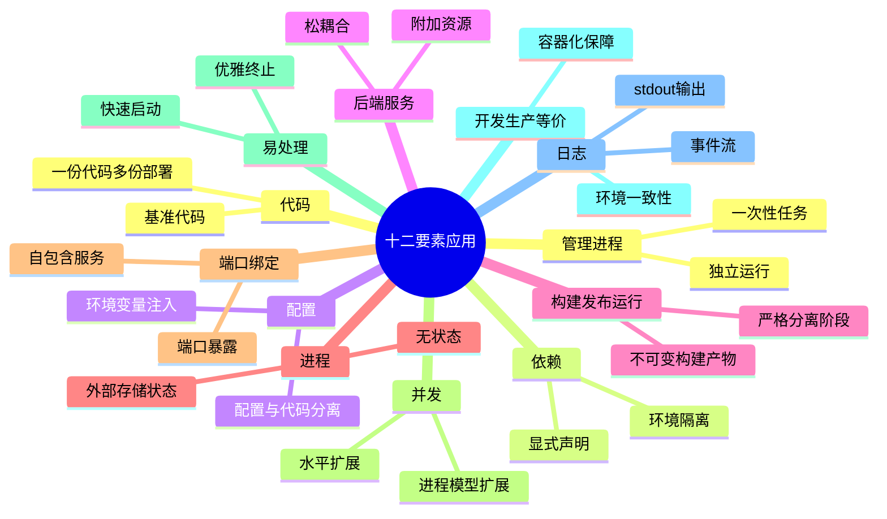

**要素一：基准代码（Codebase）**。一份基准代码，多份部署。这意味着一个应用应该对应一个代码仓库，但可以有多个部署实例（开发环境、测试环境、生产环境等）。不同环境之间的差异应该通过配置来管理，而非代码差异。

```python
# 项目结构示例
# myapp/
# ├── .git/
# ├── src/
# │   └── main.py
# ├── requirements.txt
# ├── Dockerfile
# ├── docker-compose.yml          # 开发环境
# ├── docker-compose.prod.yml     # 生产环境
# └── k8s/
#     ├── deployment.yaml
#     ├── service.yaml
#     └── configmap.yaml          # 不同环境的配置
```

**要素二：依赖（Dependencies）**。显式声明依赖关系。应用不应该隐式依赖系统级的包，而应该通过依赖清单（如requirements.txt、package.json、go.mod）完整声明所有依赖。在Python生态中，推荐使用virtualenv或poetry来隔离项目依赖。显式声明依赖的关键价值在于可重复构建——任何开发者在任何时间都能从零构建出完全一致的运行环境。

**要素三：配置（Config）**。在环境中存储配置。配置是指在部署之间可能变化的部分，如数据库连接字符串、第三方服务的API密钥、功能开关等。这些配置应该通过环境变量注入，而非硬编码在代码中。区分代码和配置的一个实用标准：如果同一份代码要部署到多个环境（开发、测试、生产），那么在不同环境之间变化的部分就是配置。

```python
import os

class Config:
    """从环境变量读取配置"""
    DATABASE_URL = os.environ.get('DATABASE_URL', 'sqlite:///default.db')
    REDIS_URL = os.environ.get('REDIS_URL', 'redis://localhost:6379')
    SECRET_KEY = os.environ.get('SECRET_KEY', 'dev-secret-key')
    LOG_LEVEL = os.environ.get('LOG_LEVEL', 'INFO')

    @classmethod
    def validate(cls):
        """验证必需的配置是否存在"""
        required = ['SECRET_KEY', 'DATABASE_URL']
        missing = [k for k in required if not getattr(cls, k)]
        if missing:
            raise ValueError(f"Missing required config: {missing}")
```

在Kubernetes环境中，配置通常通过ConfigMap和Secret来管理：

```yaml
apiVersion: v1
kind: ConfigMap
metadata:
  name: app-config
data:
  DATABASE_URL: "postgresql://user:***@db:5432/mydb"
  LOG_LEVEL: "info"
  CACHE_TTL: "300"
---
apiVersion: v1
kind: Secret
metadata:
  name: app-secrets
type: Opaque
data:
  API_KEY: YWJjZGVmZzEyMzQ1Ng==   # base64 encoded
  DB_PASSWORD: c2VjcmV0cGFzcw==
```

**要素四：后端服务（Backing Services）**。把后端服务当作附加资源。数据库、消息队列、邮件服务等后端服务应该通过URL等连接方式来访问，应用不应该区分本地服务和第三方服务。这使得服务之间的耦合度大大降低。例如，将数据库从自建MySQL迁移到云服务RDS，理论上只需要更改连接字符串，而不需要修改任何应用代码。

**要素五：构建，发布，运行（Build, Release, Run）**。严格分离构建和运行阶段。构建阶段将代码转换为可执行包，发布阶段将构建产物与环境配置结合，运行阶段在目标环境中启动应用。Docker的多阶段构建完美体现了这一原则：

```dockerfile
# 构建阶段
FROM golang:1.21-alpine AS builder
WORKDIR /app
COPY go.mod go.sum ./
RUN go mod download
COPY . .
RUN CGO_ENABLED=0 GOOS=linux go build -o /server ./cmd/server

# 运行阶段
FROM alpine:3.18
RUN apk --no-cache add ca-certificates
COPY --from=builder /server /server
EXPOSE 8080
ENTRYPOINT ["/server"]
```

这种分离的好处在于：构建阶段可以包含编译器、开发工具等大型依赖，而运行阶段只包含最小化的运行时环境，最终镜像体积通常可以缩小60%以上。

**要素六：进程（Processes）**。以一个或多个无状态进程运行应用。进程不应该在本地存储任何状态数据，所有状态都应该存储在后端服务中（如数据库、缓存）。这使得进程可以随时被替换和扩展。如果需要会话状态，应将其存储在Redis或Memcached等集中式缓存中。

**要素七：端口绑定（Port Binding）**。通过端口绑定提供服务。应用应该完全自包含，通过绑定端口来对外提供服务，而不是依赖外部的Web服务器。在容器化环境中，这意味着应用进程直接监听容器内的端口。这使得应用可以作为独立的服务部署，也可以嵌入到更复杂的部署架构中。

**要素八：并发（Concurrency）**。通过进程模型进行扩展。应用应该能够通过启动更多的进程实例来处理更多的请求，而非依赖单个进程内的线程。在容器编排环境中，可以通过水平扩展Pod的数量来实现并发处理。进程模型比线程模型更简单、更健壮——进程之间天然隔离，一个进程的崩溃不会影响其他进程。

**要素九：易处理（Disposability）**。快速启动和优雅终止。云原生应用应该能够在几秒内启动，同时在收到终止信号时能够优雅地关闭，完成正在处理的请求，释放所有资源。这一要素在容器编排环境中尤为重要——Kubernetes的滚动更新和Pod调度都依赖于进程的快速启停能力。

```python
import signal
import sys
import time
from flask import Flask

app = Flask(__name__)

# 全局状态：标记是否正在关闭
is_shutting_down = False

def graceful_shutdown(signum, frame):
    """优雅关闭处理"""
    global is_shutting_down
    print(f"Received signal {signum}, shutting down gracefully...")
    is_shutting_down = True

    # 1. 从负载均衡器摘除（通过就绪探针返回false）
    # 2. 等待正在处理的请求完成（给一个宽限期）
    deadline = time.time() + 30  # 最多等待30秒
    while time.time() < deadline and active_requests > 0:
        time.sleep(0.1)

    # 3. 关闭数据库连接池
    # db_pool.close()

    # 4. 关闭消息队列连接
    # mq_connection.close()

    print("Shutdown complete")
    sys.exit(0)

signal.signal(signal.SIGTERM, graceful_shutdown)
signal.signal(signal.SIGINT, graceful_shutdown)
```

**要素十：开发环境与线上等价（Dev/Prod Parity）**。尽可能保持开发、测试和生产环境的一致性。通过容器化技术，可以确保开发环境与生产环境使用相同的操作系统、运行时和依赖版本。理想的Dev/Prod Parity应该做到"三个一致"：使用相同的依赖版本、使用相同的服务后端、使用相同的操作系统和运行时。Docker Compose + Dockerfile的组合是实现环境一致性的最佳实践。

**要素十一：日志（Logs）**。把日志当作事件流。应用不应该负责日志的存储和路由，而应该将日志输出到标准输出（stdout）和标准错误（stderr），由运行环境来收集和处理日志。日志应该采用结构化格式（如JSON），便于后续的解析、搜索和分析。在Kubernetes环境中，Fluentd或Filebeat等日志收集器会自动从容器的标准输出收集日志并转发到集中式日志系统。

**要素十二：管理进程（Admin Processes）**。后台管理任务作为一次性进程运行。数据库迁移、定时任务等管理操作应该作为独立的一次性进程来执行，而不是作为应用的常驻功能。在Kubernetes中，可以使用Job和CronJob资源来运行这类任务。这确保了管理操作与应用运行的隔离，避免管理操作影响正常的服务流量。

## 47.3 微服务架构深度解析

微服务架构是云原生体系中最核心的架构模式之一。它将一个大型的应用系统拆分为多个小型的、自治的服务，每个服务围绕一个特定的业务能力构建，拥有自己的数据存储，可以独立部署和扩展。

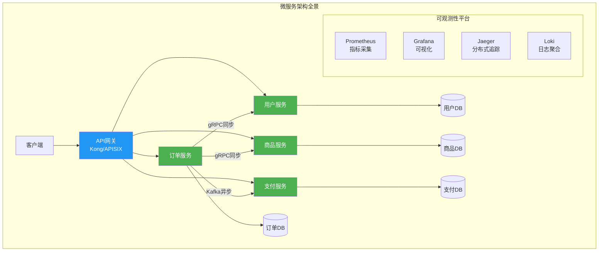

### 47.3.1 服务拆分原则

服务的拆分是微服务架构设计中最具挑战性的环节。拆分粒度过粗会导致服务之间的耦合度过高，失去微服务的优势；拆分粒度过细则会引入过多的网络通信开销和运维复杂度。

**单一职责原则**：每个服务应该只负责一个明确的业务能力。例如，在电商系统中，用户管理、商品管理、订单处理、支付处理应该各自作为独立的服务。判断服务边界是否合理的一个关键标准是：修改一个业务需求时，是否只需要修改一个服务。

**领域驱动设计（DDD）指导拆分**：DDD的限界上下文（Bounded Context）概念天然适合作为微服务的边界划分依据。每个限界上下文对应一个或少数几个微服务。限界上下文内部使用统一的语言（Ubiquitous Language），上下文之间通过明确的接口或事件进行通信。

```java
// 订单服务的领域模型
public class OrderService {
    private final OrderRepository orderRepository;
    private final InventoryClient inventoryClient;  // 远程调用库存服务
    private final PaymentClient paymentClient;      // 远程调用支付服务

    @Transactional
    public Order createOrder(CreateOrderCommand command) {
        // 1. 检查库存（跨服务调用）
        InventoryResult inventory = inventoryClient.checkAndReserve(
            command.getItems()
        );
        if (!inventory.isSuccess()) {
            throw new InsufficientInventoryException(inventory.getMessage());
        }

        // 2. 创建订单（本地事务）
        Order order = Order.create(
            command.getUserId(),
            command.getItems(),
            command.getShippingAddress()
        );
        orderRepository.save(order);

        // 3. 发起支付（异步事件）
        eventPublisher.publish(new OrderCreatedEvent(order.getId(),
            order.getTotalAmount()));

        return order;
    }
}
```

### 47.3.2 服务通信模式

微服务之间的通信模式主要分为同步通信和异步通信两大类。

| 特性 | REST/HTTP | gRPC | 消息队列（Kafka/RabbitMQ） |
|------|-----------|------|---------------------------|
| 协议 | HTTP/1.1或HTTP/2 | HTTP/2 | 自有协议 |
| 序列化 | JSON（文本） | Protocol Buffers（二进制） | 可配置 |
| 性能 | 中等 | 高（二进制序列化+多路复用） | 高（批量写入） |
| 类型安全 | 无（依赖文档） | 强（Proto文件定义） | 取决于序列化方式 |
| 流式支持 | 有限（SSE/WebSocket） | 原生双向流 | 天然异步 |
| 浏览器支持 | 原生支持 | 需要gRPC-Web代理 | 不适用 |
| 适用场景 | 外部API、浏览器通信 | 内部服务间高频调用 | 异步解耦、事件驱动 |
| 学习曲线 | 低 | 中等 | 中等 |
| 调试难度 | 低（curl即可测试） | 中等（需要专用工具） | 中等 |

**同步通信**：最常用的方式是HTTP/REST和gRPC。REST API简单直观，适合对外暴露接口；gRPC基于HTTP/2和Protocol Buffers，性能更高，适合内部服务之间的通信。

```protobuf
// order.proto
syntax = "proto3";

package order;

service OrderService {
    rpc CreateOrder(CreateOrderRequest) returns (CreateOrderResponse);
    rpc GetOrder(GetOrderRequest) returns (Order);
    rpc ListOrders(ListOrdersRequest) returns (stream Order);
}

message CreateOrderRequest {
    string user_id = 1;
    repeated OrderItem items = 2;
    Address shipping_address = 3;
}

message Order {
    string id = 1;
    string user_id = 2;
    repeated OrderItem items = 3;
    OrderStatus status = 4;
    int64 total_amount = 5;
    google.protobuf.Timestamp created_at = 6;
}

enum OrderStatus {
    CREATED = 0;
    PAID = 1;
    SHIPPED = 2;
    DELIVERED = 3;
    CANCELLED = 4;
}
```

**异步通信**：通过消息队列（如Kafka、RabbitMQ）实现服务之间的异步消息传递。异步通信能够提高系统的弹性和解耦度，但会增加系统的复杂度，需要处理消息的顺序、重复和丢失问题。

```java
// 使用Spring Cloud Stream发送事件
@Service
public class OrderEventPublisher {

    @Autowired
    private StreamBridge streamBridge;

    public void publishOrderCreated(Order order) {
        OrderCreatedEvent event = OrderCreatedEvent.builder()
            .orderId(order.getId())
            .userId(order.getUserId())
            .items(order.getItems())
            .totalAmount(order.getTotalAmount())
            .timestamp(Instant.now())
            .build();

        streamBridge.send("order-created-out-0", event);
    }
}
```

### 47.3.3 服务发现与负载均衡

在微服务架构中，服务实例的网络地址是动态变化的，因此需要服务发现机制来帮助服务之间相互定位。

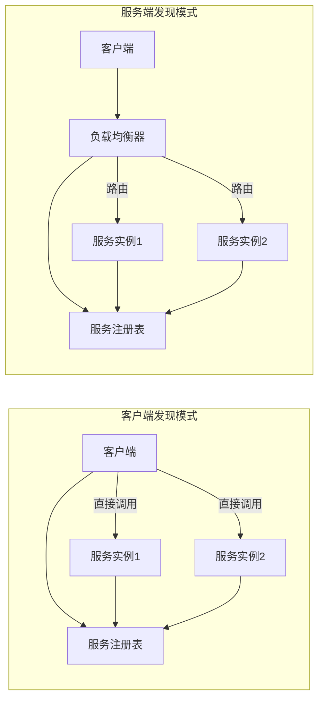

服务发现分为**客户端发现**和服务端发现两种模式：

- **客户端发现模式**：客户端直接查询服务注册表获取可用实例列表，然后自行选择一个实例进行调用。典型实现是Netflix Eureka + Ribbon。客户端发现的优势是减少了网络跳转，延迟更低；劣势是客户端需要承担负载均衡的逻辑，增加了客户端的复杂度。

- **服务端发现模式**：客户端通过负载均衡器发送请求，由负载均衡器查询服务注册表并路由请求。Kubernetes Service就是典型的服务端发现实现。服务端发现的优势是客户端逻辑简单；劣势是多了一层网络跳转，且负载均衡器可能成为瓶颈。

```yaml
# Kubernetes中的Service定义
apiVersion: v1
kind: Service
metadata:
  name: order-service
spec:
  selector:
    app: order-service
  ports:
    - port: 80
      targetPort: 8080
  type: ClusterIP
---
# Headless Service用于有状态服务
apiVersion: v1
kind: Service
metadata:
  name: order-service-headless
spec:
  clusterIP: None
  selector:
    app: order-service
  ports:
    - port: 8080
```

## 47.4 无服务器架构

无服务器架构（Serverless）是云原生架构的进一步演进，它将基础设施管理的责任完全交给云平台，开发者只需关注业务逻辑代码。无服务器并不意味着没有服务器，而是开发者不需要关心服务器的管理和维护。

### 47.4.1 FaaS与BaaS

无服务器架构包含两个核心概念：

**FaaS（Function as a Service）**：函数即服务，开发者编写单一功能的函数，由平台负责执行环境的创建、扩展和管理。典型的FaaS平台包括AWS Lambda、Azure Functions和Google Cloud Functions。

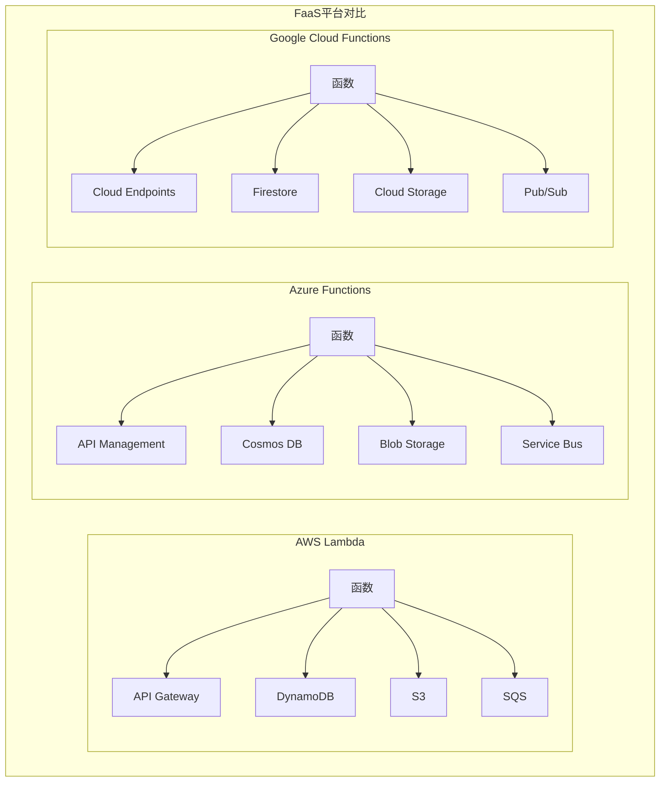

```python
# AWS Lambda函数示例
import json
import boto3
from datetime import datetime

dynamodb = boto3.resource('dynamodb')
table = dynamodb.Table('UserActivities')

def lambda_handler(event, context):
    """处理用户活动事件"""
    try:
        # 解析API Gateway传入的事件
        body = json.loads(event.get('body', '{}'))
        user_id = body.get('user_id')
        activity_type = body.get('activity_type')
        metadata = body.get('metadata', {})

        if not user_id or not activity_type:
            return {
                'statusCode': 400,
                'body': json.dumps({'error': 'Missing required fields'})
            }

        # 记录用户活动
        item = {
            'user_id': user_id,
            'timestamp': datetime.utcnow().isoformat(),
            'activity_type': activity_type,
            'metadata': metadata,
            'ttl': int(datetime.utcnow().timestamp()) + 90 * 86400  # 90天过期
        }
        table.put_item(Item=item)

        return {
            'statusCode': 200,
            'body': json.dumps({'message': 'Activity recorded', 'item': item})
        }
    except Exception as e:
        print(f"Error processing request: {str(e)}")
        return {
            'statusCode': 500,
            'body': json.dumps({'error': 'Internal server error'})
        }
```

**BaaS（Backend as a Service）**：后端即服务，提供现成的后端功能，如数据库（DynamoDB、Firebase）、认证（Cognito、Auth0）、存储（S3）等。开发者通过API直接使用这些服务，无需自行搭建和维护。BaaS的核心价值在于消除了后端基础设施的运维负担，让团队能够将全部精力投入到业务逻辑的实现中。

### 47.4.2 Knative平台

Knative是Google开源的Kubernetes原生无服务器平台，它提供了两个核心组件：

**Knative Serving**：负责请求驱动的计算，支持自动扩缩容（包括缩容到零）、流量分割和版本管理。Knative Serving的核心优势在于将Serverless的能力带入了Kubernetes生态，避免了供应商锁定。

```yaml
apiVersion: serving.knative.dev/v1
kind: Service
metadata:
  name: user-activity-tracker
spec:
  template:
    metadata:
      annotations:
        autoscaling.knative.dev/minScale: "0"
        autoscaling.knative.dev/maxScale: "100"
        autoscaling.knative.dev/target: "50"
    spec:
      containers:
        - image: gcr.io/my-project/user-activity:v1.2.0
          ports:
            - containerPort: 8080
          resources:
            requests:
              memory: "128Mi"
              cpu: "100m"
            limits:
              memory: "256Mi"
              cpu: "500m"
          env:
            - name: DATABASE_URL
              valueFrom:
                secretKeyRef:
                  name: db-credentials
                  key: url
  traffic:
    - revisionName: user-activity-tracker-v1
      percent: 90
    - revisionName: user-activity-tracker-v2
      percent: 10
```

**Knative Eventing**：负责事件驱动的计算，支持多种事件源（如Kafka、CronJob、API Server事件）和事件消费者，使用CloudEvents标准来规范化事件格式。

```yaml
apiVersion: sources.knative.dev/v1
kind: ApiServerSource
metadata:
  name: k8s-event-watcher
spec:
  serviceAccountName: event-watcher
  mode: Resource
  resources:
    - apiVersion: v1
      kind: Event
  sink:
    ref:
      apiVersion: serving.knative.dev/v1
      kind: Service
      name: event-processor
```

### 47.4.3 无服务器架构的适用场景与限制

无服务器架构特别适合以下场景：事件驱动的处理任务（如图片处理、文件转换）、API后端（特别是流量波动大的场景）、定时任务、数据管道和Webhook处理。

然而，无服务器架构也有明显的限制：

| 限制因素 | 具体表现 | 应对策略 |
|---------|---------|---------|
| 冷启动延迟 | 首次请求响应时间可能增加数百毫秒到数秒 | 使用Provisioned Concurrency、优化依赖包大小、选择轻量级运行时 |
| 执行时间上限 | AWS Lambda最长15分钟，Azure Functions最长10分钟 | 将长时间任务拆分为多个函数，使用Step Functions编排 |
| 资源限制 | 内存和CPU受限（Lambda最大10GB内存） | 选择合适的函数配置，必要时迁移到容器 |
| 供应商锁定 | 云平台特定的API和配置难以迁移 | 使用Knative等开源方案，抽象云平台特定代码 |
| 调试困难 | 分布式追踪和本地调试比传统应用更复杂 | 使用SAM Local或Functions Core Tools进行本地测试 |
| 成本不可预测 | 流量激增时成本可能急剧上升 | 设置并发限制和预算告警 |

## 47.5 服务网格与Istio

服务网格（Service Mesh）是处理微服务之间通信的专用基础设施层。随着微服务数量的增长，服务间通信的复杂性急剧增加，服务网格将这些横切关注点（如安全、可观测性、流量管理）从应用代码中抽离出来，下沉到基础设施层。

### 47.5.1 数据平面与控制平面

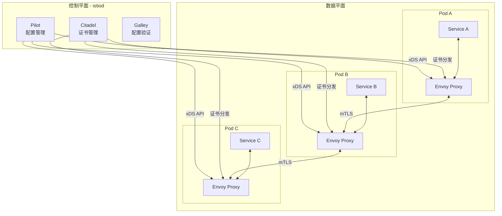

服务网格架构由两个平面组成：

**数据平面**：由一组智能代理（通常是Envoy）组成，这些代理以Sidecar的方式部署在每个服务实例旁边，拦截服务的所有进出网络流量。Envoy代理负责服务发现、负载均衡、熔断、限流、认证授权、可观测性数据收集等功能。Sidecar模式的优雅之处在于：对应用完全透明——应用代码不需要任何修改，就能获得流量管理、安全和可观测性能力。

**控制平面**：负责管理和配置数据平面的代理。在Istio中，控制平面的核心组件是istiod，它集成了Pilot（配置管理）、Citadel（证书管理）和Galley（配置验证）的功能。控制平面通过xDS协议向数据平面的Envoy代理推送配置变更，实现动态的流量管理。

### 47.5.2 Istio流量管理

Istio提供了强大的流量管理能力，通过VirtualService和DestinationRule两个核心资源来配置。

```yaml
# VirtualService：定义路由规则
apiVersion: networking.istio.io/v1beta1
kind: VirtualService
metadata:
  name: order-service-vs
spec:
  hosts:
    - order-service
  http:
    - match:
        - headers:
            x-user-type:
              exact: "premium"
      route:
        - destination:
            host: order-service
            subset: v2
          weight: 100
    - route:
        - destination:
            host: order-service
            subset: v1
          weight: 90
        - destination:
            host: order-service
            subset: v2
          weight: 10
      timeout: 10s
      retries:
        attempts: 3
        perTryTimeout: 3s
        retryOn: "5xx,reset,connect-failure"
---
# DestinationRule：定义子集和负载均衡策略
apiVersion: networking.istio.io/v1beta1
kind: DestinationRule
metadata:
  name: order-service-dr
spec:
  host: order-service
  trafficPolicy:
    connectionPool:
      tcp:
        maxConnections: 100
      http:
        h2UpgradePolicy: DEFAULT
        http1MaxPendingRequests: 100
        http2MaxRequests: 1000
    outlierDetection:
      consecutive5xxErrors: 5
      interval: 30s
      baseEjectionTime: 30s
      maxEjectionPercent: 50
  subsets:
    - name: v1
      labels:
        version: v1
    - name: v2
      labels:
        version: v2
```

### 47.5.3 服务网格的可观测性

服务网格的一大优势是提供统一的可观测性。Envoy代理自动收集所有服务间通信的指标（metrics）、追踪（traces）和日志（logs），无需在应用代码中添加任何可观测性相关的代码。

```yaml
# Kiali用于可视化服务拓扑
apiVersion: kiali.io/v1alpha1
kind: Kiali
metadata:
  name: kiali
  namespace: istio-system
spec:
  auth:
    strategy: token
  deployment:
    accessible_namespaces:
      - "**"
  external_services:
    prometheus:
      url: "http://prometheus:9090"
    grafana:
      url: "http://grafana:3000"
    tracing:
      url: "http://jaeger-query:16686"
```

## 47.6 事件驱动架构与CQRS

事件驱动架构（Event-Driven Architecture，EDA）是一种以事件的产生、检测和消费为核心的软件设计范式。事件代表系统中发生的状态变化，如"订单已创建"、"支付已完成"等。

### 47.6.1 CQRS模式

命令查询职责分离（Command Query Responsibility Segregation，CQRS）将系统的读操作和写操作分离到不同的模型中。写模型负责处理命令（增删改），读模型负责处理查询。两个模型可以使用不同的数据存储和优化策略。

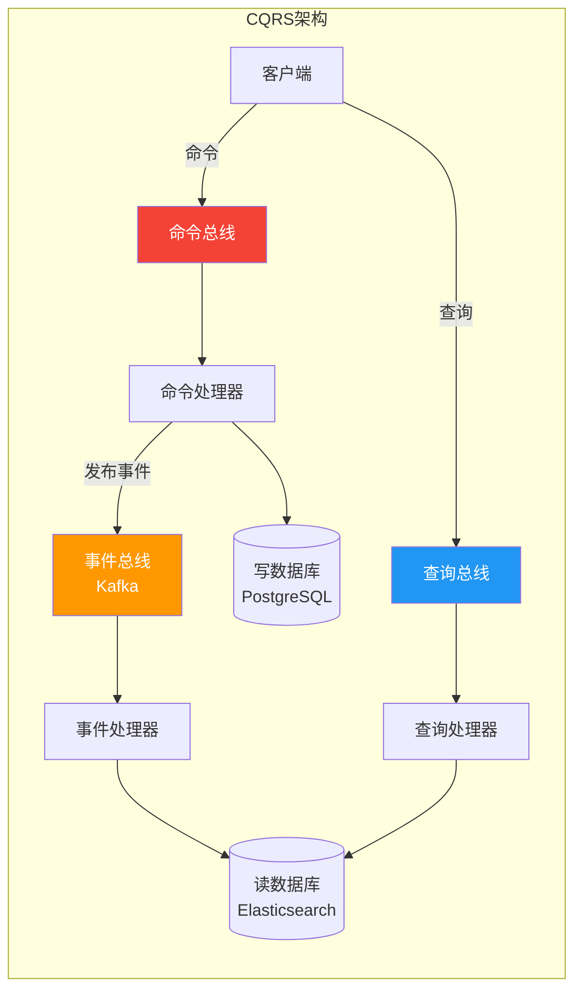

```java
// CQRS架构示例

// 命令端 - 写模型
public class CreateOrderCommandHandler {
    private final OrderWriteRepository writeRepo;
    private final EventStore eventStore;

    @Transactional
    public OrderId handle(CreateOrderCommand cmd) {
        Order order = Order.create(cmd);
        writeRepo.save(order);

        // 保存领域事件
        DomainEvent event = new OrderCreatedEvent(
            order.getId(),
            order.getUserId(),
            order.getItems(),
            order.getTotalAmount()
        );
        eventStore.append(event);

        return order.getId();
    }
}

// 查询端 - 读模型（专门为查询优化）
@Service
public class OrderQueryService {
    private final OrderReadModelRepository readRepo;

    public OrderView getOrderDetail(String orderId) {
        return readRepo.findById(orderId)
            .orElseThrow(() -> new OrderNotFoundException(orderId));
    }

    public Page<OrderSummary> searchOrders(OrderSearchCriteria criteria, Pageable pageable) {
        return readRepo.search(criteria, pageable);
    }
}

// 事件处理器 - 同步读模型
@EventHandler
public class OrderEventHandler {
    private final OrderReadModelRepository readRepo;

    public void on(OrderCreatedEvent event) {
        OrderView view = new OrderView();
        view.setId(event.getOrderId());
        view.setUserId(event.getUserId());
        view.setItems(event.getItems());
        view.setStatus("CREATED");
        view.setCreatedAt(event.getTimestamp());
        readRepo.save(view);
    }

    public void on(OrderPaidEvent event) {
        OrderView view = readRepo.findById(event.getOrderId())
            .orElseThrow();
        view.setStatus("PAID");
        view.setPaidAt(event.getTimestamp());
        readRepo.save(view);
    }
}
```

### 47.6.2 Event Sourcing

Event Sourcing（事件溯源）是一种持久化策略，它不存储实体的当前状态，而是存储导致状态变化的所有事件。实体的当前状态可以通过回放所有历史事件来重建。

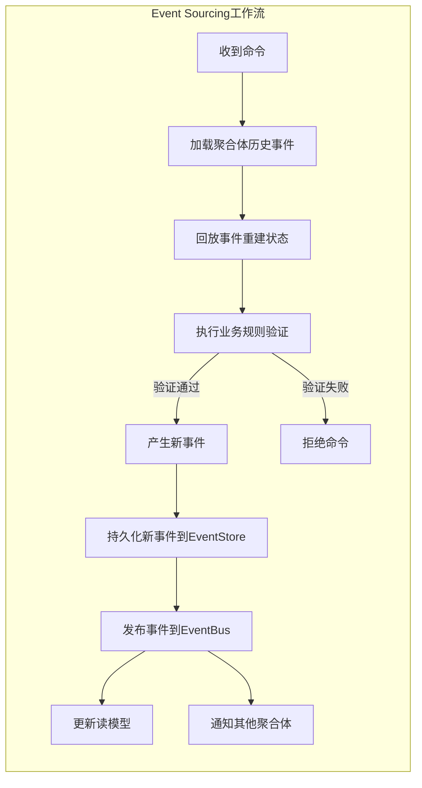

```java
// Event Sourcing实现
public class EventStore {
    private final JdbcTemplate jdbc;

    public void append(DomainEvent event) {
        jdbc.update(
            "INSERT INTO events (aggregate_id, aggregate_type, event_type, event_data, version) VALUES (?, ?, ?, ?, ?)",
            event.getAggregateId(),
            event.getAggregateType(),
            event.getEventType(),
            serialize(event),
            event.getVersion()
        );
    }

    public List<DomainEvent> getEvents(String aggregateId) {
        return jdbc.query(
            "SELECT * FROM events WHERE aggregate_id = ? ORDER BY version",
            this::mapEvent,
            aggregateId
        );
    }

    public Order rebuildOrder(String orderId) {
        List<DomainEvent> events = getEvents(orderId);
        Order order = new Order();
        events.forEach(order::apply);
        return order;
    }
}
```

Event Sourcing的关键优势在于完整的审计追踪——每个状态变化都有记录，支持时间旅行（回溯到任意历史时刻的状态）。但随着事件数量增长，回放性能会下降，实践中通常需要引入快照（Snapshot）机制来优化。

## 47.7 API优先设计

API优先（API-First）设计理念强调在编写任何实现代码之前，首先设计和定义API接口。API被视为产品的核心接口，而非开发过程中的副产品。

### 47.7.1 OpenAPI规范

OpenAPI（原Swagger）是描述RESTful API的标准规范。使用OpenAPI规范定义API后，可以自动生成文档、客户端SDK和服务器端代码框架。

```yaml
openapi: 3.0.3
info:
  title: 订单服务API
  version: 1.0.0
  description: 电商系统订单管理服务
paths:
  /api/v1/orders:
    post:
      summary: 创建订单
      operationId: createOrder
      tags:
        - orders
      requestBody:
        required: true
        content:
          application/json:
            schema:
              $ref: '#/components/schemas/CreateOrderRequest'
      responses:
        '201':
          description: 订单创建成功
          content:
            application/json:
              schema:
                $ref: '#/components/schemas/Order'
        '400':
          description: 请求参数错误
          content:
            application/json:
              schema:
                $ref: '#/components/schemas/ErrorResponse'
components:
  schemas:
    CreateOrderRequest:
      type: object
      required:
        - userId
        - items
      properties:
        userId:
          type: string
          format: uuid
        items:
          type: array
          items:
            $ref: '#/components/schemas/OrderItem'
        shippingAddress:
          $ref: '#/components/schemas/Address'
    Order:
      type: object
      properties:
        id:
          type: string
          format: uuid
        status:
          type: string
          enum: [CREATED, PAID, SHIPPED, DELIVERED, CANCELLED]
        totalAmount:
          type: integer
          description: 订单总金额（单位：分）
```

### 47.7.2 API版本管理

API版本管理是API设计中的重要话题。常见的版本管理策略包括：

| 策略 | 示例 | 优点 | 缺点 |
|------|------|------|------|
| URL路径版本 | `/api/v1/orders` | 直观、易于路由和缓存、最广泛采用 | URL会变、可能导致URL膨胀 |
| Header版本 | `Accept: application/vnd.myapi.v1+json` | URL不变、更RESTful | 调试不便、缓存复杂 |
| 查询参数版本 | `/api/orders?version=1` | 灵活、不改变路径 | 不够规范、容易被忽略 |
| 内容协商版本 | `Content-Type: application/vnd.myapi.v1+json` | 符合HTTP规范 | 实现复杂、工具支持差 |

推荐使用URL路径版本，因为它简单明确，便于路由和缓存管理。无论选择哪种策略，关键原则是：**向后兼容优先**——可以添加新字段，但不能删除或修改已有字段的语义。同时，为废弃的API版本制定清晰的淘汰时间表，给消费者充足的迁移窗口。

## 47.8 CNCF全景图

CNCF（Cloud Native Computing Foundation）维护的全景图（Landscape）涵盖了云原生技术生态中的所有关键项目。理解CNCF全景图有助于在技术选型时做出合理的决策，避免重复造轮子。

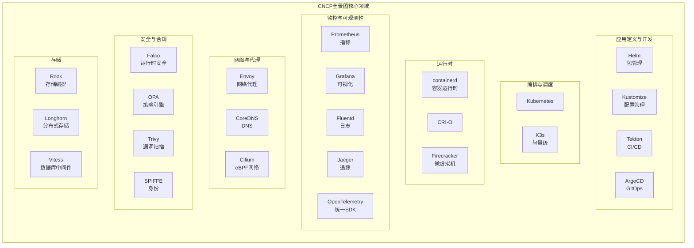

主要类别及其代表项目：

| 领域 | 代表项目 | 核心能力 |
|------|---------|---------|
| 容器运行时 | containerd、CRI-O | 容器生命周期管理 |
| 容器编排 | Kubernetes、K3s | 自动化部署、扩展和管理 |
| 服务网格 | Istio、Linkerd、Cilium | 服务间通信管理 |
| 服务发现 | CoreDNS、etcd | 服务定位和配置存储 |
| 配置管理 | Helm、Kustomize | 应用打包和配置管理 |
| CI/CD | Tekton、ArgoCD、Flux | 持续集成和GitOps部署 |
| 监控 | Prometheus、Grafana | 指标采集和可视化 |
| 日志 | Fluentd、Loki | 日志收集和查询 |
| 追踪 | Jaeger、Zipkin | 分布式追踪 |
| 存储 | Rook、Longhorn | 分布式存储编排 |
| 安全 | Falco、OPA、Trivy | 运行时安全、策略管控、漏洞扫描 |

云原生技术生态发展迅速，持续关注CNCF毕业项目和孵化项目的状态变化，是保持技术敏锐度的重要方式。


---

# 云原生架构的核心技巧

## 47.1 微服务拆分的实用策略

在实际项目中进行微服务拆分时，许多团队会陷入过度拆分或拆分不当的困境。以下是一些经过实践验证的拆分技巧。

### 47.1.1 从单体开始，逐步拆分

对于大多数新项目，建议从一个结构良好的单体应用开始，而非一开始就采用微服务架构。当单体应用的某些部分表现出独立扩展、独立部署或独立团队维护的需求时，再将这些部分拆分为独立的服务。

这种策略被称为"单体优先"（Monolith First），由Martin Fowler提出。过早引入微服务架构会增加不必要的复杂性，尤其是在团队规模较小、业务边界尚不清晰的早期阶段。正确的做法是随着业务的发展和团队规模的增长，逐步识别和拆分服务边界。

### 47.1.2 使用领域事件识别服务边界

领域事件是识别服务边界的有力工具。当两个业务操作之间存在明显的领域事件时，这两个操作往往属于不同的服务。例如，"订单创建"和"库存扣减"之间存在"订单已创建"这个领域事件，暗示订单管理和库存管理应该是两个独立的服务。

在实践中，可以通过事件风暴（Event Storming）工作坊来发现领域事件。邀请业务专家和开发人员一起，使用便利贴在白板上标注业务流程中的所有事件，然后根据事件的聚合关系来划分服务边界。

### 47.1.3 数据库拆分策略

微服务架构要求每个服务拥有自己的数据库，这是实现服务自治的关键。但在实际操作中，数据库的拆分往往是最困难的步骤。推荐采用以下策略：

首先，在单体阶段就为未来的拆分做准备：为每个业务模块建立独立的数据表前缀，避免跨模块的直接表关联，使用API而非直接SQL来访问其他模块的数据。

然后，在拆分时，先从数据依赖最少的模块开始，使用数据同步机制（如CDC）来保持拆分过程中的数据一致性，逐步将相关的数据表迁移到新的数据库中。

## 47.2 服务通信的最佳实践

### 47.2.1 选择合适的通信协议

服务间通信协议的选择应该基于具体场景：

- 对于**外部API和浏览器端通信**，优先选择REST/JSON，因为它简单、通用且易于调试
- 对于**内部服务间的高频通信**，优先选择gRPC，因为它基于HTTP/2，支持双向流和多路复用，序列化效率高
- 对于**需要异步解耦的场景**，使用消息队列（如Kafka、RabbitMQ）实现事件驱动通信
- 对于**实时双向通信**场景（如聊天、协作编辑），使用WebSocket

### 47.2.2 超时与重试策略

分布式系统中的网络调用必须设置合理的超时和重试策略。超时时间应该基于P99延迟来设定，而非平均延迟。重试应该采用指数退避算法，并添加随机抖动以避免重试风暴。

```java
// 使用Resilience4j实现断路器和重试
@Configuration
public class ResilienceConfig {

    @Bean
    public CircuitBreaker orderServiceCircuitBreaker() {
        CircuitBreakerConfig config = CircuitBreakerConfig.custom()
            .failureRateThreshold(50)
            .waitDurationInOpenState(Duration.ofSeconds(30))
            .slidingWindowSize(10)
            .minimumNumberOfCalls(5)
            .permittedNumberOfCallsInHalfOpenState(3)
            .build();
        return CircuitBreaker.of("orderService", config);
    }

    @Bean
    public Retry orderServiceRetry() {
        RetryConfig config = RetryConfig.custom()
            .maxAttempts(3)
            .waitDuration(Duration.ofMillis(500))
            .intervalFunction(IntervalFunction.ofExponentialBackoff(100, 2))
            .retryExceptions(FeignException.ServiceUnavailable.class)
            .ignoreExceptions(FeignException.BadRequest.class)
            .build();
        return Retry.of("orderService", config);
    }
}
```

### 47.2.3 请求合并与批处理

对于需要频繁调用其他服务获取数据的场景，应该使用请求合并（Request Collapsing）或批处理来减少网络调用次数。DataLoader模式是解决N+1查询问题的有效方案。

```javascript
// GraphQL DataLoader实现
const DataLoader = require('dataloader');

const userLoader = new DataLoader(async (userIds) => {
    // 一次性查询所有用户
    const users = await userService.findByIds(userIds);
    const userMap = new Map(users.map(u => [u.id, u]));
    // 按照请求顺序返回结果
    return userIds.map(id => userMap.get(id) || null);
});

// 在解析器中使用
const resolvers = {
    Order: {
        user: (order) => userLoader.load(order.userId)
    }
};
```

## 47.3 无服务器架构的优化技巧

### 47.3.1 冷启动优化

冷启动是FaaS平台的主要性能瓶颈之一。优化冷启动的策略包括：使用轻量级的运行时（如Node.js或Go比Java更快启动）；减少依赖包的大小；使用Provisioned Concurrency预热函数实例；将初始化逻辑移到函数外部（如全局变量或连接池）。

```python
# Lambda冷启动优化示例
import boto3
import os

# 在函数外部初始化，利用执行上下文复用
dynamodb = boto3.resource('dynamodb')
table = dynamodb.Table(os.environ['TABLE_NAME'])

# 预热数据库连接
connection_pool = create_connection_pool(os.environ['DATABASE_URL'])

def lambda_handler(event, context):
    # 函数执行时直接使用已初始化的资源
    item = table.get_item(Key={'id': event['id']})
    return {'statusCode': 200, 'body': item.get('Item')}
```

### 47.3.2 函数编排

对于复杂的业务流程，单个Lambda函数往往无法满足需求。AWS Step Functions和Knative Eventing提供了函数编排能力，可以将多个函数组合成一个完整的工作流。

```json
{
  "Comment": "订单处理工作流",
  "StartAt": "ValidateOrder",
  "States": {
    "ValidateOrder": {
      "Type": "Task",
      "Resource": "arn:aws:lambda:us-east-1:123456789:function:validate-order",
      "Next": "CheckInventory",
      "Catch": [{"ErrorEquals": ["States.ALL"], "Next": "HandleError"}]
    },
    "CheckInventory": {
      "Type": "Task",
      "Resource": "arn:aws:lambda:us-east-1:123456789:function:check-inventory",
      "Next": "IsInStock"
    },
    "IsInStock": {
      "Type": "Choice",
      "Choices": [
        {"Variable": "$.inStock", "BooleanEquals": true, "Next": "ProcessPayment"},
        {"Variable": "$.inStock", "BooleanEquals": false, "Next": "BackorderItem"}
      ]
    },
    "ProcessPayment": {
      "Type": "Task",
      "Resource": "arn:aws:lambda:us-east-1:123456789:function:process-payment",
      "Next": "CompleteOrder"
    },
    "CompleteOrder": {
      "Type": "Task",
      "Resource": "arn:aws:lambda:us-east-1:123456789:function:complete-order",
      "End": true
    }
  }
}
```

## 47.4 服务网格配置技巧

### 47.4.1 渐进式流量切换

使用Istio的流量分割能力可以实现金丝雀发布和蓝绿部署。建议从少量流量（如5%）开始，逐步增加新版本的流量比例，同时密切监控关键指标（错误率、延迟、业务转化率）。典型的金丝雀发布流程：

1. 部署新版本，初始流量分配为0%
2. 将5%流量切换到新版本，观察5-10分钟
3. 如果核心指标无异常，逐步提升到25% → 50% → 100%
4. 如果任何指标出现异常，立即回滚到旧版本

### 47.4.2 故障注入测试

通过Istio的故障注入功能，可以在不修改应用代码的情况下模拟各种故障场景，验证系统的容错能力。这对于混沌工程实践非常有价值。

```yaml
apiVersion: networking.istio.io/v1beta1
kind: VirtualService
metadata:
  name: order-service-fault-injection
spec:
  hosts:
    - order-service
  http:
    - fault:
        delay:
          percentage:
            value: 10
          fixedDelay: 5s
        abort:
          percentage:
            value: 5
          httpStatus: 503
      route:
        - destination:
            host: order-service
```

## 47.5 API设计的工程实践

### 47.5.1 API网关模式

API网关是微服务架构的入口点，负责请求路由、认证授权、限流、协议转换等横切关注点。常见的API网关包括Kong、APISIX和Envoy Gateway。

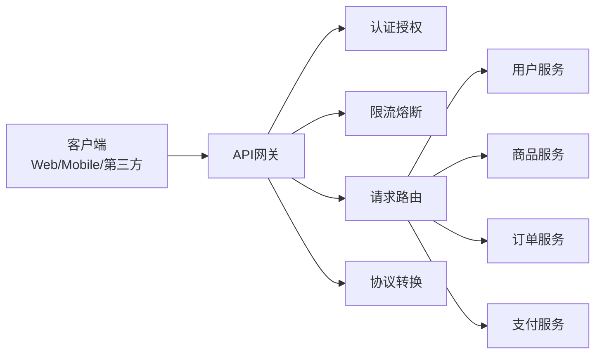

选择API网关时的考量因素：
- **Kong**：基于Nginx/OpenResty，插件生态丰富，适合需要大量定制化功能的场景
- **APISIX**：基于Nginx/OpenResty，国产开源项目，性能优异，适合国内技术栈
- **Envoy Gateway**：基于Envoy，与Istio深度集成，适合已采用服务网格的架构

### 47.5.2 API文档自动生成

使用OpenAPI规范定义API后，可以通过Swagger UI或Redoc自动生成交互式API文档，供前端开发人员和第三方开发者使用。将API文档的生成集成到CI/CD流水线中，确保文档与代码保持同步。

### 47.5.3 API契约测试

使用Pact等契约测试工具，确保服务提供方和消费方之间的API契约不被破坏。当提供方修改API时，契约测试能够自动检测到对消费方的影响。契约测试的核心理念是"消费者驱动"——由API的消费者定义期望的交互行为，提供方负责满足这些期望。

## 47.6 可观测性最佳实践

云原生应用的可观测性依赖于三大支柱：指标（Metrics）、日志（Logs）和追踪（Traces）。

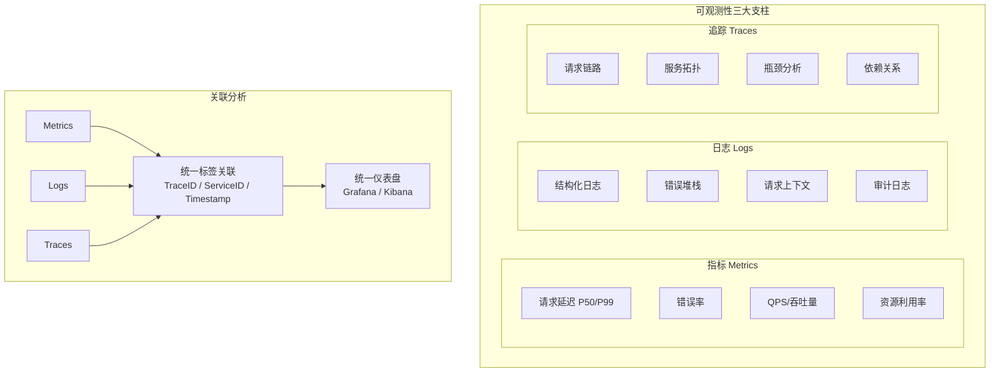

在实践中，应该遵循以下原则：

使用OpenTelemetry作为统一的可观测性框架，它提供了标准化的API和SDK，支持指标、日志和追踪的采集。将可观测性代码与业务逻辑解耦，通过Sidecar代理或OpenTelemetry自动注入来实现零代码侵入。建立统一的标签体系（如服务名、环境、版本），确保不同来源的遥测数据可以关联分析。

设置合理的告警规则，避免告警风暴。推荐使用多级告警策略：P0级告警（系统不可用）立即通知，P1级告警（性能下降）5分钟内通知，P2级告警（异常增多）每日汇总。


---

# 云原生架构实战案例

## 47.1 电商平台的微服务化改造

某大型电商平台原有单体应用随着业务增长已变得难以维护，每次发布都需要数小时的停机时间，且开发团队之间经常出现代码冲突。该平台决定进行微服务化改造。

### 47.1.1 架构设计

改造后的系统采用以下微服务划分：用户服务负责用户注册、登录、个人信息管理；商品服务负责商品信息、类目、库存管理；订单服务负责订单创建、状态流转、退款处理；支付服务负责支付渠道对接、支付状态管理；搜索服务负责商品搜索、推荐；通知服务负责短信、邮件、推送通知。

服务间通信采用混合模式：用户查询、商品查询等同步场景使用gRPC；订单创建后的库存扣减、支付通知等场景使用Kafka实现异步通信。所有外部请求通过API网关（Kong）进入，网关负责认证、限流和请求路由。

### 47.1.2 数据库拆分

数据库拆分是本次改造的最大挑战。原有单体应用使用一个大型MySQL数据库，包含500多张表，表之间存在大量外键关联。改造采用以下策略：

第一阶段：在应用层引入Repository模式，将数据库访问封装在各业务模块内部，消除跨模块的直接SQL调用。第二阶段：使用Canal监听MySQL的binlog，将数据变更实时同步到各服务的独立数据库中。第三阶段：逐步将读流量切换到新数据库，验证数据一致性后，再切换写流量。

### 47.1.3 服务网格部署

该平台使用Istio作为服务网格，主要利用了以下能力：通过VirtualService实现订单服务的金丝雀发布，新版本先接收5%的流量；通过DestinationRule配置连接池和熔断策略，防止级联故障；通过PeerAuthentication强制服务间的mTLS加密通信；通过Kiali和Jaeger实现服务拓扑可视化和分布式追踪。

### 47.1.4 改造成果

改造完成后，系统的部署频率从每月一次提升到每天数十次；单个服务的部署时间从数小时降低到分钟级别；系统整体可用性从99.5%提升到99.95%；开发团队可以独立迭代各自负责的服务，大幅提高了开发效率。

## 47.2 金融系统的事件驱动架构

某金融科技公司构建了一套基于事件驱动架构的实时风控系统，用于检测和防范欺诈交易。

### 47.2.1 系统架构

系统的核心组件包括：交易事件采集服务，从各个支付渠道收集交易事件并发布到Kafka；规则引擎服务，消费交易事件并执行风控规则；机器学习服务，对交易进行实时评分；告警服务，当检测到可疑交易时通知风控人员；审计服务，记录所有交易的完整历史。

采用CQRS模式将风控的读写操作分离。写端处理交易事件的接收和规则执行，读端提供风控报告和历史查询。两个端使用不同的数据存储：写端使用Kafka Streams维护实时状态，读端使用Elasticsearch存储历史数据用于分析查询。

### 47.2.2 事件设计

所有事件遵循CloudEvents规范，使用Avro进行序列化以获得更好的性能和schema演进能力。

```json
{
  "specversion": "1.0",
  "type": "com.fintech.transaction.created",
  "source": "/payment-gateway/alipay",
  "id": "txn-20240115-001",
  "time": "2024-01-15T10:30:00Z",
  "datacontenttype": "application/avro",
  "data": {
    "transaction_id": "txn-20240115-001",
    "user_id": "usr-12345",
    "amount": 9999,
    "currency": "CNY",
    "merchant_id": "mch-67890",
    "payment_method": "ALIPAY",
    "ip_address": "116.228.xxx.xxx",
    "device_fingerprint": "abc123def456"
  }
}
```

### 47.2.3 实施效果

该系统上线后，欺诈交易的检测率从原来的65%提升到92%，误报率从15%降低到3%。系统的处理延迟平均为200毫秒，P99延迟不超过500毫秒，完全满足实时风控的要求。每天处理的交易事件超过1亿条，系统稳定运行无故障。

## 47.3 SaaS平台的无服务器架构实践

某SaaS创业公司使用无服务器架构构建了其核心产品，大幅降低了初期的基础设施成本和运维负担。

### 47.3.1 技术选型

该平台使用AWS Lambda作为计算层，API Gateway作为API入口，DynamoDB作为主数据库，S3作为文件存储，SQS作为消息队列，CloudWatch作为监控工具。前端使用React构建SPA，通过CloudFront进行CDN加速。

### 47.3.2 多租户架构

多租户设计是SaaS平台的核心挑战。该平台采用共享数据库、共享表的模式，通过tenant_id字段进行数据隔离。每个API请求在认证阶段提取租户信息，注入到Lambda函数的执行上下文中，确保数据访问的隔离性。

```python
# 多租户中间件
def tenant_middleware(handler):
    def wrapper(event, context):
        # 从JWT中提取租户ID
        token = event['headers'].get('Authorization', '').replace('Bearer ', '')
        claims = verify_jwt(token)
        tenant_id = claims['tenant_id']

        # 注入租户上下文
        context.tenant_id = tenant_id

        # 所有DynamoDB查询自动添加租户过滤
        return handler(event, context)
    return wrapper
```

### 47.3.3 成本优化

在无服务器架构下，成本优化的关键是减少函数调用次数和执行时间。该平台采用了以下策略：使用CloudFront缓存静态资源和频繁查询的API响应；对DynamoDB使用按需容量模式，避免预留容量的浪费；将批处理任务从Lambda迁移到Fargate，因为长时间运行的任务在Lambda上成本较高。


---

# 云原生架构的常见误区

## 误区一：微服务越小越好

许多团队在采用微服务架构时，错误地认为服务拆分得越细越好。他们将一个简单的CRUD操作拆分成多个微服务，导致系统中充斥着大量只包含几行代码的服务。

过度拆分带来的问题远大于其解决的问题。首先，每个微服务都需要独立的部署流水线、监控告警和运维支持，过多的服务会大幅增加运维成本。其次，服务之间的网络通信会引入延迟和失败的可能，服务数量越多，系统整体的可靠性越低。最后，分布式事务的处理在微服务架构中本已困难，过度拆分会使得跨服务的业务操作几乎无法保证一致性。

正确的做法是根据业务边界和团队结构来拆分服务。如果一个服务可以由一个小团队（5-8人）完全掌握，并且拥有独立的业务生命周期，那么它就是一个合理的服务边界。不要为了拆分而拆分，保持适度的粒度。

## 误区二：无服务器等于零运维

无服务器架构虽然免去了服务器管理的工作，但并不意味着完全没有运维负担。使用无服务器架构后，团队仍然需要关注以下运维问题：函数的冷启动性能优化、并发限制的配置和监控、IAM权限的精细化管理、日志和监控的配置、依赖项的安全漏洞扫描、成本的监控和优化。

实际上，无服务器架构将运维的复杂性从基础设施层转移到了应用层和配置层。团队需要学习新的运维范式，掌握云平台的特定工具和服务。对于缺乏云平台经验的团队，无服务器架构的运维学习曲线可能比传统架构更陡峭。

## 误区三：服务网格是万能的

服务网格确实解决了微服务通信中的许多问题，但它也有明显的代价。首先，服务网格引入了额外的网络跳转（每个请求都需要经过Sidecar代理），增加了约1-3毫秒的延迟。其次，Sidecar代理会消耗额外的CPU和内存资源，对于大规模集群，这些资源开销可能相当可观。最后，服务网格的学习曲线较陡，配置复杂度高，需要专门的团队来维护。

是否需要服务网格应该基于实际需求来判断。如果系统中只有少量服务，或者服务间通信模式简单，引入服务网格可能得不偿失。服务网格更适合拥有大量微服务、需要复杂的流量管理策略和严格的安全要求的大型系统。

## 误区四：CQRS适用于所有场景

CQRS模式为读写操作分别优化了数据模型，在高并发读写场景下表现出色。然而，并非所有系统都适合采用CQRS。对于简单的CRUD应用，CQRS引入的复杂性远超其带来的收益。维护两套数据模型和同步机制的成本很高，而且事件处理器的故障可能导致读写模型之间的数据不一致。

CQRS最适合以下场景：读写操作的性能特征差异明显（如读多写少）；需要为不同场景提供不同的数据视图；读写操作由不同的团队负责；系统已经采用了事件驱动架构。

## 误区五：API版本管理可以忽视

许多团队在设计API时忽视了版本管理的重要性，认为可以在需要时再添加。然而，一旦API被外部消费者使用，修改API就会变得非常困难。没有版本管理的API在演进时只能采用两种不理想的策略：要么破坏现有消费者的兼容性，要么永远不能修改已发布的API。

正确的做法是从一开始就建立API版本管理策略。推荐使用URL路径版本（如/api/v1/users），因为它直观且易于理解。同时，制定清晰的API废弃策略，给消费者充足的迁移时间。在API变更时，遵循向后兼容原则：可以添加新字段，但不能删除或修改已有字段的语义。

## 误区六：忽略分布式追踪

在微服务架构中，一个用户请求可能经过多个服务的处理。如果没有分布式追踪，当出现问题时，定位故障的根源将变得极其困难。许多团队在系统初期忽视分布式追踪的建设，等到系统规模扩大后再补充，此时往往需要修改大量服务的代码。

分布式追踪应该在微服务架构建设的初期就引入。使用OpenTelemetry等标准化框架，通过自动注入的方式添加追踪代码，可以最小化对业务代码的影响。建立统一的Trace ID传播机制，确保跨服务的请求链路可以完整追踪。

## 误区七：过度依赖同步调用

微服务架构中，许多开发者习惯性地使用同步HTTP调用来实现服务间的交互。在简单的场景下，同步调用确实简单直接。但当业务流程涉及多个服务时，同步调用会导致严重的耦合和可用性问题。

假设一个订单创建流程需要依次调用库存服务、支付服务和通知服务，使用同步调用意味着整个流程的延迟等于所有服务延迟之和，且任何一个服务的故障都会导致整个流程失败。正确的做法是将非关键路径的操作改为异步处理，例如将通知服务的调用改为消息队列的异步消费。


---

# 云原生架构的练习方法

## 练习一：搭建微服务项目骨架

**目标**：通过实践理解微服务架构的基本组成和开发流程。

**步骤**：选择一个熟悉的业务场景（如在线书店），将其拆分为3-5个微服务（用户服务、商品服务、订单服务、支付服务）。使用Spring Boot或Go框架为每个服务创建独立的项目，定义服务间的REST API或gRPC接口。使用Docker Compose在本地搭建完整的服务集群，配置服务发现和API网关。编写简单的集成测试，验证服务间的调用链路。

**进阶挑战**：引入配置中心（如Nacos）管理各服务的配置；实现服务间的断路器和重试机制；添加分布式追踪（如Jaeger）来可视化请求链路。

## 练习二：实现事件驱动架构

**目标**：理解事件驱动架构的工作原理和实现方式。

**步骤**：搭建Kafka或RabbitMQ消息中间件环境。设计一个简单的电商场景的领域事件（如OrderCreated、PaymentCompleted、ShipmentDispatched）。实现事件的发布者和消费者，使用JSON或Avro格式序列化事件。实现Event Sourcing模式，将事件存储在EventStore中，并能够通过回放事件重建实体状态。实现CQRS模式，将读写模型分离，通过事件处理器同步读模型。

**进阶挑战**：实现事件的幂等消费；处理事件的乱序和重复；实现快照机制优化事件回放性能。

## 练习三：部署Istio服务网格

**目标**：掌握Istio服务网格的安装、配置和使用。

**步骤**：在Kubernetes集群中安装Istio。部署示例应用（如Bookinfo），验证Sidecar代理的自动注入。配置VirtualService实现流量分割（如金丝雀发布）。配置DestinationRule设置负载均衡策略和连接池参数。使用Kiali可视化服务拓扑，使用Jaeger查看分布式追踪。配置故障注入测试系统的容错能力。

**进阶挑战**：配置mTLS实现服务间加密通信；实现基于JWT的认证授权策略；配置限流策略防止服务过载。

## 练习四：构建Serverless应用

**目标**：理解无服务器架构的开发和部署流程。

**步骤**：选择AWS Lambda或Knative作为目标平台。实现一个简单的API后端（如待办事项管理），包含CRUD操作。配置API Gateway或Knative Serving处理HTTP请求。实现函数间的编排（使用Step Functions或Knative Eventing）。监控函数的执行情况，分析冷启动对性能的影响。

**进阶挑战**：实现多租户的Serverless应用；优化函数的冷启动时间；对比Serverless和传统部署方式的成本差异。

## 练习五：API设计与文档

**目标**：掌握API优先设计方法和OpenAPI规范。

**步骤**：使用OpenAPI 3.0规范设计一个完整的RESTful API。使用Swagger Editor验证API规范的正确性。根据API规范自动生成服务端代码框架（如使用OpenAPI Generator）。根据API规范自动生成客户端SDK。编写API契约测试，验证实现与规范的一致性。部署Swagger UI提供交互式API文档。

**进阶挑战**：实现API版本管理策略；设计API的废弃和迁移流程；实现API的灰度发布机制。

## 练习六：云原生可观测性

**目标**：构建完整的云原生应用可观测性体系。

**步骤**：部署Prometheus和Grafana监控平台。为微服务应用添加自定义指标（如请求延迟、错误率、业务指标）。部署EFK（Elasticsearch + Fluentd + Kibana）或Loki日志系统。配置日志的结构化输出和集中采集。部署Jaeger分布式追踪系统。使用OpenTelemetry实现指标、日志和追踪的关联。设置告警规则，配置告警通知渠道。

**进阶挑战**：实现SLO（Service Level Objective）监控；构建服务健康度评分模型；实现异常自动检测和根因分析。

## 项目实践建议

建议读者选择一个中等复杂度的项目（如在线教育平台、内容管理系统），从头到尾运用本章学到的云原生技术栈进行构建。在实践中，重点关注以下方面：服务边界的划分是否合理；服务间通信是否高效可靠；系统的可观测性是否完善；部署和运维流程是否自动化。


---

# 本章小结

## 核心知识点回顾

本章系统地介绍了云原生架构的理论体系和实践方法，涵盖了从基础理念到高级模式的完整知识链。

### 云原生的本质

云原生不是某一种技术，而是一套完整的技术体系和方法论。它的核心目标是充分利用云计算的优势，构建弹性、可扩展、可观测的分布式系统。CNCF将云原生定义为以容器化封装、动态编排、微服务架构和DevOps文化为四大支柱的技术体系。十二要素应用方法论为云原生应用的设计提供了明确的指导原则，从基准代码到管理进程，每一个要素都对应着云环境下的最佳实践。

### 微服务架构的深度实践

微服务架构是云原生体系的核心架构模式。本章深入探讨了服务拆分的原则，强调应基于领域驱动设计的限界上下文来划分服务边界，而非盲目追求细粒度。服务通信方面，同步通信（REST、gRPC）和异步通信（消息队列）各有适用场景，关键路径的同步调用应配合超时、重试和熔断机制。服务发现是微服务架构的基础能力，Kubernetes通过Service和DNS提供了原生的服务发现支持。

### 无服务器架构的权衡

无服务器架构将基础设施管理的责任完全交给云平台，使开发者能够专注于业务逻辑。FaaS和BaaS是无服务器的两大组成部分，Knative作为Kubernetes原生的无服务器平台，提供了Serving和Eventing两大组件。无服务器架构特别适合事件驱动、流量波动大的场景，但也有冷启动延迟、执行时间限制和供应商锁定等约束，需要根据具体业务场景权衡选择。

### 服务网格的价值与成本

服务网格通过将通信逻辑下沉到基础设施层，解决了微服务通信中的横切关注点问题。Istio作为最成熟的服务网格实现，提供了流量管理、安全策略和可观测性三大核心能力。然而，服务网格引入了额外的延迟和资源消耗，且配置复杂度较高。建议在微服务数量达到一定规模、对流量管理和安全性有明确需求时再引入服务网格。

### 事件驱动架构与CQRS

事件驱动架构通过事件的产生、传播和消费来实现服务间的松耦合通信。CQRS将读写操作分离到不同的模型中，Event Sourcing通过存储事件而非状态来实现数据的持久化。这两种模式在需要高并发、高可扩展性的复杂业务系统中表现出色，但对于简单的CRUD应用则可能引入不必要的复杂性。

### API优先设计

API优先设计理念强调在编写实现代码之前先设计API接口。OpenAPI规范提供了标准化的API描述语言，支持自动生成文档、客户端SDK和服务器端代码。合理的API版本管理策略和向后兼容原则是API长期演进的关键保障。

## 关键技术决策

在实际项目中应用云原生架构时，需要做出以下关键技术决策：服务粒度的选择应基于业务边界和团队结构，而非技术指标。通信模式的选择应基于业务场景的同步需求和一致性要求。技术栈的选择应基于团队的技术能力和生态系统的成熟度。可观测性应从项目初期就开始建设，而非事后补充。

## 实践建议

云原生架构的采用应该是渐进式的。建议从一个结构良好的单体应用开始，随着业务增长和团队扩大，逐步将成熟的业务模块拆分为独立的服务。在引入新技术（如服务网格、无服务器）之前，充分评估其收益和成本，确保技术选型与业务需求匹配。

持续学习和关注CNCF生态的发展，但不要盲目追逐新技术。技术的价值在于解决实际问题，而非追求架构的先进性。一个好的架构是在当前约束条件下，能够最好地支撑业务发展的架构。
