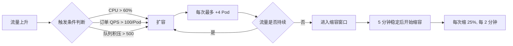
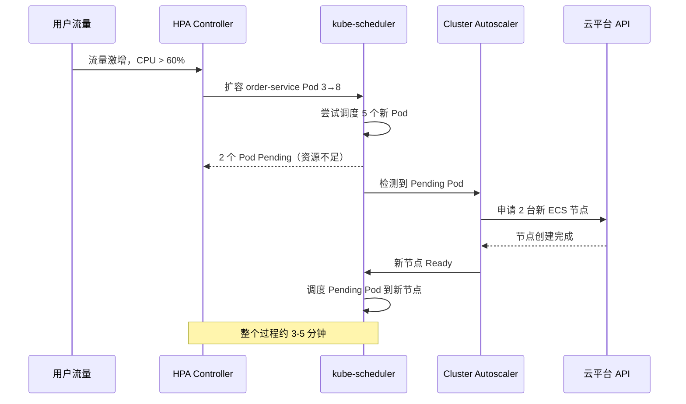

# 案例一：电商平台 Kubernetes 部署与弹性伸缩实战

## 案例概述

本案例以某中型电商平台（日活约 50 万，峰值 QPS 约 3 万）为背景，完整还原从传统 VM 部署迁移到 Kubernetes 集群的全过程。案例涵盖集群规划、应用容器化、Deployment 编排、HPA 自动扩缩、Helm Chart 模板化部署、ConfigMap/Secret 配置管理，以及大促期间的弹性伸缩实战。读者将看到一个真实的"从单体到云原生"的落地路径，而非脱离语境的零散命令。

**案例核心收获：**

- 掌握 Kubernetes 集群的生产级规划方法（节点规格、网络插件、存储方案）
- 理解 Deployment、Service、Ingress、HPA、PDB 等核心资源的协作关系
- 学会用 Helm Chart 管理多环境（dev/staging/prod）部署
- 掌握 ConfigMap/Secret 的安全配置与热更新机制
- 具备大促场景下的弹性伸缩与故障恢复能力

---

## 一、场景与架构背景

### 1.1 业务背景

该电商平台采用微服务架构，核心服务拆分如下：

| 服务名称 | 职责 | 语言 | 日常副本数 | 峰值所需副本数 |
|---------|------|------|-----------|--------------|
| gateway | API 网关、鉴权、限流 | Go | 3 | 8 |
| user-service | 用户注册、登录、个人信息 | Java | 3 | 6 |
| product-service | 商品查询、搜索、详情 | Java | 5 | 15 |
| order-service | 下单、支付回调、订单查询 | Java | 3 | 10 |
| inventory-service | 库存扣减、预占、回滚 | Go | 2 | 6 |
| cart-service | 购物车增删改查 | Node.js | 2 | 5 |
| notification-service | 短信、邮件、推送通知 | Python | 2 | 4 |
| mysql-primary | MySQL 主库 | - | 1 (StatefulSet) | 1 |
| mysql-replica | MySQL 从库 (只读) | - | 2 (StatefulSet) | 2 |
| redis-cluster | Redis 缓存集群 | - | 6 (StatefulSet) | 6 |

**技术栈全景**：后端涉及 Go、Java 17、Node.js 18、Python 3.11 四种语言，存储层依赖 MySQL 8.0 主从复制 + Redis 7.x Cluster 模式，消息队列使用 RabbitMQ。这种多语言异构架构在微服务实践中非常常见——各服务团队可以选择最适合自身业务场景的技术栈，但对运维平台提出了统一编排的需求，这正是 Kubernetes 介入的核心价值。

### 1.2 迁移动机

从传统 VM 部署迁移到 Kubernetes 的核心驱动力：

| 痛点 | VM 方案 | Kubernetes 方案 |
|------|--------|----------------|
| 扩容慢 | 需采购/分配 VM，部署应用，耗时 2-4 小时 | HPA 自动扩缩，分钟级完成 |
| 资源浪费 | 按峰值预留，日常利用率仅 20-30% | 按需分配，利用率提升到 60%+ |
| 发布风险 | 滚动更新无回滚能力 | Deployment 支持滚动更新与一键回滚 |
| 环境一致性 | 开发/测试/生产环境差异大 | 容器镜像保证一致性 |
| 故障自愈 | 依赖人工巡检和脚本 | Pod 健康检查 + 自动重启 |

**迁移前的运维痛点量化**：在 VM 时代，每逢大促前需要提前 2 周进行容量规划，人工采购云主机、配置环境、部署应用，单次扩容从申请到上线平均耗时 3.5 小时。过去一年中因扩容不及时导致了 2 次服务降级，合计损失约 45 万元营收。日常资源利用率仅 25%，每月闲置资源成本约 8 万元。

### 1.3 目标集群架构

```mermaid
graph TB
    subgraph 用户层
        CDN[CDN 加速]
        LB[云负载均衡 SLB]
    end

    subgraph Kubernetes集群
        subgraph Ingress层
            NGINX[Nginx Ingress Controller]
        end

        subgraph 服务层
            GW[gateway x3]
            USR[user-svc x3]
            PROD[product-svc x5]
            ORD[order-svc x3]
            INV[inventory-svc x2]
            CART[cart-svc x2]
            NTF[notification-svc x2]
        end

        subgraph 数据层
            MYSQL_M[(MySQL Master)]
            MYSQL_S[(MySQL Slave x2)]
            REDIS[(Redis Cluster x6)]
        end

        subgraph 基础设施
            PROM[Prometheus + Grafana]
            EFK[EFK 日志]
            JAEGER[Jaeger 链路追踪]
        end
    end

    CDN --> LB --> NGINX
    NGINX --> GW
    GW --> USR &amp; PROD &amp; ORD &amp; INV &amp; CART
    ORD --> INV
    INV --> MYSQL_M
    MYSQL_M --> MYSQL_S
    GW &amp; PROD &amp; ORD --> REDIS
    PROM -.->|监控| 服务层
    EFK -.->|日志| 服务层
    JAEGER -.->|追踪| 服务层
```

**架构设计原则**：

- **分层隔离**：用户流量经 CDN → SLB → Ingress Controller 三层过滤后才到达业务服务，每层承担不同的安全和流量治理职责
- **无状态服务优先**：所有业务微服务均为无状态设计，Session 和缓存统一交由 Redis 管理，这是实现弹性伸缩的前提条件
- **有状态服务独立管理**：MySQL 和 Redis 通过 StatefulSet 部署，使用固定网络标识和持久化存储，不参与自动伸缩
- **可观测性三位一体**：Prometheus（指标监控）+ EFK（日志聚合）+ Jaeger（链路追踪）构成完整的可观测性体系

---

## 二、集群规划与搭建

### 2.1 节点规格设计

生产集群采用混合规格节点池，不同类型工作负载匹配不同规格：

| 节点池 | 规格 | 数量 | 用途 | 标签 |
|--------|------|------|------|------|
| app-pool | 8C16G | 6 | 无状态微服务 | `workload-type: app` |
| data-pool | 16C64G | 3 | MySQL、Redis 等有状态服务 | `workload-type: data` |
| monitor-pool | 4C8G | 2 | Prometheus、Grafana、EFK | `workload-type: monitor` |
| system-pool | 4C8G | 3 | 系统组件、Ingress Controller | `node-role: system` |

**设计原则：**

- **有状态服务专用节点**：MySQL 和 Redis 需要稳定的磁盘 I/O 和充足的内存，使用高规格节点并设置 `nodeAffinity` 确保调度到 `data-pool`
- **无状态服务弹性区**：应用节点池预留 30% 余量供 HPA 扩容使用
- **监控独立**：避免监控组件与业务服务争抢资源，同时确保集群异常时监控仍可用
- **系统节点隔离**：Ingress Controller、CoreDNS 等系统组件不与业务混部

**资源预留考量**：每个节点需预留约 1.5C/2G 给系统开销（kubelet、kube-proxy、容器运行时等），实际可分配给 Pod 的资源为：

- app-pool 节点：实际可用约 6.5C/14G
- data-pool 节点：实际可用约 14.5C/62G
- 全集群可调度总量：6.5×6 + 14.5×3 + 2.5×2 + 2.5×3 = 39C + 43.5C + 5C + 7.5C = 95C/193G

### 2.2 网络方案选择

| 方案 | 优点 | 缺点 | 适用场景 |
|------|------|------|---------|
| Calico | 性能好，NetworkPolicy 支持完善 | 配置复杂 | 生产首选 |
| Flannel | 简单易用 | 不支持 NetworkPolicy | 测试/小规模 |
| Cilium | eBPF 高性能，可观测性强 | 内核版本要求高 | 大规模/安全敏感 |

本案例选择 **Calico** 作为 CNI 插件，原因：

1. 电商场景对网络性能敏感，Calico 的 BGP 模式直接路由，延迟最低
2. 需要 NetworkPolicy 做微服务间网络隔离（如 order-service 只能访问 inventory-service 和 MySQL）
3. 社区成熟，与 Kubernetes 版本同步更新

**Calico 部署关键配置**：

```bash
# 使用 operator 模式安装 Calico
kubectl create -f https://raw.githubusercontent.com/projectcalico/calico/v3.26.1/manifests/tigera-operator.yaml

# 自定义安装资源：启用 BGP、设置 Pod CIDR
cat <<EOF | kubectl apply -f -
apiVersion: operator.tigera.io/v1
kind: Installation
metadata:
  name: default
spec:
  calicoNetwork:
    ipPools:
    - blockSize: 26           # 每个节点分配 /26 子网（64 个 IP）
      cidr: 10.244.0.0/16
      encapsulation: None      # BGP 模式：不做 VXLAN 封装，性能最佳
      natOutgoing: true
      nodeSelector: all()
    nodeAddressAutodetectionV4:
      interface: eth.*         # 自动检测主机网卡
EOF
```

### 2.3 存储方案

```yaml
# StorageClass 定义 — 有状态服务使用 SSD 云盘
apiVersion: storage.k8s.io/v1
kind: StorageClass
metadata:
  name: ssd-retain
provisioner: disk.csi.aliyun.com
parameters:
  type: cloud_essd
  performanceLevel: PL1
reclaimPolicy: Retain       # 有状态服务数据不随 PVC 删除而丢失
allowVolumeExpansion: true  # 允许在线扩容
volumeBindingMode: WaitForFirstConsumer  # 延迟绑定，确保调度后再创建磁盘
---
# 应用层使用 NFS 共享存储
apiVersion: storage.k8s.io/v1
kind: StorageClass
metadata:
  name: nfs-shared
provisioner: nas.csi.aliyun.com
parameters:
  path: "/k8s-shared"
  vers: "4.1"
reclaimPolicy: Delete
```

**关键决策：**

- MySQL 和 Redis 使用 `ssd-retain` — 数据盘不随 Pod 销毁而删除，故障恢复时可挂载回原数据
- 临时文件（如上传缓冲）使用 `nfs-shared` — 多 Pod 可并发读写
- `WaitForFirstConsumer` 确保磁盘与 Pod 在同一可用区，避免跨可用区延迟
- `allowVolumeExpansion: true` 允许在线扩容磁盘容量，应对数据增长而无需停服

---

## 三、应用容器化与部署

### 3.1 Dockerfile 最佳实践（以 order-service 为例）

```dockerfile
# ---- 构建阶段 ----
FROM maven:3.9-eclipse-temurin-17-alpine AS builder
WORKDIR /build
COPY pom.xml .
RUN mvn dependency:go-offline -B    # 先下载依赖（利用缓存）
COPY src ./src
RUN mvn package -DskipTests -B

# ---- 运行阶段 ----
FROM eclipse-temurin:17-jre-alpine
LABEL maintainer="platform-team@company.com"

# 安全：非 root 运行
RUN addgroup -S app &amp;&amp; adduser -S app -G app
USER app

WORKDIR /app
COPY --from=builder /build/target/order-service-*.jar app.jar

# JVM 参数：容器感知（使用 cgroup 内存限制）
ENV JAVA_OPTS="-XX:+UseContainerSupport \
  -XX:MaxRAMPercentage=75.0 \
  -XX:+UseG1GC \
  -XX:+UseStringDeduplication"

EXPOSE 8080
HEALTHCHECK --interval=15s --timeout=5s --retries=3 \
  CMD wget -qO- http://localhost:8080/actuator/health || exit 1

ENTRYPOINT ["sh", "-c", "exec java $JAVA_OPTS -jar app.jar"]
```

**要点解析：**

- **多阶段构建**：Maven 依赖下载层与运行层分离，镜像从 800MB 压缩到 120MB
- **非 root 运行**：避免容器逃逸时的权限风险
- **容器感知 JVM**：`-XX:+UseContainerSupport` 让 JVM 读取 cgroup 限制而非宿主机内存，`-XX:MaxRAMPercentage=75.0` 保证堆内存不超过 Pod limit 的 75%
- **HEALTHCHECK**：配合 Kubernetes 的 `livenessProbe` 和 `readinessProbe`，实现健康状态感知

**镜像安全扫描**：生产环境中应在 CI 流水线中集成镜像扫描工具（如 Trivy），在镜像推送至私有仓库前自动检测 CVE 漏洞。高危漏洞阻断发布，中低危漏洞生成报告供团队评估：

```bash
# Trivy 扫描示例
trivy image --severity HIGH,CRITICAL --exit-code 1 \
  registry.company.com/ecommerce/order-service:v1.2.0
```

### 3.2 Deployment 编排（核心模板）

```yaml
apiVersion: apps/v1
kind: Deployment
metadata:
  name: order-service
  namespace: ecommerce
  labels:
    app: order-service
    version: v1.2.0
    team: backend
spec:
  replicas: 3
  revisionHistoryLimit: 10        # 保留 10 个历史版本，方便回滚
  strategy:
    type: RollingUpdate
    rollingUpdate:
      maxUnavailable: 1           # 滚动更新时最多 1 个 Pod 不可用
      maxSurge: 2                 # 滚动更新时最多多出 2 个 Pod
  selector:
    matchLabels:
      app: order-service
  template:
    metadata:
      labels:
        app: order-service
        version: v1.2.0
    spec:
      # ---- 调度约束 ----
      nodeSelector:
        workload-type: app        # 只调度到 app-pool 节点
      topologySpreadConstraints:
      - maxSkew: 1                # 各可用区 Pod 数量差不超过 1
        topologyKey: topology.kubernetes.io/zone
        whenUnsatisfiable: DoNotSchedule
        labelSelector:
          matchLabels:
            app: order-service

      # ---- 安全上下文 ----
      securityContext:
        runAsNonRoot: true
        runAsUser: 1000
        fsGroup: 1000

      containers:
      - name: order-service
        image: registry.company.com/ecommerce/order-service:v1.2.0
        imagePullPolicy: IfNotPresent

        ports:
        - name: http
          containerPort: 8080
          protocol: TCP

        # ---- 资源管理 ----
        resources:
          requests:
            cpu: "500m"           # 请求 0.5 核 CPU
            memory: "512Mi"       # 请求 512MB 内存
          limits:
            cpu: "2000m"          # 上限 2 核（突发时可短暂使用）
            memory: "1024Mi"      # 上限 1GB（超出即 OOMKill）

        # ---- 健康检查 ----
        startupProbe:             # 启动探针：给 Java 应用足够启动时间
          httpGet:
            path: /actuator/health
            port: http
          initialDelaySeconds: 10
          periodSeconds: 5
          failureThreshold: 30    # 最多等待 150 秒启动
        livenessProbe:            # 存活探针：挂了就重启
          httpGet:
            path: /actuator/health/liveness
            port: http
          periodSeconds: 15
          timeoutSeconds: 5
          failureThreshold: 3
        readinessProbe:           # 就绪探针：没准备好不接流量
          httpGet:
            path: /actuator/health/readiness
            port: http
          periodSeconds: 10
          timeoutSeconds: 3
          failureThreshold: 3

        # ---- 环境变量（敏感信息通过 Secret 注入）----
        env:
        - name: SPRING_PROFILES_ACTIVE
          value: "production"
        - name: JAVA_OPTS
          value: "-XX:+UseContainerSupport -XX:MaxRAMPercentage=75.0"
        - name: DB_PASSWORD
          valueFrom:
            secretKeyRef:
              name: order-service-secrets
              key: db-password
        - name: REDIS_PASSWORD
          valueFrom:
            secretKeyRef:
              name: order-service-secrets
              key: redis-password

        # ---- ConfigMap 挂载 ----
        volumeMounts:
        - name: config-volume
          mountPath: /app/config
          readOnly: true

      volumes:
      - name: config-volume
        configMap:
          name: order-service-config

      # ---- 优雅终止 ----
      terminationGracePeriodSeconds: 60
```

**关键配置解读**：

- **rollingUpdate 策略**：`maxUnavailable: 1` + `maxSurge: 2` 意味着更新过程中最多有 5 个 Pod 存活（3-1+2），保证服务连续性。对于 3 副本的服务，这确保至少有 2 个 Pod 始终提供服务
- **topologySpreadConstraints**：跨可用区均匀分布 Pod，当某个可用区发生故障时，服务不会全部中断。`maxSkew: 1` 确保各区 Pod 数量差不超过 1
- **三种探针的协作关系**：`startupProbe` 在应用启动期间运行，成功后停止；此后 `livenessProbe` 接管检测进程是否存活；`readinessProbe` 判断是否可以接收流量。三者各司其职，避免误判
- **terminationGracePeriodSeconds: 60**：给 Java 应用 60 秒完成正在进行的订单处理、释放数据库连接、刷新缓存后优雅退出

### 3.3 Service 与 Ingress 配置

```yaml
# Service：ClusterIP 类型，集群内部访问
apiVersion: v1
kind: Service
metadata:
  name: order-service
  namespace: ecommerce
  labels:
    app: order-service
spec:
  type: ClusterIP
  ports:
  - name: http
    port: 80
    targetPort: http
    protocol: TCP
  selector:
    app: order-service
---
# Ingress：对外暴露 API
apiVersion: networking.k8s.io/v1
kind: Ingress
metadata:
  name: ecommerce-api
  namespace: ecommerce
  annotations:
    nginx.ingress.kubernetes.io/ssl-redirect: "true"
    nginx.ingress.kubernetes.io/proxy-body-size: "50m"
    nginx.ingress.kubernetes.io/rate-limit: "100"         # 限流 100 QPS/连接
    nginx.ingress.kubernetes.io/proxy-connect-timeout: "10"
    nginx.ingress.kubernetes.io/proxy-read-timeout: "60"
    nginx.ingress.kubernetes.io/proxy-send-timeout: "60"
    # 金丝雀发布：10% 流量导向新版本
    nginx.ingress.kubernetes.io/canary: "true"
    nginx.ingress.kubernetes.io/canary-weight: "10"
spec:
  ingressClassName: nginx
  tls:
  - hosts:
    - api.company.com
    secretName: api-tls-cert
  rules:
  - host: api.company.com
    http:
      paths:
      - path: /api/v1/orders
        pathType: Prefix
        backend:
          service:
            name: order-service
            port:
              number: 80
```

**设计说明：**

- **Service 用 ClusterIP**：微服务间通信走集群内部网络，不暴露到外网。Service 通过标签选择器（label selector）自动关联后端 Pod，当 Pod 扩缩容时自动更新 Endpoint 列表
- **Ingress 集中管理**：SSL 终止、限流、超时、金丝雀策略统一在 Ingress 层配置，避免每个服务重复维护
- **金丝雀发布**：通过 `canary-weight: "10"` 将 10% 流量导向 v1.3.0 版本，观察无异常后逐步提升比例。完整流程：10% → 30% → 50% → 100%，每阶段观察 30 分钟，关注错误率和 P99 延迟
- **超时配置**：`proxy-read-timeout: 60` 确保下单等长事务不会因 Nginx 超时而中断，`proxy-connect-timeout: 10` 防止后端无响应时连接堆积

### 3.4 ConfigMap 与 Secret 管理

```yaml
# ConfigMap：非敏感配置
apiVersion: v1
kind: ConfigMap
metadata:
  name: order-service-config
  namespace: ecommerce
data:
  application-production.yml: |
    server:
      port: 8080
      tomcat:
        max-threads: 200
        min-spare-threads: 20
        accept-count: 100
    spring:
      datasource:
        url: jdbc:mysql://mysql-primary:3306/order_db?useSSL=true&amp;serverTimezone=Asia/Shanghai
        username: order_user
        hikari:
          maximum-pool-size: 30
          minimum-idle: 10
          connection-timeout: 5000
          idle-timeout: 300000
          max-lifetime: 600000
      redis:
        host: redis-cluster
        port: 6379
        timeout: 3000
    logging:
      level:
        root: INFO
        com.company.order: DEBUG
      pattern:
        console: "%d{yyyy-MM-dd HH:mm:ss.SSS} [%thread] %-5level [%X{traceId}] %logger{36} - %msg%n"
---
# Secret：敏感信息（实际生产中应使用 External Secrets Operator）
apiVersion: v1
kind: Secret
metadata:
  name: order-service-secrets
  namespace: ecommerce
type: Opaque
data:
  db-password: b3JkZXJfZGIzNzI0Xw==       # base64 编码（非加密）
  redis-password: cmVkaXNfcGFzcyEyMDI0
```

**ConfigMap 热更新机制详解**：

ConfigMap 以 Volume 方式挂载到 Pod 时，kubelet 会定期（默认 60 秒的 `syncPeriod`）检查并同步文件内容。但有三个关键陷阱需要理解：

1. **更新延迟**：文件变化不是实时生效的，最长延迟 60 秒。对于 Nginx 等需要 reload 的应用，还需要额外触发重载
2. **Env 注入不热更新**：如果 ConfigMap 数据通过 `env` 注入为环境变量，这些变量在 Pod 创建时就已固定，ConfigMap 更新后不会反映到已运行的 Pod 中，必须重启 Pod
3. **应用感知**：即使文件已更新，应用是否能感知变化取决于框架支持——Spring Boot 需要 `@RefreshScope` 注解，Nginx 需要 `inotify` + `reload` 脚本

```bash
# 验证 ConfigMap 是否已同步到 Pod
kubectl exec order-service-7f8b9c6d-x2k4m -n ecommerce -- \
  cat /app/config/application-production.yml | grep max-threads

# 强制触发 Pod 重启以加载新配置（当 env 注入时必须使用）
kubectl rollout restart deployment/order-service -n ecommerce
```

**Secret 安全最佳实践**：

Kubernetes 原生 Secret 仅做 base64 编码（非加密），任何拥有 `get secret` 权限的用户都能解码查看明文。生产环境应采用以下方案：

| 方案 | 原理 | 优势 | 适用场景 |
|------|------|------|---------|
| etcd 加密 (EncryptionConfiguration) | 数据写入 etcd 前加密 | 零额外组件 | 基础安全需求 |
| External Secrets Operator | 从 AWS Secrets Manager / Vault 同步 | 密钥生命周期统一管理 | 中大型团队 |
| Sealed Secrets | 用集群公钥加密，只有该集群能解密 | Git 友好，可入版本库 | GitOps 流程 |

```bash
# 检查 Secret 的 base64 解码内容（仅用于调试，生产中应禁止）
kubectl get secret order-service-secrets -n ecommerce \
  -o jsonpath='{.data.db-password}' | base64 -d
```

---

## 四、自动弹性伸缩（HPA）

### 4.1 HPA 配置

这是应对大促流量洪峰的核心能力。根据业务特征，为每个服务配置不同的伸缩策略：

```yaml
# order-service HPA：基于 CPU 和自定义指标
apiVersion: autoscaling/v2
kind: HorizontalPodAutoscaler
metadata:
  name: order-service-hpa
  namespace: ecommerce
spec:
  scaleTargetRef:
    apiVersion: apps/v1
    kind: Deployment
    name: order-service
  minReplicas: 3
  maxReplicas: 12
  behavior:
    scaleUp:
      stabilizationWindowSeconds: 30      # 扩容稳定窗口 30 秒
      policies:
      - type: Pods
        value: 4                          # 每次最多扩容 4 个 Pod
        periodSeconds: 60                 # 每 60 秒执行一次
    scaleDown:
      stabilizationWindowSeconds: 300     # 缩容稳定窗口 5 分钟（避免抖动）
      policies:
      - type: Percent
        value: 25                         # 每次最多缩容当前数量的 25%
        periodSeconds: 120                # 每 120 秒执行一次
  metrics:
  # 指标一：CPU 利用率（扩容触发线 60%）
  - type: Resource
    resource:
      name: cpu
      target:
        type: Utilization
        averageUtilization: 60
  # 指标二：自定义指标 — 每秒订单数
  - type: Pods
    pods:
      metric:
        name: orders_per_second
      target:
        type: AverageValue
        averageValue: "100"               # 每个 Pod 每秒处理超过 100 单时扩容
  # 指标三：外部指标 — 消息队列积压量
  - type: External
    external:
      metric:
        name: rabbitmq_queue_messages_ready
        selector:
          matchLabels:
            queue: order-processing
      target:
        type: AverageValue
        averageValue: "500"               # 队列积压超过 500 条时扩容
```

**自定义指标采集前置条件**：要让 HPA 基于 `orders_per_second` 等自定义指标进行伸缩，需要部署 Prometheus Adapter 或 KEDA 作为指标适配层：

```bash
# 使用 Prometheus Adapter 将 Prometheus 指标暴露为 Kubernetes Metrics API
helm install prometheus-adapter prometheus-community/prometheus-adapter \
  --namespace monitoring \
  --set prometheus.url=http://prometheus-server.monitoring \
  --set rules.custom.'orders_per_second'.query='sum(rate(http_requests_total{path="/api/v1/orders",method="POST"}[1m])) by (pod)'
```

### 4.2 伸缩策略设计原则



**关键设计决策：**

| 参数 | 扩容 | 缩容 | 设计原因 |
|------|------|------|---------|
| 稳定窗口 | 30 秒 | 300 秒 | 扩容要快（抢流量），缩容要稳（防误缩） |
| 步幅限制 | 每次 +4 Pod | 每次 -25% | 扩容激进、缩容保守 |
| 多指标触发 | CPU + QPS + 队列 | 任一满足即触发 | 单指标可能遗漏场景（如 CPU 低但队列爆满） |
| 最小副本 | 3 | - | 保证基础服务能力 |

**多指标仲裁逻辑**：当同时配置多个指标时，HPA 为每个指标分别计算期望副本数，取最大值。例如 CPU 指标算出需要 5 个 Pod，队列指标算出需要 8 个 Pod，最终扩到 8 个。这保证了"最苛刻的需求"得到满足，避免单一指标盲区。

### 4.3 PodDisruptionBudget：保障缩容/维护安全

```yaml
apiVersion: policy/v1
kind: PodDisruptionBudget
metadata:
  name: order-service-pdb
  namespace: ecommerce
spec:
  minAvailable: 2              # 任何时刻至少保留 2 个 Pod 运行
  selector:
    matchLabels:
      app: order-service
```

**作用**：当节点维护（`kubectl drain`）或 HPA 缩容时，PDB 确保不会同时驱逐太多 Pod 导致服务不可用。例如 order-service 有 3 个 Pod 时，最多只允许 1 个被驱逐。

**PDB 与 HPA 的协同**：HPA 在缩容时会检查 PDB 约束，不会违反 `minAvailable` 的限制。当 PDB 阻止了缩容请求时，HPA 会在日志中记录事件但不会强制驱逐。运维人员可以通过 `kubectl get pdb` 查看当前允许的最大中断数：

```bash
kubectl get pdb -n ecommerce -o wide
# NAME                 MIN AVAILABLE   MAX UNAVAILABLE   SELECTOR                 CURRENT AVAILABLE
# order-service-pdb    2               <disabled>        app=order-service        5
```

### 4.4 Cluster Autoscaler：节点级弹性

HPA 解决的是 Pod 级扩缩容，但当节点资源不足时，需要 Cluster Autoscaler 自动添加/移除节点：

```yaml
# Cluster Autoscaler 配置（通过 Helm values.yaml）
autoDiscovery:
  clusterName: ecommerce-prod

awsRegion: cn-shanghai

extraArgs:
  balance-similar-node-groups: true          # 相似节点组间负载均衡
  skip-nodes-with-local-storage: false        # 有本地存储的节点也可缩容
  expander: least-waste                       # 选择资源浪费最少的节点组扩容
  max-node-provision-time: 5m                 # 节点最长上线时间
  scale-down-delay-after-add: 5m              # 新节点加入后 5 分钟才考虑缩容
  scale-down-unneeded-time: 5m                # 节点空闲超过 5 分钟才缩容
  max-graceful-termination-sec: 600           # 缩容时给 Pod 10 分钟优雅终止

nodeGroups:
- name: app-pool
  minSize: 4
  maxSize: 12
  instanceTypes:
  - ecs.c7.2xlarge       # 8C16G
  labels:
    workload-type: app
  taints: []

- name: data-pool
  minSize: 3
  maxSize: 3              # 数据节点不允许自动扩缩（手动管控）
  instanceTypes:
  - ecs.g7.4xlarge       # 16C64G
  labels:
    workload-type: data
  taints:
  - key: workload-type
    value: data
    effect: NoSchedule
```

**弹性联动流程：**



**CA 调度触发机制**：Cluster Autoscaler 通过监听 Kubernetes 的 Pending Pod 事件来判断是否需要扩容节点。只有当 Pod 因资源不足被调度器标记为 Pending 且持续超过 10 秒时，CA 才会向云平台请求新节点。新节点从创建到 Ready 通常需要 2-3 分钟，加上 Pod 启动和就绪检查时间，整体扩容链路约 3-5 分钟。这就是为什么大促前需要预扩容节点池。

---

## 五、Helm Chart 模板化部署

### 5.1 Chart 结构

手动维护 YAML 文件在多环境（dev/staging/prod）场景下极易出错。使用 Helm Chart 实现一套模板、多环境复用：

ecommerce-chart/
├── Chart.yaml
├── values.yaml            # 默认值（dev 环境）
├── values-staging.yaml    # staging 覆盖值
├── values-prod.yaml       # production 覆盖值
├── templates/
│   ├── _helpers.tpl       # 模板函数
│   ├── deployment.yaml
│   ├── service.yaml
│   ├── ingress.yaml
│   ├── hpa.yaml
│   ├── configmap.yaml
│   ├── secret.yaml
│   ├── pdb.yaml
│   └── networkpolicy.yaml
└── tests/
    └── test-connection.yaml

### 5.2 核心模板（templates/deployment.yaml）

```yaml
apiVersion: apps/v1
kind: Deployment
metadata:
  name: {{ .Release.Name }}-{{ .Values.service.name }}
  namespace: {{ .Release.Namespace }}
  labels:
    app: {{ .Values.service.name }}
    version: {{ .Values.image.tag }}
    {{- include "ecommerce.labels" . | nindent 4 }}
  annotations:
    deployment.kubernetes.io/revision: "{{ .Release.Revision }}"
spec:
  replicas: {{ .Values.replicaCount }}
  selector:
    matchLabels:
      app: {{ .Values.service.name }}
  template:
    metadata:
      labels:
        app: {{ .Values.service.name }}
        version: {{ .Values.image.tag }}
    spec:
      containers:
      - name: {{ .Values.service.name }}
        image: "{{ .Values.image.repository }}:{{ .Values.image.tag }}"
        ports:
        - name: http
          containerPort: {{ .Values.service.port }}
        resources:
          requests:
            cpu: {{ .Values.resources.requests.cpu }}
            memory: {{ .Values.resources.requests.memory }}
          limits:
            cpu: {{ .Values.resources.limits.cpu }}
            memory: {{ .Values.resources.limits.memory }}
        env:
        {{- range $key, $value := .Values.env }}
        - name: {{ $key }}
          value: {{ $value | quote }}
        {{- end }}
        {{- if .Values.secrets }}
        {{- range $key, $value := .Values.secrets }}
        - name: {{ $key }}
          valueFrom:
            secretKeyRef:
              name: {{ $.Release.Name }}-secrets
              key: {{ $key }}
        {{- end }}
        {{- end }}
```

### 5.3 多环境部署

```bash
# 开发环境部署
helm install order-dev ./ecommerce-chart \
  --namespace dev \
  --create-namespace \
  -f values.yaml \
  --set replicaCount=1 \
  --set image.tag=v1.2.0-dev

# Staging 环境
helm install order-staging ./ecommerce-chart \
  --namespace staging \
  -f values-staging.yaml \
  --set image.tag=v1.2.0-rc1

# 生产环境
helm install order-prod ./ecommerce-chart \
  --namespace ecommerce \
  -f values-prod.yaml \
  --set image.tag=v1.2.0 \
  --wait                          # 等待所有 Pod Ready
  --timeout 300s                  # 超时 5 分钟

# 生产环境升级（滚动更新）
helm upgrade order-prod ./ecommerce-chart \
  --namespace ecommerce \
  -f values-prod.yaml \
  --set image.tag=v1.3.0 \
  --wait \
  --timeout 300s

# 快速回滚到上一版本
helm rollback order-prod 1 --namespace ecommerce
```

**Helm 回滚机制原理**：Helm 在每次 `install`/`upgrade` 时会创建一个 Revision 快照。`helm rollback order-prod 1` 会将集群状态恢复到 Revision 1 对应的所有资源 YAML，包括 Deployment、Service、ConfigMap 等。回滚完成后，当前版本号会变为新的 Revision，可以继续向上回滚。

### 5.4 values-prod.yaml（生产配置示例）

```yaml
replicaCount: 5

image:
  repository: registry.company.com/ecommerce/order-service
  tag: v1.2.0
  pullPolicy: IfNotPresent

resources:
  requests:
    cpu: "500m"
    memory: "512Mi"
  limits:
    cpu: "2000m"
    memory: "1024Mi"

service:
  name: order-service
  port: 80

autoscaling:
  enabled: true
  minReplicas: 3
  maxReplicas: 12
  targetCPUUtilization: 60

env:
  SPRING_PROFILES_ACTIVE: production

secrets:
  DB_PASSWORD: "ord3r_pr0d_2024!"
  REDIS_PASSWORD: "r3d1s_pr0d!"
```

> **安全警告**：上例中 `secrets` 字段的密码以明文存储在 `values-prod.yaml` 中，仅适用于本地演示。生产环境的 Secret 应通过 External Secrets Operator 或 Sealed Secrets 管理，严禁将明文密码提交到 Git 仓库。

---

## 六、大促实战：弹性伸缩全过程还原

### 6.1 大促前准备（T-7 天）

```bash
# 1. 确认节点池容量充足
kubectl get nodes -l workload-type=app -o wide
# 确保 app-pool 有 6 个节点，总资源 48C96G

# 2. 预检集群资源水位
kubectl top nodes
kubectl describe nodes | grep -A5 "Allocated resources"

# 3. 检查 HPA 配置
kubectl get hpa -n ecommerce
kubectl describe hpa order-service-hpa -n ecommerce

# 4. 压测验证弹性能力
kubectl run -n ecommerce -i --rm loadtest --image=busybox -- \
  sh -c "while true; do wget -qO- http://order-service/health; done"

# 5. 备份数据库
kubectl exec -n ecommerce mysql-primary-0 -- \
  mysqldump -u root -p --all-databases > /backup/pre-sale-backup.sql

# 6. 检查 PDB 是否生效
kubectl get pdb -n ecommerce
# NAME                 MIN AVAILABLE   ALLOWED DISRUPTIONS
# order-service-pdb    2               3
```

**大促前 Checklist 清单**：

| 检查项 | 命令 | 预期结果 | 不达标的处理 |
|--------|------|---------|------------|
| 节点健康 | `kubectl get nodes` | 所有节点 Ready | 排查 NotReady 节点 |
| HPA 配置 | `kubectl get hpa -n ecommerce` | 所有 HPA min/max 合理 | 调整参数 |
| PDB 就绪 | `kubectl get pdb -n ecommerce` | 各服务 PDB 已配置 | 补充缺失的 PDB |
| 磁盘余量 | `kubectl exec mysql-primary-0 -- df -h` | 数据盘使用率 <70% | 扩容磁盘或清理 |
| 证书有效期 | `kubectl get secret api-tls-cert -o jsonpath='{.data.tls\.crt}' \| base64 -d \| openssl x509 -noout -dates` | 过期时间 > 大促后 30 天 | 续签证书 |

### 6.2 大促高峰应对（T+0）

大促开始后，监控面板显示流量快速攀升：

```bash
# 实时监控 Pod 数量变化
kubectl get pods -n ecommerce -l app=order-service -w

# 观察 HPA 伸缩事件
kubectl describe hpa order-service-hpa -n ecommerce
# Current Metrics:
#   resource cpu on pods (requested) was 23%, target 60%
#   pods metrics per second: 45, target 100
# -> 未达到阈值，暂不扩容

# 10 分钟后 — 流量翻倍
# Current Metrics:
#   resource cpu on pods (requested) was 78%, target 60%
#   pods metrics per second: 156, target 100
# New replicas: 8 (was 3)
```

**实时扩容时间线：**

| 时间 | 订单 QPS | Pod 数量 | CPU 利用率 | 节点数 | 状态 |
|------|---------|---------|-----------|--------|------|
| T+0 | 3,000 | 3 | 25% | 6 | 正常 |
| T+5min | 8,000 | 3→5 | 65% | 6 | HPA 扩容 |
| T+8min | 15,000 | 5→8 | 70% | 6→8 | CA 扩节点 |
| T+12min | 22,000 | 8→10 | 58% | 8 | 稳定 |
| T+30min | 28,000 | 10→12 | 62% | 8 | 达到峰值 |
| T+60min | 12,000 | 12→8 | 45% | 8 | 开始回落 |
| T+90min | 5,000 | 8→5 | 30% | 8→6 | 缩容中 |

**关键观察点**：T+5min 时 HPA 首先触发 Pod 级扩容（3→5），因为当前节点资源充足，CA 无需介入。到 T+8min 流量继续攀升，HPA 尝试扩到 8 个 Pod，但 6 个节点的可用资源只能承载 6 个 Pod，剩余 2 个 Pending 触发了 CA 扩节点（6→8）。这个时间差（约 3 分钟）是 CA 链路延迟，说明了大促前预扩容的重要性。

### 6.3 异常场景处理

**场景一：Pod 重启风暴**

```bash
# 发现 order-service Pod 频繁重启
kubectl get pods -n ecommerce -l app=order-service --field-selector=status.phase!=Running
# NAME                          READY   STATUS             RESTARTS   AGE
# order-service-7f8b9c6d-x2k4m  0/1     CrashLoopBackOff  5          3m

# 查看 Pod 事件
kubectl describe pod order-service-7f8b9c6d-x2k4m -n ecommerce
# Last State: Terminated, Reason: OOMKilled, Exit Code: 137

# 根因：内存 limit 设为 1024Mi，Java 堆 + 堆外 + Netty 缓冲超出限制
# 解决：临时调高 memory limit
kubectl patch deployment order-service -n ecommerce -p \
  '{"spec":{"template":{"spec":{"containers":[{"name":"order-service","resources":{"limits":{"memory":"1536Mi"}}}]}}}}'
```

**OOMKill 根因分析**：JVM 内存 = 堆内存 + 元空间（Metaspace）+ 线程栈 + JIT 编译缓存 + Netty DirectBuffer + Native 内存。`-XX:MaxRAMPercentage=75.0` 只限制了堆，其余内存不受控。当大促期间并发线程数增加时，线程栈内存和 DirectBuffer 会显著增长。正确做法是将 `memory.limit` 设为堆内存的 1.5-2 倍，为非堆内存预留充足空间。

**场景二：数据库连接池耗尽**

```bash
# 监控告警：MySQL 连接数 > 500
kubectl exec -n ecommerce mysql-primary-0 -- \
  mysql -u monitor -p -e "SHOW STATUS LIKE 'Threads_connected';"
# +-------------------+-------+
# | Variable_name     | Value |
# +-------------------+-------+
# | Threads_connected | 487   |

# 5 个 Pod × 30 连接/Pod = 150，但峰值达到 487 说明有连接泄露
# 排查：临时增加 Pod 时 HikariCP 连接池未正确释放旧连接
# 解决：调整连接池参数 + 滚动重启
kubectl apply -f - <<EOF
apiVersion: v1
kind: ConfigMap
metadata:
  name: order-service-config
  namespace: ecommerce
data:
  application-production.yml: |
    spring:
      datasource:
        hikari:
          maximum-pool-size: 20      # 从 30 降到 20
          minimum-idle: 5
          connection-timeout: 5000
          idle-timeout: 180000       # 3 分钟空闲回收
          max-lifetime: 600000       # 10 分钟强制回收
          leak-detection-threshold: 10000  # 连接泄露检测 10 秒
EOF
# ConfigMap 更新后 Pod 会自动热加载挂载卷
```

**场景三：Ingress Controller 成为瓶颈**

```bash
# 监控发现 Ingress Controller CPU 利用率 > 85%，延迟飙升
kubectl top pods -n ingress-nginx -l app.kubernetes.io/name=ingress-nginx
# NAME                             CPU   MEMORY
# ingress-nginx-controller-xxx    3200m  800Mi

# 解决：扩容 Ingress Controller 副本数
kubectl scale deployment ingress-nginx-controller -n ingress-nginx --replicas=4

# 同时检查并调整 Ingress 级别的限流参数
kubectl annotate ingress ecommerce-api -n ecommerce \
  nginx.ingress.kubernetes.io/rate-limit="200" --overwrite
```

### 6.4 大促后缩容

```bash
# 1. 确认流量已回落
kubectl get hpa -n ecommerce -w
# 观察 Metrics 持续低于阈值

# 2. 等待 HPA 自动缩容（stabilizationWindow 5 分钟）
# 手动加速缩容（仅用于紧急情况，正常应依赖 HPA）
kubectl patch deployment order-service -n ecommerce -p '{"spec":{"replicas":3}}'

# 3. 确认节点池缩容
# Cluster Autoscaler 会在节点空闲 5 分钟后自动回收

# 4. 生成大促报告
kubectl get events -n ecommerce --sort-by='.lastTimestamp' > /reports/sale-events.log
```

---

## 七、NetworkPolicy：微服务网络隔离

生产环境必须实施最小权限网络策略，防止被攻破后横向移动：

```yaml
# 默认拒绝所有入站流量
apiVersion: networking.k8s.io/v1
kind: NetworkPolicy
metadata:
  name: default-deny-ingress
  namespace: ecommerce
spec:
  podSelector: {}
  policyTypes:
  - Ingress
---
# order-service：只允许 gateway 和自身访问
apiVersion: networking.k8s.io/v1
kind: NetworkPolicy
metadata:
  name: order-service-netpol
  namespace: ecommerce
spec:
  podSelector:
    matchLabels:
      app: order-service
  policyTypes:
  - Ingress
  ingress:
  - from:
    - podSelector:
        matchLabels:
          app: gateway
    - podSelector:
        matchLabels:
          app: order-service
    ports:
    - port: 8080
      protocol: TCP
---
# order-service：只允许访问 inventory-service 和 MySQL
apiVersion: networking.k8s.io/v1
kind: NetworkPolicy
metadata:
  name: order-service-egress
  namespace: ecommerce
spec:
  podSelector:
    matchLabels:
      app: order-service
  policyTypes:
  - Egress
  egress:
  - to:
    - podSelector:
        matchLabels:
          app: inventory-service
    ports:
    - port: 80
      protocol: TCP
  - to:
    - podSelector:
        matchLabels:
          app: mysql-primary
    ports:
    - port: 3306
      protocol: TCP
  - to:                              # 允许 DNS 解析
    - namespaceSelector: {}
      podSelector:
        matchLabels:
          k8s-app: kube-dns
    ports:
    - port: 53
      protocol: UDP
```

**隔离效果：**

| 源 | 目标 | 是否允许 | 原因 |
|----|------|---------|------|
| gateway → order-service | ✅ | 白名单 |
| product-service → order-service | ❌ | 不在白名单 |
| order-service → inventory-service | ✅ | 业务依赖 |
| order-service → mysql-primary | ✅ | 业务依赖 |
| order-service → user-service | ❌ | 无直接依赖 |
| order-service → kube-dns | ✅ | DNS 解析必需 |

**NetworkPolicy 调试技巧**：NetworkPolicy 配置错误会导致"静默丢包"——流量被拒绝但无明显报错，排障难度大。建议分步实施：

1. 先只创建 `default-deny-ingress`，验证基础连通性
2. 逐个服务添加 Allow 规则，用 `kubectl exec` + `curl` 逐一验证
3. 在测试环境用 `describe networkpolicy` 检查策略是否生效
4. 配合 Calico 的 `calicoctl` 查看实际生效的 iptables/ipset 规则

---

## 八、可观测性配置

### 8.1 Prometheus ServiceMonitor

```yaml
apiVersion: monitoring.coreos.com/v1
kind: ServiceMonitor
metadata:
  name: order-service-monitor
  namespace: ecommerce
  labels:
    release: prometheus       # 与 Prometheus Operator 的标签选择器匹配
spec:
  selector:
    matchLabels:
      app: order-service
  endpoints:
  - port: http
    path: /actuator/prometheus
    interval: 15s
    scrapeTimeout: 10s
```

### 8.2 关键告警规则

```yaml
apiVersion: monitoring.coreos.com/v1
kind: PrometheusRule
metadata:
  name: ecommerce-alerts
  namespace: ecommerce
spec:
  groups:
  - name: pod-alerts
    rules:
    # Pod OOMKill 告警
    - alert: PodOOMKilled
      expr: kube_pod_container_status_last_terminated_reason{reason="OOMKilled"} > 0
      for: 5m
      labels:
        severity: warning
      annotations:
        summary: "Pod {{ $labels.pod }} 发生 OOMKill"
        description: "容器内存超出 limit 被终止，需调高 memory limit"

    # Pod CrashLoopBackOff
    - alert: PodCrashLooping
      expr: rate(kube_pod_container_status_restarts_total[15m]) * 60 * 5 > 3
      for: 10m
      labels:
        severity: critical
      annotations:
        summary: "Pod {{ $labels.pod }} 持续重启"

    # HPA 达到最大副本数
    - alert: HPAMaxedOut
      expr: kube_horizontalpodautoscaler_status_current_replicas == kube_horizontalpodautoscaler_spec_max_replicas
      for: 10m
      labels:
        severity: warning
      annotations:
        summary: "HPA {{ $labels.horizontalpodautoscaler }} 已达最大副本数 {{ $value }}"

    # Node 资源不足导致 Pending
    - alert: PodsPending
      expr: kube_pod_status_unschedulable > 0
      for: 5m
      labels:
        severity: critical
      annotations:
        summary: "Pod {{ $labels.pod }} 无法调度，可能需要扩容节点"

  - name: service-alerts
    rules:
    # 订单接口 P99 延迟超过 2 秒
    - alert: OrderHighLatency
      expr: histogram_quantile(0.99, sum(rate(http_request_duration_seconds_bucket{path="/api/v1/orders"}[5m])) by (le)) > 2
      for: 5m
      labels:
        severity: warning
      annotations:
        summary: "订单接口 P99 延迟 {{ $value }}s，超过 2s 阈值"

    # 订单接口错误率超过 1%
    - alert: OrderHighErrorRate
      expr: sum(rate(http_requests_total{path="/api/v1/orders",code=~"5.."}[5m])) / sum(rate(http_requests_total{path="/api/v1/orders"}[5m])) > 0.01
      for: 5m
      labels:
        severity: critical
      annotations:
        summary: "订单接口 5xx 错误率 {{ $value | humanizePercentage }}"
```

**告警分级策略**：

| 级别 | 含义 | 响应时间 | 通知方式 |
|------|------|---------|---------|
| critical | 服务不可用或数据风险 | 5 分钟内 | 电话 + 短信 + 钉钉/飞书 |
| warning | 性能下降或容量预警 | 30 分钟内 | 钉钉/飞书 + 邮件 |
| info | 信息性事件 | 下一工作日 | 邮件 |

---

## 九、常见误区与踩坑记录

### 误区一：Memory limit 设太紧

```yaml
# ❌ 错误：Java 应用 limit 等于 heap 大小
resources:
  limits:
    memory: "512Mi"       # JVM heap 512Mi + 堆外 + Native > 512Mi → OOMKill

# ✅ 正确：预留 30% 给非堆内存
resources:
  requests:
    memory: "512Mi"
  limits:
    memory: "1024Mi"      # JVM heap 750MB + 堆外 + Netty 缓冲
```

**原因**：JVM 内存 = 堆内存 + 元空间 + 线程栈 + JIT 编译缓存 + Netty DirectBuffer + Native。`-XX:MaxRAMPercentage=75` 只限制堆，其余内存不受控。

### 误区二：HPA 只看 CPU 指标

```yaml
# ❌ 错误：仅依赖 CPU，忽略业务指标
metrics:
- type: Resource
  resource:
    name: cpu
    target:
      type: Utilization
      averageUtilization: 70
```

**问题**：某些场景下 CPU 利用率不高但业务已过载（如订单处理中有大量 I/O 等待，CPU 空闲但队列积压）。应同时配置自定义业务指标（QPS、队列长度、响应时间）。

### 误区三：没有配置 PDB 就上生产

```bash
# ❌ 没有 PDB 时，kubectl drain 可能一次驱逐所有 Pod
kubectl drain node-1 --ignore-daemonsets
# 所有 order-service Pod 被驱逐 → 服务完全中断

# ✅ 有 PDB (minAvailable: 2) 时
kubectl drain node-1 --ignore-daemonsets
# 只驱逐 1 个 Pod，其余保持运行
```

### 误区四：Secret 当成加密存储

```yaml
# ❌ 误解：Secret 是加密的
# 实际：Secret 只是 base64 编码，任何有权限的人都能解码

# ✅ 生产环境应使用：
# 1. 加密 etcd（EncryptionConfiguration）
# 2. External Secrets Operator + AWS Secrets Manager / HashiCorp Vault
# 3. 通过 RBAC 严格限制 Secret 访问权限
```

### 误区五：ConfigMap 热更新的陷阱

```bash
# ConfigMap 以 Volume 挂载时会自动更新文件，但：
# 1. 更新有延迟（kubelet sync period，默认 60 秒）
# 2. 应用必须主动感知文件变化（不是所有框架都支持）
# 3. Env 注入的环境变量不会随 ConfigMap 更新而变化（需要重启 Pod）

# 解决方案：
# - Spring Boot: 使用 @RefreshScope + Spring Cloud Kubernetes
# - Nginx: inotify + reload 脚本
# - 通用: 挂载卷 + 应用侧 watch 文件变化
```

### 误区六：忽略 Pod 优雅终止

```yaml
# ❌ 错误：未设置 terminationGracePeriodSeconds
# 默认 30 秒，对 Java 应用不够——Spring Boot 关闭时需要完成：
# 1. 停止接收新请求
# 2. 完成进行中的订单处理
# 3. 刷新数据库连接池
# 4. 释放分布式锁
# 5. 推送 ShutdownHook 日志

# ✅ 正确：设置足够的优雅终止时间
spec:
  terminationGracePeriodSeconds: 60
  containers:
  - lifecycle:
      preStop:
        exec:
          command: ["sh", "-c", "sleep 5"]  # 等待 Endpoints 更新传播
```

`preStop` 钩子中的 `sleep 5` 确保在 Pod 开始关闭前，Kubernetes Service 的 Endpoints 已完成更新，避免新请求仍然被路由到正在终止的 Pod。

---

## 十、本案例核心命令速查

```bash
# ========== 集群状态 ==========
kubectl get nodes -o wide                          # 节点状态
kubectl top nodes                                  # 节点资源使用
kubectl cluster-info                               # 集群信息
kubectl get componentstatuses                      # 组件健康状态（旧版）

# ========== 工作负载 ==========
kubectl get pods -n ecommerce -o wide              # Pod 状态（含节点信息）
kubectl describe pod <pod-name> -n ecommerce       # Pod 详情（事件、状态、条件）
kubectl logs <pod-name> -n ecommerce -f --tail=100 # 实时日志
kubectl logs <pod-name> -n ecommerce -c <container>  # 多容器 Pod 指定容器
kubectl exec -it <pod-name> -n ecommerce -- sh     # 进入容器 Shell

# ========== 扩缩容 ==========
kubectl get hpa -n ecommerce                       # HPA 状态
kubectl describe hpa <hpa-name> -n ecommerce       # HPA 详情（指标、阈值、当前值）
kubectl scale deployment <name> -n ecommerce --replicas=10  # 手动扩容（临时应急）

# ========== 部署管理 ==========
kubectl rollout status deployment/<name> -n ecommerce  # 部署进度
kubectl rollout history deployment/<name> -n ecommerce # 部署历史
kubectl rollout undo deployment/<name> -n ecommerce    # 回滚到上一版本
kubectl rollout undo deployment/<name> --to-revision=3  # 回滚到指定版本

# ========== 排障 ==========
kubectl get events -n ecommerce --sort-by='.lastTimestamp'  # 最近事件
kubectl get pods -n ecommerce --field-selector=status.phase!=Running  # 异常 Pod
kubectl describe node <node-name>                  # 节点详情（资源、Pod、条件）

# ========== Helm ==========
helm list -n ecommerce                             # 已安装的 Release
helm history order-prod -n ecommerce               # Release 历史
helm upgrade order-prod ./chart -f values-prod.yaml -n ecommerce  # 升级
helm rollback order-prod 1 -n ecommerce            # 回滚
helm uninstall order-prod -n ecommerce             # 卸载
```

---

## 十一、经验总结

### 11.1 架构决策清单

| 决策点 | 本案例选择 | 替代方案 | 选择原因 |
|--------|-----------|---------|---------|
| CNI 插件 | Calico (BGP) | Flannel / Cilium | 性能与 NetworkPolicy 支持 |
| 部署方式 | Helm Chart | Kustomize / ArgoCD | 多环境模板化、版本管理成熟 |
| 自动扩缩 | HPA + CA | 手动扩容 | 大促场景必须自动化 |
| 有状态服务 | StatefulSet + 云盘 | Operator | 运维复杂度适中，可靠性有保障 |
| 网络隔离 | NetworkPolicy | 无 | 安全基线要求 |

### 11.2 关键数字

- **扩容速度**：从触发到新 Pod Ready 平均 90 秒（含节点扩容约 3-5 分钟）
- **资源利用率**：日常 25% → 大促峰值 65%，整体节省 40% 云资源成本
- **发布效率**：Helm 滚动更新 3 分钟完成，回滚 30 秒
- **可用性**：全年 SLA 99.95%（非大促期间 99.99%）
- **镜像大小**：order-service 从 800MB（单阶段）优化到 120MB（多阶段），拉取时间从 45 秒降至 8 秒

### 11.3 后续优化方向

1. **GitOps 流水线**：引入 ArgoCD 实现 Git 驱动部署，配置变更自动同步到集群
2. **Service Mesh**：接入 Istio 实现细粒度流量管理（灰度、故障注入、链路追踪），衔接案例二
3. **成本优化**：使用 Spot/抢占式实例运行非核心服务（notification-service），配合 PDB 保障可用性
4. **多集群**：灾备方案从单集群 Active-Standby 升级为多集群 Active-Active
5. **eBPF 可观测性**：替换传统 sidecar 模式，使用 Cilium Hubble 实现零侵入的网络可观测
