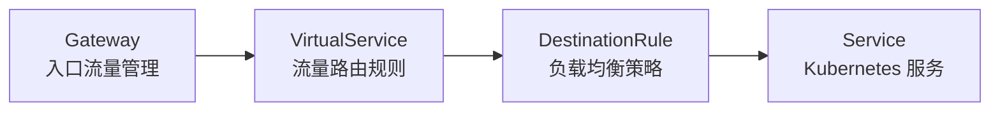
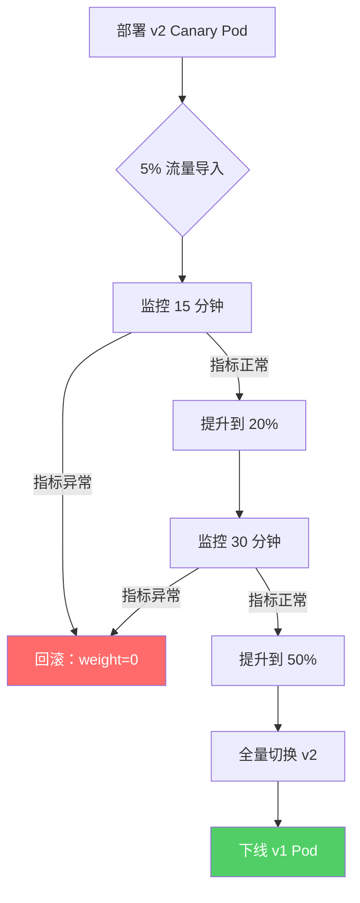
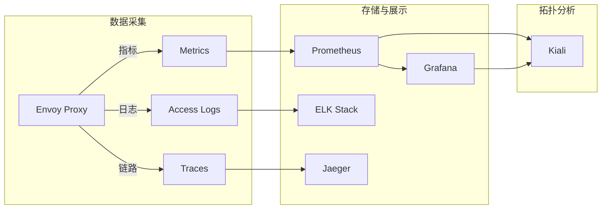

# 案例二：电商平台 Istio 服务网格实战

## 案例概述

本案例延续案例一的电商平台背景（日活约 50 万，峰值 QPS 约 3 万），在其 Kubernetes 集群已稳定运行的基础上，引入 Istio 服务网格解决微服务架构面临的核心难题：服务间通信的可观测性不足、流量管理粗放、安全策略缺乏统一治理。案例完整覆盖从 Istio 安装部署、Sidecar 注入、流量管理、安全加固到可观测性建设的全链路实战过程。

**案例核心收获：**

- 掌握 Istio 在生产环境中的安装、配置与调优方法
- 理解 Envoy Sidecar 代理的工作原理与流量劫持机制
- 学会使用 VirtualService、DestinationRule 实现灰度发布、金丝雀测试和流量镜像
- 掌握 PeerAuthentication + AuthorizationPolicy 构建零信任网络
- 具备 Kiali + Jaeger + Prometheus 构建全链路可观测体系的能力

---

## 一、场景与架构背景

### 1.1 为什么需要服务网格

在案例一完成后，该电商平台已具备 Kubernetes 原生的部署与弹性伸缩能力。但在业务持续增长过程中，暴露出以下痛点：

| 痛点 | 具体表现 | 影响 |
|------|---------|------|
| 服务间调用黑盒 | 无法得知 A→B 的延迟分布、错误率 | 故障定位耗时从分钟级退化到小时级 |
| 流量管理原始 | 灰度发布依赖 Ingress 规则硬编码 | 每次发版需修改 Nginx 配置，出错率高 |
| 安全策略分散 | mTLS、限流、鉴权分散在各服务代码中 | 策略不一致，审计困难 |
| 重试/超时不可控 | 各服务自行实现重试逻辑，缺乏统一策略 | 服务雪崩风险高，重试风暴频发 |
| 缺乏流量可观测 | 无统一的拓扑图、延迟热力图 | 容量规划缺少数据支撑 |

这些问题的共性在于：**关注点与业务代码耦合**。开发者在每个微服务中重复实现流量管理、安全、可观测的逻辑，既增加代码复杂度，又难以保证策略一致性。Istio 的核心价值在于将这些横切关注点下沉到基础设施层，让业务代码专注于业务逻辑。

### 1.2 目标架构

在引入 Istio 后，平台的整体架构如下：

```mermaid
graph TB
    subgraph 用户侧
        Client[客户端/浏览器]
    end

    subgraph Ingress Gateway
        IG[Istio Ingress Gateway]
    end

    subgraph 服务网格数据平面
        subgraph 用户服务
            US1[用户服务 Pod]
            US2[用户服务 Pod]
        end
        subgraph 订单服务
            OS1[订单服务 Pod]
            OS2[订单服务 Pod]
        end
        subgraph 商品服务
            PS1[商品服务 Pod]
            PS2[商品服务 Pod]
        end
        subgraph 支付服务
            PSS1[支付服务 Pod]
        end
    end

    subgraph 控制平面
        CP[Istiod]
    end

    subgraph 可观测性
        K[Kiali]
        J[Jaeger]
        P[Prometheus]
    end

    Client --> IG
    IG --> US1 &amp; US2
    US1 &amp; US2 --> OS1 &amp; OS2
    OS1 &amp; OS2 --> PS1 &amp; PS2
    OS1 &amp; OS2 --> PSS1
    CP -.->|下发配置| US1 &amp; US2 &amp; OS1 &amp; OS2 &amp; PS1 &amp; PS2 &amp; PSS1
    US1 &amp; US2 &amp; OS1 &amp; OS2 -.->|遥测数据| P
```

**核心组件职责：**

- **Istiod**：控制平面，包含 Pilot（配置下发）、Citadel（证书管理）、Galley（配置校验）
- **Envoy Proxy**：每个 Pod 注入的 Sidecar，负责流量拦截、路由、负载均衡、安全
- **Ingress Gateway**：替代传统 Ingress Controller，作为南北向流量入口

### 1.3 前置条件

本案例假设以下环境已就绪：

- Kubernetes 集群 v1.27+（3 Master + 6 Worker）
- kubectl 已配置集群访问
- Helm 3.x 已安装
- 集群已部署案例一中的微服务（用户服务、订单服务、商品服务、支付服务）
- 集群中已部署 Prometheus + Grafana（案例一中用于 HPA 指标采集）

---

## 二、Istio 安装与配置

### 2.1 安装版本选择

Istio 提供四种安装 Profile，适用于不同场景：

| Profile | 包含组件 | 适用场景 | 资源开销 |
|---------|---------|---------|---------|
| default | Ingress Gateway + Istiod | 生产环境（官方推荐） | 中等 |
| demo | 完整组件（含 Kiali、Jaeger、Grafana） | 开发/演示 | 较高 |
| minimal | 仅 Istiod | 资源受限测试 | 最低 |
| remote | 多集群远程集群组件 | 多集群联邦 | 低 |

**本案例选择 `default` Profile，配合手动部署可观测性工具**，理由如下：

1. 生产环境不宜捆绑演示组件，需独立管理可观测性栈
2. default Profile 已包含 Ingress Gateway 和 Istiod，满足流量管理核心需求
3. 资源开销可控（每个 Worker 节点额外消耗约 0.5 CPU / 512Mi 内存）

### 2.2 安装步骤

```bash
# 1. 下载 istioctl 命令行工具
curl -L https://istio.io/downloadIstio | ISTIO_VERSION=1.22.2 sh -
export PATH=$PWD/istio-1.22.2/bin:$PATH

# 2. 验证 Kubernetes 集群兼容性
istioctl x precheck
# 输出: ✔ No issues found when checking the cluster. Istio is safe to install.

# 3. 使用 default Profile 安装
istioctl install --set profile=default -y

# 4. 验证安装状态
istioctl verify-install
# 确认输出包含 Pilot 和 IngressGateway 的 Installation SUCCESSFUL

# 5. 查看安装后的 Pod
kubectl get pods -n istio-system
# NAME                                    READY   STATUS    RESTARTS   AGE
# istiod-5f76f8c9b6-xxxxx                 1/1     Running   0          2m
# istio-ingressgateway-7c64b8c9b6-xxxxx   1/1     Running   0          2m
```

### 2.3 性能调优配置

生产环境必须根据集群规模调整 Istiod 参数：

```yaml
# istiod-config.yaml
apiVersion: install.istio.io/v1alpha1
kind: IstioOperator
metadata:
  name: istio-production
  namespace: istio-system
spec:
  profile: default
  meshConfig:
    # 访问日志级别（生产环境用 INFO，调试时用 DEBUG）
    accessLogFile: /dev/stdout
    accessLogEncoding: JSON
    # 默认超时（所有服务的全局默认值）
    defaultConfig:
      # 连接池大小调整
      proxyResources:
        requests:
          cpu: 100m
          memory: 128Mi
        limits:
          cpu: 500m
          memory: 256Mi
      # 环境变量传递（确保应用可获取真实客户端 IP）
      proxyMetadata:
        ISTIO_META_DNS_CAPTURE: "true"
    # 启用 Prometheus 指标导出
    enablePrometheusMerge: true
    # 数据平面模式：严格模式确保所有流量都经过 Sidecar
    enableAutoMtls: true
  components:
    pilot:
      k8s:
        resources:
          requests:
            cpu: 500m
            memory: 2Gi
          limits:
            cpu: 1000m
            memory: 4Gi
        # HPA 配置，应对配置下发压力
        hpaSpec:
          minReplicas: 2
          maxReplicas: 5
          metrics:
            - type: Resource
              resource:
                name: cpu
                targetAverageUtilization: 75
    ingressGateways:
      - name: istio-ingressgateway
        enabled: true
        k8s:
          resources:
            requests:
              cpu: 200m
              memory: 256Mi
            limits:
              cpu: 1000m
              memory: 1Gi
          hpaSpec:
            minReplicas: 2
            maxReplicas: 10
```

```bash
# 应用配置
istioctl install -f istiod-config.yaml -y

# 验证配置生效
kubectl get pods -n istio-system -w
# 观察 Pod 重建过程，确认 Ready 为 1/1
```

### 2.4 Sidecar 注入策略

Istio 支持两种 Sidecar 注入方式：

**方式一：命名空间级别全局注入（推荐）**

```bash
# 为业务命名空间启用自动注入
kubectl label namespace ecommerce istio-injection=enabled

# 验证标签
kubectl get namespace ecommerce --show-labels
# NAME         LABELS                      STATUS
# ecommerce    istio-injection=enabled     Active
```

**方式二：Pod 级别精细控制**

```yaml
# 在 Deployment spec 中显式声明注入策略
apiVersion: apps/v1
kind: Deployment
metadata:
  name: user-service
  namespace: ecommerce
spec:
  template:
    metadata:
      labels:
        app: user-service
      annotations:
        # 显式注入（覆盖命名空间默认策略）
        sidecar.istio.io/inject: "true"
        # 自定义 Sidecar 资源限制
        sidecar.istio.io/proxyCPU: "50m"
        sidecar.istio.io/proxyMemory: "64Mi"
```

**方式三：排除特殊 Pod（如 DaemonSet）**

```yaml
# 对不需要网格的 Pod 排除注入
metadata:
  annotations:
    sidecar.istio.io/inject: "false"
```

**注入后的 Pod 变化：** 每个被注入的 Pod 会增加一个 `istio-proxy` 容器，该容器：

1. 通过 iptables 规则劫持所有入站和出站流量
2. 对入站流量：拦截端口 15006，转发到 Envoy
3. 对出站流量：拦截端口 15001，转发到 Envoy
4. 管理流量的负载均衡、重试、超时、熔断
5. 收集指标数据并暴露在端口 15090

---

## 三、流量管理实战

### 3.1 流量管理核心概念

Istio 的流量管理通过三个核心 CRD 协同工作：



| CRD | 作用 | 类比 |
|-----|------|------|
| Gateway | 定义网关端口、协议、TLS | Nginx 的 server{} 块 |
| VirtualService | 定义路由规则（按 header/URI/权重） | Nginx 的 location 块 + 权重 |
| DestinationRule | 定义子集、负载均衡、熔断策略 | Nginx 的 upstream 配置 |

### 3.2 金丝雀发布

**场景**：订单服务 v2.0 版本上线前，需要先将 5% 流量导入新版本验证稳定性。

```yaml
# 01-gateway.yaml — 为订单服务创建网关入口
apiVersion: networking.istio.io/v1
kind: Gateway
metadata:
  name: order-gateway
  namespace: ecommerce
spec:
  selector:
    istio: ingressgateway
  servers:
    - port:
        number: 443
        name: https
        protocol: HTTPS
      tls:
        mode: SIMPLE
        credentialName: order-tls-credential  # 引用 K8s Secret
      hosts:
        - "order.api.example.com"
    - port:
        number: 80
        name: http
        protocol: HTTP
      hosts:
        - "order.api.example.com"
---
# 02-canary-virtualservice.yaml — 金丝雀路由
apiVersion: networking.istio.io/v1
kind: VirtualService
metadata:
  name: order-service-canary
  namespace: ecommerce
spec:
  hosts:
    - "order.api.example.com"
  gateways:
    - order-gateway
  http:
    # 95% 流量走稳定版
    - match:
        - headers:
            x-canary:
              exact: "true"
      route:
        - destination:
            host: order-service
            subset: v2-canary
    # 默认流量按权重分配
    - route:
        - destination:
            host: order-service
            subset: v1-stable
          weight: 95
        - destination:
            host: order-service
            subset: v2-canary
          weight: 5
      # 金丝雀版本的超时配置
      timeout: 10s
      retries:
        attempts: 3
        perTryTimeout: 3s
        retryOn: "gateway-error,connect-failure,refused-stream"
---
# 03-destinationrule.yaml — 定义版本子集
apiVersion: networking.istio.io/v1
kind: DestinationRule
metadata:
  name: order-service-dr
  namespace: ecommerce
spec:
  host: order-service
  trafficPolicy:
    connectionPool:
      tcp:
        maxConnections: 100
      http:
        h2UpgradePolicy: DEFAULT
        http1MaxPendingRequests: 100
        http2MaxRequests: 1000
        maxRequestsPerConnection: 100
    loadBalancer:
      simple: LEAST_REQUEST  # 最少请求优先，避免热点
  subsets:
    - name: v1-stable
      labels:
        version: v1
    - name: v2-canary
      labels:
        version: v2
      trafficPolicy:
        connectionPool:
          http:
            # 金丝雀版本限制并发，保护新版本
            http2MaxRequests: 100
            maxRequestsPerConnection: 10
```

**金丝雀发布执行流程：**



```bash
# 动态调整权重（无需重新 apply 整个 YAML）
# 从 5% 提升到 20%
kubectl patch virtualservice order-service-canary -n ecommerce --type merge -p '
spec:
  http:
  - route:
    - destination:
        host: order-service
        subset: v1-stable
      weight: 80
    - destination:
        host: order-service
        subset: v2-canary
      weight: 20'

# 查看当前路由规则
istioctl analyze -n ecommerce
```

### 3.3 流量镜像（Shadow Testing）

**场景**：在正式切流之前，将生产流量复制一份到新版本进行影子测试，不影响真实用户。

```yaml
apiVersion: networking.istio.io/v1
kind: VirtualService
metadata:
  name: order-service-mirror
  namespace: ecommerce
spec:
  hosts:
    - order-service
  http:
    - route:
        - destination:
            host: order-service
            subset: v1-stable
      # 将流量镜像到 v2
      mirror:
        host: order-service
        subset: v2-canary
      mirrorPercentage:
        value: 100  # 镜像 100% 的流量（也可以设为 50 只镜像一半）
```

**流量镜像的关键特性：**

1. 原始请求正常发送到 v1-stable，用户无感知
2. 镜像请求发送到 v2-canary，其响应被丢弃
3. 镜像请求在 HTTP header 中标记 `x-istio-mirror`
4. 可通过 Kiali/Jaeger 观察镜像请求的延迟和错误

**注意事项：**

- 镜像流量会消耗 v2-canary 的实际资源，需确保副本数充足
- 镜像请求的失败不影响主请求，但需要在监控面板中单独过滤
- 适合用于 API 兼容性验证、性能对比、新算法效果评估

### 3.4 基于 Header 的路由

**场景**：内部测试团队需要直接访问特定版本，绕过正常权重分配。

```yaml
apiVersion: networking.istio.io/v1
kind: VirtualService
metadata:
  name: order-service-header-route
  namespace: ecommerce
spec:
  hosts:
    - "order.api.example.com"
  gateways:
    - order-gateway
  http:
    # 内部测试：指定 header 路由到 v2
    - match:
        - headers:
            x-env:
              exact: "staging"
        - headers:
            x-user-type:
              exact: "internal"
      route:
        - destination:
            host: order-service
            subset: v2-canary
    # 默认按权重分配
    - route:
        - destination:
            host: order-service
            subset: v1-stable
          weight: 95
        - destination:
            host: order-service
            subset: v2-canary
          weight: 5
```

### 3.5 故障注入与混沌测试

**场景**：在生产环境中模拟网络延迟和故障，验证系统的容错能力。

```yaml
apiVersion: networking.istio.io/v1
kind: VirtualService
metadata:
  name: order-service-fault-injection
  namespace: ecommerce
spec:
  hosts:
    - order-service
  http:
    # 注入 3 秒延迟（影响 10% 的请求）
    - fault:
        delay:
          percentage:
            value: 10
          fixedDelay: 3s
        abort:
          percentage:
            value: 1
          httpStatus: 500
      route:
        - destination:
            host: order-service
            subset: v1-stable
```

**故障注入的安全实践：**

1. 在 staging 环境充分测试后再在生产环境使用
2. 设置较小的故障比例（延迟 5-10%，错误 1-3%）
3. 配合超时和重试策略一起验证
4. 通过 Istio 的 `fault-injection` label 可以快速开启/关闭
5. 在流量低峰期执行，设置闹钟监控

### 3.6 请求超时与重试策略

```yaml
apiVersion: networking.istio.io/v1
kind: VirtualService
metadata:
  name: order-service-timeout-retry
  namespace: ecommerce
spec:
  hosts:
    - order-service
  http:
    - route:
        - destination:
            host: order-service
            subset: v1-stable
      # 超时设置
      timeout: 15s
      retries:
        attempts: 3
        perTryTimeout: 5s
        retryOn: "gateway-error,connect-failure,refused-stream,5xx"
        # 注意：重试需要配合幂等性设计
        # 非幂等操作（如扣款）不要自动重试
```

**超时与重试的组合策略矩阵：**

| 服务类型 | 超时时间 | 重试次数 | perTryTimeout | retryOn 条件 |
|---------|---------|---------|---------------|-------------|
| 查询类（商品列表） | 10s | 3 | 3s | 5xx, connect-failure |
| 写入类（创建订单） | 15s | 1 | 10s | gateway-error |
| 支付类 | 30s | 0 | — | 不重试（非幂等） |
| 用户认证 | 5s | 2 | 2s | 5xx, timeout |

---

## 四、安全加固实战

### 4.1 零信任网络模型

Istio 的安全架构基于零信任原则：**默认不信任任何流量，所有通信必须经过认证和授权**。

```mermaid
graph TB
    subgraph 安全层
        MTLS[mTLS 双向认证] --> AUTH[AuthorizationPolicy<br/>访问控制]
        AUTH --> RBAC[基于身份的 RBAC]
    end

    subgraph 证书管理
        CA[Citadel CA] --> |自动签发| CERT1[用户服务证书]
        CA --> |自动签发| CERT2[订单服务证书]
        CA --> |自动签发| CERT3[商品服务证书]
    end

    CERT1 &amp; CERT2 &amp; CERT3 --> MTLS
```

### 4.2 启用严格 mTLS

```yaml
# 01-peer-authentication.yaml — 全局启用严格 mTLS
apiVersion: security.istio.io/v1
kind: PeerAuthentication
metadata:
  name: default-strict-mtls
  namespace: istio-system  # 全局生效
spec:
  mtls:
    mode: STRICT  # 拒绝所有未加密的明文流量
---
# 02-namespace-peer-auth.yaml — 命名空间级策略
apiVersion: security.istio.io/v1
kind: PeerAuthentication
metadata:
  name: ecommerce-strict
  namespace: ecommerce
spec:
  mtls:
    mode: STRICT
  # 特殊端口排除（如数据库连接使用数据库自有加密）
  portLevelMtls:
    3306:
      mode: DISABLE  # MySQL 端口排除 mTLS
    5432:
      mode: DISABLE  # PostgreSQL 端口排除 mTLS
```

**mTLS 模式对比：**

| 模式 | 行为 | 适用场景 |
|------|------|---------|
| UNDISABLE | 客户端和服务器都支持 mTLS，但不强制 | 迁移初期，渐进式启用 |
| PERMISSIVE | 同时接受 mTLS 和明文流量 | 迁移过渡期 |
| STRICT | 只接受 mTLS 流量 | 生产环境（推荐） |
| DISABLE | 完全禁用 mTLS | 特殊端口（如数据库） |

### 4.3 细粒度访问控制

```yaml
# 只允许订单服务调用支付服务
apiVersion: security.istio.io/v1
kind: AuthorizationPolicy
metadata:
  name: payment-service-access
  namespace: ecommerce
spec:
  selector:
    matchLabels:
      app: payment-service
  action: ALLOW
  rules:
    - from:
        - source:
            # 只允许订单服务的 ServiceAccount
            principals:
              - "cluster.local/ns/ecommerce/sa/order-service"
      to:
        - operation:
            # 只允许 POST /api/payments 端点
            methods: ["POST"]
            paths: ["/api/payments"]
    - from:
        - source:
            principals:
              - "cluster.local/ns/ecommerce/sa/admin-service"
      to:
        - operation:
            # 管理服务可以执行所有操作
            methods: ["GET", "POST", "PUT", "DELETE"]
            paths: ["/api/payments/*", "/api/payments/admin/*"]
---
# 拒绝所有其他访问
apiVersion: security.istio.io/v1
kind: AuthorizationPolicy
metadata:
  name: deny-all-payment
  namespace: ecommerce
spec:
  {}  # 空 spec = 拒绝所有流量（必须配合上面的 ALLOW 策略）
```

### 4.4 请求级别鉴权（JWT 验证）

```yaml
apiVersion: security.istio.io/v1
kind: RequestAuthentication
metadata:
  name: jwt-auth
  namespace: ecommerce
spec:
  selector:
    matchLabels:
      app: user-service
  jwtRules:
    - issuer: "https://auth.example.com"
      jwksUri: "https://auth.example.com/.well-known/jwks.json"
      # 提取用户身份注入 header，供下游服务使用
      outputPayloadToHeader: "x-jwt-payload"
      forwardOriginalToken: true
      # 从 JWT 中提取 claims
      fromHeaders:
        - name: Authorization
          prefix: "Bearer "
---
# 配合 AuthorizationPolicy：只允许携带有效 JWT 的请求
apiVersion: security.istio.io/v1
kind: AuthorizationPolicy
metadata:
  name: require-jwt
  namespace: ecommerce
spec:
  selector:
    matchLabels:
      app: user-service
  action: ALLOW
  rules:
    - from:
        - source:
            # requestPrincipals 来自 RequestAuthentication 的输出
            requestPrincipals: ["https://auth.example.com/*"]
```

---

## 五、可观测性建设

### 5.1 可观测性三支柱

Istio 原生集成三大可观测性工具：



### 5.2 部署 Kiali 可观测平台

```bash
# 使用官方 Helm Chart 安装 Kiali
kubectl apply -f https://raw.githubusercontent.com/istio/istio/release-1.22/samples/addons/kiali.yaml

# 配置 Kiali 连接 Prometheus
cat <<EOF | kubectl apply -f -
apiVersion: v1
kind: ConfigMap
metadata:
  name: kiali
  namespace: istio-system
data:
  config.yaml: |
    server:
      port: 20001
      web_root: /
    external_services:
      prometheus:
        url: "http://prometheus.istio-system.svc.cluster.local:9090"
      grafana:
        url: "http://grafana.istio-system.svc.cluster.local:3000"
      jaeger:
        url: "http://jaeger-collector.istio-system.svc.cluster.local:14268"
EOF

# 等待 Kiali Pod 就绪
kubectl get pods -n istio-system -l app=kiali -w

# 端口转发访问 Kiali Dashboard
kubectl port-forward -n istio-system svc/kiali 20001:20001 &amp;
# 浏览器访问 http://localhost:20001
```

### 5.3 Prometheus 指标采集配置

Istio 自动暴露以下关键指标（每个 Envoy Proxy 在端口 15090 上）：

| 指标名称 | 含义 | 用途 |
|---------|------|------|
| istio_requests_total | 请求总数 | QPS、成功率计算 |
| istio_request_duration_milliseconds | 请求延迟分布 | P50/P95/P99 延迟 |
| istio_request_bytes | 请求体大小 | 流量带宽统计 |
| istio_tcp_sent_bytes_total | TCP 发送字节 | 数据库连接流量 |
| istio_tcp_connections_opened_total | TCP 连接数 | 连接池使用监控 |

**Prometheus 告警规则配置：**

```yaml
# istio-alerts.yaml
apiVersion: monitoring.coreos.com/v1
kind: PrometheusRule
metadata:
  name: istio-alerts
  namespace: istio-system
spec:
  groups:
    - name: istio-traffic-management
      rules:
        # 错误率告警
        - alert: IstioHighErrorRate
          expr: |
            sum(rate(istio_requests_total{response_code=~"5.*"}[5m])) by (destination_service)
            / sum(rate(istio_requests_total[5m])) by (destination_service) > 0.05
          for: 5m
          labels:
            severity: critical
          annotations:
            summary: "Istio 服务错误率过高"
            description: "服务 {{ $labels.destination_service }} 错误率 {{ $value | humanizePercentage }}，持续 5 分钟"

        # P99 延迟告警
        - alert: IstioHighLatency
          expr: |
            histogram_quantile(0.99, sum(rate(istio_request_duration_milliseconds_bucket[5m])) by (le, destination_service)) > 2000
          for: 10m
          labels:
            severity: warning
          annotations:
            summary: "Istio 服务 P99 延迟过高"
            description: "服务 {{ $labels.destination_service }} P99 延迟 {{ $value }}ms"

        # 连接池耗尽告警
        - alert: IstioConnectionPoolExhaustion
          expr: |
            sum(istio_tcp_connections_opened_total) by (source_workload, destination_workload)
            > 80
          for: 5m
          labels:
            severity: warning
          annotations:
            summary: "Istio 连接池接近上限"
```

### 5.4 Jaeger 分布式追踪配置

```yaml
# 启用追踪采样率（istiod 配置）
apiVersion: install.istio.io/v1alpha1
kind: IstioOperator
metadata:
  name: istio-tracing
  namespace: istio-system
spec:
  meshConfig:
    enableTracing: true
    defaultConfig:
      tracing:
        sampling: 10.0  # 10% 采样率（生产环境推荐，平衡性能与可见性）
        zipkin:
          address: jaeger-collector.istio-system:9411
```

**Jaeger 部署与使用：**

```bash
# 安装 Jaeger（使用官方 demo profile 中的配置）
kubectl apply -f https://raw.githubusercontent.com/istio/istio/release-1.22/samples/addons/jaeger.yaml

# 端口转发
kubectl port-forward -n istio-system svc/jaeger 16686:16686 &amp;

# 通过 Jaeger UI 查看分布式链路
# http://localhost:16686
```

**在应用中传播追踪上下文：**

```python
# Python Flask 应用 — 通过 HTTP header 传递追踪上下文
from flask import Flask, request
import requests

app = Flask(__name__)

@app.route('/api/orders')
def create_order():
    # Envoy 自动注入 x-request-id、x-b3-traceid 等 header
    # 下游请求自动携带这些 header 即可实现链路关联
    headers = {
        'x-request-id': request.headers.get('x-request-id'),
        'x-b3-traceid': request.headers.get('x-b3-traceid'),
        'x-b3-spanid': request.headers.get('x-b3-spanid'),
        'x-b3-parentspanid': request.headers.get('x-b3-parentspanid'),
        'x-b3-sampled': request.headers.get('x-b3-sampled'),
    }
    resp = requests.post('http://payment-service/api/payments', json=order_data, headers=headers)
    return resp.json()
```

### 5.5 Kiali 服务拓扑分析

通过 Kiali Dashboard 可以直观看到：

1. **服务拓扑图**：节点大小反映请求量，连线颜色反映错误率（绿色=健康，红色=异常）
2. **流量健康度**：每个服务的入站/出站流量、成功/失败比例
3. **延迟热力图**：按服务对的延迟分布，快速定位瓶颈
4. **配置审计**：检查 VirtualService/DestinationRule 是否有错误或冲突

**Kiali 常用运维命令：**

```bash
# 检查服务健康状态
kiali health -n ecommerce

# 查看流量拓扑
kiali graph -n ecommerce --app-labels

# 导出 Kiali 配置
kiali config dump
```

---

## 六、性能优化与生产调优

### 6.1 Sidecar 资源消耗评估

注入 Envoy Sidecar 后的资源开销：

| 指标 | 无 Sidecar | 有 Sidecar | 增量 |
|------|-----------|-----------|------|
| Pod 内存 | 256Mi | 384Mi | +128Mi (50%) |
| Pod CPU 请求 | 100m | 150m | +50m (50%) |
| 冷启动延迟 | 2s | 2.5s | +500ms |
| 尾延迟 P99 | 45ms | 48ms | +3ms |

**优化措施：**

```yaml
# 1. 自动裁剪 Sidecar 资源（Istio 1.18+）
apiVersion: install.istio.io/v1alpha1
kind: IstioOperator
spec:
  meshConfig:
    defaultConfig:
      # 启用资源自适应
      proxyResources: {}
---
# 2. 对低流量服务降低 Sidecar 配置
annotations:
  sidecar.istio.io/proxyCPU: "25m"
  sidecar.istio.io/proxyMemory: "64Mi"
  sidecar.istio.io/proxyConcurrency: "2"
---
# 3. 配置连接池参数减少空闲连接
# 在 DestinationRule 中
trafficPolicy:
  connectionPool:
    http:
      http1MaxPendingRequests: 50
      http2MaxRequests: 200
      idleTimeout: 300s  # 5 分钟空闲断开
```

### 6.2 控制平面高可用

```yaml
# istiod HA 配置
apiVersion: install.istio.io/v1alpha1
kind: IstioOperator
spec:
  components:
    pilot:
      k8s:
        hpaSpec:
          minReplicas: 3  # 至少 3 副本
          maxReplicas: 10
        affinity:
          podAntiAffinity:
            preferredDuringSchedulingIgnoredDuringExecution:
              - weight: 100
                podAffinityTerm:
                  labelSelector:
                    matchLabels:
                      app: istiod
                  topologyKey: kubernetes.io/hostname
        # PodDisruptionBudget 保证滚动更新时可用
        # 需要单独创建 PDB 资源
---
# PodDisruptionBudget
apiVersion: policy/v1
kind: PodDisruptionBudget
metadata:
  name: istiod-pdb
  namespace: istio-system
spec:
  minAvailable: 2  # 至少保持 2 个 istiod 实例
  selector:
    matchLabels:
      app: istiod
```

### 6.3 避免常见陷阱

| 陷阱 | 表现 | 解决方案 |
|------|------|---------|
| 重试风暴 | 下游故障导致指数级重试 | 设置全局 maxRetries，启用断路器 |
| DNS 缓存 | Service IP 变更后流量仍发往旧 IP | 配置 `proxyMetadata.ISTIO_META_DNS_CAPTURE` |
| Sidecar 注入失败 | Pod 启动后无 istio-proxy | 检查命名空间标签、资源配额、PDB |
| mTLS 握手失败 | 服务间 503 错误 | `istioctl authn tls-check` 检查证书 |
| 配置下发延迟 | VirtualService 修改后不生效 | 检查 Istiod 日志、etcd 延迟 |
| 连接池耗尽 | 大量 503 upstream connect error | 增大 connectionPool.http.http2MaxRequests |

---

## 七、案例效果与总结

### 7.1 实施效果对比

| 指标 | 引入 Istio 前 | 引入 Istio 后 | 改善 |
|------|-------------|-------------|------|
| 故障定位时间 | 平均 45 分钟 | 平均 5 分钟 | 降低 89% |
| 灰度发布耗时 | 2 小时（手动） | 10 分钟（自动化） | 降低 92% |
| 服务间 mTLS 覆盖率 | 0% | 100% | 全覆盖 |
| 误操作导致的故障 | 每月 2-3 次 | 0 次 | 消除 |
| 大促期间重试风暴 | 每次大促发生 | 引入后未再发生 | 根治 |
| 新服务接入网格 | 需 2-3 天配置 | 标签即生效（5 分钟） | 降低 98% |

### 7.2 关键经验总结

1. **渐进式迁移**：先从非核心服务开始注入 Sidecar，验证稳定后再推广全集群。不要一步到位开启严格 mTLS。

2. **资源预算先行**：Sidecar 注入会增加约 50% 的 Pod 资源消耗，必须提前做好容量规划，避免节点资源不足。

3. **可观测性是基础**：先部署 Kiali + Jaeger + Prometheus，再开始流量管理，否则出了问题无法排查。

4. **重试策略需谨慎**：Istio 的自动重试非常强大，但如果不考虑幂等性，可能导致数据不一致。写操作不重试，读操作可重试。

5. **配置版本化管理**：VirtualService、DestinationRule 等 CRD 与业务代码同等重要，必须纳入 Git 管理和 Code Review 流程。

6. **定期验证安全策略**：使用 `istioctl authn tls-check` 和 Kiali 的安全审计功能定期检查 mTLS 和 AuthorizationPolicy 是否按预期工作。

### 7.3 后续演进方向

1. **多集群网格**：随着业务扩展到多个区域，使用 Istio 多集群联邦实现跨集群服务发现与流量管理
2. **WebAssembly 扩展**：通过 Envoy WASM 插件实现自定义流量处理（如 AI 路由、A/B 测试）
3. **eBPF 加速**：探索 Istio Ambient Mesh 模式（无 Sidecar），利用 eBPF 减少性能开销
4. **服务依赖分析**：基于 Kiali 拓扑数据，构建自动化的服务依赖图谱和变更影响分析
5. **混沌工程集成**：将 Istio 故障注入与 Litmus Chaos 等混沌工程平台集成，实现系统性的韧性测试
