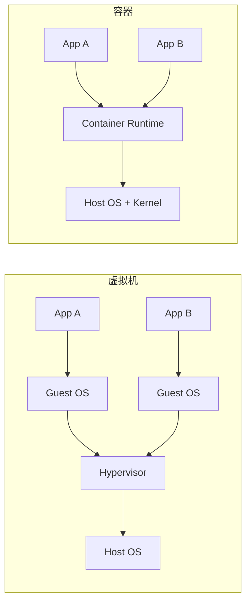
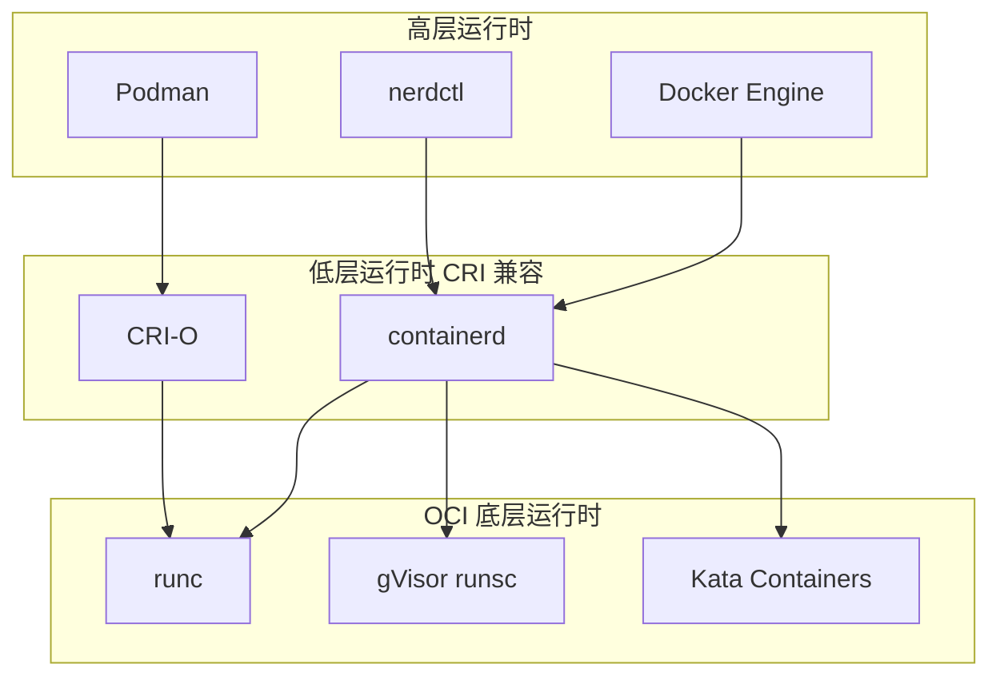
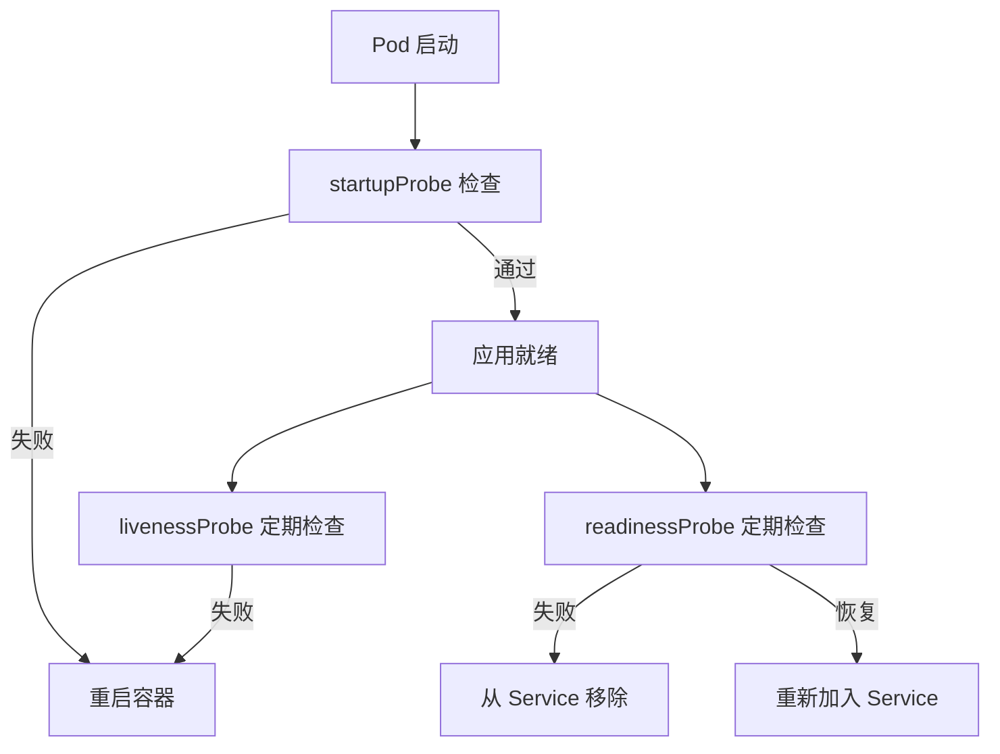
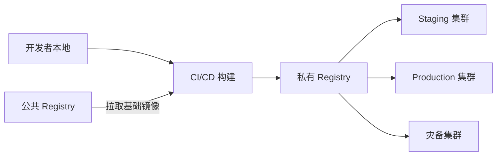
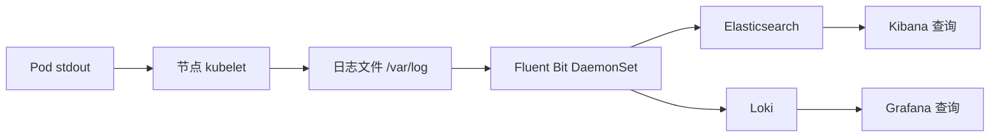

## 容器化深入

容器化是云原生架构的基石。第40章介绍了 Docker 和容器编排的基础知识，本节在此之上，聚焦云原生场景下的容器化工程实践——如何编写生产级 Dockerfile、如何优化镜像、如何保障容器安全、如何在 Kubernetes 中管理容器生命周期。这些实践直接决定了云原生架构的可靠性、性能和安全性。

### 1. 容器化的核心价值与定位

#### 1.1 为什么容器化是云原生的起点

CNCF（Cloud Native Computing Foundation）将云原生定义为"利用容器化、微服务、服务网格、声明式 API 和不可变基础设施等技术，构建可弹性扩展、可观测、韧性强的应用程序"。容器化在其中承担三重角色：

| 角色 | 说明 | 具体体现 |
|------|------|----------|
| **交付标准** | 统一应用交付格式 | "在我机器上能跑"的问题彻底消失 |
| **运行隔离** | 进程级资源隔离 | 多应用共享同一 OS，互不干扰 |
| **编排基础** | 为自动化编排提供粒度 | Kubernetes 以容器为最小调度单元 |

没有容器化，微服务的独立部署、弹性伸缩、故障隔离都无从谈起。容器不是"用了更好"的选项，而是云原生架构的必要条件。

#### 1.2 容器 vs 虚拟机：本质差异

很多团队在云原生转型时仍混淆容器与虚拟机的定位。二者的关键差异：



| 对比维度 | 虚拟机 | 容器 |
|----------|--------|------|
| 隔离级别 | 硬件级（Hypervisor） | 进程级（Namespace + Cgroup） |
| 启动时间 | 分钟级 | 秒级甚至毫秒级 |
| 镜像大小 | GB 级 | MB 级 |
| 资源开销 | 需要完整 Guest OS | 共享宿主机内核 |
| 安全边界 | 强隔离（攻击面小） | 较弱隔离（共享内核） |
| 适用场景 | 多租户隔离、强安全要求 | 微服务、CI/CD、弹性伸缩 |

**核心认知**：容器不是轻量级虚拟机。容器共享宿主机内核，这意味着容器的隔离性天然弱于虚拟机。在多租户场景或对安全有严格要求时，需要额外的安全措施（如 gVisor、Kata Containers）。

#### 1.3 容器运行时生态演进

Docker 不是唯一的容器运行时。CNCF 认可的容器运行时形成了清晰的分层：



- **Docker Engine**：功能最全，但体积大，包含构建、网络、存储等完整功能
- **containerd**：Docker 拆分出的行业标准运行时，Kubernetes 默认使用，负责镜像管理和容器生命周期
- **CRI-O**：专为 Kubernetes 设计的轻量级运行时，只做 Kubernetes 需要的事
- **runc**：OCI 标准的参考实现，创建和运行容器的最底层工具

**选型建议**：开发环境用 Docker/Podman（便利性），生产环境用 containerd（Kubernetes 已默认集成）。如果需要更强的隔离，考虑 gVisor（应用内核拦截系统调用）或 Kata Containers（轻量虚拟机）。

### 2. Dockerfile 最佳实践

Dockerfile 是容器化的"源代码"。一份糟糕的 Dockerfile 会导致镜像臃肿、构建缓慢、安全漏洞。以下是生产级 Dockerfile 的编写原则。

#### 2.1 基础镜像选择

**原则：选择最小的、有明确版本标签的、来自可信来源的镜像。**

```dockerfile
# ❌ 错误：使用 latest 标签，不可复现
FROM ubuntu:latest

# ❌ 错误：使用完整版镜像，体积过大
FROM python:3.12

# ✅ 正确：使用 slim 变体 + 固定版本
FROM python:3.12-slim-bookworm

# ✅ 最优：使用 distroless 镜像（Google 出品，无 shell、无包管理器）
FROM gcr.io/distroless/python3-debian12
```

基础镜像体积对比：

| 基础镜像 | 大小 | 包含内容 | 适用场景 |
|----------|------|----------|----------|
| `python:3.12` | ~1GB | 完整 Python + 工具链 | 仅用于开发调试 |
| `python:3.12-slim` | ~150MB | Python 运行时 + 最小依赖 | 生产环境 |
| `python:3.12-alpine` | ~50MB | Alpine Linux + Python | 需要包管理器的场景 |
| `distroless/python3` | ~30MB | 仅 Python 运行时 | 安全要求最高的生产环境 |
| `scratch` | 0MB | 空镜像 | Go/Rust 等静态编译语言 |

#### 2.2 构建缓存优化

Docker 按层缓存，一旦某层发生变化，其后所有层都需要重新构建。利用这个机制可以大幅加速迭代。

```dockerfile
# ❌ 错误：源码变更导致依赖重新安装
FROM python:3.12-slim-bookworm
WORKDIR /app
COPY . .
RUN pip install -r requirements.txt
RUN python -m pytest

# ✅ 正确：先复制依赖清单，再复制源码
FROM python:3.12-slim-bookworm
WORKDIR /app

# 第一步：仅安装依赖（缓存友好 — 只要 requirements.txt 不变，此层不重建）
COPY requirements.txt .
RUN pip install --no-cache-dir -r requirements.txt

# 第二步：复制源码（源码频繁变更，放在最后）
COPY . .

# 第三步：运行测试
RUN python -m pytest
```

**核心法则**：变化频率低的层放前面，变化频率高的层放后面。配置文件、依赖清单先复制，源代码后复制。

#### 2.3 多阶段构建

多阶段构建是减小镜像体积的最强手段——构建阶段使用完整工具链，运行阶段只保留运行时必需的文件。

```dockerfile
# ============ 构建阶段 ============
FROM node:20-bookworm AS builder
WORKDIR /app

# 安装依赖
COPY package.json package-lock.json ./
RUN npm ci --production=false

# 复制源码并构建
COPY . .
RUN npm run build          # 产出 dist/ 目录

# ============ 运行阶段 ============
FROM nginx:alpine AS runtime

# 仅复制构建产物
COPY --from=builder /app/dist /usr/share/nginx/html

# 复制自定义 nginx 配置
COPY nginx.conf /etc/nginx/conf.d/default.conf

EXPOSE 80
CMD ["nginx", "-g", "daemon off;"]
```

**效果对比**：

| 阶段 | 镜像内容 | 体积 |
|------|----------|------|
| builder 阶段 | Node.js + npm + 源码 + node_modules | ~1.2GB |
| runtime 阶段 | nginx + 静态文件 | ~25MB |
| 体积缩减 | | **98%** |

多阶段构建还天然实现了**构建环境与运行环境的隔离**：编译器、测试框架、开发依赖全部留在 builder 阶段，运行镜像只包含最小化的产物。

#### 2.4 安全加固

容器镜像的安全问题在生产中极为常见。2024 年 Sysdig 报告显示，超过 80% 的容器镜像存在已知漏洞。

```dockerfile
# ✅ 生产级安全 Dockerfile 模板
FROM python:3.12-slim-bookworm AS builder
WORKDIR /app

COPY requirements.txt .
RUN pip install --no-cache-dir -r requirements.txt

COPY . .

# ============ 运行阶段 ============
FROM python:3.12-slim-bookworm

# 1. 创建非 root 用户
RUN groupadd -r appuser &amp;&amp; useradd -r -g appuser -d /app -s /sbin/nologin appuser

# 2. 设置只读文件系统友好的目录
RUN mkdir -p /app /tmp &amp;&amp; chown -R appuser:appuser /app /tmp

WORKDIR /app

# 3. 从构建阶段复制代码和依赖
COPY --from=builder --chown=appuser:appuser /app /app
COPY --from=builder /usr/local/lib/python3.12/site-packages /usr/local/lib/python3.12/site-packages

# 4. 删除不必要的文件（减小攻击面）
RUN find /app -name "*.pyc" -delete &amp;&amp; \
    find /app -name "__pycache__" -delete &amp;&amp; \
    rm -rf /app/.git /app/.env /app/tests

# 5. 切换到非 root 用户
USER appuser

# 6. 健康检查
HEALTHCHECK --interval=30s --timeout=5s --start-period=10s --retries=3 \
    CMD ["python", "-c", "import urllib.request; urllib.request.urlopen('http://localhost:8000/health')"]

EXPOSE 8000
CMD ["python", "-m", "uvicorn", "main:app", "--host", "0.0.0.0", "--port", "8000"]
```

**安全清单**：

| 安全措施 | 重要性 | 具体做法 |
|----------|--------|----------|
| 非 root 用户运行 | 极高 | `USER appuser`，避免容器逃逸后获得 root 权限 |
| 固定基础镜像版本 | 高 | 避免 `latest`，用 SHA256 摘要锁定 |
| 只读文件系统 | 高 | Kubernetes 设置 `readOnlyRootFilesystem: true` |
| 删除敏感文件 | 高 | `.env`、`.git`、私钥等不进入镜像 |
| 扫描漏洞 | 高 | CI 中集成 Trivy、Grype 等扫描工具 |
| 最小权限原则 | 中 | 不安装不必要的系统包和工具 |
| 镜像签名 | 中 | 使用 cosign 或 Notary 进行镜像签名验证 |

#### 2.5 常见反模式

以下是生产中反复出现的 Dockerfile 反模式：

```dockerfile
# 反模式 1：在 RUN 中安装后不清理
RUN apt-get update &amp;&amp; apt-get install -y python3-dev gcc
# ✅ 修正：构建完成后清理
RUN apt-get update &amp;&amp; apt-get install -y --no-install-recommends python3-dev gcc &amp;&amp; \
    apt-get purge -y --auto-remove gcc &amp;&amp; \
    rm -rf /var/lib/apt/lists/*

# 反模式 2：使用 ADD 复制本地文件（语义不明确）
ADD app.tar.gz /app/
# ✅ 修正：本地文件用 COPY（ADD 会自动解压，容易被误用）
COPY app.tar.gz /app/
RUN tar -xzf /app/app.tar.gz -C /app/ &amp;&amp; rm /app/app.tar.gz

# 反模式 3：在镜像中硬编码密钥
ENV DB_PASSWORD=secret123
# ✅ 修正：密钥通过 Kubernetes Secret 或环境变量在运行时注入
# ENV DB_PASSWORD  # 留空，运行时注入

# 反模式 4：CMD 使用 shell 格式（信号无法正确传递）
CMD python app.py
# ✅ 修正：使用 exec 格式（PID 1 能正确接收 SIGTERM）
CMD ["python", "app.py"]
```

### 3. 镜像优化实战

#### 3.1 镜像体积分析

在优化之前，先了解镜像的构成。使用 `dive` 工具逐层分析：

```bash
# 安装 dive（镜像分析工具）
# macOS: brew install dive
# Linux: wget https://github.com/wagoodman/dive/releases/download/v0.12.0/dive_0.12.0_linux_amd64.deb
#        sudo dpkg -i dive_0.12.0_linux_amd64.deb

# 分析镜像层级
dive myapp:latest

# 常用分析命令（docker 自带）
docker history myapp:latest                     # 查看每层大小
docker inspect myapp:latest | jq '.[0].Size'    # 查看总大小
docker image ls --format "table {{.Repository}}\t{{.Tag}}\t{{.Size}}" # 列出所有镜像
```

`dive` 的交互界面可以逐层查看每个 Dockerfile 指令引入了哪些文件、占用了多少空间，是镜像优化的核心工具。

#### 3.2 各语言镜像优化策略

不同语言的容器化有不同的优化路径：

**Go 应用（静态编译，最优选择）**

```dockerfile
# 阶段 1：构建
FROM golang:1.22-bookworm AS builder
WORKDIR /src
COPY go.mod go.sum ./
RUN go mod download
COPY . .
RUN CGO_ENABLED=0 GOOS=linux go build -ldflags="-s -w" -o /app/server .

# 阶段 2：运行（scratch 空镜像，最终产物仅 ~10MB）
FROM scratch
COPY --from=builder /etc/ssl/certs/ca-certificates.crt /etc/ssl/certs/
COPY --from=builder /app/server /server
EXPOSE 8080
ENTRYPOINT ["/server"]
```

**Java 应用（JAR 体积大，需要特殊处理）**

```dockerfile
FROM eclipse-temurin:21-jre-alpine AS runtime
WORKDIR /app

# 使用 JLink 自定义 JRE（仅包含实际使用的模块）
FROM eclipse-temurin:21-jdk-alpine AS jlink
RUN jlink --add-modules $(jdeps --print-module-deps app.jar | tr ',' '\n' | sort -u | tr '\n' ',') \
    --strip-debug --no-man-pages --output /custom-jre

# 运行阶段使用自定义 JRE
FROM alpine:3.19
COPY --from=jlink /custom-jre /jre
ENV PATH="/jre/bin:$PATH"
COPY --from=builder /app/app.jar /app.jar
CMD ["java", "-jar", "/app.jar"]
```

**Python 应用（依赖安装慢，缓存是关键）**

```dockerfile
FROM python:3.12-slim-bookworm AS builder
WORKDIR /app

# 利用缓存安装依赖
COPY requirements.txt .
RUN --mount=type=cache,target=/root/.cache/pip \
    pip install -r requirements.txt

COPY . .

FROM python:3.12-slim-bookworm
COPY --from=builder /usr/local/lib/python3.12/site-packages /usr/local/lib/python3.12/site-packages
COPY --from=builder /app /app
WORKDIR /app
CMD ["python", "main.py"]
```

#### 3.3 构建速度优化

在 CI/CD 流水线中，镜像构建速度直接影响部署频率：

```bash
# 1. 使用 BuildKit（Docker 18.09+ 默认启用）
DOCKER_BUILDKIT=1 docker build -t myapp:latest .

# 2. 使用构建缓存挂载（避免重复下载依赖）
docker build --build-arg BUILDKIT_INLINE_CACHE=1 -t myapp:latest .

# 3. 使用远程缓存（团队共享构建缓存）
docker build \
  --cache-from type=registry,ref=myregistry/myapp:cache \
  --cache-to type=registry,ref=myregistry/myapp:cache,mode=max \
  -t myapp:latest .

# 4. 并行构建多阶段
# 在 docker buildx 中，不相互依赖的阶段会自动并行
docker buildx build --progress=plain -t myapp:latest .

# 5. 使用 .dockerignore 排除无关文件
cat > .dockerignore << 'EOF'
.git
.github
node_modules
*.md
.env
.env.*
tests/
coverage/
__pycache__
*.pyc
EOF
```

### 4. 容器网络深入

#### 4.1 Docker 网络模式

Docker 提供四种网络模式，各自适用于不同场景：

| 网络模式 | 隔离性 | 性能 | 适用场景 |
|----------|--------|------|----------|
| bridge | 中（NAT） | 中 | 单机多容器默认选择 |
| host | 无 | 最高 | 高性能网络应用 |
| overlay | 高 | 中低 | 跨主机容器通信（Swarm/K8s） |
| none | 完全隔离 | N/A | 安全敏感的计算任务 |

```bash
# 创建自定义 bridge 网络（推荐）
docker network create --driver bridge \
  --subnet 172.20.0.0/16 \
  --ip-range 172.20.240.0/20 \
  app-network

# 启动容器并加入网络
docker run -d --name api --network app-network myapi:latest
docker run -d --name db --network app-network postgres:16-alpine

# 容器之间通过服务名直接通信
# api 容器中可直接 ping db:5432
```

#### 4.2 Kubernetes 网络模型

Kubernetes 的网络模型比 Docker 更加抽象，遵循三条基本原则：

1. **每个 Pod 有独立 IP**：Pod 之间可以直接通信，无需 NAT
2. **节点与 Pod 通信**：节点可以直接访问其上所有 Pod 的 IP
3. **Pod 看到的自己的 IP 与其他 Pod 看到的一致**：不存在地址转换

```yaml
# Kubernetes NetworkPolicy 示例：限制 Pod 间通信
apiVersion: networking.k8s.io/v1
kind: NetworkPolicy
metadata:
  name: api-network-policy
  namespace: production
spec:
  podSelector:
    matchLabels:
      app: api-server
  policyTypes:
    - Ingress
    - Egress
  ingress:
    - from:
        - podSelector:
            matchLabels:
              app: web-frontend
        - namespaceSelector:
            matchLabels:
              env: production
      ports:
        - protocol: TCP
          port: 8080
  egress:
    - to:
        - podSelector:
            matchLabels:
              app: database
      ports:
        - protocol: TCP
          port: 5432
```

**常见网络问题排查**：

```bash
# Pod 间无法通信时的排查步骤
kubectl exec -it debug-pod -- nslookup api-service.production.svc.cluster.local
kubectl exec -it debug-pod -- curl -v http://api-service:8080/health
kubectl describe networkpolicy api-network-policy -n production
kubectl logs -n kube-system -l k8s-app=calico-node  # CNI 日志
```

### 5. 容器存储与数据管理

#### 5.1 存储类型对比

| 存储类型 | 持久性 | 性能 | 适用场景 |
|----------|--------|------|----------|
| emptyDir | Pod 生命周期内 | 本地磁盘速度 | 缓存、临时文件 |
| hostPath | 节点级别 | 本地磁盘速度 | 日志收集、单节点测试 |
| PersistentVolume (PV) | 独立于 Pod | 取决于后端存储 | 数据库、有状态服务 |
| ConfigMap/Secret | 集群级别 | N/A（配置数据） | 配置文件、环境变量 |

```yaml
# PersistentVolumeClaim + StorageClass 示例
apiVersion: v1
kind: PersistentVolumeClaim
metadata:
  name: database-pvc
spec:
  accessModes:
    - ReadWriteOnce
  storageClassName: fast-ssd        # 使用 SSD 存储类
  resources:
    requests:
      storage: 50Gi

---
apiVersion: apps/v1
kind: StatefulSet
metadata:
  name: postgresql
spec:
  replicas: 3
  serviceName: postgresql
  selector:
    matchLabels:
      app: postgresql
  template:
    metadata:
      labels:
        app: postgresql
    spec:
      containers:
        - name: postgresql
          image: postgres:16-alpine
          volumeMounts:
            - name: data
              mountPath: /var/lib/postgresql/data
          env:
            - name: PGDATA
              value: /var/lib/postgresql/data/pgdata
  volumeClaimTemplates:
    - metadata:
        name: data
      spec:
        accessModes: ["ReadWriteOnce"]
        storageClassName: fast-ssd
        resources:
          requests:
            storage: 50Gi
```

#### 5.2 有状态容器的挑战

数据库、消息队列等有状态应用的容器化是云原生的难点。关键考量：

- **数据持久化**：必须使用 PV/PVC，不能依赖容器本地存储
- **优雅关闭**：应用需要正确处理 SIGTERM 信号，完成数据刷盘
- **启动顺序**：有状态服务的启动可能依赖初始化脚本（initContainers）
- **备份策略**：Velero 等工具可以备份 PV 数据，但数据库层面的备份仍不可替代

### 6. 容器健康检查与生命周期管理

#### 6.1 三种健康检查机制

```yaml
apiVersion: apps/v1
kind: Deployment
metadata:
  name: api-server
spec:
  replicas: 3
  selector:
    matchLabels:
      app: api-server
  template:
    spec:
      containers:
        - name: api-server
          image: myapi:latest

          # 存活检查：容器是否还在运行？
          # 失败 → Kubernetes 重启容器
          livenessProbe:
            httpGet:
              path: /health/live
              port: 8080
            initialDelaySeconds: 15    # 给应用启动时间
            periodSeconds: 10
            timeoutSeconds: 3
            failureThreshold: 3         # 连续 3 次失败才判定不健康

          # 就绪检查：容器是否准备好接收流量？
          # 失败 → 从 Service 端点移除，不接收新请求
          readinessProbe:
            httpGet:
              path: /health/ready
              port: 8080
            initialDelaySeconds: 5
            periodSeconds: 5
            timeoutSeconds: 3
            failureThreshold: 3

          # 启动检查：容器是否完成初始化？
          # 失败 → 重启容器（替代 initialDelaySeconds 的新方案）
          startupProbe:
            httpGet:
              path: /health/started
              port: 8080
            periodSeconds: 5
            failureThreshold: 30       # 允许最多 150 秒启动时间
            timeoutSeconds: 3
```

**三种探针的协作关系**：



#### 6.2 优雅关闭

容器在被终止时需要正确处理正在处理的请求：

```python
# Python FastAPI 优雅关闭示例
import signal
import asyncio
from fastapi import FastAPI

app = FastAPI()
shutdown_event = asyncio.Event()

@app.on_event("startup")
async def startup():
    # 初始化资源：数据库连接、消息队列消费者等
    app.state.db_pool = await create_db_pool()
    app.state.mq_consumer = await start_mq_consumer()

@app.on_event("shutdown")
async def shutdown():
    # 1. 停止接收新请求（Kubernetes 已从 Service 端点移除）
    # 2. 等待正在处理的请求完成
    shutdown_event.set()
    # 3. 释放资源
    await app.state.mq_consumer.stop()
    await app.state.db_pool.close()

# Kubernetes 优雅关闭时间线：
# 1. 发送 SIGTERM
# 2. 等待 terminationGracePeriodSeconds（默认 30s）
# 3. 如果未退出，发送 SIGKILL 强制终止
# 4. 从 Service 端点移除 Pod IP
```

**关键配置**：

```yaml
spec:
  terminationGracePeriodSeconds: 60    # 给应用足够时间完成清理
  containers:
    - name: api-server
      lifecycle:
        preStop:
          exec:
            command: ["/bin/sh", "-c", "sleep 5"]  # 等待 Endpoint 更新传播
```

`preStop` 的 sleep 看似多余，实则关键：Pod 被标记为终止后，Kubernetes 需要时间将 Endpoint 变更传播到所有节点上的 kube-proxy。在没有 sleep 的情况下，仍有请求路由到正在关闭的 Pod，导致请求失败。

### 7. 容器安全纵深防御

#### 7.1 安全威胁模型

容器面临的安全威胁可分为四个层面：

| 层面 | 威胁 | 防御措施 |
|------|------|----------|
| **镜像层** | 恶意基础镜像、已知漏洞、硬编码密钥 | 镜像扫描、签名验证、可信基础镜像 |
| **运行时层** | 容器逃逸、恶意提权、资源滥用 | 非 root 运行、只读文件系统、资源限制 |
| **编排层** | 未授权 API 访问、RBAC 配置错误 | RBAC、审计日志、API 访问控制 |
| **网络层** | 未加密通信、未授权访问 | mTLS、NetworkPolicy、API 网关 |

#### 7.2 Kubernetes 安全配置

```yaml
# 安全上下文配置
apiVersion: apps/v1
kind: Deployment
metadata:
  name: secure-app
spec:
  template:
    spec:
      securityContext:
        runAsNonRoot: true
        runAsUser: 1000
        runAsGroup: 1000
        fsGroup: 1000
        seccompProfile:
          type: RuntimeDefault
      containers:
        - name: app
          image: myapp:latest
          securityContext:
            allowPrivilegeEscalation: false
            readOnlyRootFilesystem: true
            capabilities:
              drop:
                - ALL
          resources:
            limits:
              memory: "256Mi"
              cpu: "500m"
            requests:
              memory: "128Mi"
              cpu: "100m"
          volumeMounts:
            - name: tmp
              mountPath: /tmp
      volumes:
        - name: tmp
          emptyDir: {}    # 为只读文件系统提供可写 /tmp
```

**Pod Security Standards**（Kubernetes 1.25+ 替代 PodSecurityPolicy）：

| 级别 | 允许 | 适用场景 |
|------|------|----------|
| Privileged | 无限制 | 系统组件（如 CNI、存储驱动） |
| Baseline | 限制特权升级 | 大部分工作负载的默认选择 |
| Restricted | 严格限制 | 安全敏感的工作负载 |

#### 7.3 镜像安全扫描

```yaml
# 在 CI/CD 中集成 Trivy 扫描
# GitHub Actions 示例
- name: Run Trivy vulnerability scanner
  uses: aquasecurity/trivy-action@master
  with:
    image-ref: 'myregistry/myapp:${{ github.sha }}'
    format: 'sarif'
    output: 'trivy-results.sarif'
    severity: 'CRITICAL,HIGH'
    exit-code: '1'          # 发现高危漏洞时构建失败

# 在集群中持续扫描（使用 Trivy Operator）
# kubectl apply -f https://raw.githubusercontent.com/aquasecurity/trivy-operator/main/deploy/trivy-operator.yaml
```

### 8. 镜像仓库与分发策略

#### 8.1 仓库架构



**主流 Registry 对比**：

| Registry | 特点 | 适用场景 |
|----------|------|----------|
| Docker Hub | 公共镜像最大、限速 | 公共基础镜像来源 |
| Harbor | CNCF 项目、企业级功能、漏洞扫描 | 私有部署、合规要求高的企业 |
| AWS ECR | 深度集成 EKS/IAM | AWS 生态 |
| GCR/Artifact Registry | 深度集成 GKE | GCP 生态 |
| ACR | 深度集成 AKS | Azure 生产 |

#### 8.2 镜像标签策略

```bash
# 推荐的标签命名规范
# 1. 语义化版本（推荐用于正式发布）
myapp:v1.2.3

# 2. Git SHA（推荐用于每次构建）
myapp:abc1234          # 短 SHA
myapp:abc1234def5678   # 完整 SHA

# 3. 分支名（推荐用于开发环境）
myapp:main-latest
myapp:feature-xyz

# ❌ 避免使用 latest 作为生产标签
# latest 语义模糊，无法追溯具体版本
```

### 9. 容器监控与可观测性

#### 9.1 容器层指标

容器化的可观测性分为三个维度：

| 维度 | 工具 | 采集内容 |
|------|------|----------|
| **Metrics** | Prometheus + cAdvisor | CPU、内存、磁盘 I/O、网络流量 |
| **Logs** | Fluentd/FluentBit → Elasticsearch | stdout/stderr 输出 |
| **Traces** | Jaeger/Tempo | 分布式调用链 |

```yaml
# Kubernetes 内置资源监控
# 查看 Pod 资源使用
kubectl top pods -n production --sort-by=memory
kubectl top pods -n production --sort-by=cpu

# 查看节点资源使用
kubectl top nodes

# 部署 Metrics Server（HPA 依赖）
kubectl apply -f https://github.com/kubernetes-sigs/metrics-server/releases/latest/download/components.yaml

# 配置 HPA 自动扩缩
apiVersion: autoscaling/v2
kind: HorizontalPodAutoscaler
metadata:
  name: api-hpa
spec:
  scaleTargetRef:
    apiVersion: apps/v1
    kind: Deployment
    name: api-server
  minReplicas: 2
  maxReplicas: 20
  metrics:
    - type: Resource
      resource:
        name: cpu
        target:
          type: Utilization
          averageUtilization: 70
    - type: Resource
      resource:
        name: memory
        target:
          type: Utilization
          averageUtilization: 80
  behavior:
    scaleUp:
      stabilizationWindowSeconds: 60
      policies:
        - type: Pods
          value: 4
          periodSeconds: 60
    scaleDown:
      stabilizationWindowSeconds: 300
      policies:
        - type: Percent
          value: 10
          periodSeconds: 60
```

#### 9.2 日志收集模式



**核心原则**：应用将日志输出到 stdout/stderr，由基础设施层（DaemonSet）负责收集和转发。应用不关心日志去向——这正是云原生"不可变基础设施"理念的体现。

```python
# 应用层日志最佳实践（Python 示例）
import structlog
import json
import sys

# 结构化日志输出到 stdout
structlog.configure(
    processors=[
        structlog.processors.TimeStamper(fmt="iso"),
        structlog.processors.add_log_level,
        structlog.processors.JSONRenderer()
    ],
    logger_factory=structlog.PrintLoggerFactory(file=sys.stdout),
)

logger = structlog.get_logger()

# 日志格式：结构化 JSON，便于日志系统解析
logger.info("order_created",
    order_id="ORD-2024-001",
    user_id="U-12345",
    amount=299.00,
    item_count=3
)
# 输出：{"event": "order_created", "order_id": "ORD-2024-001", "user_id": "U-12345", "amount": 299.0, "item_count": 3, "level": "info", "timestamp": "2024-01-15T10:30:00Z"}
```

### 10. 常见误区与纠正

#### 误区 1：一个容器放多个进程

```yaml
# ❌ 错误：在同一个容器中运行 Web 服务器 + 日志收集器 + 监控 Agent
containers:
  - name: everything-container
    image: myapp-bundle
    # 同时运行 nginx + fluentd + node-exporter
    command: ["/bin/sh", "-c", "nginx &amp; fluentd &amp; node-exporter &amp;"]

# ✅ 正确：每个容器一个进程，通过 sidecar 模式组合
containers:
  - name: app
    image: myapp:latest
  - name: log-collector
    image: fluentd:latest
  - name: metrics-exporter
    image: node-exporter:latest
```

**为什么一个容器一个进程？** 进程管理（重启、扩缩、健康检查）需要精确的信号传递。如果容器内有多个进程，`docker stop` 的 SIGTERM 只会发送给 PID 1，其他进程无法正确响应。

#### 误区 2：在容器中存储状态

```yaml
# ❌ 错误：将用户上传的文件存储在容器本地
# 容器重启后数据丢失
volumeMounts:
  - name: uploads
    mountPath: /app/uploads

# ✅ 正确：使用对象存储（如 S3/MinIO）或持久卷
env:
  - name: STORAGE_BACKEND
    value: "s3"
  - name: S3_BUCKET
    value: "myapp-uploads"
```

#### 误区 3：忽略资源限制

```yaml
# ❌ 错误：不设置资源限制
# 一个容器可能耗尽节点所有资源，影响其他容器
containers:
  - name: app
    image: myapp:latest
    # 没有 resources 配置

# ✅ 正确：始终设置 requests 和 limits
containers:
  - name: app
    image: myapp:latest
    resources:
      requests:
        cpu: "100m"      # 0.1 核，调度保证
        memory: "128Mi"  # 调度保证
      limits:
        cpu: "500m"      # 最多使用 0.5 核
        memory: "256Mi"  # 超过则 OOMKilled
```

**requests vs limits 的含义**：

- `requests`：调度器据此选择节点（确保节点有足够资源）
- `limits`：运行时硬上限（CPU 超限被限流，内存超限被 OOM Kill）

#### 误区 4：使用 latest 标签部署生产

```yaml
# ❌ 错误：latest 标签不可复现
image: myapp:latest

# ✅ 正确：使用明确的版本标签或 SHA 摘要
image: myapp:v1.2.3
# 或更严格：
image: myregistry/myapp@sha256:abc123...
```

`latest` 的问题在于：同一时刻不同节点拉取的 `latest` 可能是不同版本；回滚时无法确定回滚到哪个版本；安全扫描无法准确评估运行中的镜像。

#### 误区 5：健康检查只做端口存活检测

```yaml
# ❌ 不够的健康检查：仅检测端口是否开放
livenessProbe:
  tcpSocket:
    port: 8080

# ✅ 充分的健康检查：检测应用实际健康状态
livenessProbe:
  httpGet:
    path: /health/live       # 检查应用进程是否正常
    port: 8080
readinessProbe:
  httpGet:
    path: /health/ready      # 检查依赖（DB/Redis/外部API）是否就绪
    port: 8080
```

端口存活不代表应用健康——进程可能还在运行但已经死锁，或者数据库连接池已耗尽无法处理新请求。健康检查应该反映应用的实际服务能力。

### 11. 实战：生产级容器化全流程

以下是一个完整的从 Dockerfile 到 Kubernetes 部署的端到端流程：

```bash
# === 第一步：构建优化镜像 ===
# 编写 .dockerignore
cat > .dockerignore << 'EOF'
.git
.env*
node_modules
__pycache__
*.pyc
tests/
coverage/
docs/
EOF

# 构建镜像
DOCKER_BUILDKIT=1 docker build \
  --build-arg BUILDKIT_INLINE_CACHE=1 \
  --cache-from myregistry/myapp:cache \
  -t myregistry/myapp:v1.2.3 \
  -t myregistry/myapp:cache .

# === 第二步：安全扫描 ===
trivy image --severity HIGH,CRITICAL --exit-code 1 myregistry/myapp:v1.2.3

# === 第三步：推送镜像 ===
docker push myregistry/myapp:v1.2.3
docker push myregistry/myapp:cache

# === 第四步：部署到 Kubernetes ===
kubectl apply -f k8s/deployment.yaml
kubectl rollout status deployment/api-server -n production

# === 第五步：验证部署 ===
# 检查 Pod 状态
kubectl get pods -n production -l app=api-server

# 检查健康检查
kubectl describe pod -n production -l app=api-server | grep -A5 "Liveness\|Readiness"

# 检查日志
kubectl logs -n production -l app=api-server --tail=50

# 检查资源使用
kubectl top pods -n production -l app=api-server

# === 第六步：回滚（如果需要）===
kubectl rollout undo deployment/api-server -n production
kubectl rollout history deployment/api-server -n production
```

### 12. 容器化成熟度检查清单

| 检查项 | 级别 | 说明 |
|--------|------|------|
| 基础镜像使用 slim/distroless | 基础 | 镜像体积控制在合理范围 |
| Dockerfile 使用多阶段构建 | 基础 | 构建依赖不进入运行镜像 |
| 非 root 用户运行 | 基础 | 容器不以 root 身份运行 |
| 设置资源 requests/limits | 基础 | 避免资源争抢 |
| 配置健康检查探针 | 基础 | liveness + readiness 均配置 |
| CI 中集成镜像扫描 | 进阶 | Trivy/Grype 自动扫描漏洞 |
| 使用 .dockerignore | 基础 | 排除无关文件减小镜像 |
| 镜像使用确定性版本标签 | 基础 | 不使用 latest 标签 |
| 配置 NetworkPolicy | 进阶 | Pod 间网络访问控制 |
| 实现优雅关闭 | 进阶 | 正确处理 SIGTERM 信号 |
| 镜像签名验证 | 高级 | cosign/Notary 镜像签名 |
| 只读根文件系统 | 高级 | readOnlyRootFilesystem: true |
| Seccomp/AppArmor 配置 | 高级 | 系统调用级别安全限制 |
| 镜像构建缓存优化 | 进阶 | BuildKit + 远程缓存 |

### 本节小结

容器化在云原生架构中扮演的角色远不止"打包应用"这么简单。它是应用交付的标准格式、编排调度的基本单元、安全隔离的第一道防线。本节的核心要点：

1. **镜像质量决定运行质量**：多阶段构建、最小基础镜像、安全加固三管齐下
2. **Dockerfile 是生产代码**：遵循缓存优化、安全最佳实践、单一进程原则
3. **安全是多层防御**：从镜像扫描到运行时限制，从 NetworkPolicy 到 RBAC，每一层都不能缺
4. **可观测性从容器层开始**：健康检查、结构化日志、资源监控是容器化的标配
5. **容器不存储状态**：有状态数据交给持久卷或外部存储，容器保持无状态可替换

容器化是一个看似简单、实则细节极多的领域。一个成熟的容器化实践，需要安全、可观测性、构建优化、运行时管理等多方面能力的协同。在后续的微服务拆分和服务编排章节中，这些容器化实践将作为基础被进一步应用和扩展。
