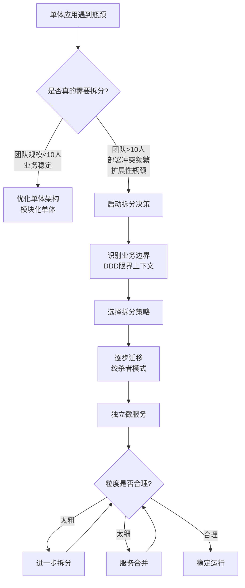
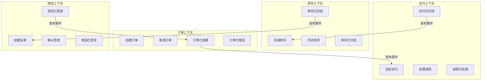
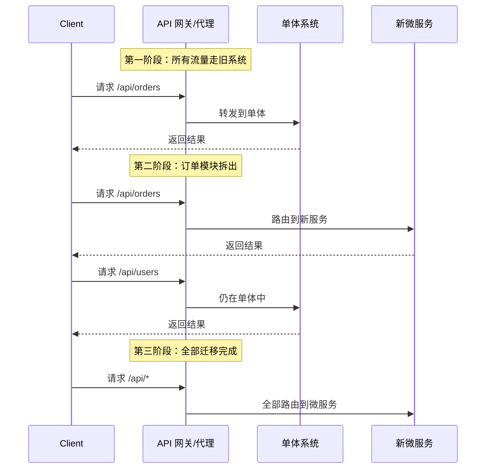
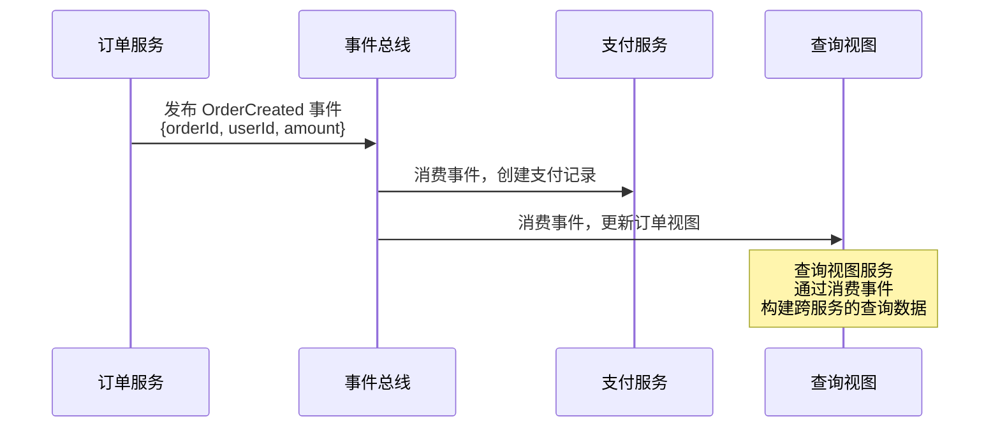
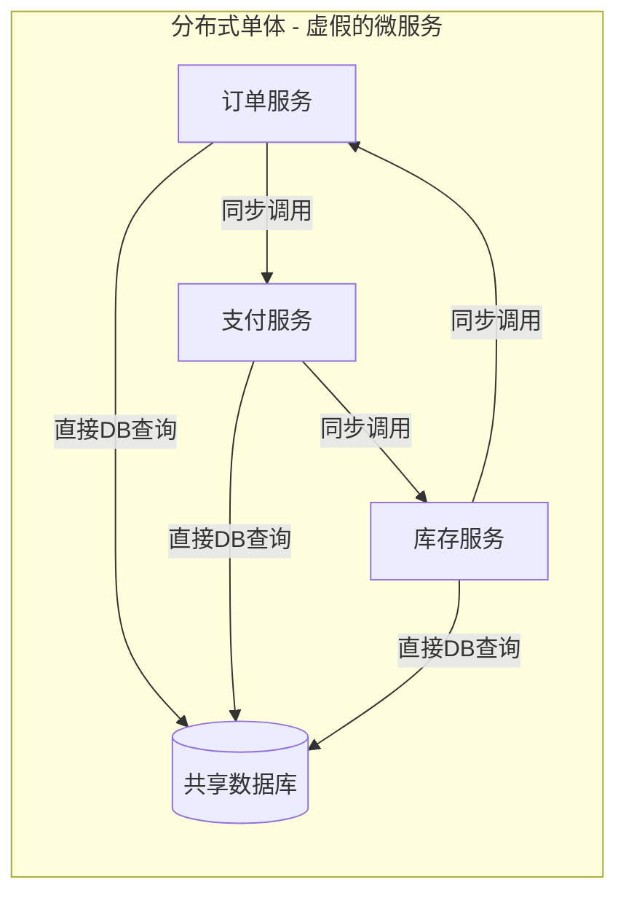
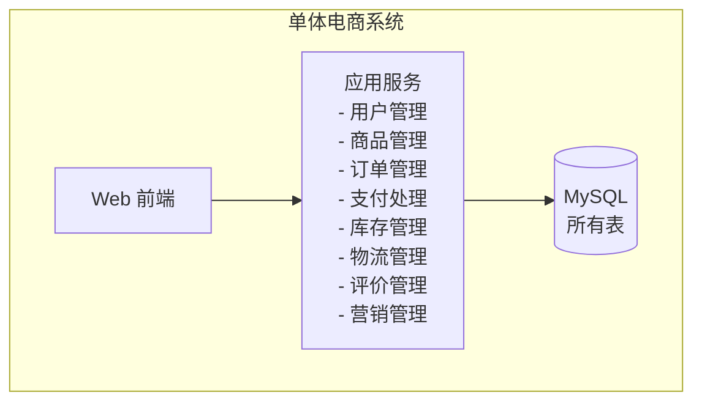
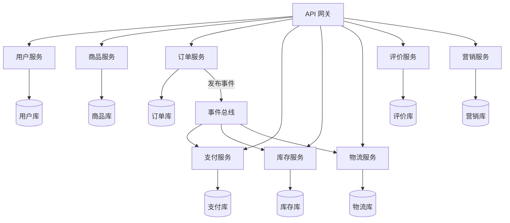

## 二、微服务拆分

### 一、为什么拆分如此困难

微服务架构的愿景很美好：每个服务独立开发、独立部署、独立扩缩。但现实是，大量团队在拆分过程中陷入"分布式单体"——物理上分开了，逻辑上依然是一个巨石应用，却额外承担了网络延迟、数据一致性、运维复杂度等所有分布式系统的代价。

拆分之所以困难，根源在于三个认知陷阱：

1. **边界模糊性**：业务领域之间的边界从来不是天然清晰的。订单和支付的边界在哪？用户和会员的边界在哪？没有标准答案，只有权衡。
2. **粒度悖论**：拆得太粗等于没拆，拆得太细引入爆炸性复杂度。Netflix 从 300 个微服务合并回部分模块化的经验表明，粒度问题贯穿系统全生命周期。
3. **数据耦合**：代码可以轻易切分，但数据库表之间的外键关联、跨表查询、共享数据模型是最难解耦的。

本节的目标不是教你"怎么拆"，而是教你"怎么决定拆不拆、拆多细、按什么拆"——这是架构决策，不是技术操作。



### 二、拆分前的决策框架：到底要不要拆

不是所有系统都需要微服务。在启动拆分之前，必须回答以下问题：

| 评估维度 | 适合微服务的信号 | 不适合微服务的信号 |
|---------|----------------|------------------|
| **团队规模** | 多个团队（>10人）需要独立开发不同模块 | 单个小团队（<8人），沟通成本低 |
| **发布节奏** | 不同模块需要独立、高频发布 | 整体发布节奏可控，变更频率低 |
| **扩展需求** | 不同模块有差异化的扩展需求（如搜索需要10x算力） | 整体负载均匀，统一扩缩足够 |
| **技术异构** | 不同模块适合不同技术栈（如 ML 用 Python，API 用 Go） | 技术栈统一，没有异构需求 |
| **故障隔离** | 一个模块故障不应拖垮全局 | 模块间强耦合，拆开反而增加故障面 |
| **合规要求** | 不同模块有不同的数据合规边界（如支付需要 PCI-DSS） | 统一合规要求 |

**关键原则：如果你犹豫要不要拆，答案大概率是不拆。** 先把单体做好模块化（Modular Monolith），再根据实际痛点决定拆分策略。

#### 模块化单体作为过渡方案

模块化单体是在不引入分布式复杂度的前提下，为未来拆分打基础的最佳策略：

```java
// 模块化单体：通过 package/module 边界实现逻辑隔离
// src/main/java/com/shop/
//   ├── order/          // 订单模块
//   │   ├── OrderService.java
//   │   ├── OrderRepository.java
//   │   └── OrderController.java
//   ├── payment/        // 支付模块
//   │   ├── PaymentService.java
//   │   ├── PaymentRepository.java
//   │   └── PaymentController.java
//   └── catalog/        // 商品模块
//       ├── CatalogService.java
//       ├── CatalogRepository.java
//       └── CatalogController.java

// 模块间通过接口通信，禁止直接访问其他模块的内部实现
public class OrderService {
    private final PaymentService paymentService;  // 通过接口依赖
    
    public Order createOrder(CreateOrderRequest request) {
        Order order = Order.create(request);
        // 通过接口调用，而非直接访问 PaymentRepository
        paymentService.initiatePayment(order);
        return order;
    }
}

// 每个模块通过接口暴露能力
public interface PaymentService {
    PaymentResult initiatePayment(Order order);
}
```

模块化单体的核心规则：

1. **模块间通过接口通信**：禁止直接 import 其他模块的内部类
2. **数据库按模块分 schema**：同一数据库实例内，每个模块使用独立 schema，禁止跨 schema JOIN
3. **独立测试**：每个模块可以单独运行单元测试和集成测试
4. **渐进拆分**：当某个模块的痛点足够大时，将其抽取为独立服务

### 三、DDD 限界上下文：确定服务边界的唯一可靠方法

领域驱动设计（Domain-Driven Design）的限界上下文（Bounded Context）是确定微服务边界的最权威方法论。它的核心思想是：**一个微服务应该对应一个限界上下文。**

#### 3.1 什么是限界上下文

同一个业务概念在不同上下文中可能有完全不同的含义。以"商品"为例：

- **目录上下文**：商品是一个可浏览的实体，包含名称、描述、图片、分类
- **库存上下文**：商品是一个 SKU，包含库存数量、仓库位置、补货策略
- **订单上下文**：商品是一个购买项，包含价格快照、数量、折扣
- **物流上下文**：商品是一个包裹内容物，包含重量、尺寸、危险品等级

如果不划分限界上下文，把这些全部塞进一个 `Product` 模型，你会得到一个承载了所有业务复杂度的上帝类。限界上下文的划分意味着：每个上下文内有自己独立的模型、术语和业务规则。

#### 3.2 事件风暴：发现限界上下文的实践方法

事件风暴（Event Storming）是 Alberto Brandolini 发明的协作工作坊方法，用于发现领域事件和限界上下文：

**步骤一：识别领域事件**

召集产品、开发、业务专家，在一面大墙上用橙色便利贴列出所有"已发生的事实"：

[订单已创建]  [支付已完成]  [库存已扣减]  [商品已发货]
[退款已发起]  [评价已提交]  [优惠券已使用]  [物流已签收]

**步骤二：确定命令和聚合**

事件是什么命令触发的？谁负责执行这个命令？

命令：[创建订单]  → 聚合：订单  → 事件：[订单已创建]
命令：[处理支付]  → 聚合：支付  → 事件：[支付已完成]
命令：[扣减库存]  → 聚合：库存  → 事件：[库存已扣减]
命令：[发货]      → 聚合：物流  → 事件：[商品已发货]

**步骤三：划定限界上下文**

将关联紧密的聚合划入同一限界上下文，上下文之间通过明确的接口（API 或事件）通信：



#### 3.3 限界上下文之间的集成模式

限界上下文确定后，需要选择上下文之间的通信方式：

| 模式 | 描述 | 优点 | 缺点 | 适用场景 |
|------|------|------|------|---------|
| **共享内核** | 两个上下文共享一部分模型定义 | 减少重复 | 引入耦合，版本协调困难 | 高度相关的上下文（如用户认证） |
| **客户-供应商** | 上游提供 API，下游消费 | 边界清晰 | 上游变更影响下游 | 明确的上下游依赖 |
| **防腐层（ACL）** | 下游维护一个翻译层，将外部模型转换为内部模型 | 完全解耦 | 翻译逻辑增加复杂度 | 集成遗留系统或第三方服务 |
| **开放主机服务** | 上游提供标准化 API（如 OpenAPI） | 一对多服务能力 | 需要维护 API 版本 | 多个下游消费同一服务 |
| **各行其道** | 各上下文完全独立，无直接依赖 | 最大独立性 | 可能存在功能重叠 | 业务完全不相关的上下文 |

**防腐层实战示例**：订单服务集成第三方物流

```java
// 第三方物流 API 返回的模型（我们无法控制）
public class ThirdPartyShippingResponse {
    private String waybillNo;
    private int state;  // 0=待揽收, 1=运输中, 2=已签收
    private String remark;
}

// 我们的物流领域模型
public class Shipment {
    private WaybillNumber waybillNumber;  // 值对象
    private ShipmentStatus status;         // 枚举
    
    public enum ShipmentStatus {
        PENDING, IN_TRANSIT, DELIVERED, EXCEPTION
    }
}

// 防腐层：翻译外部模型为内部模型
public class ShippingACL {
    public Shipment toDomain(ThirdPartyShippingResponse response) {
        ShipmentStatus status;
        switch (response.getState()) {
            case 0:  status = ShipmentStatus.PENDING; break;
            case 1:  status = ShipmentStatus.IN_TRANSIT; break;
            case 2:  status = ShipmentStatus.DELIVERED; break;
            default: status = ShipmentStatus.EXCEPTION; break;
        }
        return new Shipment(
            new WaybillNumber(response.getWaybillNo()),
            status
        );
    }
}
```

### 四、拆分策略：从单体到微服务的迁移路径

确定了目标架构后，核心问题是如何从现有单体逐步迁移到微服务。直接重写（Big Bang Rewrite）几乎必然失败，正确的方式是渐进式迁移。

#### 4.1 绞杀者模式（Strangler Fig Pattern）

绞杀者模式得名于热带雨林中绞杀榕缠绕宿主树木、逐步替代其结构的生长方式。核心思想是：**在旧系统旁边构建新系统，通过代理层逐步将流量从旧系统路由到新系统，直到旧系统完全被替代。**



**实施步骤**：

1. **在单体前端放置代理层**：API 网关或反向代理（Nginx/ Kong/ Envoy）
2. **选择一个模块优先拆出**：选择耦合度低、边界清晰、有独立价值的模块
3. **在代理层添加路由规则**：新模块的流量路由到新服务，其余仍走单体
4. **逐步迁移模块**：按照优先级依次迁移，每迁移一个模块都要确保稳定
5. **清理遗留代码**：当一个模块完全迁移后，从单体中删除对应代码

#### 4.2 分支抽取模式（Branch by Abstraction）

当模块间存在直接代码调用时，不能简单地将流量切换到新服务。分支抽取模式通过在代码层引入抽象接口，将内部调用替换为接口调用，再逐步将接口实现从本地切换为远程：

```java
// 第一步：引入抽象接口
public interface InventoryChecker {
    boolean checkAvailability(String productId, int quantity);
}

// 第二步：旧实现（本地直接调用数据库）
public class LocalInventoryChecker implements InventoryChecker {
    @Override
    public boolean checkAvailability(String productId, int quantity) {
        // 直接查询本地数据库
        return inventoryRepository.getStock(productId) >= quantity;
    }
}

// 第三步：新实现（远程调用微服务）
public class RemoteInventoryChecker implements InventoryChecker {
    private final InventoryClient inventoryClient;
    
    @Override
    public boolean checkAvailability(String productId, int quantity) {
        return inventoryClient.checkAvailability(productId, quantity);
    }
}

// 第四步：通过配置切换实现
@Configuration
public class InventoryConfig {
    @Bean
    @ConditionalOnProperty(name = "inventory.mode", havingValue = "local")
    public InventoryChecker localInventoryChecker() {
        return new LocalInventoryChecker(inventoryRepository);
    }
    
    @Bean
    @ConditionalOnProperty(name = "inventory.mode", havingValue = "remote")
    public InventoryChecker remoteInventoryChecker() {
        return new RemoteInventoryChecker(inventoryClient);
    }
}
```

#### 4.3 数据库拆分策略

数据库拆分是微服务拆分中最困难的部分。常见策略：

**策略一：共享数据库，逐步分离**

```sql
-- 阶段一：同一数据库内按 schema 隔离
CREATE SCHEMA orders;
CREATE SCHEMA payments;
CREATE SCHEMA inventory;

-- 禁止跨 schema JOIN，通过应用层聚合
-- 跨 schema 查询通过 API 或事件替代

-- 阶段二：将 schema 拆分为独立数据库
-- orders_db, payments_db, inventory_db
-- 通过数据同步管道保持一致性
```

**策略二：事件驱动的数据同步**

当拆分后的服务需要访问其他服务的数据时，不要通过直接数据库查询，而是通过事件同步：



**策略三：CQRS（命令查询职责分离）**

将写操作和读操作分离到不同的模型和存储中，读端通过消费事件构建适合查询的物化视图：

```go
// 写端：订单命令处理
func (s *OrderService) CreateOrder(cmd CreateOrderCmd) error {
    order := Order{
        ID:     generateID(),
        Items:  cmd.Items,
        Total:  cmd.Total,
        Status: "created",
    }
    s.orderRepo.Save(order)
    
    // 发布事件，供读端消费
    s.eventBus.Publish(OrderCreatedEvent{
        OrderID: order.ID,
        Items:   order.Items,
        Total:   order.Total,
    })
    return nil
}

// 读端：消费事件，构建查询视图
func (h *OrderQueryHandler) HandleOrderCreated(evt OrderCreatedEvent) {
    // 写入 Elasticsearch 用于搜索
    h.searchIndex.IndexOrder(evt)
    // 写入 Redis 用于热数据查询
    h.cache.SetOrder(evt.OrderID, evt)
    // 写入分析数据库用于报表
    h.analyticsStore.InsertOrder(evt)
}
```

### 五、拆分粒度：服务到底应该多大

粒度是微服务设计中最常被讨论也最容易出错的问题。没有"正确"的粒度，只有"合适"的粒度。

#### 5.1 粒度评估的四个标准

| 标准 | 粒度太细的信号 | 粒度太粗的信号 |
|------|--------------|--------------|
| **团队自治** | 一个功能变更需要修改 3+ 个服务 | 多个团队在同一个服务上频繁冲突 |
| **部署独立性** | 服务间强依赖，一个部署必须联动另一个 | 部署包含不相关的变更，回滚困难 |
| **数据自治** | 大量跨服务查询和分布式事务 | 同一数据库承载所有服务的数据 |
| **故障隔离** | 一个服务故障导致级联雪崩 | 一个模块 bug 导致整个系统不可用 |

#### 5.2 经验法则

- **一个团队维护的服务数**：5-8 个。超过这个数，运维负担过重；少于 3 个，可能粒度太粗。
- **一个服务的代码量**：没有硬性上限，但通常 1-10 万行代码是合理范围。Google 内部的实践是"一个服务应该小到一个人能完全理解"。
- **服务的变更频率**：如果一个服务每周都有不相关的变更，说明它应该被拆分。如果一个服务一个月都没有变更，可能是粒度太细。
- **API 的方法数**：超过 20 个公开方法通常意味着服务承担了过多职责。

#### 5.3 避免"纳米服务"陷阱

过细的拆分会导致：

1. **网络开销爆炸**：原本一个进程内的函数调用变成了多次网络往返
2. **分布式事务泛滥**：一个业务操作需要协调 10+ 个服务的事务
3. **运维成本翻倍**：每个服务需要独立的 CI/CD、监控、日志、配置管理
4. **调试困难**：一个请求链路经过 15 个服务，排错变成噩梦

**判断原则：如果你不能用一句话解释这个服务的职责，它可能要么太复杂（需要拆分），要么太模糊（需要合并）。**

### 六、反模式：微服务拆分中的常见错误

#### 6.1 分布式单体

最常见的反模式。服务拆了，但：

- 所有服务共享一个数据库
- 一个业务操作需要同步调用所有服务
- 服务间存在循环依赖
- 修改一个功能需要同时部署多个服务

**诊断方法**：如果部署任何一个服务都需要同时部署其他服务，你拥有的是分布式单体。



#### 6.2 数据库按服务拆分但没有数据主权

每个服务有自己的数据库，但仍然通过共享数据库表的方式访问其他服务的数据：

```sql
-- 错误做法：订单服务直接查询支付服务的表
SELECT o.*, p.status AS payment_status, p.paid_at
FROM orders o
JOIN payments p ON o.id = p.order_id  -- 跨服务JOIN！
WHERE o.user_id = 'user_123';
```

**正确做法**：每个服务只查询自己的数据库，跨服务数据通过 API 或事件同步。

#### 6.3 过度拆分

将一个逻辑上紧密耦合的功能强行拆分为多个微服务：

错误拆分：
- user-profile-service    （用户基本资料）
- user-avatar-service     （用户头像）
- user-settings-service   （用户设置）
- user-preference-service （用户偏好）

正确合并：
- user-service  （用户域的所有功能）

#### 6.4 忽视组织结构

Conway 定律指出：系统架构反映组织结构。如果组织结构不调整，微服务拆分注定失败。

| 组织结构 | 适合的架构 |
|---------|-----------|
| 大团队，集中管理 | 模块化单体或少量粗粒度服务 |
| 多个小团队，各自负责独立业务 | 每个团队拥有自己的微服务 |
| 平台团队 + 业务团队 | 平台提供基础设施，业务团队开发服务 |

### 七、微服务拆分检查清单

在完成一次拆分决策后，使用以下清单验证：

**架构维度**：
- [ ] 每个服务有清晰的单一职责
- [ ] 服务间通过 API 或事件通信，不共享数据库
- [ ] 没有循环依赖（允许 A→B 和 B→C，不允许 A→B→A）
- [ ] 每个服务可以独立部署
- [ ] 一个服务故障不会导致全局不可用（有熔断和降级）

**数据维度**：
- [ ] 每个服务拥有自己的数据存储
- [ ] 跨服务数据查询通过 API 或事件完成，不跨库 JOIN
- [ ] 分布式事务有明确的补偿机制（Saga/TCC）
- [ ] 数据模型的变更不会影响其他服务

**组织维度**：
- [ ] 每个服务有明确的负责团队
- [ ] 团队规模与服务数量匹配（一个团队 3-8 个服务）
- [ ] 服务的变更频率与团队的发布节奏匹配

**运维维度**：
- [ ] 每个服务有独立的 CI/CD 流水线
- [ ] 每个服务有独立的监控和告警
- [ ] 每个服务有独立的日志聚合
- [ ] 服务间调用链路可追踪（分布式追踪）

### 八、实战案例：电商系统的微服务拆分

以一个典型电商系统为例，展示从单体到微服务的完整拆分过程。

#### 原始单体架构



#### 拆分后的微服务架构



#### 拆分优先级和理由

| 优先级 | 服务 | 拆分理由 | 预期收益 |
|--------|------|---------|---------|
| P0 | 用户服务 | 认证鉴权是所有服务的公共依赖，独立后可统一管理 | 安全性、复用性 |
| P1 | 支付服务 | 合规要求（PCI-DSS），需要独立审计和安全隔离 | 合规性 |
| P1 | 库存服务 | 高并发场景（秒杀）需要独立扩缩容 | 可扩展性 |
| P2 | 订单服务 | 核心业务流程，变更频率高，需要独立发布 | 发布效率 |
| P2 | 商品服务 | 浏览量远大于交易量，缓存策略独立 | 性能 |
| P3 | 物流服务 | 集成第三方，变更节奏与核心业务不同 | 解耦 |
| P3 | 营销服务 | 促销活动需要快速迭代，与核心交易解耦 | 迭代速度 |
| P4 | 评价服务 | 读多写少，适合独立部署和优化 | 用户体验 |

#### 迁移过程的时间线

第1-2月：建立基础设施
  ├── 部署 API 网关（Kong/APISIX）
  ├── 搭建事件总线（Kafka）
  ├── 建立分布式追踪（Jaeger）
  └── 搭建独立的 CI/CD 流水线

第3-4月：拆出用户服务
  ├── 迁移用户数据到独立数据库
  ├── 实现 API（登录/注册/权限）
  ├── 防腐层处理旧系统的用户接口
  └── 灰度切换流量

第5-6月：拆出支付服务
  ├── 迁移支付数据
  ├── 对接支付网关（微信支付/支付宝）
  ├── 实现幂等性和对账机制
  └── 通过 PCI-DSS 审计

第7-9月：拆出库存和订单服务
  ├── 数据库拆分
  ├── 实现 Saga 分布式事务
  ├── 秒杀场景压力测试
  └── 全量切换

第10-12月：拆出剩余服务
  ├── 商品、物流、营销、评价
  ├── 清理单体中的冗余代码
  └── 架构评审和回顾

### 九、工具链与技术选型

微服务拆分需要配套的工具链支撑：

| 领域 | 工具推荐 | 说明 |
|------|---------|------|
| API 网关 | Kong、Apache APISIX、Traefik | 统一入口、限流、鉴权 |
| 服务注册发现 | Consul、Nacos、Eureka | 服务地址动态管理 |
| 配置中心 | Nacos Config、Apollo、Spring Cloud Config | 配置集中管理、动态更新 |
| 事件总线 | Apache Kafka、RabbitMQ、Pulsar | 异步通信、事件驱动 |
| 分布式追踪 | Jaeger、Zipkin、SkyWalking | 链路追踪、性能分析 |
| 服务网格 | Istio、Linkerd | 流量管理、安全通信 |
| API 文档 | Swagger/OpenAPI、Stoplight | 接口规范、契约驱动开发 |
| 混沌工程 | Chaos Mesh、Litmus Chaos | 故障注入、韧性验证 |

### 十、本节小结

微服务拆分不是一个技术操作，而是一个持续的架构决策过程。核心要点：

1. **先判断是否需要拆分**：小团队、低复杂度的系统应该优先选择模块化单体
2. **用 DDD 限界上下文确定边界**：事件风暴是发现边界的最佳实践
3. **渐进式迁移**：绞杀者模式 + 分支抽取，避免大爆炸重写
4. **数据库拆分是最难的部分**：事件驱动同步 + CQRS 是核心解法
5. **粒度适中**：过粗等于没拆，过细引入爆炸性复杂度
6. **组织结构要配合**：Conway 定律决定了架构必须与团队结构匹配
7. **持续演进**：没有完美的初始拆分，架构随业务演进而调整

> **一句话总结**：微服务拆分的本质是"在正确的边界上切割业务复杂度"——边界找对了，拆分就是水到渠成；边界找错了，拆得越多，死得越快。
