## 三 服务编排与治理

### 一、服务编排的核心问题

当一个系统从单体拆分为微服务后，原本在进程内完成的函数调用变成了跨网络的远程调用。这带来了一系列单体时代不存在的问题：服务 A 要调用服务 B 和服务 C 才能完成一个业务流程，但 B 挂了怎么办？C 响应太慢拖垮了 A 怎么办？A 怎么知道 B 的地址？B 的接口改了 A 怎么感知？

**服务编排（Service Orchestration）** 正是为了解决这些问题而存在的。它不是一个单一工具，而是一套涵盖服务发现、负载均衡、流量管理、故障容错、安全通信、可观测性的完整治理体系。

#### 1.1 为什么微服务必须编排

单体架构中，函数调用是进程内的、同步的、可靠的——调用失败只可能是逻辑错误。微服务架构中，每一次远程调用都面临以下不确定性：

| 不确定性 | 单体 | 微服务 |
|---------|------|--------|
| 网络延迟 | 无（进程内纳秒级） | 通常 0.1-50ms，跨机房可达数百毫秒 |
| 部分失败 | 整体成功或整体失败 | A 成功 B 失败 C 超时，系统处于中间态 |
| 服务寻址 | 编译时确定 | 运行时动态发现，IP 随时变化 |
| 数据一致性 | 本地事务 ACID | 跨服务最终一致性，需要补偿机制 |
| 版本兼容 | 部署单一版本 | 多版本共存，新旧接口必须兼容 |
| 安全边界 | 进程内信任 | 每次调用都需认证授权 |

这六个维度的差异，决定了微服务必须有系统化的编排方案，而不是靠开发者"自觉"处理。

#### 1.2 两种核心编排模式

在云原生语境下，服务编排有两种核心模式：

| 模式 | 描述 | 适用场景 | 代表技术 |
|------|------|---------|---------|
| **编排（Orchestration）** | 由一个中心协调者（如 API 网关、Saga 协调器）显式编排服务调用顺序和流程 | 业务流程清晰、需要集中管理的场景 | Kubernetes、Camunda、Temporal |
| **协同（Choreography）** | 各服务通过事件总线自主响应事件，无中心协调者 | 事件驱动、松耦合、需要独立演进的场景 | Kafka、RabbitMQ、NATS |

**选择原则**：核心业务流程（如下单-扣库存-支付-发货）用编排，因为流程必须可控可观测；跨域异步通知（如订单完成后发通知、更新统计）用协同，因为这些操作彼此独立，不需要严格的先后顺序。实际生产中，两种模式往往混合使用。

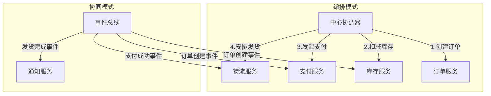

### 二、服务发现：让服务找到彼此

#### 2.1 为什么需要服务发现

在传统架构中，服务地址通常硬编码或通过配置文件固定。但在云原生环境中：

- 服务实例动态创建和销毁（Pod 弹性伸缩）
- IP 地址频繁变化
- 同一服务可能有多个副本
- 需要根据负载、健康状态动态选择实例

服务发现解决了"谁在哪里"的核心问题。没有服务发现，每次服务扩缩容都需要手动更新配置，这在有数百个服务的集群中完全不可行。

#### 2.2 服务发现的两种模式

**客户端发现（Client-Side Discovery）：**

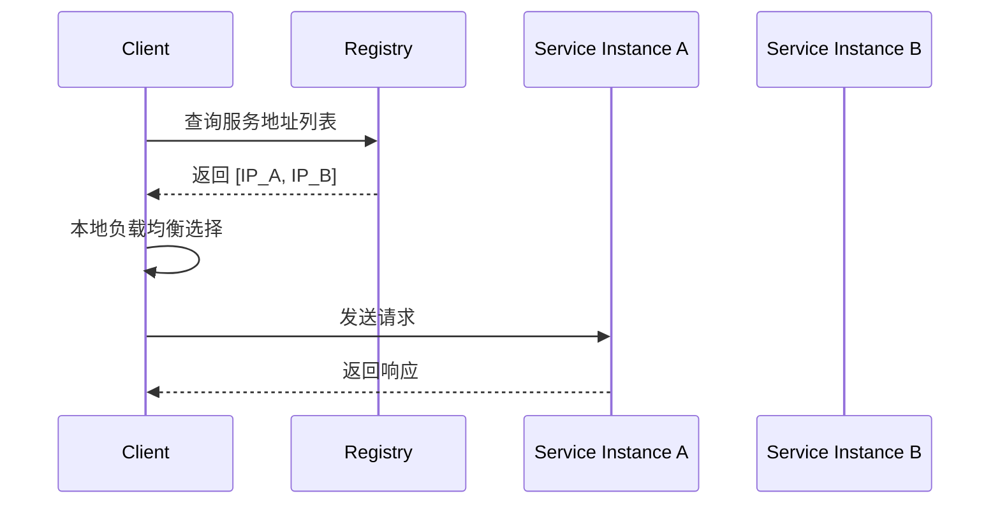

客户端持有服务注册表的副本，自行选择目标实例。典型实现：Netflix Eureka + Ribbon。优点是减少了一跳网络延迟，缺点是客户端逻辑变重，每种语言都需要实现发现逻辑。

**服务端发现（Server-Side Discovery）：**

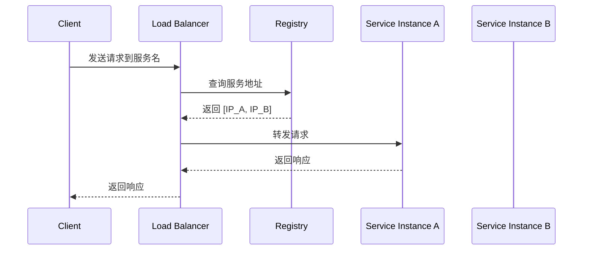

客户端只需请求一个固定入口，由负载均衡器负责路由。典型实现：Kubernetes Service、AWS ELB、Nginx upstream。优点是客户端简单，缺点是多一跳延迟。

**两种模式的对比：**

| 维度 | 客户端发现 | 服务端发现 |
|------|-----------|-----------|
| 延迟 | 低（直接连接） | 多一跳（经过 LB） |
| 客户端复杂度 | 高（需集成发现逻辑） | 低（只需请求固定地址） |
| 语言多样性 | 每种语言需要实现 | 语言无关 |
| 负载均衡策略 | 客户端可控，灵活 | 集中管理，统一策略 |
| 典型实现 | Eureka + Ribbon | Kubernetes Service + kube-proxy |

#### 2.3 Kubernetes 中的服务发现

Kubernetes 原生提供了强大的服务发现机制：

**DNS 服务发现：**

每个 Service 自动获得一个 DNS 记录，格式为 `<service-name>.<namespace>.svc.cluster.local`。同 namespace 内可直接用服务名访问：

```yaml
# order-service 内部调用 product-service
# 直接使用 DNS 名称
apiVersion: v1
kind: Pod
metadata:
  name: order-service
spec:
  containers:
  - name: order
    image: order-service:v1
    env:
    - name: PRODUCT_SERVICE_URL
      value: "http://product-service:8080"  # K8s DNS 自动解析
```

DNS 解析由 CoreDNS 提供，默认缓存 30 秒。如果需要更快的故障转移，可以通过应用层的连接池配合较短的 TTL 来加速。

**Endpoints 机制：**

Kubernetes 自动维护 Service 到后端 Pod 的映射关系：

```bash
# 查看服务的后端端点
kubectl get endpoints product-service

# 输出示例
NAME              ENDPOINTS                                      AGE
product-service   10.244.1.5:8080,10.244.2.8:8080               2d
```

当 Pod 被创建、销毁或标记为不健康时，Endpoints 自动更新，无需人工干预。整个过程通常在秒级完成。

**Headless Service：**

当需要客户端直接获取所有 Pod IP（如 StatefulSet 应用的对等发现、数据库主从发现）：

```yaml
apiVersion: v1
kind: Service
metadata:
  name: redis-headless
spec:
  clusterIP: None  # Headless：不分配 ClusterIP
  selector:
    app: redis
  ports:
  - port: 6379
```

Headless Service 返回的 DNS 记录包含所有 Pod 的 IP 地址列表，客户端可以自行选择连接哪个 Pod。这对于需要知道所有对等节点地址的应用（如数据库集群、消息队列集群）至关重要。

#### 2.4 服务注册与注销

Kubernetes 通过 Readiness Probe 自动管理服务的注册与注销：

```yaml
apiVersion: v1
kind: Pod
metadata:
  name: product-service
spec:
  containers:
  - name: product
    image: product-service:v1
    readinessProbe:
      httpGet:
        path: /health/ready
        port: 8080
      initialDelaySeconds: 5
      periodSeconds: 10
      failureThreshold: 3  # 连续3次失败则从Endpoints移除
    livenessProbe:
      httpGet:
        path: /health/live
        port: 8080
      initialDelaySeconds: 15
      periodSeconds: 10
      failureThreshold: 3  # 连续3次失败则重启Pod
```

**三种探针的区别与协作：**

| 探针 | 作用 | 失败后果 | 设置要点 |
|------|------|---------|---------|
| startupProbe | 检测应用是否启动完成 | 阻止后续探针执行，直到成功 | 用于启动慢的应用，给足时间 |
| readinessProbe | 检测是否可以接收流量 | 从 Endpoints 移除，不接收流量 | 检查依赖服务（DB/MQ）是否可达 |
| livenessProbe | 检测应用是否存活 | 重启容器 | 只检查进程是否卡死，不检查依赖 |

**常见陷阱**：livenessProbe 不应该检查依赖服务的可用性。如果数据库临时不可用，livenessProbe 失败会导致 Pod 被重启，重启后依然连不上数据库，形成"重启风暴"。livenessProbe 只需检查应用自身是否正常运行（如进程存在、端口监听）。

#### 2.5 多集群服务发现

在多集群或混合云场景下，服务发现需要跨越集群边界：

| 方案 | 原理 | 适用场景 |
|------|------|---------|
| Submariner | 跨集群 L3 网络打通 + ServiceImport/Export | 多个独立 K8s 集群 |
| Istio Multi-Cluster | 控制平面联邦 + 共享 ServiceEntry | 同一云服务商多集群 |
| Consul Connect | 独立于 K8s 的服务网格，原生多集群 | 混合环境（VM + K8s） |
| Kubernetes MCS API | 社区标准 Multi-Cluster Service API | 未来标准方向 |

### 三、负载均衡：合理分配流量

#### 3.1 Kubernetes Service 的负载均衡

Kubernetes Service 默认使用 **iptables/IPVS** 实现的 L4 负载均衡：

```bash
# 查看 Service 的 iptables 规则
iptables -t nat -L KUBE-SERVICES | grep product-service

# 查看 kube-proxy 的代理模式
kubectl get configmap kube-proxy -n kube-system -o yaml | grep mode
# mode: "" 表示 iptables 模式（默认）
# mode: "ipvs" 表示 IPVS 模式（大规模集群推荐）
```

**IPVS 模式的优势：**

| 特性 | iptables | IPVS |
|------|----------|------|
| 规则数量 | 线性匹配，O(n) | 哈希表查找，O(1) |
| 负载均衡算法 | 随机（SNAT） | RR、WRR、LC、WLC 等 |
| 大规模集群性能 | 规则多时显著下降 | 保持稳定 |
| 会话保持 | 需手动配置 | 支持多种调度算法 |

**经验法则**：Service 数量 < 1000 时 iptables 足够；超过 1000 建议切换到 IPVS。切换方式是在 kube-proxy ConfigMap 中设置 `mode: "ipvs"`，kube-proxy 会自动平滑切换。

启用 IPVS 模式：

```yaml
apiVersion: kubeproxy.config.k8s.io/v1alpha1
kind: KubeProxyConfiguration
mode: "ipvs"
ipvs:
  scheduler: "rr"  # 轮询调度
```

#### 3.2 高级负载均衡策略

**基于 Nginx Ingress 的 L7 负载均衡：**

```yaml
apiVersion: networking.k8s.io/v1
kind: Ingress
metadata:
  name: product-ingress
  annotations:
    nginx.ingress.kubernetes.io/load-balance: "ewma"  # 指数加权移动平均
    nginx.ingress.kubernetes.io/upstream-hash-by: "$request_uri"  # 一致性哈希
    nginx.ingress.kubernetes.io/proxy-connect-timeout: "5"
    nginx.ingress.kubernetes.io/proxy-read-timeout: "60"
spec:
  rules:
  - host: api.example.com
    http:
      paths:
      - path: /products
        pathType: Prefix
        backend:
          service:
            name: product-service
            port:
              number: 8080
```

**常见 L7 负载均衡算法对比：**

| 算法 | 原理 | 优点 | 缺点 | 适用场景 |
|------|------|------|------|---------|
| Round Robin | 轮流分配 | 简单、均匀 | 不感知后端负载 | 后端性能一致时 |
| EWMA | 按响应时间加权 | 自动避开慢节点 | 对突发负载反应滞后 | 通用场景首选 |
| 一致性哈希 | 按请求特征哈希 | 相同请求到相同后端，利于缓存 | 节点增减时部分请求迁移 | 有状态服务、缓存亲和 |
| Least Connections | 分配给连接数最少的节点 | 感知实际负载 | 需要实时统计连接数 | 长连接场景（WebSocket） |

**粘性会话（Session Affinity）：**

```yaml
apiVersion: v1
kind: Service
metadata:
  name: product-service
spec:
  sessionAffinity: ClientIP  # 基于客户端IP的会话亲和
  sessionAffinityConfig:
    clientIP:
      timeoutSeconds: 10800  # 3小时过期
  selector:
    app: product
  ports:
  - port: 80
    targetPort: 8080
```

**注意**：粘性会话在大规模集群中可能导致流量分配不均匀。如果服务本身是无状态的，优先考虑无状态方案（JWT token 或外部缓存存储会话），避免使用 session affinity。

### 四、流量管理：精细化控制

流量管理是服务编排中最复杂的部分，涵盖路由、版本控制、灰度发布、故障注入等多个维度。

#### 4.1 金丝雀发布（Canary Release）

金丝雀发布是云原生环境中最常用的渐进式发布策略——先将少量流量导入新版本，观察无异常后逐步扩大比例。

**基于 Kubernetes 的简单金丝雀：**

通过两个 Deployment 共享同一个 Service，利用副本数比例控制流量分配：

```yaml
# 稳定版：9个副本，接收约90%流量
apiVersion: apps/v1
kind: Deployment
metadata:
  name: product-stable
spec:
  replicas: 9
  selector:
    matchLabels:
      app: product
      version: stable
  template:
    metadata:
      labels:
        app: product
        version: stable
    spec:
      containers:
      - name: product
        image: product-service:v1.0.0
---
# 金丝雀版：1个副本，接收约10%流量
apiVersion: apps/v1
kind: Deployment
metadata:
  name: product-canary
spec:
  replicas: 1
  selector:
    matchLabels:
      app: product
      version: canary
  template:
    metadata:
      labels:
        app: product
        version: canary
    spec:
      containers:
      - name: product
        image: product-service:v1.1.0
---
# Service 匹配所有版本的 Pod
apiVersion: v1
kind: Service
metadata:
  name: product-service
spec:
  selector:
    app: product  # 匹配 stable 和 canary
  ports:
  - port: 80
    targetPort: 8080
```

**缺点**：这种方案无法精确控制流量比例——当 Pod 数量较少时（如 10 个 Pod 中 1 个 canary），实际流量分配受 Pod 调度、连接数等因素影响，偏差较大。

**基于 Istio 的精确流量控制：**

```yaml
apiVersion: networking.istio.io/v1beta1
kind: VirtualService
metadata:
  name: product-vs
spec:
  hosts:
  - product-service
  http:
  - match:
    - headers:
        x-canary:
          exact: "true"
    route:
    - destination:
        host: product-service
        subset: canary
  - route:
    - destination:
        host: product-service
        subset: stable
      weight: 90
    - destination:
        host: product-service
        subset: canary
      weight: 10
---
apiVersion: networking.istio.io/v1beta1
kind: DestinationRule
metadata:
  name: product-dr
spec:
  host: product-service
  subsets:
  - name: stable
    labels:
      version: stable
  - name: canary
    labels:
      version: canary
```

Istio 方案的优势在于：可以精确到 1% 的流量控制，支持基于 Header、Cookie、URI 的流量路由，并且可以动态调整权重而无需重新部署。

**渐进式发布流程：**

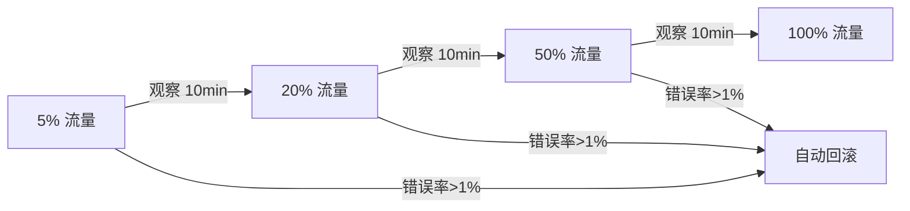

每个阶段都应监控关键指标（错误率、延迟 P99、业务指标），任一指标超出阈值则自动回滚。推荐使用 Flagger 或 Argo Rollouts 实现自动化金丝雀分析。

#### 4.2 故障注入（Fault Injection）

在生产环境中模拟故障是验证系统弹性的关键手段。Istio 支持三种故障注入类型：

```yaml
apiVersion: networking.istio.io/v1beta1
kind: VirtualService
metadata:
  name: product-fault-injection
spec:
  hosts:
  - product-service
  http:
  # 注入延迟：模拟网络抖动或慢查询
  - fault:
      delay:
        percentage:
          value: 10  # 10%的请求
        fixedDelay: 3s  # 延迟3秒
    route:
    - destination:
        host: product-service
  # 注入错误：模拟服务不可用
  - fault:
      abort:
        percentage:
          value: 5  # 5%的请求
        httpStatus: 503  # 返回503
    route:
    - destination:
        host: product-service
```

**混沌工程工具对比：**

| 工具 | 能力 | 适用场景 | 复杂度 |
|------|------|---------|--------|
| Istio Fault Injection | L7 延迟/错误注入 | 服务网格环境下的API级故障测试 | 低 |
| Chaos Mesh | Pod/Node 级故障注入、网络混沌、IO混沌 | 全栈混沌工程 | 中 |
| Litmus | 预定义的混沌实验库 | Kubernetes 原生混沌实验 | 中 |
| Chaos Monkey | 随机终止实例 | 基础设施级韧性验证 | 低 |

**混沌工程实验流程**：

1. **定义稳态**：确定系统的正常行为指标（如错误率 < 1%，延迟 P99 < 500ms）
2. **提出假设**："即使 product-service 的 10% 实例不可用，订单系统仍然可以正常处理订单"
3. **注入故障**：使用 Chaos Mesh 或 Istio 注入故障
4. **观察结果**：对比故障前后的稳态指标
5. **修复问题**：如果假设不成立，说明系统韧性不足，需要修复
6. **自动化回归**：将实验写成自动化测试，持续验证

#### 4.3 超时与重试

超时和重试是防止级联故障的两道防线：

```yaml
apiVersion: networking.istio.io/v1beta1
kind: VirtualService
metadata:
  name: product-resilience
spec:
  hosts:
  - product-service
  http:
  - route:
    - destination:
        host: product-service
    timeout: 5s  # 单次请求超时5秒
    retries:
      attempts: 3  # 最多重试3次
      perTryTimeout: 2s  # 每次重试超时2秒
      retryOn: "5xx,reset,connect-failure"  # 触发条件
      retryRemoteLocalities: true  # 允许跨地域重试
```

**超时设置的关键原则：**

1. **级联超时**：下游服务的超时必须小于上游。如果网关超时 30s，订单服务超时 20s，库存服务超时 10s，这样层层递减确保不会出现上游等待超时后下游仍在处理的情况
2. **重试退避**：避免所有客户端同时重试造成"重试风暴"，使用指数退避+抖动
3. **幂等设计**：重试的前提是操作幂等，否则可能导致重复创建资源

**重试风暴的形成与预防：**

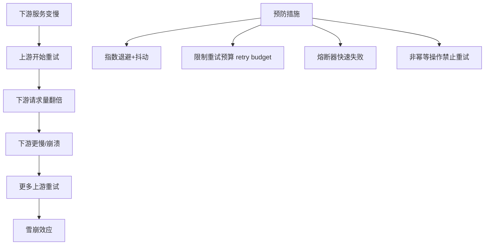

**Istio 重试预算配置（防止重试风暴）：**

```yaml
apiVersion: networking.istio.io/v1beta1
kind: DestinationRule
metadata:
  name: product-retry-budget
spec:
  host: product-service
  trafficPolicy:
    connectionPool:
      http:
        maxRequestsPerConnection: 10
    outlierDetection:
      consecutive5xxErrors: 3
      interval: 10s
      baseEjectionTime: 30s
```

**关键经验**：

- 重试次数不宜超过 3 次——更多重试几乎不会提高成功率，反而放大下游压力
- `perTryTimeout` 必须小于 `timeout / attempts`，否则最后一次重试没有足够时间
- 只对 **可重试的错误** 进行重试：5xx、连接失败、连接重置；不要对 4xx（客户端错误）重试
- 非幂等操作（如扣款、发邮件）不要在框架层面自动重试，需要应用层控制

#### 4.4 熔断器（Circuit Breaker）

熔断器模式在下游服务出现故障时快速失败，防止资源耗尽：

```yaml
apiVersion: networking.istio.io/v1beta1
kind: DestinationRule
metadata:
  name: product-circuit-breaker
spec:
  host: product-service
  trafficPolicy:
    connectionPool:
      tcp:
        maxConnections: 100  # 最大连接数
      http:
        h2UpgradePolicy: DEFAULT
        http1MaxPendingRequests: 100
        http2MaxRequests: 1000
        maxRequestsPerConnection: 10
        maxRetries: 3
    outlierDetection:
      consecutive5xxErrors: 5  # 连续5个5xx触发熔断
      interval: 30s  # 检测间隔
      baseEjectionTime: 30s  # 基础驱逐时间
      maxEjectionPercent: 50  # 最多驱逐50%的实例
      minHealthPercent: 30  # 健康实例低于30%则停止驱逐
```

**熔断器的三种状态：**

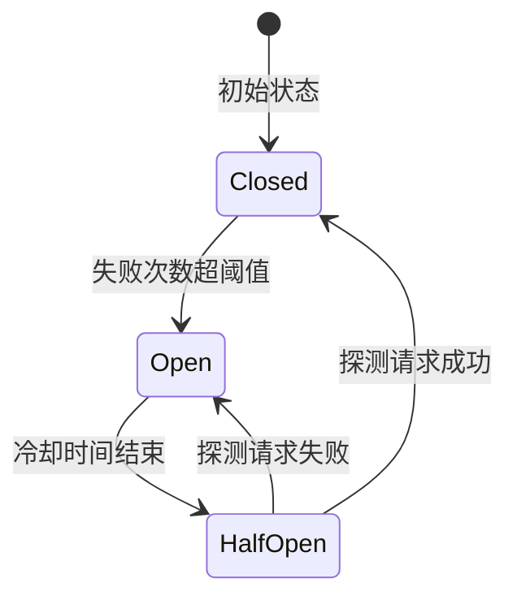

- **Closed（关闭）**：正常放行请求，同时统计失败率。类似电路中的"正常导通"
- **Open（打开）**：直接拒绝所有请求，不再调用下游。给下游恢复的时间，同时保护上游资源不被耗尽
- **Half-Open（半开）**：允许少量探测请求通过，根据结果决定恢复或继续熔断。这是熔断器自愈的关键机制

**参数调优指南：**

| 参数 | 建议值 | 过小的风险 | 过大的风险 |
|------|--------|-----------|-----------|
| consecutive5xxErrors | 3-5 | 瞬时波动就触发熔断，误报 | 真正故障时反应太慢 |
| interval | 10-30s | 检测过于频繁，开销大 | 故障发现延迟 |
| baseEjectionTime | 30-60s | 实例还没恢复就被重新引入 | 恢复后流量恢复太慢 |
| maxEjectionPercent | 30-50% | 一次驱逐太多实例可能导致剩余实例过载 | 熔断效果不够，剩余实例压力大 |

#### 4.5 服务版本管理与向后兼容

微服务演进过程中，接口变更不可避免。如何在不破坏现有消费者的前提下推出新版本，是流量管理的重要课题。

**API 版本策略对比：**

| 策略 | 实现方式 | 优点 | 缺点 |
|------|---------|------|------|
| URL 版本 | `/v1/products` `/v2/products` | 简单直观，路由清晰 | URL 膨胀，版本升级需改所有调用方 |
| Header 版本 | `Accept: application/vnd.api.v2+json` | URL 干净 | 不直观，调试困难 |
| Query 参数 | `/products?version=2` | 简单 | 容易遗漏，缓存不友好 |
| 内容协商 | `Content-Type` 头 | RESTful 规范 | 实现复杂 |

**推荐做法**：对于内部微服务间通信，使用 URL 版本最简单直接；对于对外 API，使用 Header 版本更符合 RESTful 规范。

**向后兼容的黄金规则：**

1. **只加不删**：新增字段是安全的，删除或重命名字段是破坏性的
2. **宽进严出**：接受多种格式的输入，输出保持稳定格式
3. **字段可选化**：新字段必须有默认值，确保旧客户端不传新字段也能正常工作
4. **废弃而非删除**：标记 deprecated 后至少保留两个发布周期再移除

```yaml
# Istio 路由：同时支持 v1 和 v2 客户端
apiVersion: networking.istio.io/v1beta1
kind: VirtualService
metadata:
  name: product-versioned
spec:
  hosts:
  - product-service
  http:
  # v2 客户端路由到新版本
  - match:
    - headers:
        x-api-version:
          exact: "v2"
    route:
    - destination:
        host: product-service
        subset: v2
  # 默认路由到 v1（兼容旧客户端）
  - route:
    - destination:
        host: product-service
        subset: v1
```

### 五、服务间通信模式

#### 5.1 同步通信：gRPC vs REST

| 维度 | gRPC | REST (HTTP/JSON) |
|------|------|-----------------|
| 协议 | HTTP/2（多路复用、头部压缩） | HTTP/1.1（默认） |
| 序列化 | Protocol Buffers（二进制，高效） | JSON（文本，可读） |
| 接口定义 | .proto 文件，强类型 | OpenAPI/Swagger，灵活 |
| 流式支持 | 原生支持双向流 | 需 WebSocket/SSE |
| 浏览器支持 | 需 gRPC-Web 代理 | 原生支持 |
| 性能 | 高（序列化体积小 3-10 倍，延迟低） | 中等 |
| 适用场景 | 内部服务间通信、高频低延迟调用 | 对外 API、BFF 层、简单 CRUD |

**选型决策**：

- 对内服务间通信 → gRPC（性能好、强类型、流式支持）
- 对外暴露 API → REST（兼容性好、调试简单）
- 实时双向通信 → gRPC Streaming 或 WebSocket
- 需要浏览器直接调用 → REST 或 gRPC-Web

**gRPC 在 Kubernetes 中的部署：**

```yaml
apiVersion: v1
kind: Service
metadata:
  name: product-grpc
  annotations:
    # Istio 识别 gRPC 流量
    traffic.sidecar.istio.io/protocol: "GRPC"
spec:
  selector:
    app: product
  ports:
  - name: grpc
    port: 9090
    targetPort: 9090
    protocol: TCP
```

#### 5.2 异步通信：消息队列

异步通信通过消息队列解耦服务，是编排与协同模式的桥梁。

**消息队列的五种核心模式：**

| 模式 | 描述 | 适用场景 | 示例 |
|------|------|---------|------|
| 点对点 | 一条消息只被一个消费者处理 | 任务分发、工作队列 | 订单处理、邮件发送 |
| 发布-订阅 | 一条消息被所有订阅者消费 | 事件通知、数据同步 | 订单创建后通知库存、积分、物流 |
| 请求-回复 | 发送请求并等待回复 | 同步语义的异步实现 | 跨服务查询 |
| 延迟投递 | 消息在指定时间后才投递 | 定时任务、超时处理 | 30分钟未支付自动取消 |
| 死信队列 | 处理失败的消息进入专用队列 | 错误处理、人工干预 | 支付失败后人工处理 |

**选择消息队列的决策框架：**

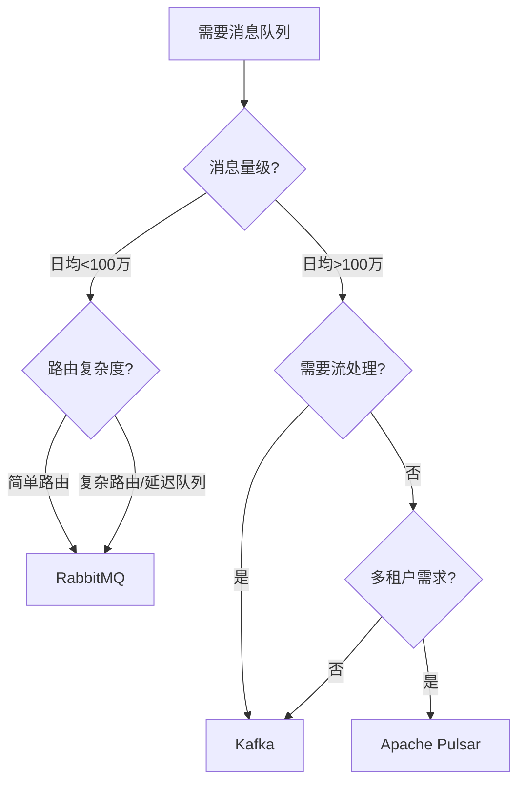

**Kafka 在 Kubernetes 中的典型部署：**

```yaml
apiVersion: kafka.apache.org/v2beta2
kind: Kafka
metadata:
  name: my-cluster
  namespace: kafka
spec:
  kafka:
    version: 3.6.0
    replicas: 3
    listeners:
    - name: plain
      port: 9092
      type: internal
      tls: false
    - name: tls
      port: 9093
      type: internal
      tls: true
    config:
      offsets.topic.replication.factor: 3
      transaction.state.log.replication.factor: 3
      transaction.state.log.min.isr: 2
      default.replication.factor: 3
      min.insync.replicas: 2
      inter.broker.protocol.version: "3.6"
    storage:
      type: jbod
      volumes:
      - id: 0
        type: persistent-claim
        size: 100Gi
        deleteClaim: false
  zookeeper:
    replicas: 3
```

**死信队列（Dead Letter Queue）实践：**

当消息消费失败且重试次数用尽后，消息不应被丢弃，而应进入死信队列等待人工处理：

```python
# RabbitMQ 死信队列配置
import pika

# 声明主队列，绑定死信交换器
channel.queue_declare(
    queue='order-processing',
    arguments={
        'x-dead-letter-exchange': 'dlx-exchange',  # 死信交换器
        'x-dead-letter-routing-key': 'order-dlq',   # 死信队列路由键
        'x-message-ttl': 60000,  # 消息 TTL: 60秒
        'x-max-retries': 3       # 应用层最大重试次数
    }
)

# 死信队列
channel.queue_declare(queue='order-dlq')

def process_message(ch, method, properties, body):
    try:
        process_order(body)
        ch.basic_ack(delivery_tag=method.delivery_tag)
    except RetryableError as e:
        # 拒绝消息，重新入队重试
        retry_count = properties.headers.get('x-retry-count', 0)
        if retry_count < 3:
            ch.basic_nack(delivery_tag=method.delivery_tag, requeue=True)
        else:
            # 重试次数用尽，进入死信队列
            ch.basic_reject(delivery_tag=method.delivery_tag, requeue=False)
    except FatalError as e:
        # 不可重试的错误，直接进入死信队列
        ch.basic_reject(delivery_tag=method.delivery_tag, requeue=False)
```

#### 5.3 事件驱动：发布-订阅模式

发布-订阅模式是协同式编排的核心机制，每个服务订阅感兴趣的事件并自主响应：

```yaml
# 订单服务发布"订单创建"事件
apiVersion: eventing.knative.dev/v1
kind: Broker
metadata:
  name: order-broker
---
apiVersion: eventing.knative.dev/v1
kind: Trigger
metadata:
  name: inventory-trigger
spec:
  broker: order-broker
  filter:
    attributes:
      type: com.order.created  # 只订阅订单创建事件
  subscriber:
    ref:
      apiVersion: serving.knative.dev/v1
      kind: Service
      name: inventory-service  # 库存服务消费事件
```

**CloudEvents 规范：**

CloudEvents 是 CNCF 的事件格式标准，解决了事件格式不统一的问题。一个标准的 CloudEvents 包含以下必选字段：

| 字段 | 类型 | 描述 | 示例 |
|------|------|------|------|
| specversion | string | CloudEvents 版本 | `1.0` |
| type | string | 事件类型 | `com.example.order.created` |
| source | string | 事件来源 | `/services/order-service` |
| id | string | 事件唯一标识 | `a1b2c3d4-e5f6-7890` |
| time | datetime | 事件时间 | `2024-01-15T10:30:00Z` |

```json
{
  "specversion": "1.0",
  "type": "com.ecommerce.order.created",
  "source": "/services/order-service",
  "id": "evt-order-20240115-001",
  "time": "2024-01-15T10:30:00Z",
  "datacontenttype": "application/json",
  "data": {
    "orderId": "ORD-20240115-001",
    "userId": "U-10086",
    "items": [
      {"productId": "P-001", "quantity": 2, "price": 99.00}
    ],
    "totalAmount": 198.00
  }
}
```

**事件 Schema 演进策略：**

事件一旦发布就不可随意修改，因为可能有多个消费者依赖其格式。推荐使用 Schema Registry（如 Confluent Schema Registry）管理事件 Schema：

1. **兼容性模式**：设置为 `BACKWARD`（新 Schema 能读旧数据）或 `FULL`（新旧 Schema 互读）
2. **版本化 type**：事件类型中包含版本号，如 `com.order.created.v2`
3. **只加字段，不删字段**：消费者应忽略未知字段，发布者应给新字段设默认值

#### 5.4 服务间通信的上下文传播

分布式系统中，一个请求跨越多个服务时，需要在调用链中传播上下文信息（如请求 ID、用户身份、追踪上下文）。OpenTelemetry 定义了 W3C Trace Context 标准：

# HTTP Header 中的追踪上下文
traceparent: 00-4bf92f3577b34da6a3ce929d0e0e4736-00f067aa0ba902b7-01
tracestate: congo=t61rcWkgMzE,rojo=00f067aa0ba902b7

各语言的 HTTP 客户端库（如 Python httpx、Java WebClient）通过 OpenTelemetry Instrumentation 自动传播这些 Header，无需手动处理。但需要注意：

- 异步消息传递（Kafka/RabbitMQ）需要将 trace context 放入消息 Header 中
- 批量操作（如批量查询）需要将父 span 正确关联到所有子 span
- 跨线程/协程传播需要使用 context propagation API（如 Python 的 `contextvars`）

### 六、分布式事务编排

微服务架构下，一个业务操作可能涉及多个服务的数据变更。传统的数据库事务无法跨服务生效，需要专门的分布式事务方案。

#### 6.1 Saga 模式

Saga 将一个分布式事务拆分为一系列本地事务，每个本地事务发布事件触发下一步操作。如果某一步失败，则执行前面所有步骤的补偿操作。

**编排式 Saga（Orchestration）：**

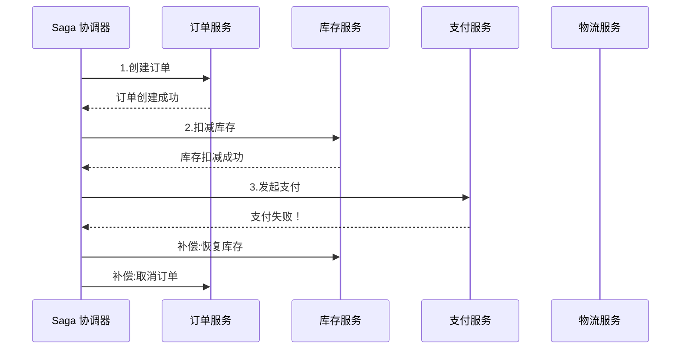

**Temporal 工作流引擎实现 Saga：**

```go
// 使用 Temporal Go SDK 定义 Saga 工作流
func OrderWorkflow(ctx workflow.Context, order OrderRequest) error {
    // 配置重试和超时策略
    ao := workflow.ActivityOptions{
        StartToCloseTimeout: 10 * time.Minute,
        RetryPolicy: &amp;temporal.RetryPolicy{
            MaximumAttempts: 3,
            InitialInterval: time.Second,
            BackoffCoefficient: 2.0,
        },
    }
    ctx = workflow.WithActivityOptions(ctx, ao)

    // 创建 Saga 补偿器
    saga := saga.New()

    // Step 1: 创建订单
    var orderID string
    err := workflow.ExecuteActivity(ctx, CreateOrderActivity, order).Get(ctx, &amp;orderID)
    if err != nil {
        return err
    }
    // 注册补偿：取消订单
    saga.AddCompensation(ctx, CancelOrderActivity, orderID)

    // Step 2: 扣减库存
    err = workflow.ExecuteActivity(ctx, DeductInventoryActivity, order.Items).Get(ctx, nil)
    if err != nil {
        // 触发补偿链
        saga.Compensate(ctx)
        return err
    }
    saga.AddCompensation(ctx, RestoreInventoryActivity, order.Items)

    // Step 3: 处理支付
    err = workflow.ExecuteActivity(ctx, ProcessPaymentActivity, order.Payment).Get(ctx, nil)
    if err != nil {
        saga.Compensate(ctx)
        return err
    }
    saga.AddCompensation(ctx, RefundPaymentActivity, order.Payment)

    return nil
}
```

**编排式 vs 协同式 Saga 对比：**

| 维度 | 编排式 Saga | 协同式 Saga |
|------|------------|------------|
| 协调方式 | 中心协调器控制流程 | 事件驱动，各服务自主响应 |
| 流程可见性 | 高——流程定义集中 | 低——需要追踪事件链 |
| 服务耦合 | 协调器依赖所有参与者 | 只依赖事件契约 |
| 适用场景 | 复杂业务流程、需要可视化 | 简单流程、事件驱动架构 |
| 典型工具 | Temporal、Camunda | Kafka + Event Sourcing |
| 错误处理 | 协调器集中处理补偿 | 每个服务自行监听失败事件并补偿 |
| 调试难度 | 低——流程在一处定义 | 高——需要跨多个服务追踪事件链 |

#### 6.2 最终一致性保障

分布式事务追求的是最终一致性（Eventual Consistency），关键挑战在于处理以下问题：

**幂等性设计：**

每个服务操作必须是幂等的，因为重试和补偿可能导致重复调用：

```python
# 使用幂等键防止重复处理
class PaymentService:
    def process_payment(self, idempotency_key: str, payment_request: dict):
        # 检查是否已处理过
        existing = self.db.get_by_idempotency_key(idempotency_key)
        if existing:
            return existing  # 返回之前的结果，不重复扣款

        # 执行支付
        result = self.charge(payment_request)
        # 存储幂等键和结果
        self.db.save_idempotency(idempotency_key, result)
        return result
```

**幂等性的三种实现方式：**

| 方式 | 原理 | 优点 | 缺点 |
|------|------|------|------|
| 幂等键（Idempotency Key） | 客户端生成唯一键，服务端去重 | 通用，适用于所有操作 | 需要存储已处理的 key |
| 唯一约束 | 数据库唯一索引防止重复插入 | 简单可靠 | 只适用于创建操作 |
| 状态机 | 操作只能从特定状态转换 | 业务语义清晰 | 需要设计状态机 |

**事件去重：**

消息队列可能重复投递消息，消费者必须去重：

```java
// Kafka 消费者幂等处理
@KafkaListener(topics = "order-events")
public void handleOrderEvent(ConsumerRecord<String, Event> record) {
    String eventId = record.headers().lastHeader("event-id").value();

    // 检查是否已处理
    if (processedEvents.contains(eventId)) {
        log.info("Duplicate event ignored: {}", eventId);
        return;
    }

    // 处理事件
    processEvent(record.value());
    // 记录已处理（使用 Redis SET + TTL 自动过期）
    redisTemplate.opsForSet().add("processed-events:" + topic, eventId);
    redisTemplate.expire("processed-events:" + topic, Duration.ofHours(24));
}
```

**去重策略对比：**

| 策略 | 存储 | 适用场景 | 注意事项 |
|------|------|---------|---------|
| Redis SET + TTL | Redis | 高吞吐、短期去重 | TTL 需大于最大重试时间窗口 |
| 数据库唯一索引 | 关系数据库 | 低吞吐、永久去重 | 写入性能受限 |
| 布隆过滤器 | 内存 | 超高吞吐、可接受极小误判率 | 有假阳性，不能 100% 去重 |
| 事件 ID 幂等键 | 业务数据库 | 与业务逻辑结合 | 最可靠，但侵入性强 |

#### 6.3 补偿事务设计要点

补偿操作不是"撤销"——因为原操作可能已经产生了不可逆的副作用（如发了邮件、调了外部 API）。补偿的正确理解是"执行一个反向操作使系统回到一致状态"。

**补偿操作的设计原则：**

1. **可交换性**：补偿操作和原操作的执行顺序不影响最终结果
2. **幂等性**：补偿操作必须幂等，因为可能被重复执行
3. **可补偿性**：设计业务流程时，每一步都要考虑"如果这步失败，前面的步骤如何补偿"
4. **语义补偿**：不是简单地删除数据，而是用业务语义来抵消影响（如"取消订单"而非"删除订单记录"）

```python
# 补偿操作示例
class OrderCompensation:
    def compensate_inventory(self, order_id: str):
        """恢复库存 - 语义补偿而非删除"""
        order = self.db.get_order(order_id)
        for item in order.items:
            # 增加库存而非恢复到某个快照（避免并发问题）
            self.inventory.add_stock(item.product_id, item.quantity)
            # 记录补偿日志，便于审计
            self.audit_log.record(
                action="inventory_compensation",
                order_id=order_id,
                product_id=item.product_id,
                quantity=item.quantity
            )
```

### 七、可观测性：看见服务的一切

没有可观测性的服务编排就像蒙眼开车。可观测性由三大支柱构成：指标（Metrics）、日志（Logging）、链路追踪（Tracing）。

#### 7.1 Prometheus 指标采集

```yaml
# 为每个微服务暴露标准指标端点
apiVersion: apps/v1
kind: Deployment
metadata:
  name: product-service
spec:
  template:
    metadata:
      labels:
        app: product
      annotations:
        prometheus.io/scrape: "true"
        prometheus.io/port: "8080"
        prometheus.io/path: "/metrics"
    spec:
      containers:
      - name: product
        image: product-service:v1
        ports:
        - containerPort: 8080
        env:
        - name: METRICS_ENABLED
          value: "true"
```

**RED 方法与 USE 方法：**

微服务监控的两种经典方法论：

| 方法 | 全称 | 关注点 | 适用对象 | 核心指标 |
|------|------|--------|---------|---------|
| RED | Rate, Errors, Duration | 请求层面 | 每个服务 | QPS、错误率、延迟 |
| USE | Utilization, Saturation, Errors | 资源层面 | 基础设施 | CPU/内存利用率、队列积压、错误数 |

**RED 方法应用示例（每个微服务都应该暴露的指标）：**

```python
# Python Prometheus 指标定义
from prometheus_client import Counter, Histogram, Gauge

# Rate: 请求速率
http_requests_total = Counter(
    'http_requests_total',
    'Total HTTP requests',
    ['method', 'endpoint', 'status_code']
)

# Duration: 请求延迟
http_request_duration_seconds = Histogram(
    'http_request_duration_seconds',
    'HTTP request latency',
    ['method', 'endpoint'],
    buckets=[0.01, 0.025, 0.05, 0.1, 0.25, 0.5, 1.0, 2.5, 5.0, 10.0]
)

# Errors: 业务错误
business_errors_total = Counter(
    'business_errors_total',
    'Business logic errors',
    ['error_type', 'service']
)
```

**关键监控指标（USE 方法）：**

```yaml
# Prometheus 告警规则示例
apiVersion: monitoring.coreos.com/v1
kind: PrometheusRule
metadata:
  name: product-service-alerts
spec:
  groups:
  - name: product-service
    rules:
    # 高错误率告警
    - alert: HighErrorRate
      expr: |
        sum(rate(http_requests_total{service="product",code=~"5.."}[5m]))
        /
        sum(rate(http_requests_total{service="product"}[5m])) > 0.05
      for: 5m
      labels:
        severity: critical
      annotations:
        summary: "产品服务错误率超过5%"

    # 延迟过高告警
    - alert: HighLatency
      expr: |
        histogram_quantile(0.99,
          sum(rate(http_request_duration_seconds_bucket{service="product"}[5m])) by (le)
        ) > 2
      for: 5m
      labels:
        severity: warning
      annotations:
        summary: "产品服务P99延迟超过2秒"

    # Pod 重启频繁
    - alert: PodRestarts
      expr: increase(kube_pod_container_status_restarts_total{container="product"}[1h]) > 3
      for: 5m
      labels:
        severity: warning
      annotations:
        summary: "产品服务Pod 1小时内重启超过3次"
```

#### 7.2 分布式链路追踪

链路追踪让一个请求在多个服务间的调用路径一目了然。OpenTelemetry 是当前的标准化方案：

```python
# Python OpenTelemetry 集成示例
from opentelemetry import trace
from opentelemetry.sdk.trace import TracerProvider
from opentelemetry.sdk.trace.export import BatchSpanProcessor
from opentelemetry.exporter.otlp.proto.grpc.trace_exporter import OTLPSpanExporter
from opentelemetry.instrumentation.fastapi import FastAPIInstrumentor
from opentelemetry.instrumentation.httpx import HTTPXClientInstrumentor

# 初始化 Tracer
provider = TracerProvider()
processor = BatchSpanProcessor(OTLPSpanExporter(endpoint="otel-collector:4317"))
provider.add_span_processor(processor)
trace.set_tracer_provider(provider)
tracer = trace.get_tracer("order-service")

# 自动插桩 FastAPI
FastAPIInstrumentor.instrument_app(app)
HTTPXClientInstrumentor().instrument()

# 手动创建 Span 记录业务关键路径
@app.post("/orders")
async def create_order(order: OrderRequest):
    with tracer.start_as_current_span("validate_order") as span:
        span.set_attribute("order.item_count", len(order.items))
        validated = validate_order(order)

    with tracer.start_as_current_span("check_inventory") as span:
        inventory_ok = await inventory_client.check(order.items)
        span.set_attribute("inventory.available", inventory_ok)

    with tracer.start_as_current_span("process_payment") as span:
        result = await payment_client.charge(order.payment)
        span.set_attribute("payment.status", result.status)

    return result
```

**链路追踪的三种插桩层次：**

| 层次 | 实现方式 | 覆盖范围 | 工作量 |
|------|---------|---------|--------|
| 自动插桩 | OpenTelemetry Instrumentation 库 | HTTP/gRPC/DB/MQ 调用 | 极低（加几行初始化代码） |
| 手动插桩 | `tracer.start_as_current_span()` | 业务关键路径、自定义操作 | 中等 |
| 无侵入插桩 | eBPF（如 Pixie、Cilium） | 网络层所有通信 | 零代码修改 |

**推荐策略**：先用自动插桩覆盖所有 HTTP/gRPC 调用，再用手动插桩标注业务关键路径（如"验证订单"、"计算价格"），最后用 eBPF 补充网络层视图。

#### 7.3 Grafana 可观测性仪表盘

一个完整的微服务可观测性仪表盘应包含以下维度：

| 面板类别 | 关键指标 | 告警阈值建议 |
|---------|---------|-------------|
| 流量 | QPS、TPS、并发连接数 | 突增>200%或骤降>50% |
| 延迟 | P50/P95/P99 延迟 | P99 > SLA 目标 |
| 错误 | 4xx/5xx 比率、错误类型分布 | 错误率>5% |
| 资源 | CPU/内存/磁盘/网络 | CPU>80%, 内存>85% |
| 依赖 | 下游服务健康状态、连接池使用率 | 连接池>90% |
| 业务 | 订单量、支付成功率、转化率 | 偏离基线>20% |

**黄金信号（Google SRE）**：延迟、流量、错误、饱和度——这四个信号是任何服务都必须监控的基础指标。在此之上，根据业务特点添加业务指标。

### 八、安全通信：零信任架构

#### 8.1 mTLS 双向认证

在零信任架构中，每个服务间通信都必须验证对方身份。Istio 通过 Sidecar 自动实现 mTLS：

```yaml
# 强制所有服务间通信使用 mTLS
apiVersion: security.istio.io/v1beta1
kind: PeerAuthentication
metadata:
  name: default
  namespace: istio-system  # 全局生效
spec:
  mtls:
    mode: STRICT  # 只接受 mTLS 连接
```

**mTLS 工作流程：**

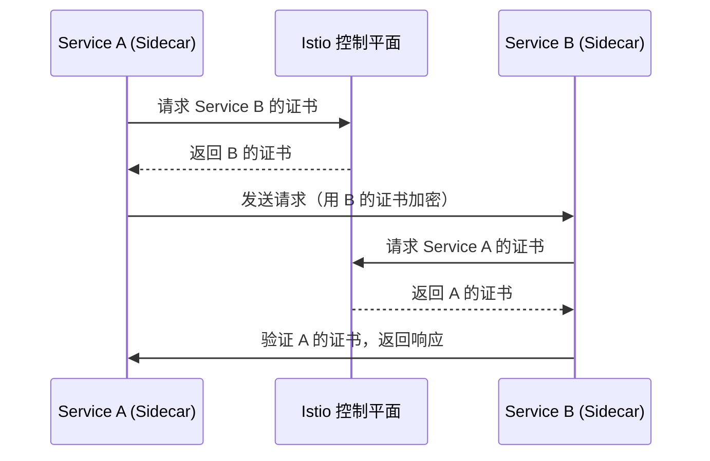

Istio 的 citadel 组件自动管理所有证书的签发和轮转，开发者无需手动管理证书文件。证书默认每 24 小时自动轮转一次。

**mTLS 模式选择：**

| 模式 | 行为 | 适用场景 |
|------|------|---------|
| DISABLE | 不使用 mTLS | 明确不需要加密的场景（极少） |
| PERMISSIVE | 同时接受 mTLS 和明文 | 迁移过渡期 |
| STRICT | 只接受 mTLS | 生产环境推荐 |

#### 8.2 服务间授权策略

```yaml
# 只允许订单服务访问库存服务
apiVersion: security.istio.io/v1beta1
kind: AuthorizationPolicy
metadata:
  name: inventory-access-policy
spec:
  selector:
    matchLabels:
      app: inventory-service
  rules:
  - from:
    - source:
        principals: ["cluster.local/ns/default/sa/order-service"]
    to:
    - operation:
        methods: ["GET", "POST"]
        paths: ["/api/inventory/*"]
```

**授权策略设计原则——最小权限**：

1. 默认拒绝所有流量（空 rules 或 `action: DENY`）
2. 显式允许必要的通信路径
3. 按 Service Account 而非 IP/标签授权（因为 IP 会变）
4. 限制 HTTP 方法和路径，而非只限制服务级别
5. 定期审计授权策略，清理过时规则

#### 8.3 Secret 管理与证书生命周期

Kubernetes 原生 Secret 以 Base64 编码存储在 etcd 中（不是真正的加密）。生产环境应使用 External Secrets Operator 或 Vault：

```yaml
# External Secrets Operator：从 Vault 同步密钥
apiVersion: external-secrets.io/v1beta1
kind: ExternalSecret
metadata:
  name: product-db-credentials
spec:
  refreshInterval: 1h  # 每小时从 Vault 同步
  secretStoreRef:
    name: vault-backend
    kind: SecretStore
  target:
    name: product-db-credentials  # 生成的 K8s Secret 名称
  data:
  - secretKey: password
    remoteRef:
      key: secret/data/product-service
      property: db-password
```

**Secret 轮转最佳实践：**

1. 设置 Secret 的 `refreshInterval`，确保密钥定期从外部存储同步
2. 数据库密码轮转时，使用双写策略：新密码生效后再删除旧密码
3. 避免将 Secret 写入日志、环境变量（可通过 volume mount 注入）
4. 使用 RBAC 限制谁可以读取 Secret

#### 8.4 API 网关安全层

API 网关是系统的"大门"，承担认证、限流、输入校验等安全职责：

```yaml
# Kong API 网关限流配置
apiVersion: configuration.konghq.com/v1
kind: KongPlugin
metadata:
  name: rate-limiting
config:
  minute: 100  # 每分钟最多100个请求
  policy: local  # 本地计数器（生产用 redis）
  fault_tolerant: true
---
apiVersion: configuration.konghq.com/v1
kind: KongPlugin
metadata:
  name: jwt-auth
config:
  claims_to_verify:
  - exp  # 验证 JWT 过期时间
  - iss  # 验证签发者
  key_claim_name: kid
```

**API 网关的安全职责层次：**

| 层次 | 职责 | 实现方式 |
|------|------|---------|
| 认证 | 验证请求者身份 | JWT、OAuth2、API Key |
| 授权 | 验证请求者权限 | RBAC、ABAC、Scope 检查 |
| 限流 | 防止滥用和 DDoS | 令牌桶、滑动窗口、漏桶 |
| 输入校验 | 防止注入和恶意数据 | JSON Schema、参数白名单 |
| 审计日志 | 记录所有 API 调用 | 结构化日志、实时告警 |
| HTTPS 终止 | 加密外部通信 | TLS 证书管理、HSTS |

### 九、Helm：服务编排的部署利器

Helm 是 Kubernetes 的包管理器，将服务编排的所有资源打包为可复用的 Chart。

#### 9.1 Chart 结构设计

product-service/
├── Chart.yaml          # Chart 元信息
├── values.yaml         # 默认配置
├── values-prod.yaml    # 生产环境配置
├── values-staging.yaml # 预发布环境配置
├── templates/
│   ├── _helpers.tpl    # 模板助手函数
│   ├── deployment.yaml # 部署模板
│   ├── service.yaml    # 服务模板
│   ├── ingress.yaml    # 入口规则
│   ├── hpa.yaml        # 自动扩缩
│   ├── configmap.yaml  # 配置映射
│   ├── secret.yaml     # 密钥管理
│   ├── servicemonitor.yaml  # Prometheus 监控
│   └── tests/
│       └── test-connection.yaml  # 测试用例
└── README.md           # Chart 文档

#### 9.2 模板化部署

```yaml
# templates/deployment.yaml
apiVersion: apps/v1
kind: Deployment
metadata:
  name: {{ include "product.fullname" . }}
  labels:
    {{- include "product.labels" . | nindent 4 }}
spec:
  replicas: {{ .Values.replicaCount }}
  selector:
    matchLabels:
      {{- include "product.selectorLabels" . | nindent 6 }}
  strategy:
    type: RollingUpdate
    rollingUpdate:
      maxUnavailable: {{ .Values.strategy.maxUnavailable | default 1 }}
      maxSurge: {{ .Values.strategy.maxSurge | default 1 }}
  template:
    metadata:
      labels:
        {{- include "product.selectorLabels" . | nindent 8 }}
    spec:
      containers:
      - name: {{ .Chart.Name }}
        image: "{{ .Values.image.repository }}:{{ .Values.image.tag }}"
        ports:
        - containerPort: {{ .Values.service.targetPort }}
        resources:
          {{- toYaml .Values.resources | nindent 10 }}
        livenessProbe:
          httpGet:
            path: /health/live
            port: {{ .Values.service.targetPort }}
          initialDelaySeconds: 15
          periodSeconds: 10
        readinessProbe:
          httpGet:
            path: /health/ready
            port: {{ .Values.service.targetPort }}
          initialDelaySeconds: 5
          periodSeconds: 5
```

#### 9.3 环境差异化配置

```yaml
# values.yaml（默认值）
replicaCount: 2
image:
  repository: registry.example.com/product-service
  tag: "latest"
resources:
  requests:
    cpu: 100m
    memory: 128Mi
  limits:
    cpu: 500m
    memory: 512Mi
autoscaling:
  enabled: false
```

```yaml
# values-prod.yaml（生产环境覆盖）
replicaCount: 5
image:
  tag: "v1.2.3"  # 固定版本，不用 latest
resources:
  requests:
    cpu: 250m
    memory: 256Mi
  limits:
    cpu: 1000m
    memory: 1Gi
autoscaling:
  enabled: true
  minReplicas: 3
  maxReplicas: 20
  targetCPUUtilizationPercentage: 70
  targetMemoryUtilizationPercentage: 80
```

部署命令：

```bash
# 部署到预发布环境
helm upgrade --install product ./product-service \
  -f values-staging.yaml \
  --namespace staging

# 部署到生产环境
helm upgrade --install product ./product-service \
  -f values-prod.yaml \
  --namespace production \
  --wait  # 等待所有 Pod 就绪

# 验证部署
helm test product -n production

# 回滚到上一版本
helm rollback product 1 -n production
```

#### 9.4 Helm Chart 的版本管理

```bash
# Chart 版本语义化
# Chart.yaml 中的 version 字段
version: 1.2.3      # Chart 自身版本
appVersion: "v2.0"  # 应用版本

# 发布流程
helm package ./product-service           # 打包 Chart
helm push product-service-1.2.3.tgzoci://registry.example.com/charts  # 推送到仓库
helm search repo product-service         # 搜索可用版本
```

### 十、生产环境最佳实践

#### 10.1 服务编排的渐进式采用路径


不要一开始就追求"最先进"的架构。建议路径：

1. **阶段一：可观测性先行**——在现有系统上部署 Prometheus + Grafana + Jaeger，建立数据基线
2. **阶段二：模块化拆分**——将单体按领域边界拆为模块，但仍在同一进程
3. **阶段三：核心服务提取**——选择变化频率最高的模块提取为独立服务
4. **阶段四：引入编排**——部署 Kubernetes + Helm，实现自动化部署和扩缩容
5. **阶段五：服务网格**——当服务数量超过 20 个时引入 Istio，统一治理

**每个阶段的判断标准：**

| 阶段 | 触发条件 | 预期收益 | 所需投入 |
|------|---------|---------|---------|
| 可观测性 | 任何时候都应尽早开始 | 故障定位时间从小时级降到分钟级 | 1-2 周 |
| 模块化 | 代码变更频繁冲突、部署周期长 | 并行开发效率提升 50%+ | 1-3 个月 |
| 服务拆分 | 不同模块有不同的伸缩/发布需求 | 独立伸缩、独立发布 | 3-6 个月 |
| K8s 编排 | 服务数量 > 5、需要弹性伸缩 | 自动化运维、资源利用率提升 | 2-4 周 |
| 服务网格 | 服务数量 > 20、需要统一治理 | 统一 mTLS/可观测性/流量管理 | 1-2 个月 |

#### 10.2 生产环境 Checklist

| 维度 | 检查项 | 严重等级 |
|------|--------|---------|
| 服务发现 | 所有服务通过 DNS 名称访问，不使用硬编码 IP | 🔴 必须 |
| 健康检查 | 每个服务配置 liveness + readiness probe | 🔴 必须 |
| 资源限制 | 所有容器设置 resources.requests 和 limits | 🔴 必须 |
| 熔断降级 | 关键链路配置熔断器和降级策略 | 🟡 强烈建议 |
| 链路追踪 | 集成 OpenTelemetry，所有请求可追踪 | 🟡 强烈建议 |
| 金丝雀发布 | 支持灰度发布，流量可按比例切换 | 🟡 强烈建议 |
| Secret 管理 | 使用 Vault 或 External Secrets Operator | 🟡 强烈建议 |
| 网络策略 | 配置 NetworkPolicy 限制 Pod 间通信 | 🟢 建议 |
| Pod 反亲和性 | 避免同一服务的多个副本在同一节点 | 🟢 建议 |
| PDB | 配置 PodDisruptionBudget 保证滚动更新时可用 | 🟢 建议 |
| 日志标准化 | 统一日志格式，包含 trace_id 和 span_id | 🟡 强烈建议 |
| 事件 Schema | 使用 CloudEvents + Schema Registry 管理事件格式 | 🟢 建议 |

#### 10.3 常见问题排查流程

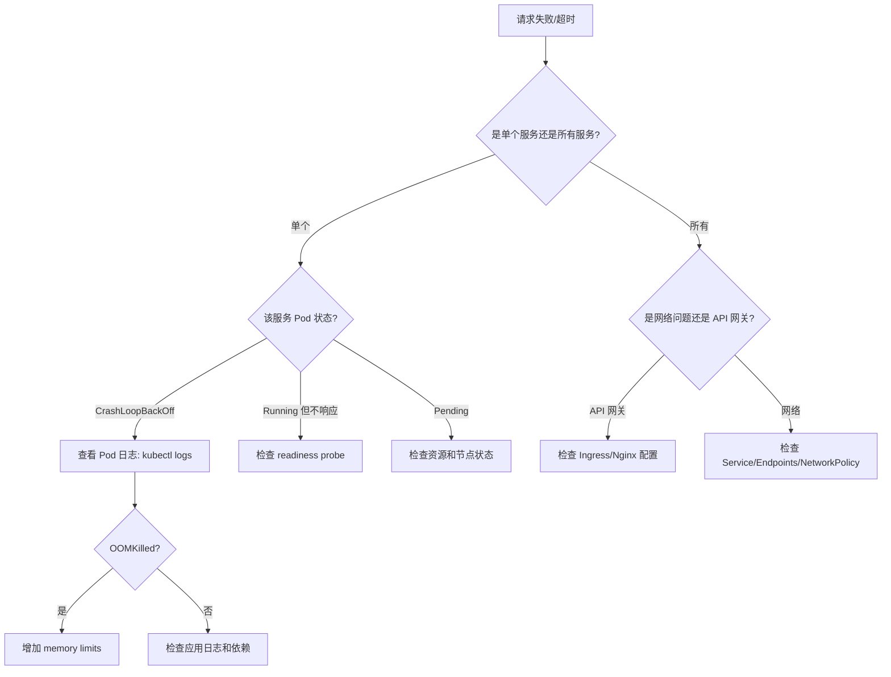

**排查命令速查：**

```bash
# 1. 查看 Pod 状态
kubectl get pods -n <namespace> -o wide

# 2. 查看 Pod 事件（Pending 原因）
kubectl describe pod <pod-name> -n <namespace>

# 3. 查看 Pod 日志（含前一个容器）
kubectl logs <pod-name> -n <namespace> --previous

# 4. 查看 Service 和 Endpoints
kubectl get svc,endpoints -n <namespace>

# 5. 进入 Pod 调试网络
kubectl exec -it <pod-name> -n <namespace> -- /bin/sh

# 6. 测试 DNS 解析
kubectl exec -it debug-pod -- nslookup product-service.default.svc.cluster.local

# 7. 测试服务连通性
kubectl exec -it debug-pod -- curl http://product-service:8080/health

# 8. 查看 NetworkPolicy
kubectl get networkpolicy -n <namespace>
```

#### 10.4 性能优化要点

1. **连接池管理**：为每个下游服务配置独立连接池，避免连接耗尽
2. **请求合并（Batching）**：将高频小请求合并为批量操作，减少网络开销
3. **本地缓存**：对变化频率低的数据使用本地缓存（如 Redis、Caffeine），设置合理的 TTL 和缓存穿透保护
4. **异步化**：非关键路径的操作（如日志记录、统计上报）改为异步处理
5. **gRPC 长连接复用**：使用 HTTP/2 多路复用，避免频繁建立新连接

```python
# 连接池配置示例（Python httpx）
import httpx

# 为每个下游服务创建独立的连接池
product_client = httpx.AsyncClient(
    base_url="http://product-service:8080",
    limits=httpx.Limits(
        max_connections=100,      # 最大连接数
        max_keepalive_connections=20,  # 保活连接数
        keepalive_expiry=30       # 保活超时(秒)
    ),
    timeout=httpx.Timeout(
        connect=5,    # 连接超时
        read=10,      # 读取超时
        write=5,      # 写入超时
        pool=5        # 连接池等待超时
    )
)

# 使用连接池发送请求
async def get_products(ids: list[str]):
    # 批量请求，复用连接
    tasks = [product_client.get(f"/products/{id}") for id in ids]
    responses = await asyncio.gather(*tasks, return_exceptions=True)
    return [r.json() for r in responses if not isinstance(r, Exception)]
```

**服务调用的超时预算分配：**

假设网关总超时 30s，一个请求需要经过 3 个服务：

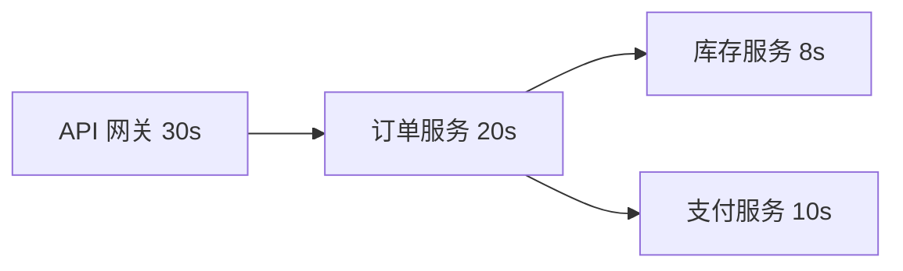

关键原则：每层预留足够的余量。网关 30s → 订单服务 20s（留 10s 给网关处理响应和日志）→ 库存/支付各 8-10s。总和不能超过上游超时。

### 十一、服务网格深入：Istio 架构

当服务数量达到一定规模（通常 20+），手动管理每个服务的熔断、超时、重试、mTLS 变得不可行。服务网格（Service Mesh）通过 Sidecar 代理将这些治理能力从业务代码中剥离出来，统一在基础设施层处理。

#### 11.1 数据平面与控制平面

```mermaid
graph TB
    subgraph 控制平面
        CP1[Istiod - Citadel] -->|签发证书| DP1
        CP2[Istiod - Pilot] -->|下发配置| DP1
        CP2 -->|下发配置| DP2
    end

    subgraph 数据平面
        SA[Service A] <--> PA[Envoy Sidecar]
        SB[Service B] <--PB[Envoy Sidecar]
        PA <-->|mTLS| PB
    end
```

| 组件 | 职责 |
|------|------|
| Envoy Sidecar | 拦截所有出入流量，执行负载均衡、熔断、重试、mTLS、链路追踪 |
| Istiod (Pilot) | 将 VirtualService/DestinationRule 等配置转换为 Envoy 的 xDS 配置并下发 |
| Istiod (Citadel) | 证书签发和轮转，实现自动 mTLS |
| Istiod (Galley) | 配置验证和分发 |

**Sidecar 模式的代价**：

每个请求会经过两次 Envoy 代理（发送端 + 接收端），增加约 1-3ms 延迟和约 10-20MB 内存。对于延迟敏感的核心路径，可以使用 Ambient Mesh（Istio 的无 Sidecar 模式）来消除这个代价。

#### 11.2 何时引入服务网格

| 服务数量 | 推荐方案 | 理由 |
|---------|---------|------|
| < 5 | K8s Service + 手动配置 | 复杂度不值得 |
| 5-20 | K8s Service + Ingress Controller | 覆盖大部分场景 |
| 20-50 | 考虑 Istio（只启用核心功能） | 治理需求增长 |
| 50+ | 完整 Istio 部署 | 统一治理成为刚需 |

### 十二、总结

服务编排是云原生架构从理论走向生产的关键一环。核心要点回顾：

1. **服务发现**是基础——让动态变化的服务实例能被可靠地找到
2. **负载均衡**是手段——合理分配流量，避免单点过载
3. **流量管理**是能力——金丝雀发布、故障注入、超时重试构建弹性
4. **通信模式**是选择——同步用 gRPC/REST，异步用消息队列，事件驱动用发布-订阅
5. **分布式事务**是挑战——Saga 模式结合幂等设计保证数据一致性
6. **可观测性**是保障——Metrics/Logging/Tracing 三大支柱缺一不可
7. **安全通信**是底线——mTLS + 零信任 + 网络策略层层防护
8. **Helm** 是工具——将编排知识模板化，实现环境一致性和可复现部署
9. **服务网格**是演进——当规模足够时，用基础设施层统一治理

> **务实原则**：编排方案的复杂度应该与系统规模匹配。10 个服务的系统用 Kubernetes Service + 基本监控就够了；100 个服务的系统才需要服务网格和完整可观测性。过度设计与设计不足同样危险。架构决策的黄金标准是：**能用简单方案解决的问题，绝不上复杂方案；但该上复杂方案时，也不要犹豫。**
