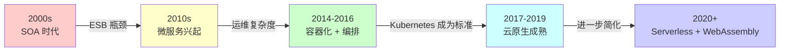

# 微服务架构设计

## 一、概述与背景

### 1.1 什么是微服务架构

微服务架构（Microservices Architecture）是一种将单体应用拆分为一组小型、自治服务的软件设计方法。每个服务围绕一个独立的业务能力构建，拥有自己的代码库、数据库和部署管道，服务之间通过轻量级通信协议（如 HTTP/REST、gRPC、消息队列）进行协作。

Martin Fowler 在 2014 年的里程碑文章中给出经典定义：

> "微服务架构风格是将单一应用程序开发为一套小型服务的方法，每个服务运行在自己的进程中，服务间采用轻量级通信机制交互。这些服务围绕业务能力构建，可以通过全自动化的部署机制独立部署。"

这一概念并非凭空出现。2011 年左右，ThoughtWorks 的软件架构师们在讨论"微服务"一词；Netflix 在 2009 年前后开始将其大规模单体应用拆分为数百个微服务；2012 年 Amazon 已经拥有数百个微服务团队。微服务是业界在实践中摸索出的解法，而非学院派的理论发明。

### 1.2 为什么要用微服务

单体架构在业务规模扩大后会暴露出一系列结构性问题：

**扩展瓶颈**：单体应用只能整体扩展。如果用户管理模块需要更多资源，你不得不复制整个应用——即使订单模块的 CPU 使用率只有 10%。这导致资源浪费和成本上升。

**发布风险高**：一次小的代码变更需要重新部署整个应用。Netflix 的实践表明，其早期单体架构下一次发布可能影响数十个无关功能，发布窗口需要长时间冻结。

**技术栈锁定**：单体应用通常只能使用一种编程语言和框架。新模块无法选用更适合的技术，团队也无法根据场景选择最优工具。

**团队协作困难**：当数百名工程师在同一个代码库上工作时，合并冲突、部署协调、环境管理都成为瓶颈。Conway 定律告诉我们，软件架构反映了组织结构——单体应用隐含要求团队以高度耦合的方式协作。

**故障爆炸半径大**：单体中一个模块的内存泄漏、死锁或无限递归可能拖垮整个系统。微服务通过进程隔离将故障限制在单个服务范围内。

### 1.3 微服务 vs 单体 vs SOA

很多初学者会混淆微服务和 SOA（面向服务架构）。两者的核心区别不在于技术，而在于设计哲学：

| 维度 | 单体架构 | SOA | 微服务架构 |
|------|----------|-----|-----------|
| 服务粒度 | 整个应用是一个单元 | 大粒度服务（通常按系统划分） | 小粒度服务（按业务能力划分） |
| 通信方式 | 进程内函数调用 | ESB（企业服务总线） | 轻量协议（REST/gRPC/消息队列） |
| 数据管理 | 共享数据库 | 共享数据库常见 | 每个服务独立数据库 |
| 部署方式 | 整体部署 | 整体部署或分层部署 | 独立部署 |
| 技术栈 | 统一 | 通常统一 | 可异构（Polyglot） |
| 组织结构 | 功能型团队 | 系统级团队 | 跨功能小型团队（You Build It, You Run It） |
| 治理方式 | 代码级约束 | ESB 中心化治理 | 去中心化治理 + API 契约 |

关键认知：微服务不是 SOA 的简化版，而是 SOA 思想在容器化、DevOps 和云计算时代的具体实践。SOA 的失败往往源于 ESB 过度中心化，微服务通过消除 ESB、拥抱去中心化治理来避免这一陷阱。

## 二、微服务架构的核心原理

### 2.1 服务拆分原则——DDD 限界上下文

微服务拆分是整个架构设计中**最关键也最容易犯错**的环节。拆分太粗退化为"分布式单体"，拆分太细则引入不必要的分布式复杂性。领域驱动设计（DDD）的限界上下文（Bounded Context）提供了理论基础。

#### 业务能力拆分

从业务视角出发，识别系统中的核心业务能力。以电商平台为例：

电商平台
├── 用户域：注册、登录、用户资料、地址管理
├── 商品域：商品管理、SKU、分类、搜索
├── 订单域：下单、支付、退款、订单状态流转
├── 库存域：库存管理、预占、释放、同步
├── 物流域：发货、物流追踪、签收确认
├── 营销域：优惠券、满减活动、积分
└── 通知域：短信、邮件、站内信、推送

每个域对应一个或多个微服务。注意：这不是按技术层拆分（用户服务、数据库服务、缓存服务），而是按业务能力拆分。

#### 拆分的判断标准

以下信号提示你需要进一步拆分：

1. **团队规模过大**：一个服务需要超过 2 个团队维护，说明粒度太粗
2. **变更频率差异大**：两个模块的变更频率相差 5 倍以上，应该分离
3. **扩展需求不同**：A 模块需要水平扩展，B 模块不需要
4. **数据耦合**：两个模块虽然共享数据库但各自只读写自己的表
5. **发布冲突频繁**：A 模块的发布经常被 B 模块的变更阻塞

以下信号提示拆分过细：

1. **分布式事务激增**：跨服务事务比例超过 40%
2. **级联调用链过长**：一次请求需要串行调用 5 个以上服务
3. **运维成本失控**：团队 30% 以上时间花在服务间通信和部署协调上
4. **服务间大量共享代码**：多个服务引入同一个库来避免重复

#### DDD 实操方法

```python
# 识别限界上下文的步骤
def identify_bounded_contexts(domain):
    """DDD 限界上下文识别流程"""
    
    # 1. 事件风暴（Event Storming）
    # 在白板上列出所有领域事件（橙色便签）
    events = run_event_storming(domain)
    
    # 2. 识别聚合根（Aggregate Root）
    # 每个聚合根代表一个一致性边界
    aggregates = identify_aggregates(events)
    
    # 3. 划分上下文边界
    # 同一个上下文内的实体共享语言和模型
    contexts = draw_context_boundaries(aggregates)
    
    # 4. 定义上下文映射关系
    # 上下文之间通过防腐层、共享内核等方式集成
    relationships = define_context_mappings(contexts)
    
    return contexts, relationships
```

事件风暴（Event Storming）是目前业界最流行的 DDD 落地实践，具体步骤：

1. **识别领域事件**：团队在大白板上用橙色便签列出所有业务动作（"订单已创建"、"支付已完成"、"库存已扣减"）
2. **排列时间线**：按业务流程顺序排列事件
3. **识别命令**：用蓝色便签标注触发每个事件的命令（"用户点击下单"触发"订单已创建"）
4. **划分聚合**：用黄色便签标注聚合根，将相关事件和命令归组
5. **划定边界**：用红色线画出限界上下文，将不同聚合分组到不同服务中

### 2.2 服务通信模式

微服务间通信是架构的神经系统。选择正确的通信模式直接影响系统的性能、可靠性和复杂度。

#### 同步通信

**REST（HTTP/JSON）**：

适用场景：对外暴露的 API、CRUD 操作、浏览器直接调用的服务间通信。

优势：通用性强，所有语言和平台都支持；工具生态丰富（Swagger/OpenAPI）；可调试性好。

劣势：JSON 序列化/反序列化有性能开销；HTTP/1.1 的队头阻塞；缺乏强类型契约。

```yaml
# OpenAPI 3.0 示例：订单服务创建订单接口
openapi: "3.0.3"
info:
  title: Order Service API
  version: "1.0"
paths:
  /api/v1/orders:
    post:
      summary: 创建订单
      requestBody:
        content:
          application/json:
            schema:
              type: object
              required: [user_id, items]
              properties:
                user_id:
                  type: string
                  format: uuid
                items:
                  type: array
                  items:
                    $ref: "#/components/schemas/OrderItem"
                coupon_code:
                  type: string
      responses:
        "201":
          description: 订单创建成功
          content:
            application/json:
              schema:
                $ref: "#/components/schemas/Order"
```

**gRPC（HTTP/2 + Protobuf）**：

适用场景：服务内部高性能通信、流式数据传输、强类型契约。

优势：Protobuf 序列化比 JSON 快 5-10 倍，体积小 3-5 倍；HTTP/2 支持多路复用和头部压缩；原生支持流式 RPC（Server Streaming、Client Streaming、Bidirectional）；代码生成保证类型安全。

劣势：浏览器不原生支持（需要 gRPC-Web 代理）；调试不如 REST 直观；二进制协议不易手工构造请求。

```protobuf
// order.proto — gRPC 服务定义
syntax = "proto3";
package order;

service OrderService {
  // 一元调用：创建订单
  rpc CreateOrder(CreateOrderRequest) returns (Order);
  // 服务端流式：订单状态实时推送
  rpc WatchOrderStatus(WatchRequest) returns (stream OrderStatus);
  // 一元调用：批量查询
  rpc BatchGetOrders(BatchGetRequest) returns (BatchGetResponse);
}

message CreateOrderRequest {
  string user_id = 1;
  repeated OrderItem items = 2;
  string coupon_code = 3;
}

message Order {
  string order_id = 1;
  string user_id = 2;
  OrderStatus status = 3;
  int64 total_amount = 4;  // 单位：分
  int64 created_at = 5;
}

enum OrderStatus {
  CREATED = 0;
  PAID = 1;
  SHIPPED = 2;
  DELIVERED = 3;
  CANCELLED = 4;
}
```

#### 异步通信

异步通信通过消息队列或事件总线实现服务解耦，是微服务架构的**最佳实践方向**。

**点对点（Queue）模式**：

生产者发送消息到队列，一个消费者处理。适用于任务分发场景。

[订单服务] --发布订单创建事件--> [RabbitMQ/RocketMQ]
                                        |
                                [库存服务] 消费并扣减库存
                                [通知服务] 消费并发送确认短信
                                [积分服务] 消费并计算积分

**发布-订阅（Pub/Sub）模式**：

一个事件可以被多个消费者组同时消费。适用于事件广播场景。

[订单服务] --发布事件--> [Kafka Topic: order-events]
                              |
                 [消费者组A: 库存服务] → 扣减库存
                 [消费者组B: 通知服务] → 发送通知
                 [消费者组C: 分析服务] → 实时统计
                 [消费者组D: 审计服务] → 操作日志

#### 通信模式选型决策

是否需要实时响应？
├── 是 → 同步通信
│   ├── 客户端是浏览器？→ REST（JSON）
│   ├── 服务间内部调用，对性能敏感？→ gRPC
│   ├── 需要跨语言、跨团队的开放API？→ REST + OpenAPI
│   └── 需要流式数据？→ gRPC Streaming 或 WebSocket
└── 否 → 异步通信
    ├── 消息只被一个消费者处理？→ 消息队列（RabbitMQ/RocketMQ）
    ├── 多个消费者需要独立消费？→ 发布-订阅（Kafka/Pulsar）
    ├── 需要事件回溯和审计？→ Event Sourcing + Kafka
    └── 事件量极大，需要高吞吐？→ Kafka 或 Pulsar

### 2.3 数据管理策略

数据管理是微服务架构中**最困难的部分**。在单体时代，所有模块共享一个数据库，JOIN 查询、事务一致性都是数据库层面天然解决的。微服务要求每个服务拥有独立数据存储，这带来了全新的挑战。

#### Database per Service 模式

每个微服务拥有自己的数据库，其他服务不得直接访问。这是微服务数据隔离的**铁律**。

```yaml
# 每个服务独立的数据库实例（或 Schema）
services:
  order-service:
    database:
      type: postgresql
      name: order_db
      # 只能读写 order 相关的表
  user-service:
    database:
      type: postgresql
      name: user_db
      # 只能读写 user 相关的表
  inventory-service:
    database:
      type: mysql
      name: inventory_db
      # 可以选择不同的数据库类型（Polyglot Persistence）
```

**Polyglot Persistence（多语言持久化）**：不同服务可以根据数据特征选择最适合的存储引擎。订单服务用 PostgreSQL（关系型，事务保证），商品搜索用 Elasticsearch（全文检索），用户会话用 Redis（高速缓存），日志数据用 ClickHouse（列式存储）。这不是炫技，而是务实的选择。

#### 跨服务数据查询

当查询需要跨越多个服务的数据时，有以下方案：

**API 组合（API Composition）**：

最简单的方式。由一个 API 组合器向多个服务发起请求，合并结果。

```python
# API 组合示例：查询订单详情（需要聚合订单、商品、用户数据）
async def get_order_detail(order_id: str) -> dict:
    """
    API 组合模式：并行调用多个服务，合并结果
    优点：实现简单
    缺点：调用延迟 = 最慢服务的延迟；部分服务不可用时降级困难
    """
    # 并行请求（注意超时和降级策略）
    order_task = order_service.get_order(order_id)
    user_task = user_service.get_user(order.user_id)
    items_task = asyncio.gather(*[
        product_service.get_product(item.product_id)
        for item in order.items
    ])
    
    order, user, products = await asyncio.gather(
        order_task, user_task, items_task
    )
    
    return {
        "order": order,
        "user": {"name": user.name, "phone": user.phone},
        "items": [
            {**item, "product": prod}
            for item, prod in zip(order.items, products)
        ]
    }
```

**CQRS（命令查询职责分离）**：

将读写模型分离，写入操作更新各个服务的本地数据库，同时通过事件同步维护一个专门的查询模型。

写入路径：
[客户端] → [API Gateway] → [订单服务] → 订单DB
                                      ↓ 发布事件
                                      [Kafka]
                                      ↓ 消费事件
                            [查询模型DB] ← 更新物化视图

查询路径：
[客户端] → [API Gateway] → [查询服务] → 查询模型DB（只读，已聚合）

**事件溯源（Event Sourcing）**：

不存储当前状态，而是存储所有状态变更的事件序列。当前状态通过回放事件序列得到。

订单事件流（存储在 Kafka 或 EventStore）：
┌─────────────────────────────────────────────────────┐
│ 订单已创建 → 商品已锁定 → 支付已确认 → 库存已扣减  │
│ → 发货已安排 → 签收已确认                           │
└─────────────────────────────────────────────────────┘
         ↓ 回放
当前状态：{ status: "DELIVERED", items: [...], total: 299.00 }

优势：完整审计追踪、可回溯任意时间点状态、天然支持事件驱动。

劣势：实现复杂度高、事件 Schema 演进困难、查询性能需要通过快照优化。

### 2.4 分布式事务

微服务拆分后，原本在单数据库中通过 ACID 事务保证的一致性，变成了跨服务的分布式事务问题。以下是主流解决方案：

#### Saga 模式

Saga 将一个分布式事务拆分为一系列本地事务，每个本地事务都有对应的补偿操作。如果某一步失败，依次执行已完成步骤的补偿操作。

订单创建 Saga：
┌──────────────────────────────────────────────────┐
│ 正向流程：                                        │
│ 创建订单 → 扣减库存 → 扣款 → 通知发货              │
│                                                    │
│ 补偿流程（逆序）：                                 │
│ 取消发货通知 ← 退款 ← 释放库存 ← 取消订单          │
└──────────────────────────────────────────────────┘

场景：扣款失败
→ 执行补偿：释放库存 → 取消订单
→ 最终状态：所有数据回到事务开始前

Saga 有两种实现方式：

**编排式 Saga（Orchestration）**：一个中心协调器负责调用各参与者并管理补偿流程。

```python
# 编排式 Saga 示例
class OrderSagaOrchestrator:
    """订单创建 Saga 编排器"""
    
    async def execute(self, order_data):
        saga_log = []
        
        try:
            # 步骤1：创建订单
            order_id = await self.order_service.create(order_data)
            saga_log.append(("create_order", order_id, "SUCCESS"))
            
            # 步骤2：预占库存
            reservation_id = await self.inventory_service.reserve(order_id)
            saga_log.append(("reserve_inventory", reservation_id, "SUCCESS"))
            
            # 步骤3：扣款
            payment_id = await self.payment_service.charge(order_data.user_id, order_data.amount)
            saga_log.append(("charge_payment", payment_id, "SUCCESS"))
            
            # 步骤4：确认库存扣减
            await self.inventory_service.confirm(reservation_id)
            saga_log.append(("confirm_inventory", reservation_id, "SUCCESS"))
            
            # 全部成功
            await self.order_service.mark_confirmed(order_id)
            return {"status": "success", "order_id": order_id}
            
        except Exception as e:
            # 按逆序执行补偿
            for step_name, step_id, _ in reversed(saga_log):
                await self._compensate(step_name, step_id)
            
            return {"status": "failed", "error": str(e)}
    
    async def _compensate(self, step_name, step_id):
        compensations = {
            "charge_payment": self.payment_service.refund,
            "reserve_inventory": self.inventory_service.release,
            "create_order": self.order_service.cancel,
        }
        if step_name in compensations:
            await compensations[step_name](step_id)
```

**协同式 Saga（Choreography）**：每个服务监听事件并自行决定下一步操作，无需中心协调器。

协同式 Saga 事件流：

[订单服务] → 发布 "OrderCreated"
                ↓
[库存服务] 监听 → 扣减库存 → 发布 "InventoryReserved"
                                ↓
[支付服务] 监听 → 扣款 → 发布 "PaymentCompleted"
                            ↓
[订单服务] 监听 → 确认订单 → 发布 "OrderConfirmed"

编排式 vs 协同式选择：

| 维度 | 编排式（Orchestration） | 协同式（Choreography） |
|------|------------------------|----------------------|
| 耦合度 | 中心节点与所有参与者耦合 | 服务间松耦合 |
| 流程可见性 | 流程在编排器中清晰可见 | 流程分散在各服务中，难以全局理解 |
| 适用场景 | 流程步骤多（>5步）、需要集中管理 | 流程简单（<4步）、参与服务少 |
| 维护成本 | 新增步骤只需修改编排器 | 新增步骤需要修改多个服务 |
| 单点故障 | 编排器是单点，需高可用部署 | 无单点故障 |
| 建议 | **大多数场景首选** | 仅用于简单事件广播 |

#### TCC 模式（Try-Confirm-Cancel）

TCC 是 Saga 的严格版本，每个操作分为 Try（预留资源）、Confirm（确认提交）、Cancel（释放预留）三个阶段。

订单支付 TCC：

Try 阶段：
  库存服务：冻结 2 件商品（预留但未实际扣减）
  账户服务：冻结 299.00 元（冻结但未实际扣款）
  
Confirm 阶段（Try 全部成功后）：
  库存服务：将冻结转为实际扣减
  账户服务：将冻结转为实际扣款

Cancel 阶段（任一 Try 失败）：
  库存服务：释放冻结的 2 件商品
  账户服务：解冻 299.00 元

TCC 相比 Saga 的优势：Try 阶段即完成资源检查，Confirm 阶段无需再检查资源是否充足。

TCC 相比 Saga 的劣势：每个服务需要实现三个接口，代码量翻倍；资源冻结期间其他事务无法使用该资源，可能导致可用性下降。

## 三、API 设计与治理

### 3.1 API-First 设计原则

微服务之间的 API 就是服务的"契约"。API-First 意味着先设计接口规范，再实现业务逻辑。这一原则在微服务架构中尤为重要——多个团队需要并行开发，API 契约是他们之间的唯一同步点。

#### RESTful API 设计规范

命名规范：
  ✅ GET    /api/v1/orders              → 获取订单列表
  ✅ POST   /api/v1/orders              → 创建订单
  ✅ GET    /api/v1/orders/{id}         → 获取单个订单
  ✅ PUT    /api/v1/orders/{id}         → 全量更新订单
  ✅ PATCH  /api/v1/orders/{id}         → 部分更新订单
  ✅ DELETE /api/v1/orders/{id}         → 删除订单
  
  ❌ GET    /api/v1/getOrders           → 避免动词在URL中
  ❌ POST   /api/v1/order/create        → POST + create 语义重复
  ❌ GET    /api/v1/orders/delete/123   → 删除不应是 GET 请求

版本管理：
  ✅ /api/v1/orders → URL 路径版本（最直观）
  ✅ Accept: application/vnd.myapp.v1+json → Header 版本（最干净）
  ❌ /api/orders?version=1 → 查询参数版本（容易被忽略）

错误响应格式：
{
  "error": {
    "code": "INSUFFICIENT_INVENTORY",
    "message": "库存不足：商品 SKU-20089 仅剩 2 件，您需要 5 件",
    "details": {
      "product_id": "SKU-20089",
      "requested": 5,
      "available": 2
    },
    "request_id": "req-abc-123-def",
    "timestamp": "2025-01-15T10:30:00Z"
  }
}

#### API 网关

API 网关是所有客户端请求的统一入口，承担以下职责：

客户端请求流：
[移动端/Web端/第三方] → [API 网关] → [微服务集群]
                       │
                       ├─ 路由分发：根据路径/Header将请求转发到对应服务
                       ├─ 认证鉴权：JWT 验证、OAuth2 校验
                       ├─ 限流熔断：令牌桶限流、熔断降级
                       ├─ 请求聚合：将多个内部服务调用合并为一个响应
                       ├─ 协议转换：HTTP ↔ gRPC、WebSocket
                       ├─ 日志审计：记录所有请求的元数据
                       └─ 灰度发布：根据用户ID/Header分流

主流 API 网关对比：

| 网关 | 语言 | 性能 | 扩展性 | 适用场景 |
|------|------|------|--------|----------|
| Kong | Lua (OpenResty) | 高 | 插件丰富 | 通用企业 API 网关 |
| APISIX | Lua (OpenResty) | 极高 | 热加载 | 高性能、动态路由 |
| Spring Cloud Gateway | Java | 中等 | Spring 生态集成 | Java 技术栈 |
| Envoy + Gateway API | C++ | 极高 | K8s 原生 | Kubernetes 环境 |
| Traefik | Go | 高 | 自动发现 | 容器化环境 |

### 3.2 服务发现

在动态的微服务环境中，服务实例的 IP 和端口会随时变化。服务发现机制让服务能够找到彼此。

**客户端发现**：客户端维护服务实例列表（从注册中心获取），自行负载均衡。

[订单服务] → 查询 [注册中心] → 获取库存服务实例列表
     → 本地负载均衡 → 选择实例A → 发起调用

**服务端发现**：通过负载均衡器将请求路由到后端服务实例。

[订单服务] → 负载均衡器 → [库存服务实例A/B/C]

服务注册中心对比：

| 注册中心 | 一致性模型 | 语言 | 特点 |
|---------|-----------|------|------|
| Eureka | AP（最终一致） | Java | Netflix 开源，适合 Spring Cloud |
| Consul | CP（强一致） | Go | 支持 KV 存储、健康检查、多数据中心 |
| Nacos | CP/AP 可切换 | Java | 阿里开源，同时支持配置中心 |
| etcd | CP（强一致） | Go | Kubernetes 使用，运维生态丰富 |

## 四、弹性设计与容错

### 4.1 容错模式

微服务架构中，一个服务的故障不应级联扩散到整个系统。以下是核心容错模式：

#### 熔断器（Circuit Breaker）

熔断器在检测到下游服务故障时自动切断调用，避免故障扩散和资源浪费。

状态机：
┌──────────┐    失败率超过阈值     ┌──────────┐
│  CLOSED   │ ──────────────────→ │   OPEN    │
│ （正常）   │                      │ （熔断）   │
└──────────┘                      └──────────┘
      ↑                                 │
      │        探测成功                   │ 超时窗口到期
      └──────────────────────────────────┘
                                    ┌──────────┐
                                    │HALF-OPEN │
                                    │（半开）   │
                                    └──────────┘
                                         │
                                    探测失败 → 回到 OPEN

```python
# 熔断器实现示例
import time
from enum import Enum

class CircuitState(Enum):
    CLOSED = "closed"       # 正常：放行所有请求
    OPEN = "open"           # 熔断：拒绝所有请求
    HALF_OPEN = "half_open" # 半开：放行少量探测请求

class CircuitBreaker:
    def __init__(self, failure_threshold=5, recovery_timeout=30, half_open_max=3):
        self.failure_threshold = failure_threshold  # 连续失败阈值
        self.recovery_timeout = recovery_timeout    # 熔断恢复超时(秒)
        self.half_open_max = half_open_max          # 半开状态最大探测数
        self.state = CircuitState.CLOSED
        self.failure_count = 0
        self.last_failure_time = 0
        self.half_open_count = 0
    
    def call(self, func, *args, **kwargs):
        if self.state == CircuitState.OPEN:
            if time.time() - self.last_failure_time > self.recovery_timeout:
                self.state = CircuitState.HALF_OPEN
                self.half_open_count = 0
            else:
                raise CircuitOpenError("Circuit is OPEN, request rejected")
        
        try:
            result = func(*args, **kwargs)
            self._on_success()
            return result
        except Exception as e:
            self._on_failure()
            raise
    
    def _on_success(self):
        if self.state == CircuitState.HALF_OPEN:
            self.half_open_count += 1
            if self.half_open_count >= self.half_open_max:
                self.state = CircuitState.CLOSED
                self.failure_count = 0
        elif self.state == CircuitState.CLOSED:
            self.failure_count = 0
    
    def _on_failure(self):
        self.failure_count += 1
        self.last_failure_time = time.time()
        if self.failure_count >= self.failure_threshold:
            self.state = CircuitState.OPEN
```

#### 舱壁隔离（Bulkhead）

将资源按服务或功能分组隔离，防止某个服务的故障耗尽所有资源。

```yaml
# Kubernetes Pod 资源限制实现舱壁隔离
apiVersion: apps/v1
kind: Deployment
metadata:
  name: order-service
spec:
  replicas: 3
  template:
    spec:
      containers:
      - name: order-service
        resources:
          requests:
            cpu: "500m"      # 保证最小 0.5 核
            memory: "512Mi"  # 保证最小 512MB
          limits:
            cpu: "1000m"     # 最大 1 核
            memory: "1Gi"    # 最大 1GB
```

#### 重试与退避

重试是处理瞬时故障的基本手段，但必须配合退避策略，否则会引发重试风暴。

指数退避策略（Exponential Backoff）：
  第1次重试：等 100ms
  第2次重试：等 200ms
  第3次重试：等 400ms
  第4次重试：等 800ms
  第5次重试：等 1600ms（到达上限，放弃）
  
  关键原则：
  1. 加入随机抖动（Jitter），避免所有客户端同时重试
  2. 设置最大重试次数（通常 3-5 次）
  3. 设置总超时时间
  4. 仅对幂等操作重试（GET/PUT/DELETE 天然幂等，POST 需要幂等键）

#### 降级策略

当下游服务不可用时，提供降级响应而非直接报错：

```python
# 降级策略示例
async def get_product_with_fallback(product_id: str) -> dict:
    try:
        # 主路径：调用商品服务获取完整商品信息
        product = await product_service.get(product_id)
        return product
    except ServiceUnavailable:
        # 降级路径1：返回缓存中的商品信息
        cached = await cache.get(f"product:{product_id}")
        if cached:
            cached["source"] = "cache"  # 标记数据来源
            return cached
        
        # 降级路径2：返回基础信息（从订单服务本地存储获取）
        basic_info = await local_db.get_product_basic(product_id)
        basic_info["source"] = "fallback"
        basic_info["notice"] = "商品详细信息暂不可用，显示基础信息"
        return basic_info
```

### 4.2 可观测性三支柱

分布式系统的可观测性依赖三大支柱：Metrics（指标）、Logging（日志）、Tracing（链路追踪）。

#### 链路追踪

一次用户请求可能经过 5-20 个微服务。没有链路追踪，排查问题如同大海捞针。

链路追踪示意（Trace ID: abc-123-def）：

[API Gateway] ← 5ms
  └─[Order Service] ← 120ms
       ├─[Inventory Service] ← 45ms (Redis 查询)
       ├─[Payment Service] ← 60ms (外部支付网关)
       └─[Notification Service] ← 异步（无等待）

总耗时：130ms
瓶颈：Payment Service 占 60ms（46%）

主流追踪系统对比：

| 系统 | 存储 | 采样策略 | 特点 |
|------|------|---------|------|
| Jaeger | Cassandra/Elasticsearch | 头部/尾部采样 | CNCF 项目，Kubernetes 原生 |
| Zipkin | Cassandra/MySQL | 自适应采样 | Twitter 开源，成熟稳定 |
| SkyWalking | H2/MySQL/Elasticsearch | 多种采样 | Java Agent 无侵入，社区活跃 |
| OpenTelemetry | 可插拔导出 | 标准化 SDK | 供应商中立，行业标准方向 |

#### 指标（Metrics）

Prometheus 是云原生生态的标准指标采集系统。每个微服务应该暴露以下核心指标：

# 四大黄金信号（Google SRE 定义）：
1. 延迟（Latency）：请求处理时间的分布
   - http_request_duration_seconds{method="POST", path="/orders", status="201"} 0.123

2. 流量（Traffic）：系统负载
   - http_requests_total{method="POST", path="/orders"} 12345

3. 错误率（Errors）：失败请求比例
   - http_requests_total{method="POST", status="5xx"} 23

4. 饱和度（Saturation）：资源使用率
   - container_cpu_usage_seconds_total{container="order-service"} 0.45

## 五、技术演进历程



**2000s — SOA 时代**：ESB（企业服务总线）承担所有通信路由、协议转换、消息编排。ESB 成为单点瓶颈，且难以扩展。

**2010-2013 — 微服务萌芽**：Netflix、Amazon、Twitter 在实践中证明了微服务的可行性。Netflix OSS 生态（Eureka、Hystrix、Ribbon）成为微服务基础设施的标杆。

**2014-2016 — 容器化革命**：Docker 让应用打包标准化，Kubernetes 让编排自动化。微服务的运维复杂度被容器编排大幅降低。

**2017-2019 — 云原生成熟**：CNCF 生态爆发式增长。服务网格（Istio）、可观测性（Prometheus + Grafana）、GitOps（ArgoCD）等成为标配。

**2020+ — 下一代演进**：Serverless 进一步抽象基础设施；WebAssembly（Wasm）提供比容器更轻量的隔离单元；eBPF 为服务网格提供内核级高性能代理。

## 六、实际应用场景与案例

### 场景一：电商系统微服务化

**背景**：某电商平台，日均订单量 100 万，高峰期（双十一）峰值达 50 倍。原单体架构在大促期间频繁宕机。

**拆分方案**：

原单体电商系统 → 微服务架构

拆分为 12 个核心服务：
┌─────────────────────────────────────────────────────┐
│ 流量入口层                                           │
│   API Gateway (Kong) + CDN + 负载均衡                │
├─────────────────────────────────────────────────────┤
│ 业务服务层                                           │
│   用户服务（Go）    → 用户注册、登录、地址管理       │
│   商品服务（Java）  → SKU管理、搜索、推荐            │
│   订单服务（Java）  → 下单、支付、退款               │
│   库存服务（Go）    → 实时库存、预占、同步           │
│   营销服务（Java）  → 优惠券、满减、积分             │
│   物流服务（Go）    → 发货调度、物流追踪             │
│   通知服务（Node.js）→ 短信、邮件、推送             │
│   搜索服务（Java）  → 商品搜索、自动补全             │
├─────────────────────────────────────────────────────┤
│ 基础设施层                                           │
│   Kubernetes + Istio + Prometheus + Jaeger           │
│   MySQL(主从) + Redis Cluster + Kafka + ES           │
└─────────────────────────────────────────────────────┘

**关键数据**：

| 指标 | 单体时期 | 微服务化后 |
|------|---------|-----------|
| 发布频率 | 每月 1 次 | 每天 10+ 次 |
| 单次发布耗时 | 4 小时（含回滚准备） | 5 分钟（自动回滚） |
| 大促可用性 | 99.5% | 99.99% |
| 扩展时间 | 手动扩容，2-4 小时 | 自动弹性，30 秒内 |
| 平均故障恢复时间 | 45 分钟 | 3 分钟 |

### 场景二：金融交易系统

**背景**：支付网关系统，每秒处理 5000+ 笔交易，对一致性和可用性要求极高。

**架构特点**：

- **强一致性**：订单和支付使用 TCC 模式保证资金安全
- **高可用**：核心服务 3 个副本 + 跨机房容灾
- **可观测性**：每笔交易全链路追踪，异常交易实时告警
- **合规审计**：事件溯源记录所有操作，支持监管审计

## 七、常见误区与纠正

### 误区一：微服务一定比单体好

**真相**：微服务引入了分布式系统的全部复杂性——网络延迟、部分失败、数据一致性、运维复杂度。对于小型团队或早期产品，微服务化是过度工程。

**纠正**：从模块化单体（Modular Monolith）开始。将单体应用按业务模块组织，模块间通过清晰的接口通信。当业务规模和团队规模增长到需要独立部署和扩展时，再逐步拆分为微服务。Amazon 和 Twitter 都是从单体逐步演进的。

### 误区二：拆分越细越好

**真相**：过细的拆分导致级联调用链过长，一个请求可能触发 10+ 次网络调用，延迟和故障概率指数级上升。

**纠正**：遵循"按业务能力拆分，不按技术层拆分"原则。如果两个服务总是同时变更、总是同时部署、总是需要分布式事务，它们可能不应该分开。

### 误区三：REST 是唯一选择

**真相**：REST 在开放 API 和浏览器场景下是正确选择，但在服务内部高性能通信场景下，gRPC 的性能和类型安全优势显著。

**纠正**：对外 API 用 REST + OpenAPI；服务内部通信用 gRPC；事件驱动场景用消息队列。不同场景选择不同协议。

### 误区四：微服务不需要文档和规范

**真相**：没有 API 契约的微服务架构会在半年内退化为"分布式单体"——各服务互相猜测对方的接口行为，版本不兼容，联调困难。

**纠正**：API-First 开发流程：先写 OpenAPI/Protobuf 定义 → 代码生成 → 契约测试（Pact）→ 发布。CI 流水线中加入契约兼容性检查。

### 误区五：引入微服务就能自动实现高可用

**真相**：微服务只是提供了故障隔离的可能，但要真正实现高可用，还需要完善的监控告警、自动故障转移、弹性伸缩、混沌工程实践。

**纠正**：微服务化之前先建设可观测性基础设施（Metrics + Logging + Tracing），再引入混沌工程（Chaos Monkey）验证系统的容错能力。

## 八、进阶话题

### 8.1 混沌工程

混沌工程通过主动注入故障来验证系统的容错能力。Netflix 的 Chaos Monkey 是代表工具：

混沌工程实验清单：
1. 网络故障：延迟注入（200ms-5s）、丢包（1%-50%）、DNS 故障
2. 进程故障：随机 Kill Pod、模拟 OOM Kill
3. 资源耗尽：CPU 满载、磁盘填满、内存不足
4. 依赖故障：模拟下游服务超时、返回错误、返回异常数据
5. 时钟偏移：NTP 不同步导致的认证失败

### 8.2 GitOps 与持续部署

GitOps 将 Git 仓库作为基础设施和应用配置的唯一事实来源：

开发者推送代码 → CI 构建镜像 → 更新 Git 仓库中的 manifests
                                         ↓
                  ArgoCD 检测到变更 → 自动同步到 Kubernetes 集群
                                         ↓
                              自动化验证（健康检查 + 金丝雀发布）

### 8.3 平台工程

随着微服务数量增长，开发者需要管理的基础设施复杂度也在增长。平台工程通过构建内部开发者平台（IDP）来降低这一负担：

- **自助服务**：开发者通过 Web UI 或 CLI 自助创建服务、申请资源、配置域名
- **标准化模板**：Service Template 提供标准化的服务骨架（代码结构、CI/CD、监控、告警）
- **黄金路径**：为常见场景（HTTP 服务、异步任务、定时任务）提供最佳实践路径

## 九、总结

微服务架构设计的核心要点：

1. **拆分是关键也是风险**：基于 DDD 限界上下文拆分，宁粗勿细，渐进演进
2. **通信模式决定系统特性**：同步适合实时交互，异步适合解耦和高吞吐
3. **数据管理是最难的部分**：Database per Service + CQRS/Saga 是标准解法
4. **容错设计不可或缺**：熔断、降级、重试、舱壁隔离，缺一不可
5. **可观测性先行**：在引入分布式架构之前，先建立完善的监控、日志和链路追踪
6. **API 契约是团队协作的基石**：API-First + 契约测试 + 版本管理
7. **技术选型服务于业务需求**：不是所有系统都需要微服务，务实比跟风更重要

> **核心理念**：微服务架构是一种工程实践，不是银弹。它解决了一部分问题（独立部署、技术多样性、弹性扩展），但也引入了新的复杂性（分布式事务、服务发现、链路追踪）。选择微服务架构，本质上是用**运维和架构的复杂性**换取**开发和扩展的灵活性**。这个权衡是否值得，取决于你的业务规模、团队能力和组织成熟度。
