# 无服务器计算（Serverless Computing）

### 1. 概述与背景

#### 1.1 什么是无服务器计算

"无服务器"（Serverless）这个名字具有误导性——服务器依然存在，只是对开发者透明了。无服务器计算的本质是一种**计算资源的交付模型**：开发者只需关注业务代码的编写和部署，底层的服务器管理、容量规划、自动扩缩容、故障恢复等运维工作全部由云平台承担。

用一句话概括：**无服务器计算让开发者从"管理基础设施"转变为"管理业务逻辑"**。

这种模式的核心价值主张体现在三个维度：

- **零运维**：无需管理操作系统、运行时环境、补丁更新，甚至无需关心服务器是否存在
- **按需付费**：只为实际执行的代码付费，闲置时不产生费用（精确到毫秒级计费）
- **自动扩缩**：从零自动扩展到数千并发实例，无需预置容量

#### 1.2 历史演进

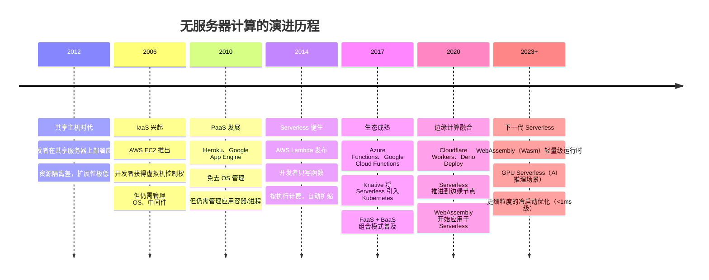

#### 1.3 Serverless 的两大支柱

无服务器计算并非单一技术，而是由两大支柱共同构成：

| 支柱 | 全称 | 核心能力 | 代表产品 |
|------|------|---------|---------|
| **FaaS** | Function as a Service（函数即服务） | 提供事件触发的短暂计算能力 | AWS Lambda、Azure Functions |
| **BaaS** | Backend as a Service（后端即服务） | 提供托管的后端基础设施 | Firebase、Supabase、AWS Amplify |

FaaS 处理"计算"，BaaS 处理"存储、认证、API 网关"等后端能力。一个完整的 Serverless 应用通常是 FaaS + BaaS 的组合——函数负责业务逻辑，BaaS 提供数据库、身份认证、文件存储等能力。

```mermaid
graph TB
    subgraph "Serverless 应用架构"
        Client[客户端<br/>Web/Mobile/IoT]
        
        subgraph "FaaS 层 — 计算"
            GW[API Gateway<br/>请求路由与限流]
            F1[函数A<br/>用户注册]
            F2[函数B<br/>订单处理]
            F3[函数C<br/>图片缩放]
            F4[函数D<br/>定时清理]
        end
        
        subgraph "BaaS 层 — 后端服务"
            DB[(托管数据库<br/>DynamoDB/Firestore)]
            Auth[身份认证<br/>Cognito/Auth0)]
            Storage[对象存储<br/>S3/GCS)]
            MQ[消息队列<br/>SQS/EventBridge)]
        end
    end
    
    Client --> GW
    GW --> F1
    GW --> F2
    F2 --> MQ
    MQ --> F3
    F1 --> DB
    F1 --> Auth
    F2 --> DB
    F3 --> Storage
    F4 --> DB
```

### 2. FaaS 核心原理

#### 2.1 函数的生命周期

一个 FaaS 函数从代码到执行，经历以下完整生命周期：

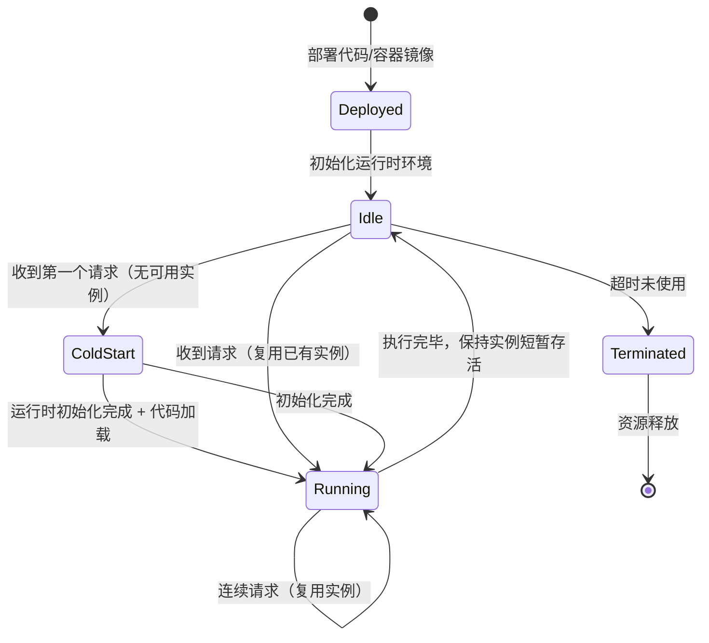

每个生命周期阶段的详细说明：

**部署阶段**：开发者将函数代码（或容器镜像）上传到云平台。平台将代码打包为轻量级运行环境（如 microVM 或容器），存放在平台的执行基础设施中。此阶段不消耗运行时资源。

**冷启动阶段**（Cold Start）：当函数收到请求且没有预热的实例可用时，平台需要从零启动一个执行环境。这个过程包括：分配计算资源 → 拉取代码/镜像 → 初始化运行时（如 Node.js、Python 解释器）→ 执行初始化代码（如数据库连接池建立）。冷启动耗时从几十毫秒到数秒不等。

**热执行阶段**（Warm Execution）：实例已存在且已初始化，直接执行函数逻辑。这是理想的执行路径，延迟极低。

**实例复用**：平台不会在每次请求后立即销毁实例，而是保持短暂存活（通常 5-15 分钟），以处理后续请求。这意味着第一次请求触发冷启动，后续请求可以复用同一实例。

#### 2.2 事件驱动的执行模型

FaaS 函数是**事件驱动**的——它们不是持续运行的服务，而是被事件触发的短暂计算单元。触发源的类型决定了函数的适用场景：

| 事件类型 | 触发方式 | 典型场景 | 延迟敏感度 |
|---------|---------|---------|-----------|
| HTTP 请求 | API Gateway 路由 | RESTful API、Webhook | 高（同步响应） |
| 消息队列 | SQS/RabbitMQ 消费 | 订单处理、异步任务 | 中（异步处理） |
| 对象存储事件 | S3 PUT/DELETE 触发 | 图片缩放、文件处理 | 低（后台处理） |
| 数据库变更流 | DynamoDB Streams | 数据同步、缓存失效 | 中 |
| 定时触发 | Cron 表达式 | 定时任务、报表生成 | 低 |
| IoT 事件 | MQTT 消息 | 设备数据处理 | 高（实时响应） |
| 日志事件 | CloudWatch Logs | 日志分析、告警 | 低 |
| 代码变更 | GitHub Push/Webhook | CI/CD 流水线 | 低 |

一个事件从产生到函数执行的完整流程：

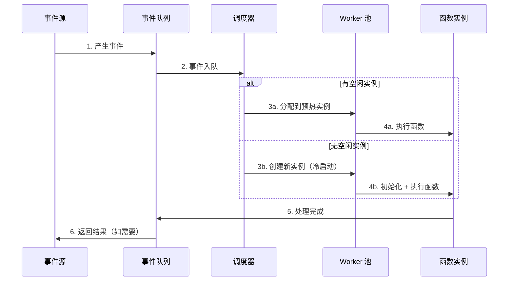

#### 2.3 函数即代码：编程模型

以 AWS Lambda 为例，一个典型的 FaaS 函数结构：

```python
# AWS Lambda 函数示例：图片缩放处理
import json
import boto3
from PIL import Image
import io
import os

# 初始化代码 — 在冷启动时执行一次，后续请求复用
s3_client = boto3.client('s3')
THUMBNAIL_SIZE = (200, 200)
OUTPUT_BUCKET = os.environ.get('OUTPUT_BUCKET', 'thumbnails-bucket')

def lambda_handler(event, context):
    """
    事件处理器 — 每次事件触发时执行
    event: 触发事件的数据（S3 事件通知）
    context: 执行上下文（超时时间、内存限制、请求ID等）
    """
    # 1. 解析事件，获取文件信息
    record = event['Records'][0]
    source_bucket = record['s3']['bucket']['name']
    source_key = record['s3']['object']['key']
    
    # 2. 从 S3 下载原图
    response = s3_client.get_object(Bucket=source_bucket, Key=source_key)
    image_data = response['Body'].read()
    
    # 3. 图片处理：缩放
    image = Image.open(io.BytesIO(image_data))
    image.thumbnail(THUMBNAIL_SIZE, Image.LANCZOS)
    
    # 4. 上传缩略图到目标桶
    buffer = io.BytesIO()
    image.save(buffer, 'JPEG', quality=85)
    buffer.seek(0)
    
    thumbnail_key = f"thumbnails/{os.path.basename(source_key)}"
    s3_client.put_object(
        Bucket=OUTPUT_BUCKET,
        Key=thumbnail_key,
        Body=buffer,
        ContentType='image/jpeg'
    )
    
    # 5. 返回结果
    return {
        'statusCode': 200,
        'body': json.dumps({
            'message': 'Thumbnail created',
            'source': source_key,
            'thumbnail': thumbnail_key
        })
    }
```

注意代码中的关键设计模式：

- **全局初始化**（`s3_client = boto3.client('s3')`）：在函数处理器之外初始化，利用实例复用避免每次请求都重新初始化 SDK 客户端
- **环境变量配置**（`os.environ.get()`）：通过环境变量注入配置，而非硬编码
- **幂等设计**：相同输入产生相同输出，即使函数被重复触发也不会产生副作用

#### 2.4 有状态 vs 无状态

FaaS 函数天然是**无状态**的——每次执行都是独立的，不依赖上一次执行的状态。这是平台实现自动扩缩和故障恢复的基础。

但在实际应用中，常常需要"记住"一些信息。常见的有状态方案：

| 方案 | 实现方式 | 适用场景 | 注意事项 |
|------|---------|---------|---------|
| 外部数据库 | DynamoDB/Redis/PostgreSQL | 持久化业务状态 | 引入外部延迟 |
| 平台内置存储 | DynamoDB Accelerator (DAX) | 高频读写的热数据 | 平台绑定 |
| HTTP 会话存储 | Redis/Memcached | Web 应用会话管理 | 连接池管理 |
| 事件溯源 | EventBridge + 事件存储 | 事件驱动的状态重建 | 最终一致性 |

### 3. 冷启动：核心挑战与优化策略

#### 3.1 冷启动的根因分析

冷启动是 FaaS 最受关注的性能问题。其耗时可以分解为以下几个阶段：

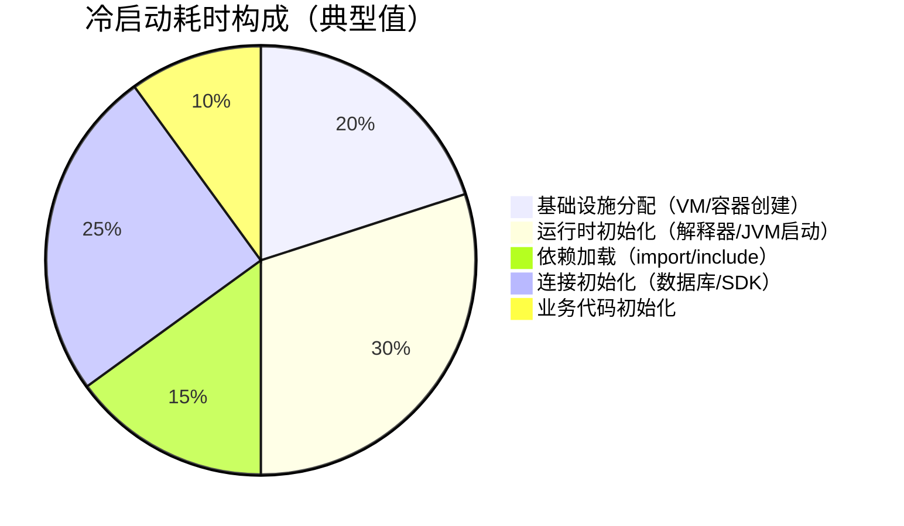

不同语言运行时的冷启动性能差异巨大：

| 运行时 | 冷启动耗时（典型） | 原因 | 优化难度 |
|--------|-------------------|------|---------|
| Go | 5-50ms | 编译为原生二进制，无需解释器启动 | 低 |
| Rust | 5-30ms | 编译为原生二进制，零运行时开销 | 低 |
| Node.js | 100-500ms | V8 引擎启动 + 依赖加载 | 中 |
| Python | 100-500ms | 解释器启动 + 包导入 | 中 |
| Java | 500ms-3s | JVM 启动 + 类加载 + JIT 预热 | 高 |
| .NET | 200-800ms | CLR 启动 + 程序集加载 | 中 |

#### 3.2 冷启动优化策略

**策略一：预置并发（Provisioned Concurrency）**

在流量高峰期之前，预先初始化指定数量的函数实例，消除冷启动：

```yaml
# AWS SAM 模板示例：预置并发配置
Resources:
  MyFunction:
    Type: AWS::Serverless::Function
    Properties:
      Handler: index.handler
      Runtime: python3.11
      ProvisionedConcurrencyConfig:
        ProvisionedConcurrentExecutions: 10  # 预置10个实例
      AutoPublishAlias: live
```

预置并发的代价是持续产生费用（即使没有请求），适合有稳定基线流量的场景。

**策略二：减少部署包体积**

冷启动时间与代码包大小正相关。优化手段包括：

```python
# 不推荐：一次性导入所有模块
import numpy
import pandas
import requests
import boto3
from datetime import datetime

# 推荐：按需导入，延迟加载
def handler(event, context):
    import json  # 仅在需要时导入
    # ... 业务逻辑
    if needs_data_processing(event):
        import numpy as np  # 条件导入
        # ... 数据处理
```

更进一步的体积优化手段：

| 手段 | 效果 | 示例 |
|------|------|------|
| 依赖裁剪 | 减少 30-70% 包体积 | esbuild 去除未使用代码 |
| Lambda Layer | 共享依赖，减少主包体积 | 将 boto3 放入 Layer |
| 容器镜像缓存 | 避免每次拉取完整镜像 | ECR 镜像缓存 |
| 单体打包 | 合并多个小函数 | 减少部署开销 |

**策略三：运行时选择**

选择冷启动更快的运行时可以显著降低延迟。在 AWS Lambda 中，提供的 Python 运行时比自定义 Docker 运行时的冷启动更快，因为平台对其做了专项优化。

**策略四：Keep-Alive 模式**

利用平台的实例复用机制，保持函数实例处于温热状态。部分平台提供了"Keep Warm"机制，通过定时触发避免实例被回收：

```python
# 通过定时事件保持实例温热
import json

# CloudWatch Events 每 5 分钟触发一次
def keep_warm(event, context):
    """空操作，仅用于保持实例存活"""
    print(f"Keep warm at {context.get_remaining_time_in_millis()}")
    return {'statusCode': 200, 'body': 'warm'}
```

**策略五：选用更快的运行时**

不同运行时的冷启动差异可达 100 倍以上：

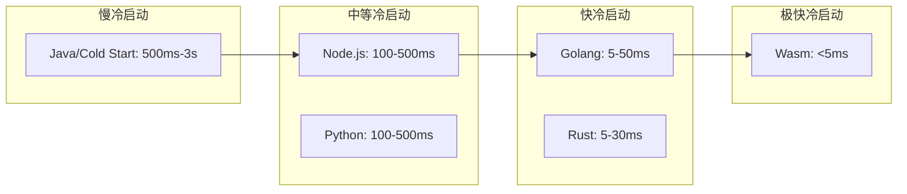

#### 3.3 冷启动的量化评估

在做架构决策前，需要量化冷启动对业务的实际影响。以下是一个评估框架：

| 评估维度 | 指标 | 计算方法 |
|---------|------|---------|
| P50 延迟影响 | 冷启动占比 | 冷启动次数 / 总调用次数 × 冷启动耗时 |
| P99 延迟影响 | 最坏情况 | 假设 P99 请求全部冷启动，叠加业务处理时间 |
| 成本影响 | 预置并发费用 | 预置实例数 × 单价 × 运行时间 |
| 用户体验 | 首屏加载时间 | 首次请求冷启动耗时 + 网络延迟 |

**经验法则**：

- 如果冷启动占总延迟 < 10%，通常可以接受
- 如果冷启动占总延迟 > 30%，需要采取优化措施
- 对于 P99 延迟敏感的场景（如支付），冷启动是不可接受的

### 4. BaaS：后端即服务

#### 4.1 BaaS 的核心能力

BaaS 将后端基础设施封装为托管服务，开发者无需编写后端代码即可获得完整的后端能力：

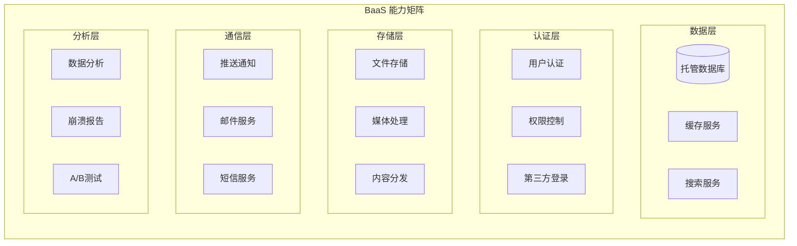

#### 4.2 主流 BaaS 平台对比

| 特性 | Firebase | Supabase | AWS Amplify | PocketBase |
|------|----------|----------|-------------|-----------|
| 数据库 | Firestore（NoSQL） | PostgreSQL（SQL） | DynamoDB/GraphQL | SQLite |
| 实时同步 | 原生支持 | Realtime（基于WAL） | AppSync Subscriptions | WebSocket |
| 身份认证 | Firebase Auth | GoTrue | Cognito | 内置认证 |
| 文件存储 | Cloud Storage | S3 兼容 | S3 | 本地文件系统 |
| 托管方式 | 完全托管（Google） | 自托管/Supabase Cloud | 完全托管（AWS） | 自托管 |
| 定价模式 | 按用量计费 | 免费层+按用量 | 按用量计费 | 完全免费 |
| 开源 | 否 | 是 | 否 | 是 |
| 适用场景 | 移动应用快速开发 | 全栈 Web 应用 | AWS 生态深度集成 | 小型项目/原型 |

#### 4.3 FaaS + BaaS 组合模式

在实际项目中，FaaS 和 BaaS 通常配合使用。以一个电商系统的用户注册流程为例：

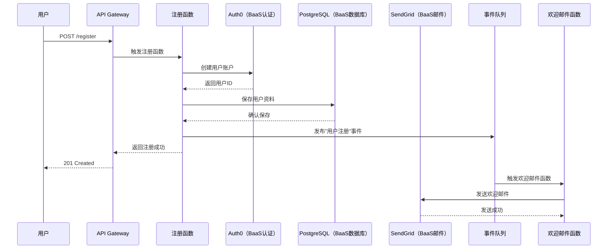

这个设计体现了 Serverless 的核心理念：**每个函数只做一件事，BaaS 提供基础设施能力，事件队列解耦函数间的依赖**。

### 5. 主流 Serverless 平台深度对比

#### 5.1 云厂商 FaaS 平台

| 特性 | AWS Lambda | Azure Functions | Google Cloud Functions | 阿里云函数计算 |
|------|-----------|----------------|----------------------|-------------|
| 发布时间 | 2014 | 2016 | 2017 | 2017 |
| 支持语言 | Python/Node.js/Java/Go/Ruby/.NET/Custom | C#/F#/Java/JS/Python/PowerShell/TS | Node.js/Python/Go/Java/.NET/Ruby/PHP/Shell | Python/Node.js/Java/PHP/Go/.NET |
| 最大执行时间 | 15分钟 | 10分钟（消费计划）/无限制（高级计划） | 60分钟（2代函数） | 24小时 |
| 最大内存 | 10,240 MB | 1,536 MB（消费计划） | 32,768 MB | 32,768 MB |
| 冷启动优化 | SnapStart（Java）/ Provisioned Concurrency | Premium Plan（预热实例） | 最小实例数（Min Instances） | 预留实例 |
| 事件源数量 | 200+ 原生集成 | Azure 服务 + 自定义绑定 | GCP 服务 + Pub/Sub | 阿里云全系产品 |
| 容器镜像支持 | 最大 10 GB | 最大 1.5 GB（消费计划） | 最大 32 GB | 最大 10 GB |
| 本地调试 | SAM CLI | Core Tools + VS Code | Functions Framework | Serverless Devs |
| 计价 | 按调用次数+执行时长+内存 | 按执行次数+执行时长 | 按调用次数+执行时长+CPU | 按调用次数+执行时长 |

#### 5.2 开源 Serverless 框架

当需要避免供应商锁定或在自建基础设施上运行 Serverless 时，开源方案是关键选择：

**Knative**：Google 发起，运行在 Kubernetes 之上的 Serverless 平台。提供两个核心组件：
- **Serving**：自动扩缩容（含缩至零）、流量分割、版本管理
- **Eventing**：事件路由和分发，支持 CloudEvents 标准

```yaml
# Knative Service 部署示例
apiVersion: serving.knative.dev/v1
kind: Service
metadata:
  name: order-processor
spec:
  template:
    metadata:
      annotations:
        # 自动扩缩配置
        autoscaling.knative.dev/minScale: "0"    # 允许缩至零
        autoscaling.knative.dev/maxScale: "100"  # 最大实例数
        autoscaling.knative.dev/target: "50"     # 每实例目标并发
    spec:
      containers:
        - image: gcr.io/my-project/order-processor:v1
          resources:
            requests:
              cpu: "100m"
              memory: "128Mi"
            limits:
              cpu: "500m"
              memory: "512Mi"
          env:
            - name: DATABASE_URL
              valueFrom:
                secretKeyRef:
                  name: db-secret
                  key: url
---
# 流量分割：金丝雀发布
apiVersion: serving.knative.dev/v1
kind: Route
metadata:
  name: order-processor
spec:
  traffic:
    - revisionName: order-processor-v1
      percent: 90     # 90% 流量到 v1
    - revisionName: order-processor-v2
      percent: 10     # 10% 流量到 v2（金丝雀）
```

**OpenFaaS**：轻量级 Serverless 框架，任何 Docker 容器都可以变成 Serverless 函数：

```bash
# OpenFaaS 函数部署
# 1. 创建函数
faas-cli new image-resize --lang python3

# 2. 编写 handler.py
cat > image-resize/handler.py << 'EOF'
from PIL import Image
import io, os

def handle(event, context):
    """处理图片缩放事件"""
    body = event.body
    img = Image.open(io.BytesIO(body))
    img.thumbnail((200, 200))
    buffer = io.BytesIO()
    img.save(buffer, 'JPEG')
    return buffer.getvalue()
EOF

# 3. 构建并部署
faas-cli build -f stack.yml
faas-cli deploy -f stack.yml
```

**其他开源方案对比**：

| 框架 | 底层技术 | 扩缩至零 | 事件驱动 | 适用场景 |
|------|---------|---------|---------|---------|
| Knative | Kubernetes | ✅ | ✅（Eventing） | 企业级，K8s 生态 |
| OpenFaaS | Docker/K8s | ✅ | ✅（告警器） | 中小团队，快速上手 |
| Fn Project | Docker | ✅ | ✅（Fn Kafka） | 云原生，多租户 |
| Fission | Kubernetes | ✅ | ✅（消息队列） | K8s 原生，简洁 |
| Beldi | 自定义运行时 | ✅ | ✅ | WebAssembly Serverless |

### 6. 适用场景与设计模式

#### 6.1 最佳适用场景

Serverless 并非银弹，它在特定场景下能发挥最大价值。以下是经过验证的最佳适用场景：

**场景一：事件驱动的数据处理管道**

典型需求：用户上传图片/视频后，自动进行格式转换、缩略图生成、内容审核、元数据提取。

```python
# 图片处理管道：S3 事件 → Lambda 链式处理
# Step 1: 格式转换函数
def convert_format(event, context):
    """将上传的图片转换为 WebP 格式"""
    s3 = boto3.client('s3')
    record = event['Records'][0]
    bucket = record['s3']['bucket']['name']
    key = record['s3']['object']['key']
    
    # 下载原图
    response = s3.get_object(Bucket=bucket, Key=key)
    img = Image.open(response['Body'])
    
    # 转换为 WebP
    webp_key = key.rsplit('.', 1)[0] + '.webp'
    buffer = io.BytesIO()
    img.save(buffer, 'WEBP', quality=85)
    buffer.seek(0)
    
    # 上传到处理后的桶
    s3.put_object(
        Bucket='processed-images',
        Key=webp_key,
        Body=buffer,
        ContentType='image/webp'
    )
    
    # 触发下一步：缩略图生成
    sns = boto3.client('sns')
    sns.publish(
        TopicArn=os.environ['THUMBNAIL_TOPIC'],
        Message=json.dumps({'bucket': 'processed-images', 'key': webp_key})
    )
```

成本对比（以 AWS 为例，假设月处理 100 万张图片）：

| 方案 | 月费用（估算） | 运维成本 |
|------|-------------|---------|
| EC2 t3.medium 持续运行 | ~$30（24/7 运行）+ 运维人力 | 高（需管理服务器、扩缩容） |
| Lambda 按需执行 | ~$5（100万次×$0.20/百万 + 执行时间） | 极低 |
| 节省比例 | **约 83%** | 运维工作量减少 **90%+** |

**场景二：API 后端（API Gateway + Lambda）**

适合请求量波动大、峰值不固定的 API 服务：

```python
# Serverless API 示例（使用 AWS Lambda + API Gateway）
import json
import os
import boto3
from decimal import Decimal

dynamodb = boto3.resource('dynamodb')
table = dynamodb.Table(os.environ['TABLE_NAME'])

def create_order(event, context):
    """创建订单"""
    body = json.loads(event['body'])
    
    # 参数校验
    required = ['product_id', 'quantity', 'user_id']
    for field in required:
        if field not in body:
            return {
                'statusCode': 400,
                'body': json.dumps({'error': f'Missing field: {field}'})
            }
    
    # 写入数据库
    import uuid
    from datetime import datetime
    
    order_id = str(uuid.uuid4())
    item = {
        'order_id': order_id,
        'user_id': body['user_id'],
        'product_id': body['product_id'],
        'quantity': body['quantity'],
        'status': 'pending',
        'created_at': datetime.utcnow().isoformat()
    }
    table.put_item(Item=item)
    
    # 发布订单创建事件
    events = boto3.client('events')
    events.put_entries(
        Entries=[{
            'Source': 'order.service',
            'DetailType': 'OrderCreated',
            'Detail': json.dumps(item, default=str)
        }]
    )
    
    return {
        'statusCode': 201,
        'body': json.dumps(item, default=str)
    }
```

**场景三：定时任务与后台批处理**

Cron 触发的定时任务是 Serverless 的天然场景——执行时间短、触发频率固定、不需要常驻进程：

```python
# 每日凌晨生成销售报表
import boto3
import json
from datetime import datetime, timedelta

def generate_daily_report(event, context):
    """每日销售报表生成"""
    dynamodb = boto3.resource('dynamodb')
    orders_table = dynamodb.Table('orders')
    ses = boto3.client('ses')
    
    # 查询昨日订单
    yesterday = (datetime.utcnow() - timedelta(days=1)).isoformat()
    response = orders_table.scan(
        FilterExpression=boto3.dynamodb.conditions.Attr('created_at').gte(yesterday)
    )
    
    orders = response['Items']
    total_revenue = sum(float(o.get('amount', 0)) for o in orders)
    
    # 生成报表内容
    report = f"""
    === 每日销售报表 ===
    日期: {yesterday[:10]}
    订单总数: {len(orders)}
    总收入: ¥{total_revenue:,.2f}
    平均订单金额: ¥{total_revenue/max(len(orders),1):,.2f}
    """
    
    # 发送邮件
    ses.send_email(
        Source='reports@company.com',
        Destination={'ToAddresses': ['manager@company.com']},
        Message={
            'Subject': {'Data': f'销售报表 - {yesterday[:10]}'},
            'Body': {'Text': {'Data': report}}
        }
    )
    
    return {'statusCode': 200, 'body': 'Report generated'}
```

**场景四：Webhook 处理**

接收第三方系统的 Webhook 通知并触发后续流程：

```python
# GitHub Webhook 处理函数
import json
import hmac
import hashlib

def handle_github_webhook(event, context):
    """处理 GitHub Push 事件"""
    # 1. 验证签名
    signature = event['headers'].get('X-Hub-Signature-256', '')
    expected = 'sha256=' + hmac.new(
        os.environ['WEBHOOK_SECRET'].encode(),
        event['body'].encode(),
        hashlib.sha256
    ).hexdigest()
    
    if not hmac.compare_digest(signature, expected):
        return {'statusCode': 401, 'body': 'Invalid signature'}
    
    # 2. 解析事件
    payload = json.loads(event['body'])
    action = payload.get('action')
    repo = payload['repository']['full_name']
    
    # 3. 根据事件类型分发处理
    if action == 'push':
        branch = payload['ref'].split('/')[-1]
        if branch == 'main':
            # 触发部署流水线
            trigger_deployment(repo, branch)
    
    return {'statusCode': 200, 'body': 'Processed'}
```

**场景五：实时流数据处理**

对 Kafka、Kinesis 等数据流中的每条记录进行实时处理：

```python
# Kinesis 数据流处理
import base64
import json

def process_kinesis_event(event, context):
    """处理 Kinesis 数据流中的记录"""
    for record in event['Records']:
        # Kinesis 数据是 base64 编码的
        payload = base64.b64decode(record['kinesis']['data'])
        data = json.loads(payload)
        
        # 实时分析：检测异常交易
        if data['amount'] > 10000:
            # 触发风控告警
            alert_service(data)
        
        # 写入分析数据库
        analytics_db.insert(data)
    
    return {'statusCode': 200, 'processed': len(event['Records'])}
```

#### 6.2 典型设计模式

**模式一：函数链（Function Chain）**

多个函数通过事件队列串联，形成处理管道：

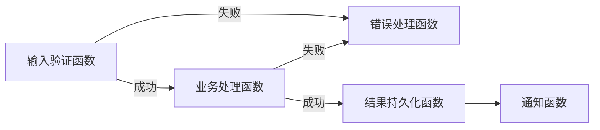

**模式一变体：扇出/扇入（Fan-out/Fan-in）**

一个函数将任务分发给多个并行执行的函数，汇总结果：

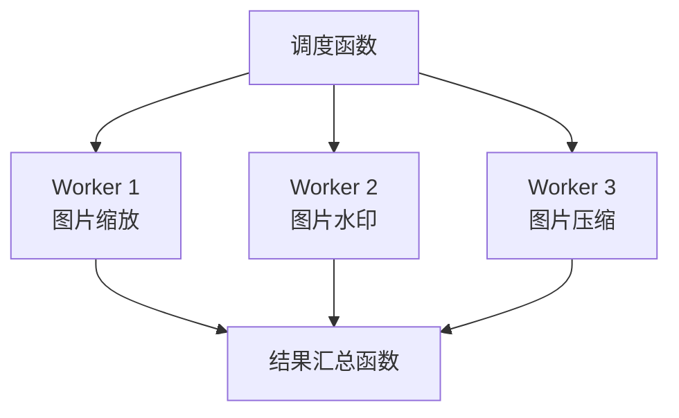

**模式二：异步事件处理**

长时间运行的任务分解为多个短执行，通过事件队列串联：

```python
# 异步任务分解示例：批量数据处理
def dispatch_batch(event, context):
    """将大批量任务拆分为小批次"""
    s3 = boto3.client('s3')
    sqs = boto3.client('sqs')
    
    # 获取待处理文件列表
    response = s3.list_objects_v2(Bucket='input-bucket', Prefix='batch/')
    
    # 每100个文件一个批次
    batch_size = 100
    files = response.get('Contents', [])
    
    for i in range(0, len(files), batch_size):
        batch = files[i:i+batch_size]
        sqs.send_message(
            QueueUrl=os.environ['BATCH_QUEUE'],
            MessageBody=json.dumps({
                'batch_index': i // batch_size,
                'files': [f['Key'] for f in batch]
            })
        )
    
    return {'batches_created': (len(files) + batch_size - 1) // batch_size}
```

**模式三：CQRS（命令查询职责分离）**

在 Serverless 架构中天然适用——写操作和读操作使用不同的函数和数据存储：

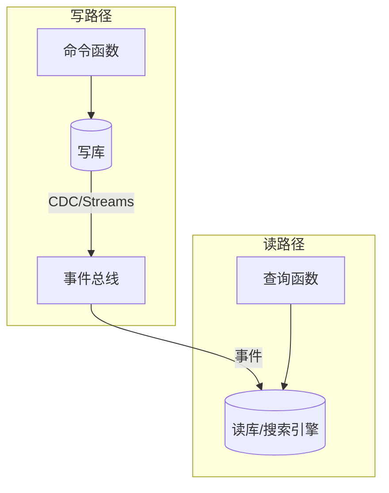

**模式四：Saga 编排（分布式事务）**

在 Serverless 微服务中实现跨服务事务补偿：

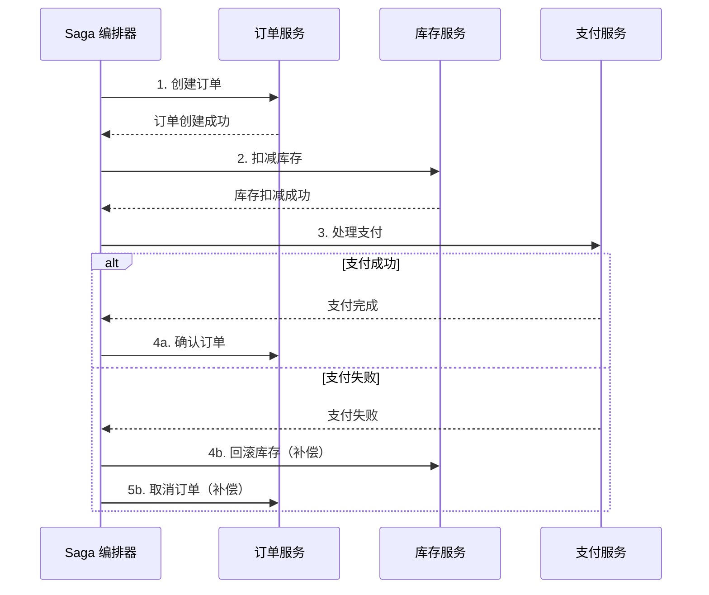

**模式五：API 聚合（Backend for Frontend）**

将多个后端服务的响应聚合为一个，减少客户端请求次数：

```python
# BFF 聚合函数
def aggregate_user_profile(event, context):
    """聚合用户信息、订单历史、推荐商品"""
    user_id = event['pathParameters']['user_id']
    
    # 并行调用多个服务
    import concurrent.futures
    
    with concurrent.futures.ThreadPoolExecutor() as executor:
        future_user = executor.submit(get_user_info, user_id)
        future_orders = executor.submit(get_recent_orders, user_id, limit=5)
        future_recs = executor.submit(get_recommendations, user_id)
    
    return {
        'statusCode': 200,
        'body': json.dumps({
            'user': future_user.result(),
            'recent_orders': future_orders.result(),
            'recommendations': future_recs.result()
        })
    }
```

#### 6.3 不适合 Serverless 的场景

Serverless 有明确的局限性，以下场景应避免使用：

| 场景 | 原因 | 替代方案 |
|------|------|---------|
| 长时间运行任务（>15分钟） | 函数执行时间有上限 | ECS/EKS + 任务队列 |
| 高频低延迟（<1ms P99） | 冷启动 + 网络跳数增加延迟 | 常驻服务 + 预热实例 |
| 有状态服务（WebSocket、游戏服务器） | 函数无状态，实例不固定 | 长连接服务器（ECS/K8s） |
| 大内存计算（>10GB） | 内存限制，且单价高 | 专用计算实例 |
| 稳定高流量基线 | 持续运行不如预留实例划算 | ECS + Auto Scaling |
| 本地文件系统依赖 | 函数执行环境无持久本地存储 | 外部存储（S3/EFS） |

### 7. Serverless 与微服务的对比

Serverless 和微服务是两种不同的架构范式，各有优劣。理解它们的差异有助于做出正确的架构决策：

| 维度 | 微服务 | Serverless（FaaS） |
|------|--------|-------------------|
| 部署单元 | 容器化服务 | 函数 |
| 运行模式 | 持续运行 | 事件触发，按需执行 |
| 扩缩粒度 | Pod/容器级 | 函数级，自动缩至零 |
| 资源管理 | 需要管理（K8s） | 完全托管 |
| 状态管理 | 可在内存中维持状态 | 天然无状态 |
| 冷启动 | 无（服务常驻） | 有（首次请求延迟） |
| 运维复杂度 | 中-高（需要 K8s 运维） | 低（平台托管） |
| 成本模型 | 按实例数×时间 | 按调用次数×执行时长 |
| 适用规模 | 中大规模系统 | 中小规模或流量波动大的系统 |
| 技术栈灵活性 | 完全自选 | 受限于平台支持的语言 |
| 调试难度 | 中（可本地调试） | 高（需要模拟云环境） |
| 供应商锁定 | 低（K8s 可跨云） | 高（函数 API 与平台绑定） |

**选择决策流程**：

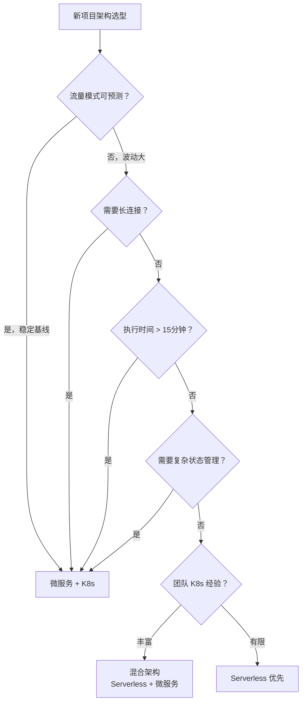

### 8. 成本模型与 FinOps

#### 8.1 Serverless 计费结构

以 AWS Lambda 为例，费用由三部分组成：

| 费用项 | 计算方式 | 当前价格（美东区域） |
|--------|---------|-------------------|
| 调用次数 | 每次请求计费 | $0.20 / 百万次 |
| 执行时长 | GB-秒计费（内存×执行时间） | $0.0000166667 / GB-秒 |
| 请求数据传输 | 出站数据量 | $0.09 / GB（前10TB） |

**免费额度**（每月）：
- 100 万次请求
- 400,000 GB-秒执行时间

**成本计算示例**：

```python
# Serverless 成本计算器
def calculate_lambda_cost(
    monthly_requests: int,
    avg_execution_time_ms: int,
    memory_mb: int
) -> dict:
    """计算 AWS Lambda 月度费用"""
    # 免费额度
    FREE_REQUESTS = 1_000_000
    FREE_GB_SECONDS = 400_000
    
    # 价格（美东）
    PRICE_PER_REQUEST = 0.20 / 1_000_000  # 每次
    PRICE_PER_GB_SECOND = 0.0000166667     # 每 GB-秒
    
    # 计算
    billable_requests = max(0, monthly_requests - FREE_REQUESTS)
    gb_seconds = (memory_mb / 1024) * (avg_execution_time_ms / 1000) * monthly_requests
    billable_gb_seconds = max(0, gb_seconds - FREE_GB_SECONDS)
    
    cost_requests = billable_requests * PRICE_PER_REQUEST
    cost_compute = billable_gb_seconds * PRICE_PER_GB_SECOND
    total_cost = cost_requests + cost_compute
    
    return {
        'requests_cost': f'${cost_requests:.4f}',
        'compute_cost': f'${cost_compute:.4f}',
        'total_monthly_cost': f'${total_cost:.4f}',
        'effective_price_per_request': f'${total_cost / max(monthly_requests, 1):.8f}'
    }

# 示例：月 1000 万次调用，平均 200ms，128MB 内存
# 结果约 $23/月，远低于等效的 EC2 实例
```

#### 8.2 与传统架构的成本对比

| 月流量 | Lambda 费用 | EC2 t3.micro 费用 | 节省比例 |
|--------|-----------|-----------------|---------|
| 100万请求 | 免费（免费额度内） | $7.59 | 100% |
| 1000万请求 | ~$2 | $7.59 | 74% |
| 1亿请求 | ~$20 | $7.59（但需多实例） | 40%（需评估） |
| 10亿请求 | ~$200 | 需要多台实例 + 负载均衡 | 视情况而定 |

**关键洞察**：Serverless 在低到中等流量时成本优势显著。当流量稳定且规模很大时，预留实例（Provisioned Concurrency）或传统服务器可能更经济。

### 9. 安全最佳实践

#### 9.1 Serverless 安全模型

Serverless 改变了安全责任边界：

```mermaid
graph TB
    subgraph "传统架构安全责任"
        A1[物理安全] --> A2[操作系统安全]
        A2 --> A3[网络配置安全]
        A3 --> A4[运行时安全]
        A4 --> A5[应用代码安全]
        A1-.-A4: 云服务商/运维负责
        A5: 开发者负责
    end
    
    subgraph "Serverless 安全责任"
        B1[物理安全] --> B2[操作系统安全]
        B2 --> B3[网络配置安全]
        B3 --> B4[运行时安全]
        B4 --> B5[应用代码安全]
        B1-.-B4: 云服务商负责
        B5: 开发者负责
    end
```

#### 9.2 核心安全措施

**最小权限原则**：每个函数只授予执行其职责所需的最小 IAM 权限：

```json
{
  "Version": "2012-10-17",
  "Statement": [
    {
      "Effect": "Allow",
      "Action": [
        "dynamodb:GetItem",
        "dynamodb:PutItem"
      ],
      "Resource": "arn:aws:dynamodb:*:*:table/orders"
    },
    {
      "Effect": "Deny",
      "Action": "dynamodb:DeleteTable",
      "Resource": "*"
    }
  ]
}
```

**函数层面的安全清单**：

| 安全措施 | 实施方法 | 重要性 |
|---------|---------|-------|
| 环境变量加密 | 使用 KMS 加密敏感配置 | 高 |
| 输入校验 | 所有外部输入必须验证和清理 | 极高 |
| 依赖漏洞扫描 | Snyk/Dependabot 自动扫描 | 高 |
| API 认证 | JWT 验证 / API Key / OAuth | 极高 |
| 日志脱敏 | 不在日志中打印密码、token 等 | 中 |
| 超时设置 | 设置合理的函数超时时间 | 中 |
| 死信队列 | 处理失败的事件进入 DLQ 重试 | 高 |
| VPC 隔离 | 敏感函数在 VPC 内运行 | 高 |

#### 9.3 供应链安全

Serverless 函数的依赖链是常见攻击入口。攻击者可能通过投毒公共包（如 typosquatting）在依赖中植入恶意代码：

| 攻击类型 | 描述 | 防御措施 |
|---------|------|---------|
| Typosquatting | 发布名称相似的恶意包 | 使用 lockfile + 包名校验 |
| 依赖混淆 | 利用私有包名冲突上传恶意包 | 配置私有 registry scope |
| 恶意更新 | 正常包被投毒更新 | 锁定版本 + 审计变更 |
| 构建时攻击 | 篡改 CI/CD 构建环境 | 隔离构建 + 签名验证 |

```yaml
# SLS Framework 中配置依赖审计
plugins:
  - serverless-plugin-dependency-check

custom:
  dependencyCheck:
    failOnVulnerability: critical  # 仅阻止严重漏洞
    ignoreDirectories:
      - node_modules/test  # 排除测试依赖
```

### 10. Serverless 测试策略

Serverless 函数的测试比传统应用更复杂——函数生命周期短暂、依赖云服务、事件源多样。需要建立分层测试体系：

#### 10.1 测试金字塔

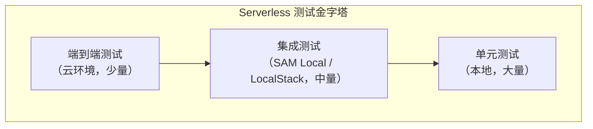

#### 10.2 单元测试

在本地隔离环境中测试函数逻辑，mock 所有外部依赖：

```python
# 单元测试示例（使用 pytest + moto）
import pytest
import json
from moto import mock_s3, mock_dynamodb
from my_lambda import lambda_handler

@pytest.fixture
def aws_setup():
    """设置模拟 AWS 环境"""
    with mock_s3(), mock_dynamodb():
        # 创建模拟 S3 桶
        import boto3
        s3 = boto3.client('s3', region_name='us-east-1')
        s3.create_bucket(Bucket='test-images')
        s3.put_object(
            Bucket='test-images',
            Key='photo.jpg',
            Body=b'fake-image-data'
        )
        
        # 创建模拟 DynamoDB 表
        dynamodb = boto3.resource('dynamodb', region_name='us-east-1')
        dynamodb.create_table(
            TableName='users',
            KeySchema=[{'AttributeName': 'user_id', 'KeyType': 'HASH'}],
            AttributeDefinitions=[{'AttributeName': 'user_id', 'AttributeType': 'S'}],
            BillingMode='PAY_PER_REQUEST'
        )
        yield

def test_process_image(aws_setup):
    """测试图片处理函数"""
    event = {
        'Records': [{
            's3': {
                'bucket': {'name': 'test-images'},
                'object': {'key': 'photo.jpg'}
            }
        }]
    }
    
    result = lambda_handler(event, None)
    assert result['statusCode'] == 200

def test_missing_required_field(aws_setup):
    """测试缺少必填字段时的错误处理"""
    event = {'body': json.dumps({'user_id': '123'})}
    result = create_order(event, None)
    assert result['statusCode'] == 400
```

#### 10.3 集成测试

使用 SAM CLI 或 LocalStack 在本地模拟完整的 Serverless 环境：

```bash
# SAM Local 集成测试
# 启动本地 API 服务器
sam local start-api --port 3000 --warm-containers EAGER

# 使用另一个终端发送测试请求
curl -X POST http://localhost:3000/orders \
  -H "Content-Type: application/json" \
  -d '{"product_id": "P001", "quantity": 2, "user_id": "U001"}'

# 自动化集成测试脚本
#!/bin/bash
set -e

# 启动本地环境
sam local start-api --port 3000 &amp;
PID=$!
sleep 10  # 等待服务就绪

# 运行测试
pytest tests/integration/ -v

# 清理
kill $PID
```

#### 10.4 并发与幂等测试

Serverless 函数在高并发下可能出现竞态条件，需要专门测试：

```python
# 并发安全测试
import concurrent.futures
import boto3

def test_concurrent_orders():
    """测试高并发下订单处理的正确性"""
    dynamodb = boto3.resource('dynamodb')
    table = dynamodb.Table('inventory')
    
    # 初始库存为 10
    table.put_item(Item={'product_id': 'P001', 'stock': 10})
    
    # 并发扣减库存 15 次
    def decrement_stock():
        return decrement_inventory('P001', 1)  # 你的函数
    
    with concurrent.futures.ThreadPoolExecutor(max_workers=15) as executor:
        futures = [executor.submit(decrement_stock) for _ in range(15)]
        results = [f.result() for f in futures]
    
    # 验证：库存不能为负
    final_stock = table.get_item(Key={'product_id': 'P001'})['Item']['stock']
    assert final_stock >= 0, f"库存异常：{final_stock}"
```

### 11. Serverless 迁移策略

从传统架构迁移到 Serverless 不是"一步到位"的过程，而是渐进式的演进。以下是经过验证的迁移路径：

#### 11.1 迁移评估框架

| 评估维度 | 适合迁移 | 不适合迁移 |
|---------|---------|-----------|
| 执行时间 | < 15 分钟 | > 15 分钟 |
| 流量模式 | 波动大、有峰谷 | 稳定高基线 |
| 状态依赖 | 无状态或可外部化 | 强状态依赖 |
| 延迟要求 | > 100ms P99 | < 10ms P99 |
| 调用频率 | 不可预测 | 稳定可预测 |
| 技术栈 | Node.js/Python/Go | C++/自定义运行时 |

#### 11.2 渐进式迁移路径

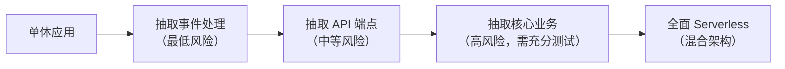

**阶段一：事件处理剥离**

将后台任务（定时任务、Webhook 处理、文件处理）迁移到 Lambda。这些任务对延迟不敏感，失败可以重试，风险最低。

**阶段二：API 层 Serverless 化**

将读多写少的 API 端点迁移到 API Gateway + Lambda。保留核心写操作在原服务中，通过 API Gateway 做流量路由。

**阶段三：核心业务函数化**

将订单处理、用户管理等核心业务逻辑拆分为独立函数。需要充分的集成测试和灰度发布。

#### 11.3 数据库迁移注意事项

传统应用通常依赖关系型数据库的连接池，而 Serverless 函数的无状态特性会导致连接数爆炸：

| 问题 | 原因 | 解决方案 |
|------|------|---------|
| 连接数耗尽 | 每个函数实例建立独立连接 | 使用 RDS Proxy 或 Serverless 数据库 |
| 连接泄漏 | 函数超时未正确关闭连接 | 使用 contextmanager + 合理超时设置 |
| 冷启动延迟 | 数据库连接初始化慢 | 将连接对象放在函数外部（全局初始化） |
| 事务一致性 | 分布式调用难以保证 ACID | 使用 Saga 模式或最终一致性 |

```python
# 连接池最佳实践：RDS Proxy + 全局连接
import pymysql
import os

# 在函数外部初始化，复用连接
conn = None

def get_connection():
    global conn
    if conn is None or not conn.open:
        conn = pymysql.connect(
            host=os.environ['DB_HOST'],
            user=os.environ['DB_USER'],
            password=os.environ['DB_PASSWORD'],
            database=os.environ['DB_NAME'],
            connect_timeout=5,
            read_timeout=10,
            cursorclass=pymysql.cursors.DictCursor
        )
    return conn

def handler(event, context):
    db = get_connection()
    try:
        with db.cursor() as cursor:
            cursor.execute("SELECT * FROM users WHERE id = %s", (event['user_id'],))
            return cursor.fetchone()
    finally:
        # 不关闭连接，复用实例
        pass
```

### 12. Serverless CI/CD 流水线

Serverless 应用的 CI/CD 需要处理函数打包、依赖管理、环境隔离等特殊挑战：

#### 12.1 流水线设计

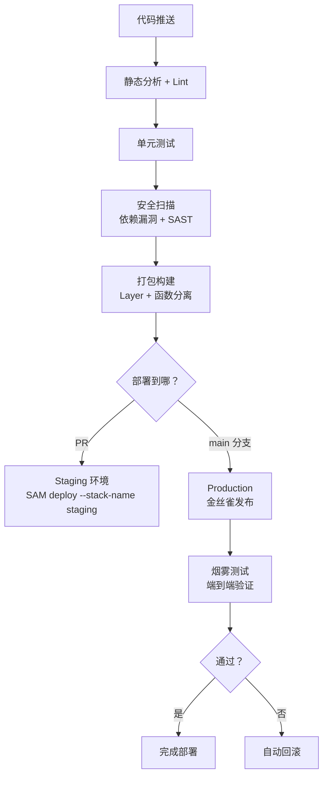

#### 12.2 GitHub Actions 示例

```yaml
# .github/workflows/serverless-deploy.yml
name: Serverless CI/CD
on:
  push:
    branches: [main, staging]
  pull_request:
    branches: [main]

jobs:
  test:
    runs-on: ubuntu-latest
    steps:
      - uses: actions/checkout@v4
      - uses: actions/setup-python@v5
        with:
          python-version: '3.11'
      
      - name: Install dependencies
        run: pip install -r requirements-dev.txt
      
      - name: Lint
        run: flake8 src/ tests/
      
      - name: Security scan
        run: |
          pip install bandit safety
          bandit -r src/ -ll  # 仅报告高危
          safety check -r requirements.txt
      
      - name: Unit tests
        run: pytest tests/unit/ -v --cov=src/ --cov-report=xml
      
      - name: Upload coverage
        uses: codecov/codecov-action@v3

  deploy:
    needs: test
    if: github.ref == 'refs/heads/main'
    runs-on: ubuntu-latest
    steps:
      - uses: actions/checkout@v4
      
      - name: Deploy to production
        run: |
          sam deploy \
            --stack-name prod-serverless-app \
            --capabilities CAPABILITY_IAM \
            --no-confirm-changeset \
            --resolve-s3
      
      - name: Smoke test
        run: |
          API_URL=$(aws cloudformation describe-stacks \
            --stack-name prod-serverless-app \
            --query 'Stacks[0].Outputs[?OutputKey==`ApiEndpoint`].OutputValue' \
            --output text)
          curl -f "$API_URL/health" || exit 1
```

#### 12.3 部署策略对比

| 策略 | 原理 | 适用场景 | 回滚速度 |
|------|------|---------|---------|
| 全量替换 | 直接更新函数代码 | 低风险变更 | 慢（需重新部署旧版本） |
| 金丝雀发布 | 新版本处理 5% 流量，逐步增加 | 生产环境常规发布 | 快（调整流量比例） |
| 预置并发 + 别名 | 预热新版本实例，切换流量别名 | 延迟敏感服务 | 极快（秒级切换） |
| A/B 测试 | 按用户分组路由到不同版本 | 功能验证 | 快 |

### 13. Serverless 可观测性

Serverless 的可观测性面临特殊挑战——函数生命周期短暂、日志分散、调用链跨越多个函数和 BaaS 服务。需要建立覆盖三大支柱的可观测体系：

#### 13.1 分布式追踪

```python
# 结构化日志 + X-Ray 追踪
import json
import os
from aws_xray_sdk.core import xray_recorder
from aws_xray_sdk.core import patch_all

# 自动追踪所有 AWS SDK 调用
patch_all()

def handler(event, context):
    # 添加自定义注解到 X-Ray 追踪
    subsegment = xray_recorder.begin_subsegment('business-logic')
    subsegment.put_annotation('user_id', event.get('user_id', 'unknown'))
    subsegment.put_metadata('event_size', len(json.dumps(event)))
    
    try:
        result = process_order(event)
        subsegment.put_metadata('result', 'success')
        return {'statusCode': 200, 'body': json.dumps(result)}
    except Exception as e:
        subsegment.add_exception(e)
        raise
    finally:
        xray_recorder.end_subsegment()
```

#### 13.2 结构化日志规范

统一的日志格式是 Serverless 可观测性的基石：

```python
# 结构化日志最佳实践
import json
import time
import os
from contextlib import contextmanager

class StructuredLogger:
    """Serverless 函数结构化日志"""
    
    def __init__(self, function_name: str):
        self.function_name = function_name
        self.request_id = os.environ.get('AWS_REQUEST_ID', 'unknown')
    
    def _log(self, level: str, message: str, extra: dict = None):
        log_entry = {
            'timestamp': time.time(),
            'level': level,
            'function': self.function_name,
            'request_id': self.request_id,
            'message': message,
        }
        if extra:
            log_entry['data'] = extra
        print(json.dumps(log_entry))  # CloudWatch 自动采集
    
    def info(self, message, **kwargs):
        self._log('INFO', message, kwargs)
    
    def error(self, message, **kwargs):
        self._log('ERROR', message, kwargs)

logger = StructuredLogger('order-processor')

@contextmanager
def trace_operation(operation_name: str):
    """追踪操作耗时"""
    start = time.time()
    try:
        yield
    finally:
        duration_ms = (time.time() - start) * 1000
        logger.info(f'{operation_name} completed', duration_ms=round(duration_ms, 2))
        if duration_ms > 1000:
            logger.error(f'Slow operation detected', operation=operation_name, duration_ms=duration_ms)

# 使用示例
def handler(event, context):
    logger.info('Processing order', order_id=event.get('order_id'))
    
    with trace_operation('database_write'):
        save_to_database(event)
    
    with trace_operation('send_notification'):
        notify_user(event)
    
    logger.info('Order processed successfully')
    return {'statusCode': 200}
```

#### 13.3 关键监控指标

| 指标类别 | 具体指标 | 告警阈值建议 |
|---------|---------|------------|
| 延迟 | P50/P99 执行时间 | P99 > 3s |
| 错误 | 函数错误率 | > 1% |
| 冷启动 | 冷启动比例 | > 20% 总调用 |
| 并发 | 同时执行实例数 | > 并发上限 80% |
| 迭代 | 递归调用深度 | > 5 层 |
| 费用 | 日均费用 | 环比增长 > 50% |
| 超时 | 超时函数比例 | > 0.1% |

#### 13.4 告警与自动修复

```yaml
# CloudFormation/SAM 告警配置
Resources:
  ErrorAlarm:
    Type: AWS::CloudWatch::Alarm
    Properties:
      AlarmName: LambdaErrorRate
      MetricName: Errors
      Namespace: AWS/Lambda
      Statistic: Sum
      Period: 300
      EvaluationPeriods: 2
      Threshold: 10
      ComparisonOperator: GreaterThanThreshold
      Dimensions:
        - Name: FunctionName
          Value: !Ref MyFunction
  
  LatencyAlarm:
    Type: AWS::CloudWatch::Alarm
    Properties:
      AlarmName: LambdaHighLatency
      MetricName: Duration
      Namespace: AWS/Lambda
      ExtendedStatistic: p99
      Period: 300
      EvaluationPeriods: 3
      Threshold: 5000  # 5 秒
      ComparisonOperator: GreaterThanThreshold
```

### 14. 常见误区与纠正

#### 误区一：Serverless 就是免费的

**纠正**：免费额度仅适用于极小规模。生产环境的真实费用取决于调用频率、执行时长和内存配置。对于高频调用场景，Serverless 的费用可能超过预留实例。**正确做法**：在架构决策前进行详细的成本建模，使用 AWS Lambda Pricing Calculator 等工具进行估算。

#### 误区二：Serverless 可以替代所有后端架构

**纠正**：Serverless 有明确的适用边界——长时间运行任务、有状态服务、高频低延迟场景都不适合。**正确做法**：采用混合架构，将适合 Serverless 的部分（事件处理、定时任务、API 网关）用 FaaS，不适合的部分用微服务或容器。

#### 误区三：冷启动不重要

**纠正**：对于面向用户的 API，冷启动延迟直接影响用户体验。P99 请求的冷启动可能导致数百毫秒到数秒的额外延迟。**正确做法**：在架构设计阶段就评估冷启动影响，对延迟敏感的函数使用预置并发或选择快速运行时。

#### 误区四：Serverless 不需要测试

**纠正**：Serverless 函数同样需要测试，且测试策略更复杂——需要模拟事件源、测试冷启动行为、验证并发安全。**正确做法**：建立分层测试策略，包括单元测试（本地）、集成测试（AWS SAM local）和端到端测试（云环境）。

#### 误区五：Serverless 天然高可用

**纠正**：虽然平台提供基础设施冗余，但函数本身的逻辑错误、权限配置错误、依赖服务故障都会导致服务不可用。**正确做法**：为关键函数配置重试策略、死信队列和降级方案；对依赖的 BaaS 服务做健康检查。

#### 误区六：迁移 Serverless 是一次性的

**纠正**：Serverless 迁移是持续演进的过程，不是一次性项目。**正确做法**：采用渐进式迁移策略，从低风险的事件处理开始，逐步将核心业务迁移到 Serverless，同时保留回退能力。

### 15. 工具链与开发体验

#### 15.1 Serverless 开发框架

| 框架 | 特点 | 适用场景 | 语言支持 |
|------|------|---------|---------|
| Serverless Framework | 成熟生态，插件丰富 | 多云 Serverless 开发 | JS/Python/Go |
| AWS SAM | AWS 官方，CloudFormation 集成 | AWS 专属项目 | 同 Lambda |
| AWS CDK | 编程式定义基础设施 | 复杂 IaC 需求 | TS/Python/Java/Go |
| SST | 本地开发体验优秀 | 全栈 Serverless 应用 | TS/JS |
| Architect | 极简声明式定义 | 快速原型开发 | JS |

#### 15.2 本地开发与测试

```bash
# 使用 AWS SAM CLI 本地测试 Lambda 函数
# 1. 模拟 API Gateway 事件
sam local invoke MyFunction \
  --event events/api-gateway-proxy.json

# 2. 启动本地 API 服务器
sam local start-api --port 3000

# 3. 调试模式（附加调试器）
sam local invoke MyFunction \
  --debug-port 5858 \
  --event events/test-event.json
```

```bash
# 使用 Serverless Framework + LocalStack 本地模拟完整环境
# 安装 LocalStack
pip install localstack

# 启动本地 AWS 服务
localstack start

# 部署到本地
SERVERLESS_ENDPOINT=http://localhost:4566 sls deploy
```

#### 15.3 可观测性

Serverless 的可观测性面临特殊挑战——函数生命周期短暂，日志分散，调用链跨越多个函数和 BaaS 服务。

```python
# 结构化日志 + X-Ray 追踪
import json
import os
from aws_xray_sdk.core import xray_recorder
from aws_xray_sdk.core import patch_all

# 自动追踪所有 AWS SDK 调用
patch_all()

def handler(event, context):
    # 添加自定义注解到 X-Ray 追踪
    subsegment = xray_recorder.begin_subsegment('business-logic')
    subsegment.put_annotation('user_id', event.get('user_id', 'unknown'))
    subsegment.put_metadata('event_size', len(json.dumps(event)))
    
    try:
        result = process_order(event)
        subsegment.put_metadata('result', 'success')
        return {'statusCode': 200, 'body': json.dumps(result)}
    except Exception as e:
        subsegment.add_exception(e)
        raise
    finally:
        xray_recorder.end_subsegment()
```

### 16. 未来趋势

#### 16.1 WebAssembly（Wasm）+ Serverless

WebAssembly 正在成为下一代 Serverless 运行时的基础。Wasm 提供了比容器更轻量的隔离（<1ms 冷启动），支持多语言编译，且安全性更高（沙箱执行）。代表项目包括 Fermyon Spin、Cloudflare Workers（基于 V8 isolate）。

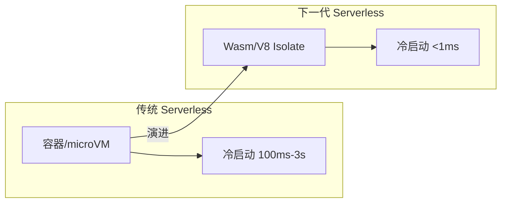

Wasm Serverless 的核心优势：

| 维度 | 传统 FaaS（容器/microVM） | Wasm FaaS |
|------|-------------------------|-----------|
| 冷启动 | 100ms - 3s | < 1ms |
| 沙箱安全性 | 进程级隔离 | Wasm 沙箱（更细粒度） |
| 语言支持 | 依赖运行时支持 | 任何编译到 Wasm 的语言 |
| 镜像大小 | MB - GB 级 | KB - MB 级 |
| 生态成熟度 | 非常成熟 | 快速发展中 |

#### 16.2 GPU Serverless

随着 AI 推理需求爆发，GPU Serverless 正在兴起。RunModal、Replicate、BentoML 等平台允许按需调用 GPU 资源进行模型推理，无需管理 GPU 集群。典型场景包括：

- **LLM 推理**：按 token 数计费，自动扩缩 GPU 实例
- **图像生成**：Stable Diffusion 等模型的按需推理
- **视频处理**：GPU 加速的转码和分析

#### 16.3 Serverless 数据库

Aurora Serverless v2、PlanetScale、Neon 等"Serverless 数据库"与 FaaS 天然互补——数据库也按实际使用量计费，从零自动扩展到数万 QPS，消除了"数据库成为扩缩瓶颈"的问题。

#### 16.4 边缘计算融合

Serverless 正在向边缘节点延伸，Cloudflare Workers、Deno Deploy、Vercel Edge Functions 等平台将函数执行推送到离用户最近的边缘节点：

| 维度 | 传统云 Serverless | 边缘 Serverless |
|------|------------------|----------------|
| 执行位置 | 单一区域 | 全球边缘节点 |
| 延迟 | 50-200ms（取决于用户位置） | < 50ms（就近执行） |
| 冷启动 | 100ms-3s | < 5ms（V8 Isolate） |
| 数据持久化 | 完整数据库支持 | KV/EdgeDB（受限） |
| 运行时限制 | 完整语言运行时 | JavaScript/Wasm（受限） |
| 适用场景 | 复杂业务逻辑 | API 加速、内容个性化、A/B 测试 |

### 17. 本节小结

无服务器计算是云原生架构中的重要范式，但绝非万能方案。掌握以下要点是正确使用 Serverless 的关键：

1. **本质认知**：Serverless 是"无需管理服务器"的计算模型，由 FaaS（计算）和 BaaS（后端服务）两大支柱构成
2. **核心优势**：零运维、按需付费、自动扩缩——这三者在流量波动大的场景下价值最大
3. **核心挑战**：冷启动延迟、执行时间限制、供应商锁定——需要在架构设计阶段就考虑应对策略
4. **适用边界**：事件驱动、短时执行、无状态的任务最适合 Serverless；长时间运行、有状态、高频低延迟的场景应选择传统架构
5. **测试策略**：建立分层测试体系——单元测试（moto mock）→ 集成测试（SAM Local）→ 端到端测试（云环境），重点关注并发安全和幂等性
6. **迁移路径**：渐进式迁移——从事件处理剥离开始，逐步扩展到 API 层和核心业务，每个阶段都保留回退能力
7. **混合架构**：生产环境中，Serverless 通常与微服务、容器等架构混合使用，各取所长
8. **持续演进**：Wasm 运行时、GPU Serverless、边缘计算正在拓展 Serverless 的能力边界

> **务实建议**：新项目可以从 Serverless 起步以快速验证想法，随着业务规模增长再评估是否需要迁移。已有系统可以逐步将事件处理、定时任务等适合 Serverless 的组件剥离出来，降低整体运维复杂度。迁移过程中，务必建立完善的测试和监控体系，确保每个阶段的变更都是可控的。
