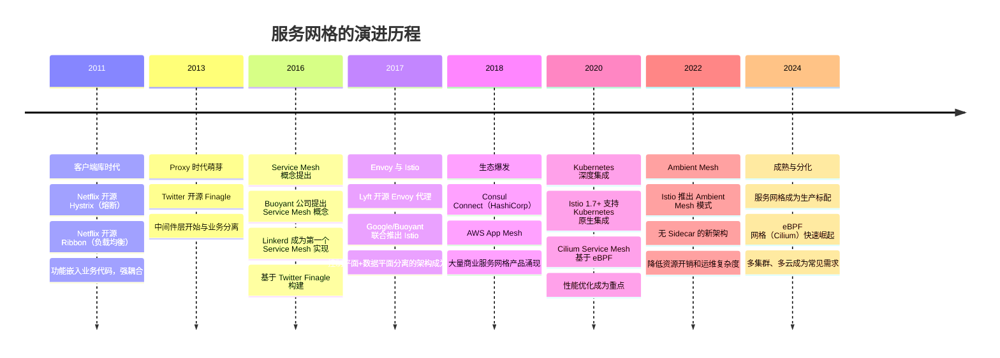
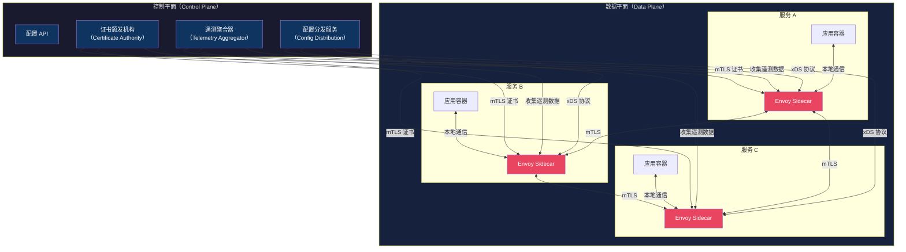
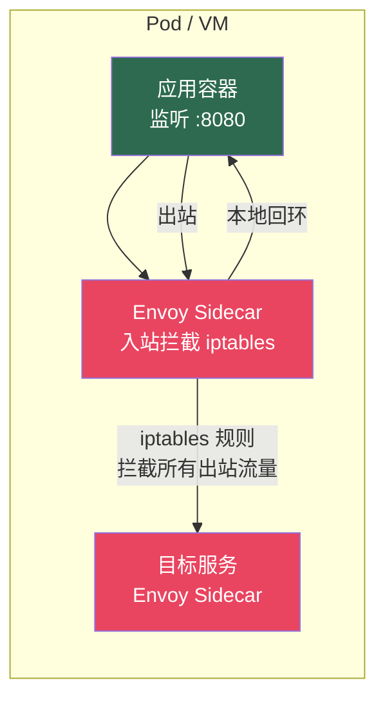
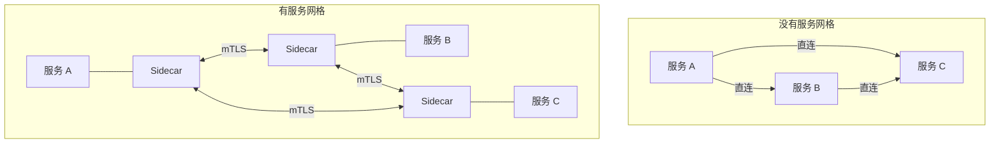
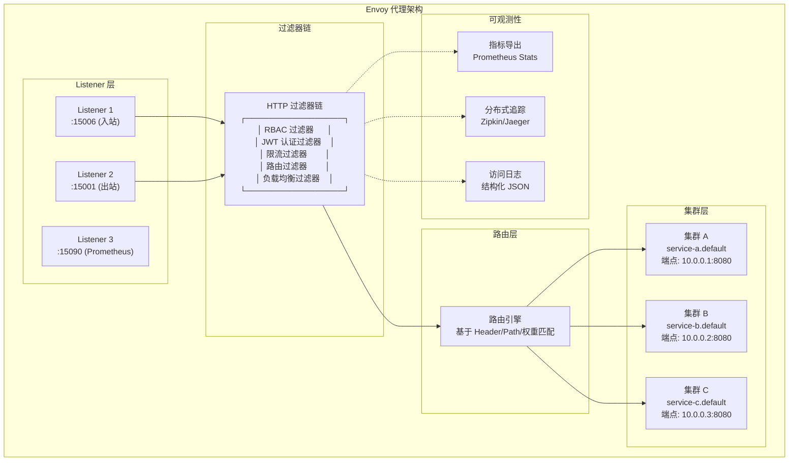
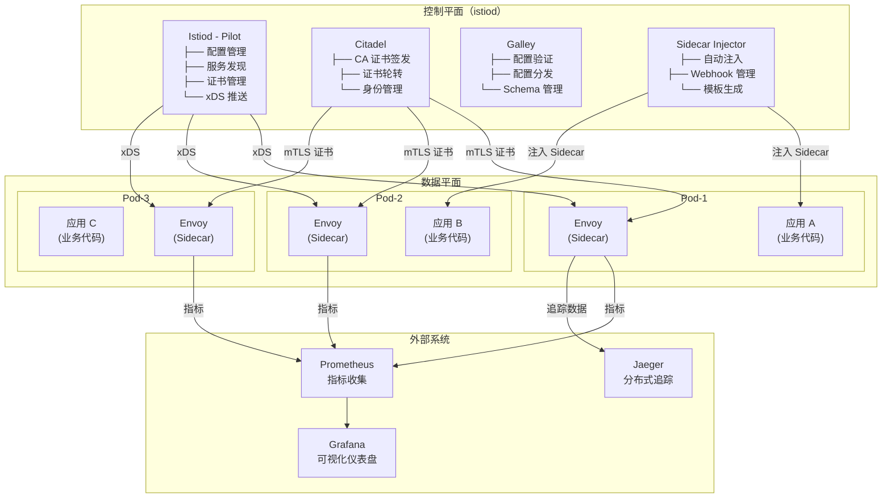
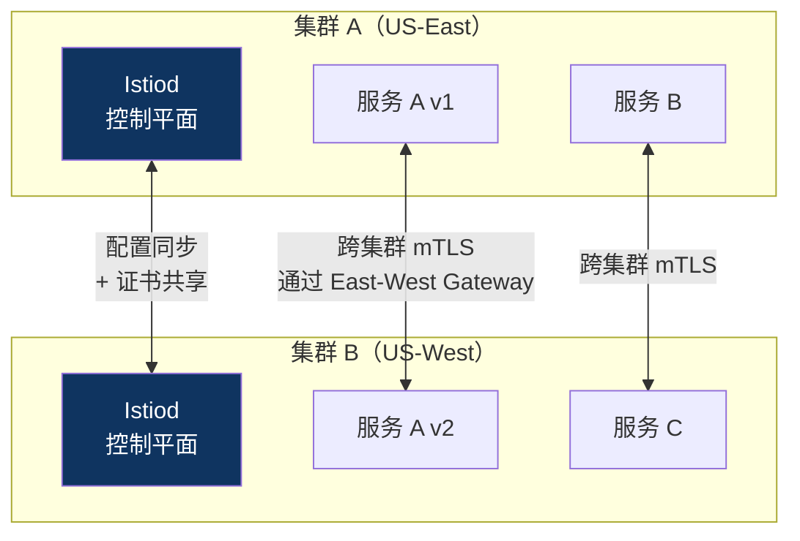
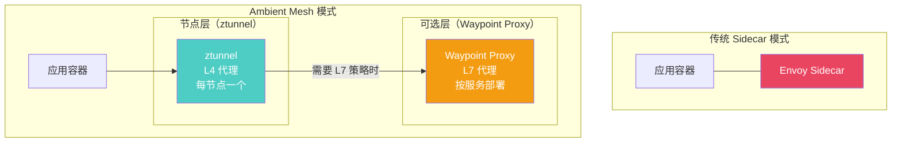
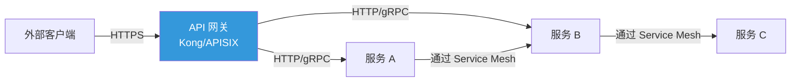

# 服务网格（Service Mesh）

### 1. 概述与背景

#### 1.1 什么是服务网格

服务网格（Service Mesh）是一种专门处理服务间通信的基础设施层。它的核心理念是：**将微服务之间的网络通信、安全策略和可观测性从业务代码中抽离出来，下沉到基础设施层统一管理**。

用一句话概括：服务网格让开发者专注于业务逻辑，而将"服务之间如何安全、可靠、高效地通信"交给平台来解决。

在微服务架构中，一个中等规模的系统可能有数十到数百个服务，每个服务之间的通信都需要处理以下问题：

- **服务发现**：如何找到目标服务的实例？
- **负载均衡**：如何将请求均匀分发到多个实例？
- **熔断与重试**：目标服务不可用时如何优雅降级？
- **传输加密**：服务间通信是否需要加密？证书如何管理？
- **可观测性**：请求链路如何追踪？延迟、错误率如何监控？
- **访问控制**：哪些服务可以调用哪些服务？

在没有服务网格之前，这些能力需要通过各自的客户端 SDK（如 Netflix OSS 的 Hystrix、Ribbon）嵌入到每个服务中。这导致了两个严重问题：

1. **多语言重复实现**：Java 有 Hystrix，Go 需要自己实现熔断，Python 又需要另一套——每种语言都要重新实现一遍
2. **升级维护困难**：SDK 版本升级需要每个服务都修改代码、重新发布，牵一发而动全身

服务网格的出现彻底改变了这一局面。它通过在每个服务实例旁边部署一个轻量级代理（Sidecar Proxy），将上述所有横切关注点从业务代码中剥离，由统一的基础设施层来处理。

#### 1.2 历史演进

服务网格的演进并非一蹴而就，而是经历了从库到网格、从应用层到基础设施层的逐步抽象：



#### 1.3 服务网格解决了什么问题

要理解服务网格的价值，需要先看清微服务架构中"服务间通信"面临的困境：

| 问题 | 传统方案 | 服务网格方案 | 差异 |
|------|----------|-------------|------|
| 负载均衡 | 客户端 SDK（Ribbon） | Sidecar 代理自动处理 | 语言无关，统一策略 |
| 熔断降级 | 客户端 SDK（Hystrix） | Sidecar 代理自动处理 | 无需修改业务代码 |
| 服务发现 | 注册中心 + 客户端查询 | Sidecar 代理拦截所有流量 | 对应用完全透明 |
| mTLS 加密 | 手动配置证书、密钥 | 控制平面自动签发和轮转 | 零配置安全 |
| 链路追踪 | 在代码中埋点（OpenTelemetry SDK） | Sidecar 自动注入追踪头 | 无需改动代码 |
| 访问控制 | 应用层中间件或 API 网关 | 基于身份的细粒度策略 | 策略集中管理 |
| 金丝雀发布 | 手动流量切分 | 声明式流量规则 | 按百分比精确控制 |
| 协议升级 | HTTP/1.1 → HTTP/2 需改代码 | Sidecar 自动处理协议转换 | 无感知升级 |

核心价值可以总结为三个"解耦"：

1. **语言解耦**：横切关注点不再需要每种语言重复实现
2. **开发与运维解耦**：开发者不再需要关心网络层的复杂性
3. **策略与代码解耦**：安全策略、流量策略可以独立于代码变更

### 2. 核心架构原理

#### 2.1 数据平面与控制平面

服务网格的架构遵循经典的**数据平面-控制平面分离**模式：



**数据平面（Data Plane）** 由一组轻量级代理（通常是 Envoy）组成，每个服务实例旁边部署一个。这些代理拦截进出服务的所有网络流量，执行负载均衡、熔断、加密、观测等操作。应用本身完全感知不到代理的存在。

**控制平面（Control Plane）** 是网格的"大脑"，负责：

- 管理和配置所有 Sidecar 代理的路由规则
- 签发和轮转 mTLS 证书
- 收集和聚合遥测数据
- 提供策略执行引擎

#### 2.2 Sidecar 模式详解

Sidecar 模式是服务网格最核心的设计模式。理解它的工作机制需要从网络层面入手：



当应用发起一个 HTTP 请求到 `http://service-b:8080/api/users` 时，实际的网络路径如下：

1. 应用调用 `service-b:8080`，发出一个 TCP 连接
2. **iptables 规则**拦截这个出站连接，重定向到本地的 Envoy Sidecar（监听 15001 端口）
3. Envoy 执行出站策略：服务发现、负载均衡选择目标实例、建立到目标 Envoy 的 mTLS 连接
4. 目标服务的 Envoy 收到请求，执行入站策略：认证验证、访问控制、限流
5. 目标 Envoy 将请求转发给本地的应用容器（localhost:8080）

**关键机制：iptables 透明劫持**

```bash
# Istio 使用的 iptables 规则（简化版）
# 入站流量：拦截所有外部到应用的连接，重定向到 Envoy 入站端口（15006）
iptables -t nat -A ISTIO_INBOUND -p tcp --dport 8080 -j REDIRECT --to-port 15006

# 出站流量：拦截所有应用发出的连接，重定向到 Envoy 出站端口（15001）
iptables -t nat -A ISTIO_OUTBOUND -p tcp -j REDIRECT --to-port 15001

# 排除 Envoy 自身的流量（避免无限循环）
iptables -t nat -A ISTIO_IN_REDIRECT -p tcp -j RETURN -m owner --uid-owner 1337
```

这个过程对应用完全透明——应用既不知道自己的流量被拦截了，也不需要做任何修改。这就是服务网格"零侵入"特性的技术基础。

#### 2.3 xDS 协议：控制平面与数据平面的通信

控制平面通过 **xDS 协议**（x Discovery Service）与数据平面的 Envoy 代理通信。xDS 是一组基于 gRPC 的 API，Envoy 通过它获取动态配置：

| xDS API | 功能 | 配置内容 |
|---------|------|---------|
| LDS（Listener Discovery） | 监听器发现 | Envoy 监听的端口和协议 |
| RDS（Route Discovery） | 路由发现 | 路由规则（匹配条件→目标集群） |
| CDS（Cluster Discovery） | 集群发现 | 上游服务集群的端点列表 |
| EDS（Endpoint Discovery） | 端点发现 | 集群中每个实例的具体地址和权重 |
| SDS（Secret Discovery） | 密钥发现 | mTLS 证书和私钥 |
| ADS（Aggregated Discovery） | 聚合发现 | 上述所有 API 的聚合通道，保证配置原子更新 |

Envoy 通过**长轮询（Long Polling）** 或 **gRPC 流式推送** 从控制平面获取配置。当控制平面的配置发生变化时（例如新增了一个路由规则），它会推送增量更新给受影响的 Envoy 实例，而不需要重启代理。

这种动态配置能力是服务网格能够实时响应策略变更的技术基础，也是它优于传统静态配置方案（如 Nginx 的 reload）的关键所在。

#### 2.4 服务网格与微服务架构的关系

服务网格不是微服务架构的替代品，而是其**基础设施层的增强**。两者的关系可以理解为：

- **微服务架构** 定义了应用的组织方式：将单体拆分为独立部署的服务
- **服务网格** 解决了微服务架构带来的通信复杂性问题



### 3. Envoy 代理深度解析

Envoy 是服务网格事实上的标准数据平面代理。由 Lyft 于 2016 年开源，2017 年捐赠给 CNCF，2018 年成为 CNCF 毕业项目。理解 Envoy 是掌握服务网格的关键。

#### 3.1 Envoy 的核心架构



#### 3.2 Envoy 的关键特性

**连接管理**：Envoy 在 L4 层面高效管理连接，支持连接池复用、健康检查、主动/被动健康检测。

```yaml
# Envoy 连接池配置示例
clusters:
  - name: service-b
    type: EDS
    lb_policy: ROUND_ROBIN
    connect_timeout: 5s
    # 连接池配置
    circuit_breakers:
      thresholds:
        - priority: DEFAULT
          max_connections: 1024
          max_pending_requests: 1024
          max_requests: 1024
          max_retries: 3
    # 被动健康检测（异常检测）
    outlier_detection:
      consecutive_5xx: 5
      interval: 10s
      base_ejection_time: 30s
      max_ejection_percent: 50
    # 主动健康检测
    health_checks:
      - timeout: 3s
        interval: 10s
        http_health_check:
          path: /healthz
          expected_statuses: ["200"]
```

**HTTP/2 和 gRPC 原生支持**：Envoy 原生支持 HTTP/2 和 gRPC 的多路复用，可以作为 HTTP/1.1 到 HTTP/2 的协议转换网关。

**热重启（Hot Restart）**：Envoy 支持在不中断现有连接的情况下更新自身配置，甚至进行进程级别的热重启。这在控制平面推送新配置时至关重要。

**WASM 扩展**：Envoy 支持通过 WebAssembly（WASM）插件扩展功能，用户可以使用 Rust、Go、C++ 等语言编写自定义过滤器，而无需修改 Envoy 核心代码。

#### 3.3 Envoy 的负载均衡算法

Envoy 支持多种负载均衡策略，适用于不同的场景：

| 策略 | 原理 | 适用场景 | 特点 |
|------|------|---------|------|
| Round Robin | 轮询分配 | 通用场景 | 简单公平，适合均匀负载 |
| Least Request | 选择当前连接数最少的实例 | 请求处理时间差异大 | 自然均衡后端负载 |
| Random | 随机选择 | 简单场景 | 大量请求时趋近均匀 |
| Ring Hash | 一致性哈希环 | 需要会话亲和性 | 缓存命中率高 |
| Maglev | Google Maglev 哈希 | 大规模负载均衡 | 端点变更时影响最小 |
| Locality Weighted | 按地域权重分配 | 多区域部署 | 优先访问同地域服务 |
| Random + P2C | 随机选两个取最优 | 高性能场景 | 避免尾延迟问题 |

### 4. Istio 架构与组件

Istio 是目前最广泛使用的开源服务网格实现，由 Google、IBM 和 Lyft 于 2017 年联合推出。

#### 4.1 Istio 架构全景



在 Istio 1.5 之后，Istio 将之前的 Pilot、Citadel、Galley 等组件合并为单一的 **istiod** 进程，大幅简化了部署和运维。

#### 4.2 Istio 核心组件详解

**Pilot（现已合并入 istiod）**：负责服务发现和流量管理。它将高层的流量规则（VirtualService、DestinationRule）转换为 Envoy 能理解的 xDS 配置，并推送到所有相关的 Sidecar 代理。

**Citadel（现已合并入 istiod）**：负责证书管理和 mTLS。它作为 CA（Certificate Authority）为每个服务签发短期证书（默认 24 小时自动轮转），确保服务间通信的加密和身份验证。

**Galley（现已合并入 istiod）**：负责配置验证和分发。它验证用户提交的 Istio 配置资源的格式和语义正确性，然后通过 xDS 协议分发给数据平面。

**Sidecar Injector**：通过 Kubernetes Admission Webhook，在 Pod 创建时自动将 Envoy Sidecar 注入到 Pod 中。用户只需在命名空间上打上 `istio-injection=enabled` 标签即可启用自动注入。

#### 4.3 Istio 安装与启用

```bash
# 1. 使用 istioctl 安装 Istio
# 下载 istioctl
curl -L https://istio.io/downloadIstio | sh -
cd istio-*
export PATH=$PWD/bin:$PATH

# 2. 安装 Istio（生产环境推荐 demo profile）
istioctl install --set profile=demo -y

# 3. 启用命名空间的自动注入
kubectl label namespace default istio-injection=enabled

# 4. 验证安装状态
istioctl verify-install

# 5. 验证 Sidecar 注入
kubectl get namespace -L istio-injection

# 6. 查看 Istio 组件状态
kubectl get pods -n istio-system
```

#### 4.4 Istio 自动注入机制

当一个 Pod 的命名空间被标记了 `istio-injection=enabled` 后，Kubernetes 在创建 Pod 时会触发一个 **MutatingWebhook**，Istio 的 Sidecar Injector 会自动在 Pod 中注入一个 Envoy Sidecar 容器：

```yaml
# 自动注入后的 Pod YAML（简化展示）
apiVersion: v1
kind: Pod
metadata:
  name: my-service
  labels:
    app: my-service
spec:
  containers:
    - name: my-service          # 原始应用容器
      image: my-service:v1
      ports:
        - containerPort: 8080
    - name: istio-proxy         # 自动注入的 Envoy Sidecar
      image: istio/proxyv2:1.20.0
      ports:
        - containerPort: 15090  # Prometheus 指标端口
        - containerPort: 15021  # 健康检查端口
        - containerPort: 15006  # 入站拦截端口
        - containerPort: 15001  # 出站拦截端口
      securityContext:
        runAsUser: 1337         # Envoy 专用 UID
        capabilities:
          drop:
            - ALL
          add:
            - NET_ADMIN          # iptables 操作需要
      env:
        - name: ISTIO_META_POD_NAME
          valueFrom:
            fieldRef:
              fieldPath: metadata.name
  initContainers:
    - name: istio-init          # 初始化容器：设置 iptables 规则
      image: istio/proxyv2:1.20.0
      securityContext:
        capabilities:
          add:
            - NET_ADMIN
          drop:
            - ALL
      command: ["istio-iptables"]
```

### 5. 流量管理

流量管理是服务网格最核心的能力之一。Istio 通过声明式的 Kubernetes CRD 来定义流量规则。

#### 5.1 VirtualService：流量路由

VirtualService 定义了流量如何路由到目标服务。它支持基于多种条件的路由匹配：

```yaml
# 基于请求头的路由
apiVersion: networking.istio.io/v1beta1
kind: VirtualService
metadata:
  name: reviews-route
spec:
  hosts:
    - reviews
  http:
    # 规则一：带 debug 标头的请求路由到 v2
    - match:
        - headers:
            end-user:
              exact: "jason"
            x-debug-mode:
              present: true
      route:
        - destination:
            host: reviews
            subset: v2
          weight: 100
      # 为这个路由添加额外的请求头
      appendHeaders:
        x-routed-by: "istio-debug"

    # 规则二：80% 流量到 v1，20% 到 v2（金丝雀发布）
    - route:
        - destination:
            host: reviews
            subset: v1
          weight: 80
        - destination:
            host: reviews
            subset: v2
          weight: 20
```

```yaml
# 基于 URI 路径的路由
apiVersion: networking.istio.io/v1beta1
kind: VirtualService
metadata:
  name: api-route
spec:
  hosts:
    - api.example.com
  gateways:
    - api-gateway
  http:
    # v2 API 路由到新版本
    - match:
        - uri:
            prefix: "/api/v2"
      route:
        - destination:
            host: api-service
            subset: v2

    # 旧版本 API 路由
    - match:
        - uri:
            prefix: "/api/v1"
      route:
        - destination:
            host: api-service
            subset: v1
      # 超时设置
      timeout: 10s
      retries:
        attempts: 3
        perTryTimeout: 3s
        retryOn: gateway-error,connect-failure,refused-stream
```

#### 5.2 DestinationRule：流量策略

DestinationRule 定义了流量到达目标服务后应应用的策略（负载均衡、熔断、连接池等）：

```yaml
apiVersion: networking.istio.io/v1beta1
kind: DestinationRule
metadata:
  name: reviews-destination
spec:
  host: reviews
  trafficPolicy:
    # 全局流量策略
    connectionPool:
      tcp:
        maxConnections: 100
        connectTimeout: 30ms
      http:
        h2UpgradePolicy: DEFAULT
        http1MaxPendingRequests: 100
        http2MaxRequests: 1000
        maxRequestsPerConnection: 10
        maxRetries: 3

    # 熔断器（异常检测）
    outlierDetection:
      consecutive5xxErrors: 5    # 连续 5 次 5xx 错误触发熔断
      interval: 10s               # 检测间隔
      baseEjectionTime: 30s       # 最小熔断时间
      maxEjectionPercent: 50      # 最大熔断比例（保护集群整体可用性）
      minHealthPercent: 30        # 健康实例低于此比例时禁用熔断

    # 负载均衡策略
    loadBalancer:
      simple: LEAST_REQUEST       # 选择最少连接的实例
      localityLbSetting:
        enabled: true
        distribute:
          - from: "us-east-1/us-east-1a"
            to:
              "us-east-1/us-east-1a": 80
              "us-east-1/us-east-1b": 20

  # 按子集（版本）定义策略
  subsets:
    - name: v1
      labels:
        version: v1
    - name: v2
      labels:
        version: v2
      trafficPolicy:
        loadBalancer:
          simple: ROUND_ROBIN      # v2 版本使用轮询
```

#### 5.3 金丝雀发布实战

金丝雀发布（Canary Release）是服务网格最经典的应用场景。通过 Istio 实现渐进式流量切换：

```yaml
# 步骤一：新版本部署完成，但没有流量
apiVersion: networking.istio.io/v1beta1
kind: VirtualService
metadata:
  name: my-app-canary
spec:
  hosts:
    - my-app
  http:
    - route:
        - destination:
            host: my-app
            subset: stable
          weight: 100
        - destination:
            host: my-app
            subset: canary
          weight: 0
```

```yaml
# 步骤二：观察指标正常后，切 5% 流量到金丝雀
# 修改 weight 字段
# stable: 95, canary: 5

# 步骤三：继续观察，逐步提升
# stable: 80, canary: 20
# stable: 50, canary: 50
# stable: 0, canary: 100（全量切换）
```

配合 Prometheus 指标和 Grafana 仪表盘，可以在切换流量时实时监控错误率、延迟 P99 等关键指标，一旦异常立即回滚：

```bash
# 使用 istioctl 实时修改流量权重（无需 kubectl apply）
istioctl pc routes my-app-pod-xxxx -o yaml  # 查看当前路由配置

# 使用 Kiali 可视化流量分配
kubectl apply -f https://raw.githubusercontent.com/istio/istio/release-1.20/samples/addons/kiali.yaml
istioctl dashboard kiali
```

#### 5.4 故障注入与弹性测试

服务网格支持在不影响真实流量的情况下注入故障，用于测试系统的容错能力：

```yaml
# HTTP 延迟注入：给 50% 的请求添加 3 秒延迟
apiVersion: networking.istio.io/v1beta1
kind: VirtualService
metadata:
  name: ratings-fault
spec:
  hosts:
    - ratings
  http:
    - fault:
        delay:
          percentage:
            value: 50
          fixedDelay: 3s
      route:
        - destination:
            host: ratings
            subset: v1

---
# HTTP 错误注入：给 10% 的请求返回 503 错误
apiVersion: networking.istio.io/v1beta1
kind: VirtualService
metadata:
  name: ratings-fault-503
spec:
  hosts:
    - ratings
  http:
    - fault:
        abort:
          percentage:
            value: 10
          httpStatus: 503
      route:
        - destination:
            host: ratings
            subset: v1
```

### 6. 安全机制

#### 6.1 自动 mTLS（双向 TLS）

Istio 的安全模型基于**零信任网络**原则：即使在集群内部，服务间通信也默认加密和认证。Istio 通过自动签发和轮转短期证书来实现 mTLS：

```yaml
# 启用命名空间级别的 STRICT mTLS
apiVersion: security.istio.io/v1beta1
kind: PeerAuthentication
metadata:
  name: default
  namespace: production
spec:
  mtls:
    mode: STRICT    # 强制 mTLS，拒绝明文流量

---
# 针对特定服务设置 PERMISSIVE 模式（兼容未注入 Sidecar 的服务）
apiVersion: security.istio.io/v1beta1
kind: PeerAuthentication
metadata:
  name: legacy-service
  namespace: production
spec:
  selector:
    matchLabels:
      app: legacy-service
  mtls:
    mode: PERMISSIVE   # 允许明文和 mTLS 共存
```

mTLS 的工作流程如下：

1. **证书签发**：Istiod 作为 CA，为每个服务实例签发短期 X.509 证书（SPIFFE 格式），证书有效期默认 24 小时
2. **证书分发**：通过 xDS 的 SDS（Secret Discovery Service）API 将证书推送给 Envoy Sidecar
3. **证书轮转**：Envoy 在证书过期前自动请求新证书，整个过程对应用透明
4. **身份验证**：两个服务通信时，Envoy 验证对方证书中的 SPIFFE ID，确认身份合法

#### 6.2 授权策略（AuthorizationPolicy）

Istio 提供基于身份的细粒度访问控制，可以精确到 HTTP 方法和路径级别：

```yaml
# 只允许 service-a 访问 service-b 的 /api/data 路径
apiVersion: security.istio.io/v1beta1
kind: AuthorizationPolicy
metadata:
  name: service-b-policy
  namespace: production
spec:
  selector:
    matchLabels:
      app: service-b
  rules:
    - from:
        - source:
            principals:
              - "cluster.local/ns/production/sa/service-a"
      to:
        - operation:
            methods: ["GET", "POST"]
            paths: ["/api/data"]

---
# 默认拒绝所有流量（需要显式放行）
apiVersion: security.istio.io/v1beta1
kind: AuthorizationPolicy
metadata:
  name: deny-all
  namespace: production
spec:
  {}

---
# 允许来自特定命名空间的所有流量
apiVersion: security.istio.io/v1beta1
kind: AuthorizationPolicy
metadata:
  name: allow-monitoring
  namespace: production
spec:
  selector:
    matchLabels:
      app: my-service
  rules:
    - from:
        - source:
            namespaces: ["monitoring"]
```

#### 6.3 请求认证（RequestAuthentication）

支持 JWT（JSON Web Token）认证，适用于 API 网关场景：

```yaml
# 验证 JWT Token
apiVersion: security.istio.io/v1beta1
kind: RequestAuthentication
metadata:
  name: jwt-auth
  namespace: production
spec:
  selector:
    matchLabels:
      app: api-gateway
  jwtRules:
    - issuer: "https://auth.example.com"
      jwksUri: "https://auth.example.com/.well-known/jwks.json"
      forwardOriginalToken: true   # 将原始 Token 传递给上游服务
      outputPayloadToHeader: "x-jwt-payload"
      outputClaimToHeaders:
        - header: "x-jwt-sub"
          claim: "sub"
        - header: "x-jwt-email"
          claim: "email"

---
# 配合 AuthorizationPolicy：只有认证通过的请求才能访问
apiVersion: security.istio.io/v1beta1
kind: AuthorizationPolicy
metadata:
  name: require-jwt
  namespace: production
spec:
  selector:
    matchLabels:
      app: api-gateway
  rules:
    - from:
        - source:
            requestPrincipals: ["*"]  # 必须通过 JWT 认证
```

### 7. 可观测性

服务网格提供了三大可观测性支柱的原生支持，无需在应用代码中做任何埋点。

#### 7.1 指标（Metrics）

Envoy Sidecar 自动收集和导出丰富的流量指标：

| 指标类别 | 具体指标 | 说明 |
|---------|---------|------|
| 延迟 | `istio_request_duration_milliseconds` | 请求处理时间（毫秒） |
| 流量 | `istio_request_bytes` | 请求体大小 |
| 流量 | `istio_response_bytes` | 响应体大小 |
| 错误率 | `istio_requests_total{response_code="5xx"}` | 5xx 错误总数 |
| 饱和度 | `envoy_cluster_circuit_breakers_default_cx_open` | 熔断器触发次数 |
| 连接 | `envoy_cluster_upstream_cx_active` | 活跃连接数 |
| 重试 | `envoy_cluster_upstream_rq_retry` | 重试次数 |

```bash
# 使用 PromQL 查询服务间调用的错误率
sum(rate(istio_requests_total{
  response_code=~"5.*",
  source_workload="service-a"
}[5m])) by (destination_workload)
/
sum(rate(istio_requests_total{
  source_workload="service-a"
}[5m])) by (destination_workload)

# 查询 P99 延迟
histogram_quantile(0.99,
  sum(rate(istio_request_duration_milliseconds_bucket{
    source_workload="service-a"
  }[5m])) by (le, destination_workload)
)
```

#### 7.2 分布式追踪（Distributed Tracing）

Istio 可以自动为每个请求生成追踪 ID，并在服务间传播：

```yaml
# 在安装 Istio 时启用追踪
# 使用 Jaeger 作为追踪后端
kubectl apply -f https://raw.githubusercontent.com/istio/istio/release-1.20/samples/addons/jaeger.yaml

# 配置追踪采样率（在 MeshConfig 中设置）
apiVersion: install.istio.io/v1alpha1
kind: IstioOperator
spec:
  meshConfig:
    enableTracing: true
    defaultConfig:
      tracing:
        sampling: 10.0    # 10% 的请求会被追踪
        zipkin:
          address: zipkin.istio-system:9411
```

Envoy 会自动在 HTTP 请求头中注入 `x-request-id`、`x-b3-traceid` 等追踪头，即使应用本身不感知这些头信息。这就是服务网格"零代码侵入"可观测性的核心价值。

#### 7.3 访问日志（Access Logging）

Envoy 的访问日志提供了每个请求的详细记录，可用于事后分析和调试：

```yaml
# 自定义 Envoy 访问日志格式
apiVersion: install.istio.io/v1alpha1
kind: IstioOperator
spec:
  meshConfig:
    accessLogFile: /dev/stdout
    accessLogEncoding: JSON
    defaultConfig:
      accessLogFormat: |
        {
          "protocol": "%PROTOCOL%",
          "upstream_service": "%UPSTREAM_HOST%",
          "upstream_cluster": "%UPSTREAM_CLUSTER%",
          "response_code": "%RESPONSE_CODE%",
          "duration_ms": "%DURATION%",
          "request_length": "%BYTES_RECEIVED%",
          "response_length": "%BYTES_SENT%",
          "request_id": "%REQ(x-request-id)%",
          "trace_id": "%REQ(x-b3-traceid)%",
          "source_workload": "%ENVIRONMENT(ISTIO_META_WORKLOAD_NAME)%",
          "destination_workload": "%UPSTREAM_HOST%",
          "response_flags": "%RESPONSE_FLAGS%"
        }
```

#### 7.4 Kiali：服务拓扑可视化

Kiali 是 Istio 生态中最重要的可视化工具，它提供：

- **实时服务拓扑图**：展示服务间的调用关系、流量大小、错误率
- **健康度评分**：基于流量指标为每个服务计算健康度
- **配置管理**：可视化编辑 VirtualService、DestinationRule 等
- **流量动画**：实时展示请求在服务间的流动

```bash
# 安装 Kiali
kubectl apply -f https://raw.githubusercontent.com/istio/istio/release-1.20/samples/addons/kiali.yaml

# 访问 Kiali Dashboard
istioctl dashboard kiali
```

### 8. 高级主题

#### 8.1 多集群服务网格

在生产环境中，服务网格经常需要跨越多个 Kubernetes 集群：



Istio 的多集群部署模式主要有：

- **主从模式（Primary-Remote）**：一个集群的 Istiod 管理所有集群
- **多主模式（Multi-Primary）**：每个集群各有独立的 Istiod，通过跨集群同步保持一致
- **外置控制平面（External Control Plane）**：控制平面独立部署在专用集群中

#### 8.2 Ambient Mesh：无 Sidecar 的新范式

2022 年 Istio 社区推出了 **Ambient Mesh**，这是服务网格架构的一次重大演进。它将 Sidecar 模式的职责拆分为两个独立的层：



**ztunnel**（Zero-trust Tunnel）：每个节点部署一个轻量级 L4 代理，处理 mTLS 加密和基础授权。它的资源开销远低于 Sidecar。

**Waypoint Proxy**：当需要 L7 策略（如 HTTP 路由、重试、故障注入）时，按需部署 Waypoint Proxy。它使用与 Envoy 相同的配置模型（xDS）。

Ambient Mesh 的优势：

- **更低的资源开销**：ztunnel 比 Sidecar 少消耗约 90% 的 CPU 和内存
- **更简单的运维**：无需为每个 Pod 注入 Sidecar，消除了 Sidecar 与应用的资源竞争
- **渐进式采用**：可以先从 L4 安全开始，再按需启用 L7 策略
- **更好的兼容性**：解决了一些 Sidecar 模式下难以处理的场景（如非 Kubernetes 工作负载）

#### 8.3 eBPF 与服务网格

Cilium 是基于 eBPF 技术的新一代服务网格实现，它在内核层实现了传统上需要用户态代理才能完成的功能：

| 特性 | 传统 Sidecar（Envoy） | eBPF（Cilium） |
|------|----------------------|----------------|
| 实现层 | 用户态代理 | 内核 eBPF 程序 |
| 资源开销 | 每个实例 ~50MB 内存 | 内核态，开销极低 |
| 网络路径 | 应用→Sidecar→目标 | 应用→内核→目标 |
| 功能范围 | L4-L7 全功能 | L3-L4 为主，L7 需 Envoy |
| 延迟影响 | +0.5ms~2ms | <0.1ms |
| 热更新 | 进程热重启 | eBPF 程序替换 |

### 9. 服务网格 vs API 网关

两者经常被混淆，但它们解决的是不同层级的问题：

| 维度 | API 网关 | 服务网格 |
|------|---------|---------|
| 位置 | 系统边界（南北向流量） | 系统内部（东西向流量） |
| 面向 | 外部客户端（移动端、浏览器） | 内部服务之间 |
| 协议 | HTTP/HTTPS 为主 | 任意 TCP/gRPC/HTTP |
| 功能 | 认证鉴权、限流、协议转换、缓存 | mTLS、流量管理、可观测性 |
| 部署方式 | 独立部署 | Sidecar / Ambient |
| 典型产品 | Kong、APISIX、Envoy Gateway | Istio、Linkerd、Cilium |

在实际架构中，两者通常**互补使用**：



### 10. 服务网格选型对比

市面上有多个主流的服务网格实现，各有特点：

| 特性 | Istio | Linkerd | Consul Connect | Cilium Service Mesh |
|------|-------|---------|---------------|---------------------|
| 数据平面 | Envoy | linkerd2-proxy（Rust） | Envoy | Envoy + eBPF |
| 控制平面 | istiod（Go） | control-plane（Go） | Consul Server | Cilium Operator |
| 协议支持 | HTTP/1.1, HTTP/2, gRPC, TCP | HTTP/1.1, HTTP/2, gRPC, TCP | HTTP, TCP, gRPC | HTTP/1.1, HTTP/2, gRPC, TCP |
| 资源消耗 | 中等（~60MB/pod） | 低（~10MB/pod） | 中等（~60MB/pod） | 极低（内核态） |
| 学习曲线 | 高（功能丰富，配置复杂） | 低（简单易用） | 中（与 Consul 集成） | 中（需了解 eBPF） |
| 安装复杂度 | 中等 | 简单 | 中等 | 中等 |
| 多集群支持 | 成熟（多模式） | 基础 | 成熟（Consul WAN） | 成熟（Cluster Mesh） |
| 生态系统 | 最丰富（Kiali、Jaeger 等） | 精简 | 与 HashiCorp 生态集成 | Cilium 原生 |
| CNCF 状态 | 毕业项目 | 毕业项目 | 非 CNCF | 毕业项目 |
| 适用场景 | 大型复杂微服务 | 中小规模，追求简单 | 已使用 Consul 的团队 | 高性能、低延迟场景 |

### 11. 生产环境部署最佳实践

#### 11.1 容量规划

Sidecar 会消耗额外的 CPU 和内存资源，需要在容量规划时预留：

| 组件 | CPU 请求 | CPU 限制 | 内存请求 | 内存限制 |
|------|---------|---------|---------|---------|
| Envoy Sidecar | 100m | 1000m | 128Mi | 1024Mi |
| istiod | 500m | 2000m | 2Gi | 4Gi |
| ztunnel（Ambient） | 50m | 200m | 32Mi | 128Mi |
| Waypoint Proxy | 100m | 500m | 64Mi | 256Mi |

对于资源敏感的场景，可以通过资源限制和 QoS 策略来控制 Sidecar 的资源使用：

```yaml
# 限制 Sidecar 资源使用
apiVersion: install.istio.io/v1alpha1
kind: IstioOperator
spec:
  meshConfig:
    defaultConfig:
      proxyResources:
        requests:
          cpu: 50m
          memory: 64Mi
        limits:
          cpu: 200m
          memory: 128Mi
```

#### 11.2 与现有基础设施集成

```yaml
# 与 Prometheus 集成
# Istio Operator 配置
apiVersion: install.istio.io/v1alpha1
kind: IstioOperator
spec:
  meshConfig:
    enablePrometheusMerge: true
  values:
    global:
      proxy:
        statsMatcher:
          inclusionRegexps:
            - ".*"    # 导出所有 Envoy 指标

---
# 与 External DNS 集成
# 自动将 Istio Gateway 暴露的域名注册到 DNS
apiVersion: networking.istio.io/v1beta1
kind: Gateway
metadata:
  name: main-gateway
  annotations:
    external-dns.alpha.kubernetes.io/hostname: api.example.com
spec:
  selector:
    istio: ingressgateway
  servers:
    - port:
        number: 443
        name: https
        protocol: HTTPS
      tls:
        mode: SIMPLE
        credentialName: api-tls-cert
      hosts:
        - api.example.com
```

#### 11.3 常见陷阱与规避

| 陷阱 | 表现 | 规避方法 |
|------|------|---------|
| Sidecar 注入时机 | 已运行的 Pod 不会自动注入 | 重启 Pod 或使用 `kubectl rollout restart` |
| 超时配置不一致 | 客户端超时 < 服务端超时导致请求失败 | 确保超时链路：网关 > 客户端 > 服务端 |
| 熔断阈值过低 | 正常流量触发熔断 | 根据实际 QPS 设置合理的 `maxConnections` |
| mTLS 模式不匹配 | STRICT 模式下拒绝未注入 Pod 的流量 | 使用 PERMISSIVE 模式过渡 |
| 资源竞争 | Sidecar 抢占应用 CPU 导致 OOM | 设置 Sidecar 资源限制和 requests |
| 忽略 init 容器 | iptables 配置失败 | 确保 Pod 有 `NET_ADMIN` 权限 |

#### 11.4 性能优化

```yaml
# 1. 启用协议优化（HTTP/2 多路复用）
apiVersion: networking.istio.io/v1beta1
kind: DestinationRule
metadata:
  name: optimize-protocol
spec:
  host: my-service
  trafficPolicy:
    connectionPool:
      http:
        h2UpgradePolicy: UPGRADE    # 自动升级到 HTTP/2

---
# 2. 配置本地负载均衡（减少跨节点流量）
apiVersion: networking.istio.io/v1beta1
kind: DestinationRule
metadata:
  name: locality-lb
spec:
  host: my-service
  trafficPolicy:
    loadBalancer:
      localityLbSetting:
        enabled: true
        failover:
          - from: us-east-1a
            to: us-east-1b

---
# 3. 减少追踪采样率（生产环境建议 1-5%）
apiVersion: install.istio.io/v1alpha1
kind: IstioOperator
spec:
  meshConfig:
    defaultConfig:
      tracing:
        sampling: 1.0    # 生产环境只追踪 1% 的请求
```

### 12. 实际应用案例

#### 12.1 电商平台：金丝雀发布与全链路灰度

某电商平台在"双十一"大促期间使用 Istio 进行流量管理：

- **全链路灰度**：新版本 API 只对 1% 的内测用户开放，通过 `x-user-segment` 请求头匹配，流量链路为：`API 网关 → 服务 A v2 → 服务 B v2 → 服务 C v2`
- **流量镜像**：将生产流量的 10% 复制到新版本，对比响应结果，不影响真实用户
- **熔断保护**：当某个下游服务的错误率超过 5% 时，自动熔断并返回缓存数据

```yaml
# 流量镜像示例：将 10% 流量复制到新版本
apiVersion: networking.istio.io/v1beta1
kind: VirtualService
metadata:
  name: order-service-mirror
spec:
  hosts:
    - order-service
  http:
    - route:
        - destination:
            host: order-service
            subset: v1
          weight: 100
      mirror:
        host: order-service
        subset: v2
      mirrorPercentage:
        value: 10.0
```

#### 12.2 金融系统：零信任安全

某银行核心系统使用 Istio 实现零信任安全架构：

- **全链路 mTLS**：所有微服务间通信强制加密，证书每 24 小时自动轮转
- **基于身份的访问控制**：只有 `payment-service` 可以调用 `account-service` 的 `/transfer` 接口
- **审计日志**：所有跨服务调用都记录完整的请求/响应信息，满足监管合规要求

#### 12.3 混合云场景

某企业采用多云部署策略，使用 Istio 管理跨云服务通信：

- **US-East 集群**：主服务集群，运行核心业务
- **US-West 集群**：灾备集群，热备关键服务
- **Azure 集群**：运行部分 AI 推理服务

通过 Istio 多集群联邦，三个集群的服务可以像在同一个集群中一样互相通信，自动处理跨集群的负载均衡和故障转移。

### 13. 服务网格的局限性与适用边界

服务网格并非万能药，以下场景需要谨慎评估：

| 场景 | 问题 | 替代方案 |
|------|------|---------|
| 单体应用 | 没有服务间通信需求 | 不需要服务网格 |
| 小规模（<10 服务） | 运维开销大于收益 | 客户端 SDK 或 API 网关 |
| 延迟敏感（<1ms） | Sidecar 增加 0.5-2ms 延迟 | eBPF（Cilium）或直接通信 |
| GPU 计算密集型 | Sidecar 与 GPU 工作负载争抢 CPU | 排除注入或使用 Ambient |
| 非 Kubernetes 环境 | 服务网格深度依赖 K8s | Consul Connect 或手动部署 |
| 实时游戏/音视频 | UDP 和自定义协议 | 专用网络方案 |

### 14. 未来趋势

1. **Ambient Mesh 普及**：无 Sidecar 模式将成为主流，降低资源开销和运维复杂度
2. **eBPF 深度融合**：内核态网络策略将逐步替代用户态代理的部分功能
3. **多集群联邦标准化**：跨云、跨区域的服务网格管理将更加自动化
4. **AI 驱动的流量管理**：基于机器学习的智能负载均衡和异常检测
5. **WebAssembly 扩展**：通过 WASM 插件生态快速扩展服务网格功能
6. **标准化 API**：Gateway API 的推广将统一服务网格的配置接口

### 15. 总结

服务网格是云原生架构中解决微服务通信复杂性的关键基础设施。它的核心价值在于：

- **将横切关注点从应用中抽离**：安全、可观测性、流量管理下沉到基础设施层
- **统一的多语言支持**：无论服务用什么语言编写，都能获得一致的网络能力
- **零代码侵入**：通过 Sidecar 或 Ambient 模式，无需修改业务代码
- **声明式配置**：通过 Kubernetes CRD 定义流量规则，版本化管理

选择服务网格时需要权衡收益与复杂度：对于大规模微服务系统（>20 服务），服务网格的价值远大于其运维成本；对于小规模系统，则应考虑更轻量的替代方案。随着 Ambient Mesh 和 eBPF 技术的成熟，服务网格的门槛将持续降低，适用范围将进一步扩大。
