# 事件驱动架构（Event-Driven Architecture）

事件驱动架构（EDA, Event-Driven Architecture）是云原生体系中用于构建松耦合、高弹性、可扩展分布式系统的核心架构范式。与传统的请求-响应（Request-Response）同步调用模式不同，EDA 通过事件的产生、传播、检测和响应来驱动系统行为，使得服务之间不需要直接感知对方的存在。本节将从核心概念出发，深入讲解事件驱动的架构模式、消息基础设施选型、一致性保障策略，以及在云原生环境中的最佳实践。

## 1. 概述与背景

### 1.1 什么是事件驱动架构

在事件驱动架构中，系统的核心通信机制是**事件（Event）**——一个不可变的事实记录，表示"某个有意义的事情发生了"。事件由**事件源（Event Source）**产生，经过**事件通道（Event Channel）**传播，最终被**事件处理器（Event Handler）**消费和响应。

与传统的同步调用模式对比：

| 维度 | 请求-响应（同步） | 事件驱动（异步） |
|------|-------------------|-------------------|
| 耦合度 | 调用方必须知道被调用方 | 生产者不知道消费者 |
| 通信方向 | 双向（请求→响应） | 单向（事件→订阅者） |
| 失败影响 | 下游故障直接传播到上游 | 下游故障不影响上游 |
| 时序依赖 | 调用方阻塞等待 | 完全异步，无阻塞 |
| 扩展方式 | 需要同步扩展上下游 | 独立扩展生产者/消费者 |
| 典型延迟 | 受最慢下游影响 | 仅受消费者处理速度影响 |

事件驱动架构并非一个新的概念——它起源于 GUI 编程中的事件循环（Event Loop），后来被引入分布式系统领域。在云原生时代，EDA 的重要性被大幅提升，原因在于：

**第一，微服务天然需要异步通信。** 当系统被拆分为数十甚至数百个微服务时，如果所有服务间通信都采用同步调用，系统的可用性将急剧下降。假设一个请求链路经过 5 个服务，每个服务可用性为 99.9%，则端到端可用性仅为 99.9%^5 = 99.5%——远低于单个服务的可用性。事件驱动通过解耦生产者和消费者，使得单个服务的故障不会级联传播。

**第二，云原生环境的弹性需求。** 云环境中的实例是动态创建和销毁的，服务的网络地址频繁变化。事件驱动模式下，消费者只需订阅事件主题而不需要知道生产者的具体地址，天然适配云原生的动态环境。

**第三，流量削峰的刚性需求。** 在电商秒杀、直播带货等场景下，瞬时流量可能达到日常的数十倍甚至百倍。通过事件队列作为缓冲，可以将突发流量平滑处理，避免下游系统被压垮。

### 1.2 历史演进

事件驱动架构的发展可以划分为几个关键阶段：

**阶段一：单机事件模型（1980s-1990s）。** 事件驱动最早应用于图形用户界面（GUI）编程。Windows 的消息循环（Message Loop）和 Java 的 AWT/Swing 事件模型是典型的代表。此时事件驱动局限于单进程内部。

**阶段二：消息中间件时代（1990s-2000s）。** IBM MQ、TIBCO 等企业级消息中间件的出现，使得事件驱动跨越了进程边界。Java Message Service（JMS）规范的发布为消息驱动架构提供了标准化的编程模型。但这一时期的中间件通常昂贵且笨重，主要应用于金融、电信等传统行业。

**阶段三：开源消息系统崛起（2000s-2010s）。** RabbitMQ（2007）、Apache Kafka（2011）等开源消息系统的出现，大幅降低了事件驱动架构的使用门槛。Kafka 以分布式日志的设计理念重新定义了消息系统，使其不仅是通信管道，更是数据基础设施。

**阶段四：云原生事件驱动（2010s-至今）。** 随着 Kubernetes 和 CNCF 生态的成熟，事件驱动架构深度融入云原生体系。CloudEvents 规范（CNCF 孵化项目）为事件元数据定义了标准格式，Knative Eventing 提供了 Kubernetes 原生的事件平台，Apache Pulsar 以多租户、多协议的设计面向云原生场景。

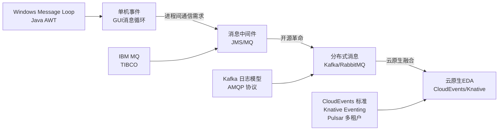

## 2. 核心概念

### 2.1 事件（Event）的本质

事件是对系统中发生的重要事实的不可变记录。一个规范的事件通常包含以下要素：

```json
{
  "specversion": "1.0",
  "id": "a234-5678",
  "source": "/orders/service",
  "type": "com.ecommerce.order.created",
  "datacontenttype": "application/json",
  "time": "2025-06-26T10:30:00Z",
  "subject": "order-12345",
  "data": {
    "orderId": "12345",
    "userId": "u-9001",
    "items": [
      {"productId": "p-001", "quantity": 2, "price": 9900}
    ],
    "totalAmount": 19800,
    "currency": "CNY"
  }
}
```

这里采用的是 **CloudEvents 1.0 规范**（CNCF 孵化项目），它为事件元数据定义了统一的标准：

| 字段 | 含义 | 是否必须 |
|------|------|---------|
| `specversion` | CloudEvents 规范版本 | 是 |
| `id` | 事件唯一标识符 | 是 |
| `source` | 事件来源的 URI 标识 | 是 |
| `type` | 事件类型（反向域名风格） | 是 |
| `datacontenttype` | 数据的 MIME 类型 | 否 |
| `time` | 事件发生的时间戳 | 否 |
| `subject` | 事件主体的描述 | 否 |
| `data` | 事件负载数据 | 否 |

**为什么要用 CloudEvents 标准？** 在异构系统中，不同的消息系统（Kafka、RabbitMQ、AWS SNS）各有自己的事件格式。CloudEvents 提供了跨平台的事件元数据标准，使得事件可以在不同系统之间无缝流转，降低了供应商锁定风险。Kafka、RabbitMQ、AWS EventBridge、Azure Event Grid 等主流平台均已支持 CloudEvents 格式。

### 2.2 事件的三种类型

根据语义和用途，事件可以分为三种主要类型：

**领域事件（Domain Event）：** 表示业务领域中发生的有意义的事实。例如"订单已创建"、"支付已完成"、"商品已发货"。领域事件是事件驱动架构的核心，它驱动业务流程在多个服务之间流转。

```python
# 领域事件定义
from dataclasses import dataclass, field
from datetime import datetime
from uuid import uuid4

@dataclass(frozen=True)  # 不可变对象
class OrderCreatedEvent:
    """订单创建事件 — 领域事件"""
    order_id: str
    user_id: str
    items: list[dict]
    total_amount: int  # 单位：分
    currency: str = "CNY"
    event_id: str = field(default_factory=lambda: str(uuid4()))
    occurred_at: datetime = field(default_factory=datetime.utcnow)

@dataclass(frozen=True)
class PaymentCompletedEvent:
    """支付完成事件 — 领域事件"""
    payment_id: str
    order_id: str
    amount: int
    method: str  # wechat/alipay/bank
    event_id: str = field(default_factory=lambda: str(uuid4()))
    occurred_at: datetime = field(default_factory=datetime.utcnow)
```

**集成事件（Integration Event）：** 用于跨服务边界的通信。当一个服务需要通知其他服务（通常是不同限界上下文的服务）时，它发布集成事件。集成事件通常比领域事件包含更多（或更少）的数据，取决于消费方的需求。

**系统事件（System Event）：** 由基础设施产生的事件，如 Kubernetes 的 Pod 启动/终止事件、Envoy 的访问日志事件、应用的健康检查事件等。系统事件通常用于运维监控和自动化运维（如自动扩缩容）。

### 2.3 事件通道的拓扑模式

事件在系统中的传播方式决定了架构的特性。常见的事件通道拓扑包括：

**点对点（Point-to-Point）：** 事件从一个生产者直接发送到一个消费者。适用于命令（Command）场景——"我需要你执行某个操作"。

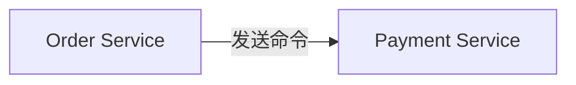

**发布-订阅（Publish-Subscribe）：** 事件从一个生产者发布到一个主题（Topic），多个消费者订阅该主题并各自独立处理。适用于事件通知场景——"发生了某件事，谁关心谁处理"。

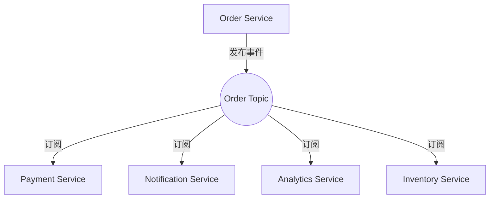

**事件流（Event Stream）：** 事件以有序日志的形式持久化存储，消费者可以按自己的节奏从任意位置读取。Kafka 的消费组模型是这一拓扑的典型实现。支持事件回放、多消费者组独立消费等高级特性。

### 2.4 事件驱动 vs 消息驱动

事件驱动和消息驱动经常被混用，但它们有本质区别：

| 维度 | 事件驱动（Event-Driven） | 消息驱动（Message-Driven） |
|------|--------------------------|---------------------------|
| 语义 | 广播事实（"发生了什么"） | 发送命令/数据（"请做什么"） |
| 生产者意图 | 不关心谁消费 | 明确知道消费者 |
| 消费者关系 | 多个消费者可以独立订阅 | 通常一个消费者处理 |
| 数据所有权 | 事件包含完整快照 | 消息可能只是引用或指令 |
| 实现载体 | 事件总线、流处理平台 | 消息队列、RPC |
| 典型技术 | Kafka、EventBridge | RabbitMQ、SQS |

在实践中，很多系统同时使用两种模式：服务内部使用消息驱动的命令模式来协调操作（如 Saga 编排），服务之间使用事件驱动的发布-订阅模式来广播状态变更。

## 3. 核心架构模式

### 3.1 事件通知（Event Notification）

最简单的事件驱动模式。服务在状态变更时发布一个轻量级事件通知，其他服务根据需要订阅并做出响应。

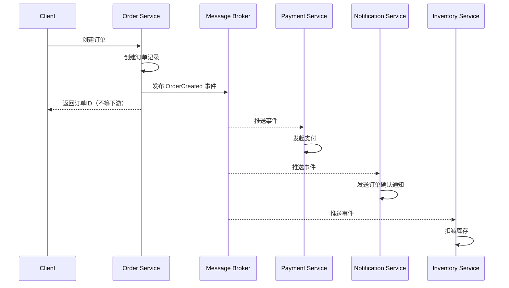

**优势：** 实现简单，解耦彻底，新增消费者无需修改生产者。

**局限：** 消费者可能错过事件（如果消费者宕机），需要额外的机制保障至少一次/恰好一次消费。事件的顺序在分布式环境下难以保证。

### 3.2 事件携带状态迁移（Event-Carried State Transfer）

事件不仅通知"发生了什么"，还携带了消费者所需的完整数据，使得消费者无需回调生产者获取额外信息。

```python
# 事件携带完整订单快照，消费者不需要回调订单服务
@dataclass(frozen=True)
class OrderCreatedWithState:
    """事件携带状态迁移模式 — 消费者拥有完整数据副本"""
    # 事件元数据
    event_id: str
    event_type: str = "com.ecommerce.order.created"
    
    # 完整数据快照（消费者不需要回调订单服务）
    order_id: str
    user_id: str
    user_email: str           # 消费者直接使用，无需查询用户服务
    user_phone: str           # 同上
    items: list[dict]         # 完整商品信息
    total_amount: int
    shipping_address: dict    # 完整收货地址
    created_at: str
```

**适用场景：** 消费者需要频繁读取数据但不想产生大量跨服务查询的场景。典型例子是搜索服务需要订单数据来构建搜索索引，通知服务需要用户信息来发送消息。

**代价：** 事件体积变大，事件模式（Schema）变更影响所有消费者。需要谨慎设计事件的版本管理策略。

### 3.3 CQRS（Command Query Responsibility Segregation）

CQRS 将系统的读（Query）和写（Command）操作分离为两个独立的模型，各自针对不同的负载特征进行优化。在事件驱动架构中，CQRS 通常与 Event Sourcing 配合使用。

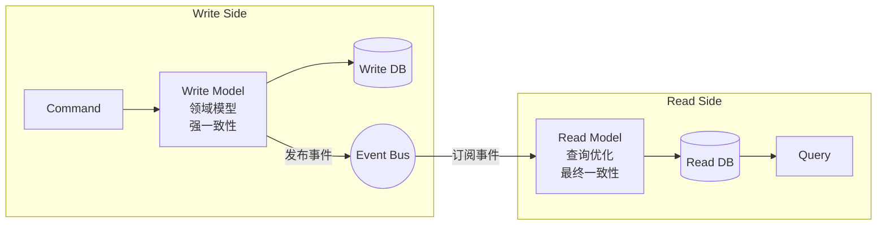

**为什么需要 CQRS？** 在传统的单模型架构中，同一个数据模型既要处理写操作（需要规范化、事务保证），又要处理读操作（需要反规范化、高性能查询）。当读写负载差异巨大时（如电商系统中读请求是写请求的 100 倍），单一模型很难同时优化两种操作。CQRS 让写模型专注领域逻辑和数据完整性，读模型专注查询性能和用户体验。

```python
# CQRS 写模型 — 关注领域逻辑
class OrderWriteModel:
    def __init__(self, order_repository, event_publisher):
        self.order_repository = order_repository
        self.event_publisher = event_publisher
    
    def create_order(self, command: CreateOrderCommand) -> str:
        """写操作：创建订单，产生领域事件"""
        order = Order(
            user_id=command.user_id,
            items=command.items,
            total=command.calculate_total()
        )
        self.order_repository.save(order)
        
        # 发布事件，由读模型异步消费
        self.event_publisher.publish(OrderCreatedEvent(
            order_id=order.id,
            user_id=order.user_id,
            items=order.items,
            total_amount=order.total
        ))
        return order.id
    
    def cancel_order(self, command: CancelOrderCommand) -> None:
        """写操作：取消订单"""
        order = self.order_repository.find(command.order_id)
        order.cancel(command.reason)
        self.order_repository.save(order)
        self.event_publisher.publish(OrderCancelledEvent(
            order_id=order.id,
            reason=command.reason
        ))


# CQRS 读模型 — 关注查询性能
class OrderReadModel:
    def __init__(self, read_db):
        self.read_db = read_db  # 可以是 Elasticsearch、Redis 等
    
    def get_user_order_summary(self, user_id: str) -> dict:
        """读操作：直接查询反规范化的读库"""
        return self.read_db.query(
            "SELECT * FROM order_summary WHERE user_id = %s ORDER BY created_at DESC LIMIT 20",
            user_id
        )
    
    def search_orders(self, filters: dict, page: int, size: int) -> dict:
        """读操作：全文搜索订单"""
        return self.read_db.search(
            index="orders",
            body={"query": filters, "from": (page - 1) * size, "size": size}
        )
    
    # 事件处理器 — 异步更新读模型
    def handle_order_created(self, event: OrderCreatedEvent):
        self.read_db.upsert("order_summary", {
            "order_id": event.order_id,
            "user_id": event.user_id,
            "status": "created",
            "total_amount": event.total_amount,
            "item_count": len(event.items),
            "created_at": event.occurred_at
        })
    
    def handle_order_cancelled(self, event: OrderCancelledEvent):
        self.read_db.update("order_summary", 
            event.order_id, 
            {"status": "cancelled", "cancelled_at": event.occurred_at}
        )
```

**CQRS 的读写分离实现方式：**

| 方式 | 写数据库 | 读数据库 | 同步机制 | 一致性 |
|------|---------|---------|---------|--------|
| 同库异表 | MySQL 写表 | MySQL 读表 | 同步/异步 | 强/最终 |
| 异库同步 | MySQL 主库 | MySQL 从库 | binlog 同步 | 最终 |
| 异构存储 | PostgreSQL | Elasticsearch | CDC/事件 | 最终 |
| 缓存加速 | MySQL | Redis + Elasticsearch | 事件驱动 | 最终 |

**CQRS 的代价与风险：** 引入 CQRS 会显著增加系统复杂度——你需要维护两套模型、处理最终一致性、解决事件丢失或乱序问题。对于简单的 CRUD 应用，CQRS 是过度设计。只有当读写负载差异大、查询模式复杂、性能要求苛刻时，CQRS 才值得引入。

### 3.4 Event Sourcing（事件溯源）

Event Sourcing 是一种数据持久化模式：不存储实体的当前状态，而是存储导致状态变化的所有事件序列。当前状态通过重放（Replay）事件来重建。

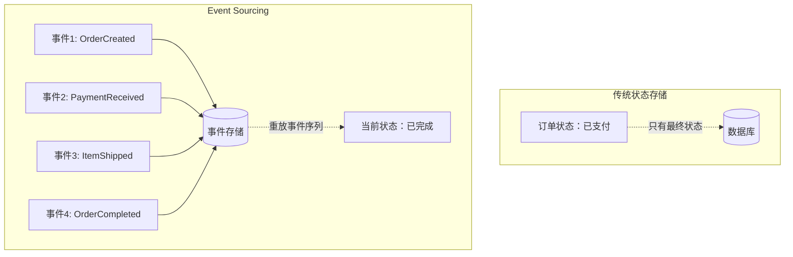

```python
# Event Sourcing 实现
from dataclasses import dataclass
from typing import List

class OrderAggregate:
    """订单聚合根 — 基于事件溯源的状态管理"""
    
    def __init__(self):
        self.id = None
        self.user_id = None
        self.status = None
        self.items = []
        self.total = 0
        self.version = 0
        self._pending_events = []
    
    # === 命令方法：验证业务规则，产生事件 ===
    
    def create(self, order_id: str, user_id: str, items: list):
        if self.id is not None:
            raise ValueError("订单已存在，不能重复创建")
        self._apply(OrderCreatedEvent(order_id, user_id, items))
    
    def pay(self, payment_id: str, amount: int):
        if self.status != "created":
            raise ValueError(f"只有已创建的订单可以支付，当前状态：{self.status}")
        if amount != self.total:
            raise ValueError(f"支付金额不匹配：期望 {self.total}，实际 {amount}")
        self._apply(PaymentReceivedEvent(payment_id, amount))
    
    def ship(self, tracking_number: str, carrier: str):
        if self.status != "paid":
            raise ValueError(f"只有已支付的订单可以发货，当前状态：{self.status}")
        self._apply(ItemShippedEvent(tracking_number, carrier))
    
    def complete(self):
        if self.status != "shipped":
            raise ValueError(f"只有已发货的订单可以确认完成")
        self._apply(OrderCompletedEvent())
    
    # === 事件应用方法：纯状态变更 ===
    
    def _apply(self, event):
        """应用事件到聚合状态"""
        self._when(event)
        self._pending_events.append(event)
    
    def _when(self, event):
        """事件处理逻辑 — 根据事件类型更新状态"""
        if isinstance(event, OrderCreatedEvent):
            self.id = event.order_id
            self.user_id = event.user_id
            self.items = event.items
            self.total = sum(i["price"] * i["qty"] for i in event.items)
            self.status = "created"
        elif isinstance(event, PaymentReceivedEvent):
            self.status = "paid"
        elif isinstance(event, ItemShippedEvent):
            self.status = "shipped"
            self.tracking = event.tracking_number
        elif isinstance(event, OrderCompletedEvent):
            self.status = "completed"
        self.version += 1
    
    # === 重建：从事件序列恢复状态 ===
    
    @classmethod
    def from_events(cls, events: list) -> "OrderAggregate":
        """从事件序列重建聚合状态"""
        aggregate = cls()
        for event in events:
            aggregate._when(event)
        return aggregate


# 使用示例：事件溯源的完整生命周期
def demo_event_sourcing():
    # 1. 创建订单（产生第一个事件）
    order = OrderAggregate()
    order.create("ORD-001", "USER-9001", [
        {"name": "机械键盘", "price": 59900, "qty": 1},
        {"name": "鼠标垫", "price": 9900, "qty": 2}
    ])
    print(f"订单创建，版本={order.version}, 待持久化事件={len(order._pending_events)}")
    
    # 2. 支付
    order.pay("PAY-001", 79700)
    print(f"订单支付，状态={order.status}")
    
    # 3. 持久化事件到事件存储（而非持久化订单状态）
    event_store.save(order.id, order._pending_events)
    
    # 4. 重建：从事件恢复订单状态
    events = event_store.load(order.id)
    restored_order = OrderAggregate.from_events(events)
    print(f"重建后状态={restored_order.status}, 版本={restored_order.version}")
```

**Event Sourcing 的核心优势：**

1. **完整的审计追踪。** 每一次状态变更都有记录，天然满足金融、医疗等行业的合规要求。你可以回答"这个订单在任何历史时间点的状态是什么"。
2. **时间旅行（Temporal Query）。** 可以将聚合体恢复到任意历史时间点的状态，对于调试和问题排查极为有用。
3. **事件驱动天然契合。** Event Sourcing 产生的事件流可以直接作为事件驱动架构的事件源，消费者订阅事件流即可获得所有状态变更通知。
4. **高性能写入。** 事件是 append-only 的写入操作，不需要行锁或事务锁，写入性能远高于随机更新。

**Event Sourcing 的挑战：**

1. **事件模式演进。** 当事件的结构需要变更时（如新增字段、修改字段类型），需要设计事件版本化策略和向上转换（Upcast）机制。
2. **快照（Snapshot）管理。** 如果一个聚合的事件数量很多（如超过 100 个），每次重建都需要重放大量事件。快照机制定期保存聚合的当前状态，后续只需重放快照之后的事件。
3. **最终一致性。** 读模型通过消费事件异步更新，存在延迟窗口。需要评估业务是否能容忍这种延迟。

### 3.5 Saga 模式（分布式事务）

在微服务架构中，一个业务操作可能涉及多个服务的协作。传统的分布式事务（如两阶段提交 2PC）在微服务环境下性能差、可用性低。Saga 模式通过一系列本地事务和补偿操作来实现跨服务的最终一致性。

**Saga 的两种编排方式：**

**编排式（Orchestration）：** 由一个中央协调器（Orchestrator）负责协调所有参与者的执行顺序和补偿逻辑。

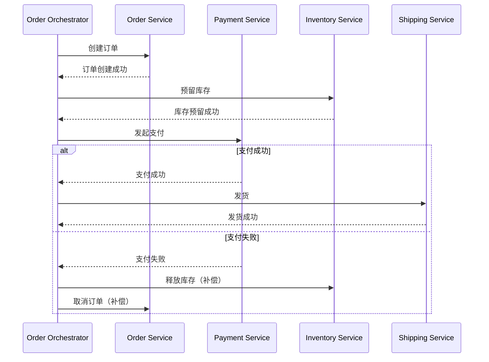

```python
# 编排式 Saga 实现
class OrderSagaOrchestrator:
    """订单 Saga 编排器"""
    
    def __init__(self):
        self.steps = [
            SagaStep(
                action=self._create_order,
                compensation=self._cancel_order
            ),
            SagaStep(
                action=self._reserve_inventory,
                compensation=self._release_inventory
            ),
            SagaStep(
                action=self._process_payment,
                compensation=self._refund_payment
            ),
            SagaStep(
                action=self._ship_order,
                compensation=None  # 发货后无需补偿
            ),
        ]
    
    def execute(self, order_data: dict) -> SagaResult:
        completed_steps = []
        
        for step in self.steps:
            try:
                result = step.action(order_data)
                completed_steps.append(step)
                print(f"[Saga] 步骤完成: {step.action.__name__}")
            except Exception as e:
                print(f"[Saga] 步骤失败: {step.action.__name__}, 原因: {e}")
                # 逆序执行补偿操作
                for completed in reversed(completed_steps):
                    if completed.compensation:
                        try:
                            completed.compensation(order_data)
                            print(f"[Saga] 补偿完成: {completed.compensation.__name__}")
                        except Exception as ce:
                            # 补偿失败需要记录并人工介入
                            self._log_compensation_failure(completed, ce)
                return SagaResult(status="failed", error=str(e))
        
        return SagaResult(status="completed")
    
    def _create_order(self, data):
        return order_service.create(data)
    
    def _cancel_order(self, data):
        order_service.cancel(data["order_id"])
    
    def _reserve_inventory(self, data):
        return inventory_service.reserve(data["items"])
    
    def _release_inventory(self, data):
        inventory_service.release(data["items"])
    
    def _process_payment(self, data):
        return payment_service.charge(data["user_id"], data["total"])
    
    def _refund_payment(self, data):
        payment_service.refund(data["payment_id"])
    
    def _ship_order(self, data):
        return shipping_service.ship(data["order_id"])


@dataclass
class SagaStep:
    action: callable
    compensation: callable | None

@dataclass
class SagaResult:
    status: str
    error: str | None = None
```

**协同式（Choreography）：** 没有中央协调器，每个服务监听事件并决定自己的行为。服务通过发布和订阅事件来协作。

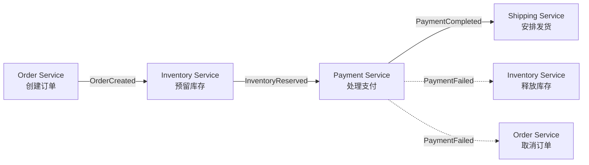

**编排式 vs 协同式对比：**

| 维度 | 编排式（Orchestration） | 协同式（Choreography） |
|------|------------------------|----------------------|
| 可理解性 | 高——流程集中在一处 | 低——流程分散在各服务中 |
| 耦合度 | 中——依赖中央协调器 | 低——完全去中心化 |
| 事务追踪 | 容易——查看协调器日志 | 困难——需要关联多个服务日志 |
| 新增步骤 | 修改协调器代码 | 添加新的事件订阅者 |
| 故障恢复 | 协调器统一处理 | 各服务独立处理 |
| 适用场景 | 业务流程明确、步骤较多 | 步骤简单、参与者少 |

**推荐：** 对于超过 3 个参与者的复杂业务流程，优先选择编排式 Saga；对于简单的两步或三步协作，协同式更轻量。

## 4. 消息代理选型

事件驱动架构的落地依赖可靠的消息基础设施。以下是主流消息代理的对比分析：

### 4.1 Apache Kafka

Kafka 是分布式事件流平台，以高吞吐、持久化、可回放为核心特性。它不是传统意义上的消息队列，而是一个分布式提交日志（Distributed Commit Log）。

**核心架构：**

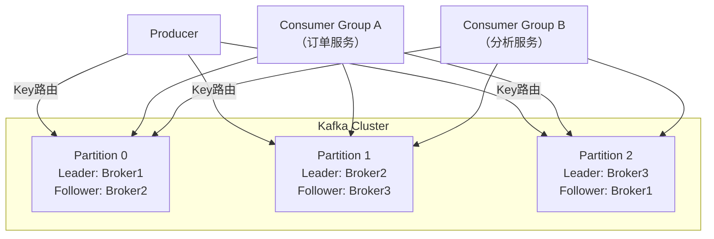

**Kafka 的核心优势：**

- **高吞吐：** 单集群可达百万级 TPS（每秒事务数），适合大规模数据管道
- **持久化与回放：** 消息持久化到磁盘，支持按 offset 任意位置回放，天然适配 Event Sourcing
- **分区有序：** 同一分区内的消息严格有序，通过消息键（Key）实现相关消息的顺序保证
- **消费者组：** 同一消费者组内的消费者自动分配分区，实现负载均衡

**Kafka 典型配置示例：**

```yaml
# Kafka Topic 配置（适用于高吞吐事件流）
apiVersion: kafka.apache.org/v1beta2
kind: KafkaTopic
metadata:
  name: order-events
  namespace: ecommerce
spec:
  partitions: 12       # 根据消费者数量和吞吐需求设置
  replicas: 3          # 三副本保证高可用
  config:
    retention.ms: 604800000     # 保留7天
    cleanup.policy: delete      # 过期删除（而非压缩）
    min.insync.replicas: 2      # 最少2个副本确认才算写入成功
    compression.type: lz4       # 压缩减少存储和网络开销
    segment.ms: 3600000         # 1小时一个段文件
```

### 4.2 RabbitMQ

RabbitMQ 是基于 AMQP 协议的传统消息代理，以灵活的路由机制和丰富的消息特性著称。

**核心优势：**
- **灵活路由：** 通过 Exchange 和 Binding 实现复杂的路由规则（直连、主题、扇出、头部匹配）
- **消息确认：** 支持生产者确认和消费者确认，精确控制消息的可靠投递
- **多协议支持：** 原生支持 AMQP 0-9-1，通过插件支持 STOMP、MQTT
- **优先级队列：** 支持消息优先级，适合需要区分处理优先级的场景

**RabbitMQ 路由模型：**

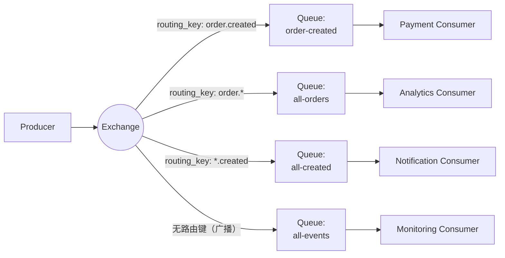

### 4.3 Apache Pulsar

Pulsar 是 Apache 基金会的云原生分布式消息流平台，结合了 Kafka 的流处理能力和 RabbitMQ 的消息队列特性。

**核心优势：**
- **计算存储分离：** Broker（无状态）和 BookKeeper（存储）独立扩展，运维更灵活
- **多租户：** 原生支持租户（Tenant）和命名空间（Namespace）级别的隔离
- **分层存储：** 自动将冷数据从 BookKeeper 卸载到 S3/HDFS 等对象存储，降低存储成本
- **多协议支持：** 兼容 Kafka API、AMQP、MQTT，迁移成本低

### 4.4 消息代理选型对比

| 维度 | Kafka | RabbitMQ | Pulsar | NATS |
|------|-------|----------|--------|------|
| 定位 | 事件流平台 | 消息代理 | 云原生消息流 | 轻量级消息系统 |
| 吞吐量 | 极高（百万 TPS） | 中等（万级 TPS） | 极高（百万 TPS） | 极高 |
| 延迟 | 毫秒级 | 微秒级 | 毫秒级 | 微秒级 |
| 消息顺序 | 分区级别保证 | 队列级别保证 | Key 级别保证 | 流级别保证 |
| 持久化 | 磁盘持久化 | 内存+磁盘 | BookKeeper | 文件/内存 |
| 消息回放 | 支持（offset） | 不支持（消费即删除） | 支持（cursor） | 支持（流） |
| 适用场景 | 事件溯源、日志管道、流处理 | 命令队列、RPC、任务分发 | 多租户、混合负载 | 低延迟、IoT、微服务 |
| 运维复杂度 | 中等 | 低 | 高 | 低 |
| 云原生生态 | Strimzi Operator | RabbitMQ Operator | Pulsar Operator | 原生支持 |

**选型建议：**
- **高吞吐 + 事件溯源/流处理 → Kafka。** 如果你的核心需求是事件回放、流处理（Kafka Streams/ksqlDB）和大规模数据管道，Kafka 是首选。
- **复杂路由 + 任务队列 → RabbitMQ。** 如果你需要灵活的消息路由、优先级队列、延迟消息和可靠的任务分发，RabbitMQ 更合适。
- **多租户 + 混合负载 → Pulsar。** 如果你在构建平台级基础设施，需要多租户隔离和计算存储分离，Pulsar 是有力候选。
- **轻量级 + 低延迟 → NATS/JetStream。** 如果你的场景是微服务间的轻量级通信、IoT 设备消息或边缘计算，NATS 的极低延迟和极简部署极具吸引力。

## 5. 最终一致性保障

事件驱动架构天然带来最终一致性（Eventual Consistency）——事件从产生到被消费者处理存在时间窗口，在此期间数据可能暂时不一致。如何保障最终一致性的质量是事件驱动架构落地的关键挑战。

### 5.1 消息幂等性

在分布式系统中，消息可能被重复投递（At-Least-Once 语义）。消费者必须设计为幂等的——即相同的消息处理多次和处理一次的效果完全一致。

```python
import hashlib
from functools import wraps

class IdempotencyGuard:
    """基于 Redis 的幂等性守护器"""
    
    def __init__(self, redis_client, ttl_seconds=86400):
        self.redis = redis_client
        self.ttl = ttl_seconds
    
    def is_duplicate(self, event_id: str) -> bool:
        """检查事件是否已处理过"""
        # SET NX EX 原子操作：如果 key 不存在则设置并返回 True
        result = self.redis.set(
            f"idempotent:{event_id}", 
            "1", 
            nx=True,  # 只在不存在时设置
            ex=self.ttl
        )
        return result is None  # 返回 None 表示 key 已存在
    
    def mark_processed(self, event_id: str):
        """标记事件已处理"""
        self.redis.setex(f"idempotent:{event_id}", self.ttl, "1")


# 幂等性装饰器
def idempotent(handler):
    @wraps(handler)
    async def wrapper(event, guard: IdempotencyGuard):
        event_id = event.get("event_id") or event.get("id")
        if guard.is_duplicate(event_id):
            print(f"[幂等跳过] 事件 {event_id} 已处理，跳过")
            return {"status": "skipped", "reason": "duplicate"}
        result = await handler(event)
        guard.mark_processed(event_id)
        return result
    return wrapper


# 使用示例
@idempotent
async def handle_payment_completed(event, guard):
    """处理支付完成事件 — 天然幂等"""
    order_id = event["data"]["order_id"]
    
    # 幂等操作：更新订单状态（重复执行结果相同）
    await db.execute(
        "UPDATE orders SET status = 'paid', paid_at = NOW() WHERE id = %s AND status = 'created'",
        order_id
    )
    
    # 幂等操作：只在状态变更时发送通知（使用条件更新）
    result = await db.execute(
        """UPDATE orders SET notification_sent = true 
           WHERE id = %s AND notification_sent = false""",
        order_id
    )
    if result.rowcount > 0:
        await send_notification(order_id, "您的订单已支付成功")
    
    return {"status": "processed"}
```

**幂等性设计策略：**

| 策略 | 实现方式 | 适用场景 |
|------|---------|---------|
| 唯一键去重 | Redis/DB 唯一索引记录已处理的 event_id | 通用，最常用 |
| 条件更新 | SQL WHERE 条件确保只执行一次 | 数据库操作 |
| 版本号检查 | 比较事件版本和当前版本，忽略过期事件 | 状态机场景 |
| 业务唯一键 | 使用业务唯一键（如订单号+操作类型）去重 | 金融交易 |

### 5.2 事件顺序保障

分布式环境下，事件的全局顺序很难保证。通常的做法是保证**相关事件的局部有序**。

```python
# 通过消息键（Key）保证相关事件的分区有序
class EventPublisher:
    def __init__(self, kafka_producer):
        self.producer = kafka_producer
    
    def publish_order_event(self, event):
        """使用 order_id 作为 Key，保证同一订单的事件有序"""
        self.producer.send(
            topic="order-events",
            key=event.order_id.encode(),  # 相同 key 路由到同一分区
            value=json.dumps(event.to_dict()).encode(),
            headers=[
                ("event_type", event.event_type.encode()),
                ("event_id", event.event_id.encode()),
            ]
        )
    
    def publish_user_event(self, event):
        """使用 user_id 作为 Key"""
        self.producer.send(
            topic="user-events",
            key=event.user_id.encode(),
            value=json.dumps(event.to_dict()).encode()
        )
```

**顺序保障的层次：**

1. **分区级别有序：** 同一分区内的消息严格有序（Kafka、Pulsar 均支持）。通过合理设置消息键，可以将相关事件路由到同一分区。
2. **消费者级别有序：** 单个消费者实例内按顺序处理消息（串行消费）。消费者组内不同实例之间可能并行消费不同分区。
3. **业务级别有序：** 在业务层面通过版本号、时间戳等机制处理乱序事件。

### 5.3 死信队列与重试策略

当消费者无法成功处理事件时，需要有机制避免消息丢失或无限重试阻塞队列。

```python
# 死信队列与重试策略
import time
from enum import Enum

class RetryPolicy:
    def __init__(self, max_retries: int = 3, backoff_factor: float = 2.0):
        self.max_retries = max_retries
        self.backoff_factor = backoff_factor
    
    def get_delay(self, attempt: int) -> float:
        """指数退避延迟计算"""
        return min(self.backoff_factor ** attempt, 300)  # 最大5分钟


class ConsumerWithDLQ:
    """带死信队列的消费者"""
    
    def __init__(self, main_topic, dlq_topic, producer, retry_policy=None):
        self.main_topic = main_topic
        self.dlq_topic = dlq_topic
        self.producer = producer
        self.retry_policy = retry_policy or RetryPolicy()
    
    async def process(self, event):
        retry_count = event.headers.get("retry_count", 0)
        event_id = event.headers.get("event_id", "unknown")
        
        try:
            await self.handler(event)
            print(f"[成功] 事件 {event_id} 处理完成")
            
        except RetryableException as e:
            # 可重试的临时错误（网络超时、服务不可用等）
            if retry_count < self.retry_policy.max_retries:
                delay = self.retry_policy.get_delay(retry_count)
                print(f"[重试] 事件 {event_id} 第{retry_count+1}次重试，延迟 {delay}s")
                await self._retry_later(event, retry_count + 1, delay)
            else:
                print(f"[死信] 事件 {event_id} 超过最大重试次数，移入死信队列")
                await self._send_to_dlq(event, "max_retries_exceeded", str(e))
                
        except NonRetryableException as e:
            # 不可重试的业务错误（数据格式错误、业务规则违反等）
            print(f"[死信] 事件 {event_id} 不可重试错误，移入死信队列: {e}")
            await self._send_to_dlq(event, "non_retryable", str(e))
            
        except Exception as e:
            # 未知异常，保守重试
            if retry_count < self.retry_policy.max_retries:
                await self._retry_later(event, retry_count + 1, 10)
            else:
                await self._send_to_dlq(event, "unknown_error", str(e))
    
    async def _retry_later(self, event, attempt, delay):
        """延迟重试：将事件重新发送到主topic，增加重试计数"""
        self.producer.send(
            topic=self.main_topic,
            key=event.key,
            value=event.value,
            headers=[("retry_count", str(attempt).encode())],
            # Kafka 延迟投递（通过事务+定时器模拟）
        )
    
    async def _send_to_dlq(self, event, reason, error_msg):
        """移入死信队列"""
        self.producer.send(
            topic=self.dlq_topic,
            key=event.key,
            value=event.value,
            headers=[
                ("original_topic", self.main_topic.encode()),
                ("dlq_reason", reason.encode()),
                ("error_message", error_msg.encode()),
                ("dlq_timestamp", str(time.time()).encode()),
            ]
        )
```

**死信队列的消费策略：**
- **告警 + 人工介入：** 死信事件触发告警（如 PagerDuty、钉钉告警），由开发人员分析原因并修复
- **自动修复 + 重放：** 修复消费者代码后，从死信队列中重放事件到主队列
- **定期清理：** 设置死信队列的消息 TTL，过期自动清理

## 6. 云原生环境中的事件驱动

### 6.1 Knative Eventing

Knative Eventing 是 Kubernetes 原生的事件驱动平台，提供了标准化的事件源（Event Source）和事件处理（Event Sink）机制。

**核心组件：**

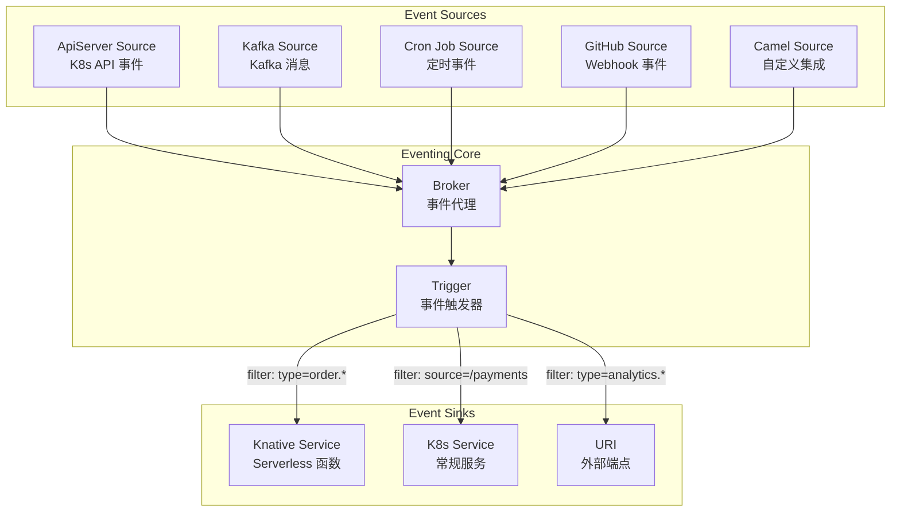

```yaml
# Knative Broker — 事件代理
apiVersion: eventing.knative.dev/v1
kind: Broker
metadata:
  name: ecommerce-broker
  namespace: ecommerce
spec:
  config:
    # 使用 Kafka 作为 Broker 的后端存储
    config: 
      kafka:
        bootstrapServers: "kafka-cluster-kafka-bootstrap:9092"
        numPartitions: "12"
        replicationFactor: "3"
---

# Knative Trigger — 事件过滤与路由
apiVersion: eventing.knative.dev/v1
kind: Trigger
metadata:
  name: payment-trigger
  namespace: ecommerce
spec:
  broker: ecommerce-broker
  filter:
    attributes:
      type: com.ecommerce.order.created    # 只消费订单创建事件
      source: /orders                       # 只消费订单服务的事件
  subscriber:
    ref:
      apiVersion: serving.knative.dev/v1
      kind: Service
      name: payment-processor              # 发送到支付处理服务
---

# Knative Trigger — 通知服务的事件过滤
apiVersion: eventing.knative.dev/v1
kind: Trigger
metadata:
  name: notification-trigger
  namespace: ecommerce
spec:
  broker: ecommerce-broker
  filter:
    attributes:
      type: com.ecommerce.payment.completed  # 只消费支付完成事件
  subscriber:
    ref:
      apiVersion: serving.knative.dev/v1
      kind: Service
      name: notification-sender
```

### 6.2 事件驱动与 Kubernetes 的集成

在 Kubernetes 环境中，事件驱动架构需要处理几个关键问题：

**Pod 生命周期与事件消费的协调：** 当 Pod 正在被终止时，必须确保正在处理的消息不会丢失。

```yaml
# 优雅终止配置
apiVersion: apps/v1
kind: Deployment
metadata:
  name: event-consumer
spec:
  replicas: 3
  template:
    spec:
      terminationGracePeriodSeconds: 60  # 给消费者足够时间完成处理
      containers:
        - name: consumer
          image: my-app:latest
          lifecycle:
            preStop:
              exec:
                command: ["/bin/sh", "-c", "sleep 15"]  # 等待负载均衡器摘除
          env:
            - name: GRACEFUL_SHUTDOWN_TIMEOUT
              value: "30s"
```

**水平扩缩与消费者并发：** Kafka 的消费者组与 Kubernetes 的 HPA 可以协同工作，但需要注意分区数与消费者实例数的匹配关系。

分区数: 12
消费者实例数: 3 → 每个实例消费 4 个分区
消费者实例数: 6 → 每个实例消费 2 个分区
消费者实例数: 12 → 每个实例消费 1 个分区（最优并行度）
消费者实例数: 16 → 4 个实例空闲（分区不够分）

**关键原则：消费者实例数不应超过分区数，否则多出的实例会空闲。** 如果需要更高的消费并行度，应该先增加 Kafka Topic 的分区数。

### 6.3 事件驱动与服务网格的协同

在使用 Istio 等服务网格的环境中，事件驱动架构可以获得额外的能力：

**流量镜像（Traffic Mirroring）：** 将生产流量的副本发送到新版本的消费者，用于测试新版本的事件处理逻辑是否正确，而不会影响生产行为。

**故障注入（Fault Injection）：** 在测试环境中模拟消息处理的延迟和失败，验证消费者在极端情况下的行为。

**可观测性：** 服务网格的 Sidecar 代理可以自动收集事件消费的延迟、错误率、吞吐量等指标，无需在应用代码中埋点。

## 7. 实际应用场景

### 7.1 电商订单全流程

电商系统是事件驱动架构的典型应用场景。一次完整的下单流程涉及多个服务的异步协作：

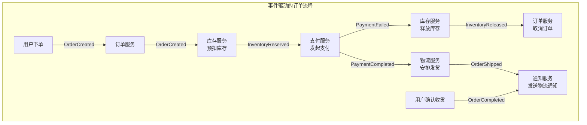

**关键设计决策：**

1. **库存预扣 vs 扣减：** 下单时先预扣库存（创建 pending 状态），支付成功后再正式扣减，支付超时自动释放。这避免了库存被恶意占用。
2. **支付回调 vs 主动查询：** 支付完成通过事件通知（而非回调 URL），避免支付系统与订单系统的强耦合。同时提供补偿查询机制，防止事件丢失。
3. **通知的最终一致性：** 通知服务从事件中获取完整的订单和用户信息，无需回调其他服务，确保通知逻辑完全自治。

### 7.2 实时数据管道

事件驱动架构是构建实时数据管道的基础。以用户行为分析为例：

```python
# 用户行为事件 → 实时分析管道
class UserBehaviorPipeline:
    """
    事件流: 用户行为事件 → Kafka → Flink 处理 → 多个输出
    """
    
    def __init__(self):
        self.topics = {
            "raw_events": "user-behavior-raw",      # 原始行为事件
            "enriched": "user-behavior-enriched",    # 富化后的事件
            "aggregated": "user-behavior-aggregated",# 聚合后的指标
        }
    
    def build_pipeline(self):
        # 1. 事件清洗与富化
        # 原始事件 → 过滤无效事件 → 补充设备信息、地理位置等
        raw_stream = KafkaSource(self.topics["raw_events"])
        cleaned = raw_stream.filter(lambda e: e.get("user_id"))
        enriched = cleaned.map(self._enrich_event)
        enriched.to(self.topics["enriched"])
        
        # 2. 实时聚合计算
        # 按用户 + 商品维度，5分钟窗口统计浏览次数、停留时长
        windowed = enriched \
            .key_by(lambda e: (e["user_id"], e["product_id"])) \
            .window(TumblingWindow("5min")) \
            .aggregate({
                "view_count": Count(),
                "avg_duration": Avg("duration_sec"),
                "max_scroll_depth": Max("scroll_depth"),
            })
        windowed.to(self.topics["aggregated"])
        
        # 3. 实时推荐触发
        # 当用户浏览某类商品超过阈值时，触发推荐事件
        enriched \
            .key_by(lambda e: e["user_id"]) \
            .window(SlidingWindow("10min", "5min")) \
            .filter(lambda events: self._should_recommend(events)) \
            .map(self._create_recommendation_event) \
            .to("recommendation-trigger")
    
    def _enrich_event(self, event):
        """补充设备信息和地理位置"""
        event["device_info"] = device_service.lookup(event.get("device_id"))
        event["geo_info"] = geo_service.lookup(event.get("ip_address"))
        event["timestamp"] = event.get("event_time", time.time())
        return event
    
    def _should_recommend(self, events):
        """判断是否需要触发推荐"""
        categories = set(e.get("category") for e in events)
        return len(categories) >= 2  # 浏览了2个以上品类
```

### 7.3 IoT 设备管理

事件驱动架构天然适配 IoT 场景——海量设备产生事件，系统实时响应。

```yaml
# MQTT → Kafka → 处理管道（使用 Apache Camel 或 KEDA）
# 设备遥测事件处理
apiVersion: keda.sh/v1alpha1
kind: ScaledObject
metadata:
  name: device-telemetry-processor
spec:
  scaleTargetRef:
    name: telemetry-consumer
  minReplicaCount: 2
  maxReplicaCount: 50
  triggers:
    - type: kafka
      metadata:
        bootstrapServers: kafka-cluster:9092
        consumerGroup: telemetry-group
        topic: device-telemetry
        lagThreshold: "1000"     # 消费延迟超过1000条时扩容
        activationLagThreshold: "100"  # 激活阈值
```

**KEDA（Kubernetes Event-Driven Autoscaling）** 根据消息队列的消费延迟（Lag）自动扩缩消费者 Pod 的数量，实现真正的事件驱动弹性伸缩。

## 8. 最佳实践与常见误区

### 8.1 设计最佳实践

**事件设计原则：**

1. **事件是事实，不是命令。** 事件应该描述"发生了什么"（OrderCreated），而不是"请做什么"（CreatePayment）。命令由消费者的业务逻辑决定。
2. **事件包含足够的上下文。** 消费者不应该需要回调生产者获取数据。事件应该包含消费者所需的全部信息。
3. **事件使用过去式命名。** OrderCreated（已创建）、PaymentCompleted（已支付）——过去式强调事件是对事实的记录。
4. **事件 schema 版本化。** 使用 schema registry（如 Confluent Schema Registry）管理事件的 Avro/Protobuf schema，确保生产者和消费者的兼容性。

```yaml
# Confluent Schema Registry — 事件 Schema 版本管理
# 向后兼容的 Schema 演进规则
compatibility: BACKWARD
# BACKWARD: 新 schema 可以读取旧数据（新字段有默认值）
# FORWARD:  旧 schema 可以读取新数据（不识别的字段被忽略）
# FULL:     同时兼容向前和向后
```

**基础设施设计原则：**

1. **消息分区策略：** 使用业务键（如 order_id、user_id）作为分区键，保证相关事件在同一分区有序消费。
2. **消费者组合理划分：** 每个消费者组独立消费完整的事件流，根据业务需求独立扩缩。
3. **监控消费延迟（Lag）：** Lag 是事件驱动系统最关键的监控指标。持续增长的 Lag 意味着消费者处理速度跟不上生产速度，需要扩容或优化。

### 8.2 常见误区

| 误区 | 正确做法 | 说明 |
|------|---------|------|
| 把事件驱动当万能药 | 同步调用仍然适合简单场景 | 不是所有服务间通信都需要事件驱动，两步以内的简单调用用 REST/gRPC 更直接 |
| 忽略事件幂等性 | 每个消费者都必须实现幂等逻辑 | At-Least-Once 语义下重复消费是常态，不是异常 |
| 事件携带过多数据 | 事件包含消费者需要的最小数据集 | 过大的事件会增加序列化开销和存储成本，引用+查询有时更高效 |
| 用事件替代所有同步调用 | 需要即时响应的场景用同步 | 用户点击"下单"后需要立即看到结果，不能等事件异步处理完 |
| 忽略死信队列 | 必须建立 DLQ + 告警 + 修复流程 | 消费失败的消息不能静默丢弃，必须有可观测的处理机制 |
| 事件命名使用命令式 | 使用过去式（事实记录） | OrderCreated 而非 CreateOrder，事件是事实不是请求 |
| 不做 Schema 管理 | 使用 Schema Registry 管理版本 | 事件模式变更会导致生产者和消费者不兼容 |
| 消费者实例数 > 分区数 | 消费者实例数 ≤ 分区数 | 多出的消费者实例会空闲，浪费资源 |
| 用轮询代替事件推送 | 使用消息系统的推送/拉取机制 | 手动轮询增加延迟和资源消耗 |

### 8.3 监控与可观测性

事件驱动架构的可观测性需要关注三个维度：

**消息层面的指标：**

| 指标 | 含义 | 告警阈值建议 |
|------|------|-------------|
| Consumer Lag | 消费者落后于最新消息的数量 | 持续增长 > 5分钟 |
| Message Rate | 消息生产/消费速率 | 突然下降 > 50% |
| DLQ Rate | 死信队列的消息速率 | 任何非零值 |
| Processing Time | 单条消息处理耗时 | P99 > 5秒 |

**业务层面的指标：**

| 指标 | 含义 | 告警阈值建议 |
|------|------|-------------|
| Event End-to-End Latency | 事件从产生到最终处理完成的端到端延迟 | P99 > 30秒 |
| Order Flow Completion Rate | 订单全流程完成率（从创建到完成） | < 95% |
| Payment Success Rate | 支付成功率 | < 99% |

**基础设施层面的指标：**

```yaml
# Prometheus 告警规则 — 事件驱动系统监控
groups:
  - name: event-driven-alerts
    rules:
      # 消费延迟持续增长
      - alert: ConsumerLagGrowing
        expr: kafka_consumer_lag_sum > 10000
        for: 5m
        labels:
          severity: warning
        annotations:
          summary: "消费者组 {{ $labels.group }} 消费延迟过高"
          description: "延迟 {{ $value }} 条消息，持续 5 分钟"
      
      # 死信队列有新消息
      - alert: DLQMessagesReceived
        expr: rate(kafka_topic_messages_total{topic=~".*dlq.*"}[5m]) > 0
        for: 1m
        labels:
          severity: critical
        annotations:
          summary: "死信队列收到 {{ $value }} 条消息/秒"
          
      # 消费者处理延迟过高
      - alert: EventProcessingSlow
        expr: histogram_quantile(0.99, event_processing_duration_seconds) > 5
        for: 3m
        labels:
          severity: warning
        annotations:
          summary: "事件处理 P99 延迟超过 5 秒"
```

## 9. 进阶：事件驱动的高级模式

### 9.1 事件风暴（Event Storming）

事件风暴是由 Alberto Brandolini 发明的协作式建模技术，用于快速探索复杂业务领域的事件驱动模型。它通过将领域事件写在橙色便利贴上，按照时间线排列，帮助团队发现业务流程、聚合根和服务边界。

**事件风暴的步骤：**

1. **识别领域事件：** 所有参与者列出系统中发生的事件，写在橙色便利贴上
2. **排列时间线：** 按因果关系从左到右排列事件
3. **识别命令：** 每个事件前面是什么命令触发的（蓝色便利贴）
4. **识别聚合：** 处理命令并产生事件的实体（黄色便利贴）
5. **识别策略：** 自动响应事件的业务规则（紫色便利贴）
6. **划分限界上下文：** 根据事件的关联性划分服务边界

### 9.2 变更数据捕获（CDC）

变更数据捕获（Change Data Capture）是一种将数据库的变更（INSERT/UPDATE/DELETE）转化为事件流的技术。它使得遗留系统无需修改代码即可参与事件驱动架构。

```yaml
# Debezium CDC — 从 MySQL 捕获变更事件
apiVersion: kafka.connect.io/v1beta1
kind: KafkaConnector
metadata:
  name: mysql-connector
  labels:
    strimzi.io/cluster: my-connect-cluster
spec:
  class: io.debezium.connector.mysql.MySqlConnector
  tasksMax: 1
  config:
    database.hostname: mysql-primary
    database.port: 3306
    database.user: debezium
    database.password: ${secrets:cdc-secret:password}
    database.server.id: 1
    database.server.name: ecommerce
    database.include.list: ecommerce
    table.include.list: ecommerce.orders,ecommerce.payments,ecommerce.users
    # 变更事件的 topic 命名规则：<server>.<database>.<table>
    # 例如：ecommerce.ecommerce.orders
    transforms: outbox
    transforms.outbox.type: io.debezium.transforms.outbox.EventRouter
    transforms.outbox.table.field.event.id: event_id
    transforms.outbox.table.field.event.key: aggregate_id
    transforms.outbox.table.field.event.type: event_type
    transforms.outbox.table.field.event.payload: event_data
```

**CDC 的典型应用场景：**
- **遗留系统集成：** 老旧的单体系统通过 CDC 将数据库变更发布为事件，供微服务消费
- **数据同步：** 将数据从 OLTP 数据库同步到 Elasticsearch、ClickHouse 等分析型存储
- **审计日志：** 记录所有数据变更操作，满足合规审计需求

### 9.3 事件驱动的测试策略

事件驱动系统的测试需要覆盖多个层次：

```python
# 集成测试：验证事件的发布和消费
import pytest
from testcontainers.kafka import KafkaContainer

@pytest.fixture(scope="module")
def kafka():
    with KafkaContainer("confluentinc/cp-kafka:7.4.0") as kafka:
        yield kafka

class TestOrderEventFlow:
    
    def test_order_created_event_published(self, kafka):
        """验证订单创建后正确发布事件"""
        # 1. 启动事件消费者
        consumer = KafkaConsumer(
            "order-events",
            bootstrap_servers=kafka.bootstrap_server,
            group_id="test-consumer",
            value_deserializer=lambda m: json.loads(m)
        )
        
        # 2. 执行创建订单操作
        order = order_service.create_order({
            "user_id": "test-user",
            "items": [{"product_id": "p-001", "quantity": 1}]
        })
        
        # 3. 验证事件被发布
        records = consumer.poll(timeout_ms=5000)
        events = [r.value for r in records.get("order-events", [])]
        
        order_events = [e for e in events if e["type"] == "com.ecommerce.order.created"]
        assert len(order_events) == 1
        assert order_events[0]["data"]["order_id"] == order.id
    
    def test_event_idempotent_processing(self, kafka):
        """验证消费者对重复事件的幂等处理"""
        # 发送同一个事件两次
        event = create_test_event(event_id="duplicate-001")
        
        consumer.process(event)
        result1 = db.query("SELECT status FROM orders WHERE id = %s", event.data["order_id"])
        
        consumer.process(event)  # 重复处理
        result2 = db.query("SELECT status FROM orders WHERE id = %s", event.data["order_id"])
        
        # 状态应该没有变化（幂等）
        assert result1 == result2
```

## 本节小结

事件驱动架构是云原生系统实现松耦合、高弹性、可扩展的关键架构模式。本节从核心概念（事件、事件通道、事件处理器）出发，深入讲解了五大架构模式（事件通知、事件携带状态迁移、CQRS、Event Sourcing、Saga），对比分析了主流消息代理的选型策略，详细阐述了最终一致性保障的关键技术（幂等性、顺序保障、死信队列），并结合 Kubernetes 原生生态（Knative Eventing、KEDA、CDC）展示了事件驱动在云原生环境中的最佳实践。

在实际应用中，事件驱动架构的价值在于**解耦**和**弹性**——它使得系统中的每个服务可以独立演进、独立扩缩、独立故障，而不会对整个系统造成级联影响。但引入事件驱动也带来了复杂度的增加——最终一致性、事件顺序、消息可靠性等问题都需要认真对待。正如本章一贯强调的原则：**技术选型应服务于业务需求**，简单场景用同步调用，复杂协作场景用事件驱动，混合使用才是务实之道。
