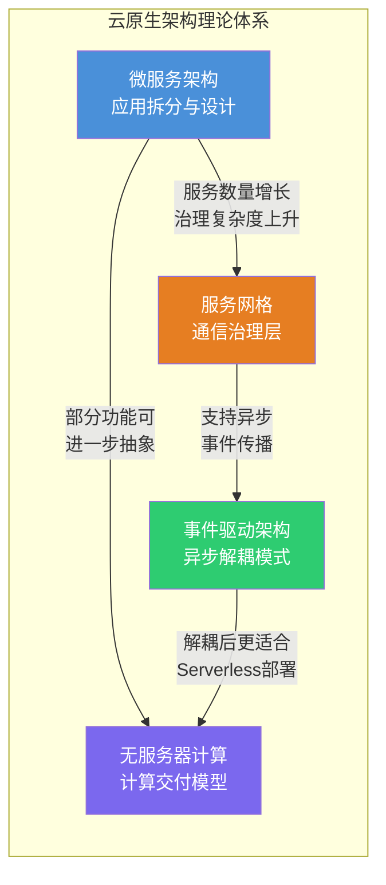
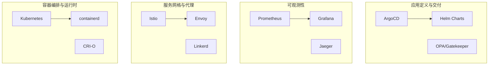
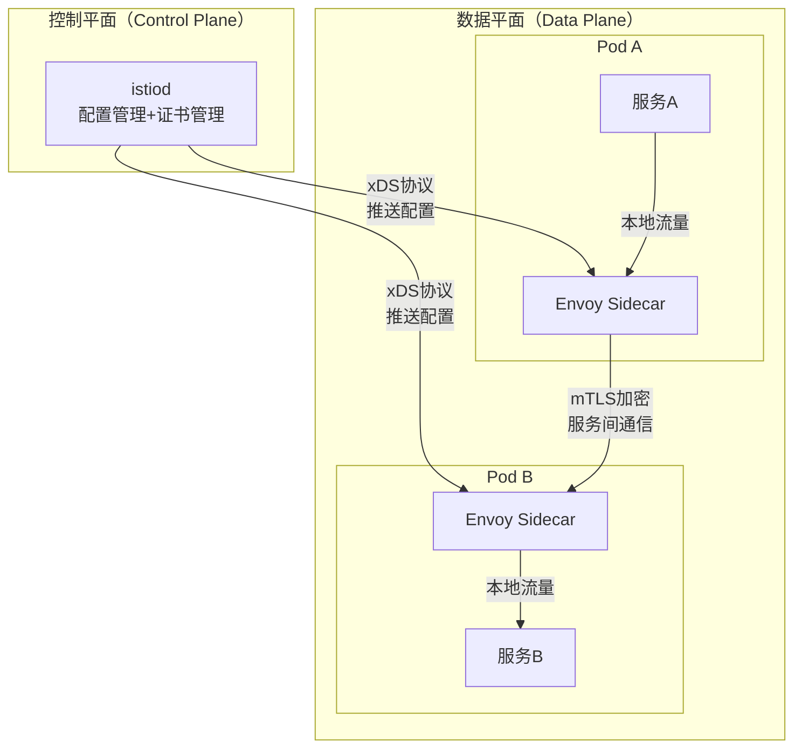

# 云原生架构的理论基础

云原生（Cloud Native）不是一个单一的技术，而是一套完整的技术体系和方法论。它从根本上改变了应用程序的构建、部署和运维方式——从"把应用搬上云"升级为"为云而设计"。本节系统讲解云原生架构的四大理论支柱：微服务架构、无服务器计算、服务网格、事件驱动架构，帮助读者建立从理念认知到架构决策的完整知识框架。

## 一、四大理论支柱总览

云原生架构的理论体系围绕四个核心主题展开，它们不是孤立的技术选型，而是一套相互支撑、层层递进的设计哲学：

| 理论支柱 | 核心问题 | 解决思路 | 典型技术 |
|---------|---------|---------|---------|
| **微服务架构** | 如何将大型单体拆分为可独立演进的服务？ | 按业务能力拆分，独立部署，去中心化治理 | Spring Cloud、gRPC、DDD |
| **无服务器计算** | 如何让开发者只关注业务逻辑，不管基础设施？ | FaaS按执行计费，BaaS提供托管后端 | Lambda、Knative、Cloudflare Workers |
| **服务网格** | 如何在数百个微服务间统一治理通信？ | 将横切关注点下沉到基础设施层 | Istio、Envoy、Linkerd |
| **事件驱动架构** | 如何在分布式系统中实现松耦合和高弹性？ | 以事件作为服务间通信的核心媒介 | Kafka、RabbitMQ、CloudEvents |

这四大支柱的内在逻辑是：**微服务解决"怎么拆"，事件驱动解决"怎么通"，服务网格解决"怎么管"，无服务器解决"怎么省"**。在实际的云原生系统中，它们往往组合使用——微服务架构定义服务边界，事件驱动提供异步通信机制，服务网格统一管理服务间流量，无服务器架构处理部分计算密集型或流量波动大的功能。

## 二、云原生的定义与核心理念

### 2.1 CNCF 官方定义

云原生计算基金会（CNCF）对云原生的官方定义是：云原生技术使组织能够在公有云、私有云和混合云等现代动态环境中构建和运行可扩展的应用程序。云原生的代表技术包括容器、服务网格、微服务、不可变基础设施和声明式API。

这个定义隐含了四个核心维度：

**维度一：容器化封装（Immutable Infrastructure）**。容器技术将应用程序及其所有依赖项打包在一起，确保应用在任何环境中都能以相同的方式运行。容器镜像的不可变性是云原生架构的基石——构建一次，到处运行，消除了"在我的机器上可以运行"这类经典问题。

**维度二：动态编排（Declarative Orchestration）**。Kubernetes作为事实上的容器编排标准，通过声明式配置让运维人员描述期望的系统状态，而非手动执行操作步骤。声明式管理将运维从"做事"转变为"描述目标"，极大降低了大规模分布式系统的运维复杂度。

**维度三：微服务化设计（Service-Oriented Architecture）**。将单体应用拆分为一组松耦合的服务，每个服务围绕一个业务能力构建，拥有独立的数据存储，可以独立开发、测试、部署和扩展。微服务化使得小团队能够快速迭代，持续交付成为可能。

**维度四：DevOps文化（Continuous Delivery）**。云原生强调开发和运维的深度融合，通过CI/CD流水线、基础设施即代码（IaC）、可观测性等实践，实现软件的快速、可靠交付。DevOps不仅是工具链的变革，更是组织文化的转型。

### 2.2 十二要素应用方法论

十二要素应用（Twelve-Factor App）是云原生应用设计的黄金标准，由Heroku联合创始人Adam Wiggins在2011年提出。它不是具体的技术方案，而是一套指导应用设计的原则：

| 要素 | 核心原则 | 实践要点 |
|------|---------|---------|
| 基准代码 | 一份代码，多份部署 | 不同环境通过配置区分，不通过代码分支 |
| 依赖 | 显式声明依赖 | 使用requirements.txt/go.mod等，不用系统级包 |
| 配置 | 环境变量存储配置 | 数据库URL、API密钥等通过环境变量注入 |
| 后端服务 | 视为附加资源 | 通过URL连接，应用不区分本地和第三方服务 |
| 构建/发布/运行 | 严格分离三阶段 | Docker多阶段构建完美体现此原则 |
| 进程 | 无状态运行 | 状态存入后端服务，进程随时可替换 |
| 端口绑定 | 自包含服务 | 应用通过端口绑定对外服务，不依赖外部Web服务器 |
| 并发 | 进程模型扩展 | 启动更多进程处理更多请求，而非增加线程 |
| 易处理 | 快启快停 | 几秒内启动，收到终止信号时优雅关闭 |
| Dev/Prod等价 | 环境一致性 | 容器化确保开发与生产环境一致 |
| 日志 | 视为事件流 | 输出到stdout/stderr，由运行环境收集处理 |
| 管理进程 | 一次性运行 | 数据库迁移、定时任务作为独立进程执行 |

十二要素的核心思想可以归纳为：**应用的可移植性和可扩展性取决于对环境的解耦程度**。配置外置、依赖显式、状态外置、进程无状态——这些原则共同确保应用可以在任何云环境中无缝迁移和弹性伸缩。

### 2.3 CNCF 全景图

CNCF维护着一份庞大的云原生技术全景图，涵盖从应用定义到容器运行时的完整生态。对于架构师而言，最需要关注的是全景图中的四个关键层次：

理解全景图的价值在于：当你面对具体的技术选型时，可以从全景图中找到同类工具进行对比，避免重复造轮子或选择过于小众的方案。

## 三、微服务架构设计理论

微服务架构是云原生体系中最核心的架构模式，也是最容易被误用的模式。理论基础的核心在于理解"为什么拆"和"怎么拆"。

### 3.1 微服务的本质：从单体到分布式

微服务架构的出现是对单体架构（Monolith）演进痛点的直接回应。单体架构在项目初期具有开发简单、部署方便的优势，但随着业务规模增长，它面临三个致命问题：

**问题一：变更成本指数增长**。在一个包含数百万行代码的单体应用中，修改一个模块可能影响整个系统的稳定性。测试周期从几天延长到几周，发布频率从每天一次降低到每月一次。

**问题二：扩展性受限**。单体架构只能整体扩展——如果订单模块需要更多计算资源，必须复制整个应用，即使用户管理和库存管理模块不需要额外资源。这种"木桶效应"导致资源利用率低下。

**问题三：技术栈锁定**。单体架构通常采用统一的技术栈。当团队需要引入更适合特定场景的技术（如用Go重写高并发模块）时，由于模块间的紧密耦合，技术迁移的代价极高。

微服务架构通过将单体拆分为一组小型、自治的服务来解决这些问题。每个服务：
- 围绕一个业务能力构建（如用户管理、订单处理、支付处理）
- 拥有独立的数据存储（Database per Service模式）
- 可以独立开发、测试、部署和扩展
- 通过轻量级协议（HTTP/REST、gRPC）进行通信

### 3.2 服务拆分原则

服务拆分是微服务架构设计中最具挑战性的环节。拆分粒度过粗会导致"分布式单体"——表面上是微服务，实际上服务间耦合度极高，改一个服务必须同时改另外五个。拆分粒度过细则会引入过多的网络通信开销、分布式事务复杂度和运维负担。

**原则一：单一职责（Single Responsibility）**。每个服务应该只负责一个明确的业务能力。判断标准：修改一个业务需求时，是否只需要修改一个服务。如果一个需求变更需要同时修改三个服务，说明服务边界划分不合理。

**原则二：领域驱动设计（DDD）指导拆分**。DDD的限界上下文（Bounded Context）概念天然适合作为微服务的边界划分依据。每个限界上下文定义了一个业务领域的语言边界和数据边界，对应一个或少数几个微服务。在电商系统中，"商品"在不同上下文中含义不同——在库存上下文中是SKU和数量，在商品展示上下文中是图文描述和属性。这种语义差异正是限界上下文的划分依据。

**原则三：数据自治**。每个微服务应该拥有自己的数据存储，其他服务不能直接访问其数据库。数据共享是微服务架构中最常见的反模式——它会制造隐式耦合，使得服务拆分形同虚设。跨服务数据查询应通过API调用或事件驱动的最终一致性方案解决。

**原则四：渐进式拆分**。不是所有系统都需要一步到位微服务化。更稳妥的路径是：单体 → 模块化单体 → 微服务。先在单体内部建立清晰的模块边界，验证拆分合理性后再逐步将模块抽取为独立服务。

### 3.3 服务通信模式

微服务间的通信分为同步和异步两大类，选择取决于对一致性和弹性的权衡：

**同步通信**：调用方发起请求后等待响应。HTTP/REST简单直观，适合对外暴露接口；gRPC基于HTTP/2和Protocol Buffers，性能更高（通常快2-5倍），适合内部服务间高频通信。同步通信的代价是强耦合——调用方必须等待被调用方响应，如果被调用方故障，调用方也会受影响。

**异步通信**：通过消息队列实现服务间解耦。消息生产者将消息发送到队列后立即返回，消费者按自己的速率处理消息。异步通信能够提高系统弹性和吞吐量，但引入了消息顺序、重复消费和最终一致性等复杂问题。

| 维度 | 同步通信 | 异步通信 |
|------|---------|---------|
| 耦合度 | 高（强依赖对方可用） | 低（通过队列解耦） |
| 一致性 | 强一致（立即看到结果） | 最终一致（延迟可接受时） |
| 弹性 | 低（下游故障影响上游） | 高（队列缓冲峰值流量） |
| 复杂度 | 低（直观的请求-响应） | 高（需要处理消息可靠性） |
| 适用场景 | 实时查询、用户交互 | 事件通知、数据同步、异步任务 |

### 3.4 分布式事务：Saga模式

微服务架构下，传统的ACID事务无法跨服务保证。Saga模式通过将长事务拆分为一系列本地事务+补偿事务来解决跨服务数据一致性问题：

**编排式Saga（Orchestration）**：由一个中央协调器（Saga Orchestrator）按顺序调用各个服务的事务，并在失败时按逆序执行补偿操作。优点是流程清晰、易于监控；缺点是协调器可能成为单点故障。

**协同式Saga（Choreography）**：每个服务在完成本地事务后发布事件，其他服务监听事件并执行相应操作。优点是完全去中心化、无单点故障；缺点是流程分散在各个服务中，难以追踪整体状态。

## 四、无服务器计算理论

无服务器计算（Serverless）是云原生架构的进一步演进，它将基础设施管理的责任完全交给云平台。"无服务器"的名字具有误导性——服务器依然存在，只是对开发者透明了。

### 4.1 FaaS：函数即服务

FaaS的核心是**事件驱动的短暂计算单元**。开发者编写一个函数，云平台负责：按需创建执行环境 → 执行函数 → 自动扩缩容 → 按执行时长计费。函数执行完毕后，平台可能在几秒到几分钟内回收资源。

FaaS的关键特征：

**按需执行**：函数不是持续运行的服务，而是被事件触发的。没有请求时不消耗计算资源，这与传统服务器的"always-on"模式形成鲜明对比。

**自动扩缩**：平台根据请求量自动创建和销毁函数实例，可以从零扩展到数千并发。这种弹性是传统架构难以企及的——在Kubernetes中实现从零扩展到千个Pod需要分钟级，而FaaS通常在秒级完成。

**按执行计费**：只为函数实际执行的时间付费，精确到毫秒级。对于流量波动大的应用，这种计费模型可以节省60-80%的计算成本。

### 4.2 BaaS：后端即服务

BaaS将后端基础设施封装为托管服务：数据库（DynamoDB、Firebase）、认证（Cognito、Auth0）、存储（S3）、消息队列（SQS）等。开发者通过API直接使用这些服务，无需自行搭建和维护。

FaaS + BaaS的组合构成了完整的Serverless应用架构：函数负责业务逻辑，BaaS提供数据库、身份认证、文件存储等能力。每个函数只做一件事，BaaS提供基础设施能力，事件队列解耦函数间的依赖。

### 4.3 冷启动：核心挑战

冷启动是FaaS最受关注的性能问题。当函数收到请求且没有预热的实例可用时，平台需要从零创建执行环境，包括：分配计算资源 → 拉取代码 → 初始化运行时 → 执行初始化代码。

冷启动耗时从几十毫秒到数秒不等，取决于运行时语言、依赖包大小和平台优化程度：

| 运行时 | 冷启动耗时 | 原因 |
|--------|-----------|------|
| Go/Rust | 5-50ms | 编译为原生二进制，无需解释器启动 |
| Node.js | 100-500ms | V8引擎启动 + 依赖加载 |
| Python | 100-500ms | 解释器启动 + 包导入 |
| Java | 500ms-3s | JVM启动 + 类加载 + JIT预热 |

### 4.4 适用场景与限制

无服务器架构特别适合：事件驱动的处理任务（图片处理、文件转换）、API后端（流量波动大的场景）、定时任务、数据管道和Webhook处理。

但也有明显限制：冷启动延迟影响首次请求响应时间；函数执行时间有上限（AWS Lambda最长15分钟）；长时间运行的任务不适合；供应商锁定风险较高。架构决策应基于具体场景评估，而非盲目追求"全Serverless"。

## 五、服务网格理论

### 5.1 核心问题：微服务治理的复杂性

随着微服务数量从几个增长到数百个，服务间通信的治理变得极其复杂。每个服务都需要处理：服务发现、负载均衡、熔断降级、超时重试、链路追踪、认证授权、日志收集。如果将这些横切关注点（Cross-Cutting Concerns）逐一集成到每个服务的代码中，会导致：

- **代码重复**：每个服务都实现一套相同的服务治理逻辑
- **语言绑定**：治理库通常只支持特定语言，多语言微服务难以统一治理
- **升级困难**：修改治理策略需要重新部署所有服务
- **运维复杂**：每个服务的治理配置分散管理，难以统一调整

服务网格通过将这些横切关注点从应用层下沉到基础设施层来解决这些问题。

### 5.2 数据平面与控制平面

服务网格架构由两个核心平面组成：

**数据平面（Data Plane）**：由一组智能代理（通常是Envoy）组成，以Sidecar方式部署在每个服务实例旁边。Sidecar拦截服务的所有进出网络流量，透明地处理服务发现、负载均衡、熔断、限流、认证授权、可观测性数据收集等功能。应用代码完全无感知——它以为自己在与另一个服务直接通信，实际上所有流量都经过了Envoy代理的处理。

**控制平面（Control Plane）**：负责管理和配置数据平面的代理。在Istio中，控制平面的核心组件是istiod，它集成了Pilot（配置管理）、Citadel（证书管理）和Galley（配置验证）的功能。控制平面通过xDS协议向数据平面推送配置变更，实现流量管理策略的动态调整。

### 5.3 Envoy代理原理

Envoy是CNCF毕业项目，也是Istio的数据平面实现。它的核心设计是**过滤器链（Filter Chain）**模型：网络请求经过一系列过滤器依次处理，每个过滤器负责一个特定功能（路由、认证、限流、日志等）。

Envoy的关键能力包括：L7协议解析（HTTP/1.1、HTTP/2、gRPC、MongoDB等）、动态配置发现（通过xDS协议从控制平面获取配置，无需重启）、连接池管理、熔断器、主动健康检查、分布式追踪数据收集。

### 5.4 服务网格 vs 应用内治理

| 维度 | 应用内治理库 | 服务网格 |
|------|------------|---------|
| 侵入性 | 高（代码依赖） | 零侵入（Sidecar透明代理） |
| 多语言支持 | 需要每种语言的库 | 与语言无关 |
| 运维复杂度 | 低（进程内） | 高（多一个Sidecar） |
| 资源开销 | 低 | 每个Pod额外占用100MB内存 |
| 升级灵活性 | 低（需重新部署） | 高（控制平面统一推送） |
| 适用规模 | 小规模（<20服务） | 大规模（>20服务） |

服务网格的代价是额外的资源开销（每个Pod增加一个Sidecar容器）和运维复杂度。对于小规模系统（少于20个服务），应用内治理库可能更简单高效。服务网格的收益在大规模微服务系统中才能真正体现。

## 六、事件驱动架构理论

### 6.1 核心概念

事件驱动架构（Event-Driven Architecture, EDA）通过事件的产生、检测、消费和响应来解耦系统组件。在这种架构中，服务不直接调用彼此，而是通过发布和订阅事件来进行通信。

**事件（Event）**：系统中发生的、具有业务意义的状态变更。例如"订单已创建"、"支付已完成"、"库存已更新"。事件是不可变的——它记录了一个已经发生的事实，不能被修改或删除。

**事件源（Event Source）**：产生事件的组件。一个服务可以同时是事件的生产者和消费者。

**事件处理器（Event Handler）**：监听并响应事件的组件。事件处理器应该是无状态的，可以水平扩展。

### 6.2 CQRS模式

命令查询职责分离（Command Query Responsibility Segregation, CQRS）将系统的读写模型分离：

- **命令模型（Write Side）**：处理创建、更新、删除操作，使用规范化的关系型数据库确保数据一致性
- **查询模型（Write Side）**：处理查询操作，使用反规范化的读优化存储（如Elasticsearch、Redis）提供高性能查询

CQRS的价值在于：读写操作通常有不同的性能特征和扩展需求。写操作需要事务保证，适合关系型数据库；读操作需要高吞吐低延迟，适合缓存和搜索引擎。分离后，两个模型可以独立扩展和优化。

### 6.3 Event Sourcing

Event Sourcing将系统的状态存储为一系列事件的序列，而非当前状态的快照。每次状态变更不是直接修改数据库记录，而是追加一条新事件。当前状态可以通过重放所有事件来重建。

Event Sourcing的核心优势：
- **完整审计追踪**：每个状态变更都有记录，可以追溯任何时间点的系统状态
- **时间旅行**：通过重放到某个时间点的事件来还原当时的系统状态
- **事件重放**：当处理逻辑有bug时，修复后可以重放事件来修正数据
- **解耦事件消费**：新的消费者可以订阅历史事件，构建新的读模型

代价是事件存储的管理复杂度——随着时间推移，事件数量会持续增长，需要定期快照（Snapshot）来限制重放时间。

### 6.4 消息代理选型

| 维度 | Kafka | RabbitMQ | Pulsar |
|------|-------|----------|--------|
| 核心模型 | 分布式日志 | 消息队列 | 分布式日志+队列 |
| 吞吐量 | 极高（百万级/秒） | 中（万级/秒） | 极高（百万级/秒） |
| 消息顺序 | 分区内有序 | 队列内有序 | 分区内有序 |
| 消息保留 | 按时间/大小保留 | 消费后删除 | 按时间保留 |
| 延迟 | 毫秒级 | 微秒级 | 毫秒级 |
| 适用场景 | 高吞吐日志、事件溯源 | 任务队列、RPC | 多租户、云原生 |

选择建议：高吞吐量的事件流处理选Kafka；需要灵活路由和优先级队列的异步任务选RabbitMQ；多租户云原生环境选Pulsar。

## 七、四大支柱的协同与权衡

在实际的云原生系统中，四大理论支柱往往组合使用，但需要根据业务场景做出合理的权衡决策。

### 7.1 组合模式

**微服务 + 事件驱动**：最经典的组合。服务间通过事件进行异步通信，降低耦合度。例如订单服务发布"订单已创建"事件，库存服务和支付服务各自消费事件并执行相应操作。服务之间不直接调用，即使某个下游服务暂时不可用，消息也会在队列中等待，系统整体保持可用。

**微服务 + 服务网格**：当微服务数量超过20个时，服务网格的治理收益开始超过其运维开销。服务网格统一处理服务发现、负载均衡、mTLS认证、链路追踪，应用代码只需关注业务逻辑。

**微服务 + 无服务器**：将部分功能（如图片处理、文件转换、定时任务）抽取为FaaS函数，利用Serverless的自动扩缩和按需计费降低成本。核心业务逻辑仍然运行在微服务中，保证性能和可控性。

**全栈云原生**：四大支柱全部启用。核心业务通过微服务架构设计，服务间通信通过服务网格治理，异步处理通过事件驱动解耦，部分计算密集型功能通过无服务器架构实现。这种模式适合大规模、高复杂度的系统。

### 7.2 过度设计的陷阱

云原生架构的复杂性是真实的代价。在引入任何分布式架构之前，需要回答一个关键问题：**当前的复杂度是否真的需要这个方案来解决？**

常见的过度设计信号：
- 10个以下的服务却引入了服务网格
- 简单的CRUD应用却拆分为微服务
- 流量稳定的API却采用Serverless架构
- 单团队维护的系统却采用事件驱动架构

**务实原则**：技术选型应服务于业务需求，而非为了"云原生"而云原生。从单体开始，在真正遇到单体架构的痛点时再逐步引入分布式方案。可观测性应先行——在引入任何分布式架构之前，先建立完善的监控、日志和链路追踪能力。
