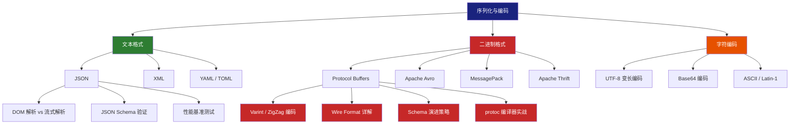
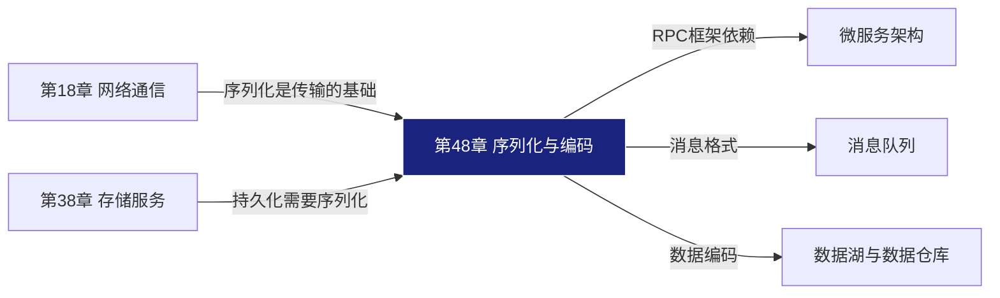

# 第48章 序列化与编码 · 章节概览

## 本章定位

序列化与编码是分布式系统的"语言"——当两个服务需要交换数据，当一条消息需要穿越网络，当一个对象需要落盘持久化，序列化就是那座桥梁。本章是整本软件工程核心原理中**数据交换基础设施**的关键一环，承接第18章网络通信、第38章存储服务的知识，并为后续的微服务架构、消息队列、数据管道等章节奠定底层基础。

> 如果说网络协议定义了"怎么传"，序列化与编码则定义了"传什么"和"怎么装"。

## 为什么序列化如此重要

在真实的生产系统中，序列化的选择直接影响三个核心维度：

性能 ── 序列化/反序列化速度决定了请求延迟的下限
体积 ── 编码后的数据大小决定了网络带宽和存储成本
兼容 ── Schema演进能力决定了系统能否持续迭代而不崩溃

一个真实的教训：某电商平台在切换序列化方案后，单次RPC响应体积从 2.3KB 降至 680B，网关吞吐量提升 40%，年度带宽费用节省 120 万元。序列化不是一个"用了就行"的技术点，而是一个需要精心选型的架构决策。

## 知识体系全景

## 本章内容地图

本章按照 **"文本 → 二进制 → 编码原理 → 工程实践"** 的路径组织，共分为三大板块、七个小节：

### 板块一：理论基础

| 章节 | 主题 | 核心内容 | 建议时长 |
|------|------|----------|----------|
| 48.1 序列化概述 | 为什么要序列化 | 序列化的定义、分类（文本 vs 二进制）、选型维度（性能/体积/兼容性/跨语言） | 30分钟 |
| 48.2 JSON与XML | 文本格式深入 | JSON解析原理（DOM/SAX/StAX）、XML Schema验证、性能对比、实际应用模式 | 2小时 |
| 48.3 Protocol Buffers | 二进制格式王者 | Protobuf wire format、varint编码、字段编号机制、与JSON的性能对比 | 2小时 |
| 48.4 Avro与MessagePack | 二进制格式补充 | Avro的Schema驱动设计、MessagePack的"二进制JSON"理念、适用场景对比 | 1.5小时 |
| 48.5 字符编码 | 编码底层原理 | UTF-8变长编码机制、Base64原理与应用场景、字符编码陷阱与排错 | 1小时 |

### 板块二：核心技巧

| 章节 | 主题 | 核心内容 |
|------|------|----------|
| 48.6 Protobuf编码实战 | 编码细节剖析 | varint编码算法实现、ZigZag有符号整数编码、wire type与字段打包、嵌套消息编码 |
| 48.7 Schema演进 | 版本兼容之道 | 向前兼容与向后兼容、字段编号规则、oneof与map的演进、废弃字段策略 |
| 48.8 性能对比 | 选型决策依据 | 各格式序列化/反序列化速度、数据体积、CPU开销、内存占用的基准测试 |

### 板块三：实战与总结

| 章节 | 主题 | 核心内容 |
|------|------|----------|
| 48.9 案例一：protoc实战 | 从零构建Protobuf项目 | .proto文件编写、protoc编译、多语言代码生成、gRPC集成 |
| 48.10 案例二：Avro实战 | Avro的完整工作流 | Schema定义、数据序列化/反序列化、Schema解析、与Kafka集成 |
| 48.11 常见误区 | 避坑指南 | 典型错误模式与纠正方法 |
| 48.12 练习方法 | 动手实践 | 从入门到进阶的练习设计 |
| 48.13 本章小结 | 知识回顾 | 核心要点总结、选型速查表 |

## 三条阅读路径

根据你的目标和基础，推荐以下阅读路径：

### 路径一：快速上手（2-3小时）

适合需要尽快在项目中选型序列化方案的工程师：

48.1 序列化概述（建立全局认知）
  → 48.8 性能对比（拿到选型数据）
    → 48.13 本章小结（查漏补缺）

### 路径二：深度掌握（8-10小时）

适合需要深入理解底层原理、做架构决策的技术负责人：

48.1 序列化概述
  → 48.2 JSON与XML
    → 48.3 Protocol Buffers
      → 48.4 Avro与MessagePack
        → 48.5 字符编码
          → 48.6 Protobuf编码实战
            → 48.7 Schema演进
              → 48.9 案例一 + 48.10 案例二
                → 48.11 常见误区

### 路径三：实战驱动（4-5小时）

适合边学边用、直接在项目中落地的开发者：

48.1 序列化概述（5分钟速览）
  → 48.9 案例一：protoc实战（动手跑起来）
    → 48.3 Protocol Buffers（回头理解原理）
      → 48.10 案例二：Avro实战（第二个方案）
        → 48.7 Schema演进（生产环境必须懂）
          → 48.11 常见误区（避坑）

## 前置知识要求

阅读本章前，建议具备以下基础知识：

| 知识领域 | 具体要求 | 参考章节 |
|----------|----------|----------|
| 数据结构 | 理解树、哈希表、链表的基本概念 | 第2-3章 |
| 网络通信 | 了解HTTP/HTTPS、TCP基础 | 第18章 |
| 编程基础 | 能读懂Python/Go/Java代码示例 | — |
| 系统设计 | 了解客户端-服务端模型、RPC基本概念 | 第38章 |

## 核心概念速查

在深入各小节之前，先建立以下关键概念的心理模型：

| 概念 | 一句话解释 | 重要程度 |
|------|------------|----------|
| 序列化（Serialization） | 将内存中的数据结构转换为可传输/存储的字节序列 | ★★★★★ |
| 反序列化（Deserialization） | 序列化的逆过程，将字节序列还原为数据结构 | ★★★★★ |
| Schema | 描述数据结构的元信息，是二进制格式编解码的契约 | ★★★★☆ |
| Wire Format | 数据在线路上传输时的二进制格式，包括类型标记和字段布局 | ★★★★☆ |
| Varint | 可变长度整数编码，用1-10字节表示64位整数 | ★★★★☆ |
| ZigZag | 将有符号整数映射为无符号整数的编码，优化小负数的表示 | ★★★☆☆ |
| 字段编号 | Protobuf中每个字段的唯一标识，是Schema演进的基石 | ★★★★☆ |
| 前向兼容 | 新版本代码能正确读取旧版本数据 | ★★★★★ |
| 后向兼容 | 旧版本代码能正确读取新版本数据（忽略未知字段） | ★★★★★ |

## 各序列化格式选型速查

在正式学习前，先看这张速查表建立直觉。学习完本章后回来重看，你会有更深的理解。

| 维度 | JSON | XML | Protobuf | Avro | MessagePack |
|------|------|-----|----------|------|-------------|
| 人类可读 | ✅ 优秀 | ✅ 可读 | ❌ 二进制 | ❌ 二进制 | ❌ 二进制 |
| 序列化速度 | 中等 | 较慢 | 快 | 快 | 快 |
| 数据体积 | 大 | 最大 | 小 | 小 | 中等 |
| Schema依赖 | 无 | 可选(XSD) | 必须 | 必须 | 无 |
| 跨语言 | ✅ 全语言 | ✅ 全语言 | ✅ 主流语言 | ✅ 主流语言 | ✅ 全语言 |
| Schema演进 | 无内置 | 有限 | 优秀 | 优秀 | 无内置 |
| 流式解析 | 有限 | ✅ SAX | 有限 | ✅ 原生 | 有限 |
| 主要场景 | Web API, 配置 | 企业集成, 文档 | RPC, 存储 | 大数据, 流处理 | 缓存, 简单RPC |

> **一句话选型**：Web API 用 JSON，高性能 RPC 用 Protobuf，大数据管道用 Avro，轻量缓存用 MessagePack，企业集成用 XML。

## 与其他章节的关系

## 学习建议

1. **先跑代码再看原理**：每个格式都有对应的小节和实战案例，建议先运行代码示例，建立直觉后再深入原理。

2. **带着问题学**：如果你正在设计一个 RPC 框架或者选择消息队列的序列化方案，把具体问题带入学习，效果远好于纯理论学习。

3. **重视 Schema 演进**：这是序列化选型中最容易被忽视、但生产中最致命的问题。48.7 节（Schema演进）是本章最关键的实战知识之一。

4. **做性能测试**：48.8 节（性能对比）提供了基准测试方法，建议在自己的硬件环境上跑一遍，不同硬件的结果差异可能很大。

5. **记笔记做对比**：本章涉及 5+ 种格式，建议用表格记录每种格式的关键特征，方便日后查阅。
