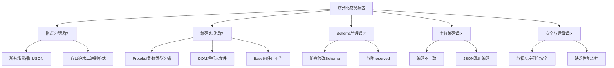
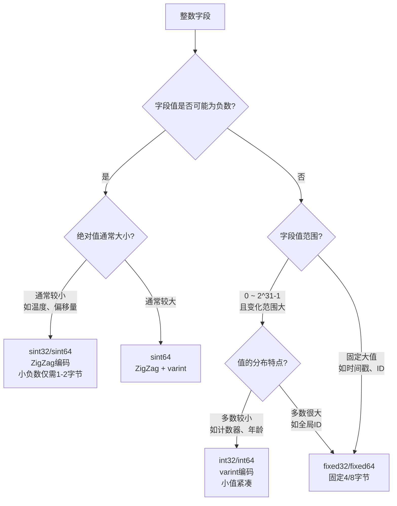

# 序列化与编码常见误区

在序列化与编码的工程实践中，开发者常常因为对底层机制理解不够深入而陷入各种陷阱。这些误区轻则导致性能下降、数据冗余，重则引发线上事故——数据损坏、服务不可用、安全漏洞。本节从真实生产场景出发，系统梳理序列化与编码领域最常见的十大误区，每个误区都包含"错误做法→正确做法→底层原理"三层剖析，帮助读者建立正确的认知框架。



---

## 误区一：所有场景都用JSON，或盲目追求二进制格式

### 错误做法

两种极端表现：

**极端一：JSON一刀切**——无论内部RPC、大数据传输还是高性能缓存，一律使用JSON。理由是"JSON简单、大家都会、调试方便"。

**极端二：二进制崇拜**——认为JSON"太慢太浪费"，所有场景都上Protobuf或Avro，包括对外的REST API和配置文件。

### 真实后果

- JSON一刀切：内部微服务间每秒百万次RPC调用，JSON的编码体积是Protobuf的4-5倍，带宽成本直线上升，序列化CPU占用成为瓶颈
- 二进制崇拜：前端调试接口时无法直接看到数据内容，必须依赖专门的抓包工具；配置文件改为Protobuf后运维人员无法直接阅读和修改

### 正确做法：按场景分层选型

不同场景对序列化格式的需求截然不同，需要在可读性、性能、体积、兼容性之间做权衡：

| 场景 | 推荐格式 | 核心考量 | 备选方案 |
|------|----------|----------|----------|
| 对外REST API | JSON | 浏览器/移动端原生支持，人类可读，调试方便 | — |
| 内部微服务RPC | Protobuf | 高效编码、良好Schema演进、gRPC集成 | Thrift |
| 大数据存储/日志 | Avro | 极致压缩、Schema Registry管理、Hadoop生态集成 | Parquet |
| 移动端弱网传输 | Protobuf/MessagePack | 体积小5-8倍，减少带宽消耗 | JSON+gzip |
| 内存缓存/临时数据 | MessagePack | 无需Schema、体积小、解析快 | JSON |
| 配置文件 | JSON/YAML/TOML | 人类可读、可注释 | — |

### 底层原理

序列化格式的本质是在五个维度做权衡：

可读性 ←→ 性能（速度/体积）
灵活性 ←→ 类型安全
开发效率 ←→ 运行时效率

文本格式（JSON/XML）的优势在于可读性和通用性——几乎每种语言都原生支持JSON解析，浏览器的`fetch` API直接返回JSON。但代价是字段名以明文存储、数字需要转字符串、文本分隔符（引号、冒号、逗号）带来额外开销。

二进制格式（Protobuf/Avro）的优势在于编码紧凑和解析高效——字段名用整数编号替代，数值直接以二进制表示，没有分隔符开销。但代价是不可直接阅读，需要Schema定义和代码生成工具链。

**黄金原则**：对外接口用JSON保兼容，内部通信用Protobuf保性能，大数据用Avro保压缩率。不要为了"统一技术栈"而牺牲场景适配性。

---

## 误区二：Protobuf整数类型随意选择

### 错误做法

所有整数字段一律使用`int64`，理由是"用最大的类型总没错，覆盖所有场景"。或者对于可能为负数的字段使用`int32`/`int64`而非`sint32`/`sint64`。

### 真实后果

**场景一**：一个温度传感器字段`int32 temperature = 1`，值域为-50到+50。由于使用了`int32`而非`sint32`，负数-1被编码为补码形式`0xFFFFFFFF`，varint编码需要5字节。而如果使用`sint32`，-1通过ZigZag编码后变为1，varint编码仅需1字节。在每秒百万条消息的IoT场景下，这个差异导致额外的几十MB带宽消耗。

**场景二**：一个用户ID字段`int64 user_id = 1`，值域始终在0到100000之间。int64对小值虽然也能用varint紧凑编码（0-127仅1字节），但如果改用fixed64会固定占8字节，反而浪费。反之，如果字段值总是很大的（如时间戳），使用fixed64反而更高效，因为避免了varint对大值的编码开销。

### 正确做法：根据值域选择合适的整数类型



**类型选择速查表**：

| 场景 | 推荐类型 | 编码方式 | 原因 |
|------|----------|----------|------|
| 温度、偏移量（可正可负） | `sint32`/`sint64` | ZigZag + varint | 小负数编码紧凑 |
| 年龄、计数器（非负且较小） | `int32` | varint | 0-127仅1字节 |
| 全局唯一ID（非负且较大） | `fixed64`或`int64` | 固定8字节/varint | 值大时varint与fixed差距小，看具体分布 |
| 时间戳（Unix毫秒） | `fixed64` | 固定8字节 | 13位数字varint需8字节，与fixed相同，fixed更规整 |
| 高频字段（编号1-5） | 选最紧凑的类型 | — | 高频字段的每个字节开销都被放大 |

### 底层原理

**varint编码**的核心特征是"小值紧凑，大值膨胀"：

值 0-127    → 1字节（0xxxxxxx）
值 128-16383 → 2字节（1xxxxxxx 0xxxxxxx）
值 16384+    → 3字节及以上
负数补码    → 10字节（int32/int64的补码高位全1）

**ZigZag编码**将有符号整数映射为无符号整数，使绝对值小的负数也用少量字节：

原始值 → ZigZag值 → varint字节数
  0    →    0     →  1字节
 -1    →    1     →  1字节
  1    →    2     →  1字节
 -2    →    3     →  1字节
 2^30  → 2^31     →  5字节

映射公式：`(n << 1) ^ (n >> 31)`（32位）或`(n << 1) ^ (n >> 63)`（64位）。

**fixed类型**不使用varint，而是固定占用4字节（fixed32/sfixed32/float）或8字节（fixed64/sfixed64/double）。对于值域大且分布均匀的字段，fixed类型的编码效率可能优于varint。

---

## 误区三：忽略Schema演进，随意修改proto文件

### 错误做法

直接删除不再使用的字段并重新分配其字段编号，或者修改已有字段的类型（如将`string`改为`int32`），或者不添加新字段的默认值。

### 真实后果

**事故案例**：团队将`message User`中的`string name = 2`删除后，将字段编号2分配给新的`int32 score = 2`。旧版本客户端发送的数据中，字段编号2的值是字符串"张三"，新版本服务端将其按`int32`解析，得到一个随机整数或直接抛出解析异常。由于gRPC支持滚动更新，新旧版本服务并存期间，所有涉及User消息的请求都会失败。

### 正确做法：遵循Schema演进黄金法则

**四条铁律**：

1. **新增字段**：始终安全。旧代码忽略未知字段，新代码对缺失字段使用默认值
2. **删除字段**：使用`reserved`保留字段编号和名称，防止被未来的新字段误用
3. **修改字段类型**：只有wire type兼容的类型之间才能安全转换（如`int64`↔`uint64`↔`sint64`↔`int32`有条件下兼容）
4. **字段编号一旦分配不可更改**：这是Schema兼容性的基石

```protobuf
// ❌ 错误做法：删除字段后复用编号
message User {
    int32 id = 1;
    // string name = 2;  // 删除了字段2
    string phone = 2;    // ❌ 复用编号2，导致数据损坏
    int32 age = 3;
}

// ✅ 正确做法：使用reserved保护已删除的字段
message User {
    reserved 2;           // 保留字段编号2
    reserved "name";      // 保留字段名"name"
    int32 id = 1;
    string phone = 4;     // ✅ 使用新编号
    int32 age = 3;
    string display_name = 5;  // ✅ 替代原name字段的新编号
}
```

**Avro的Schema演进**要求更严格：新增字段必须提供`default`值，否则用旧Schema写入的数据无法被新Schema读取。

```json
{
  "type": "record",
  "name": "User",
  "fields": [
    {"name": "id", "type": "int"},
    {"name": "name", "type": "string"},
    {"name": "email", "type": ["null", "string"], "default": null},
    {"name": "age", "type": ["null", "int"], "default": null}
  ]
}
```

### 底层原理

Protobuf的前向兼容和后向兼容机制：

- **前向兼容**（新代码读旧数据）：新代码遇到未知字段编号时，根据wire type跳过对应字节，不会报错
- **后向兼容**（旧代码读新数据）：旧代码遇到未知字段编号时，直接忽略该字段
- **类型安全性**：只有wire type相同的类型之间才能安全重叠。例如`int32`和`int64`都是varint编码（wire type 0），可以安全互转；但`int32`（varint）和`fixed32`（32-bit，wire type 5）不能互转，因为wire type不同

推荐使用`buf breaking`工具自动检测Schema兼容性破坏：

```bash
# 安装buf
go install github.com/bufbuild/buf/cmd/buf@latest

# 检测是否有breaking changes
buf breaking --against '.git#branch=main'
```

---

## 误区四：DOM解析处理大型JSON/XML文件

### 错误做法

对数百MB甚至GB级的JSON文件使用`json.loads()`或XML DOM解析器一次性加载到内存中。理由是"DOM解析代码简单、支持随机访问"。

### 真实后果

一个2GB的JSON日志文件，使用`json.loads()`加载后内存占用膨胀到5-8倍（Python的dict对象开销），直接导致OOM（Out of Memory）被系统kill。即使没有OOM，GC压力也会导致服务响应延迟飙升。

### 正确做法：大文件必须流式解析

**JSON流式解析**：

```python
import ijson

# ❌ 错误：一次性加载整个文件（2GB文件 → 10-16GB内存）
# with open('huge_log.json', 'r') as f:
#     data = json.load(f)  # OOM!

# ✅ 正确：流式解析，内存占用恒定（约1-2MB）
def process_large_json(filepath):
    count = 0
    with open(filepath, 'rb') as f:
        # 流式遍历JSON数组中的每个元素
        parser = ijson.items(f, 'item')
        for record in parser:
            count += 1
            # 逐条处理，内存中始终只有当前记录
            if record.get('amount', 0) > 10000:
                print(f"大额交易: {record['id']}, 金额: {record['amount']}")
    print(f"共处理 {count} 条记录")

process_large_json('huge_log.json')
```

**XML流式解析**：

```java
// ❌ 错误：DOM解析大文件
// Document doc = builder.parse(new File("huge.xml")); // OOM!

// ✅ 正确：SAX/StAX流式解析
import javax.xml.stream.XMLInputFactory;
import javax.xml.stream.XMLStreamReader;

XMLInputFactory factory = XMLInputFactory.newInstance();
XMLStreamReader reader = factory.createXMLStreamReader(
    new FileInputStream("huge.xml"));

int count = 0;
while (reader.hasNext()) {
    int event = reader.next();
    if (event == XMLStreamConstants.START_ELEMENT 
        &amp;&amp; "record".equals(reader.getLocalName())) {
        // 只处理<record>元素，内存占用恒定
        processRecord(reader);
        count++;
    }
}
reader.close();
System.out.println("共处理 " + count + " 条记录");
```

**经验法则**：

| 文件大小 | 推荐解析方式 | 原因 |
|----------|-------------|------|
| < 1MB | DOM/json.loads | 代码简单，支持随机访问 |
| 1MB - 100MB | 流式解析（ijson/SAX） | DOM内存开销不可接受 |
| > 100MB | 必须流式解析 | DOM必然OOM |
| > 1GB | 流式解析 + 分块处理 | 需要考虑IO瓶颈 |

### 底层原理

DOM解析将整个文档构建为树形数据结构。JSON的每个对象在Python中是一个dict，在Java中是一个LinkedHashMap——这些数据结构的内存开销远大于原始文本。粗略估算：

JSON文本大小: 100MB
Python dict对象开销: 每个key-value对约100-200字节额外开销
树结构指针: 每个节点约8-16字节
总内存占用: 约500MB-1GB（5-10倍膨胀）

流式解析（SAX/StAX/ijson）不构建完整树结构，每次只处理一个token或一个元素，内存占用与文档大小无关，仅与单条记录的大小相关。

---

## 误区五：Protobuf字段编号随意分配

### 错误做法

字段编号从大到小分配（如第一个字段编号50），或者将不常用的扩展字段放在编号1-5，将高频核心字段放在编号20+。

### 真实后果

一个核心接口的User消息有20个字段，其中`id`、`name`、`email`三个高频字段被分配到编号16-18。由于编号16-2047的字段需要2字节的tag，而编号1-15仅需1字节tag，在每秒百万次RPC调用的场景下，每条消息多出3字节tag开销——总共多出3MB/s的无效带宽。

### 正确做法：高频字段优先分配低编号

```protobuf
// ✅ 正确：高频字段分配编号1-15
message User {
    // 核心字段（高频访问，编号1-5，每个tag仅1字节）
    int32 id = 1;
    string name = 2;
    string email = 3;
    int32 age = 4;
    string phone = 5;
    
    // 次要字段（中频访问，编号6-15，tag仍为1字节）
    string address = 6;
    string city = 7;
    int32 status = 8;
    
    // 扩展字段（低频访问，编号16+，tag为2字节）
    string bio = 16;
    map<string, string> metadata = 17;
    string avatar_url = 18;
    
    // 预留的未来扩展空间（编号20-100）
    reserved 20 to 100;
}
```

### 底层原理

Protobuf的tag编码由字段编号和wire type组合而成，使用varint编码：

Tag = (field_number << 3) | wire_type

字段编号 1-15:
  field_number=1 → tag值 8-15   → varint编码为1字节
  field_number=15 → tag值 120-127 → varint编码为1字节

字段编号 16-2047:
  field_number=16 → tag值 128-... → varint编码为2字节
  
每条消息的每个字段都要编码tag，高频字段的tag字节数直接影响总数据体积。

建议保留编号20-100作为预留空间，方便未来新增字段而不需要大幅调整编号布局。

---

## 误区六：JSON中直接嵌入二进制数据

### 错误做法

将原始二进制数据（如图片、文件内容、加密密钥）直接作为字符串放入JSON中，不做任何编码转换。

### 真实后果

```python
# ❌ 错误：直接将bytes放入JSON
import json
data = {"image": b'\x89PNG\r\n\x1a\n\x00\x00'}  # PNG文件头
json.dumps(data)  # 抛出 TypeError: Object of type bytes is not JSON serializable

# 或者更隐蔽的错误：手动str()转换
data = {"image": str(b'\x89PNG\r\n\x1a\n')}  # 得到 "b'\\x89PNG\\r\\n\\x1a\\n'"
# 反序列化后得到的是字符串 "b'\\x89PNG...'" 而非原始字节
```

即使没有抛出异常，错误编码的二进制数据在反序列化后也无法还原为原始字节——数据已经永久损坏。

### 正确做法：使用Base64编码二进制数据

```python
import json
import base64

# ✅ 正确：序列化时Base64编码
raw_bytes = b'\x89PNG\r\n\x1a\n\x00\x00\x00\rIHDR'
encoded = base64.b64encode(raw_bytes).decode('ascii')
data = {"image": encoded}
json_str = json.dumps(data)
# {"image": "iVBORw0KGgoAAAANSUhEUg=="}

# ✅ 正确：反序列化时Base64解码
parsed = json.loads(json_str)
restored = base64.b64decode(parsed["image"])
assert restored == raw_bytes  # 数据完整还原
```

**URL安全场景**使用URL-safe Base64（用`-`和`_`替代`+`和`/`）：

```python
# JWT token、URL参数等场景
encoded = base64.urlsafe_b64encode(raw_bytes).decode('ascii').rstrip('=')
```

### 底层原理

JSON规范（RFC 8259）只支持六种数据类型：string、number、boolean、null、object、array。其中string类型仅支持UTF-8编码的文本，不支持任意二进制数据。二进制字节序列中可能包含：

- 控制字符（`\x00`-`\x1F`）：JSON不允许出现在字符串中
- 无效UTF-8序列：解析器会报错
- 引号和反斜杠：会破坏JSON结构

Base64将每3字节二进制数据编码为4个可打印ASCII字符（A-Z、a-z、0-9、+、/），膨胀约33%，但保证了所有字符都在JSON的安全字符集内。

---

## 误区七：字符编码不一致导致乱码

### 错误做法

系统的不同组件使用不同的字符编码——数据库用GBK，应用层用UTF-8，消息队列用ISO-8859-1，前端用自动检测。各组件之间不显式声明编码。

### 真实后果

**经典乱码链**：

MySQL (GBK编码) → JDBC (UTF-8解码) → 应用 (UTF-8处理) 
    → Kafka (ISO-8859-1传输) → 消费者 (UTF-8解码) → 前端显示

中文"你好"在GBK中为\xC4\xE3\xBA\xC3
如果按UTF-8解码：\xC4\xE3 不是合法UTF-8序列 → 乱码"锟斤拷"
如果按ISO-8859-1解码：每个字节变为一个字符 → 乱码"ÄãºÃ"

### 正确做法：全链路统一UTF-8

**六个环节的编码检查清单**：

| 环节 | 检查项 | 正确配置 |
|------|--------|----------|
| 源代码 | 文件编码 | UTF-8 (无BOM) |
| 数据库 | 连接字符集 + 表字符集 | `utf8mb4` (MySQL) / `UTF8` (PostgreSQL) |
| 应用层 | HTTP Content-Type | `charset=utf-8` |
| 消息队列 | 消息key和value的编码 | UTF-8 |
| API响应 | HTTP头 | `Content-Type: application/json; charset=utf-8` |
| 前端 | HTML meta标签 | `<meta charset="utf-8">` |

```python
# ✅ 正确：显式声明编码，不做隐式假设

# 读取文件
with open('data.txt', 'r', encoding='utf-8') as f:  # 显式指定编码
    content = f.read()

# HTTP响应
from flask import Response
return Response(
    json.dumps({"msg": "你好"}, ensure_ascii=False),
    content_type='application/json; charset=utf-8'
)

# 数据库连接
import pymysql
conn = pymysql.connect(
    host='localhost',
    charset='utf8mb4',        # 连接字符集
    cursorclass=pymysql.cursors.DictCursor
)
```

### 底层原理

UTF-8是变长编码，使用首字节的前缀模式区分编码长度：

0xxxxxxx         → 1字节 (ASCII, 0x00-0x7F)
110xxxxx 10xxxxxx → 2字节 (拉丁文、希腊文等)
1110xxxx 10xxxxxx 10xxxxxx → 3字节 (中日韩文)
11110xxx 10xxxxxx 10xxxxxx 10xxxxxx → 4字节 (emoji、古文字)

GBK是双字节编码，与UTF-8完全不兼容。同一个字节序列在两种编码下会被解析为完全不同的字符。ISO-8859-1是单字节编码，将每个字节直接映射为一个字符，它能"吞下"任何字节序列而不报错，但结果往往是乱码。

**黄金法则**：从数据库到前端，所有环节统一使用UTF-8，不要给任何组件留下编码猜测的空间。

---

## 误区八：忽视序列化性能监控

### 错误做法

序列化被视为"基础设施代码"，上线后不做任何性能监控。只在出现明显问题（如接口超时）时才排查，而且排查方向往往只关注网络延迟和数据库查询，忽略序列化开销。

### 真实后果

一个微服务系统的P99延迟从50ms逐渐增长到200ms，团队花了两周排查网络和数据库，最终发现是随着数据量增长，JSON序列化时间从2ms增长到45ms——占总延迟的50%以上。如果一开始就监控了序列化指标，问题可以在5分钟内定位。

### 正确做法：建立序列化性能监控体系

**关键监控指标**：

```python
import time
import functools

def serialize_monitor(serializer_name):
    """序列化性能监控装饰器"""
    def decorator(func):
        @functools.wraps(func)
        def wrapper(*args, **kwargs):
            start = time.perf_counter_ns()
            result = func(*args, **kwargs)
            elapsed_ns = time.perf_counter_ns() - start
            
            # 记录到Prometheus/Grafana
            SERIALIZATION_LATENCY.labels(
                format=serializer_name,
                operation='serialize'
            ).observe(elapsed_ns / 1000)  # 微秒
            
            # 记录数据大小
            if isinstance(result, bytes):
                SERIALIZATION_SIZE.labels(
                    format=serializer_name
                ).observe(len(result))
            
            return result
        return wrapper
    return decorator

# 使用示例
@serialize_monitor('protobuf')
def encode_user(user):
    return user.SerializeToString()

@serialize_monitor('json')
def encode_user_json(user):
    return json.dumps(user, ensure_ascii=False).encode('utf-8')
```

**Prometheus指标定义**：

```yaml
# 推荐的监控指标
- name: serialization_latency_seconds
  help: 序列化/反序列化延迟（直方图）
  labels: [format, operation]  # format: json/protobuf/avro; operation: serialize/deserialize

- name: serialization_size_bytes
  help: 序列化后数据大小（摘要）
  labels: [format]

- name: serialization_errors_total
  help: 序列化/反序列化错误计数器
  labels: [format, operation, error_type]
```

**Grafana仪表盘核心面板**：

1. 序列化延迟分布（P50/P95/P99直方图）
2. 序列化吞吐量（每秒处理消息数）
3. 编码后数据大小趋势
4. 错误率（反序列化失败/格式不匹配）
5. 各格式对比（如果系统使用多种格式）

### 底层原理

序列化性能受多个因素影响：

- **消息结构**：嵌套层级深、字段多的消息序列化更慢
- **字段类型分布**：大量字符串字段比纯数值字段序列化更慢
- **数据规模**：批量处理时序列化时间与记录数近似线性增长
- **序列化库版本**：库的优化可能带来数倍性能提升

监控的意义在于：在问题发生之前发现趋势变化，在性能退化时快速定位根因，在技术选型时提供数据支撑。

---

## 误区九：Avro Schema演进缺少默认值

### 错误做法

在Avro Schema中新增字段时不提供`default`值，认为"新字段本来就应该有值，不需要默认值"。或者使用联合类型（union）时不设置默认值。

### 真实后果

Schema v1写入的数据用Schema v2读取时，如果v2新增的字段没有默认值，Avro会抛出`AvroTypeException`——因为reader schema无法为缺失字段提供合理的值。在Kafka中，这会导致消费者反序列化失败，消息堆积。

### 正确做法：所有新增字段必须提供默认值

```json
// ❌ 错误：新增字段无默认值
{
  "type": "record",
  "name": "User",
  "fields": [
    {"name": "id", "type": "int"},
    {"name": "name", "type": "string"},
    {"name": "phone", "type": "string"}
  ]
}

// ✅ 正确：新增字段有默认值
{
  "type": "record",
  "name": "User",
  "fields": [
    {"name": "id", "type": "int"},
    {"name": "name", "type": "string"},
    {"name": "phone", "type": ["null", "string"], "default": null},
    {"name": "age", "type": ["null", "int"], "default": null},
    {"name": "tags", "type": {"type": "array", "items": "string"}, "default": []}
  ]
}
```

**各类型默认值规则**：

| 类型 | 默认值示例 | 说明 |
|------|-----------|------|
| `null` | `null` | 可选字段的标准模式 |
| `string` | `""` | 空字符串 |
| `int`/`long` | `0` | 数值默认为零 |
| `boolean` | `false` | 布尔默认为假 |
| `array` | `[]` | 空数组 |
| `map` | `{}` | 空映射 |
| `enum` | 第一个枚举值 | 注意：enum的默认值必须是定义中的第一个枚举值 |
| `union` | 联合类型中第一个类型的默认值 | `["null", "string"]`的默认值为`null` |

### 底层原理

Avro的Schema演进依赖于reader schema和writer schema的匹配。当数据由Schema A写入、Schema B读取时：

1. 对于B中存在但A中不存在的字段：Avro使用B中定义的默认值填充
2. 对于A中存在但B中不存在的字段：Avro忽略多余字段
3. 对于两者都存在的字段：按B的类型解释A的数据

如果没有默认值，步骤1就会失败——Avro无法为缺失字段生成合理的替代值。这就是为什么**Avro的Schema演进比Protobuf更严格**：Protobuf的proto3默认值是类型零值（0/""/false），不需要显式声明。

---

## 误区十：反序列化安全意识薄弱

### 错误做法

对来自不可信来源的数据直接反序列化，不做任何校验。认为"序列化只是数据格式转换，不存在安全风险"。或者使用存在已知反序列化漏洞的库版本。

### 真实后果

**Java反序列化漏洞**（CVE经典案例）：Java的`ObjectInputStream.readObject()`在反序列化时会自动调用对象的`readObject()`方法。攻击者精心构造恶意序列化数据，利用classpath中的第三方库（如Apache Commons Collections）的gadget chain，实现远程代码执行（RCE）。Apache Struts2、WebLogic、Jenkins等知名项目都曾因此遭受攻击。

**Protobuf整数溢出**：恶意构造的Protobuf数据中包含超大varint值，可能导致整数溢出或内存越界读取。

**JSON注入**：未经验证的JSON输入可能导致拒绝服务（超大嵌套深度导致栈溢出）或逻辑绕过（类型混淆）。

### 正确做法：建立反序列化安全防线

```java
// ❌ 错误：直接反序列化不可信数据
ObjectInputStream ois = new ObjectInputStream(untrustedInput);
Object obj = ois.readObject();  // RCE风险！

// ✅ 正确：使用白名单过滤
public class SafeObjectInputStream extends ObjectInputStream {
    private static final Set<String> ALLOWED_CLASSES = Set.of(
        "com.example.User",
        "com.example.Order"
    );
    
    public SafeObjectInputStream(InputStream in) throws IOException {
        super(in);
    }
    
    @Override
    protected Class<?> resolveClass(ObjectStreamClass desc) 
            throws IOException, ClassNotFoundException {
        if (!ALLOWED_CLASSES.contains(desc.getName())) {
            throw new InvalidClassException(
                "Unauthorized class: " + desc.getName());
        }
        return super.resolveClass(desc);
    }
}
```

**通用安全防线清单**：

| 防御层 | 措施 | 说明 |
|--------|------|------|
| 输入验证 | Schema验证/白名单 | 在反序列化前验证数据格式 |
| 类型限制 | 禁用动态类型 | 使用Protobuf/Avro代替原生Java序列化 |
| 深度限制 | 限制嵌套层级 | 防止JSON/XML炸弹攻击 |
| 大小限制 | 限制输入数据大小 | 防止内存耗尽 |
| 库版本 | 及时更新 | 修复已知反序列化漏洞 |
| 沙箱隔离 | 容器化/权限最小化 | 即使被利用也限制影响范围 |

### 底层原理

反序列化的核心安全风险在于：序列化数据中可以编码"行为"而不仅仅是"数据"。在支持反射和动态类型的语言中（如Java、Python），反序列化过程可能触发任意代码执行。

安全的序列化格式（如Protobuf、Avro）通过以下方式降低风险：

- **静态Schema**：数据结构在编译时确定，不支持任意类的反序列化
- **无反射调用**：解析过程是确定性的字段填充，不会触发用户代码
- **类型安全**：只有预定义的类型可以出现在数据中

但即使是安全的格式，也需要注意整数溢出、字符串长度限制、嵌套深度限制等问题。

---

## 误区总结与速查表

| # | 误区 | 正确做法 | 一句话原则 |
|---|------|----------|-----------|
| 1 | 所有场景都用JSON / 盲目追求二进制 | 按场景分层选型 | 对外JSON、内部Protobuf、大数据Avro |
| 2 | 整数类型随意选择 | 根据值域选择：负数用sint，小值用int，大值用fixed | 负数必用sint，高频字段选最紧凑类型 |
| 3 | 随意修改Schema | 遵循新增不删、保留编号、不改类型 | 用reserved保护已删除字段 |
| 4 | DOM解析大文件 | 大于1MB的文件使用流式解析 | 大文件流式解析，小文件DOM即可 |
| 5 | 字段编号随意分配 | 高频字段编号1-15，预留20-100空间 | 编号1-15省1字节tag |
| 6 | JSON中直接嵌入二进制 | Base64编码后再嵌入 | 二进制进JSON必经Base64 |
| 7 | 字符编码不一致 | 全链路统一UTF-8 | 从数据库到前端，编码一致 |
| 8 | 不监控序列化性能 | 建立延迟/吞吐/大小监控 | 序列化不是黑盒，必须可观测 |
| 9 | Avro新字段无默认值 | 所有新增字段必须提供默认值 | Avro新字段必有默认值 |
| 10 | 不做反序列化安全校验 | 白名单过滤 + 深度/大小限制 | 不信任数据源，验证后再解析 |

---

## 自检清单

在你的项目中逐一检查以下问题，每发现一个误区都可能导致线上事故：

**格式选型**
- [ ] 是否为不同场景选择了最合适的序列化格式？
- [ ] 对外API是否使用了人类可读的JSON格式？
- [ ] 内部高频RPC是否考虑了二进制格式？

**Schema管理**
- [ ] Protobuf/Avro Schema是否有版本管理（git）？
- [ ] 删除字段后是否使用了`reserved`保留编号？
- [ ] 是否有Schema兼容性自动检测（`buf breaking`）？

**编码实现**
- [ ] Protobuf整数字段是否根据值域选择了正确的类型？
- [ ] JSON中的二进制数据是否经过Base64编码？
- [ ] 大型JSON/XML文件是否使用了流式解析？

**字符编码**
- [ ] 全链路是否统一使用UTF-8编码？
- [ ] 数据库连接是否指定了charset=utf8mb4？
- [ ] HTTP响应是否声明了charset=utf-8？

**性能与安全**
- [ ] 是否监控了序列化延迟和吞吐量？
- [ ] 反序列化不可信数据是否有输入验证？
- [ ] 是否限制了JSON/XML的嵌套深度和输入大小？
