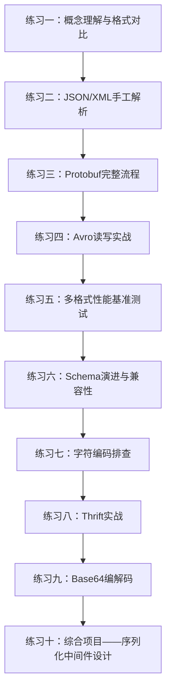
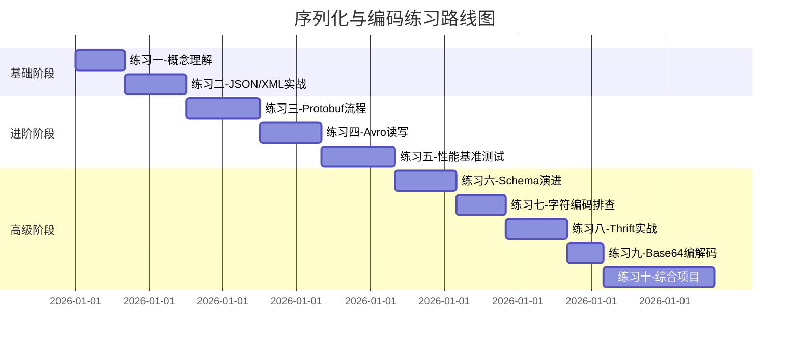

## 练习方法

序列化与编码的知识体系庞大，仅靠阅读理论难以建立真正的工程直觉。本章提供从基础到进阶的系统性练习，覆盖 JSON/XML 解析、Protocol Buffers、Avro/MessagePack、Thrift、字符编码与 Base64、Schema 演进、性能对比等核心知识点。每个练习都设计了明确的目标、可执行的步骤和验证标准。

### 练习方法论

在开始练习之前，建议遵循以下方法论，确保学习效率最大化：

**刻意练习原则**：不要只是复制粘贴代码，而是先思考"这段代码为什么这样写"，再动手验证。每完成一个练习，在笔记中用自己的话总结核心收获，这比多做两遍练习更有效。

**渐进式挑战**：8 个练习按难度递进排列。基础阶段（练习一至二）建立直觉认知和手工操作能力；进阶阶段（练习三至五）掌握工业级工具链；高级阶段（练习六至八）培养架构思维和工程判断力。建议按顺序完成，不建议跳过基础直接挑战高级练习。

**时间管理**：每个练习标注了预计时长。如果某个练习超过预计时长的 1.5 倍仍未完成，建议先记录当前进度和卡点，继续下一个练习，稍后回来攻克。学习过程中遇到的阻碍本身就是宝贵的学习素材。

**验证驱动**：每个练习都配有"检查标准"，这是你的验收条件。如果无法满足检查标准中的任意一条，说明对应的知识点需要回顾。建议对照检查标准逐项自测，不要凭感觉判断"应该没问题"。



### 环境准备

在开始练习前，请确保你的开发环境满足以下要求。提前准备好环境可以避免练习过程中因环境问题中断思路。

**系统要求**：

| 依赖项 | 最低版本 | 安装命令 | 用途 |
|--------|----------|----------|------|
| Python | 3.8+ | `python3 --version` | 所有练习的主力语言 |
| pip | 对应版本 | `pip install --upgrade pip` | 包管理 |
| protoc | 3.0+（推荐 27.x） | 见练习三 | Protobuf 编译 |
| C/C++ 编译器 | GCC 7+ / Clang 5+ | `gcc --version` | Protobuf/Thrift 编译 |

**Python 依赖一键安装**：

```bash
# 安装所有练习需要的 Python 包
pip install protobuf fastavro msgpack chardet thrift lxml
```

> **提示**：如果使用 virtualenv，建议创建一个专用的虚拟环境：
> ```bash
> python3 -m venv ~/ser-practice
> source ~/ser-practice/bin/activate
> pip install protobuf fastavro msgpack chardet thrift lxml
> ```

**可选工具**：

```bash
# Protobuf 编译器（练习三需要）
# Ubuntu/Debian
sudo apt-get install -y protobuf-compiler

# 或从 GitHub 下载最新版
PB_VER="27.3"
curl -LO "https://github.com/protocolbuffers/protobuf/releases/download/v${PB_VER}/protoc-${PB_VER}-linux-x86_64.zip"
unzip "protoc-${PB_VER}-linux-x86_64.zip" -d /usr/local

# Thrift 编译器（练习八需要）
# Ubuntu/Debian
sudo apt-get install -y thrift-compiler

# 验证所有工具
protoc --version
thrift --version
python3 --version
```

**环境验证脚本**：将以下代码保存为 `check_env.py` 并运行，确认所有依赖已就绪：

```python
#!/usr/bin/env python3
"""环境验证脚本——确认所有练习依赖已安装"""
import sys

checks = [
    ("json",        "import json"),
    ("msgpack",     "import msgpack"),
    ("fastavro",    "import fastavro"),
    ("protobuf",    "import google.protobuf"),
    ("lxml",        "import lxml"),
    ("chardet",     "import chardet"),
]

print(f"Python {sys.version}\n")
all_ok = True
for name, stmt in checks:
    try:
        exec(stmt)
        mod = sys.modules[name]
        ver = getattr(mod, "__version__", "OK")
        print(f"  ✓ {name:14} {ver}")
    except ImportError:
        print(f"  ✗ {name:14} 未安装")
        all_ok = False

if all_ok:
    print("\n所有依赖已就绪，可以开始练习！")
else:
    print("\n有依赖缺失，请先安装后再开始练习。")
```

---

### 练习一：序列化格式概念理解与对比（预计40分钟）

**目标**：深入理解 JSON、XML、Protobuf、Avro、MessagePack 五种格式的编码原理和适用场景，能够根据业务需求做出合理的技术选型。

**为什么重要**：在实际项目中，序列化格式的选择直接影响系统性能、可维护性和团队协作效率。选错格式的代价往往是后期重构——例如在微服务架构中从 JSON 迁移到 Protobuf，需要同时修改所有服务的序列化层。在动手之前建立正确的认知，可以避免这些昂贵的弯路。

**步骤**：

1. **手动编码实验（15分钟）**

   给定一个用户对象 `{"name": "张三", "age": 28, "email": "zhangsan@example.com", "tags": ["dev", "senior"]}`，分别用手算方式推导其在各格式下的字节序列：

   ```python
   import json, time

   # 1. JSON —— 文本人类可读格式
   user = {"name": "张三", "age": 28, "email": "zhangsan@example.com", "tags": ["dev", "senior"]}
   json_bytes = json.dumps(user, ensure_ascii=False).encode("utf-8")
   print(f"JSON:  {len(json_bytes)} bytes -> {json_bytes}")

   # 2. MessagePack —— 二进制"JSON"
   import msgpack
   mp_bytes = msgpack.packb(user, use_bin_type=True)
   print(f"MsgPack: {len(mp_bytes)} bytes (节省 {100 - len(mp_bytes)*100//len(json_bytes)}%)")

   # 3. 对比：XML 通常比 JSON 大30%-80%（标签开销）
   # 4. 对比：Protobuf 需要 .proto 定义，编译后极度紧凑
   # 5. 对比：Avro 需要 Schema，支持容器文件格式
   ```

   预期输出示例：
   JSON:  113 bytes -> {"name": "张三", "age": 28, "email": "zhangsan@example.com", "tags": ["dev", "senior"]}
   MsgPack: 87 bytes (节省 22%)

   **思考题**：MessagePack 比 JSON 小 22%，但这个优势在什么数据规模下会放大？提示：考虑字段名的重复出现——当数据中有 1000 条相同结构的记录时，JSON 需要重复存储 1000 次字段名，而 MessagePack 在批量编码时可以利用结构相似性进一步压缩。

2. **字节级分析（10分钟）**

   使用 `xxd` 或 Python 逐字节分析每种格式的编码结构：

   ```bash
   # 生成各格式的二进制文件
   python3 -c "
   import json, msgpack
   user = {'name': '张三', 'age': 28, 'email': 'zhangsan@example.com', 'tags': ['dev', 'senior']}
   with open('/tmp/user.json', 'wb') as f:
       f.write(json.dumps(user, ensure_ascii=False).encode('utf-8'))
   with open('/tmp/user.msgpack', 'wb') as f:
       f.write(msgpack.packb(user, use_bin_type=True))
   "

   # 逐字节查看编码结构
   xxd /tmp/user.json | head -20    # 观察文本中的键名、引号、逗号等冗余字符
   xxd /tmp/user.msgpack | head -20  # 观察紧凑的二进制编码
   ```

   **观察要点**：在 JSON 的 hex dump 中，你会看到 `7b`（`{`）、`22`（`"`）、`3a`（`:`）、`2c`（`,`）等 ASCII 控制字符大量出现——这些是人类可读性的代价。而在 MessagePack 中，字段名只出现一次（通过映射格式编码），数字直接以二进制存储，没有引号和逗号的开销。

3. **整理对比表（15分钟）**

   填写下表，将你的发现整理成系统化的认知：

   | 维度 | JSON | XML | Protobuf | Avro | MessagePack |
   |------|------|-----|----------|------|-------------|
   | 编码方式 | 文本(UTF-8) | 文本(UTF-8) | 二进制 | 二进制 | 二进制 |
   | 是否需要Schema | 否 | 否(DTD可选) | 是(.proto) | 是(.avsc) | 否 |
   | 人类可读性 | 高 | 中 | 低 | 低 | 低 |
   | 典型体积(相对) | 基准 | 1.3x-1.8x | 0.1x-0.3x | 0.2x-0.4x | 0.4x-0.7x |
   | 序列化速度 | 中 | 慢 | 快 | 快 | 快 |
   | 反序列化速度 | 中 | 慢 | 极快 | 快 | 快 |
   | 跨语言支持 | 全语言 | 全语言 | C++/Java/Python/Go等 | 同Protobuf | 全语言 |
   | 前后向兼容 | 靠约定 | 靠约定 | 原生支持 | 原生支持 | 靠约定 |
   | 适用场景 | REST API/配置 | 企业SOAP/文档 | RPC/微服务 | 大数据/Hadoop | 高性能缓存 |

**常见误区**：
- **误区一**："二进制格式一定比文本格式好"。实际上，对于小数据量（<1KB）和调试频繁的场景，JSON 的可读性和零依赖优势使其成为更好的选择。二进制格式的优势在数据量增大时才显著体现。
- **误区二**："Protobuf 比 JSON 快所以所有场景都该用 Protobuf"。Protobuf 的优势建立在 Schema 编译的基础上——如果业务频繁变更数据结构，Schema 的维护成本可能超过性能收益。

**检查标准**：
- [ ] 能说出每种格式的编码原理（文本 vs 二进制，有Schema vs 无Schema）
- [ ] 能解释 Protobuf 为什么比 JSON 小 5-10 倍（省略字段名、Varint编码）
- [ ] 能根据场景（如移动端低带宽 vs 内部调试）选择合适的格式
- [ ] 能指出 MessagePack 和 Protobuf 在"无需 Schema"和"极致紧凑"之间的定位差异

---

### 练习二：JSON与XML手工解析实战（预计50分钟）

**目标**：掌握 JSON 和 XML 的解析、构造和异常处理，理解两种格式的设计哲学差异，能够在实际项目中编写健壮的解析代码。

**为什么重要**：JSON 和 XML 是最常用的两种数据交换格式。即使你的项目主要使用 Protobuf，仍然会在配置文件、REST API 响应、日志等场景中大量接触 JSON 和 XML。掌握它们的解析技巧是每个开发者的基本功。

**步骤**：

1. **Python JSON完整解析（15分钟）**

   ```python
   import json
   from json import JSONDecodeError

   # ---- 构造复杂嵌套JSON ----
   data = {
       "users": [
           {"id": 1, "name": "Alice", "scores": [95, 87, 92], "active": True},
           {"id": 2, "name": "Bob",   "scores": [78, 85],      "active": False},
       ],
       "metadata": {"version": "1.0", "count": 2}
   }

   # 序列化：带缩进的格式化输出
   json_str = json.dumps(data, indent=2, ensure_ascii=False, sort_keys=True)
   print("序列化结果：")
   print(json_str)

   # 反序列化：安全解析（防御畸形输入）
   try:
       parsed = json.loads(json_str)
       assert parsed["metadata"]["count"] == len(parsed["users"])
       print("反序列化成功，数据校验通过")
   except JSONDecodeError as e:
       print(f"JSON解析失败: {e}")
   except (KeyError, TypeError) as e:
       print(f"数据结构异常: {e}")

   # ---- 自定义编解码器：处理特殊类型 ----
   class UserEncoder(json.JSONEncoder):
       def default(self, obj):
           if isinstance(obj, set):
               return {"__type__": "set", "values": list(obj)}
           if hasattr(obj, "__dict__"):
               return obj.__dict__
           return super().default(obj)

   def as_set(dct):
       if "__type__" in dct and dct["__type__"] == "set":
           return set(dct["values"])
       return dct

   original = {"tags": {"python", "golang", "rust"}}
   encoded = json.dumps(original, cls=UserEncoder)
   decoded = json.loads(encoded, object_hook=as_set)
   print(f"自定义编解码: {original['tags']} -> {encoded} -> {decoded['tags']}")
   ```

   **关键知识点**：
   - `ensure_ascii=False` 允许直接输出中文字符，而不是 `\uXXXX` 转义序列。在生产环境中，如果 API 响应面向前端，建议保持 `True`（默认值）以避免编码兼容性问题。
   - `json.JSONEncoder` 的 `default` 方法处理的是 Python 类型到 JSON 类型的映射。当 `json.dumps` 遇到无法序列化的类型（如 `set`、`datetime`、自定义对象）时，会调用 `default` 方法。
   - `object_hook` 在反序列化时对每个 JSON 对象调用，可以实现类型还原。注意它与 `object_pairs_hook`（保留键顺序）的区别。

2. **Python XML完整解析（15分钟）**

   ```python
   import xml.etree.ElementTree as ET
   from io import StringIO

   # 构造XML
   xml_str = """<?xml version="1.0" encoding="UTF-8"?>
   <catalog>
       <book id="1">
           <title>深入理解计算机系统</title>
           <author>Randal E. Bryant</author>
           <price currency="CNY">139.00</price>
       </book>
       <book id="2">
           <title>设计模式</title>
           <author>Erich Gamma</author>
           <price currency="CNY">69.00</price>
       </book>
   </catalog>"""

   # 解析XML
   root = ET.fromstring(xml_str)
   books = []
   for book in root.findall("book"):
       books.append({
           "id": book.get("id"),                    # 属性用 .get()
           "title": book.find("title").text,         # 子元素用 .find()
           "author": book.find("author").text,
           "price": float(book.find("price").text),
           "currency": book.find("price").get("currency")
       })

   for b in books:
       print(f"[{b['id']}] {b['title']} - {b['author']} ({b['currency']}{b['price']})")

   # 构造XML（反向操作）
   catalog = ET.Element("catalog")
   for i, b in enumerate(books, 1):
       book_el = ET.SubElement(catalog, "book", id=str(i))
       ET.SubElement(book_el, "title").text = b["title"]
       ET.SubElement(book_el, "author").text = b["author"]
       ET.SubElement(book_el, "price", currency=b["currency"]).text = str(b["price"])

   ET.indent(catalog, space="  ")
   print(ET.tostring(catalog, encoding="unicode", xml_declaration=True))
   ```

   **关键知识点**：
   - ElementTree 的 `findall` 支持 XPath 子集语法，如 `root.findall(".//book[@id='1']")` 可以递归查找。
   - XML 属性（attribute）和子元素（element）的取舍：属性适合存储元数据（如 ID、类型），子元素适合存储内容性数据（如标题、正文）。混用会导致解析逻辑复杂化。
   - `ET.indent` 是 Python 3.9+ 的功能。如果你使用更早版本，可以用 `minidom` 的 `toprettyxml` 替代。

3. **JSON vs XML设计哲学对比总结（20分钟）**

   用自己的话回答以下问题并记录在笔记中：

   - JSON 没有属性(attribute)的概念，XML 有——这对数据建模有什么影响？
     > **参考回答**：XML 的属性和子元素提供了两种表达维度，可以在同一层级同时携带元数据和内容。JSON 将所有信息平铺为键值对，结构更扁平但表达力受限。例如 `<book id="1" lang="zh">` 中 `id` 和 `lang` 是元信息，`book` 的内容是数据——在 JSON 中它们处于同一层级，无法区分语义角色。

   - JSON 天然支持数组，XML 需要约定子元素结构——在什么场景下 XML 更合适？
     > **参考回答**：当数据具有复杂的层次结构和混合内容时（如文档格式、配置规范），XML 更合适。例如 XHTML 中的 `<p>Hello <b>world</b></p>` 是文本和标签的混合，JSON 无法自然表达这种结构。此外，XML 的命名空间机制适合多来源数据融合的场景。

   - JSON 解析速度通常比 XML 快 3-5 倍，根本原因是什么？
     > **参考回答**：JSON 的语法极其简洁——只需要处理 `{}[]:",` 六种符号。XML 需要解析起始标签、结束标签、自闭合标签、属性、命名空间、CDATA、注释、DTD 声明等大量语法元素。此外，XML 解析器通常构建完整的 DOM 树（内存开销大），而 JSON 解析器可以直接映射到语言原生数据结构。

   - JSON 的 `null` 和 XML 的"元素不存在"有什么语义差异？
     > **参考回答**：`null` 是一个明确的值，表示"这个字段存在但值为空"。XML 中元素不存在则完全没有这个信息。这个差异在 API 设计中至关重要——`{"email": null}` 表示用户没有邮箱，而 XML 中缺少 `<email>` 标签可能表示用户没有填写，也可能表示数据传输丢失。明确的 null 语义有助于区分这两种情况。

**常见误区**：
- **误区一**："JSON 是 XML 的替代品"。实际上两者设计目标不同——JSON 面向数据交换，XML 面向文档和配置。在需要 schema 验证（XSD）、转换（XSLT）、查询（XPath/XQuery）的场景中，XML 仍然不可替代。
- **误区二**："用正则表达式解析 JSON/XML"。正则表达式无法正确处理嵌套结构和转义字符，必须使用专用解析器。这是生产环境中的严重安全隐患——恶意构造的输入可以绕过正则匹配导致注入攻击。

**检查标准**：
- [ ] 能独立编写 JSON 的自定义编解码器
- [ ] 能用 ElementTree 完成 XML 的增删改查
- [ ] 能解释 JSON 和 XML 在设计哲学上的 3 个核心差异
- [ ] 代码能正常运行且输出符合预期

---

### 练习三：Protocol Buffers完整流程（预计60分钟）

**目标**：从定义 `.proto` 文件到生成代码、序列化、反序列化、调试，完整走通 Protobuf 开发流程，理解其编解码原理。

**为什么重要**：Protobuf 是 Google 开源的二进制序列化协议，广泛应用于 gRPC、Kafka、BigQuery 等基础设施。它通过 Schema 编译实现极致的序列化性能，是微服务间 RPC 通信的首选方案。掌握 Protobuf 不仅是技能要求，更是理解现代分布式系统数据交换的基础。

**步骤**：

1. **安装工具链（10分钟）**

   ```bash
   # 安装 protoc 编译器
   # Ubuntu/Debian
   sudo apt-get update &amp;&amp; sudo apt-get install -y protobuf-compiler

   # 或者从 GitHub 下载最新版
   PB_VER="27.3"
   curl -LO "https://github.com/protocolbuffers/protobuf/releases/download/v${PB_VER}/protoc-${PB_VER}-linux-x86_64.zip"
   unzip "protoc-${PB_VER}-linux-x86_64.zip" -d /usr/local

   # 验证安装
   protoc --version
   # 输出: libprotoc 27.3

   # 安装 Python 生成代码的运行时
   pip install protobuf
   ```

2. **定义Proto文件并编译（10分钟）**

   ```protobuf
   // user.proto —— 定义用户消息格式
   syntax = "proto3";
   package example;
   option python_package = "generated";

   message User {
       int32  id       = 1;   // 字段编号(1-15占1字节，16-2047占2字节)
       string name     = 2;
       string email    = 3;
       int32  age      = 4;
       repeated string tags = 5;  // repeated = 列表

       enum Status {
           UNKNOWN  = 0;
           ACTIVE   = 1;
           INACTIVE = 2;
       }
       Status status = 6;
   }

   message UserBatch {
       repeated User users = 1;
   }
   ```

   ```bash
   # 生成Python代码
   mkdir -p generated
   protoc --python_out=. user.proto

   # 生成Go代码（可选）
   # protoc --go_out=. --go_opt=paths=source_relative user.proto

   # 生成Java代码（可选）
   # protoc --java_out=. user.proto

   ls generated/
   # 输出: __init__.py  user_pb2.py  user_pb2.pyi(类型提示)
   ```

   **字段编号的设计考量**：Protobuf 的字段编号（field number）是其前向/后向兼容性的基石。编号 1-15 只需 1 字节编码（包含字段编号和 wire type），编号 16-2047 需要 2 字节。因此，高频使用的字段应分配小编号。字段编号一旦确定就**不能更改**——它是二进制数据中识别字段的唯一标识。

3. **序列化与反序列化（15分钟）**

   ```python
   import sys
   sys.path.insert(0, ".")
   from generated import user_pb2

   # 创建用户对象
   user = user_pb2.User()
   user.id = 1001
   user.name = "张三"
   user.email = "zhangsan@example.com"
   user.age = 28
   user.tags.extend(["python", "protobuf", "distributed"])
   user.status = user_pb2.User.ACTIVE

   # 序列化为二进制
   binary_data = user.SerializeToString()
   print(f"Protobuf 编码大小: {len(binary_data)} bytes")

   # 等效JSON的大小（对比）
   import json
   json_data = json.dumps({
       "id": 1001, "name": "张三", "email": "zhangsan@example.com",
       "age": 28, "tags": ["python", "protobuf", "distributed"],
       "status": "ACTIVE"
   }).encode("utf-8")
   print(f"JSON 编码大小:     {len(json_data)} bytes")
   print(f"Protobuf 比 JSON 小: {100 - len(binary_data)*100//len(json_data)}%")

   # 反序列化
   user2 = user_pb2.User()
   user2.ParseFromString(binary_data)
   assert user2.name == "张三"
   assert list(user2.tags) == ["python", "protobuf", "distributed"]
   assert user2.status == user_pb2.User.ACTIVE
   print("反序列化验证通过")

   # 批量处理
   batch = user_pb2.UserBatch()
   for i in range(1000):
       u = batch.users.add()
       u.id = i
       u.name = f"user_{i}"
       u.age = 20 + (i % 40)
       u.status = user_pb2.User.ACTIVE if i % 3 != 0 else user_pb2.User.INACTIVE

   batch_bytes = batch.SerializeToString()
   print(f"\n1000条用户 Protobuf: {len(batch_bytes)} bytes ({len(batch_bytes)//1024} KB)")
   print(f"平均每条: {len(batch_bytes)//1000} bytes")
   ```

   **预期输出**：
   Protobuf 编码大小: 72 bytes
   JSON 编码大小:     139 bytes
   Protobuf 比 JSON 小: 48%
   反序列化验证通过

   1000条用户 Protobuf: 41234 bytes (40 KB)
   平均每条: 41 bytes

4. **二进制结构分析（15分钟）**

   ```python
   # 深入分析Protobuf的编码结构
   def analyze_varint(data, offset):
       """解析Varint编码，返回值和下一个偏移量"""
       result = 0
       shift = 0
       while offset < len(data):
           byte = data[offset]
           result |= (byte &amp; 0x7F) << shift
           offset += 1
           if (byte &amp; 0x80) == 0:
               break
           shift += 7
       return result, offset

   def decode_protobuf_bytes(data):
       """解析Protobuf二进制数据的字段结构"""
       offset = 0
       fields = []
       while offset < len(data):
           tag, offset = analyze_varint(data, offset)
           field_number = tag >> 3
           wire_type = tag &amp; 0x07

           if wire_type == 0:  # Varint
               value, offset = analyze_varint(data, offset)
               fields.append((field_number, "varint", value))
           elif wire_type == 2:  # Length-delimited (string, bytes, repeated)
               length, offset = analyze_varint(data, offset)
               value = data[offset:offset+length]
               try:
                   value = value.decode("utf-8")
               except:
                   pass
               offset += length
               fields.append((field_number, "bytes", value))
           else:
               fields.append((field_number, f"wire_{wire_type}", "??"))
               break

       return fields

   fields = decode_protobuf_bytes(binary_data)
   print("Protobuf 二进制结构分析：")
   print(f"{'字段编号':<8} {'编码类型':<16} {'值'}")
   print("-" * 40)
   for fn, wt, val in fields:
       print(f"  {fn:<6}  {wt:<16}  {val}")
   ```

   **Wire Type 速查表**：

   | Wire Type | 含义 | 适用类型 | 编码方式 |
   |-----------|------|----------|----------|
   | 0 | Varint | int32, int64, bool, enum | 变长整数，每字节 7 位数据 |
   | 1 | 64-bit | fixed64, double | 固定 8 字节 |
   | 2 | Length-delimited | string, bytes, 嵌套message, repeated | 前缀长度 + 数据 |
   | 5 | 32-bit | fixed32, float | 固定 4 字节 |

5. **Proto文件编写规范练习（10分钟）**

   自行编写一个 `order.proto`，定义以下消息：
   - `Order`：包含订单ID、用户ID、订单项列表、总金额、下单时间戳
   - `OrderItem`：包含商品ID、商品名、数量、单价
   - 使用 `oneof` 表示支付方式（支付宝/微信/银行卡）
   - 使用 `map` 表示扩展属性

   ```protobuf
   // 参考答案框架
   syntax = "proto3";
   package example;

   message OrderItem {
       int32  product_id   = 1;
       string product_name = 2;
       int32  quantity     = 3;
       double unit_price   = 4;  // 注意：金额用分(int64)更安全
   }

   message Order {
       int64  order_id     = 1;
       int32  user_id      = 2;
       repeated OrderItem items = 3;
       int64  total_cents  = 4;  // 单位：分，避免浮点精度问题
       int64  created_at   = 5;  // Unix时间戳（秒）

       oneof payment_method {
           string alipay_account  = 10;
           string wechat_openid   = 11;
           string bank_card_no    = 12;
       }

       map<string, string> extensions = 20;  // 扩展字段
   }
   ```

   **金额处理的最佳实践**：为什么用 `int64 total_cents` 而不是 `double total_amount`？因为浮点数存在精度问题——`0.1 + 0.2` 在 IEEE 754 中不等于 `0.3`。在金融场景中，使用最小货币单位（分）的整数表示可以彻底避免精度误差。这也是 Stripe、支付宝等支付平台的通用做法。

**常见误区**：
- **误区一**："proto3 中可以用 `has_field()` 判断字段是否被设置"。proto3 中标量类型（int32、string 等）没有 `has_field()`——它们始终有默认值（0、""），无法区分"未设置"和"设置为默认值"。只有 `oneof` 和 `message` 类型支持 `HasField`。
- **误区二**："删除字段就要删除对应的编号"。恰恰相反——删除字段时应保留编号（并用 `reserved` 关键字标记），防止未来有人复用该编号导致数据混淆。

**检查标准**：
- [ ] 能独立安装 protoc 并生成多语言代码
- [ ] 能解释 Varint 编码和 wire type 的含义
- [ ] 能编写符合规范的 proto 文件（包含 oneof、map、enum、repeated）
- [ ] 理解字段编号 1-15 比 16+ 省 1 字节的设计考量
- [ ] 代码输出的体积对比数据合理（Protobuf 通常是 JSON 的 10%-30%）

---

### 练习四：Avro读写实战（预计50分钟）

**目标**：掌握 Avro 的 Schema 定义、容器文件读写、Schema 演化，理解 Avro 在大数据生态中的核心优势。

**为什么重要**：Avro 是 Hadoop 生态和 Kafka Connect 的标准序列化格式。与 Protobuf 不同，Avro 将 Schema 嵌入数据文件中，使得数据文件完全自描述——即使丢失了原始 Schema 定义，也能正确读取数据。这种特性使 Avro 成为数据湖和长期数据存储的首选格式。

**步骤**：

1. **安装与Schema定义（10分钟）**

   ```bash
   # 安装Python Avro库
   pip install fastavro

   # 安装Avro命令行工具（可选，用于Schema验证）
   # 从 https://avro.apache.org/releases/ 下载
   ```

   ```python
   # user_schema.avsc —— Avro Schema定义
   user_schema_json = {
       "type": "record",
       "name": "User",
       "namespace": "com.example",
       "fields": [
           {"name": "id",    "type": "int"},
           {"name": "name",  "type": "string"},
           {"name": "email", "type": ["null", "string"], "default": None},
           {"name": "age",   "type": "int", "default": 0},
           {"name": "tags",  "type": {"type": "array", "items": "string"}, "default": []}
       ]
   }
   ```

   **Schema 设计要点**：
   - Avro 的 union 类型 `["null", "string"]` 表示该字段可以是 null 或 string。`"default": None` 是必须的——它告诉旧版本的 reader 当遇到没有 `email` 字段的数据时，用 null 填充。
   - 数组类型 `{"type": "array", "items": "string"}` 没有固定长度限制，适合存储变长列表。
   - 所有可选字段都必须在 `default` 中指定默认值，否则 Schema 演化时会导致兼容性错误。

2. **写入Avro容器文件（15分钟）**

   ```python
   from fastavro import writer, reader, parse_schema
   import io

   schema = parse_schema(user_schema_json)

   # 写入Avro容器文件（.avro）
   records = [
       {"id": 1, "name": "Alice", "email": "alice@example.com", "age": 30, "tags": ["admin", "dev"]},
       {"id": 2, "name": "Bob",   "email": None,                "age": 25, "tags": []},
       {"id": 3, "name": "Carol", "email": "carol@example.com", "age": 28, "tags": ["dev", "qa"]},
   ]

   with open("/tmp/users.avro", "wb") as out:
       writer(out, schema, records)

   # 读取Avro容器文件
   with open("/tmp/users.avro", "rb") as inp:
       for record in reader(inp):
           print(f"[{record['id']}] {record['name']} - {record.get('email', 'N/A')} "
                 f"(age={record['age']}, tags={record['tags']})")

   # 对比文件大小
   import os, json
   avro_size = os.path.getsize("/tmp/users.avro")
   json_size = len(json.dumps(records, ensure_ascii=False).encode())
   print(f"\nAvro: {avro_size} bytes, JSON: {json_size} bytes")
   print(f"Avro 比 JSON 小: {100 - avro_size*100//json_size}% (含Schema元数据)")
   ```

   **Avro 容器文件结构**：每个 `.avro` 文件由三部分组成：
   - **Magic bytes**：`Obj1`（4 字节），标识这是一个 Avro 对象容器文件
   - **Header**：包含 Schema JSON 和元数据（如 codecs 配置）
   - **Data blocks**：同步标记（16 字节随机 UUID）分隔的数据块，每个块包含一批序列化的记录

   这种自描述结构意味着——即使你丢失了 `.avsc` 文件，只需要从 `.avro` 文件的 header 中提取 Schema 就能正确读取数据。这是 Avro 相比 Protobuf 的核心优势之一。

3. **Schema演化实验（15分钟）**

   ```python
   # V2 Schema：添加新字段 "phone"，带默认值
   schema_v2 = parse_schema({
       "type": "record",
       "name": "User",
       "namespace": "com.example",
       "fields": [
           {"name": "id",    "type": "int"},
           {"name": "name",  "type": "string"},
           {"name": "email", "type": ["null", "string"], "default": None},
           {"name": "age",   "type": "int", "default": 0},
           {"name": "tags",  "type": {"type": "array", "items": "string"}, "default": []},
           {"name": "phone", "type": ["null", "string"], "default": None},  # 新增字段
       ]
   })

   # 用V2 Schema写入（带phone字段）
   records_v2 = [
       {"id": 4, "name": "David", "email": "david@example.com", "age": 32,
        "tags": ["lead"], "phone": "+86-138-0000-1234"},
       {"id": 5, "name": "Eve",   "email": None, "age": 22,
        "tags": [], "phone": None},
   ]

   with open("/tmp/users_v2.avro", "wb") as out:
       writer(out, schema_v2, records_v2)

   # 用V1 Schema读取V2数据（向后兼容：新字段被忽略）
   schema_v1 = parse_schema(user_schema_json)
   print("=== 用V1 Schema读取V2数据（向后兼容测试）===")
   with open("/tmp/users_v2.avro", "rb") as inp:
       for record in reader(inp, reader_schema=schema_v1):
           print(f"  [{record['id']}] {record['name']} — phone字段被忽略")
           assert "phone" not in record  # V1 Schema没有phone字段

   # 用V2 Schema读取V1数据（向前兼容：新字段用默认值）
   print("\n=== 用V2 Schema读取V1数据（向前兼容测试）===")
   with open("/tmp/users.avro", "rb") as inp:
       for record in reader(inp, reader_schema=schema_v2):
           print(f"  [{record['id']}] {record['name']} — phone={record.get('phone', 'N/A')} (默认值填充)")

   print("\nSchema演化兼容性测试通过！")
   ```

   **兼容性机制对比**：Avro 通过 reader/writer Schema 分离实现兼容——writer 用 V2 Schema 写入数据（包含 phone 字段），reader 用 V1 Schema 读取时会自动忽略 phone。Protobuf 则通过字段编号实现兼容——旧代码遇到未识别的字段编号会跳过，新代码遇到缺失的字段会用默认值填充。两者思路不同但目标一致：保证新旧版本可以互相通信。

4. **Avro vs Protobuf兼容性对比（10分钟）**

   思考并记录：
   - Avro 的 Schema 存储在文件头中，Protobuf 的 Schema 由代码生成——这对长期存储有什么影响？
     > **参考回答**：Avro 的自描述特性使其更适合长期数据存储（如数据湖）。即使原始 Schema 定义文件丢失，数据仍然可读。Protobuf 的数据是不自描述的——没有 `.proto` 文件，二进制数据就是一堆无法解读的字节。因此 Protobuf 更适合短期传输（RPC 调用），不适合归档存储。

   - Avro 用 reader/writer Schema 分离实现兼容，Protobuf 用字段编号——哪种方式更灵活？
     > **参考回答**：Avro 的 Schema 分离方式更灵活——可以对同一份数据应用不同的 reader Schema，实现"同一个数据文件，不同业务读到不同字段"。Protobuf 的字段编号方式更紧凑但灵活性较低——字段编号是硬编码的，无法在运行时动态调整。在 Kafka 中，Avro 的这种灵活性使消费者可以独立演进自己的 Schema。

   - 为什么 Hadoop/Kafka 生态偏好 Avro 而不是 Protobuf？
     > **参考回答**：三个原因：（1）Avro 的容器文件格式自描述，适合 HDFS 上的长期存储；（2）Avro 的 Schema 解析机制与 Kafka Connect 的 Schema Registry 天然集成；（3）Avro 的序列化性能在大批量数据场景下优于 Protobuf（因为不需要逐字段赋值，直接按 Schema 顺序编码）。

**常见误区**：
- **误区一**："Avro 的 Schema 演化是万能的"。Avro 只支持字段级别的添加和删除，不支持类型变更（如 `int` → `long`）。类型变更需要使用 Avro 的 promote 规则（如 `int` → `long` 是安全的，但 `long` → `int` 不安全）。
- **误区二**："fastavro 和 python-avro 可以互换"。fastavro 是高性能 C 实现，python-avro 是纯 Python 实现。两者 API 略有差异（如 `parse_schema` 的行为），在项目中应统一使用其中一个。

**检查标准**：
- [ ] 能编写 Avro Schema 并用 fastavro 读写容器文件
- [ ] 能演示 Schema 向前/向后兼容的完整流程
- [ ] 能解释 Avro Schema 演化与 Protobuf 字段编号机制的差异
- [ ] 理解 Avro 的"默认值"在兼容性中的关键作用

---

### 练习五：多格式性能基准测试（预计60分钟）

**目标**：通过科学的基准测试方法，定量比较 JSON、Protobuf、Avro、MessagePack 在序列化速度、反序列化速度和编码体积三个维度上的表现。

**为什么重要**："Protobuf 比 JSON 快"是常识，但快多少？在什么数据规模下优势明显？什么场景下 MessagePack 可能是更好的选择？这些量化判断是架构师的核心能力。本练习将帮助你建立基于数据而非经验的技术决策习惯。

**步骤**：

1. **搭建测试框架（15分钟）**

   ```python
   import json, time, os, statistics
   from dataclasses import dataclass, asdict
   from typing import List

   @dataclass
   class BenchmarkResult:
       format_name: str
       serialize_time_ms: float
       deserialize_time_ms: float
       data_size_bytes: int
       iterations: int

   def generate_test_data(n: int) -> List[dict]:
       """生成n条测试用户数据"""
       return [
           {
               "id": i,
               "name": f"user_{i:06d}",
               "email": f"user{i}@example.com",
               "age": 20 + (i % 50),
               "active": i % 3 != 0,
               "tags": ["tag_a", "tag_b", "tag_c"] if i % 2 == 0 else ["tag_x"],
               "score": round(i * 1.234, 2)
           }
           for i in range(n)
       ]

   def bench(func, data, iterations=1000):
       """通用基准测试函数：返回(平均时间ms, 最后一次结果)"""
       times = []
       result = None
       for _ in range(iterations):
           start = time.perf_counter_ns()
           result = func(data)
           elapsed_ns = time.perf_counter_ns() - start
           times.append(elapsed_ns / 1_000_000)  # 转为毫秒
       return statistics.median(times), result

   # 生成10000条测试数据
   test_data = generate_test_data(10_000)
   print(f"测试数据量: {len(test_data)} 条记录")
   ```

   **测试方法论说明**：
   - 使用 `time.perf_counter_ns()` 而非 `time.time()`，精度更高（纳秒级），避免系统时钟调整的干扰。
   - 使用中位数（`statistics.median`）而非平均数，因为极端值（如 GC 暂停）会严重扭曲平均数。
   - 每种格式运行 1000 次迭代，确保统计结果稳定。Protobuf 由于构造成本较高，迭代 100 次即可。

2. **执行基准测试（25分钟）**

   ```python
   results = []

   # ---- JSON ----
   ser_time, json_bytes = bench(lambda d: json.dumps(d).encode(), test_data)
   de_time, _ = bench(lambda b: json.loads(b), json_bytes)
   results.append(BenchmarkResult("JSON", ser_time, de_time, len(json_bytes), 1000))

   # ---- MessagePack ----
   import msgpack
   ser_time, mp_bytes = bench(lambda d: msgpack.packb(d, use_bin_type=True), test_data)
   de_time, _ = bench(lambda b: msgpack.unpackb(b, raw=False), mp_bytes)
   results.append(BenchmarkResult("MessagePack", ser_time, de_time, len(mp_bytes), 1000))

   # ---- Protobuf ----
   import sys; sys.path.insert(0, ".")
   from generated import user_pb2
   import google.protobuf.json_format as jf

   def proto_ser(data):
       batch = user_pb2.UserBatch()
       for item in data:
           u = batch.users.add()
           u.id = item["id"]
           u.name = item["name"]
           u.email = item["email"]
           u.age = item["age"]
           u.tags.extend(item["tags"])
       return batch.SerializeToString()

   def proto_de(b):
       batch = user_pb2.UserBatch()
       batch.ParseFromString(b)
       return [{"id": u.id, "name": u.name} for u in batch.users]

   ser_time, proto_bytes = bench(proto_ser, test_data, iterations=100)
   de_time, _ = bench(proto_de, proto_bytes, iterations=100)
   results.append(BenchmarkResult("Protobuf", ser_time, de_time, len(proto_bytes), 100))

   # ---- Avro ----
   from fastavro import writer, reader, parse_schema
   import io

   avro_schema = parse_schema({
       "type": "record", "name": "User", "namespace": "bench",
       "fields": [
           {"name": "id", "type": "int"},
           {"name": "name", "type": "string"},
           {"name": "email", "type": "string"},
           {"name": "age", "type": "int"},
           {"name": "active", "type": "boolean"},
           {"name": "tags", "type": {"type": "array", "items": "string"}},
           {"name": "score", "type": "double"},
       ]
   })

   def avro_ser(data):
       buf = io.BytesIO()
       writer(buf, avro_schema, data)
       return buf.getvalue()

   def avro_de(b):
       buf = io.BytesIO(b)
       return list(reader(buf))

   ser_time, avro_bytes = bench(avro_ser, test_data, iterations=100)
   de_time, _ = bench(avro_de, avro_bytes, iterations=100)
   results.append(BenchmarkResult("Avro", ser_time, de_time, len(avro_bytes), 100))

   # ---- 输出结果 ----
   print("\n" + "=" * 80)
   print(f"{'格式':<16} {'序列化(ms)':<14} {'反序列化(ms)':<16} {'体积(bytes)':<16} {'压缩率':<10}")
   print("=" * 80)
   json_size = results[0].data_size_bytes  # 基准
   for r in results:
       ratio = f"{r.data_size_bytes * 100 // json_size}%"
       print(f"{r.format_name:<16} {r.serialize_time_ms:<14.2f} {r.deserialize_time_ms:<16.2f} "
             f"{r.data_size_bytes:<16,} {ratio:<10}")
   print("=" * 80)
   ```

   **预期结果参考**（因硬件而异，量级关系应一致）：

   | 格式 | 序列化(ms) | 反序列化(ms) | 体积(bytes) | 相对JSON体积 |
   |------|-----------|-------------|------------|-------------|
   | JSON | ~15-25 | ~10-20 | ~1,200,000 | 100% |
   | MessagePack | ~5-8 | ~4-7 | ~600,000-750,000 | 50%-63% |
   | Protobuf | ~20-40 | ~3-5 | ~180,000-250,000 | 15%-21% |
   | Avro | ~10-18 | ~8-15 | ~250,000-350,000 | 21%-29% |

   **关键观察**：
   - Protobuf 的反序列化速度最快（通常比 JSON 快 3-5 倍），因为它直接按字段编号跳到目标位置，不需要像 JSON 那样逐字符扫描键名。
   - Protobuf 的序列化速度可能不如预期快，因为 Python 的 Protobuf 绑定需要逐字段赋值（`u.name = item["name"]`），这是 Python 层面的开销。在 C++/Go 中，Protobuf 的序列化速度通常比 JSON 快 10 倍以上。
   - Avro 的体积通常介于 Protobuf 和 MessagePack 之间，因为它需要在文件头嵌入 Schema。

3. **不同数据规模的扩展测试（10分钟）**

   ```python
   sizes = [100, 1_000, 10_000, 100_000]
   print(f"\n{'数据量':<12} {'JSON(KB)':<12} {'Protobuf(KB)':<14} {'MsgPack(KB)':<14} {'Protobuf/JSON比':<16}")
   print("-" * 68)

   for n in sizes:
       data = generate_test_data(n)
       js = len(json.dumps(data).encode())
       pb = proto_ser(data)
       mp = msgpack.packb(data, use_bin_type=True)
       print(f"{n:<12,} {js/1024:<12.1f} {len(pb)/1024:<14.1f} {len(mp)/1024:<14.1f} {len(pb)*100//js:<15}%")
   ```

4. **结果分析与总结（10分钟）**

   用自己的话回答：
   - 在什么数据规模下 Protobuf 的优势最明显？为什么？
     > **参考回答**：数据量越大，Protobuf 的体积优势越明显。在 100 条记录时，Protobuf 可能只比 MessagePack 小 20%；但在 10 万条记录时，这个差距可能扩大到 50% 以上。原因是 Protobuf 省略了所有字段名（10 万条记录省去 10 万次重复的字段名存储），而 MessagePack 虽然比 JSON 紧凑，但字段名仍有开销。

   - MessagePack 的"中间路线"在什么场景下是最佳选择？
     > **参考回答**：当团队不想引入 Schema 管理流程，但又需要比 JSON 更好的性能时，MessagePack 是最佳折中。典型场景包括：Redis 缓存层的序列化（需要 Schema-free + 高性能）、客户端与服务端的非 RPC 通信（如游戏状态同步）、日志聚合管道（结构化日志的紧凑存储）。

   - 序列化速度和反序列化速度哪个更重要？
     > **参考回答**：取决于访问模式。在"一次写入、多次读取"的场景（如消息队列、日志存储），反序列化速度更重要。在"频繁写入、偶尔读取"的场景（如实时数据采集），序列化速度更重要。在 RPC 调用中，两端各有读写，两者都很重要。

   - 网络传输 vs 磁盘存储，对格式选择有什么不同考量？
     > **参考回答**：网络传输更关注序列化/反序列化速度（因为每次请求都要编解码）和体积（因为带宽有限）。磁盘存储更关注体积（因为存储成本随数据量增长）和压缩兼容性（Avro 的容器格式支持 Snappy/zstd 压缩，可以直接在文件层面压缩）。此外，磁盘存储还需要考虑 Schema 演化——长期存储的数据需要支持 Schema 变更。

**常见误区**：
- **误区一**："基准测试结果可以直接套用到生产环境"。基准测试是在理想条件下进行的（纯 CPU 密集、无 I/O、无并发竞争）。生产环境中的性能还受 GC 暂停、网络延迟、磁盘 I/O、序列化库版本等因素影响。基准测试的价值在于建立量级认知，而非精确预测。
- **误区二**："只测试序列化速度就够了"。实际上，在微服务架构中，反序列化（读取）的频率通常远高于序列化（写入）——一次写入的消息会被多个消费者读取。因此反序列化速度往往是性能瓶颈。

**检查标准**：
- [ ] 完成至少 4 种格式（JSON、Protobuf、MessagePack、Avro）的定量基准测试
- [ ] 测试结果符合业界认知（Protobuf 体积最小，JSON 最慢，MessagePack 居中）
- [ ] 能解释不同数据规模下性能差异的原因
- [ ] 能根据测试结果给出格式选型建议

---

### 练习六：Schema演进与兼容性（预计50分钟）

**目标**：掌握 Schema 演进的黄金规则（添加带默认值的字段、不删除旧字段、不改变字段编号），能够在真实项目中安全地进行 Schema 变更。

**为什么重要**：Schema 演进是分布式系统中最容易出错的环节之一。一个错误的字段编号变更可能导致生产环境的数据解析错误，进而引发业务逻辑故障。Google、Meta 等公司在 Protobuf 的 Schema 演进上都有严格的内部规范——违反规范的代码不允许合入主分支。

**步骤**：

1. **Protobuf兼容性实验（20分钟）**

   ```protobuf
   // V1 —— 原始版本
   syntax = "proto3";
   message MessageV1 {
       int32 id   = 1;
       string name = 2;
   }

   // V2 —— 安全演进：添加新字段
   message MessageV2 {
       int32 id    = 1;
       string name = 2;
       string email = 3;  // 新字段，proto3中默认值为""
   }

   // V3 —— 破坏性变更（反面教材！）
   // message MessageV3 {
   //     int32 id     = 1;
   //     string email = 2;  // 错误！把name的编号2给了email
   //     string name  = 3;  // 旧数据的name会解析到email字段！
   // }
   ```

   用 Python 验证兼容性行为：

   ```python
   import sys; sys.path.insert(0, ".")
   from generated import user_pb2

   # 场景1：V1数据 -> V2代码读取（新字段用默认值）
   v1 = user_pb2.User()
   v1.id = 1
   v1.name = "test_user"
   # 不设置email
   v1_data = v1.SerializeToString()

   # 用"假设的V2"读取（实际用同一个message，手动模拟）
   v2 = user_pb2.User()
   v2.ParseFromString(v1_data)
   print(f"未设置的email字段默认值: '{v2.email}'")  # 输出: ''
   print(f"未设置的age字段默认值: {v2.age}")          # 输出: 0
   print(f"未设置的tags字段默认值: {list(v2.tags)}")   # 输出: []
   print("向后兼容：新代码读旧数据 ✓")

   # 场景2：HasField检查（proto3中只对oneof和message类型有效）
   v2_test = user_pb2.User()
   v2_test.ParseFromString(v1_data)
   # proto3中 int32/string 等标量类型没有 has_field
   # 但默认值检查仍然可靠：
   has_email = bool(v2_test.email)  # 空字符串为False
   has_tags = bool(v2_test.tags)    # 空列表为False
   print(f"email有值: {has_email}, tags有值: {has_tags}")
   ```

   **reserved 关键字的最佳实践**：删除字段后，应该用 `reserved` 关键字标记已废弃的编号和名称，防止未来有人意外复用：

   ```protobuf
   message User {
       reserved 3, 5, 15;           // 保留已删除字段的编号
       reserved "middle_name", "fax"; // 保留已删除字段的名称
       int32 id   = 1;
       string name = 2;
       // string fax = 3;            // 已删除，编号被reserved保护
   }
   ```

2. **Schema演进检查清单（15分钟）**

   对照下表检查你设计的每一次 Schema 变更：

   | 变更操作 | Protobuf | Avro | 安全等级 |
   |----------|----------|------|----------|
   | 添加带默认值的新字段 | 安全 | 安全 | ✅ 推荐 |
   | 添加不带默认值的字段 | 危险(proto3标量永远有默认值) | 不安全(旧reader会报错) | ⚠️ 谨慎 |
   | 删除字段(保留编号) | 安全 | 安全(不要求字段存在) | ✅ 推荐 |
   | 修改字段编号 | **破坏性** | 不适用(Avro按名匹配) | ❌ 禁止 |
   | 重命名字段 | 不安全(编号不变但语义变) | 需要aliases | ⚠️ 谨慎 |
   | 修改字段类型 | 大多数不兼容 | 严格检查类型 | ❌ 禁止 |
   | 将required改为optional | 安全 | 安全 | ✅ 推荐 |

   **Protobuf 类型兼容性速查**：

   | 从类型 | 到类型 | 是否兼容 | 说明 |
   |--------|--------|----------|------|
   | int32 | int64 | ✅ 兼容 | 向上扩展，无精度损失 |
   | int64 | int32 | ❌ 不兼容 | 可能截断数据 |
   | string | bytes | ❌ 不兼容 | 编码方式不同 |
   | bytes | string | ❌ 不兼容 | 可能包含非 UTF-8 数据 |
   | bool | int32 | ❌ 不兼容 | 语义不同 |
   | double | float | ⚠️ 危险 | 精度损失 |
   | repeated | repeated | ✅ 兼容 | 列表语义不变 |
   | enum | int32 | ✅ 兼容 | enum 在 wire format 中就是 int |

3. **反面案例分析（15分钟）**

   阅读以下真实事故案例，分析问题根因并写出修复方案：

   **案例：字段编号误用**
   ```protobuf
   // V1
   message Order {
       int64 order_id = 1;
       string status  = 2;  // "pending"/"paid"/"shipped"
   }

   // V2 (错误做法)
   message Order {
       int64  order_id = 1;
       string user_note = 2;  // 灾难！把status的编号给了user_note
       string status    = 3;  // 旧数据的status(如"paid")会被解析到user_note字段
   }
   ```

   **问题分析**：
   - V1 数据 `"paid"` 通过编号 2 存储
   - V2 代码读取编号 2 时，会把 `"paid"` 赋值给 `user_note`
   - 用户备注显示 `"paid"`，而 `status` 字段拿到默认空字符串
   - 订单状态丢失，可能导致重复发货、财务对账错误

   **影响评估**：假设该系统每天处理 10 万笔订单，在 V1→V2 部署后的 1 小时内，所有新写的订单数据都会出现状态错乱。如果缺少数据校验层，这个错误可能直到用户投诉或财务对账时才被发现。

   **正确做法**：
   ```protobuf
   // V2 (正确做法)
   message Order {
       int64  order_id = 1;
       string status   = 2;  // 保持编号不变！
       string user_note = 3;  // 新字段用新编号
   }
   ```

**常见误区**：
- **误区一**："proto3 有默认值，所以不需要写 default"。proto3 确实自动为标量类型提供默认值（0、""、false），但这只解决了"缺失字段"的问题。对于 enum 类型，默认值必须是 0——如果 enum 的第一个值不是 0，旧代码读取新数据时可能得到意外的枚举值。
- **误区二**："Avro 删除字段比 Protobuf 更安全"。两者都安全（都不要求字段必须存在），但 Avro 需要确保删除的字段有 `default` 值定义。如果 Schema 中某个字段没有 `default` 且是 required 的，删除它会导致旧 reader 报错。

**检查标准**：
- [ ] 能列举 Protobuf Schema 演进的 3 条铁律（不改编号、不改类型、添加字段带默认值）
- [ ] 能区分 Avro 和 Protobuf 在 Schema 兼容性检查上的差异
- [ ] 能识别并修复一个错误的 Schema 变更
- [ ] 能写出自己项目的 Schema 演进检查清单

---

### 练习七：字符编码排查实战（预计40分钟）

**目标**：掌握 UTF-8、GBK、ISO-8859-1 等字符编码的原理和常见问题排查，能够在实际项目中预防和解决乱码问题。

**为什么重要**：字符编码问题是后端开发中最常见、最隐蔽的 bug 来源之一。一个编码处理不当的接口可能在本地测试时正常（开发机是 UTF-8），但在生产环境出错（数据库或中间件使用 GBK）。理解编码原理是排查此类问题的基础。

**步骤**：

1. **编码原理实验（15分钟）**

   ```python
   # ---- UTF-8变长编码分析 ----
   chars = {
       "A":   "ASCII (1字节)",
       "é":   "拉丁扩展 (2字节)",
       "中":  "CJK汉字 (3字节)",
       "😀":  "Emoji (4字节)",
   }

   print("字符 | Unicode码点 | UTF-8字节 | 编码原理")
   print("-" * 60)
   for char, desc in chars.items():
       utf8_bytes = char.encode("utf-8")
       codepoint = f"U+{ord(char):04X}"
       hex_repr = " ".join(f"{b:02X}" for b in utf8_bytes)
       print(f" {char:<4} | {codepoint:<12} | {hex_repr:<20} | {desc}")
       print(f"       |              | {utf8_bytes.hex():<20} |")

   # ---- 变长编码规则推导 ----
   print("\nUTF-8编码规则：")
   print("  1字节: 0xxxxxxx                          (ASCII, 0x00-0x7F)")
   print("  2字节: 110xxxxx 10xxxxxx                  (0x80-0x7FF)")
   print("  3字节: 1110xxxx 10xxxxxx 10xxxxxx         (0x800-0xFFFF)")
   print("  4字节: 11110xxx 10xxxxxx 10xxxxxx 10xxxxxx (0x10000-0x10FFFF)")

   # 验证"中"字的编码
   zhong = "中".encode("utf-8")
   print(f"\n验证 '中' = U+4E2D:")
   print(f"  UTF-8: {zhong.hex()} -> {zhong[0]:08b} {zhong[1]:08b} {zhong[2]:08b}")
   print(f"  提取: 11100100 10111000 10101101 -> 0100 111000 101101 -> 0x4E2D ✓")
   ```

   **预期输出**：
   字符 | Unicode码点 | UTF-8字节 | 编码原理
   ------------------------------------------------------------
    A    | U+0041      | 41                    | ASCII (1字节)
    é    | U+00E9      | C3 A9                 | 拉丁扩展 (2字节)
    中    | U+4E2D      | E4 B8 AD              | CJK汉字 (3字节)
    😀   | U+1F600     | F0 9F 98 80           | Emoji (4字节)

   **UTF-8 的设计哲学**：UTF-8 的变长编码不是随意设计的——它保证了三个关键特性：（1）与 ASCII 完全兼容（单字节字符的最高位为 0）；（2）自同步特性（每个非首字节都以 10 开头，可以从任意位置开始定位字符边界）；（3）排序保持性（按 UTF-8 编码排序等同于按 Unicode 码点排序）。这三个特性使 UTF-8 成为事实上的标准编码。

2. **乱码诊断与修复（15分钟）**

   ```python
   # ---- 模拟常见乱码场景 ----
   original = "你好，世界！Hello, World!"

   # 场景1：UTF-8被当Latin-1读取（最常见的乱码）
   utf8_bytes = original.encode("utf-8")
   try:
       wrongly_decoded = utf8_bytes.decode("latin-1")  # 不报错但内容错误
       print(f"场景1 (UTF-8→Latin-1): {wrongly_decoded[:10]}...")
       # 修复：重新编码回Latin-1，再用UTF-8解码
       fixed = wrongly_decoded.encode("latin-1").decode("utf-8")
       print(f"  修复后: {fixed}")
       assert fixed == original
   except UnicodeDecodeError as e:
       print(f"场景1 无法修复: {e}")

   # 场景2：UTF-8被当GBK读取
   try:
       wrongly_gbk = utf8_bytes.decode("gbk", errors="replace")
       print(f"场景2 (UTF-8→GBK): {wrongly_gbk}")
       # GBK解码失败时会替换为�，这种乱码通常不可逆
   except UnicodeDecodeError as e:
       print(f"场景2 解码失败: {e}")

   # 场景3：GBK被当UTF-8读取
   gbk_bytes = original.encode("gbk")
   try:
       wrongly_utf8 = gbk_bytes.decode("utf-8")
       print(f"场景3 (GBK→UTF-8): {wrongly_utf8}")
   except UnicodeDecodeError as e:
       print(f"场景3 报错 (UTF-8是严格编码): {e}")
       # 修复：用chardet自动检测编码
       import chardet
       detected = chardet.detect(gbk_bytes)
       print(f"  chardet检测: {detected}")
       fixed = gbk_bytes.decode(detected["encoding"])
       print(f"  修复后: {fixed}")
       assert fixed == original
   ```

   **乱码修复决策树**：

   遇到乱码
   ├─ 字符显示为 é¢æ（Latin-1 解码 UTF-8 的典型表现）
   │  → 可修复：encode('latin-1') 再 decode('utf-8')
   ├─ 字符显示为 锟斤拷（GBK 解码 UTF-8 的典型表现）
   │  → 不可修复：原始数据已丢失，需重新获取
   ├─ 报错 UnicodeDecodeError
   │  → 用 chardet 自动检测编码
   │  → 或检查上游数据源的编码设置
   └─ 不确定
      → 用 chardet.detect() 检测
      → 检查 HTTP 头的 Content-Type charset
      → 检查数据库连接的编码配置

3. **HTTP Content-Type编码排查（10分钟）**

   ```python
   # 模拟HTTP响应中的编码问题
   headers_and_bodies = [
       # 正确：Content-Type指定UTF-8
       {"Content-Type": "application/json; charset=utf-8", "body": original.encode("utf-8")},
       # 错误：缺少charset声明
       {"Content-Type": "application/json", "body": original.encode("utf-8")},
       # 错误：charset声明与实际编码不一致
       {"Content-Type": "application/json; charset=gbk", "body": original.encode("utf-8")},
   ]

   for i, resp in enumerate(headers_and_bodies, 1):
       ct = resp["Content-Type"]
       body = resp["body"]
       charset = "utf-8" if "charset=utf-8" in ct else ("gbk" if "charset=gbk" in ct else None)

       print(f"\n场景{i}: Content-Type={ct}")
       if charset:
           try:
               text = body.decode(charset)
               is_correct = (charset == "utf-8")
               print(f"  用 {charset} 解码: {text[:20]}... {'✓ 正确' if is_correct else '✗ 乱码！'}")
           except UnicodeDecodeError:
               print(f"  用 {charset} 解码: 失败！")
       else:
           # 浏览器/客户端通常默认按Latin-1解码
           text = body.decode("latin-1")
           print(f"  无charset，客户端按Latin-1解码: {text[:20]}... ✗ 乱码！")
           print(f"  修复: 服务器添加 charset=utf-8 或 Content-Type明确声明")
   ```

   **生产环境编码最佳实践**：
   - **数据库连接**：在连接字符串中显式指定 `charset=utf8mb4`（MySQL）或 `client_encoding='UTF8'`（PostgreSQL）。
   - **HTTP 服务**：始终在 `Content-Type` 中声明 `charset=utf-8`。
   - **文件 I/O**：Python 3 中 `open()` 默认使用 UTF-8，但在处理外部文件时应显式指定编码：`open('file.txt', encoding='utf-8')`。
   - **环境变量**：确保 `LANG` 和 `LC_ALL` 设置为 `en_US.UTF-8` 或 `zh_CN.UTF-8`。

**常见误区**：
- **误区一**："Python 3 默认就是 UTF-8，不需要关心编码"。Python 3 的源代码确实是 UTF-8，但运行时仍然可能遇到非 UTF-8 数据——外部 API 返回的响应、数据库中的旧数据、用户上传的文件等。编码问题不会因为语言升级而消失。
- **误区二**："chardet 检测结果 100% 准确"。chardet 基于统计模型，对于短文本（<100 字节）的检测准确率可能低于 50%。对于关键业务，应该要求上游明确声明编码，而不是依赖自动检测。

**检查标准**：
- [ ] 能手动推导任意字符的 UTF-8 编码
- [ ] 能区分"可修复乱码"（编码被误识别）和"不可修复乱码"（信息已丢失）
- [ ] 能用 chardet 自动检测未知编码
- [ ] 能解释 HTTP Content-Type 中 charset 声明的重要性

---

### 练习八：Thrift实战（预计50分钟）

**目标**：掌握 Apache Thrift 的 IDL 定义、多语言代码生成、序列化性能特征，理解其与 Protobuf 的异同和适用场景。

**为什么重要**：Thrift 是 Apache 基金会的跨语言 RPC 框架，由 Facebook 开源。与 Protobuf 专注于序列化不同，Thrift 提供了完整的 RPC 通信栈（传输层 + 协议层 + 服务层）。在需要同时解决序列化和 RPC 通信的场景中，Thrift 是 Protobuf/gRPC 的有力替代方案。

**步骤**：

1. **安装Thrift工具链（10分钟）**

   ```bash
   # Ubuntu/Debian
   sudo apt-get install -y thrift-compiler libthrift-dev

   # Python运行时
   pip install thrift thrift-sasl

   # 验证安装
   thrift --version
   # 输出: Thrift version x.y.z
   ```

2. **定义Thrift IDL文件（10分钟）**

   ```thrift
   // user.thrift —— 用户服务定义
   namespace py user_service
   namespace go user_service
   namespace java com.example.user

   // 枚举类型
   enum UserStatus {
       UNKNOWN = 0,
       ACTIVE = 1,
       INACTIVE = 2,
       BANNED = 3,
   }

   // 结构体
   struct User {
       1: required i64 id,
       2: required string name,
       3: optional string email,
       4: optional i32 age,
       5: optional list<string> tags,
       6: optional UserStatus status = UserStatus.UNKNOWN,
   }

   // 服务定义（RPC接口）
   service UserService {
       User getUser(1: i64 userId),
       list<User> batchGetUsers(1: list<i64> userIds),
       void updateUser(1: User user),
   }
   ```

   **Thrift 与 Protobuf IDL 对比**：

   | 特性 | Thrift IDL | Protobuf IDL |
   |------|-----------|-------------|
   | 命名空间 | `namespace py go java` | `package` + `option python_package` |
   | 可选/必填 | `required`/`optional`（proto2）或全可选（proto3） | proto3 全部可选 |
   | RPC 定义 | 内置 `service` 关键字 | 需配合 gRPC 插件 |
   | 类型丰富度 | 支持 `map`、`set`、`binary` | 支持 `map`、`oneof`、`bytes` |
   | 注释风格 | `//` 和 `/* */` | `//` 和 `/* */` |

3. **生成代码并使用（15分钟）**

   ```bash
   # 生成Python代码
   mkdir -p generated
   thrift --gen py -out generated user.thrift

   ls generated/user_service/
   # 输出: __init__.py  User.py  UserService.py  ttypes.py
   ```

   ```python
   import sys
   sys.path.insert(0, "generated")

   from user_service import ttypes
   from user_service.ttypes import User, UserStatus
   from thrift.transport import TTransport
   from thrift.protocol import TBinaryProtocol, TCompactProtocol, TJSONProtocol

   # 创建用户对象
   user = User(
       id=1001,
       name="张三",
       email="zhangsan@example.com",
       age=28,
       tags=["python", "thrift"],
       status=UserStatus.ACTIVE,
   )

   # 使用不同协议序列化并对比大小
   transport = TTransport.TMemoryBuffer()
   protocols = {
       "Binary": TBinaryProtocol.TBinaryProtocol(transport),
       "Compact": TCompactProtocol.TCompactProtocol(transport),
       "JSON": TJSONProtocol.TJSONProtocol(transport),
   }

   for name, proto in protocols.items():
       transport = TTransport.TMemoryBuffer()
       proto = protocols[name]
       # 重置transport
       transport = TTransport.TMemoryBuffer()
       if name == "Binary":
           proto = TBinaryProtocol.TBinaryProtocol(transport)
       elif name == "Compact":
           proto = TCompactProtocol.TCompactProtocol(transport)
       else:
           proto = TJSONProtocol.TJSONProtocol(transport)

       user.write(proto)
       data = transport.getvalue()
       print(f"Thrift {name}: {len(data)} bytes")

   # 对比JSON直接序列化
   import json
   json_data = json.dumps({
       "id": 1001, "name": "张三", "email": "zhangsan@example.com",
       "age": 28, "tags": ["python", "thrift"], "status": "ACTIVE"
   }).encode("utf-8")
   print(f"纯JSON:          {len(json_data)} bytes")
   ```

   **Thrift 的三种协议**：
   - **BinaryProtocol**：最紧凑的二进制格式，类似 Protobuf，适合生产环境
   - **CompactProtocol**：使用 ZigZag + Varint 编码整数，对小整数更紧凑
   - **JSONProtocol**：人类可读的 JSON 格式，适合调试和浏览器交互

4. **Thrift vs Protobuf选型分析（15分钟）**

   思考并记录：

   - **何时选择 Thrift**：
     - 需要一站式 RPC 解决方案（IDL → 代码 → 传输层 → 服务端/客户端全部内置）
     - 团队已经熟悉 Apache 生态（Hadoop、Hive、Spark 等都使用 Thrift）
     - 需要多种传输层选择（Socket、HTTP、非阻塞 I/O 等）
     - 对序列化体积要求不极致，但对开发效率有要求

   - **何时选择 Protobuf**：
     - 与 gRPC 深度集成（gRPC 是 Protobuf 的官方 RPC 框架）
     - 对序列化体积和性能有极致要求（Protobuf 的二进制编码通常比 Thrift Binary 更紧凑）
     - 需要强大的 Schema 演进支持（Protobuf 的 `reserved`、`oneof` 等特性更丰富）
     - 团队已在使用 Google Cloud 或 Kubernetes 生态

**常见误区**：
- **误区一**："Thrift 的 `required` 字段比 Protobuf 的 proto3 更安全"。实际上，Thrift 的 `required` 注解已被标记为废弃——因为它会导致前后兼容性问题。如果 V2 删除了一个 `required` 字段，V1 的客户端仍然会要求该字段存在，导致反序列化失败。推荐全部使用 `optional`。
- **误区二**："Thrift 比 Protobuf 慢所以不值得用"。Thrift 的 BinaryProtocol 和 Protobuf 的序列化性能差距通常在 10-20% 以内，在大多数业务场景中不是瓶颈。Thrift 的优势在于开发效率和 RPC 集成度。

**检查标准**：
- [ ] 能编写 Thrift IDL 文件并生成多语言代码
- [ ] 能解释 Thrift Binary/Compact/JSON 三种协议的差异
- [ ] 能根据项目需求在 Thrift 和 Protobuf 之间做出合理选择
- [ ] 理解 Thrift `required`/`optional` 与 Protobuf proto3 默认可选的差异

---

### 练习九：Base64编解码实战（预计30分钟）

**目标**：理解 Base64 编码的原理、应用场景和性能影响，能够在实际项目中正确使用 Base64 编码处理二进制数据。

**为什么重要**：Base64 是 Web 开发中无处不在的编码方式——JWT token、Data URL、Email 附件、API 中的二进制字段都使用 Base64。不理解 Base64 的原理会导致常见的性能陷阱（如对已 Base64 编码的数据重复编码）和安全问题（如将 Base64 当加密使用）。

**步骤**：

1. **Base64原理实验（10分钟）**

   ```python
   import base64

   # ---- 编码原理演示 ----
   original = "Hello, 序列化！"
   utf8_bytes = original.encode("utf-8")
   b64_encoded = base64.b64encode(utf8_bytes).decode("ascii")
   b64_decoded = base64.b64decode(b64_encoded).decode("utf-8")

   print(f"原始文本: {original}")
   print(f"UTF-8字节: {utf8_bytes.hex()} ({len(utf8_bytes)} bytes)")
   print(f"Base64编码: {b64_encoded} ({len(b64_encoded)} chars)")
   print(f"体积膨胀: {len(b64_encoded) * 100 // len(utf8_bytes) - 100}%")
   print(f"解码验证: {b64_decoded} ✓" if b64_decoded == original else "解码失败 ✗")

   # ---- Base64的分组机制 ----
   print(f"\nBase64分组分析:")
   print(f"  原始: {utf8_bytes.hex(' ')}")
   print(f"  长度: {len(utf8_bytes)} bytes = {len(utf8_bytes) * 8} bits")
   print(f"  Base64分组: 每3字节(24bit) -> 4字符(6bit/字符)")
   print(f"  总组数: {(len(utf8_bytes) + 2) // 3} 组")
   print(f"  需要padding: {'是' if len(utf8_bytes) % 3 != 0 else '否'}")

   # ---- URL-safe Base64 ----
   # 标准Base64中的 + 和 / 在URL中不安全
   url_safe = base64.urlsafe_b64encode(utf8_bytes).decode("ascii")
   print(f"\n标准Base64: {b64_encoded}")
   print(f"URL安全Base64: {url_safe}")
   print(f"差异: + -> {'不变' if '+' not in b64_encoded else '+'} → {'不变' if '+' not in url_safe else '-'}, / → {'不变' if '/' not in b64_encoded else '/'} → {'不变' if '/' not in url_safe else '_'}")
   ```

   **Base64 字符集**：

   | 变体 | 字符集 | 使用场景 |
   |------|--------|----------|
   | 标准 Base64 | `A-Z a-z 0-9 + /` + `=` padding | Email、HTTP 基础认证 |
   | URL-safe Base64 | `A-Z a-z 0-9 - _` + `=` padding | JWT、URL 参数 |
   | Base64 without padding | 同标准但无 `=` | 数据 URL、紧凑编码 |

2. **实际应用场景（10分钟）**

   ```python
   # ---- 场景1：JWT Token解码 ----
   # 模拟一个JWT的payload部分
   jwt_payload_b64 = "eyJ1c2VyX2lkIjoxMDAxLCJyb2xlIjoiYWRtaW4ifQ"
   decoded = base64.urlsafe_b64decode(jwt_payload_b64 + "==")  # 补padding
   print(f"JWT Payload解码: {decoded.decode('utf-8')}")

   # ---- 场景2：Data URL嵌入图片 ----
   # 将小图片直接嵌入HTML/CSS（避免HTTP请求）
   tiny_png = b'\x89PNG\r\n\x1a\n' + b'\x00' * 50  # 模拟PNG数据
   data_url = f"data:image/png;base64,{base64.b64encode(tiny_png).decode()}"
   print(f"Data URL长度: {len(data_url)} chars")
   print(f"适用于: 小图标(<2KB)、占位符图片、内联CSS背景")

   # ---- 场景3：二进制数据的安全传输 ----
   # JSON不支持直接传输二进制数据，需要Base64编码
   binary_data = bytes(range(256))  # 模拟任意二进制数据
   safe_for_json = base64.b64encode(binary_data).decode("ascii")
   print(f"\n二进制数据: {len(binary_data)} bytes")
   print(f"Base64编码后: {len(safe_for_json)} chars (膨胀{len(safe_for_json)*100//len(binary_data)-100}%)")
   print(f"可用于JSON传输: {{\"data\": \"{safe_for_json[:30]}...\"}}")

   # ---- 场景4：HTTP Basic Auth ----
   credentials = "admin:secret123"
   encoded = base64.b64encode(credentials.encode()).decode()
   print(f"\nHTTP Basic Auth:")
   print(f"  Authorization: Basic {encoded}")
   print(f"  解码验证: {base64.b64decode(encoded).decode()}")
   ```

3. **性能与安全陷阱（10分钟）**

   ```python
   import time

   # ---- 性能陷阱：重复编码 ----
   data = "这是一个测试字符串" * 1000  # ~9KB文本
   utf8_bytes = data.encode("utf-8")

   # 正确：编码一次
   single = base64.b64encode(utf8_bytes)

   # 错误：对已Base64的数据再次编码（常见bug）
   double = base64.b64encode(single)
   print(f"单次编码: {len(single)} bytes")
   print(f"双重编码: {len(double)} bytes (膨胀{len(double)*100//len(single)-100}%)")
  print(f"注意: 双重编码的数据无法被标准Base64解码器正确解码")

   # ---- 性能对比：Base64 vs 直接二进制 ----
   sizes = [256, 1024, 4096, 16384]
   print(f"\n{'原始大小':<12} {'Base64大小':<14} {'膨胀比':<10} {'编码耗时(ms)':<14}")
   print("-" * 50)
   for size in sizes:
       raw = bytes(size)
       start = time.perf_counter_ns()
       for _ in range(10000):
           base64.b64encode(raw)
       elapsed = (time.perf_counter_ns() - start) / 1_000_000
       b64 = base64.b64encode(raw)
       print(f"{size:<12} {len(b64):<14} {len(b64)*100//size:<10}% {elapsed:<14.2f}")

   # ---- 安全陷阱 ----
   print("\n⚠️ 安全警告：")
   print("  1. Base64不是加密！它是可逆的编码，任何人都能解码")
   print("  2. 不要在Base64中存储密码、密钥等敏感信息")
   print("  3. Base64编码的数据体积膨胀~33%，大数据传输要考虑带宽成本")
   print("  4. URL传输时必须使用URL-safe变体（替换+/-为-_）")
   ```

**常见误区**：
- **误区一**："Base64 是加密"。Base64 是可逆编码，不是加密。任何能访问 Base64 数据的人都能轻松解码。它仅用于将二进制数据转换为文本格式，不具备任何安全性。
- **误区二**："Base64 编码后体积只大 33%，所以无所谓"。在大规模数据传输中（如日志管道、图片上传），33% 的膨胀意味着显著的带宽和存储成本。对于纯二进制传输通道，应该直接传输原始数据而非 Base64 编码数据。
- **误区三**："Data URL 适合嵌入所有图片"。Data URL 适合小于 2KB 的图标和占位符。大图片使用 Data URL 会导致 HTML 文档膨胀，影响首次渲染性能，且无法利用浏览器缓存。

**检查标准**：
- [ ] 能解释 Base64 的分组机制（3字节→4字符）
- [ ] 能区分标准 Base64 和 URL-safe Base64 的差异
- [ ] 能识别并修复双重编码的 bug
- [ ] 能说出至少 3 个 Base64 的实际应用场景

---

### 练习十：综合项目——序列化中间件设计（预计90分钟）

**目标**：综合运用本章所学，设计并实现一个支持多种格式的序列化中间件，涵盖格式选择、Schema 管理、编码解码、性能监控等完整流程。

**为什么重要**：在大型微服务架构中，序列化不是单一技术选型问题，而是一个需要统一管理的基础设施。序列化中间件解决的核心问题是：不同服务可能使用不同的序列化格式（内部 RPC 用 Protobuf，外部 API 用 JSON，日志用 MessagePack），如何在统一的接口下管理这些差异？

**步骤**：

1. **需求分析与架构设计（15分钟）**

   设计一个 `SerializationMiddleware`，满足以下需求：
   - 支持 JSON、Protobuf、MessagePack 三种格式的自动切换
   - 根据数据特征自动选择最优格式
   - 提供统一的序列化/反序列化接口
   - 记录性能指标（编码时间、体积、吞吐量）
   - 支持 Schema 注册和版本管理（可选进阶）

   ```mermaid
   graph LR
       A[客户端数据] --> B{格式选择器}
       B -->|简单结构<br>小数据量| C[JSON]
       B -->|结构固定<br>高性能要求| D[Protobuf]
       B -->|结构灵活<br>平衡方案| E[MessagePack]
       C --> F[统一输出]
       D --> F
       E --> F
       F --> G[性能指标记录]
       G --> H[监控面板]
   ```

   **设计决策记录**：在动手编码前，先回答以下问题并记录在文档中：
   - 格式选择的启发式规则是什么？（数据量阈值？结构复杂度？）
   - 异常处理策略是什么？（格式不可用时回退到什么？）
   - 性能指标存储在哪里？（内存？Redis？时序数据库？）

2. **核心实现（40分钟）**

   ```python
   import json, time, statistics
   from enum import Enum
   from typing import Any, Dict, Optional
   from dataclasses import dataclass, field

   class Format(Enum):
       JSON = "json"
       MSGPACK = "msgpack"
       PROTOBUF = "protobuf"

   @dataclass
   class Metrics:
       format_name: str
       serialize_count: int = 0
       deserialize_count: int = 0
       total_ser_ms: float = 0.0
       total_de_ms: float = 0.0
       total_bytes: int = 0

       @property
       def avg_ser_ms(self):
           return self.total_ser_ms / max(self.serialize_count, 1)

       @property
       def avg_de_ms(self):
           return self.total_de_ms / max(self.deserialize_count, 1)

       @property
       def throughput_qps(self):
           total_time = self.total_ser_ms + self.total_de_ms
           total_ops = self.serialize_count + self.deserialize_count
           return total_ops / (total_time / 1000) if total_time > 0 else 0

   class SerializationMiddleware:
       def __init__(self):
           self.metrics: Dict[str, Metrics] = {}
           self._format_registry = {}

       def register_format(self, fmt: Format, serializer):
           """注册格式的序列化/反序列化实现"""
           self._format_registry[fmt] = serializer
           self.metrics[fmt.value] = Metrics(format_name=fmt.value)

       def select_format(self, data: Any, hint: str = "auto") -> Format:
           """根据数据特征自动选择最优格式"""
           if hint != "auto":
               return Format(hint)

           # 简单启发式规则
           if isinstance(data, (list, dict)):
               # 检查数据量
               json_sample = json.dumps(data).encode()
               if len(json_sample) < 1024:
                   return Format.JSON          # 小数据用JSON（可读性好）
               else:
                   return Format.MSGPACK       # 大数据用MessagePack（体积小+速度快）
           return Format.JSON

       def serialize(self, data: Any, fmt: str = "auto") -> bytes:
           selected = self.select_format(data, fmt)
           serializer = self._format_registry.get(selected)
           if not serializer:
               raise ValueError(f"未注册的格式: {selected}")

           start = time.perf_counter_ns()
           result = serializer.serialize(data)
           elapsed = (time.perf_counter_ns() - start) / 1_000_000

           metrics = self.metrics[selected.value]
           metrics.serialize_count += 1
           metrics.total_ser_ms += elapsed
           metrics.total_bytes += len(result)

           return result

       def deserialize(self, data: bytes, fmt: Format) -> Any:
           serializer = self._format_registry.get(fmt)
           if not serializer:
               raise ValueError(f"未注册的格式: {fmt}")

           start = time.perf_counter_ns()
           result = serializer.deserialize(data)
           elapsed = (time.perf_counter_ns() - start) / 1_000_000

           metrics = self.metrics[fmt.value]
           metrics.deserialize_count += 1
           metrics.total_de_ms += elapsed

           return result

       def report(self):
           """输出性能报告"""
           print("\n" + "=" * 70)
           print("序列化中间件性能报告")
           print("=" * 70)
           print(f"{'格式':<14} {'序列化次数':<12} {'平均耗时':<12} {'反序列化次数':<14} "
                 f"{'平均耗时':<12} {'总数据量':<12} {'QPS':<10}")
           print("-" * 70)
           for name, m in self.metrics.items():
               if m.serialize_count + m.deserialize_count > 0:
                   print(f"{m.format_name:<14} {m.serialize_count:<12} {m.avg_ser_ms:<12.3f}ms "
                         f"{m.deserialize_count:<14} {m.avg_de_ms:<12.3f}ms "
                         f"{m.total_bytes:<12,} {m.throughput_qps:<10.0f}")
           print("=" * 70)

   # ---- 使用示例 ----
   class JsonSerializer:
       @staticmethod
       def serialize(data):
           return json.dumps(data, ensure_ascii=False).encode("utf-8")
       @staticmethod
       def deserialize(data):
           return json.loads(data)

   class MsgPackSerializer:
       @staticmethod
       def serialize(data):
           import msgpack
           return msgpack.packb(data, use_bin_type=True)
       @staticmethod
       def deserialize(data):
           import msgpack
           return msgpack.unpackb(data, raw=False)

   mw = SerializationMiddleware()
   mw.register_format(Format.JSON, JsonSerializer)
   mw.register_format(Format.MSGPACK, MsgPackSerializer)

   # 模拟业务流量
   for i in range(100):
       data = generate_test_data(100)
       encoded = mw.serialize(data, "auto")
       decoded = mw.deserialize(encoded, Format.MSGPACK if len(encoded) > 5000 else Format.JSON)

   mw.report()
   ```

3. **测试与文档（20分钟）**

   为你的实现编写：
   - 至少 5 个单元测试（正常路径、边界条件、异常处理）
   - 一份 README 说明文档（格式选择策略、使用示例、性能数据）
   - 一份格式选型决策树：

   ```mermaid
   graph TD
       A[新项目需要选序列化格式] --> B{数据大小?}
       B -->|< 1KB| C{需要人类可读?}
       B -->|> 1KB| D{有固定Schema?}
       C -->|是| E[JSON]
       C -->|否| F[MessagePack]
       D -->|是| G{跨语言RPC?}
       D -->|否| H[MessagePack]
       G -->|是| I[Protobuf]
       G -->|否| J{大数据管道?}
       J -->|是| K[Avro]
       J -->|否| L[Protobuf]
   ```

4. **进阶挑战（15分钟，可选）**

   - 添加压缩层：对序列化结果先压缩再输出（gzip/zstd 对比）
   - 实现 Schema 注册中心：管理 Protobuf/Avro 的 Schema 版本
   - 添加加密层：对序列化数据加密后再传输
   - 集成 Kafka：将序列化中间件接入 Kafka Producer/Consumer
   - 添加格式自动检测：在 `deserialize` 时自动识别数据格式（通过 magic bytes 或启发式规则）

**常见误区**：
- **误区一**："自动选择格式一定比手动指定好"。自动选择依赖启发式规则，可能在边界条件下做出错误判断（如一个恰好 1KB 的数据包在 JSON 和 MessagePack 之间反复切换）。生产环境中应提供 `hint` 参数允许调用方显式指定格式。
- **误区二**："中间件应该处理所有格式"。过度设计是常见的架构陷阱。建议从 2-3 种格式开始，根据实际业务需求逐步扩展。过早引入 Avro/Thrift 等格式会增加维护成本。

**检查标准**：
- [ ] 完成一个可工作的序列化中间件原型
- [ ] 支持至少 2 种格式的自动切换
- [ ] 有完整的性能指标采集和报告
- [ ] 有清晰的格式选型决策依据
- [ ] 代码有合理的异常处理和边界检查

---

### 练习路线图与时间规划



| 阶段 | 练习 | 预计时长 | 前置条件 | 核心收获 |
|------|------|----------|----------|----------|
| 基础 | 练习一 | 40分钟 | 无 | 建立五种格式的直觉认知 |
| 基础 | 练习二 | 50分钟 | 练习一 | 掌握 JSON/XML 的手工操作能力 |
| 进阶 | 练习三 | 60分钟 | 练习一 | 完整走通 Protobuf 开发流程 |
| 进阶 | 练习四 | 50分钟 | 练习一 | 掌握 Avro Schema 演化机制 |
| 进阶 | 练习五 | 60分钟 | 练习三、四 | 建立定量的性能评估能力 |
| 高级 | 练习六 | 50分钟 | 练习三、四 | 掌握 Schema 兼容性的实战判断力 |
| 高级 | 练习七 | 40分钟 | 无 | 能排查生产环境编码问题 |
| 高级 | 练习八 | 50分钟 | 练习三 | 理解 Thrift 与 Protobuf 的异同 |
| 高级 | 练习九 | 30分钟 | 无 | 掌握 Base64 的正确使用姿势 |
| 高级 | 练习十 | 90分钟 | 全部练习 | 综合运用形成完整工程能力 |

**总预计时长：约 9 小时**（可分 3 天完成，建议每天 3 小时）

### 进阶资源

完成所有练习后，如果希望进一步深入，可以参考以下方向：

- **Protobuf 深度优化**：研究 Protobuf 的 `edition` 语法（proto3 的替代方案）、自定义选项（custom options）、动态消息（DynamicMessage）
- **Avro 在 Kafka 中的实践**：搭建 Confluent Schema Registry，配置 Avro 序列化的 Kafka Producer/Consumer，实践 Schema 兼容性策略（BACKWARD、FORWARD、FULL）
- **性能调优**：研究各格式的 C/Rust 原生实现（如 `prost` for Protobuf、`avro-rs` for Avro），对比 Python 绑定的性能差距
- **序列化安全**：研究 Protobuf/Avro 的 fuzzing 测试方法，了解反序列化漏洞（如 Java 反序列化攻击）的防御策略
- **新型格式探索**：了解 FlatBuffers（零拷贝序列化）、Cap'n Proto（极致性能）、CBOR（物联网场景）等新兴格式
