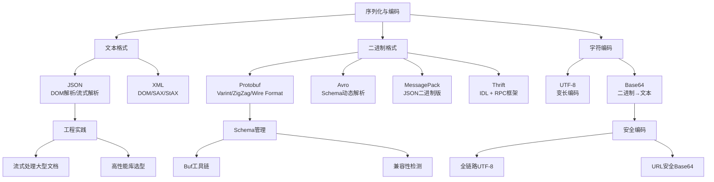
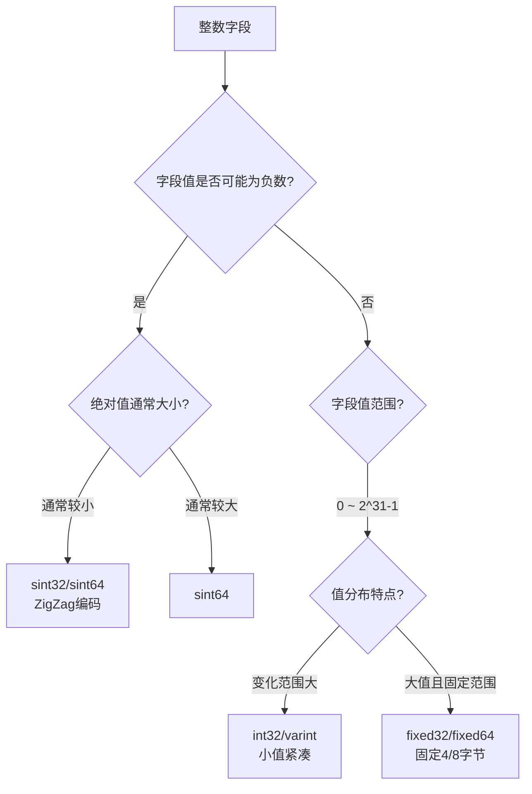

## 本章小结

序列化与编码是分布式系统的"数据语言"——它决定了服务间如何交换数据、消息如何穿越网络、对象如何落盘持久化。本章从文本格式（JSON、XML）、二进制格式（Protobuf、Avro、MessagePack、Thrift）到字符编码（UTF-8、Base64）三大领域，系统性地构建了一个完整的序列化与编码知识体系。以下对全章核心内容进行回顾、提炼和延伸。

---

## 本章知识地图

下图梳理了本章各主题之间的逻辑关系，帮助你快速定位需要深入回顾的部分：

---

## 核心知识点回顾

### 一、序列化的本质与分类

序列化是将内存中的数据结构转换为可存储或可传输的字节流的过程；反序列化则是其逆过程。序列化格式可从两个维度进行分类：

| 分类维度 | 类别 | 代表格式 | 核心特点 |
|----------|------|----------|----------|
| 数据表示 | 文本格式 | JSON、XML | 人类可读、通用性强、体积大 |
| 数据表示 | 二进制格式 | Protobuf、Avro、MessagePack、Thrift | 体积小、解析快、不可直读 |
| Schema依赖 | 有Schema | Protobuf、Avro、Thrift | 类型安全、编码紧凑、演进可控 |
| Schema依赖 | 无Schema | JSON、MessagePack | 灵活、调试方便、缺乏类型约束 |

选择序列化格式的本质是在**可读性、性能、体积、兼容性、开发效率**之间做权衡。没有"最好"的格式，只有最适合特定场景的格式。正如章节概览中提到的真实案例：某电商平台在切换序列化方案后，单次RPC响应体积从 2.3KB 降至 680B，网关吞吐量提升 40%，年度带宽费用节省 120 万元——序列化不是一个"用了就行"的技术点，而是一个需要精心选型的架构决策。

### 二、文本格式：JSON与XML

**JSON（RFC 8259）** 是当前最主流的数据交换格式，支持六种基本类型（string、number、boolean、null、object、array）。其解析方式分为：

- **DOM解析**：将整个文档加载为内存中的树结构，支持随机访问，适合小型文档。Python的`json.loads()`和Java的Jackson ObjectMapper都属于此类。
- **流式解析**：逐token读取并触发回调，内存占用极低。Python的`ijson`库和Java的 Jackson Streaming API属于此类，适合处理GB级JSON文件。

JSON性能优化的三个关键方向：选用高性能库（orjson比标准json快5-10倍）、减少数据体积（短字段名、省略空值、数字枚举替代字符串枚举）、使用JSON Schema进行早期验证。

**XML** 支持三种解析方式，各有适用场景：

| 解析方式 | 模式 | 内存占用 | 随机访问 | 控制力 | 适用场景 |
|----------|------|----------|----------|--------|----------|
| DOM | 一次性加载 | 高 | 支持 | 中 | 小型文档、需要修改 |
| SAX | 推模式事件驱动 | 极低 | 不支持 | 低 | 大型文档、顺序读取 |
| StAX | 拉模式流式解析 | 极低 | 不支持 | 高 | 大型文档、条件过滤 |

SAX由解析器主动推送事件（被动接收），StAX由应用程序主动拉取事件（主动控制），后者在复杂过滤场景中更灵活。

### 三、二进制格式核心原理

**Protocol Buffers（Protobuf）** 是Google开发的高效序列化机制，其核心是三个层次的技术栈：

1. **Varint编码**：使用可变长度编码整数。每个字节的最高位（MSB）作为延续标志——1表示后续还有字节，0表示结束。小数值（如0-127）仅需1字节，大数值需要更多字节。这使得编码后的数据对常见场景非常紧凑。

2. **ZigZag编码**：解决负数的varint编码效率问题。将有符号整数映射为无符号整数——0→0, -1→1, 1→2, -2→3, 2→4，使得绝对值小的负数也能用少量字节表示。映射公式为`(n << 1) ^ (n >> 31)`（32位）或`(n << 1) ^ (n >> 63)`（64位）。sint32/sint64类型使用ZigZag编码，int32/int64不使用。

3. **Wire Format**：定义了六种wire type（Varint/64-bit/Length-delimited/32-bit等），每条消息由一系列tag-value对组成，tag由字段编号和wire type组合编码。

Protobuf的Schema演进遵循严格规则：可新增字段、可用reserved保留已删除字段编号、不可修改已有字段类型、不可复用已删除的字段编号。这是保证前向兼容和后向兼容的基石。

**Apache Avro** 与Protobuf的设计哲学不同——编码数据中不包含字段名，完全依赖schema解释数据。通过writer schema和reader schema的匹配实现Schema演进，新增字段必须提供默认值。这使得Avro的编码极其紧凑，特别适合大数据存储场景。

**MessagePack** 可视为JSON的二进制版本——不需要预定义schema，将JSON的类型信息编码为单字节前缀（nil→0xc0, false→0xc2, true→0xc3等），保持了灵活性同时显著减小体积。

**Apache Thrift** 既是序列化格式也是RPC框架，其IDL（Interface Definition Language）支持struct、enum、service、exception等定义，提供完整的跨语言服务开发方案。

### 四、字符编码

**UTF-8** 是互联网的事实标准字符编码，核心设计是变长编码——ASCII字符用1字节、拉丁文用2字节、中日韩文用3字节、emoji用4字节。编码规则通过首字节的前缀模式区分：`0xxxxxxx`(1字节)、`110xxxxx`(2字节)、`1110xxxx`(3字节)、`11110xxx`(4字节)，后续字节统一以`10`开头。这种设计保证了与ASCII的完全兼容和前缀无歧义。

**Base64** 将任意二进制数据编码为64个可打印ASCII字符（A-Z、a-z、0-9、+、/），每3字节编码为4个字符（膨胀约33%）。URL安全变体用`-`和`_`替代`+`和`/`。典型应用场景：JSON中嵌入二进制数据、JWT token编码、HTTP Basic Auth凭证传输。

---

## 关键决策框架

### 序列化格式选型矩阵

| 场景 | 推荐格式 | 原因 | 备选方案 |
|------|----------|------|----------|
| 对外REST API | JSON | 通用性、可读性、前端直接解析 | — |
| 内部微服务RPC | Protobuf | 高效编码、良好的Schema演进、gRPC集成 | Thrift |
| 大数据存储/传输 | Avro | 极致压缩、Schema Registry管理、Hadoop生态集成 | Parquet（列式存储） |
| 消息队列消息体 | 根据需求选择 | 需Schema管理用Avro/Protobuf，需灵活性用JSON/MessagePack | — |
| 配置文件 | JSON / YAML | 可读性优先 | TOML |
| 跨语言数据交换 | Protobuf | 语言无关、代码自动生成、社区活跃 | Thrift |
| 内存缓存/临时数据 | MessagePack | 无需Schema、体积小、解析快 | JSON |

### 一句话选型口诀

> Web API 用 JSON，高性能 RPC 用 Protobuf，大数据管道用 Avro，轻量缓存用 MessagePack，企业集成用 XML。

### 数值类型选择决策（Protobuf）

---

## 核心性能数据参考

以下是各序列化格式在典型负载（包含字符串、整数、数组、嵌套对象的中等复杂度消息）下的性能特征：

| 指标 | JSON | Protobuf | Avro | MessagePack | XML |
|------|------|----------|------|-------------|-----|
| 数据体积 | 基准(100%) | 30-50% | 25-45% | 50-70% | 150-200% |
| 序列化速度 | 基准(1x) | 3-5x | 2-4x | 3-5x | 0.3-0.5x |
| 反序列化速度 | 基准(1x) | 3-5x | 2-3x | 3-4x | 0.2-0.4x |
| 是否需要Schema | 否 | 是 | 是 | 否 | 否(但可用XSD) |
| 人类可读 | 是 | 否 | 否 | 否 | 是 |
| 跨语言支持 | 全语言 | 主流语言 | JVM为主 | 主流语言 | 全语言 |

**数据来源说明**：以上数值为典型测试场景下的数量级参考，实际性能受消息结构、字段类型分布、序列化库实现、硬件环境等因素影响。JVM生态可参考 [jvm-serializers 基准测试](https://github.com/eishay/jvm-serializers/wiki)，Python生态可参考各自的官方benchmark。选型时应以自己的业务负载进行基准测试为准。

---

## 最佳实践清单

### 设计阶段

- [ ] **明确性能指标**：定义目标吞吐量（QPS）、延迟上限（P99）、数据体积预算
- [ ] **选择合适格式**：根据场景选型矩阵（见上文），而非盲目追求"最新"或"最快"
- [ ] **规划Schema版本管理**：确定.proto文件的仓库组织方式、Review流程、兼容性检测机制
- [ ] **设计容错和降级**：序列化失败时的fallback策略、schema不匹配时的降级方案

### 编码阶段

- [ ] **Protobuf字段编号优化**：高频字段分配编号1-15（1字节tag），低频字段使用更大编号
- [ ] **正确选择数值类型**：负数用sint32/sint64，大值且固定范围用fixed32/fixed64，其余用int32/int64
- [ ] **使用reserved保护已删除字段**：删除字段后立即用`reserved`保留其编号和名称
- [ ] **JSON处理大型文档使用流式解析**：超过10MB的JSON文件应使用ijson/Jackson Streaming API
- [ ] **全链路统一UTF-8编码**：从源代码、数据库、消息队列到API响应，杜绝编码不一致
- [ ] **JSON中嵌入二进制数据必须Base64编码**：直接嵌入原始字节会导致解析错误
- [ ] **添加JSON Schema验证**：对外API使用JSON Schema进行输入验证，防止非法数据进入系统

### 测试阶段

- [ ] **Schema兼容性测试**：修改.proto文件后使用`buf breaking`检测breaking changes
- [ ] **序列化性能基准测试**：在目标硬件上进行实际benchmark，验证性能是否满足要求
- [ ] **跨版本数据兼容性测试**：用旧版schema序列化数据，用新版schema反序列化，验证兼容性
- [ ] **边界值测试**：测试空值、极大值、极小值、Unicode全字符集等边界情况

### 运维阶段

- [ ] **监控序列化性能指标**：关注序列化/反序列化的CPU占用和延迟，设置告警阈值
- [ ] **Schema Registry可用性保障**：确保Schema Registry高可用，避免影响新服务上线
- [ ] **定期清理不再使用的Schema版本**：保留必要的历史版本，清理过期版本
- [ ] **存储层压缩策略**：冷数据及时迁移到Parquet等高压缩格式，降低存储成本

---

## 常见误区速查

| 误区 | 正确做法 | 为什么 |
|------|----------|--------|
| 所有场景都用JSON | 按场景选型：内部通信用Protobuf，大数据用Avro | JSON体积大、解析慢，不适合高频内部通信 |
| 盲目追求二进制格式 | 对外API和配置文件仍用JSON，内部高频通信用二进制 | 二进制格式不可读，增加调试和运维成本 |
| Protobuf字段编号随意分配 | 高频字段编号1-15，删除字段用reserved保留编号 | 编号1-15仅需1字节tag，复用编号导致数据损坏 |
| 所有整数都用int64 | 负数用sint，小值用int32，固定大值用fixed | int64对小值的varint编码可能比int32更浪费 |
| 系统各组件使用不同字符编码 | 全链路统一UTF-8 | 编码不一致是分布式系统最常见的乱码根源 |
| JSON中直接嵌入二进制数据 | 先Base64编码再嵌入 | JSON不支持原始二进制，直接嵌入会导致解析失败 |
| 无Schema的MessagePack用于正式API | 正式API使用Protobuf/Avro等有Schema格式 | 缺乏类型安全导致接口契约不清晰，集成困难 |
| 修改Protobuf schema时不考虑兼容性 | 遵循新增不删、保留编号、不改类型的原则 | 不兼容修改导致新旧版本互操作失败 |
| 大型JSON文件用DOM解析 | 超过10MB使用流式解析（ijson/Jackson Streaming） | DOM解析将整个文档加载到内存，大文件会导致OOM |
| Base64在URL中直接使用标准编码 | URL场景使用URL安全变体（`-`和`_`替代`+`和`/`） | 标准Base64的`+`和`/`在URL中有特殊含义，会导致解析错误 |

> 更多误区的深入剖析（含真实生产事故案例），请参阅第48.11节「常见误区」。

---

## 关键公式与模型

| 概念 | 公式/模型 | 在序列化中的应用 |
|------|-----------|------------------|
| Little定律 | 吞吐量 = 并发数 / 平均延迟 | 评估序列化瓶颈对系统整体吞吐量的影响 |
| 数据压缩率 | 压缩率 = 压缩后大小 / 压缩前大小 | 对比不同序列化格式的体积效率 |
| 编码效率 | 有效载荷比 = 有效数据字节 / 总字节 | 评估序列化的overhead（tag、字段名等开销占比） |
| 变长编码收益 | 节省字节数 = 固定长度 - 变长长度 | 量化varint编码对小数值的压缩收益 |
| Base64膨胀率 | 膨胀率 ≈ 4/3（+33%） | 评估Base64编码对数据体积的影响 |
| Schema兼容性 | 前向兼容 + 后向兼容 = 双向兼容 | Protobuf/Avro的Schema演进目标 |

---

## 各节精读指引

本章内容丰富，根据你的实际需求，可按以下指引快速定位：

| 你的目标 | 精读章节 | 核心收获 |
|----------|----------|----------|
| 为项目选型序列化格式 | 48.1概述 + 48.8性能对比 + 本章选型矩阵 | 理解各格式定位，拿到选型数据 |
| 在项目中落地Protobuf | 48.4深度解析 + 48.6编码实战 + 48.9案例一 | 从.proto编写到gRPC集成的完整流程 |
| 理解Schema演进策略 | 48.7 Schema演进 + 48.10案例二 | 向前/后向兼容、reserved机制、Avro Schema匹配 |
| 排查字符编码问题 | 48.5字符编码 + 48.12常见误区 | UTF-8原理、Base64应用、编码陷阱排查 |
| 评估性能瓶颈 | 48.8性能对比 + 48.12误区（DOM解析大文件） | 基准测试方法、性能优化手段 |

---

## 进阶学习路径

### 深度方向

1. **Protobuf内部机制**：深入研究CodedInputStream/CodedOutputStream的零拷贝实现、Protobuf反射机制、自定义序列化逻辑（`parseFrom`/`writeTo`的hook点）。推荐阅读protobuf-go源码，其实现质量极高。

2. **Schema Registry生态**：学习Confluent Schema Registry的AVRO/Protobuf/JSON Schema支持，理解schema演化策略（BACKWARD、FORWARD、FULL兼容模式）。这是Kafka等流处理平台的核心基础设施。

3. **列式存储格式**：扩展学习Parquet和ORC格式——它们在序列化基础上增加了列式存储、谓词下推、字典编码等能力，是大数据分析的核心存储格式。与Avro的行式存储形成互补。

4. **序列化安全**：研究反序列化漏洞（如Java的`readObject`反序列化攻击、Protobuf的整数溢出问题），理解安全序列化的防御措施。序列化漏洞是OWASP Top 10中高危攻击向量之一。

5. **自定义序列化框架**：学习如何设计一个支持多格式、可插拔的序列化框架，理解SPI（Service Provider Interface）和Builder模式在框架设计中的应用。

### 推荐资源

| 类别 | 资源 | 说明 |
|------|------|------|
| 规范文档 | [RFC 8259](https://datatracker.ietf.org/doc/html/rfc8259) | JSON官方规范 |
| 规范文档 | [Protobuf Language Guide](https://protobuf.dev/programming-guides/proto3/) | Protobuf语法与最佳实践 |
| 工具文档 | [Buf Documentation](https://buf.build/docs/) | 现代化Protobuf工具链（lint、breaking检测、代码生成） |
| 深入书籍 | 《Protocol Buffers Developers Guide》 | Protobuf编码原理与工程实践 |
| 开源项目 | [protobuf-go](https://github.com/protocolbuffers/protobuf-go) | Go语言Protobuf实现，代码质量极高 |
| 开源项目 | [avro](https://github.com/apache/avro) | Avro官方实现，学习Schema解析机制 |
| 性能测试 | [jvm-serializers](https://github.com/eishay/jvm-serializers/wiki) | JVM序列化格式性能对比基准 |

---

## 思考题

1. **格式选择**：你的系统同时对外提供REST API和内部微服务通信。你会选择哪些序列化格式？如何处理不同格式之间的数据转换？请给出具体的技术方案（包括网关层的格式转换策略）。

2. **Schema演进**：假设一个Protobuf消息`Order`已经在生产环境使用了两年，现在需要删除一个不再使用的字段`legacy_code`并新增一个字段`currency`。请描述完整的兼容性操作步骤，包括.proto文件修改、Schema Registry操作、客户端升级策略。思考：如果`legacy_code`的编号曾经被某些内部系统依赖，你的方案需要做哪些调整？

3. **性能分析**：在处理一个每秒10万条消息的消息队列时，你发现序列化成为CPU瓶颈。请分析可能的原因，并给出从诊断到优化的完整路径（包括工具选择、优化手段和验证方法）。提示：从profiling工具入手，定位热点函数。

4. **编码问题排查**：一个系统从MySQL读取中文数据后通过HTTP返回给前端，部分中文变成乱码。请从字符编码的角度分析可能的原因链，并给出排查步骤和解决方案。提示：从数据库连接、应用层、HTTP响应头三个环节逐一排查。

5. **方案设计**：设计一个跨语言（Java、Python、Go）的日志采集系统，需要支持高效的序列化、Schema演进和长期存储。请说明格式选型理由、Schema管理方案、分层存储策略，以及你如何验证方案的可行性。

6. **权衡思考**：Avro的编码不包含字段名（依赖schema），Protobuf的编码包含字段号（不包含字段名）。这两种设计各有什么优劣？在什么场景下你会选择Avro而非Protobuf？反过来呢？请从Schema演进、调试便利性、存储效率三个维度进行对比分析。
