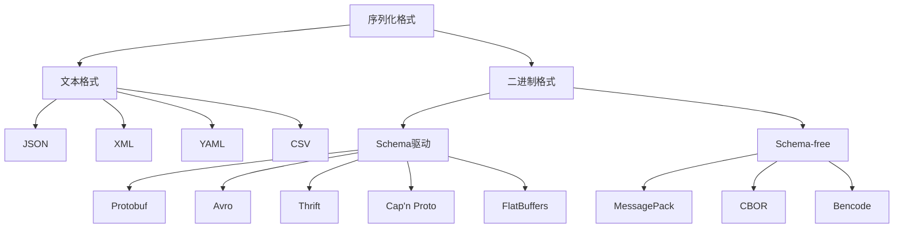
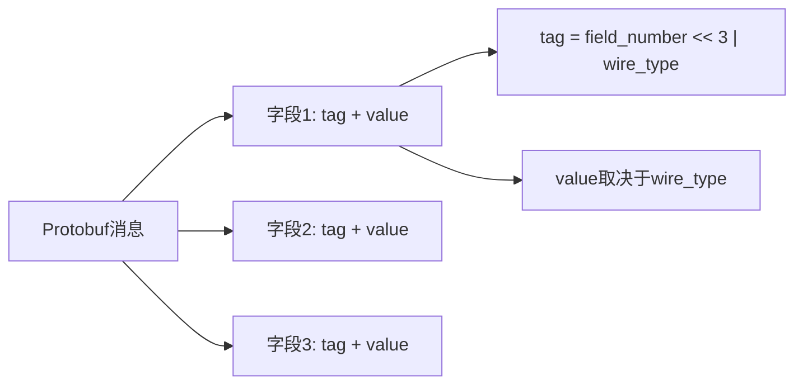
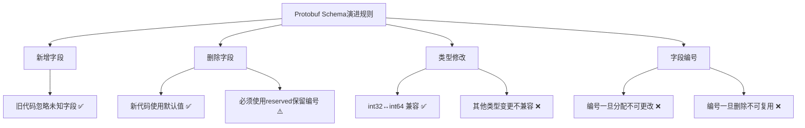
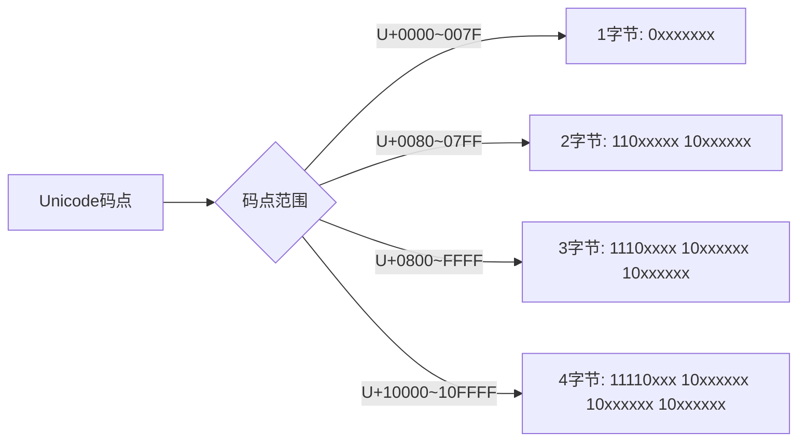
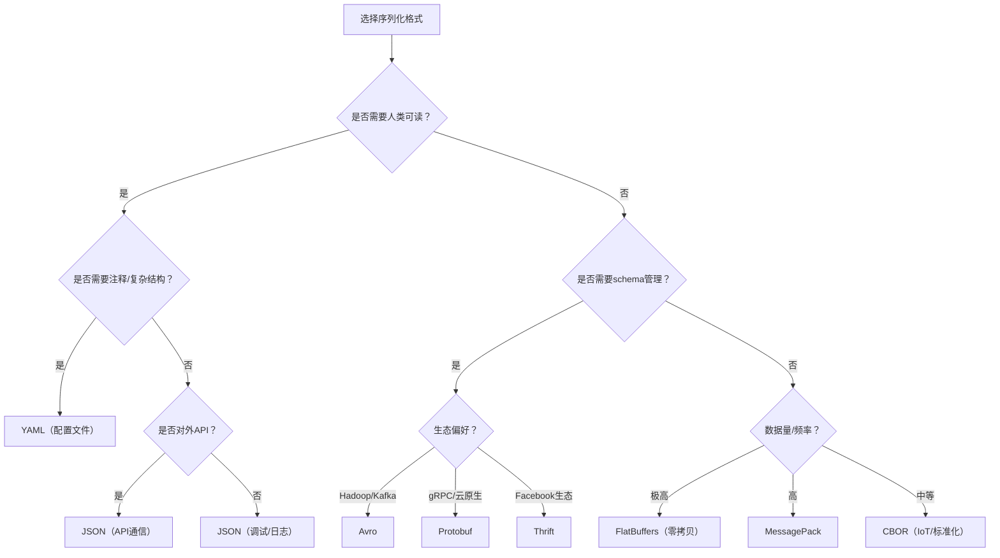

# 第48章 序列化与编码

## 章节定位

序列化与编码是分布式系统中数据交换的基石。无论是微服务间的RPC调用、消息队列中的消息传递，数据库中的数据持久化，还是前端与后端之间的API通信，都离不开高效的序列化和编码方案。本章将从文本格式到二进制格式，从理论原理到工程实践，系统性地探讨各种主流序列化与编码技术的原理、性能特征和适用场景。

## 学习目标

通过本章的学习，读者将能够：

1. **理解序列化的本质**：掌握序列化与反序列化的基本原理，理解不同序列化格式在性能、可读性、兼容性等方面的权衡取舍。

2. **精通JSON与XML技术**：深入理解JSON和XML的解析原理（DOM、SAX、StAX），掌握在不同场景下选择合适解析方式的技巧，以及安全性最佳实践。

3. **深度掌握Protocol Buffers**：理解Protobuf的wire format、varint编码原理和ZigZag编码，掌握schema演进策略，能够设计向后兼容的Protobuf消息。

4. **全面对比各种序列化方案**：理解Avro、MessagePack、Thrift、CBOR等方案的特点，能够根据业务需求选择最合适的序列化格式。

5. **掌握字符编码原理**：深入理解UTF-8的变长编码机制，掌握Base64编码的应用场景和实现原理。

6. **建立序列化安全意识**：了解反序列化攻击等安全威胁，掌握安全实践。

## 章节结构

本章从最常见的JSON格式开始，逐步深入到高性能的二进制序列化方案。首先介绍序列化的理论基础（第48.1-48.2节），然后分别深入文本格式（JSON和XML，第48.3-48.4节）和二进制格式（Protobuf、Avro、MessagePack、Thrift、CBOR，第48.5-48.9节），接着讨论字符编码（UTF-8和Base64，第48.10-48.11节），最后覆盖工程实践中的选型决策、性能优化、安全防护和实战案例（第48.12-48.16节）。

## 前置知识

学习本章前，读者应具备以下基础知识：

- 基本的数据结构概念（树、图、哈希表）
- 网络通信基础，可参考第18章
- 基本的编程能力（Python、Java或Go）
- 了解二进制和十六进制表示法

***

# 序列化与编码的理论基础

## 48.1 序列化概述

### 48.1.1 什么是序列化

序列化（Serialization）是将数据结构或对象状态转换为可存储或可传输的格式的过程。反序列化（Deserialization）则是序列化的逆过程，将序列化后的数据还原为原始的数据结构或对象。

在分布式系统中，序列化承担着三个核心职责：

- **数据交换**：不同服务之间传递请求和响应数据。例如，Java服务调用Go服务时，双方使用不同的内存数据结构，序列化提供了统一的中间格式。
- **数据持久化**：将内存中的数据保存到磁盘或数据库。例如，将对象序列化后写入数据库的BLOB字段，或保存为日志文件。
- **数据压缩与优化**：通过选择高效的序列化格式，减少数据体积和传输时间，降低网络带宽消耗和存储成本。

### 48.1.2 序列化格式的分类



序列化格式可以分为两大类：

**文本格式**（如JSON、XML、YAML）：使用人类可读的文本表示数据，便于调试和日志记录，但序列化后的数据体积较大，解析速度相对较慢。文本格式通常不需要schema定义，灵活性高。

**二进制格式**（如Protobuf、Avro、MessagePack、Thrift）：使用紧凑的二进制编码，序列化后的数据体积小、解析速度快，但不具有人类可读性，调试时需要专门的工具。二进制格式通常需要预定义schema（MessagePack和CBOR除外），提供更强的类型安全保障。

### 48.1.3 选型的核心维度

选择序列化格式时需要综合考虑以下因素：

| 维度 | 说明 | 权重建议 |
|------|------|----------|
| 序列化性能 | 序列化操作的吞吐量和延迟 | 高频通信场景为关键因素 |
| 反序列化性能 | 反序列化操作的吞吐量和延迟 | 读多写少场景为关键因素 |
| 数据体积 | 序列化后的数据大小 | 移动端/带宽受限场景为关键因素 |
| 人类可读性 | 序列化结果是否可被人工阅读 | 调试和日志场景为关键因素 |
| 跨语言支持 | 支持的编程语言数量和成熟度 | 多语言系统为关键因素 |
| Schema演进 | 格式变更时的前后向兼容能力 | 长期演进系统为关键因素 |
| 学习曲线 | 掌握和使用的难度 | 团队技术水平受限时为关键因素 |
| 生态系统 | 库、工具、社区的支持程度 | 快速开发场景为关键因素 |

## 48.2 序列化的核心原理

### 48.2.1 类型映射

序列化的核心挑战之一是将源语言的数据类型映射为目标格式的数据类型。不同语言对数据类型的定义存在差异，序列化格式需要提供通用的类型系统来桥接这些差异。

| 概念 | Java | Python | Protobuf | JSON |
|------|------|--------|----------|------|
| 整数 | int, long | int | int32/64, uint32/64 | number |
| 浮点数 | float, double | float | float, double | number |
| 字符串 | String | str | string | string |
| 布尔 | boolean | bool | bool | true/false |
| 空值 | null | None | google.protobuf.NullValue | null |
| 列表 | List<T> | list | repeated T | array |
| 映射 | Map<K,V> | dict | map<K,V> | object |
| 二进制 | byte[] | bytes | bytes | base64 string |
| 枚举 | enum | enum/IntEnum | enum | string/number |
| 结构体 | class | class/dataclass | message | object |

### 48.2.2 编码策略

不同的序列化格式采用不同的编码策略，核心差异体现在：

**自描述编码**（JSON、XML、MessagePack）：每个字段的值都附带类型信息。例如JSON中数字`42`和字符串`"42"`有明确的前缀/后缀标记。优点是解码时不需要schema，缺点是数据体积较大。

**Schema描述编码**（Protobuf、Avro、Thrift）：类型信息存储在schema中，编码后的数据只包含值。优点是数据体积小、编解码速度快，缺点是解码时必须有对应的schema。

**零拷贝编码**（FlatBuffers、Cap'n Proto）：数据在序列化后的格式可以直接在内存中访问，无需反序列化步骤。适用于对延迟极其敏感的场景。

### 48.2.3 字节序与对齐

二进制序列化格式需要处理两个底层问题：

**字节序（Endianness）**：多字节数值在内存中的存储顺序。大端序（Big-endian）将高位字节存储在低地址，小端序（Little-endian）则相反。网络协议通常使用大端序（网络字节序），而x86/x64架构使用小端序。Protobuf采用小端序编码，因为这在大多数现代处理器上性能更好。

**对齐（Alignment）**：某些格式（如FlatBuffers）要求数据在特定字节数边界上对齐，以支持直接内存访问。这虽然增加了填充开销，但大幅提升了随机访问性能。

***

# 文本格式序列化

## 48.3 JSON序列化

JSON（JavaScript Object Notation）是目前最广泛使用的数据交换格式。它基于JavaScript的对象字面量语法，但已被所有主流编程语言支持。JSON规范（RFC 8259）定义了六种数据类型：string、number、boolean、null、object和array。

### 48.3.1 JSON的解析方式

JSON的解析主要有两种方式：DOM解析和流式解析。

**DOM解析**将整个JSON文档加载到内存中，构建成一个树形数据结构。这种方式支持随机访问文档的任意部分，但需要将整个文档加载到内存中，对于大型文档会消耗大量内存。

```python
import json

# DOM解析方式 —— 将整个JSON加载到内存
json_str = '{"name": "张三", "age": 30, "scores": [95, 87, 92]}'

data = json.loads(json_str)
print(data['name'])       # 张三
print(data['scores'][0])  # 95

# 自定义序列化：处理非标准类型
import datetime

class User:
    def __init__(self, name, age, email):
        self.name = name
        self.age = age
        self.email = email

def user_serializer(obj):
    if isinstance(obj, User):
        return {'name': obj.name, 'age': obj.age, 'email': obj.email}
    if isinstance(obj, datetime.datetime):
        return obj.isoformat()
    raise TypeError(f'Object of type {type(obj)} is not JSON serializable')

user = User("李四", 25, "lisi@example.com")
json_str = json.dumps(user, default=user_serializer, ensure_ascii=False)
print(json_str)  # {"name": "李四", "age": 25, "email": "lisi@example.com"}

# 使用dataclass简化序列化（Python 3.7+）
from dataclasses import dataclass, asdict

@dataclass
class Product:
    name: str
    price: float
    tags: list[str]

product = Product("笔记本电脑", 5999.0, ["电子产品", "办公"])
print(json.dumps(asdict(product), ensure_ascii=False))
```

**流式解析**不将整个文档加载到内存，而是逐个读取token并触发回调事件。这种方式内存消耗小，适合处理大型JSON文档，但不支持随机访问。

```python
import ijson

# 流式解析大型JSON文件 —— 内存占用恒定
def process_large_json(filepath):
    """使用ijson进行流式解析，内存占用恒定"""
    with open(filepath, 'rb') as f:
        parser = ijson.items(f, 'item')
        for record in parser:
            process_record(record)

def process_record(record):
    if record.get('amount', 0) > 10000:
        print(f"大额交易: {record['id']}, 金额: {record['amount']}")

# 流式解析嵌套JSON
def extract_nested_field(filepath, prefix):
    """提取嵌套字段，如 'results.items'"""
    with open(filepath, 'rb') as f:
        for item in ijson.items(f, prefix):
            yield item
```

### 48.3.2 JSON的性能优化

JSON的序列化和反序列化是CPU密集型操作，在高吞吐量场景下可能成为性能瓶颈。以下是几种常见的优化策略：

**使用更快的JSON库**：不同JSON库的性能差异可达数倍。

| 语言 | 标准库 | 高性能替代 | 性能提升 |
|------|--------|-----------|---------|
| Python | json | orjson | 5-10倍 |
| Python | json | ujson | 3-5倍 |
| Java | JSONObject | Jackson | 2-3倍 |
| Java | JSONObject | Gson Streaming | 1.5-2倍 |
| Go | encoding/json | jsoniter | 2-3倍 |
| Go | encoding/json | sonic | 3-5倍 |
| Rust | serde_json | simd-json | 2-4倍 |

```python
# Python orjson示例 —— 性能比标准库快5-10倍
import orjson
import json

data = {"users": [{"id": i, "name": f"user_{i}", "tags": ["tag1", "tag2"]} for i in range(10000)]}

# orjson序列化（更快）
packed = orjson.dumps(data)

# 支持numpy、datetime等标准库不支持的类型
import numpy as np
import datetime

data = {
    "matrix": np.array([[1, 2], [3, 4]]).tolist(),
    "timestamp": datetime.datetime.now()
}
packed = orjson.dumps(data)
```

```java
// Java Jackson高性能JSON处理
import com.fasterxml.jackson.databind.ObjectMapper;
import com.fasterxml.jackson.core.JsonFactory;
import com.fasterxml.jackson.core.JsonGenerator;

ObjectMapper mapper = new ObjectMapper();

// 基本序列化
String json = mapper.writeValueAsString(user);
User user = mapper.readValue(json, User.class);

// 使用Streaming API处理大型JSON —— 内存占用恒定
JsonFactory factory = mapper.getFactory();
try (JsonGenerator generator = factory.createGenerator(outputStream)) {
    generator.writeStartArray();
    for (User u : users) {
        generator.writeStartObject();
        generator.writeStringField("name", u.getName());
        generator.writeNumberField("age", u.getAge());
        generator.writeEndObject();
    }
    generator.writeEndArray();
}
```

**减少JSON数据体积**：
- 使用简短的字段名（如用`"id"`代替`"userId"`），但在对外API中应保持可读性
- 省略空值字段（`json.dumps(data, separators=(',',':'), skipkeys=True)`）
- 使用数字枚举代替字符串枚举
- 对于嵌套对象，考虑使用扁平化的键名（如`user_address_city`）减少嵌套层次

**JSON Schema验证**：使用JSON Schema对JSON数据进行验证，可以在早期发现数据格式错误，避免运行时异常。

```json
{
  "$schema": "http://json-schema.org/draft-07/schema#",
  "type": "object",
  "properties": {
    "id": {"type": "string", "format": "uuid"},
    "name": {"type": "string", "minLength": 1, "maxLength": 100},
    "age": {"type": "integer", "minimum": 0, "maximum": 150},
    "email": {"type": "string", "format": "email"},
    "tags": {"type": "array", "items": {"type": "string"}, "maxItems": 10}
  },
  "required": ["id", "name", "email"],
  "additionalProperties": false
}
```

### 48.3.3 JSON Lines (JSONL) 格式

JSON Lines是一种将多行JSON存储为每行一个JSON对象的格式。它特别适合日志处理和流式数据：

```python
import json

# 写入JSONL文件
def write_jsonl(filepath, records):
    with open(filepath, 'w', encoding='utf-8') as f:
        for record in records:
            f.write(json.dumps(record, ensure_ascii=False) + '\n')

# 流式读取JSONL文件 —— 每行独立解析，支持并行处理
def read_jsonl(filepath):
    with open(filepath, 'r', encoding='utf-8') as f:
        for line_num, line in enumerate(f, 1):
            line = line.strip()
            if not line:
                continue
            try:
                yield json.loads(line)
            except json.JSONDecodeError as e:
                raise ValueError(f"JSON解析错误 at line {line_num}: {e}")

# 使用示例
for record in read_jsonl('events.jsonl'):
    process(record)
```

JSONL相比标准JSON数组的优势：可以逐行流式处理（无需加载整个文件）、可以并发处理多行、可以追加新记录（无需修改文件结构）、损坏的行不影响其他行的解析。

## 48.4 XML序列化

XML（eXtensible Markup Language）是一种标记语言，被广泛用于企业级应用的数据交换。XML比JSON更加严格，支持命名空间、schema验证（XSD）、复杂的数据类型和属性。

### 48.4.1 DOM解析

DOM解析将XML文档解析为一个树形的节点结构，每个节点对应文档中的一个元素。

```java
// Java DOM解析XML
import javax.xml.parsers.DocumentBuilderFactory;
import org.w3c.dom.*;

DocumentBuilderFactory factory = DocumentBuilderFactory.newInstance();
// 安全配置：防止XXE攻击
factory.setFeature("http://apache.org/xml/features/disallow-doctype-decl", true);
factory.setFeature("http://xml.org/sax/features/external-general-entities", false);
factory.setFeature("http://xml.org/sax/features/external-parameter-entities", false);

DocumentBuilder builder = factory.newDocumentBuilder();
Document doc = builder.parse(new File("users.xml"));

// 获取所有user元素
NodeList userList = doc.getElementsByTagName("user");
for (int i = 0; i < userList.getLength(); i++) {
    Element user = (Element) userList.item(i);
    String name = user.getAttribute("name");
    String age = user.getElementsByTagName("age").item(0).getTextContent();
    System.out.printf("用户: %s, 年龄: %s%n", name, age);
}
```

### 48.4.2 SAX解析

SAX（Simple API for XML）是一种基于事件的流式解析方式。解析器在读取XML文档时触发一系列事件，应用程序通过实现回调函数来处理这些事件。

```java
// Java SAX解析XML —— 推模式，内存占用小
import org.xml.sax.helpers.DefaultHandler;
import javax.xml.parsers.SAXParser;
import javax.xml.parsers.SAXParserFactory;
import java.util.ArrayList;
import java.util.List;

class UserHandler extends DefaultHandler {
    private String currentElement;
    private User currentUser;
    private List<User> users = new ArrayList<>();

    @Override
    public void startElement(String uri, String localName,
                             String qName, Attributes attributes) {
        currentElement = qName;
        if ("user".equals(qName)) {
            currentUser = new User();
            currentUser.setName(attributes.getValue("name"));
        }
    }

    @Override
    public void characters(char[] ch, int start, int length) {
        String content = new String(ch, start, length).trim();
        if (content.isEmpty()) return;

        if ("age".equals(currentElement) &amp;&amp; currentUser != null) {
            currentUser.setAge(Integer.parseInt(content));
        } else if ("email".equals(currentElement) &amp;&amp; currentUser != null) {
            currentUser.setEmail(content);
        }
    }

    @Override
    public void endElement(String uri, String localName, String qName) {
        if ("user".equals(qName) &amp;&amp; currentUser != null) {
            users.add(currentUser);
            currentUser = null;
        }
        currentElement = null;
    }

    public List<User> getUsers() { return users; }
}

// 使用SAX解析
SAXParserFactory factory = SAXParserFactory.newInstance();
SAXParser parser = factory.newSAXParser();
UserHandler handler = new UserHandler();
parser.parse(new File("users.xml"), handler);
System.out.println("解析到 " + handler.getUsers().size() + " 个用户");
```

SAX的特点：内存消耗极低（O(1)），适合处理超大XML文件；但不支持随机访问，且编程模型复杂。

### 48.4.3 StAX解析

StAX（Streaming API for XML）是一种拉模式的流式解析方式。与SAX的推模式不同，StAX由应用程序主动拉取下一个事件，控制更加灵活。

```java
// Java StAX解析XML —— 拉模式，控制更灵活
import javax.xml.stream.XMLInputFactory;
import javax.xml.stream.XMLStreamReader;
import javax.xml.stream.XMLStreamConstants;

XMLInputFactory factory = XMLInputFactory.newInstance();
XMLStreamReader reader = factory.createXMLStreamReader(
    new FileInputStream("users.xml"));

String currentElement = null;
while (reader.hasNext()) {
    int event = reader.next();
    switch (event) {
        case XMLStreamConstants.START_ELEMENT:
            currentElement = reader.getLocalName();
            if ("user".equals(currentElement)) {
                String name = reader.getAttributeValue(null, "name");
                System.out.println("开始解析用户: " + name);
            }
            break;
        case XMLStreamConstants.CHARACTERS:
            String text = reader.getText().trim();
            if (!text.isEmpty() &amp;&amp; "age".equals(currentElement)) {
                System.out.println("年龄: " + text);
            }
            break;
        case XMLStreamConstants.END_ELEMENT:
            if ("user".equals(reader.getLocalName())) {
                System.out.println("用户解析完成");
            }
            currentElement = null;
            break;
    }
}
reader.close();
```

### 48.4.4 JSON vs XML 对比

| 特性 | JSON | XML |
|------|------|-----|
| 数据模型 | 键值对 + 数组 | 树形节点 |
| 数据类型 | 6种（string/number/boolean/null/object/array） | 无原生类型（全靠schema） |
| 注释 | 不支持 | 支持（<!-- -->） |
| 命名空间 | 不支持 | 支持 |
| Schema验证 | JSON Schema（可选） | XSD/DTD（广泛） |
| 数据体积 | 较小 | 较大（标签开销） |
| 解析速度 | 快 | 较慢 |
| 可读性 | 好 | 略差 |
| 适用场景 | API通信、Web前端、配置文件 | 企业系统、文档标记、SOAP服务 |

***

# 二进制格式序列化

## 48.5 Protocol Buffers深度解析

Protocol Buffers（简称Protobuf）是Google开发的一种语言无关、平台无关的序列化机制。它通过.proto文件定义数据结构，然后使用编译器生成各种语言的序列化代码。Protobuf以其高效的编码方式和良好的向后兼容性，成为gRPC和众多分布式系统的默认序列化格式。

### 48.5.1 Wire Format

Protobuf的wire format定义了各种数据类型在二进制流中的编码方式。每条消息由一系列字段组成，每个字段由一个**tag**和一个**value**组成。tag由字段编号（field number）和wire type组合而成，使用varint编码。



Protobuf定义了六种wire type：

| Wire Type | 名称 | 用于类型 | 说明 |
|-----------|------|---------|------|
| 0 | Varint | int32, int64, uint32, uint64, sint32, sint64, bool, enum | 可变长度整数 |
| 1 | 64-bit | fixed64, sfixed64, double | 固定8字节 |
| 2 | Length-delimited | string, bytes, embedded messages, packed repeated | 长度前缀 + 数据 |
| 5 | 32-bit | fixed32, sfixed32, float | 固定4字节 |

```protobuf
// user.proto
syntax = "proto3";

package tutorial;

option java_package = "com.example.tutorial";
option java_outer_classname = "UserProto";

message User {
    int32 id = 1;
    string name = 2;
    string email = 3;
    repeated string phone_numbers = 4;

    enum PhoneType {
        MOBILE = 0;
        HOME = 1;
        WORK = 2;
    }

    message PhoneNumber {
        string number = 1;
        PhoneType type = 2;
    }

    repeated PhoneNumber phones = 5;
    map<string, string> metadata = 6;
}
```

### 48.5.2 Varint编码原理

Varint是一种使用可变长度来编码整数的方法。对于小数值，varint使用更少的字节；对于大数值，varint使用更多的字节。每个字节的最高位（MSB）用作延续标志：1表示后续还有字节，0表示这是最后一个字节。

```python
def encode_varint(value):
    """将无符号整数编码为varint格式"""
    if value < 0:
        raise ValueError("Varint encoding doesn't support negative values directly")
    result = []
    while value > 0:
        byte = value &amp; 0x7F  # 取低7位
        value >>= 7
        if value > 0:
            byte |= 0x80  # 设置MSB为1，表示后续还有字节
        result.append(byte)
    if not result:
        result.append(0)
    return bytes(result)

def decode_varint(data, offset=0):
    """从varint格式解码整数"""
    result = 0
    shift = 0
    while offset < len(data):
        byte = data[offset]
        result |= (byte &amp; 0x7F) << shift
        offset += 1
        shift += 7
        if (byte &amp; 0x80) == 0:
            break
    return result, offset

# 编码示例
for val in [0, 1, 127, 128, 300, 16384]:
    encoded = encode_varint(val)
    decoded, _ = decode_varint(encoded)
    print(f"{val:6d} -> {list(encoded)} ({len(encoded)} bytes) -> {decoded}")
```

输出：

     0 -> [0] (1 bytes) -> 0
     1 -> [1] (1 bytes) -> 1
   127 -> [127] (1 bytes) -> 127
   128 -> [128, 1] (2 bytes) -> 128
   300 -> [172, 2] (2 bytes) -> 300
 16384 -> [128, 128, 1] (3 bytes) -> 16384

varint编码的字节数与数值大小的关系：

| 数值范围 | 所需字节数 |
|---------|-----------|
| 0 - 127 | 1 |
| 128 - 16,383 | 2 |
| 16,384 - 2,097,151 | 3 |
| 2,097,152 - 268,435,455 | 4 |
| 更大 | 最多10字节 |

### 48.5.3 ZigZag编码

对于负数，普通的varint编码效率很低。因为负数使用补码表示（如-1的int32补码为0xFFFFFFFF），varint需要10个字节来编码。Protobuf使用ZigZag编码来解决这个问题，它将有符号整数映射为无符号整数，使得绝对值小的负数也能用少量字节表示。

映射规则：

 原始值  -> 编码值
   0     ->    0
  -1     ->    1
   1     ->    2
  -2     ->    3
   2     ->    4
  -3     ->    5
   3     ->    6

公式为：`(n << 1) ^ (n >> 31)`（32位）或 `(n << 1) ^ (n >> 63)`（64位）。

```python
def zigzag_encode(n, bits=32):
    """ZigZag编码：将有符号整数映射为无符号整数"""
    mask = (1 << bits) - 1
    return ((n << 1) ^ (n >> (bits - 1))) &amp; mask

def zigzag_decode(n, bits=32):
    """ZigZag解码：将无符号整数映射回有符号整数"""
    return (n >> 1) ^ -(n &amp; 1)

# 对比int32和sint32对负数的编码效率
from google.protobuf.internal import encoder, wire_format

print("ZigZag编码示例：")
for val in [-1, -2, -100, -10000, -1000000]:
    encoded = zigzag_encode(val, 32)
    varint_size = len(encode_varint(encoded))
    direct_size = len(encode_varint(val &amp; 0xFFFFFFFF))
    print(f"  {val:10d} -> zigzag={encoded:10d} (varint:{varint_size}B)"
          f"  vs 直接int32={val &amp; 0xFFFFFFFF:10d} (varint:{direct_size}B)")
```

关键结论：对于可能为负数的字段，**必须**使用`sint32`/`sint64`而非`int32`/`int64`，否则负数的编码效率极低。

### 48.5.4 Schema演进

Protobuf的一大优势是支持schema演进（前向兼容和后向兼容）：



```protobuf
// 版本1: 初始schema
message User {
    int32 id = 1;
    string name = 2;
    string email = 3;
}

// 版本2: 新增字段（向后兼容）
message User {
    int32 id = 1;
    string name = 2;
    string email = 3;
    string phone = 4;         // 新增字段
    int32 age = 5;            // 新增字段
}

// 版本3: 安全删除字段（必须使用reserved）
message User {
    reserved 2;               // 保留字段编号2，防止被复用
    reserved "name";          // 保留字段名，防止被复用
    int32 id = 1;
    string email = 3;
    string phone = 4;
    int32 age = 5;
    string display_name = 6;  // 替代原来的name字段
}
```

**类型兼容性对照表**：

| 从类型 | 到类型 | 是否兼容 |
|--------|--------|---------|
| int32 | int64 | ✅ 兼容 |
| int64 | int32 | ⚠️ 仅当值在int32范围内 |
| sint32 | sint64 | ✅ 兼容 |
| uint32 | uint64 | ✅ 兼容 |
| fixed32 | fixed64 | ✅ 兼容 |
| float | double | ✅ 兼容 |
| string | bytes | ❌ 不兼容 |
| enum | int32 | ⚠️ 需要谨慎 |

## 48.6 Avro序列化

Apache Avro是Hadoop生态系统中广泛使用的序列化框架。与Protobuf不同，Avro的schema在运行时动态解析，不需要生成代码。Avro的编码非常紧凑，因为它在编码数据中不包含字段名，而是依赖schema来解释数据。

### 48.6.1 Avro的Schema定义

Avro使用JSON格式定义schema，支持record、enum、array、map、union等复杂类型。

```json
{
  "type": "record",
  "name": "User",
  "namespace": "com.example",
  "fields": [
    {"name": "id", "type": "int"},
    {"name": "name", "type": "string"},
    {"name": "email", "type": ["null", "string"], "default": null},
    {"name": "age", "type": ["null", "int"], "default": null},
    {
      "name": "address",
      "type": {
        "type": "record",
        "name": "Address",
        "fields": [
          {"name": "street", "type": "string"},
          {"name": "city", "type": "string"},
          {"name": "zip", "type": "string"}
        ]
      }
    }
  ]
}
```

### 48.6.2 Avro的编码规则

Avro的编码基于schema定义，不同类型的编码规则如下：

| 类型 | 编码方式 | 说明 |
|------|---------|------|
| null | 无字节 | 不占空间 |
| boolean | 1字节 | 0x00或0x01 |
| int/long | varint (ZigZag) | 与Protobuf类似的可变长度编码 |
| float | 4字节 | 小端IEEE 754 |
| double | 8字节 | 小端IEEE 754 |
| bytes | varint长度 + 原始字节 | 前缀为长度 |
| string | varint长度 + UTF-8字节 | 前缀为字节长度 |
| record | 按字段顺序排列 | 无tag，无字段名 |
| enum | varint索引 | 枚举值的整数索引 |
| array | 块编码（计数+元素） | 支持大数组分块 |
| map | 块编码（计数+键值对） | 键值对按顺序存储 |
| union | varint索引 + 值 | 索引标识联合类型中的哪个 |

**关键特点**：Avro的record编码中不包含字段名和类型信息，完全依赖schema来解释数据。这意味着：
- 编码极其紧凑
- 解码时必须有正确的schema
- 跨版本读取需要schema解析（Schema Resolution）

### 48.6.3 Avro的Schema演进

Avro通过**writer schema**（写入数据时的schema）和**reader schema**（当前代码使用的schema）的匹配来实现schema演进。

```python
import avro.schema
from io import BytesIO
from avro.datafile import DataFileReader, DataFileWriter
from avro.io import DatumReader, DatumWriter

# 定义schema v1
schema_v1 = avro.schema.parse('''
{
    "type": "record",
    "name": "User",
    "fields": [
        {"name": "id", "type": "int"},
        {"name": "name", "type": "string"}
    ]
}''')

# 定义schema v2（新增age字段）
schema_v2 = avro.schema.parse('''
{
    "type": "record",
    "name": "User",
    "fields": [
        {"name": "id", "type": "int"},
        {"name": "name", "type": "string"},
        {"name": "age", "type": ["null", "int"], "default": null}
    ]
}''')

# 使用schema v1写入数据
with open('users.avro', 'wb') as f:
    writer = DatumWriter(schema_v1)
    with DataFileWriter(f, writer, schema_v1) as avro_writer:
        avro_writer.append({"id": 1, "name": "张三"})
        avro_writer.append({"id": 2, "name": "李四"})

# 使用schema v2读取数据（前向兼容）—— age字段自动使用默认值null
with open('users.avro', 'rb') as f:
    reader = DatumReader(writer_schema=schema_v1, reader_schema=schema_v2)
    with DataFileReader(f, reader) as avro_reader:
        for record in avro_reader:
            print(record)  # {'id': 1, 'name': '张三', 'age': None}
```

**Avro Schema Resolution规则**：
- 新增字段：reader schema必须为新字段提供默认值
- 删除字段：writer schema中的字段在reader schema中被忽略
- 类型提升：int→long, float→double等可以自动提升
- 名称匹配：通过完全限定名（namespace + name）匹配record类型

### 48.6.4 Avro的适用场景

Avro特别适合以下场景：

- **Hadoop/Spark大数据处理**：Avro是Hadoop生态的原生格式，支持MapReduce和Spark的直接读取
- **Kafka消息格式**：配合Confluent Schema Registry管理schema版本，实现消息的前后向兼容
- **数据湖存储**：Avro的block压缩（支持Snappy、Deflate、Zstd）使其在列式存储场景下表现优秀
- **日志聚合**：Avro的紧凑编码和schema演进能力使其适合日志的长期存储

## 48.7 MessagePack

MessagePack是一种高效的二进制序列化格式，可以看作是JSON的二进制版本。它保持了JSON的灵活性（不需要预定义schema），同时提供了更紧凑的编码和更快的解析速度。

### 48.7.1 MessagePack的类型系统

MessagePack的类型系统直接映射JSON的数据类型，使用单字节前缀标识类型和值：

| 类型 | 前缀 | 编码长度 | 说明 |
|------|------|---------|------|
| nil | 0xc0 | 1字节 | 空值 |
| false | 0xc2 | 1字节 | 布尔假 |
| true | 0xc3 | 1字节 | 布尔真 |
| positive fixint | 0x00-0x7f | 1字节 | 0-127的正整数 |
| negative fixint | 0xe0-0xff | 1字节 | -32到-1的负整数 |
| uint 8/16/32/64 | 0xcc-0xcf | 2/3/5/9字节 | 无符号整数 |
| int 8/16/32/64 | 0xd0-0xd3 | 2/3/5/9字节 | 有符号整数 |
| float 32/64 | 0xca/0xcb | 5/9字节 | 浮点数 |
| fixstr | 0xa0-0xbf | 1+长度字节 | 长度≤31的字符串 |
| str 8/16/32 | 0xd9-0xdb | 2+长度字节 | 更长字符串 |
| fixarray | 0x90-0x9f | 1+元素 | 长度≤15的数组 |
| array 16/32 | 0xdc-0xdd | 3+元素 | 更长数组 |
| fixmap | 0x80-0x8f | 1+键值对 | 长度≤15的映射 |
| map 16/32 | 0xde-0xdf | 3+键值对 | 更长映射 |
| bin 8/16/32 | 0xc4-0xc6 | 2+数据 | 二进制数据 |
| ext 8/16/32 | 0xc7-0xc9 | 3+数据 | 扩展类型 |

### 48.7.2 MessagePack的编码特点

```python
import msgpack
import json

# 基本序列化对比
data = {
    "id": 12345,
    "name": "张三",
    "scores": [95, 87, 92],
    "active": True,
    "metadata": {"role": "admin", "level": 5}
}

packed = msgpack.packb(data)
json_bytes = json.dumps(data, ensure_ascii=False).encode('utf-8')

print(f"MessagePack大小: {len(packed)} 字节")
print(f"JSON大小: {len(json_bytes)} 字节")
print(f"压缩比: {len(json_bytes) / len(packed):.2f}x")

# 反序列化 —— 默认返回bytes而非str
unpacked = msgpack.unpackb(packed)
print(type(unpacked['name']))  # <class 'bytes'>

# 设置raw=False，返回str而非bytes
unpacked = msgpack.unpackb(packed, raw=False)
print(type(unpacked['name']))  # <class 'str'>

# 自定义类型处理
import datetime

def default_handler(obj):
    """自定义类型序列化处理器"""
    if isinstance(obj, datetime.datetime):
        return {"__datetime__": True, "value": obj.isoformat()}
    if isinstance(obj, set):
        return {"__set__": True, "value": list(obj)}
    raise TypeError(f"Unknown type: {type(obj)}")

def object_hook(obj):
    """自定义类型反序列化处理器"""
    if "__datetime__" in obj:
        return datetime.datetime.fromisoformat(obj["value"])
    if "__set__" in obj:
        return set(obj["value"])
    return obj

data = {"created": datetime.datetime.now(), "tags": {"python", "data"}}
encoded = msgpack.packb(data, default=default_handler)
decoded = msgpack.unpackb(encoded, object_hook=object_hook, raw=False)
print(decoded)
```

### 48.7.3 MessagePack的适用场景

MessagePack特别适合以下场景：

- **Redis缓存**：Redis支持MessagePack作为序列化格式，比JSON更紧凑
- **实时通信**：WebSocket/游戏服务器中的实时数据传输
- **物联网（IoT）**：资源受限设备上的高效数据传输
- **日志传输**：比JSON更紧凑的日志格式，适合高吞吐量的日志收集
- **IPC通信**：进程间通信中的高效数据交换

### 48.7.4 MessagePack vs JSON

| 维度 | MessagePack | JSON |
|------|------------|------|
| 数据体积 | 约为JSON的60-70% | 基准 |
| 序列化速度 | 约为JSON的2-5倍 | 基准 |
| 人类可读性 | ❌ 不可读 | ✅ 可读 |
| Schema要求 | 不需要 | 不需要 |
| 二进制数据 | 原生支持（bin类型） | 需要Base64编码 |
| 日期时间 | 不支持（需扩展） | 不支持（字符串） |
| 调试难度 | 高 | 低 |

## 48.8 Apache Thrift

Apache Thrift是Facebook开发的跨语言服务开发框架，它包含序列化格式和RPC框架两部分。Thrift的序列化格式与Protobuf类似，也是基于预定义的schema和二进制编码。

### 48.8.1 Thrift的数据类型

Thrift支持以下数据类型：

**基本类型**：bool, byte (i8), i16, i32, i64, double, string, binary

**容器类型**：list\<T\>, set\<T\>, map\<K,V\>

**特殊类型**：struct（结构体），exception（异常），service（服务定义）

### 48.8.2 Thrift协议类型

Thrift支持多种序列化协议：

| 协议 | 特点 | 适用场景 |
|------|------|---------|
| TBinaryProtocol | 二进制编码，简单高效 | 内部服务通信 |
| TCompactProtocol | 使用varint和ZigZag压缩 | 带宽受限场景 |
| TJSONProtocol | JSON编码，可读性强 | 调试和对外API |
| TSimpleJSONProtocol | 简单JSON，只读 | 日志和调试 |
| TDebugProtocol | 详细调试输出 | 开发调试 |

### 48.8.3 Thrift IDL定义

```thrift
// user.thrift
namespace java com.example.thrift
namespace py example.thrift

enum UserStatus {
    ACTIVE = 0,
    INACTIVE = 1,
    SUSPENDED = 2
}

struct User {
    1: i32 id,
    2: string name,
    3: string email,
    4: optional list<string> phone_numbers,
    5: UserStatus status = UserStatus.ACTIVE,
    6: optional map<string, string> metadata
}

exception UserNotFoundException {
    1: i32 error_code,
    2: string message
}

exception ValidationException {
    1: string field,
    2: string message
}

service UserService {
    User getUser(1: i32 id) throws (1: UserNotFoundException e),
    list<User> listUsers(1: i32 offset, 2: i32 limit),
    void createUser(1: User user)
        throws (1: ValidationException ve),
    void updateUser(1: User user)
        throws (1: UserNotFoundException e,
                2: ValidationException ve),
    void deleteUser(1: i32 id)
        throws (1: UserNotFoundException e)
}
```

### 48.8.4 Thrift vs Protobuf

| 维度 | Thrift | Protobuf |
|------|--------|---------|
| 序列化性能 | 略慢 | 略快 |
| 数据体积 | 相当 | 相当 |
| RPC框架 | 内置 | 需配合gRPC |
| 协议类型 | 4种（Binary/Compact/JSON/Debug） | 1种 |
| 传输层 | 有（Socket/HTTP/Named Pipe） | 依赖gRPC |
| Schema演进 | 支持 | 支持 |
| 生态系统 | 较小 | 更大（gRPC生态） |
| 主要用户 | Facebook内部 | Google/广泛社区 |

## 48.9 其他二进制格式

### 48.9.1 CBOR (Concise Binary Object Representation)

CBOR是基于JSON数据模型的二进制格式，由IETF标准化（RFC 8949）。它使用与MessagePack类似的类型前缀方案，但在标准化和扩展性方面更完善。

```python
# CBOR使用示例
# 需要安装: pip install cbor2
try:
    import cbor2

    data = {
        "temperature": 23.5,
        "humidity": 65,
        "location": {"lat": 39.9, "lng": 116.4},
        "timestamp": "2026-01-01T00:00:00Z"
    }

    # 序列化
    encoded = cbor2.dumps(data)
    print(f"CBOR大小: {len(encoded)} 字节")

    # 反序列化
    decoded = cbor2.loads(encoded)
    print(decoded)

    # CBOR支持自定义标签（Tag）
    from cbor2 import CBORTag
    tagged = CBORTag(0, "2026-01-01T00:00:00Z")  # 标签0表示日期时间
except ImportError:
    print("cbor2未安装")
```

CBOR与MessagePack的主要区别：CBOR是IETF标准（RFC 8949），有官方规范和测试向量；CBOR支持语义标签（Semantic Tags），可以为值添加类型元数据；CBOR支持无限长度的数组和映射（流式编码）；CBOR在物联网（特别是COSE/COSE）中广泛使用。

### 48.9.2 FlatBuffers和Cap'n Proto

这两种格式属于**零拷贝序列化**（Zero-copy Serialization）：

**Google FlatBuffers**：直接在序列化后的字节缓冲区上访问数据，无需反序列化步骤。数据按需访问（lazy access），只有被读取的字段才会被解析。特别适合游戏引擎（Unity/Unreal）、移动端等对延迟极其敏感的场景。

**Cap'n Proto**：设计目标是实现"更快的Protocol Buffers"。它的消息格式与Protobuf类似，但去掉了tag和varint编码，要求数据按schema定义的顺序紧凑排列，支持直接内存映射。

两种格式的共同特点：无需反序列化即可直接访问字段、读取延迟恒定（O(1)）、适合随机访问大消息中的小字段。缺点是：需要内存对齐、不支持动态schema、消息大小受限于预分配的内存块。

***

# 字符编码基础

## 48.10 UTF-8编码

UTF-8是一种变长的字符编码方式，它使用1到4个字节来编码Unicode字符。UTF-8的设计非常巧妙，兼顾了效率和兼容性。

### 48.10.1 UTF-8的编码规则



| 字符类型 | Unicode范围 | 字节数 | 首字节模板 | 示例字符 |
|---------|------------|--------|-----------|---------|
| ASCII | U+0000 - U+007F | 1 | 0xxxxxxx | A, 0, ! |
| 拉丁扩展/希腊/西里尔 | U+0080 - U+07FF | 2 | 110xxxxx | é, ñ, Ω |
| CJK统一表意文字 | U+0800 - U+FFFF | 3 | 1110xxxx | 中, 日, 한 |
| 补充平面（emoji等） | U+10000 - U+10FFFF | 4 | 11110xxx | 😀, 𝄞 |

```python
def utf8_encode(char):
    """将Unicode字符编码为UTF-8"""
    cp = ord(char)

    if cp <= 0x7F:
        return bytes([cp])
    elif cp <= 0x7FF:
        return bytes([
            0xC0 | (cp >> 6),
            0x80 | (cp &amp; 0x3F)
        ])
    elif cp <= 0xFFFF:
        return bytes([
            0xE0 | (cp >> 12),
            0x80 | ((cp >> 6) &amp; 0x3F),
            0x80 | (cp &amp; 0x3F)
        ])
    elif cp <= 0x10FFFF:
        return bytes([
            0xF0 | (cp >> 18),
            0x80 | ((cp >> 12) &amp; 0x3F),
            0x80 | ((cp >> 6) &amp; 0x3F),
            0x80 | (cp &amp; 0x3F)
        ])
    raise ValueError(f"Invalid Unicode code point: {cp}")

# 验证各种字符的编码
test_chars = [
    ('A', 'ASCII'),
    ('é', '拉丁文'),
    ('中', '中文'),
    ('😀', 'Emoji'),
    ('𝄞', '音乐符号'),
]

for char, desc in test_chars:
    encoded = utf8_encode(char)
    native = char.encode('utf-8')
    match = "✅" if encoded == native else "❌"
    print(f"{match} {desc} '{char}' (U+{ord(char):04X}): "
          f"{list(encoded)} ({len(encoded)}字节)")
```

### 48.10.2 UTF-8的解码验证

UTF-8有严格的编码规则，解码时可以检测出无效的字节序列：

```python
def validate_utf8(data):
    """验证UTF-8编码的有效性"""
    i = 0
    errors = []
    while i < len(data):
        byte = data[i]
        if byte <= 0x7F:
            i += 1
            continue

        # 确定预期的字节数
        if (byte &amp; 0xE0) == 0xC0:
            expected = 2
        elif (byte &amp; 0xF0) == 0xE0:
            expected = 3
        elif (byte &amp; 0xF8) == 0xF0:
            expected = 4
        else:
            errors.append(f"位置{i}: 无效的首字节 0x{byte:02X}")
            i += 1
            continue

        # 检查后续字节
        if i + expected > len(data):
            errors.append(f"位置{i}: 缺少{expected-1}个后续字节")
            break

        valid = True
        for j in range(1, expected):
            if (data[i + j] &amp; 0xC0) != 0x80:
                errors.append(f"位置{i+j}: 无效的后续字节 0x{data[i+j]:02X}")
                valid = False
                break

        if valid:
            i += expected
        else:
            i += 1

    return len(errors) == 0, errors

# 测试验证
valid_data = "Hello, 世界！😀".encode('utf-8')
print(f"有效UTF-8: {validate_utf8(valid_data)}")  # (True, [])

# 人工构造无效数据
invalid_data = bytes([0xC3, 0x28])  # C3后面应该是10xxxxxx
print(f"无效UTF-8: {validate_utf8(invalid_data)}")
```

### 48.10.3 UTF-8与其他编码的对比

| 编码 | 字节数（中文） | 向后兼容 | 变长 | 主要用途 |
|------|--------------|---------|------|---------|
| ASCII | ❌ 不支持 | N/A | 否 | 英文文本 |
| GB2312/GBK | 2字节 | GBK兼容GB2312 | 否 | 中文Windows |
| UTF-16 | 2或4字节 | BMP内为2字节 | 是 | Windows内部、Java字符串 |
| UTF-32 | 固定4字节 | 否 | 否 | 内部处理 |
| UTF-8 | 3字节 | ASCII兼容 | 是 | 互联网标准 |

## 48.11 Base64编码

Base64是一种将二进制数据编码为ASCII字符串的方法。它使用64个可打印字符（A-Z、a-z、0-9、+、/）来表示数据，每3个字节的二进制数据编码为4个Base64字符。

### 48.11.1 Base64的编码原理

Base64编码将每3个字节（24位）分为4组，每组6位，对应Base64字符表中的一个字符。如果输入字节数不是3的倍数，用`=`填充。

```python
import base64

# 基本编码/解码
data = b"Hello, World!"
encoded = base64.b64encode(data)
print(f"原始数据: {data}")
print(f"Base64编码: {encoded}")
print(f"编码后大小: {len(encoded)} 字节 (原始: {len(data)} 字节, 增加: "
      f"{(len(encoded)/len(data)-1)*100:.1f}%)")

# 解码
decoded = base64.b64decode(encoded)
print(f"解码结果: {decoded}")

# 演示填充
for test in [b"a", b"ab", b"abc", b"abcd"]:
    encoded = base64.b64encode(test)
    print(f"  {test!r:12s} -> {encoded} (填充: {encoded.count(b'=')})")

# URL安全的Base64 —— 用-和_替代+和/，用于URL和文件名
url_encoded = base64.urlsafe_b64encode(data)
print(f"URL安全编码: {url_encoded}")

# 去除填充的Base64 —— JWT中使用
token = base64.urlsafe_b64encode(b'{"alg":"HS256","typ":"JWT"}').rstrip(b'=')
print(f"无填充编码: {token.decode()}")
```

### 48.11.2 Base64的应用场景

**在JSON中嵌入二进制数据**：

```python
import base64
import json

def encode_image_to_json(image_path):
    """将图片编码为Base64并嵌入JSON"""
    with open(image_path, 'rb') as f:
        image_data = f.read()

    payload = {
        "title": "示例图片",
        "image": base64.b64encode(image_data).decode('ascii'),
        "format": "image/png",
        "size": len(image_data)
    }
    return json.dumps(payload)

# JWT (JSON Web Token) 中的使用
import hashlib
import hmac
import time

header = base64.urlsafe_b64encode(
    b'{"alg":"HS256","typ":"JWT"}').rstrip(b'=')
payload = base64.urlsafe_b64encode(
    json.dumps({"sub": "user123", "exp": int(time.time()) + 3600}).encode()
).rstrip(b'=')
signature = hmac.new(b'secret', header + b'.' + payload, hashlib.sha256).digest()
sig_b64 = base64.urlsafe_b64encode(signature).rstrip(b'=')

jwt_token = f"{header.decode()}.{payload.decode()}.{sig_b64.decode()}"
print(f"JWT Token: {jwt_token[:50]}...")
```

**Base64的性能注意事项**：

- Base64编码会使数据体积增加约33%，对于大文件来说开销显著
- 如果需要编码大量二进制数据，考虑使用二进制序列化格式（如Protobuf的bytes字段）直接传输
- Base64编码/解码是CPU密集型操作，高频调用时考虑使用C扩展（如Python的`base64`模块比纯Python实现快得多）

### 48.11.3 Base64的变体

| 变体 | 字符集 | 用途 |
|------|--------|------|
| Base64 Standard | A-Z, a-z, 0-9, +, / | MIME邮件、通用编码 |
| Base64 URL-safe | A-Z, a-z, 0-9, -, _ | URL、文件名、JWT |
| Base64 No-padding | 同上但无= | JWT、紧凑表示 |
| Base32 | A-Z, 2-7 | TOTP/HOTP、对大小写不敏感的场景 |
| Base16 (Hex) | 0-9, A-F | 调试、颜色表示 |

***

# 工程实践与选型决策

## 48.12 选择合适的序列化格式

### 48.12.1 决策流程图



### 48.12.2 场景化选型指南

**对外API通信**：优先选择JSON。JSON的通用性和可读性使其成为对外API的首选格式。几乎所有编程语言都有成熟的JSON库支持，前端JavaScript可以直接解析JSON响应。虽然JSON的性能不如二进制格式，但对于外部API来说，通用性和易用性通常比极致性能更重要。

**内部服务通信**：优先选择Protobuf。在微服务架构中，内部服务之间的通信对性能要求较高，且服务端和客户端都由同一团队控制，可以方便地维护.proto文件。Protobuf的高效编码和良好的schema演进能力使其成为内部通信的理想选择。配合gRPC使用可以进一步提升通信效率，支持流式RPC、拦截器等高级功能。

**大数据处理**：优先选择Avro。在Hadoop和Spark等大数据处理框架中，Avro是事实上的标准序列化格式。Avro的schema自描述特性和高效的压缩支持使其特别适合大数据场景。Kafka也推荐使用Avro作为消息格式，配合Schema Registry管理schema的演进。

**消息队列**：根据需求选择。如果需要schema管理和演进，选择Avro或Protobuf；如果需要灵活的数据结构和调试便利性，选择JSON；如果追求极致性能，选择MessagePack。

**配置文件**：选择JSON或YAML。配置文件对可读性要求高，JSON和YAML都是合适的选择。JSON更严格，适合机器生成和解析；YAML更灵活，适合人工编写和维护，但需要注意缩进问题。

**游戏/实时系统**：优先选择FlatBuffers或Protobuf。对于需要亚毫秒级延迟的实时系统（如游戏服务器、高频交易），零拷贝格式（FlatBuffers）可以省去反序列化步骤，提供O(1)的字段访问延迟。

## 48.13 Protobuf的Schema管理

### 48.13.1 使用Buf管理Proto文件

Buf是一个现代化的Protobuf工具链，提供了lint检查、breaking change检测和代码生成功能。

```yaml
# buf.yaml
version: v2
modules:
  - path: .
lint:
  use:
    - DEFAULT
  except:
    - FIELD_LOWER_SNAKE_CASE
  ignore:
    - vendor
breaking:
  use:
    - FILE
```

### 48.13.2 Schema兼容性测试

```bash
# 检测breaking changes
buf breaking --against '.git#branch=main'

# lint检查
buf lint

# 生成各语言代码
buf generate --template buf.gen.yaml
```

### 48.13.3 Schema Registry

对于需要运行时schema管理的场景，可以使用Schema Registry：

```python
class SchemaRegistry:
    """Schema Registry客户端"""

    def __init__(self, registry_url):
        self.url = registry_url

    def register_schema(self, subject, schema_content, schema_type="PROTOBUF"):
        """注册新的schema版本"""
        response = requests.post(
            f"{self.url}/subjects/{subject}/versions",
            json={"schema": schema_content, "schemaType": schema_type}
        )
        response.raise_for_status()
        return response.json()['id']

    def get_schema(self, subject, version=None):
        """获取schema"""
        url = f"{self.url}/subjects/{subject}/versions"
        if version:
            url += f"/{version}"
        response = requests.get(url)
        response.raise_for_status()
        return response.json()['schema']

    def check_compatibility(self, subject, schema, schema_type="PROTOBUF"):
        """检查schema兼容性"""
        response = requests.post(
            f"{self.url}/compatibility/subjects/{subject}/versions/latest",
            json={"schema": schema, "schemaType": schema_type}
        )
        response.raise_for_status()
        return response.json().get('is_compatible', False)

    def list_subjects(self):
        """列出所有注册的subject"""
        response = requests.get(f"{self.url}/subjects")
        response.raise_for_status()
        return response.json()
```

## 48.14 序列化性能优化

### 48.14.1 字段编号优化

在Protobuf中，字段编号越小，编码后的tag占用的字节越少。编号1-15只需要1字节的tag，16-2047需要2字节。

```protobuf
// 优化前：随意分配编号
message Transaction {
    string description = 1;      // 1字节tag（但描述字段不常用）
    int32 id = 2;                // 1字节tag
    int64 amount = 3;            // 1字节tag
    int32 status = 20;           // 2字节tag（状态字段很常用！）
    fixed64 timestamp = 25;      // 2字节tag
}

// 优化后：按使用频率分配编号
message Transaction {
    int32 id = 1;                // 1字节tag（最常用）
    int32 status = 2;            // 1字节tag（常用）
    int64 amount = 3;            // 1字节tag（常用）
    fixed64 timestamp = 4;       // 1字节tag（常用）
    string description = 5;      // 1字节tag（不常用但编号小）
}
```

### 48.14.2 数值类型选择

```protobuf
// 优化示例
message Metrics {
    // 小正整数 → int32（varint编码紧凑）
    int32 request_count = 1;

    // 可能为负数 → sint64（ZigZag编码高效）
    sint64 temperature_delta = 2;

    // 固定范围的大数 → fixed64（固定8字节，无需varint开销）
    fixed64 timestamp_ns = 3;

    // 枚举值 → int32（枚举值通常很小）
    enum MetricType { COUNTER = 0; GAUGE = 1; HISTOGRAM = 2; }
    MetricType type = 4;

    // 大数组 → repeated + packed（默认行为）
    repeated double histogram_buckets = 5 [packed = true];
}
```

### 48.14.3 压缩与序列化的协同

不同的序列化格式与压缩算法的组合效果差异显著：

| 序列化格式 | 原始大小 | +gzip | +zstd | +snappy |
|-----------|---------|-------|-------|---------|
| JSON | 基准 | 压缩70-80% | 压缩75-85% | 压缩60-70% |
| Protobuf | JSON的30-50% | 压缩50-60% | 压缩55-65% | 压缩40-50% |
| Avro | JSON的30-50% | 压缩50-60% | 压缩55-65% | 压缩40-50% |
| MessagePack | JSON的60-70% | 压缩60-70% | 压缩65-75% | 压缩50-60% |

**最佳实践**：
- JSON + zstd压缩：适用于对外API，平衡可读性和传输效率
- Protobuf + 不压缩：适用于内部通信，序列化格式本身已经足够紧凑
- Avro + block压缩：适用于大数据存储，Avro原生支持块级压缩
- 对于已经高度压缩的数据（如图片、视频），额外压缩几乎没有效果

### 48.14.4 性能对比基准

```python
import time
import json

# 测试数据 —— 模拟典型的API响应
test_data = {
    "users": [
        {
            "id": i,
            "name": f"user_{i}",
            "email": f"user_{i}@example.com",
            "scores": [85 + i % 15, 90 + i % 10, 88 + i % 12],
            "metadata": {"role": "user", "level": i % 5}
        }
        for i in range(100)
    ]
}

def benchmark(name, serialize_fn, deserialize_fn, data, iterations=10000):
    """序列化性能基准测试"""
    # 序列化测试
    start = time.perf_counter()
    for _ in range(iterations):
        serialized = serialize_fn(data)
    serialize_time = time.perf_counter() - start

    # 反序列化测试
    start = time.perf_counter()
    for _ in range(iterations):
        deserialize_fn(serialized)
    deserialize_time = time.perf_counter() - start

    size = len(serialize_fn(data)) if isinstance(serialize_fn(data), bytes) \
        else len(serialize_fn(data).encode('utf-8'))

    return {
        'name': name,
        'size_bytes': size,
        'serialize_ms': serialize_time * 1000,
        'deserialize_ms': deserialize_time * 1000,
        'total_ms': (serialize_time + deserialize_time) * 1000
    }

# JSON基准
results = []
results.append(benchmark(
    "JSON",
    lambda d: json.dumps(d, ensure_ascii=False),
    lambda s: json.loads(s),
    test_data
))

# 输出对比结果
print(f"{'格式':<12} {'大小(B)':<10} {'序列化(ms)':<12} "
      f"{'反序列化(ms)':<14} {'总计(ms)':<10}")
print("-" * 60)
for r in results:
    print(f"{r['name']:<12} {r['size_bytes']:<10} "
          f"{r['serialize_ms']:<12.2f} {r['deserialize_ms']:<14.2f} "
          f"{r['total_ms']:<10.2f}")
```

## 48.15 序列化安全

### 48.15.1 反序列化攻击

反序列化攻击是一种严重的安全威胁，攻击者通过构造恶意的序列化数据，在反序列化时执行任意代码。

**Java反序列化漏洞**：Java的`ObjectInputStream`在反序列化时会自动调用对象的`readObject()`方法。如果攻击者构造了恶意的序列化数据链（利用Java集合类的`readObject`和`invoke`方法），可以在反序列化时执行任意代码。这是近年来最严重的安全漏洞类型之一。

**JSON注入**：如果JSON解析器允许解析函数调用或eval执行，攻击者可以注入恶意JavaScript代码。

**XML外部实体（XXE）攻击**：XML解析器在处理外部实体引用时，可能被利用来读取本地文件、发起SSRF攻击或拒绝服务。

### 48.15.2 安全最佳实践

```java
// 1. 避免Java原生反序列化 —— 使用安全的替代方案
// ❌ 危险：不要使用ObjectInputStream
// ObjectInputStream ois = new ObjectInputStream(inputStream);
// Object obj = ois.readObject();  // 可能执行恶意代码

// ✅ 安全：使用JSON/Protobuf等格式替代Java原生序列化
ObjectMapper mapper = new ObjectMapper();
mapper.activateDefaultTyping(
    LaissezFaireSubTypeValidator.instance,
    ObjectMapper.DefaultTyping.NON_FINAL
);

// 2. 限制JSON嵌套深度和字符串长度
mapper.configure(
    DeserializationFeature.FAIL_ON_TRAILING_TOKENS, true
);

// 3. 使用allow-list限制可反序列化的类型
mapper.activateDefaultTyping(
    BasicPolymorphicTypeValidator.builder()
        .allowIfSubType("com.example.dto.")
        .build(),
    ObjectMapper.DefaultTyping.NON_FINAL
);
```

```python
import json

# 4. JSON输入验证
def validate_and_parse(json_str, max_depth=10, max_size=1_000_000):
    """安全的JSON解析"""
    if len(json_str) > max_size:
        raise ValueError("JSON数据超过大小限制")

    def count_depth(obj, depth=0):
        if depth > max_depth:
            raise ValueError(f"JSON嵌套深度超过限制: {max_depth}")
        if isinstance(obj, dict):
            for v in obj.values():
                count_depth(v, depth + 1)
        elif isinstance(obj, list):
            for v in obj:
                count_depth(v, depth + 1)

    data = json.loads(json_str)
    count_depth(data)
    return data

# 5. XML解析安全配置（防止XXE攻击）
# Java: 设置factory的Feature来禁用外部实体
# Python: 使用defusedxml库
try:
    from defusedxml import ElementTree
    tree = ElementTree.parse("data.xml")  # 安全的XML解析
except ImportError:
    print("建议安装 defusedxml: pip install defusedxml")
```

### 48.15.3 敏感数据处理

```python
import json
import re

def sanitize_for_logging(data):
    """序列化前清理敏感字段"""
    SENSITIVE_PATTERNS = {
        'password': '***',
        'secret': '***',
        'token': '***',
        'api_key': '***',
        'credit_card': '****-****-****-****',
    }

    def _sanitize(obj):
        if isinstance(obj, dict):
            return {
                k: '***' if any(p in k.lower() for p in SENSITIVE_PATTERNS)
                else _sanitize(v)
                for k, v in obj.items()
            }
        if isinstance(obj, list):
            return [_sanitize(item) for item in obj]
        return obj

    return json.dumps(_sanitize(data), ensure_ascii=False)

# 使用示例
sensitive_data = {
    "username": "张三",
    "password": "secret123",
    "api_key": "sk-1234567890",
    "email": "zhangsan@example.com"
}
print(sanitize_for_logging(sensitive_data))
```

## 48.16 序列化格式性能对比

### 48.16.1 综合对比表

| 维度 | JSON | XML | Protobuf | Avro | MessagePack | Thrift | CBOR |
|------|------|-----|----------|------|------------|--------|------|
| 数据体积 | 基准 | +50-100% | -50-70% | -50-70% | -30-40% | -50-70% | -30-40% |
| 序列化速度 | 基准 | 0.3-0.5x | 3-5x | 2-3x | 2-5x | 3-5x | 2-4x |
| 反序列化速度 | 基准 | 0.3-0.5x | 3-5x | 2-3x | 2-5x | 3-5x | 2-4x |
| 人类可读 | ✅ | ✅ | ❌ | ❌ | ❌ | ❌ | ❌ |
| Schema要求 | 不需要 | 可选 | 需要 | 需要 | 不需要 | 需要 | 不需要 |
| 跨语言 | 全部 | 全部 | 主流 | JVM为主 | 全部 | 主流 | 全部 |
| Schema演进 | N/A | XSD | 优秀 | 优秀 | N/A | 良好 | N/A |
| 二进制数据 | Base64 | Base64 | 原生 | 原生 | 原生 | 原生 | 原生 |
| 调试难度 | 低 | 中 | 高 | 高 | 高 | 高 | 高 |
| 典型场景 | API/Web | 企业系统 | gRPC/RPC | 大数据/Kafka | 缓存/IPC | Facebook生态 | IoT |

### 48.16.2 不同数据规模下的性能特征

| 数据规模 | 推荐格式 | 原因 |
|---------|---------|------|
| 小数据（<1KB） | JSON / MessagePack | JSON可读性好，MessagePack体积小 |
| 中等数据（1KB-1MB） | Protobuf / Avro | 编码效率高，适合网络传输 |
| 大数据（1MB-100MB） | Avro + 块压缩 | 支持流式处理和块级压缩 |
| 超大数据（>100MB） | FlatBuffers / Parquet | 零拷贝或列式存储 |

***

# 实战案例

## 48.17 高性能RPC框架的序列化优化

某互联网公司的广告投放系统需要处理每秒数十万次的竞价请求，序列化和反序列化成为系统的主要性能瓶颈。

### 48.17.1 问题分析

原始系统使用JSON作为序列化格式，每次竞价请求的JSON序列化耗时约50微秒，反序列化耗时约60微秒。在每秒30万次请求的负载下，序列化操作消耗了大量的CPU资源（约30%）。

通过性能分析发现瓶颈：
- 反射调用获取对象属性的开销（占序列化时间的40%）
- 字符串拼接和解析的开销（占35%）
- 字段名重复传输的开销（占25%）

### 48.17.2 优化方案

```protobuf
// bid_request.proto —— 优化后的消息定义
syntax = "proto3";
option java_package = "com.adsystem.proto";

message BidRequest {
    // 字段编号按使用频率排列
    string request_id = 1;           // 最常用
    string ad_slot_id = 2;           // 常用
    string user_id = 3;              // 常用
    int32 width = 4;
    int32 height = 5;
    GeoLocation geo = 6;
    repeated string keywords = 7;    // packed编码
    sint64 timestamp = 8;            // 使用sint64

    message GeoLocation {
        sfixed64 latitude_fixed = 1;  // 固定大小，适合范围小的值
        sfixed64 longitude_fixed = 2;
        string country = 3;
        string city = 4;
    }
}

message BidResponse {
    string request_id = 1;
    repeated Ad ads = 2;

    message Ad {
        string ad_id = 1;
        string creative_url = 2;
        int32 bid_price = 3;
        string landing_url = 4;
    }
}
```

对象池复用Protobuf对象，避免频繁创建和GC：

```java
import java.util.concurrent.ConcurrentLinkedQueue;

public class BidRequestPool {
    private final Queue<BidRequestProto.BidRequest> pool =
        new ConcurrentLinkedQueue<>();

    public BidRequestProto.BidRequest acquire() {
        BidRequestProto.BidRequest request = pool.poll();
        return request != null
            ? request : BidRequestProto.BidRequest.newBuilder().build();
    }

    public void release(BidRequestProto.BidRequest request) {
        request.clear();  // 重置所有字段
        pool.offer(request);
    }
}
```

### 48.17.3 优化效果

| 指标 | 优化前（JSON） | 优化后（Protobuf） | 改善 |
|------|---------------|-------------------|------|
| 序列化耗时 | 50μs | 8μs | 6.25倍 |
| 反序列化耗时 | 60μs | 12μs | 5倍 |
| 数据体积 | 256字节 | 80字节 | 3.2倍 |
| QPS | 30万 | 150万 | 5倍 |
| CPU使用率 | 85% | 25% | 降低70% |

## 48.18 日志系统的编码优化

某云服务提供商的日志系统每天需要处理数十TB的日志数据。

### 48.18.1 分层存储策略

- **热数据**（最近7天）：Protobuf格式存储，支持高效的写入和范围查询
- **温数据**（7-30天）：压缩后的JSON格式存储，兼顾查询便利性和存储成本
- **冷数据**（30天以上）：Parquet列式存储格式，支持高效的聚合查询和压缩

热数据的Protobuf Schema：

```protobuf
message LogEntry {
    int64 timestamp = 1;              // 纳秒精度
    string service = 2;               // 服务名称
    string instance = 3;              // 实例标识
    LogLevel level = 4;               // 日志级别
    string message = 5;               // 日志消息
    map<string, string> labels = 6;   // 标签
    bytes trace_id = 7;               // 追踪ID（16字节固定）
    bytes span_id = 8;                // 跨度ID（8字节固定）

    enum LogLevel {
        DEBUG = 0;
        INFO = 1;
        WARN = 2;
        ERROR = 3;
        FATAL = 4;
    }
}
```

### 48.18.2 实施效果

| 指标 | 优化前 | 优化后 | 改善 |
|------|--------|--------|------|
| 热数据存储空间 | 基准 | -70% | 3.3倍 |
| 写入吞吐量 | 基准 | +200% | 3倍 |
| 查询延迟 | 200ms | 50ms | 4倍 |
| 月存储成本 | $50,000 | $17,500 | 降低65% |

## 48.19 跨语言数据交换平台

某大型企业内部有多个团队使用不同的编程语言（Java、Python、Go、C++），需要构建统一的数据交换平台。

### 48.19.1 架构设计

平台采用Protobuf作为核心序列化格式，配合Schema Registry管理版本：

1. 统一的proto仓库：所有团队共同维护一个proto仓库，通过CI自动生成各语言的代码
2. Schema Registry：存储和版本管理proto文件，检测向后兼容性
3. 兼容性门禁：CI流水线自动运行`buf breaking`检测不兼容的修改
4. 多语言代码生成：自动生成Java/Python/Go/C++客户端库

### 48.19.2 实施效果

- 数据格式冲突减少90%
- 新服务集成时间从数天缩短到数小时
- Schema版本管理和兼容性检查确保系统平滑演进

***

# 常见误区

## 误区一：JSON是最优的序列化格式

JSON因其通用性和可读性被广泛使用，但许多人错误地认为JSON适用于所有场景。在高性能通信场景中，JSON的性能劣势非常明显——数据体积大、解析慢、CPU开销高。

应避免使用JSON的场景：高频RPC调用（应使用Protobuf或Thrift）；大规模数据存储（应使用Avro或Parquet）；移动网络环境下的数据传输（应使用Protobuf或MessagePack减少数据体积）。JSON最适合的场景是对外API、配置文件和需要人工阅读的场景。

## 误区二：忽视Protobuf的字段编号规划

随意分配字段编号会导致两个问题：性能浪费（常用字段使用大编号导致tag占用更多字节）和编号冲突（删除字段后复用编号导致新旧版本数据混淆）。正确做法是按使用频率分配编号，删除字段后使用reserved保留编号。

## 误区三：在所有场景都使用int64

一些开发者为了"安全"将所有整数字段都定义为int64。虽然int64可以存储更大的值，但对于小数值来说，int32的varint编码可能更紧凑。在Java中，int32会被编码为最多5个字节，而int64对于大负数需要10个字节。关键原则：小正整数用int32，可能为负数用sint32/sint64，大固定值用fixed32/fixed64。

## 误区四：忽略字符编码的一致性

字符编码问题是分布式系统中最常见的bug来源之一。全链路统一使用UTF-8是唯一正确的做法——从源代码文件、数据库、消息队列到API响应，都应该明确指定UTF-8编码。永远不要依赖系统默认编码。

## 误区五：在JSON中存储二进制数据

直接将二进制数据嵌入JSON会导致解析错误或数据损坏。正确做法是使用Base64编码将二进制数据转换为ASCII字符串后再嵌入JSON。虽然会增加约33%的数据体积，但这是在JSON中传输二进制数据的标准方式。

## 误区六：忽视序列化攻击风险

反序列化攻击是最严重的安全威胁之一。永远不要反序列化不可信来源的数据。使用JSON/Protobuf等安全的序列化格式替代Java原生序列化。对所有输入数据进行严格的schema验证。

## 误区七：忽视Schema演进管理

在系统演进过程中，数据格式的变更是不可避免的。必须提前规划schema的版本管理策略。在Protobuf中，遵循"只增不删不改"的原则——可以新增字段，不能删除或修改已有字段。在Avro中，新增字段必须提供默认值。

***

# 练习方法

## 练习一：实现简单的JSON解析器

**目标**：通过实现一个简单的JSON解析器，深入理解JSON的语法结构和解析原理。

**步骤**：
1. 定义JSON的语法规则（EBNF表示法）
2. 实现词法分析器（Lexer），将JSON字符串分割为token流
3. 实现语法分析器（Parser），将token流解析为抽象语法树（AST）
4. 实现AST到Python数据结构的转换

**进阶挑战**：支持Unicode转义序列（`\u4e2d`）；实现流式解析模式；添加详细的错误信息（位置+上下文）。

```python
class JSONParser:
    """简单JSON解析器框架"""
    def __init__(self, text):
        self.text = text
        self.pos = 0

    def parse(self):
        result = self.parse_value()
        self.skip_whitespace()
        if self.pos < len(self.text):
            raise ValueError(
                f"Unexpected character at position {self.pos}")
        return result

    def parse_value(self):
        self.skip_whitespace()
        if self.pos >= len(self.text):
            raise ValueError("Unexpected end of input")
        char = self.text[self.pos]
        if char == '"':  return self.parse_string()
        elif char == '{': return self.parse_object()
        elif char == '[': return self.parse_array()
        elif char in 'tfn': return self.parse_literal()
        elif char in '-0123456789': return self.parse_number()
        else:
            raise ValueError(
                f"Unexpected character '{char}' at pos {self.pos}")

    def parse_string(self):
        # 实现字符串解析（包括转义字符处理）
        pass

    def parse_number(self):
        # 实现数字解析（整数、浮点数、负数、科学计数法）
        pass

    # ... 其他解析方法
```

## 练习二：Protobuf编码实现

**目标**：通过实现Protobuf的核心编码算法，深入理解varint和ZigZag编码。

**步骤**：
1. 实现varint编码和解码函数
2. 实现ZigZag编码和解码函数
3. 实现Protobuf wire format的基本编码
4. 编写测试用例验证编码正确性
5. 使用protoc生成的代码与自己的实现进行对比

**进阶挑战**：实现嵌套消息的编码；实现repeated字段的packed编码；实现map字段的编码。

## 练习三：序列化格式性能对比

**目标**：通过实际测试对比不同序列化格式的性能特征。

**步骤**：
1. 定义包含多种数据类型的测试数据结构
2. 分别使用JSON、Protobuf、MessagePack进行序列化和反序列化测试
3. 测量每种格式的速度和数据体积
4. 绘制性能对比图表，分析各格式的优劣势

## 练习四：Base64编解码器实现

**目标**：通过实现Base64编解码，理解二进制到文本的编码原理。

**步骤**：
1. 实现Base64编码函数
2. 实现Base64解码函数
3. 实现URL安全的Base64变体
4. 处理填充字符和边界情况
5. 与标准库实现对比验证

## 练习五：UTF-8编解码实现

**目标**：深入理解UTF-8的变长编码机制。

**步骤**：
1. 实现UTF-8编码函数
2. 实现UTF-8解码函数
3. 验证各种字符的编码结果（ASCII、中文、emoji）
4. 实现UTF-8编码的有效性检查

## 练习六：Schema演进实验

**目标**：理解不同序列化格式的schema演进能力。

**步骤**：
1. 定义初始版本的schema
2. 生成测试数据并序列化
3. 修改schema（新增字段、删除字段、修改字段类型）
4. 用新schema反序列化旧数据，验证兼容性
5. 用旧schema反序列化新数据，验证兼容性
6. 记录各格式的兼容性规则和限制

## 项目实践建议

建议读者选择一个实际的项目场景（如日志收集系统、RPC框架、消息队列），综合运用本章学到的序列化和编码技术。重点关注以下方面：

- 序列化格式的选择是否合理
- 编码效率是否满足性能要求
- Schema的演进策略是否清晰
- 字符编码是否统一
- 安全实践是否到位

***

# 本章小结

## 核心知识点回顾

本章系统地介绍了序列化与编码的理论体系和实践方法，涵盖了从文本格式到二进制格式的完整技术栈。

### 序列化的本质与分类

序列化是将数据结构转换为可存储或传输格式的过程。序列化格式分为文本格式（JSON、XML、YAML）和二进制格式（Protobuf、Avro、MessagePack、Thrift、CBOR）两大类。文本格式具有可读性好、通用性强的优点，但数据体积大、解析速度慢；二进制格式数据体积小、解析速度快，但不具有人类可读性。选择序列化格式时需要综合考虑性能、体积、兼容性、跨语言支持等因素。

### JSON与XML解析技术

JSON是目前最广泛使用的数据交换格式，支持DOM解析和流式解析两种方式。DOM解析将整个文档加载到内存，支持随机访问，适合小型文档；流式解析逐token处理，内存消耗小，适合大型文档。XML作为企业级数据交换的标准格式，支持DOM、SAX和StAX三种解析方式。SAX是推模式的事件驱动解析，StAX是拉模式的流式解析，后者提供了更灵活的控制。

### Protocol Buffers的核心原理

Protobuf是Google开发的高效序列化机制，其核心原理包括：varint编码使用可变长度编码整数，小数值使用更少字节；ZigZag编码将有符号整数映射为无符号整数，提高负数的编码效率；wire format定义了字段tag和value的二进制编码方式。Protobuf的schema演进支持前向兼容和后向兼容，是分布式系统数据格式演进的重要保障。

### Avro、MessagePack、Thrift与CBOR

Avro是Hadoop生态系统的标准序列化格式，其特点是schema在运行时动态解析，编码中不包含字段名，具有极高的压缩效率。MessagePack是JSON的二进制版本，不需要预定义schema，兼具灵活性和性能，特别适合IoT和缓存场景。Thrift既是序列化格式也是RPC框架，提供完整的跨语言服务开发解决方案。CBOR是IETF标准化的二进制格式，在物联网和COSE生态中广泛使用。

### 字符编码基础

UTF-8是互联网上最广泛使用的字符编码，使用1-4个字节变长编码Unicode字符，与ASCII完全兼容。Base64是一种将二进制数据编码为ASCII字符串的方法，常用于在JSON中嵌入二进制数据、电子邮件传输和URL参数传递。

### 序列化安全

反序列化攻击是最严重的安全威胁之一。应避免使用Java原生序列化，改用JSON/Protobuf等安全格式。所有输入数据必须经过严格的schema验证。敏感数据在序列化前应进行清理。

## 关键技术决策

在实际项目中选择序列化格式时，应遵循以下原则：对外API优先选择JSON；内部服务通信优先选择Protobuf；大数据处理优先选择Avro；配置文件优先选择JSON或YAML；游戏/实时系统考虑FlatBuffers。字符编码应全链路统一使用UTF-8。

## 实践建议

序列化格式的选择应该基于具体的业务场景和性能需求，而非追求某一种格式的全面优势。在系统演进过程中，应提前规划schema的版本管理策略，确保数据格式的向后兼容性。性能优化应基于实际的profiling数据，而非凭经验猜测。安全意识必须贯穿整个序列化流程。
