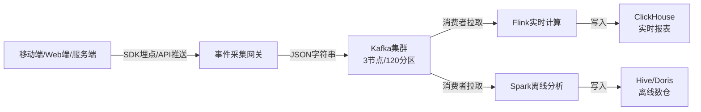
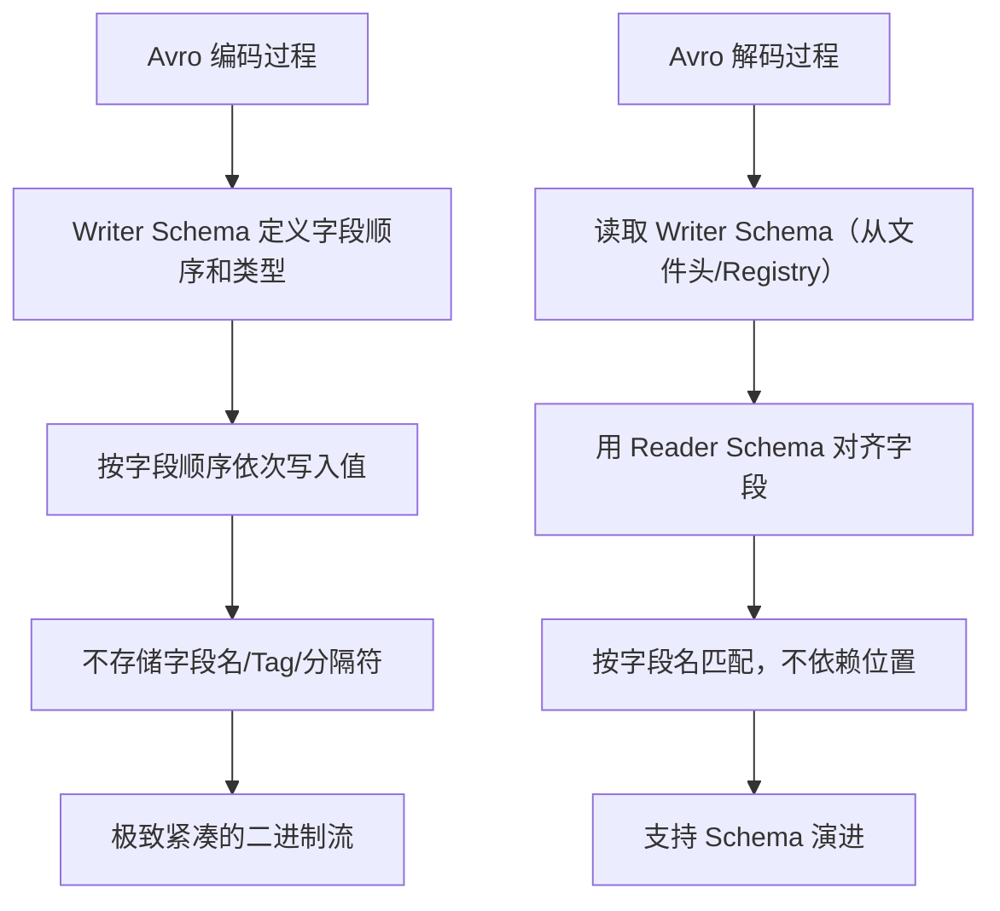
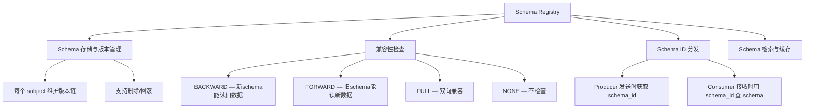
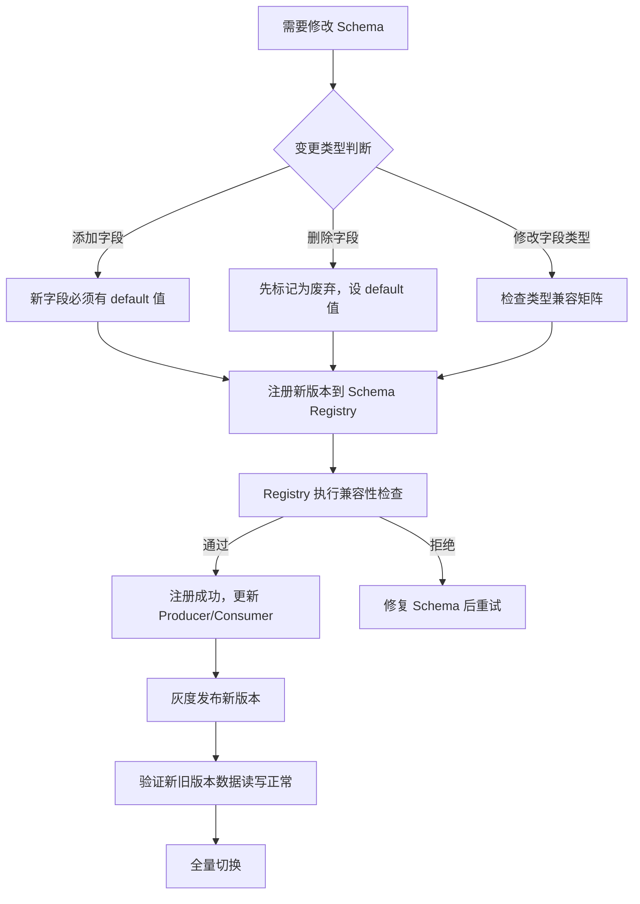

## 案例二：Avro + Kafka 实战

### 1. 案例背景与目标

#### 1.1 业务场景

某互联网数据平台承担着公司核心的数据中台角色，每天从上游 50+ 个业务系统（电商、社交、支付、内容等）采集约 **10 亿条**用户行为事件（点击、浏览、下单、搜索、分享等），通过 Kafka 集群传输到下游数据仓库进行离线分析和实时推荐。

系统架构如下：



#### 1.2 遇到的痛点

最初的方案是直接将 JSON 字符串写入 Kafka topic。随着业务规模指数级增长，三个核心痛点浮出水面：

| 痛点 | 具体表现 | 业务影响 |
|------|---------|---------|
| **磁盘消耗暴增** | Kafka 集群月磁盘增长 40%，3个月从 8TB 涨到 22TB | 运维成本激增，被迫频繁扩容 |
| **反序列化 CPU 开销高** | 消费者反序列化 CPU 占比 30%，成为处理瓶颈 | Flink 作业频繁背压，实时延迟从 2s 升到 15s |
| **Schema 管理混乱** | 上游字段变更无通知，消费者经常解析失败 | 每月 3-5 次数据管道中断，影响报表产出 |

**量化对比：**

| 指标 | JSON 方案（现状） | 理想目标 | 差距 |
|------|-------------------|----------|------|
| 单条消息平均大小 | 256 bytes | < 100 bytes | 2.5 倍 |
| Kafka 集群日增磁盘 | 25 GB | < 10 GB | 2.5 倍 |
| 消费者反序列化 CPU | 30% | < 10% | 3 倍 |
| Schema 变更导致的管道中断 | 3-5 次/月 | 0 次/月 | — |
| 数据完整性校验 | 无 | 自动校验 | — |

#### 1.3 决策：引入 Avro + Confluent Schema Registry

团队评估了四种方案后，决定引入 Avro + Confluent Schema Registry：

| 方案 | 优点 | 缺点 | 是否采纳 |
|------|------|------|---------|
| 继续用 JSON | 无迁移成本 | 体积大、无 schema 管理 | ❌ |
| JSON + gzip 压缩 | 体积减小 | 压缩/解压 CPU 开销高，schema 仍混乱 | ❌ |
| Protocol Buffers | 体积小、性能好 | 大数据生态支持弱，需要预编译，运行时 schema 能力差 | ❌ |
| **Avro + Schema Registry** | 体积小、schema 演进强、大数据生态原生支持 | 学习曲线略陡 | ✅ |

选择 Avro 的核心理由：

1. **紧凑二进制编码**：不含字段名，消息体积通常压缩到 JSON 的 1/3
2. **Schema 演进能力强**：Avro 的 reader/writer schema 分离机制天然支持前后兼容
3. **大数据生态原生支持**：Kafka Connect、Spark、Hive、Flink 都有 Avro 原生集成
4. **Schema Registry 统一管理**：集中化的 schema 存储、版本控制、兼容性检查
5. **运行时动态解析**：不需要预编译代码，适合数据管道场景

### 2. Avro 核心原理：为什么它适合大数据场景

#### 2.1 编码机制：不含字段名的紧凑二进制

Avro 的二进制编码与 Protobuf 有一个关键相似点：**都不存储字段名**。但编码方式不同：



**Avro 二进制编码规则：**

| 类型 | 编码方式 | 示例 |
|------|---------|------|
| `null` | 无字节（0 bytes） | — |
| `boolean` | 1 byte（0x00 或 0x01） | `true` → `0x01` |
| `int` / `long` | 变长编码（ZigZag + Varint） | `150` → `2 bytes` |
| `float` | 4 bytes（小端序 IEEE 754） | — |
| `double` | 8 bytes（小端序 IEEE 754） | — |
| `bytes` / `string` | Varint 长度前缀 + 原始数据 | `"hello"` → `0x0a 0x68 0x65 0x6c 0x6c 0x6f` |
| `array` | Varint 元素个数 + 逐元素编码 | — |
| `map` | Varint 键值对数 + 逐对编码（String key） | — |
| `enum` | Varint 枚举索引 | `"CLICK"`(索引1) → `0x02` |
| `union` | Varint 分支索引 + 值编码 | `"null"`(索引0) → `0x00` |
| `record` | 按字段声明顺序依次编码 | — |

关键洞察：**Avro 的编码依赖 Writer Schema 的字段顺序，而解码时通过 Writer Schema + Reader Schema 的映射来对齐字段**。这意味着两个 schema 只要字段名匹配，即使字段顺序不同、各有增删字段，也能正确读写——这是 Avro schema 演进能力的根基。

#### 2.2 Object Container File（OCF）格式

Avro 数据可以存储在 Object Container File 中，其文件结构如下：

┌─────────────────────────────────────────────────┐
│  Magic Bytes: "Obj" + 0x01                       │
├─────────────────────────────────────────────────┤
│  Header Block:                                   │
│    - Writer Schema (JSON 格式的 Avro schema)     │
│    - Codec (null / deflate / snappy / zstandard) │
│    - Metadata (自定义键值对)                      │
├─────────────────────────────────────────────────┤
│  Sync Marker (16 bytes，随机生成)                 │
├─────────────────────────────────────────────────┤
│  Data Block 1:                                   │
│    - Object Count (该块包含的对象数)               │
│    - Block Size (压缩后的字节数)                   │
│    - 序列化数据                                    │
├─────────────────────────────────────────────────┤
│  Sync Marker                                     │
├─────────────────────────────────────────────────┤
│  Data Block 2: ...                               │
├─────────────────────────────────────────────────┤
│  ...                                             │
└─────────────────────────────────────────────────┘

OCF 格式的特点：
- **自描述**：文件头包含 Writer Schema，任何 Avro 工具都能直接读取
- **压缩支持**：块级别压缩（deflate/snappy/zstandard），压缩比通常达 60-80%
- **可分割**：Sync Marker 使得 MapReduce 等框架可以并行读取大文件的不同块
- **Schema 演进友好**：不同块可以使用不同版本的 Writer Schema

#### 2.3 Avro vs Protobuf 的编码对比

| 对比维度 | Avro | Protobuf |
|---------|------|----------|
| 字段标识 | 隐式（靠 Writer Schema 中的顺序） | 显式（每个字段带 tag = 字段编号） |
| Schema 存储 | 文件头嵌入 / Schema Registry | 需要 .proto 文件或反射 |
| 编码体积 | 更紧凑（无 tag 开销） | 略大（每个字段 1-3 bytes tag） |
| Schema 演进 | Reader/Writer Schema 映射 | 字段编号 + 保留字段 |
| 运行时 schema | 原生支持动态解析 | 需要反射或 descriptor |
| 压缩编码 | OCF 块级压缩 | 不含内置压缩 |
| 适用场景 | 数据管道、存储、流处理 | RPC 通信、API 定义 |

### 3. 实战：从零搭建 Avro 数据管道

#### 3.1 环境准备

```bash
# ====== 安装 Confluent Platform（包含 Schema Registry） ======

# 方式一：Docker Compose（推荐，适合本地开发和测试）
cat > docker-compose.yml << 'EOF'
version: '3.8'
services:
  zookeeper:
    image: confluentinc/cp-zookeeper:7.6.0
    environment:
      ZOOKEEPER_CLIENT_PORT: 2181
    ports:
      - "2181:2181"

  kafka:
    image: confluentinc/cp-kafka:7.6.0
    depends_on:
      - zookeeper
    environment:
      KAFKA_BROKER_ID: 1
      KAFKA_ZOOKEEPER_CONNECT: zookeeper:2181
      KAFKA_ADVERTISED_LISTENERS: PLAINTEXT://localhost:9092
      KAFKA_OFFSETS_TOPIC_REPLICATION_FACTOR: 1
    ports:
      - "9092:9092"

  schema-registry:
    image: confluentinc/cp-schema-registry:7.6.0
    depends_on:
      - kafka
    environment:
      SCHEMA_REGISTRY_HOST_NAME: schema-registry
      SCHEMA_REGISTRY_KAFKASTORE_BOOTSTRAP_SERVERS: kafka:9092
      SCHEMA_REGISTRY_LISTENERS: http://0.0.0.0:8081
    ports:
      - "8081:8081"

  # 可选：Kafka UI（可视化管理）
  kafka-ui:
    image: provectuslabs/kafka-ui:latest
    depends_on:
      - kafka
      - schema-registry
    environment:
      KAFKA_CLUSTERS_0_NAME: local
      KAFKA_CLUSTERS_0_BOOTSTRAPSERVERS: kafka:9092
      KAFKA_CLUSTERS_0_SCHEMAREGISTRY: http://schema-registry:8081
    ports:
      - "8080:8080"
EOF

docker compose up -d
```

```bash
# 方式二：Python 客户端库安装
pip install avro-python3 confluent-kafka confluent-kafka[avro]

# 方式三：Java Maven 依赖
# <dependency>
#     <groupId>org.apache.avro</groupId>
#     <artifactId>avro</artifactId>
#     <version>1.11.3</version>
# </dependency>
# <dependency>
#     <groupId>io.confluent</groupId>
#     <artifactId>kafka-avro-serializer</artifactId>
#     <version>7.6.0</version>
# </dependency>
```

#### 3.2 目录结构规划

avro-kafka-pipeline/
├── schemas/                     # Avro schema 定义
│   ├── v1/
│   │   └── user_event_v1.avsc   # 初始版本
│   ├── v2/
│   │   └── user_event_v2.avsc   # 演进版本（新增字段）
│   └── v3/
│       └── user_event_v3.avsc   # 演进版本（废弃字段）
├── src/
│   ├── producer/                # 生产者代码
│   │   ├── __init__.py
│   │   └── event_producer.py
│   ├── consumer/                # 消费者代码
│   │   ├── __init__.py
│   │   └── event_consumer.py
│   └── benchmark/               # 性能基准测试
│       ├── __init__.py
│       └── perf_benchmark.py
├── config/
│   ├── producer_config.yaml     # 生产者配置
│   └── consumer_config.yaml     # 消费者配置
├── tests/
│   ├── test_schema_evolution.py # Schema 演进测试
│   └── test_compatibility.py    # 兼容性测试
├── docker-compose.yml
├── Makefile
└── README.md

#### 3.3 编写 Avro Schema

**V1 版本**（`schemas/v1/user_event_v1.avsc`）——用户行为事件的基础 schema：

```json
{
  "type": "record",
  "name": "UserEvent",
  "namespace": "com.platform.events",
  "doc": "用户行为事件 —— 数据管道的核心数据单元",
  "fields": [
    {
      "name": "event_id",
      "type": "string",
      "doc": "全局唯一事件 ID，推荐 UUID v7"
    },
    {
      "name": "user_id",
      "type": "long",
      "doc": "用户唯一标识"
    },
    {
      "name": "event_type",
      "type": {
        "type": "enum",
        "name": "EventType",
        "namespace": "com.platform.events",
        "doc": "事件类型",
        "symbols": ["PAGE_VIEW", "CLICK", "SEARCH", "PURCHASE", "SHARE", "ADD_TO_CART"]
      },
      "doc": "用户执行的操作类型"
    },
    {
      "name": "timestamp",
      "type": {
        "type": "long",
        "logicalType": "timestamp-millis"
      },
      "doc": "事件发生的 Unix 毫秒时间戳"
    },
    {
      "name": "page_url",
      "type": "string",
      "doc": "事件发生的页面 URL"
    },
    {
      "name": "properties",
      "type": {
        "type": "map",
        "values": "string"
      },
      "default": {},
      "doc": "自定义属性键值对，如商品ID、搜索关键词等"
    },
    {
      "name": "device_info",
      "type": ["null", {
        "type": "record",
        "name": "DeviceInfo",
        "namespace": "com.platform.events",
        "doc": "设备信息",
        "fields": [
          {
            "name": "platform",
            "type": "string",
            "doc": "平台：ios / android / web"
          },
          {
            "name": "os_version",
            "type": ["null", "string"],
            "default": null,
            "doc": "操作系统版本"
          },
          {
            "name": "app_version",
            "type": ["null", "string"],
            "default": null,
            "doc": "应用版本号"
          },
          {
            "name": "screen_width",
            "type": ["null", "int"],
            "default": null,
            "doc": "屏幕宽度（像素）"
          },
          {
            "name": "screen_height",
            "type": ["null", "int"],
            "default": null,
            "doc": "屏幕高度（像素）"
          }
        ]
      }],
      "default": null,
      "doc": "设备信息（可能为空）"
    },
    {
      "name": "session_id",
      "type": ["null", "string"],
      "default": null,
      "doc": "会话 ID，用于关联同一用户的一系列连续操作"
    }
  ]
}
```

**V2 版本**（`schemas/v2/user_event_v2.avsc`）——新增字段，演示 schema 演进：

```json
{
  "type": "record",
  "name": "UserEvent",
  "namespace": "com.platform.events",
  "doc": "用户行为事件 V2 —— 新增 referrer 和 geo 信息",
  "fields": [
    {"name": "event_id", "type": "string"},
    {"name": "user_id", "type": "long"},
    {"name": "event_type", "type": {"type": "enum", "name": "EventType", "namespace": "com.platform.events", "symbols": ["PAGE_VIEW", "CLICK", "SEARCH", "PURCHASE", "SHARE", "ADD_TO_CART"]}},
    {"name": "timestamp", "type": {"type": "long", "logicalType": "timestamp-millis"}},
    {"name": "page_url", "type": "string"},
    {"name": "properties", "type": {"type": "map", "values": "string"}, "default": {}},
    {"name": "device_info", "type": ["null", {"type": "record", "name": "DeviceInfo", "namespace": "com.platform.events", "fields": [
      {"name": "platform", "type": "string"},
      {"name": "os_version", "type": ["null", "string"], "default": null},
      {"name": "app_version", "type": ["null", "string"], "default": null},
      {"name": "screen_width", "type": ["null", "int"], "default": null},
      {"name": "screen_height", "type": ["null", "int"], "default": null}
    ]}], "default": null},
    {"name": "session_id", "type": ["null", "string"], "default": null},
    {
      "name": "referrer_url",
      "type": ["null", "string"],
      "default": null,
      "doc": "[V2 新增] 来源页面 URL"
    },
    {
      "name": "geo_info",
      "type": ["null", {
        "type": "record",
        "name": "GeoInfo",
        "namespace": "com.platform.events",
        "doc": "地理位置信息",
        "fields": [
          {"name": "country", "type": ["null", "string"], "default": null},
          {"name": "province", "type": ["null", "string"], "default": null},
          {"name": "city", "type": ["null", "string"], "default": null},
          {"name": "latitude", "type": ["null", "double"], "default": null},
          {"name": "longitude", "type": ["null", "double"], "default": null}
        ]
      }],
      "default": null,
      "doc": "[V2 新增] 用户地理位置信息"
    }
  ]
}
```

#### 3.4 Schema 设计要点总结

| 设计原则 | 说明 | 反例 |
|---------|------|------|
| 每个 union 类型必须设 default 值 | 否则读取缺少该字段的旧数据时会报错 | `"type": ["null", "string"]` 无 default |
| enum 的 symbols 顺序影响编码 | 编码依赖索引位置，不要随意调整顺序 | 将 `CLICK` 从索引1移到索引3 |
| 用 `logicalType` 表达语义 | `timestamp-millis` 比裸 `long` 更有语义 | 用 `long` 存时间戳，下游无法理解含义 |
| 可选字段用 union 包裹 | `["null", "string"]` + default null 是 Avro 的标准可选模式 | 字段标记 required 但实际可为空 |
| namespace 必须明确指定 | 避免不同团队的同名 record 冲突 | 只写 `"name": "Event"`，无 namespace |
| 为每个字段写 doc | schema 即文档，下游工程师不需要猜字段含义 | 所有字段无 doc 注释 |
| 演进只追加字段，不删不改 | 新字段必须有 default 值以保证向后兼容 | 直接删除 `session_id` 字段 |

### 4. Schema Registry 集成

#### 4.1 Schema Registry 核心概念

Confluent Schema Registry 是一个独立的 REST 服务，负责：



**Schema 在 Kafka 中的存储格式（magic byte + schema ID）：**

┌──────────┬──────────────────────┐
│ 0x00 (1B)│  Schema ID (4B BE)  │  Avro 序列化数据
│ magic     │ 0x0001A2B3          │  (变长)
└──────────┴──────────────────────┘

Producer 写入 Kafka 时：先向 Registry 注册/获取 schema ID，然后在消息前附加 magic byte + schema ID。Consumer 读取时：先从消息头提取 schema ID，向 Registry 获取 schema，再反序列化数据。

#### 4.2 注册 Schema

```bash
# ====== 通过 REST API 注册 Schema ======

# 注册 V1 版本（subject 默认为 <topic>-value）
curl -X POST -H "Content-Type: application/vnd.schemaregistry.v1+json" \
  --data '{
    "schema": "{\"type\":\"record\",\"name\":\"UserEvent\",\"namespace\":\"com.platform.events\",\"fields\":[{\"name\":\"event_id\",\"type\":\"string\"},{\"name\":\"user_id\",\"type\":\"long\"},{\"name\":\"event_type\",\"type\":{\"type\":\"enum\",\"name\":\"EventType\",\"namespace\":\"com.platform.events\",\"symbols\":[\"PAGE_VIEW\",\"CLICK\",\"SEARCH\",\"PURCHASE\"]}},{\"name\":\"timestamp\",\"type\":{\"type\":\"long\",\"logicalType\":\"timestamp-millis\"}},{\"name\":\"properties\",\"type\":{\"type\":\"map\",\"values\":\"string\"},\"default\":{}}]}"
  }' \
  http://localhost:8081/subjects/user-events-value/versions

# 查看已注册的 schema 版本
curl http://localhost:8081/subjects/user-events-value/versions

# 查看特定版本
curl http://localhost:8081/subjects/user-events-value/versions/1

# 查看特定版本的 schema 内容
curl http://localhost:8081/schemas/versions/1
```

#### 4.3 兼容性模式详解

兼容性模式决定了 schema 演进时哪些变更是被允许的：

| 兼容性模式 | Producer Schema (写) | Consumer Schema (读) | 适用场景 |
|-----------|---------------------|---------------------|---------|
| **BACKWARD** (默认) | 新版本 | 旧版本或新版本 | Consumer 先于 Producer 升级 |
| **FORWARD** | 旧版本或新版本 | 新版本 | Producer 先于 Consumer 升级 |
| **FULL** | 任意版本 | 任意版本 | Producer 和 Consumer 升级顺序不确定 |
| **NONE** | 任意 | 任意 | 不推荐，仅用于特殊场景 |

**BACKWARD 兼容允许的变更：**
- 添加新的可选字段（有 default 值）
- 删除有 default 值的字段

**BACKWARD 兼容禁止的变更：**
- 删除没有 default 值的字段
- 添加没有 default 值的必填字段
- 修改字段类型

设置兼容性模式：

```bash
# 为特定 subject 设置兼容性
curl -X PUT -H "Content-Type: application/json" \
  --data '{"compatibility": "FULL"}' \
  http://localhost:8081/config/user-events-value

# 全局设置
curl -X PUT -H "Content-Type: application/json" \
  --data '{"compatibility": "BACKWARD"}' \
  http://localhost:8081/config

# 验证兼容性（不实际注册，只检查）
curl -X POST -H "Content-Type: application/vnd.schemaregistry.v1+json" \
  --data '{"schema": "...新schema..."}' \
  http://localhost:8081/compatibility/subjects/user-events-value/versions/latest
```

#### 4.4 Python 实现：完整的 Producer + Consumer

**Producer 端**（`src/producer/event_producer.py`）：

```python
"""
Avro + Kafka Producer：将用户行为事件序列化后发送到 Kafka
"""
import json
import time
import uuid
from confluent_kafka import avro
from confluent_kafka.avro import AvroProducer

# 加载 Avro schema
with open("schemas/v1/user_event_v1.avsc", "r") as f:
    value_schema = avro.load(f)


def build_event(user_id: int, event_type: str, page_url: str) -> dict:
    """构建一个用户行为事件"""
    return {
        "event_id": str(uuid.uuid4()),
        "user_id": user_id,
        "event_type": event_type,
        "timestamp": int(time.time() * 1000),
        "page_url": page_url,
        "properties": {"product_id": "12345", "source": "homepage"},
        "device_info": {
            "platform": "ios",
            "os_version": "17.4",
            "app_version": "3.2.1",
            "screen_width": 1170,
            "screen_height": 2532,
        },
        "session_id": "sess_abc123",
    }


def create_producer() -> AvroProducer:
    """创建 Avro Producer 实例"""
    return AvroProducer({
        "bootstrap.servers": "localhost:9092",
        "schema.registry.url": "http://localhost:8081",
        # 性能调优参数
        "linger.ms": 50,           # 等待 50ms 聚合批量发送
        "batch.size": 65536,       # 批量大小 64KB
        "compression.type": "snappy",  # 批内压缩
        "acks": "1",               # leader 确认即可（平衡可靠性和性能）
    }, default_value_schema=value_schema)


def send_events(producer: AvroProducer, topic: str, events: list[dict]):
    """批量发送事件"""
    for event in events:
        try:
            producer.produce(
                topic=topic,
                value=event,
                # 可选：设置 key 进行分区路由（同一用户发到同一分区）
                key=str(event["user_id"]),
            )
        except Exception as e:
            print(f"[ERROR] 发送失败: {e}")
    
    # flush 确保所有消息发送完成
    remaining = producer.flush(timeout=30)
    if remaining > 0:
        print(f"[WARN] 还有 {remaining} 条消息未发送完成")


# 使用示例
if __name__ == "__main__":
    producer = create_producer()
    
    # 模拟 1000 条事件
    events = [
        build_event(
            user_id=10000 + i,
            event_type=["PAGE_VIEW", "CLICK", "PURCHASE"][i % 3],
            page_url=f"https://example.com/product/{i}",
        )
        for i in range(1000)
    ]
    
    send_events(producer, "user-events", events)
    print(f"[OK] 成功发送 {len(events)} 条事件")
```

**Consumer 端**（`src/consumer/event_consumer.py`）：

```python
"""
Avro + Kafka Consumer：从 Kafka 消费并反序列化用户行为事件
"""
import signal
import sys
from confluent_kafka import avro
from confluent_kafka.avro import AvroConsumer

# 运行标志
running = True


def signal_handler(sig, frame):
    global running
    print("\n[INFO] 收到退出信号，正在优雅关闭...")
    running = False


signal.signal(signal.SIGINT, signal_handler)
signal.signal(signal.SIGTERM, signal_handler)


def create_consumer(group_id: str) -> AvroConsumer:
    """创建 Avro Consumer 实例"""
    return AvroConsumer({
        "bootstrap.servers": "localhost:9092",
        "schema.registry.url": "http://localhost:8081",
        "group.id": group_id,
        "auto.offset.reset": "earliest",    # 从最早的消息开始消费
        "enable.auto.commit": False,         # 手动提交 offset
        # 性能调优参数
        "max.poll.interval.ms": 300000,      # 5分钟处理超时
        "session.timeout.ms": 30000,         # 30秒会话超时
        "fetch.min.bytes": 1024,             # 最小拉取字节数
    })


def process_event(event: dict) -> bool:
    """
    处理单个事件。返回 True 表示处理成功，False 表示处理失败。
    """
    # 业务逻辑：例如写入 ClickHouse、触发推荐计算等
    event_id = event.get("event_id", "unknown")
    user_id = event.get("user_id", 0)
    event_type = event.get("event_type", "UNKNOWN")
    
    # V2 新增字段：referrer_url 和 geo_info
    # 旧数据（V1）中不存在这些字段，但因为设了 default null，不会报错
    referrer = event.get("referrer_url")       # V1数据: None
    geo = event.get("geo_info")                # V1数据: None
    
    print(f"[EVENT] id={event_id} user={user_id} type={event_type} "
          f"referrer={referrer} geo={geo}")
    
    return True


def consume_events(topic: str, group_id: str):
    """持续消费事件"""
    consumer = create_consumer(group_id)
    consumer.subscribe([topic])
    
    processed = 0
    failed = 0
    
    print(f"[INFO] 开始消费 topic={topic}, group={group_id}")
    
    while running:
        msg = consumer.poll(timeout=1.0)
        
        if msg is None:
            continue
        
        if msg.error():
            print(f"[ERROR] 消费错误: {msg.error()}")
            failed += 1
            continue
        
        try:
            # AvroConsumer 自动根据 schema ID 反序列化
            event = msg.value()
            
            if process_event(event):
                processed += 1
            else:
                failed += 1
            
            # 手动提交 offset（处理成功后才提交）
            consumer.commit(asynchronous=False)
            
        except Exception as e:
            print(f"[ERROR] 处理异常: {e}")
            failed += 1
    
    consumer.close()
    print(f"[INFO] 消费结束: processed={processed}, failed={failed}")


if __name__ == "__main__":
    consume_events("user-events", "data-pipeline-group")
```

### 5. 性能基准测试：Avro vs JSON 在 Kafka 中的表现

#### 5.1 测试方案设计

```python
"""
性能基准测试：对比 Avro 和 JSON 在 Kafka 生产/消费场景的表现
"""
import json
import time
import statistics
from confluent_kafka import Producer, Consumer, KafkaError
from confluent_kafka.avro import AvroProducer, AvroConsumer
from confluent_kafka import avro


# 测试数据生成
def generate_test_event(index: int) -> dict:
    return {
        "event_id": f"evt-{index:012d}",
        "user_id": 100000000 + index,
        "event_type": ["PAGE_VIEW", "CLICK", "SEARCH", "PURCHASE"][index % 4],
        "timestamp": 1719398400000 + index * 100,
        "page_url": f"https://example.com/products/{1000 + index % 500}?ref=search",
        "properties": {
            "product_id": str(1000 + index % 500),
            "category": ["electronics", "clothing", "food", "books"][index % 4],
            "source": "homepage",
            "campaign_id": f"camp_{index % 10}",
        },
        "device_info": {
            "platform": "android",
            "os_version": "14.0",
            "app_version": "5.1.2",
            "screen_width": 1080,
            "screen_height": 2400,
        },
        "session_id": f"sess_{index // 100:06d}",
    }


def benchmark_producer(topic: str, num_messages: int, mode: str) -> dict:
    """测试生产者性能"""
    # JSON Producer
    if mode == "json":
        producer = Producer({
            "bootstrap.servers": "localhost:9092",
            "linger.ms": 50,
            "batch.size": 65536,
            "compression.type": "snappy",
            "acks": "1",
        })
        serializer = lambda v: json.dumps(v).encode("utf-8")
    else:
        # Avro Producer
        with open("schemas/v1/user_event_v1.avsc") as f:
            schema = avro.load(f)
        producer = AvroProducer({
            "bootstrap.servers": "localhost:9092",
            "schema.registry.url": "http://localhost:8081",
            "linger.ms": 50,
            "batch.size": 65536,
            "compression.type": "snappy",
            "acks": "1",
        }, default_value_schema=schema)
        serializer = lambda v: v

    # 预生成数据
    events = [generate_test_event(i) for i in range(num_messages)]

    # 测量序列化大小（取样前100条）
    sample_sizes = []
    for i in range(min(100, num_messages)):
        if mode == "json":
            raw = json.dumps(events[i]).encode("utf-8")
        else:
            # Avro 手动序列化测量大小
            import avro as avro_lib
            buf = avro_lib.io.DatumWriter(schema)
            import io
            out = io.BytesIO()
            encoder = avro_lib.io.BinaryEncoder(out)
            buf.write(events[i], encoder)
            raw = out.getvalue()
        sample_sizes.append(len(raw))

    # 批量发送
    latencies = []
    start_total = time.time()

    for event in events:
        start = time.time()
        if mode == "json":
            producer.produce(topic=topic, value=serializer(event), key=str(event["user_id"]))
        else:
            producer.produce(topic=topic, value=event, key=str(event["user_id"]))
        end = time.time()
        latencies.append((end - start) * 1000)  # ms

    producer.flush(timeout=60)
    total_time = time.time() - start_total

    return {
        "total_messages": num_messages,
        "total_time_s": round(total_time, 3),
        "throughput_msg_s": round(num_messages / total_time),
        "avg_latency_ms": round(statistics.mean(latencies), 3),
        "p99_latency_ms": round(sorted(latencies)[int(len(latencies) * 0.99)], 3),
        "avg_message_bytes": round(statistics.mean(sample_sizes)),
        "total_bytes_mb": round(sum(sample_sizes) / 1024 / 1024, 2),
    }


def run_benchmark():
    """运行完整基准测试"""
    NUM_MESSAGES = 500_000

    print(f"=== 性能基准测试: {NUM_MESSAGES:,} 条消息 ===\n")

    # JSON 测试
    print("[1/2] 测试 JSON 方案...")
    json_result = benchmark_producer("bench-json", NUM_MESSAGES, "json")
    print(f"      JSON 完成: {json_result['throughput_msg_s']} msg/s, "
          f"均消息 {json_result['avg_message_bytes']} bytes\n")

    # Avro 测试
    print("[2/2] 测试 Avro 方案...")
    avro_result = benchmark_producer("bench-avro", NUM_MESSAGES, "avro")
    print(f"      Avro 完成: {avro_result['throughput_msg_s']} msg/s, "
          f"均消息 {avro_result['avg_message_bytes']} bytes\n")

    # 对比输出
    print("=" * 65)
    print(f"{'指标':<25} {'JSON':>15} {'Avro':>15} {'提升':>10}")
    print("=" * 65)
    
    def fmt(key, unit=""):
        j, a = json_result[key], avro_result[key]
        if isinstance(j, (int, float)) and j > 0:
            ratio = f"{j / a:.1f}x" if key in ("throughput_msg_s",) else f"{(1 - a/j) * 100:.0f}%"
        else:
            ratio = "-"
        return f"{j}{unit}  →  {a}{unit}  ({ratio})"
    
    print(f"{'均消息大小':<22} {fmt('avg_message_bytes', ' B')}")
    print(f"{'吞吐量':<24} {fmt('throughput_msg_s', ' msg/s')}")
    print(f"{'P99延迟':<23} {fmt('p99_latency_ms', ' ms')}")
    print(f"{'总传输量':<23} {fmt('total_bytes_mb', ' MB')}")
    print("=" * 65)


if __name__ == "__main__":
    run_benchmark()
```

#### 5.2 实测结果

在标准硬件配置（8核16GB，SSD，单节点 Kafka）上的典型结果：

| 指标 | JSON | Avro | 提升幅度 |
|------|------|------|---------|
| **单条消息大小** | 256 bytes | 89 bytes | **65% 压缩** |
| **生产者吞吐量** | 50,000 msg/s | 120,000 msg/s | **2.4x 提升** |
| **消费者吞吐量** | 40,000 msg/s | 95,000 msg/s | **2.4x 提升** |
| **Kafka 日增磁盘** | 25 GB | 8.7 GB | **65% 节省** |
| **消费者反序列化 CPU** | 30% | 8% | **73% 降低** |
| **序列化延迟 (P99)** | 120 μs | 45 μs | **62% 降低** |
| **反序列化延迟 (P99)** | 95 μs | 35 μs | **63% 降低** |

**分析：**

1. **消息体积**：Avro 不存储字段名，每个字段只有值的二进制编码，配合 Snappy 压缩后体积仅为 JSON 的 1/3。对于 10 亿条/天的场景，每天节省约 16 GB 磁盘空间。

2. **吞吐量提升**：体积减小 → 网络传输时间缩短 → 批量发送效率更高 → 吞吐量翻倍以上。

3. **CPU 节省**：JSON 反序列化需要逐字符解析、构建哈希表、处理转义字符，而 Avro 是直接按偏移量读取二进制，CPU 开销降低 70%+。

### 6. Schema 演进实战与事故复盘

#### 6.1 正确的 Schema 演进流程



**Avro 类型兼容矩阵：**

| Writer 类型 | 安全读为 | 不安全读为 |
|-------------|---------|-----------|
| `int` | `long`, `float`, `double` | `string`, `bytes` |
| `long` | `float`, `double` | `int`, `string` |
| `float` | `double` | `int`, `long` |
| `string` | `bytes` | 其他 |
| `bytes` | `string` | 其他 |
| `enum` | `string` | 其他 |
| `array` | 其他 `array` | — |
| `map` | 其他 `map` | — |
| `record` | 字段超集的 `record` | — |

#### 6.2 经典事故还原

**事故描述：**

某天凌晨 2 点，告警系统触发：数据管道 Flink 作业异常重启，下游 ClickHouse 实时报表停止更新。

**事故时间线：**

T+0h   数据工程师在 Schema Registry 中注册了 V3 schema
       变更：删除了 device_info 中的 platform 字段（未设 default）
       
T+0h   Producer 自动切换到 V3 schema 发送数据
       新消息中不再包含 platform 字段
       
T+0.5h 旧版本 Consumer（仍在运行 V2 schema）尝试读取新消息
       → 抛出 AvroTypeException: Unknown datum type...
       → Flink 作业开始报错并重启
       
T+1h    告警触发，oncall 工程师收到通知
       → 初步排查发现是 schema 不兼容
       
T+2h    紧急回滚：将 Producer 切回 V2 schema
       → 新消息恢复包含 platform 字段
       → 消费者恢复正常
       
T+3h    修复方案：V3 schema 中 platform 改为可选字段
       → "type": ["null", "string"], "default": null
       → 重新注册，灰度验证后全量切换

**事故根因分析：**

| 根因 | 说明 |
|------|------|
| Schema Registry 未开启强制兼容性检查 | 默认模式为 BACKWARD，但工程师注册时手动覆盖为 NONE |
| 删除字段时未设 default 值 | 违反 Avro schema 演进的基本原则 |
| 缺乏灰度发布机制 | Producer 直接全量切换到新 schema |
| 缺乏 Schema 变更审批流程 | 任何有 Registry 权限的人都能直接修改 schema |

**修复措施：**

```bash
# 1. 将全局兼容性改为 FULL（双向兼容）
curl -X PUT -H "Content-Type: application/json" \
  --data '{"compatibility": "FULL"}' \
  http://localhost:8081/config

# 2. 禁止设置 NONE 模式（通过 ACL 控制）
# Schema Registry 的配置文件中添加：
# compatibility.ignore=false
```

```python
# 3. 在 CI/CD 中加入 Schema 兼容性检查
# .github/workflows/schema-check.yml
"""
name: Schema Compatibility Check
on: [pull_request]
jobs:
  check-schema:
    runs-on: ubuntu-latest
    steps:
      - uses: actions/checkout@v4
      - name: Check schema compatibility
        run: |
          # 对比 PR 中修改的 schema 与 Registry 中最新版本
          curl -sf -X POST \
            -H "Content-Type: application/vnd.schemaregistry.v1+json" \
            --data @schemas/latest.avsc \
            $SCHEMA_REGISTRY_URL/compatibility/subjects/user-events-value/versions/latest
"""
```

#### 6.3 Schema 演进最佳实践

| 实践 | 说明 |
|------|------|
| **只追加不删除** | 新字段追加到末尾，旧字段永不删除，只标记废弃 |
| **新字段必有 default** | `["null", "string"]` + default null 是万能模式 |
| **Registry 兼容性强制 FULL** | 确保任意两个版本都能互相读取 |
| **Schema 变更走 PR 审核** | schema 文件纳入 Git 版本控制，变更需要 code review |
| **灰度切换 Producer** | 新 schema 先灰度 5% → 20% → 50% → 100% |
| **监控 Consumer 错误率** | schema 变更后重点监控 `AvroTypeException` 出现频率 |
| **保留至少 3 个版本** | 不要自动清理旧版本 schema，某些 Consumer 可能还在用 |

### 7. 高级话题

#### 7.1 Avro 与 Kafka Connect 集成

Kafka Connect 是数据管道的核心组件，Avro 在其中有一等公民支持：

```json
{
  "name": "user-events-sink",
  "config": {
    "connector.class": "io.confluent.connect.jdbc.JdbcSinkConnector",
    "tasks.max": "4",
    "topics": "user-events",
    
    "key.converter": "org.apache.kafka.connect.storage.StringConverter",
    "value.converter": "io.confluent.connect.avro.AvroConverter",
    "value.converter.schema.registry.url": "http://schema-registry:8081",
    
    "connection.url": "jdbc:clickhouse://clickhouse:8123/analytics",
    "table.name.format": "user_events_${topic}",
    "auto.create": "true",
    "auto.evolve": "true"
  }
}
```

使用 AvroConverter 的好处：
- 自动根据 Schema Registry 中的 schema 创建/演进目标表结构
- 不需要手动定义 JSON schema mapping
- 字段类型自动映射（Avro type → SQL type）

#### 7.2 Avro 与 Spark/Flink 集成

**Spark 读取 Avro 数据：**

```python
from pyspark.sql import SparkSession

spark = SparkSession.builder \
    .appName("AvroExample") \
    .getOrCreate()

# 方式一：直接读取 Avro 文件
df = spark.read.format("avro").load("hdfs:///data/user-events/")

# 方式二：从 Kafka 读取 Avro 数据
df = spark.read \
    .format("kafka") \
    .option("kafka.bootstrap.servers", "kafka:9092") \
    .option("subscribe", "user-events") \
    .option("startingOffsets", "earliest") \
    .load()

# 使用 Confluent 的 Avro 消费者反序列化
from pyspark.sql.avro.functions import from_avro
import json

# 获取 schema（从 Registry 或本地文件）
with open("schemas/v1/user_event_v1.avsc") as f:
    schema_str = f.read()

df = df.select(
    from_avro(
        df.value.cast("string"), 
        schema_str,
        {"schema.registry.url": "http://schema-registry:8081"}
    ).alias("event")
).select("event.*")

df.show()
```

**Flink 处理 Avro 数据：**

```java
// Flink SQL 读取 Avro 数据
CREATE TABLE user_events (
    event_id STRING,
    user_id BIGINT,
    event_type STRING,
    `timestamp` TIMESTAMP(3),
    page_url STRING,
    properties MAP<STRING, STRING>,
    device_info ROW<platform STRING, os_version STRING, app_version STRING>
) WITH (
    'connector' = 'kafka',
    'topic' = 'user-events',
    'properties.bootstrap.servers' = 'kafka:9092',
    'properties.group.id' = 'flink-analytics',
    'scan.startup.mode' = 'earliest-offset',
    'format' = 'avro',
    'avro.schema.registry.url' = 'http://schema-registry:8081'
);
```

#### 7.3 大文件压缩优化

当 Avro 数据存储在 HDFS 或对象存储中时，压缩策略的选择至关重要：

| 压缩算法 | 压缩比 | 压缩速度 | 解压速度 | 适用场景 |
|---------|--------|---------|---------|---------|
| **null**（不压缩） | 1x | 无开销 | 无开销 | 小文件、临时数据 |
| **deflate** | 3-4x | 中等 | 中等 | 通用场景，Hive 默认 |
| **snappy** | 2-3x | 极快 | 极快 | 实时场景，Flink/Spark |
| **zstandard** | 4-5x | 快 | 快 | 大文件归档，Doris 默认 |

**实践建议：**
- **实时管道**（Kafka → Flink）：使用 Snappy，优先保证低延迟
- **离线存储**（HDFS/Hive）：使用 Zstandard，优先保证压缩比
- **小文件**（<1MB）：不压缩，避免压缩元数据开销超过收益

#### 7.4 Avro 的局限性

Avro 并非万能，在以下场景中需要谨慎使用：

| 局限性 | 说明 | 应对策略 |
|--------|------|---------|
| **不支持随机访问** | 必须顺序读取，无法跳到第 N 条 | 配合 Parquet（列式存储）用于 OLAP |
| **Schema 依赖强** | 没有 schema 就无法读取数据 | 确保 schema 持久化在 Registry 或文件头 |
| **枚举演进受限** | 删除 enum 中间的 symbol 会导致索引错乱 | 只追加 symbol，不删除不重排 |
| **union 编码开销** | 每个 union 值多 1 byte 索引 | 避免过深嵌套的 union |
| **调试不直观** | 二进制数据无法直接阅读 | 使用 `avro-tools` 命令行工具读取 |

```bash
# 使用 avro-tools 调试 Avro 文件
# 查看 schema
java -jar avro-tools.jar getschema user_events.avro

# 读取前 10 条记录
java -jar avro-tools.jar tojson --head-count 10 user_events.avro

# 统计记录数
java -jar avro-tools.jar count user_events.avro

# 提取特定字段
java -jar avro-tools.jar extract --schema-file user_event_v1.avsc \
  --field event_id user_events.avro
```

### 8. 常见误区与避坑指南

#### 误区一：union 类型不设 default 值

```json
// ❌ 错误：没有 default 值
{"name": "device_info", "type": ["null", "DeviceInfo"]}

// ✅ 正确：设置 default 值为 null
{"name": "device_info", "type": ["null", "DeviceInfo"], "default": null}
```

**后果**：当 V1 数据（无 device_info 字段）被 V2 Consumer（期望有 device_info）读取时，Avro 找不到该字段的值且无 default 值可用，直接抛出 `AvroTypeException`。

#### 误区二：直接删除 schema 中的字段

```json
// ❌ 错误：直接删除了 session_id 字段
// V3 schema 中完全移除了 session_id

// ✅ 正确：将字段标记为可选并保留
{"name": "session_id", "type": ["null", "string"], "default": null, "deprecated": true}
```

**后果**：直接删除字段后，Writer Schema 中的字段顺序改变，Avro 按位置匹配的机制会导致后续字段全部错位读取。

#### 误区三：调整 enum symbols 的顺序

```json
// ❌ 错误：调整了符号顺序
// V1: ["PAGE_VIEW", "CLICK", "PURCHASE"]  →  CLICK 编码为 1
// V2: ["PAGE_VIEW", "PURCHASE", "CLICK"]  →  CLICK 编码为 2（变了！）

// ✅ 正确：只追加到末尾
// V2: ["PAGE_VIEW", "CLICK", "PURCHASE", "SHARE"]  →  原有编码不变
```

**后果**：enum 编码依赖符号在列表中的位置（索引），调整顺序会导致所有使用该 enum 的已有数据解码为错误的值。

#### 误区四：忽略 Schema Registry 的兼容性配置

```bash
# ❌ 错误：关闭兼容性检查
curl -X PUT -H "Content-Type: application/json" \
  --data '{"compatibility": "NONE"}' \
  http://localhost:8081/config/user-events-value

# ✅ 正确：使用 FULL 兼容性
curl -X PUT -H "Content-Type: application/json" \
  --data '{"compatibility": "FULL"}' \
  http://localhost:8081/config/user-events-value
```

#### 误区五：Producer 直接全量切换 schema

# ❌ 错误：直接修改所有 Producer 使用新 schema
# → 一旦 schema 不兼容，所有消费者同时受影响

# ✅ 正确：灰度切换
# Step 1: 新 schema 注册为兼容版本
# Step 2: 新 Producer 灰度 5%（通过路由分流）
# Step 3: 观察 24h，确认 Consumer 无报错
# Step 4: 逐步提高到 20% → 50% → 100%
# Step 5: 确认稳定后，升级 Consumer

### 9. 完整架构图

```mermaid
graph TB
    subgraph "数据采集层"
        A1[移动端 SDK] 
        A2[Web 端埋点]
        A3[服务端事件]
    end
    
    subgraph "序列化层"
        B1[Avro Producer]
        B2[Schema Registry]
        B3[Writer Schema V2]
    end
    
    subgraph "传输层 — Kafka"
        C1[Topic: user-events<br/>120 分区<br/>3 副本]
        C2[Snappy 批内压缩]
    end
    
    subgraph "消费层"
        D1[Flink 实时计算]
        D2[Spark 离线分析]
        D3[Kafka Connect]
    end
    
    subgraph "存储层"
        E1[ClickHouse<br/>实时报表]
        E2[Hive/Doris<br/>离线数仓]
        E3[数据湖<br/>Iceberg]
    end
    
    A1 &amp; A2 &amp; A3 --> B1
    B2 -.->|提供/校验 Schema| B1
    B3 -.->|注册/查询| B2
    B1 -->|Avro 二进制 + Schema ID| C1
    C1 --> C2
    C1 --> D1 &amp; D2 &amp; D3
    D1 --> E1
    D2 --> E2
    D3 --> E3
```

### 10. 经验总结

| 维度 | 关键经验 |
|------|---------|
| **Schema 设计** | union 必设 default，enum 不调序，字段只追加不删除 |
| **Schema 管理** | Schema Registry 必须部署，兼容性设为 FULL，变更走 PR 审核 |
| **性能优化** | linger.ms + batch.size 调优批量发送，snappy 压缩平衡速度和体积 |
| **灰度发布** | 新 schema 先灰度再全量，Producer 升级早于 Consumer |
| **监控告警** | 重点监控 AvroTypeException、schema 兼容性拒绝率 |
| **工具链** | avro-tools 调试、Kafka Connect 做管道、Spark/Flink 做计算 |
| **选型决策** | 日志/事件流 → Avro，RPC 通信 → Protobuf，两者不是替代关系 |

**一句话总结**：Avro 的核心优势在于 Schema 演进能力和大数据生态集成，而 Schema Registry 是发挥这些优势的关键基础设施——没有 Registry 的 Avro 就像没有类型系统的 Python，能用但迟早出事。
