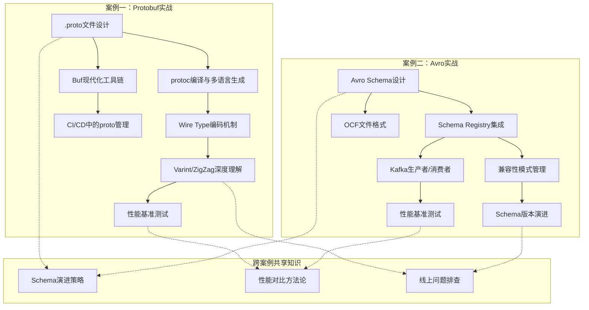
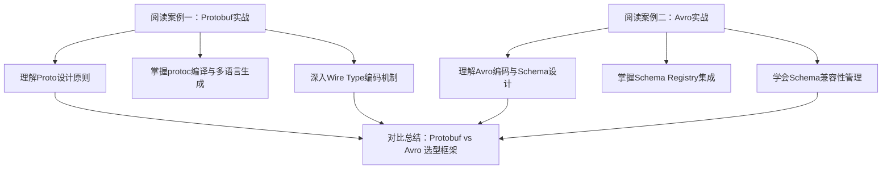

# 序列化与编码实战案例

## 为什么需要实战案例

序列化与编码的理论知识——JSON解析原理、Protobuf的wire format、Avro的schema演进机制——如果停留在概念层面，工程师在面对真实业务场景时仍然会手足无措。理论告诉你"Protobuf比JSON快"，但实战告诉你：在你的团队技术栈、部署环境、运维能力约束下，应该选哪个？schema改了之后线上老版本客户端会不会炸？序列化瓶颈排查的第一步该看什么指标？

这些问题只有在真实场景中才能回答。本节的两个实战案例，分别以 **Protobuf + protoc编译** 和 **Avro + Kafka + Schema Registry** 这两个最典型的工业级场景为载体，带你从零完成一个完整的序列化方案落地。每个案例都包含：问题定义与量化分析、技术选型决策、编码实现与工程化、性能验证、schema演进踩坑与修复。目标不是让你背诵API，而是建立"拿到一个新场景，能独立做出序列化决策并落地"的能力。

## 本节案例全景

| 维度 | 案例一：Protobuf实战 | 案例二：Avro实战 |
|------|---------------------|-----------------|
| **场景** | 实时风控平台的交易事件处理 | 数据中台的用户行为事件管道 |
| **核心格式** | Protocol Buffers 3 | Apache Avro |
| **配套框架** | protoc编译器 + 多语言代码生成 | Confluent Schema Registry + Kafka |
| **数据规模** | 日均2亿条交易事件 | 日均10亿条用户行为事件 |
| **关键挑战** | 多语言代码生成、编码机制深度理解、schema兼容性 | schema动态解析、大数据生态集成、Schema Registry管理 |
| **读者收获** | 掌握Protobuf从定义到多语言部署的完整工程链路 | 掌握Avro在大数据管道中的schema管理与演进实践 |
| **难度** | ⭐⭐⭐ 中等 | ⭐⭐⭐⭐ 进阶 |
| **详细文档** | [案例一：protoc实战](01-案例一protoc实战.md) | [案例二：Avro实战](02-案例二Avro实战.md) |

## 两个案例的核心知识图谱

在深入每个案例之前，先了解两个案例分别覆盖了哪些知识节点，以及它们之间的关联：

## 案例一概览：Protobuf + protoc 编译实战

### 场景还原

某实时风控平台需要对每笔交易进行毫秒级风险评估。系统每天产生约 **2亿条交易事件**，覆盖移动端、Web端、POS终端。最初使用JSON作为序列化格式，随着业务规模扩大暴露出严重的性能瓶颈：

| 指标 | JSON方案（现状） | 理想目标 | 差距倍数 |
|------|-----------------|---------|---------|
| 单条消息大小 | 1.2 KB | < 400 B | 3x |
| 序列化耗时 | 120 μs | < 20 μs | 6x |
| 反序列化耗时 | 95 μs | < 15 μs | 6x |
| 每秒处理能力 | 8,000 TPS | 50,000 TPS | 6x |

团队最终选择迁移到 **Protocol Buffers + protoc编译器**，核心原因是Protobuf的紧凑二进制编码、schema强类型约束、向后兼容机制、以及成熟的多语言生态。

### 你会学到什么

案例一覆盖了Protobuf工程化的完整链路：

**1. .proto文件设计的工程原则**

不是随便画个结构体就完事。字段编号的分配直接决定后续schema演进的空间；嵌套消息、oneof、map的选择影响编码效率和使用体验；enum的零值陷阱是无数线上事故的根源。案例会详细演示字段编号按业务域分组、预留演进gap、enum零值必须定义的原理。

**2. protoc编译器的完整使用**

从安装protoc（三种方式对比）、安装语言插件（Go/Python/Java/TypeScript），到多语言代码生成的完整命令和Makefile自动化，再到用Buf替代protoc的现代方案——涵盖整个工程化链路。

**3. Wire Type编码机制的深度理解**

Protobuf的高效来自底层编码设计：Varint变长编码如何将小数值压缩到1-2字节？ZigZag如何处理负数？字段tag的field_number + wire_type如何实现自描述？fixed32/fixed64在什么场景下比Varint更优？案例逐层拆解每个编码细节。

**4. CI/CD中的proto管理**

在实际项目中，.proto文件不是一次性写完就不管的。Buf工具链提供了lint检查、破坏性变更检测、依赖管理等能力，让proto文件像源代码一样被工程化管理。

### 关键收获

> 读完案例一，你应该能做到：给定一个微服务架构，能独立设计.proto文件、搭建protoc编译流水线、生成多语言代码、并用Buf在CI中守护schema质量。

[→ 进入案例一完整文档](01-案例一protoc实战.md)

## 案例二概览：Avro + Kafka 实战

### 场景还原

某互联网数据平台承担着公司核心的数据中台角色，每天从上游50+个业务系统采集约 **10亿条用户行为事件**（点击、浏览、下单、搜索、分享等），通过Kafka集群传输到下游Flink实时计算和Spark离线分析引擎。

最初直接将JSON字符串写入Kafka topic，随着规模增长暴露出三个核心痛点：

| 痛点 | 具体表现 | 业务影响 |
|------|---------|---------|
| 磁盘消耗暴增 | 月磁盘增长40%，3个月从8TB涨到22TB | 运维成本激增，被迫频繁扩容 |
| 反序列化CPU高 | 消费者反序列化CPU占比30% | Flink作业频繁背压，实时延迟从2s升到15s |
| Schema管理混乱 | 上游字段变更无通知，消费者经常解析失败 | 每月3-5次数据管道中断，影响报表产出 |

团队引入了 **Avro + Confluent Schema Registry** 来解决这些问题。核心理由是Avro的紧凑二进制编码（不含字段名）、schema演进能力强（reader/writer schema分离）、大数据生态原生支持（Kafka Connect/Spark/Hive/Flink）。

### 你会学到什么

案例二覆盖了Avro在大数据管道中的完整实战：

**1. Avro编码机制的本质**

Avro的二进制编码与Protobuf的关键相似点是都不存储字段名，但编码方式不同。Avro依赖Writer Schema的字段顺序编码，解码时通过Writer Schema + Reader Schema的映射对齐字段。这种设计赋予了Avro极强的schema演进能力。案例详细解释了每种类型的编码规则（null/boolean/int/long/string/array/map/enum/union/record）。

**2. Avro Schema设计的完整规范**

从V1基础schema到V2演进版本（新增referrer和geo信息），案例展示了如何设计一个既能承载当前业务、又能平滑演进的schema。每个union类型必须设default值、enum的symbols顺序影响编码、logicalType表达数据语义——这些设计要点都有详细的反例对照。

**3. Confluent Schema Registry的集成**

Schema Registry是Kafka + Avro的标配组件。案例演示了完整的集成流程：schema注册（REST API）、兼容性模式选择（BACKWARD/FORWARD/FULL/NONE的区别和适用场景）、生产者自动序列化+附加schema ID、消费者动态获取schema并反序列化、兼容性检查如何拦截不兼容的schema变更。

**4. Schema演进的线上事故还原**

案例还原了一个经典事故：数据工程师在Avro schema中删除了一个字段但没有设置default值，导致新Consumer读取旧Producer数据时抛出SchemaNotFoundException，下游数据管道中断影响3个报表。修复方案：字段不能直接删除，必须标记为nullable类型并设default为null，然后在代码层面忽略。

**5. Avro vs Protobuf vs JSON的选型决策**

这不是"哪个更好"的问题，而是"什么场景用什么"的问题。案例给出了完整的决策框架：Schema管理方式、运行时schema能力、大数据生态支持、编码体积、跨语言能力、调试友好度——每个维度都有明确的判断标准。

### 关键收获

> 读完案例二，你应该能做到：面对一个大数据管道场景，能独立设计Avro schema、搭建Schema Registry、配置生产者/消费者的序列化集成、制定schema演进策略，并用兼容性模式守护上下游契约。

[→ 进入案例二完整文档](02-案例二Avro实战.md)

## 跨案例对比：Protobuf vs Avro 选型决策框架

两个案例虽然场景不同，但都涉及"选什么格式"的决策。综合两个案例的实战经验，提炼出以下选型决策框架：

| 决策维度 | 选Protobuf的理由 | 选Avro的理由 | 选JSON的理由 |
|---------|-----------------|-------------|-------------|
| **通信模式** | RPC调用（点对点） | 数据管道（发布订阅） | REST API（人机交互） |
| **Schema管理** | .proto文件 + 代码生成 + Buf CI | Schema Registry统一管理 | 无schema，灵活但不可控 |
| **运行时schema** | 需要预编译或反射 | 原生支持动态解析 | 不需要 |
| **大数据生态** | 主要用于RPC，大数据支持弱 | Kafka Connect/Spark/Hive/Flink原生支持 | 通用但性能差 |
| **编码体积** | 紧凑（含tag不含字段名） | 更紧凑（无tag无字段名） | 最大（含字段名+引号+分隔符） |
| **编码速度** | 极快（Varint + tag直接定位） | 快（按顺序写入） | 慢（文本解析+类型转换） |
| **Schema演进** | 字段编号 + reserved机制 | Reader/Writer Schema映射 | 无schema约束 |
| **调试友好度** | 一般（需要反射工具） | 较好（有schema可查） | 最好（人类可读） |
| **跨语言** | 好（代码生成） | 好（schema定义语言） | 最好（原生支持） |
| **适用规模** | 百万级TPS | 十亿级消息/天 | 万级TPS |

**工业界主流实践总结：**

┌─────────────────────────────────────────────────────────┐
│                    选型决策速查                            │
├─────────────────────────────────────────────────────────┤
│  微服务间RPC通信  →  Protobuf + gRPC                     │
│  日志/事件流管道  →  Avro + Kafka + Schema Registry      │
│  公开REST API    →  JSON (orjson序列化)                  │
│  跨语言数据交换   →  JSON (最通用) 或 Protobuf (高性能)    │
│  大数据离线存储   →  Avro + OCF (压缩 + 可分割)           │
│  配置/元数据     →  JSON (人类可读) 或 YAML               │
└─────────────────────────────────────────────────────────┘

## 两个案例共同覆盖的深层主题

### 1. Schema演进是一切的核心

无论是Protobuf的字段编号+reserved机制，还是Avro的reader/writer schema分离，**schema演进能力**是工业级序列化格式的核心竞争力。两个案例都重点展示了schema演进中的踩坑场景：

- **Protobuf**：删除字段后复用编号导致数据错乱（正确做法：reserved保留编号）
- **Avro**：删除字段时不设default值导致SchemaNotFoundException（正确做法：字段改为nullable + default null，代码层忽略）

共性教训：**字段不能删除，只能废弃；编号/索引不能复用，只能保留。**

### 2. 性能必须量化验证

两个案例都提供了完整的性能基准测试代码和数据对比，而非空洞地说"比JSON快"。迁移前后的对比数据是说服团队、证明ROI的关键武器。

### 3. 工程化是落地的关键

序列化格式的选择只是开始，真正的挑战在工程化：protoc编译流水线、Buf的CI守护、Schema Registry的部署与运维、生产者/消费者的序列化集成——这些才是决定方案能否稳定运行的关键。

## 如何阅读这两个案例

### 推荐阅读顺序

- **如果你是后端工程师，主做微服务**：优先看案例一，Protobuf + protoc是你的核心战场。重点关注.proto文件设计和多语言代码生成。
- **如果你是数据工程师，做数据管道**：优先看案例二，Avro + Kafka + Schema Registry是你的日常工具。重点关注schema设计和兼容性模式。
- **如果你是架构师，需要做技术选型**：两个都看，重点关注上文的选型决策框架，以及每个案例中的技术选型决策过程。

### 学习方法建议

每个案例都附带了完整的代码和配置。建议的学习路径：

1. **通读文本**（30-45分钟）：先理解整体思路和关键设计决策
2. **搭建环境**（30-60分钟）：按照案例步骤搭建本地开发环境
3. **运行代码**（30分钟）：跑通整个流程，获得直觉
4. **修改参数**（30分钟）：尝试调整消息大小、并发数、schema版本，观察行为变化
5. **故意制造故障**（30分钟）：尝试schema不兼容的变更，观察报错信息——这是最有效的学习方式
6. **回到实际项目**（持续）：用学到的框架评估自己项目的序列化方案

## 从案例到实践的迁移建议

读完案例后，回到你的实际项目中，按以下步骤评估和行动：

**第一步：评估当前序列化方案**

你的系统用的是什么格式？性能瓶颈在哪里？用profiler测量序列化在CPU中的占比：
- Go：`go tool pprof` 分析CPU profile中的 `json.Marshal` / `json.Unmarshal`
- Java：`async-profiler` 采集火焰图，关注 `com.fasterxml.jackson` 热点
- Python：`cProfile` + `snakeviz` 可视化，关注 `json.dumps` / `json.loads`
- Node.js：`--inspect` + Chrome DevTools Performance面板

**第二步：制定迁移计划**

不可能一步到位。采用渐进策略：
- 新服务直接用新格式（Protobuf/Avro）
- 旧服务在下一次大版本迭代时迁移
- 关键路径（高频调用、大体积消息）优先迁移
- 设置兼容层（JSON ↔ Protobuf转换网关），让新旧服务能互通

**第三步：建立性能基线**

迁移前后都要压测，用数据证明迁移的价值。建立包含以下指标的基线：
- 序列化/反序列化耗时（P50/P99/P999）
- 消息体积（平均值/P99）
- 吞吐量（TPS）
- CPU/内存开销
- 网络带宽消耗

**第四步：文档化schema**

无论用Protobuf还是Avro，都要把schema作为代码的一部分管理：
- schema文件纳入Git版本控制
- CI中集成lint和breaking change检测（Buf或Schema Registry兼容性检查）
- schema变更需要code review
- 废弃的字段用reserved/标记为deprecated，不直接删除

## 本节学习路线图

| 阶段 | 内容 | 预计时间 | 产出 |
|------|------|---------|------|
| 入门 | 通读本页的案例概览和选型框架 | 15分钟 | 建立Protobuf和Avro的场景认知 |
| 实操 | 阅读案例一，搭建protoc环境并跑通代码生成 | 1.5小时 | 掌握从.proto到多语言代码的完整链路 |
| 进阶 | 阅读案例二，搭建Schema Registry并测试 | 2小时 | 掌握Avro + Kafka + Schema Registry集成 |
| 深入 | 尝试schema演进：修改字段、制造不兼容变更 | 1小时 | 理解schema演进的边界和踩坑点 |
| 综合 | 回到实际项目，用选型框架评估当前方案 | 30分钟 | 形成自己的序列化决策能力 |
