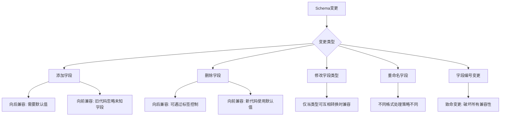
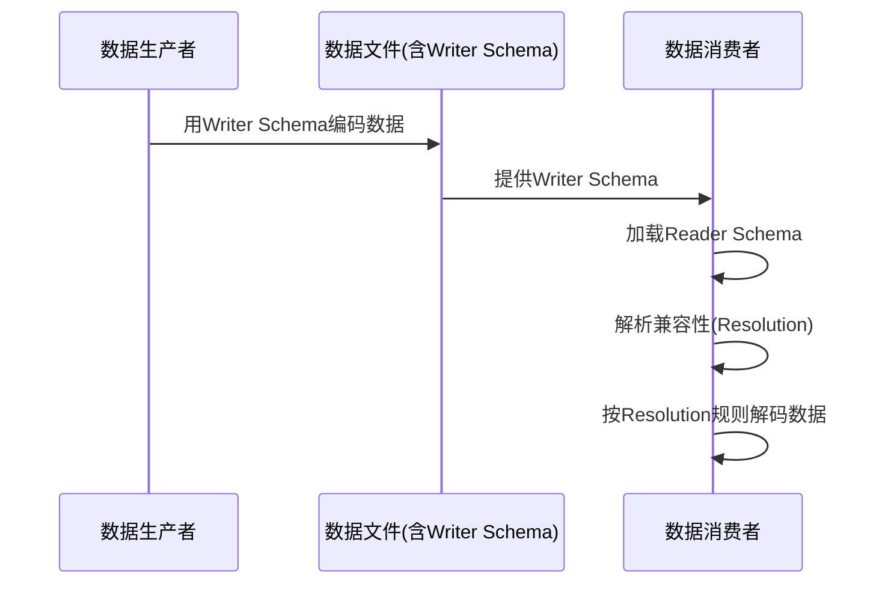
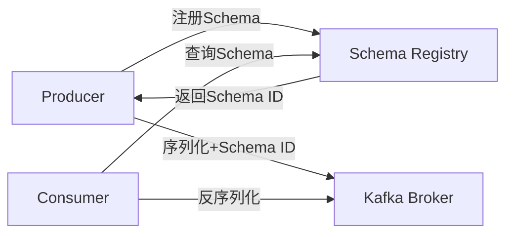
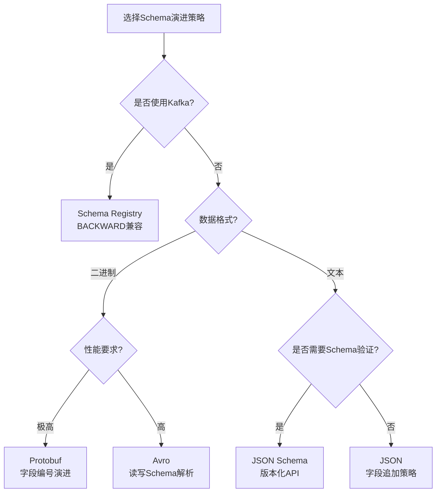
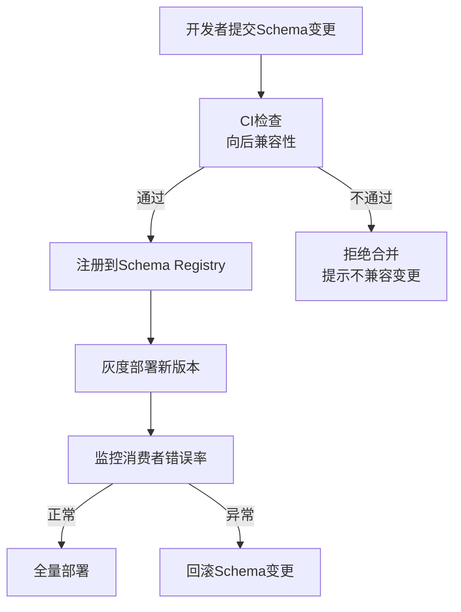

# Schema演进：在变化中保持数据契约的稳定

在分布式系统和微服务架构中，数据结构的变化是不可避免的。数据库新增字段、API返回值调整、消息队列负载升级——每一次变更都可能引发上下游服务的连锁故障。Schema演进（Schema Evolution）正是解决这一核心矛盾的方法论：**如何在不停机、不丢数据的前提下，安全地升级数据结构**。

本节从理论基础出发，系统讲解Protobuf、Avro、JSON Schema三大主流Schema体系的演进规则，通过兼容性矩阵和实战案例帮助你在真实项目中做出正确选择。

---

## 为什么Schema演进如此重要

### 数据结构变化是常态，而非例外

一个典型的电商系统，从上线到稳定运营，核心订单模型平均经历30-50次字段变更。每一次变更都面临两难：

- **停机迁移**：代价高昂，影响业务连续性
- **不停机演进**：需要新旧版本数据格式共存，必须保证兼容性

### 没有Schema演进策略的代价

| 事故场景 | 根因 | 后果 |
|---------|------|------|
| 新版本服务拒绝旧格式消息 | 新增字段标记为required | 消费者批量报错 |
| 旧版本服务丢失新字段数据 | 未使用可选字段/默认值 | 数据静默丢失 |
| 数据库schema变更导致查询失败 | 直接ALTER TABLE无回滚 | 服务中断 |
| 序列化格式不向后兼容 | 字段编号复用/删除 | 解码失败、脏数据 |

---

## Schema兼容性的基本原则

在深入各序列化格式之前，先理解兼容性类型的基本定义：

### 三种兼容性类型

┌─────────────────────────────────────────────────────┐
│                  兼容性类型矩阵                       │
├──────────────┬──────────────────┬───────────────────┤
│   兼容性类型   │     定义          │    典型场景        │
├──────────────┼──────────────────┼───────────────────┤
│ 向后兼容      │ 新代码能读旧数据    │ 客户端升级但服务端  │
│ (Backward)   │                  │ 尚未升级           │
├──────────────┼──────────────────┼───────────────────┤
│ 向前兼容      │ 旧代码能读新数据    │ 服务端升级但客户端  │
│ (Forward)    │                  │ 尚未升级           │
├──────────────┼──────────────────┼───────────────────┤
│ 完全兼容      │ 同时满足向后和向前  │ 任何滚动升级场景    │
│ (Full)       │ 兼容             │                   │
└──────────────┴──────────────────┴───────────────────┘

### 兼容性分类与影响范围



---

## Protobuf的Schema演进规则

Protocol Buffers在设计之初就内置了Schema演进机制。其核心思想是：**通过字段编号（Field Number）而非字段名称来标识字段**，从而实现位置无关的解码。

### Protobuf的核心编码机制回顾

Protobuf的每个字段编码为三部分：

Tag (field_number << 3 | wire_type) | Length (可选) | Value

字段编号是数据的唯一标识，字段名称和类型只是元数据。这意味着：

- 字段编号一旦分配，永远不能复用或改变
- 旧代码遇到未知字段编号时，根据wire type跳过字节继续解码
- 新代码遇到缺失字段时，使用默认值（零值）

### 安全的变更操作

**1. 添加新字段（完全兼容）**

```protobuf
// 旧版本 - V1
message User {
  int32 id = 1;
  string name = 2;
  string email = 3;
}

// 新版本 - V2（添加phone字段）
message User {
  int32 id = 1;
  string name = 2;
  string email = 3;
  string phone = 4;  // 新字段，完全兼容
}
```

- V2代码读V1数据：`phone`字段不存在，使用空字符串默认值
- V1代码读V2数据：遇到字段编号4，不认识，跳过继续解码

**2. 删除旧字段（向后兼容）**

```protobuf
// 旧版本 - V1
message User {
  int32 id = 1;
  string name = 2;
  string email = 3;
  string legacy_field = 4;  // 不再使用
}

// 新版本 - V2（删除legacy_field）
message User {
  int32 id = 1;
  string name = 2;
  string email = 3;
  // 字段编号4保留不复用，用reserved标记
  reserved 4;
}
```

关键原则：删除字段后，其编号必须用`reserved`标记，防止未来开发者复用。

**3. 重命名字段（完全兼容）**

```protobuf
// 旧版本
message User {
  int32 id = 1;
  string user_name = 2;
}

// 新版本
message User {
  int32 id = 1;
  string display_name = 2;  // 字段编号不变，改名无影响
}
```

Protobuf解码依赖字段编号，字段名称只在编译期使用，运行时完全忽略。

### 危险的变更操作

**1. 修改字段编号（灾难性）**

```protobuf
// 旧版本
message User {
  int32 id = 1;
  string name = 2;
}

// 错误示范：复用已删除字段的编号
message User {
  string name = 1;  // 灾难！V1数据中编号1是int32，现在期望string
  int32 id = 2;     // 灾难！V1数据中编号2是string，现在期望int32
}
```

**2. 修改wire type（不可逆）**

| 类型 | Wire Type | 编码值 |
|------|-----------|--------|
| int32, int64, uint32, uint64, sint32, sint64, bool, enum | Varint | 0 |
| fixed32, sfixed32 | 32-bit | 5 |
| fixed64, sfixed64 | 64-bit | 1 |
| float | 32-bit | 5 |
| double | 64-bit | 1 |
| string, bytes, embedded messages | Length-delimited | 2 |

将`int32`改为`fixed32`会改变wire type，导致解码失败。

**3. 将required改为optional或反之**

Protobuf3默认所有字段为optional，没有required。Protobuf2中`required`字段在解码时会进行存在性校验，突然删除required字段可能导致反序列化异常。

### Protobuf演进最佳实践

```protobuf
syntax = "proto3";

message Order {
  // 永远不要修改已有字段的编号
  int64 order_id = 1;
  double amount = 2;
  string currency = 3;

  // 用reserved标记已废弃的编号，防止复用
  reserved 4, 5, 6;
  reserved "legacy_status", "deprecated_field";

  // 新字段从最大编号+1开始分配
  string payment_method = 7;
  int32 retry_count = 8;

  // 嵌套消息的字段编号独立，但同样遵循上述规则
  message Address {
    string street = 1;
    string city = 2;
    string country = 3;
  }

  Address shipping_address = 9;
}
```

---

## Avro的Schema演进规则

Apache Avro在设计上比Protobuf对Schema演进提供了更系统化的支持。其核心思想是：**Schema作为独立文件存在，数据编码时嵌入Schema，解码时用Writer Schema和Reader Schema进行匹配**。

### Avro的读写Schema机制

这是Avro演进能力的基石。每个数据文件都包含Writer Schema，消费者用Reader Schema解码，Avro根据**解析规范（Resolution Rules）**自动处理两个Schema之间的差异。



### 安全的变更操作

**1. 添加新字段（向后+向前兼容）**

// Writer Schema (旧版本)
{
  "type": "record",
  "name": "User",
  "fields": [
    {"name": "id", "type": "long"},
    {"name": "name", "type": "string"},
    {"name": "email", "type": "string"}
  ]
}

// Reader Schema (新版本)
{
  "type": "record",
  "name": "User",
  "fields": [
    {"name": "id", "type": "long"},
    {"name": "name", "type": "string"},
    {"name": "email", "type": "string"},
    {"name": "phone", "type": ["null", "string"], "default": null}
  ]
}

Avro的解析规则：
- Reader有`phone`但Writer没有：使用`default`值（null）
- Writer有`phone`但Reader没有：Reader忽略该字段

**2. 删除旧字段**

// Writer Schema（新版本，删除了email）
{
  "type": "record",
  "name": "User",
  "fields": [
    {"name": "id", "type": "long"},
    {"name": "name", "type": "string"}
  ]
}

// Reader Schema（旧版本，期望email）
{
  "type": "record",
  "name": "User",
  "fields": [
    {"name": "id", "type": "long"},
    {"name": "name", "type": "string"},
    {"name": "email", "type": "string", "default": ""}
  ]
}

Reader期望`email`但Writer没有：使用`default`值（空字符串）。

**关键前提：Avro中删除字段时，Reader Schema必须提供该字段的默认值。如果字段没有默认值，解码将失败。**

**3. 字段类型升级（有限支持）**

| 原类型 | 可升级为 | 说明 |
|--------|---------|------|
| int | long | 整数扩大，安全 |
| long | float | 精度可能丢失 |
| float | double | 精度提升，安全 |
| string | bytes | 编码方式改变，需谨慎 |
| enum | enum（添加值） | 未知值作为int处理 |

### Avro的枚举演进

```json
// Writer Schema（旧版本）
{
  "type": "enum",
  "name": "Status",
  "symbols": ["ACTIVE", "INACTIVE"]
}

// Reader Schema（新版本，新增DELETED）
{
  "type": "enum",
  "name": "Status",
  "symbols": ["ACTIVE", "INACTIVE", "DELETED"],
  "default": "INACTIVE"
}
```

Avro的enum演进规则：
- Writer有`DELETED`但Reader没有：Reader使用`default`值
- 不能删除已有symbol（向前不兼容）
- 只能在末尾追加新symbol

### Avro vs Protobuf演进对比

| 维度 | Protobuf | Avro |
|------|----------|------|
| 兼容性机制 | 字段编号 + wire type跳过 | Reader/Writer Schema解析 |
| 默认值 | 零值（无法自定义） | 可自定义任意默认值 |
| Schema文件 | 独立.proto文件，不嵌入数据 | 数据文件内嵌Schema |
| 类型升级 | 有限（依赖wire type） | 支持有限类型提升 |
| 枚举演进 | 支持添加值 | 支持添加值，需默认值 |
| JSON兼容 | 不直接支持 | 支持JSON编码模式 |

---

## JSON Schema的演进策略

JSON作为无Schema的文本格式，在Web API和配置管理中广泛使用。虽然没有原生的Schema演进机制，但JSON Schema提供了验证层，配合版本管理策略可以实现可控的演进。

### JSON Schema演进基础

```json
{
  "$schema": "http://json-schema.org/draft-07/schema#",
  "title": "User",
  "type": "object",
  "properties": {
    "id": {"type": "integer"},
    "name": {"type": "string"},
    "email": {"type": "string", "format": "email"},
    "phone": {"type": "string", "default": ""}
  },
  "required": ["id", "name"],
  "additionalProperties": false
}
```

### REST API版本管理策略

| 策略 | 实现方式 | 适用场景 |
|------|---------|---------|
| URL版本 | `/api/v1/users` vs `/api/v2/users` | 简单明了，适合小团队 |
| Header版本 | `Accept: application/vnd.app.v2+json` | 语义正确，但客户端复杂 |
| 查询参数 | `/api/users?version=2` | 快速原型，不推荐生产 |
| 内容协商 | 通过Content-Type协商 | RESTful纯度最高 |

```python
# URL版本策略示例
from fastapi import FastAPI

app = FastAPI()

# V1：旧接口，返回旧格式
@app.get("/api/v1/users/{user_id}")
async def get_user_v1(user_id: int):
    return {"id": user_id, "name": "John"}

# V2：新接口，包含新字段
@app.get("/api/v2/users/{user_id}")
async def get_user_v2(user_id: int):
    return {"id": user_id, "name": "John", "phone": "+1234567890"}
```

### 向后兼容的API设计原则

1. **只追加字段，不删除或修改已有字段**
2. **新增字段必须可选**，提供合理默认值
3. **使用`additionalProperties: true`或不设限**，允许客户端忽略未知字段
4. **废弃字段标记deprecated而非立即删除**，给客户端迁移窗口
5. **变更记录每个版本的字段变化**，便于客户端适配

---

## 数据库Schema演进

在关系型数据库中，Schema变更通常涉及`ALTER TABLE`操作，可能锁定表并影响线上服务。

### 安全的Schema迁移策略

**1. 增量迁移（Expand-and-Contract模式）**


**2. 使用在线DDL工具**

| 工具 | 适用数据库 | 特点 |
|------|----------|------|
| pt-online-schema-change | MySQL | 触发器+影子表 |
| gh-ost | MySQL | binlog解析，无触发器 |
| pg-repack | PostgreSQL | 无锁重建索引 |
| Liquibase | 通用 | 变更集管理+回滚 |
| Flyway | 通用 | SQL版本化管理 |

**3. 零停机迁移实战**

```sql
-- 第一步：添加新列（nullable，不阻塞读写）
ALTER TABLE users ADD COLUMN phone VARCHAR(20) DEFAULT NULL;

-- 第二步：回填数据（批量执行，避免长时间锁表）
UPDATE users SET phone = legacy_phone
WHERE phone IS NULL AND legacy_phone IS NOT NULL
LIMIT 1000;

-- 第三步：部署新代码（读写phone列）

-- 第四步：确认无旧代码依赖legacy_phone后删除
ALTER TABLE users DROP COLUMN legacy_phone;
```

---

## Kafka/消息队列的Schema演进

在事件驱动架构中，消息格式的演进是最具挑战性的场景，因为生产者和消费者可能分布在数十个服务中，且更新时间不同步。

### Schema Registry的核心作用



Schema Registry解决了关键问题：
- **版本管理**：每个Schema自动分配版本号
- **兼容性检查**：注册时验证新Schema与旧版本的兼容性
- **Schema分发**：消费者按Schema ID查询并缓存Schema

### Kafka Schema Registry兼容性配置

```json
{
  "compatibility": "BACKWARD",
  "compatibilityGroup": "APPLICATION"
}
```

四种兼容性级别：

| 级别 | 说明 | 允许的变更 |
|------|------|-----------|
| BACKWARD | 新Schema能读旧数据 | 可添加有默认值字段，可删除字段 |
| FORWARD | 旧Schema能读新数据 | 可添加字段，可删除有默认值字段 |
| FULL | 双向兼容 | 只能添加有默认值字段 |
| NONE | 不检查 | 任意变更 |

### 消息格式演进实战

```java
// V1：旧消息格式
public class OrderEvent {
    private Long orderId;
    private Double amount;
    private String status;
}

// V2：添加字段（向后兼容）
public class OrderEvent {
    private Long orderId;
    private Double amount;
    private String status;
    private String currency;       // 新字段
    private Instant createdAt;     // 新字段
}

// V3：删除旧字段（向前兼容，需保留默认值）
public class OrderEvent {
    private Long orderId;
    private Double amount;
    private String currency;       // currency从可选变为必填
    private Instant createdAt;
    // status已被新系统替代，不再使用
}
```

---

## 演进策略选择决策树

面对具体项目，选择哪种Schema演进策略取决于技术栈和业务约束：



---

## 常见误区与纠正

### 误区1：Schema变更是小事情

**错误认知**："只是加个字段，直接改就行了"

**纠正**：每次Schema变更都必须考虑上下游兼容性。一个看似简单的字段添加，如果缺少默认值处理，可能导致旧版本消费者批量报错。

### 误区2：Protobuf字段名可以随便改

**错误认知**：既然编解码不依赖字段名，改名是安全的

**纠正**：虽然运行时安全，但编译时Proto文件作为接口契约，改名会影响所有依赖方的代码编译。大规模改名应在v2独立proto文件中进行，而非修改v1。

### 误区3：Avro可以随意修改enum值

**错误认知**：Avro支持Schema演进，所以enum随便改

**纠正**：Avro的enum只能追加新值，不能删除或重命名已有值。删除值会导致持有旧数据的消费者无法解码。且新增enum值时，Reader Schema中必须有default值。

### 误区4：数据库加字段不需要计划

**错误认知**：`ALTER TABLE ADD COLUMN`是一行代码的事

**纠正**：在线上数据库中，无DEFAULT值的`ADD COLUMN`会锁全表。必须使用`DEFAULT NULL`或在线DDL工具（gh-ost、pt-online-schema-change），且大表回填要分批执行。

### 误区5：版本管理靠人力协调

**错误认知**：发个邮件通知下游改接口就行了

**纠正**：分布式系统中，上下游更新频率不同，必须依赖技术手段（Schema Registry、版本化URL、兼容性检查）来保证安全，而非依赖人工沟通。

---

## 进阶：大规模系统的Schema治理

### Schema变更的CI/CD流程



### Schema审计与文档

大型团队应建立Schema审计制度：

1. **所有Schema变更必须通过PR审查**，禁止直接修改
2. **每个字段必须有注释说明用途和演进历史**
3. **定期审计废弃字段**，确认可以安全删除
4. **维护Schema变更日志**，记录每次变更的原因和影响范围

### 跨团队协调机制

| 角色 | 职责 | 工具支持 |
|------|------|---------|
| Schema Owner | 审核变更、分配编号 | Schema Registry管理界面 |
| API Consumer | 报告兼容性问题 | 兼容性测试套件 |
| Platform Team | 维护Schema Registry | CI/CD集成 |
| On-call | 监控反序列化错误 | 告警系统 |

---

## 本节小结

Schema演进是分布式系统工程中不可回避的核心议题。关键要点：

1. **兼容性类型决定安全边界**：向后兼容、向前兼容、完全兼容各有适用场景
2. **Protobuf依赖字段编号**：编号不可复用，类型不可变更wire type
3. **Avro的读写Schema机制**提供了最系统化的演进支持，但需要为每个字段提供默认值
4. **JSON Schema通过版本化管理**实现演进，适合Web API场景
5. **数据库Schema变更必须使用在线工具**，遵循Expand-and-Contract模式
6. **消息队列场景依赖Schema Registry**，通过兼容性级别控制变更安全

Schema演进不是一次性设计，而是贯穿系统全生命周期的持续实践。建立规范的变更流程、自动化兼容性检查、完善的文档审计制度，才能让数据契约在不断变化中保持稳定。
