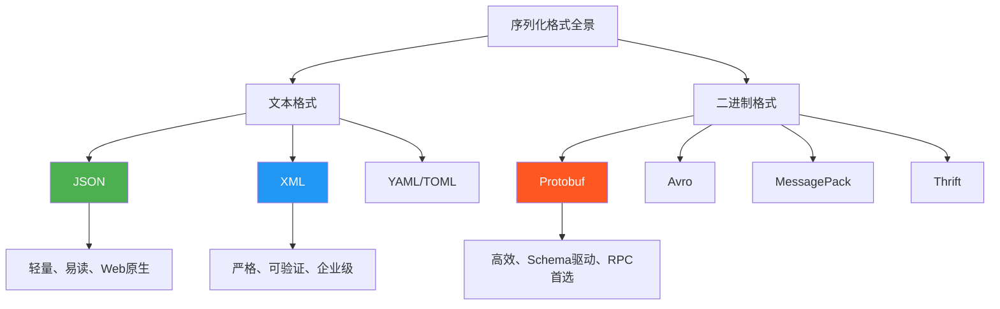
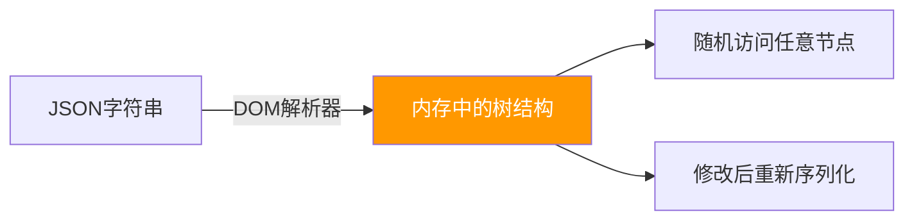
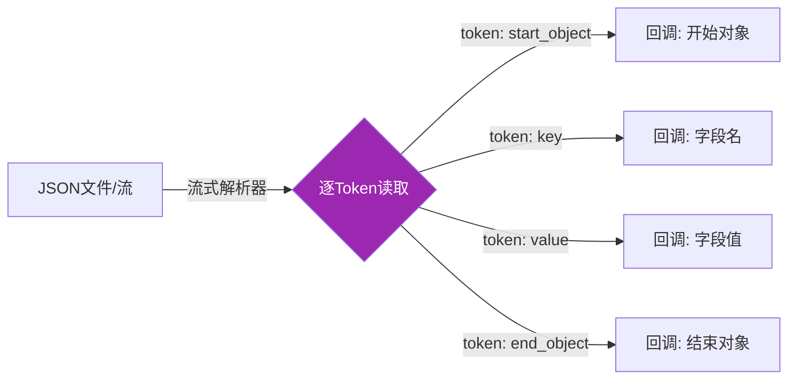
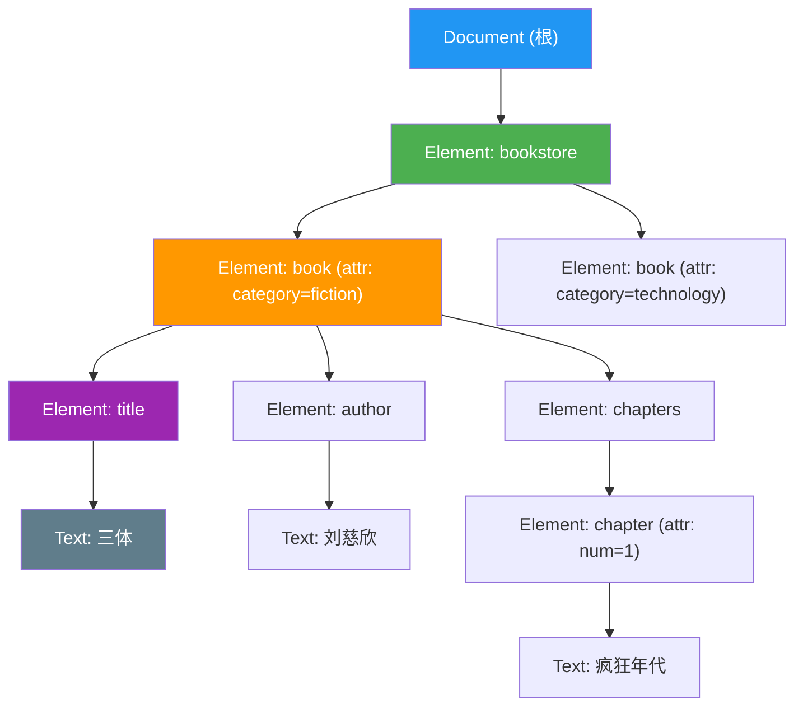
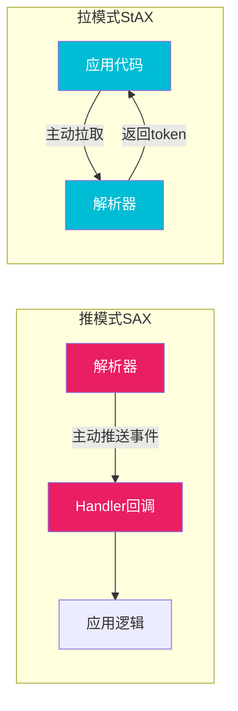
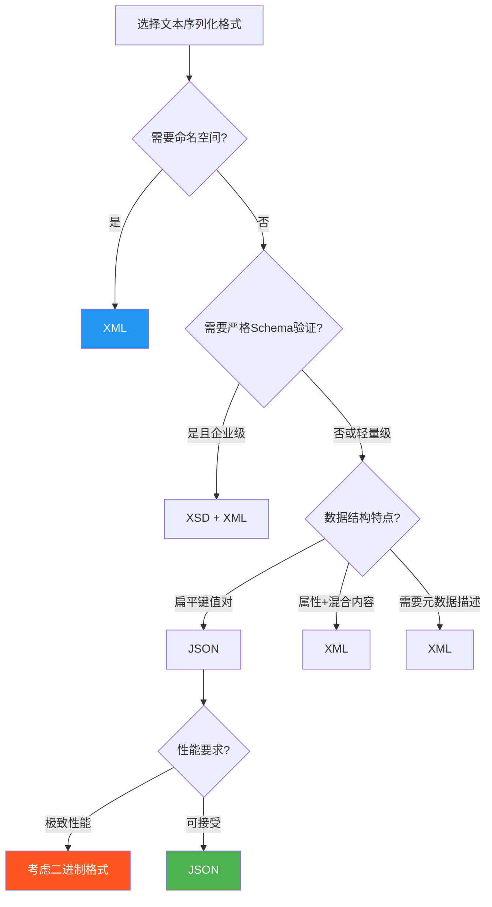

# 一、JSON与XML解析

**本节学习目标**：

1. 理解JSON和XML的规范定义、数据模型和编码规则
2. 掌握DOM、流式（SAX/ijson）、Pull（StAX）三大解析范式的原理与适用场景
3. 能够在Python、Java、Go中选择合适的库高效解析文本序列化数据
4. 识别并防御JSON/XML解析中的安全漏洞（精度丢失、注入、XXE、DoS）
5. 建立JSON vs XML的选型决策能力，为后续二进制序列化章节奠定基础

---

## 1.1 为什么JSON与XML是序列化的起点

在序列化与编码的广阔领域中，JSON和XML是两种最基础、应用最广泛的文本格式。它们之所以排在理论基础的首位，不仅因为使用频率高，更因为理解文本格式的解析原理，是理解后续所有二进制序列化方案（Protobuf、Avro、MessagePack）的前提。文本格式的解析涉及编码识别、树结构构建、流式处理等核心概念，这些概念在二进制解析中同样存在，只是表现形式不同。



文本格式与二进制格式的核心差异在于**信息密度**：文本格式用人类可读的字符表达数据（如字段名 `"username"` 占用8个字节），而二进制格式用紧凑编码（如field number `1` 只占1-2个字节）。理解这个差异，是贯穿本章所有内容的思维主线。

本节将从规范定义出发，深入JSON和XML的解析机制，覆盖DOM解析、SAX/流式解析、StAX拉取式解析三大范式，并提供多语言的实战代码，帮助读者建立扎实的文本序列化基础。

---

## 1.2 JSON：规范与数据模型

### 1.2.1 JSON规范概述

JSON（JavaScript Object Notation）由Douglas Crockford在2001年提出，其规范定义在RFC 8259中。JSON的设计哲学是**极简**：用最少的语法表达最通用的数据结构。

JSON定义了六种基本数据类型：

| 数据类型 | 示例 | 说明 |
|---------|------|------|
| string | `"hello"` | UTF-8编码的字符串，支持转义序列 |
| number | `42`、`3.14`、`-1e10` | 整数或浮点数，遵循IEEE 754 |
| boolean | `true`、`false` | 布尔值 |
| null | `null` | 空值 |
| object | `{"key": "value"}` | 键值对集合，键必须是字符串 |
| array | `[1, 2, 3]` | 有序值列表 |

JSON的语法规则比你想象的更严格：

```json
{
  "string_value": "支持Unicode转义 \u4f60\u597d",
  "integer_value": 42,
  "float_value": 3.14159,
  "negative_value": -273.15,
  "exponent_value": 6.022e23,
  "boolean_true": true,
  "boolean_false": false,
  "null_value": null,
  "array": [1, "mixed", true, null],
  "nested": {
    "deep": {
      "value": "支持任意深度嵌套"
    }
  }
}
```

**常见误区**：JSON不是JavaScript的子集。JSON要求属性名必须用双引号包裹（JavaScript允许无引号的标识符），JSON不支持注释，JSON不支持`undefined`、`NaN`、`Infinity`等JavaScript特有值，也不支持尾部逗号。这些限制是有意为之——JSON的极简设计确保了任何语言都能用最少的代码实现解析器。

### 1.2.2 JSON的编码与Unicode

JSON的文本编码规则是实际工程中最容易踩坑的领域之一。RFC 8259明确规定：**JSON文本必须使用UTF-8编码，不允许出现BOM（Byte Order Mark）**。

**JSON字符串中的Unicode转义**：

JSON字符串支持`\uXXXX`格式的Unicode转义（4位十六进制），以及`\uXXXX\uXXXX`形式的代理对（Surrogate Pair）用于表示超出BMP的字符：

```python
import json

# 基本Unicode转义
data = {"message": "Hello \u4f60\u597d"}  # "你好"
print(json.dumps(data, ensure_ascii=True))   # \u8f6c\u4e4e: 输出ASCII安全形式
print(json.dumps(data, ensure_ascii=False))  # 直接输出UTF-8: {"message": "Hello 你好"}

# Emoji（超出BMP）需要代理对
emoji_data = {"icon": "😀"}  # U+1F600
print(json.dumps(emoji_data, ensure_ascii=True))
# {"icon": "\ud83d\ude00"}
```

**BOM问题**：

```python
# Windows系统生成的JSON文件可能带BOM
import codecs

# 写入带BOM的UTF-8文件（Windows记事本的默认行为）
with open('data.json', 'w', encoding='utf-8-sig') as f:
    json.dump({"key": "value"}, f)

# 读取时如果不处理BOM，JSON解析会失败
# 正确做法：用utf-8-sig编码读取
with open('data.json', 'r', encoding='utf-8-sig') as f:
    data = json.load(f)  # 成功

# 或者在二进制模式下跳过BOM
with open('data.json', 'rb') as f:
    content = f.read()
    if content.startswith(codecs.BOM_UTF8):
        content = content[3:]
    data = json.loads(content)
```

**跨编码系统的兼容性问题**：

在企业系统集成中，经常遇到遗留系统使用GBK、Shift-JIS、ISO-8859-1等编码。JSON本身只定义了UTF-8，但解析器需要处理各种输入编码：

```python
import json

def load_json_auto_decode(filepath: str) -> dict:
    """自动检测编码并加载JSON"""
    with open(filepath, 'rb') as f:
        raw = f.read()
    
    # 尝试常见编码
    for encoding in ['utf-8', 'utf-8-sig', 'gb18030', 'shift_jis', 'latin-1']:
        try:
            text = raw.decode(encoding)
            return json.loads(text)
        except (UnicodeDecodeError, json.JSONDecodeError):
            continue
    
    # 最后手段：忽略无法解码的字节
    text = raw.decode('utf-8', errors='replace')
    return json.loads(text)
```

### 1.2.3 JSON在不同语言中的表示

JSON的六种类型在各语言中的映射并不完全一致，这常常是跨语言数据交换的陷阱：

| JSON类型 | Python | Java | Go | JavaScript | TypeScript |
|----------|--------|------|-----|------------|------------|
| string | `str` | `String` | `string` | `string` | `string` |
| integer | `int` | `Integer`/`Long` | `int64` | `number` | `number` |
| float | `float` | `Double` | `float64` | `number` | `number` |
| boolean | `bool` | `Boolean` | `bool` | `boolean` | `boolean` |
| null | `None` | `null` | `nil` | `null` | `null` |
| object | `dict` | `Map`/POJO | `struct`/`map` | `object` | `object` |
| array | `list` | `List`/`Array` | `[]T`/`slice` | `Array` | `Array` |

特别需要注意数字类型的精度问题：

```python
import json

# JavaScript精度问题：大整数会丢失精度
# JSON中 9007199254740993 在JS中会变成 9007199254740992
js_compat = {"big_int": 9007199254740993}
serialized = json.dumps(js_compat)
print(serialized)  # {"big_int": 9007199254740993} — Python保留精确值

# 但在浏览器的JSON.parse中会截断
# 解决方案：大整数用字符串传输
safe_format = {"big_int": "9007199254740993"}
```

**时间格式的跨语言陷阱**：JSON规范不定义日期时间格式，各语言的选择差异很大：

| 语言/框架 | 默认日期格式 | 示例 |
|-----------|-------------|------|
| Python json | ISO 8601 | `"2024-01-15T10:30:00"` |
| Java Jackson | ISO 8601 | `"2024-01-15T10:30:00Z"` |
| Go encoding/json | RFC 3339 | `"2024-01-15T10:30:00Z"` |
| JavaScript | 纪元毫秒 | `1705312200000` |

实践中推荐**统一使用ISO 8601 / RFC 3339格式**，并在API文档中明确约定。

---

## 1.3 JSON解析：三大范式

JSON解析是将字符串形式的JSON数据转换为内存中数据结构的过程。根据内存使用方式和访问模式的不同，主要有三种解析范式。

### 1.3.1 DOM解析：全量加载

DOM（Document Object Model）解析是将整个JSON文档一次性加载到内存中，构建出完整的树形数据结构。这是最简单、最常用的解析方式。



**Python标准库实现**：

```python
import json

# 基本的DOM解析
json_string = '''
{
    "company": "TechCorp",
    "employees": [
        {
            "id": 1001,
            "name": "张三",
            "department": "Engineering",
            "skills": ["Python", "Go", "Kubernetes"],
            "salary": 25000.00,
            "active": true
        },
        {
            "id": 1002,
            "name": "李四",
            "department": "Product",
            "skills": ["Figma", "SQL"],
            "salary": 22000.00,
            "active": false
        }
    ]
}
'''

# 反序列化：JSON字符串 → Python对象
data = json.loads(json_string)

# 随机访问
print(data["company"])                    # TechCorp
print(data["employees"][0]["name"])       # 张三
print(data["employees"][1]["skills"][0])  # Figma

# 序列化：Python对象 → JSON字符串
output = json.dumps(data, ensure_ascii=False, indent=2)
print(output)
```

**带类型映射的DOM解析**（Python dataclasses）：

```python
import json
from dataclasses import dataclass, field
from typing import List, Optional

@dataclass
class Employee:
    id: int
    name: str
    department: str
    skills: List[str] = field(default_factory=list)
    salary: float = 0.0
    active: bool = True

@dataclass
class Company:
    company: str
    employees: List[Employee] = field(default_factory=list)

# 自定义解码器：将dict自动映射为dataclass
def decode_company(d: dict) -> Company:
    employees = [
        Employee(**emp) for emp in d.get("employees", [])
    ]
    return Company(company=d["company"], employees=employees)

# 使用object_hook实现自动类型转换
data = json.loads(json_string, object_hook=decode_company)
print(f"公司: {data.company}")
for emp in data.employees:
    status = "在职" if emp.active else "离职"
    print(f"  {emp.name} - {emp.department} ({status}) - 技能: {', '.join(emp.skills)}")
```

**Java Jackson实现**：

```java
import com.fasterxml.jackson.databind.ObjectMapper;
import com.fasterxml.jackson.annotation.JsonProperty;

public class JsonDomExample {

    // 使用注解映射JSON字段
    static class Employee {
        public int id;
        public String name;
        public String department;
        public List<String> skills;
        public double salary;
        public boolean active;
    }

    static class Company {
        public String company;
        public List<Employee> employees;
    }

    public static void main(String[] args) throws Exception {
        String json = """
            {
                "company": "TechCorp",
                "employees": [
                    {"id": 1001, "name": "张三", "department": "Engineering",
                     "skills": ["Python", "Go"], "salary": 25000, "active": true}
                ]
            }
        """;

        ObjectMapper mapper = new ObjectMapper();
        // DOM方式：一次性解析为对象
        Company company = mapper.readValue(json, Company.class);
        System.out.println("公司: " + company.company);
        company.employees.forEach(e ->
            System.out.printf("  %s - %s%n", e.name, e.department)
        );
    }
}
```

**Go标准库实现**：

```go
package main

import (
    "encoding/json"
    "fmt"
    "log"
)

type Employee struct {
    ID         int      `json:"id"`
    Name       string   `json:"name"`
    Department string   `json:"department"`
    Skills     []string `json:"skills"`
    Salary     float64  `json:"salary"`
    Active     bool     `json:"active"`
}

type Company struct {
    Company   string     `json:"company"`
    Employees []Employee `json:"employees"`
}

func main() {
    jsonStr := `{
        "company": "TechCorp",
        "employees": [
            {"id": 1001, "name": "张三", "department": "Engineering",
             "skills": ["Python", "Go"], "salary": 25000, "active": true}
        ]
    }`

    var company Company
    // DOM方式：一次性解码
    if err := json.Unmarshal([]byte(jsonStr), &amp;company); err != nil {
        log.Fatal(err)
    }

    fmt.Printf("公司: %s\n", company.Company)
    for _, emp := range company.Employees {
        fmt.Printf("  %s - %s\n", emp.Name, emp.Department)
    }
}
```

**DOM解析的适用场景与限制**：

| 维度 | 说明 |
|------|------|
| 适用场景 | JSON文档较小（<10MB）、需要多次随机访问、需要修改后重新序列化 |
| 优点 | API简单直观、支持随机访问、支持修改和重新序列化 |
| 缺点 | 内存占用高（完整树结构）、首次解析开销大、不适合超大文档 |
| 内存消耗 | 通常为原始JSON字符串大小的 3-10 倍（取决于结构和语言） |

### 1.3.2 流式解析：逐Token处理

流式解析（SAX风格）不将整个文档加载到内存，而是逐个读取JSON的token（令牌），通过回调函数或迭代器将数据交给应用处理。这类似于数据库的游标机制——你一次只看到一条记录。



**Python ijson库——处理GB级JSON**：

```python
import ijson
import os

def stream_large_json(filepath):
    """
    流式解析大型JSON数组文件
    典型场景：处理数GB的API导出数据、日志文件
    """
    with open(filepath, 'rb') as f:
        # ijson.items()返回一个迭代器，每次yield一个item
        parser = ijson.items(f, 'item')
        count = 0
        for record in parser:
            count += 1
            # 内存中始终只有一条记录
            if record.get('amount', 0) > 10000:
                print(f"大额交易 #{count}: {record['id']}, 金额: {record['amount']}")
        print(f"共处理 {count} 条记录")

# 生成测试数据并验证内存效率
def generate_test_data(filepath, n=100000):
    """生成一个包含n条记录的JSON数组文件"""
    import json
    with open(filepath, 'w') as f:
        f.write('[\n')
        for i in range(n):
            record = {"id": i, "name": f"user_{i}", "amount": i * 100}
            json.dump(record, f)
            if i < n - 1:
                f.write(',\n')
        f.write('\n]')
    size_mb = os.path.getsize(filepath) / (1024 * 1024)
    print(f"生成文件: {filepath}, 大小: {size_mb:.1f} MB")
```

**Python ijson支持的路径表达式**：

```python
import ijson
import json

# 示例JSON
data = json.dumps({
    "users": [
        {"name": "张三", "scores": [95, 87, 92]},
        {"name": "李四", "scores": [88, 91, 79]},
        {"name": "王五", "scores": [76, 83, 90]}
    ]
}).encode('utf-8')

# 提取所有users中的name字段（不加载整个数组）
names = list(ijson.items(data, 'users.item.name'))
print(names)  # ['张三', '李四', '王五']

# 提取嵌套的分数
scores = list(ijson.items(data, 'users.item.scores.item'))
print(scores)  # [95, 87, 92, 88, 91, 79, 76, 83, 90]

# 使用prefix获取完整路径
for prefix, event, value in ijson.parse(data):
    if prefix.startswith('users.item.name'):
        print(f"名字: {value}")
```

**Java Jackson Streaming API**：

```java
import com.fasterxml.jackson.core.*;
import java.io.FileInputStream;

public class JsonStreamExample {

    // 流式解析大型JSON，提取特定字段
    public static void streamParse(String filepath) throws Exception {
        JsonFactory factory = new JsonFactory();
        try (JsonParser parser = factory.createParser(new FileInputStream(filepath))) {
            String currentField = null;
            boolean insideUser = false;

            while (parser.nextToken() != null) {
                JsonToken token = parser.currentToken();

                switch (token) {
                    case START_OBJECT:
                        insideUser = true;
                        break;
                    case FIELD_NAME:
                        currentField = parser.currentName();
                        break;
                    case VALUE_STRING:
                        if ("name".equals(currentField) &amp;&amp; insideUser) {
                            System.out.println("用户: " + parser.getValueAsString());
                        }
                        break;
                    case END_OBJECT:
                        insideUser = false;
                        break;
                    default:
                        break;
                }
            }
        }
    }
}
```

**Go流式解析——json.Decoder**：

```go
package main

import (
    "encoding/json"
    "fmt"
    "os"
    "strings"
)

type Record struct {
    ID     int    `json:"id"`
    Name   string `json:"name"`
    Amount int    `json:"amount"`
}

func main() {
    // 模拟大文件流
    jsonData := `{"records":[
        {"id":1,"name":"订单A","amount":5000},
        {"id":2,"name":"订单B","amount":15000},
        {"id":3,"name":"订单C","amount":3000}
    ]}`

    decoder := json.NewDecoder(strings.NewReader(jsonData))

    // 读取开始的 { 和 "records"
    decoder.Token() // {
    decoder.Token() // "records"
    decoder.Token() // [

    // 逐条解码，内存中始终只有一条记录
    for decoder.More() {
        var record Record
        if err := decoder.Decode(&amp;record); err != nil {
            fmt.Println("解析错误:", err)
            continue
        }
        if record.Amount > 10000 {
            fmt.Printf("大额订单: %s, 金额: %d\n", record.Name, record.Amount)
        }
    }
}
```

**流式JSON解析的JSON Lines格式**：

JSON Lines（.jsonl）是一种特殊的JSON存储格式，每行一个独立的JSON对象，天然适合流式处理：

```python
import json
from typing import Generator, Dict, Any

def write_jsonl(filepath: str, records: list):
    """写入JSON Lines文件"""
    with open(filepath, 'w', encoding='utf-8') as f:
        for record in records:
            f.write(json.dumps(record, ensure_ascii=False) + '\n')

def read_jsonl(filepath: str, batch_size: int = 1000) -> Generator[list, None, None]:
    """
    批量流式读取JSON Lines文件
    每次yield batch_size条记录，内存占用可控
    """
    batch = []
    with open(filepath, 'r', encoding='utf-8') as f:
        for line in f:
            line = line.strip()
            if line:
                batch.append(json.loads(line))
                if len(batch) >= batch_size:
                    yield batch
                    batch = []
    if batch:
        yield batch

# 实际应用：处理用户行为日志
def process_event_log(filepath: str):
    total = 0
    error_count = 0
    for batch in read_jsonl(filepath, batch_size=500):
        for event in batch:
            total += 1
            if event.get('status') == 'error':
                error_count += 1
                print(f"[ERROR] {event['timestamp']}: {event['message']}")
    print(f"处理完成: 共 {total} 条事件, {error_count} 条错误")
```

### 1.3.3 Pull解析：应用主动控制解析节奏

Pull解析是介于DOM和SAX之间的方式。应用主动调用`next()`拉取下一个token，而不是被动地等待回调。这种方式在XML中更为常见（Java的StAX），但在JSON中也可以通过一些库实现类似的效果。

**核心思想**：SAX是"推模式"——解析器决定什么时候调用你的回调；Pull是"拉模式"——你决定什么时候读取下一个token。当你需要在特定条件下跳过某些元素时，Pull模式更灵活。

```python
import json

class JsonPullParser:
    """
    JSON Pull Parser：基于raw_decode实现真正的增量解析
    每次调用parse_one()只解析下一个顶层值，不加载整个文档
    """
    def __init__(self, text: str):
        self._decoder = json.JSONDecoder()
        self._text = text
        self._pos = 0
        self._finished = False

    def has_next(self) -> bool:
        """是否还有未解析的token"""
        if self._finished:
            return False
        # 跳过空白字符
        while self._pos < len(self._text) and self._text[self._pos] in ' \t\n\r':
            self._pos += 1
        return self._pos < len(self._text)

    def parse_one(self):
        """解析下一个JSON值并返回"""
        if not self.has_next():
            self._finished = True
            return None
        value, end = self._decoder.raw_decode(self._text, self._pos)
        self._pos = end
        return value


# 使用示例：从混合流中按需提取JSON对象
mixed_stream = '42 {"name": "张三"} "ok" {"name": "李四"}'
parser = JsonPullParser(mixed_stream)

while parser.has_next():
    value = parser.parse_one()
    if isinstance(value, dict) and 'name' in value:
        print(f"提取到用户: {value['name']}")
    else:
        print(f"跳过: {type(value).__name__} = {value}")

# 输出:
# 跳过: int = 42
# 提取到用户: 张三
# 跳过: str = ok
# 提取到用户: 李四
```

**嵌套结构的Pull解析**：处理嵌套对象需要额外的状态管理：

```python
import json

def pull_nested_values(text: str, target_key: str):
    """
    使用raw_decode实现嵌套JSON的Pull式值提取
    场景：从超大JSON中按key提取特定值，无需完整解析
    """
    decoder = json.JSONDecoder()
    pos = 0
    results = []

    while pos < len(text):
        # 跳过空白
        while pos < len(text) and text[pos] in ' \t\n\r':
            pos += 1
        if pos >= len(text):
            break

        try:
            value, end = decoder.raw_decode(text, pos)
        except json.JSONDecodeError:
            pos += 1
            continue

        # 递归搜索目标key
        def find_keys(obj, key):
            if isinstance(obj, dict):
                for k, v in obj.items():
                    if k == key:
                        results.append(v)
                    find_keys(v, key)
            elif isinstance(obj, list):
                for item in obj:
                    find_keys(item, key)

        find_keys(value, target_key)
        pos = end

    return results

# 从大型JSON中提取所有name字段
big_json = '''
{"users": [{"name": "张三", "age": 25}, {"name": "李四", "age": 30}]}
{"admin": {"name": "管理员", "role": "super"}}
'''
names = pull_nested_values(big_json, "name")
print(names)  # ['张三', '李四', '管理员']
```

---

## 1.4 JSON解析的性能优化

### 1.4.1 选择更快的解析库

不同JSON库的性能差异可达一个数量级。以Python为例：

| 库 | 类型 | 序列化速度 | 反序列化速度 | 特点 |
|----|------|-----------|-------------|------|
| `json`（标准库） | 纯Python | 基准 | 基准 | 无需安装，功能完整 |
| `ujson` | C扩展 | 3-5x | 2-3x | 极速，但功能略少 |
| `orjson` | Rust扩展 | 5-10x | 5-10x | 极速+完整特性，支持dataclass |
| `simplejson` | 纯Python | 1x | 1x | 兼容性最好 |

```python
import json
import time

# 性能对比测试
data = [{"id": i, "name": f"user_{i}", "scores": [i % 100 for i in range(10)]}
        for i in range(10000)]

# 标准库json
start = time.perf_counter()
for _ in range(10):
    json_str = json.dumps(data)
    json.loads(json_str)
json_time = time.perf_counter() - start

# orjson（如果安装了）
try:
    import orjson
    start = time.perf_counter()
    for _ in range(10):
        orjson_bytes = orjson.dumps(data)
        orjson.loads(orjson_bytes)
    orjson_time = time.perf_counter() - start
    print(f"orjson: {orjson_time:.3f}s ({json_time/orjson_time:.1f}x faster)")
except ImportError:
    print("orjson未安装，跳过对比")

print(f"json:   {json_time:.3f}s")
```

**orjson实战**：

```python
import orjson
from dataclasses import dataclass
from datetime import datetime

@dataclass
class UserProfile:
    user_id: int
    name: str
    created_at: datetime
    tags: list[str]

# orjson的杀手特性：直接序列化dataclass（无需转dict）
user = UserProfile(user_id=1, name="张三", created_at=datetime.now(), tags=["vip", "active"])

# 直接序列化，orjson自动处理dataclass、datetime等
encoded = orjson.dumps(user)
print(orjson.loads(encoded))
# {'user_id': 1, 'name': '张三', 'created_at': '2024-01-15T10:30:00.123456', 'tags': ['vip', 'active']}

# orjson还支持numpy数组、自定义类型
# 通过option参数控制行为
encoded_pretty = orjson.dumps(
    user,
    option=orjson.OPT_INDENT_2 | orjson.OPT_SORT_KEYS
)
```

### 1.4.2 减少序列化体积的工程手段

在移动网络和带宽敏感场景中，减少JSON体积直接转化为更低的延迟和流量费用：

**手段一：字段名压缩**。将长字段名替换为短别名，在客户端映射回来：

```python
# 压缩前：平均字段名长度 14 字节
response_full = {
    "user_id": 12345,
    "display_name": "张三",
    "registration_date": "2024-01-15",
    "subscription_plan": "premium"
}

# 压缩后：平均字段名长度 2 字节
response_compact = {
    "i": 12345,
    "n": "张三",
    "d": "2024-01-15",
    "p": "premium"
}

# 客户端映射
FIELD_MAP = {"i": "user_id", "n": "display_name", "d": "registration_date", "p": "subscription_plan"}
```

**手段二：省略null值和默认值**：

```python
import json

def compact_json(data: dict, default_values: dict = None) -> str:
    """省略null值和默认值字段"""
    default_values = default_values or {}
    compact = {}
    for key, value in data.items():
        if value is None:
            continue  # 省略null
        if key in default_values and value == default_values[key]:
            continue  # 省略默认值
        compact[key] = value
    return json.dumps(compact, ensure_ascii=False)

# 使用示例
response = {
    "name": "张三",
    "email": None,           # 省略
    "age": 25,
    "bio": "",               # 省略（默认值为空字符串）
    "role": "user",          # 省略（默认值为"user"）
    "score": 0               # 省略（默认值为0）
}
result = compact_json(response, default_values={"bio": "", "role": "user", "score": 0})
print(result)  # {"name":"张三","age":25}
```

**手段三：使用数值编码代替字符串枚举**：

```python
# 编码前
status_str = {"status": "completed", "priority": "high", "type": "bug"}

# 编码后：枚举映射为整数
ENUM_MAP = {
    "status": {"pending": 0, "in_progress": 1, "completed": 2, "cancelled": 3},
    "priority": {"low": 0, "medium": 1, "high": 2, "critical": 3},
    "type": {"bug": 0, "feature": 1, "task": 2, "improvement": 3}
}
status_int = {"status": 2, "priority": 2, "type": 0}  # 体积减少约60%
```

**手段四：Gzip压缩**。对于纯JSON API，HTTP层的gzip压缩通常比上述应用层优化更有效：

```python
# Flask示例：自动Gzip压缩JSON响应
# pip install flask-compress
from flask import Flask, jsonify
from flask_compress import Compress

app = Flask(__name__)
Compress(app)  # 自动压缩大于500字节的响应

@app.route('/api/data')
def get_data():
    # 大型JSON响应自动被gzip压缩
    return jsonify({"items": list(range(10000))})
# 压缩率：典型JSON可压缩 60-80%
```

### 1.4.3 JSON Schema验证

JSON Schema（当前最新为draft 2020-12）提供了对JSON数据结构的标准化描述和验证能力。在数据进入系统之前进行Schema验证，可以在最早的时间点发现格式错误，避免脏数据流入下游系统。

```json
{
  "$schema": "https://json-schema.org/draft/2020-12/schema",
  "$id": "https://example.com/schemas/user.json",
  "title": "用户信息",
  "description": "用户注册和查询接口的请求/响应数据格式",
  "type": "object",
  "properties": {
    "id": {
      "type": "string",
      "format": "uuid",
      "description": "用户唯一标识"
    },
    "name": {
      "type": "string",
      "minLength": 1,
      "maxLength": 100,
      "pattern": "^[\\p{L}\\s]+$",
      "description": "用户姓名，支持Unicode字母"
    },
    "age": {
      "type": "integer",
      "minimum": 0,
      "maximum": 150,
      "description": "年龄"
    },
    "email": {
      "type": "string",
      "format": "email",
      "description": "电子邮箱"
    },
    "tags": {
      "type": "array",
      "items": {"type": "string"},
      "uniqueItems": true,
      "maxItems": 20,
      "description": "用户标签"
    },
    "address": {
      "$ref": "#/$defs/address",
      "description": "收货地址"
    }
  },
  "required": ["id", "name", "email"],
  "additionalProperties": false,

  "$defs": {
    "address": {
      "type": "object",
      "properties": {
        "street": {"type": "string"},
        "city": {"type": "string"},
        "country": {"type": "string", "default": "CN"},
        "zip": {"type": "string", "pattern": "^\\d{6}$"}
      },
      "required": ["city"]
    }
  }
}
```

使用Python的`jsonschema`库进行验证：

```python
from jsonschema import validate, ValidationError, Draft202012Validator
import json

schema = {
    "type": "object",
    "properties": {
        "name": {"type": "string", "minLength": 1},
        "age": {"type": "integer", "minimum": 0, "maximum": 150},
        "email": {"type": "string", "format": "email"}
    },
    "required": ["name", "email"]
}

# 合法数据
valid_data = {"name": "张三", "age": 25, "email": "zhangsan@example.com"}
validate(instance=valid_data, schema=schema)
print("验证通过")

# 非法数据：会抛出ValidationError
invalid_data = {"name": "", "age": -5, "email": "not-an-email"}
try:
    validate(instance=invalid_data, schema=schema)
except ValidationError as e:
    print(f"验证失败: {e.message}")
    print(f"路径: {list(e.absolute_path)}")
    print(f"属性: {e.absolute_schema_path}")
```

### 1.4.4 JSON流式序列化

与流式解析对应，流式序列化是在不将全部数据加载到内存的情况下逐步生成JSON输出。这在处理海量数据导出、分块传输编码（chunked transfer）等场景中至关重要：

```python
import json

class StreamingJsonWriter:
    """
    流式JSON数组写入器
    适用于边生成边写入的场景，避免大数据全部驻留内存
    """
    def __init__(self, fileobj):
        self._file = fileobj
        self._first = True
        self._file.write('[\n')

    def write_item(self, item):
        if not self._first:
            self._file.write(',\n')
        json.dump(item, self._file, ensure_ascii=False)
        self._first = False

    def close(self):
        self._file.write('\n]\n')
        self._file.close()

    def __enter__(self):
        return self

    def __exit__(self, *args):
        self.close()


# 使用示例：从数据库游标流式导出JSON
def export_to_json(cursor, filepath):
    """逐行读取数据库游标，流式写入JSON文件"""
    with open(filepath, 'w', encoding='utf-8') as f:
        writer = StreamingJsonWriter(f)
        for row in cursor:
            record = {
                "id": row[0],
                "name": row[1],
                "amount": float(row[2])
            }
            writer.write_item(record)
        # 内存中始终只有一条记录
    print(f"导出完成: {filepath}")


# 使用generator实现流式JSON编码
def stream_json_array(items):
    """将可迭代对象流式编码为JSON数组字符串"""
    yield '[\n'
    first = True
    for item in items:
        if not first:
            yield ',\n'
        yield json.dumps(item, ensure_ascii=False)
        first = False
    yield '\n]\n'

# 配合生成器使用
records = ({"id": i, "value": i * 10} for i in range(100000))
# stream_json_array是一个generator，不会立即生成全部内容
for chunk in stream_json_array(records):
    pass  # 或写入文件、发送网络等
```

---

## 1.5 JSON解析的常见陷阱与安全问题

### 1.5.1 精度丢失

JSON规范中number类型没有区分整数和浮点数，这在跨语言传输时导致精度问题：

```python
import json

# 陷阱1：大整数精度丢失
data = {"id": 9007199254740993}  # 超过JS安全整数范围
# 浏览器中JSON.parse会将其变为9007199254740992

# 解决方案：大整数用字符串
safe = {"id": "9007199254740993"}

# 陷阱2：浮点数精度问题
data = {"price": 0.1 + 0.2}
print(json.dumps(data))  # {"price": 0.30000000000000004}

# 解决方案：使用decimal
from decimal import Decimal
data = {"price": str(Decimal("0.1") + Decimal("0.2"))}
print(json.dumps(data))  # {"price": "0.3"}

# 陷阱3：整数与浮点数的自动转换
data = {"count": 1}      # Python中是int
data2 = {"count": 1.0}   # Python中是float
print(json.dumps(data))   # {"count": 1} — Go/Golang会解析为float64
print(json.dumps(data2))  # {"count": 1.0} — 显式保留浮点

# 解决方案：Go中用json.Number或json.Decoder处理
# Python中通过自定义编解码器保留类型信息
```

### 1.5.2 注入攻击

JSON数据中可能包含恶意内容，特别是在构建SQL查询或HTML输出时：

```python
import json

# 陷阱4：JSON注入 —— 用户输入直接嵌入JSON字符串
user_input = '"; "admin": true'
malicious = json.loads(f'{{"username": "{user_input}", "role": "user"}}')

# 这不是真的注入（json.dumps会转义），但直接拼接字符串就会有
# 危险做法：
dangerous_json = f'{{"username": "{user_input}"}}'
print(dangerous_json)  # {"username": ""; "admin": true} — 破坏JSON结构

# 安全做法：
safe_data = {"username": user_input}
safe_json = json.dumps(safe_data)
print(safe_json)  # {"username": "\"; \"admin\": true"} — 安全转义

# 陷阱5：反序列化漏洞
# JavaScript中的原型污染：{"__proto__": {"admin": true}}
# 某些JS库会将__proto__写入Object.prototype
# Python的json.loads不会产生这个问题，但需要警惕自定义的object_hook
# Java的ObjectInputStream反序列化是更大的风险面

# 危险的object_hook示例：
class Malicious:
    def __init__(self, **kwargs):
        # 如果直接执行kwargs中的值，可能被利用
        for k, v in kwargs.items():
            setattr(self, k, v)

# 防御：不要对不可信数据使用自定义object_hook/object_hook
# 或者在hook中严格白名单校验字段名
```

### 1.5.3 嵌套深度导致的DoS

深层嵌套的JSON文档可以耗尽解析器的栈空间或内存：

```python
import json

# 恶意构造的超深嵌套JSON
deep_nesting = "{" * 100000 + "}" * 100000

# 安全解析：限制最大深度
import sys
sys.setrecursionlimit(10000)  # Python递归限制

# 推荐：使用流式解析器处理未知来源的JSON
import ijson

def safe_parse(data_bytes, max_depth=100):
    """安全地解析JSON，限制嵌套深度"""
    depth = 0
    for prefix, event, value in ijson.parse(data_bytes):
        if event == 'start_map' or event == 'start_array':
            depth += 1
            if depth > max_depth:
                raise ValueError(f"JSON嵌套深度超过限制: {max_depth}")
        elif event == 'end_map' or event == 'end_array':
            depth -= 1
    return True
```

### 1.5.4 JSONP与Content-Type安全

```python
# 陷阱6：MIME嗅探攻击
# 如果服务器返回JSON时Content-Type设置不当，浏览器可能将其当作HTML执行
# 错误：Content-Type: text/plain
# 正确：Content-Type: application/json

# 陷阱7：JSONP回调注入
# 如果使用JSONP，回调函数名可能被恶意利用
callback = "alert(1)//"  # 恶意回调名
jsonp_response = f"{callback}({json.dumps({'data': 'safe'})})"
# 输出: alert(1)//({"data": "safe"})
# 如果这段代码被eval，就会执行恶意脚本

# 防御：严格校验回调函数名
import re
def validate_callback(name: str) -> bool:
    """只允许合法的JavaScript标识符作为回调名"""
    return bool(re.match(r'^[a-zA-Z_$][a-zA-Z0-9_$]*$', name))
```

---

## 1.6 XML：规范与数据模型

### 1.6.1 XML规范概述

XML（eXtensible Markup Language）由W3C于1998年发布，相比JSON有更严格的规范体系和更丰富的元数据能力。XML的核心特性包括：命名空间（Namespace）、Schema验证（XSD/DTD）、属性（Attribute）、混合内容（Mixed Content）和注释/处理指令。

一个典型的XML文档：

```xml
<?xml version="1.0" encoding="UTF-8"?>
<bookstore xmlns="http://example.com/bookstore"
           xmlns:price="http://example.com/price"
           xmlns:info="http://example.com/info">
  
  <book category="fiction" lang="zh">
    <title lang="zh">三体</title>
    <author>刘慈欣</author>
    <info:publisher>重庆出版社</info:publisher>
    <info:publish-year>2008</info:publish-year>
    <price:currency>CNY</price:currency>
    <price:amount>23.00</price:amount>
    <chapters count="3">
      <chapter num="1">疯狂年代</chapter>
      <chapter num="2">寂静的春天</chapter>
      <chapter num="3">红岸之一</chapter>
    </chapters>
  </book>
  
  <book category="technology">
    <title lang="en">Designing Data-Intensive Applications</title>
    <author>Martin Kleppmann</author>
    <price:currency>USD</price:currency>
    <price:amount>47.99</price:amount>
  </book>
  
</bookstore>
```

**XML的编码规则**：与JSON不同，XML通过声明头`<?xml version="1.0" encoding="UTF-8"?>`显式声明编码。如果声明缺失，解析器默认假设UTF-8或UTF-16。XML还支持各种编码的实体转义：

| 字符 | 实体引用 | 说明 |
|------|---------|------|
| `<` | `&lt;` | 小于号（必须转义） |
| `>` | `&gt;` | 大于号（建议转义） |
| `&` | `&amp;` | 和号（必须转义） |
| `"` | `&quot;` | 双引号（属性值中必须转义） |
| `'` | `&apos;` | 单引号（属性值中建议转义） |

### 1.6.2 XML与JSON的结构对比

理解两种格式在数据表示上的差异，有助于在实际项目中做出正确选择：

| 维度 | JSON | XML |
|------|------|-----|
| 数据类型 | 6种（string/number/boolean/null/object/array） | 无内置类型，全靠Schema定义 |
| 元数据 | 无（只能通过字段约定） | 属性（Attribute）原生支持 |
| 命名空间 | 不支持 | 原生支持 |
| 注释 | 不支持 | `<!-- 注释 -->` |
| Schema验证 | JSON Schema（可选） | XSD/DTD（严格可选） |
| 混合内容 | 不支持 | 支持（文本+子元素混合） |
| 数据体积 | 较小 | 较大（标签重复） |
| 人类可读性 | 高 | 中等 |

**XML的属性 vs 子元素**：

```xml
<!-- 用属性存储简单值（推荐） -->
<user id="1001" name="张三" active="true"/>

<!-- 用子元素存储复杂值 -->
<user>
  <id>1001</id>
  <name>张三</name>
  <preferences>
    <theme>dark</theme>
    <language>zh-CN</language>
  </preferences>
</user>

<!-- 同一份数据的JSON等价形式 -->
<!-- {"id": 1001, "name": "张三", "active": true,
      "preferences": {"theme": "dark", "language": "zh-CN"}} -->
```

**XML混合内容的独特能力**：XML可以将文本和子元素混合排列，这在HTML和文档标记中非常重要，JSON无法表达：

```xml
<paragraph>
  这是一个包含<emphasis>斜体</emphasis>和<bold>加粗</bold>文本的段落。
  <link href="https://example.com">超链接</link>也可以嵌入其中。
</paragraph>
```

### 1.6.3 XML命名空间

命名空间解决的核心问题是：当多个XML文档合并时，同名元素的含义可能不同。命名空间通过URI前缀区分：

```xml
<!-- 图书信息 -->
<book xmlns:b="http://example.com/book"
      xmlns:a="http://example.com/author">
  <b:title>设计数据密集型应用</b:title>
  <a:author>
    <a:name>Martin Kleppmann</a:name>
    <a:email>martin@example.com</a:email>
  </a:author>
</book>
```

命名空间的URI不需要指向实际的网页，它只是一个全局唯一的标识符。常见的做法是使用公司域名或项目URL作为命名空间URI。

**默认命名空间**：使用`xmlns`属性（无前缀）可以为元素及其子元素设置默认命名空间，避免每个标签都带前缀：

```xml
<!-- 使用默认命名空间，标签更简洁 -->
<book xmlns="http://example.com/book">
  <title>三体</title>  <!-- 等价于 <b:title xmlns:b="http://example.com/book"> -->
</book>
```

---

## 1.7 XML解析：三大范式

### 1.7.1 DOM解析：树形结构

XML的DOM解析将整个文档构建为一棵Node树。与JSON不同，XML DOM更复杂，因为元素可以有属性、子元素、文本节点、注释节点等多种类型。

**Java SAXParser实现**：

```java
import javax.xml.parsers.DocumentBuilderFactory;
import javax.xml.parsers.DocumentBuilder;
import org.w3c.dom.*;
import java.io.File;

public class XmlDomExample {

    public static void main(String[] args) throws Exception {
        // 构建DOM树
        DocumentBuilderFactory factory = DocumentBuilderFactory.newInstance();
        // 安全设置：防止XXE攻击
        factory.setFeature("http://apache.org/xml/features/disallow-doctype-decl", true);
        factory.setFeature("http://xml.org/sax/features/external-general-entities", false);
        factory.setFeature("http://xml.org/sax/features/external-parameter-entities", false);

        DocumentBuilder builder = factory.newDocumentBuilder();
        Document doc = builder.parse(new File("books.xml"));

        // 获取根元素
        Element root = doc.getDocumentElement();
        System.out.println("根元素: " + root.getTagName());

        // 遍历所有book元素
        NodeList books = doc.getElementsByTagName("book");
        for (int i = 0; i < books.getLength(); i++) {
            Element book = (Element) books.item(i);
            String category = book.getAttribute("category");
            String title = book.getElementsByTagName("title").item(0).getTextContent();
            String author = book.getElementsByTagName("author").item(0).getTextContent();

            System.out.printf("[%s] %s - %s%n", category, title, author);

            // 处理子元素
            NodeList chapters = book.getElementsByTagName("chapter");
            for (int j = 0; j < chapters.getLength(); j++) {
                Element chapter = (Element) chapters.item(j);
                String num = chapter.getAttribute("num");
                String chapterTitle = chapter.getTextContent();
                System.out.printf("  第%s章: %s%n", num, chapterTitle);
            }
        }
    }
}
```

**Python标准库xml.etree.ElementTree**：

```python
import xml.etree.ElementTree as ET

# 解析XML字符串
xml_string = '''
<bookstore>
  <book category="fiction">
    <title lang="zh">三体</title>
    <author>刘慈欣</author>
    <price currency="CNY">23.00</price>
  </book>
  <book category="technology">
    <title lang="en">DDIA</title>
    <author>Martin Kleppmann</author>
    <price currency="USD">47.99</price>
  </book>
</bookstore>
'''

root = ET.fromstring(xml_string)

# 遍历所有book元素
for book in root.findall('book'):
    category = book.get('category')  # 读取属性
    title = book.find('title').text  # 读取子元素文本
    lang = book.find('title').get('lang')
    author = book.find('author').text
    price = book.find('price').text
    currency = book.find('price').get('currency')
    
    print(f"[{category}] {title} ({lang}) - {author} - {price} {currency}")

# 使用XPath表达式（ElementTree支持简化XPath）
titles = root.findall('.//title[@lang="zh"]')  # 所有中文书名
for t in titles:
    print(f"中文书: {t.text}")
```

**DOM解析的内存模型**：



### 1.7.2 SAX解析：事件驱动的推模式

SAX（Simple API for XML）是最早的流式XML解析方式。解析器在读取文档时主动推（push）事件给应用。应用通过实现Handler接口来处理这些事件。

**SAX的核心事件类型**：

| 事件 | 触发时机 | 典型用途 |
|------|---------|---------|
| `startDocument` | 文档开始 | 初始化状态 |
| `endDocument` | 文档结束 | 清理和汇总 |
| `startElement` | 进入元素 | 创建新对象、压栈 |
| `endElement` | 离开元素 | 完成对象处理、弹栈 |
| `characters` | 读取文本内容 | 设置属性值 |
| `processingInstruction` | 处理指令 | 解析XML声明 |

**Java SAX实现**：

```java
import org.xml.sax.helpers.DefaultHandler;
import org.xml.sax.Attributes;
import javax.xml.parsers.SAXParser;
import javax.xml.parsers.SAXParserFactory;
import java.io.File;
import java.util.Stack;

public class XmlSaxExample {

    // SAX处理器：事件驱动，推模式
    static class BookHandler extends DefaultHandler {
        private Stack<String> elementStack = new Stack<>();
        private StringBuilder currentText = new StringBuilder();
        private String currentCategory = null;
        private boolean insideBook = false;

        @Override
        public void startElement(String uri, String localName,
                                 String qName, Attributes attributes) {
            elementStack.push(qName);
            currentText.setLength(0);  // 清空文本缓冲

            if ("book".equals(qName)) {
                insideBook = true;
                currentCategory = attributes.getValue("category");
                System.out.printf("--- 新书 (分类: %s) ---%n", currentCategory);
            }
        }

        @Override
        public void characters(char[] ch, int start, int length) {
            // 注意：characters可能被多次调用，需要累积
            currentText.append(ch, start, length);
        }

        @Override
        public void endElement(String uri, String localName, String qName) {
            String text = currentText.toString().trim();
            String parent = elementStack.size() > 1
                ? elementStack.get(elementStack.size() - 2) : "";

            if ("title".equals(qName) &amp;&amp; "book".equals(parent)) {
                System.out.println("  标题: " + text);
            } else if ("author".equals(qName) &amp;&amp; "book".equals(parent)) {
                System.out.println("  作者: " + text);
            } else if ("book".equals(qName)) {
                insideBook = false;
                System.out.println();
            }

            elementStack.pop();
        }
    }

    public static void main(String[] args) throws Exception {
        SAXParserFactory factory = SAXParserFactory.newInstance();
        // 启用命名空间支持
        factory.setNamespaceAware(true);
        SAXParser parser = factory.newSAXParser();

        System.out.println("=== SAX解析开始 ===");
        parser.parse(new File("books.xml"), new BookHandler());
        System.out.println("=== SAX解析完成 ===");
    }
}
```

**Python xml.sax实现**：

```python
import xml.sax
from typing import List, Dict

class BookSaxHandler(xml.sax.ContentHandler):
    """
    SAX事件处理器：从XML中提取书名和作者
    注意：characters()可能被多次调用，必须累积
    """
    def __init__(self):
        self.books: List[Dict] = []
        self.current_book = None
        self.current_field = None
        self.text_buffer = []

    def startElement(self, tag, attrs):
        if tag == 'book':
            self.current_book = {"category": attrs.get("category", "")}
        elif tag in ('title', 'author', 'price'):
            self.current_field = tag
            self.text_buffer = []  # 重置文本缓冲

    def characters(self, content):
        # 关键：characters可能被多次调用！必须累积
        if self.current_field:
            self.text_buffer.append(content)

    def endElement(self, tag):
        if tag in ('title', 'author', 'price') and self.current_book is not None:
            text = ''.join(self.text_buffer).strip()
            self.current_book[tag] = text
            self.current_field = None
        elif tag == 'book' and self.current_book is not None:
            self.books.append(self.current_book)
            self.current_book = None

# 使用
handler = BookSaxHandler()
xml.sax.parseString(xml_string.encode('utf-8'), handler)
for book in handler.books:
    print(f"[{book['category']}] {book['title']} - {book.get('author', 'N/A')}")
```

**SAX的推模式 vs 拉模式**：



SAX的推模式意味着控制权在解析器手中——解析器决定何时调用你的回调函数。这在某些场景下不够灵活，特别是当你需要在特定条件下跳过某些元素时。

### 1.7.3 StAX解析：应用主动拉取

StAX（Streaming API for XML，JSR 173）解决了SAX的推模式控制问题。应用通过`next()`方法主动拉取下一个token，完全控制解析节奏。

**Java StAX实现**：

```java
import javax.xml.stream.XMLInputFactory;
import javax.xml.stream.XMLStreamReader;
import javax.xml.stream.XMLStreamConstants;
import java.io.FileInputStream;

public class XmlStaxExample {

    public static void main(String[] args) throws Exception {
        XMLInputFactory factory = XMLInputFactory.newInstance();
        // 安全设置
        factory.setProperty(XMLInputFactory.IS_SUPPORTING_EXTERNAL_ENTITIES, false);
        factory.setProperty(XMLInputFactory.SUPPORT_DTD, false);

        XMLStreamReader reader = factory.createXMLStreamReader(
            new FileInputStream("books.xml")
        );

        boolean insideBook = false;
        boolean insideTitle = false;
        String currentCategory = null;

        try {
            while (reader.hasNext()) {
                int event = reader.next();

                switch (event) {
                    case XMLStreamConstants.START_ELEMENT:
                        String localName = reader.getLocalName();
                        if ("book".equals(localName)) {
                            insideBook = true;
                            currentCategory = reader.getAttributeValue(null, "category");
                            System.out.printf("=== 书 (分类: %s) ===%n", currentCategory);
                        } else if ("title".equals(localName) &amp;&amp; insideBook) {
                            insideTitle = true;
                        }
                        break;

                    case XMLStreamConstants.CHARACTERS:
                        if (insideTitle) {
                            String text = reader.getText().trim();
                            if (!text.isEmpty()) {
                                System.out.println("  标题: " + text);
                            }
                        }
                        break;

                    case XMLStreamConstants.END_ELEMENT:
                        if ("title".equals(reader.getLocalName())) {
                            insideTitle = false;
                        } else if ("book".equals(reader.getLocalName())) {
                            insideBook = false;
                            System.out.println();
                        }
                        break;
                }
            }
        } finally {
            reader.close();
        }
    }
}
```

**Python lxml实现StAX风格解析**：

```python
from lxml import etree
import sys

def stax_parse_xml(filepath):
    """使用lxml的iterparse实现StAX风格的流式解析"""
    # iterparse只在内存中保留当前正在处理的元素
    context = etree.iterparse(filepath, events=('start', 'end'), tag='book')

    for event, element in context:
        if event == 'start':
            category = element.get('category')
            print(f"=== 新书 (分类: {category}) ===")
        elif event == 'end':
            title = element.findtext('title')
            author = element.findtext('author')
            print(f"  标题: {title}")
            print(f"  作者: {author}")
            print()

            # 关键优化：清除已处理的元素，防止内存持续增长
            element.clear()
            # 同时清除前一个兄弟元素的引用
            while element.getprevious() is not None:
                del element.getparent()[0]

    print("解析完成")

# 使用
stax_parse_xml("books.xml")
```

---

## 1.8 XML解析的性能对比与选型

### 1.8.1 三种解析方式的全面对比

| 维度 | DOM | SAX | StAX |
|------|-----|-----|------|
| 内存模型 | 全量加载到内存 | 流式，内存占用低 | 流式，内存占用低 |
| 访问模式 | 随机访问 | 顺序访问 | 顺序访问 |
| 控制权 | 应用 | 解析器（推模式） | 应用（拉模式） |
| 代码复杂度 | 低 | 高 | 中 |
| 修改能力 | 可以修改树结构 | 只读 | 只读 |
| 适用文档大小 | <10MB | 任意大小 | 任意大小 |
| 命名空间支持 | 完整 | 取决于实现 | 完整 |
| XPath支持 | 完整 | 不支持 | 不支持 |
| 典型用途 | 配置解析、小文档 | 大文档、日志处理 | 大文档、需要选择性跳过 |

### 1.8.2 解析速度基准参考

在典型的工作站硬件上（Intel Xeon, 32GB RAM），解析一个50MB的XML文档的典型表现：

| 解析方式 | 解析时间 | 内存峰值 | CPU利用率 |
|---------|---------|---------|----------|
| DOM | ~2.5s | ~400MB | 单核 |
| SAX | ~0.8s | ~50MB | 单核 |
| StAX | ~0.9s | ~50MB | 单核 |

注：实际性能取决于文档结构、字段复杂度、硬件配置和解析器实现。

### 1.8.3 安全注意事项：XXE攻击

XML外部实体注入（XXE）是XML解析中最常见的安全漏洞。攻击者通过在XML文档中嵌入外部实体引用，可以读取服务器文件、发起SSRF攻击：

```xml
<!-- 恶意XML：尝试读取/etc/passwd -->
<?xml version="1.0"?>
<!DOCTYPE foo [
  <!ENTITY xxe SYSTEM "file:///etc/passwd">
]>
<user>
  <name>&amp;xxe;</name>
</user>
```

**Java防御措施**：

```java
DocumentBuilderFactory factory = DocumentBuilderFactory.newInstance();

// 防御1：禁止DTD
factory.setFeature("http://apache.org/xml/features/disallow-doctype-decl", true);

// 防御2：禁用外部实体
factory.setFeature("http://xml.org/sax/features/external-general-entities", false);
factory.setFeature("http://xml.org/sax/features/external-parameter-entities", false);

// 防御3：禁用外部DTD
factory.setFeature("http://apache.org/xml/features/nonvalidating/load-external-dtd", false);

// 防御4：设置访问外部资源的限制
factory.setXIncludeAware(false);
factory.setExpandEntityReferences(false);
```

**Python防御措施**：

```python
# 方法1：使用defusedxml库（推荐）
# pip install defusedxml
import defusedxml.ElementTree as ET

# defusedxml替换了标准库的所有解析函数，自动防御XXE
tree = ET.parse("books.xml")  # 安全的
root = tree.getroot()

# 方法2：使用lxml并禁用实体处理
from lxml import etree

parser = etree.XMLParser(
    resolve_entities=False,   # 不解析实体
    no_network=True,          # 禁止网络访问
    dtd_validation=False,     # 不验证DTD
    load_dtd=False            # 不加载DTD
)
tree = etree.parse("books.xml", parser)

# 方法3：标准库的防御配置
import xml.sax
import xml.sax.handler

# sax解析默认不解析外部实体，但DOM和ElementTree需要额外配置
import xml.etree.ElementTree as ET
# Python 3.7.1+ ElementTree默认禁止了外部实体
# 对于旧版本，需要使用defusedxml
```

**常见XML安全漏洞清单**：

| 漏洞 | 攻击方式 | 防御措施 |
|------|---------|---------|
| XXE文件读取 | `<!ENTITY xxe SYSTEM "file:///etc/passwd">` | 禁用外部实体 |
| XXE SSRF | `<!ENTITY xxe SYSTEM "http://internal-server/admin">` | 禁用DTD |
| Billion Laughs | 嵌套实体指数膨胀耗尽内存 | 禁用DTD |
| XInclude注入 | `<xi:include href="http://evil.com/payload">` | 禁用XInclude |
| XSLT注入 | 恶意XSLT样式表执行代码 | 验证输入白名单 |

---

## 1.9 JSON与XML的选型决策框架

在实际项目中选择JSON还是XML，不是简单的"新项目用JSON"就能解决的。需要根据具体场景的维度来决策：



### 1.9.1 选型决策矩阵

| 场景 | 推荐格式 | 原因 |
|------|---------|------|
| REST API | JSON | Web生态原生支持，前端JS直接解析 |
| WebService/SOAP | XML | SOAP规范强制要求XML |
| 配置文件 | JSON/YAML | 可读性好，工具链成熟 |
| 部署描述符 | XML | Maven pom.xml、Kubernetes manifests |
| 数据库导出 | JSON | 大多数NoSQL数据库原生支持 |
| 企业间B2B通信 | XML | 行业标准如UBL、EDIFACT的XML版本 |
| 移动端API | JSON | 体积小，解析快 |
| RSS/Atom feed | XML | 标准格式要求 |
| 日志格式 | JSON | 结构化日志的事实标准 |
| 遗留系统集成 | XML | 企业级系统普遍支持 |

### 1.9.2 混合使用策略

在实际项目中，JSON和XML经常共存。一个典型场景是从遗留XML系统接收数据，转换为JSON发送给现代API：

```python
import json
from lxml import etree

class HybridDataPipeline:
    """
    混合数据管道：从XML系统接收数据，转换为JSON发送给现代API
    """
    def __init__(self):
        self.converters = {
            'legacy_order': self._convert_legacy_order,
            'legacy_user': self._convert_legacy_user,
        }

    def xml_to_dict(self, xml_bytes: bytes) -> dict:
        """将XML字典化（使用lxml）"""
        root = etree.fromstring(xml_bytes)
        return self._element_to_dict(root)

    def _element_to_dict(self, element) -> dict:
        """递归将XML元素转换为字典"""
        result = {}
        # 处理属性
        if element.attrib:
            result['@attributes'] = dict(element.attrib)
        # 处理子元素
        for child in element:
            child_dict = self._element_to_dict(child)
            tag = etree.QName(child).localname
            if tag in result:
                if not isinstance(result[tag], list):
                    result[tag] = [result[tag]]
                result[tag].append(child_dict)
            else:
                result[tag] = child_dict
        # 处理文本
        text = (element.text or '').strip()
        if text and not result:
            return text
        if text:
            result['#text'] = text
        return result

    def _convert_legacy_order(self, data: dict) -> dict:
        """将遗留订单格式转换为现代格式"""
        return {
            "order_id": data.get("order-id"),
            "customer": data.get("customer-name"),
            "total": float(data.get("total-amount", 0)),
            "items": data.get("line-items", [])
        }

    def _convert_legacy_user(self, data: dict) -> dict:
        """将遗留用户格式转换为现代格式"""
        return {
            "user_id": data.get("user-id"),
            "name": data.get("full-name"),
            "email": data.get("email-address")
        }

    def process(self, xml_input: bytes, output_format='json'):
        """处理XML输入，输出为JSON"""
        data = self.xml_to_dict(xml_input)
        if output_format == 'json':
            return json.dumps(data, ensure_ascii=False, indent=2)
        return data
```

### 1.9.3 文本格式到二进制格式的演进

当文本格式的性能瓶颈成为实际问题时，二进制序列化格式提供了显著的性能提升：

| 维度 | JSON | XML | Protobuf | MessagePack | Avro |
|------|------|-----|----------|-------------|------|
| 编码体积 | 大 | 更大 | 极小 | 小 | 极小 |
| 解析速度 | 中 | 慢 | 极快 | 快 | 快 |
| Schema定义 | JSON Schema | XSD/DTD | .proto文件 | 无 | .avsc文件 |
| 人类可读 | 是 | 是 | 否 | 否 | 否 |
| 跨语言支持 | 广泛 | 广泛 | 广泛 | 广泛 | 广泛 |
| 动态类型 | 天然支持 | 通过Schema | 不支持 | 天然支持 | 支持 |
| 典型应用 | Web API | 企业集成 | RPC/gRPC | IoT/缓存 | 大数据管道 |

理解文本格式的解析原理和局限性，是选择二进制格式的前提——如果文本格式已经满足你的需求（开发效率、可调试性、可读性），就不必过早引入二进制格式的复杂性。但当性能成为瓶颈时，这些二进制格式提供了不可替代的优势。

---

## 1.10 本节小结

本节系统性地介绍了JSON和XML这两种最基础的文本序列化格式：

**JSON的核心要点**：
- 规范极简（RFC 8259），六种数据类型，Web生态原生支持
- 编码规则：必须UTF-8，不允许BOM，跨编码系统需要自动检测处理
- DOM解析适合小文档随机访问，流式解析（ijson/Jackson Streaming）适合大文档
- 性能优化三板斧：换更快的库（orjson）、压缩字段名和体积、Schema验证前置
- 安全注意大整数精度丢失、嵌套深度DoS、原型污染、MIME嗅探

**XML的核心要点**：
- 规范严格，支持命名空间、Schema验证、属性、混合内容
- 三种解析范式：DOM（全量加载）、SAX（推模式回调）、StAX（拉模式控制）
- 安全首要防御XXE攻击，Java/Python都需要显式禁用外部实体和DTD
- 在企业级集成、WebService、配置描述符等场景不可替代

**从本节到后续章节的桥梁**：

| 概念 | JSON/XML中的体现 | 在二进制格式中的对应 |
|------|-----------------|-------------------|
| Schema | JSON Schema / XSD | .proto / Avro Schema |
| DOM解析 | 整棵树加载到内存 | Protobuf的ParseFrom() |
| 流式解析 | ijson迭代器 | Protobuf的CodedInputStream |
| 类型映射 | 转dataclass/POJO | protoc生成的代码 |
| Schema演进 | 新增字段忽略/默认值 | Protobuf的field number机制 |
| 编码体积 | 文本冗余（标签重复） | 二进制紧凑编码（varint） |

理解了文本格式的解析原理和局限性，才能真正理解为什么二进制序列化格式（Protocol Buffers、Avro、MessagePack）在性能敏感场景中不可或缺——这是下一节的核心主题。
