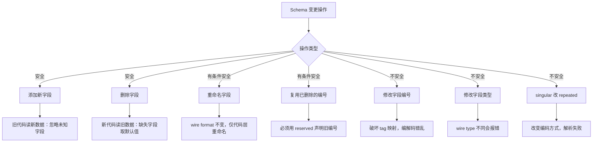
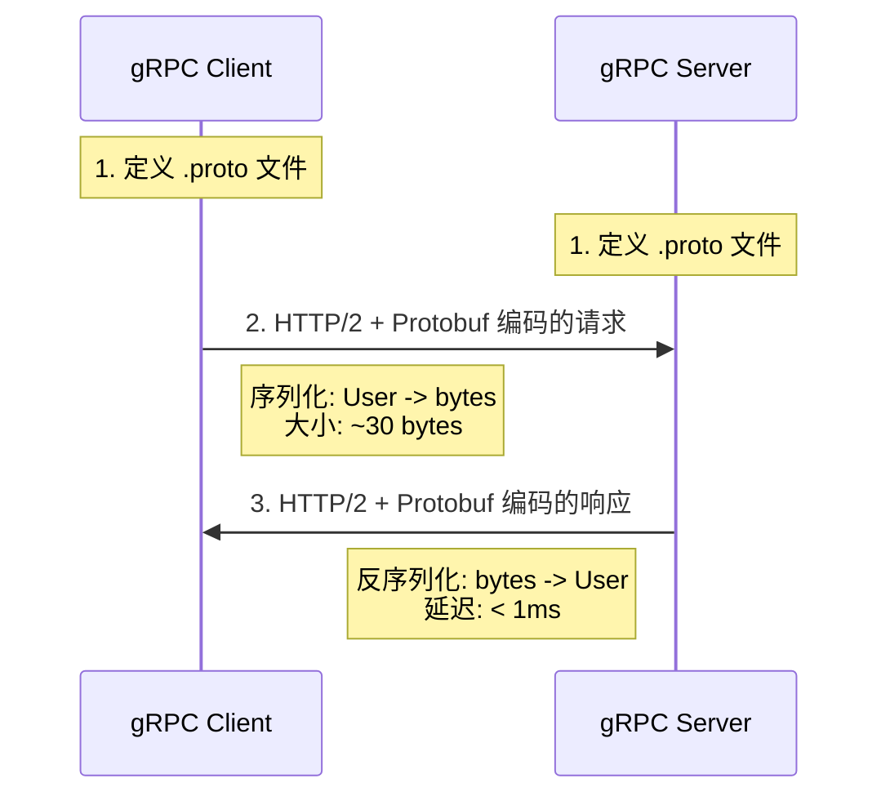

## 二、Protocol Buffers

> **学习目标：** 读完本节，你应当能够：理解 Protobuf 的设计哲学与核心优势；熟练编写 `.proto` 文件定义数据结构；掌握 Wire Format 二进制编码原理（Varint、ZigZag、Length-delimited）；正确处理 Schema 演进中的兼容性问题；使用 protoc 编译器生成多语言代码；在 gRPC 微服务架构中应用 Protobuf 进行高效通信。

### 1. 概述与背景

Protocol Buffers（简称 Protobuf）是 Google 于 2001 年内部开发、2008 年正式开源的**语言中立、平台中立、可扩展的序列化机制**。它的核心目标是解决大规模分布式系统中结构化数据的高效存储与传输问题。在 Google 内部，Protobuf 被应用于超过 48,000 种消息类型，支撑着从 RPC 通信（gRPC）、数据存储（BigTable）、日志收集（Chubby）到配置管理等几乎所有核心基础设施。

与 JSON、XML 等文本序列化格式不同，Protobuf 采用**二进制编码**，其序列化结果通常只有 JSON 的 1/3 到 1/10 大小，序列化/反序列化速度快 2-10 倍。这种优势在高吞吐、低延迟的场景中尤为显著——例如微服务间的 RPC 调用、数据库行存储、跨网络的消息传递等。

**Protobuf 与其他序列化格式的定位对比：**

| 特性 | Protobuf | JSON | XML | MessagePack | Avro |
|------|----------|------|-----|-------------|------|
| 编码方式 | 二进制 | 文本 | 文本 | 二进制 | 二进制 |
| Schema 依赖 | 强依赖 | 无 | 可选(DTD/XSD) | 无 | 强依赖 |
| 人类可读 | 否 | 是 | 是 | 否 | 否 |
| 类型安全 | 编译时检查 | 运行时 | 运行时 | 弱 | 编译时 |
| 典型应用 | gRPC/微服务 | Web API/配置 | 企业集成 | 嵌入式/IoT | 大数据/Hadoop |

**核心设计理念：**

| 设计原则 | 含义 | 体现 |
|----------|------|------|
| Schema First | 先定义结构，再生成代码 | .proto 文件 + protoc 编译器 |
| 向前兼容 | 新代码能读旧数据 | 字段编号机制，未知字段自动跳过 |
| 向后兼容 | 旧代码能读新数据 | 只读已知字段，忽略未知字段 |
| 紧凑高效 | 最小化字节占用 | Varint 编码、无冗余键名 |
| 语言无关 | 一份定义，多语言生成 | 支持 C++, Java, Python, Go, Rust, Swift 等 |

#### 1.1 Proto2 与 Proto3 的演进

Protobuf 经历了两个主要版本的演进，理解其差异对于维护遗留项目和选择新项目技术栈至关重要：

| 特性 | Proto2（2008） | Proto3（2016） |
|------|---------------|---------------|
| 关键字 | `required`、`optional`、`repeated` | `optional`（显式）、`repeated`、`oneof` |
| 默认值 | 无默认值，`required` 字段必须设置 | 所有字段有零值默认值 |
| 枚举首值 | 无限制 | 必须为 0 |
| `unknown` 字段 | 保留并可访问 | 保留但不暴露给用户代码 |
| `group` 语法 | 支持 | 废弃，改用嵌套消息 |
| `import` | 支持 | 支持（增强） |
| `JSON` 映射 | 无内置支持 | 内置 JSON 映射 |
| `map` 类型 | 不支持（用 repeated 替代） | 原生支持 |
| `optional` 语义 | 显式声明可选字段 | 默认所有字段 optional，显式声明生成 `has_xxx()` |

**选择建议：** 新项目一律使用 proto3；维护 proto2 项目时不要盲目迁移，除非有明确的兼容性需求。proto2 的 `required` 关键字是已知的设计反模式——Google 内部文档明确指出 `required` 的使用导致了大量线上事故，因为发送方一旦忘记设置 `required` 字段就会导致接收方崩溃，且这种问题在 Schema 演进中几乎无法修复。

#### 1.2 Protobuf 在工业界的应用

- **Google：** 内部超过 48,000 种消息类型，gRPC 是唯一的内部 RPC 框架，BigTable/Spanner 的存储格式均基于 Protobuf
- **Uber：** 使用 Protobuf 定义所有微服务接口，通过代码生成保证跨语言一致性
- **Square：** 开源的 Wire 库（Android 端轻量级 Protobuf 实现），用于移动支付场景
- **CockroachDB：** 分布式 SQL 数据库的核心 RPC 层基于 gRPC + Protobuf
- **Istio/Envoy：** 服务网格的控制面与数据面通信使用 Protobuf 编码的 xDS 协议

### 2. Proto 文件：Schema 定义语言

`.proto` 文件是 Protobuf 的核心。它使用一种类似 C 语言的 IDL（接口定义语言）来描述数据结构，然后通过 `protoc` 编译器生成对应语言的序列化/反序列化代码。

#### 2.1 基本语法结构

```protobuf
syntax = "proto3";
package example;

option java_package = "com.example.proto";
option go_package = "example/pb";

// 定义一个用户消息
message User {
  int32 id = 1;              // 用户ID，整数类型，字段编号1
  string name = 2;           // 用户名，字符串类型
  string email = 3;          // 邮箱
  repeated string tags = 4;  // 标签列表（repeated 表示可重复/数组）
  UserProfile profile = 5;   // 嵌套消息
  google.protobuf.Timestamp created_at = 6;  // 使用 Well-Known Types
}

// 嵌套消息定义
message UserProfile {
  string bio = 1;
  int32 age = 2;
  bool is_active = 3;
  Avatar avatar = 4;
}

// 消息内嵌套
message Avatar {
  string url = 1;
  int32 width = 2;
  int32 height = 3;
}
```

**关键要素解析：**

- `syntax = "proto3"`：声明使用 proto3 语法（默认 proto3，也可省略此行）。proto3 去掉了 `required` 关键字，所有字段默认 optional。
- `package example`：命名空间，防止消息类型冲突。生成代码时会映射到对应语言的 namespace/package。
- `option`：文件级选项。`java_package` 控制 Java 生成包名，`go_package` 控制 Go 模块路径。
- `message`：定义一个结构化消息类型，类似类或结构体。
- `= 1, = 2, ...`：字段编号（field number），不是默认值，而是编解码时的**标识符**。这是 Protobuf 兼容性的基石。

#### 2.2 标量类型对照表

Protobuf 定义了一组与语言无关的标量类型，映射到不同语言的具体类型：

| Proto 类型 | 含义 | 字节数 | C++ | Java | Go | Python |
|------------|------|--------|-----|------|----|--------|
| `int32` | 变长整数（-2^31 ~ 2^31-1） | 1-5 | `int32` | `int` | `int32` | `int` |
| `int64` | 变长整数（-2^63 ~ 2^63-1） | 1-10 | `int64` | `long` | `int64` | `int` |
| `uint32` | 无符号变长整数 | 1-5 | `uint32` | `int` | `uint32` | `int` |
| `uint64` | 无符号变长整数 | 1-10 | `uint64` | `long` | `uint64` | `int` |
| `sint32` | ZigZag 编码整数（负数友好） | 1-5 | `int32` | `int` | `int32` | `int` |
| `sint64` | ZigZag 编码整数（负数友好） | 1-10 | `int64` | `long` | `int64` | `int` |
| `fixed32` | 固定 4 字节无符号 | 4 | `uint32` | `int` | `uint32` | `int` |
| `fixed64` | 固定 8 字节无符号 | 8 | `uint64` | `long` | `uint64` | `int` |
| `sfixed32` | 固定 4 字节有符号 | 4 | `int32` | `int` | `int32` | `int` |
| `sfixed64` | 固定 8 字节有符号 | 8 | `int64` | `long` | `int64` | `int` |
| `float` | 单精度浮点 | 4 | `float` | `float` | `float32` | `float` |
| `double` | 双精度浮点 | 8 | `double` | `double` | `float64` | `float` |
| `bool` | 布尔值 | 1 | `bool` | `boolean` | `bool` | `bool` |
| `string` | UTF-8 字符串 | 可变 | `string` | `String` | `string` | `str` |
| `bytes` | 字节序列 | 可变 | `string` | `ByteString` | `[]byte` | `bytes` |

**类型选择决策树：**

你的值是什么类型？
├── 整数
│   ├── 始终 ≥ 0 → uint32/uint64
│   ├── 可能为负数
│   │   ├── 分布集中在 0 附近 → int32/int64（Varint 对小正数高效）
│   │   └── 分布均匀或负数居多 → sint32/sint64（ZigZag 编码避免负数膨胀）
│   └── 值分布均匀（如哈希值）→ fixed32/fixed64（固定长度，无 Varint 开销）
├── 浮点数 → float/double（无选择余地）
├── 字符串 → string
├── 二进制数据 → bytes
└── 布尔值 → bool

**选择 int32 vs sint32 的原则：** 如果字段值很少为负数，用 `int32`/`int64`（Varint 对小正数更高效）；如果字段值经常为负数，用 `sint32`/`sint64`（ZigZag 编码避免负数占用 10 字节）。

#### 2.3 复合类型

```protobuf
syntax = "proto3";
package demo;

import "google/protobuf/timestamp.proto";

// 枚举类型
enum Status {
  UNKNOWN = 0;    // proto3 要求枚举第一个值必须为 0
  ACTIVE = 1;
  INACTIVE = 2;
  BANNED = 3;
}

// oneof：互斥字段（同一时间只有一个有效）
message Notification {
  string title = 1;
  oneof payload {
    string text_message = 2;
    bytes image_data = 3;
    StructuredData structured = 4;
  }
}

message StructuredData {
  map<string, string> metadata = 1;  // map 类型
  repeated Action actions = 2;       // repeated：数组/列表
}

message Action {
  string type = 1;
  string target = 2;
}

// 保留字段（防止误用已废弃的字段编号和名称）
// reserved 2, 15, 9 to 11;        // 保留字段编号
// reserved "old_field", "legacy";  // 保留字段名

// 嵌套枚举和消息
message Event {
  enum Type {
    EVENT_TYPE_UNSPECIFIED = 0;
    CREATED = 1;
    UPDATED = 2;
    DELETED = 3;
  }
  Type type = 1;
  string source = 2;
  google.protobuf.Timestamp timestamp = 3;

  // 内部消息
  message Payload {
    string key = 1;
    bytes value = 2;
  }
  Payload payload = 4;
}
```

**核心概念说明：**

- **oneof**：类似于 C 的 union，多个字段共用内存，同时只能设置其中一个。常用于区分不同类型的消息体。设置 oneof 中的一个字段会清除其他字段。在代码中可以通过 `oneof case` 判断当前设置了哪个字段。
- **map\<K, V\>**：键值对类型，key 只能是整数或字符串（不能是浮点数、bytes），value 可以是任意类型。map 在底层编码为 `repeated` 的键值对消息（`repeated MapEntry`），因此 map 不保证顺序，也不保证 key 唯一（后出现的值覆盖先出现的）。
- **repeated**：列表/数组语义，proto3 中默认使用 packed 编码（连续存储在同一个 length-delimited 块中），对于标量类型节省了每个元素的 tag 开销。
- **reserved**：保护已废弃的字段编号和名称不被复用，防止新字段意外覆盖旧数据的语义。proto3 编译器会在你违反 reserved 约束时报错。
- **Well-Known Types**：Google 提供的预定义消息类型，如 `google.protobuf.Timestamp`、`google.protobuf.Duration`、`google.protobuf.Any`、`google.protobuf.StringValue` 等，需要额外 import 并编译。

### 3. Wire Format：二进制编码原理

Protobuf 的高效性根源在于其 Wire Format（线格式）。与 JSON 的文本键值对不同，Protobuf **不传输字段名**，仅传输字段编号和值，极大减少了序列化后的数据量。

#### 3.1 编码结构

每条字段在字节流中的编码格式为：

[tag] [value]
  ↑       ↑
  |       └─ 实际数据（变长或定长，取决于 wire type）
  └─ 字段标签 = field_number << 3 | wire_type

**Wire Type 定义：**

| Wire Type | 值 | 含义 | 对应数据类型 |
|-----------|----|------|-------------|
| Varint | 0 | 变长整数 | int32, int64, uint32, uint64, sint32, sint64, bool, enum |
| 64-bit | 1 | 固定 8 字节 | fixed64, sfixed64, double |
| Length-delimited | 2 | 长度前缀 | string, bytes, embedded messages, packed repeated |
| Start group | 3 | 已废弃（group） | — |
| End group | 4 | 已废弃（group） | — |
| 32-bit | 5 | 固定 4 字节 | fixed32, sfixed32, float |

**Tag 的计算过程：**

字段编号 1，wire type 0（Varint），则 tag 字节 = `1 << 3 | 0 = 0x08`。字段编号 3，wire type 2（Length-delimited），则 tag 字节 = `3 << 3 | 2 = 0x1A`。

**Tag 的字节长度规则：** 字段编号 1-15 只需 1 字节 tag（因为 `field_number << 3` 的结果 < 128），字段编号 16-2047 需要 2 字节 tag。这就是为什么推荐将常用字段放在编号 1-15 的位置——这是 Protobuf 为性能优化留出的"快速通道"。

#### 3.2 Varint 编码详解

Varint 是 Protobuf 中最重要的编码技术。它用**变长的字节序列**表示整数——小数字用更少的字节，大数字用更多字节。

**编码规则：**
1. 每个字节的**最高位（MSB）**是延续标志：1 表示后面还有字节，0 表示这是最后一个字节。
2. 剩余 7 位存储数据，按**小端序**排列。

**示例：编码数字 300**

原始值：300 = 0b100101100

第一步：分组（每 7 位一组，从低位开始）
  0000100  | 0000010

第二步：添加 MSB 标志
  10000100 | 00000010

结果：两个字节 0xAC 0x02

**代码验证（Python）：**

```python
def varint_encode(value: int) -> bytes:
    """Varint 编码"""
    result = bytearray()
    while value > 0x7F:
        result.append((value &amp; 0x7F) | 0x80)
        value >>= 7
    result.append(value)
    return bytes(result)

def varint_decode(data: bytes) -> int:
    """Varint 解码"""
    result = 0
    shift = 0
    for byte in data:
        result |= (byte &amp; 0x7F) << shift
        if byte &amp; 0x80 == 0:
            break
        shift += 7
    return result

# 验证：编码 300
encoded = varint_encode(300)
print(f"300 -> {encoded.hex()}")  # ac 02
print(f"字节数: {len(encoded)}")  # 2 字节（而固定编码需要 4 字节）
```

**Varint 的效率优势：**

| 数值范围 | Varint 字节数 | 固定 4 字节 | 节省比例 |
|----------|--------------|------------|---------|
| 0-127 | 1 字节 | 4 字节 | 75% |
| 128-16383 | 2 字节 | 4 字节 | 50% |
| 16384-2097151 | 3 字节 | 4 字节 | 25% |
| 2097152-268435455 | 4 字节 | 4 字节 | 0% |
| 268435456-2^31-1 | 5 字节 | 4 字节 | -25% |

实际业务中，字段值大多落在小数值区间（如 ID、状态码、计数器），Varint 的空间节省效果显著。但如果数值分布偏向大数（如哈希值），反而会比固定长度编码更浪费空间，此时应选择 `fixed32`/`fixed64`。

**负数的 Varint 编码问题：** proto3 中 `int32` 类型的负数使用补码表示，其高位全为 1，导致 Varint 需要 10 字节来编码。这是 `sint32`/`sint64` 类型存在的根本原因。

#### 3.3 ZigZag 编码

对于有符号整数，直接用 Varint 编码会导致**负数占用 10 字节**（因为补码表示的负数高位全是 1）。ZigZag 编码通过将有符号数映射为无符号数来解决这个问题：

原始值    ZigZag 编码值
 0     →      0
-1     →      1
 1     →      2
-2     →      3
 2     →      4
-3     →      5
 ...

**映射公式：** `ZigZag(n) = (n << 1) ^ (n >> 31)`（32 位版本）

```python
def zigzag_encode(value: int) -> int:
    """ZigZag 编码"""
    return (value << 1) ^ (value >> 31)

def zigzag_decode(value: int) -> int:
    """ZigZag 解码"""
    return (value >> 1) ^ -(value &amp; 1)

# 测试
print(zigzag_encode(-1))   # 1（1字节 vs 补码的10字节）
print(zigzag_encode(1))    # 2（1字节）
print(zigzag_encode(-150)) # 299（2字节）
```

**这就是为什么 proto3 推荐对可能为负数的字段使用 `sint32`/`sint64` 而非 `int32`/`int64` 的原因。**

#### 3.4 Length-Delimited 编码

对于字符串、字节数组、嵌套消息和 packed repeated 字段，Protobuf 使用 Length-delimited 编码：

[tag] [length] [data]
  ↑      ↑       ↑
  |      |       └─ 实际字节数据
  |      └─ 数据长度（Varint 编码）
  └─ 字段标签

**示例：编码字符串 "Hello"（字段编号 1）**

tag:   0x0A  (1 << 3 | 2 = 10 = 0x0A)
length: 0x05  ("Hello" 的 UTF-8 字节长度)
data:  48 65 6C 6C 6F  (H e l l o)

**Packed Repeated 编码：** proto3 中 repeated 标量字段默认使用 packed 编码，将所有元素打包到一个 Length-delimited 块中：

非 packed（proto2 默认）：
  [tag1] [value1] [tag1] [value2] [tag1] [value3]
  每个元素都带 tag，开销大

packed（proto3 默认）：
  [tag] [total_length] [value1][value2][value3]
  只有一个 tag + 长度前缀，元素连续存储

#### 3.5 完整编码示例

假设有以下消息：

```protobuf
message Person {
  string name = 1;
  int32 age = 2;
  repeated string emails = 3;
}
```

设置值 `name = "Alice"`, `age = 30`, `emails = ["a@x.com", "b@x.com"]`，编码过程：

字段 1 (name): string, wire type 2
  tag: 0x08 (field=1, wire_type=2, 计算: 1<<3|2 = 10 = 0x08)
  length: 5 ("Alice" 的 UTF-8 字节长度)
  data: 41 6C 69 63 65
  → 08 05 41 6C 69 63 65

字段 2 (age): int32, wire type 0
  tag: 0x10 (field=2, wire_type=0, 计算: 2<<3|0 = 16 = 0x10)
  data: 30 (Varint 编码，单字节)
  → 10 1E

字段 3 (emails): repeated string, packed, wire type 2
  tag: 0x1A (field=3, wire_type=2, 计算: 3<<3|2 = 26 = 0x1A)
  total length: 14 (两个子字符串的编码长度之和)
  子元素 1: 0A 07 61 40 78 2E 63 6F 6D  (tag=0x0A, len=7, "a@x.com")
  子元素 2: 0A 07 62 40 78 2E 63 6F 6D  (tag=0x0A, len=7, "b@x.com")
  → 1A 0E 0A 07 61 40 78 2E 63 6F 6D 0A 07 62 40 78 2E 63 6F 6D

总编码: 08 05 41 6C 69 63 65 10 1E 1A 0E 0A 07 61 40 78 2E 63 6F 6D 0A 07 62 40 78 2E 63 6F 6D

**对比同样的 JSON：**

```json
{"name":"Alice","age":30,"emails":["a@x.com","b@x.com"]}
```

JSON: 62 字节 → Protobuf: 30 字节（节省 51.6%）

对于数值密集型消息（如时间序列数据），Protobuf 的优势更为明显，压缩比可达 80%-90%。

#### 3.6 嵌套消息的编码

嵌套消息作为 Length-delimited 数据编码，其内部字段同样按 tag-value 对格式排列：

```protobuf
message Outer {
  int32 id = 1;         // tag=0x08, value=Varint
  Inner inner = 2;      // tag=0x10, wire_type=2
}

message Inner {
  string name = 1;      // tag=0x0A, wire_type=2
  int32 value = 2;      // tag=0x10, wire_type=0
}
```

编码 `Outer{id=1, inner={name="test", value=42}}`：

字段 1: 08 01                           (id=1)
字段 2: 12 0C                           (inner, length=12)
         0A 04 74 65 73 74               (name="test")
         10 2A                           (value=42)

### 4. Schema 演进与兼容性

Schema 演进是 Protobuf 最强大的特性之一。它允许你在不破坏现有代码的情况下，持续演进数据结构。

#### 4.1 兼容性规则



**安全操作（永远可以做）：**
- **添加新字段**：旧代码遇到未知字段编号时自动跳过，不影响解析。
- **删除字段**：新代码读到旧数据时，缺失的字段取默认值（proto3 默认零值）。

**有条件安全的操作：**
- **重命名字段**：Wire format 基于字段编号而非名称，所以重命名不影响序列化。但要注意：部分语言的 JSON 映射会使用字段名，重命名可能导致 JSON 序列化不兼容。
- **字段编号复用**：必须使用 `reserved` 声明废弃编号，防止新字段复用旧编号导致语义混淆。

**绝对禁止的操作：**
- **修改字段编号**：这是 Protobuf 的身份标识，修改后旧数据无法正确解析。
- **修改字段的 wire type**：例如从 `int32`（varint）改为 `fixed32`（32-bit），会导致解码器读取错误的字节数。以下是安全的类型兼容映射：

| 原类型 | 可安全转换为 | 原因 |
|--------|-------------|------|
| int32 | int64 | 都是 wire type 0，Varint 编码 |
| uint32 | uint64 | 同上 |
| sint32 | sint64 | 同上 |
| fixed32 | fixed64 | 不同 wire type，**不兼容** |
| float | double | 不同 wire type，**不兼容** |
| string | bytes | 都是 wire type 2，但语义不同 |

#### 4.2 Reserved 机制

```protobuf
message User {
  reserved 2, 15, 9 to 11;           // 这些编号不能再被使用
  reserved "old_name", "legacy_id";  // 这些名称不能再被使用

  int32 id = 1;
  string username = 3;  // 字段编号 2 已被保留
  // int32 old_field = 2;  // 编译错误！编号 2 已保留
}
```

**最佳实践：** 每次删除字段时，立即将其编号加入 `reserved`，避免未来维护者不慎复用。在团队协作中，建议在代码审查（Code Review）流程中加入 "删除字段时是否添加 reserved" 的检查项。

**reserved 的编译时保护：** 如果你在代码中尝试使用 reserved 的编号或名称，`protoc` 编译器会直接报错，而不是等到运行时才发现问题。这是 Protobuf Schema 治理的重要防线。

#### 4.3 Proto3 默认值陷阱

Proto3 中，所有字段都有默认零值，且**默认值不会被序列化**。这意味着：

```protobuf
message Settings {
  bool enabled = 1;     // 默认 false，不序列化
  int32 count = 2;      // 默认 0，不序列化
  string label = 3;     // 默认 ""，不序列化
}
```

如果发送方设置 `enabled = false` 和 `count = 0`，接收方**无法区分**以下情况：
1. 发送方显式设置了 `false` / `0`
2. 发送方根本没有设置这个字段

**解决方案（按推荐程度排序）：**

| 方案 | 适用场景 | 优点 | 缺点 |
|------|---------|------|------|
| `optional` 关键字 | proto3 15.1+，推荐 | 编译时生成 `has_xxx()` 方法 | 需要较新版本 protoc |
| `google.protobuf.BoolValue` | 需要与 JSON 互操作 | 标准 Well-Known Type，跨语言支持好 | 增加一层嵌套，编码略大 |
| 自定义约定 | 旧版本 protoc | 无依赖 | 语义不明确，容易出错 |

```protobuf
message Settings {
  optional bool enabled = 1;      // proto3 optional，生成 has_enabled()
  optional int32 count = 2;       // proto3 optional，生成 has_count()
  string label = 3;               // 不需要区分"未设置"的字段用普通类型
}

// 使用 Well-Known Types 的替代方案
import "google/protobuf/wrappers.proto";

message SettingsAlt {
  google.protobuf.BoolValue enabled = 1;   // 可区分 null/false
  google.protobuf.Int32Value count = 2;    // 可区分 null/0
  string label = 3;
}
```

### 5. 编译与代码生成

#### 5.1 protoc 编译器

`protoc` 是 Protobuf 的官方编译器，负责将 `.proto` 文件翻译成目标语言的代码。

```bash
# 安装 protoc
# Ubuntu/Debian
sudo apt-get install -y protobuf-compiler

# macOS
brew install protobuf

# 从 GitHub releases 安装最新版本（推荐）
# https://github.com/protocolbuffers/protobuf/releases
PB_VER="25.1"
curl -LO "https://github.com/protocolbuffers/protobuf/releases/download/v${PB_VER}/protoc-${PB_VER}-linux-x86_64.zip"
unzip "protoc-${PB_VER}-linux-x86_64.zip" -d /usr/local

# 验证安装
protoc --version
# libprotoc 25.1
```

**安装语言特定的插件：**

```bash
# Go: 安装 protoc-gen-go 和 protoc-gen-go-grpc
go install google.golang.org/protobuf/cmd/protoc-gen-go@latest
go install google.golang.org/grpc/cmd/protoc-gen-go-grpc@latest

# Rust: 安装 protoc-gen-rust（通过 cargo）
cargo install protobuf-codegen

# Dart: 安装 protoc plugin
dart pub global activate protoc_plugin
```

#### 5.2 生成代码

```bash
# 生成 Python 代码
protoc --python_out=. user.proto

# 生成 Go 代码（需要安装 protoc-gen-go）
protoc --go_out=. --go_opt=paths=source_relative user.proto

# 生成 Java 代码
protoc --java_out=. user.proto

# 生成 C++ 代码
protoc --cpp_out=. user.proto

# 一次性生成多种语言
protoc --python_out=. --go_out=. --java_out=. user.proto

# 生成 gRPC 代码（以 Go 为例）
protoc --go_out=. --go_opt=paths=source_relative \
       --go-grpc_out=. --go-grpc_opt=paths=source_relative \
       user.proto
```

**生成的 Python 示例：**

```python
import user_pb2

# 创建消息
user = user_pb2.User()
user.id = 1
user.name = "Alice"
user.email = "alice@example.com"
user.tags.append("admin")
user.tags.append("vip")

# 序列化为字节
data = user.SerializeToString()
print(f"序列化大小: {len(data)} 字节")

# 反序列化
user2 = user_pb2.User()
user2.ParseFromString(data)
print(f"Name: {user2.name}, Email: {user2.email}")

# 读取未知字段（自动跳过）
for field, value in user2.ListFields():
    print(f"  {field.name} = {value}")

# 消息转 JSON（proto3 内置支持）
from google.protobuf.json_format import MessageToJson, MessageToDict
json_str = MessageToJson(user)
dict_obj = MessageToDict(user)
print(f"JSON: {json_str}")
```

**生成的 Go 示例：**

```go
package main

import (
    "fmt"
    "log"

    pb "example/pb" // 生成的包路径
    "google.golang.org/protobuf/proto"
)

func main() {
    // 创建消息
    user := &amp;pb.User{
        Id:    1,
        Name:  "Alice",
        Email: "alice@example.com",
        Tags:  []string{"admin", "vip"},
    }

    // 序列化
    data, err := proto.Marshal(user)
    if err != nil {
        log.Fatal(err)
    }
    fmt.Printf("序列化大小: %d 字节\n", len(data))

    // 反序列化
    user2 := &amp;pb.User{}
    if err := proto.Unmarshal(data, user2); err != nil {
        log.Fatal(err)
    }
    fmt.Printf("Name: %s, Email: %s\n", user2.Name, user2.Email)
}
```

#### 5.3 多文件组织与导入

```protobuf
// common/types.proto
syntax = "proto3";
package common;

message Timestamp {
  int64 seconds = 1;
  int32 nanos = 2;
}

// user/user.proto
syntax = "proto3";
package user;

import "common/types.proto";  // 导入公共类型

message User {
  int32 id = 1;
  string name = 2;
  common.Timestamp created_at = 3;  // 使用导入的类型
}
```

```bash
# 编译时指定导入路径
protoc --proto_path=. --python_out=. user/user.proto

# 多个导入路径
protoc --proto_path=./proto --proto_path=./third_party --python_out=. user.proto
```

#### 5.4 调试与检查工具

Protobuf 提供了多个工具用于检查和调试二进制编码的数据：

```bash
# 解码二进制数据为可读文本
echo "08 05 41 6C 69 63 65" | protoc --decode_raw
# 输出:
# 1: 5
# 2: "Alice"

# 使用 .proto 文件解码（带字段名）
echo "08 05 41 6C 69 63 65" | protoc --decode=User user.proto
# 输出:
# id: 1
# name: "Alice"

# 编码文本为二进制
echo 'name: "Alice" id: 1' | protoc --encode=User user.proto > output.bin

# 检查 .proto 文件语法
protoc --lint_out=. user.proto

# 比较两个二进制消息的差异（需要 protoc-gen-diff 插件）
```

**Python 调试技巧：**

```python
from google.protobuf import text_format
import user_pb2

# 从二进制数据反序列化
user = user_pb2.User()
user.ParseFromString(binary_data)

# 输出人类可读的文本格式（调试用）
print(text_format.MessageToString(user))
# 输出:
# id: 1
# name: "Alice"
# email: "alice@example.com"
# tags: "admin"
# tags: "vip"

# 从文本格式创建消息
text = 'id: 1 name: "Bob" email: "bob@example.com"'
user2 = text_format.Merge(text, user_pb2.User())

# 检查消息的哪些字段被设置（非零值）
for field_desc, value in user.ListFields():
    print(f"字段 '{field_desc.name}' = {value}")
```

### 6. 性能分析与优化

#### 6.1 序列化性能对比

以下数据基于典型的企业消息（10-50 个字段，包含字符串、整数、布尔值和嵌套消息）：

| 指标 | Protobuf | JSON | MessagePack | Avro |
|------|----------|------|-------------|------|
| 序列化速度 | 1x（基准） | 0.2-0.5x | 0.5-0.8x | 0.3-0.6x |
| 反序列化速度 | 1x（基准） | 0.3-0.6x | 0.6-0.9x | 0.4-0.7x |
| 序列化大小 | 1x（基准） | 2-5x | 1.2-2x | 1-1.5x |
| CPU 占用 | 低 | 中-高 | 低-中 | 中 |
| Schema 演进支持 | 优秀 | 无（需自建） | 有限 | 优秀 |
| 人类可读 | 否 | 是 | 否 | 否 |
| 无 Schema 运行 | 否 | 是 | 是 | 否 |

#### 6.2 优化技巧

**技巧一：使用 packed repeated**

Proto3 中 repeated 标量字段默认 packed 编码，将所有元素打包到一个 length-delimited 块中，省去每个元素的 tag 开销。

```protobuf
message DataPoint {
  // 好：packed（proto3 默认）
  repeated double values = 1;

  // 已废弃的非 packed 模式（proto2 默认）
  // repeated double values = 1 [packed=false];
}
```

**技巧二：选择合适的整数类型**

```protobuf
message OptimizedMessage {
  // 如果值通常 < 128，用 int32 就够了（Varint 编码 1 字节）
  int32 status_code = 1;

  // 如果值经常为负数，用 sint32 避免 10 字节编码
  sint32 temperature = 2;

  // 如果值通常是大数且分布均匀，用 fixed32（固定 4 字节）
  fixed32 hash_value = 3;

  // 对于 UUID 等固定 16 字节的数据，用 bytes 比两个 fixed64 更清晰
  bytes uuid = 4;
}
```

**技巧三：控制消息大小**

单条 Protobuf 消息超过 1MB 时，考虑：
- 拆分为多条消息流式传输
- 使用 chunk 分块 + 流式 RPC
- 在接收端设置消息大小限制

```python
# Python 中设置消息大小限制
from google.protobuf import descriptor_pool
from google.protobuf.message import DecodeError

MAX_SIZE = 1 * 1024 * 1024  # 1MB

data = response.read()
if len(data) > MAX_SIZE:
    raise ValueError(f"消息过大: {len(data)} 字节")
message.ParseFromString(data)
```

```go
// Go gRPC 中设置最大接收消息大小（默认 4MB）
import "google.golang.org/grpc"

server := grpc.NewServer(
    grpc.MaxRecvMsgSize(16 * 1024 * 1024),  // 16MB
)
```

**技巧四：利用 UnknownFieldSet 进行透传**

```python
# 读取并保留未知字段，用于代理/网关场景
msg = MyMessage()
msg.ParseFromString(data)

# 未知字段保存在 msg.unknown_fields 中
# 可以直接重新序列化，实现"透传"
forward_data = msg.SerializeToString()
```

**技巧五：使用 Arena 分配（C++ 场景）**

```cpp
// C++ 中使用 Arena 管理内存，避免频繁 malloc/free
google::protobuf::Arena arena;

auto* msg = google::protobuf::Arena::CreateMessage<MyMessage>(&amp;arena);
msg->set_name("Alice");
msg->set_id(1);

// 序列化时直接从 Arena 读取，无需额外内存拷贝
std::string serialized;
msg->SerializeToString(&amp;serialized);

// arena 析构时一次性释放所有内存
```

**技巧六：字段编号分配策略**

字段编号 1-15:    常用字段（tag 占 1 字节）
字段编号 16-2047: 次要字段（tag 占 2 字节）
字段编号 2048+:   极少使用的字段（tag 占 3 字节）

### 7. Protobuf 与 gRPC 的协同

Protobuf 在现代微服务架构中最典型的应用是作为 gRPC 的 IDL 和序列化层。gRPC 使用 `.proto` 文件同时定义服务接口和消息格式：

```protobuf
syntax = "proto3";
package user;

service UserService {
  // 一元 RPC（请求-响应）
  rpc GetUser(GetUserRequest) returns (User);

  // 服务端流式 RPC
  rpc ListUsers(ListUsersRequest) returns (stream User);

  // 客户端流式 RPC
  rpc BatchCreate(stream User) returns (BatchCreateResponse);

  // 双向流式 RPC
  rpc Chat(stream ChatMessage) returns (stream ChatMessage);
}

message GetUserRequest {
  int32 id = 1;
}

message User {
  int32 id = 1;
  string name = 2;
  string email = 3;
}

message ListUsersRequest {
  int32 page_size = 1;
  string page_token = 2;
}
```



#### 7.1 gRPC 四种通信模式详解

| 模式 | Proto 定义 | 适用场景 | 典型用例 |
|------|-----------|---------|---------|
| 一元 RPC | `rpc Method(Request) returns (Response)` | 简单的请求-响应 | 查询用户信息、提交表单 |
| 服务端流式 | `rpc Method(Request) returns (stream Response)` | 服务端推送大量数据 | 实时日志流、股票行情推送 |
| 客户端流式 | `rpc Method(stream Request) returns (Response)` | 客户端上传批量数据 | 批量导入、文件上传 |
| 双向流式 | `rpc Method(stream Request) returns (stream Response)` | 双方实时交互 | 聊天系统、协同编辑 |

#### 7.2 Proto3 JSON 映射规则

gRPC 的 HTTP/JSON 转码（如 Envoy、grpc-gateway）依赖 Proto3 的 JSON 映射规则：

| Proto 字段 | JSON 字段 | JSON 值 | 示例 |
|-----------|----------|---------|------|
| `string` | `"fieldName"` | `"string"` | `"name": "Alice"` |
| `int32` | `"fieldName"` | `number` | `"id": 1` |
| `bool` | `"fieldName"` | `true`/`false` | `"active": true` |
| `bytes` | `"fieldName"` | `base64 string` | `"data": "AQID"` |
| `enum` | `"fieldName"` | `string`（默认）或 `number` | `"status": "ACTIVE"` |
| `repeated` | `"fieldName"` | `array` | `"tags": ["a", "b"]` |
| `map` | `"fieldName"` | `object` | `{"k1": "v1"}` |
| `oneof` | `"fieldName"` | 当前设置的字段值 | `"text": "hello"` |
| `google.protobuf.Timestamp` | `"fieldName"` | RFC 3339 string | `"ts": "2024-01-01T00:00:00Z"` |
| `google.protobuf.Duration` | `"fieldName"` | `"Ns"` 格式 | `"dur": "1.5s"` |
| `google.protobuf.FieldMask` | `"fieldName"` | `"camelCase.field"` | `"mask": "name,email"` |

### 8. 安全考量

#### 8.1 反序列化安全

Protobuf 的反序列化本身比 JSON 更安全（没有 eval 注入、XML XXE 等问题），但仍需注意：

- **消息大小限制**：恶意客户端可能发送超大消息耗尽内存。务必在服务端设置接收大小限制。
- **递归深度限制**：嵌套消息可能导致栈溢出。部分语言的解析器有默认递归深度限制（如 Java 默认 100 层），应根据业务需求调整。
- **未知字段累积**：代理/网关场景中，未知字段会在转发过程中不断累积。应定期清理不再需要的未知字段。

```python
# 限制消息大小和递归深度
from google.protobuf import descriptor_pool

# 清除未知字段（防止累积）
msg = MyMessage()
msg.ParseFromString(data)
msg.ClearField(b'unknown_fields')  # 不同语言 API 不同
```

#### 8.2 数据验证

Protobuf 本身不提供数据验证能力，需要在应用层处理：

```protobuf
message CreateUserRequest {
  string name = 1;    // 需要应用层验证非空
  string email = 2;   // 需要应用层验证格式
  int32 age = 3;      // 需要应用层验证范围
}
```

**推荐的验证方案：**
- **buf lint**：Proto 文件的 lint 工具，检查命名规范和常见错误
- **protoc-gen-validate**（PGV）：为 Protobuf 消息添加验证规则的代码生成器
- **自定义中间件**：在 gRPC 拦截器中统一验证请求

```protobuf
// 使用 protoc-gen-validate（示例）
import "validate/validate.proto";

message CreateUserRequest {
  string name = 1 [(validate.rules).string.min_len = 1];
  string email = 2 [(validate.rules).string.email = true];
  int32 age = 3 [(validate.rules).int32 = {gte: 0, lte: 150}];
}
```

### 9. 常见误区与最佳实践

#### 误区一：将字段编号当作数组索引

```protobuf
// 错误：字段编号不是索引，可以不连续
message Bad {
  int32 a = 0;  // proto3 编号从 1 开始，0 保留给默认值
  int32 b = 1;
  int32 c = 99; // 跳到 99？完全可以，但不推荐
}

// 正确：连续编号，但保留空间给未来扩展
message Good {
  int32 a = 1;
  int32 b = 2;
  int32 c = 3;
  // 4-19 保留给未来的小字段
  // 20+ 保留给未来的大字段
}
```

**推荐的编号分配策略：**
- 字段 1-15：常用字段（只占 1 字节 tag）
- 字段 16-2047：次要字段（占 2 字节 tag）
- 字段 2048+：很少使用的字段

#### 误区二：认为 Protobuf 只用于网络传输

Protobuf 的序列化/反序列化能力同样适用于：
- **本地文件存储**：数据库引擎的行格式（如 TiKV 使用 protobuf 编码行数据）
- **日志格式**：结构化二进制日志比 JSON 日志更紧凑
- **缓存存储**：Redis 中存储 protobuf 编码的值，节省内存
- **配置管理**：结构化配置比 YAML 更安全（有类型检查）
- **消息队列**：Kafka/Pulsar 中使用 Protobuf 编码的消息，节省网络带宽和存储空间

#### 误区三：忽略 proto3 的默认值行为

```protobuf
// proto3 中，默认值不会被序列化
message Config {
  bool debug = 1;    // 默认 false，不序列化
  int32 retries = 2; // 默认 0，不序列化
}

// 发送方设置 debug = false，接收方无法区分
// "发送方显式设为 false" vs "发送方没设置"
// 解决方案：使用 optional 关键字
message Config {
  optional bool debug = 1;    // proto3 optional
  optional int32 retries = 2; // proto3 optional
}
```

#### 误区四：忽略 Protobuf 的调试难度

二进制格式天然不如文本格式容易调试。推荐的调试方法：

1. **使用 `protoc --decode`**：将二进制数据解码为可读文本
2. **使用 `text_format.MessageToString()`**：Python 中将消息转为可读文本
3. **开启 gRPC 日志**：`GRPC_VERBOSITY=DEBUG GRPC_TRACE=all` 查看传输细节
4. **使用 Wireshark + protobuf dissector**：抓包分析 Protobuf 流量

#### 最佳实践总结

| 实践 | 原因 |
|------|------|
| 始终使用 `syntax = "proto3"` | proto2 的 `required` 是设计反模式，已被废弃 |
| 字段编号 1-15 用于常用字段 | 占 1 字节 tag，更紧凑 |
| 删除字段时使用 `reserved` | 防止编号被复用导致数据损坏 |
| 数值可能为负时用 `sint32/sint64` | 避免负数占 10 字节 |
| 使用 `optional` 区分零值和未设置 | proto3 默认值陷阱的唯一解 |
| 消息大小控制在 1MB 以内 | 避免内存暴涨和 GC 压力 |
| 使用 buf lint 检查 proto 文件 | 团队协作中保持 Schema 规范一致 |
| 为重要字段编写验证规则 | Protobuf 本身不验证数据合法性 |
| 在 CI 中集成 protoc 编译检查 | 防止 Schema 变更破坏兼容性 |

### 10. 本节小结

Protocol Buffers 的核心价值在于三个层面：

1. **编码效率**：Varint、ZigZag、字段编号等精巧的二进制编码技术，使序列化结果远小于 JSON/XML，序列化/反序列化速度快数倍。

2. **Schema 驱动**：通过 `.proto` 文件定义数据结构，配合 `protoc` 编译器自动生成类型安全的代码，消除了手写序列化逻辑的错误风险。

3. **演进能力**：字段编号机制天然支持前向/后向兼容，使数据结构可以随业务需求持续演进而不破坏现有系统。

在现代分布式系统中，Protobuf 几乎是 RPC 通信的标配选择（gRPC 默认序列化协议），同时也广泛应用于数据存储、日志传输、配置管理等场景。理解其 Wire Format 的工作原理，有助于你在系统设计中做出更准确的技术选型，并在性能优化时抓住关键瓶颈。

**深入学习路线：**
- 编码细节与优化 → 核心技巧：Protobuf 编码
- Schema 演进策略 → 核心技巧：Schema 演进
- 与其他格式的性能对比 → 核心技巧：性能对比
