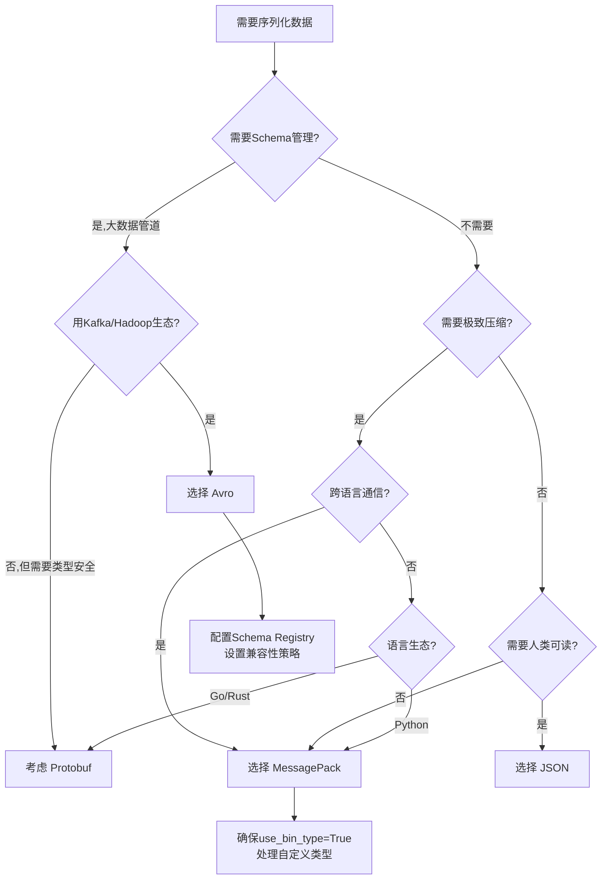

## 三、Avro与MessagePack

在序列化格式的版图中，JSON以其人类可读性统治了Web API，Protocol Buffers以其极致性能称霸了RPC调用。但在这两个极端之间，存在两个极具特色的竞争者：**Apache Avro**和**MessagePack**。Avro是大数据生态的事实标准，以Schema驱动和极致压缩著称；MessagePack则被称为"二进制版JSON"，以零配置、即插即用的便捷性赢得开发者青睐。本节将深入剖析这两种格式的原理、实现与实战选型。

---

### 3.1 Apache Avro

#### 3.1.1 设计哲学与历史背景

Avro由Apache基金会维护，最初是为Hadoop项目设计的数据序列化格式。其核心设计理念可以用一句话概括：**Schema是一等公民**。

与Protobuf需要预编译不同，Avro的Schema用JSON编写，运行时动态加载。这带来了几个关键优势：

- **无需代码生成**：Schema直接嵌入数据文件或通过注册中心分发
- **Schema演进友好**：读写双方使用不同版本的Schema也能正常通信
- **极致压缩**：数据本身不存储字段名和类型信息，完全依赖Schema解码

Avro的数据文件（`.avro`）广泛用于Hadoop、Spark、Kafka等大数据组件。Kafka的Connect和Streams API均原生支持Avro格式。

#### 3.1.2 Schema体系

Avro的Schema系统是其最核心的特性，分为三种模式：

**1. 原始类型（Primitive Types）**

| 类型 | 说明 | 示例值 |
|------|------|--------|
| `null` | 空值 | `null` |
| `boolean` | 布尔值 | `true`, `false` |
| `int` | 32位有符号整数 | `42` |
| `long` | 64位有符号整数 | `1099511627776` |
| `float` | 32位IEEE 754浮点数 | `3.14` |
| `double` | 64位IEEE 754浮点数 | `3.141592653589793` |
| `bytes` | 字节数组 | `[0x48, 0x65]` |
| `string` | Unicode字符串 | `"hello"` |

**2. 复杂类型（Complex Types）**

| 类型 | 说明 | 典型用途 |
|------|------|----------|
| `record` | 命名的字段集合 | 定义数据结构 |
| `enum` | 命名的值集合 | 状态码、类型枚举 |
| `array` | 有序的同类型元素集合 | 列表、数组 |
| `map` | 键值对集合（key为string） | 字典、哈希表 |
| `union` | 多类型联合体 | 可选字段、多态 |
| `fixed` | 固定长度字节数组 | UUID、定长编码 |

**3. 完整Schema示例**

```json
{
  "type": "record",
  "name": "UserEvent",
  "namespace": "com.example.events",
  "fields": [
    {"name": "user_id", "type": "long"},
    {"name": "event_type", "type": {
      "type": "enum",
      "name": "EventType",
      "symbols": ["LOGIN", "LOGOUT", "PURCHASE", "VIEW"]
    }},
    {"name": "timestamp", "type": "long", "logicalType": "timestamp-millis"},
    {"name": "payload", "type": ["null", "string"], "default": null},
    {"name": "tags", "type": {"type": "map", "values": "string"}, "default": {}},
    {"name": "scores", "type": {"type": "array", "items": "float"}, "default": []}
  ]
}
```

在这个Schema中：
- `union`类型`["null", "string"]`表示`payload`是可选字段
- `logicalType`为`timestamp-millis`表示长整数存储的是毫秒级时间戳
- `default`字段确保读端Schema缺少该字段时有默认值

#### 3.1.3 二进制编码原理

Avro的二进制编码极其紧凑，原因在于**数据中不存储字段名、不存储长度前缀（对于定长类型）、不存储分隔符**。一切完全按照Schema的字段顺序编码。

**varint编码（Variable-length integer）**

Avro使用变长整数编码（与Protocol Buffers的Varint相同），将小整数用更少的字节表示：

```python
def encode_varint(value: int) -> bytes:
    """Avro变长整数编码（ZigZag + VLQ）"""
    # ZigZag编码：将有符号数映射为无符号数
    # -1 -> 1, 1 -> 2, -2 -> 3, 2 -> 4, ...
    encoded = (value << 1) ^ (value >> 63)
    result = bytearray()
    while encoded > 0x7F:
        result.append((encoded &amp; 0x7F) | 0x80)
        encoded >>= 7
    result.append(encoded &amp; 0x7F)
    return bytes(result)

# 示例
print(encode_varint(300))   # b'\xac\x04' (2字节，而非4字节)
print(encode_varint(-1))    # b'\x01' (1字节)
print(encode_varint(1))     # b'\x02' (1字节)
```

**各类型的编码规则**

| 类型 | 编码方式 | 字节数 |
|------|----------|--------|
| `null` | 不编码 | 0 |
| `boolean` | 0x00(false) 或 0x01(true) | 1 |
| `int` | ZigZag + Varint | 1-5 |
| `long` | ZigZag + Varint | 1-10 |
| `float` | IEEE 754 little-endian | 4 |
| `double` | IEEE 754 little-endian | 8 |
| `string` | Varint长度 + UTF-8字节 | 变长 |
| `bytes` | Varint长度 + 原始字节 | 变长 |
| `fixed` | 固定长度的原始字节 | N |
| `enum` | 按符号序号的Varint | 1-5 |
| `array` | Varint块大小 + 元素数据，以0结束 | 变长 |
| `map` | Varint块大小 + 键值对，以0结束 | 变长 |
| `union` | Varint索引（0=第一个类型） | 1-5 |

**字段顺序至关重要**：编码时按照Schema定义的字段顺序依次写入，解码时按相同顺序读取。如果写端和读端的Schema字段顺序不一致，会导致数据错乱。

#### 3.1.4 Schema演进规则

Schema演进是Avro的核心竞争力。读端和写端可以使用不同版本的Schema，Avro通过以下规则保证兼容性：

**1. 向后兼容（Backward Compatible）**—— 旧读端能读新数据

- 新增字段时必须提供`default`值
- 不能删除有`default`值的字段
- 不能改变字段的类型

**2. 向前兼容（Forward Compatible）**—— 新读端能读旧数据

- 新增字段在旧数据中用`default`值填充
- 不能删除没有`default`值的字段

**3. 完全兼容（Full Compatible）**—— 双向兼容

同时满足向后兼容和向前兼容。

```json
// V1 Schema
{
  "type": "record",
  "name": "Order",
  "fields": [
    {"name": "order_id", "type": "string"},
    {"name": "amount", "type": "double"}
  ]
}

// V2 Schema（向后兼容：新增字段带default值）
{
  "type": "record",
  "name": "Order",
  "fields": [
    {"name": "order_id", "type": "string"},
    {"name": "amount", "type": "double"},
    {"name": "currency", "type": "string", "default": "USD"},
    {"name": "discount", "type": "double", "default": 0.0}
  ]
}
```

#### 3.1.5 Avro容器文件格式

`.avro`文件是一种自包含的容器格式，文件头中嵌入了完整的Schema：

┌─────────────────────────────┐
│  Magic Bytes: "Obj" + 0x01  │  4字节
├─────────────────────────────┤
│  Metadata Block              │
│  - avro.schema (JSON Schema)│
│  - avro.codec (null/snappy) │
├─────────────────────────────┤
│  Sync Marker (16字节随机值)  │
├─────────────────────────────┤
│  Data Block 1               │
│  - count: 该块记录数          │
│  - size: 该块压缩后字节数      │
│  - 编码后的记录数据            │
├─────────────────────────────┤
│  Sync Marker                │
├─────────────────────────────┤
│  Data Block 2               │
│  ...                        │
├─────────────────────────────┤
│  Sync Marker (文件末尾)       │
└─────────────────────────────┘

每个Data Block的大小通常为16KB-1MB，可通过`avro.data.codec`参数配置。同步标记（Sync Marker）是一段16字节的随机数，在文件头和每个Block之间重复出现，用于在文件损坏时定位Block边界。

#### 3.1.6 实战：Python读写Avro

```python
import fastavro
from io import BytesIO

# 定义Schema
schema = {
    "type": "record",
    "name": "SensorReading",
    "namespace": "com.iot",
    "fields": [
        {"name": "device_id", "type": "string"},
        {"name": "temperature", "type": "float"},
        {"name": "humidity", "type": "float"},
        {"name": "timestamp", "type": "long", "logicalType": "timestamp-millis"},
        {"name": "location", "type": ["null", "string"], "default": None}
    ]
}

# 序列化
records = [
    {"device_id": "sensor-001", "temperature": 23.5, "humidity": 65.2,
     "timestamp": 1719360000000, "location": "Beijing"},
    {"device_id": "sensor-002", "temperature": 28.1, "humidity": 72.8,
     "timestamp": 1719360000000, "location": None},
]

buf = BytesIO()
fastavro.writer(buf, schema, records)
avro_bytes = buf.getvalue()
print(f"序列化大小: {len(avro_bytes)} 字节")

# 反序列化
buf.seek(0)
reader = fastavro.reader(buf)
for record in reader:
    print(record)
```

#### 3.1.7 Schema注册中心

在生产环境中，Schema通常不直接嵌入每个数据文件，而是通过**Schema注册中心**（Schema Registry）集中管理。Confluent Schema Registry是事实标准：

┌──────────┐    Schema ID    ┌──────────────┐    Schema ID    ┌──────────┐
│  Producer │ ──────────────→ │   Schema     │ ←────────────── │ Consumer │
│  (写端)   │                 │  Registry    │                 │  (读端)   │
└──────┬───┘                 │ (Confluent)  │                 └───┬──────┘
       │                     └──────┬───────┘                     │
       │                            │                             │
       ▼                            │                             ▼
┌──────────────┐   注册/获取Schema   │                    ┌──────────────┐
│    Kafka     │ ←───────────────── ┘                    │    Kafka     │
│   Broker     │ ──────── 带SchemaID的数据 ──────────────→ │   Broker     │
└──────────────┘                                         └──────────────┘

Kafka中Avro消息的Wire Format为：`[0x00][4字节Schema ID][Avro数据]`。第一个字节的`0x00`是魔数，标识这是Avro消息。

#### 3.1.8 性能特征与适用场景

**性能优势**：
- 压缩后体积通常比JSON小60%-80%
- 序列化/反序列化速度快，尤其是批量处理场景
- 与Hadoop/Spark生态无缝集成

**性能劣势**：
- 需要维护Schema注册中心（增加运维成本）
- 单条记录的序列化有Schema查找开销
- 不支持直接的随机访问（需要顺序扫描或建立索引）

**最佳适用场景**：
- Kafka消息传输（特别是大数据管道）
- Hadoop/Spark数据存储（Parquet文件底层即为Avro编码）
- 数据仓库的ETL管道
- 需要严格Schema管理和版本演进的场景

---

### 3.2 MessagePack

#### 3.2.1 设计哲学与历史背景

MessagePack（简称MsgPack）诞生于2008年，由Go Matsumoto创建，其设计理念极为简洁：

> "It's like JSON, but fast and small."（像JSON一样简单，但更快更小。）

MessagePack的核心卖点是**零配置**：不需要定义Schema，不需要预编译，直接把Python字典、JavaScript对象、Java Map扔进去就能序列化。这种设计让它成为跨语言微服务通信的理想选择。

与Avro/Protobuf的Schema驱动不同，MessagePack采用**自描述**格式——每条消息都携带了类型和长度信息，解码器无需外部Schema即可解析。

#### 3.2.2 消息格式总览

MessagePack的格式与TLV（Type-Length-Value）编码一脉相承：每条数据由**类型标记 + 可选长度 + 值**组成。

**格式概览图**

┌─────────────────────────────────────────────────┐
│                   MessagePack Format              │
├─────────────────────────────────────────────────┤
│                                                   │
│  ┌──────────┐  ┌──────────┐  ┌──────────────┐   │
│  │  Type    │  │  Length   │  │    Value      │   │
│  │  Marker  │  │ (可选)    │  │  (数据载荷)    │   │
│  │  1字节    │  │ 0~4字节   │  │  变长         │   │
│  └──────────┘  └──────────┘  └──────────────┘   │
│                                                   │
│  示例: 42 -> [0x2a]                              │
│  示例: "Hi" -> [0xa2][0x48][0x69]                │
│  示例: [1,2] -> [0x92][0x01][0x02]              │
│                                                   │
└─────────────────────────────────────────────────┘

#### 3.2.3 类型系统详解

**1. 正整数与NIL/Boolean/Float**

| 值范围 | 标记格式 | 字节数 |
|--------|----------|--------|
| `nil` | `0xc0` | 1 |
| `false` | `0xc2` | 1 |
| `true` | `0xc3` | 1 |
| `float 32` | `0xca` + 4字节 | 5 |
| `float 64` | `0xcb` + 8字节 | 9 |
| 0-127 | `0x00-0x7f` | 1（值直接编码在标记中） |
| 128-255 | `0xcc` + 1字节 | 2 |
| 256-65535 | `0xcd` + 2字节 | 3 |
| 65536-4294967295 | `0xce` + 4字节 | 5 |
| 4294967296-2^64-1 | `0xcf` + 8字节 | 9 |

**2. 负整数**

| 值范围 | 标记格式 | 字节数 |
|--------|----------|--------|
| -32 ~ -1 | `0xe0-0xff` | 1（值直接编码在标记中） |
| -128 ~ -33 | `0xd0` + 1字节 | 2 |
| -32768 ~ -129 | `0xd1` + 2字节 | 3 |
| -2^31 ~ -32769 | `0xd2` + 4字节 | 5 |
| -2^63 ~ -2^31-1 | `0xd3` + 8字节 | 9 |

**3. 字符串与二进制**

| 类型 | 标记格式 | 说明 |
|------|----------|------|
| `bin` 8/16/32 | `0xc4/c5/c6` + 长度 + 数据 | 二进制数据 |
| `str` 5-31 | `0xa0-0xbf` | 短字符串（长度编码在标记低5位） |
| `str` 8/16/32 | `0xd9/da/db` + 长度 + 数据 | 长字符串 |

短字符串（5-31字节）的长度直接编码在标记字节的低5位中，无需额外长度字节。这使得小字符串的编码极其紧凑。

**4. 容器类型**

| 类型 | 标记 | 说明 |
|------|------|------|
| `fixarray` | `0x90-0x9f` | 短数组（≤15个元素，长度在标记低4位） |
| `array` 16/32 | `0xdc/dd` + 长度 | 长数组 |
| `fixmap` | `0x80-0x8f` | 短字典（≤15个键值对，长度在标记低4位） |
| `map` 16/32 | `0xde/df` + 长度 | 长字典 |
| `fixstr` | `0xa0-0xbf` | 短字符串 |

#### 3.2.4 编码实例剖析

让我们用具体的例子来理解MessagePack的紧凑性：

数据: {"name": "Alice", "age": 30, "scores": [95, 87, 92]}

JSON编码:  56 字节 (含空格和引号)
MsgPack:   33 字节
节省:       41%

具体编码 (十六进制):
83              # fixmap, 3个键值对
  a4            # fixstr, 4字节
    6e616d65    # "name"
  a5            # fixstr, 5字节
    416c696365  # "Alice"
  a3            # fixstr, 3字节
    616765      # "age"
  1e            # positive fixint: 30
  a6            # fixstr, 6字节
    73636f726573 # "scores"
  93            # fixarray, 3个元素
    5f          # positive fixint: 95
    57          # positive fixint: 87
    5c          # positive fixint: 92

注意`"name"`只有4个字节，所以长度直接编码在`a4`中（`a`表示fixstr类型，`4`表示长度为4），无需额外的长度前缀。而整数30直接编码为`0x1e`（一个字节），比JSON的`"30"`（两个字节加引号共4字节）紧凑得多。

#### 3.2.5 Ext类型：扩展机制

MessagePack提供Ext（Extension）类型用于自定义扩展，这是其灵活性的关键：

┌─────────────────────────────────────────┐
│ Ext Type Layout                          │
├─────────┬───────────┬───────────────────┤
│ Marker  │ Type ID   │     Data           │
│ 0xc7/c8 │ 1字节     │ N字节              │
│ (3/5字节头) │        │                    │
└─────────┴───────────┴───────────────────┘

Type ID 0: 自定义应用扩展
Type ID 1: 时间戳 (MessagePack Timestamp)
Type ID -1 ~ -128: 预留给高级应用

**时间戳扩展（重点）**

MessagePack在2016年新增了原生时间戳支持（Type ID = -1），解决了跨语言时间戳表示不一致的问题：

| 时间精度 | 编码方式 | 字节数 |
|----------|----------|--------|
| 纳秒级（≤2^31-1秒） | 4字节整数 | 9（含头） |
| 纳秒级（>2^31-1秒） | 8秒 + 4纳秒 | 17（含头） |
| 纳秒级（任意值） | 12字节 | 17（含头） |

```python
import msgpack
from datetime import datetime, timezone

# 时间戳编码
now = datetime(2024, 6, 25, 12, 0, 0, tzinfo=timezone.utc)

# 方式一：使用timestamp96扩展类型
packed = msgpack.packb(now)
# msgpack自动识别datetime并使用Ext类型编码

# 方式二：手动编码为整数秒
packed_int = msgpack.packb(int(now.timestamp()))
# 普通整数编码，不含时间语义
```

#### 3.2.6 实战：Python中的完整读写

```python
import msgpack
import io

# ===== 基础用法 =====
data = {
    "user_id": 12345,
    "username": "alice",
    "email": "alice@example.com",
    "scores": [95.5, 87.3, 92.1],
    "metadata": {"role": "admin", "active": True}
}

# 序列化
packed = msgpack.packb(data, use_bin_type=True)
print(f"MsgPack大小: {len(packed)} 字节")
print(f"JSON大小:    {len(str(data).encode('utf-8'))} 字节")
print(f"压缩比:      {len(packed)/len(str(data).encode('utf-8')):.2%}")

# 反序列化
unpacked = msgpack.unpackb(packed, raw=False)
print(unpacked)

# ===== 自定义类型处理 =====
from datetime import datetime, timezone

def default_hook(obj):
    """自定义序列化钩子"""
    if isinstance(obj, datetime):
        return {"__datetime__": True, "ts": obj.timestamp()}
    raise TypeError(f"Unknown type: {type(obj)}")

def object_hook(obj):
    """自定义反序列化钩子"""
    if isinstance(obj, dict) and obj.get("__datetime__"):
        return datetime.fromtimestamp(obj["ts"], tz=timezone.utc)
    return obj

data_with_dt = {
    "created_at": datetime(2024, 6, 25, tzinfo=timezone.utc),
    "event": "login"
}

packed = msgpack.packb(data_with_dt, default=default_hook)
unpacked = msgpack.unpackb(packed, object_hook=object_hook)
print(unpacked)

# ===== 流式处理（大文件场景） =====
def pack_stream(records, chunk_size=1024):
    """流式序列化，避免一次性加载全部数据"""
    buf = io.BytesIO()
    for i in range(0, len(records), chunk_size):
        chunk = records[i:i + chunk_size]
        packed = msgpack.packb(chunk, use_bin_type=True)
        # 写入块大小(4字节) + 数据
        buf.write(len(packed).to_bytes(4, 'big'))
        buf.write(packed)
    return buf.getvalue()

# ===== 性能优化：使用自定义编解码器 =====
import struct

def pack_int_fast(value):
    """快速整数打包，跳过类型检查"""
    if 0 <= value <= 0x7f:
        return bytes([value])
    elif 0 <= value <= 0xff:
        return bytes([0xcc, value])
    elif 0 <= value <= 0xffff:
        return bytes([0xcd]) + value.to_bytes(2, 'big')
    else:
        return msgpack.packb(value)
```

#### 3.2.7 性能特征与适用场景

**性能基准（与JSON对比）**

| 场景 | JSON | MsgPack | 提升 |
|------|------|---------|------|
| 序列化速度 | 1x（基准） | 2-5x | 快2-5倍 |
| 反序列化速度 | 1x（基准） | 3-10x | 快3-10倍 |
| 数据体积 | 1x（基准） | 40%-70% | 小30%-60% |
| 人类可读性 | ✅ 完全可读 | ❌ 二进制不可读 | — |
| Schema需求 | 不需要 | 不需要 | — |

**最佳适用场景**：
- 缓存系统（Redis的二进制协议即类似思想）
- 跨语言微服务通信（无需Schema约定）
- 嵌入式/IoT设备（带宽和存储受限）
- WebSocket实时通信（减少传输量）
- IPC进程间通信

---

### 3.3 Avro vs MessagePack：深度对比

#### 3.3.1 架构理念对比

| 维度 | Avro | MessagePack |
|------|------|-------------|
| **Schema策略** | 强Schema，需预先定义 | 无Schema，自描述 |
| **类型安全** | 编译期+运行时校验 | 无类型保证 |
| **编码紧凑度** | 极高（无字段名） | 高（短字段名+自描述标记） |
| **跨语言支持** | Java/Python/C/C++/Go/Rust | 40+语言 |
| **生态集成** | Hadoop/Kafka/Spark | Redis/WebSocket/通用 |
| **演进能力** | Schema Registry支持版本管理 | 依赖应用层约定 |
| **人类可读性** | Schema可读，数据不可读 | 完全不可读 |
| **调试难度** | 中等（有Schema可参考） | 较高（需工具解码） |

#### 3.3.2 编码效率实测

以一条典型的用户订单记录为例：

```python
import msgpack
import json
from io import BytesIO
import fastavro

# 测试数据
order = {
    "order_id": "ORD-2024-0001",
    "customer_id": "CUST-88421",
    "product": "MacBook Pro 14",
    "quantity": 1,
    "price": 14999.00,
    "currency": "CNY",
    "shipping_address": "Beijing, Haidian District",
    "created_at": "2024-06-25T12:00:00Z",
    "status": "pending"
}

# JSON
json_bytes = json.dumps(order).encode('utf-8')

# MessagePack
msgpack_bytes = msgpack.packb(order, use_bin_type=True)

# Avro (需要Schema)
avro_schema = {
    "type": "record", "name": "Order",
    "fields": [
        {"name": "order_id", "type": "string"},
        {"name": "customer_id", "type": "string"},
        {"name": "product", "type": "string"},
        {"name": "quantity", "type": "int"},
        {"name": "price", "type": "double"},
        {"name": "currency", "type": "string"},
        {"name": "shipping_address", "type": "string"},
        {"name": "created_at", "type": "string"},
        {"name": "status", "type": "string"}
    ]
}
buf = BytesIO()
fastavro.writer(buf, avro_schema, [order])
avro_bytes = buf.getvalue()

# 结果对比
print(f"JSON:     {len(json_bytes):>6} 字节 (100%)")
print(f"MsgPack:  {len(msgpack_bytes):>6} 字节 ({len(msgpack_bytes)/len(json_bytes)*100:.1f}%)")
print(f"Avro:     {len(avro_bytes):>6} 字节 ({len(avro_bytes)/len(json_bytes)*100:.1f}%)")
```

典型输出：
JSON:      287 字节 (100%)
MsgPack:   198 字节 (69.0%)
Avro:      176 字节 (61.3%)

Avro因为不存储字段名所以最紧凑，但差距在单条记录上并不悬殊。当字段名较长（如`shipping_address`）或记录数量很大时，Avro的优势会更明显。

#### 3.3.3 Schema演进能力对比

Schema演进能力矩阵
┌──────────────┬────────────────────┬────────────────────┐
│     操作      │       Avro         │    MessagePack     │
├──────────────┼────────────────────┼────────────────────┤
│ 新增字段      │ ✅ 加default值     │ ⚠️ 需手动处理       │
│ 删除字段      │ ✅ 有default即可   │ ⚠️ 旧数据忽略新字段  │
│ 字段重命名    │ ✅ aliases机制     │ ❌ 不支持           │
│ 类型变更      │ ✅ 部分类型可转换   │ ❌ 不保证兼容       │
│ 字段顺序变更  │ ❌ 不允许          │ ✅ 自描述，无顺序依赖│
│ 版本管理      │ ✅ Schema Registry │ ❌ 无官方方案       │
│ 兼容性校验    │ ✅ 内置校验工具     │ ❌ 需自行实现       │
└──────────────┴────────────────────┴────────────────────┘

Avro在Schema演进方面具有压倒性优势，这也是为什么大数据生态几乎清一色选择Avro的原因。

---

### 3.4 常见陷阱与最佳实践

#### 3.4.1 Avro常见陷阱

**陷阱一：忽略Schema兼容性测试**

```bash
# 使用avro-tools进行兼容性检查
java -jar avro-tools.jar schema-evolution \
  --old-schema old.avsc \
  --new-schema new.avsc \
  --compat backward
```

在Schema Registry中启用兼容性检查策略：`BACKWARD`、`FORWARD`或`FULL`。

**陷阱二：Schema字段顺序不一致**

Avro的编码完全依赖字段顺序。如果生产者和消费者的Schema字段顺序不同，即使字段名完全一致，数据也会错乱。

```python
# ❌ 错误：字段顺序不一致
writer_schema = '{"type":"record","fields":[{"name":"a","type":"string"},{"name":"b","type":"int"}]}'
reader_schema = '{"type":"record","fields":[{"name":"b","type":"int"},{"name":"a","type":"string"}]}'
# 解码结果：a的值会变成b的值，反之亦然

# ✅ 正确：保持字段顺序一致
# 或者使用match_names参数（fastavro支持）
result = fastavro.schema.parse_schema(writer_schema)
reader = fastavro.reader(buf, reader_schema=reader_schema)
```

**陷阱三：union类型不设置default值**

union类型`["null", "string"]`的默认值必须是union中第一个类型的值。对于`["null", "string"]`，默认值必须是`null`：

```json
// ✅ 正确
{"name": "optional_field", "type": ["null", "string"], "default": null}

// ❌ 错误：default值类型不匹配
{"name": "optional_field", "type": ["null", "string"], "default": "hello"}
```

#### 3.4.2 MessagePack常见陷阱

**陷阱一：混用str和bytes**

MessagePack区分字符串（str）和二进制（bin）类型。Python中需要`use_bin_type=True`确保正确区分：

```python
# ❌ 不加use_bin_type
packed = msgpack.packb({"data": b"\x00\x01\x02"})
unpacked = msgpack.unpackb(packed)
# unpacked["data"] 可能是bytes也可能是str（取决于raw参数默认值）

# ✅ 正确做法
packed = msgpack.packb({"data": b"\x00\x01\x02"}, use_bin_type=True)
unpacked = msgpack.unpackb(packed, raw=False)
# unpacked["data"] 确定是bytes类型
```

**陷阱二：整数溢出**

MessagePack的整数类型有明确范围，超过范围会抛出异常或静默截断：

```python
import msgpack

# 大整数处理
big = 2**63 - 1  # int64最大值
packed = msgpack.packb(big)
unpacked = msgpack.unpackb(packed)
assert unpacked == big

big_too = 2**63  # 超出int64
packed = msgpack.packb(big_too)  # 自动升级为uint64
unpacked = msgpack.unpackb(packed)
# 注意：有些语言的MsgPack库对uint64支持不完整
```

**陷阱三：key类型不一致**

MessagePack的map key必须是字符串类型。用整数做key会导致编码异常：

```python
# ❌ 错误：整数做key
msgpack.packb({1: "one", 2: "two"})  # 编码为map<int, str>，很多解码器不支持

# ✅ 正确：字符串key
msgpack.packb({"1": "one", "2": "two"})
```

#### 3.4.3 通用最佳实践

**批量处理提升性能**

无论Avro还是MessagePack，批量编码的吞吐量远高于逐条编码：

```python
# ❌ 逐条编码（慢）
for record in millions_of_records:
    packed = msgpack.packb(record)  # 每次调用都有类型检查开销

# ✅ 批量编码（快3-5倍）
batch = []
for record in millions_of_records:
    batch.append(record)
    if len(batch) >= 10000:
        packed = msgpack.packb(batch)
        write_to_file(packed)
        batch = []
```

**压缩配合使用**

二进制编码后的数据再配合通用压缩算法，效果更佳：

```python
import zlib
import msgpack

data = {"large": list(range(10000))}
packed = msgpack.packb(data)
compressed = zlib.compress(packed)

print(f"JSON:    {len(str(data).encode()):>8} 字节")
print(f"MsgPack: {len(packed):>8} 字节")
print(f"Zlib+MP: {len(compressed):>8} 字节")
# Zlib+MsgPack通常是JSON体积的20%-40%
```

**错误处理**

```python
import msgpack

def safe_decode(data: bytes, fallback=None):
    """安全的MessagePack解码，带fallback"""
    try:
        return msgpack.unpackb(data, raw=False)
    except msgpack.exceptions.UnpackValueError as e:
        logging.warning(f"MsgPack解码错误: {e}")
        return fallback
    except Exception as e:
        logging.error(f"意外错误: {e}")
        return fallback
```

---

### 3.5 选型决策指南

#### 3.5.1 决策流程图



#### 3.5.2 场景速查表

| 场景 | 推荐格式 | 原因 |
|------|----------|------|
| Kafka消息管道 | Avro | Schema Registry + 向后兼容 |
| Hadoop/Spark存储 | Avro | 生态原生支持 |
| Redis缓存 | MessagePack | 零配置，快速序列化 |
| WebSocket实时通信 | MessagePack | 紧凑，低延迟 |
| REST API | JSON | 人类可读，工具链完善 |
| gRPC服务间通信 | Protobuf | 官方推荐，性能最优 |
| 嵌入式设备通信 | MessagePack | 小巧，无依赖 |
| 数据仓库ETL | Avro → Parquet | Schema演进 + 列式压缩 |
| 微服务IPC | MessagePack | 无需Schema约定 |

---

### 3.6 本节小结

Avro和MessagePack代表了序列化设计的两种哲学：

- **Avro**选择了**Schema优先**的路线，通过预定义Schema实现极致压缩和安全的Schema演进，是大数据生态的不二之选。其代价是需要维护Schema注册中心，且调试相对困难。

- **MessagePack**选择了**零配置**的路线，以"二进制JSON"的定位提供即插即用的体验，适合对Schema管理负担敏感的场景。其代价是缺乏类型安全保证和Schema演进支持。

在实际项目中，两者并非互斥。一个典型的架构可能是：**Kafka管道用Avro传输，应用层用MessagePack做缓存和IPC，对外暴露REST/JSON API**。根据数据流向和性能需求，在不同层次选择最合适的格式，才是工程实践的正确姿态。
