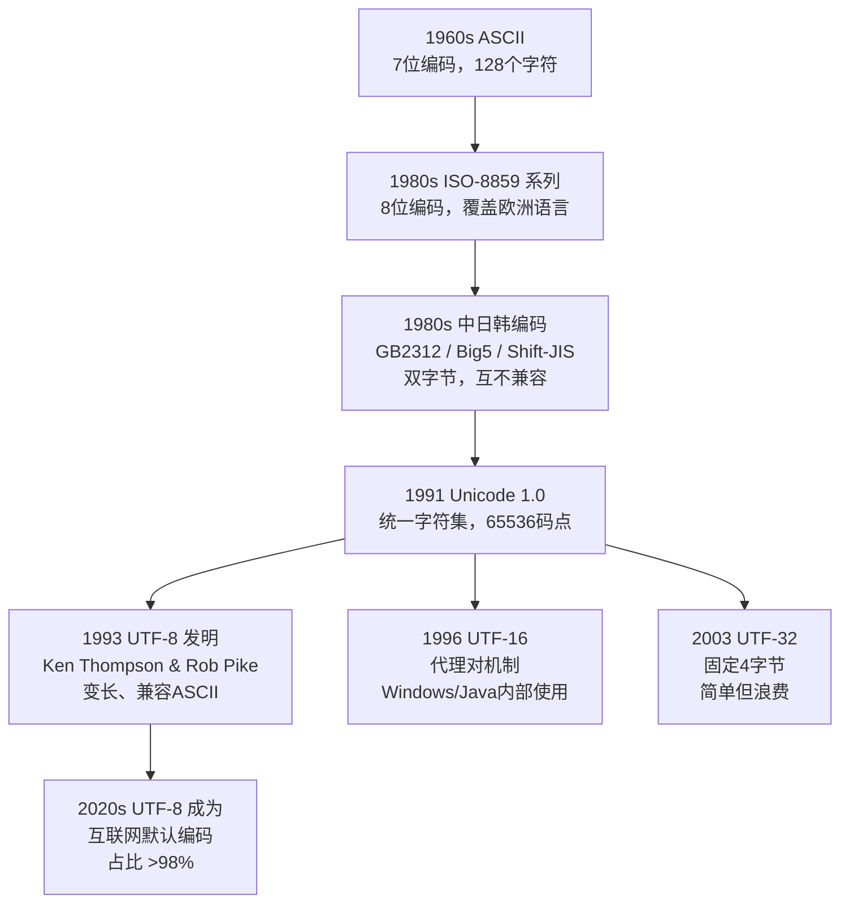

# 字符编码：序列化与数据交换的基石

## 1. 概述与背景

字符编码（Character Encoding）是将字符映射为字节序列的规则体系，是序列化与编码中不可回避的基础课题。任何涉及文本数据的序列化方案——无论是 JSON、XML、Protocol Buffers 还是 Avro——都必须处理同一个根本问题：**如何将人类可读的文字可靠地转换为计算机可存储和传输的二进制数据？**

### 1.1 为什么序列化必须理解字符编码

序列化本质上是将内存中的数据结构转化为可持久化或可传输的字节流。当数据中包含文本字段时，字符编码就成为序列化链路中的关键一环：

- **数据正确性**：选错编码会导致乱码（Mojibake），例如一段 UTF-8 文本被当作 ISO-8859-1 解读，所有非 ASCII 字符都会变成乱码。在序列化场景中，一旦编码在写入端出错，下游所有消费者都将看到损坏的数据，且修复成本极高
- **存储效率**：不同编码对同一段文本的字节占用差异巨大。一个中文字符在 UTF-8 中占 3 字节，在 UTF-16 中占 2 字节，在 UTF-32 中占 4 字节。在海量文本存储场景中（如日志系统、搜索索引），编码选择直接影响存储成本
- **传输性能**：在网络带宽敏感的场景中（如 API 响应、消息队列），编码选择直接影响序列化后的数据大小。一个包含 1000 个中文字符的 JSON 字段，UTF-8 比 UTF-32 少 2000 字节
- **互操作性**：跨系统、跨语言的数据交换必须约定统一的编码标准，否则数据无法被正确解析。不同语言运行时的默认编码不同（Python 3 默认 UTF-8，Java 内部用 UTF-16，Windows API 用 UTF-16LE），编码约定是互操作性的第一道门槛

### 1.2 历史演进



Unicode 的诞生正是为了解决"一套编码覆盖所有文字"的问题。而 UTF-8、UTF-16、UTF-32 则是 Unicode 码点（Code Point）的三种不同**编码方案**（Encoding Form），它们决定了同一个码点在磁盘和网络上如何以字节表示。

### 1.3 快速参考速查表

在深入学习之前，先建立一个全局认知框架：

| 编码 | 字节数 | ASCII兼容 | 字节序 | 主要场景 | 互联网占比 |
|------|--------|-----------|--------|----------|-----------|
| ASCII | 1（固定） | — | 无 | 纯英文遗产系统 | <1% |
| ISO-8859-1 | 1（固定） | 部分 | 无 | 西欧语言遗留 | <1% |
| GBK/GB2312 | 1-2（变长） | 部分 | 无 | 中国大陆遗留 | <5% |
| UTF-8 | 1-4（变长） | ✅ 完全 | 无 | 互联网/文件/Linux | ~98% |
| UTF-16 | 2-4（变长） | ❌ | 有 | Windows/Java/.NET | ~1% |
| UTF-32 | 4（固定） | ❌ | 有 | 内部算法处理 | <0.1% |

---

## 2. ASCII 与扩展编码

### 2.1 ASCII（美国信息交换标准代码）

ASCII 是所有现代编码的根基，定义了 128 个字符（0x00–0x7F）的编码：

| 范围 | 内容 | 示例 |
|------|------|------|
| 0x00–0x1F | 控制字符 | `\n`(0x0A), `\r`(0x0D), `\0`(0x00) |
| 0x20–0x2F | 标点与符号 | 空格(0x20), `!`(0x21) |
| 0x30–0x39 | 数字 | `0`=0x30, `9`=0x39 |
| 0x41–0x5A | 大写字母 | `A`=0x41, `Z`=0x5A |
| 0x61–0x7A | 小写字母 | `a`=0x61, `z`=0x7A |
| 0x7F | 删除 | DEL |

ASCII 的关键特征：
- **单字节**：每个字符恰好 1 字节（最高位为 0）
- **固定长度**：所有字符宽度相同，随机访问 O(1)
- **完全兼容 UTF-8**：ASCII 文本的 UTF-8 编码与 ASCII 编码完全一致，这是 UTF-8 设计中最重要的决策之一

ASCII 的设计局限也很明显——128 个码位甚至不包含重音字符（如 é, ñ, ü），更无法容纳任何非拉丁文字。这个局限直接催生了后续几十年的编码扩展浪潮。

### 2.2 ISO-8859 系列（Latin 编码族）

ASCII 只有 128 个字符，无法覆盖欧洲语言中的重音字符。ISO-8859 系列通过扩展最高位（第 8 位）来容纳更多字符，将编码空间从 128 扩展到 256 个码位：

| 编码标准 | 覆盖语言 | 字符数 | 关键特点 |
|----------|----------|--------|----------|
| ISO-8859-1 (Latin-1) | 西欧语言 | 256 | HTML4 默认编码，直接映射 Unicode 前 256 码点 |
| ISO-8859-2 (Latin-2) | 中欧语言 | 256 | 覆盖波兰语、捷克语等 |
| ISO-8859-15 | 西欧语言（含欧元€） | 256 | Latin-1 的更新版，替换部分不常用字符 |
| ISO-8859-16 | 东南欧语言 | 256 | 覆盖罗马尼亚语、匈牙利语等 |

ISO-8859-1 的一个重要遗留影响：**它是 HTML4 的默认编码**，也是很多早期协议（如 HTTP/1.0）的隐含编码。这个历史包袱至今仍在制造编码问题——当一个 UTF-8 页面被错误地标记为 ISO-8859-1 时，浏览器会逐字节解读，将多字节的 UTF-8 序列拆散为乱码。

ISO-8859-1 还有一个实用特性：它的前 256 个码点与 Unicode 完全一致，因此可以作为"逐字节透传"的工具——当你不确定一段 UTF-8 字节流的内容但需要将其作为字符串处理时，用 ISO-8859-1 解码不会丢失任何信息（每个字节都映射到一个有效的 Unicode 字符），这是 Python `latin-1` 编解码在修复双重编码问题中大显身手的根本原因。

### 2.3 CJK 编码的混乱时代

中日韩（CJK）文字数量庞大，ASCII 的 128 个码位远不够用，各地区自行制定了双字节编码方案：

| 编码 | 覆盖范围 | 码位空间 | 特点 |
|------|----------|----------|------|
| GB2312 | 简体中文 | 6763 汉字 + 682 符号 | 中国国家标准，1980 年发布，区位码体系 |
| GBK | 简体中文（扩展） | 21886 汉字 | GB2312 的超集，兼容 GB2312，Windows 95 中文版默认编码 |
| GB18030 | 全部中文 | >70000 汉字 | 国家强制标准（2000 年），兼容 GBK，支持少数民族文字 |
| Big5 | 繁体中文 | 13060 汉字 | 台湾/香港标准，1984 年发布 |
| Shift-JIS | 日文 | 6355 汉字 + 假名 | 微软/日本常用，单双字节混合编码 |
| EUC-KR | 韩文 | 8822 汉字 + 韩文字母 | 韩国常用，Unix 环境下广泛使用 |

**核心问题：这些编码互不兼容。** 同一个字节序列 `0xC4 0xE3`：
- 在 GBK 中是"你好"
- 在 Big5 中是另一个完全不同的含义
- 在 ISO-8859-1 中是 "Äã"

这就是为什么在没有明确编码声明的场景下，打开一个文本文件可能出现乱码——系统默认使用了错误的编码来解读字节序列。

**CJK 编码的"天坑"场景**：在实际开发中，最常见的编码问题来自 GBK/GB2312 与 UTF-8 的混用。典型的触发路径包括：
1. Windows 记事本默认以 GBK 保存 `.txt` 文件，开发者提交到 Linux 服务器后被 UTF-8 环境读取
2. 邮件系统使用 GB2312 编码正文，但邮件头未正确声明 `charset`
3. 数据库连接字符集为 GBK，但应用层以 UTF-8 解码结果集

---

## 3. Unicode 与编码方案

### 3.1 Unicode 字符集

Unicode 的目标是为世界上所有文字系统中的每个字符分配一个唯一的数字编号，称为**码点（Code Point）**。Unicode 15.1 定义了超过 149,000 个字符的码点，覆盖 161 种文字系统。

Unicode 码点的表示格式为 `U+XXXX`，其中 `XXXX` 是十六进制数：

| 码点范围 | 内容 | 示例 |
|----------|------|------|
| U+0000–U+007F | 基本拉丁字母（ASCII） | A = U+0041 |
| U+0080–U+00FF | 拉丁补充 | é = U+00E9 |
| U+4E00–U+9FFF | CJK 统一汉字（基本区） | 中 = U+4E2D |
| U+D800–U+DFFF | 保留区（代理对专用） | 不可直接使用，用于 UTF-16 |
| U+1F600–U+1F64F | 表情符号 | 😀 = U+1F600 |

Unicode 的**平面（Plane）**组织——每个平面包含 65,536 个码点：

平面0 (BMP):   U+000000 — U+00FFFF  基本多语言平面（常用字符，覆盖99%日常使用）
平面1 (SMP):   U+010000 — U+01FFFF  补充多语言平面（古文字、音乐符号、Emoji扩展）
平面2 (SIP):   U+020000 — U+02FFFF  补充增补平面（CJK扩展B/C/D/E/F/G/H/I）
平面3–13:      保留
平面14 (SSP):  U+0E0000 — U+0EFFFF  特殊用途平面（变体选择符等）
平面15 (PUA-A): U+0F0000 — U+0FFFFF  私用区A（厂商自定义，如Apple、Fujitsu）
平面16 (PUA-B): U+100000 — U+10FFFF  私用区B（个人/组织自定义）

值得注意的是，平面 0（BMP）虽然只占 Unicode 总码点空间的 1/17，但包含了绝大多数常用字符。这意味着在 UTF-16 中，大多数字符只需要 2 字节即可表示——这是 UTF-16 在实际使用中空间效率比预期更好的原因。

### 3.2 三种编码方案对比

Unicode 码点只是抽象的数字编号，需要编码方案将它们映射为字节序列：

| 特性 | UTF-8 | UTF-16 | UTF-32 |
|------|-------|--------|--------|
| **字节长度** | 1–4 字节（变长） | 2 或 4 字节（变长） | 固定 4 字节 |
| **字节序** | 无（单字节序） | 有 BOM / 无 BOM | 有 BOM / 无 BOM |
| **ASCII 兼容** | ✅ 完全兼容 | ❌ 0x00 填充 | ❌ 0x00 填充 |
| **空间效率（英文）** | 最优（1 字节/字符） | 浪费（2 字节/字符） | 最浪费（4 字节/字符） |
| **空间效率（中文）** | 3 字节/字符 | 2 字节/字符 | 4 字节/字符 |
| **空间效率（Emoji）** | 4 字节/字符 | 4 字节（代理对） | 4 字节/字符 |
| **按字符随机访问** | ❌ 需扫描 | ⚠️ BMP 可，代理对不行 | ✅ 固定宽度 |
| **字节序标记(BOM)** | 可选（不推荐） | 推荐 | 推荐 |
| **主要应用场景** | 互联网、文件存储、Linux | Windows API、Java、.NET | 内部处理、UCS-4 |
| **排序语义** | 字典序与码点序一致（BMP 内） | 直接比较码点值 | 直接比较码点值 |

### 3.3 UTF-8 编码规则详解

UTF-8 由 Ken Thompson 和 Rob Pike 于 1992 年在贝尔实验室设计（据传是在一张餐巾纸上画出的），其编码规则极其精巧：

码点范围              | 字节序列格式                              | 实际字节数
---------------------|--------------------------------------------|-----------
U+0000 — U+007F     | 0xxxxxxx                                   | 1
U+0080 — U+07FF     | 110xxxxx 10xxxxxx                          | 2
U+0800 — U+FFFF     | 1110xxxx 10xxxxxx 10xxxxxx                 | 3
U+10000 — U+10FFFF  | 11110xxx 10xxxxxx 10xxxxxx 10xxxxxx       | 4

**关键设计原则：**

1. **自同步（Self-synchronizing）**：每个字节的高位模式（`0`、`110`、`1110`、`11110`、`10`）标识了该字节的角色。起始字节以 `0`、`110`、`1110`、`11110` 开头，续接字节以 `10` 开头。如果读取位置落在一个多字节序列的中间，可以通过检查高位快速跳到下一个字符的起始字节。这一特性使得 UTF-8 可以安全地从任意字节偏移开始解析，对文件随机访问和网络流处理至关重要。

2. **无歧义**：不会出现一个字符的编码是另一个字符编码的前缀。1 字节字符的首字节最高位为 `0`，而多字节字符的首字节最高位为 `1`，两者永远不会混淆。

3. **ASCII 兼容**：所有 ASCII 字符（U+0000–U+007F）的 UTF-8 编码就是其 ASCII 值本身，最高位恒为 `0`。这意味着任何有效的 ASCII 文本同时也是有效的 UTF-8 文本，实现了向后兼容。

4. **排序保持**：UTF-8 编码后的字节序列的字典序与码点的数字序一致（在 BMP 范围内）。这使得可以直接对 UTF-8 字节流进行排序而无需先解码为 Unicode 码点。

**编码示例**——字符"中"（U+4E2D）：

码点: U+4E2D = 0100 1110 0010 1101

落入 3 字节范围 (U+0800—U+FFFF):
模板: 1110xxxx 10xxxxxx 10xxxxxx

填入:
  1110_0100 10_111000 10_101101
  = 0xE4  0xB8  0xAD

**编码示例**——Emoji "😀"（U+1F600）：

码点: U+1F600 = 0001 1111 0110 0000 0000

落入 4 字节范围 (U+10000—U+10FFFF):
模板: 11110xxx 10xxxxxx 10xxxxxx 10xxxxxx

填入:
  11110_001 10_111101 10_100000 10_000000
  = 0xF0  0x9F  0x98  0x80

**UTF-8 的解码验证**：在实际实现中，解码器不仅需要检查字节数量，还需验证：
- 续接字节的高位是否正确（必须是 `10xxxxxx`）
- 编码是否使用了最短的字节序列（禁止过长编码，如用 2 字节编码 ASCII 字符）
- 码点是否在有效范围内（禁止编码 surrogate 区 U+D800–U+DFFF）

这些验证规则是区分"合法 UTF-8"和"看起来像 UTF-8 的字节序列"的关键，也是许多安全漏洞的根源——攻击者可以构造"过长编码"绕过基于字节模式匹配的过滤器（如 WAF 中的 SQL 注入检测）。

### 3.4 UTF-16 编码与代理对

UTF-16 使用 2 或 4 字节编码 Unicode 字符：

- **BMP 字符**（U+0000–U+FFFF，排除代理区）：直接用 2 字节表示
- **补充平面字符**（U+10000–U+10FFFF）：用**代理对（Surrogate Pair）**表示，占 4 字节

代理对机制：

高位代理 (High Surrogate):  U+D800 — U+DBFF  (110110xx xxxxxxxx)
低位代理 (Low Surrogate):   U+DC00 — U+DFFF  (110111xx xxxxxxxx)

码点 = 0x10000 + (高代理 - 0xD800) × 0x400 + (低代理 - 0xDC00)

**UTF-16 的字节序问题（BOM）**：

UTF-16 的 2 字节单元有大端（Big-Endian）和小端（Little-Endian）之分：

| 标记 | 含义 | 示例（"中" U+4E2D） |
|------|------|---------------------|
| FE FF | UTF-16BE（大端） | `4E 2D` |
| FF FE | UTF-16LE（小端） | `2D 4E` |
| 无 BOM | 需要外部约定 | 不确定 |

字节序标记（BOM）解决了"不知道字节序"的问题，但也引入了新问题：BOM 本身是不可见字符，在某些场景下（如 HTTP 响应头、Unix 管道、JSON 文件头部）会造成解析错误。这就是为什么 **UTF-8 不推荐使用 BOM**——UTF-8 以字节为单位编码，不存在字节序问题。

**UTF-16 在现代系统中的角色**：

尽管 UTF-8 在互联网上占据绝对主导地位，UTF-16 仍然是多个核心系统的内部编码：
- **Windows 操作系统**：Win32 API 中的 `WCHAR` 类型是 16 位，文件系统路径内部使用 UTF-16 表示
- **Java/JavaScript**：JVM 的 `String` 内部用 `char[]`（16 位）存储，ES6 的字符串内部表示也是 UTF-16
- **.NET Framework**：`System.String` 以 UTF-16 存储
- **XML/HTML DOM**：`textContent` 等属性以 UTF-16 处理

### 3.5 UTF-32 编码

UTF-32 是最简单的 Unicode 编码方案：每个码点用固定 4 字节表示。

**优点：**
- 固定长度，随机访问 O(1)——通过下标可以直接定位第 N 个字符
- 不需要代理对，没有 BMP/补充平面之分，代码逻辑最简单
- 编解码实现简单，无需状态机

**缺点：**
- 空间浪费严重——对英文文本，是 UTF-8 的 4 倍；对中文文本，是 UTF-16 的 2 倍
- 与 ASCII 完全不兼容——每个字符都包含至少 3 个 `0x00` 字节
- 在网络传输和文件存储中几乎不被使用
- 字节序问题同样存在，需要 BOM 或外部约定

UTF-32 的主要用途是作为**内部处理编码**——某些文本处理算法（如 Unicode 正则引擎、字符串比较算法、ICU 库的部分内部操作）在内部使用 UTF-32 表示，以避免处理变长编码的复杂性。

---

## 4. 字节序（Endianness）

### 4.1 大端与小端

当一个数值需要用多个字节存储时，就产生了**字节序**问题。以 32 位整数 `0x01020304` 为例：

| 字节序 | 内存布局（低地址→高地址） | 说明 |
|--------|--------------------------|------|
| **大端（Big-Endian）** | `01 02 03 04` | 最高有效字节在前，人类阅读习惯 |
| **小端（Little-Endian）** | `04 03 02 01` | 最低有效字节在前，x86/ARM 常用 |

不同处理器架构的默认字节序：

| 架构 | 默认字节序 | 代表平台 |
|------|-----------|----------|
| x86/x86_64 | 小端 | Intel/AMD PC |
| ARM | 可配置（通常小端） | 手机、嵌入式 |
| PowerPC | 可配置 | 游戏主机 |
| SPARC | 大端 | Sun/Oracle 服务器 |
| IBM z/Architecture | 大端 | 大型机 |
| RISC-V | 小端 | 新兴嵌入式/IoT |

### 4.2 字节序对序列化的影响

在序列化多字节数据时，必须统一字节序：

```python
import struct

value = 0x01020304

# 大端序列化（网络字节序）
big_endian = struct.pack('>I', value)      # b'\x01\x02\x03\x04'

# 小端序列化
little_endian = struct.pack('<I', value)    # b'\x04\x03\x02\x01'

# 自动检测本机字节序
native = struct.pack('=I', value)           # 取决于运行平台
```

**网络协议一律使用大端（网络字节序）**，这是 RFC 1700 定义的标准。TCP/IP 协议栈中的端口号、IP 地址等字段都以大端传输。

**序列化格式中的字节序约定**：
- **JSON**：不涉及原始字节序问题，但数字字段的表示在不同实现间可能存在精度差异
- **Protocol Buffers**：varint 编码本身就是小端序（低位字节在前），与 x86 原生字节序一致
- **MessagePack**：整数使用大端序
- **XML**：数字通常以文本形式传输，不涉及字节序
- **BSON**：所有多字节整数使用小端序（跟随 x86）

---

## 5. 编码检测与转换

### 5.1 编码检测的困难

在没有明确元数据标注的情况下，确定一段字节流的编码本质上是一个**不可判定问题**。原因包括：

- UTF-8 的字节范围与 ISO-8859-1 重叠（0x00–0x7F 完全相同）
- 短文本包含的字符信息太少，统计推断不可靠
- 同一字节序列在不同编码下可能都是合法的（如纯 ASCII 文本在任何编码下都有效）
- 某些编码之间存在子集关系（GBK 是 GB2312 的超集，无法区分一段 GB2312 文本和对应的 GBK 文本）

### 5.2 常见检测策略

**BOM 检测**（最可靠但不通用）：

EF BB BF       →  UTF-8 BOM（大多数工具忽略或剥离此标记）
FF FE          →  UTF-16LE BOM
FE FF          →  UTF-16BE BOM
00 00 FE FF    →  UTF-32BE BOM
FF FE 00 00    →  UTF-32LE BOM

**统计启发式**（适用于无 BOM 文本）：

| 工具/库 | 语言 | 检测算法 | 准确率 | 适用场景 |
|---------|------|----------|--------|----------|
| chardet | Python | 字符分布统计 + 语言模型 | 中等（约 80%） | 快速检测，小文件 |
| cChardet | Python | chardet 的 C 加速版 | 同上，速度快 10-50x | 大批量文件检测 |
| uchardet | C++ | 同上，Mozilla 移植版 | 较高（约 90%） | 命令行工具、C++ 项目 |
| ICU det | C/C++ | Unicode 概率模型 | 高（约 95%） | 企业级应用，Java/Node.js |
| jschardet | JavaScript | chardet 的 JS 移植 | 中等 | 浏览器端 |
| charset_normalizer | Python | Unicode 规范验证 | 高 | requests 库默认检测器 |

**Unicode 标准推荐的检测算法**（UAX#29）：

1. 如果文件以 BOM 开头 → 使用 BOM 指示的编码
2. 如果包含 null 字节 (0x00) → 不是 UTF-8，尝试 UTF-16
   - 0x00 交替出现 → 大概率 UTF-16BE
   - 0x00 大量出现在偶数位置 → 大概率 UTF-16LE
3. 尝试以 UTF-8 解码：
   a. 如果成功且无替换字符 → 高置信度认为是 UTF-8
   b. 如果失败 → 尝试各 ISO-8859 编码
4. 如果多种编码都合法 → 选择覆盖字符最多的编码
5. 回退到 locale 设置或默认编码

### 5.3 编码转换实操

**Python 中的编码转换：**

```python
import chardet

# 检测编码
raw_bytes = open('unknown.txt', 'rb').read()
result = chardet.detect(raw_bytes)
print(result)  # {'encoding': 'UTF-8', 'confidence': 0.99, 'language': ''}

# 编码转换：先解码为 str，再编码为目标编码
text = raw_bytes.decode(result['encoding'])
utf8_bytes = text.encode('utf-8')

# 处理解码错误的五种策略
text1 = raw_bytes.decode('utf-8', errors='strict')             # 遇错抛异常（默认）
text2 = raw_bytes.decode('utf-8', errors='replace')             # 替换为 U+FFFD (�)
text3 = raw_bytes.decode('utf-8', errors='ignore')              # 直接跳过非法字节
text4 = raw_bytes.decode('utf-8', errors='xmlcharrefreplace')   # 替换为 XML 引用
text5 = raw_bytes.decode('utf-8', errors='backslashreplace')    # 替换为 \uXXXX
text6 = raw_bytes.decode('utf-8', errors='surrogateescape')     # 保留为代理字符（用于无损传递）

# 使用 codecs 增量编解码器处理流式数据
import codecs
decoder = codecs.getincrementaldecoder('utf-8')(errors='replace')
chunk1 = decoder.decode(b'\xe4\xbd')    # 不完整，暂存
chunk2 = decoder.decode(b'\xa0\xe5')    # 仍不完整
chunk3 = decoder.decode(b'\xa5\xbd', final=True)  # 完成，输出"你好"
```

**Go 中的编码转换：**

```go
import (
    "golang.org/x/text/encoding/simplifiedchinese"
    "golang.org/x/text/transform"
    "io"
    "unicode/utf8"
)

// GBK 转 UTF-8
func gbkToUTF8(gbkBytes []byte) (string, error) {
    reader := transform.NewReader(
        bytes.NewReader(gbkBytes),
        simplifiedchinese.GBK.NewDecoder(),
    )
    result, err := io.ReadAll(reader)
    return string(result), err
}

// UTF-8 转 GBK
func utf8ToGBK(utf8Str string) ([]byte, error) {
    reader := transform.NewReader(
        strings.NewReader(utf8Str),
        simplifiedchinese.GBK.NewEncoder(),
    )
    return io.ReadAll(reader)
}

// 验证是否为合法 UTF-8
func isValidUTF8(s string) bool {
    return utf8.ValidString(s)
}
```

**Java 中的编码转换：**

```java
import com.ibm.icu.text.CharsetDetector;
import com.ibm.icu.text.CharsetMatch;
import java.nio.charset.StandardCharsets;

// 使用 ICU4J 检测编码（比 JDK 内建检测更准确）
CharsetDetector detector = new CharsetDetector();
detector.setText(inputStream);
CharsetMatch match = detector.detect();
String text = match.getString();

// 标准编码转换
byte[] gbkBytes = ...;
String text = new String(gbkBytes, StandardCharsets.UTF_8);
byte[] utf8Bytes = text.getBytes(StandardCharsets.UTF_8);

// Java 的 StandardCharsets 不包含 GBK，需要显式引用
String textGbk = new String(gbkBytes, Charset.forName("GBK"));
```

**命令行工具转换：**

```bash
# iconv（Linux/macOS 自带）
iconv -f GBK -t UTF-8 input.txt -o output.txt

# Python 命令行
python3 -c "print(open('input.txt','rb').read().decode('gbk'))" > output.txt

# PowerShell（Windows）
Get-Content input.txt -Encoding Default | Set-Content -Encoding UTF8 output.txt
```

---

## 6. 字符编码在序列化格式中的体现

### 6.1 JSON 的编码要求

JSON 规范（RFC 8259）明确规定：

> JSON 文本需以 UTF-8、UTF-16 或 UTF-32 编码传输。如果没有 BOM 或其他外部上下文，**默认使用 UTF-8**。

JSON 中字符串的转义规则：

Unicode 字符 U+XXXX 的转义:
  U+0000 — U+001F  →  \uXXXX (强制转义控制字符)
  U+0022 ("引号)    →  \"
  U+005C (\反斜线)  →  \\
  U+002F (/正斜线)  →  \/  (可选)
  U+0008 (退格)     →  \b
  U+000C (换页)     →  \f
  U+000A (换行)     →  \n
  U+000D (回车)     →  \r
  U+0009 (制表)     →  \t
  其他非 ASCII       →  可直接 UTF-8 编码 或 \uXXXX 转义

**常见陷阱**：某些老旧的 JSON 库会将所有非 ASCII 字符转义为 `\uXXXX`，导致文件膨胀（中文从 3 字节变成 6 字节）。现代库（如 Python 的 `json.dumps(ensure_ascii=False)`、Go 的 `json.Marshal`）直接输出 UTF-8 字节。

**JSON 编码的实际影响**：

```python
import json

data = {"message": "你好世界"}

# ensure_ascii=True（默认）：所有非 ASCII 字符被转义
ascii_output = json.dumps(data, ensure_ascii=True)
# '{"message": "\\u4f60\\u597d\\u4e16\\u754c"}'
# 长度: 46 字节

# ensure_ascii=False：直接输出 UTF-8
utf8_output = json.dumps(data, ensure_ascii=False)
# '{"message": "你好世界"}'
# 长度: 26 字节（节省 43%）

print(f"ASCII 模式: {len(ascii_output.encode('utf-8'))} 字节")
print(f"UTF-8 模式: {len(utf8_output.encode('utf-8'))} 字节")
```

### 6.2 XML 的编码处理

XML 比 JSON 的编码处理更复杂，有多层机制：

```xml
<?xml version="1.0" encoding="UTF-8"?>
<root>
    <!-- 直接使用 UTF-8 字符 -->
    <name>张三</name>

    <!-- XML 实体转义 -->
    <text>&lt;script&gt;alert('XSS')&lt;/script&gt;</text>

    <!-- CDATA 段（避免转义） -->
    <code><![CDATA[
        if (a < b &amp;&amp; c > d) { ... }
    ]]></code>

    <!-- 数字字符引用 -->
    <greeting>&#x4F60;&#x597D;</greeting>  <!-- 你好 -->
    <greeting>&#20320;&#22909;</greeting>   <!-- 你好 -->
</root>
```

XML 的编码声明必须出现在文件的前两个字节（如果以 UTF-16 编码，BOM 之前的两个字节必须是 `<` 和 `?`）。

**XML 编码的多层处理**：
1. **物理层编码**：文件的字节编码（UTF-8、UTF-16 等），由 `<?xml encoding="..."?>` 声明
2. **字符引用**：`&#xHHHH;`（十六进制）或 `&#DDDD;`（十进制），解析为 Unicode 码点
3. **预定义实体**：`&lt;`、`&gt;`、`&amp;`、`&quot;`、`&apos;`
4. **CDATA 段**：`<![CDATA[...]]>` 内部内容不做任何转义，适用于嵌入代码或特殊文本
5. **DOCTYPE 实体**：用户自定义实体引用

### 6.3 Protocol Buffers 的文本编码

Protocol Buffers 在 wire format 中**不直接处理字符串编码**——`.proto` 文件中的 `string` 类型只保证传输的是有效的 UTF-8 字节序列。Protobuf 的 wire format 本身使用 varint（变长整数）编码长度前缀：

string 字段的 wire format:
  field_tag (varint) + length (varint) + UTF-8_bytes

示例: "Hello" (field_number=1, wire_type=2)
  tag:    0x0A  (field_number=1 << 3 | wire_type=2)
  length: 0x05
  value:  0x48 0x65 0x6C 0x6C 0x6F

示例: "你好" (field_number=1, wire_type=2)
  tag:    0x0A
  length: 0x06  (UTF-8: 每个中文字符 3 字节)
  value:  0xE4 0xBD 0xA0 0xE5 0xA5 0xBD

`bytes` 类型用于存储原始字节（如二进制数据、加密密文），不涉及编码问题。在 proto3 中，`string` 字段校验 UTF-8 合法性，`bytes` 则不做任何编码校验。

### 6.4 Avro 的字符串编码

Avro 的 `string` 类型使用 UTF-8 编码，并以长度前缀存储：

string = bytes_count (varint) + UTF-8_bytes

Avro 的 union 编码中，字符串类型有专门的 index:
  null  → index 0
  string → index 1

示例: string "test"
  index: 0x02  (union 中 string 的索引)
  length: 0x04
  bytes:  0x74 0x65 0x73 0x74

Avro 的 schema 演进中，`string` 和 `bytes` 之间的转换需要特别注意——两者在磁盘上的表示不同（`string` 是 UTF-8 编码，`bytes` 是原始字节），schema 兼容性规则要求两者不能互换。

### 6.5 MessagePack 的字符串处理

MessagePack 区分 `str`（UTF-8 字符串）和 `bin`（原始字节）：

str 8位:  0xD9 + 1字节长度 + UTF-8数据
str 16位: 0xDA + 2字节长度 + UTF-8数据
str 32位: 0xDB + 4字节长度 + UTF-8数据

bin 8位:  0xC4 + 1字节长度 + 原始数据
bin 16位: 0xC5 + 2字节长度 + 原始数据
bin 32位: 0xC6 + 4字节长度 + 原始数据

这种区分非常关键——JSON 的 `string` 类型不区分文本和二进制，导致二进制数据必须用 Base64 编码嵌入，额外增加约 33% 的空间开销。MessagePack 通过 `str`/`bin` 类型分离，避免了这个问题。

### 6.6 各序列化格式的编码处理总结

| 格式 | 字符串编码 | 字节数据支持 | 编码声明方式 | 编码灵活性 |
|------|-----------|-------------|-------------|-----------|
| JSON | UTF-8（默认） | Base64 嵌入 | Content-Type / BOM | 有限（UTF-8/16/32） |
| XML | 可配置（声明式） | CDATA / Base64 | `<?xml encoding="...">` | 最灵活 |
| Protobuf | UTF-8（约定） | `bytes` 类型 | 无（约定） | 固定 UTF-8 |
| Avro | UTF-8（约定） | `bytes` 类型 | Schema 定义 | 固定 UTF-8 |
| MessagePack | UTF-8（str 类型） | `bin` 类型 | 无（约定） | 固定 UTF-8 |
| BSON | UTF-8 | 内建二进制类型 | 无 | 固定 UTF-8 |
| YAML | UTF-8（默认） | 多种编码标记 | `encoding` 指令 | 有限 |

---

## 7. 性能分析与优化

### 7.1 各编码方案的空间效率对比

以一段包含英文和中文的混合文本为例：

文本: "Hello 你好 World 世界" (10 个字符: 5 个英文 + 4 个中文 + 1 个空格)

| 编码方案 | 字节数 | 相对 UTF-8 的比率 |
|----------|--------|-------------------|
| UTF-8 | 21 | 1.00x（基准） |
| UTF-16LE | 20 | 0.95x |
| UTF-32LE | 40 | 1.90x |
| ASCII | — | 不适用（无法编码中文） |
| GBK | 17 | 0.81x |
| ISO-8859-1 | — | 不适用（无法编码中文） |

纯英文场景下 UTF-8 最优（1 字节/字符），纯中文场景下 GBK 最紧凑（2 字节/字符），混合场景下 UTF-8 与 UTF-16 差距不大。**综合考虑互操作性、生态支持和性能，UTF-8 是绝大多数场景的最优选择。**

**不同内容类型的空间效率对比**：

| 内容类型 | UTF-8 | UTF-16 | GBK | 说明 |
|----------|-------|--------|-----|------|
| 纯英文日志 | 1.0x | 2.0x | 1.0x | UTF-8 与 GBK 相同 |
| 中文新闻 | 1.5x | 1.0x | 1.33x | UTF-16 最紧凑 |
| 日文（含假名） | 1.0-3x | 1.0-2x | — | 变长特性差异大 |
| Emoji 为主 | 4.0x | 4.0x | — | 所有方案相同 |
| 混合中英文代码 | 1.0-3x | 1.0-2x | — | 代码以 ASCII 为主，UTF-8 最优 |

### 7.2 编解码性能基准

不同语言运行时的 UTF-8 编解码性能差异显著：

```python
# Python UTF-8 编码性能测试
import timeit

text_en = "Hello, World! " * 1000
text_zh = "你好世界" * 1000
text_mixed = ("Hello 你好 " * 500)

for name, text in [("English", text_en), ("Chinese", text_zh), ("Mixed", text_mixed)]:
    t_encode = timeit.timeit(lambda: text.encode('utf-8'), number=10000)
    b = text.encode('utf-8')
    t_decode = timeit.timeit(lambda: b.decode('utf-8'), number=10000)
    print(f"{name}: encode={t_encode:.4f}s, decode={t_decode:.4f}s, "
          f"size={len(b)} bytes")
```

各运行时 UTF-8 处理能力的大致量级：

| 语言/运行时 | 编码吞吐量（MB/s） | 备注 |
|-------------|-------------------|------|
| Rust (std) | >5,000 | 零拷贝，编译期单态化优化 |
| C (glibc iconv) | 3,000–5,000 | SIMD 加速的 iconv 实现 |
| Go | 1,000–3,000 | runtime 内建，逃逸分析优化 |
| Java (JDK 9+) | 500–1,500 | Compact Strings 优化（Latin-1 快路径） |
| Node.js (V8) | 500–1,000 | 引擎内建 `TextEncoder`/`TextDecoder` |
| CPython | 200–800 | 解释器开销，`codecs` 模块有 C 加速 |
| Rust (encoding_rs) | 4,000–8,000 | Mozilla 开发，SIMD 加速，浏览器级性能 |

**Java 9+ Compact Strings 优化**：JDK 9 引入了紧凑字符串（Compact Strings）实现——如果 `String` 对象只包含 Latin-1 字符（每个字符用 1 字节存储），则使用 `byte[]` 而非 `char[]` 存储，内存占用减半。当字符串中出现非 Latin-1 字符时，自动升级为 UTF-16 存储。这一优化使得纯 ASCII/拉丁文本的处理性能显著提升。

### 7.3 序列化中的编码优化策略

1. **选择合适的编码格式**：
   - 英文为主 → UTF-8（1 字节/字符，最优）
   - CJK 为主且带宽受限 → 考虑 GBK（但牺牲互操作性，仅限中国内网场景）
   - 通用场景 → UTF-8（平衡性最佳，生态支持最广）

2. **避免冗余的 BOM**：UTF-8 文件不需要 BOM。BOM 在以下场景会造成问题：
   - Unix/Linux 工具链（`grep`、`awk`、`sed`）会把 BOM 当作数据
   - Python 的 `#!/usr/bin/env python3` shebang 行不能放在 BOM 之后
   - JSON 解析器可能把 BOM 当作非法字符
   - PHP 脚本的 BOM 会导致 "headers already sent" 错误

3. **利用 ASCII 子集优化**：当确定字段只包含 ASCII 字符时，可以用 `latin-1` 编码（每个字节直接映射码点），速度比 UTF-8 快 20–30%。这在处理大量已知为 ASCII 的元数据（如 URL、标识符）时有实际意义。

4. **批量编码使用 C 扩展**：Python 中 `codecs.getincrementalencoder('utf-8')` 比逐字符编码快数倍，尤其在流式处理中可以避免频繁的内存分配。

5. **在序列化边界统一编码**：所有进入序列化层的数据应统一为 UTF-8，在应用层内部处理时再按需解码。避免在序列化过程中进行编码转换——在序列化前完成所有转换。

6. **预分配缓冲区**：对于已知大小的文本，预分配字节缓冲区可以避免动态扩容。Go 中 `make([]byte, 0, estimatedSize)` 和 Rust 中 `String::with_capacity()` 都是典型优化。

7. **避免不必要的规范化**：如果文本不需要比较或搜索，可以跳过 Unicode 归一化（NFC/NFD），这在高吞吐序列化场景中能节省 10-20% 的处理时间。

---

## 8. 常见编码问题与排查

### 8.1 乱码（Mojibake）的产生与修复

**典型场景：UTF-8 → ISO-8859-1 双重编码**

原始文本: "你好"
UTF-8 编码: E4 BD A0 E5 A5 BD (6 字节)
错误解读为 ISO-8859-1: "ä½ å¥½" (6 个"字符")
再次编码为 UTF-8: C3 A4 C2 BD C2 A0 C3 A5 C2 A5 C2 BD (12 字节)

修复方法：

```python
def fix_double_utf8(text):
    """修复 UTF-8 被错误解读为 Latin-1 后再次编码的问题"""
    try:
        return text.encode('latin-1').decode('utf-8')
    except (UnicodeDecodeError, UnicodeEncodeError):
        return text

# 测试
broken = "ä½ å¥½"  # "你好" 的双重编码
fixed = fix_double_utf8(broken)
print(fixed)  # "你好"

# 处理三重编码（极端情况）
def fix_triple_utf8(text):
    """修复三次 UTF-8 编码"""
    try:
        return fix_double_utf8(fix_double_utf8(text))
    except:
        return text
```

**Mojibake 的常见模式识别**：

| 观察到的乱码 | 原始编码 | 错误解读编码 | 模式特征 |
|-------------|---------|-------------|---------|
| `ä½ å¥½` | UTF-8 | ISO-8859-1 | 中文双重编码 |
| `éèà ̈` | UTF-8 | ISO-8859-1 | 法文双重编码 |
| `åå·ä¸` | UTF-8 | Windows-1252 | 中文双重编码（Windows 变体） |
| `ä¸ä¸­æ` | UTF-8 | Latin-1/CP1252 | 多种西欧语言乱码 |
| `??` 或 `\x00` | 任意 | — | 丢失信息，无法修复 |

### 8.2 MySQL 中的编码问题

MySQL 的编码问题堪称经典：

```sql
-- 查看当前编码设置
SHOW VARIABLES LIKE 'character_set%';
SHOW VARIABLES LIKE 'collation%';

-- 正确设置连接编码（每个连接建立时执行）
SET NAMES utf8mb4;

-- 建表时指定编码
CREATE TABLE users (
    id INT PRIMARY KEY AUTO_INCREMENT,
    name VARCHAR(100) CHARACTER SET utf8mb4 COLLATE utf8mb4_unicode_ci
) ENGINE=InnoDB DEFAULT CHARSET=utf8mb4;

-- 常见错误: 使用 utf8 而非 utf8mb4
-- MySQL 的 'utf8' 实际上是 utf8mb3，最多 3 字节，无法存储 Emoji
-- 'utf8mb4' 才是真正的 4 字节 UTF-8

-- 连接字符串中指定编码
-- JDBC: jdbc:mysql://host/db?characterEncoding=UTF-8&amp;connectionCollation=utf8mb4_general_ci
-- Python: mysql://host/db?charset=utf8mb4
-- Go:   parseTime=true&amp;charset=utf8mb4
```

### 8.3 PostgreSQL 中的编码管理

PostgreSQL 在编码处理上比 MySQL 更加严格和规范：

```sql
-- 查看数据库编码
SHOW server_encoding;
SHOW client_encoding;

-- 创建 UTF-8 数据库（推荐）
CREATE DATABASE mydb ENCODING 'UTF8' LC_COLLATE 'en_US.UTF-8' LC_CTYPE 'en_US.UTF-8';

-- 编码转换函数
SELECT convert_from('\xe4\xbd\xa0\xe5\xa5\xbd', 'UTF8');  -- UTF-8 字节转文本
SELECT convert_to('你好', 'GBK');                             -- 文本转 GBK 字节

-- 注意：PostgreSQL 的 text 类型始终存储为服务器编码（通常是 UTF-8）
-- 不存在 MySQL 那样的 utf8/utf8mb4 混淆问题
```

**MySQL vs PostgreSQL 编码处理对比**：

| 特性 | MySQL | PostgreSQL |
|------|-------|-----------|
| UTF-8 支持 | utf8mb3（3字节）+ utf8mb4（4字节） | 始终完整 UTF-8 |
| 连接编码 | 需手动 SET NAMES | client_encoding 参数 |
| 默认编码 | 取决于安装配置 | UTF-8（现代版本） |
| 排序规则 | COLLATE 子句 | COLLATE / LC_COLLATE |
| 混合编码检测 | 不检测 | 编码不匹配时抛出错误 |

### 8.4 HTTP 中的编码协商

```http
# 请求头中的编码声明
Content-Type: text/html; charset=utf-8
Content-Type: application/json; charset=utf-8

# HTTP 响应中的编码优先级（HTML5 规范）:
# 1. Content-Type 头中的 charset 参数（最高优先级）
# 2. <meta charset="utf-8"> 标签
# 3. BOM 标记
# 4. 默认: UTF-8

# Accept-Charset 头（HTTP/1.1，已不常用）:
Accept-Charset: utf-8, iso-8859-1;q=0.5

# 现代 API 最佳实践：始终在 Content-Type 中声明编码
Content-Type: application/json; charset=utf-8
```

### 8.5 Python 2 vs Python 3 的编码差异

这是历史上最臭名昭著的编码问题之一：

```python
# Python 2 (已废弃)
# str 是字节串，unicode 是文本
s = "你好"                    # type: str, bytes: '\xe4\xbd\xa0\xe5\xa5\xbd'
u = u"你好"                   # type: unicode, codepoints: 2
s == u                        # False (不同类型的比较，可能抛出 UnicodeDecodeError)
len(s)                        # 6 (字节数)
len(u)                        # 2 (字符数)

# Python 3 (现代)
# str 是 Unicode 文本，bytes 是字节串
s = "你好"                    # type: str, codepoints: 2
b = s.encode('utf-8')         # type: bytes
len(s)                        # 2 (字符数)
len(b)                        # 6 (字节数)
```

**Python 3 中的编码最佳实践**：

```python
# 1. 文件操作始终指定编码
with open('data.txt', 'r', encoding='utf-8') as f:
    text = f.read()

# 2. 网络数据接收时先获取编码
response = requests.get(url)
encoding = response.apparent_encoding  # 使用 chardet 检测
text = response.content.decode(encoding, errors='replace')

# 3. 日志输出确保 UTF-8
import sys, io
sys.stdout = io.TextIOWrapper(sys.stdout.buffer, encoding='utf-8')

# 4. 命令行参数处理
import sys
# Python 3 默认 locale 编码，通常 UTF-8
# 如果遇到 UnicodeDecodeError，设置 PYTHONIOENCODING=utf-8
```

### 8.6 文件系统编码陷阱

不同操作系统的文件系统对文件名编码的处理差异巨大：

| 操作系统 | 文件名编码 | 实际表现 |
|----------|-----------|---------|
| Linux (ext4) | 原始字节流 | 可以存储任意字节，不关心编码 |
| macOS (APFS) | NFD 形式的 UTF-8 | 文件名存储为 Unicode NFC，API 暴露为 NFD |
| Windows (NTFS) | UCS-2/UTF-16 | 文件名以 UTF-16 存储 |

**Python 中的跨平台文件名处理**：

```python
import os

# 列出目录中的文件
for entry in os.scandir('/path/to/dir'):
    # entry.name 是 str（Unicode），在所有平台上行为一致
    # entry.name.encode('utf-8') 可以获取用于网络传输的字节表示
    print(entry.name)

# 注意：在 Windows 上，os.listdir() 可能返回乱码
# 如果文件名包含非 ASCII 字符且控制台编码不匹配
# 解决方案：使用 Python 3 的 os.scandir() / os.listdir()（返回 str）
```

---

## 9. 进阶主题

### 9.1 Unicode 正则表达式

正则表达式中的 `\w`（单词字符）在不同引擎中对 Unicode 的支持程度不同：

```python
import re

# 默认模式: 只匹配 ASCII 单词字符
re.findall(r'\w', 'Hello你好')    # ['H', 'e', 'l', 'l', 'o']

# Unicode 模式: 匹配所有 Unicode 单词字符
re.findall(r'\w', 'Hello你好', re.UNICODE)  # ['H', 'e', 'l', 'l', 'o', '你', '好']

# 也可以用 \p{L} 匹配所有字母（需要 regex 库，功能更强大）
import regex
regex.findall(r'\p{L}+', 'Hello你好World')  # ['Hello', '你好', 'World']

# Python 3.6+ 中 re.UNICODE 是默认行为
# Python 2 中需要显式传递 re.UNICODE 标志
```

**不同正则引擎的 Unicode 支持对比**：

| 引擎 | 语言 | Unicode 支持 | `\w` 默认行为 | 备注 |
|------|------|-------------|-------------|------|
| re | Python 3 | ✅ 完整 | Unicode（Python 3.6+） | 标准库 |
| regex | Python | ✅ 完整 + `\p{}` | Unicode | 第三方库，功能最强 |
| PCRE2 | C/C++ | ✅ 完整 | ASCII（需 `(*UCP)` 标志） | PHP、很多工具链使用 |
| ECMAScript | JavaScript | ✅ 完整（ES6+） | ASCII（需 `u` 标志） | `/\w/u` |
| RE2 | Go/C++ | ✅ 完整 | ASCII | Google 开发，注重性能 |

### 9.2 Unicode 归一化（Normalization）

同一个 Unicode 字符可以用多种方式表示。例如"é"可以是：

U+00E9           重音字符 é              (NFC 形式 - 组合字符)
U+0065 U+0301    基字母 e + 组合重音 ́    (NFD 形式 - 分解字符)

Unicode 定义了四种归一化形式：

| 形式 | 全称 | 特点 | 适用场景 |
|------|------|------|----------|
| NFC | Canonical Decomposition, then Canonical Composition | 尽量组合为单码点 | 存储、传输（推荐） |
| NFD | Canonical Decomposition | 完全分解为基字符+组合标记 | 字符分析、排序 |
| NFKC | Compatibility Decomposition, then Canonical Composition | 合并兼容字符（如 ① → 1） | 搜索、索引 |
| NFKD | Compatibility Decomposition | 分解+兼容 | 文本规范化 |

```python
import unicodedata

s = '\u00e9'         # é (NFC)
s_nfd = unicodedata.normalize('NFD', s)    # e + ́ (组合重音)
s_nfc = unicodedata.normalize('NFC', s_nfd) # é (回到 NFC)

print(len(s))        # 1
print(len(s_nfd))    # 2 (e + 组合重音)
print(len(s_nfc))    # 1

# 实际应用：用户名比较时应先归一化
def normalize_username(name):
    """将用户名归一化为 NFC 形式，避免同形异义"""
    return unicodedata.normalize('NFC', name.lower().strip())
```

**归一化对存储的影响**：NFC 形式的字符串通常更紧凑（更多使用组合字符而非基字符+组合标记的序列），在序列化时建议始终使用 NFC 形式。

### 9.3 宽字符计数 vs 字节数

在界面设计和数据库字段长度限制中，经常需要区分"字符数"和"字节数"：

```python
import unicodedata

def display_width(text):
    """计算文本的终端显示宽度（中文占 2 列）"""
    width = 0
    for char in text:
        cp = ord(char)
        if is_wide_char(cp):
            width += 2
        else:
            width += 1
    return width

def is_wide_char(cp):
    """判断 Unicode 码点是否为宽字符"""
    east_asian = unicodedata.east_asian_width(chr(cp))
    return east_asian in ('W', 'F')  # Wide or Fullwidth

# Unicode 标准的 East Asian Width 属性
# W: Wide (中文、日文、韩文)
# F: Fullwidth (全角字符，如 Ａ-Ｚ)
# H: Halfwidth (半角片假名等)
# Na: Narrow (基本拉丁字母等)
# A: Ambiguous (某些环境中宽，某些窄，如希腊字母、西里尔字母)
# N: Neutral (中性，如 emoji)
```

**实际场景**：终端中对齐中文和英文混合的表格，必须使用 `wcwidth` 库（Python 包名 `wcwidth`）来计算显示宽度，而不是简单地用 `len()`。

### 9.4 Emoji 编码的特殊性

Emoji 是现代字符编码中最具挑战性的领域：

- **组合 Emoji**：👨‍👩‍👧‍👦 (家庭) 实际上是 7 个码点：👨 + ZWJ + 👩 + ZWJ + 👧 + ZWJ + 👦
- **修饰序列**：👨‍🦰 (红发男人) = 👨 + ZWJ + 🦰
- **肤色修饰**：✋🏿 = ✋ + U+1F3FF (深色肤色修饰符)
- **旗帜序列**：🇨🇳 = 🇨 + 🇳 (区域指示符对)
- **键帽序列**：#️⃣ = # + U+FE0F + U+20E3 (组合键帽)

```python
import unicodedata
import regex  # pip install regex

emoji = "👨‍👩‍👧‍👦"
print(f"字符串长度: {len(emoji)}")                    # 7 (码点数)
print(f"UTF-8 字节数: {len(emoji.encode('utf-8'))}")  # 25

# 逐码点分析
for cp in emoji:
    print(f"U+{ord(cp):04X} {unicodedata.name(cp, 'UNKNOWN')}")

# Grapheme Cluster 才是用户感知的"一个字符"
clusters = regex.findall(r'\X', emoji)
print(f"字素簇数: {len(clusters)}")  # 1 (用户看到的 1 个 emoji)
```

**Emoji 在序列化中的注意事项**：
1. 存储 emoji 时必须使用支持 4 字节的编码（如 `utf8mb4` 而非 MySQL 的 `utf8`/`utf8mb3`）
2. 用户输入长度限制应基于 Grapheme Cluster 而非码点数或字节数
3. Emoji 的字节数变化很大——从 3 字节（简单 emoji 如 ♂）到 25+ 字节（组合 emoji 如 👨‍👩‍👧‍👦）
4. 不同平台对同一 emoji 的渲染差异不影响编码正确性，但影响存储大小

### 9.5 编码与安全

字符编码问题可以直接导致安全漏洞：

**1. 编码绕过（Encoding Bypass）**

攻击者构造的 URL:
https://example.com/admin?name=%2e%2e%2f%2e%2e%2fetc%2fpasswd

解码后: ../../etc/passwd

双重编码攻击（绕过一层解码）:
https://example.com/admin?name=%252e%252e%252f
解码一次: %2e%2e%2f  (仍然是编码形式)
解码两次: ../../    (成功绕过路径遍历过滤)

防御措施：对 URL 参数进行标准化处理，在所有解码完成后才进行安全检查。

**2. Unicode 同形异义攻击（Homograph Attack）**

正常域名:  apple.com
攻击域名:  аpple.com  (第一个字母是西里尔字母 а U+0430，不是拉丁字母 a)

在某些字体和编码处理下，两者视觉上无法区分。
IDNA 2008 标准通过限制可注册字符来缓解此问题。

**3. 过长 UTF-8 编码（Overlong UTF-8 Encoding）**

字符 '/' (正斜线, U+002F) 的正确 UTF-8: 0x2F (1字节)

过长编码: C0 AF (2字节, 0x11_000011_10_101111)
更长编码: E0 80 AF (3字节)
最长编码: F0 80 80 AF (4字节)

如果过滤器只检查 1 字节的 '/' (0x2F)，但服务器用 4 字节解码，
则过长编码可以绕过过滤。

防御措施：解码器必须拒绝过长编码（ISO 10646 和 Unicode 标准明确禁止）。

**4. 字节截断攻击**

UTF-8 字符串 "admin" 后追加中文 "管理员" (E7 AE A1 E7 90 86 E5 91 98)
如果在多字节字符的中间截断（如截取前 10 字节）:
  "admin" + E7 AE A1 E7 90 (截断了"理"字的中间)
  → 解码失败，产生替换字符或异常

攻击场景：日志截断、数据库字段截断、HTTP 响应截断
防御：使用字素簇或码点边界截断，而非字节边界

---

## 10. 最佳实践清单

### 10.1 编码选择决策树

你的文本数据需要序列化
│
├─ 是否只包含 ASCII 字符（英文+数字+基础符号）？
│   └─ 是 → UTF-8（ASCII 完全兼容，零开销）
│
├─ 是否需要兼容遗留系统（Windows API, Java 内部）？
│   └─ 是 → UTF-16
│
├─ 是否在嵌入式/固定宽度场景中？
│   └─ 是 → UTF-32
│
├─ 是否面向互联网传输？
│   └─ 是 → UTF-8（RFC 8259 默认）
│
├─ 是否是中国大陆政府/银行系统强制要求？
│   └─ 是 → GB18030（国标要求，UTF-8 的超集）
│
└─ 其他所有场景
    └─ UTF-8

### 10.2 十条编码铁律

1. **全系统统一使用 UTF-8**——从数据库到应用到前端，无一例外
2. **永远在 Content-Type 和 meta 中声明编码**——不要依赖浏览器猜测
3. **不要使用 MySQL 的 utf8**——用 utf8mb4，MySQL 的 utf8 只有 3 字节
4. **文件保存为 UTF-8 无 BOM**——除非有明确的兼容性需求（如 Windows 批处理脚本）
5. **序列化层不关心编码**——确保进入序列化的数据已经是正确的 Unicode 字符串
6. **解码失败时使用明确的策略**——不要静默替换，记录日志并告警
7. **使用 Grapheme Cluster 处理用户输入**——不要用码点数限制用户可见字符数
8. **URL 参数永远先编码再传输**——避免双重编码和编码绕过
9. **日志中的非 ASCII 字符要能正确显示**——配置终端、文件和日志系统为 UTF-8
10. **跨系统交换时优先使用 UTF-8**——它已经成为事实上的通用编码标准

---

## 11. 本节小结

字符编码是序列化与编码体系中最基础也最容易被忽视的知识点。本节从 ASCII 的历史起点出发，系统梳理了 ISO-8859、CJK 编码的混乱时代，到 Unicode 统一字符集和 UTF-8/16/32 三种编码方案的设计原理。关键要点包括：

- UTF-8 凭借 ASCII 兼容、自同步、无字节序问题等设计优势，已成为互联网的绝对主流编码（占比超过 98%）
- UTF-16 的代理对机制使得 BMP 外字符的处理变得复杂，但在 Windows 和 Java 生态中仍广泛作为内部编码
- 编码检测本质上是不确定的，BOM 是最可靠的信号，但并非所有场景都能使用；统计启发式（chardet、ICU det）在实际中广泛应用
- 序列化格式（JSON、XML、Protobuf、Avro、MessagePack）对文本编码的处理方式各有差异——理解这些差异是避免数据损坏的前提
- 编码问题不仅是功能问题，还可能演变为安全漏洞（编码绕过、同形异义攻击、过长编码）

掌握字符编码的知识，是在序列化实践中避免乱码、保证数据正确性和系统互操作性的基本功。**核心原则始终如一：全链路 UTF-8，显式声明编码，拒绝猜测。**
