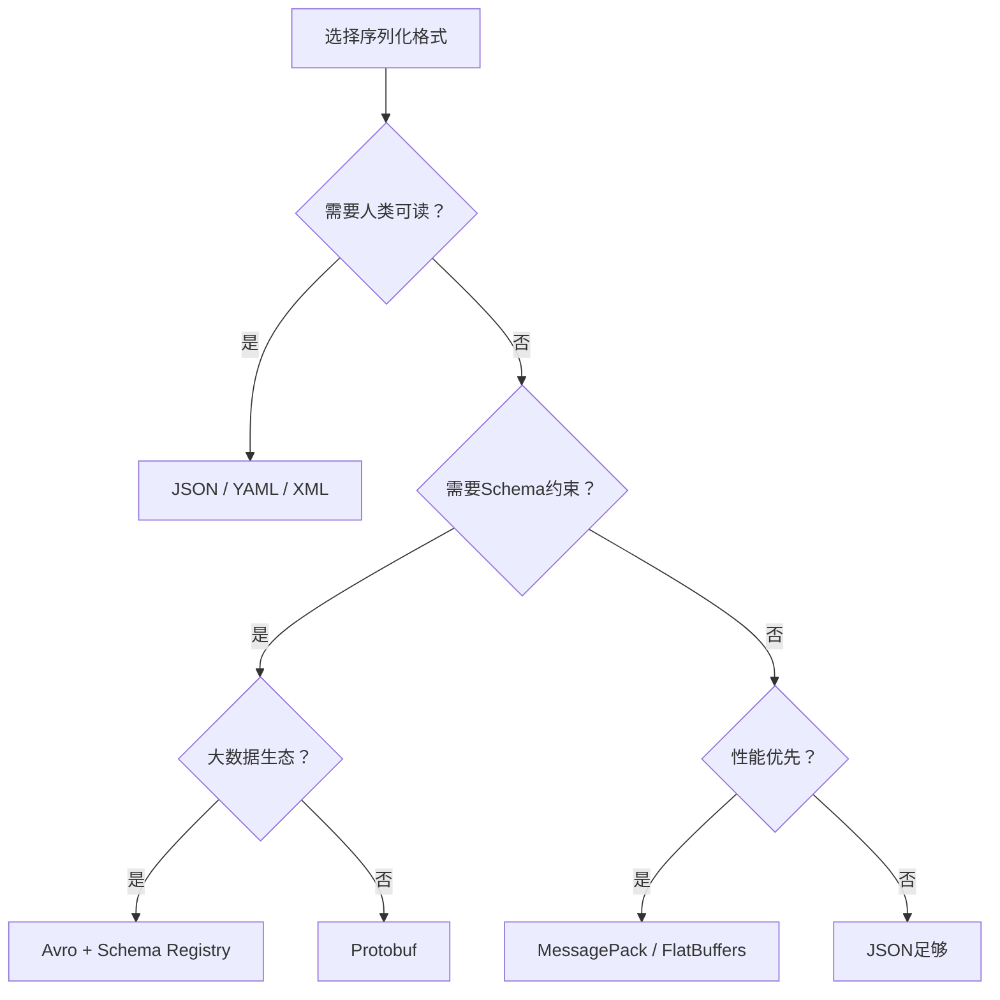
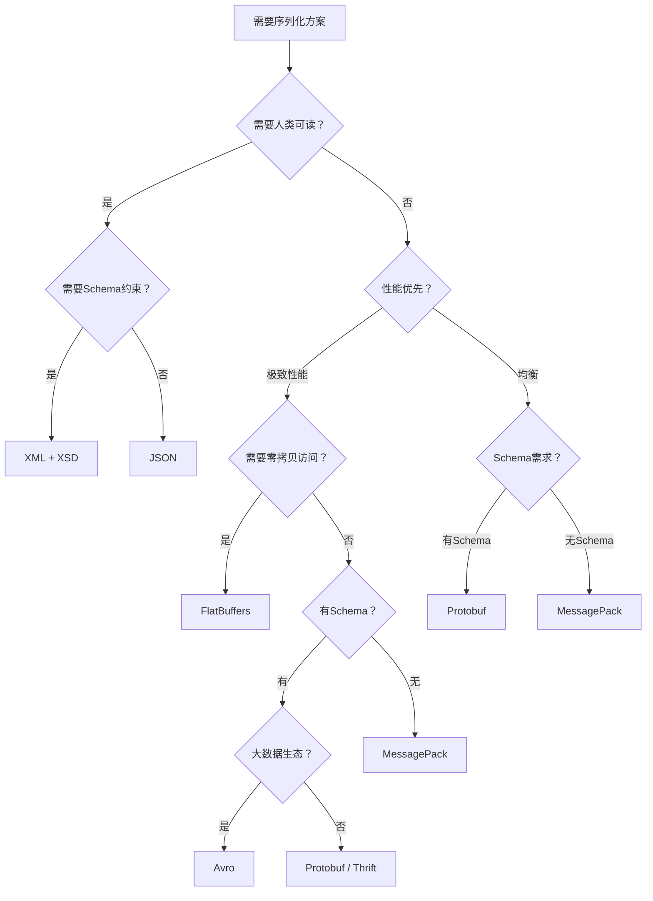

# 序列化与编码：理论基础

序列化与编码是计算机系统中最古老也最核心的问题之一。从最早的二进制文件格式，到互联网时代风靡全球的JSON，再到面向高性能场景的Protocol Buffers和Avro——序列化技术的每一次演进，都深刻反映了计算环境的变化：从单机到分布式，从低频到高吞吐，从简单结构到复杂数据模型。

本篇作为整个章节的理论基石，系统性地梳理序列化与编码的核心知识体系：什么是序列化、为什么它如此关键、各种格式的底层编码原理是什么、不同格式之间如何做出正确的选择。理解这些理论，是掌握后续核心技巧和实战案例的前提。

---

## 一、序列化的本质：从内存到字节流

### 1.1 什么是序列化

**序列化（Serialization）** 是将数据结构或对象的状态转换为可存储或可传输的格式的过程。其逆过程——将序列化后的数据还原为原始数据结构——称为 **反序列化（Deserialization）**。

用一个最简单的例子说明：

```python
import json

# 内存中的Python字典（对象）
user = {"name": "张三", "age": 30, "scores": [95, 87, 92]}

# 序列化：对象 → 字节流/字符串
serialized = json.dumps(user)
# 结果: '{"name": "张三", "age": 30, "scores": [95, 87, 92]}'

# 反序列化：字节流/字符串 → 对象
deserialized = json.loads(serialized)
```

这个看似简单的操作，在分布式系统中无处不在：

| 场景 | 序列化的作用 |
|------|------------|
| HTTP API | 客户端将请求参数序列化为JSON发送给服务器 |
| RPC调用 | 微服务间将函数参数序列化后通过网络传输 |
| 消息队列 | 生产者将消息序列化后写入Kafka/RabbitMQ |
| 数据持久化 | 将对象序列化后写入数据库或文件 |
| 缓存存储 | 将数据序列化后存入Redis/Memcached |
| 日志记录 | 将结构化数据序列化为日志行 |

### 1.2 序列化格式的分类

序列化格式可以从多个维度进行分类：

**按编码方式：文本格式 vs 二进制格式**

| 维度 | 文本格式（JSON、XML、YAML） | 二进制格式（Protobuf、Avro、MessagePack） |
|------|--------------------------|----------------------------------------|
| 可读性 | 人类可读，可直接用文本编辑器查看 | 不可读，需要专用工具解码 |
| 编码体积 | 较大（包含字段名、引号、分隔符） | 较小（通常只有JSON的1/3到1/10） |
| 编解码速度 | 较慢（需要文本解析和类型转换） | 较快（直接操作二进制字节） |
| 调试便利性 | 极高（直接打印即可查看） | 低（需要专门的反序列化工具） |
| 典型场景 | Web API、配置文件、日志 | RPC、大数据管道、缓存存储 |

**按Schema约束：有Schema vs 无Schema**

| 维度 | 有Schema（Protobuf、Avro、Thrift） | 无Schema（JSON、MessagePack） |
|------|----------------------------------|------------------------------|
| 类型安全 | 编译期检查，运行时不出类型错误 | 运行时才暴露类型不匹配 |
| 数据校验 | Schema即文档，自带校验规则 | 需要额外的验证层（如JSON Schema） |
| 灵活性 | 修改需要重新编译Schema | 随时可以增减字段 |
| 文档性 | Schema本身就是数据文档 | 缺乏自描述能力 |

**按编码策略：自描述 vs 非自描述**

- **自描述格式**：数据中包含字段名信息（如JSON `{"name": "张三"}`），解析器不需要外部信息就能理解数据结构。
- **非自描述格式**：数据中只包含值，不含字段名（如Protobuf、Avro），解析时需要Schema定义来解读字段的含义和位置。

这两种策略各有优劣：自描述格式更灵活、更易调试，但体积更大；非自描述格式更紧凑、更快，但依赖Schema定义。

### 1.3 序列化的核心权衡

选择序列化格式时，需要在以下维度之间做出权衡：



**六个核心权衡维度**：

1. **体积 vs 可读性**：二进制格式体积小但不可读，文本格式可读但体积大。
2. **速度 vs 灵活性**：Schema驱动的格式编解码快但不灵活，无Schema格式灵活但慢。
3. **兼容性 vs 效率**：良好的Schema演进机制增加了兼容性，但也引入了额外的复杂度。
4. **通用性 vs 专业性**：JSON是最通用的格式，但在特定场景（如高频RPC）中远不如专用格式。
5. **学习成本 vs 长期收益**：Protobuf/Avro上手需要学习Schema定义和工具链，但长期收益巨大。
6. **调试便利性 vs 运行时性能**：文本格式便于调试但占用更多CPU和带宽。

---

## 二、JSON：无处不在的数据交换格式

### 2.1 JSON的规范与数据模型

JSON（JavaScript Object Notation）由Douglas Crockford在2001年提出，2014年通过RFC 8259成为正式标准。它基于JavaScript的对象字面量语法，但已完全独立于JavaScript，被所有主流编程语言支持。

JSON规范定义了**六种基本数据类型**：

| 数据类型 | 示例 | 说明 |
|---------|------|------|
| string | `"hello"` | UTF-16编码的字符串（实际实现中多为UTF-8） |
| number | `42`、`3.14`、`-1e10` | 浮点数，无整数/浮点数区分 |
| boolean | `true` / `false` | 布尔值 |
| null | `null` | 空值 |
| object | `{"key": "value"}` | 键值对集合，键必须是字符串 |
| array | `[1, 2, 3]` | 有序列表 |

**JSON的关键特性**：
- **无注释**：JSON规范不允许注释（RFC 8259明确禁止），这是它与JavaScript字面量的重要区别。
- **键必须是双引号字符串**：`{name: "张三"}` 不是合法JSON，必须是 `{"name": "张三"}`。
- **没有日期类型**：日期必须以字符串形式存储（如 `"2024-01-15T10:30:00Z"`）。
- **没有二进制类型**：二进制数据必须用Base64编码后以字符串形式存储。
- **数字无精度限制**：理论上支持任意精度，但实际实现中多数遵循IEEE 754双精度浮点数。

### 2.2 JSON解析的三种范式

理解JSON解析的底层机制，是掌握JSON性能优化的前提。解析方式可以分为三大类：

#### 2.2.1 DOM解析（全文档加载）

DOM解析将整个JSON文档加载到内存中，构建一个树形数据结构。这是最简单也最常用的解析方式。

```python
import json

# DOM解析：整个JSON文档一次性加载到内存
data = json.loads('{"users": [{"name": "张三"}, {"name": "李四"}]}')

# 支持随机访问
print(data["users"][0]["name"])  # 张三
print(data["users"][1]["name"])  # 李四
```

**优点**：支持随机访问，代码简洁，易于使用。

**缺点**：需要将整个文档加载到内存。一个100MB的JSON文件会消耗约100MB-500MB内存（取决于嵌套深度和字符串数量），对于大型数据集来说不可接受。

**适用场景**：中小型JSON文档（<10MB），需要随机访问文档任意部分的场景。

#### 2.2.2 流式解析（SAX/StAX模式）

流式解析不将整个文档加载到内存，而是逐个读取JSON token并触发事件。内存消耗恒定，适合处理任意大小的JSON文档。

```python
import ijson

# 流式解析：逐条读取，内存占用恒定
# 适用于处理GB级JSON文件
with open("huge_file.json", "rb") as f:
    # "item" 表示解析JSON数组中的每个元素
    parser = ijson.items(f, "item")
    for record in parser:
        # 每次只处理一条记录，内存中最多只有一条记录
        process_record(record)
```

在Java生态中，流式解析有三种主要API：

| 模式 | 代表API | 特点 | 控制方 |
|------|--------|------|-------|
| SAX（推模式） | SAXParser | 解析器主动推送事件，通过回调函数处理 | 解析器 |
| StAX（拉模式） | XMLStreamReader | 应用程序主动拉取下一个事件 | 应用程序 |
| Streaming API | Jackson Streaming | 类似StAX，由应用程序控制读取节奏 | 应用程序 |

**SAX vs StAX的关键区别**：SAX是"推模式"——解析器在遇到事件时调用你的回调函数，你被动接收；StAX是"拉模式"——你主动调用解析器的next()方法获取下一个事件，你控制节奏。StAX的灵活性更高，代码更直观。

#### 2.2.3 增量解析（Incremental Parsing）

增量解析介于DOM和流式之间：每次传入一小块数据，解析器返回部分结果。适用于网络数据流和分块传输的场景。

```python
import json

# Python的incremental decoding示例
decoder = json.JSONDecoder()

# 第一批数据
chunk1 = '{"name": "张三", "age":'
obj, idx = decoder.raw_decode(chunk1)
# idx == len(chunk1)，因为数据不完整，没有返回结果

# 第二批数据（网络到达）
chunk2 = ' 30, "scores": [95,'
obj, idx = decoder.raw_decode(chunk1 + chunk2)
# 仍然不完整

# 第三批数据
chunk3 = ' 87, 92]}'
obj, idx = decoder.raw_decode(chunk1 + chunk2 + chunk3)
print(obj)  # 完整的字典
```

### 2.3 JSON的性能优化原理

JSON的序列化和反序列化是CPU密集型操作。在高吞吐量场景下（如每秒处理数百万条消息），JSON解析可能成为系统瓶颈。理解性能瓶颈的根源，才能做出有效的优化。

#### 2.3.1 性能瓶颈分析

JSON解析的CPU消耗主要来自三个环节：

1. **词法分析（Lexing）**：将字符流分解为token（字符串、数字、关键字等），需要逐字符扫描并处理转义字符。
2. **语法分析（Parsing）**：根据JSON语法规则构建抽象语法树（AST）或直接构建目标对象。
3. **类型转换**：将字符串形式的数字转换为真正的数值类型，将字符串解码为Unicode字符。

优化策略针对这三个环节：

**使用更快的JSON库**：不同库的实现差异巨大。

| 语言 | 标准库 | 高速库 | 性能提升 |
|------|-------|-------|---------|
| Python | json | orjson | 5-10x |
| Python | json | ujson | 3-5x |
| Java | 无内置 | Jackson | 基准 |
| Java | Gson | Jackson | 2-3x |
| Java | Jackson | Jackson + afterburner | 1.5-2x |
| Go | encoding/json | jsoniter | 2-3x |
| Go | encoding/json | sonic (bytedance) | 3-5x |
| Rust | serde_json | simd-json | 2-4x |

```python
import json
import orjson

data = {"users": [{"id": i, "name": f"user_{i}", "score": i * 1.5} for i in range(10000)]}

# 标准库
json_str = json.dumps(data)

# orjson：Rust实现，比标准库快5-10倍
orjson_bytes = orjson.dumps(data)
# orjson默认返回bytes，非str

# orjson额外优势：原生支持datetime、numpy等类型
import datetime
data_with_date = {"timestamp": datetime.datetime.now()}
orjson.dumps(data_with_date)  # 直接序列化，无需default函数
```

**预编译与缓存**：在Java中，ObjectMapper的创建是昂贵操作（需要初始化大量内部数据结构），应在应用生命周期内复用。

```java
// 错误：每次请求都创建新的ObjectMapper（慢）
String json = new ObjectMapper().writeValueAsString(data);

// 正确：复用ObjectMapper实例（快）
private static final ObjectMapper mapper = new ObjectMapper();
String json = mapper.writeValueAsString(data);

// 进一步优化：预编译序列化器
private static final ObjectWriter writer = mapper.writerFor(User.class);
String json = writer.writeValueAsString(user);
```

#### 2.3.2 体积优化

减少JSON数据体积可以显著降低网络传输时间和存储成本：

| 优化手段 | 示例 | 节省比例 |
|---------|------|---------|
| 使用短字段名 | `"userId"` → `"uid"` | 20-40% |
| 省略空值字段 | `{"name": "张三", "email": null}` → `{"name": "张三"}` | 10-30% |
| 数字枚举代替字符串 | `"status": "active"` → `"status": 1` | 50-70% |
| 紧凑格式（去除空格） | pretty-print → compact | 30-50% |
| Gzip压缩 | 对响应体压缩 | 60-80% |

**权衡考虑**：短字段名虽然节省空间，但降低了可读性和调试便利性。在内部API中可以激进优化，但在公开API中需要平衡。

### 2.4 JSON Schema：数据校验的标准化

JSON本身没有类型约束机制——任何一个字段都可以是任意类型。JSON Schema（基于JSON的Schema定义语言）为JSON数据提供了标准化的验证规则。

```json
{
  "$schema": "https://json-schema.org/draft/2020-12/schema",
  "$id": "https://example.com/user.schema.json",
  "title": "用户信息",
  "type": "object",
  "properties": {
    "id": {
      "type": "string",
      "format": "uuid",
      "description": "用户唯一标识"
    },
    "name": {
      "type": "string",
      "minLength": 1,
      "maxLength": 100,
      "pattern": "^[\\p{Han}a-zA-Z\\s]+$",
      "description": "用户名（仅支持中文、英文和空格）"
    },
    "age": {
      "type": "integer",
      "minimum": 0,
      "maximum": 150,
      "default": 0,
      "description": "年龄"
    },
    "email": {
      "type": "string",
      "format": "email",
      "description": "邮箱地址"
    },
    "tags": {
      "type": "array",
      "items": {
        "type": "string",
        "enum": ["admin", "editor", "viewer"]
      },
      "uniqueItems": true,
      "maxItems": 10
    }
  },
  "required": ["id", "name", "email"],
  "additionalProperties": false
}
```

**JSON Schema的核心验证能力**：

| 验证能力 | 关键字 | 作用 |
|---------|-------|------|
| 类型约束 | `type` | 限制字段必须是特定类型 |
| 范围约束 | `minimum`, `maximum`, `minLength`, `maxLength` | 限制数值和字符串范围 |
| 格式校验 | `format` | 校验邮箱、URL、日期等标准格式 |
| 枚举约束 | `enum` | 限定字段只能取特定值 |
| 嵌套校验 | `$ref`, `definitions` | 支持复杂的嵌套结构校验 |
| 条件校验 | `if/then/else`, `oneOf`, `allOf` | 支持条件逻辑校验 |

---

## 三、XML：企业级数据交换的基石

### 3.1 XML的核心特性

XML（eXtensible Markup Language）由W3C于1998年发布（XML 1.0规范），至今仍是企业级应用中最重要的数据交换格式之一。与JSON相比，XML具有以下独特优势：

| 特性 | XML | JSON |
|------|-----|------|
| 命名空间 | ✅ 原生支持 | ❌ 不支持 |
| Schema验证 | ✅ XSD/DTD（强类型约束） | ⚠️ JSON Schema（社区标准） |
| 注释 | ✅ `<!-- 注释 -->` | ❌ 不支持 |
| 二进制数据 | ✅ Base64内嵌 | ⚠️ Base64字符串 |
| 属性vs子元素 | ✅ 属性和子元素两种表达方式 | ❌ 只有键值对 |
| 混合内容 | ✅ 元素内可包含文本和子元素 | ❌ 不支持 |
| 转义处理 | ✅ 预定义实体 `&amp;`, `&lt;` 等 | ✅ 转义字符 `\` |

XML的典型应用场景：
- **SOAP Web服务**：企业级SOA架构的标准通信协议
- **配置文件**：Spring、Maven、Ant等Java生态的配置格式
- **文档格式**：Office Open XML（.docx, .xlsx）、SVG、XHTML
- **数据交换**：金融行业（FIX/ML协议）、医疗行业（HL7/FHIR）
- **RSS/Atom**：内容聚合和订阅

### 3.2 XML文档结构与命名空间

理解XML的文档结构是掌握解析方法的前提：

```xml
<?xml version="1.0" encoding="UTF-8"?>
<!-- 这是注释 -->
<root xmlns:book="http://example.com/book"
      xmlns:author="http://example.com/author">
  <book:title>设计模式</book:title>
  <book:isbn>978-7-111-12345-6</book:isbn>
  <author:info>
    <author:name>GoF</author:name>
    <author:email>gof@example.com</author:email>
  </author:info>
</root>
```

**关键概念**：
- **命名空间**：通过 `xmlns:prefix="uri"` 定义，避免不同XML文档之间的元素名冲突。
- **属性 vs 子元素**：`<user name="张三">` vs `<user><name>张三</name></user>`。属性更紧凑但不可扩展，子元素更灵活但更冗长。
- **混合内容**：`<p>这是一段包含<em>强调</em>的文本</p>`——元素内部同时包含文本和子元素，这在XML中很常见但JSON无法表达。

### 3.3 XML解析的三种范式

XML解析同样有DOM、SAX和StAX三种方式，但每种方式的特性更为鲜明：

#### DOM解析：适合需要反复遍历和修改的场景

DOM解析将整个XML文档加载为内存中的节点树（Node Tree），支持XPath查询、节点修改、子树提取等操作。

```java
// Java DOM解析完整示例
import javax.xml.parsers.DocumentBuilderFactory;
import org.w3c.dom.*;

DocumentBuilderFactory factory = DocumentBuilderFactory.newInstance();
// 安全加固：禁用DTD以防止XXE攻击
factory.setFeature("http://apache.org/xml/features/disallow-doctype-decl", true);
DocumentBuilder builder = factory.newDocumentBuilder();
Document doc = builder.parse(new File("catalog.xml"));

// 使用XPath高效查询
import javax.xml.xpath.*;
XPathFactory xpf = XPathFactory.newInstance();
XPath xpath = xpf.newXPath();
NodeList results = (NodeList) xpath.evaluate(
    "//book[price > 30]/title", doc, XPathConstants.NODESET
);

for (int i = 0; i < results.getLength(); i++) {
    System.out.println("价格超过30的书: " + results.item(i).getTextContent());
}
```

**DOM的内存消耗估算**：DOM树的内存占用通常是原始XML文件的 **5-10倍**。一个10MB的XML文件解析为DOM树后可能占用50-100MB内存。

#### SAX解析：适合一次性顺序读取的场景

SAX是基于事件驱动的解析方式，解析器从头到尾扫描XML文档，遇到开始标签、结束标签、文本内容等事件时回调处理函数。

```java
import org.xml.sax.helpers.DefaultHandler;

class BookHandler extends DefaultHandler {
    private StringBuilder textBuffer = new StringBuilder();
    private String currentElement;
    private Map<String, String> currentBook = new HashMap<>();

    @Override
    public void startElement(String uri, String localName,
                             String qName, Attributes attrs) {
        currentElement = qName;
        textBuffer.setLength(0);
        if ("book".equals(qName)) {
            currentBook.put("id", attrs.getValue("id"));
        }
    }

    @Override
    public void characters(char[] ch, int start, int length) {
        textBuffer.append(ch, start, length);
    }

    @Override
    public void endElement(String uri, String localName, String qName) {
        if ("book".equals(qName)) {
            processBook(currentBook);
            currentBook.clear();
        } else {
            currentBook.put(qName, textBuffer.toString().trim());
        }
    }

    private void processBook(Map<String, String> book) {
        System.out.printf("书名: %s, 作者: %s, 价格: %s%n",
            book.get("title"), book.get("author"), book.get("price"));
    }
}
```

**SAX的核心限制**：
- 只读，不支持修改文档。
- 不支持随机访问——无法回退到之前的位置。
- 所有状态必须通过成员变量手工维护，代码复杂度高。

#### StAX解析：推荐的流式解析方式

StAX是SAX的改进版，由应用程序控制解析节奏（拉模式），代码更直观、更容易维护。

```java
import javax.xml.stream.*;

XMLInputFactory factory = XMLInputFactory.newInstance();
XMLStreamReader reader = factory.createXMLStreamReader(
    new FileInputStream("catalog.xml")
);

Map<String, String> currentBook = new HashMap<>();

while (reader.hasNext()) {
    int event = reader.next();
    switch (event) {
        case XMLStreamConstants.START_ELEMENT:
            String element = reader.getLocalName();
            if ("book".equals(element)) {
                currentBook.put("id", reader.getAttributeValue(null, "id"));
            }
            break;
        case XMLStreamConstants.CHARACTERS:
            if (reader.getText().trim().isEmpty()) break;
            // 用getCurrentLocation()判断当前所在的元素
            String text = reader.getText().trim();
            // 根据之前的START_ELEMENT判断属于哪个字段
            break;
        case XMLStreamConstants.END_ELEMENT:
            if ("book".equals(reader.getLocalName())) {
                processBook(currentBook);
                currentBook.clear();
            }
            break;
    }
}
reader.close();
```

### 3.4 XML解析方式的选择决策

| 场景 | 推荐方式 | 原因 |
|------|---------|------|
| XML文档 < 1MB，需要反复查询 | DOM + XPath | XPath查询效率远高于手动遍历 |
| XML文档 > 10MB，顺序读取 | SAX | 内存占用最低 |
| XML文档 > 10MB，需要部分回退 | StAX | 拉模式更灵活，可以peek下一个元素 |
| 需要修改XML文档 | DOM | 唯一支持修改的方式 |
| 安全敏感场景 | DOM + XXE防护 | DOM提供了最完整的验证能力 |
| Android移动端 | XmlPullParser | Android原生API，与StAX类似 |

### 3.5 XML的安全隐患：XXE攻击

XML外部实体注入（XXE, XML External Entity Injection）是XML解析中最严重的安全漏洞之一。攻击者通过在XML文档中嵌入恶意的外部实体声明，可以读取服务器文件、发起SSRF攻击，甚至远程执行代码。

```xml
<!-- 恶意XML：利用XXE读取服务器文件 -->
<?xml version="1.0" encoding="UTF-8"?>
<!DOCTYPE foo [
  <!ENTITY xxe SYSTEM "file:///etc/passwd">
]>
<user>
  <name>&amp;xxe;</name>
</user>
```

**防御措施**：

```java
// Java防御XXE的标准做法
DocumentBuilderFactory factory = DocumentBuilderFactory.newInstance();

// 方法1：禁用DTD（最彻底）
factory.setFeature("http://apache.org/xml/features/disallow-doctype-decl", true);

// 方法2：如果不允许禁用DTD，则禁用外部实体
factory.setFeature("http://xml.org/sax/features/external-general-entities", false);
factory.setFeature("http://xml.org/sax/features/external-parameter-entities", false);
factory.setFeature("http://apache.org/xml/features/nonvalidating/load-external-dtd", false);
factory.setXIncludeAware(false);
factory.setExpandEntityReferences(false);
```

---

## 四、Protocol Buffers：Google的二进制序列化标准

### 4.1 Protobuf的设计哲学

Protocol Buffers（Protobuf）由Google在2001年内部开发，2008年开源。其设计哲学可以用一句话概括：**用Schema驱动的紧凑二进制编码，在保持类型安全的同时最大化序列化性能**。

与JSON的关键区别：
- **无字段名**：编码数据中不包含字段名，只包含字段编号（tag），极大减小体积。
- **固定编码规则**：每种数据类型都有确定的二进制编码方式，解析器无需猜测。
- **Schema即文档**：.proto文件既是数据定义，也是接口文档，还是代码生成的输入。

### 4.2 Proto文件的语法体系

```protobuf
syntax = "proto3";

package ecommerce;

option java_package = "com.example.ecommerce";
option go_package = "example.com/ecommerce/pb";

// 导入Google的公共类型定义
import "google/protobuf/timestamp.proto";

// 订单消息
message Order {
  int64 order_id = 1;                    // 订单ID
  string customer_name = 2;              // 客户名
  repeated OrderItem items = 3;          // 订单项列表
  OrderStatus status = 4;               // 订单状态（枚举）
  oneof payment_method {                 // 支付方式（互斥）
    string credit_card = 5;
    string alipay = 6;
    string wechat_pay = 7;
  }
  map<string, string> metadata = 8;      // 扩展元数据
  google.protobuf.Timestamp created_at = 9; // 创建时间
  optional string note = 10;             // 可选备注（proto3 optional）
}

message OrderItem {
  string product_id = 1;
  string product_name = 2;
  int32 quantity = 3;
  int64 price_cents = 4;                 // 价格（分），避免浮点精度问题
}

enum OrderStatus {
  UNKNOWN = 0;       // 零值，proto3中必须为0
  PENDING = 1;
  PAID = 2;
  SHIPPED = 3;
  DELIVERED = 4;
  CANCELLED = 5;
}
```

**Proto3语法要点汇总**：

| 语法元素 | 说明 | 示例 |
|---------|------|------|
| `repeated` | 数组/列表 | `repeated string tags = 5;` |
| `map<K,V>` | 键值对（实际编码为repeated message） | `map<string, string> kv = 1;` |
| `oneof` | 互斥字段组（同时只能设置一个） | `oneof payload { string text = 1; bytes data = 2; }` |
| `optional` | proto3中显式声明可选（支持has_xxx判断） | `optional string nickname = 11;` |
| `reserved` | 保留已删除的字段编号和名称 | `reserved 3, 5 to 10;` |
| `enum` | 枚举类型（零值必须为0） | `enum Status { UNKNOWN = 0; ... }` |
| `import` | 导入其他proto文件 | `import "google/protobuf/timestamp.proto";` |

### 4.3 Wire Format：Protobuf的编码核心

Protobuf的高效性完全来自于其精心设计的wire format。理解wire format，是理解Protobuf性能优势和Schema兼容性机制的关键。

#### 4.3.1 Tag-Value结构

Protobuf中每个字段编码为 **Tag + Value** 两部分：

┌──────────────────┬─────────────────┐
│      Tag         │     Value       │
│ (field_num << 3  │  (类型特定编码)  │
│  | wire_type)    │                 │
│  varint编码       │                 │
└──────────────────┴─────────────────┘

**Tag的计算**：`tag = (field_number << 3) | wire_type`

例如，字段编号为1、wire_type为0（Varint）的tag值为：`(1 << 3) | 0 = 8`，varint编码为1字节 `[0x08]`。

**Wire Type对照表**：

| Wire Type | 含义 | 用于类型 | Value编码方式 |
|-----------|------|---------|-------------|
| 0 | Varint | int32, int64, uint32, uint64, sint32, sint64, bool, enum | 变长整数 |
| 1 | 64-bit固定 | fixed64, sfixed64, double | 固定8字节 |
| 2 | Length-delimited | string, bytes, embedded message, packed repeated | 长度前缀+数据 |
| 5 | 32-bit固定 | fixed32, sfixed32, float | 固定4字节 |

#### 4.3.2 Varint编码：小数值的压缩利器

Varint是一种变长整数编码方法，核心思想是：**用更少的字节表示更小的数字**。

编码规则：
- 每个字节的**最高位（MSB）**是延续标志：`1`表示后续还有字节，`0`表示这是最后一个字节。
- 剩余**7位**存储数据的有效位。
- 小整数（1-127）只需要1字节，大整数需要更多字节。

```python
def encode_varint(value):
    """将无符号整数编码为varint格式"""
    if value < 0:
        raise ValueError("Varint不支持负数，负数请先用ZigZag编码")
    result = bytearray()
    while value > 0x7F:
        result.append((value &amp; 0x7F) | 0x80)  # 取低7位，MSB设为1
        value >>= 7
    result.append(value)  # 最后一个字节，MSB为0
    return bytes(result)

def decode_varint(data, offset=0):
    """从varint格式解码无符号整数"""
    result = 0
    shift = 0
    while offset < len(data):
        byte = data[offset]
        result |= (byte &amp; 0x7F) << shift
        offset += 1
        shift += 7
        if (byte &amp; 0x80) == 0:  # MSB为0，解码完成
            break
    return result, offset

# 示例：不同数字的编码长度
examples = [
    (1,    1),     # 1字节
    (127,  1),     # 1字节（Varint单字节最大值）
    (128,  2),     # 2字节
    (300,  2),     # 2字节（0xAC 0x02）
    (16383, 2),    # 2字节（Varint双字节最大值）
    (16384, 3),    # 3字节
    (1000000, 3),  # 3字节
]

for value, expected_bytes in examples:
    encoded = encode_varint(value)
    assert len(encoded) == expected_bytes, f"{value}: expected {expected_bytes}, got {len(encoded)}"
    decoded, _ = decode_varint(encoded)
    assert decoded == value
    print(f"  {value:>10} → {len(encoded)}字节 → 编码: {list(encoded)}")
```

**Varint的效率分析**：

| 数值范围 | Varint字节数 | 固定int32字节数 | 压缩比 |
|---------|------------|----------------|-------|
| 0-127 | 1 | 4 | 75%节省 |
| 128-16383 | 2 | 4 | 50%节省 |
| 16383-2097151 | 3 | 4 | 25%节省 |
| 2097152-268435455 | 4 | 4 | 0%节省 |
| >268435455 | 5-10 | 4 | 更差 |

**关键洞察**：实际应用中，绝大多数整数值都较小（用户ID、状态码、数量、金额分等），Varint在这些场景下能节省50%以上的空间。这也是Protobuf选择Varint作为默认整数编码的核心原因。

#### 4.3.3 ZigZag编码：有符号整数的优雅处理

问题：普通的Varint编码对负数极不友好。在二进制补码表示中，负数的高位全是1（如-1是 `0xFFFFFFFF`），编码为Varint需要10字节（int32）。

解决方案：ZigZag编码将有符号整数映射为无符号整数，使得绝对值小的负数也能用少量字节表示。

**映射规则**：

| 原始值 | ZigZag编码值 | Varint编码字节数 |
|-------|------------|----------------|
| 0 | 0 | 1 |
| -1 | 1 | 1 |
| 1 | 2 | 1 |
| -2 | 3 | 1 |
| 2 | 4 | 1 |
| -2147483648 | 4294967295 | 5 |

**编码公式**：
编码：zigzag_encode(n) = (n << 1) ^ (n >> 31)     // 32位
解码：zigzag_decode(n) = (n >> 1) ^ -(n & 1)      // 32位

编码：zigzag_encode(n) = (n << 1) ^ (n >> 63)     // 64位
解码：zigzag_decode(n) = (n >> 1) ^ -(n & 1)      // 64位

```python
def zigzag_encode(n, bits=32):
    mask = (1 << bits) - 1
    return ((n << 1) ^ (n >> (bits - 1))) &amp; mask

def zigzag_decode(n, bits=32):
    return (n >> 1) ^ -(n &amp; 1)

# 验证
assert zigzag_encode(0) == 0
assert zigzag_encode(-1) == 1
assert zigzag_encode(1) == 2
assert zigzag_encode(-2) == 3
assert zigzag_encode(2) == 4

# 对比：-1直接Varint需要10字节，ZigZag+Varint只需1字节
from functools import reduce
def varint_size(value):
    """计算varint编码后的字节数"""
    size = 0
    while True:
        size += 1
        value >>= 7
        if value == 0:
            break
    return size

print(f"-1 直接Varint: {varint_size(0xFFFFFFFF)} 字节")  # 10字节
print(f"-1 ZigZag+Varint: {varint_size(zigzag_encode(-1))} 字节")  # 1字节
```

**在.proto中的应用**：

```protobuf
// sint32/sint64 使用ZigZag编码，适合可能为负的值
sint32 temperature = 1;    // 温度可能为负（-20°C）
sint64 balance_delta = 2;  // 余额变动可能为负

// int32/int64 不使用ZigZag，适合确定为非负的值
uint32 user_count = 3;     // 用户数量不会为负
int64 order_id = 4;        // 订单ID不会为负
```

#### 4.3.4 字段编号的编码效率

字段编号直接影响Tag的大小，进而影响整体编码效率：

| 字段编号范围 | Tag编码字节数 | 适用场景 |
|------------|-------------|---------|
| 1-15 | 1字节 | 最常用的字段（高频访问） |
| 16-2047 | 2字节 | 次常用字段 |
| 2048-262143 | 3字节 | 低频字段 |
| >262143 | 4+字节 | 几乎不使用的字段 |

**最佳实践**：将最常用、最频繁访问的字段分配到编号1-15。

```protobuf
message User {
  // 核心字段：编号1-5，Tag各占1字节
  int64 id = 1;
  string name = 2;
  string email = 3;
  UserStatus status = 4;
  repeated string tags = 5;

  // 扩展字段：编号10-15
  string phone = 10;
  string avatar_url = 11;
  google.protobuf.Timestamp created_at = 12;

  // 低频字段：编号16+
  string bio = 16;
  map<string, string> preferences = 17;
}
```

#### 4.3.5 Length-Delimited类型的编码

string、bytes、嵌套message和packed repeated字段使用Length-Delimited编码：

[tag] [length] [data]
        │        │
   varint编码   原始数据字节

**Packed Repeated编码**（proto3默认行为）：多个相同类型的数值元素打包在一个Length-Delimited块中，比每个元素单独编码更紧凑。

// repeated int32 scores = 1;
// 值 [100, 200, 300]

// Packed编码（proto3默认）：
tag(1, wire_type=2) | total_length(3) | varint(100) | varint(200) | varint(300)
= [0x0A] [0x03] [0x64] [0xC8 0x01] [0xAC 0x02]
= 6 字节

// 非Packed编码（每个元素单独）：
tag(1, wire_type=0) | varint(100)
tag(1, wire_type=0) | varint(200)
tag(1, wire_type=0) | varint(300)
= [0x08] [0x64] [0x08] [0xC8 0x01] [0x08] [0xAC 0x02]
= 6 字节（本例相同，但元素越多packed越优）

### 4.4 Schema演进：Protobuf的核心竞争力

Schema演进能力——在不破坏已有数据和代码的前提下修改数据结构——是工业级序列化格式的核心需求。Protobuf通过**字段编号 + wire type兼容性**机制提供了系统性的Schema演进方案。

#### 4.4.1 安全的Schema变更

| 变更操作 | 安全性 | 原理 |
|---------|--------|------|
| 添加新字段 | ✅ 安全 | 旧代码遇到未知编号的字段直接跳过（unknown field handling） |
| 删除字段 | ✅ 安全 | 新代码对缺失字段返回默认值（零值） |
| 将字段标记为reserved | ✅ 安全 | 防止编号被复用导致数据语义错乱 |
| 字段重命名（不影响编号） | ✅ 安全 | Protobuf按编号匹配，不按名称匹配 |
| 将optional改为repeated | ✅ 安全 | 旧的单值变为数组的第一个元素 |
| 更改字段编号 | ❌ **灾难** | 新旧代码对同一编号的数据有不同语义，数据错乱 |
| 更改wire_type | ❌ **灾难** | 解析器无法正确读取字节，导致解析失败或崩溃 |

#### 4.4.2 Reserved机制：防止字段编号复用

删除字段后，其编号和名称必须永久保留，防止未来被复用导致数据语义错乱：

```protobuf
message User {
  int64 id = 1;
  reserved 2;                    // 保留旧字段编号2（曾用于"phone"）
  reserved "phone";              // 保留旧字段名（给proto2兼容）
  reserved 100 to 200;           // 保留编号范围
  reserved "old_email", "legacy"; // 保留多个旧字段名

  string name = 3;
  string email = 4;
  string mobile = 5;             // 替代被删除的phone字段
}
```

**为什么reserved如此重要？**

假设你删除了字段3（`phone`，存储电话号码字符串），后来新开发者不知历史，用编号3重新定义了`address`（也是字符串）：
- 旧数据中编号3存储的是 `"13800138000"`（电话号码）
- 新代码用编号3读取为 `Address`（期望地址）
- **反序列化不会报错**——类型兼容（都是string/wire_type=2）
- 但**数据语义完全错误**——电话号码被当作地址使用

这种Bug极难排查，因为代码层面没有任何错误提示。reserved机制通过编译期检查彻底杜绝了这类问题。

#### 4.4.3 默认值与零值陷阱

proto3中所有字段都有零值，且字段缺失和字段为零值的表现完全相同：

| 类型 | 零值 | 问题 |
|------|------|------|
| int32, int64 | 0 | 无法区分"用户设了0"和"用户没传这个字段" |
| string | "" | 无法区分"空搜索"和"没传query" |
| bool | false | 无法区分"用户明确设为false"和"没传" |
| enum | 枚举的第一个值（必须为0） | 无法区分"用户选了UNKNOWN"和"没传" |
| message | null/默认实例 | 嵌套消息有has_xxx判断（proto3 optional） |

**解决方案**：

```protobuf
// 方案1：使用optional（proto3语法，推荐）
message SearchRequest {
  optional string query = 1;  // has_query()可以判断是否传入
  int32 page_number = 2;      // 无has_page_number()，0即0
}

// 方案2：使用Wrapper类型（google.protobuf.wrappers.proto）
import "google/protobuf/wrappers.proto";
message SearchRequest {
  google.protobuf.StringValue query = 1;  // null=未传，""=空搜索
  google.protobuf.Int32Value page_number = 2; // null=未传
}

// 方案3：使用oneof表达互斥的查询方式
message SearchRequest {
  oneof search_by {
    string search_text = 1;       // 按文本搜索
    string search_pattern = 2;    // 按正则搜索
    bool search_all = 3;          // 搜索全部
  }
}
```

---

## 五、Avro：大数据生态的序列化标准

### 5.1 Avro的设计哲学

Apache Avro由Doug Cutting（Hadoop创始人）在2009年创建，专为Hadoop生态系统设计。其设计哲学与Protobuf形成鲜明对比：

| 维度 | Protobuf | Avro |
|------|----------|------|
| Schema位置 | 编译期 | 运行时 |
| 数据中的Schema信息 | 无（靠字段编号） | Writer Schema内嵌在文件头 |
| Schema演进 | 字段编号 + wire type兼容 | Reader/Writer Schema映射 |
| 代码生成 | 必须（protoc编译） | 可选（运行时动态解析） |
| 典型场景 | RPC调用 | 数据存储/数据管道 |

**Avro的核心优势**：
1. **无需代码生成**：Schema在运行时动态解析，适合动态语言（Python、JavaScript）。
2. **极其紧凑**：编码中不含字段名和Tag，只按Schema顺序编码值。
3. **强大的Schema演进**：通过Reader/Writer Schema的匹配，自动处理字段增删和类型转换。
4. **大数据生态原生集成**：Kafka、Spark、Hive、Flink都原生支持Avro。

### 5.2 Avro的Schema定义

Avro使用JSON格式定义Schema，支持以下核心类型：

```json
{
  "type": "record",
  "name": "UserEvent",
  "namespace": "com.example.analytics",
  "doc": "用户行为事件",
  "fields": [
    {"name": "event_id", "type": "string", "doc": "事件唯一标识"},
    {"name": "user_id", "type": "long", "doc": "用户ID"},
    {"name": "event_type", "type": {
      "type": "enum",
      "name": "EventType",
      "symbols": ["PAGE_VIEW", "CLICK", "PURCHASE", "SIGN_UP"],
      "doc": "事件类型"
    }},
    {"name": "timestamp", "type": "long", "logicalType": "timestamp-millis"},
    {"name": "page_url", "type": ["null", "string"], "default": null},
    {"name": "amount", "type": ["null", "double"], "default": null},
    {"name": "metadata", "type": {"type": "map", "values": "string"}, "default": {}}
  ]
}
```

**Avro的核心类型体系**：

| 类别 | 类型 | 说明 |
|------|------|------|
| 基础类型 | null, boolean, int, long, float, double, bytes, string | 标量和基本类型 |
| 复合类型 | record | 结构体/对象（字段列表） |
| 复合类型 | enum | 枚举类型 |
| 复合类型 | array | 数组 |
| 复合类型 | map | 键值对映射 |
| 复合类型 | union | 联合类型（类似type1 \| type2） |
| 复合类型 | fixed | 固定长度字节数组 |
| 逻辑类型 | date, time-millis, timestamp-millis, decimal 等 | 为原始类型赋予语义 |

### 5.3 Avro的二进制编码原理

Avro的编码规则极其简洁——按Schema中字段的定义顺序，依次编码每个值，不含字段名和Tag：

Schema定义顺序: event_id(string) → user_id(long) → event_type(enum) → ...

编码结果:
[bytes(event_id)] [bytes(user_id)] [bytes(event_type)] ...
  ↑ 直接编码值       ↑ 直接编码值      ↑ 直接编码值
  不含字段名          不含Tag           不含分隔符

**各类型的编码规则**：

| 类型 | 编码方式 | 示例 |
|------|---------|------|
| null | 0字节（什么都不写） | null → (空) |
| boolean | 1字节（0x00或0x01） | true → [0x01] |
| int/long | ZigZag + 变长编码（类似Varint） | 300 → [0xAC 0x02] |
| float | 4字节小端 | 3.14 → 4字节 |
| double | 8字节小端 | 3.14 → 8字节 |
| string | length(变长) + UTF-8字节 | "hello" → [0x0A][h,e,l,l,o] |
| bytes | length(变长) + 原始字节 | 同string |
| array | 块编码：count + 元素序列，以0结尾 | [3][e1][e2][e3][0] |
| map | 块编码：count + (key,value)对，以0结尾 | |
| enum | 按索引值（int） | PURCHASE(索引2) → varint(2) |
| union | 先写索引（哪一分支），再写该分支的值 | null → [0x00] |

**Avro的long编码（变长字节）**：Avro使用与Protobuf类似的变长编码，但使用**无符号变长编码**而非Varint：

```python
def avro_encode_long(value):
    """Avro的long编码：zigzag + 变长字节"""
    # ZigZag编码
    value = (value << 1) ^ (value >> 63)

    result = bytearray()
    while (value &amp; ~0x7F) != 0:
        result.append((value &amp; 0x7F) | 0x80)
        value >>= 7
    result.append(value &amp; 0x7F)
    return bytes(result)

# Avro编码300：zigzag(300)=600, 变长编码=[0xB0 0x04]
# Avro编码-1：zigzag(-1)=1, 变长编码=[0x01]（仅1字节）
```

### 5.4 Avro的Schema演进机制

Avro的Schema演进通过**Writer Schema**和**Reader Schema**的匹配来实现：

- **Writer Schema**：数据写入时使用的Schema，嵌入在数据文件头（OCF格式）或通过Schema Registry获取。
- **Reader Schema**：当前代码使用的Schema，定义了期望的数据结构。

当两者不同时，Avro自动执行字段映射和默认值填充：

| 演进操作 | Writer Schema | Reader Schema | Avro处理 |
|---------|--------------|--------------|---------|
| 添加字段 | 无该字段 | 有该字段 | 使用Reader Schema的default值填充 |
| 删除字段 | 有该字段 | 无该字段 | 直接忽略该字段 |
| 字段重命名 | name="old_name" | name="new_name" | 通过aliases匹配 |
| 类型兼容转换 | int | long | 自动提升精度 |

```python
# Schema演进示例
import avro.schema
from io import BytesIO
from avro.datafile import DataFileReader, DataFileWriter
from avro.io import DatumReader, DatumWriter

# Writer Schema（V1）
schema_v1 = avro.schema.parse('''
{
    "type": "record",
    "name": "User",
    "fields": [
        {"name": "id", "type": "int"},
        {"name": "name", "type": "string"}
    ]
}
''')

# Reader Schema（V2，新增email字段）
schema_v2 = avro.schema.parse('''
{
    "type": "record",
    "name": "User",
    "fields": [
        {"name": "id", "type": "int"},
        {"name": "name", "type": "string"},
        {"name": "email", "type": ["null", "string"], "default": null}
    ]
}
''')

# 用V1 Schema写入数据
buf = BytesIO()
writer = DatumWriter(schema_v1)
with DataFileWriter(buf, writer, schema_v1) as dw:
    dw.append({"id": 1, "name": "张三"})

# 用V2 Schema读取V1数据（前向兼容）
buf.seek(0)
reader = DatumReader(writer_schema=schema_v1, reader_schema=schema_v2)
with DataFileWriter(buf, reader, schema_v2) as dr:
    for record in dr:
        print(record)  # {'id': 1, 'name': '张三', 'email': None}
```

**Avro的兼容性模式**：

| 兼容性模式 | 含义 | 允许的变更 |
|-----------|------|----------|
| BACKWARD | 新代码能读旧数据 | 可以删除字段（需设default） |
| FORWARD | 旧代码能读新数据 | 可以添加字段（需设default） |
| FULL | BACKWARD + FORWARD | 可以添加和删除字段 |
| NONE | 不做兼容性检查 | 任何变更都允许 |

---

## 六、MessagePack：JSON的二进制等价物

### 6.1 设计理念

MessagePack（msgpack）的核心理念非常简单：**用二进制编码实现JSON的全部语义，但体积更小、速度更快**。

与Protobuf和Avro不同，MessagePack不需要Schema定义——它是完全自描述的（self-describing），编码数据中包含类型信息。你可以把它理解为"二进制版JSON"。

### 6.2 编码格式

MessagePack的编码基于**Tag-Value**结构，Tag字节同时包含类型信息和紧凑编码：

| Tag范围 | 类型 | 编码方式 |
|--------|------|---------|
| 0x00-0x7f | 正整数（0-127） | 1字节直接存储 |
| 0xe0-0xff | 负整数（-32到-1） | 1字节直接存储 |
| 0x00-0x7f同上 | fixint | 极致紧凑 |
| 0xc0 | nil | 0字节 |
| 0xc2/0xc3 | false/true | 0字节 |
| 0xcc-0xcf | uint8/16/32/64 | 1/2/4/8字节 |
| 0xd0-0xd3 | int8/16/32/64 | 1/2/4/8字节 |
| 0xca-0xcb | float32/64 | 4/8字节 |
| 0xd9-0xdb | string（8/16/32位长度） | 长度+UTF-8字节 |
| 0xc4-0xc6 | bin（8/16/32位长度） | 长度+原始字节 |
| 0x90-0x9f | fixarray（0-15个元素） | 元素直接编码 |
| 0x80-0x8f | fixmap（0-15个键值对） | 键值直接编码 |
| 0xdd-0xdf | array/32 | 元素数+元素编码 |

### 6.3 MessagePack vs JSON性能对比

| 维度 | JSON (compact) | MessagePack |
|------|---------------|-------------|
| 体积 | 基准 | 减少30-50% |
| 序列化速度 | 基准 | 提升2-5x |
| 反序列化速度 | 基准 | 提升2-5x |
| 人类可读 | ✅ | ❌ |
| 需要Schema | ❌ | ❌ |
| 跨语言支持 | 所有语言 | 50+语言 |

**典型应用场景**：
- **Redis缓存序列化**：msgpack比JSON更紧凑，读写更快，适合缓存热数据。
- **IPC进程间通信**：同机进程间通信需要高性能，msgpack比JSON快且无需Schema。
- **日志压缩**：结构化日志用msgpack编码后体积更小，存储成本更低。
- **IOT数据传输**：受限带宽下，msgpack的紧凑编码能显著减少传输数据量。

---

## 七、字符编码：UTF-8与Base64

### 7.1 UTF-8：互联网的通用编码

UTF-8（8-bit Unicode Transformation Format）由Ken Thompson和Rob Pike于1992年设计，是目前互联网上使用最广泛的字符编码。截至2024年，UTF-8占全球网页编码的**98%以上**。

#### 7.1.1 UTF-8的变长编码原理

UTF-8是一种**可变长度编码**，根据Unicode码点的大小使用1-4个字节编码：

| 码点范围（十六进制） | 字节数 | 编码模板 |
|---------------------|--------|---------|
| U+0000 - U+007F | 1 | `0xxxxxxx` |
| U+0080 - U+07FF | 2 | `110xxxxx 10xxxxxx` |
| U+0800 - U+FFFF | 3 | `1110xxxx 10xxxxxx 10xxxxxx` |
| U+10000 - U+10FFFF | 4 | `11110xxx 10xxxxxx 10xxxxxx 10xxxxxx` |

**编码示例**：

字符 'A' (U+0041):
  Unicode: 01000001
  UTF-8:   01000001              (1字节)

字符 '中' (U+4E2D):
  Unicode: 0100 1110 0010 1101
  UTF-8:   11100100 10111000 10101101  (3字节: E4 B8 AD)

字符 '😀' (U+1F600):
  Unicode: 0001 1111 0110 0000 0000
  UTF-8:   11110000 10011111 10011000 10000000  (4字节: F0 9F 98 80)

**UTF-8的设计优势**：

1. **兼容ASCII**：所有ASCII字符（0x00-0x7F）在UTF-8中编码不变，1字节。这意味着纯ASCII文本在ASCII和UTF-8下完全相同。
2. **自同步**：UTF-8编码中，任何字节的高位可以立即区分它是首字节还是后续字节（`11110xxx` / `1110xxxx` / `110xxxxx` / `10xxxxxx`），使得解码器可以快速定位字符边界。
3. **无字节序问题**：UTF-8没有字节序（BOM）的困扰，不需要处理大端/小端问题。
4. **前缀唯一**：每个字符的编码前缀是唯一的，不需要额外的分隔符。

#### 7.1.2 UTF-8与其他编码的对比

| 编码 | 字节数（中文） | 字节数（英文） | ASCII兼容 | 变长 |
|------|-------------|-------------|----------|------|
| ASCII | N/A | 1 | ✅ | ❌ |
| GBK | 2 | 1 | ❌（但兼容ASCII） | ✅ |
| UTF-16 | 2或4 | 2 | ❌ | ✅ |
| UTF-32 | 4 | 4 | ❌ | ❌ |
| UTF-8 | 3 | 1 | ✅ | ✅ |

**选择UTF-8的理由**：
- 英文和ASCII文本最紧凑（1字节/字符）。
- 中文文本与GBK相当（3字节 vs 2字节），但UTF-8可以编码所有Unicode字符。
- 互联网标准，所有现代语言和框架原生支持。
- 无字节序问题，便于网络传输和文件存储。

### 7.2 Base64编码：二进制数据的文本化

#### 7.2.1 为什么需要Base64

Base64解决的核心问题是：**在只支持文本传输的通道中传输二进制数据**。

典型场景：
- **Email附件**：SMTP协议只支持7-bit ASCII文本，二进制附件需要Base64编码。
- **JSON嵌入二进制**：JSON没有二进制类型，图片等数据必须Base64编码后以字符串存储。
- **URL参数**：URL中不能包含特殊字符，Base64可以将二进制数据转换为安全的URL字符。
- **HTML内嵌图片**：`` 直接内嵌图片数据。

#### 7.2.2 Base64编码原理

Base64将每3个字节（24位）编码为4个字符（每字符6位）：

原始数据（3字节）:     01001001 01000010 01000011
                       (I)      (B)      (C)

分组为6位:            010010  010100  001001  000011

转换为Base64字符:      S       U       J       D

结果: "SUJD"

**Base64字符集**：`A-Z`（0-25）、`a-z`（26-51）、`0-9`（52-61）、`+`（62）、`/`（63），填充字符为`=`。

**编码规则**：
- 3字节 → 4个Base64字符（完整编码）
- 2字节余 → 3个Base64字符 + 1个`=`（填充）
- 1字节余 → 2个Base64字符 + 2个`==`（填充）

```python
import base64

# Base64编码/解码
original = "Hello, 世界!"
encoded = base64.b64encode(original.encode("utf-8")).decode()
print(f"Base64: {encoded}")  # SGVsbG8sIOS4lueVjCE=

decoded = base64.b64decode(encoded).decode("utf-8")
print(f"解码: {decoded}")    # Hello, 世界!

# 体积分析
print(f"原始大小: {len(original.encode('utf-8'))} 字节")  # 13字节
print(f"Base64大小: {len(base64.b64encode(original.encode('utf-8')))} 字节")  # 20字节
print(f"膨胀比例: {len(base64.b64encode(original.encode('utf-8'))) / len(original.encode('utf-8')):.2f}x")  # 1.54x
```

**Base64的变体**：

| 变体 | 字符集 | 用途 |
|------|-------|------|
| 标准Base64 | A-Z, a-z, 0-9, +, / | SMTP邮件、一般用途 |
| URL-safe Base64 | A-Z, a-z, 0-9, -, _ | URL参数、文件名 |
| Base64url | A-Z, a-z, 0-9, -, _（无填充） | JWT Token、Web安全 |

**体积膨胀**：Base64编码后数据体积固定增加约**33.3%**（3字节→4字节）。这是使用Base64必须付出的代价。

### 7.3 编码检测与处理

在实际开发中，经常需要处理不同编码的文本数据：

```python
import chardet

# 自动检测编码
with open("unknown_encoding.txt", "rb") as f:
    raw = f.read()
    result = chardet.detect(raw)
    print(f"检测到编码: {result['encoding']} (置信度: {result['confidence']:.2%})")

# 安全的编码转换
def safe_decode(data: bytes, fallback_encoding: str = "utf-8") -> str:
    """安全解码：先尝试UTF-8，失败则用chardet检测"""
    try:
        return data.decode("utf-8")
    except UnicodeDecodeError:
        detected = chardet.detect(data)
        encoding = detected["encoding"] or fallback_encoding
        return data.decode(encoding, errors="replace")

# Python字符串的编码本质
text = "Hello, 世界!"
utf8_bytes = text.encode("utf-8")    # 13字节
utf16_bytes = text.encode("utf-16")  # 28字节（含BOM）
gbk_bytes = text.encode("gbk")       # 11字节
```

---

## 八、序列化格式的理论对比与选型

### 8.1 全景对比表

| 维度 | JSON | XML | Protobuf | Avro | MessagePack | Thrift | FlatBuffers |
|------|------|-----|----------|------|-------------|--------|-------------|
| 编码方式 | 文本 | 文本 | 二进制 | 二进制 | 二进制 | 二进制 | 二进制 |
| Schema | 无 | DTD/XSD | .proto | .avsc | 无 | .thrift | .fbs |
| 体积 | 1.0x | 1.2-1.5x | 0.2-0.3x | 0.25-0.35x | 0.3-0.5x | 0.2-0.3x | 0.5-0.7x |
| 序列化速度 | 慢 | 慢 | 快 | 快 | 较快 | 快 | 极快(零拷贝) |
| 反序列化速度 | 慢 | 慢 | 快 | 快 | 较快 | 快 | 极快(零拷贝) |
| 人类可读 | ✅ | ✅ | ❌ | ❌ | ❌ | ❌ | ❌ |
| 跨语言 | 所有 | 所有 | 20+ | 主流 | 50+ | 主流 | 主流 |
| Schema演进 | 手动 | 有限 | 强 | 强 | 弱 | 强 | 有限 |
| 典型场景 | Web API | 企业集成 | RPC | 大数据 | 缓存/IPC | RPC | 游戏/嵌入式 |

### 8.2 选型决策树



### 8.3 选型实战指南

**场景1：微服务间RPC通信**
- 首选：**Protobuf + gRPC**
- 原因：紧凑编码、强类型约束、gRPC原生支持、多语言代码生成、成熟的Schema演进机制。
- 备选：Thrift（如果团队已有Thrift技术栈）。

**场景2：公开REST API**
- 首选：**JSON**
- 原因：所有客户端原生支持、人类可读便于调试、无Schema编译步骤、HTTP/REST生态的标准。
- 优化：使用高速库（orjson/sonic），响应体Gzip压缩。

**场景3：大数据管道（Kafka/Flink/Spark）**
- 首选：**Avro + Schema Registry**
- 原因：极紧凑编码、强大的Schema演进（Reader/Writer Schema）、大数据生态原生支持。
- 备选：Protobuf（如果管道主要用gRPC而非Kafka）。

**场景4：Redis缓存序列化**
- 首选：**MessagePack**
- 原因：无需Schema、编码紧凑、编解码速度快、Redis客户端广泛支持。
- 备选：Protobuf（如果缓存数据有严格的Schema）。

**场景5：游戏客户端与服务端通信**
- 首选：**FlatBuffers**
- 原因：零拷贝反序列化（延迟极低）、直接在原始字节上读取、适合高频读写的游戏循环。
- 备选：Protobuf（如果延迟要求不那么极致）。

**场景6：嵌入式设备/IoT**
- 首选：**Protobuf** 或 **MessagePack**
- 原因：编码紧凑（节省带宽）、解码内存占用低、适合资源受限设备。
- 考虑：CBOR（Concise Binary Object Representation，IETF标准的二进制JSON替代品）。

### 8.4 常见误区与纠正

| 误区 | 纠正 |
|------|------|
| "Protobuf一定比JSON快" | 在小数据量（<100字节）和低吞吐场景下，Protobuf的编译开销和Schema解析可能抵消其编码优势。JSON（尤其是orjson）在小消息上可能更快。 |
| "MessagePack就是二进制JSON" | 语义上确实如此，但MessagePack不支持Schema演进，字段变更时缺乏Protobuf的兼容性保证。 |
| "Avro比Protobuf更紧凑" | 在编码体积上两者接近，但Avro不含字段名和Tag，在有大量可选字段时Avro更优。 |
| "JSON不需要Schema" | 无Schema是JSON的灵活性优势，但也是类型安全和数据质量的劣势。生产系统推荐使用JSON Schema或接口文档（如OpenAPI）补充约束。 |
| "Base64会增加33%体积，不值得用" | 在文本通道中传输二进制数据时，Base64是唯一选择（如JWT、HTML内嵌图片）。关键是避免在已经支持二进制的通道中多余使用Base64。 |
| "UTF-8编码中文需要3字节，GBK只需2字节，所以GBK更优" | GBK的2字节仅限于常用汉字（约6000个），生僻字需要4字节。且GBK不是国际标准，跨平台兼容性差。UTF-8是现代系统的正确选择。 |

---

## 九、序列化的安全考量

### 9.1 反序列化漏洞

反序列化漏洞是近年来最严重的安全威胁之一（OWASP Top 10中的"反序列化不可信数据"）：

| 攻击类型 | 影响 | 涉及格式 |
|---------|------|---------|
| Java反序列化RCE | 远程代码执行 | Java原生序列化、Hessian、Kryo |
| JSON注入 | 注入恶意代码 | JSON（如果解析器不安全配置） |
| XML外部实体注入(XXE) | 文件读取、SSRF | XML |
| YAML反序列化 | 远程代码执行 | PyYAML (yaml.load不安全用法) |
| Protobuf拒绝服务 | 内存耗尽 | Protobuf（畸形消息） |

### 9.2 防御措施

```python
# 1. 禁用不安全的反序列化
# Python: 不要用yaml.load()，用yaml.safe_load()
import yaml
data = yaml.safe_load(yaml_string)  # ✅ 安全
# data = yaml.load(yaml_string)     # ❌ 危险

# 2. 限制反序列化大小
MAX_SIZE = 10 * 1024 * 1024  # 10MB
if len(raw_data) > MAX_SIZE:
    raise ValueError("数据超过大小限制")

# 3. 对不可信数据使用白名单验证
import json
schema = {"type": "object", "properties": {"id": {"type": "integer"}}}
jsonschema.validate(instance=data, schema=schema)

# 4. Protobuf设置解析限制
from google.protobuf import descriptor_pool, message_factory
# 设置最大递归深度
options = descriptor_pool.Default().FindMessageTypeByName("User").GetOptions()
```

---

## 本篇总结

序列化与编码是分布式系统和数据工程的基石技术。本篇从理论层面系统性地覆盖了：

1. **序列化的本质**：对象与字节流之间的转换，以及序列化格式的分类体系。
2. **JSON**：规范、解析范式（DOM/SAX/Streaming）、性能优化、Schema验证。
3. **XML**：核心特性、三种解析范式（DOM/SAX/StAX）、命名空间、XXE安全防御。
4. **Protobuf**：Wire Format（Tag-Value结构）、Varint编码、ZigZag编码、字段编号效率、Schema演进机制。
5. **Avro**：Schema定义、二进制编码原理、Writer/Reader Schema演进。
6. **MessagePack**：二进制JSON的设计理念、编码格式、应用场景。
7. **字符编码**：UTF-8变长编码原理、Base64编码原理与应用。
8. **选型决策**：全景对比、决策树、常见误区。

理解这些理论基础，是掌握后续"核心技巧"和"实战案例"中工程化实践的前提。序列化不是"选个格式就完事"的问题——它关系到系统的性能、可维护性、安全性和长期演进能力。正确的序列化决策，需要在体积、速度、可读性、兼容性、安全性之间找到最佳平衡点。
