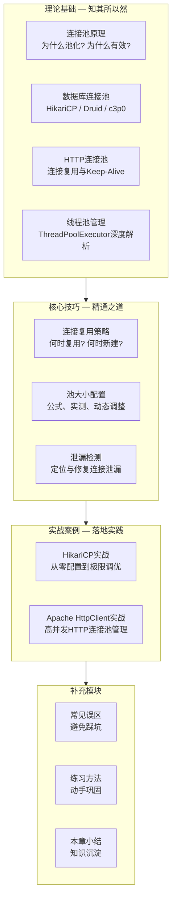
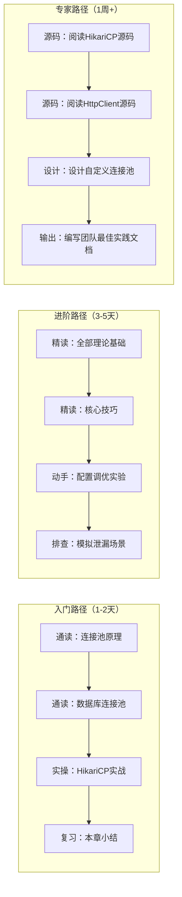

## 第49章 连接池与资源管理 — 章节概览

### 为什么需要这一章

在后端系统的性能调优实践中，有一个反复出现的规律：**80%的性能问题最终都指向资源管理**。数据库慢查询、HTTP接口超时、线程饥饿……这些看似不同的症状，背后往往藏着同一个根因——连接和线程等稀缺资源没有被正确管理。

连接池（Connection Pool）是解决这类问题的核心机制。它的本质思想很简单：**用池化（Pooling）对抗频繁创建销毁的开销**。但"知道概念"和"用好它"之间隔着巨大的鸿沟。HikariCP作者Brett Wooldridge曾说过一句被广泛引用的话：

> "The vast majority of JDBC connection pool problems are caused by a single configuration error: `maximumPoolSize` set too high."

这句话揭示了一个残酷现实：大多数开发者对连接池的理解停留在"配一个最大连接数"的层面，而对池的工作原理、调优策略、故障排查知之甚少。

本章的目标就是系统性地填补这个认知缺口——**从原理到实操，从数据库连接池到HTTP连接池再到线程池，建立完整的资源管理知识体系**。

---

### 本章的知识地图

整章按照"道→法→术→器"的逻辑组织，分为四大板块：



---

### 各板块内容导读

#### 理论基础：四层递进的认知体系

理论基础部分由四篇文章构成，按照"从通用到专用"的顺序排列：

**1. 连接池原理（第01节）**

这是整个章节的基石。核心回答三个问题：

| 问题 | 回答要点 |
|------|---------|
| **为什么需要连接池？** | TCP连接的三次握手开销（~1.5 RTT）、数据库认证开销（~5-50ms）、线程创建销毁开销（~0.1-1ms）——在高并发下，这些开销会累积成灾难性的延迟 |
| **连接池解决什么？** | 通过预创建+复用+回收的机制，将N次连接建立开销摊销到池的生命周期中，实现O(1)级别的连接获取 |
| **连接池的通用模型是什么？** | 空闲队列 + 活跃计数 + 等待队列 + 异步创建线程，这四个组件构成了所有连接池的核心骨架 |

你会学到连接池的生命周期状态机（初始化→就绪→扩容→缩容→销毁），以及阻塞等待vs快速失败两种获取策略的本质区别。

**2. 数据库连接池（第02节）**

数据库连接是连接池最经典的应用场景。本节横向对比三大主流实现：

| 连接池 | 核心优势 | 适用场景 | 默认最大连接数 |
|--------|---------|---------|--------------|
| **HikariCP** | 极致性能，字节码级优化，零锁竞争 | Spring Boot默认，高并发OLTP | 10 |
| **Druid** | 监控能力最强，内置SQL防火墙 | 需要精细监控的生产环境 | 8 |
| **c3p0** | 历史悠久，功能完备 | 老项目维护（不推荐新项目使用） | 15 |

你将理解为什么HikariCP能比其他连接池快2-3倍——不是因为它用了什么神奇算法，而是因为它在每一个微小的操作上都做了极致的优化：使用`Unsafe`绕过JVM的安全检查、用`FastList`替代`ArrayList`减少边界检查、用`ConcurrentBag`实现无锁的线程本地缓存。

**3. HTTP连接池（第03节）**

在微服务架构下，服务间调用的频率往往远高于数据库访问。HTTP连接池的核心问题是**连接复用与超时管理**。本节覆盖：

- HTTP/1.1 Keep-Alive的连接复用机制与局限
- HTTP/2多路复用对连接池模型的根本性改变
- Apache HttpClient和OkHttp的连接池实现对比
- 长连接vs短连接的选型决策框架
- 连接租借（checkout）和归还（checkin）的完整生命周期

**4. 线程池管理（第04节）**

线程池是连接池的"上层建筑"——连接池管理IO资源，线程池管理计算资源。Java的`ThreadPoolExecutor`是必须深入理解的核心组件：

```java
// ThreadPoolExecutor的核心参数 — 每一个都值得深入理解
new ThreadPoolExecutor(
    corePoolSize,      // 核心线程数：即使空闲也不会回收
    maximumPoolSize,   // 最大线程数：核心线程全部忙碌时的扩容上限
    keepAliveTime,     // 空闲存活时间：非核心线程的回收超时
    unit,              // 时间单位
    workQueue,         // 等待队列：核心线程忙碌时的任务暂存区
    threadFactory,     // 线程工厂：自定义线程命名，便于排查
    rejectionHandler   // 拒绝策略：队列和线程池都满时的应对方案
);
```

本节会深入讲解四个拒绝策略的语义差异、有界队列vs无界队列的致命陷阱，以及`corePoolSize`和`maximumPoolSize`之间的线程创建时序。

---

#### 核心技巧：从"能用"到"用好"

理论解决的是"是什么"和"为什么"，核心技巧解决的是"怎么做"。

**1. 连接复用（第01节）**

连接复用不是简单的"拿一个用完放回去"。需要考虑的问题包括：

- **连接有效性检测**：借出的连接可能已经断开（网络闪断、服务端超时、防火墙清理），如何低成本地验证？`testOnBorrow`、`testWhileIdle`、`testOnReturn`三种检测时机的性能trade-off
- **连接最大存活时间**：为什么连接不能无限复用？MySQL的`wait_timeout`、代理层的空闲清理、内核的TCP Keepalive参数，都可能悄悄断开连接
- **连接初始化成本**：每次新建连接需要执行的`init SQL`、SSL握手、字符集协商等操作，如何通过预热（warm-up）减少冷启动延迟

**2. 池大小配置（第02节）**

这是连接池调优中最常见也最容易出错的环节。核心原则是：

> 连接池大小不是越大越好。超过某个阈值后，增加连接数不仅不会提升吞吐量，反而会因为上下文切换和锁竞争导致性能下降。

经典的计算公式：

连接数 = CPU核心数 × 2 + 磁盘数

但这个公式只是起点。本节会教你：

- 如何通过**压测实测**找到你的业务场景的最优连接数
- 如何根据数据库的`max_connections`和应用实例数反推每实例的池大小
- HikariCP的作者推荐的计算方法：`connections = (core_count * 2) + effective_spindle_count`
- 连接池大小与线程池大小的联动关系——线程数远大于连接数会导致线程饥饿，连接数远大于CPU核心数会导致上下文切换风暴

**3. 泄漏检测（第03节）**

连接泄漏是生产环境中最隐蔽、危害最大的连接池问题。泄漏的典型症状：

- 连接池逐渐被耗尽，新请求长时间等待或超时
- 重启应用后问题暂时消失，运行一段时间后复现
- 数据库端的活跃连接数持续增长不回落

本节会讲解：

- HikariCP的`leakDetectionThreshold`机制——如何自动检测未归还的连接并打印警告日志
- 连接泄漏的三大根因：异常路径未关闭、事务管理器未提交、ORM框架的懒加载陷阱
- 如何通过`stackTrace`定位泄漏代码的具体行号
- 从预防到检测到修复的完整应对流程

---

#### 实战案例：真实世界的最佳实践

**案例一：HikariCP实战**

从一个Spring Boot项目出发，演示HikariCP从默认配置到生产级配置的完整演进过程。包括：

- 关键配置参数的含义和推荐值
- 如何通过监控指标判断池的健康状态
- 高并发场景下的调优实例
- 与Spring Boot的集成方式和常见陷阱

**案例二：Apache HttpClient实战**

针对微服务间HTTP调用的场景，演示如何正确配置和使用HttpClient连接池：

- 连接池的创建、配置、复用全流程
- 超时设置的分层策略（连接超时、socket超时、总超时）
- 连接驱逐（eviction）策略配置
- HTTPS场景下的连接池特殊处理

---

### 学习路径建议

根据你的基础水平，推荐不同的学习路径：



**入门读者**：重点理解连接池的基本概念和配置方法，能够正确使用HikariCP即可。

**进阶读者**：需要掌握池大小调优的方法论、泄漏检测的实操技巧，以及HTTP连接池的配置策略。

**专家读者**：建议阅读连接池框架的源码实现，理解无锁数据结构（如ConcurrentBag）的设计思想，并能在团队中建立连接池使用的规范和监控体系。

---

### 关键概念速查

在正式学习之前，先熟悉以下术语，它们会在后续章节中反复出现：

| 术语 | 英文 | 一句话解释 |
|------|------|-----------|
| 连接池 | Connection Pool | 预创建一组连接并重复使用，避免频繁创建销毁的资源管理机制 |
| 池化 | Pooling | 将稀缺资源预先创建并集中管理，按需分配给消费者的通用设计模式 |
| 核心连接数 | Core Pool Size | 连接池始终保持的最小连接数，即使空闲也不回收 |
| 最大连接数 | Max Pool Size | 连接池允许创建的连接上限，超过此值新请求将等待或拒绝 |
| 空闲超时 | Idle Timeout | 空闲连接超过此时间后被关闭回收，释放数据库端资源 |
| 连接泄漏 | Connection Leak | 获取连接后未正确归还，导致连接池逐渐耗尽 |
| 借出/归还 | Checkout/Checkin | 从池中获取连接/将连接放回池中的操作 |
| 连接驱逐 | Connection Eviction | 主动检测并关闭无效连接（已断开、超时等）的过程 |
| 等待超时 | Connection Timeout | 从池中获取连接的最大等待时间，超时则抛出异常 |
| 线程饥饿 | Thread Starvation | 线程池中所有线程都在等待连接，导致新任务无法执行 |
| 活跃连接 | Active Connections | 当前正在被使用的连接数量 |
| 流量控制 | Flow Control | 通过限流、排队等手段防止系统过载的机制 |

---

### 本章的工程价值

学习完本章后，你将具备以下能力：

1. **能设计**：根据业务场景选择合适的连接池方案，配置合理的参数
2. **能调优**：通过监控指标和压测数据，找到性能瓶颈并精准优化
3. **能排障**：快速定位连接泄漏、连接饥饿、超时等常见问题的根因
4. **能预防**：建立连接池的监控告警体系，将问题消灭在萌芽阶段
5. **能选型**：在HikariCP、Druid、HttpClient连接池等方案之间做出合理的技术选型

这些能力在高并发系统设计、微服务架构、数据库性能优化等场景中都是不可或缺的核心技能。

现在，让我们从第一篇——连接池原理开始，系统地构建这套知识体系。
