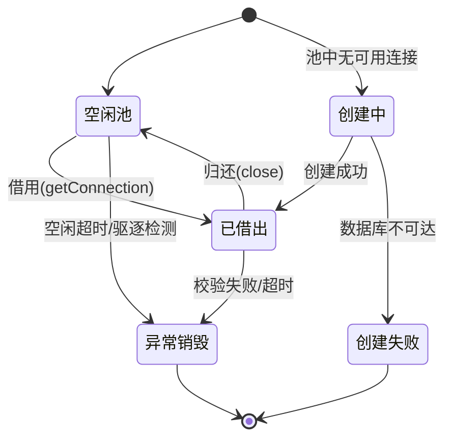
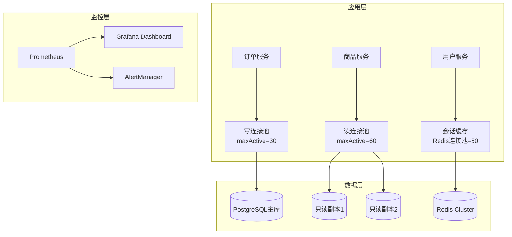

# 连接池与资源管理 — 练习方法

本章提供五个递进式练习，从基础概念理解到架构设计实战，帮助读者系统掌握连接池配置、资源管理策略和性能调优方法。每个练习都包含具体步骤、可运行的代码和明确的检查标准。

---

## 练习一：连接池基础概念与核心参数理解（预计30分钟）

### 目标

理解连接池的生命周期管理、关键参数的含义及其相互影响，能够在不查文档的情况下解释每个参数的作用和调优方向。

### 步骤

#### 1. 梳理连接池生命周期（10分钟）

画出连接池的完整生命周期状态机，标注每个状态转换的触发条件：



在纸上或 Mermaid 中画出这张图后，逐一回答以下问题：

- 一个连接从创建到被借用，经过哪些中间状态？
- 连接归还后为什么不直接销毁而是放回空闲池？
- 什么情况下连接会被异常销毁而不是归还？
- 最小空闲连接数（minIdle）和最大连接数（maxActive）如何配合工作？

#### 2. 核心参数对照表（10分钟）

默写下表中每个参数的含义、默认值和调优建议，然后与原文对照查漏补缺：

| 参数 | 含义 | 典型默认值 | 调优方向 |
|------|------|-----------|---------|
| maxActive | 池中最大连接总数 | 10 | 根据并发量和数据库承受能力设定 |
| minIdle | 池中保持的最小空闲连接数 | 5 | 过小导致频繁创建，过大浪费资源 |
| maxWait | 借用连接的最大等待时间（毫秒） | 30000 | 过长阻塞请求线程，过短容易获取失败 |
| maxLifetime | 连接的最大存活时间（毫秒） | 1800000 | 必须小于数据库的 wait_timeout |
| idleTimeout | 空闲连接的最大存活时间（毫秒） | 600000 | 超过 minIdle 的空闲连接会被驱逐 |
| connectionTimeout | 获取连接的超时时间（毫秒） | 30000 | 等待池中连接可用的最大时间 |
| validationTimeout | 连接校验的超时时间（毫秒） | 5000 | 建议小于 connectionTimeout |
| leakDetectionThreshold | 连接泄漏检测阈值（毫秒） | 0（禁用） | 开发环境设为 5000-10000 |

#### 3. 参数关联关系分析（10分钟）

理解参数之间的约束关系，画出参数依赖图：

maxLifetime > idleTimeout > validationTimeout
connectionTimeout > validationTimeout
maxActive >= minIdle
minIdle <= initialSize（如果有此参数）

回答以下场景题：

- **场景A**：maxLifetime 设为 30 分钟，数据库 wait_timeout 设为 10 分钟，会发生什么？
  答：连接在池中被标记为可用，但实际已被数据库服务端断开。下次借用时会抛出 "Connection is not available" 或 "Communications link failure" 异常。

- **场景B**：maxActive=20 但业务峰值需要 30 个并发连接，会出现什么现象？
  答：第 21-30 个请求会进入等待队列，超过 maxWait 后抛出 "Cannot get a connection, pool error Timeout waiting for idle object"。

- **场景C**：idleTimeout=5 分钟但 minIdle=10，连接池会如何变化？
  答：空闲超过 5 分钟的连接中，超出 minIdle 部分会被驱逐。如果池中刚好 10 个空闲连接，没有多余连接可驱逐，minIdle 保底生效。

### 检查标准

- [ ] 能够画出完整的连接池生命周期状态图
- [ ] 能默写 8 个核心参数的含义和默认值
- [ ] 能解释参数之间的约束关系
- [ ] 能回答三个场景题的正确答案

---

## 练习二：动手搭建连接池并配置监控（预计60分钟）

### 目标

在 Java 项目中搭建一个基于 HikariCP 的数据库连接池，配置各项参数，接入 Micrometer 监控，并通过压测工具验证配置的合理性。

### 步骤

#### 1. 创建项目并引入依赖（15分钟）

使用 Spring Boot 创建一个最小化项目，确保引入以下依赖：

```xml
<!-- pom.xml 关键依赖 -->
<dependencies>
    <dependency>
        <groupId>com.zaxxer</groupId>
        <artifactId>HikariCP</artifactId>
        <version>5.1.0</version>
    </dependency>
    <dependency>
        <groupId>org.postgresql</groupId>
        <artifactId>postgresql</artifactId>
        <version>42.7.2</version>
    </dependency>
    <dependency>
        <groupId>io.micrometer</groupId>
        <artifactId>micrometer-registry-prometheus</artifactId>
    </dependency>
    <dependency>
        <groupId>org.springframework.boot</groupId>
        <artifactId>spring-boot-starter-actuator</artifactId>
    </dependency>
</dependencies>
```

```bash
# 验证项目构建
mvn clean package -DskipTests

# 启动 PostgreSQL（使用 Docker）
docker run -d --name pool-demo-pg \
  -e POSTGRES_PASSWORD=demo123 \
  -e POSTGRES_DB=pool_demo \
  -p 5432:5432 \
  postgres:16
```

#### 2. 配置连接池参数（15分钟）

创建 HikariCP 配置类，手动控制每个参数而不是依赖自动配置：

```java
@Configuration
public class HikariPoolConfig {

    @Bean
    public DataSource dataSource() {
        HikariConfig config = new HikariConfig();
        config.setJdbcUrl("jdbc:postgresql://localhost:5432/pool_demo");
        config.setUsername("postgres");
        config.setPassword("demo123");

        // ===== 核心池参数 =====
        config.setMaximumPoolSize(20);      // 最大连接数
        config.setMinimumIdle(5);            // 最小空闲连接数
        config.setIdleTimeout(300000);       // 空闲超时 5 分钟
        config.setMaxLifetime(1200000);      // 最大存活时间 20 分钟
        config.setConnectionTimeout(10000);  // 获取连接超时 10 秒

        // ===== 连接校验 =====
        config.setConnectionTestQuery("SELECT 1");
        config.setValidationTimeout(3000);

        // ===== 泄漏检测（开发环境开启） =====
        config.setLeakDetectionThreshold(5000);  // 5 秒未归还告警

        // ===== 连接池名称（便于监控识别） =====
        config.setPoolName("demo-pool");

        // ===== 指标采集 =====
        config.setMetricRegistry(
            new MicrometerMetricsTrackerFactory(
                new PrometheusMeterRegistry(PrometheusConfig.DEFAULT)
            )
        );

        return new HikariDataSource(config);
    }
}
```

#### 3. 编写模拟业务代码（10分钟）

编写一段能够暴露连接池行为的代码，用于后续观察：

```java
@RestController
@RequestMapping("/api/orders")
public class OrderController {

    @Autowired
    private JdbcTemplate jdbcTemplate;

    // 正常请求：快速归还连接
    @GetMapping("/count")
    public Map<String, Object> count() {
        Integer count = jdbcTemplate.queryForObject(
            "SELECT COUNT(*) FROM orders", Integer.class);
        return Map.of("count", count);
        // 连接在这里自动归还
    }

    // 模拟慢查询：长时间占用连接
    @GetMapping("/slow")
    public Map<String, Object> slow() throws InterruptedException {
        Thread.sleep(5000); // 模拟 5 秒慢查询
        Integer count = jdbcTemplate.queryForObject(
            "SELECT COUNT(*) FROM orders", Integer.class);
        return Map.of("count", count);
    }

    // 模拟连接泄漏：忘记关闭连接
    @GetMapping("/leak")
    public Map<String, Object> leak() throws SQLException {
        DataSource ds = jdbcTemplate.getDataSource();
        Connection conn = ds.getConnection(); // 获取连接
        // 故意不调用 conn.close() —— 模拟泄漏
        // HikariCP 会在 5 秒后打印泄漏警告
        return Map.of("status", "connection leaked intentionally");
    }
}
```

#### 4. 验证连接池监控指标（20分钟）

启动应用后，通过 Actuator 端点观察连接池状态：

```bash
# 获取 HikariCP 连接池指标
curl -s http://localhost:8080/actuator/metrics/hikaricp.connections.active | python3 -m json.tool

# 关键指标说明
# hikaricp.connections.active        — 当前活跃连接数
# hikaricp.connections.idle          — 当前空闲连接数
# hikaricp.connections.pending       — 等待获取连接的请求数
# hikaricp.connections.timeout.total — 累计超时次数
# hikaricp.connections.usage.max     — 连接最大借出时长
```

用并发工具模拟负载，观察指标变化：

```bash
# 使用 wrk 或 hey 进行压测
# 终端1：压测正常接口
hey -n 500 -c 20 http://localhost:8080/api/orders/count

# 终端2：同时压测慢接口，观察池耗尽
hey -n 50 -c 30 http://localhost:8080/api/orders/slow

# 终端3：持续观察连接池指标
watch -n 1 'curl -s http://localhost:8080/actuator/metrics/hikaricp.connections.active | python3 -c "import sys,json; print(json.load(sys.stdin).get(\"measurements\",[]))"'
```

### 检查标准

- [ ] 项目成功启动，数据库连接正常
- [ ] 能通过 Actuator 端点获取到连接池的 5 个核心指标
- [ ] 在压测期间观察到 active 连接数上升到接近 maxActive
- [ ] 触发了慢接口导致 pending 计数增加
- [ ] 访问 /leak 接口后在日志中看到 HikariCP 的泄漏警告

---

## 练习三：连接池问题排查实战（预计45分钟）

### 目标

掌握连接池常见问题的排查方法论：从现象定位到根因分析再到修复验证，形成完整的排障闭环。

### 步骤

#### 1. 模拟并排查连接泄漏（15分钟）

**问题现象**：应用运行一段时间后，日志中频繁出现 "Connection is not available, request timed out after Xms"。

**排障步骤**：

```bash
# 第一步：确认连接池状态
curl -s http://localhost:8080/actuator/metrics/hikaricp.connections.active \
  | python3 -c "
import sys, json
data = json.load(sys.stdin)
for m in data.get('measurements', []):
    print(f\"Active connections: {m.get('value', 'N/A')}\")
"
# 预期：active 接近 maxActive 且持续不下降

# 第二步：开启泄漏检测日志
# 在 logback.xml 中添加
# <logger name="com.zaxxer.hikari" level="DEBUG"/>
# 观察输出中的 "Connection leak detection" 告警

# 第三步：分析泄漏调用栈
# HikariCP 泄漏日志会打印获取连接时的完整调用栈
# 找到 "Connection was not returned" 后面的 stack trace
# 定位到代码中获取 Connection 但未关闭的位置

# 第四步：验证修复
# 修复后重启应用，重新运行压测
# 确认日志中不再出现泄漏告警
# 确认 active 连接数能正常回落
```

**典型根因清单**：

| 根因 | 现象 | 修复方法 |
|------|------|---------|
| 手动获取 Connection 未关闭 | 连接数线性增长 | 使用 try-with-resources 或改用 JdbcTemplate |
| 事务未正确提交/回滚 | 连接被事务锁住 | 确保 @Transactional 有对应的 commit/rollback |
| 异常路径上连接未释放 | 间歇性连接耗尽 | 在 finally 块中关闭连接 |
| 慢查询长期占用 | 高并发时连接不够 | 优化 SQL + 设置查询超时 |

#### 2. 模拟并排查连接风暴（15分钟）

**问题现象**：数据库重启后，应用短时间内大量报错，然后逐渐恢复，但部分请求已超时失败。

**排障步骤**：

```bash
# 第一步：观察重启后的连接创建行为
# 开启 HikariCP 调试日志
# 关键日志行：
# "HikariPool-1 - Connection is not available, request timed out after Xms"
# "HikariPool-1 - Added connection PostgreSQL JDBC Connection"
# "HikariPool-1 - Closing connection PostgreSQL JDBC Connection"

# 第二步：使用 tc 模拟网络延迟
# 添加 200ms 延迟模拟数据库恢复期间的网络不稳定
sudo tc qdisc add dev eth0 root netem delay 200ms

# 第三步：观察连接池恢复策略
# HikariCP 默认行为：
# 1. 连接失败 → 标记连接为弃用
# 2. 创建新连接替代
# 3. 新连接也失败 → 等待 connectionTimeout 后报错
# 4. 数据库恢复后 → 新连接成功，池逐步回填

# 第四步：配置连接风暴防护
# 添加以下参数：
# keepaliveTime=30000     (30秒发送心跳保活)
# connectionTestQuery=SELECT 1 (应用层校验)
# 注意：validateOnBorrow 是 HikariCP 的默认行为

# 清除 tc 规则
sudo tc qdisc del dev eth0 root
```

#### 3. 排查慢查询导致的连接池耗尽（15分钟）

**问题现象**：监控显示 QPS 正常但 P99 延迟飙升，连接池 active 持续走高。

```bash
# 第一步：查询数据库端的长事务
# PostgreSQL
psql -U postgres -d pool_demo -c "
SELECT pid, now() - pg_stat_activity.query_start AS duration,
       state, query
FROM pg_stat_activity
WHERE state != 'idle'
ORDER BY duration DESC;
"

# 第二步：分析慢查询的执行计划
# PostgreSQL
EXPLAIN (ANALYZE, BUFFERS, FORMAT TEXT)
SELECT * FROM orders WHERE customer_id = 12345;

# 常见慢查询原因及优化
# 1. 全表扫描 → 添加索引
# 2. 锁等待 → 优化事务粒度
# 3. 连接池耗尽 → 分离读写连接池

# 第三步：实施读写分离方案（参考代码）
@Configuration
public class ReadWriteDataSourceConfig {

    @Bean
    @Primary
    public DataSource writeDataSource() {
        HikariConfig config = new HikariConfig();
        config.setJdbcUrl("jdbc:postgresql://primary:5432/db");
        config.setMaximumPoolSize(10);  // 写连接池较小
        config.setPoolName("write-pool");
        return new HikariDataSource(config);
    }

    @Bean("readDataSource")
    public DataSource readDataSource() {
        HikariConfig config = new HikariConfig();
        config.setJdbcUrl("jdbc:postgresql://replica:5432/db");
        config.setMaximumPoolSize(30); // 读连接池较大
        config.setPoolName("read-pool");
        return new HikariDataSource(config);
    }
}
```

### 检查标准

- [ ] 能复现连接泄漏现象并在日志中找到泄漏位置
- [ ] 能解释连接风暴的产生机制和恢复过程
- [ ] 能通过数据库侧查询定位慢查询并给出优化建议
- [ ] 掌握至少两种排障工具的使用（HikariCP 日志、pg_stat_activity）

---

## 练习四：连接池性能调优（预计60分钟）

### 目标

掌握连接池容量评估方法，能够通过基准测试建立性能基线，识别瓶颈并实施针对性优化，量化优化效果。

### 步骤

#### 1. 建立性能基线（15分钟）

使用 JMH（Java Microbenchmark Harness）建立连接池性能基线：

```java
@State(Scope.Benchmark)
@BenchmarkMode(Mode.Throughput)
@OutputTimeUnit(TimeUnit.SECONDS)
@Warmup(iterations = 3, time = 10)
@Measurement(iterations = 5, time = 30)
public class ConnectionPoolBenchmark {

    private HikariDataSource dataSource;

    @Param({"5", "10", "20", "50"})
    private int maxPoolSize;

    @Setup
    public void setup() {
        HikariConfig config = new HikariConfig();
        config.setJdbcUrl("jdbc:postgresql://localhost:5432/pool_demo");
        config.setUsername("postgres");
        config.setPassword("demo123");
        config.setMaximumPoolSize(maxPoolSize);
        config.setMinimumIdle(maxPoolSize / 2);
        config.setPoolName("bench-pool-" + maxPoolSize);
        dataSource = new HikariDataSource(config);
    }

    @TearDown
    public void tearDown() {
        dataSource.close();
    }

    @Benchmark
    public void borrowAndReturn() throws SQLException {
        try (Connection conn = dataSource.getConnection();
             Statement stmt = conn.createStatement();
             ResultSet rs = stmt.executeQuery("SELECT 1")) {
            rs.next();
        }
    }

    @Benchmark
    public void borrowAndReturnWithQuery() throws SQLException {
        try (Connection conn = dataSource.getConnection();
             PreparedStatement stmt = conn.prepareStatement(
                 "SELECT COUNT(*) FROM orders WHERE status = ?")) {
            stmt.setString(1, "pending");
            try (ResultSet rs = stmt.executeQuery()) {
                rs.next();
            }
        }
    }
}
```

```bash
# 运行基准测试
java -jar benchmarks.jar ConnectionPoolBenchmark -rf json -rff results.json

# 分析不同池大小下的吞吐量
python3 -c "
import json
with open('results.json') as f:
    data = json.load(f)
for b in data['benchmarks']:
    name = b['benchmark']
    params = b['params']
    score = b['primaryMetric']['score']
    unit = b['primaryMetric']['scoreUnit']
    pool = params.get('maxPoolSize', 'N/A')
    print(f'Pool={pool:>3}  |  {score:.2f} {unit}')
"
```

#### 2. 识别瓶颈（20分钟）

```bash
# 使用 async-profiler 生成火焰图
# 下载并配置
wget https://github.com/async-profiler/async-profiler/releases/download/v3.0/async-profiler-3.0-linux-x64.tar.gz
tar xzf async-profiler-3.0-linux-x64.tar.gz

# 采集 30 秒 CPU + Lock profiling
./profiler.sh -d 30 -e cpu,lock -f flamegraph.html <pid>

# 分析关键瓶颈点
# 1. 如果看到 HikariPool.getConnection 占比高 → 池太小
# 2. 如果看到 PostgreSQL JDBC 连接创建占比高 → 频繁创建销毁
# 3. 如果看到 Thread.sleep 或 synchronized 占比高 → 锁竞争严重
# 4. 如果看到 SQL 解析/执行占比高 → 查询需要优化
```

**常见瓶颈与优化策略对照**：

| 瓶颈类型 | 识别特征 | 优化策略 | 预期效果 |
|----------|---------|---------|---------|
| 池大小不足 | pending 队列长、wait timeout 多 | 增大 maxActive 或优化连接复用 | 吞吐量提升 30-50% |
| 连接创建开销 | flame 图中连接创建占比 > 5% | 增大 minIdle、启用 keepalive | 延迟降低 20-30% |
| 连接校验开销 | validationTime 指标高 | 简化校验查询或降低校验频率 | 吞吐量提升 5-15% |
| 锁竞争 | HikariPool 内部锁等待 | 减小池大小或使用分片池 | P99 延迟降低 40% |
| SQL 慢查询 | 单次借出时间长 | 优化 SQL + 添加索引 | 连接周转率提升 |

#### 3. 实施优化并验证（25分钟）

根据瓶颈分析结果，逐步实施优化并记录每步效果：

```java
// 优化前的配置（基线）
HikariConfig baseline = new HikariConfig();
baseline.setMaximumPoolSize(10);
baseline.setMinimumIdle(2);
baseline.setIdleTimeout(600000);
baseline.setMaxLifetime(1800000);

// 优化后的配置
HikariConfig optimized = new HikariConfig();
optimized.setMaximumPoolSize(20);       // 根据瓶颈分析增大
optimized.setMinimumIdle(10);           // 减少创建开销
optimized.setIdleTimeout(300000);       // 更快释放空闲连接
optimized.setMaxLifetime(1200000);      // 缩短最大存活时间
optimized.setKeepaliveTime(30000);      // 30秒心跳保活
optimized.setConnectionTestQuery(null); // 使用 JDBC4 isValid()（更快）
```

```bash
# 对比优化前后的性能指标
# 记录以下数据并填入表格

echo "=== 性能对比表 ==="
echo "| 指标              | 优化前    | 优化后    | 提升幅度  |"
echo "|-------------------|----------|----------|----------|"
echo "| QPS               | ?        | ?        | ?%       |"
echo "| P50 延迟 (ms)     | ?        | ?        | ?%       |"
echo "| P99 延迟 (ms)     | ?        | ?        | ?%       |"
echo "| 连接获取超时次数  | ?        | ?        | ?%       |"
echo "| 平均活跃连接数    | ?        | ?        | -        |"
```

### 检查标准

- [ ] 完成了 4 组不同池大小的基准测试
- [ ] 生成了火焰图并识别出至少一个瓶颈点
- [ ] 针对瓶颈实施了至少两项优化措施
- [ ] 填写了性能对比表，有量化数据支撑

---

## 练习五：资源管理架构设计实战（预计90分钟）

### 目标

能够根据实际业务场景设计完整的连接池与资源管理方案，包括多数据源隔离、资源池化策略、监控告警体系和故障恢复机制。

### 步骤

#### 1. 需求分析（20分钟）

**场景**：为一个电商平台设计后端资源管理架构，具体需求如下：

| 维度 | 要求 |
|------|------|
| 日活用户 | 50 万 |
| 峰值并发 | 5000 QPS |
| 数据库 | 主库 PostgreSQL + 2 个只读副本 + Redis 缓存 |
| 业务分类 | 订单（强一致）、商品浏览（高吞吐）、用户会话（低延迟） |
| SLA 要求 | 可用性 99.95%，P99 < 200ms |
| 成本约束 | 单数据库实例最多 100 连接 |

分析核心矛盾：5000 QPS × 平均每个请求 1 次数据库查询 = 需要 5000 QPS 的数据库访问能力，但单实例只有 100 连接。解法：连接复用 + 多副本分担 + 缓存减少数据库访问。

#### 2. 架构方案设计（40分钟）

设计包含以下组件的完整架构：

**（1）多数据源连接池架构**



**（2）资源隔离策略**

为不同业务线分配独立的连接池，防止一个业务的慢查询影响其他业务：

```java
@Configuration
public class ResourceIsolationConfig {

    // 订单业务：强一致性要求，独立小池
    @Bean("orderWritePool")
    public DataSource orderWritePool() {
        HikariConfig config = new HikariConfig();
        config.setJdbcUrl("jdbc:postgresql://primary:5432/orders");
        config.setMaximumPoolSize(30);
        config.setMinimumIdle(10);
        config.setConnectionTimeout(5000);   // 快速失败
        config.setLeakDetectionThreshold(3000);
        config.setPoolName("order-write");
        return new HikariDataSource(config);
    }

    // 商品业务：高吞吐要求，大连接池
    @Bean("productReadPool")
    public DataSource productReadPool() {
        HikariConfig config = new HikariConfig();
        config.setJdbcUrl("jdbc:postgresql://replica:5432/products");
        config.setMaximumPoolSize(60);
        config.setMinimumIdle(20);
        config.setConnectionTimeout(10000);
        config.setMaxLifetime(900000);  // 副本可能频繁切换
        config.setPoolName("product-read");
        return new HikariDataSource(config);
    }

    // Redis 连接池配置
    @Bean
    public LettuceConnectionFactory redisConnectionFactory() {
        LettuceClientConfiguration config = LettuceClientConfiguration.builder()
            .commandTimeout(Duration.ofMillis(100))
            .build();

        RedisStandaloneConfiguration serverConfig =
            new RedisStandaloneConfiguration("redis-host", 6379);

        LettucePoolingClientConfiguration poolConfig =
            LettucePoolingClientConfiguration.builder()
                .commandTimeout(Duration.ofMillis(100))
                .poolConfig(buildPoolConfig())
                .build();

        return new LettuceConnectionFactory(serverConfig, poolConfig);
    }

    private GenericObjectPoolConfig<?> buildPoolConfig() {
        GenericObjectPoolConfig<?> poolConfig = new GenericObjectPoolConfig<>();
        poolConfig.setMaxTotal(50);
        poolConfig.setMaxIdle(20);
        poolConfig.setMinIdle(5);
        poolConfig.setMaxWait(Duration.ofMillis(200));
        return poolConfig;
    }
}
```

**（3）监控告警体系**

```yaml
# Prometheus 告警规则 (alerts.yml)
groups:
  - name: connection_pool_alerts
    rules:
      # 连接池使用率告警
      - alert: PoolUtilizationHigh
        expr: |
          hikaricp_connections_active / hikaricp_connections_max > 0.8
        for: 2m
        labels:
          severity: warning
        annotations:
          summary: "连接池 {{ $labels.pool }} 使用率超过 80%"

      # 连接获取超时告警
      - alert: ConnectionTimeoutSpike
        expr: rate(hikaricp_connections_timeout_total[5m]) > 0.1
        for: 1m
        labels:
          severity: critical
        annotations:
          summary: "连接池 {{ $labels.pool }} 出现持续超时"

      # 连接泄漏告警
      - alert: ConnectionLeakDetected
        expr: hikaricp_connections_pending > 0
        for: 5m
        labels:
          severity: critical
        annotations:
          summary: "可能存在连接泄漏，等待队列持续非零"
```

#### 3. 方案评审与优化（30分钟）

对照以下检查清单评审设计方案：

**连接池配置评审**：

- [ ] maxActive 是否基于数据库实例连接数上限计算？（建议：maxActive = DB max_connections × 0.7 / 应用实例数）
- [ ] 是否为不同业务线配置了独立的连接池？
- [ ] 是否配置了连接泄漏检测？（开发环境必须开启）
- [ ] maxLifetime 是否小于数据库的 wait_timeout？
- [ ] 是否配置了连接保活（keepaliveTime）？

**资源隔离评审**：

- [ ] 写操作和读操作是否使用不同的连接池？
- [ ] 一个业务的慢查询是否会影响其他业务？
- [ ] 是否有降级机制（如连接池耗尽时返回缓存数据）？

**监控告警评审**：

- [ ] 是否监控了 active、idle、pending、timeout 四个核心指标？
- [ ] 告警阈值是否合理？（避免过于灵敏导致告警疲劳）
- [ ] 是否有 Grafana Dashboard 可视化展示？

**故障恢复评审**：

- [ ] 数据库重启后应用能否自动恢复？
- [ ] 是否有熔断机制防止故障扩散？
- [ ] 连接池耗尽时的降级策略是什么？

**容量规划公式**：

推荐 maxActive = (目标 QPS × 平均查询耗时秒数) × 1.5(安全系数) / 应用实例数

示例：
  目标 QPS = 5000
  平均查询耗时 = 10ms = 0.01s
  安全系数 = 1.5
  应用实例数 = 4

  maxActive = (5000 × 0.01 × 1.5) / 4 = 19（向上取整为 20）

### 检查标准

- [ ] 需求分析中正确识别了核心矛盾（5000 QPS vs 100 连接）
- [ ] 设计了至少 3 个独立的连接池（写、读、缓存）
- [ ] 配置了 Prometheus + AlertManager 告警规则
- [ ] 评审清单中所有项都有明确答案
- [ ] 能用容量规划公式计算出合理的 maxActive 值

---

## 总结与进阶方向

完成五个练习后，你应该具备以下能力：

| 层级 | 能力 | 对应练习 |
|------|------|---------|
| 理解 | 解释连接池参数含义和约束关系 | 练习一 |
| 实操 | 搭建连接池并接入监控 | 练习二 |
| 排障 | 定位泄漏、风暴、慢查询等常见问题 | 练习三 |
| 调优 | 通过基准测试量化优化效果 | 练习四 |
| 设计 | 设计多数据源资源管理架构 | 练习五 |

**进阶挑战**：

1. **分片连接池**：当单实例连接数不够时，实现客户端分片将请求分散到多个数据库实例
2. **连接池动态调参**：实现根据实时负载自动调整 maxActive 的闭环控制
3. **多租户资源隔离**：为 SaaS 应用设计租户级别的连接池隔离方案
4. **跨服务资源编排**：在微服务架构下设计全局资源管理策略，避免级联耗尽
