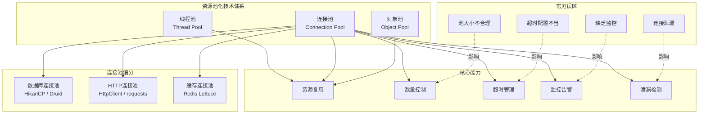

## 本章核心收获

连接池与资源管理是高性能服务端系统的核心基础设施。本章从原理到实践，系统性地覆盖了数据库连接池、HTTP 连接池、线程池、对象池四大类资源池化技术，深入剖析了十大常见误区，并提供了贯穿设计、实现、部署、运维全生命周期的最佳实践。学完本章，你应该能够：

1. **理解为什么**：从 TCP 握手、SSL 协商、身份认证的成本出发，理解资源复用的本质价值
2. **算得准**：使用 Little 定律和 HikariCP 推荐公式，精确计算连接池大小
3. **选得对**：在 HikariCP、Druid、c3p0 等方案中做出合理选型
4. **配得好**：为数据库连接池、HTTP 连接池、线程池分别配置最优参数
5. **看得清**：通过监控指标和告警阈值，实时掌握资源池运行状态
6. **修得了**：快速定位连接泄漏、池耗尽、超时等生产问题

---

## 一、连接池核心原理

### 1.1 为什么需要连接池

每一次新建连接都涉及昂贵的系统级操作。以数据库连接为例：

| 操作 | 典型耗时 | 说明 |
|------|---------|------|
| TCP 三次握手 | 0.5-3ms | 涉及网络往返和内核协议栈处理 |
| SSL/TLS 握手 | 5-50ms | 非对称加密密钥交换，CPU 密集 |
| 数据库身份认证 | 2-10ms | 查询权限表、验证凭证 |
| 连接初始化 | 1-5ms | 设置字符集、时区、会话变量等 |
| **合计** | **8.5-68ms** | 高并发下开销成倍放大 |

连接池的核心思想是**资源复用**：预先创建一批连接放入池中管理，应用需要时从池中借用，使用完毕后归还而非销毁。当 QPS 为 5000 时，如果每次新建连接耗时 20ms，仅建连就消耗 100 秒的线程时间——这还不包括连接数暴涨对数据库的冲击。

### 1.2 连接池的核心参数

| 参数 | 含义 | 典型值 | 配置要点 |
|------|------|--------|---------|
| minimumIdle | 最小空闲连接数 | CPU核数 | 流量低谷时池中保留的连接数，保证突发流量的快速响应 |
| maximumPoolSize | 最大连接数（含活跃+空闲） | CPU核数×2+1 | 必须小于数据库 max_connections ÷ 应用实例数 |
| connectionTimeout | 借用连接的最大等待时间 | 3-5s | 超过则快速失败，避免线程阻塞堆积 |
| idleTimeout | 空闲连接的最长存活时间 | 5-10min | 仅在连接数 > minimumIdle 时生效，过期连接会被回收 |
| maxLifetime | 连接的最大存活时间 | 30min | 必须小于数据库端 wait_timeout，防止被服务端强制关闭 |
| validationTimeout | 连接验证的最大耗时 | 2-5s | 必须小于 connectionTimeout，否则验证完成前已超时 |

### 1.3 连接池状态机

[新建] → 空闲(Idle) ⇄ 活跃(Active) → 暂停(Suspended) → 关闭(Closed)
                ↑                                      |
                └──────────── 空闲超时/最大生命周期 ───────┘

**工作流程关键节点**：

- **借用**：优先从本地列表获取（减少锁竞争）→ 无可用连接时创建新连接（不超过上限）→ 达到上限则阻塞等待或快速失败
- **归还**：重置连接状态（清空临时数据）→ 验证有效性 → 放回空闲列表
- **驱逐**：后台线程定期扫描，移除超过 idleTimeout 和 maxLifetime 的连接

---

## 二、数据库连接池：HikariCP

HikariCP 是目前性能最优的 Java 数据库连接池，其三大创新设计使其远超传统连接池：

### 2.1 三大性能创新

**无锁设计（ConcurrentBag）**：为每个线程维护本地连接列表，借用连接时优先从 ThreadLocal 获取，消除锁竞争。相比 c3p0/DBCP 的 synchronized 方式，吞吐量提升 3-5 倍。其核心思想是"先乐观，后悲观"——大多数情况下线程直接从本地取连接，只有本地列表为空时才竞争共享列表。

**字节码优化**：使用 Javassist 动态生成 Connection 代理类，编译时完成方法拦截优化，方法调用开销接近零。传统连接池的代理层会带来额外的方法查找和反射开销，HikariCP 通过字节码生成将这些开销压缩到极致。

**快速路径优化**：借用和归还操作仅几行代码，几乎没有分支判断和对象分配。Brett Wooldridge 在设计时反复强调"每一纳秒都重要"，最终将借用操作的热点路径压缩到极致。

### 2.2 连接池大小计算

**基础公式（快速估算）**：

池大小 = CPU核心数 × 2 + 有效磁盘数
SSD 场景：池大小 = CPU核数 × 2 + 1

**精确公式（基于 Little 定律）**：

池大小 = 目标QPS × 平均响应时间(秒) ÷ 实例数 × 安全系数(1.5)

**实战计算示例**：

- 目标 QPS：5000
- 平均响应时间：20ms（0.02s）
- 数据库 max_connections：500
- 应用实例数：4

每实例所需连接 = 5000 × 0.02 ÷ 4 = 25
加上缓冲 1.5 倍：25 × 1.5 ≈ 38
建议池大小：35-40
验证：40 × 4 = 160 < 500 ✓（远低于数据库上限，留有余量）

**关键约束**：所有实例的 maximumPoolSize 之和必须小于数据库的 max_connections，否则会出现连接被数据库拒绝的问题。建议保留 20% 的余量以应对突发流量和管理连接。

---

## 三、HTTP 连接池

HTTP 连接池用于复用 TCP 连接，减少频繁建立/断开连接的开销。

### 3.1 HTTP/1.1 vs HTTP/2

| 维度 | HTTP/1.1 Keep-Alive | HTTP/2 多路复用 |
|------|---------------------|----------------|
| 连接复用 | 单连接串行复用 | 单连接并行复用 |
| 队头阻塞 | 存在——前一个请求未完成时后续请求必须等待 | 解决——多个流的帧可交错发送 |
| 帧级交错 | 不支持 | 支持，每个请求分解为帧，携带流 ID |
| 服务端兼容 | 广泛 | 需服务器支持 |
| 微服务推荐 | 低频调用可用 | 高频调用首选 |

HTTP/2 的多路复用将请求/响应分解为帧（Frame），每个帧携带流 ID（Stream ID），多个流的帧可以交错发送。在微服务高频调用场景下，HTTP/2 的性能优势尤为明显——一个 TCP 连接即可并行处理数百个请求，彻底消除了队头阻塞。

### 3.2 连接池参数配置

**Apache HttpClient 5**：

| 参数 | 含义 | 推荐值 |
|------|------|--------|
| maxConnTotal | 所有路由的最大连接数 | 200-500 |
| maxConnPerRoute | 单个路由的最大连接数 | 50-100 |
| soTimeout | Socket 读超时 | 30s |
| connectTimeout | TCP 连接建立超时 | 5s |

**Python requests 库**：通过 `HTTPAdapter` 的 `pool_connections`（每个主机的连接池数）和 `pool_maxsize`（最大连接数）参数控制，配合 `Retry` 实现自动重试。

```python
import requests
from requests.adapters import HTTPAdapter
from urllib3.util.retry import Retry

session = requests.Session()
adapter = HTTPAdapter(
    pool_connections=10,   # 每个主机维护10个连接池
    pool_maxsize=100,      # 每个连接池最大100个连接
    max_retries=Retry(total=3, backoff_factor=0.5)
)
session.mount('https://', adapter)
```

### 3.3 路由级隔离

为不同下游服务配置独立的 HTTP 连接池是微服务架构中的关键实践。如果服务 A 共用一个连接池调用服务 B 和 C，当 B 的响应变慢时，池中连接被慢服务占用，C 的调用会因拿不到连接而超时——这就是**慢服务拖垮快服务**的典型场景。

---

## 四、线程池管理

### 4.1 四级处理流程

线程池的工作流程遵循严格的优先级逻辑：

提交任务
  → 当前线程数 < corePoolSize？→ 创建新线程执行
  → 当前线程数 >= corePoolSize？→ 放入 workQueue
  → workQueue 已满 & 当前线程数 < maximumPoolSize？→ 创建新线程执行
  → workQueue 已满 & 当前线程数 >= maximumPoolSize？→ 执行拒绝策略

理解这个流程的关键在于：线程池**先填满核心线程，再填满队列，最后才创建非核心线程**。这意味着队列的选择（有界 vs 无界、ArrayBlockingQueue vs LinkedBlockingQueue）会直接影响线程池的行为。

### 4.2 参数调优原则

| 任务类型 | 推荐线程数 | 原因 |
|---------|-----------|------|
| CPU 密集型 | CPU核心数 + 1 | 线程几乎不释放 CPU，过多则上下文切换开销大 |
| IO 密集型 | CPU核心数 × (1 + IO等待时间/CPU计算时间) | 线程等待 IO 时释放 CPU，可承载更多并发 |
| 混合型 | CPU核心数 × (1 + IO比例/2) | 介于两者之间，根据实际比例调整 |

**实际场景举例**：一台 8 核服务器，处理数据库查询任务，平均 CPU 计算 2ms，IO 等待 18ms（IO 比例 90%）。线程数 = 8 × (1 + 18/2) = 80 个线程。如果设为默认的固定值，要么浪费 CPU（线程太少），要么引发频繁上下文切换（线程太多）。

### 4.3 四种拒绝策略对比

| 策略 | 行为 | 适用场景 |
|------|------|---------|
| AbortPolicy | 直接抛出 RejectedExecutionException | 默认策略，需要感知任务被拒绝并做上层处理 |
| CallerRunsPolicy | 由提交任务的线程执行 | 不想丢失任务，可承受延迟增加（调用方线程被阻塞） |
| DiscardPolicy | 静默丢弃 | 允许丢失非关键任务（如日志上报） |
| DiscardOldestPolicy | 丢弃队列中最早的任务 | 需要保留最新任务（如实时指标采集） |

**选型建议**：生产环境几乎不应使用默认的 AbortPolicy 而不做任何处理——直接抛异常意味着请求失败。推荐使用 CallerRunsPolicy 或自定义策略（记录被拒绝任务的日志 + 触发告警）。

---

## 五、对象池

对象池是连接池思想的泛化——适用于任何创建成本较高的对象（数据库游标、缓冲区、大型数据结构、gRPC Channel 等）。

**核心功能**：

- **创建与初始化**：通过工厂函数定义对象的创建逻辑
- **验证与重置**：归还前检查对象是否仍可用，清理对象状态（如回滚未提交事务、清空缓冲区）
- **并发安全**：使用 BlockingQueue 或 CAS 操作保证线程安全
- **驱逐机制**：定期清理过期对象，防止资源泄漏

**与连接池的区别**：对象池通常不涉及网络连接的维护，因此不需要心跳检测或 TCP keepalive 策略。但对象的"健康检查"逻辑可能更复杂——例如，一个缓冲区对象需要确认其内部状态已被完全重置，否则可能携带上一次使用的脏数据。

---

## 六、资源泄漏检测

资源泄漏是生产环境中最隐蔽的问题之一。泄漏的连接不会立即报错，而是在积累到一定程度后突然导致系统崩溃，排查难度极大。

### 6.1 常见泄漏类型

| 泄漏类型 | 危害 | 检测工具 |
|---------|------|---------|
| 数据库连接未关闭 | 连接池耗尽，服务不可用 | HikariCP leak-detection-threshold、Druid removeAbandoned |
| 文件句柄未关闭 | 文件描述符耗尽，新文件无法打开 | lsof、/proc/PID/fd 监控 |
| 网络连接未关闭 | 端口耗尽，TIME_WAIT 堆积 | netstat、ss 命令 |
| 内存未释放 | OOM 崩溃 | VisualVM、JProfiler、heap dump 分析 |

### 6.2 预防泄漏的核心原则

- **Java**：始终使用 `try-with-resources` 确保 AutoCloseable 资源自动释放，不要依赖手动调用 `close()`
- **Python**：使用 `with` 语句（context manager）确保资源自动清理
- **事务管理**：在 finally 块中确保 `rollback()` 或 `commit()`，避免事务悬挂
- **连接泄漏检测**：HikariCP 配置 `leak-detection-threshold=60000`（60秒），超过此时间未归还的连接将触发堆栈日志

### 6.3 泄漏排查实战步骤

1. **开启泄漏检测**：设置合适的阈值（生产环境建议 30-60 秒）
2. **分析堆栈日志**：定位泄漏连接的创建位置和调用链
3. **检查异常路径**：重点排查 try-catch 中未在 finally 释放资源的代码
4. **使用静态分析工具**：如 SpotBugs、SonarQube 的资源泄漏规则
5. **压力测试验证**：修复后在高并发下验证泄漏是否彻底消除

---

## 七、关键公式与模型速查

| 概念 | 公式/模型 | 说明 | 应用场景 |
|------|-----------|------|---------|
| 连接池大小（Little定律） | 池大小 = QPS × 平均延迟(秒) ÷ 实例数 | 排队论核心定律，连接池计算的基础 | 数据库连接池容量规划 |
| HikariCP推荐公式 | 池大小 = CPU核数 × 2 + 有效磁盘数 | 基于 PostgreSQL 延迟模型 | 快速估算初始值 |
| 线程池（CPU密集） | 线程数 = CPU核心数 + 1 | 避免上下文切换开销 | 计算密集型任务 |
| 线程池（IO密集） | 线程数 = CPU核心数 × (1 + IO等待/CPU计算) | 利用线程等待IO时的CPU空闲 | 数据库查询、网络请求 |
| 吞吐量 | QPS = 并发数 ÷ 平均延迟 | 性能容量估算 | 容量规划 |
| 可用性 | SLA = 正常时间 ÷ 总时间 | 99.9% = 8.76小时/年停机 | 服务等级目标制定 |
| 延迟百分位 | P99 = 排序后第99百分位值 | 捕捉尾延迟，比平均值更有意义 | 性能评估与告警 |
| 资源利用率 | 利用率 = 活跃连接数 ÷ 池大小 | >80% 需告警 | 连接池监控 |

**Little 定律的直觉理解**：系统中同时存在的请求数（连接数）等于请求到达速率（QPS）乘以平均处理时间（延迟）。如果 QPS=100，每个请求处理 100ms，那么同时有 100×0.1=10 个请求在处理中——这就是你需要的最小连接数。

---

## 八、不同方案选型对比

### 数据库连接池选型

| 维度 | HikariCP | Druid | c3p0 | DBCP2 |
|------|----------|-------|------|-------|
| 性能 | ⭐⭐⭐⭐⭐ 极致 | ⭐⭐⭐⭐ 良好 | ⭐⭐ 一般 | ⭐⭐⭐ 中等 |
| 监控能力 | 基础（需集成Micrometer） | ⭐⭐⭐⭐⭐ 内置StatView | 无 | 无 |
| 连接泄漏检测 | ✅ 内置 | ✅ 内置 | ❌ | ❌ |
| 配置复杂度 | 低 | 中 | 高 | 中 |
| Spring Boot 默认 | ✅ 是 | 需额外引入 | 需额外引入 | 需额外引入 |
| 适用场景 | 通用首选 | 需要丰富监控 | 遗留项目 | 轻量级场景 |

### HTTP 协议选型

| 维度 | HTTP/1.1 Keep-Alive | HTTP/2 多路复用 |
|------|---------------------|----------------|
| 连接复用 | ✅ 单连接串行复用 | ✅ 单连接并行复用 |
| 队头阻塞 | ❌ 存在 | ✅ 解决 |
| 帧级交错 | 不支持 | 支持 |
| 服务端兼容 | 广泛 | 需服务器支持 |
| 微服务推荐 | 低频调用可用 | 高频调用首选 |

---

## 九、最佳实践清单

### 设计阶段

- [ ] 基于 Little 定律计算连接池大小，而非凭经验拍脑袋
- [ ] 为数据库、HTTP、线程分别设计独立的池策略
- [ ] 设计连接验证策略（推荐空闲期验证 testWhileIdle，而非借用时验证）
- [ ] 规划监控指标与告警阈值（活跃连接数 > 80% 即告警，P99 延迟 > 阈值即告警）
- [ ] 设计容错与降级方案（熔断、重试、快速失败）
- [ ] 确保线程池与连接池联合规划，避免死锁或资源饥饿

### 实现阶段

- [ ] 使用 try-with-resources / with 语句管理所有可关闭资源
- [ ] 事务操作在 finally 块中确保 rollback/commit
- [ ] 配置合理的超时参数（connectionTimeout 3-5s，绝不设 5 分钟）
- [ ] 确保 maxLifetime < 数据库 wait_timeout（建议为其 80%）
- [ ] 开启连接泄漏检测（HikariCP: leak-detection-threshold=60000）
- [ ] 编写单元测试覆盖异常路径的资源释放

### 部署阶段

- [ ] 压测验证连接池配置在真实负载下的表现
- [ ] 监控活跃连接数、等待线程数、超时次数
- [ ] 配置 Prometheus + Grafana 可视化连接池状态
- [ ] 确保数据库端 max_connections ÷ 实例数 > 应用池大小
- [ ] 调优 TCP keepalive 参数（60s 探测，10s 间隔，3 次重试）
- [ ] 制定回滚方案（配置变更可快速回退到上一个已知可用版本）

### 运维阶段

- [ ] 定期分析连接池使用率趋势，预判容量瓶颈
- [ ] 关注 P99 延迟而非平均延迟（平均延迟会掩盖尾部问题）
- [ ] 排查慢查询和长事务（连接使用时长 > 30s 即关注）
- [ ] 数据库升级或网络变更后重新评估连接池配置
- [ ] 定期清理废弃连接池配置，避免配置漂移

---

## 十、本章技术全景图



**全景图的核心洞察**：资源池化技术的本质是三个字——**复用、限制、监控**。复用解决性能问题，限制解决稳定性问题，监控解决可观测性问题。三者缺一不可：没有复用则性能差，没有限制则可能雪崩，没有监控则出了问题无法定位。

---

## 十一、下一步学习建议

### 深入方向

**1. 源码阅读**

深入理解连接池实现机制，建议按以下顺序阅读：

- HikariCP 源码（`ConcurrentBag` → `PoolEntry` → `HikariPool`），重点理解无锁设计的实现细节——ThreadLocal 列表如何做到借用无锁，共享列表的竞争如何最小化
- Apache HttpClient 5 的 `PoolingHttpClientConnectionManager`，理解 HTTP 连接复用的内部调度——如何处理连接的租借、归还、驱逐和路由级隔离
- Java `ThreadPoolExecutor` 源码，重点关注 `execute()` 方法的四级处理流程和 `Worker` 类的实现——线程如何从队列获取任务，核心线程如何保持活跃

**2. 性能基准测试**

使用 JMH（Java Microbenchmark Harness）或 wrk/ab（HTTP 压测工具）对不同连接池配置进行基准测试，验证理论计算与实际性能的差异。重点关注：

- 不同池大小下的 QPS 和 P99 延迟变化曲线（找到拐点）
- 连接泄漏场景下的系统退化模式（连接耗尽后的故障传播路径）
- HTTP/1.1 vs HTTP/2 在高并发下的性能差异（尤其是 P99 延迟）

**3. 分布式环境下的资源管理**

当系统从单机扩展到分布式架构时，连接池管理面临新的挑战：

- 数据库读写分离场景下，为读库和写库分别配置不同的池参数（读库池更大，写库池更小但更稳定）
- 微服务架构中，每个下游服务需要独立的 HTTP 连接池（避免慢服务拖垮快服务）
- Kubernetes 环境下，连接池配置需要与 Pod 资源限制配合（CPU limit 影响线程池大小计算）

**4. 云原生时代的演进**

关注以下技术趋势：

- **Serverless 架构**：冷启动对连接池预热的挑战，以及基于预置并发（Provisioned Concurrency）的应对方案
- **Service Mesh（如 Istio）**：Sidecar 代理接管了部分连接管理职责，应用侧连接池的角色变化——从"管理连接"变为"声明意图"
- **数据库代理（如 ProxySQL）**：在数据库前端增加代理层，由代理统一管理连接池，应用层可简化配置
- **云数据库 RDS**：云厂商提供的连接池服务（如 Aurora 的 Proxy），将连接池运维托管化

### 推荐资源

**书籍**：

- 《Systems Performance》by Brendan Gregg —— 系统性能分析的权威著作，包含大量资源管理实战经验
- 《Java Concurrency in Practice》by Brian Goetz —— Java 并发编程经典，深入理解线程池的设计哲学
- 《High Performance MySQL》—— 数据库连接池在 MySQL 环境下的最佳实践

**工具与框架**：

- HikariCP GitHub 仓库（brettwooldridge/HikariCP）—— 阅读 Issues 和 Wiki 了解生产环境的典型问题
- pgBadger / MySQL Slow Query Log —— 分析慢查询对连接池的影响
- JProfiler / VisualVM —— 连接池和线程池的运行时分析

**技术博客**：

- HikariCP 作者 Brett Wooldridge 的博客（brettwooldridge.com）—— 连接池设计的第一手思考
- Uber Engineering Blog —— 大规模微服务架构下的连接池管理实践
- Netflix Tech Blog —— 高可用系统中的资源管理策略

---

## 十二、思考题

### 基础题

1. 连接池为什么能提升性能？请从 TCP 握手、SSL 协商、身份认证三个维度分析新建连接的开销，并量化说明在 QPS=1000、平均连接建立耗时 20ms 的场景下，连接池能节省多少线程时间。

2. HikariCP 的 ConcurrentBag 为什么比传统连接池的 synchronized 方式更快？请从线程竞争的角度分析——当 100 个线程同时借用连接时，两种方案的行为差异是什么？

3. HTTP/2 多路复用是如何解决 HTTP/1.1 队头阻塞问题的？帧和流的概念分别起什么作用？请画出 HTTP/1.1 和 HTTP/2 在处理 5 个并发请求时的连接使用示意图。

4. 在 Java 线程池中，corePoolSize、maximumPoolSize 和 workQueue 三者的协作关系是什么？请描述任务提交后的完整处理路径，并解释为什么线程池不会在 corePoolSize 满后立即创建到 maximumPoolSize。

### 进阶题

5. 一个电商系统，数据库配置 max_connections=1000，部署了 8 台应用服务器。如果每台应用的 HikariCP 配置 maximumPoolSize=100，会出现什么问题？请分析并给出纠正方案。

6. 某系统在流量高峰时频繁出现 `Cannot get a connection, pool error Timeout waiting for idle object` 异常。请系统性地分析可能的原因（至少列出 5 种），并给出排查步骤和解决方案。

7. 在微服务架构中，服务 A 需要调用服务 B 和服务 C。如果 A 为 B 和 C 共用一个 HTTP 连接池，当 B 的响应变慢时，对 C 的调用会受到什么影响？应该如何设计连接池来避免这种问题？请给出具体的配置示例。

8. 线程池的 CallerRunsPolicy 拒绝策略在什么场景下是合理的选择？它有什么潜在风险？请举一个具体的业务场景来说明。

### 实践题

9. 编写一个 Python 脚本，使用 SQLAlchemy 连接池执行压测，记录不同 pool_size（5、10、20、50、100）下的 QPS 和 P99 延迟，绘制性能曲线图。观察并解释曲线中的拐点现象。

10. 搭建一个包含连接泄漏的 Spring Boot 应用，开启 HikariCP 泄漏检测，观察日志输出并定位泄漏代码。然后使用 try-with-resources 修复，验证修复效果。要求记录修复前后的连接池监控指标对比。
