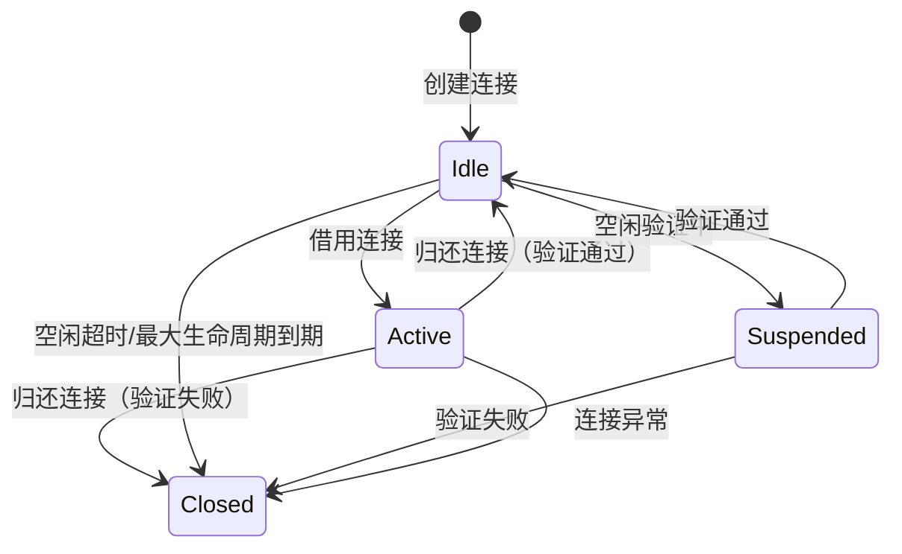
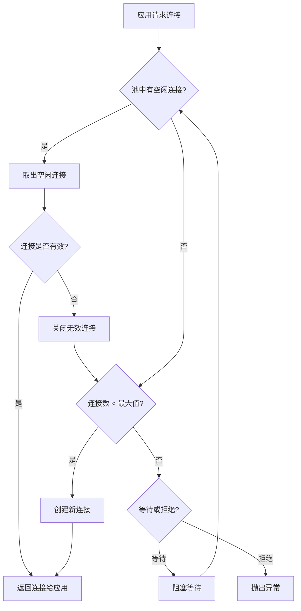
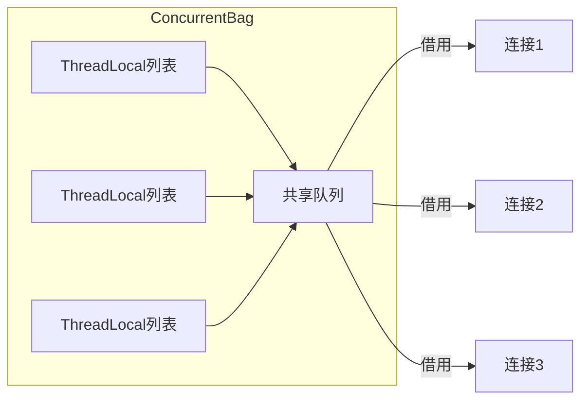
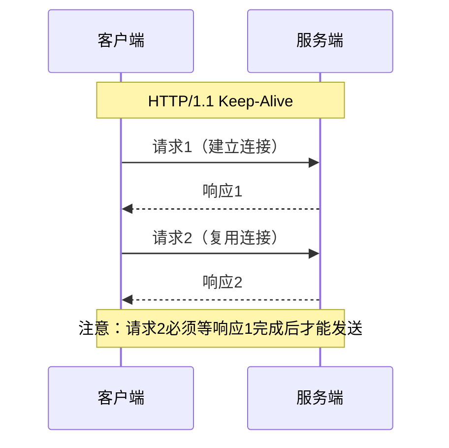
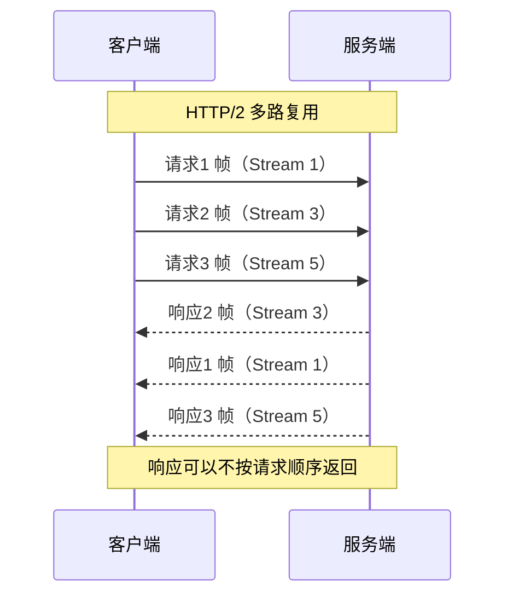
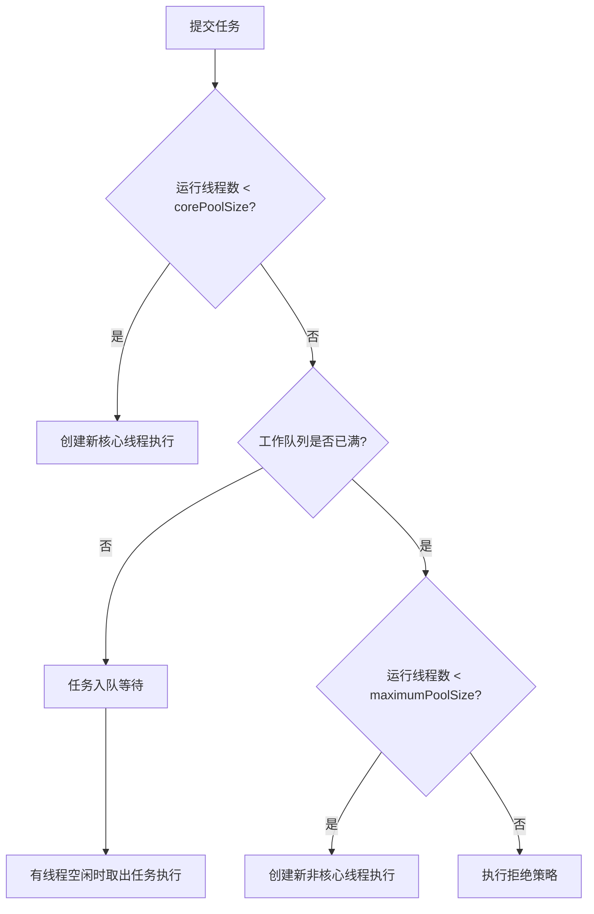
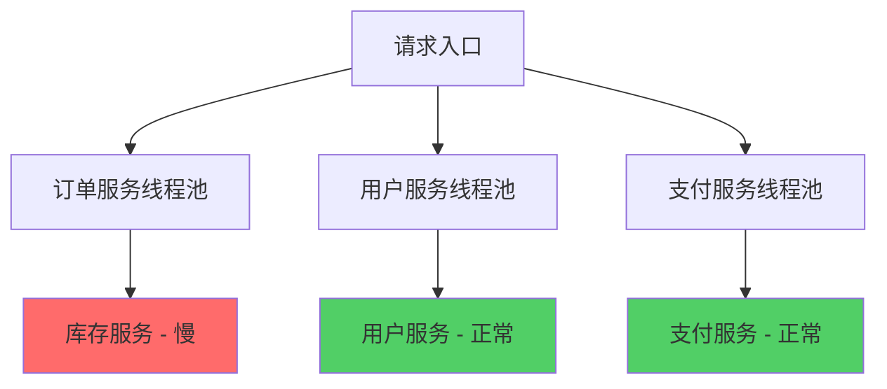

# 第49章 连接池与资源管理

## 章节定位

连接池与资源管理是高性能服务端编程的核心基础设施。数据库连接、HTTP连接、线程等系统资源的创建和销毁都有显著的开销，连接池通过复用这些资源来大幅提升系统性能。本章将深入探讨各类连接池的原理、配置和优化策略。

## 学习目标

通过本章的学习，读者将能够：

1. **理解连接池的基本原理**：掌握连接池的工作机制、核心参数和生命周期管理，理解为什么连接池能够提升系统性能。
2. **掌握数据库连接池**：深入理解HikariCP等主流数据库连接池的实现原理，能够合理配置连接池参数，处理连接泄漏和超时问题。
3. **掌握HTTP连接池**：理解HTTP keep-alive和HTTP/2多路复用的原理，能够配置高效的HTTP客户端连接池。
4. **理解线程池管理**：掌握Java线程池的工作原理和参数调优，能够根据业务场景设计合理的线程池策略。
5. **掌握资源泄漏检测**：理解资源泄漏的原因和危害，能够使用工具检测和修复资源泄漏问题。

## 章节结构

本章从连接池的基本原理出发，分别深入探讨数据库连接池、HTTP连接池、线程池和对象池的实现和优化。每个主题都包含原理分析、配置实践和常见问题处理。最后介绍资源泄漏检测的方法和工具。

## 前置知识

学习本章前，读者应具备以下基础知识：
- 操作系统基础（进程、线程、文件描述符），可参考第4章
- 网络编程基础（TCP连接、HTTP协议），可参考第18章和第19章
- 数据库基础（SQL、事务），可参考第13章

---

# 连接池与资源管理的理论基础

## 49.1 连接池的基本原理

连接池（Connection Pool）是一种用于管理可复用连接资源的技术。在没有连接池的情况下，每次需要使用连接时都需要创建新的连接，使用完毕后立即关闭。这种模式在高并发场景下会产生大量不必要的开销，因为连接的创建和销毁涉及网络握手、身份认证、内存分配等昂贵操作。

连接池的核心思想是在应用启动时预先创建一批连接，放入池中进行管理。当应用需要使用连接时，从池中借用一个空闲连接；使用完毕后，将连接归还到池中而非关闭。这样可以显著减少连接创建和销毁的次数，提高系统性能。

### 49.1.1 连接池的核心参数

一个典型的连接池包含以下核心参数：

| 参数 | 含义 | 典型值 | 说明 |
|------|------|--------|------|
| minimumIdle | 最小空闲连接数 | 5-10 | 池中始终保持的最小空闲连接数，流量低谷时至少维持这么多连接 |
| maximumPoolSize | 最大连接数 | 10-100 | 池允许的最大连接数（含活跃和空闲），达到上限时新请求被阻塞或拒绝 |
| connectionTimeout | 连接超时时间 | 30000ms | 从池中借用连接的最大等待时间，超时抛出异常 |
| idleTimeout | 空闲超时时间 | 600000ms | 空闲连接的最长存活时间，超过则关闭并移除 |
| maxLifetime | 最大生命周期 | 1800000ms | 连接在池中的最大存活时间，防止数据库端主动断开 |
| connectionTestQuery | 连接验证SQL | SELECT 1 | 借用时执行的简单查询，检查连接是否仍然有效 |
| leakDetectionThreshold | 泄漏检测阈值 | 60000ms | 连接被借用超过此时间未归还则报警 |

### 49.1.2 连接池的状态机

连接池中的连接有以下几种状态：

- **空闲状态（Idle）**：连接在池中等待被借用
- **活跃状态（Active）**：连接正在被应用使用
- **暂停状态（Suspended）**：连接正在等待验证或重置
- **关闭状态（Closed）**：连接已被关闭并从池中移除



### 49.1.3 连接池的工作流程

当应用请求一个连接时，连接池的工作流程如下：

1. 检查池中是否有空闲连接。如果有，取出一个空闲连接，验证其有效性，如果有效则返回给应用。
2. 如果池中没有空闲连接，检查当前连接数是否已达到最大值。如果未达到最大值，创建一个新连接并返回给应用。
3. 如果已达到最大值，根据配置选择等待或拒绝。如果选择等待，阻塞当前线程直到有连接归还或等待超时。如果选择拒绝，立即抛出异常。



当应用归还连接时：
1. 重置连接状态（如回滚未提交的事务）
2. 验证连接是否仍然有效
3. 如果有效，将连接放回池中
4. 如果无效，关闭连接并减少池中的连接计数

### 49.1.4 连接池的性能优势

使用连接池相比直接创建连接，在高并发场景下可以获得显著的性能提升：

| 指标 | 无连接池 | 有连接池 | 提升幅度 |
|------|----------|----------|----------|
| 连接建立耗时 | 50-200ms/次 | 0ms（复用） | 100% |
| 内存占用 | 每请求分配 | 预分配复用 | 减少30-50% |
| 数据库压力 | 频繁建连/断连 | 稳定连接数 | 显著降低 |
| 高并发吞吐量 | 受限于建连速度 | 接近理论上限 | 5-10倍 |

---

## 49.2 数据库连接池

数据库连接池是最常见的连接池类型。由于数据库连接的创建涉及TCP握手、SSL协商、身份认证等多个步骤，开销非常大，因此使用连接池尤为重要。

### 49.2.1 主流数据库连接池对比

| 特性 | HikariCP | Apache DBCP2 | Alibaba Druid | c3p0 |
|------|----------|---------------|---------------|------|
| 性能 | 极高 | 中等 | 较高 | 较低 |
| 锁机制 | ConcurrentBag无锁 | PoolEntry + 锁 | 全局锁 | synchronized |
| 连接泄漏检测 | 内置 | 需配置 | 内置 | 需配置 |
| 监控能力 | MXBean | JMX | 内置监控页面 | 基础JMX |
| SQL拦截 | 不支持 | 不支持 | 支持Filter链 | 不支持 |
| 推荐场景 | 通用高性能 | 兼容性优先 | 需要SQL审计 | 遗留系统 |

> **推荐**：新项目首选HikariCP（Spring Boot 2.x+默认集成），需要SQL审计/慢查询统计选Druid。

### 49.2.2 HikariCP原理与实现

HikariCP是目前性能最好的Java数据库连接池之一。它通过多项创新设计实现了极高的性能：

**无锁设计**：HikariCP使用ConcurrentBag数据结构来管理连接，避免了传统连接池使用的锁竞争。ConcurrentBag的核心思想是利用ThreadLocal为每个线程维护一个本地连接列表，当线程需要借用连接时，优先从本地列表中获取，减少跨线程的竞争。



**字节码优化**：HikariCP使用Javassist动态生成Connection的代理类，在编译时就完成了方法拦截的优化，而非使用传统的动态代理。这使得方法调用的开销接近于零。

**快速路径优化**：HikariCP将最常用的操作（借用和归还连接）进行了极致优化。借用连接的代码路径只有几行，几乎没有分支判断和对象分配。

```java
// HikariCP配置示例
import com.zaxxer.hikari.HikariConfig;
import com.zaxxer.hikari.HikariDataSource;

HikariConfig config = new HikariConfig();

// 基本配置
config.setJdbcUrl("jdbc:mysql://localhost:3306/mydb");
config.setUsername("root");
config.setPassword("password");

// 连接池参数
config.setMinimumIdle(5);          // 最小空闲连接数
config.setMaximumPoolSize(20);      // 最大连接数
config.setConnectionTimeout(30000); // 连接超时时间（毫秒）
config.setIdleTimeout(600000);      // 空闲超时时间（毫秒）
config.setMaxLifetime(1800000);     // 最大生命周期（毫秒）

// 连接验证
config.setConnectionTestQuery("SELECT 1");
config.setValidationTimeout(5000);

// 泄漏检测（开发环境建议开启）
config.setLeakDetectionThreshold(60000);

// 性能优化
config.addDataSourceProperty("cachePrepStmts", "true");
config.addDataSourceProperty("prepStmtCacheSize", "250");
config.addDataSourceProperty("prepStmtCacheSqlLimit", "2048");

HikariDataSource dataSource = new HikariDataSource(config);

// 使用连接（始终使用try-with-resources确保归还）
try (Connection conn = dataSource.getConnection();
     PreparedStatement stmt = conn.prepareStatement("SELECT * FROM users WHERE id = ?")) {
    stmt.setLong(1, userId);
    try (ResultSet rs = stmt.executeQuery()) {
        if (rs.next()) {
            // 处理结果
        }
    }
} // 自动归还连接到池中
```

### 49.2.3 连接池大小的计算

数据库连接池的大小并不是越大越好。过大的连接池不仅浪费数据库资源，还可能因为上下文切换和锁竞争导致性能下降。

一个经典的计算公式是：**连接池大小 = CPU核心数 × 2 + 有效磁盘数**。例如，一个4核CPU、1块SSD的服务器，推荐的连接池大小为 4 × 2 + 1 = 9。

然而，这个公式只是一个起点。实际的连接池大小应该根据应用的IO特征来调整：

| 场景 | 调整策略 | 说明 |
|------|----------|------|
| IO密集型（大量等待DB返回） | 公式值 × 2 | 线程大部分时间在等待IO，可支持更多并发连接 |
| CPU密集型（大量本地计算） | 公式值 × 0.5 | 线程主要占用CPU，过多连接导致上下文切换 |
| 混合型 | 使用公式原始值 | 根据实际压测微调 |

```python
# 连接池大小计算工具
import os
import math

def calculate_pool_size(
    cpu_cores=None,
    disk_count=1,
    io_intensity='medium',  # low, medium, high
    target_concurrency=100
):
    """
    计算推荐的连接池大小

    参数:
        cpu_cores: CPU核心数，默认使用系统检测
        disk_count: 有效磁盘数量
        io_intensity: IO密集程度
        target_concurrency: 目标并发数
    """
    if cpu_cores is None:
        cpu_cores = os.cpu_count() or 4

    # 基础公式
    base_size = cpu_cores * 2 + disk_count

    # 根据IO密集程度调整
    intensity_multiplier = {
        'low': 0.5,
        'medium': 1.0,
        'high': 2.0
    }

    adjusted_size = base_size * intensity_multiplier.get(io_intensity, 1.0)

    # 确保不超过目标并发数
    recommended_size = min(int(adjusted_size), target_concurrency)

    # 设置最小值
    recommended_size = max(recommended_size, 5)

    return {
        'recommended_size': recommended_size,
        'min_idle': max(recommended_size // 2, 2),
        'reasoning': f"CPU核心数: {cpu_cores}, 磁盘数: {disk_count}, IO强度: {io_intensity}"
    }

# 使用示例
result = calculate_pool_size(cpu_cores=8, disk_count=2, io_intensity='high')
print(f"推荐连接池大小: {result['recommended_size']}")
print(f"推荐最小空闲: {result['min_idle']}")
print(f"计算依据: {result['reasoning']}")
```

### 49.2.4 连接泄漏检测

连接泄漏是指从连接池中借用的连接没有被正确归还，导致连接池中的连接逐渐耗尽。连接泄漏是生产环境中最常见的数据库问题之一。

**泄漏的典型表现**：
- 系统运行一段时间后，数据库连接获取开始超时
- 重启应用后问题暂时消失，但过一段时间后又会出现
- 连接池监控显示活跃连接数持续增长，但没有明显的流量增长

HikariCP提供了内置的泄漏检测机制：当连接被借用超过指定时间仍未归还时，HikariCP会记录警告日志并打印借用该连接的堆栈信息，帮助开发者定位泄漏代码。

```java
// HikariCP连接泄漏检测配置
config.setLeakDetectionThreshold(60000); // 60秒未归还则报警

// 在应用代码中，始终使用try-with-resources确保连接归还
try (Connection conn = dataSource.getConnection()) {
    // 使用连接
} // 自动归还连接，即使发生异常也能保证归还
```

**泄漏修复清单**：
1. 检查所有数据库操作是否使用try-with-resources
2. 检查异常分支中连接是否被正确关闭
3. 检查事务提交/回滚后连接是否归还
4. 检查长生命周期对象（如单例Bean）中是否持有连接引用

---

## 49.3 HTTP连接池

HTTP连接池用于管理HTTP客户端的TCP连接复用。在微服务架构中，服务间的HTTP调用非常频繁，使用HTTP连接池可以显著减少TCP握手和SSL协商的开销。

### 49.3.1 HTTP Keep-Alive

HTTP/1.1默认启用keep-alive，允许在同一个TCP连接上发送多个HTTP请求，而非每个请求都创建新的TCP连接。keep-alive减少了TCP连接建立的开销，但同一连接上的请求必须按顺序处理（队头阻塞问题）。



### 49.3.2 HTTP/2多路复用

HTTP/2引入了多路复用（Multiplexing）机制，允许在同一个TCP连接上并行发送多个请求和响应，彻底解决了HTTP/1.1的队头阻塞问题。HTTP/2将请求和响应分解为帧（Frame），每个帧都有一个流ID（Stream ID），多个流的帧可以交错发送。



### 49.3.3 Java HTTP连接池配置

```java
// Apache HttpClient 5 HTTP连接池配置
import org.apache.hc.client5.http.impl.classic.CloseableHttpClient;
import org.apache.hc.client5.http.impl.classic.HttpClients;
import org.apache.hc.client5.http.impl.io.PoolingHttpClientConnectionManager;
import org.apache.hc.client5.http.impl.io.PoolingHttpClientConnectionManagerBuilder;
import org.apache.hc.core5.http.io.SocketConfig;
import org.apache.hc.core5.util.Timeout;

// 创建连接管理器
PoolingHttpClientConnectionManager connectionManager = PoolingHttpClientConnectionManagerBuilder.create()
    .setMaxConnTotal(200)           // 最大连接数
    .setMaxConnPerRoute(50)         // 每个路由的最大连接数
    .setDefaultSocketConfig(SocketConfig.custom()
        .setSoTimeout(Timeout.ofSeconds(30))
        .build())
    .build();

// 创建HTTP客户端
CloseableHttpClient httpClient = HttpClients.custom()
    .setConnectionManager(connectionManager)
    .build();
```

### 49.3.4 Python HTTP连接池配置

```python
# Python requests库的连接池配置
import requests
from requests.adapters import HTTPAdapter
from urllib3.util.retry import Retry

# 创建会话
session = requests.Session()

# 配置重试策略
retry_strategy = Retry(
    total=3,
    backoff_factor=1,
    status_forcelist=[429, 500, 502, 503, 504],
    allowed_methods=["HEAD", "GET", "OPTIONS"]
)

# 配置HTTP适配器（连接池）
adapter = HTTPAdapter(
    pool_connections=10,    # 连接池数量（每个主机）
    pool_maxsize=100,       # 连接池最大连接数
    max_retries=retry_strategy
)

session.mount("http://", adapter)
session.mount("https://", adapter)

# 使用会话发送请求（自动复用连接）
response = session.get("https://api.example.com/data")
```

### 49.3.5 Go HTTP连接池配置

```go
// Go HTTP客户端连接池配置
import (
    "crypto/tls"
    "net"
    "net/http"
    "time"
)

func createHTTPClient() *http.Client {
    transport := &amp;http.Transport{
        DialContext: (&amp;net.Dialer{
            Timeout:   30 * time.Second,
            KeepAlive: 30 * time.Second,
        }).DialContext,
        MaxIdleConns:          100,      // 最大空闲连接数
        MaxIdleConnsPerHost:   20,       // 每个主机的最大空闲连接数
        MaxConnsPerHost:       50,       // 每个主机的最大连接数
        IdleConnTimeout:       90 * time.Second,  // 空闲连接超时
        TLSHandshakeTimeout:  10 * time.Second,   // TLS握手超时
        ExpectContinueTimeout: 1 * time.Second,
        TLSClientConfig: &amp;tls.Config{
            MinVersion: tls.VersionTLS12,
        },
    }

    return &amp;http.Client{
        Transport: transport,
        Timeout:   30 * time.Second,
    }
}
```

### 49.3.6 HTTP连接池调优要点

- **每个目标主机的连接数**：设置为目标主机并发处理能力的1-2倍
- **总连接数**：设置为所有目标主机连接数之和
- **连接超时**：根据SLA设置，通常3-10秒
- **读取超时**：根据最慢接口的响应时间设置
- **空闲连接回收**：设置合理的空闲超时，避免持有过多空闲连接
- **健康检查**：定期检查连接可用性，及时移除失效连接

---

## 49.4 线程池管理

线程池是一种用于管理和复用线程的机制。与连接池类似，线程池通过预先创建一批线程来避免频繁创建和销毁线程的开销。

### 49.4.1 Java线程池的工作原理

Java的ThreadPoolExecutor是线程池的核心实现。当提交一个任务时，线程池的处理流程如下：



**核心参数说明**：

| 参数 | 含义 | 调优建议 |
|------|------|----------|
| corePoolSize | 核心线程数 | CPU密集型=CPU核心数+1，IO密集型=CPU核心数×(1+IO等待/CPU计算) |
| maximumPoolSize | 最大线程数 | 核心线程数的2-4倍，不宜过大 |
| keepAliveTime | 空闲线程存活时间 | 非核心线程空闲多久后回收，通常30-60秒 |
| workQueue | 工作队列 | 有界队列（如LinkedBlockingQueue）防止OOM |
| rejectedHandler | 拒绝策略 | CallerRunsPolicy（调用者执行）或AbortPolicy（抛异常） |

```java
// Java线程池配置
import java.util.concurrent.*;

// 创建线程池（推荐使用构造函数显式指定所有参数）
ThreadPoolExecutor executor = new ThreadPoolExecutor(
    10,                         // 核心线程数
    50,                         // 最大线程数
    60L,                        // 空闲线程存活时间
    TimeUnit.SECONDS,           // 时间单位
    new LinkedBlockingQueue<>(1000),  // 有界工作队列，防止OOM
    new ThreadPoolExecutor.CallerRunsPolicy()  // 拒绝策略：调用者执行
);

// 提交任务
executor.submit(() -> {
    processRequest();
});

// 优雅关闭
executor.shutdown();
try {
    if (!executor.awaitTermination(60, TimeUnit.SECONDS)) {
        executor.shutdownNow();
    }
} catch (InterruptedException e) {
    executor.shutdownNow();
}
```

### 49.4.2 线程池参数调优

线程池参数的调优需要根据任务的特征来决定：

**CPU密集型任务**：线程数应该接近CPU核心数，过多的线程会导致上下文切换开销。推荐公式：线程数 = CPU核心数 + 1。

**IO密集型任务**：线程数可以大于CPU核心数，因为线程在等待IO时不会占用CPU。推荐公式：线程数 = CPU核心数 × (1 + IO等待时间/CPU计算时间)。

**混合型任务**：可以将CPU密集型和IO密集型任务分别提交到不同的线程池，为每种类型的任务配置不同的参数。

```python
# Python线程池配置
from concurrent.futures import ThreadPoolExecutor
import os

# 根据任务类型计算线程数
def calculate_thread_count(task_type='mixed', io_ratio=0.5):
    cpu_count = os.cpu_count() or 4

    if task_type == 'cpu':
        return cpu_count + 1
    elif task_type == 'io':
        return int(cpu_count * (1 + io_ratio))
    else:  # mixed
        return int(cpu_count * (1 + io_ratio / 2))

# 创建线程池
io_thread_count = calculate_thread_count('io', io_ratio=2.0)
io_executor = ThreadPoolExecutor(max_workers=io_thread_count)

cpu_thread_count = calculate_thread_count('cpu')
cpu_executor = ThreadPoolExecutor(max_workers=cpu_thread_count)

# 使用线程池
import concurrent.futures

def fetch_url(url):
    import requests
    return requests.get(url).text

urls = ['https://api.example.com/data1', 'https://api.example.com/data2']
results = list(io_executor.map(fetch_url, urls))
```

### 49.4.3 动态线程池

在业务流量波动较大的场景下，固定大小的线程池可能无法满足需求。动态线程池可以根据当前负载自动调整线程数，在流量高峰时增加线程，流量低谷时减少线程。

```java
// 动态线程池实现
public class DynamicThreadPool {
    private final ThreadPoolExecutor executor;
    private final ScheduledExecutorService adjuster;

    public DynamicThreadPool(int coreSize, int maxSize) {
        this.executor = new ThreadPoolExecutor(
            coreSize, maxSize, 60L, TimeUnit.SECONDS,
            new LinkedBlockingQueue<>(1000)
        );

        // 定期调整线程池大小
        this.adjuster = Executors.newSingleThreadScheduledExecutor();
        this.adjuster.scheduleAtFixedRate(this::adjustPoolSize, 10, 10, TimeUnit.SECONDS);
    }

    private void adjustPoolSize() {
        int activeCount = executor.getActiveCount();
        int poolSize = executor.getPoolSize();
        int queueSize = executor.getQueue().size();

        // 如果队列积压且线程数未达上限，增加线程
        if (queueSize > 100 &amp;&amp; poolSize < executor.getMaximumPoolSize()) {
            executor.setCorePoolSize(Math.min(poolSize + 5, executor.getMaximumPoolSize()));
        }

        // 如果线程空闲较多，减少线程
        if (activeCount < poolSize * 0.3 &amp;&amp; poolSize > executor.getCorePoolSize()) {
            executor.setCorePoolSize(Math.max(poolSize - 5, 10));
        }
    }
}
```

### 49.4.4 线程池的优雅关闭

线程池的关闭需要考虑正在执行的任务和队列中等待的任务。`shutdown()`方法会等待所有任务完成，`shutdownNow()`方法会尝试中断正在执行的任务。在实际应用中，通常先调用`shutdown()`，等待一段时间后如果仍有任务未完成再调用`shutdownNow()`。

---

## 49.5 对象池

对象池是一种通用的资源池化模式，适用于任何创建成本较高的对象。除了连接和线程，对象池还可以用于管理数据库游标、缓冲区、大型数据结构等。

### 49.5.1 对象池的实现

一个简单的对象池实现需要包含以下功能：对象的创建和初始化、对象的借用和归还、对象的验证和重置、池的大小管理（最小、最大、空闲超时）。

```java
// 通用对象池实现
public class ObjectPool<T> {
    private final Supplier<T> factory;
    private final Consumer<T> validator;
    private final Consumer<T> resetter;
    private final BlockingQueue<T> pool;
    private final AtomicInteger totalObjects = new AtomicInteger(0);
    private final int maxSize;

    public ObjectPool(Supplier<T> factory, Consumer<T> validator,
                      Consumer<T> resetter, int minSize, int maxSize) {
        this.factory = factory;
        this.validator = validator;
        this.resetter = resetter;
        this.maxSize = maxSize;
        this.pool = new LinkedBlockingQueue<>(maxSize);

        // 初始化最小对象数
        for (int i = 0; i < minSize; i++) {
            pool.offer(factory.get());
            totalObjects.incrementAndGet();
        }
    }

    public T borrow() throws Exception {
        T obj = pool.poll();
        if (obj != null) {
            if (isValid(obj)) {
                return obj;
            }
            totalObjects.decrementAndGet();
        }

        if (totalObjects.get() < maxSize) {
            totalObjects.incrementAndGet();
            return factory.get();
        }

        throw new Exception("Pool exhausted");
    }

    public void returnObject(T obj) {
        if (obj == null) return;
        resetter.accept(obj);
        if (!pool.offer(obj)) {
            totalObjects.decrementAndGet();
        }
    }

    private boolean isValid(T obj) {
        try {
            validator.accept(obj);
            return true;
        } catch (Exception e) {
            return false;
        }
    }
}
```

---

## 49.6 资源泄漏检测

资源泄漏是指程序在使用资源后未能正确释放，导致资源逐渐耗尽。常见的资源泄漏包括：数据库连接未关闭、文件句柄未关闭、网络连接未关闭、内存未释放。

### 49.6.1 Java资源泄漏检测

Java中可以使用以下工具和方法检测资源泄漏：

- **try-with-resources语句**：确保资源自动关闭，即使发生异常也能保证归还
- **LeakCanary**：检测内存泄漏（主要用于Android，但原理通用）
- **JVM参数-XX:+HeapDumpOnOutOfMemoryError**：在内存溢出时生成堆转储
- **VisualVM或JProfiler**：分析堆转储，查找未释放的资源对象
- **SpotBugs静态分析**：在编译期检测潜在的资源泄漏模式

```java
// Java资源管理最佳实践
// 正确：try-with-resources自动关闭
try (Connection conn = dataSource.getConnection();
     PreparedStatement stmt = conn.prepareStatement("SELECT * FROM users");
     ResultSet rs = stmt.executeQuery()) {
    while (rs.next()) {
        // 处理结果
    }
} // 自动按逆序关闭 ResultSet -> PreparedStatement -> Connection

// 错误：手动管理容易遗漏
Connection conn = null;
PreparedStatement stmt = null;
try {
    conn = dataSource.getConnection();
    stmt = conn.prepareStatement("SELECT * FROM users");
    // 如果这里抛出异常，conn和stmt可能不会关闭
    ResultSet rs = stmt.executeQuery();
} finally {
    if (stmt != null) stmt.close();
    if (conn != null) conn.close();
}
```

### 49.6.2 Python资源泄漏检测

Python中可以使用以下方法检测和预防资源泄漏：

- **context manager（with语句）**：确保资源自动关闭
- **gc模块**：检查垃圾回收情况
- **tracemalloc模块**：追踪内存分配
- **objgraph库**：生成对象引用图，查找循环引用

```python
# Python资源管理最佳实践
from contextlib import contextmanager

@contextmanager
def managed_connection(pool):
    """自定义上下文管理器"""
    conn = pool.get_connection()
    try:
        yield conn
    except Exception as e:
        conn.rollback()
        raise
    finally:
        conn.close()

# 使用示例
with managed_connection(pool) as conn:
    cursor = conn.cursor()
    try:
        cursor.execute("SELECT * FROM users")
        results = cursor.fetchall()
    finally:
        cursor.close()

# 使用tracemalloc追踪内存泄漏
import tracemalloc
tracemalloc.start()

# ... 执行业务代码 ...

snapshot = tracemalloc.take_snapshot()
top_stats = snapshot.statistics('lineno')
for stat in top_stats[:10]:
    print(stat)
```

### 49.6.3 运行时泄漏检测

在生产环境中，可以通过以下方式持续监控资源泄漏：

- **连接池活跃连接数趋势**：如果持续增长可能存在泄漏
- **文件描述符使用量**：通过`lsof -p <pid> | wc -l`监控，持续增长则可能有文件泄漏
- **JVM的MXBean监控**：监控打开的连接和文件句柄数量
- **定期堆转储分析**：使用MAT（Memory Analyzer Tool）分析未释放的资源对象
- **Prometheus + Grafana可视化**：将连接池指标采集到监控系统，设置增长趋势告警

---

# 连接池与资源管理的核心技巧

## 49.7 数据库连接池的配置最佳实践

### 49.7.1 根据业务特征调整参数

不同业务场景对连接池的需求差异很大：

| 业务场景 | 连接池大小 | 超时时间 | 验证策略 | 说明 |
|----------|-----------|----------|----------|------|
| 在线交易（OLTP） | 中等 | 3-5秒 | 借出时验证 | 低延迟优先 |
| 批量处理 | 较小 | 30-60秒 | 空闲验证 | 长时间占用连接 |
| 报表查询 | 中等 | 10-30秒 | 空闲验证 | 可能有复杂查询 |
| 读写分离-写库 | 小 | 3-5秒 | 空闲验证 | 写操作较少 |
| 读写分离-读库 | 大 | 5-10秒 | 空闲验证 | 读操作较多 |

```java
// 读写分离的连接池配置
// 写库连接池
HikariConfig writeConfig = new HikariConfig();
writeConfig.setJdbcUrl("jdbc:mysql://master:3306/mydb");
writeConfig.setMaximumPoolSize(10);
writeConfig.setMinimumIdle(5);
writeConfig.setConnectionTimeout(3000);
writeConfig.setKeepaliveTime(30000);

// 读库连接池
HikariConfig readConfig = new HikariConfig();
readConfig.setJdbcUrl("jdbc:mysql://slave:3306/mydb");
readConfig.setMaximumPoolSize(30);
readConfig.setMinimumIdle(10);
readConfig.setConnectionTimeout(5000);
readConfig.setKeepaliveTime(30000);
```

### 49.7.2 连接验证策略

连接验证是确保从池中获取的连接仍然有效的关键机制：

| 验证策略 | 时机 | 优点 | 缺点 | 推荐场景 |
|----------|------|------|------|----------|
| testOnBorrow | 借用时 | 最安全 | 增加每次请求延迟 | 可靠性要求极高 |
| testOnReturn | 归还时 | 及时发现失效 | 无法防止借出失效连接 | 辅助验证 |
| testWhileIdle | 空闲时 | 安全性与性能平衡 | 可能在借出瞬间失效 | **推荐默认使用** |

```java
// HikariCP的连接验证配置
// HikariCP默认使用testWhileIdle策略
config.setKeepaliveTime(30000);      // 空闲连接验证间隔（30秒）
config.setValidationTimeout(5000);   // 验证超时时间
```

### 49.7.3 连接池监控

监控连接池的状态对于及时发现和解决问题至关重要。

**关键监控指标**：

| 指标 | 告警阈值建议 | 说明 |
|------|-------------|------|
| activeConnections | > maxPoolSize * 0.8 | 活跃连接数接近上限 |
| idleConnections | < minIdle | 空闲连接不足 |
| threadsAwaitingConnection | > 0 持续5分钟 | 有线程在等待连接 |
| connectionWaitTime | > connectionTimeout * 0.8 | 等待时间过长 |
| connectionCreationTime | > 1000ms | 新建连接耗时异常 |

```java
// HikariCP连接池监控
HikariPoolMXBean poolMXBean = dataSource.getHikariPoolMXBean();

// 定期采集指标
ScheduledExecutorService scheduler = Executors.newScheduledThreadPool(1);
scheduler.scheduleAtFixedRate(() -> {
    int active = poolMXBean.getActiveConnections();
    int idle = poolMXBean.getIdleConnections();
    int total = poolMXBean.getTotalConnections();
    int waiting = poolMXBean.getThreadsAwaitingConnection();

    log.info("连接池状态 - 活跃: {}, 空闲: {}, 总计: {}, 等待: {}",
             active, idle, total, waiting);

    // 告警逻辑
    if (waiting > 10) {
        log.warn("连接池等待线程过多: {}", waiting);
    }
    if (active > total * 0.9) {
        log.warn("连接池使用率过高: {}/{}", active, total);
    }
}, 0, 10, TimeUnit.SECONDS);
```

---

## 49.8 线程池的高级配置

### 49.8.1 微服务架构中的线程池隔离

在微服务架构中，一个应用通常会调用多个下游服务。如果所有下游调用共享同一个线程池，当某个下游服务出现故障时，会耗尽整个线程池，导致所有服务都不可用。线程池隔离是解决这个问题的关键技术。



```java
@Configuration
public class ThreadPoolConfig {

    @Bean("orderServiceExecutor")
    public ThreadPoolExecutor orderServiceExecutor() {
        return new ThreadPoolExecutor(
            10, 30, 60L, TimeUnit.SECONDS,
            new LinkedBlockingQueue<>(200),
            new ThreadPoolExecutor.AbortPolicy()
        );
    }

    @Bean("paymentServiceExecutor")
    public ThreadPoolExecutor paymentServiceExecutor() {
        return new ThreadPoolExecutor(
            10, 30, 60L, TimeUnit.SECONDS,
            new LinkedBlockingQueue<>(200),
            new ThreadPoolExecutor.AbortPolicy()
        );
    }
}
```

**为什么要分离线程池？**
- 隔离故障：订单服务超时不会影响支付服务
- 独立调优：不同服务有不同的性能特征
- 独立监控：可以分别监控每个下游服务的调用情况
- 避免级联故障：一个服务的线程池满了不会影响其他服务

### 49.8.2 拒绝策略的选择

| 拒绝策略 | 行为 | 适用场景 |
|----------|------|----------|
| AbortPolicy | 抛出RejectedExecutionException | 默认策略，调用方需要感知拒绝 |
| CallerRunsPolicy | 由提交任务的线程执行 | 需要任务不丢失，可接受降速 |
| DiscardPolicy | 静默丢弃任务 | 可容忍丢失的场景（如日志采集） |
| DiscardOldestPolicy | 丢弃队列中最老的任务 | 实时性要求高，旧数据无价值 |

---

# 连接池与资源管理实战案例

## 49.9 案例一：电商平台数据库连接池优化

某电商平台在大促期间频繁出现数据库连接超时的问题，经排查发现是连接池配置不当导致的。

### 49.9.1 问题现象

大促期间，系统出现以下症状：
- 数据库连接获取超时频繁发生
- 部分请求响应时间突增到数十秒
- 数据库服务器的连接数接近上限
- 应用服务器的线程大量阻塞在等待连接上

### 49.9.2 问题分析

通过分析连接池监控数据和数据库慢查询日志，发现了以下问题：

1. **连接池大小设置过小**。应用服务器配置了16核CPU，但连接池大小只有20，无法满足高峰期的并发需求。同时，部分慢查询（超过10秒）长时间占用连接，进一步加剧了连接不足的问题。
2. **连接泄漏**。代码审查发现部分接口在异常情况下没有正确关闭连接，导致连接泄漏。经过数小时的运行，连接池中的可用连接逐渐减少。
3. **连接验证配置不当**。连接池没有配置空闲连接验证，导致部分长时间空闲的连接因数据库端超时而失效，但池中仍将其视为有效连接。

### 49.9.3 优化方案

**第一步：调整连接池大小**。根据服务器配置和业务特征，将连接池大小调整为50，最小空闲连接数设置为20。

**第二步：修复连接泄漏**。使用HikariCP的泄漏检测功能定位泄漏代码，将所有数据库操作都改为try-with-resources方式。

**第三步：优化连接验证**。配置空闲连接验证间隔为30秒，确保失效的连接能被及时发现和替换。

**第四步：优化慢查询**。对大促期间的高频查询添加索引，将慢查询的执行时间从10秒以上优化到1秒以内。

```java
// 优化后的HikariCP配置
HikariConfig config = new HikariConfig();
config.setJdbcUrl("jdbc:mysql://master:3306/mydb?useSSL=false&amp;serverTimezone=UTC");
config.setUsername("app_user");
config.setPassword("secure_password");

// 调整后的连接池参数
config.setMaximumPoolSize(50);
config.setMinimumIdle(20);
config.setConnectionTimeout(5000);     // 5秒超时
config.setIdleTimeout(600000);         // 10分钟空闲回收
config.setMaxLifetime(1800000);        // 30分钟最大生命周期
config.setKeepaliveTime(30000);        // 30秒空闲验证
config.setLeakDetectionThreshold(60000); // 60秒泄漏检测

HikariDataSource dataSource = new HikariDataSource(config);
```

### 49.9.4 实施效果

优化后，数据库连接超时问题完全消除，系统在大促期间的可用性从99%提升到99.99%。连接池的平均获取时间从50ms降低到5ms，P99延迟从200ms降低到20ms。

---

## 49.10 案例二：微服务架构中的线程池隔离

某微服务系统在某个下游服务出现故障时，导致整个系统不可用。

### 49.10.1 问题现象

库存服务偶尔出现响应超时（5-10秒），导致调用库存服务的订单服务线程全部阻塞。由于订单服务和支付服务共享同一个线程池，支付服务也无法获得线程执行，最终导致整个系统不可用。

### 49.10.2 优化方案

为每个下游服务创建独立的线程池，实现故障隔离。即使库存服务超时，也只会影响订单服务的部分线程，不会影响支付服务。

```java
@Configuration
public class ThreadPoolConfig {

    @Bean("inventoryServiceExecutor")
    public ThreadPoolExecutor inventoryServiceExecutor() {
        return new ThreadPoolExecutor(
            10, 30, 60L, TimeUnit.SECONDS,
            new LinkedBlockingQueue<>(200),
            new ThreadPoolExecutor.AbortPolicy()
        );
    }

    @Bean("orderServiceExecutor")
    public ThreadPoolExecutor orderServiceExecutor() {
        return new ThreadPoolExecutor(
            10, 30, 60L, TimeUnit.SECONDS,
            new LinkedBlockingQueue<>(200),
            new ThreadPoolExecutor.AbortPolicy()
        );
    }

    @Bean("paymentServiceExecutor")
    public ThreadPoolExecutor paymentServiceExecutor() {
        return new ThreadPoolExecutor(
            10, 30, 60L, TimeUnit.SECONDS,
            new LinkedBlockingQueue<>(200),
            new ThreadPoolExecutor.AbortPolicy()
        );
    }
}
```

### 49.10.3 实施效果

优化后，系统的容错能力显著提升。单个下游服务的问题不再影响其他服务，系统在流量高峰期的可用性从95%提升到99.9%。

---

# 连接池与资源管理的常见误区

## 误区一：连接池越大越好

许多开发者认为增大连接池大小可以提升系统性能，但事实并非如此。过大的连接池会带来以下问题：

- **数据库连接数有限**。每个数据库连接都会消耗数据库服务器的内存和CPU资源。当连接数超过数据库的处理能力时，数据库性能反而会下降。MySQL的默认最大连接数是151，PostgreSQL的默认最大连接数是100。
- **上下文切换开销**。当并发线程数远超CPU核心数时，操作系统需要频繁进行线程上下文切换，这会消耗大量CPU资源。
- **内存浪费**。每个数据库连接都需要维护缓冲区和状态信息，过多的空闲连接会浪费应用服务器的内存。

**正确的做法**：根据业务特征和服务器配置计算合理的连接池大小，而非盲目增大。

## 误区二：忽视连接泄漏检测

连接泄漏是生产环境中最常见的数据库问题之一，但许多团队在开发阶段忽视了连接泄漏的检测。连接泄漏的典型表现是：系统运行一段时间后，数据库连接获取开始超时；重启应用后问题暂时消失，但过一段时间后又会出现。

**正确的做法**：在开发和测试环境中开启HikariCP的泄漏检测机制，通过设置`leakDetectionThreshold`参数，当连接被借用超过指定时间仍未归还时，连接池会记录警告日志并打印借用该连接的堆栈信息。

## 误区三：使用默认的线程池配置

Java的Executors工具类提供了几个便捷的线程池创建方法，但这些默认配置在生产环境中往往不合适：

- `newFixedThreadPool`使用无界的LinkedBlockingQueue，当任务提交速度超过处理速度时，队列会无限增长，最终导致内存溢出
- `newCachedThreadPool`的线程数没有上限，在高并发场景下可能创建大量线程，导致系统资源耗尽

**正确的做法**：使用ThreadPoolExecutor构造函数显式指定所有参数，包括核心线程数、最大线程数、队列大小和拒绝策略。

## 误区四：不区分IO密集型和CPU密集型任务

许多开发者为所有类型的任务使用同一个线程池，没有根据任务特征进行区分。IO密集型任务（如网络请求、数据库查询）在等待IO时不会占用CPU，可以使用较多的线程；CPU密集型任务（如计算、数据处理）需要占用CPU，过多的线程会导致上下文切换开销。

**正确的做法**：为不同类型的任务创建不同的线程池，根据任务特征配置合适的线程数。

## 误区五：忽视连接池的监控

许多团队在部署应用后忽视了连接池的监控，直到出现问题才去排查。

**正确的做法**：在应用部署时就配置连接池的监控，设置合理的告警规则。关键监控指标包括活跃连接数、空闲连接数、等待获取连接的线程数、连接获取的平均耗时、连接超时的次数。

## 误区六：在网络异常时不重建连接池

当发生网络故障或数据库重启时，连接池中的所有连接都会失效。如果连接池没有正确处理这种情况，应用可能长时间无法正常工作。

**正确的做法**：在检测到网络恢复后，清除连接池中的所有失效连接，重新创建新的连接。HikariCP等现代连接池会自动处理这种情况，通过连接验证机制发现并替换失效连接。

## 误区七：手动管理资源而不使用上下文管理器

许多开发者习惯手动管理资源（如连接、文件句柄），在获取资源后编写try-finally块来确保资源释放。这种方式容易出错，特别是在异常处理不当时可能导致资源泄漏。

**正确的做法**：始终使用上下文管理器机制（Java的try-with-resources、Python的with语句）来管理资源，确保资源在任何情况下都能被正确释放。

---

# 连接池与资源管理的练习方法

## 练习一：实现简单的连接池

**目标**：通过实现一个简单的连接池，深入理解连接池的工作原理。

**步骤**：
1. 定义连接接口，包含获取、归还、验证和关闭方法
2. 实现连接池的核心数据结构，使用BlockingQueue管理空闲连接
3. 实现连接的借用和归还逻辑，包括连接验证和超时处理
4. 实现连接泄漏检测机制，当连接被借用超过指定时间未归还时记录警告
5. 编写测试用例验证连接池的正确性，包括并发借用、连接超时和泄漏检测

```java
// 简单连接池实现框架
public class SimpleConnectionPool<T> {
    private final BlockingQueue<T> idleConnections;
    private final Set<T> activeConnections = ConcurrentHashMap.newKeySet();
    private final Supplier<T> connectionFactory;
    private final Predicate<T> connectionValidator;
    private final int maxSize;

    public T borrowConnection(long timeout, TimeUnit unit) throws Exception {
        T conn = idleConnections.poll(timeout, unit);
        if (conn == null) {
            throw new TimeoutException("Failed to get connection within " + timeout + " " + unit);
        }
        if (!connectionValidator.test(conn)) {
            // 连接无效，尝试创建新连接
            conn = connectionFactory.get();
        }
        activeConnections.add(conn);
        return conn;
    }

    public void returnConnection(T conn) {
        activeConnections.remove(conn);
        if (connectionValidator.test(conn)) {
            idleConnections.offer(conn);
        }
        // 无效连接直接丢弃
    }
}
```

## 练习二：连接池性能对比测试

**目标**：通过实际测试对比不同连接池的性能特征。

**步骤**：
1. 搭建测试环境，配置HikariCP、DBCP2和Druid三种连接池
2. 设计并发测试场景，模拟不同数量的并发线程同时借用和归还连接
3. 测量每种连接池在不同并发度下的吞吐量和延迟
4. 绘制性能对比图表，分析各连接池的性能特点

## 练习三：线程池参数调优实验

**目标**：理解线程池参数对性能的影响。

**步骤**：
1. 设计CPU密集型任务（如计算斐波那契数列）和IO密集型任务（如HTTP请求）
2. 为每种任务创建不同配置的线程池，改变核心线程数和最大线程数
3. 测量不同配置下的任务完成时间和吞吐量
4. 绘制线程数与性能的关系曲线，找到最优的线程数配置

```python
import concurrent.futures
import time
import os

def cpu_intensive_task(n):
    """CPU密集型任务：计算斐波那契数列"""
    if n <= 1:
        return n
    a, b = 0, 1
    for _ in range(2, n + 1):
        a, b = b, a + b
    return b

def io_intensive_task(url):
    """IO密集型任务：HTTP请求"""
    import requests
    response = requests.get(url)
    return len(response.content)

def benchmark_thread_pool(task_func, task_args, max_workers_list):
    """基准测试不同线程池配置"""
    results = {}
    for workers in max_workers_list:
        start = time.time()
        with concurrent.futures.ThreadPoolExecutor(max_workers=workers) as executor:
            list(executor.map(task_func, task_args))
        elapsed = time.time() - start
        results[workers] = elapsed
        print(f"Workers: {workers}, Time: {elapsed:.2f}s")
    return results

# 测试CPU密集型任务
cpu_workers = [1, 2, 4, 8, 16, 32]
cpu_args = [1000000] * 100
cpu_results = benchmark_thread_pool(cpu_intensive_task, cpu_args, cpu_workers)
```

## 练习四：资源泄漏检测

**目标**：掌握资源泄漏的检测和修复方法。

**步骤**：
1. 编写一个故意包含资源泄漏的程序（如未关闭的数据库连接、未关闭的文件句柄）
2. 使用各种工具检测泄漏：Java中使用HikariCP的泄漏检测、JProfiler的内存分析；Python中使用tracemalloc、objgraph
3. 修复检测到的泄漏，验证修复的有效性
4. 总结资源泄漏的常见模式和预防方法

## 练习五：HTTP连接池优化

**目标**：理解HTTP连接池的配置和优化。

**步骤**：
1. 使用Apache HttpClient或OkHttp创建HTTP客户端，配置连接池参数
2. 测试不同连接池大小对HTTP请求性能的影响
3. 测试keep-alive和HTTP/2多路复用对性能的影响
4. 模拟网络故障场景，测试连接池的恢复能力

## 练习六：对象池实现

**目标**：理解对象池的通用设计模式。

**步骤**：
1. 实现一个通用的对象池，支持自定义的对象创建、验证和重置逻辑
2. 实现池的大小管理（最小、最大、空闲超时）
3. 实现对象的借用和归还，包括超时处理和阻塞等待
4. 使用对象池管理缓冲区对象，测试其对性能的提升效果

## 项目实践建议

建议读者选择一个实际的项目场景（如Web应用、微服务系统），综合运用本章学到的连接池和资源管理技术。重点关注以下方面：
- 连接池参数是否根据业务特征合理配置
- 资源泄漏检测是否完善
- 监控告警是否到位
- 故障恢复机制是否健壮

---

# 本章小结

## 核心知识点回顾

本章系统地介绍了连接池与资源管理的理论体系和实践方法，涵盖了数据库连接池、HTTP连接池、线程池和对象池等核心技术。

### 连接池的基本原理

连接池通过预先创建和复用连接资源，避免了频繁创建和销毁连接的开销。连接池的核心参数包括最小连接数、最大连接数、连接超时时间、空闲超时时间和最大生命周期。连接池中的连接有空闲、活跃、暂停和关闭四种状态，通过状态机管理连接的生命周期。

### 数据库连接池的最佳实践

HikariCP是目前性能最好的Java数据库连接池，其核心优化包括无锁设计（ConcurrentBag）、字节码优化和快速路径优化。数据库连接池的大小应根据CPU核心数、磁盘数和IO特征计算，而非盲目增大。连接泄漏是生产环境中最常见的数据库问题，应通过try-with-resources和泄漏检测机制来预防。

### HTTP连接池与多路复用

HTTP/1.1的keep-alive允许在同一个TCP连接上发送多个请求，但仍存在队头阻塞问题。HTTP/2引入了多路复用机制，允许在同一个连接上并行发送多个请求和响应，彻底解决了队头阻塞问题。在微服务架构中，应为HTTP客户端配置合理的连接池参数。

### 线程池管理

Java的ThreadPoolExecutor是线程池的核心实现，其参数包括核心线程数、最大线程数、工作队列和拒绝策略。线程池参数应根据任务特征调优：CPU密集型任务的线程数应接近CPU核心数，IO密集型任务的线程数可以大于CPU核心数。应避免使用Executors的默认配置，显式指定所有参数。微服务架构中应为不同下游调用创建独立线程池，实现故障隔离。

### 对象池与资源泄漏检测

对象池是一种通用的资源池化模式，适用于任何创建成本较高的对象。资源泄漏是指程序在使用资源后未能正确释放，导致资源逐渐耗尽。现代编程语言提供了上下文管理器机制（try-with-resources、with语句），应始终使用这些机制来管理资源。

## 关键技术决策

在实际项目中配置连接池时，应遵循以下原则：
1. 根据业务特征计算连接池大小，而非使用默认值
2. 为读库和写库分别配置连接池
3. 开启连接泄漏检测，在开发阶段发现并修复泄漏
4. 配置连接池监控，设置合理的告警规则
5. 为不同类型的任务创建不同的线程池
6. 使用上下文管理器（try-with-resources / with语句）管理所有资源
7. 线程池使用有界队列，避免OOM

## 实践建议

连接池和资源管理是系统稳定运行的基础设施，应该在项目初期就建立完善的配置和监控体系。定期审查连接池的使用情况，根据业务变化调整参数。在生产环境中，连接池的问题往往在高并发或故障时才暴露，因此应该在测试环境中模拟这些场景，提前发现和解决问题。
