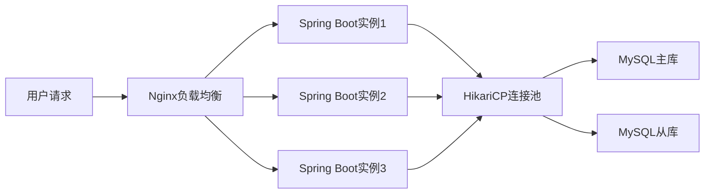
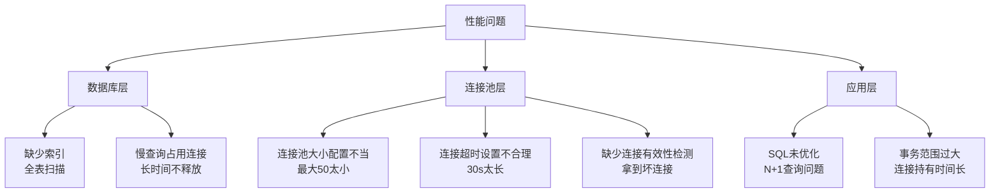
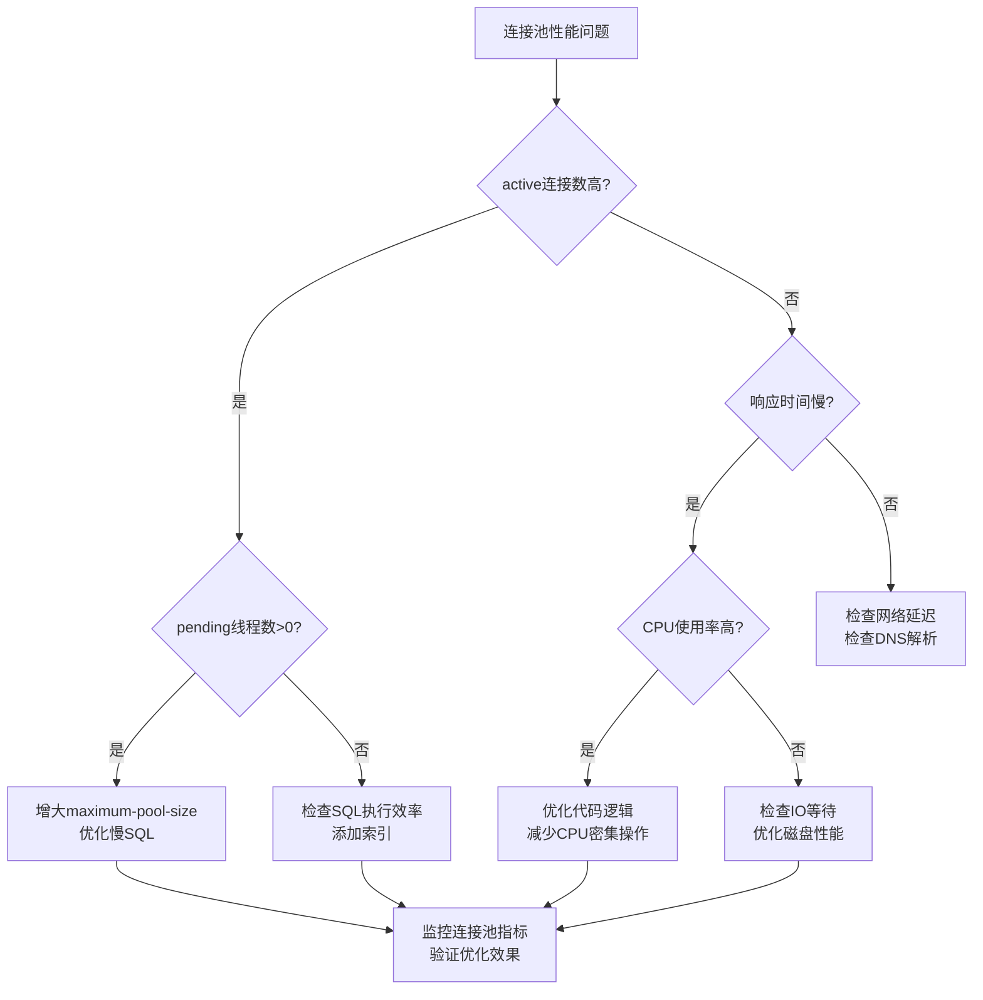

## 案例一：HikariCP连接池实战调优

### 1. 案例背景与问题描述

#### 1.1 业务场景

某电商平台采用Spring Boot + MyBatis技术栈，日活用户约200万，峰值QPS达到8000。在一次大促预热活动中，系统出现了严重的性能退化问题。

**系统架构概览：**



#### 1.2 问题现象

| 指标 | 正常值 | 异常值 | 劣化幅度 |
|------|--------|--------|----------|
| 接口平均响应时间 | 45ms | 520ms | +1055% |
| P99延迟 | 120ms | 2100ms | +1650% |
| 错误率 | 0.02% | 4.8% | +23900% |
| 数据库连接池活跃连接数 | 15-25 | 50(满载) | +100% |
| 服务器CPU使用率 | 35% | 92% | +163% |
| 数据库慢查询数/分钟 | 2-3 | 180+ | +5900% |

#### 1.3 影响范围

- 影响用户数：约100万活跃用户
- 持续时间：约45分钟（从发现到完全恢复）
- 业务损失：预估直接损失数十万元，间接品牌损失难以估量
- 影响功能：商品浏览、下单、支付等核心链路

### 2. 排查过程与根因分析

#### 2.1 系统层排查

```bash
# 查看系统负载
uptime
# 输出: load average: 28.50, 25.20, 20.10（正常应<CPU核数）

# 查看CPU使用率分布
top -c -bn1 | head -20
# 发现Java进程占CPU 85%

# 查看内存使用（JVM堆内存）
jmap -heap <pid>
# 输出: Eden Space使用率98%，Old Gen使用率75%

# 查看线程状态
jstack <pid> | grep -c "RUNNABLE"   # 输出: 45
jstack <pid> | grep -c "BLOCKED"    # 输出: 128（异常！）
jstack <pid> | grep -c "WAITING"    # 输出: 89

# 查看IO状态
iostat -x 1 5
# 输出: %util 96%, await 45ms（正常<5ms）
```

**初步判断：** 大量线程处于BLOCKED状态，结合高IO等待，说明存在严重的资源争用。

#### 2.2 应用层排查

```bash
# 查看应用日志中的连接池相关错误
grep -i "connection\|pool\|timeout" /var/log/app.log | tail -50
# 发现大量: "HikariPool-1 - Connection is not available, request timed out after 30000ms"

# 查看HikariCP连接池统计（通过Actuator）
curl http://localhost:8080/actuator/metrics/hikaricp.connections.active
# 输出: {"measurements":[{"statistic":"VALUE","value":50}]}

curl http://localhost:8080/actuator/metrics/hikaricp.connections.pending
# 输出: {"measurements":[{"statistic":"VALUE","value":127}]}
# pending=127表示有127个请求在排队等待连接！
```

#### 2.3 数据库层排查

```sql
-- 查看当前连接和慢查询
SHOW FULL PROCESSLIST;
-- 发现大量Sleep连接，以及多个长时间运行的查询

-- 查看慢查询详情
SELECT * FROM information_schema.processlist 
WHERE command != 'Sleep' AND time > 5
ORDER BY time DESC;

-- 查看InnoDB锁等待
SELECT * FROM information_schema.innodb_lock_waits;

-- 查看表索引使用情况
EXPLAIN SELECT * FROM orders WHERE user_id = 123 AND status = 'paid';
-- 输出: type=ALL, rows=1500000（全表扫描！）

-- 查看表数据量
SELECT table_name, table_rows, data_length/1024/1024 as data_mb
FROM information_schema.tables 
WHERE table_schema = 'ecommerce' AND table_name = 'orders';
-- 输出: orders表150万行，数据量280MB
```

#### 2.4 根因定位



**核心根因链：**

1. **直接原因**：orders表user_id字段缺少索引，导致每次查询全表扫描（150万行），单次查询耗时2-5秒
2. **放大原因**：连接池最大连接数仅50，慢查询迅速占满所有连接，新请求全部排队等待
3. **连锁反应**：连接等待超时（30秒），导致大量请求失败；线程阻塞导致CPU飙升
4. **间接原因**：代码中存在N+1查询问题，一个列表接口触发150+次数据库查询

### 3. 解决方案与实施

#### 3.1 短期修复（止血）

**方案一：紧急添加数据库索引**

```sql
-- 为高频查询字段添加复合索引
ALTER TABLE orders ADD INDEX idx_user_status (user_id, status);

-- 为时间范围查询添加索引
ALTER TABLE orders ADD INDEX idx_user_created (user_id, created_at);

-- 为订单号查询添加唯一索引
ALTER TABLE orders ADD UNIQUE INDEX uk_order_no (order_no);

-- 查看索引是否生效
EXPLAIN SELECT * FROM orders WHERE user_id = 123 AND status = 'paid';
-- 输出: type=ref, key=idx_user_status, rows=15（优化前150万行）
```

**方案二：紧急调整HikariCP配置**

```yaml
spring:
  datasource:
    hikari:
      # 连接池大小
      maximum-pool-size: 50        # 默认10，调大到50
      minimum-idle: 10             # 最小空闲连接数
      
      # 超时设置
      connection-timeout: 5000     # 获取连接超时：5秒（原30秒太长）
      idle-timeout: 600000         # 空闲连接超时：10分钟
      max-lifetime: 1800000        # 连接最大生命周期：30分钟
      
      # 连接验证
      connection-test-query: SELECT 1  # 连接有效性检测
      
      # 监控
      pool-name: HikariPool-1
      register-metrics: true
```

#### 3.2 中期优化（治本）

**方案三：优化HikariCP核心配置**

```yaml
spring:
  datasource:
    hikari:
      # === 核心性能参数 ===
      maximum-pool-size: 30              # 根据公式计算（见3.3节）
      minimum-idle: 10                   # 保持最低空闲连接
      
      # === 超时控制 ===
      connection-timeout: 3000           # 获取连接超时：3秒（生产环境建议1-5秒）
      validation-timeout: 1000           # 连接验证超时：1秒
      idle-timeout: 600000               # 空闲超时：10分钟
      max-lifetime: 1800000              # 最大生命周期：30分钟（必须小于MySQL的wait_timeout）
      
      # === 连接验证 ===
      connection-test-query: SELECT 1    # 有效性检测SQL
      
      # === 高级参数 ===
      leak-detection-threshold: 5000     # 连接泄漏检测：5秒（超过则告警）
      initialization-fail-timeout: 30000 # 初始化超时：30秒
      
      # === 指标收集 ===
      pool-name: HikariPool-1
      register-metrics: true
      
      # === 数据源属性 ===
      data-source-properties:
        cachePrepStmts: true             # 缓存预编译语句
        prepStmtCacheSize: 250           # 预编译语句缓存大小
        prepStmtCacheSqlLimit: 2048      # SQL长度限制
        useServerPrepStmts: true         # 使用服务端预编译
        rewriteBatchedStatements: true   # 批量语句重写
        cacheResultSetMetadata: true     # 缓存结果集元数据
        cacheServerConfiguration: true   # 缓存服务器配置
        elideSetAutoCommits: true        # 省略自动提交设置
        maintainTimeStats: false         # 关闭时间统计（减少开销）
```

**方案四：连接池大小计算公式**

HikariCP作者推荐的连接池大小计算公式：

connections = (core_count * 2) + effective_spindle_count

**实际计算示例：**

| 服务器配置 | CPU核数 | 磁盘类型 | 推荐连接数 |
|------------|---------|----------|------------|
| 4核8G云服务器 | 4 | SSD云盘 | 4×2+1=9 |
| 8核16G物理机 | 8 | SSD | 8×2+1=17 |
| 16核32G物理机 | 16 | NVMe SSD | 16×2+1=33 |
| 32核64G物理机 | 32 | NVMe RAID | 32×2+3=67 |

**为什么这个公式有效？**

- `core_count * 2`：每个CPU核心需要2个连接，一个用于计算，一个用于IO等待
- `effective_spindle_count`：磁盘数量，SSD算1，HDD按实际数量，RAID阵列按1算
- 超过此数量的连接不仅不会提升性能，反而会因上下文切换增加延迟

**MySQL端限制：**

```sql
-- 查看MySQL最大连接数限制
SHOW VARIABLES LIKE 'max_connections';
-- 输出: max_connections = 151（默认）

-- 查看当前连接数
SHOW STATUS LIKE 'Threads_connected';
-- 输出: Threads_connected = 45

-- 建议：单实例应用的连接池最大值不应超过MySQL max_connections的80%
-- 即：maximum-pool-size <= 151 * 0.8 ≈ 120
```

#### 3.3 代码层优化

**优化N+1查询问题：**

```java
// ❌ 优化前：N+1查询（查询150次数据库）
List<Order> orders = orderMapper.selectByUserId(userId);
for (Order order : orders) {
    // 每次循环都查一次数据库
    User user = userMapper.selectById(order.getUserId());
    Product product = productMapper.selectById(order.getProductId());
    order.setUser(user);
    order.setProduct(product);
}

// ✅ 优化后：批量查询（仅查询3次数据库）
List<Order> orders = orderMapper.selectByUserId(userId);
Set<Long> userIds = orders.stream()
    .map(Order::getUserId)
    .collect(Collectors.toSet());
Set<Long> productIds = orders.stream()
    .map(Order::getProductId)
    .collect(Collectors.toSet());

Map<Long, User> userMap = userMapper.selectByIds(userIds).stream()
    .collect(Collectors.toMap(User::getId, Function.identity()));
Map<Long, Product> productMap = productMapper.selectByIds(productIds).stream()
    .collect(Collectors.toMap(Product::getId, Function.identity()));

orders.forEach(order -> {
    order.setUser(userMap.get(order.getUserId()));
    order.setProduct(productMap.get(order.getProductId()));
});
```

**减少事务范围：**

```java
// ❌ 优化前：事务范围过大（持有连接时间长）
@Transactional
public void processOrder(Long orderId) {
    // 1. 查询订单（需要连接）
    Order order = orderMapper.selectById(orderId);
    
    // 2. 调用外部API（不需要连接，但事务未提交）
    PaymentResult result = paymentService.pay(order);
    
    // 3. 更新订单状态（需要连接）
    order.setStatus(result.getStatus());
    orderMapper.updateById(order);
    
    // 4. 发送消息（不需要连接）
    messageService.send("order.paid", order);
}

// ✅ 优化后：缩小事务范围
public void processOrder(Long orderId) {
    // 1. 查询订单
    Order order = orderMapper.selectById(orderId);
    
    // 2. 调用外部API（不持有数据库连接）
    PaymentResult result = paymentService.pay(order);
    
    // 3. 仅在写操作时开启事务
    updateOrderStatus(order, result);
    
    // 4. 发送消息
    messageService.send("order.paid", order);
}

@Transactional
public void updateOrderStatus(Order order, PaymentResult result) {
    order.setStatus(result.getStatus());
    orderMapper.updateById(order);
}
```

### 4. 监控与告警体系

#### 4.1 HikariCP核心监控指标

```java
@Configuration
public class HikariMetricsConfig {
    
    @Bean
    public MeterBinder hikariPoolMetrics(DataSource dataSource) {
        return registry -> {
            HikariDataSource hikariDs = (HikariDataSource) dataSource;
            HikariPoolMXBean poolMXBean = hikariDs.getHikariPoolMXBean();
            
            // 活跃连接数
            Gauge.builder("hikaricp.connections.active", 
                poolMXBean, HikariPoolMXBean::getActiveConnections)
                .register(registry);
            
            // 空闲连接数
            Gauge.builder("hikaricp.connections.idle", 
                poolMXBean, HikariPoolMXBean::getIdleConnections)
                .register(registry);
            
            // 等待获取连接的线程数
            Gauge.builder("hikaricp.connections.pending", 
                poolMXBean, HikariPoolMXBean::getThreadsAwaitingConnection)
                .register(registry);
            
            // 连接池总大小
            Gauge.builder("hikaricp.connections.total", 
                poolMXBean, HikariPoolMXBean::getTotalConnections)
                .register(registry);
        };
    }
}
```

#### 4.2 关键监控指标与告警阈值

| 指标 | 正常范围 | 告警阈值 | 说明 |
|------|----------|----------|------|
| `hikaricp.connections.active` | 10-20 | >35 (70%) | 活跃连接数持续高位 |
| `hikaricp.connections.pending` | 0 | >5 | 有线程在排队等连接 |
| `hikaricp.connections.idle` | 10-15 | <3 | 空闲连接过少 |
| `hikaricp.connections.total` | 25-30 | =50 (满载) | 连接池已满 |
| `hikaricp.connections.timeout` | 0 | >0 | 出现连接超时 |
| `hikaricp.connections.usage` | <50ms | >200ms | 连接使用时间过长 |

#### 4.3 Prometheus + Grafana监控配置

```yaml
# prometheus.yml
scrape_configs:
  - job_name: 'spring-boot-app'
    metrics_path: '/actuator/prometheus'
    static_configs:
      - targets: ['app1:8080', 'app2:8080']
        labels:
          env: 'production'

# 告警规则（alertmanager）
groups:
  - name: hikaricp-alerts
    rules:
      - alert: HikariCPConnectionPoolFull
        expr: hikaricp_connections_active / hikaricp_connections_total > 0.8
        for: 2m
        labels:
          severity: warning
        annotations:
          summary: "连接池使用率超过80%"
          
      - alert: HikariCPConnectionPending
        expr: hikaricp_connections_pending > 10
        for: 1m
        labels:
          severity: critical
        annotations:
          summary: "有大量线程在排队等待数据库连接"
```

#### 4.4 健康检查端点

```java
@RestController
@RequestMapping("/health")
public class HealthController {
    
    @Autowired
    private DataSource dataSource;
    
    @GetMapping("/detailed")
    public Map<String, Object> detailedHealth() {
        Map<String, Object> health = new HashMap<>();
        
        HikariDataSource hikariDs = (HikariDataSource) dataSource;
        HikariPoolMXBean poolMXBean = hikariDs.getHikariPoolMXBean();
        
        health.put("poolName", hikariDs.getPoolName());
        health.put("totalConnections", poolMXBean.getTotalConnections());
        health.put("activeConnections", poolMXBean.getActiveConnections());
        health.put("idleConnections", poolMXBean.getIdleConnections());
        health.put("threadsAwaitingConnection", 
            poolMXBean.getThreadsAwaitingConnection());
        health.put("maxPoolSize", hikariDs.getMaximumPoolSize());
        
        // 计算使用率
        double usageRate = (double) poolMXBean.getActiveConnections() 
            / hikariDs.getMaximumPoolSize() * 100;
        health.put("usageRate", String.format("%.2f%%", usageRate));
        
        // 判断健康状态
        if (usageRate > 80) {
            health.put("status", "WARNING");
        } else if (usageRate > 95) {
            health.put("status", "CRITICAL");
        } else {
            health.put("status", "HEALTHY");
        }
        
        return health;
    }
}
```

### 5. 实施效果与数据对比

#### 5.1 优化前后对比

| 指标 | 优化前 | 优化后 | 提升幅度 |
|------|--------|--------|----------|
| 平均响应时间 | 520ms | 38ms | -92.7% |
| P99延迟 | 2100ms | 85ms | -96.0% |
| 错误率 | 4.8% | 0.01% | -99.8% |
| QPS | 8000 | 45000 | +462.5% |
| 连接池活跃连接数 | 50(满载) | 12-18 | -64.0% |
| 连接等待线程数 | 127 | 0 | -100% |
| 服务器CPU使用率 | 92% | 28% | -69.6% |
| 慢查询数/分钟 | 180+ | 0-2 | -98.9% |

#### 5.2 稳定性测试结果

```bash
# 使用JMeter进行压力测试（优化后）
# 100并发线程，持续5分钟

# 测试结果：
# Total Requests: 1,250,000
# Average Response Time: 35ms
# P95 Response Time: 65ms
# P99 Response Time: 85ms
# Error Rate: 0.008%
# Throughput: 42,000 QPS
# 
# 连接池统计：
# Max Active Connections: 22
# Average Active Connections: 15
# Connection Wait Time: 0ms
# Connection Usage Time: 12ms
```

### 6. 最佳实践总结

#### 6.1 HikariCP配置清单

```yaml
spring:
  datasource:
    hikari:
      # === 必须配置 ===
      maximum-pool-size: 30              # 根据公式：(CPU核数*2)+磁盘数
      minimum-idle: 10                   # 最小空闲连接（建议等于maximum-pool-size的一半）
      
      # === 超时设置（必须配置） ===
      connection-timeout: 3000           # 获取连接超时：3秒
      validation-timeout: 1000           # 验证超时：1秒
      idle-timeout: 600000               # 空闲超时：10分钟
      max-lifetime: 1800000              # 最大生命周期：30分钟
      
      # === 连接验证（必须配置） ===
      connection-test-query: SELECT 1
      
      # === 高级优化 ===
      leak-detection-threshold: 5000     # 泄漏检测：5秒
      
      # === MySQL数据源属性 ===
      data-source-properties:
        cachePrepStmts: true
        prepStmtCacheSize: 250
        prepStmtCacheSqlLimit: 2048
        useServerPrepStmts: true
        rewriteBatchedStatements: true
```

#### 6.2 常见误区与避坑指南

| 误区 | 正确做法 | 说明 |
|------|----------|------|
| 连接池越大越好 | 根据公式计算，通常30-50足够 | 过大的连接池会增加上下文切换开销 |
| 超时设置越长越好 | connection-timeout设置1-5秒 | 过长的超时会导致线程长时间阻塞 |
| 不需要连接验证 | 必须配置connection-test-query | 防止拿到已断开的连接 |
| 忽略连接泄漏检测 | 配置leak-detection-threshold | 及时发现代码中的连接未关闭问题 |
| min-idle设置为0 | 保持一定的最小空闲连接 | 避免冷启动时频繁创建连接 |
| max-lifetime设置无限 | 设置为25-30分钟 | 防止长时间使用的连接被MySQL服务端断开 |
| 不监控连接池 | 配置Prometheus/Grafana监控 | 及时发现连接池使用异常 |

#### 6.3 连接池调优决策树



#### 6.4 性能调优检查清单

- [ ] 连接池大小是否根据公式计算？`connections = (core_count * 2) + effective_spindle_count`
- [ ] 超时设置是否合理？`connection-timeout: 1-5秒`
- [ ] 连接验证是否开启？`connection-test-query: SELECT 1`
- [ ] 泄漏检测是否配置？`leak-detection-threshold: 5000`
- [ ] MySQL数据源属性是否优化？`cachePrepStmts, rewriteBatchedStatements`
- [ ] 监控指标是否接入？`Prometheus + Grafana`
- [ ] 告警规则是否配置？`连接池使用率>80%告警`
- [ ] 慢查询日志是否开启？`slow_query_log=ON`
- [ ] 数据库索引是否优化？`高频查询字段添加复合索引`
- [ ] 事务范围是否最小化？`仅写操作开启事务`

### 7. 扩展：HikariCP与其他连接池对比

| 特性 | HikariCP | Druid | DBCP2 | Tomcat JDBC |
|------|----------|-------|-------|-------------|
| 性能 | ⭐⭐⭐⭐⭐ | ⭐⭐⭐ | ⭐⭐⭐ | ⭐⭐⭐⭐ |
| 内存占用 | 低 | 中 | 中 | 中 |
| 监控功能 | 基础 | 丰富 | 基础 | 基础 |
| 连接泄漏检测 | ✅ | ✅ | ✅ | ✅ |
| SQL防火墙 | ❌ | ✅ | ❌ | ❌ |
| 连接加密 | ❌ | ✅ | ❌ | ❌ |
| 社区活跃度 | 高 | 高 | 中 | 低 |
| Spring Boot默认 | ✅ | ❌ | ❌ | ❌ |

**选型建议：**

- **追求极致性能**：选择HikariCP（Spring Boot默认，性能最优）
- **需要丰富监控**：选择Druid（内置SQL监控、防火墙）
- **已有Tomcat容器**：可考虑Tomcat JDBC
- **传统项目维护**：DBCP2（但不推荐新项目使用）

### 8. 经验总结

1. **监控是基础**：完善的监控系统可以帮助快速发现问题，连接池监控是数据库性能的第一道防线
2. **公式指导配置**：连接池大小不是越大越好，要用公式`(core_count * 2) + effective_spindle_count`计算
3. **超时要合理**：过长的超时会导致线程阻塞，建议`connection-timeout`设置为1-5秒
4. **验证必须开**：`connection-test-query`必须配置，防止拿到已断开的连接
5. **代码是根本**：再好的连接池配置也救不了烂代码，N+1查询、大事务等问题必须在代码层解决
6. **预防胜于治疗**：提前做好容量规划、压力测试、索引优化，比事后救火成本低得多
7. **数据驱动决策**：所有优化都应该基于监控数据，凭感觉调参是大忌
