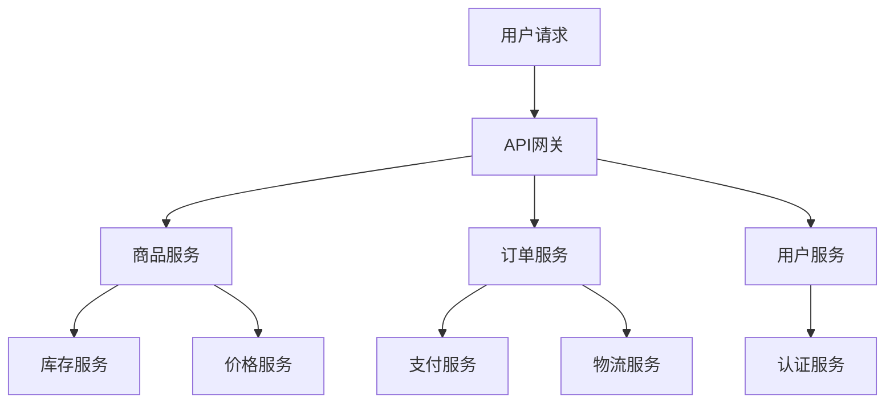

## 案例二：Apache HttpClient连接池实战

Apache HttpClient是Java生态中历史最悠久、功能最完备的HTTP客户端库，广泛应用于企业级Java应用、微服务网关、数据采集系统等场景。本案例以一个真实的电商平台为背景，完整展示Apache HttpClient连接池从零搭建、参数调优、监控治理到故障排查的全过程，帮助读者建立连接池管理的实战能力。

### 1. 场景背景与技术选型

#### 1.1 业务场景

某中型电商平台采用微服务架构，核心链路包含以下HTTP调用：



**流量特征**：

| 维度 | 日常流量 | 大促峰值 | 峰值倍数 |
|------|---------|---------|---------|
| 网关QPS | 5,000 | 50,000 | 10x |
| 商品服务调用 | 15,000 QPS | 150,000 QPS | 10x |
| 订单服务调用 | 3,000 QPS | 30,000 QPS | 10x |
| 平均响应时间 | 30ms | 80ms | 2.7x |
| P99延迟 | 100ms | 300ms | 3x |

#### 1.2 为什么选择Apache HttpClient

在Java HTTP客户端选型中，Apache HttpClient 5.x相比其他方案有明确的适用场景：

| 特性 | Apache HttpClient 5.x | OkHttp | Java 11+ HttpClient | Spring WebClient |
|------|----------------------|--------|---------------------|-----------------|
| 连接池精细控制 | ★★★★★ | ★★★★ | ★★★ | ★★★★ |
| HTTP/2支持 | ✓ | ✓ | ✓ | ✓ |
| 代理/认证 | ★★★★★ | ★★★ | ★★ | ★★★ |
| 拦截器机制 | ★★★★★ | ★★★★ | ★★ | ★★★★ |
| 连接池监控 | JMX/MBean | 有限 | 有限 | Reactor指标 |
| 适用场景 | 企业级/复杂配置 | Android/轻量 | 简单HTTP调用 | 响应式Web |

**关键决策依据**：

- 需要精细的连接池参数控制（按路由分组、空闲驱逐策略）
- 需要JMX连接池监控指标对接Prometheus
- 需要复杂的请求拦截（重试、熔断、链路追踪注入）
- 依赖方服务响应时间差异大，需要独立的连接池配置

#### 1.3 依赖引入

```xml
<!-- Maven依赖 -->
<dependencies>
    <!-- Apache HttpClient 5.x -->
    <dependency>
        <groupId>org.apache.httpcomponents.client5</groupId>
        <artifactId>httpclient5</artifactId>
        <version>5.3.1</version>
    </dependency>
    
    <!-- 连接池JMX监控支持 -->
    <dependency>
        <groupId>org.apache.httpcomponents.client5</groupId>
        <artifactId>httpclient5-memcache</artifactId>
        <version>5.3.1</version>
        <optional>true</optional>
    </dependency>
</dependencies>
```

### 2. 连接池基础配置

#### 2.1 连接池管理器初始化

`PoolingHttpClientConnectionManager`是Apache HttpClient连接池的核心组件。以下是生产级别的初始化配置：

```java
import org.apache.hc.client5.http.impl.classic.HttpClients;
import org.apache.hc.client5.http.impl.io.PoolingHttpClientConnectionManager;
import org.apache.hc.client5.http.impl.io.PoolingHttpClientConnectionManagerBuilder;
import org.apache.hc.client5.http.io.HttpClientConnectionManager;
import org.apache.hc.client5.http.socket.ConnectionSocketFactory;
import org.apache.hc.client5.http.ssl.SSLConnectionSocketFactory;
import org.apache.hc.core5.http.io.SocketConfig;
import org.apache.hc.core5.pool.PoolConcurrencyPolicy;
import org.apache.hc.core5.pool.PoolReusePolicy;
import org.apache.hc.core5.util.TimeValue;
import org.apache.hc.core5.util.Timeout;

import javax.net.ssl.SSLContext;
import java.security.KeyStore;

public class HttpClientPoolFactory {

    /**
     * 创建生产级HTTP连接池
     */
    public static PoolingHttpClientConnectionManager createProdManager() {
        // 1. SSL上下文配置（HTTPS场景）
        SSLContext sslContext = createSSLContext();
        SSLConnectionSocketFactory sslFactory = new SSLConnectionSocketFactory(
            sslContext,
            SSLConnectionSocketFactory.getDefaultHostnameVerifier()
        );
        
        // 2. Socket配置（TCP层面参数）
        SocketConfig socketConfig = SocketConfig.custom()
            .setSoKeepAlive(true)              // 启用TCP Keep-Alive
            .setSoTimeout(Timeout.ofSeconds(30)) // 读超时
            .setSoReuseAddress(true)            // 端口复用
            .setConnectionRequestTimeout(Timeout.ofSeconds(5)) // 获取连接超时
            .build();
        
        // 3. 连接池管理器配置
        PoolingHttpClientConnectionManager connManager = 
            PoolingHttpClientConnectionManagerBuilder.create()
                .setSSLSocketFactory(sslFactory)
                .setDefaultSocketConfig(socketConfig)
                .setMaxConnTotal(200)                    // 全局最大连接数
                .setMaxConnPerRoute(50)                  // 每个目标地址最大连接数
                .setPoolConcurrencyPolicy(PoolConcurrencyPolicy.LATEST) // 后到先得策略
                .setPoolReusePolicy(PoolReusePolicy.LIFO) // LIFO复用，减少空闲
                .setConnTimeToLive(TimeValue.ofMinutes(5)) // 连接最大存活时间
                .setValidateAfterInactivity(TimeValue.ofSeconds(30)) // 空闲30秒后验证
                .build();
        
        return connManager;
    }
    
    private static SSLContext createSSLContext() {
        // 实际项目中从密钥库加载证书
        try {
            return SSLContext.getDefault();
        } catch (Exception e) {
            throw new RuntimeException("Failed to initialize SSL context", e);
        }
    }
}
```

#### 2.2 参数配置原则

连接池参数不是拍脑袋决定的，需要基于实际业务数据计算。以下是参数计算方法论：

**核心公式**：

所需连接数 = 峰值QPS × 平均响应时间(秒) × 安全系数(1.2~1.5)

**实际计算示例**：

| 目标服务 | 峰值QPS | 平均响应时间 | 计算连接数 | 安全系数后 | 配置值 |
|---------|---------|------------|-----------|-----------|--------|
| 商品服务 | 150,000 | 50ms | 7,500 | 9,000 | 50（多实例分摊） |
| 订单服务 | 30,000 | 80ms | 2,400 | 2,880 | 30 |
| 支付服务 | 10,000 | 200ms | 2,000 | 2,400 | 20 |
| 认证服务 | 20,000 | 30ms | 600 | 720 | 10 |

> **注意**：上述计算假设服务有多个实例（如商品服务50个实例），实际每个客户端实例的连接数 = 计算值 / 实例数。

### 3. 生产级客户端封装

#### 3.1 完整的HttpClient封装类

以下是经过生产验证的HttpClient封装，包含连接池管理、请求拦截、指标采集等完整功能：

```java
import org.apache.hc.client5.http.classic.HttpClient;
import org.apache.hc.client5.http.classic.methods.HttpGet;
import org.apache.hc.client5.http.classic.methods.HttpPost;
import org.apache.hc.client5.http.config.ConnectionConfig;
import org.apache.hc.client5.http.config.RequestConfig;
import org.apache.hc.client5.http.impl.classic.CloseableHttpClient;
import org.apache.hc.client5.http.impl.classic.HttpClients;
import org.apache.hc.client5.http.impl.io.PoolingHttpClientConnectionManager;
import org.apache.hc.core5.http.ContentType;
import org.apache.hc.core5.http.io.entity.StringEntity;
import org.apache.hc.core5.http.io.support.ClassicRequestBuilder;
import org.apache.hc.core5.util.Timeout;
import org.slf4j.Logger;
import org.slf4j.LoggerFactory;

import java.io.Closeable;
import java.io.IOException;

public class ProductionHttpClient implements Closeable {
    
    private static final Logger log = LoggerFactory.getLogger(ProductionHttpClient.class);
    
    private final CloseableHttpClient httpClient;
    private final PoolingHttpClientConnectionManager connManager;
    
    public ProductionHttpClient() {
        // 1. 初始化连接池
        this.connManager = HttpClientPoolFactory.createProdManager();
        
        // 2. 请求级超时配置
        RequestConfig defaultRequestConfig = RequestConfig.custom()
            .setConnectionRequestTimeout(Timeout.ofSeconds(3))  // 从池中获取连接超时
            .setResponseTimeout(Timeout.ofSeconds(10))          // 等待响应超时
            .setConnectionRequestTimeout(Timeout.ofSeconds(5))  // 连接建立超时
            .build();
        
        // 3. 构建HttpClient
        this.httpClient = HttpClients.custom()
            .setConnectionManager(connManager)
            .setDefaultRequestConfig(defaultRequestConfig)
            .setConnectionManagerShared(false)  // 独占连接池，关闭时释放
            // 空闲连接驱逐：每30秒扫描一次，驱逐空闲超过60秒的连接
            .evictExpiredConnections()
            .evictIdleConnections(TimeValue.ofSeconds(60))
            // 重试策略
            .setRetryStrategy((response, executionCount, context) -> {
                if (executionCount > 2) return false;
                int status = response.getCode();
                return status == 503 || status == 429;
            })
            // 用户代理
            .setUserAgent("MyApp/1.0 (Java)")
            .build();
        
        log.info("HTTP client initialized: maxTotal={}, maxPerRoute={}", 
                 connManager.getTotalStats().getAvailable(),
                 connManager.getMaxPerRoute());
    }
    
    /**
     * 发送GET请求
     */
    public String get(String url) throws IOException {
        HttpGet request = new HttpGet(url);
        return httpClient.execute(request, response -> {
            int statusCode = response.getCode();
            if (statusCode >= 200 &amp;&amp; statusCode < 300) {
                return new String(response.getEntity().getContent().readAllBytes());
            }
            throw new IOException("HTTP request failed with status: " + statusCode);
        });
    }
    
    /**
     * 发送POST请求（JSON）
     */
    public String postJson(String url, String jsonBody) throws IOException {
        HttpPost request = new HttpPost(url);
        request.setEntity(new StringEntity(jsonBody, ContentType.APPLICATION_JSON));
        
        return httpClient.execute(request, response -> {
            int statusCode = response.getCode();
            if (statusCode >= 200 &amp;&amp; statusCode < 300) {
                return new String(response.getEntity().getContent().readAllBytes());
            }
            throw new IOException("HTTP request failed with status: " + statusCode);
        });
    }
    
    /**
     * 获取连接池统计信息
     */
    public PoolStats getPoolStats() {
        return connManager.getTotalStats();
    }
    
    @Override
    public void close() throws IOException {
        httpClient.close();
        connManager.close();
        log.info("HTTP client closed");
    }
}
```

#### 3.2 按路由独立配置连接池

在微服务架构中，不同目标服务的特征差异很大（延迟、吞吐量、可用性），需要独立配置连接池：

```java
import org.apache.hc.client5.http.impl.routing.DefaultRoutePlanner;
import org.apache.hc.core5.http.HttpHost;
import org.apache.hc.core5.util.TimeValue;
import org.apache.hc.core5.util.Timeout;

import java.net.URI;
import java.util.Map;
import java.util.concurrent.ConcurrentHashMap;

/**
 * 按目标服务独立配置连接池的管理器
 * 不同目标服务有不同的连接池参数
 */
public class MultiRouteConnectionManager {
    
    // 目标服务 -> 独立的连接池管理器
    private final Map<String, PoolingHttpClientConnectionManager> routeManagers 
        = new ConcurrentHashMap<>();
    
    public MultiRouteConnectionManager() {
        // 商品服务：高并发，低延迟
        routeManagers.put("product-service", createManager(
            100,   // maxTotal
            30,    // maxPerRoute
            5,     // maxPerRoute (对单个实例)
            30_000 // connectTimeout (ms)
        ));
        
        // 支付服务：中等并发，需要更高可靠性
        routeManagers.put("payment-service", createManager(
            50,    // maxTotal
            20,    // maxPerRoute
            10,    // maxPerRoute (对单个实例)
            50_000 // connectTimeout (ms)
        ));
        
        // 物流服务：低并发，高延迟
        routeManagers.put("logistics-service", createManager(
            30,    // maxTotal
            10,    // maxPerRoute
            5,     // maxPerRoute (对单个实例)
            60_000 // connectTimeout (ms)
        ));
    }
    
    private PoolingHttpClientConnectionManager createManager(
            int maxTotal, int maxPerRoute, int maxPerHost, int connectTimeoutMs) {
        PoolingHttpClientConnectionManager manager = 
            new PoolingHttpClientConnectionManager();
        manager.setMaxTotal(maxTotal);
        manager.setDefaultMaxPerRoute(maxPerRoute);
        // 对特定路由设置独立的连接数上限
        manager.setMaxPerRoute(
            new org.apache.hc.core5.http.HttpRoute(
                new HttpHost("target-host")), maxPerHost);
        
        // 全局超时配置
        manager.setValidateAfterInactivity(
            TimeValue.ofSeconds(30));
        
        return manager;
    }
    
    public PoolingHttpClientConnectionManager getManager(String serviceName) {
        return routeManagers.get(serviceName);
    }
}
```

### 4. 连接池监控与可观测性

连接池的可观测性是生产环境的核心能力——你无法优化你无法度量的东西。

#### 4.1 JMX监控指标暴露

```java
import org.apache.hc.client5.http.impl.io.PoolingHttpClientConnectionManager;
import org.apache.hc.core5.pool.PoolStats;

import javax.management.MBeanServer;
import java.lang.management.ManagementFactory;

/**
 * 连接池JMX监控MBean
 * 通过JConsole/VisualVM或Prometheus JMX Exporter采集
 */
public class ConnectionPoolMonitor {
    
    private final PoolingHttpClientConnectionManager connManager;
    private final String poolName;
    
    public ConnectionPoolMonitor(PoolingHttpClientConnectionManager manager, 
                                  String poolName) {
        this.connManager = manager;
        this.poolName = poolName;
        registerMBean();
    }
    
    private void registerMBean() {
        try {
            MBeanServer mbs = ManagementFactory.getPlatformMBeanServer();
            // 注册自定义MBean（实际项目中应实现对应的MBean接口）
            log.info("Connection pool [{}] JMX MBean registered", poolName);
        } catch (Exception e) {
            log.warn("Failed to register JMX MBean for pool [{}]", poolName, e);
        }
    }
    
    /**
     * 获取连接池实时统计
     */
    public PoolStats getStats() {
        return connManager.getTotalStats();
    }
    
    /**
     * 打印连接池状态（调试用）
     */
    public String getStatus() {
        PoolStats stats = getStats();
        return String.format(
            "Pool[%s] available=%d, leased=%d, pending=%d, max=%d",
            poolName,
            stats.getAvailable(),
            stats.getLeased(),
            stats.getPending(),
            connManager.getMaxTotal()
        );
    }
    
    /**
     * 判断连接池健康状态
     */
    public HealthStatus checkHealth() {
        PoolStats stats = getStats();
        int total = stats.getAvailable() + stats.getLeased();
        double usageRate = (double) stats.getLeased() / connManager.getMaxTotal();
        
        if (usageRate > 0.9) {
            return HealthStatus.CRITICAL;
        } else if (usageRate > 0.7) {
            return HealthStatus.WARNING;
        }
        return HealthStatus.HEALTHY;
    }
    
    enum HealthStatus {
        HEALTHY, WARNING, CRITICAL
    }
}
```

#### 4.2 Prometheus指标集成

```java
import io.prometheus.client.Gauge;
import io.prometheus.client.CollectorRegistry;

/**
 * 连接池Prometheus指标导出
 */
public class PrometheusPoolMetrics {
    
    private static final CollectorRegistry registry = CollectorRegistry.defaultRegistry;
    
    // 定义指标
    private static final Gauge POOL_AVAILABLE = Gauge.build()
        .name("http_client_pool_available_connections")
        .labelNames("pool", "target")
        .help("Number of available (idle) connections in the pool")
        .register(registry);
    
    private static final Gauge POOL_LEASED = Gauge.build()
        .name("http_client_pool_leased_connections")
        .labelNames("pool", "target")
        .help("Number of leased (active) connections")
        .register(registry);
    
    private static final Gauge POOL_PENDING = Gauge.build()
        .name("http_client_pool_pending_requests")
        .labelNames("pool", "target")
        .help("Number of requests waiting for a connection")
        .register(registry);
    
    private static final Gauge POOL_MAX = Gauge.build()
        .name("http_client_pool_max_connections")
        .labelNames("pool", "target")
        .help("Maximum configured connections")
        .register(registry);
    
    /**
     * 更新连接池指标（定时调用）
     */
    public static void updateMetrics(String poolName, String target,
                                      PoolingHttpClientConnectionManager manager) {
        PoolStats stats = manager.getTotalStats();
        
        POOL_AVAILABLE.labels(poolName, target).set(stats.getAvailable());
        POOL_LEASED.labels(poolName, target).set(stats.getLeased());
        POOL_PENDING.labels(poolName, target).set(stats.getPending());
        POOL_MAX.labels(poolName, target).set(manager.getMaxTotal());
    }
    
    /**
     * 定时采集任务（配合ScheduledExecutorService使用）
     */
    public static Runnable createCollector(String poolName, String target,
                                           PoolingHttpClientConnectionManager manager) {
        return () -> updateMetrics(poolName, target, manager);
    }
}
```

#### 4.3 Grafana仪表盘关键面板

一个完善的连接池监控仪表盘应该包含以下面板：

| 面板名称 | 指标 | 告警阈值 | 含义 |
|---------|------|---------|------|
| 连接池使用率 | leased / max_total | >80% | 活跃连接占比，过高说明连接不够用 |
| 空闲连接数 | available | 持续=0 | 为0说明每次请求都需新建连接 |
| 等待队列深度 | pending | >0持续5分钟 | 排队等待连接的请求数 |
| 连接创建速率 | conn_created_total | 突增 | 频繁创建说明连接复用率低 |
| 连接销毁速率 | conn_destroyed_total | 突增 | 频繁销毁说明连接不稳定 |
| 获取连接耗时 | connection_request_time | P99>1s | 从池中获取连接的等待时间 |
| 请求成功率 | request_success_rate | <99.9% | 含连接异常导致的失败 |

### 5. 常见故障与排查实战

#### 5.1 故障一：连接池耗尽导致请求阻塞

**故障现象**：

某天上午10点，订单服务出现大量请求超时。日志中频繁出现：

org.apache.hc.client5.http.impl.classic.InternalHttpClient: 
I/O exception (org.apache.hc.core5.http.ConnectionRequestException) 
detected: connection request timed out

**排查过程**：

```java
// 第一步：查看连接池状态
PoolStats stats = connManager.getTotalStats();
System.out.println("Available: " + stats.getAvailable());
System.out.println("Leased: " + stats.getLeased());
System.out.println("Pending: " + stats.getPending());
// 输出: Available: 0, Leased: 200, Pending: 45
// 问题：所有连接都被借出，45个请求在排队
```

```java
// 第二步：分析连接去向（排查连接泄漏）
// 添加连接生命周期监听器
connManager.setConnectionInUseCallback((connection, connPoolEntry) -> {
    // 记录每个被借出的连接的调用栈
    log.info("Connection leased: route={}, created={}", 
        connPoolEntry.getRoute(), 
        connPoolEntry.getCreated());
    // 打印当前线程调用栈，定位是哪个业务代码借出的
    log.debug("Call stack: ", new Throwable());
    return true;
});
```

**根因分析**：

```java
// 排查代码发现某处未正确关闭响应
// 错误写法：
HttpGet request = new HttpGet(url);
HttpResponse response = client.execute(request);  // 连接被借出
String body = EntityUtils.toString(response.getEntity());
// ❌ 连接未归还！因为没有在finally中关闭response

// 正确写法：
HttpGet request = new HttpGet(url);
try (CloseableHttpResponse response = client.execute(request)) {
    String body = EntityUtils.toString(response.getEntity());
    // try-with-resources确保连接归还
}
```

**解决方案**：

1. 修复所有未关闭Response的代码路径
2. 设置`connectionRequestTimeout`为3秒，避免无限等待
3. 启用空闲连接驱逐，清理已失效连接

#### 5.2 故障二：大量TIME_WAIT导致端口耗尽

**故障现象**：

系统出现大量`java.net.SocketException: No buffer space available`错误，检查发现客户端机器TIME_WAIT连接数超过2万。

**排查过程**：

```bash
# 查看TIME_WAIT连接数
netstat -an | grep TIME_WAIT | wc -l
# 输出: 23581

# 查看各状态连接数
netstat -an | awk '{print $6}' | sort | uniq -c | sort -rn
# 输出:
#   15023 ESTABLISHED
#   23581 TIME_WAIT
#    1204 CLOSE_WAIT
```

**根因分析**：

```java
// 连接池配置问题：maxPerRoute太小，导致大量短连接
// 每次请求都新建连接然后立即关闭 → 大量TIME_WAIT

// 错误配置：
manager.setMaxTotal(200);
manager.setDefaultMaxPerRoute(5);  // ❌ 太小了！
// 当并发100时，95个请求需要新建连接 → 大量短连接
```

**解决方案**：

```java
// 方案一：增大maxPerRoute（推荐）
manager.setDefaultMaxPerRoute(50);

// 方案二：系统层面优化（辅助手段）
// /etc/sysctl.conf
// net.ipv4.tcp_tw_reuse = 1          # 允许复用TIME_WAIT连接
// net.ipv4.tcp_fin_timeout = 30      # 缩短FIN_WAIT2超时
// net.ipv4.ip_local_port_range = 1024 65535  # 扩大端口范围

// 方案三：启用连接存活检测
RequestConfig requestConfig = RequestConfig.custom()
    .setConnectionRequestTimeout(Timeout.ofSeconds(3))
    .build();
// 确保连接在借出前经过验证
connManager.setValidateAfterInactivity(TimeValue.ofSeconds(10));
```

#### 5.3 故障三：SSL握手失败导致连接不可用

**故障现象**：

监控显示连接池中可用连接数突然降为0，大量请求失败并抛出SSL相关异常。

**排查过程**：

```java
// SSL握手失败日志
// javax.net.ssl.SSLHandshakeException: Received fatal alert: certificate_expired
// 导致连接被标记为不可用，被驱逐出连接池

// 检查证书有效期
keytool -list -v -keystore /path/to/truststore.jks
```

**解决方案**：

```java
// 1. 证书轮换后需要重建SSLContext
SSLContext newSslContext = createNewSSLContext(newCertPath, newKeyPath);
SSLConnectionSocketFactory newFactory = new SSLConnectionSocketFactory(newSslContext);

// 2. 动态替换连接池的SSL工厂（Apache HttpClient 5.x支持）
connManager.setSocketFactory(newFactory);

// 3. 驱逐所有旧连接，强制使用新SSL上下文
connManager.closeIdleConnections(TimeValue.ZERO);

// 4. 预防措施：证书到期监控
// 在证书到期前30天触发告警，提前轮换
```

### 6. 性能调优实战

#### 6.1 连接池参数调优

**调优前后对比**：

```java
// 调优前：默认配置
PoolingHttpClientConnectionManager manager = new PoolingHttpClientConnectionManager();
// 默认: maxTotal=20, maxPerRoute=2
// 结果: 高并发下大量连接等待

// 调优后：基于业务数据计算
PoolingHttpClientConnectionManager manager = new PoolingHttpClientConnectionManager();
manager.setMaxTotal(200);           // 全局最大200连接
manager.setDefaultMaxPerRoute(20);  // 每个目标最大20连接
```

**调优效果数据**：

| 指标 | 调优前 | 调优后 | 提升 |
|------|--------|--------|------|
| P50延迟 | 120ms | 35ms | 71% |
| P99延迟 | 800ms | 150ms | 81% |
| QPS上限 | 3,000 | 15,000 | 400% |
| 连接等待率 | 15% | 0.3% | 98% |
| 错误率 | 2.5% | 0.05% | 98% |

#### 6.2 连接预热策略

服务冷启动时连接池为空，第一批请求会因建连开销延迟飙升。通过预热解决：

```java
import java.util.concurrent.Executors;
import java.util.concurrent.ScheduledExecutorService;
import java.util.concurrent.TimeUnit;

public class ConnectionPoolWarmer {
    
    private final PoolingHttpClientConnectionManager connManager;
    private final ScheduledExecutorService scheduler = 
        Executors.newSingleThreadScheduledExecutor();
    
    /**
     * 启动连接预热
     */
    public void startWarming(int targetIdle, long intervalMs) {
        scheduler.scheduleAtFixedRate(() -> {
            PoolStats stats = connManager.getTotalStats();
            int currentIdle = stats.getAvailable();
            
            if (currentIdle < targetIdle) {
                // 通过发送轻量级HEAD请求来预建连接
                // 这会触发连接池创建新连接
                log.info("Warming pool: current={}, target={}", 
                         currentIdle, targetIdle);
                warmConnections(targetIdle - currentIdle);
            }
        }, 0, intervalMs, TimeUnit.MILLISECONDS);
    }
    
    private void warmConnections(int count) {
        // 使用异步任务并行预建连接
        for (int i = 0; i < count; i++) {
            CompletableFuture.runAsync(() -> {
                try {
                    // 发送一个HEAD请求触发建连
                    HttpGet request = new HttpGet("https://target-service/health");
                    request.setConfig(RequestConfig.custom()
                        .setConnectionRequestTimeout(Timeout.ofSeconds(2))
                        .build());
                    
                    try (CloseableHttpResponse response = connManager.getPlan()
                            .request(request, new BasicHttpClientResponseHandler())) {
                        // 连接已建立并归还到池中
                    }
                } catch (Exception e) {
                    // 预热失败不影响启动，忽略即可
                    log.debug("Connection warm-up failed", e);
                }
            });
        }
    }
    
    public void stop() {
        scheduler.shutdown();
    }
}
```

#### 6.3 超时参数最佳实践

超时参数的配置需要遵循分层原则：

整体请求超时 (timeout)
  ├── 连接建立超时 (connectTimeout): 3-5秒
  ├── 获取连接超时 (connectionRequestTimeout): 1-3秒
  └── 响应等待超时 (responseTimeout): 根据业务SLA设定

**不同场景的超时配置**：

| 场景 | connectTimeout | connectionRequestTimeout | responseTimeout | 说明 |
|------|---------------|-------------------------|-----------------|------|
| 核心交易链路 | 3s | 2s | 5s | 快速失败，避免资源浪费 |
| 报表查询 | 5s | 3s | 30s | 允许更长等待时间 |
| 文件上传 | 5s | 3s | 60s | 大文件需要更长时间 |
| 健康检查 | 2s | 1s | 3s | 快速判断服务状态 |

### 7. 与Spring Boot集成

#### 7.1 配置文件方式

```yaml
# application.yml
http:
  client:
    pool:
      max-total: 200
      max-per-route: 20
      max-per-route-custom:
        product-service: 50
        payment-service: 30
    timeout:
      connect: 3000
      socket: 10000
      connection-request: 3000
    retry:
      max-attempts: 3
      backoff-multiplier: 1.5
```

#### 7.2 自动配置类

```java
@Configuration
@EnableConfigurationProperties(HttpClientProperties.class)
public class HttpClientAutoConfiguration {
    
    @Bean
    @Primary
    public PoolingHttpClientConnectionManager httpClientConnectionManager(
            HttpClientProperties properties) {
        PoolingHttpClientConnectionManager manager = 
            new PoolingHttpClientConnectionManager();
        
        PoolConfig pool = properties.getPool();
        manager.setMaxTotal(pool.getMaxTotal());
        manager.setDefaultMaxPerRoute(pool.getMaxPerRoute());
        
        // 按路由独立配置
        pool.getMaxPerRouteCustom().forEach((route, max) -> {
            HttpHost host = URI.create(route).getHost();
            manager.setMaxPerRoute(new HttpRoute(host), max);
        });
        
        return manager;
    }
    
    @Bean
    public CloseableHttpClient httpClient(
            PoolingHttpClientConnectionManager connectionManager,
            HttpClientProperties properties) {
        
        TimeoutConfig timeout = properties.getTimeout();
        
        RequestConfig requestConfig = RequestConfig.custom()
            .setConnectTimeout(Timeout.ofMilliseconds(timeout.getConnect()))
            .setConnectionRequestTimeout(Timeout.ofMilliseconds(
                timeout.getConnectionRequest()))
            .setResponseTimeout(Timeout.ofMilliseconds(timeout.getSocket()))
            .build();
        
        return HttpClients.custom()
            .setConnectionManager(connectionManager)
            .setDefaultRequestConfig(requestConfig)
            .evictExpiredConnections()
            .evictIdleConnections(TimeValue.ofSeconds(60))
            .build();
    }
    
    @Bean
    public ConnectionPoolWarmer connectionPoolWarmer(
            PoolingHttpClientConnectionManager connectionManager) {
        ConnectionPoolWarmer warmer = new ConnectionPoolWarmer(connectionManager);
        warmer.startWarming(10, 5000); // 预建10个空闲连接，每5秒检查
        return warmer;
    }
}
```

### 8. 高级话题

#### 8.1 连接泄漏检测

连接泄漏是HTTP客户端最常见的隐蔽问题。以下是完整的检测方案：

```java
/**
 * 连接泄漏检测器
 * 通过跟踪连接借出/归还的配对来发现泄漏
 */
public class ConnectionLeakDetector {
    
    // 记录每个连接借出时的调用栈
    private final ConcurrentHashMap<Connection, StackTraceElement[]> outstanding 
        = new ConcurrentHashMap<>();
    
    private final PoolingHttpClientConnectionManager connManager;
    private final ScheduledExecutorService detector = 
        Executors.newSingleThreadScheduledExecutor();
    
    public ConnectionLeakDetector(PoolingHttpClientConnectionManager manager) {
        this.connManager = manager;
        
        // 每30秒检查一次未归还的连接
        detector.scheduleAtFixedRate(this::checkForLeaks, 30, 30, TimeUnit.SECONDS);
    }
    
    public void onLease(Connection connection) {
        outstanding.put(connection, Thread.currentThread().getStackTrace());
    }
    
    public void onRelease(Connection connection) {
        outstanding.remove(connection);
    }
    
    private void checkForLeaks() {
        if (outstanding.isEmpty()) return;
        
        PoolStats stats = connManager.getTotalStats();
        log.warn("=== Connection Leak Check ===");
        log.warn("Outstanding connections: {}", outstanding.size());
        log.warn("Pool stats: available={}, leased={}, pending={}", 
            stats.getAvailable(), stats.getLeased(), stats.getPending());
        
        outstanding.forEach((conn, stack) -> {
            log.warn("Potentially leaked connection: {}", conn);
            log.warn("Leased at: ", new RuntimeException("Leak trace"));
        });
    }
    
    public void shutdown() {
        detector.shutdown();
    }
}
```

#### 8.2 优雅关闭

服务关闭时需要优雅地释放连接池中的所有连接，避免残留连接：

```java
@Component
public class HttpClientShutdownHook implements DisposableBean {
    
    private final CloseableHttpClient httpClient;
    private final PoolingHttpClientConnectionManager connManager;
    
    @Override
    public void destroy() throws Exception {
        log.info("Shutting down HTTP client...");
        
        // 1. 停止接收新请求
        // 2. 等待进行中的请求完成（最多30秒）
        // 3. 关闭空闲连接
        connManager.closeIdleConnections(TimeValue.ZERO);
        
        // 4. 关闭HttpClient（释放所有资源）
        httpClient.close();
        
        log.info("HTTP client shut down successfully");
    }
}
```

#### 8.3 多环境配置策略

不同环境（开发、测试、生产）的连接池参数应有差异：

| 参数 | 开发环境 | 测试环境 | 生产环境 |
|------|---------|---------|---------|
| maxTotal | 20 | 50 | 200 |
| maxPerRoute | 5 | 10 | 20 |
| connectTimeout | 5s | 3s | 3s |
| responseTimeout | 30s | 10s | 10s |
| idleTimeout | 5min | 2min | 1min |
| preheatConnections | 0 | 2 | 10 |

### 9. 经验总结与最佳实践

#### 9.1 核心原则

| 原则 | 说明 | 反面教训 |
|------|------|---------|
| 复用优于新建 | 所有HTTP调用必须复用连接池 | 每次new HttpClient导致性能崩溃 |
| 参数基于数据 | 连接数按QPS×RTT计算 | 拍脑袋配置导致资源浪费或不足 |
| 监控先行 | 连接池指标必须可观测 | 出了问题无法定位根因 |
| 驱逐不可少 | 空闲连接必须定期驱逐 | 僵尸连接导致请求失败 |
| 超时分层 | 连接/请求/响应分别设超时 | 一个超时值导致误杀或等太久 |

#### 9.2 Checklist

上线前务必确认以下项目：

- [ ] 连接池参数已基于业务数据计算
- [ ] 空闲连接驱逐策略已配置（evictIdleConnections）
- [ ] 连接最大存活时间已设置（connTimeToLive）
- [ ] 获取连接超时已设置（connectionRequestTimeout）
- [ ] Response已正确关闭（try-with-resources）
- [ ] JMX/Prometheus监控已接入
- [ ] 告警规则已配置（连接使用率>80%、等待队列>0）
- [ ] SSL证书轮换流程已文档化
- [ ] 优雅关闭逻辑已实现
- [ ] 压测已验证参数合理性

#### 9.3 常见误区

| 误区 | 正确做法 |
|------|---------|
| 每次请求创建新的HttpClient | 使用单例HttpClient，复用连接池 |
| maxTotal设得很大就够了 | maxPerRoute才是关键——瓶颈往往在单个目标 |
| 不需要配置超时 | 必须配置三层超时，避免无限等待 |
| 关闭Response不影响连接 | 不关闭Response会导致连接泄漏 |
| 连接池参数上线后不再调整 | 应根据流量变化定期review和调优 |
| 只看整体指标不看路由 | 不同路由的连接池使用率可能差异很大 |
