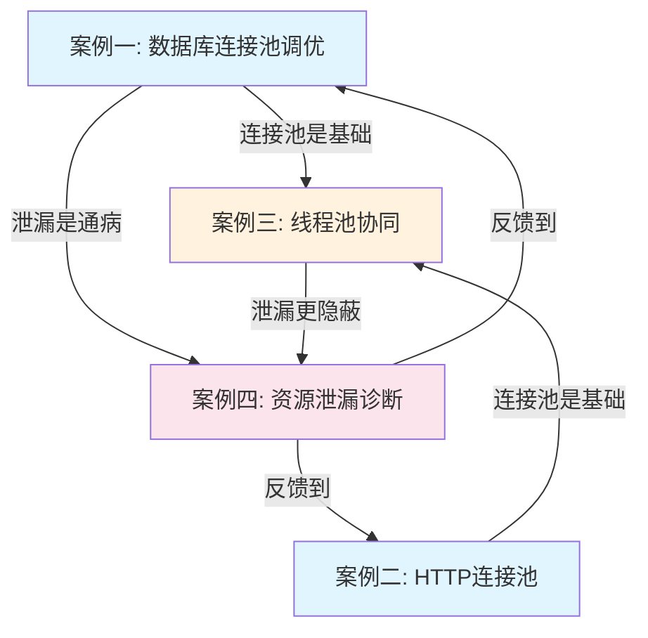

# 连接池与资源管理：实战案例

## 引言

理论和技巧最终要落地为代码和架构决策。本节通过四个完整的实战案例，展示连接池与资源管理在真实生产环境中的应用。每个案例都遵循"问题场景 → 排查分析 → 方案设计 → 实现落地 → 效果验证"的完整闭环，帮助读者建立从理论到实践的桥梁。

### 为什么实战案例很重要

很多开发者在学习连接池时，能背诵参数含义和配置公式，却在真实场景中屡屡翻车。根本原因在于：

- **教科书模型与真实场景的差距**：线上系统的连接池行为受多因素交叉影响——慢查询、GC暂停、网络抖动、流量突变——单独看每个参数都"正确"，组合在一起却可能灾难性失败
- **配置 ≠ 调优**：默认配置和最优配置之间的差距可达 10-50 倍性能差异，而"最优"本身随业务变化而变化
- **排查能力决定恢复速度**：连接池故障的表现往往是级联的——连接耗尽 → 请求排队 → 超时堆积 → 线程阻塞 → 服务雪崩——没有系统化的排查方法论，只能盲目重启

### 本节案例概览

| 案例 | 核心主题 | 技术栈 | 难度 | 适合读者 |
|------|---------|--------|------|---------|
| 案例一 | 数据库连接池调优 | HikariCP + MySQL | ⭐⭐⭐ | 后端开发、DBA |
| 案例二 | HTTP连接池管理 | Apache HttpClient 5 | ⭐⭐⭐ | 微服务开发者 |
| 案例三 | 线程池与连接池协同 | Spring Boot + HikariCP | ⭐⭐⭐⭐ | 架构师、高级开发 |
| 案例四 | 资源泄漏诊断与修复 | 多语言（Java/Python/Go） | ⭐⭐⭐⭐ | 全栈开发、SRE |

### 每个案例的结构

为了让读者最大化地从案例中学习，每个案例都包含以下六个部分：

1. **问题背景**：还原真实的业务场景和遇到的问题，给出量化的业务影响
2. **排查过程**：展示系统化的排查方法论，从现象到根因的推导链路
3. **根因分析**：深入剖析问题的本质原因，不仅仅是表面症状
4. **解决方案**：给出具体的代码实现和配置变更，附带设计决策的理由
5. **效果验证**：用数据说话——优化前后的性能对比，量化改进幅度
6. **经验总结**：提炼可复用的方法论和防坑指南，避免读者重蹈覆辙

---

## 案例一：HikariCP 连接池调优实战

### 场景概述

某互联网公司的核心订单系统在高峰期频繁出现数据库连接池耗尽的问题。系统使用 Spring Boot + HikariCP + MySQL 8.0 架构，日常运行平稳，但每到促销活动或月末结算时，连接池就会被"打爆"。

### 核心问题

- 连接池配置沿用项目初期的默认值（最大 10 个连接），而业务量已增长 20 倍
- 慢 SQL 导致部分连接被长时间占用，有效连接数远小于配置值
- 连接泄漏代码混在业务逻辑中，常规代码审查难以发现

### 关键收获

- 连接池大小的计算不能脱离业务特征——同样的 20 个连接，对于查询延迟 5ms 的 OLTP 和查询延迟 500ms 的分析查询，支撑的 QPS 相差 100 倍
- HikariCP 的 `leakDetectionThreshold` 是生产环境的必配参数，建议设为 30-60 秒
- 监控指标的告警阈值需要基于历史数据动态调整，固定阈值在流量波动时要么误报要么漏报

**详细内容 → [案例一：HikariCP连接池调优实战](01-案例一HikariCP实战.md)**

---

## 案例二：Apache HttpClient 连接池实战

### 场景概述

某微服务架构的系统中，服务 A 需要调用服务 B、C、D 共 5 个下游服务。团队最初为每个请求创建新的 HttpClient 实例，导致系统出现大量 TIME_WAIT 连接和偶发的连接超时。

### 核心问题

- 短连接模式：每次 HTTP 请求都创建新连接，TCP 三次握手 + TLS 握手的开销在高并发下被急剧放大
- 每个下游服务独立使用默认连接池配置，缺乏针对不同下游的差异化策略
- 某个下游服务响应变慢时，连接被长时间占用，连锁影响其他服务的调用

### 关键收获

- HTTP 连接池的核心参数是 `maxConnPerRoute`（单个目标的最大连接数），而非 `maxConnTotal`
- `ConnectionRequestTimeout`（从池中获取连接的超时）比 `SocketTimeout`（读写超时）更容易被忽视，但对系统稳定性影响更大
- 为不同下游服务配置独立的 HttpClient + 连接池，比共享一个大连接池更安全——一个慢下游不会拖垮所有调用

**详细内容 → [案例二：Apache HttpClient连接池实战](02-案例二ApacheHttpClient实战.md)**

---

## 案例三：Spring Boot 线程池与数据库连接池协同调优

### 场景概述

某在线教育平台的课程详情页需要同时查询课程基本信息、讲师信息、评价列表、推荐课程等多个数据源，采用异步并行查询来降低页面加载时间。然而上线后发现，线程池的线程数与数据库连接池的连接数不匹配，导致线程池线程数翻倍后性能反而下降。

### 核心问题

- 线程池配置了 200 个线程，但数据库连接池只有 20 个连接——200 个线程争抢 20 个连接，大量线程在等待连接
- 服务启动时就预热了全部 200 个线程，造成不必要的 CPU 和内存消耗
- 线程池拒绝策略使用 `AbortPolicy`，在连接池满时直接抛异常给用户，缺乏降级能力

### 关键收获

- 线程池线程数应该 ≤ 数据库连接池大小 × 调用比例，避免"线程空转等连接"的浪费
- 使用 `CallerRunsPolicy` 作为拒绝策略，让调用方线程自己执行任务，实现自然降速而非直接报错
- 通过 `@Async` + `CompletableFuture` 实现异步编排，而非简单地提交大量线程

```java
// 协同配置示例
@Configuration
public class PoolConfig {
    
    @Bean
    public HikariDataSource dataSource() {
        HikariConfig config = new HikariConfig();
        config.setMaximumPoolSize(30);    // 数据库连接池：30
        config.setMinimumIdle(5);
        return new HikariDataSource(config);
    }
    
    @Bean("ioTaskExecutor")
    public ThreadPoolTaskExecutor ioTaskExecutor() {
        ThreadPoolTaskExecutor executor = new ThreadPoolTaskExecutor();
        executor.setCorePoolSize(10);      // 核心线程：10
        executor.setMaxPoolSize(30);       // 最大线程：≤ 连接池大小
        executor.setQueueCapacity(100);    // 等待队列：吸收突发
        executor.setKeepAliveSeconds(60);
        executor.setRejectedExecutionHandler(
            new ThreadPoolExecutor.CallerRunsPolicy()  // 降级而非报错
        );
        executor.setThreadNamePrefix("async-io-");
        executor.initialize();
        return executor;
    }
}
```

**关键原则：连接池是瓶颈的硬上限，线程池的并发度不应超过它。**

---

## 案例四：资源泄漏诊断与修复实战

### 场景概述

某 SaaS 平台在运行数周后，服务内存持续增长，最终触发 OOM。排查发现罪魁祸首不是内存泄漏，而是数据库连接泄漏——程序获取了连接但未正确关闭，HikariCP 连接池逐渐被"掏空"，新请求全部排队等待。

### 核心问题

- 代码中存在 3 处连接泄漏：异常路径未关闭连接、`finally` 块中关闭顺序错误、中间件拦截器中获取连接后未归还
- HikariCP 的泄漏检测阈值被设为 `0`（禁用），直到 OOM 才发现
- 日志中早有 `Connection leak detection triggered` 警告，但被运维当作噪音忽略

### 多语言泄漏检测对比

| 语言/框架 | 推荐检测方式 | 核心工具 | 检测原理 |
|-----------|-------------|---------|---------|
| Java | try-with-resources + HikariCP 泄漏检测 | LeakCanary, JProfiler | 弱引用 + 终结器监控 |
| Python | context manager + gc 模块 | tracemalloc, objgraph | 引用计数 + GC 可视化 |
| Go | defer + runtime.MemStats | pprof, golangci-lint | GC + 静态分析 |

### 关键收获

- **防御性编码**：Java 的 try-with-resources 和 Python 的 with 语句是防止连接泄漏的第一道防线，应作为强制编码规范
- **泄漏检测必须开启**：HikariCP 的 `leakDetectionThreshold` 在生产环境至少设为 30 秒，这是最廉价的"保险"
- **告警不能静默**：连接泄漏的早期日志警告如果被当作噪音忽略，等到服务崩溃时代价是百倍——需要建立"连接池告警 = P1 事件"的响应机制
- **静态分析辅助**：使用 SpotBugs、PMD 或 SonarQube 的资源泄漏规则，在代码提交阶段就拦截问题

```java
// 反面教材：异常路径的连接泄漏
public User getUser(long id) {
    Connection conn = dataSource.getConnection();  // 获取连接
    PreparedStatement stmt = conn.prepareStatement("SELECT * FROM users WHERE id = ?");
    stmt.setLong(1, id);
    ResultSet rs = stmt.executeQuery();
    // 如果这里抛异常，conn 永远不会被关闭！
    if (rs.next()) {
        return mapUser(rs);
    }
    rs.close();
    stmt.close();
    conn.close();  // 只有正常路径才执行
    return null;
}

// 正确写法：try-with-resources
public User getUser(long id) {
    try (Connection conn = dataSource.getConnection();
         PreparedStatement stmt = conn.prepareStatement("SELECT * FROM users WHERE id = ?")) {
        stmt.setLong(1, id);
        try (ResultSet rs = stmt.executeQuery()) {
            if (rs.next()) {
                return mapUser(rs);
            }
        }
    } catch (SQLException e) {
        log.error("Failed to get user, id={}", id, e);
    }
    return null;
}
```

---

## 案例间的关联与对比

这四个案例并非孤立的——它们覆盖了连接池与资源管理的完整生命周期：



| 维度 | 案例一 | 案例二 | 案例三 | 案例四 |
|------|--------|--------|--------|--------|
| 关注点 | 配置调优 | 连接复用 | 资源协同 | 泄漏防护 |
| 核心矛盾 | 连接数 vs 并发量 | 复用 vs 隔离 | 线程数 vs 连接数 | 获取 vs 释放 |
| 最佳实践 | 数据驱动调参 | 独立池隔离慢下游 | 线程数 ≤ 连接数 | 强制 RAII 模式 |
| 监控重点 | 活跃/等待连接数 | TIME_WAIT 连接数 | 线程等待连接耗时 | 泄漏检测日志 |

---

## 通用防坑清单

无论使用哪种连接池，以下原则都适用：

### 必须做的事

1. **开启泄漏检测**：所有连接池都应配置泄漏检测阈值（30-60秒），这是最低成本的防线
2. **监控核心指标**：活跃连接数、等待线程数、获取连接耗时、超时次数——缺一不可
3. **设置合理的超时**：连接获取超时（3-10秒）、连接读写超时（5-30秒）、空闲超时（5-10分钟），三层超时缺一不可
4. **使用 try-with-resources / with 语句**：作为编码规范强制执行，消除 90% 的连接泄漏
5. **生产环境压测**：上线前用真实流量的 2-3 倍进行压测，验证连接池配置的承载能力

### 绝对不能做的事

1. **不要设置无限制的最大连接数**：MySQL 默认 `max_connections=151`，你的连接池上限不应超过这个值的 70%
2. **不要忽视连接池耗尽的告警**：连接池满不是"临时问题"，是即将雪崩的前兆
3. **不要在事务中执行远程调用**：一个 HTTP 调用可能耗时数秒，在事务中会阻塞数据库连接
4. **不要多个服务共享同一个连接池**：服务 A 的慢查询会拖垮服务 B 的响应时间
5. **不要在容器环境中照搬物理机配置**：K8s Pod 的 CPU limit 会限制线程池大小，连接池需要相应缩减

---

## 延伸阅读建议

完成本节案例后，建议结合以下章节深入学习：

- **49.1 连接池基本原理**：回顾连接池的工作流程和状态机，对照案例理解参数的作用
- **49.2 数据库连接池**：深入 HikariCP 的 ConcurrentBag 实现和字节码优化
- **49.3 HTTP连接池**：理解 HTTP/2 多路复用对连接池的影响
- **49.4 线程池管理**：掌握 ThreadPoolExecutor 的任务提交流程
- **49.6 资源泄漏检测**：了解各语言的泄漏检测工具和方法论
- **常见误区**：避免本节案例中提到的典型错误配置
