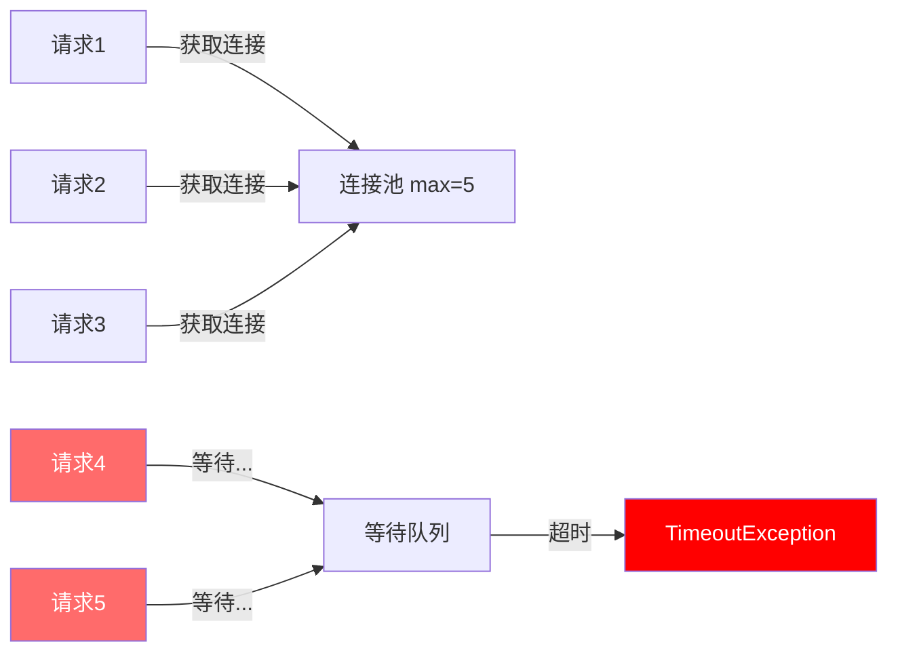
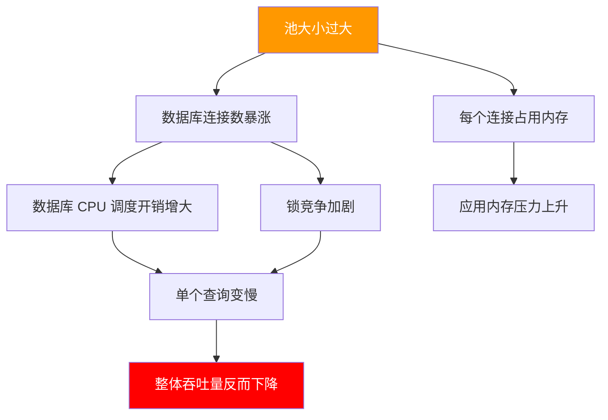
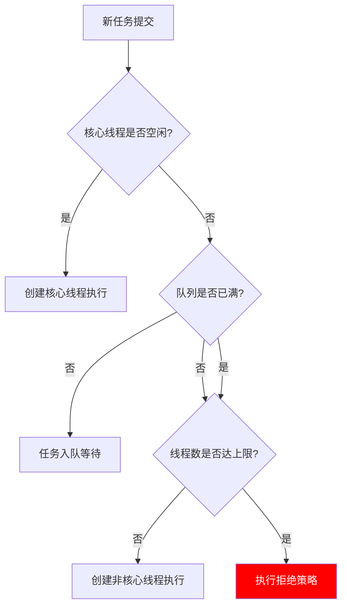

## 连接池大小配置：从理论计算到生产调优

池大小配置是连接池管理中最关键的决策之一。配小了，请求排队等待，吞吐量上不去；配大了，资源争抢加剧，反而拖慢整体性能。本节将系统讲解池大小的计算方法、不同场景的配置策略、以及生产环境中的动态调优技术。

---

### 1. 池大小对性能的影响机制

在讨论具体配置方法之前，先理解池大小如何影响系统行为。

#### 1.1 池大小不足的后果

当池大小小于并发需求时，请求会进入等待队列：



典型表现包括：

| 现象 | 根因 | 影响 |
|------|------|------|
| 请求平均耗时飙升 | 等待获取连接的时间叠加到业务耗时 | P99 延迟远大于 P50 |
| 线程/协程大量阻塞 | 线程被挂起在连接获取上 | CPU 利用率低但吞吐量低 |
| 超时异常暴增 | 等待时间超过配置的超时阈值 | 业务失败率上升 |
| 上游雪崩 | 本服务响应变慢导致上游超时重试 | 故障级联扩散 |

#### 1.2 池大小过大的后果

直觉上"连接越多越好"，但过大的池会带来严重问题：



具体数据说明：一个 MySQL 连接在服务端占用约 10-20MB 内存（包含线程栈、排序缓冲区、连接缓冲等）。如果应用开 1000 个连接，仅连接开销就达到 10-20GB，远超一般数据库服务器的合理负载。

一个经典的反面案例：某电商平台在"双11"前将 HikariCP 的 `maximumPoolSize` 从 20 调到 500，结果 MySQL 的 `Threads_running` 从 50 飙到 480，QPS 反而从 12000 降到 6000。原因很简单——MySQL 的 InnoDB 引擎在高并发写入时，线程争抢行锁和自旋锁的开销呈超线性增长。

---

### 2. 数据库连接池大小计算

数据库连接池是最常见的池类型，也是最需要精确计算的。

#### 2.1 经典公式：HikariCP 推荐公式

HikariCP 作者 Brett Wooldridge 提出了业界广泛引用的连接池大小计算公式：

连接数 = CPU核心数 × 2 + 有效磁盘数

**公式的底层逻辑：**

- **CPU 核心数**：当一个线程在执行 CPU 计算时，它占用一个核心。连接池中的连接数不应远超 CPU 能并行处理的数量。
- **× 2**：因为数据库操作通常是 I/O 密集型，当一个线程等待磁盘 I/O 时，CPU 可以切换到另一个线程，所以乘以 2 以充分利用 CPU 的并发能力。
- **有效磁盘数**：对于使用 RAID 阵列的服务器，有效磁盘数 = 物理磁盘数 × RAID 效率因子。例如 4 块 SSD 的 RAID 10，有效磁盘数约为 4 × 0.7 = 2.8。

**实际计算示例：**

场景：4核 CPU + 2块 SSD (RAID 1) 的数据库服务器
有效磁盘数 = 2 × 0.7 = 1.4 ≈ 1

推荐连接数 = 4 × 2 + 1 = 9

实战范围：8-12 个连接

场景：16核 CPU + 4块 NVMe SSD (RAID 10) 的数据库服务器
有效磁盘数 = 4 × 0.7 = 2.8 ≈ 3

推荐连接数 = 16 × 2 + 3 = 35

实战范围：30-40 个连接

#### 2.2 基于负载的计算方法

经典公式给出了"数据库侧"的最优连接数，但应用侧还需要考虑自身并发特征。更实用的方法是基于请求特征计算：

**公式一：基于 QPS 和平均响应时间**

所需连接数 = QPS × 平均响应时间（秒）

示例：QPS = 1000，平均查询耗时 = 10ms (0.01s)

所需连接数 = 1000 × 0.01 = 10

这意味着在任意时刻，平均有 10 个连接正在被使用。池大小设为 10-15（留 20-30% 余量应对波动）即可。

**公式二：基于并发线程数**

所需连接数 = 并发线程数 × 每线程平均连接使用比例

示例：Tomcat 配置了 200 个工作线程，平均每个请求有 30% 的时间在使用数据库连接：

所需连接数 = 200 × 0.3 = 60

**公式三：基于利特尔法则（Little's Law）**

利特尔法则是排队论的基本定理：

L = λ × W

其中：
- L：系统中平均存在的请求数（即需要的连接数）
- λ：请求到达速率（QPS）
- W：单个请求的平均服务时间（秒）

示例：QPS = 500，平均数据库操作时间 = 20ms
L = 500 × 0.02 = 10 个连接

#### 2.3 公式之间的对比与选择

| 方法 | 适用场景 | 输入参数 | 优点 | 局限 |
|------|---------|---------|------|------|
| HikariCP 公式 | 快速估算基准值 | CPU 核心数、磁盘数 | 简单、基于数据库侧 | 不考虑应用侧负载特征 |
| QPS×响应时间 | 已有监控数据的系统 | QPS、平均响应时间 | 反映真实负载 | 需要准确的性能数据 |
| 并发线程×比例 | 线程池驱动的应用 | 线程数、连接使用比例 | 直接对应架构 | 比例难以精确测量 |
| 利特尔法则 | 理论分析和容量规划 | 到达率、服务时间 | 数学严格 | 参数不易直接获取 |

**推荐实践：先用 HikariCP 公式得出基准值，再用负载计算法校准，取两者中的较大值。**

---

### 3. 不同数据库的配置差异

不同数据库对连接的处理方式差异很大，配置策略也相应不同。

#### 3.1 MySQL

MySQL 的连接模型是 **每连接一个线程**（传统模式），这意味着连接数直接对应线程数：

```properties
# HikariCP 配置示例
# 适用场景：4核CPU的应用服务器，MySQL在同机房
spring.datasource.hikari.maximum-pool-size=10
spring.datasource.hikari.minimum-idle=5
spring.datasource.hikari.connection-timeout=30000
spring.datasource.hikari.idle-timeout=600000
spring.datasource.hikari.max-lifetime=1800000
```

**MySQL 关键参数联动：**

```sql
-- 查看 MySQL 最大连接数限制
SHOW VARIABLES LIKE 'max_connections';

-- 查看当前连接使用情况
SHOW STATUS LIKE 'Threads_connected';
SHOW STATUS LIKE 'Threads_running';

-- 查看连接相关错误
SHOW STATUS LIKE 'Connection_errors%';
```

**多应用共享数据库的计算：**

如果一台 MySQL 服务多个应用，每个应用的池大小之和不应超过 MySQL `max_connections` 的 80%（预留管理连接和监控连接）：

MySQL max_connections = 200
应用A连接池 = 200 × 80% × (A的QPS占比)
假设A承担60%流量：200 × 0.8 × 0.6 = 96
应用B承担40%流量：200 × 0.8 × 0.4 = 64

#### 3.2 PostgreSQL

PostgreSQL 使用进程模型，每个连接对应一个独立的后端进程，比 MySQL 的线程模型更"重"：

```properties
# HikariCP 配置示例
# 适用场景：PostgreSQL 14+，4核CPU
spring.datasource.hikari.maximum-pool-size=10
spring.datasource.hikari.minimum-idle=3
spring.datasource.hikari.connection-timeout=5000
spring.datasource.hikari.leak-detection-threshold=60000
```

**PostgreSQL 特殊注意事项：**

- 每个后端进程约占 5-10MB 内存（比 MySQL 线程更重），所以池大小应更保守
- 使用 PgBouncer 等连接池代理时，应用侧可以放大池大小，由 PgBouncer 在后端做连接复用
- PostgreSQL 的 `shared_buffers` 和 `work_mem` 会随连接数增长而增加总内存消耗

#### 3.3 Redis

Redis 的连接处理模型与关系数据库有本质区别——Redis 是单线程事件循环（6.0+ 支持多线程 I/O），过多连接反而会增加上下文切换开销：

```java
// Lettuce 配置（推荐）
LettuceClientConfiguration clientConfig = LettuceClientConfiguration.builder()
    .commandTimeout(Duration.ofMillis(200))
    .clientName("app-server-1")
    .build();

RedisStandaloneConfiguration serverConfig = new RedisStandaloneConfiguration();
serverConfig.setHostName("redis-host");

LettuceConnectionFactory factory = new LettuceConnectionFactory(serverConfig, clientConfig);
// 连接池（可选，默认 Lettuce 使用共享连接）
GenericObjectPoolConfig<RedisConnection> poolConfig = new GenericObjectPoolConfig<>();
poolConfig.setMaxTotal(16);  // Redis 场景通常 8-16 足够
poolConfig.setMaxIdle(8);
poolConfig.setMinIdle(2);
```

**Redis 连接数的经验值：**

| 应用规模 | Redis 连接池大小 | 说明 |
|---------|----------------|------|
| 小型（<1000 QPS） | 4-8 | 单实例足够 |
| 中型（1000-10000 QPS） | 8-16 | 注意监控 `connected_clients` |
| 大型（>10000 QPS） | 16-32 | 建议使用 Redis Cluster 分散负载 |

#### 3.4 HTTP 连接池（Apache HttpClient / OkHttp）

HTTP 连接池的配置逻辑与数据库连接池不同，因为 HTTP 请求的延迟更高、耗时更长：

```java
// Apache HttpClient 5 配置
PoolingHttpClientConnectionManager connManager =
    new PoolingHttpClientConnectionManager();
connManager.setMaxTotal(200);           // 总连接数上限
connManager.setDefaultMaxPerRoute(50);  // 单目标主机最大连接数
connManager.setMaxPerRoute(
    new HttpRoute(new HttpHost("api.example.com")),
    100  // 对核心依赖可以单独调高
);

RequestConfig requestConfig = RequestConfig.custom()
    .setConnectTimeout(Timeout.ofSeconds(3))
    .setConnectionRequestTimeout(Timeout.ofSeconds(2))
    .setResponseTimeout(Timeout.ofSeconds(5))
    .build();

CloseableHttpClient httpClient = HttpClients.custom()
    .setConnectionManager(connManager)
    .setDefaultRequestConfig(requestConfig)
    .evictExpiredConnections()
    .evictIdleConnections(TimeValue.ofSeconds(30))
    .build();
```

**HTTP 连接池的特殊考量：**

- `maxTotal`：所有路由的总连接上限。如果只调用一个外部服务，它等于单路由上限。
- `defaultMaxPerRoute`：每个目标主机的最大连接数。这是防止对单个服务过度连接的关键参数。
- 对于 HTTPS 连接，TLS 握手开销更大，连接复用的价值更高，idle timeout 可以适当放宽。
- 配合服务端的限流配置——如果目标服务限流为 100 QPS，每个请求耗时 100ms，则最大并发只需 10 个连接。

---

### 4. 线程池大小配置

线程池虽然不是传统意义上的"连接池"，但其配置逻辑高度相关，且同样是资源管理的核心。

#### 4.1 计算公式

```java
// CPU 密集型任务
int cpuThreads = Runtime.getRuntime().availableProcessors();
// 最佳线程数 = CPU核心数 + 1
// "+1"是为了当某个线程因偶尔的缺页中断等原因阻塞时，额外的线程能保证 CPU 不空闲

// I/O 密集型任务
// 最佳线程数 = CPU核心数 × (1 + I/O等待时间 / CPU计算时间)
// 例如：CPU 4核，平均等待时间 80ms，计算时间 20ms
int ioThreads = 4 * (1 + 80.0 / 20.0); // = 20

// Web 服务器典型配置
// Tomcat 默认：minSpareThreads=10, maxThreads=200, acceptCount=100
// Undertow 默认：ioThreads=CPU*2, workerThreads=CPU*8
```

#### 4.2 Java 线程池的配置模板

```java
ThreadPoolExecutor executor = new ThreadPoolExecutor(
    corePoolSize,       // 核心线程数：长期存活的线程
    maximumPoolSize,    // 最大线程数：允许创建的最大线程数
    keepAliveTime,      // 空闲线程存活时间
    TimeUnit.SECONDS,
    workQueue,          // 任务队列：核心线程忙时的缓冲
    threadFactory,      // 线程工厂：用于设置线程名、优先级等
    rejectionHandler    // 拒绝策略：队列满且线程数达到最大值时的处理
);
```

**线程池大小、队列容量、拒绝策略的三角关系：**



**关键配置原则：**

- 如果任务主要是 CPU 计算：`maximumPoolSize = CPU核心数 + 1`，队列用 `SynchronousQueue`（不缓冲，直接交给线程）
- 如果任务涉及 I/O：`maximumPoolSize` 适当放大（10-200），队列用 `LinkedBlockingQueue`（有缓冲）
- **避免使用无界队列**：`new LinkedBlockingQueue<>()` 默认容量是 `Integer.MAX_VALUE`，等于无界队列，会导致任务无限堆积、内存溢出

---

### 5. 动态池大小调整

静态配置在负载波动场景下往往不够用，动态调整是进阶能力。

#### 5.1 HikariCP 的动态调整

HikariCP 支持通过 JMX 或 HikariConfigMXBean 在运行时修改池大小：

```java
import com.zaxxer.hikari.HikariConfigMXBean;
import com.zaxxer.hikari.HikariDataSource;

HikariDataSource dataSource = new HikariDataSource();
// ... 初始配置 ...

// 运行时动态调整
HikariConfigMXBean configBean = dataSource.getHikariConfigMXBean();
configBean.setMaximumPoolSize(30);    // 动态调大
configBean.setMinimumIdle(10);        // 动态调高最低空闲连接数
```

**注意事项：**

- 增大池大小立即生效，无需重启
- 缩小池大小不会主动关闭现有连接，只是不再创建新连接直到空闲连接数降至新上限以下
- 缩小操作是渐进的，依赖连接的自然回收（idle timeout + max lifetime）

#### 5.2 基于指标的自适应调整

更高级的做法是根据实时指标自动调整池大小：

```python
import time
import threading

class AdaptivePoolManager:
    """基于实时指标自适应调整连接池大小"""

    def __init__(self, pool, config):
        self.pool = pool
        self.config = config
        self.min_size = config.get('min_size', 5)
        self.max_size = config.get('max_size', 50)
        self.target_utilization = config.get('target_utilization', 0.7)
        self.check_interval = config.get('check_interval', 30)  # 秒
        self._running = True

    def _get_utilization(self):
        """获取连接池利用率"""
        active = self.pool.get_active_connections()
        total = self.pool.get_total_connections()
        if total == 0:
            return 0.0
        return active / total

    def _get_wait_count(self):
        """获取等待获取连接的请求数"""
        return self.pool.get_pending_requests()

    def _adjust(self):
        """根据指标调整池大小"""
        utilization = self._get_utilization()
        wait_count = self._get_wait_count()
        current_max = self.pool.get_max_size()

        if wait_count > 0 and current_max < self.max_size:
            # 有请求在等待，且未达上限 → 扩容
            new_size = min(current_max + 5, self.max_size)
            self.pool.set_max_size(new_size)
            print(f"[Scale UP] util={utilization:.0%}, "
                  f"wait={wait_count}, pool={current_max}->{new_size}")

        elif utilization < 0.3 and current_max > self.min_size:
            # 利用率很低，逐步缩容
            new_size = max(current_max - 2, self.min_size)
            self.pool.set_max_size(new_size)
            print(f"[Scale DOWN] util={utilization:.0%}, "
                  f"pool={current_max}->{new_size}")

    def start(self):
        """启动自适应调整线程"""
        def _loop():
            while self._running:
                self._adjust()
                time.sleep(self.check_interval)

        t = threading.Thread(target=_loop, daemon=True)
        t.start()
        return t

    def stop(self):
        self._running = False
```

#### 5.3 基于队列深度的调整策略

```python
class QueueBasedPoolScaler:
    """基于等待队列深度的池大小调整"""

    def __init__(self, pool):
        self.pool = pool
        self.history = []  # 保留最近 N 个采样点
        self.window_size = 10

    def should_scale_up(self, pending_count):
        """连续 N 个采样点都有等待请求 → 扩容"""
        self.history.append(pending_count)
        if len(self.history) > self.window_size:
            self.history.pop(0)

        # 窗口内全部有等待且趋势上升
        if all(h > 0 for h in self.history) and len(self.history) >= 3:
            recent_avg = sum(self.history[-3:]) / 3
            older_avg = sum(self.history[:3]) / 3
            if recent_avg >= older_avg:  # 趋势不减
                return True
        return False

    def should_scale_down(self, idle_ratio):
        """空闲连接占比 > 60% 且持续 → 缩容"""
        self.history.append(-idle_ratio)  # 负数标记空闲
        if len(self.history) > self.window_size:
            self.history.pop(0)

        if all(h < -0.6 for h in self.history[-5:]):
            return True
        return False
```

---

### 6. 生产环境配置实战

#### 6.1 Spring Boot + HikariCP 完整配置

```yaml
spring:
  datasource:
    hikari:
      # ===== 核心大小参数 =====
      minimum-idle: 5              # 最小空闲连接数（建议 = maximum-pool-size）
      maximum-pool-size: 10        # 最大连接数（默认10，按公式计算）
      connection-timeout: 3000     # 获取连接最大等待时间(ms)，默认30秒，建议调低
      idle-timeout: 600000         # 空闲连接最大存活时间(ms)，默认10分钟
      max-lifetime: 1800000        # 连接最大生命周期(ms)，默认30分钟，必须小于数据库wait_timeout

      # ===== 高级参数 =====
      keepalive-time: 30000        # 连接保活检测间隔(ms)，默认0（关闭）
      validation-timeout: 5000     # 连接校验超时(ms)
      leak-detection-threshold: 60000  # 连接泄漏检测阈值(ms)，超过则打印警告
      pool-name: MainDataSource     # 池名称，便于监控和日志识别
      register-mbeans: true        # 注册 JMX MBean，便于监控工具采集

      # ===== 数据库连接参数 =====
      data-source-properties:
        cachePrepStmts: true
        prepStmtCacheSize: 250
        prepStmtCacheSqlLimit: 2048
        useServerPrepStmts: true
        rewriteBatchedStatements: true  # 批量操作性能优化
```

**配置要点解读：**

- `minimum-idle` 和 `maximum-pool-size` 设为相同值（HikariCP 作者推荐），避免连接的频繁创建和销毁
- `connection-timeout` 建议设为 1-3 秒而非默认 30 秒。如果获取连接需要等 30 秒，说明池配置有严重问题，应该快速失败而非长时间阻塞
- `max-lifetime` 必须小于数据库的 `wait_timeout`（MySQL 默认 8 小时），否则连接会被数据库侧主动断开，导致应用侧拿到"死连接"
- `keepalive-time` 设为 30 秒，让 HikariCP 定期发送心跳检测，及时发现并剔除失效连接

#### 6.2 多数据源配置

微服务架构中常需要连接多个数据库：

```yaml
spring:
  datasource:
    # 主数据源（核心业务）
    primary:
      hikari:
        maximum-pool-size: 15
        minimum-idle: 10
        pool-name: PrimaryDB
    # 只读数据源（报表/统计）
    readonly:
      hikari:
        maximum-pool-size: 8
        minimum-idle: 3
        pool-name: ReadonlyDB
    # 日志数据源（异步写入）
    logging:
      hikari:
        maximum-pool-size: 5
        minimum-idle: 2
        pool-name: LoggingDB
```

**多数据源总连接数控制：**

应用侧总连接数 = 15 + 8 + 5 = 28
数据库侧 max_connections 应 ≥ 28 / 0.8 = 35（预留 20% 给管理和监控）

#### 6.3 Redis 连接池生产配置

```yaml
# Lettuce + 连接池（Spring Boot）
spring:
  data:
    redis:
      host: redis-cluster.example.com
      port: 6379
      timeout: 2000ms
      lettuce:
        pool:
          max-active: 16     # 最大活跃连接数
          max-idle: 8        # 最大空闲连接数
          min-idle: 2        # 最小空闲连接数
          max-wait: 1000ms   # 获取连接最大等待时间
```

---

### 7. 监控与诊断

配置了池大小之后，必须持续监控其运行状态，才能发现和解决问题。

#### 7.1 关键监控指标

| 指标 | 含义 | 健康阈值 | 告警阈值 |
|------|------|---------|---------|
| 活跃连接数 (Active) | 当前正在使用的连接数 | < 最大值的 70% | > 最大值的 90% |
| 空闲连接数 (Idle) | 池中空闲可用的连接数 | > 最小空闲数 | = 0（持续超过 1 分钟） |
| 等待线程数 (Pending) | 等待获取连接的线程数 | = 0 | > 0（持续超过 30 秒） |
| 等待时间 (Wait Time) | 获取连接的平均等待时间 | < 10ms | > 100ms |
| 连接创建速率 | 每秒新创建的连接数 | < 1/s | > 10/s（说明频繁创建） |
| 连接销毁速率 | 每秒销毁的连接数 | < 1/s | > 5/s（说明连接不稳定） |
| 连接泄漏次数 | 超时未归还的连接检测次数 | = 0 | > 0（任何泄漏都应调查） |

#### 7.2 HikariCP Metrics 采集

```java
// 方式一：通过 Micrometer 暴露到 Prometheus
@Bean
MeterBinder hikariMetrics(DataSource dataSource) {
    return registry -> {
        HikariDataSource hikariDataSource = (HikariDataSource) dataSource;
        HikariPoolMXBean poolMXBean = hikariDataSource.getHikariPoolMXBean();

        Gauge.builder("hikaricp.connections.active",
            poolMXBean, HikariPoolMXBean::getActiveConnections)
            .description("活跃连接数")
            .register(registry);

        Gauge.builder("hikaricp.connections.idle",
            poolMXBean, HikariPoolMXBean::getIdleConnections)
            .description("空闲连接数")
            .register(registry);

        Gauge.builder("hikaricp.connections.pending",
            poolMXBean, HikariPoolMXBean::getThreadsAwaitingConnection)
            .description("等待获取连接的线程数")
            .register(registry);

        Gauge.builder("hikaricp.connections.total",
            poolMXBean, HikariPoolMXBean::getTotalConnections)
            .description("池中总连接数")
            .register(registry);
    };
}
```

#### 7.3 Grafana Dashboard 推荐看板

Prometheus + Grafana 是最常用的监控组合，推荐监控以下面板：

面板1：连接池概览
  - 活跃连接数 / 最大连接数（百分比）
  - 空闲连接数
  - 等待线程数

面板2：时间趋势
  - 过去 24 小时活跃连接数变化曲线
  - QPS 与连接使用率的叠加图

面板3：异常检测
  - 连接获取超时次数
  - 连接泄漏检测告警
  - 连接创建/销毁速率

#### 7.4 诊断命令速查

```bash
# MySQL：查看当前连接状态
mysql -e "SHOW STATUS LIKE 'Threads%';"
mysql -e "SHOW PROCESSLIST;"

# Linux：查看应用打开的文件描述符（每个连接对应一个 fd）
ls -la /proc/<PID>/fd | wc -l

# Linux：查看 TCP 连接状态分布
ss -s
netstat -ant | awk '{print $6}' | sort | uniq -c | sort -rn

# Java：通过 jcmd 查看线程状态
jcmd <PID> Thread.print | grep -c "RUNNABLE"

# HikariCP：通过 JMX 查看池状态
# 使用 jconsole 或 visualvm 连接到应用的 JMX 端口
```

---

### 8. 常见误区与纠正

#### 误区一：池越大越好

**错误思维**："连接不够就加连接，简单直接。"

**事实**：当连接数超过数据库的处理能力后，每个连接分到的 CPU 时间片减少，加上线程切换和锁竞争的开销，整体吞吐量反而下降。

**纠正**：通过压测找到"拐点"——吞吐量不再随连接数增加而上升的点。通常拐点出现在 `CPU核心数 × 2` 附近。

#### 误区二：minimum-idle 设为 0 可以节省资源

**错误思维**："空闲连接浪费内存，设成 0，按需创建。"

**事实**：HikariCP 作者明确建议 `minimum-idle = maximum-pool-size`。设为 0 会导致每次流量突增时都要重新创建连接（TCP 握手 + 协议初始化），引入不可预测的延迟。

**纠正**：保持适当的最小空闲连接数，让热连接始终就绪。如果确实担心内存，可以适度降低 `maximum-pool-size` 而不是降低 `minimum-idle`。

#### 误区三：忽略 max-lifetime 和数据库超时的配合

**错误思维**："连接池自己管理连接，数据库那边不用管。"

**事实**：MySQL 的 `wait_timeout` 默认 8 小时，Redis 的 `timeout` 默认 0（不超时）。如果连接池的 `max-lifetime` 大于数据库的超时设置，应用会拿到已被数据库关闭的"死连接"。

**纠正**：

max-lifetime < 数据库 wait_timeout - 安全余量（建议 30 分钟）

例如：MySQL `wait_timeout = 28800`（8小时），则 `max-lifetime` 建议设为 `28800 - 1800 = 27000` 秒（7.5小时），或直接设为 30 分钟以应对各种边界情况。

#### 误区四：所有场景用同一套配置

**错误思维**："配好一组参数，所有服务都用。"

**事实**：不同业务场景的访问模式差异巨大：

- OLTP（高频短查询）：连接数少、响应快，需要高吞吐
- OLAP（低频长查询）：连接占用时间长，需要更多连接数
- 批处理（定时任务）：突发流量高，需要动态调整

**纠正**：按业务特征分别配置。批处理任务可以使用独立的数据源和更大的连接池，在业务低峰期执行。

#### 误区五：只关注最大连接数，忽略队列和超时配置

**错误思维**："把 maximum-pool-size 设大就不会有问题。"

**事实**：当池满时，任务进入等待队列。如果队列无界（如 `LinkedBlockingQueue()` 默认容量 `Integer.MAX_VALUE`），任务会无限堆积，最终 OOM。如果有界但超时太长，用户等待时间不可接受。

**纠正**：同时配置合理的队列容量和超时时间。宁可快速失败（返回错误），也不要让用户无限等待。

---

### 9. 容量规划与压测方法

#### 9.1 压测方案设计

池大小的最终验证手段是压测。一个严谨的压测流程：

**第一步：单机基准测试**

目标：确定单个应用实例的最优池大小
方法：
1. 固定并发数（如 50 线程），逐步增加池大小（5→10→15→20→30→50）
2. 记录每个配置下的 QPS、平均延迟、P99 延迟、错误率
3. 绘制"池大小 vs 吞吐量"曲线，找到拐点

**第二步：多机联合测试**

目标：确定数据库侧可承受的总连接数
方法：
1. 启动 N 个应用实例，每实例使用单机基准测试得出的最优池大小
2. 逐步增加实例数，观察数据库的 Threads_running 和 CPU 使用率
3. 当数据库 CPU > 70% 或 Threads_running > max_connections×0.8 时，停止
4. 总连接数 = 实例数 × 单实例池大小

**第三步：异常场景测试**

目标：验证池在异常情况下的表现
测试场景：
1. 连接泄漏测试：故意不释放连接，验证 leak-detection-threshold 是否生效
2. 数据库重启测试：模拟数据库短暂不可用，验证连接恢复行为
3. 流量突增测试：从 0 QPS 突然拉升到峰值，验证连接创建速度
4. 长时间运行测试：持续压测 24 小时，观察连接数和内存是否有泄漏

#### 9.2 压测工具推荐

| 工具 | 适用场景 | 特点 |
|------|---------|------|
| JMH | Java 微基准测试 | 精确到纳秒级，适合对比配置差异 |
| wrk/wrk2 | HTTP 接口压测 | 高性能，支持 Lua 脚本自定义场景 |
| pgbench | PostgreSQL 基准 | 内置 TPC-B 测试，自带报告 |
| sysbench | MySQL 基准 | 支持多种场景（OLTP/OLTE/文件IO） |
| k6 | 全栈压测 | JavaScript 编写脚本，支持分布式 |

---

### 10. 池大小配置决策清单

在配置或调整池大小时，按以下清单逐项检查：

□ 1. 确认数据库服务器的 CPU 核心数和磁盘配置
     → 套用 HikariCP 公式计算基准值

□ 2. 评估应用的并发特征
     → QPS、平均响应时间、并发线程数
     → 用利特尔法则交叉验证

□ 3. 确认数据库 max_connections 和 wait_timeout
     → 确保应用总连接数 < max_connections × 80%
     → 确保 max-lifetime < wait_timeout - 30分钟

□ 4. 确定 initial-size / minimum-idle / maximum-pool-size
     → 推荐 minimum-idle = maximum-pool-size（HikariCP）
     → 连接池满时的等待超时设为 1-3 秒

□ 5. 配置连接健康检查
     → keepalive-time = 30秒
     → leak-detection-threshold = 60秒

□ 6. 部署监控
     → 活跃/空闲/等待连接数
     → 连接获取等待时间
     → 连接创建/销毁速率

□ 7. 执行压测验证
     → 单机基准 → 多机联合 → 异常场景
     → 根据压测结果微调配置

□ 8. 设置告警规则
     → 等待线程数 > 0 持续 30秒 → Warning
     → 活跃连接 > 90% 最大值 → Critical
     → 连接泄漏检测到异常 → Critical

---

### 本节小结

池大小配置的核心思路可以概括为三句话：

1. **用公式算基准**：HikariCP 公式 + 利特尔法则，快速得出理论最优值
2. **用压测定实战**：在真实负载下验证配置，找到性能拐点
3. **用监控保运行**：部署完善的监控和告警，及时发现池大小不足或过大的问题

没有"万能"的池大小配置。正确的做法是理解公式背后的原理，结合自身业务特征进行计算，再通过压测反复验证，最终形成一套经得起生产考验的配置方案。
