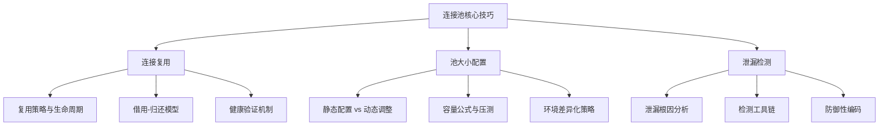
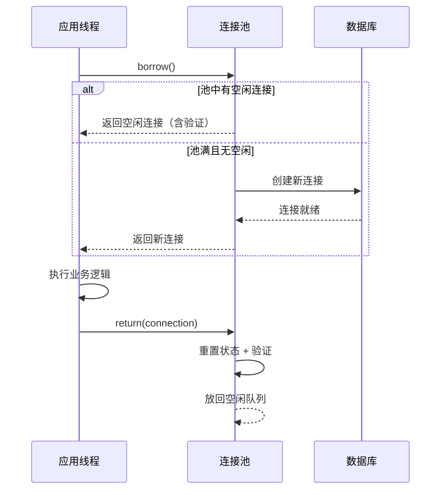
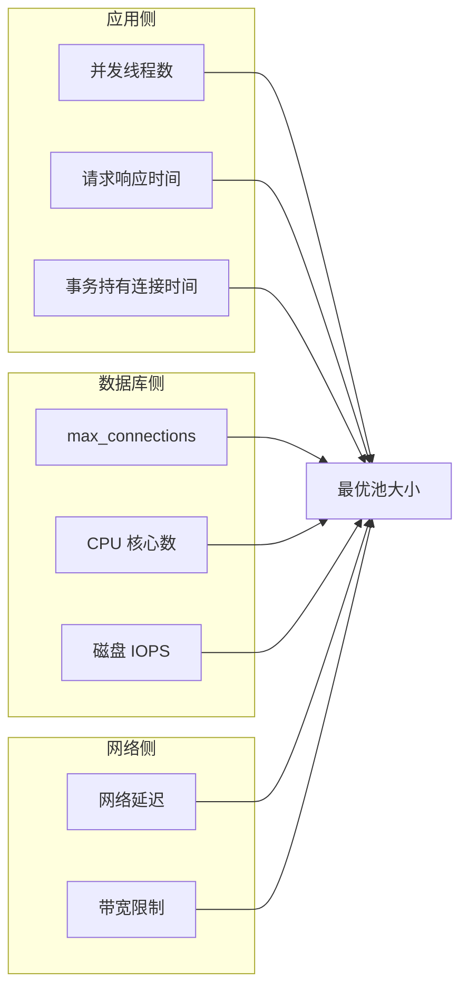
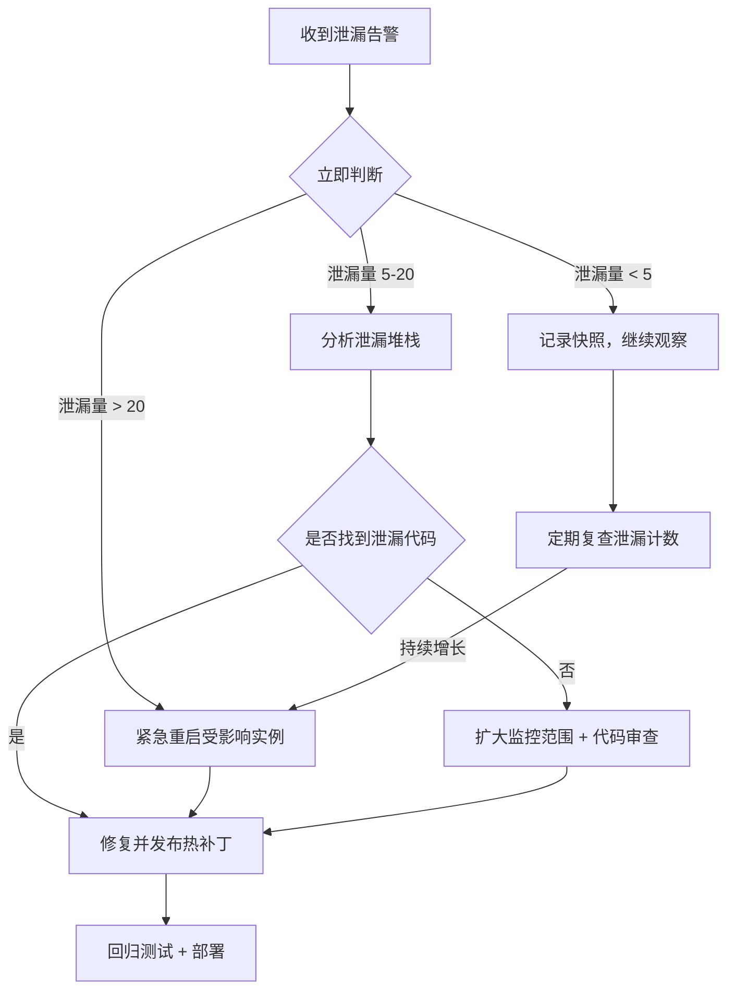

# 核心技巧

连接池从"能用"到"用好"，中间隔着三道核心门槛：如何最大化复用连接以减少创建开销，如何确定池的大小以平衡吞吐与资源，以及如何在连接泄漏发生时快速定位并修复。本节围绕这三大核心技巧展开，每项技巧都从原理出发，落地到可执行的配置方案和监控手段。



## 一、连接复用

连接复用是连接池存在的根本理由。一次数据库 TCP 连接的建立涉及 DNS 解析、三次握手、TLS 协商（如启用 SSL）、数据库认证等步骤，在 PostgreSQL 中实测单次建连耗时约 15-50ms，在跨可用区部署时可达 100ms 以上。如果每次请求都新建连接，高并发下这些开销会呈线性增长，成为系统瓶颈。

### 1.1 复用模型

连接池中的复用本质上是一个"借用-归还"模型：



关键设计决策包括：

| 决策点 | 选项 A | 选项 B | 选择依据 |
|--------|--------|--------|----------|
| 借用策略 | 先进先出（FIFO） | 后进先出（LIFO） | LIFO 使连接保持温热，减少冷启动验证开销，HikariCP 默认采用 |
| 归还前验证 | 执行 testQuery | 仅检查 socket 状态 | testQuery 更可靠但有额外开销，HikariCP 默认不执行 testQuery，依赖 JDBC4 isValid() |
| 异常处理 | 归还并标记可疑 | 直接丢弃 | 取决于异常类型——网络超时应丢弃，事务回滚后可归还 |

### 1.2 HikariCP 的复用优化

HikariCP 之所以能在性能基准测试中持续领先（在《Java Connection Pool Shootout》中稳居第一），核心在于三个设计：

**ConcurrentBag 无锁借用**：传统连接池（如早期 C3P0、DBCP）使用 `synchronized` 或 `ReentrantLock` 管理连接列表，在高并发下产生严重的锁竞争。HikariCP 的 ConcurrentBag 利用 ThreadLocal 为每个线程维护本地连接列表，借用时先查本地列表（零竞争），本地列表为空时才去全局队列获取，全局队列采用 CAS 无锁操作。

```java
// HikariCP ConcurrentBag 核心逻辑简化
public T borrow(long timeout, final TimeUnit timeUnit) throws InterruptedException {
    // 快速路径：从当前线程的 ThreadLocal 获取
    final T bagItem = threadList.get();
    if (bagItem != null &amp;&amp; compareOwner(bagItem)) {
        return bagItem;
    }
    
    // 慢速路径：遍历全局列表，CAS 竞争
    for (T item : bag) {
        if (item.compareOwner thread(null)) {
            if (item.getState() == STATE_NOT_IN_USE) {
                // CAS 获取所有权
                if (item.compareOwner(this)) {
                    return item;
                }
            }
        }
    }
    
    // 都没有可用的，等待通知或超时
    waiting++;
    try {
        return synchronizer.poll(timeout, timeUnit);
    } finally {
        waiting--;
    }
}
```

**字节码生成代理**：传统连接池使用 JDK 动态代理（`java.lang.reflect.Proxy`）或 CGLIB 包装 Connection 对象，每次方法调用都经过反射。HikariCP 使用 Javassist 在运行时生成 Connection 的子类字节码，方法调用直接走 JVM 调用路径，开销接近于零。这使得每次 `getConnection()` 和 `close()` 的额外开销从微秒级降至纳秒级。

**极简代码路径**：HikariCP 的 `borrowConnection()` 方法只有约 15 行有效代码，几乎没有分支判断和临时对象分配。相比之下，DBCP2 的同类方法有 80+ 行和大量条件分支。更短的代码路径意味着更好的 CPU 缓存命中率和 JIT 优化效果。

### 1.3 连接状态管理

复用连接时必须正确处理连接状态，否则会出现数据污染——一个请求的事务上下文泄漏到另一个请求中：

```java
// 连接归还时的正确处理流程
public void returnConnection(Connection conn) {
    try {
        // 1. 检查是否有未提交的事务
        if (!conn.getAutoCommit()) {
            conn.rollback();  // 安全回滚，避免脏数据
            conn.setAutoCommit(true);
        }
        
        // 2. 清理可能的临时对象
        conn.clearWarnings();
        
        // 3. 归还到池中
        pool.returnInternal(conn);
    } catch (SQLException e) {
        // 4. 归还失败，强制丢弃
        pool.discardConnection(conn);
        log.warn("连接归还失败，已丢弃", e);
    }
}
```

**常见状态污染场景**：

| 污染类型 | 表现 | 根因 | 预防措施 |
|----------|------|------|----------|
| 事务泄漏 | 下一个使用者看到未提交的数据 | 借用者未在 finally 中调用 rollback/close | 使用 try-with-resources |
| 连接属性污染 | 自动提交模式、事务隔离级别被修改 | 借用者修改了连接属性未恢复 | 池归还时重置关键属性 |
| 大对象残留 | LOB、临时表未清理 | 只关了 Statement 没处理 LOB 引用 | 归还前执行 reset |
| Prepared 语句泄漏 | 游标耗尽（Oracle） | PreparedStatement 未关闭 | 池使用连接代理拦截 close |

### 1.4 多语言实现对比

连接复用在不同语言生态中的实现各有特点：

| 语言/框架 | 连接池实现 | 复用策略特点 | 默认最大连接数 |
|-----------|-----------|-------------|--------------|
| Java/HikariCP | ConcurrentBag | ThreadLocal + CAS 无锁 | 10 |
| Python/psycopg2 | threading.local | 每线程独立连接，跨线程不复用 | 100 |
| Node.js/mysql2 | 内置池 | 单线程事件循环，天然无锁 | 10 |
| Go/database/sql | 内置池 | goroutine 级别借用，ConnMaxIdleTime 控制 | 0（无限制） |
| C#/ADO.NET | SqlClient 内置池 | 按连接字符串分池，物理连接复用 | 100 |

值得注意的是，Node.js 因为单线程事件循环模型，连接池的实现天然避免了线程竞争问题，但需要特别注意在异步回调中确保连接的正确归还。Go 的 `database/sql` 包内置了连接池，无需引入第三方库，这是 Go 在数据库访问方面的一大优势。

---

## 二、池大小配置

连接池大小的配置是性能调优中最具争议也最容易出错的环节。配置过小会导致请求排队等待，配置过大会耗尽数据库端资源甚至拖垮数据库。

### 2.1 为什么没有"万能公式"

连接池的最优大小取决于多个相互制约的因素：



一个常见的误解是将池大小设为 CPU 核心数的 2 倍。这个经验法则来源于 CPU 密集型任务的线程池配置，但数据库连接大部分时间在等待 I/O（网络往返 + 磁盘读写），CPU 核心数与最优连接数之间没有直接关系。

### 2.2 Little's Law 经典公式

排队论中的 Little's Law 给出了理论上的最优连接数：

最优连接数 = 并发请求数 × 平均响应时间(秒) × (1 + 缓冲系数)

**实例计算**：

假设一个 Web 服务有以下参数：
- 并发线程数：200（由 Web 容器线程池决定）
- 平均数据库查询时间：10ms（0.01s）
- 缓冲系数：0.2（预留 20% 余量应对波动）

最优连接数 = 200 × 0.01 × 1.2 = 2.4 → 向上取整为 3

这个结果可能出乎意料——对于大部分 Web 应用，3-5 个数据库连接就够了。原因是数据库查询通常很快（毫秒级），连接的实际占用时间很短。只有在查询耗时较长（如复杂报表、跨表关联）或网络延迟较高时，才需要更大的连接池。

### 2.3 容量规划表

以下是不同场景下的连接池大小推荐值：

| 场景 | 并发量 | 平均查询耗时 | 推荐池大小 | PostgreSQL max_connections |
|------|--------|-------------|-----------|--------------------------|
| 微服务 CRUD | 50 | 5ms | 2-3 | 20-30 |
| Web 应用 | 200 | 10ms | 5-8 | 50-100 |
| 报表查询服务 | 50 | 200ms | 10-15 | 100-200 |
| 批量数据导入 | 10 | 500ms | 5-8 | 50 |
| 连接池中间件（PgBouncer） | 1000+ | N/A | 100-200（到后端） | 100（共享模式） |

### 2.4 动态调参与压力测试

静态配置无法适应流量波动。生产环境中推荐两种动态策略：

**策略一：基于指标的自动调参**

通过监控连接池的借用率（active/total）动态调整池大小：

```java
// 动态调参伪代码
@Scheduled(fixedRate = 30000)  // 每 30 秒检查
public void autoTunePoolSize() {
    double utilization = pool.getActiveConnections() / pool.getTotalConnections();
    
    if (utilization > 0.8 &amp;&amp; pool.getTotalConnections() < maxPoolSize) {
        // 连接使用率超过 80%，扩容
        pool.resize(pool.getTotalConnections() + 2);
        log.info("池扩容至 {}", pool.getTotalConnections());
    } else if (utilization < 0.3 &amp;&amp; pool.getTotalConnections() > minPoolSize) {
        // 连接使用率低于 30%，缩容
        pool.resize(pool.getTotalConnections() - 1);
        log.info("池缩容至 {}", pool.getTotalConnections());
    }
}
```

**策略二：压力测试确定最优值**

使用 JMeter 或 Gatling 对目标场景进行压力测试，逐步增加并发数，观察连接池的关键指标：

测试步骤：
1. 从 10 并发开始，逐步增加到 500
2. 每级并发运行 5 分钟，记录以下指标：
   - 借用等待时间（connectionWaitDuration）
   - 连接借用成功率
   - 数据库 CPU 和内存使用率
   - 应用端 P99 延迟
3. 找到拐点：借用等待时间开始非线性增长时的并发数
4. 将拐点对应的连接数作为池大小上限

### 2.5 避免常见配置错误

**错误一：minimumIdle = maximumPoolSize（固定池大小）**

HikariCP 官方文档明确建议不要设置 `minimumIdle`，让它与 `maximumPoolSize` 保持一致（即固定池大小）。这是因为动态调整池大小本身有开销，且在流量突增时临时创建连接会导致请求延迟毛刺。但在流量波动较大的场景（如夜间低流量），适当调低 `minimumIdle` 可以节省数据库资源。

**错误二：忽视数据库端限制**

PostgreSQL 的 `max_connections` 是硬限制。如果应用连接池总数 × 应用实例数 > 数据库 `max_connections`，新连接会被拒绝。解决方案：

- 使用连接池中间件（如 PgBouncer）在应用和数据库之间建立连接复用层
- 减少应用端池大小，增加中间件层的连接复用
- 适当提高 `max_connections`（但过高会影响 PostgreSQL 性能，因为每个连接对应一个后端进程）

# PostgreSQL max_connections 合理范围参考
# 默认值：100
# 小型应用（单实例）：100-200
# 中型应用（2-5 实例 + PgBouncer）：200-500
# 大型应用（需谨慎，配合 PgBouncer 事务模式）：500-1000

**错误三：connectionTimeout 设置过短**

`connectionTimeout` 过短会导致正常请求在数据库短暂繁忙时被拒绝。推荐值：

- 最低 3 秒（避免正常的等待被误判为超时）
- 高并发场景 5-10 秒
- 如果经常超时，说明池大小不够，而非 timeout 需要调大

---

## 三、泄漏检测

连接泄漏是连接池系统中最隐蔽也最具破坏性的问题之一。一个未归还的连接会永久占用池中的一个位置，随着泄漏连接的积累，可用连接逐渐减少，最终导致所有新请求阻塞在 `borrowConnection()` 上。

### 3.1 泄漏的根因分析

连接泄漏的根本原因几乎总是代码层面的资源管理失误：

```java
// 泄漏模式一：异常路径未归还（最常见）
public User getUser(int id) {
    Connection conn = dataSource.getConnection();
    PreparedStatement ps = conn.prepareStatement("SELECT * FROM users WHERE id = ?");
    ps.setInt(1, id);
    ResultSet rs = ps.executeQuery();
    
    if (rs.next()) {
        User user = mapUser(rs);
        // ⚠️ 这里直接 return，连接没有关闭！
        return user;
    }
    
    conn.close();  // 只在 rs.next() 为 false 时执行
    return null;
}
```

```java
// 泄漏模式二：finally 块中的异常掩盖了连接关闭
public void transfer(int from, int to, BigDecimal amount) {
    Connection conn = dataSource.getConnection();
    try {
        conn.setAutoCommit(false);
        // ... 转账逻辑 ...
        conn.commit();
    } catch (Exception e) {
        conn.rollback();  // 如果 rollback 抛异常呢？
    } finally {
        conn.close();  // 如果上面的 rollback 抛异常，这行不会执行
    }
}
```

```java
// 泄漏模式三：连接被长期持有
public void processLargeDataset() {
    Connection conn = dataSource.getConnection();
    // ⚠️ 在长时间处理数据期间一直持有连接
    // 可能持续数分钟甚至数小时
    for (BigRecord record : dataset) {
        processRecord(conn, record);  // 每条记录都用同一个连接
    }
    conn.close();
}
```

### 3.2 泄漏检测工具链

**HikariCP 内置检测**

HikariCP 提供了内置的连接泄漏检测机制，当连接被借出后超过 `leakDetectionThreshold` 未归还时，会打印警告日志：

```java
HikariConfig config = new HikariConfig();
config.setLeakDetectionThreshold(60000);  // 60 秒未归还则告警
config.setPoolName("PrimaryPool");

// 泄漏检测触发时的日志：
// WARNING: Connection leak detection triggered for connection 
// abc123, stack trace follows
// java.lang.Exception: Apparent connection leak detected
//     at com.zaxxer.hikari.HikariDataSource.getConnection(HikariDataSource.java:120)
//     at com.example.UserService.getUser(UserService.java:45)
//     ...
```

**生产环境配置建议**：

| 参数 | 开发环境 | 测试环境 | 生产环境 |
|------|---------|---------|---------|
| leakDetectionThreshold | 10000 (10s) | 30000 (30s) | 60000-300000 (1-5min) |
| logUnclosedConnections | true | true | true |
| 关闭时机 | 始终开启 | 始终开启 | 短期诊断时开启（有性能开销） |

**JDBC4 的 isValid 机制**

JDBC 4.0（Java 6+）引入了 `Connection.isValid(int timeout)` 方法，可以在归还连接时验证其有效性。如果连接已经泄漏了一段时间，底层的 TCP 连接可能已被数据库端关闭，`isValid()` 会返回 false，帮助发现泄漏：

```java
// 连接归还时的健康检查
public void returnConnection(Connection conn) {
    try {
        if (!conn.isValid(5)) {  // 5 秒超时验证
            log.warn("连接已失效，丢弃");
            conn.close();
            return;
        }
        // 有效则归还
        pool.returnConnection(conn);
    } catch (SQLException e) {
        // 验证失败，丢弃
        conn.close();
    }
}
```

**开源检测工具**

| 工具 | 功能 | 适用场景 |
|------|------|----------|
| P6Spy | 拦截并记录所有 JDBC 调用，含 SQL 和耗时 | 开发调试，性能分析 |
| datasource-metrics | Spring Boot Actuator 连接池指标暴露 | 监控告警 |
| pgBadger | PostgreSQL 日志分析，发现连接异常 | 数据库端诊断 |
| jdbcdslog | JDBC 连接跟踪日志 | 追踪连接生命周期 |

### 3.3 防御性编码规范

预防连接泄漏的最佳手段是建立编码规范，确保每个连接在所有代码路径上都能正确归还：

**规范一：强制使用 try-with-resources**

```java
// ✅ 正确：try-with-resources 保证关闭
public User getUser(int id) {
    try (Connection conn = dataSource.getConnection();
         PreparedStatement ps = conn.prepareStatement("SELECT * FROM users WHERE id = ?")) {
        ps.setInt(1, id);
        try (ResultSet rs = ps.executeQuery()) {
            if (rs.next()) {
                return mapUser(rs);
            }
        }
    } catch (SQLException e) {
        throw new DataAccessException("查询用户失败", e);
    }
    return null;
}
```

**规范二：封装模板方法，集中管理连接生命周期**

```java
// ✅ 正确：模板方法封装连接管理
public <T> T executeQuery(String sql, ResultSetMapper<T> mapper, Object... params) {
    try (Connection conn = dataSource.getConnection();
         PreparedStatement ps = conn.prepareStatement(sql)) {
        for (int i = 0; i < params.length; i++) {
            ps.setObject(i + 1, params[i]);
        }
        try (ResultSet rs = ps.executeQuery()) {
            return mapper.map(rs);
        }
    } catch (SQLException e) {
        throw new DataAccessException("查询执行失败: " + sql, e);
    }
}

// 使用时无需手动管理连接
User user = executeQuery(
    "SELECT * FROM users WHERE id = ?",
    rs -> mapUser(rs),
    userId
);
```

**规范三：代码审查 Checklist**

在代码审查中强制检查以下连接管理要点：

□ 所有 Connection/Statement/ResultSet 都在 try-with-resources 中使用
□ 异常处理路径不会跳过 close 操作
□ 事务方法的 finally 块包含 rollback + close
□ 长时间批处理操作分批归还连接
□ 连接属性（autoCommit, transactionIsolation）在使用前后保持一致
□ 无跨方法传递裸 Connection 对象的情况

### 3.4 泄漏应急响应流程

当生产环境出现连接泄漏告警时，应按以下流程处理：



**应急工具箱**：

1. **快速定位**：查看 HikariCP 日志中的 `Apparent connection leak detected`，获取泄漏的堆栈信息
2. **影响评估**：执行 `SELECT count(*) FROM pg_stat_activity WHERE state = 'idle'` 查看空闲连接数
3. **临时缓解**：调整 `maxLifetime` 参数强制回收长期占用的连接（如从默认 30 分钟改为 10 分钟）
4. **根因修复**：根据堆栈定位泄漏代码，修复后通过灰度发布验证

---

## 本节小结

三大核心技巧的内在关系是递进且互补的：

- **连接复用**解决了"为什么需要连接池"的根本问题——通过复用避免重复建连的开销，是性能提升的基础
- **池大小配置**解决了"连接池开多大"的容量问题——过小影响吞吐，过大浪费资源甚至拖垮数据库，需要结合 Little's Law 和压力测试确定
- **泄漏检测**解决了"连接池如何健康运转"的运维问题——连接泄漏是连接池系统中最隐蔽的故障模式，需要通过编码规范预防、工具检测发现、应急流程处理

三者共同构成了连接池从设计到运维的完整闭环：复用是机制，配置是策略，检测是保障。
