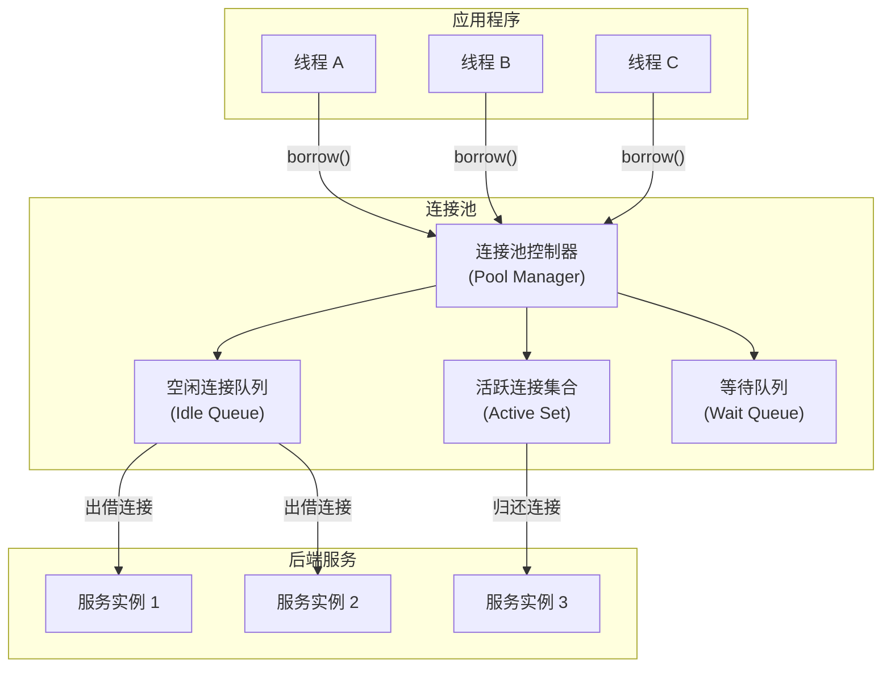
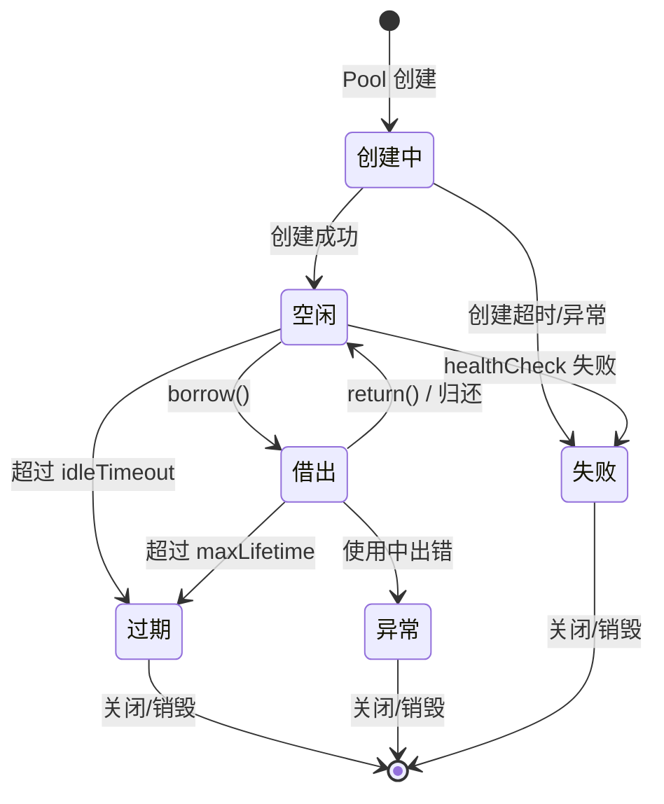

# 连接池原理

## 1. 为什么需要连接池

### 1.1 连接的代价

在分布式系统中，"连接"是一种昂贵的资源。无论是数据库 TCP 连接、HTTP 长连接、Redis 连接还是消息队列连接，每一次建立连接都需要经历完整的生命周期：

- **TCP 三次握手**：客户端发送 SYN → 服务端返回 SYN-ACK → 客户端确认 ACK，至少需要 1.5 个 RTT（Round-Trip Time）。在跨机房场景下，单次 RTT 可能达到 1-5ms，这意味着仅握手就需要 1.5-7.5ms。
- **TLS 握手**：如果使用 HTTPS/TLS 加密连接，还需要额外的 TLS 协商过程。TLS 1.3 需要 1-RTT，TLS 1.2 需要 2-RTT，这又增加了数毫秒的延迟。在需要前向保密（PFS）的场景下，TLS 1.3 的 0-RTT 模式虽然更快，但存在重放攻击风险，通常仅用于幂等请求。
- **协议层初始化**：MySQL 需要完成认证握手（用户名/密码验证、字符集协商、能力标志交换）；Redis 需要发送 AUTH 命令；HTTP/2 需要 SETTINGS 帧协商和 WINDOW_UPDATE 初始化；gRPC 需要 HTTP/2 帧协商加上 Protobuf 编解码器的初始化。
- **内核资源分配**：每次连接在操作系统内核中都需要分配 socket 文件描述符、TCP 缓冲区（发送缓冲区默认 16KB-256KB，接收缓冲区类似）、以及关联的内存结构（`struct sock` 约占 1.5-2KB 内核内存）。
- **DNS 解析**：首次连接时可能还需要 DNS 解析，虽然 DNS 缓存可以缓解，但在 TTL 过期或缓存失效时，一次 DNS 查询可能耗时 10-100ms（取决于递归查询的深度和上游 DNS 服务器的响应速度）。

一个典型的数据查询操作可能只需要 2-5ms，但建立连接本身就需要 5-15ms。如果每次请求都新建连接，连接建立的开销可能占到总耗时的 **50% 以上**。

更严重的问题是**资源耗尽风险**。每个 TCP 连接都占用文件描述符、内存和端口资源：

| 资源类型 | 单个连接消耗 | 10,000 并发连接消耗 |
|----------|-------------|-------------------|
| 文件描述符 | 1 个 fd | 10,000 个 fd |
| 内核内存 | ~3KB (sock 结构) | ~30MB |
| TCP 缓冲区 | ~64KB (收发合计) | ~640MB |
| 端口（客户端） | 1 个临时端口 | 10,000 个临时端口 |

如果每个请求都创建新连接然后销毁，系统将面临：

1. **TIME_WAIT 堆积**：TCP 连接关闭后进入 TIME_WAIT 状态，持续 2MSL（Linux 默认 60 秒）。以每秒 1000 个新连接计算，60 秒内会累积 60,000 个 TIME_WAIT 连接，占用大量端口和内存。可以通过 `net.ipv4.tcp_tw_reuse=1` 允许复用 TIME_WAIT 连接，但这仅对客户端发起的连接有效，且需要开启时间戳选项。
2. **文件描述符耗尽**：Linux 默认 `ulimit -n` 通常为 1024 或 65535，高并发下极易触发 "Too many open files" 错误。即使调高了应用层限制，系统级的 `/proc/sys/fs/file-max` 也可能成为瓶颈。
3. **CPU 浪费**：频繁的连接建立/销毁消耗大量 CPU 周期在内核网络栈处理上。每次连接建立涉及多次内存分配、锁操作和上下文切换，在高并发下 CPU 的内核态占比可能飙升到 30% 以上。
4. **连接风暴**：当数据库重启或网络闪断恢复时，所有客户端同时尝试重建连接，形成"惊群效应"（thundering herd），可能导致数据库再次因过载而崩溃。连接池通过限制新建速率和指数退避策略可以有效缓解这个问题。

### 1.2 连接池的核心思想

连接池的本质是**用空间换时间，用复用换创建**。其核心思想非常朴素：

> 既然建立连接很贵，那就提前建好一批连接，用的时候从池子里拿一个，用完了放回去，而不是销毁。

这就像现实世界中的出租车调度：乘客不需要自己买车（创建连接），也不需要每次出行都买一辆新车再卖掉（创建后销毁）。出租车公司维护一个车队（连接池），乘客上车（获取连接）→ 到达目的地（完成业务操作）→ 下车（归还连接），车辆继续服务下一位乘客。

但出租车类比有一个局限：现实中的出租车在"归还"后需要清洁、检查油量等维护工作，而连接池中的连接在归还时也需要"维护"——回滚未提交事务、重置会话状态、执行健康检查。这个过程在连接池术语中称为 **connection reset** 或 **connection cleanup**。

连接池解决的核心问题：

| 问题 | 无连接池 | 有连接池 |
|------|---------|---------|
| 连接延迟 | 每次 5-15ms 握手 | 近乎 0ms（从池中取） |
| 资源消耗 | 频繁创建/销毁 | 稳定复用 |
| 并发能力 | 受限于新建速率 | 受限于池大小 |
| 系统稳定性 | 连接风暴风险 | 平滑流量 |
| 资源可控性 | 难以限制 | 池大小即上限 |
| 故障隔离 | 单个慢请求影响全局 | 超时快速失败，保护全局 |

### 1.3 历史演进

连接池的概念并非现代产物，它的演进与计算机网络和数据库技术的发展紧密相关：

**第一阶段：裸连接时代（1990s）**

早期的数据库驱动（如 ODBC 1.0、JDBC 1.0）没有连接池概念。每个应用程序线程直接建立和销毁数据库连接。单机应用、低并发场景下这不成问题，但随着 Web 应用兴起，并发量急剧上升，连接开销成为瓶颈。这个时代的典型架构是 CGI（Common Gateway Interface）——每个 HTTP 请求 fork 一个进程，建立一个数据库连接，用完销毁。在 Apache 的 prefork 模式下，一个中等负载的网站可能每秒创建数百个进程和连接。

**第二阶段：应用内置连接池（2000s）**

应用服务器开始内置连接池功能。Apache Commons DBCP（2001 年）和 C3P0（2002 年）是 Java 生态中最早的开源连接池实现。这个阶段的连接池功能简单，主要提供基本的创建/借出/归还机制。同期，.NET 生态出现了 ADO.NET 的内置连接池，PHP 生态出现了持久连接（persistent connection）。这个阶段的典型问题是连接泄漏难以排查——没有泄漏检测机制，开发者只能靠经验判断。

**第三阶段：独立连接池中间件（2010s）**

ProxySQL、PgBouncer 等独立的数据库代理层连接池出现。它们在应用和数据库之间建立一个独立的连接池层，多个应用实例共享同一个池，大幅减少了数据库端的连接数。HikariCP（2013 年，由 Brett Wooldridge 开发）以其极致的性能（基于 CAS 无锁队列，字节码级别的优化）成为 Java 生态的事实标准。同期 Node.js 生态的 `pg-pool`、Python 的 `SQLAlchemy` 内置池也趋于成熟。

**第四阶段：云原生连接池（2020s）**

Service Mesh（如 Istio）在 sidecar 代理层实现 L4 连接池，对应用完全透明。Envoy 代理内置的连接池支持自动发现、负载均衡、熔断和重试。Serverless 场景下出现了"连接池即服务"的新范式，如 Amazon RDS Proxy、Azure SQL Database 连接池。云原生环境要求连接池支持动态扩缩、多租户隔离和细粒度监控。Kubernetes 环境中，连接池还需要考虑 Pod 重启、节点漂移和 DNS 变更等特殊场景。


## 2. 连接池的核心概念模型

### 2.1 基本架构

一个完整的连接池由以下核心组件构成：



各组件的职责：

- **连接池控制器（Pool Manager）**：整个池的"大脑"，负责协调连接的创建、借出、归还和销毁。它维护全局状态（连接总数、活跃数、空闲数），管理等待队列的唤醒策略，执行健康检查和泄漏检测。在实现上，控制器通常是一个单例对象，内部通过原子变量或锁来保证线程安全。
- **空闲连接队列（Idle Queue）**：存放已建立但未被使用的连接。通常使用 FIFO（先进先出）或 LIFO（后进先出）策略。HikariCP 使用 LIFO 策略——优先复用最近使用的连接，因为最近使用的连接更可能仍然有效（"热连接"），减少了健康检查失败的概率。
- **活跃连接集合（Active Set）：** 当前正在被应用线程使用的连接。集合中的每个连接都关联了借出时间、借出线程等元数据，用于泄漏检测和超时管理。
- **等待队列（Wait Queue）：** 当所有连接都在使用中且池已满时，请求连接的线程在此排队等待。等待队列的实现通常基于 `Condition` 变量（Java）、`asyncio.Queue`（Python）或 `Promise`（Node.js）。队列可以设置最大长度和等待超时。

### 2.2 连接的生命周期

连接池中的每一个连接都经历明确的生命周期状态转换：



每个状态的含义：

| 状态 | 说明 | 典型时间 |
|------|------|---------|
| **创建中** | 连接正在建立（TCP 握手 + 协议初始化） | 1-15ms |
| **空闲** | 连接已建立，等待被借出 | 0 到 idleTimeout |
| **借出** | 连接正在被某个线程使用 | 0 到 maxLifetime |
| **异常** | 连接在使用过程中发生错误 | 立即处理 |
| **过期** | 连接超过最大存活时间，准备销毁 | 立即处理 |
| **失败** | 连接健康检查未通过 | 立即处理 |

值得注意的是，**空闲 → 失败** 这条路径是很多连接池故障的根源。连接在空闲期间可能因为网络中断、服务端重启、防火墙规则变更等原因变得不可用，但客户端并不知道。这就是为什么"借出时检查"和"空闲时检查"缺一不可——前者是最后一道防线，后者是主动排雷。

### 2.3 关键操作语义

连接池对外暴露的 API 通常只有几个核心操作，但每个操作背后都有复杂的逻辑：

**borrow（借出/获取）**

```text
1. 检查空闲队列是否有可用连接
   ├── 有 → 取出，执行健康检查
   │       ├── 通过 → 返回连接（记录借出时间、线程信息）
   │       └── 不通过 → 销毁该连接，回到步骤 1（循环直到找到可用连接或池为空）
   └── 无 → 检查是否可创建新连接
             ├── 可以（activeCount < maxPoolSize）
             │       → 创建新连接（含超时控制）
             │       ├── 成功 → 返回连接
             │       └── 失败 → 进入等待队列
             └── 不可以 → 进入等待队列
                          ├── 等待中收到归还的连接 → 获取并返回
                          ├── 等待超时(connectionTimeout) → 抛出 ConnectionTimeoutException
                          └── 线程被中断 → 抛出 InterruptedException
```

**return（归还/释放）**

```text
1. 将连接从活跃集合移到空闲队列
2. 执行连接重置
   ├── 回滚未提交的事务（autocommit 模式检查）
   ├── 清除会话变量（如 MySQL 的 SET 语句设置的临时变量）
   ├── 重置连接属性（如 read-only 标志）
   └── 关闭未关闭的 Statement/Resultset（部分驱动自动处理）
3. 执行健康检查（可选，取决于配置）
   ├── 通过 → 放回空闲队列
   └── 不通过 → 销毁连接
4. 通知等待队列中的线程（如果有线程在等待连接）
```

**invalidate（失效/销毁）**

```text
1. 从活跃集合或空闲队列中移除
2. 关闭底层 socket/连接
3. 释放关联的内存和文件描述符
4. 如果活跃数 + 空闲数 < minIdle，触发异步补充
5. 记录销毁原因（超时/错误/健康检查失败/手动失效）用于监控
```

### 2.4 连接状态的"守护者"——后台任务

连接池不仅仅被动响应 borrow/return 请求，还会主动运行后台任务来维护池的健康：

- **空闲连接清理器（Housekeeper）**：定期扫描空闲队列，销毁超过 `idleTimeout` 的连接。HikariCP 默认每 30 秒执行一次清理。清理器还需要确保空闲连接数不低于 `minPoolSize`，不足时触发补充。
- **连接补充器（Housekeeping/Maintenance）**：当空闲连接数低于 `minPoolSize` 时，异步创建新连接补充到池中。补充器通常采用增量策略——每次只补充 1 个连接，避免突发创建导致后端压力骤增。
- **连接超时检查器**：定期扫描所有连接（包括活跃和空闲），销毁超过 `maxLifetime` 的连接。这个检查器是防止"半开连接"的关键机制。
- **泄漏检测器（Leak Detector）**：定期扫描活跃连接集合，标记借出时间超过 `leakDetectionThreshold` 的连接并输出告警日志。

这些后台任务通常共用一个调度线程（或定时器），以避免过多的后台线程消耗资源。

## 3. 连接池的核心参数

连接池的行为完全由参数控制。理解每个参数的含义和相互影响，是正确配置连接池的前提。

### 3.1 参数详解

| 参数 | 含义 | 典型值 | 影响 |
|------|------|--------|------|
| **minPoolSize** | 池中保持的最小连接数 | 5-10 | 保证最低可用连接数，避免冷启动延迟。设置过大会浪费后端资源，设置过小会在流量突增时来不及创建新连接 |
| **maxPoolSize** | 池中允许的最大连接数 | 10-50 | 控制并发上限和后端压力。这是最需要谨慎设置的参数 |
| **idleTimeout** | 空闲连接的最大存活时间 | 300s-600s | 过大浪费资源，过小导致频繁创建。在流量波动大的场景下，建议设为 300s |
| **maxLifetime** | 连接的最大总存活时间 | 1800s-3600s | **必须小于**服务端的 `wait_timeout`，建议设为服务端超时的 75%-90% |
| **connectionTimeout** | 获取连接的最大等待时间 | 30s | 过小导致频繁失败，过大导致线程长时间阻塞。在 Web API 场景下，建议不超过 5s |
| **validationTimeout** | 健康检查的超时时间 | 3s-5s | 控制健康检查的开销。必须小于 connectionTimeout，否则会出现"检查还没完成但获取已超时"的情况 |
| **maxIdleTime** | 连接最大空闲时间（含被借出后的空闲） | 600s | 比 idleTimeout 更严格，回收长期未用的连接 |
| **leakDetectionThreshold** | 连接泄漏检测阈值 | 60s-300s | 超过此时间未归还则记录告警。生产环境必须开启，开发环境建议设为 0（禁用）以减少噪音 |
| **connectionTestQuery** | 健康检查 SQL | `SELECT 1` | 验证连接是否仍然有效。对于支持 JDBC4 `isValid()` 的驱动，可以不设置此参数 |
| **initializationFailTimeout** | 初始化失败超时 | 1000ms | 池创建时如果无法建立 minPoolSize 个连接，等待多久后抛出异常。设为 0 表示不等待，池在后台异步补充 |

### 3.2 参数间的相互关系

这些参数并非独立作用，而是形成复杂的相互约束关系：

```text
minPoolSize ≤ idleCount + activeCount ≤ maxPoolSize

idleTimeout < maxLifetime（否则 idleTimeout 永远不会触发）

connectionTimeout 必须 > validationTimeout（否则获取超时但检查还没完成）

leakDetectionThreshold 应 > 业务最长操作时间（避免误报）

initializationFailTimeout 应 > 创建一个连接的耗时（否则启动时可能误报失败）
```

一个常见的配置决策场景：

> 你的数据库服务端设置了 `wait_timeout=300s`（MySQL 默认 8 小时，但生产环境通常缩短）。你必须确保连接池的 `maxLifetime < 300s`，否则应用会拿到一个已被服务端关闭的"半开连接"，使用时才发现连接已断。

更隐蔽的陷阱：**maxLifetime 不是"空闲超时"而是"总存活超时"**。一个连接被频繁借出/归还，即使从未空闲超过 idleTimeout，也可能因为总存活时间超过 maxLifetime 而被销毁。这在高并发场景下是正常行为，但在调试时可能令人困惑——"这个连接明明刚用过，为什么被销毁了？"

### 3.3 连接池大小的影响

池大小（maxPoolSize）是最重要的参数之一，但它不是越大越好。需要考虑的因素：

**后端服务承受能力**

数据库服务器的 `max_connections` 是硬上限。如果 10 个应用实例各配置 maxPoolSize=50，总共需要数据库支持 500 个连接。MySQL 在 500 连接时性能已经开始下降（InnoDB 的 `kernel_mutex` 成为瓶颈），PostgreSQL 的推荐上限通常在 200-400 之间（超过后 `procarray` 锁竞争加剧）。

计算公式：

```text
总连接数 = 应用实例数 × 每实例 maxPoolSize + 管理/监控连接 + 缓冲余量

安全配置：
  maxPoolSize ≤ (数据库 max_connections × 0.8 - 管理连接) / 应用实例数
```

**CPU 核心数**

对于计算密集型的后端操作，过多的并发连接反而会导致上下文切换开销增加。一个经验法则是：

```text
数据库连接数 ≈ CPU 核心数 × 2 + 磁盘数

示例：
  4 核 1 块 SSD → 8-10 个连接
  8 核 2 块 SSD → 16-20 个连接
  16 核 4 块 SSD → 32-40 个连接
```

这个公式来自 PostgreSQL 社区的经验总结，对 MySQL 同样适用。核心逻辑是：每个连接在数据库端对应一个服务线程，当连接数远超 CPU 核心数时，线程间的上下文切换开销会抵消并发带来的收益。

**网络带宽**

每个连接都占用一定的带宽（协议开销、keep-alive 心跳等）。在 1Gbps 网络下，数千个空闲连接的 keep-alive 流量就可能占满带宽。以 MySQL 为例，默认的 `wait_timeout` 心跳间隔为 8 小时，但如果配置了更短的心跳（如 60 秒），1000 个空闲连接每秒就会产生约 1000 × 64 字节 = 64KB 的心跳流量。

**内存消耗**

如前文所述，每个连接在客户端和服务端都占用内存。过多连接会挤压业务逻辑的可用内存。以 PostgreSQL 为例，每个后端进程约占 5-10MB 内存（包含工作内存、维护内存等），500 个连接就意味着 2.5-5GB 的固定内存开销。

## 4. 连接池的核心机制

### 4.1 连接创建策略

连接池通常支持三种创建策略，各有适用场景：

**预创建（Pre-create）**

在池初始化时就创建 `minPoolSize` 个连接。优点是应用启动后立即可用，没有冷启动延迟。缺点是启动时间变长，如果后端服务启动较慢，可能导致应用启动超时。适用于后端服务稳定且启动时间可预期的场景。

**懒创建（Lazy-create）**

池初始化时只记录配置，第一个 borrow 请求到来时才创建连接。优点是启动快，缺点是首个请求延迟高。很多生产系统采用"混合策略"：启动时预创建少量连接（如 minPoolSize 的 50%），其余按需创建。适用于后端服务启动慢或不确定的场景。

**后台补充（Background Fill）**

当池中空闲连接数低于 `minPoolSize` 时，启动后台线程异步创建新连接补充到池中。这是大多数现代连接池的默认行为，兼顾了响应速度和资源消耗。关键实现细节：补充操作应该是**逐个创建**而非批量创建，以避免同时发起大量连接导致后端压力骤增。

```java
// HikariCP 的后台补充机制（简化版）
void ensureMinIdle() {
    int idle = idleConnections.size();
    int active = activeConnections.size();
    if (idle < minIdle &amp;&amp; active + idle < maxPoolSize) {
        // 异步创建新连接（注意：每次只创建一个）
        asyncCreateConnection();
    }
}
```

```python
# SQLAlchemy 的连接池补充（简化版）
class QueuePool:
    def _create_connection(self):
        """创建一个新连接并加入池中"""
        conn = self._creator()
        self._pool.append(conn)
        self._count += 1

    def _check_idle(self):
        """定期检查：如果空闲连接不足，补充"""
        if self._idle_count < self._min_size:
            self._create_connection()
```

### 4.2 连接健康检查

连接在使用过程中可能因为网络抖动、服务端重启、超时断开等原因变得不可用。健康检查是连接池保证连接质量的核心机制。主流的检查策略分为四种：

**借出时检查（Borrow-time Check）**

在将连接交给应用线程之前，执行一次快速的健康检查。通常只是执行一个轻量级查询（如 `SELECT 1` 或 `SELECT 1 FROM DUAL`），确认连接仍然畅通。这是最基础的检查，能发现大多数连接问题。

```text
借出时检查的权衡：
  检查 → 多一次网络往返（0.1-1ms），但保证连接可用
  不检查 → 省了 0.1-1ms，但可能拿到坏连接（故障概率随空闲时间增长）

建议：生产环境必须开启，开发环境可关闭以加速调试
```

**空闲时检查（Idle-time Check）**

定期扫描空闲队列中的连接，执行健康检查。对于长时间空闲的连接，服务端可能已经关闭了它们。空闲检查的频率通常为每 30 秒到 5 分钟一次。

空闲检查的关键问题是如何平衡检查频率和性能开销：

| 检查间隔 | 优点 | 缺点 | 适用场景 |
|---------|------|------|---------|
| 10s | 快速发现坏连接 | CPU 和网络开销大 | 连接不稳定的环境 |
| 30s | 平衡 | 适中 | 大多数生产环境 |
| 5min | 开销极低 | 可能延迟发现故障 | 连接非常稳定的内网环境 |
| 不检查 | 零开销 | 完全依赖借出时检查 | 短连接场景 |

**借出后检查（Post-borrow Check / Return-time Check）**

部分连接池（如 HikariCP）支持在归还时执行检查。这可以发现使用过程中发生的连接异常，避免将有问题的连接放回池中。归还时检查通常比借出时检查更严格，因为不直接影响请求延迟。

```text
归还时检查的流程：
  连接归还 → 执行轻量检查（SELECT 1 或 isValid()）
    ├── 通过 → 放回空闲队列
    └── 不通过 → 销毁连接，触发补充
```

**连接超时检测**

每个连接在创建时记录时间戳，定期检查是否超过 `maxLifetime`。超过的连接必须被销毁，即使它看起来仍然健康。这是因为服务端可能对连接的总存活时间有限制，半开连接（客户端认为有效但服务端已关闭）是最隐蔽的故障。

### 4.3 线程安全与并发控制

连接池在多线程环境下运行，必须保证线程安全。主流实现采用不同的并发控制策略：

**策略一：全局互斥锁（Global Mutex）**

最简单的实现：所有操作都通过同一把锁串行化。优点是实现简单、正确性容易保证。缺点是高并发下锁竞争严重，吞吐量受限。早期版本的 DBCP 采用此策略。

**策略二：分段锁（Segmented Lock）**

将空闲队列分成多个段，每个段独立加锁。线程获取连接时通过哈希定位到对应段，只需锁定该段。这将锁竞争概率降低到 1/N（N 为段数）。C3P0 和早期版本的 DBCP2 采用此策略。分段锁的缺点是段数在初始化时确定，无法动态调整；且当某个段的连接被全部借出时，定位到该段的线程必须等待或创建新连接，无法借用其他段的空闲连接。

**策略三：CAS + 无锁队列**

使用 ConcurrentLinkedQueue（基于 CAS 的无锁队列）存储空闲连接，借出/归还操作不需要加锁。HikariCP 采用此策略，这也是其高性能的关键因素之一。无锁队列在低竞争场景下性能极佳（CAS 一次成功），但在高竞争场景下 CAS 重试可能导致性能下降。HikariCP 通过精细化的原子变量操作（如 `AtomicInteger` 跟踪连接计数）将争用降到最低。

**策略四：每个线程独占池（Thread-Local Pool）**

为每个线程维护一个本地连接栈，大部分操作不需要同步。c3p0 的 `threadConnectionCacheLevel` 和某些数据库驱动的本地缓存采用此策略。缺点是线程数增多时内存消耗增大，且不同线程间的连接无法共享。在协程模型（如 Go 的 goroutine）中，这种策略不太适用，因为 goroutine 数量可以轻松达到数万。

```text
线程安全实现对比：

┌────────────────────┬───────────┬────────────┬──────────┬──────────┐
│ 实现策略           │ 吞吐量    │ 延迟       │ 复杂度   │ 适用场景 │
├────────────────────┼───────────┼────────────┼──────────┼──────────┤
│ 全局互斥锁         │ 低        │ 高(锁竞争) │ 低       │ 低并发   │
│ 分段锁             │ 中        │ 中         │ 中       │ 中并发   │
│ CAS 无锁           │ 高        │ 低         │ 高       │ 高并发   │
│ Thread-Local       │ 极高(单线程)│ 极低      │ 中       │ 线程数可控│
└────────────────────┴───────────┴────────────┴──────────┴──────────┘
```

### 4.4 连接泄漏检测

连接泄漏是指应用获取连接后忘记归还，导致池中的可用连接逐渐耗尽。这是生产环境中最常见的连接池故障之一。

检测机制的典型实现：

```text
1. 借出连接时，记录借出时间戳和调用栈（通过 Exception.fillInStackTrace()）
2. 启动定时器，每 N 秒扫描活跃连接
3. 如果某个连接的借出时间 > leakDetectionThreshold：
   a. 记录 WARN 日志，包含借出时的调用栈
   b. 部分实现会强制归还连接（可能导致数据不一致，谨慎使用）
4. 生产环境通常只告警不强制回收，由人工介入排查
```

**常见泄漏原因及修复方法：**

| 泄漏原因 | 代码示例 | 修复方法 |
|---------|---------|---------|
| finally 块中未归还 | `try { conn = pool.borrow(); ... } catch { ... }` | 在 finally 中始终调用 `pool.return(conn)` |
| 异常路径提前 return | `if (error) return; conn = pool.borrow();` | 确保 borrow 后的所有路径都有对应的 return |
| 缓存到成员变量 | `this.conn = pool.borrow();`（类字段） | 使用完毕立即归还，不要存储在实例字段中 |
| 嵌套事务重复获取 | 外层和内层各 borrow 一次，只 return 一次 | 使用连接的引用计数或框架的事务管理器 |
| lambda/回调中遗漏 | `pool.borrow(conn -> { ... });` 但未处理异常 | 使用 try-with-resources 或确保异常路径也能归还 |

```java
// 错误示例：异常路径上泄漏
Connection conn = null;
try {
    conn = pool.borrow();
    // 如果下面这行抛出异常，连接永远不会被归还
    ResultSet rs = conn.executeQuery("SELECT ...");
    process(rs);
    pool.return(conn);  // 只在正常路径归还
} catch (Exception e) {
    log.error("查询失败", e);
    // conn 没有被归还！
}

// 正确示例：try-finally 保证归还
Connection conn = null;
try {
    conn = pool.borrow();
    ResultSet rs = conn.executeQuery("SELECT ...");
    process(rs);
} catch (Exception e) {
    log.error("查询失败", e);
    // 可选：出错时标记连接为无效
    if (conn != null) pool.invalidate(conn);
    conn = null;  // 防止 finally 中重复归还
} finally {
    if (conn != null) pool.return(conn);
}

// 更好的示例：try-with-resources
try (Connection conn = pool.borrow()) {
    ResultSet rs = conn.executeQuery("SELECT ...");
    process(rs);
}  // 自动归还，即使异常也会执行
```

### 4.5 多租户连接池

在微服务和 SaaS 架构中，一个应用实例可能需要连接到多个数据库实例（如按租户分库、读写分离、多数据源）。多租户连接池的管理策略：

**独立池模式**

每个租户一个独立的连接池实例。隔离性最好——一个租户的连接问题不会影响其他租户。但资源消耗最大，100 个租户需要 100 个连接池。适合租户数少且各租户流量差异大的场景。

```java
// 伪代码：独立池模式
Map<TenantId, HikariPool> tenantPools = new ConcurrentHashMap<>();

HikariPool getPool(TenantId tenant) {
    return tenantPools.computeIfAbsent(tenant, this::createPool);
}

void createPool(TenantId tenant) {
    HikariConfig config = new HikariConfig();
    config.setJdbcUrl(tenant.getJdbcUrl());
    config.setUsername(tenant.getUsername());
    config.setPassword(tenant.getPassword());
    config.setMaximumPoolSize(tenant.isLargeTenant() ? 20 : 5);
    return new HikariPool(config);
}
```

**共享池模式**

所有租户共享一个大连接池，通过路由区分。资源利用率最高——即使有 1000 个租户，也只需要一个连接池。但可能出现"吵闹邻居"问题——某个租户的大量查询阻塞了其他租户。适合租户数多且流量均匀的场景。

```python
# 伪代码：共享池模式
class SharedPool:
    def borrow(self, tenant_id):
        conn = self._pool.borrow()
        # 在连接上设置租户上下文
        conn.execute(f"SET search_path TO tenant_{tenant_id}")
        return conn
```

**混合模式**

大租户使用独立池，小租户共享公共池。兼顾了隔离性和资源效率，是最常见的生产实践。判断标准通常是：月活跃用户 > 阈值（如 10 万）的大租户分配独立池，其余共享。

**连接池池（Pool of Pools）**

当租户数量非常多时（如数千个），需要一个"池的管理者"来管理所有租户的连接池。这个管理者负责：

- 按需创建/销毁租户连接池（LRU 策略淘汰不活跃的租户池）
- 监控所有租户池的总连接数，确保不超过系统上限
- 在租户池之间公平分配资源（防止某个租户的池独占所有文件描述符）

## 5. 连接池的性能模型

### 5.1 延迟分解

一个完整的连接获取-使用-归还流程中，各阶段的延迟分布：

```text
典型场景（MySQL，同机房，查询耗时 3ms）：

无连接池：
  TCP 握手      ████░░░░░░░░░░░░░░░░  3.0ms
  MySQL 握手    ███░░░░░░░░░░░░░░░░░  1.5ms
  业务查询      ██████░░░░░░░░░░░░░░  3.0ms
  连接关闭      ██░░░░░░░░░░░░░░░░░░  1.0ms
  总计                              8.5ms

有连接池：
  从池中获取    ░░░░░░░░░░░░░░░░░░░░  0.01ms
  业务查询      ██████░░░░░░░░░░░░░░  3.0ms
  归还到池      ░░░░░░░░░░░░░░░░░░░░  0.01ms
  总计                              3.02ms

性能提升：约 2.8 倍
```

跨机房场景下差异更为显著（假设 RTT = 3ms）：

```text
无连接池（跨机房）：
  TCP 握手      █████████░░░░░░░░░░░  9.0ms (3 RTT)
  TLS 握手      ██████░░░░░░░░░░░░░░  6.0ms (2 RTT, TLS 1.2)
  MySQL 握手    ████░░░░░░░░░░░░░░░░  6.0ms (2 RTT)
  业务查询      ██░░░░░░░░░░░░░░░░░░  3.0ms (同机房MySQL)
  总计                              24.0ms

有连接池（跨机房）：
  从池中获取    ░░░░░░░░░░░░░░░░░░░░  0.01ms
  业务查询      ██░░░░░░░░░░░░░░░░░░  3.0ms
  总计                              3.01ms

性能提升：约 8 倍
```

### 5.2 吞吐量与池大小的关系

连接池的吞吐量与池大小并非线性关系。随着池大小增加，吞吐量先上升后趋于平稳，甚至可能下降：

```text
吞吐量
  ↑
  │         ┌────────────────── 最优区间
  │        /
  │       /
  │      /
  │     /
  │    /
  │   /
  │──/─────────────────────── 后端饱和
  │ /
  │/
  └──────────────────────────→ 池大小
     5   10   15   20   30   50   100

阶段分析：
- 池大小 < CPU核心数：每增加一个连接，吞吐量近似线性增长
- 池大小 ≈ CPU核心数：吞吐量接近峰值
- 池大小 > CPU核心数：增长放缓，上下文切换开销增加
- 池大小 >> CPU核心数：吞吐量可能下降（锁竞争、调度开销）
```

这个曲线背后的原理是 Amdahl 定律的变体：系统的吞吐量受限于最慢的串行部分。当连接数较少时，增加连接可以并行处理更多请求；但当连接数超过后端服务的处理能力时，多余的连接只会增加排队和调度开销。

### 5.3 Little's Law 在连接池中的应用

Little's Law（利特尔法则）描述了并发用户数、请求速率和平均响应时间之间的关系：

```text
L = λ × W

其中：
L = 系统中的平均并发请求数（即需要的连接数）
λ = 请求到达速率（请求/秒）
W = 平均响应时间（秒）

实际应用：
假设：
  - 系统每秒处理 1000 个请求（λ = 1000）
  - 每个请求平均耗时 10ms（W = 0.01s）
  - 平均并发请求数 L = 1000 × 0.01 = 10

这意味着：连接池大小设置为 10 就能满足平均需求。
如果设置为 5，会有请求排队；设置为 50，有 40 个连接大部分时间空闲。
```

但 Little's Law 计算的是**平均值**，实际场景需要考虑流量波动：

```text
安全配置公式：
  池大小 = L × (1 + 突发系数) + 安全余量

示例：
  平均并发 = 10
  突发系数 = 1.0（2 倍突发）→ 池大小 = 10 × 2 = 20
  突发系数 = 2.0（3 倍突发）+ 安全余量 5 → 池大小 = 10 × 3 + 5 = 35
```

更精确的估算需要考虑请求到达的分布模式。如果请求服从泊松分布（大多数 Web 应用近似），则需要使用排队论模型（M/M/c 队列）来计算在给定延迟约束下需要的最小连接数。

### 5.4 连接池的排队论模型

将连接池建模为 M/M/c 排队系统（泊松到达、指数服务时间、c 个服务器）：

```text
参数定义：
  λ = 请求到达速率（泊松过程）
  μ = 单个连接的服务速率（1 / 平均查询时间）
  c = 连接池大小（maxPoolSize）
  ρ = λ / (c × μ)  —— 利用率因子

关键指标：
  P(wait) = Erlang C 公式，表示请求需要等待的概率
  平均等待时间 = P(wait) / (c × μ - λ)

设计目标：
  通常要求 P(wait) < 5%（即 95% 的请求无需等待）

实际计算示例：
  λ = 100 req/s, μ = 200 req/s（平均 5ms 查询）
  ρ = 100 / (c × 200) = 0.5 / c

  c = 10 → ρ = 0.05, P(wait) ≈ 0.003（0.3%）→ 几乎不需要等待
  c = 5  → ρ = 0.10, P(wait) ≈ 0.015（1.5%）→ 偶尔需要等待
  c = 3  → ρ = 0.167, P(wait) ≈ 0.068（6.8%）→ 超过 5% 阈值
```

这个模型揭示了一个重要结论：**连接池大小的边际效益递减**。从 3 个连接增加到 5 个，等待概率从 6.8% 降到 1.5%（改善显著）；但从 10 个增加到 20 个，等待概率从 0.3% 降到几乎为零（改善微乎其微）。

## 6. 连接池与资源管理

### 6.1 资源分类与管理策略

连接池管理的资源不仅仅是"连接"本身，还包括与连接相关的一系列系统资源：

| 资源类型 | 所属层级 | 管理方式 | 溢出后果 |
|---------|---------|---------|---------|
| TCP Socket | 操作系统 | 文件描述符限制（ulimit, /proc/sys/fs/file-max） | "Too many open files" |
| 内核缓冲区 | 操作系统 | TCP 内存参数（net.ipv4.tcp_mem） | "No buffer space available" |
| 应用内存 | JVM/运行时 | 堆外内存管理、GC 调优 | OOM / GC 压力 / Full GC 停顿 |
| 数据库连接 | 数据库服务端 | max_connections / shared_buffers | "Too many connections" |
| 网络端口 | 操作系统 | 临时端口范围（net.ipv4.ip_local_port_range） | "Cannot assign address" |
| CPU 时间 | 操作系统 | 进程调度、线程优先级 | 上下文切换开销，响应延迟增加 |

连接池是应用层的资源管理者，但它管理的效果直接影响上述所有层级。一个好的连接池配置应该考虑**端到端的资源链路**，而不仅仅关注池本身的参数。

**端到端资源核算示例：**

```text
场景：10 个应用实例，每个 maxPoolSize=20

应用层：
  总连接数 = 10 × 20 = 200
  每连接内存 ≈ 100KB（JDBC/驱动层）→ 总计 20MB

数据库层（MySQL）：
  每连接内存 ≈ 256KB（线程栈 + 缓冲区）→ 200 × 256KB = 50MB
  max_connections 必须 ≥ 200 + 管理连接

操作系统层：
  文件描述符 = 200（客户端）+ 200（服务端）= 400
  TCP 缓冲区 = 400 × 64KB = 25MB
  临时端口 = 200（客户端发起的连接）

总系统资源开销 ≈ 95MB + CPU 调度开销
```

### 6.2 连接池与背压（Backpressure）

当后端服务响应变慢时，如果连接池不限制并发，大量线程会同时阻塞在等待连接或执行慢查询上，最终导致整个应用不可用。连接池的背压机制是保护系统稳定性的关键：

```text
正常状态：
  请求 → [池] → 后端    响应时间 5ms，队列长度 0

后端变慢：
  请求 → [池] → 后端    响应时间 500ms
         ↓
       [等待队列增长]
         ↓
       等待超时 → 请求快速失败

背压效果：
  - 等待队列满后，新请求立即失败，不继续堆积
  - 失败的请求触发熔断器，减少对后端的压力
  - 应用保持响应能力（虽然部分请求失败）
  - 已借出的连接继续工作，不会被强制中断
```

connectionTimeout 参数在这里起到关键作用：它限制了线程在池中等待连接的最长时间。如果池已满且所有连接都在使用中，等待时间超过 connectionTimeout 的请求会立即失败，而不是无限期阻塞。

**背压的传递链：**

```text
连接池超时 → 应用层错误 → HTTP 503 → API 网关熔断 → 客户端重试/降级
                                     ↑
                               负载均衡器检测到错误率上升，摘除不健康实例
```

如果没有连接池的背压机制，整条链路都会被拖垮：线程全部阻塞 → 线程池耗尽 → 新请求无法处理 → 整个服务不可用。连接池通过"快速失败"保证了服务的**降级可用性**——虽然部分请求失败，但服务整体仍然在运行，可以处理后续的正常请求。

### 6.3 连接池的资源回收策略

当应用流量下降时，连接池中的空闲连接需要被及时回收，释放系统资源给其他服务：

**固定超时回收**

空闲连接超过 idleTimeout 后被销毁。简单直接，但无法感知后端的实际状态。适合流量波动可预测的场景（如白天高、夜间低的 Web 应用）。

**基于使用率的回收**

当空闲连接数超过 minPoolSize 时，将多余连接标记为可回收。空闲超过 idleTimeout 的被销毁，但始终保持至少 minPoolSize 个连接。这是最常用的策略，大多数连接池的默认行为。

```text
回收逻辑：
  if idleCount > minPoolSize:
      for conn in idleQueue:
          if conn.idleTime > idleTimeout:
              destroy(conn)
              if idleCount <= minPoolSize:
                  break
```

**自适应回收**

根据历史流量模式动态调整池大小。在低峰期缩小池，高峰前预热扩大池。一些高级连接池（如 HikariCP 的变种）和数据库代理层（ProxySQL）支持这种策略。

```text
自适应策略示例（ProxySQL）：
  - 记录过去 24 小时每小时的平均连接使用量
  - 在流量高峰前 10 分钟开始预热（提前创建连接）
  - 在流量低谷时逐步回收多余连接
  - 防抖机制：连续 3 个周期低于阈值才触发回收
```

### 6.4 连接池与服务发现

在微服务架构中，后端服务的地址可能动态变化（Pod IP 变更、节点扩缩容）。连接池需要与服务发现机制集成：

- **DNS-based 发现**：通过 DNS 轮询获取后端地址列表。连接池需要定期刷新 DNS，处理地址变更。缺点是 DNS 缓存可能导致连接指向已下线的实例。
- **注册中心发现**：通过 Consul、Eureka 等注册中心获取实时地址列表。连接池监听变更事件，动态更新连接目标。优点是实时性好，缺点是增加了依赖。
- **Kubernetes Service**：通过 K8s Service 的 ClusterIP 或 Headless Service 发现后端。连接池需要处理 Service 背后的 Endpoint 变更（Pod 重启、滚动更新等）。

## 7. 主流连接池实现对比

### 7.1 Java 生态

| 特性 | HikariCP | Druid | DBCP2 | Tomcat JDBC |
|------|----------|-------|-------|-------------|
| 并发策略 | CAS 无锁 | 分段锁 | 分段锁 | 分段锁 |
| 借出延迟 | ~60μs | ~100μs | ~120μs | ~90μs |
| 内存占用 | 低 | 中（含监控） | 中 | 中 |
| 内置监控 | 基础（Metrics） | 完善（Web/Stat） | 基础 | 基础 |
| SQL 拦截 | 无 | 有（Filter 链） | 无 | 无 |
| 连接预处理 | 有（init SQL） | 有（init SQL） | 有 | 有 |
| 适用场景 | 高性能默认选择 | 需要 SQL 监控 | 兼容旧项目 | Tomcat 容器 |

HikariCP 的性能优势来自几个关键设计：
1. **无锁队列**：使用 ConcurrentLinkedQueue，借出/归还操作不需要加锁
2. **FastList**：自定义的 ArrayList 实现，通过移除边界检查提升性能
3. **字节码优化**：使用 Javassist 生成轻量级的 Statement 代理
4. **极简代码**：核心代码约 3000 行，减少 GC 压力

### 7.2 Python 生态

| 特性 | SQLAlchemy QueuePool | psycopg2.pool | aioredis | asyncpg |
|------|---------------------|---------------|----------|---------|
| 同步/异步 | 同步 | 同步 | 异步 | 异步 |
| 并发策略 | threading.Lock | threading.Lock | asyncio.Lock | asyncio.Queue |
| 健康检查 | SELECT 1 | SELECT 1 | PING | PING |
| 连接重置 | 回滚 + SET 还原 | 无 | 无 | 无 |
| 适用场景 | 通用 ORM | PostgreSQL | Redis | PostgreSQL 异步 |

### 7.3 Node.js 生态

| 特性 | mysql2 Pool | pg Pool | ioredis | amqplib |
|------|------------|---------|---------|---------|
| 同步/异步 | 异步 | 异步 | 异步 | 异步 |
| 并发策略 | 事件循环 | 事件循环 | 事件循环 | 事件循环 |
| 连接限制 | queueLimit | max | 无 | max |
| 超时支持 | acquireTimeout | idleTimeout | connectTimeout | heartbeat |
| 适用场景 | MySQL | PostgreSQL | Redis | RabbitMQ |

Node.js 的连接池天然基于事件循环，不存在线程安全问题，但需要注意 Promise 回调链中的连接泄漏——如果在 async/await 中没有正确使用 try/finally，连接可能永远不会被归还。

## 8. 常见问题与误区

### 8.1 误区一：池越大越好

很多人认为"把连接池开到最大就不会有问题"，但事实恰恰相反：

- **数据库端压力**：每个连接在数据库端都要维护内存、线程/进程、锁资源。MySQL 中每个连接约占 256KB-1MB 内存，500 个连接就可能消耗数百 MB。PostgreSQL 的每个后端进程更重，约 5-10MB。
- **锁竞争加剧**：连接数过多时，数据库内部的锁竞争（如 InnoDB 的 `kernel_mutex`、buffer pool 锁、AHI 锁）会急剧增加。MySQL 在 500+ 连接时 `kernel_mutex` 竞争成为明显瓶颈。
- **上下文切换**：操作系统需要在大量连接对应的线程间切换，CPU 时间浪费在调度上。当活跃线程数超过 CPU 核心数的 2 倍时，上下文切换开销开始显著影响性能。
- **连接风暴放大**：数据库重启时，所有连接池同时尝试重建连接，形成连接风暴，可能导致数据库再次崩溃。解决方案包括：指数退避重试、连接创建速率限制（throttle）、先等待后重连策略。

### 8.2 误区二：关闭连接池的健康检查以提升性能

有人发现禁用健康检查后延迟降低了，于是认为健康检查是"多余"的。实际上：

- 禁用检查只是把"发现连接坏了"的时间推迟到业务代码执行时。业务代码中的错误处理通常不够精细，可能导致更严重的后果（如事务状态不一致、数据污染）。
- 健康检查的开销通常在 0.1-1ms 级别（SELECT 1 的网络往返），相对于它避免的故障代价（数据不一致、事务回滚、用户体验下降），完全可以接受。
- 如果使用支持 JDBC4 `isValid()` 的驱动，健康检查甚至不需要额外的网络往返——驱动内部通过 TCP keep-alive 机制检测连接状态。

### 8.3 误区三：所有连接配置都用默认值

不同的业务场景对连接池的要求差异巨大：

| 场景 | 特点 | 配置重点 |
|------|------|---------|
| Web API | 短连接、高并发 | 小池、短 timeout、泄漏检测开启 |
| 批处理任务 | 长事务、低并发 | 大池、长 maxLifetime、短 idleTimeout |
| 微服务 | 多后端、流量不均 | 独立池、背压、熔断集成 |
| 数据分析 | 大查询、资源密集 | 中等池、长 timeout、限制并发 |
| 实时交易 | 超低延迟、高可靠 | 小池、短 timeout、严格健康检查 |
| Serverless | 冷启动、突发流量 | 池即服务、快速预热、自动缩放 |

### 8.4 误区四：忽略 maxLifetime 的设置

这是生产环境中最隐蔽的故障源。数据库服务端通常有 `wait_timeout`（MySQL）或 `idle_in_transaction_session_timeout`（PostgreSQL）等参数，会主动关闭超时的空闲连接。如果连接池的 maxLifetime 大于服务端的超时时间，应用会拿到已断开的"半开连接"：

```text
故障序列：
1. 连接 A 在 T=0 创建，被借出使用后归还
2. T=300s 时，数据库服务端因 idle_timeout=300s 关闭了连接 A
3. T=350s 时，应用从池中取出连接 A（客户端不知道连接已断开）
4. 应用执行 SQL → 触发 TCP RST → "Communications link failure"

解决方案：maxLifetime 必须 < 服务端 idle_timeout，建议设为服务端超时的 75%-90%。
```

更完整的防护措施：

```text
1. 设置 maxLifetime < 服务端 wait_timeout（必须）
2. 开启借出时健康检查（推荐）
3. 设置合理的 connectionTimeout（兜底）
4. 监控连接错误率（早期发现）
5. 使用支持 TCP keep-alive 的驱动（底层检测）
```

### 8.5 误区五：在归还前不重置连接状态

如果连接被借出后设置了会话级变量（如 `SET statement_timeout = 5000`、`SET search_path = tenant_xxx`），归还时必须重置，否则下一个借用者会继承这些设置。

```text
典型故障：
1. 租户 A 借出连接，设置 SET search_path = tenant_a
2. 租户 A 归还连接（未重置 search_path）
3. 租户 B 借出同一连接
4. 租户 B 执行 SELECT * FROM orders → 实际查询的是 tenant_a.orders
5. 数据泄露！
```

解决方法：大多数现代连接池（HikariCP、Druid）在归还时会自动执行连接重置。但自定义的会话变量（如 SET 语句）通常不会被自动重置，需要在连接初始化 SQL（connectionInitSql）或归还逻辑中显式处理。

### 8.6 误区六：忽略连接池在容器化环境中的特殊性

Kubernetes 环境中，连接池面临传统环境没有的挑战：

- **Pod 重启**：Pod 被杀时，所有连接不会正常关闭，而是直接发送 TCP RST。数据库端会出现大量异常连接。解决：设置合理的 `terminationGracePeriodSeconds`，在 PreStop hook 中先关闭连接池。
- **滚动更新**：新旧 Pod 同时存在，旧 Pod 的连接池逐渐释放，新 Pod 的连接池逐渐建立。如果数据库 `max_connections` 不够，新 Pod 可能无法创建足够的连接。解决：使用渐进式发布，确保旧 Pod 完全释放后再启动新 Pod。
- **节点漂移**：Pod 被调度到新节点后，IP 变更导致旧连接全部失效。解决：使用 Headless Service + StatefulSet，或依赖数据库代理层（如 ProxySQL）。

## 9. 连接池监控与调优

### 9.1 关键监控指标

一个生产级别的连接池必须暴露以下监控指标：

| 指标 | 含义 | 告警阈值 | 监控工具 |
|------|------|---------|---------|
| **activeConnections** | 当前活跃连接数 | > maxPoolSize × 80% | Prometheus + Grafana |
| **idleConnections** | 当前空闲连接数 | < minPoolSize 持续 5min | Prometheus + Grafana |
| **pendingThreads** | 等待获取连接的线程数 | > 0 持续 10s | Prometheus + Grafana |
| **connectionWaitTime** | 获取连接的平均等待时间 | > 100ms | Prometheus + Grafana |
| **connectionCreationTime** | 创建新连接的平均耗时 | > 5000ms | Prometheus + Grafana |
| **connectionUseTime** | 连接的平均使用时间 | > 30s（可能有慢查询） | APM (SkyWalking/Jaeger) |
| **leakCount** | 检测到的连接泄漏次数 | > 0 | 日志告警 |
| **timeoutCount** | 获取连接超时次数 | > 0 | Prometheus + Grafana |
| **connectionErrorCount** | 连接错误次数 | 趋势上升 | Prometheus + Grafana |
| **connectionCreateTime** | 连接创建时间分布 | P99 > 3s | Prometheus histogram |

**Prometheus 指标暴露示例（HikariCP）：**

```yaml
# application.yml
management:
  endpoints:
    web:
      exposure:
        include: health,info,prometheus
  metrics:
    export:
      prometheus:
        enabled: true
    tags:
      application: my-service
    distribution:
      percentiles-histogram:
        hikaricp_connections_acquire: true
        hikaricp_connections_usage: true
```

```text
# Grafana Dashboard 核心面板：
Panel 1: 连接池使用率 = activeConnections / maxPoolSize × 100%
Panel 2: 等待线程数趋势图（应始终接近 0）
Panel 3: 连接获取延迟 P50/P95/P99
Panel 4: 连接创建/销毁速率
Panel 5: 连接错误率（应接近 0）
```

### 9.2 调优决策树

```text
连接池性能问题诊断流程：

获取连接慢？
├── 是 → 活跃连接数 = maxPoolSize？
│       ├── 是 → 请求速率过高？
│       │       ├── 是 → 方案A：增大 maxPoolSize（注意后端承受能力）
│       │       │        方案B：优化慢查询，减少连接占用时间
│       │       │        方案C：引入缓存层，减少数据库查询
│       │       └── 否 → 连接被长时间占用？
│       │               ├── 是 → 检查业务代码
│       │               │        方案A：添加泄漏检测阈值
│       │               │        方案B：设置连接使用超时
│       │               │        方案C：使用 try-with-resources
│       │               └── 否 → 增大 maxPoolSize
│       └── 否 → 健康检查耗时过长？
│               ├── 是 → 方案A：减小 validationTimeout
│       │                方案B：使用 isValid() 替代 SELECT 1
│       │                方案C：缩短 connectionTestQuery
│               └── 否 → 检查网络延迟（ping/traceroute）
│                        方案A：使用同机房部署
│                        方案B：增加 connectionTimeout
└── 否 → 连接错误频繁？
        ├── 是 → 连接超时设置不合理？
        │       ├── 是 → 调整 maxLifetime < 服务端 timeout
        │       │        确保 maxLifetime = 服务端 timeout × 0.75
        │       └── 否 → 后端服务不稳定？
        │               ├── 是 → 开启连接健康检查
        │               │        增加重试机制
        │               └── 否 → 检查防火墙/安全组规则
        └── 否 → 监控指标正常，持续观察
```

### 9.3 调优实操清单

```text
连接池上线前检查清单：

□ 基础配置
  □ maxPoolSize 已根据后端 max_connections 和实例数计算
  □ minPoolSize 设置合理（通常 5-10）
  □ maxLifetime < 服务端 wait_timeout × 0.75
  □ connectionTimeout 根据 SLA 设置（Web API 通常 1-5s）
  □ validationTimeout < connectionTimeout

□ 健康检查
  □ 借出时检查已开启
  □ 空闲检查间隔合理（30s-5min）
  □ connectionTestQuery 正确（或使用 isValid()）

□ 泄漏检测
  □ leakDetectionThreshold 已设置（60s-300s）
  □ 泄漏告警已接入监控系统

□ 监控告警
  □ 连接池核心指标已接入 Prometheus
  □ 活跃连接数告警已配置
  □ 等待线程数告警已配置
  □ 连接错误率告警已配置

□ 容错
  □ 重试策略已配置（指数退避）
  □ 熔断器已集成（如 Resilience4j / Sentinel）
  □ 降级方案已准备（如缓存兜底）

□ 文档
  □ 连接池参数配置已记录
  □ 调优决策树已归档
  □ 故障处理 Runbook 已编写
```

## 10. 本章小结

连接池是现代软件系统中最基础也最重要的基础设施之一。本节从原理层面梳理了连接池的核心知识：

1. **为什么需要连接池**：连接的建立涉及 TCP 握手、TLS 协商、协议初始化等多层开销，频繁创建/销毁会导致延迟增加、资源耗尽（TIME_WAIT 堆积、文件描述符耗尽）和系统不稳定（连接风暴）。连接池通过复用连接，将连接开销从每次请求降低到接近零。

2. **核心架构**：连接池通过维护空闲队列、活跃集合和等待队列，配合借出/归还/健康检查/泄漏检测等机制，实现了连接资源的高效管理。连接的生命周期包括创建、空闲、借出、异常、过期和失败六个状态。

3. **关键参数**：minPoolSize、maxPoolSize、idleTimeout、maxLifetime、connectionTimeout 是最核心的五个参数。它们之间的约束关系（如 maxLifetime < 服务端 timeout、connectionTimeout > validationTimeout）决定了池的行为。参数配置没有银弹，必须根据业务场景和后端能力定制。

4. **核心机制**：连接创建策略（预创建/懒创建/后台补充）、健康检查（借出时/空闲时/归还时）、线程安全（CAS/分段锁/Thread-Local）和泄漏检测共同保证了连接池的可靠运行。

5. **性能模型**：Little's Law（L = λ × W）和排队论模型（M/M/c）可以帮助科学估算合理的池大小。关键结论是连接池大小的边际效益递减——超过最优区间后，增加连接数只会增加开销而不会提升吞吐量。

6. **资源管理**：连接池是应用层的资源管理者，但其配置影响端到端的资源链路——从应用内存、文件描述符到数据库连接数和 CPU 调度。背压机制通过 connectionTimeout 实现快速失败，保护系统在异常情况下仍能降级可用。

7. **实现选型**：HikariCP 凭借 CAS 无锁设计成为 Java 生态的首选；Python 生态中 SQLAlchemy QueuePool 是通用选择；Node.js 生态基于事件循环天然无锁，但需注意 async/await 中的连接泄漏。

8. **监控调优**：必须暴露活跃连接数、等待线程数、连接错误率等核心指标，配合调优决策树系统性地诊断和解决问题。上线前需完成完整的检查清单。

本节建立了连接池的通用理论框架，接下来的章节将深入到具体领域：数据库连接池（第二节）和 HTTP 连接池（第三节），看看这些通用原理在不同场景下的具体实现和最佳实践。
