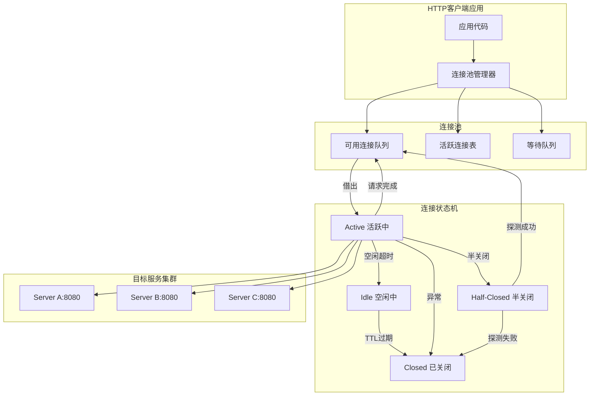
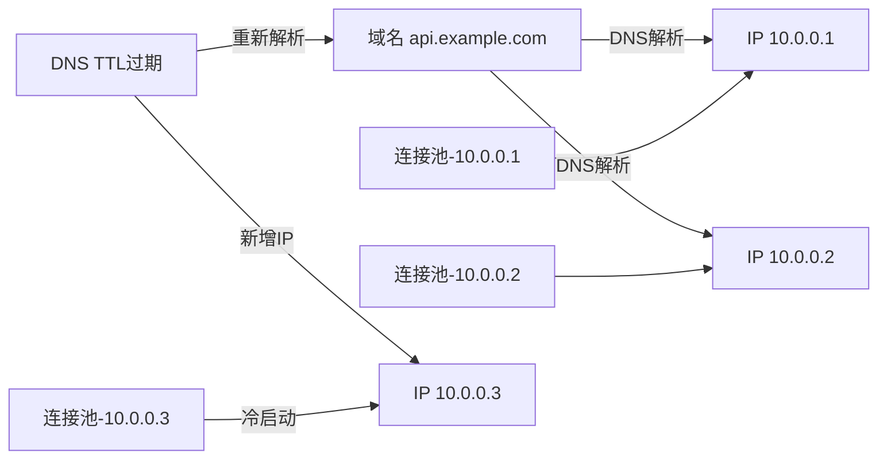
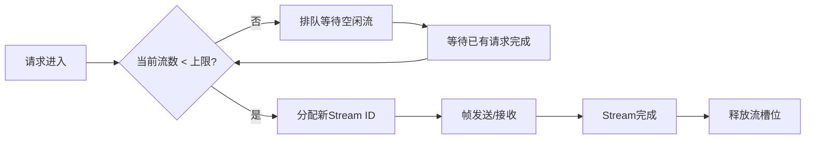
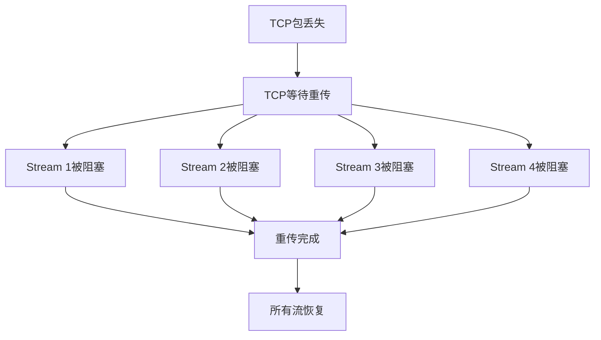
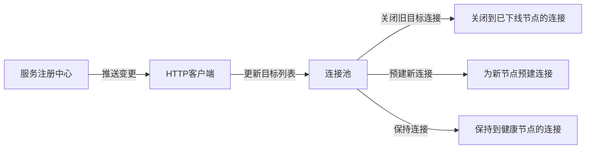

## HTTP连接池

HTTP连接池是管理客户端与服务器之间TCP/TLS连接复用的核心机制。在微服务架构和API密集型应用中，HTTP请求往往是系统间通信的主要方式——一个典型的电商平台一次页面渲染可能触发50-200个上游HTTP调用，一次移动端APP启动可能发出20-80个API请求。如果没有连接池，每次请求都经历TCP三次握手和TLS握手，延迟将从毫秒级退化到秒级，吞吐量下降10-50倍。

本节深入剖析HTTP连接池的工作原理、配置策略、协议演进影响和实战调优方法。内容涵盖TCP/TLS握手开销的量化分析、HTTP/1.1到HTTP/3的协议演进对连接池设计的影响、主流语言和框架的连接池实现对比、连接池监控诊断方法论，以及容器化环境下的特殊考量。

### 1. 连接建立的开销量化

理解连接池的价值，首先要量化"没有连接池"的代价。

#### 1.1 TCP握手开销

HTTP/1.1建立在TCP之上，每一次新建连接需要完成三次握手：

客户端                    服务端
  |--- SYN(seq=x) ---------->|
  |<-- SYN+ACK(seq=y,ack=x+1) --|
  |--- ACK(ack=y+1) -------->|
  |                           |
  |  (如果是HTTPS，继续TLS握手) |
  |                           |
  |--- HTTP Request -------->|
  |<-- HTTP Response ---------|

TCP三次握手本身消耗1个RTT。在不同网络环境下的实际开销：

| 网络环境 | 典型RTT | TCP握手耗时 | 说明 |
|---------|---------|------------|------|
| 同机房（同可用区） | 0.1-0.5ms | 0.1-0.5ms | 数据中心内部 |
| 跨可用区（同城） | 1-3ms | 1-3ms | 如AWS az-a到az-b |
| 跨地域（国内） | 10-50ms | 10-50ms | 如北京到上海 |
| 跨国（中美） | 100-200ms | 100-200ms | 跨洋光缆 |
| 移动网络 | 30-100ms | 30-100ms | 4G/5G波动大 |

#### 1.2 TLS握手开销

HTTPS在TCP握手后还需要TLS握手。不同版本的TLS开销差异显著：

| TLS版本 | 握手RTT | 说明 |
|---------|---------|------|
| TLS 1.2 | 2 RTT（Full） | 完整握手：ClientHello → ServerHello+Cert → Finished |
| TLS 1.2 (Resumption) | 1 RTT | 使用Session Ticket恢复，跳过证书传输 |
| TLS 1.3 | 1 RTT（Full） | 仅一次往返即可完成密钥协商 |
| TLS 1.3 (0-RTT) | 0 RTT | 使用PSK恢复，可立即发送数据（有安全权衡） |

以跨地域场景（RTT=30ms）为例，一次完整的TCP+TLS 1.2连接建立需要：
- TCP握手：30ms（1 RTT）
- TLS握手：60ms（2 RTT）
- **合计：90ms**

如果请求本身的处理时间只有5ms，那么建连开销是请求耗时的18倍。这就是连接池存在的核心价值：**将建连成本摊销到多个请求上**。

#### 1.3 Keep-Alive连接复用

HTTP/1.1默认启用`Connection: Keep-Alive`，允许在同一条TCP连接上发送多个请求/响应对。这是连接池存在的协议基础：

TCP连接建立（一次性开销）
  |
  +--> 请求1 --> 响应1
  +--> 请求2 --> 响应2
  +--> 请求3 --> 响应3
  ... (100个请求共享同一条连接)
  |
TCP连接关闭（或超时）

关键约束：HTTP/1.1的连接复用是**串行**的——同一时刻一条连接只能承载一个请求-响应对。HTTP/1.1 Pipelining虽然允许在同一条连接上连续发送多个请求而不等待响应，但由于队头阻塞（Head-of-Line Blocking）和中间代理兼容性问题，几乎已被废弃。现代浏览器和主流HTTP客户端均不启用Pipelining。

这意味着连接池必须维护足够多的连接来支撑并发需求。假设你有50个并发线程同时发出HTTP请求，就需要至少50条TCP连接（不考虑连接复用的等待时间）。

### 2. HTTP连接池核心架构

#### 2.1 池化模型

HTTP连接池的典型架构如下：



连接池的核心数据结构：

- **按目标分组（Route-based）**：连接池通常按`host:port`分组管理连接，不同目标服务有独立的连接子池。这避免了到慢服务的连接占用快服务的连接资源
- **可用连接队列（Available Pool）**：已建立、当前空闲、可被借出的连接。通常使用FIFO队列，保证连接被均匀使用
- **活跃连接表（Leased Connections）**：正在被应用代码使用的连接。需要精确跟踪，防止连接泄漏（借出后未归还）
- **等待队列（Wait Queue）**：当所有连接被借出且达到上限时，新请求排队等待。通常使用FIFO+超时机制，避免无限等待

#### 2.2 借出与归还流程

连接池的核心操作是借出（lease）和归还（return），任何实现都遵循这个基本流程：

```python
class HttpConnectionPool:
    def lease_connection(self, timeout=30):
        """从池中借出一个连接"""
        # 1. 尝试从可用队列中获取连接
        conn = self.available_queue.poll()

        if conn and conn.is_valid():
            # 检查连接是否过期
            if conn.age() > self.max_conn_time:
                conn.close()
                conn = self.create_new_connection()
            elif not conn.is_alive():
                # TCP连接已断开（对端RST或FIN），重建
                conn = self.create_new_connection()
            else:
                # 可选：空闲超过阈值，发送轻量探测确认可用
                if conn.idle_time() > self.validate_after_inactivity:
                    if not self.validate_connection(conn):
                        conn.close()
                        conn = self.create_new_connection()
        else:
            # 2. 池中无可用连接，检查是否允许新建
            if self.active_count < self.max_total:
                # 检查该route的连接数是否超过上限
                if self.route_active_count[route] < self.max_per_route:
                    conn = self.create_new_connection()
                else:
                    # 该route已满，等待归还
                    conn = self.wait_for_connection(timeout)
            else:
                # 3. 全局已达上限，排队等待
                conn = self.wait_for_connection(timeout)

        # 4. 标记为活跃并记录
        self.active_connections.add(conn)
        self.route_active_count[route] += 1
        return conn

    def return_connection(self, conn):
        """归还连接到池中"""
        self.active_connections.remove(conn)
        route = conn.route
        self.route_active_count[route] -= 1

        if conn.is_valid() and not conn.is_expired():
            # 连接健康，归还到可用队列
            self.available_queue.offer(conn)
        else:
            # 连接不健康（服务端已关闭、协议错误等），关闭并丢弃
            conn.close()
            self.total_count -= 1
```

**借出流程的关键判断**：
1. 优先复用已有连接，避免建连开销
2. 检查连接TTL，防止使用过期连接
3. 检查连接活性（is_alive），及时剔除死连接
4. 可选的惰性验证（validateAfterInactivity），平衡性能和可靠性
5. 全局上限和路由上限双重限制，防止单个目标耗尽所有连接

**归还流程的关键判断**：
1. 请求完成后的连接必须归还，否则连接泄漏
2. 检查连接状态，不健康的连接不归还（避免下一个使用者遇到错误）
3. 归还后连接回到可用队列，等待下一次借出

#### 2.3 连接泄漏：最危险的生产问题

连接泄漏是指连接被借出后未正确归还，导致活跃连接数持续增长，最终耗尽连接池。这是HTTP连接池相关的最危险的生产问题之一。

泄漏的典型原因：

```python
# 泄漏模式1：异常路径未归还
conn = pool.lease()
try:
    response = conn.send(request)
    # ...处理响应...
finally:
    pool.return(conn)  # 必须在finally中归还！

# 泄漏模式2：连接复用导致的状态污染
conn = pool.lease()
response = conn.send(request)
# 如果response的body未被完全读取，连接处于不一致状态
# 归还后下一个使用者会读到残留数据
pool.return(conn)  # 危险！应检查body是否已读完

# 泄漏模式3：重试时未关闭旧连接
conn1 = pool.lease()
try:
    conn1.send(request)
except TimeoutError:
    conn2 = pool.lease()  # 新连接，但conn1未归还！
    conn2.send(request)
    pool.return(conn2)
# conn1永久泄漏
```

连接泄漏的检测方法：
- 监控`pool.active`指标，如果持续单调递增，极有可能存在泄漏
- 分析heap dump（Java），查找未关闭的连接对象
- 启用连接池的leak detection功能（如HikariCP的`leakDetectionThreshold`）

### 3. 关键配置参数详解

HTTP连接池的配置直接决定系统性能和资源消耗。以下是核心参数及其调优策略。

#### 3.1 连接数量参数

| 参数 | 含义 | 典型默认值 | 调优建议 |
|------|------|-----------|---------|
| `maxTotal` | 连接池最大连接总数 | 20-100 | 按上游QPS和平均延迟计算：`max = QPS × 平均延迟(s)`，再加20%-50%余量 |
| `maxPerRoute` | 每个目标地址的最大连接数 | 2-20 | 核心上游适当调大（20-50），冷上游保持小值（2-5） |
| `maxIdle` | 最大空闲连接数 | 2-10 | 高于预期空闲并发量，避免频繁重建。HTTP/2场景下1-3即可 |
| `minIdle` | 最小空闲连接数 | 0 | 预热场景可设为2-5，减少冷启动延迟 |

**计算示例**：假设对服务A的调用QPS为200，平均响应时间50ms（含网络RTT）：

所需连接数 = QPS × 平均延迟(秒)
           = 200 × 0.05
           = 10 条连接

实际应留20%-50%余量应对突发流量和长尾延迟，所以`maxPerRoute`建议设为12-15。

**Little's Law视角**：连接池大小本质上是在回答一个问题——"系统中同时处于'活跃'状态的请求数是多少？"。根据Little's Law：`L = λ × W`，其中L是平均活跃请求数（=所需连接数），λ是请求到达率（=QPS），W是平均服务时间（=响应时间）。这个公式是连接池调优的理论基础。

#### 3.2 超时参数

超时参数是连接池的"安全网"，防止单个慢请求拖垮整个系统。

| 参数 | 含义 | 推荐值 | 说明 |
|------|------|--------|------|
| `connectTimeout` | TCP连接建立超时 | 3-5秒 | 超过此时间放弃建连，避免长时间阻塞 |
| `socketTimeout` | 等待响应数据超时 | 5-30秒 | 根据上游服务SLA设定，流式响应需更长 |
| `connectionRequestTimeout` | 从池中获取连接的等待超时 | 1-3秒 | 超过此时间抛出获取连接超时异常 |
| `timeToLive` | 连接最大生命周期 | 5-10分钟 | 防止长期持有被服务端回收的死连接 |
| `validateAfterInactivity` | 空闲多久后需要验证 | 30秒-2分钟 | 避免使用已被服务端关闭的连接 |

**超时链路分析**：一个HTTP请求的总延迟由多段超时串联构成：

总请求时间 = connectionRequestTimeout（排队等待）
           + connectTimeout（TCP握手）
           + TLS握手时间（取决于TLS版本）
           + socketTimeout（等待响应）

如果`connectionRequestTimeout=3s + connectTimeout=5s + socketTimeout=10s`，理论最坏情况下单个请求会阻塞18秒。因此，**各超时值之和应小于上游对你的SLA承诺时间**。

#### 3.3 空闲连接驱逐

空闲连接驱逐是连接池健康维护的核心机制。驱逐的必要性来自三个方面：

- **服务端超时关闭**：Nginx默认`keepalive_timeout 65s`，Tomcat默认`keepAliveTimeout 20s`，Go net/http默认`ReadTimeout`不限但`IdleConnTimeout`为0（不主动关闭）。如果客户端不感知服务端已关闭连接，后续请求将失败。
- **中间设备超时**：负载均衡器（如AWS ALB的空闲超时默认60秒）、防火墙、NAT网关可能有更短的空闲超时。这些设备在空闲超时后会静默丢弃连接，客户端完全无感知。
- **资源释放**：每条空闲连接占用一个文件描述符（fd）和数十KB内存。在高并发场景下，数千条空闲连接的内存开销不可忽视。

```java
// Apache HttpClient 5.x 空闲连接驱逐配置示例
CloseableHttpClient client = HttpClients.custom()
    .setMaxConnTotal(200)
    .setMaxConnPerRoute(20)
    // 空闲30秒的连接将被驱逐
    .evictIdleConnections(TimeValue.ofSeconds(30))
    // 连接最大存活5分钟（无论是否空闲）
    .setConnectionTimeToLive(TimeValue.ofMinutes(5))
    // 启用后台驱逐线程，默认60秒扫描一次
    .evictExpiredConnections()
    .build();
```

**驱逐线程的资源开销**：驱逐扫描需要遍历所有连接并检查空闲时间，连接数较多时会消耗CPU。建议扫描间隔不低于30秒，避免频繁扫描带来的开销。

#### 3.4 DNS解析与连接池的交互

DNS解析结果直接影响连接池的行为。当域名解析到多个IP时，每个`host:port`对应一个独立的连接子池。DNS变更（如服务扩容、故障转移）会导致：

- **新IP的连接子池为空**：第一批请求需要重新建连，延迟飙升
- **旧IP的连接子池中存在连接**：如果旧IP仍可达，连接不会自动迁移
- **DNS缓存过期时间**：JVM默认`networkaddress.cache.ttl=30s`，Go默认不缓存（每次解析），Python默认依赖系统缓存



**最佳实践**：在微服务环境中，DNS轮询（Round-Robin DNS）是最简单的负载均衡方式，但会导致连接分散在多个子池中。更好的做法是：在DNS层面解析到单一入口（如Kubernetes Service ClusterIP），由服务端负载均衡器统一管理后端实例。这样客户端只需维护一个连接子池，连接复用效率更高。

### 4. 主流HTTP客户端连接池对比

不同编程语言和HTTP客户端库的连接池实现各有特点。选型时需要综合考虑协议支持、性能、易用性和生态成熟度。

#### 4.1 Java生态

| 客户端 | 连接池实现 | 多路复用 | 特点 |
|--------|-----------|---------|------|
| Apache HttpClient 5.x | PoolingHttpClientConnectionManager | HTTP/2支持 | 功能最全，API成熟，可精细控制连接生命周期 |
| OkHttp | ConnectionPool | HTTP/2多路复用 | Android默认，连接复用效率高，API简洁 |
| Java 11+ HttpClient | 内置连接池 | HTTP/2默认启用 | 轻量级，JDK内置无额外依赖 |
| Spring WebClient | 基于Netty/Reactor Netty | HTTP/2支持 | 响应式非阻塞，适合高并发场景 |

**OkHttp的连接池设计亮点**：OkHttp的`ConnectionPool`默认维护5个空闲连接，存活5分钟。它在请求发出前会优先选择可复用的连接（匹配`host + port + proxy`），通过`RealConnectionPool`的后台清理线程定期驱逐过期连接。由于默认使用HTTP/2，单条连接即可承载多个并发流，实际所需的物理连接数远少于请求数。

**Reactor Netty的零拷贝优化**：Spring WebClient底层的Reactor Netty通过PooledConnectionProvider管理连接池，支持HTTP/2多路复用，并利用Netty的零拷贝特性减少数据在用户态和内核态之间的拷贝，在高吞吐场景下性能优于传统阻塞式客户端。

#### 4.2 Python生态

| 客户端 | 连接池实现 | 协议支持 | 特点 |
|--------|-----------|---------|------|
| requests + urllib3 | HTTPConnectionPool | HTTP/1.1 | 最常用，默认开启连接复用，API极其简洁 |
| aiohttp | TCPConnector | HTTP/1.1 | 异步IO，单线程高并发，适合爬虫和微服务 |
| httpx | ConnectionPool | HTTP/1.1 + HTTP/2 | 同步/异步双模，现代化API |
| httpcore | ConnectionPool | HTTP/1.1 + HTTP/2 | 底层引擎，httpx的后端，可独立使用 |

```python
# requests/urllib3 连接池配置
import requests
from urllib3.util.retry import Retry
from requests.adapters import HTTPAdapter

session = requests.Session()

# 连接池参数配置
adapter = HTTPAdapter(
    pool_connections=10,    # 保存的连接池数量（按host分组）
    pool_maxsize=20,        # 每个host的最大连接数
    max_retries=Retry(
        total=3,
        backoff_factor=1,   # 重试间隔: 1s, 2s, 4s
        status_forcelist=[502, 503, 504],
        allowed_methods=["GET", "POST", "PUT", "DELETE"]
    )
)

session.mount("https://", adapter)
session.mount("http://", adapter)

# 使用同一个session发出的请求会复用底层连接
resp1 = session.get("https://api.example.com/users")
resp2 = session.get("https://api.example.com/orders")  # 复用同一连接
```

**httpx的HTTP/2支持**：httpx是Python生态中少数原生支持HTTP/2的客户端库。通过`httpx.Client(http2=True)`即可启用，底层由httpcore + h2库实现。在需要多路复用的高并发场景下，httpx的HTTP/2模式可以显著减少连接数。

#### 4.3 Go生态

Go标准库`net/http`内置了连接池，这是Go的一大优势——无需第三方依赖即可获得完善的连接池功能：

```go
transport := &amp;http.Transport{
    // 连接池核心参数
    MaxIdleConns:        100,    // 全局最大空闲连接数
    MaxIdleConnsPerHost: 10,     // 每个host的最大空闲连接数
    MaxConnsPerHost:     100,    // 每个host的最大连接数（含活跃+空闲）

    // 超时参数
    DialContext: (&amp;net.Dialer{
        Timeout:   5 * time.Second,   // TCP连接超时
        KeepAlive: 30 * time.Second,  // TCP Keep-Alive探测间隔
    }).DialContext,

    TLSHandshakeTimeout:   5 * time.Second,
    ResponseHeaderTimeout: 10 * time.Second,
    IdleConnTimeout:       90 * time.Second,  // 空闲连接超时

    // HTTP/2
    ForceAttemptHTTP2: true,
}

client := &amp;http.Client{
    Transport: transport,
    Timeout:   30 * time.Second,  // 整体请求超时（包含连接+发送+读取）
}
```

**Go连接池的特殊设计**：Go的`MaxIdleConnsPerHost`默认值仅为**2**，这意味着对于同一个host，最多只有2条空闲连接。在微服务场景下，这个默认值远远不够——如果服务A以100 QPS调用服务B，而`MaxIdleConnsPerHost`为2，则每次请求几乎都需要新建连接。这是Go微服务中最常见的性能陷阱之一。

**Go连接池的自动调节**：当`MaxIdleConns`小于`MaxIdleConnsPerHost × host数量`时，Go运行时会自动调整每个host的实际空闲连接数上限，优先保证活跃的host有更多空闲连接。这是Go连接池的一个智能特性，但需要注意它可能导致某些host的空闲连接被其他host"抢走"。

#### 4.4 Node.js/JavaScript生态

| 客户端 | 连接池实现 | 协议支持 | 特点 |
|--------|-----------|---------|------|
| Node.js http/https | Agent连接池 | HTTP/1.1 | 内置，Node.js默认启用Keep-Alive |
| undici (Node.js内置) | Pool | HTTP/1.1 + HTTP/2 | Node.js 18+内置fetch的底层，性能极佳 |
| axios | http.Agent | HTTP/1.1 | 最流行，基于Node.js http模块 |
| got | undici/Agent | HTTP/1.1 + HTTP/2 | 现代化API，自动压缩 |
| ky (浏览器) | 无连接池 | HTTP/1.1 | 浏览器环境，连接由浏览器管理 |

```javascript
// Node.js 原生 http.Agent 连接池配置
const http = require('http');
const https = require('https');

// 全局Agent，复用所有请求的连接
const agent = new https.Agent({
    keepAlive: true,
    keepAliveMsecs: 30000,     // TCP Keep-Alive间隔
    maxSockets: 100,           // 每个host的最大连接数
    maxFreeSockets: 10,        // 每个host的最大空闲连接数
    timeout: 30000,            // 空闲连接超时
});

// 所有请求使用同一个Agent，实现连接复用
const options = {
    hostname: 'api.example.com',
    port: 443,
    path: '/users',
    method: 'GET',
    agent: agent,  // 复用连接池
};

// undici (Node.js 18+ 内置) 连接池
const { Pool } = require('undici');

const pool = new Pool('https://api.example.com', {
    connections: 100,          // 最大连接数
    pipelining: 1,             // HTTP/1.1 pipelining（默认关闭）
    keepAliveTimeout: 30000,   // 空闲连接超时
    keepAliveMaxTimeout: 60000,
});

// 使用pool发送请求
const { statusCode, body } = await pool.request({
    path: '/users',
    method: 'GET',
});
```

**Node.js的特殊性**：Node.js基于事件循环的单线程模型使得连接池的管理更加高效——没有线程切换的开销。但需要注意，Node.js的连接池默认配置较为保守，生产环境务必显式配置`maxSockets`和`keepAlive`参数。

#### 4.5 横向对比总结

| 特性 | Java HttpClient 5.x | Python httpx | Go net/http | Node.js undici |
|------|---------------------|-------------|-------------|----------------|
| HTTP/2多路复用 | ✅ | ✅ | ✅ | ✅ |
| 连接池精细控制 | ⭐⭐⭐ | ⭐⭐ | ⭐⭐⭐ | ⭐⭐ |
| 自动驱逐 | ✅ | 需手动 | ✅（空闲超时） | ✅ |
| TLS Session Resumption | ✅ | ✅ | ✅ | ✅ |
| 连接预热 | 手动实现 | 手动实现 | 手动实现 | 手动实现 |
| 连接泄漏检测 | ✅（日志） | ❌ | ❌ | ❌ |
| 学习曲线 | 中等 | 低 | 低 | 低 |

### 5. HTTP/2多路复用对连接池的影响

HTTP/2从根本上改变了连接池的设计哲学，从"维护多条连接来支撑并发"转变为"用少量高质量连接承载高并发"。

#### 5.1 从"多连接"到"少连接"

HTTP/1.1 连接池模型:
  并发100个请求 → 需要100条TCP连接
  每条连接独立：建连→发请求→收响应→归还/关闭
  连接池大小 ≈ 并发请求数

HTTP/2 连接池模型:
  并发100个请求 → 只需1-3条TCP连接（100个Stream交错传输）
  单连接承载多个并发流：帧级交错，无应用层队头阻塞
  连接池大小 ≈ 1-3（冗余+故障转移）

**资源对比**：假设单条TCP连接占用64KB内存（内核缓冲区+用户态元数据）+ 1个fd：
- HTTP/1.1支撑100并发：100条连接 × 64KB = 6.4MB内存 + 100个fd
- HTTP/2支撑100并发：3条连接 × 64KB = 192KB内存 + 3个fd

在容器环境中，每个Pod默认限制1024个fd。HTTP/1.1模式下仅连接就消耗100个fd（加上文件、socket等，fd很容易耗尽），而HTTP/2模式仅消耗3个。

#### 5.2 HTTP/2流上限与背压

HTTP/2规范限制每条连接最多256个并发流（`SETTINGS_MAX_CONCURRENT_STREAMS`），默认通常为100-256。当流数达到上限时，新请求必须等待已有流完成：



在极端高并发场景下（如API网关），单条HTTP/2连接的流上限可能不够用。此时可以维持2-3条连接来分散压力。大多数HTTP客户端库会自动处理这个逻辑——当一条连接的流数接近上限时，自动创建新连接。

#### 5.3 TCP层队头阻塞问题

虽然HTTP/2解决了HTTP应用层的队头阻塞，但TCP层的队头阻塞仍然存在。当一条TCP连接上的某个包丢失时，TCP必须等待重传完成，期间该连接上**所有流**都会被阻塞。



在丢包率较高的网络环境下（如公网、跨地域移动网络），这反而可能比HTTP/1.1的多连接模型更差：

| 场景 | HTTP/1.1多连接 | HTTP/2单连接 | 建议 |
|------|---------------|-------------|------|
| 低丢包率（<0.1%，内网） | 正常 | 更优（减少连接开销） | 优先HTTP/2 |
| 中等丢包率（0.1%-1%，公网） | 正常 | 轻微退化（单流丢包影响全局） | HTTP/2仍可用，监控延迟 |
| 高丢包率（>1%，移动网络） | 正常（各连接独立） | 明显退化（所有流受影响） | 可考虑HTTP/1.1多连接或HTTP/3 |
| 混合场景 | 正常 | 退化程度取决于连接数 | 多条HTTP/2连接分担风险 |

#### 5.4 HTTP/3的最终解决方案

HTTP/3基于QUIC协议（运行在UDP之上），将多路复用提升到传输层之上，彻底解决了TCP层队头阻塞：

HTTP/2:  [TCP连接] --> [多路复用] (TCP丢包阻塞所有流)
HTTP/3:  [QUIC连接] --> [多路复用] (单流丢包只阻塞该流)

HTTP/3对连接池的额外好处：

- **连接迁移（Connection Migration）**：基于Connection ID而非`IP:Port`四元组标识连接。WiFi切换到蜂窝网络、IP地址变更等场景下连接不会中断，连接池中的连接更加稳定
- **更快的建连**：QUIC内置TLS 1.3，首次建连只需1 RTT（0-RTT恢复），比TCP+TLS更快
- **0-RTT恢复**：断线重连时可以直接发送应用数据，无需等待握手完成

目前HTTP/3的连接池支持尚在成熟中。Go的`net/http`在Go 1.22+开始实验性支持，Java的HttpClient 5.x通过第三方库支持，Python的httpx通过`h3`库支持。

### 6. 连接池监控与调优

#### 6.1 关键监控指标

一个健康运行的HTTP连接池需要监控以下指标：

| 指标 | 采集方式 | 告警阈值 | 含义 |
|------|---------|---------|------|
| `pool.active` | JMX/Prometheus/Micrometer | 接近maxTotal的80% | 活跃连接数，接近上限说明连接不够用 |
| `pool.idle` | JMX/Prometheus | 持续为0 | 空闲连接数，为0意味着每次请求可能需新建连接 |
| `pool.pending` | JMX/Prometheus | > 0且持续增长超过30秒 | 等待获取连接的请求数，排队严重 |
| `pool.created` | 日志/指标 | 频率 > 10次/秒（微服务场景） | 连接创建速率，频繁说明连接复用率低 |
| `pool.destroyed` | 日志/指标 | 频率接近created | 连接销毁速率，配合created判断连接稳定性 |
| `pool.timeout` | 异常统计 | > 0.1% | 获取连接超时的比例，说明连接池不足或上游变慢 |

**指标关联分析**：单一指标很难定位问题，需要关联分析：
- `idle持续=0 + active接近max` → 连接不够用，增大maxPerRoute
- `pending增长 + idle>0` → 可能是连接验证（validate）过慢，检查validateAfterInactivity配置
- `created高 + destroyed高` → 连接不健康或TTL过短，频繁建连销毁
- `idle高 + active低` → maxPerRoute过大，浪费资源，可以适当缩小
- `timeout高 + idle=0` → 连接池过小或上游响应变慢

#### 6.2 连接池诊断工具链

定位连接池问题需要多种工具配合：

**网络层诊断**：

```bash
# 查看当前到目标host的连接状态
ss -tn state established | grep "10.0.1.100:8080"

# 输出示例：
# ESTAB  0  0  10.0.1.50:43210  10.0.1.100:8080
# ESTAB  0  0  10.0.1.50:43212  10.0.1.100:8080
# ... (20条 = 20条活跃连接)

# 查看TIME_WAIT和CLOSE_WAIT状态的连接（异常信号）
ss -tn state time-wait | grep "10.0.1.100:8080" | wc -l
ss -tn state close-wait | grep "10.0.1.100:8080" | wc -l

# 实时监控连接数变化
watch -n 1 "ss -tn state established | grep 10.0.1.100 | wc -l"

# 查看文件描述符使用情况（连接泄漏信号）
ls /proc/<PID>/fd | wc -l
cat /proc/<PID>/limits | grep "open files"
```

**应用层诊断**：

```java
// Java: 启用HttpClient连接池日志
System.setProperty("org.apache.http.wire", "DEBUG");
// 或通过logback配置
// <logger name="org.apache.http.impl.conn" level="DEBUG"/>
```

```python
# Python: 启用urllib3连接池调试日志
import logging
import urllib3
logging.getLogger("urllib3.connectionpool").setLevel(logging.DEBUG)
# 输出: "Starting new HTTPS connection (1): api.example.com:443"
# 如果看到"(1)"持续增长，说明连接复用率低
```

```go
// Go: 通过net/http的Transport日志跟踪连接
// Go没有内置的连接池日志，需要自定义Transport
transport := &amp;http.Transport{
    // ...配置...
    // 通过RoundTripHook监控（需要第三方库或自定义实现）
}
```

#### 6.3 常见性能陷阱

**陷阱一：未复用HTTP客户端**

这是最常见的错误。`requests.get()`每次调用都会创建新的TCP连接：

```python
# 错误：每次请求创建新客户端（无连接复用）
for url in urls:
    resp = requests.get(url)  # 每次新建TCP连接！

# 正确：复用Session
session = requests.Session()
for url in urls:
    resp = session.get(url)  # 复用底层连接池
```

**陷阱二：Go的MaxIdleConnsPerHost默认值过低**

```go
// 错误：使用默认值（MaxIdleConnsPerHost=2）
client := &amp;http.Client{}

// 正确：根据业务需求调整
client := &amp;http.Client{
    Transport: &amp;http.Transport{
        MaxIdleConns:        100,
        MaxIdleConnsPerHost: 20,
        IdleConnTimeout:     90 * time.Second,
    },
}
```

**陷阱三：未配置连接驱逐策略**

长期运行的服务中，如果没有空闲连接驱逐机制，连接池中会积累大量已被服务端关闭的"僵尸连接"。每次使用这种连接都会失败，导致请求重试和延迟飙升。

诊断方法：如果发现连接池日志中频繁出现`Connection reset`或`Broken pipe`错误，很可能是僵尸连接问题。

**陷阱四：连接池参数与线程池/协程池不匹配**

连接池大小必须大于或等于线程池/协程池的并发度。如果线程池有100个线程，但连接池最大只有20个连接，则80个线程会阻塞等待连接，吞吐量被严重限制。

场景：100个并发线程
线程池: 100线程
连接池: 20连接  → 80线程等待连接 → 实际并发仅20 → 利用率20%
连接池: 100连接 → 所有线程获取连接 → 实际并发100 → 利用率100%
连接池: 120连接 → 所有线程获取连接 + 20余量 → 利用率100%

**陷阱五：HTTP/2场景下仍按HTTP/1.1思路配置连接数**

在已升级HTTP/2的环境中，如果仍然按并发请求数配置连接池大小，会导致大量不必要的空闲连接。HTTP/2场景下，`maxPerRoute`设为3-5即可（冗余+故障转移），将资源让给其他服务。

**陷阱六：连接池共享导致的租户干扰**

在多租户系统中，如果所有租户共享同一个连接池，某个租户的大量请求可能耗尽连接池，导致其他租户的请求全部排队。应该按租户或按业务线隔离连接池。

### 7. 高级话题

#### 7.1 连接池与服务发现的协同

在微服务架构中，HTTP连接池需要与服务发现机制协同工作。当上游服务实例发生变更（扩容、缩容、滚动更新）时，连接池需要感知并更新目标地址列表：



**Apache HttpClient + Spring Cloud LoadBalancer的典型做法**：拦截器在每次请求时从负载均衡器获取当前可用实例列表，连接池按实例分组管理。实例下线时，对应分组的空闲连接被驱逐。

**Envoy Sidecar模式**：在Service Mesh（如Istio）中，Envoy作为Sidecar代理接管所有出站HTTP流量。应用代码的连接池只需连接到本地Envoy（127.0.0.1），由Envoy负责到上游实例的负载均衡和连接管理。这简化了应用层的连接池配置，但引入了额外的跳转开销（约0.1ms）。

#### 7.2 连接池与重试机制的配合

重试机制必须与连接池正确配合，否则会导致连接泄漏或重试风暴：

```java
// 正确的重试策略：仅在可重试异常时重试，且使用新连接
RequestConfig requestConfig = RequestConfig.custom()
    .setConnectTimeout(Timeout.ofSeconds(3))
    .setResponseTimeout(Timeout.ofSeconds(5))
    .setConnectionRequestTimeout(Timeout.ofSeconds(2))
    .build();

HttpClientBuilder builder = HttpClientBuilder.create()
    .setDefaultRequestConfig(requestConfig)
    .setRetryHandler((response, executionCount, context) -> {
        // 仅对5xx和连接异常重试，最多2次
        if (executionCount > 2) return false;
        int status = response.getCode();
        return status >= 500 || status == 429;  // 服务端错误或限流
    });
```

**重试与连接池的关键原则**：

1. **重试时使用新连接**：如果第一次请求失败是因为连接问题（EOF、Connection Reset），重试时必须使用新连接，而非复用失败的连接
2. **旧连接必须归还或关闭**：重试前必须确保旧连接已正确处理（归还到池中或显式关闭），否则连接泄漏
3. **幂等性检查**：只有幂等操作（GET、PUT、DELETE）才可重试，POST请求默认不重试（除非业务保证幂等）
4. **指数退避**：重试间隔应递增（如1s → 2s → 4s），避免对已过载的上游造成冲击
5. **全局限流**：重试请求不应超过总请求量的一定比例（如10%），防止重试风暴

#### 7.3 多租户场景的连接池隔离

在SaaS平台或API网关中，不同租户的流量需要通过连接池隔离，避免相互影响：

- **按租户分组**：每个租户有独立的连接子池，互不影响
- **流量配额**：限制每个租户的连接数上限，防止资源争抢
- **优先级调度**：VIP租户的请求优先获取连接
- **租户感知路由**：不同租户可能路由到不同的后端服务

```python
class TenantAwareConnectionPool:
    def __init__(self):
        self.pools = {}           # tenant_id -> ConnectionPool
        self.limits = {}          # tenant_id -> max_connections
        self.priority = {}        # tenant_id -> priority (1=highest)

    def get_pool(self, tenant_id):
        if tenant_id not in self.pools:
            max_conn = self.limits.get(tenant_id, 10)
            self.pools[tenant_id] = HttpConnectionPool(max_total=max_conn)
        return self.pools[tenant_id]

    def lease(self, tenant_id, timeout=5):
        pool = self.get_pool(tenant_id)
        try:
            return pool.lease_connection(timeout)
        except ConnectionTimeoutError:
            # 该租户连接池已满，快速失败而非无限等待
            raise TenantQuotaExceeded(
                f"Tenant {tenant_id} connection limit ({self.limits.get(tenant_id, 10)}) reached. "
                f"Active: {pool.active_count}, Idle: {pool.idle_count}"
            )

    def get_global_stats(self):
        """获取全局连接池统计，用于监控"""
        stats = {}
        for tid, pool in self.pools.items():
            stats[tid] = {
                "active": pool.active_count,
                "idle": pool.idle_count,
                "total": pool.total_count,
            }
        return stats
```

#### 7.4 连接预热策略

冷启动时连接池为空，第一批请求会因建连开销导致延迟飙升（俗称"冷启动延迟"）。在FaaS（如AWS Lambda）和容器弹性扩缩容场景下，这个问题尤为突出。

**预热策略的三个层次**：

| 策略 | 实现方式 | 效果 | 适用场景 |
|------|---------|------|---------|
| 定时预建 | 服务启动后立即建立`minIdle`条连接 | 消除启动后的首批建连延迟 | 所有场景 |
| 渐进预热 | 启动后30秒内逐步增加并发建连数 | 避免对上游造成瞬间连接压力 | 上游有连接数限制 |
| 健康探测 | 预建连接后通过health check验证可用性 | 确保预建的连接确实可用 | 关键业务链路 |

```java
// Apache HttpClient 预热配置
PoolingHttpClientConnectionManager connManager =
    new PoolingHttpClientConnectionManager();
connManager.setMaxTotal(100);
connManager.setDefaultMaxPerRoute(20);

// 预热：为指定host预建连接
HttpHost target = new HttpHost("api.example.com", 443, "https");
connManager.setMaxPerRoute(new HttpRoute(target), 20);

// 服务启动后预建连接
ExecutorService executor = Executors.newSingleThreadExecutor();
executor.submit(() -> {
    try (CloseableHttpClient client = HttpClients.custom()
            .setConnectionManager(connManager).build()) {
        for (int i = 0; i < 20; i++) {
            try {
                HttpGet request = new HttpGet("https://api.example.com/health");
                client.execute(request).close();
            } catch (Exception e) {
                // 预热失败不影响启动，记录日志即可
                log.warn("Warmup connection {} failed: {}", i, e.getMessage());
            }
        }
    }
    log.info("Connection pool warmup completed for {}", target);
});
```

**渐进预热示例**（避免对上游的瞬间冲击）：

```python
import asyncio
import aiohttp

async def gradual_warmup(pool, target_url, total_connections, duration_sec=30):
    """渐进式预热：在duration_sec秒内逐步建立total_connections条连接"""
    interval = duration_sec / total_connections
    batch_size = max(1, total_connections // 10)  # 分10批

    for i in range(0, total_connections, batch_size):
        tasks = []
        for j in range(min(batch_size, total_connections - i)):
            async def warmup_one():
                try:
                    async with pool.get(target_url) as resp:
                        await resp.read()  # 确保连接建立并可用
                except Exception:
                    pass  # 预热失败不阻塞
            tasks.append(warmup_one())
        await asyncio.gather(*tasks)
        await asyncio.sleep(interval * batch_size)
```

#### 7.5 TLS Session Resumption与连接池

TLS Session Resumption是减少TLS握手开销的关键技术，与连接池配合使用效果显著：

- **Session Ticket**：服务端将加密密钥封装为ticket发给客户端，客户端后续连接时携带ticket即可跳过证书验证阶段，将TLS握手从2 RTT减少到1 RTT
- **TLS 1.3的PSK（Pre-Shared Key）**：基于上次连接的密钥派生新的共享密钥，支持0-RTT恢复
- **会话缓存**：服务端维护会话ID到密钥的映射，客户端通过Session ID恢复

**对连接池的影响**：连接池中复用的连接天然受益于TLS Session Resumption——因为连接本身就是持续使用的，不需要重新握手。但如果连接因空闲超时被关闭，重新建连时TLS Session Resumption可以显著减少恢复延迟。

**注意**：TLS 1.3的0-RTT恢复存在安全风险（重放攻击），只适用于幂等操作。非幂等操作（如POST扣款）不应使用0-RTT。

#### 7.6 容器化环境下的连接池

在Kubernetes和Docker环境中，连接池配置需要考虑容器网络的特殊性：

**容器网络开销**：Kubernetes中Pod间通信经过CNI插件（如Calico、Cilium），通常增加0.1-0.5ms延迟。Service（ClusterIP）还会增加一次iptables/IPVS规则匹配。这些开销虽然不大，但在连接池参数计算中不可忽略。

**fd限制**：容器默认的文件描述符限制（通常1024）比物理机低得多。每条TCP连接消耗一个fd，加上日志文件、管道等开销，实际可用于连接池的fd可能只有800-900。如果同时维护到10个上游的连接池，每个上游最多80-90条连接。

**Pod扩缩容**：HPA（Horizontal Pod Autoscaler）触发扩容时，新Pod的连接池需要预热。如果预热策略缺失，新Pod启动后的首批请求会集中建连，可能导致上游过载（"惊群效应"）。

```yaml
# Kubernetes Pod资源限制建议
resources:
  limits:
    # 确保有足够fd：每条连接1个fd + 应用自身需要
    # 通常设为至少2048
    # 注意：fd限制通过securityContext设定
  requests:
    cpu: "500m"
    memory: "256Mi"

securityContext:
  runAsNonRoot: true
  capabilities:
    add:
      - NET_BIND_SERVICE

# 如果使用Calico CNI，可以调整Pod的sysctl参数
sysctls:
  - name: net.ipv4.tcp_keepalive_time
    value: "60"
  - name: net.ipv4.tcp_keepalive_intvl
    value: "10"
  - name: net.ipv4.tcp_keepalive_probes
    value: "3"
```

**Service Mesh的影响**：在Istio等Service Mesh中，Envoy Sidecar会接管所有出站连接。应用的连接池只需管理到本地Envoy（127.0.0.1）的连接，Envoy负责到上游的连接管理。这种模式的好处是应用层配置简单，但需要确保Envoy的连接池配置（`Cluster`级别的`max_connections`）足够大。

#### 7.7 连接池与DNS的深度协同

在大规模系统中，DNS解析与连接池的交互可能带来隐蔽的问题：

**DNS缓存导致的流量倾斜**：当一个域名解析到多个IP时，不同客户端实例可能缓存不同的DNS结果，导致某些后端实例负载过高，某些过低。解决方法是使用客户端负载均衡（如gRPC的pick_first或round_robin）替代DNS轮询。

**DNS故障转移延迟**：当某个后端IP下线后，DNS TTL过期前，连接池中仍然持有到该IP的连接。如果`TTL > DNS TTL`，连接池中的连接可能在DNS已更新后仍然存活。建议将连接池的`timeToLive`设置为不超过DNS TTL。

### 8. 不同场景的连接池配置参考

以下是不同业务场景下HTTP连接池的推荐配置。这些值基于大量生产环境的经验总结，但实际调优仍需根据具体业务特征进行。

| 场景 | maxTotal | maxPerRoute | idleTimeout | TTL | connectTimeout | 说明 |
|------|----------|-------------|-------------|-----|---------------|------|
| 内部微服务调用 | 100-200 | 20-50 | 30s | 5min | 2s | 低延迟高吞吐，连接快速周转 |
| 外部API调用 | 50-100 | 5-10 | 60s | 3min | 5s | 网络不稳定，需容忍延迟波动 |
| 数据拉取/同步 | 10-30 | 3-5 | 120s | 10min | 5s | 低频高延迟，长连接保持 |
| WebSocket/长连接 | 不适用 | 1-2 | 不适用 | 按需 | 5s | 单连接长时间保持，无需池化 |
| 高并发网关 | 500-1000 | 50-100 | 15s | 2min | 1s | 连接快速周转，资源高效利用 |
| FaaS/Lambda | 5-10 | 1-3 | 60s | 5min | 3s | 实例生命周期短，连接池价值有限 |
| 边缘计算/CDN回源 | 50-100 | 10-20 | 60s | 5min | 3s | 跨地域延迟高，连接稳定性重要 |

### 本节小结

HTTP连接池是现代应用性能的基石。核心要点：

1. **连接复用是核心价值**：TCP+TLS握手开销远大于请求本身（在跨地域场景下可达请求耗时的18倍），连接池通过复用避免了重复建连
2. **HTTP/2改变了池化策略**：多路复用使得单连接可承载高并发，连接池从"数量优先"转向"质量优先"，但TCP层队头阻塞仍需关注
3. **HTTP/3是终极方案**：基于QUIC的传输层多路复用彻底解决了队头阻塞，但生态成熟度仍需观察
4. **参数必须按场景配置**：没有万能的默认值，连接池参数需要根据Little's Law（L=λ×W）精确计算
5. **监控是调优的前提**：active/idle/pending/created/destroyed五个指标必须监控，关联分析才能定位问题
6. **避免常见陷阱**：未复用客户端、Go默认值过低、缺少驱逐策略、连接池与线程池不匹配、HTTP/2场景过度配置连接数——这些是最常见的性能杀手
7. **容器化环境特殊考量**：fd限制、Pod扩缩容预热、Service Mesh的连接管理都需要额外关注
