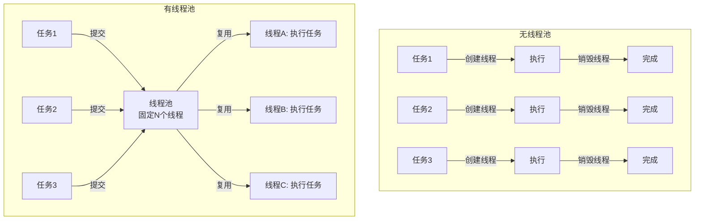
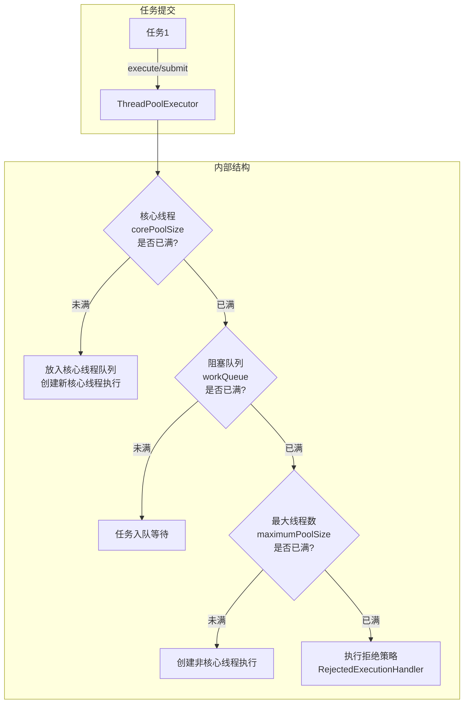

# 线程池管理

## 1. 为什么需要线程池

### 1.1 无线程池的代价

在并发编程中，线程是最基本的执行单元。如果每个任务都创建一个新线程来执行，系统将面临三重成本：

**创建与销毁的开销**：线程的创建并非零成本操作。JVM 需要为每个线程分配独立的栈空间（默认 512KB-1MB）、维护线程控制块（TCB）、在操作系统层面完成内核线程的分配和调度初始化。以 JVM 为例，创建一个线程的耗时约 0.5-5ms，销毁也需要类似时间。如果一个请求处理只需要 2ms，线程创建开销反而比业务逻辑本身还大。

**上下文切换的开销**：当线程数超过 CPU 核心数时，操作系统必须通过上下文切换来调度线程。每次上下文切换需要保存和恢复寄存器状态、切换内存映射（如果涉及用户态/内核态转换）、刷新 CPU 缓存（L1/L2 cache 的局部性被破坏）。在 Linux 上，一次上下文切换的开销约 1-10μs，但高频率切换时 CPU 有 30%-50% 的时间浪费在调度上。

**资源耗尽的风险**：每个线程占用独立的栈内存、内核资源和调度槽位。在默认配置下，一个 JVM 进程创建 1000 个线程就需要约 500MB-1GB 的栈内存，加上内核中的 `task_struct` 和关联数据结构，总内存消耗可达 1GB 以上。Linux 系统的线程数限制（`/proc/sys/kernel/threads-max`）通常为数万到数十万，高并发下极易耗尽。

无线程池场景（每请求一个线程）：

请求1 ──→ 创建线程A ──→ 执行任务 ──→ 线程A销毁
请求2 ──→ 创建线程B ──→ 执行任务 ──→ 线程B销毁
请求3 ──→ 创建线程C ──→ 执行任务 ──→ 线程C销毁
  ...

问题：
- 每个请求额外 0.5-5ms 的线程创建开销
- 大量线程导致频繁上下文切换（CPU 利用率反而下降）
- 内存消耗随并发线性增长，最终 OOM

### 1.2 线程池的核心思想

线程池的本质与连接池完全一致——**用空间换时间，用复用换创建**。其核心思想：

> 预先创建一批线程并常驻内存，任务到来时将任务交给空闲线程执行，执行完毕后线程回到池中等待下一个任务，而不是销毁线程。



线程池解决的核心问题：

| 问题 | 无线程池 | 有线程池 |
|------|---------|---------|
| 创建延迟 | 每次 0.5-5ms | 近乎 0ms（线程已就绪） |
| 内存消耗 | 随并发线性增长 | 固定上限 |
| 上下文切换 | 无限制，CPU 空转 | 受控于核心线程数 |
| 系统稳定性 | 可能 OOM / 抖动 | 可预测、可控制 |
| 并发控制 | 无上限，难以限流 | 池大小即并发上限 |

### 1.3 线程池在资源管理体系中的位置

在连接池与资源管理的完整体系中，线程池与连接池是两道最关键的防线：

用户请求
  │
  ▼
[线程池] ── 控制并发执行的任务数（CPU/内存资源）
  │
  ▼
[任务处理] ── 包括数据库查询、HTTP调用等IO操作
  │
  ▼
[连接池] ── 控制对外部服务的并发连接数（网络/文件描述符资源）
  │
  ▼
外部服务（数据库、缓存、API等）

两者的协同关系：线程池的大小决定了系统的最大并发任务数，而连接池的大小决定了这些任务能同时持有的外部连接数。两者必须匹配——线程池远大于连接池会导致大量线程阻塞在等待连接上，连接池远大于线程池则造成连接资源浪费。

## 2. Java 线程池核心原理

### 2.1 ThreadPoolExecutor 的架构

Java 线程池的核心实现是 `java.util.concurrent.ThreadPoolExecutor`，其架构可以用"一个池子 + 一个缓冲队列 + 一套拒绝策略"来概括：



核心参数及其含义：

| 参数 | 含义 | 典型值 | 作用 |
|------|------|--------|------|
| **corePoolSize** | 核心线程数 | CPU核心数 或 CPU核心数+1 | 长期保持存活的线程数，即使空闲也不回收（默认） |
| **maximumPoolSize** | 最大线程数 | corePoolSize × 2-4 | 当队列满时能创建的最大线程数 |
| **keepAliveTime** | 非核心线程空闲存活时间 | 60s | 超过核心线程数的空闲线程存活时间 |
| **workQueue** | 任务等待队列 | LinkedBlockingQueue / ArrayBlockingQueue | 核心线程忙时，新任务暂存的缓冲区 |
| **handler** | 拒绝策略 | AbortPolicy | 线程和队列都满时的处理策略 |
| **threadFactory** | 线程工厂 | DefaultThreadFactory | 自定义线程名称、优先级、是否守护线程 |

### 2.2 任务调度的完整流程

当调用 `execute(Runnable task)` 时，线程池按以下决策树处理：

execute(task)
  │
  ├─ 1. 当前线程数 < corePoolSize？
  │     └─ 是 → 创建新的核心线程，直接执行任务
  │
  ├─ 2. 核心线程已满，任务入队？
  │     ├─ 入队成功 → 等待空闲线程取走任务
  │     └─ 入队失败（队列已满）→ 继续下一步
  │
  ├─ 3. 当前线程数 < maximumPoolSize？
  │     └─ 是 → 创建非核心线程执行任务
  │
  └─ 4. 线程数已达 maximumPoolSize
        └─ 执行拒绝策略（AbortPolicy / CallerRunsPolicy / ...）

一个容易被忽视的细节：**任务优先使用核心线程，而非优先入队**。这意味着当核心线程都在忙时，新任务不会立即入队，而是先尝试创建新核心线程。只有核心线程数达到上限后，任务才会入队。这个设计保证了线程池能快速响应突发流量，但也意味着 `workQueue` 的大小并不直接影响核心线程数。

### 2.3 阻塞队列的选择

阻塞队列是线程池的"缓冲区"，其选择直接影响线程池的行为特征：

| 队列类型 | 特点 | 有界/无界 | 适用场景 |
|----------|------|-----------|---------|
| **LinkedBlockingQueue** | 链表实现，默认容量 Integer.MAX_VALUE | 默认无界 | 普通任务，吞吐优先 |
| **ArrayBlockingQueue** | 数组实现，必须指定容量 | 有界 | 需要精确控制队列大小 |
| **SynchronousQueue** | 不存储元素，直接传递 | 无缓冲 | 高并发、快速响应（FixedThreadPool/CachedThreadPool） |
| **PriorityBlockingQueue** | 支持优先级排序 | 无界 | 任务有优先级区分 |
| **DelayQueue** | 支持延迟执行 | 无界 | 定时任务调度 |

**无界队列的危险**：当使用默认的 `LinkedBlockingQueue`（无界）时，`maximumPoolSize` 实际上不起作用——因为队列永远不会满，永远不会触发创建非核心线程或拒绝策略。所有多余的任务都会无限堆积在队列中，导致内存溢出或响应延迟急剧上升。这是生产环境中最常见的线程池配置错误之一。

```java
// ❌ 危险配置：无界队列导致 maximumPoolSize 失效
ExecutorService pool = new ThreadPoolExecutor(
    10,              // corePoolSize = 10
    100,             // maximumPoolSize = 100（形同虚设！）
    60, TimeUnit.SECONDS,
    new LinkedBlockingQueue<Runnable>()  // 无界队列，永远不会满
);

// ✅ 正确配置：有界队列确保 maximumPoolSize 生效
ExecutorService pool = new ThreadPoolExecutor(
    10,              // corePoolSize = 10
    100,             // maximumPoolSize = 100（真正有效）
    60, TimeUnit.SECONDS,
    new ArrayBlockingQueue<Runnable>(200)  // 有界队列，容量 200
);
```

### 2.4 拒绝策略详解

当线程池无法接受新任务时，拒绝策略决定了任务的命运：

| 策略 | 行为 | 适用场景 |
|------|------|---------|
| **AbortPolicy**（默认） | 抛出 RejectedExecutionException | 需要感知任务被拒绝 |
| **CallerRunsPolicy** | 由提交任务的线程自己执行 | 不允许丢失任务，愿意降速 |
| **DiscardPolicy** | 静默丢弃，不抛异常 | 任务可容忍丢失（如日志收集） |
| **DiscardOldestPolicy** | 丢弃队列中最老的任务，重新入队 | 保留最新状态更重要 |
| **自定义策略** | 实现 RejectedExecutionHandler 接口 | 特殊需求：记录日志、写入MQ、触发告警 |

**CallerRunsPolicy 的降级效果**：当线程池满载时，CallerRunsPolicy 会让提交任务的线程（通常是 Tomcat 的工作线程或主线程）自己执行任务。这会产生一种自然的"背压"效应——任务提交速度变慢（因为提交线程被占用在执行任务上），系统自动降速到处理能力范围内。这是最安全的拒绝策略，适合大多数不允许丢失任务的场景。

```java
// 自定义拒绝策略：将被拒绝的任务写入重试队列
public class RetryOnRejectionPolicy implements RejectedExecutionHandler {
    private final BlockingQueue<Runnable> retryQueue;
    
    @Override
    public void rejectedExecution(Runnable r, ThreadPoolExecutor executor) {
        if (!retryQueue.offer(r)) {
            // 重试队列也满了，记录告警日志
            log.warn("Task rejected and retry queue full, task dropped: {}", r);
        }
    }
}
```

## 3. 四种经典线程池模型

### 3.1 FixedThreadPool（固定大小线程池）

**特征**：核心线程数 = 最大线程数，使用无界的 `LinkedBlockingQueue`。

```java
ExecutorService pool = Executors.newFixedThreadPool(10);
```

**行为特点**：
- 线程数固定不变，不会自动扩容或缩容
- 所有空闲线程都会被保活（默认 `allowCoreThreadTimeOut=false`）
- 任务队列无界，任务不会被拒绝（但可能无限堆积）
- 并发度严格等于线程数，可预测性强

**适用场景**：并发度稳定、任务量可预估的场景，如批处理、后台任务处理。

**隐患**：无界队列意味着如果任务提交速率持续超过处理速率，队列会无限增长，最终导致 OOM。

FixedThreadPool 工作示意图（poolSize=3）：

  任务队列: [T4] [T5] [T6] [T7] [T8] ...  ← 无界队列
                ↓       ↓       ↓
  线程1: ──执行T1──→ 执行T4──→ 执行T7──→ ...
  线程2: ──执行T2──→ 执行T5──→ 执行T8──→ ...
  线程3: ──执行T3──→ 执行T6──→ 等待  ──→ ...

### 3.2 CachedThreadPool（可缓存线程池）

**特征**：核心线程数为 0，最大线程数为 `Integer.MAX_VALUE`，使用 `SynchronousQueue`。

```java
ExecutorService pool = Executors.newCachedThreadPool();
```

**行为特点**：
- 任务到来时如果没有空闲线程，立即创建新线程
- 空闲线程存活 60 秒后自动回收
- 理论上可以创建无限个线程（受系统资源限制）
- 吞吐量极高，但资源消耗不可控

**适用场景**：大量短生命周期的任务，如临时性批处理、短时计算任务。

**隐患**：如果大量任务同时到来或单个任务执行时间较长，线程数会迅速膨胀，可能导致 OOM 或严重的上下文切换。

CachedThreadPool 工作示意图：

  时间线 →
  线程1: ──执行T1──→ 空闲 ──→ [60s后销毁]
  线程2: ──执行T2──→ 空闲 ──→ [60s后销毁]
  线程3: ──执行T3──→ 空闲 ──→ [60s后销毁]
  线程4: ──执行T4──→ 空闲 ──→ [60s后销毁]
  ...

  突发100个任务 → 创建100个线程 → 任务完成后60s全部回收

### 3.3 ScheduledThreadPool（定时调度线程池）

**特征**：支持延迟执行和周期性执行，底层使用 `DelayedWorkQueue`。

```java
ScheduledExecutorService pool = Executors.newScheduledThreadPool(4);

// 延迟 1 秒后执行
pool.schedule(() -> System.out.println("delayed task"), 1, TimeUnit.SECONDS);

// 固定频率执行：每隔 5 秒执行一次
pool.scheduleAtFixedRate(() -> System.out.println("periodic task"),
    0, 5, TimeUnit.SECONDS);

// 固定延迟执行：上一次执行完毕后等 5 秒再执行
pool.scheduleWithFixedDelay(() -> System.out.println("delayed periodic"),
    0, 5, TimeUnit.SECONDS);
```

**行为特点**：
- 核心线程数固定，空闲线程默认不会超时回收
- `scheduleAtFixedRate`：如果任务执行时间超过间隔时间，下一次会立即执行（不会重叠）
- `scheduleWithFixedDelay`：上一次执行结束后，等待指定延迟再执行下一次
- 队列中的任务按执行时间排序，`DelayedWorkQueue` 是优先队列的变种

**适用场景**：定时任务、心跳检测、定期数据同步、监控数据采集。

**注意事项**：`scheduleAtFixedRate` 不会创建新线程来补偿慢任务。如果任务执行时间超过间隔时间，实际执行频率会降低到与任务耗时匹配。例如，间隔 1 秒但任务需要 3 秒完成，实际执行频率为每 3 秒一次，而非每 1 秒一次。

### 3.4 ForkJoinPool（工作窃取线程池）

**特征**：基于"工作窃取"（Work-Stealing）算法，适合递归分治任务。

```java
ForkJoinPool pool = new ForkJoinPool(Runtime.getRuntime().availableProcessors());

// 提交分治任务
ForkJoinTask<Long> task = new RecursiveTask<Long>() {
    @Override
    protected Long compute() {
        if (任务规模 < 阈值) {
            return 直接计算();
        }
        // 分割子任务
        ForkJoinTask<Long> left = new SubTask(leftPart);
        ForkJoinTask<Long> right = new SubTask(rightPart);
        invokeAll(left, right);  // 并行执行
        return left.join() + right.join();
    }
};
long result = pool.invoke(task);
```

**工作窃取算法**：

传统线程池：所有线程共享一个任务队列，需要加锁

  线程1 → [全局队列]
  线程2 → [全局队列]    ← 竞争锁
  线程3 → [全局队列]    ← 竞争锁

ForkJoinPool：每个线程有自己的双端队列，空闲线程从其他线程队列"偷"任务

  线程1 → [队列1] ←──→ [队列2] ←──→ [队列3]
                       ↑ 窃取        ↑ 窃取
  线程2                空闲线程从尾部偷取最老的任务
  线程3

**行为特点**：
- 每个工作线程维护一个双端队列（Deque），任务从队列头部执行
- 空闲线程从其他线程队列的尾部"窃取"任务，减少竞争
- 非阻塞方式提交任务（`ForkJoinPool.commonPool()`）
- `commonPool()` 的并行度默认为 `Runtime.getRuntime().availableProcessors() - 1`
- Java 8 的 `parallelStream()` 底层就使用 `commonPool()`

**适用场景**：递归分治问题（排序、归并、树遍历）、CPU 密集型计算、数据并行处理。

**注意事项**：`ForkJoinPool` 不适合 IO 密集型任务。其工作线程设计假设任务不会长时间阻塞。如果任务中存在阻塞 IO 操作，会导致工作线程被占用，其他任务无法被窃取执行，整体吞吐量急剧下降。

### 3.5 四种线程池综合对比

| 维度 | FixedThreadPool | CachedThreadPool | ScheduledThreadPool | ForkJoinPool |
|------|----------------|-----------------|---------------------|--------------|
| 核心线程数 | 固定 N | 0 | 固定 N | N（默认 CPU核数-1） |
| 最大线程数 | = 核心线程数 | Integer.MAX_VALUE | = 核心线程数 | = 核心线程数 |
| 队列类型 | LinkedBlockingQueue | SynchronousQueue | DelayedWorkQueue | 无（双端队列） |
| 队列容量 | 无界 | 0（不存储） | 无界 | 不适用 |
| 空闲线程回收 | 不回收 | 60s | 不回收 | 工作窃取 |
| 适用场景 | 固定并发度 | 短时突发任务 | 定时/周期任务 | 递归分治 |
| 主要风险 | 队列无限堆积 | 线程无限增长 | 任务堆积 | IO阻塞导致饥饿 |

## 4. 线程池参数计算与调优

### 4.1 CPU 密集型任务

CPU 密集型任务的瓶颈在 CPU 计算本身，线程数过多只会增加上下文切换开销。

**推荐公式**：
最优线程数 = CPU核心数 + 1

理由：
- +1 的目的是当某个线程因页缺失或其他原因暂时等待时，
  额外的一个线程可以利用 CPU，避免浪费
- 超过这个数量的线程会导致上下文切换频率急剧上升

**实测验证**：在一个 4 核机器上对 Matrix Multiplication 任务进行基准测试：

线程数    吞吐量(tasks/s)    CPU利用率    上下文切换次数/s
  1        250               25%          ~0
  2        498               50%          ~50
  3        738               75%          ~200
  4        980               98%          ~500
  5        985               99%          ~1200     ← 几乎无提升
  8        950               95%          ~5000     ← 开始下降
 16        820               80%          ~15000    ← 明显退化
 32        600               60%          ~40000    ← 大量时间在切换

结论：CPU 密集型任务的线程数不应超过 CPU 核心数太多，4 核机器最优线程数为 4-5。

### 4.2 IO 密集型任务

IO 密集型任务在等待磁盘读写、网络响应时会释放 CPU，线程数可以远大于 CPU 核心数。

**推荐公式**（基于 Amdahl 定律和排队论）：

最优线程数 = CPU核心数 × (1 + IO等待时间 / CPU计算时间)

简化版（当 IO 等待时间远大于 CPU 时间时）：
最优线程数 = CPU核心数 × IO等待系数

IO等待系数经验值：
- 纯 CPU 计算:    系数 = 1    （线程数 = CPU核心数）
- 轻度 IO:       系数 = 2-3  （线程数 = CPU核心数 × 2~3）
- 中度 IO:       系数 = 4-8  （线程数 = CPU核心数 × 4~8）
- 重度 IO（DB查询）: 系数 = 10-20 （线程数 = CPU核心数 × 10~20）

**典型场景计算**：

场景：Web 应用，8 核 CPU，数据库查询平均耗时 50ms，CPU 计算 5ms
IO 等待比例 = 50ms / (50ms + 5ms) = 90.9%

最优线程数 = 8 × (1 + 50/5) = 8 × 11 = 88

考虑突发余量（×1.5）：88 × 1.5 ≈ 132

但实际建议设置上限（避免上下文切换退化）：
最大线程数 ≈ min(CPU核心数 × IO系数, 200)

### 4.3 经验法则速查表

| 场景类型 | CPU核数 | 推荐线程数 | 队列类型 | 队列大小 |
|---------|---------|-----------|---------|---------|
| CPU 密集计算 | 8 | 8-9 | ArrayBlockingQueue | 100-500 |
| 混合型（Web服务） | 8 | 30-80 | ArrayBlockingQueue | 200-1000 |
| 重度 IO（数据库密集） | 8 | 50-120 | LinkedBlockingQueue | 500-2000 |
| 消息消费（MQ Consumer） | 8 | 20-50 | LinkedBlockingQueue | 1000-5000 |
| 定时任务 | 8 | 2-4 | DelayedQueue | N/A |
| 日志异步写入 | 4 | 2-4 | ArrayBlockingQueue | 10000 |

### 4.4 线程池与连接池的匹配

这是资源管理中最关键的协同点。线程池和连接池的配置必须相互匹配：

基本关系：
  线程池大小 ≥ 连接池大小（或连接池大小 ≥ 线程池大小 × 重叠因子）

原因：
- 如果线程池有 100 个线程，但连接池只有 20 个连接，
  那么最多只有 20 个线程能同时执行IO操作，其余 80 个线程
  阻塞在等待连接上，白白占用线程资源

推荐配置：
  线程池大小 = L × N
  连接池大小 = L × N
  其中：
    L = 单个请求的并发度（通常为 1）
    N = 系统需要的并发处理能力

简化规则：
  线程池 ≈ 连接池 ≈ Little's Law 计算的并发数 × 1.5（安全余量）

**实战案例**：

```java
// 配置示例：一个典型的 Web 微服务
// 服务特征：8核CPU，QPS=500，DB查询平均20ms，HTTP调用平均10ms

// 步骤1：用 Little's Law 计算
// DB连接数 = 500 QPS × 0.02s = 10
// HTTP连接数 = 300 QPS × 0.01s = 3
// 总线程数 = 500 QPS × 0.02s = 10（假设DB是主要瓶颈）

// 步骤2：应用安全余量（×2-3）
int coreThreads = 20;
int maxThreads = 40;
int dbPoolSize = 20;  // 10 × 2
int httpClientPool = 10; // 3 × 3

// 步骤3：配置线程池
ThreadPoolExecutor taskExecutor = new ThreadPoolExecutor(
    coreThreads, maxThreads,
    60, TimeUnit.SECONDS,
    new ArrayBlockingQueue<>(500),
    new ThreadPoolExecutor.CallerRunsPolicy()  // 背压保护
);

// 步骤4：配置连接池
HikariConfig dbConfig = new HikariConfig();
dbConfig.setMaximumPoolSize(dbPoolSize);
dbConfig.setMinimumIdle(5);
dbConfig.setConnectionTimeout(3000);  // 等连接最多3秒
```

## 5. 线程池的监控与管理

### 5.1 核心监控指标

| 指标 | 获取方式 | 含义 | 告警阈值 |
|------|---------|------|---------|
| `poolSize` | `getPoolSize()` | 当前线程总数 | 接近 maximumPoolSize |
| `activeCount` | `getActiveCount()` | 正在执行任务的线程数 | 接近 poolSize |
| `queueSize` | `getQueue().size()` | 队列中等待的任务数 | 超过队列容量的 80% |
| `completedTaskCount` | `getCompletedTaskCount()` | 已完成的任务总数 | 用于趋势分析 |
| `largestPoolSize` | `getLargestPoolSize()` | 历史最大线程数 | 判断是否需要扩容 |
| `taskCount` | `getTaskCount()` | 已提交的任务总数 | 与 completedTaskCount 对比 |
| `rejectedCount` | 自定义计数器 | 被拒绝的任务数 | > 0 即告警 |

### 5.2 JMX 监控配置

```java
// 在创建线程池时注册 MBean
ThreadPoolExecutor executor = new ThreadPoolExecutor(
    10, 50, 60, TimeUnit.SECONDS,
    new LinkedBlockingQueue<>(1000)
);

// 注册到 JMX
MBeanServer mbs = ManagementFactory.getPlatformMBeanServer();
ObjectName name = new ObjectName("com.example:type=TaskExecutor,name=OrderProcessor");
mbs.registerMBean(executor, name);

// 通过 JConsole/VisualVM 可以实时查看线程池状态
```

### 5.3 Spring Boot 集成监控

```java
// Spring Boot Actuator 自动暴露线程池指标
@Configuration
@EnableMetrics
public class ThreadPoolMetricsConfig {

    @Bean
    public MeterRegistryCustomizer<MeterRegistry> threadPoolMetrics() {
        return registry -> {
            ThreadPoolTaskExecutor executor = new ThreadPoolTaskExecutor();
            executor.setCorePoolSize(10);
            executor.setMaxPoolSize(50);
            executor.setQueueCapacity(200);
            executor.setThreadNamePrefix("order-");
            executor.initialize();

            // 注册到 Micrometer
            ThreadPoolTaskExecutorMetrics executorMetrics =
                new ThreadPoolTaskExecutorMetrics(executor,
                    "task.executor",
                    Tag.of("pool", "order"));
            executorMetrics.bindTo(registry);
        };
    }
}
```

Prometheus 查询示例：

```promql
# 线程池活跃线程数
task_executor_threads_active{pool="order"}

# 队列积压数
task_executor_queue_size{pool="order"}

# 任务拒绝次数
task_executor_completed_seconds_count{pool="order"} - task_executor_submitted_seconds_count{pool="order"}
```

### 5.4 线程池的动态调整

传统线程池创建后参数不可变，但在实际运行中可能需要动态调整。以下是几种实现方式：

**Spring Boot 2.x+ 的 ThreadPoolTaskExecutor**：

```java
@Configuration
public class DynamicThreadPoolConfig {

    @Bean
    public ThreadPoolTaskExecutor taskExecutor() {
        ThreadPoolTaskExecutor executor = new ThreadPoolTaskExecutor();
        executor.setCorePoolSize(10);
        executor.setMaxPoolSize(50);
        executor.setQueueCapacity(200);
        executor.setKeepAliveSeconds(60);
        executor.setThreadNamePrefix("async-");
        executor.setRejectedExecutionHandler(new ThreadPoolExecutor.CallerRunsPolicy());
        executor.setWaitForTasksToCompleteOnShutdown(true);
        executor.setAwaitTerminationSeconds(30);
        executor.initialize();
        return executor;
    }
}

// 运行时动态调整
@Autowired
private ThreadPoolTaskExecutor taskExecutor;

// 动态修改核心线程数（Spring 5.x+ 支持）
taskExecutor.setCorePoolSize(20);

// 动态修改最大线程数（需要自定义包装）
// 直接使用 ThreadPoolExecutor 的方法
((ThreadPoolExecutor) taskExecutor.getThreadPoolExecutor()).setMaximumPoolSize(100);
```

**自定义动态线程池（支持热更新）**：

```java
public class DynamicThreadPool {
    private final ThreadPoolExecutor executor;
    private final ReentrantLock updateLock = new ReentrantLock();

    public void updatePoolSize(int newCore, int newMax, int newQueueCapacity) {
        updateLock.lock();
        try {
            // 必须先改最大线程数，再改核心线程数（顺序不能反）
            if (newMax >= executor.getCorePoolSize()) {
                executor.setMaximumPoolSize(newMax);
            }
            executor.setCorePoolSize(newCore);
            // 队列容量无法动态修改，需要重建
            // 生产环境通常预先设置足够大的队列
            log.info("Pool updated: core={}, max={}, queueCap={}",
                newCore, newMax, newQueueCapacity);
        } finally {
            updateLock.unlock();
        }
    }
}
```

## 6. 线程池的高级话题

### 6.1 线程池的优雅关闭

不正确的线程池关闭会导致任务丢失、资源泄漏甚至死锁。

```java
// ❌ 错误：直接 shutdownNow 不等待任务完成
executor.shutdownNow();
// 正在执行的任务被中断，队列中的任务被丢弃

// ✅ 正确：优雅关闭三步法
public void gracefulShutdown(ExecutorService executor, int timeoutSeconds) {
    // 第一步：停止接受新任务
    executor.shutdown();
    
    try {
        // 第二步：等待已有任务完成
        if (!executor.awaitTermination(timeoutSeconds, TimeUnit.SECONDS)) {
            // 第三步：超时后强制关闭
            executor.shutdownNow();
            if (!executor.awaitTermination(timeoutSeconds, TimeUnit.SECONDS)) {
                System.err.println("线程池未完全关闭");
            }
        }
    } catch (InterruptedException e) {
        executor.shutdownNow();
        Thread.currentThread().interrupt();
    }
}
```

**Spring Boot 中的优雅关闭**：

```java
@Configuration
public class GracefulShutdownConfig {

    @Bean
    public GracefulShutdownCallback gracefulShutdownCallback(
            ThreadPoolTaskExecutor taskExecutor) {
        return new GracefulShutdownCallback(taskExecutor);
    }
}

public class GracefulShutdownCallback implements DisposableBean {
    private final ThreadPoolTaskExecutor executor;

    @Override
    public void destroy() throws Exception {
        // Spring 关闭时自动调用
        executor.setWaitForTasksToCompleteOnShutdown(true);
        executor.setAwaitTerminationSeconds(30);
        executor.shutdown();
    }
}
```

### 6.2 线程池与数据库连接池的死锁

一种隐蔽的故障模式：线程池的所有线程都在等待数据库连接，而连接池中的连接被某些线程持有并等待线程池中的任务完成。

死锁场景：

线程池(10线程)  ──等待──→  连接池(5连接)
     ↑                        │
     │                        ↓
     └──被占用──  某个任务持有连接，调用了需要线程池执行的异步操作

**防御措施**：
1. 线程池大小应大于连接池大小（保证有空闲线程可以继续工作）
2. 避免在持有数据库连接时提交需要线程池的任务
3. 使用不同的线程池处理不同类型的阻塞操作
4. 为线程池和连接池设置超时时间

```java
// 防止死锁的线程池隔离策略
@Qualifier("dbTaskPool")
@Bean
public ExecutorService dbTaskPool() {
    return new ThreadPoolExecutor(
        5, 10, 60, TimeUnit.SECONDS,
        new LinkedBlockingQueue<>(100),
        new ThreadPoolExecutor.CallerRunsPolicy()
    );
}

@Qualifier("httpTaskPool")
@Bean
public ExecutorService httpTaskPool() {
    return new ThreadPoolExecutor(
        10, 20, 60, TimeUnit.SECONDS,
        new LinkedBlockingQueue<>(200),
        new ThreadPoolExecutor.CallerRunsPolicy()
    );
}
```

### 6.3 线程池饥饿问题

线程池饥饿是指线程池中所有线程都被同一类任务阻塞，导致其他类型的任务无法执行。

场景：单个线程池同时处理 DB 查询任务和 HTTP 调用任务

  DB查询任务（平均耗时 50ms）    HTTP调用（平均耗时 200ms）
  ─────────────────────────    ──────────────────────────
  QPS: 500                      QPS: 100

  线程池大小: 50

  DB任务占用线程: 500 × 0.05 = 25 个线程
  HTTP任务占用线程: 100 × 0.2 = 20 个线程
  总需求: 45 个线程

  看似够用，但 HTTP 调用一旦变慢（上游超时），
  200ms → 5000ms，则 HTTP 任务占用线程激增至 500 个，
  远超线程池容量，DB 任务也开始排队。

**解决方案**：按任务类型隔离线程池。

```java
// 使用不同的线程池处理不同类型的 IO 操作
public class IsolatedPools {
    private final ExecutorService dbPool;     // 专用于数据库操作
    private final ExecutorService httpPool;   // 专用于 HTTP 调用
    private final ExecutorService computePool; // 专用于计算任务

    public IsolatedPools() {
        dbPool = new ThreadPoolExecutor(10, 50, 60, TimeUnit.SECONDS,
            new ArrayBlockingQueue<>(200),
            new ThreadPoolExecutor.CallerRunsPolicy());
        
        httpPool = new ThreadPoolExecutor(5, 20, 60, TimeUnit.SECONDS,
            new ArrayBlockingQueue<>(100),
            new ThreadPoolExecutor.CallerRunsPolicy());
        
        computePool = new ThreadPoolExecutor(
            Runtime.getRuntime().availableProcessors(),
            Runtime.getRuntime().availableProcessors() + 1,
            60, TimeUnit.SECONDS,
            new ArrayBlockingQueue<>(500));
    }
}
```

### 6.4 CompletableFuture 与线程池

`CompletableFuture` 是 Java 8 引入的异步编程工具，默认使用 `ForkJoinPool.commonPool()`，但生产环境中必须显式指定线程池：

```java
// ❌ 错误：使用默认的 commonPool
CompletableFuture.supplyAsync(() -> {
    return queryDatabase();  // 与其他异步操作共享 commonPool
});

// ✅ 正确：显式指定专用线程池
private final ExecutorService dbExecutor = Executors.newFixedThreadPool(20);

CompletableFuture.supplyAsync(() -> {
    return queryDatabase();
}, dbExecutor);  // 显式指定线程池

// 组合异步操作时也要指定线程池
CompletableFuture.supplyAsync(() -> queryUser(id), dbExecutor)
    .thenApplyAsync(user -> enrichUserProfile(user), enrichExecutor)
    .thenAcceptAsync(profile -> saveProfile(profile), dbExecutor);
```

### 6.5 虚拟线程（Virtual Threads）——Java 21+

Java 21 引入的虚拟线程从根本上改变了线程池的设计范式：

```java
// 传统线程池：受限于操作系统线程数量
ExecutorService platformPool = Executors.newFixedThreadPool(200);

// 虚拟线程：可以创建数十万个，无需池化
try (var virtualExecutor = Executors.newVirtualThreadPerTaskExecutor()) {
    for (int i = 0; i < 100_000; i++) {
        int taskId = i;
        virtualExecutor.submit(() -> {
            // 每个任务一个虚拟线程，无需池化
            String result = callExternalService(taskId);
            processResult(result);
        });
    }
}
```

虚拟线程的特点：
- 创建成本极低（约 1KB 内存 vs 平台线程的 512KB-1MB）
- 可以创建数十万个而不会 OOM
- 阻塞操作不会浪费操作系统线程（JVM 自动挂起/恢复）
- 不需要线程池来控制并发——使用信号量或限流器替代

**虚拟线程时代的资源管理变化**：

传统模型（平台线程）：
  线程池 ──控制──→ 并发度
  连接池 ──控制──→ 外部连接数
  两者必须匹配

虚拟线程模型：
  虚拟线程数量不限，但连接池/信号量 ──控制──→ 实际并发度
  不再需要线程池，只需要连接池 + 限流器

```java
// 虚拟线程 + 信号量限流（替代线程池控制并发度）
Semaphore dbLimiter = new Semaphore(20);  // 最多 20 个并发 DB 连接

try (var executor = Executors.newVirtualThreadPerTaskExecutor()) {
    for (var request : requests) {
        executor.submit(() -> {
            dbLimiter.acquire();  // 获取许可（阻塞虚拟线程，不阻塞OS线程）
            try {
                var conn = dataSource.getConnection();
                // 执行查询...
                conn.close();
            } finally {
                dbLimiter.release();
            }
        });
    }
}
```

## 7. 常见误区与最佳实践

### 7.1 误区一：Executors.newFixedThreadPool 是安全的选择

很多人认为 `Executors.newFixedThreadPool(10)` 是最安全的线程池创建方式，实际上它使用了无界的 `LinkedBlockingQueue`，当任务堆积时会导致 OOM：

```java
// ❌ 危险：无界队列
ExecutorService pool = Executors.newFixedThreadPool(10);
for (int i = 0; i < 1_000_000; i++) {
    pool.submit(() -> slowTask());  // 100万个任务堆积在队列中
}

// ✅ 安全：有界队列 + 拒绝策略
ExecutorService pool = new ThreadPoolExecutor(
    10, 10, 60, TimeUnit.SECONDS,
    new ArrayBlockingQueue<>(10000),  // 有界队列
    new ThreadPoolExecutor.CallerRunsPolicy()  // 背压保护
);
```

**阿里巴巴 Java 开发手册明确禁止**：不允许使用 `Executors` 去创建线程池，而是通过 `ThreadPoolExecutor` 的方式创建，明确线程池参数，避免资源耗尽。

### 7.2 误区二：线程池越大，吞吐量越高

如前文 CPU 密集型测试数据所示，超过最优值后吞吐量反而下降。即使对于 IO 密集型任务，线程数过多也会导致：
- 内存消耗增大（每个线程的栈空间）
- 上下文切换开销增加
- 数据库/外部服务压力增大（连接数增多）
- GC 压力增大（线程关联的对象增多）

### 7.3 误区三：忽略了线程命名

默认线程池的线程名是 `pool-N-thread-M`，在排查问题时毫无意义。务必自定义线程命名：

```java
// 有意义的线程名：pool-order-worker-3
ThreadFactory factory = r -> {
    Thread t = new Thread(r);
    t.setName("pool-" + poolName + "-worker-" + counter.incrementAndGet());
    t.setDaemon(false);
    return t;
};

// 使用 Guava 的 ThreadFactoryBuilder
ThreadFactory factory = new ThreadFactoryBuilder()
    .setNameFormat("async-http-%d")
    .setDaemon(true)
    .setUncaughtExceptionHandler((t, e) -> log.error("Thread {} exception", t.getName(), e))
    .build();
```

### 7.4 误区四：使用 Thread.sleep() 等待任务完成

```java
// ❌ 错误：盲目 sleep 等待
executor.submit(task);
Thread.sleep(5000);  // 不可靠：可能任务没完成，也可能浪费时间

// ✅ 正确：使用 Future.get(timeout) 等待
Future<?> future = executor.submit(task);
try {
    future.get(5, TimeUnit.SECONDS);  // 精确超时
} catch (TimeoutException e) {
    future.cancel(true);  // 超时后取消
    log.warn("Task timeout, cancelled");
}
```

### 7.5 最佳实践清单

| # | 实践 | 原因 |
|---|------|------|
| 1 | 始终使用有界队列 | 防止无限制任务堆积导致 OOM |
| 2 | 显式指定拒绝策略 | 避免使用默认的 AbortPolicy 导致意外异常 |
| 3 | 自定义线程命名 | 便于问题排查和线程 dump 分析 |
| 4 | 设置 UncaughtExceptionHandler | 防止未捕获异常导致线程静默终止 |
| 5 | 线程池与连接池大小匹配 | 避免线程阻塞或连接浪费 |
| 6 | 按任务类型隔离线程池 | 防止一类任务阻塞影响其他任务 |
| 7 | 监控队列积压和拒绝次数 | 及时发现容量不足问题 |
| 8 | 优雅关闭线程池 | 防止任务丢失和资源泄漏 |
| 9 | 不使用 Executors 工厂方法 | 避免无界队列和无限线程数的陷阱 |
| 10 | 区分 CPU 密集和 IO 密集 | 不同场景需要完全不同的线程池配置 |

## 8. 线程池配置实战模板

### 8.1 Web 应用线程池配置模板

```java
@Configuration
public class ThreadPoolConfig {

    // 核心业务线程池（处理 HTTP 请求中的异步任务）
    @Bean("businessPool")
    public ThreadPoolTaskExecutor businessPool() {
        ThreadPoolTaskExecutor executor = new ThreadPoolTaskExecutor();
        // IO 密集型：核心线程数 = CPU核数 × 2~4
        executor.setCorePoolSize(Runtime.getRuntime().availableProcessors() * 2);
        executor.setMaxPoolSize(Runtime.getRuntime().availableProcessors() * 4);
        executor.setQueueCapacity(500);
        executor.setKeepAliveSeconds(60);
        executor.setThreadNamePrefix("biz-");
        executor.setRejectedExecutionHandler(new ThreadPoolExecutor.CallerRunsPolicy());
        executor.setWaitForTasksToCompleteOnShutdown(true);
        executor.setAwaitTerminationSeconds(30);
        executor.initialize();
        return executor;
    }

    // 数据库操作专用线程池
    @Bean("dbPool")
    public ThreadPoolTaskExecutor dbPool() {
        ThreadPoolTaskExecutor executor = new ThreadPoolTaskExecutor();
        executor.setCorePoolSize(10);
        executor.setMaxPoolSize(30);
        executor.setQueueCapacity(200);
        executor.setThreadNamePrefix("db-");
        executor.setRejectedExecutionHandler(new ThreadPoolExecutor.CallerRunsPolicy());
        executor.setWaitForTasksToCompleteOnShutdown(true);
        executor.setAwaitTerminationSeconds(30);
        executor.initialize();
        return executor;
    }

    // HTTP 调用专用线程池
    @Bean("httpPool")
    public ThreadPoolTaskExecutor httpPool() {
        ThreadPoolTaskExecutor executor = new ThreadPoolTaskExecutor();
        executor.setCorePoolSize(5);
        executor.setMaxPoolSize(20);
        executor.setQueueCapacity(100);
        executor.setThreadNamePrefix("http-");
        executor.setRejectedExecutionHandler(new ThreadPoolExecutor.CallerRunsPolicy());
        executor.setWaitForTasksToCompleteOnShutdown(true);
        executor.setAwaitTerminationSeconds(10);
        executor.initialize();
        return executor;
    }

    // 定时任务线程池
    @Bean("scheduledPool")
    public ThreadPoolTaskExecutor scheduledPool() {
        ThreadPoolTaskExecutor executor = new ThreadPoolTaskExecutor();
        executor.setCorePoolSize(4);
        executor.setMaxPoolSize(4);
        executor.setQueueCapacity(100);
        executor.setThreadNamePrefix("scheduled-");
        executor.setRejectedExecutionHandler(new ThreadPoolExecutor.DiscardPolicy());
        executor.initialize();
        return executor;
    }
}
```

### 8.2 资源配置参考矩阵

| 服务规模 | CPU | 线程池(核心/最大) | DB连接池 | HTTP连接池 | 队列大小 |
|---------|-----|-------------------|---------|-----------|---------|
| 小型（<500 QPS） | 2-4 | 10/20 | 5-10 | 5-10 | 200 |
| 中型（500-2000 QPS） | 4-8 | 20/50 | 10-20 | 10-20 | 500 |
| 大型（2000-10000 QPS） | 8-16 | 40/100 | 20-50 | 20-50 | 1000 |
| 超大型（>10000 QPS） | 16+ | 80/200 | 50-100 | 50-100 | 2000 |

注意：以上是起点配置，实际值需要根据监控数据持续调优。每个系统都有其独特性，没有放之四海而皆准的"最优配置"。
